# awesome-hajimi
collections of hajimi (哈基米 in Chinese) on the Internet.

## 视频列表 (Video List)

| 视频标题 (Title) | 封面 | 播放量 (Views) | 发布日期 (Date) |
|---|---|---|---|
| [【茶乃間未来】原来哈基米音乐是这样的啊，好可爱～](https://www.bilibili.com/video/BV1szJZz6Ess) |  | 1 | 2025-09-22 |
| [【哈基米音乐】《回忆观影券》“假如能回到过去，你最想哈的人是？”](https://www.bilibili.com/video/BV1srJZzuE3d) |  | 8 | 2025-09-22 |
| [【哈基米】这才是真正的音乐](https://www.bilibili.com/video/BV17fJZzoEwr) |  | 28 | 2025-09-22 |
| [【哈基米音乐】惠化洞 (请回答1988插曲)](https://www.bilibili.com/video/BV1DXJfzSEXu) |  | 165 | 2025-09-22 |
| [[哈基米音乐]As the world 哈基米(As the world caves in)](https://www.bilibili.com/video/BV1X1Joz2ETd) |  | 10 | 2025-09-22 |
| [好曲不挑词，用哈基米打开《神兵小将》主题曲《梦的光点》](https://www.bilibili.com/video/BV1w4JfzBEXx) | 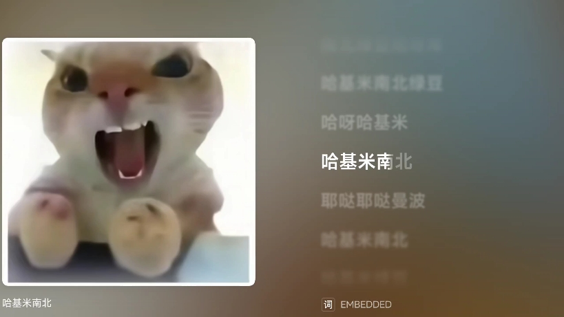 | 172 | 2025-09-21 |
| [【GTAOL】GTA配上哈基米音乐也是一种享受//绝品卫士GTS](https://www.bilibili.com/video/BV15qJRzLERe) |  | 95 | 2025-09-21 |
| [［哈基米音乐］跳起来！超级基米](https://www.bilibili.com/video/BV1xLJRz8E8z) |  | 30 | 2025-09-21 |
| [《猫舞喵呜》哈基米版【扇宝】](https://www.bilibili.com/video/BV18xJdzrE6P) |  | 2986 | 2025-09-21 |
| [【蓝莲哈】RO姬首唱哈基米音乐](https://www.bilibili.com/video/BV1zuJdzpEQV) |  | 232 | 2025-09-21 |
| [【哈基米】弯弯的月亮](https://www.bilibili.com/video/BV1s6JdzwETT) |  | 181 | 2025-09-21 |
| [关于哈基米音乐添加音频水印的一些拙见（见简介）](https://www.bilibili.com/video/BV1UtJdzgEZp) |  | 252 | 2025-09-21 |
| [⚡️哈基米音乐⚡️首次进攻🐱恋与深空区🐱](https://www.bilibili.com/video/BV1beJdzTEwW) |  | 64 | 2025-09-21 |
| [哈基米：修炼爱情](https://www.bilibili.com/video/BV1LjWAzkETZ) |  | 1060 | 2025-09-21 |
| [打游戏太无聊，唱唱哈基米的小曲](https://www.bilibili.com/video/BV19FWPzGEoC) |  | 2764 | 2025-09-21 |
| [【哈基米音乐】我哈过(我看过的最美的落日 是你陪我看海的样子)](https://www.bilibili.com/video/BV1v9WczBEev) |  | 261 | 2025-09-21 |
| [哈基米小曲](https://www.bilibili.com/video/BV1RZWAzCEkj) |  | 1 | 2025-09-21 |
| [⚡『 典 狱 司 』⚡ 古风国潮戏腔哈基米震撼来袭~](https://www.bilibili.com/video/BV1tGWPzPEdn) |  | 3383 | 2025-09-21 |
| [满足粉丝要求《哈基米》来了！](https://www.bilibili.com/video/BV1mGWPzPE7V) |  | 3.7万 | 2025-09-21 |
| [可灵AI哈基米之歌改编大赛《哈天下》参战！](https://www.bilibili.com/video/BV1FJW3zkEor) |  | 290 | 2025-09-21 |
| [【哈基米】天 后](https://www.bilibili.com/video/BV1gWWczFEiJ) |  | 1311 | 2025-09-21 |
| [【哈基米】火哈——哈耀太（完整版）](https://www.bilibili.com/video/BV1G7WczPE6Y) |  | 317 | 2025-09-21 |
| [这期视频不是哈基米的音乐。](https://www.bilibili.com/video/BV1edWczTEj7) |  | 34 | 2025-09-21 |
| [【哈基米音乐】印度神曲哈基米](https://www.bilibili.com/video/BV166Wcz7EkT) |  | 292 | 2025-09-21 |
| [【哈基米音乐】两只基米爱哈气](https://www.bilibili.com/video/BV1NGWwz4Eet) |  | 582 | 2025-09-21 |
| [【哈基米音乐播放器】拟声歌单分享｜小众app+私人歌单（评论区附链）](https://www.bilibili.com/video/BV11GWwzxE7Y) |  | 394 | 2025-09-21 |
| [传送带新音乐——哈基米！](https://www.bilibili.com/video/BV1eUpfzPEoZ) |  | 446 | 2025-09-21 |
| [【哈基米音乐】哈基米和曼波跳舞](https://www.bilibili.com/video/BV1ripfzGEFS) |  | 567 | 2025-09-21 |
| [音乐分享，哈基米起床](https://www.bilibili.com/video/BV1oCpfzqEJ9) | 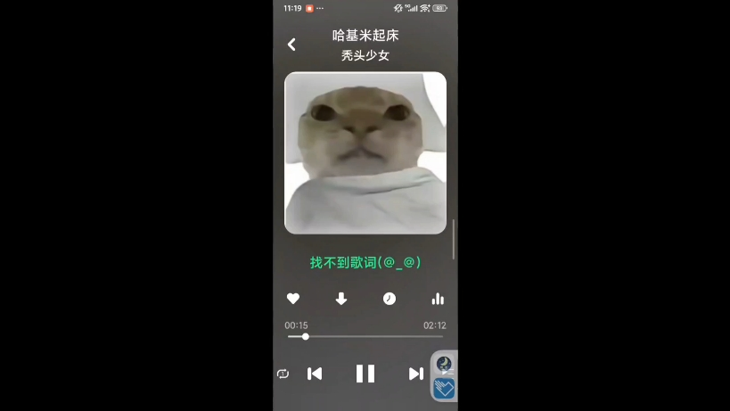 | 249 | 2025-09-21 |
| [【哈基米音乐】光哈岁月](https://www.bilibili.com/video/BV1EnWFzGEvh) |  | 7712 | 2025-09-21 |
| [哈基米音乐：特别的基米给特别的你（DJ）](https://www.bilibili.com/video/BV1pLWFz1EEY) | 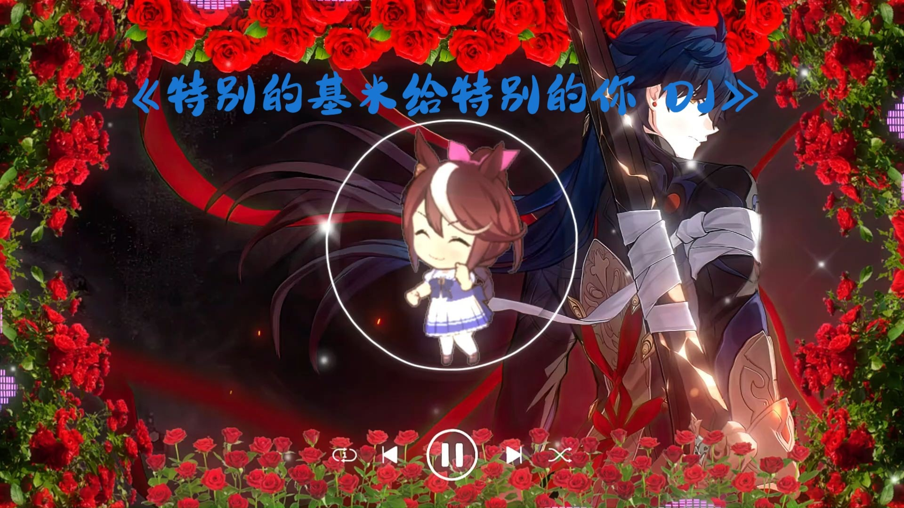 | 476 | 2025-09-21 |
| [你有这样高速运转的哈基米进入Phira](https://www.bilibili.com/video/BV1fDp9z4EgS) | 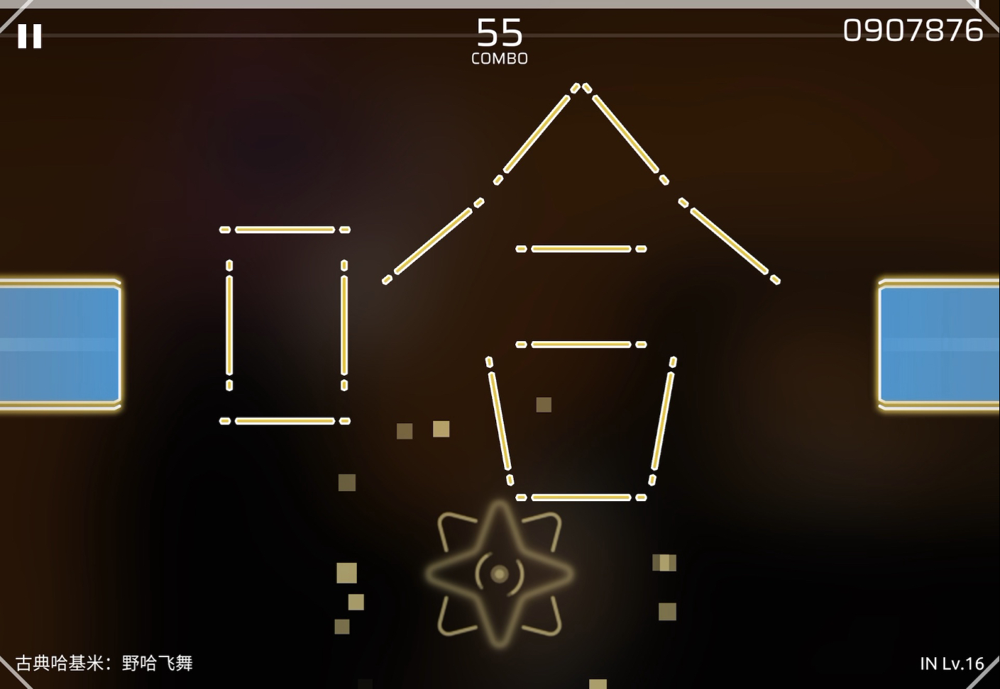 | 92 | 2025-09-20 |
| [《天上掉下个哈基米》](https://www.bilibili.com/video/BV19ApRzEEqP) |  | 258 | 2025-09-20 |
| [【哈基山的基米】越听越上头！一天不哈基浑身不得劲！！哈来哈去哈漫天！！哦卡桑！俺要成仙啦！！](https://www.bilibili.com/video/BV19PpRzmET8) |  | 570 | 2025-09-20 |
| [【哈基米音乐】宇宙基米](https://www.bilibili.com/video/BV12GpXzeEKd) |  | 134 | 2025-09-20 |
| [【哈基米FM】讨厌红楼梦](https://www.bilibili.com/video/BV1PHpXzbEcY) |  | 494 | 2025-09-20 |
| [我的哈基米](https://www.bilibili.com/video/BV1SMpXzTEfU) | 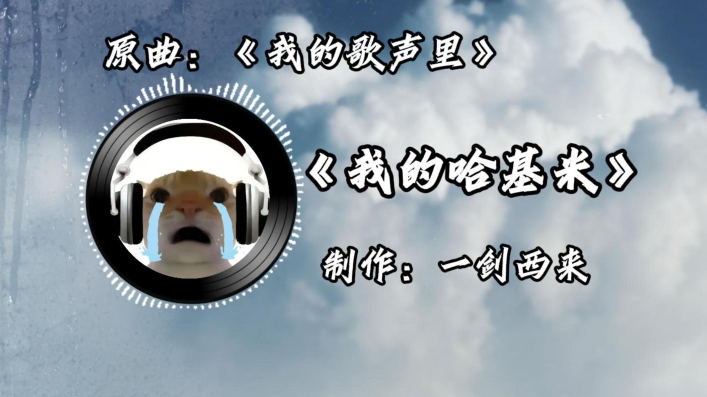 | 483 | 2025-09-20 |
| [谁懂！听到猫猫们唱喵语的救赎感！#翻唱#蓝莲花#哈基米音乐大赏](https://www.bilibili.com/video/BV156pXz5ENz) |  | 535 | 2025-09-20 |
| [音乐生献唱《基米说》](https://www.bilibili.com/video/BV1GypXzCE3Q) |  | 237 | 2025-09-20 |
| [当我在蜜雪冰城门店旁边用哈基米自定义音效，这放在整个哈基米圈里都是非常抽象的存在](https://www.bilibili.com/video/BV1LLp9zHEiw) | 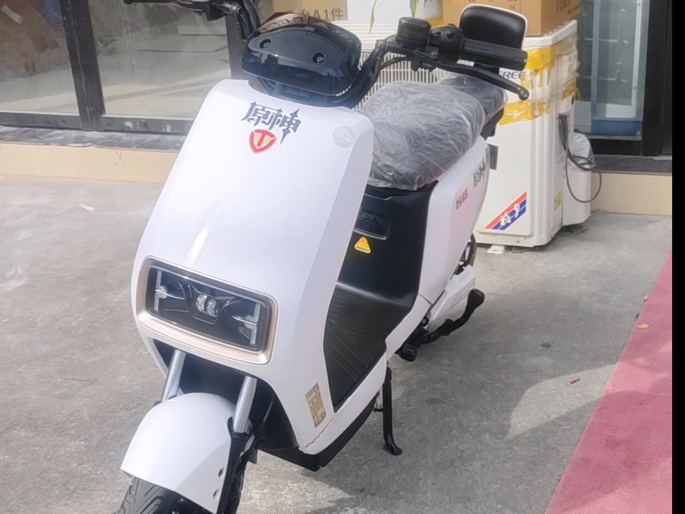 | 429 | 2025-09-20 |
| [万物皆可哈基米，今天是基米说](https://www.bilibili.com/video/BV1eipDzgEv6) |  | 431 | 2025-09-20 |
| [【切片自用】瞳姐说爱听哈基米的都是B站人，并指出有神人小星星投稿天天放哈基米音乐](https://www.bilibili.com/video/BV1rApQzQEnC) |  | 1.5万 | 2025-09-20 |
| [哈基米音乐《基米说》（唱的真的很不好）](https://www.bilibili.com/video/BV1wHWLzoEX2) | 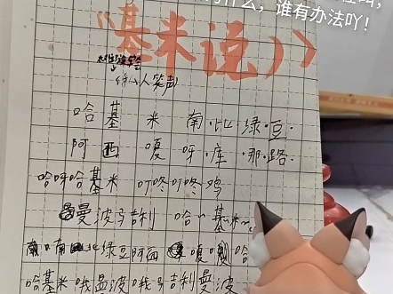 | 352 | 2025-09-19 |
| [{哈基米音乐}史上最粗糙等你下课](https://www.bilibili.com/video/BV1qMW5z2Et4) |  | 97 | 2025-09-19 |
| [《 东 京 哈 基 米 》](https://www.bilibili.com/video/BV1UQWPzqEd4) |  | 1011 | 2025-09-19 |
| [[哈基米音乐]沙雕动画-修仙的悠闲的小曲](https://www.bilibili.com/video/BV1sFWNzwEej) |  | 1097 | 2025-09-18 |
| [【纯净哈基米音乐】基米同在——Always with chimi（永远同在 Always with me）](https://www.bilibili.com/video/BV1M9pez9E9Z) |  | 703 | 2025-09-18 |
| [【基米FM】荒野大哈客FC](https://www.bilibili.com/video/BV1tKptzaEfp) |  | 127 | 2025-09-17 |
| [【夏露露】阿姨请我上冰火？那我唱哈基米音乐，这下请高人都没用了](https://www.bilibili.com/video/BV1sGptztE86) |  | 4643 | 2025-09-17 |
| [太爽了，一打开b站不是男娘就是哈基米音乐](https://www.bilibili.com/video/BV1bwpxz4EgP) |  | 123 | 2025-09-17 |
| [【劉俊朗】朗宝哈基米音乐梅开二度，不愧是最懒羊羊的哈基朗](https://www.bilibili.com/video/BV13DpCzmETQ) |  | 2240 | 2025-09-16 |
| [【整活向】哈基米音源开发计划](https://www.bilibili.com/video/BV11ZpTzKEuG) |  | 384 | 2025-09-15 |
| [日本人听到的哈基米音乐belike](https://www.bilibili.com/video/BV1AgpAzXEq4) |  | 10.1万 | 2025-09-14 |
| [煮啵已经沉迷哈基米音乐无法自拔了](https://www.bilibili.com/video/BV1ZJpAz1EYt) |  | 678 | 2025-09-14 |
| [日本人听了哈基米音乐belike：](https://www.bilibili.com/video/BV1aLH8zgEND) |  | 2.4万 | 2025-09-11 |
| [【哈基米音乐】♿欧泊举重冠军-哈激米♿](https://www.bilibili.com/video/BV1njH9zoEy1) |  | 2084 | 2025-09-10 |
| [【哈基米音乐】曼波不行（恋人不行）](https://www.bilibili.com/video/BV1uSadzuEGX) |  | 465 | 2025-09-08 |
| [哈基米音乐，原音频来源音符@yun_7](https://www.bilibili.com/video/BV1EgY7zLEky) | 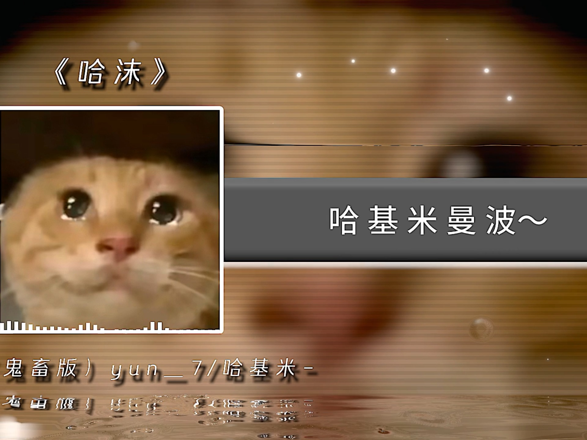 | 809 | 2025-09-07 |
| [哈基米  clannad《馬鹿ふたり》](https://www.bilibili.com/video/BV1x8YLz9ETF) |  | 1862 | 2025-09-07 |
| [探故知，但是哈基米音乐【音MAD】](https://www.bilibili.com/video/BV1AtY3zzEAv) |  | 1024 | 2025-09-07 |
| [［kig］给大家炫耀一下新做的帽子和哈基米音乐](https://www.bilibili.com/video/BV1NEaYzwEKp) |  | 5619 | 2025-09-05 |
| [【环世界】哈基米背景音乐系列之 Moving On](https://www.bilibili.com/video/BV1JfhCzDEst) |  | 1.4万 | 2025-08-31 |
| [【伪人大翻唱】这期是我定制的户外哈基米音乐](https://www.bilibili.com/video/BV175hzzNEQy) |  | 2.0万 | 2025-08-30 |
| [【扒谱】哈基米山歌](https://www.bilibili.com/video/BV1rphizwEjf) |  | 195 | 2025-08-30 |
| [也是在游戏里演奏上哈基米音乐了](https://www.bilibili.com/video/BV12Hh9zdE8E) |  | 9741 | 2025-08-29 |
| [【月铃姬乃】听《哈基米迪斯科》，唱起哈基米歌曲，哈基米喔南北绿豆～](https://www.bilibili.com/video/BV1MMe1z5E4F) |  | 5690 | 2025-08-27 |
| [哈基米呀那没路多～](https://www.bilibili.com/video/BV1Ree3ztEtb) |  | 1590 | 2025-08-20 |
| [【哈基米音乐】天上掉下个基八戒](https://www.bilibili.com/video/BV15eeFzfEfH) |  | 1860 | 2025-08-19 |
| [【哈基米音乐】Let Manbo Know（Let Me Know）](https://www.bilibili.com/video/BV1cNYbzEEN9) |  | 681 | 2025-08-18 |
| [[哈基米音乐] 进入哈基圣巢 哈洞骑士主题曲 Enter Hallownest](https://www.bilibili.com/video/BV12KY2z6ECC) | 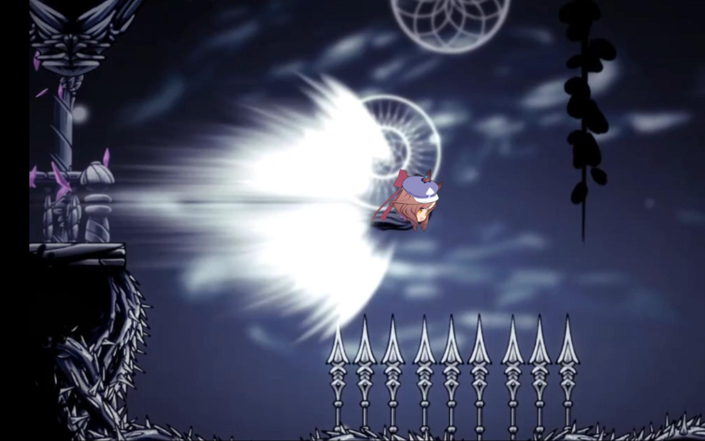 | 1.1万 | 2025-08-17 |
| [【哈基米音乐】サイエンス（科学）【无止境基米电台Day4】](https://www.bilibili.com/video/BV1w2YkzZEeq) |  | 3.3万 | 2025-08-17 |
| [哈基迷境大饭店【古典哈基米】](https://www.bilibili.com/video/BV1uxbszCEUj) |  | 6.6万 | 2025-08-16 |
| [纯净哈基米：ELDEN RING - The Final Battle （请看简介）](https://www.bilibili.com/video/BV12rbKzSEGZ) |  | 4.1万 | 2025-08-11 |
| [外国人对哈基米音乐的看法](https://www.bilibili.com/video/BV1RWbKzwEqo) | 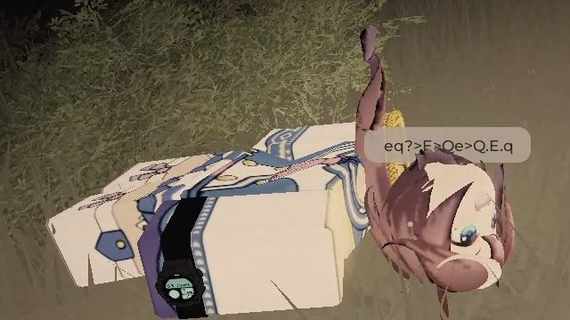 | 2.5万 | 2025-08-10 |
| [⚡哈基米音乐⚡曼波曼波~一起来哈气吧](https://www.bilibili.com/video/BV1TUt4zkEqn) |  | 2.9万 | 2025-08-09 |
| [【哈基米FM】猫儿这个壮志凌云](https://www.bilibili.com/video/BV1UGhKz4E5S) |  | 6642 | 2025-08-03 |
| [【哈基米音乐】😼你听你也摇😼原神-奥摩斯港BGM（喧繁之港）](https://www.bilibili.com/video/BV18w8TzFEio) |  | 4.1万 | 2025-07-24 |
| [压迫感の哈基米：Empathy](https://www.bilibili.com/video/BV1CVgKzPEDs) |  | 35.4万 | 2025-07-18 |
| [【哈基米FM】超级哈基米](https://www.bilibili.com/video/BV1mkMdz6EsQ) |  | 5935 | 2025-07-12 |
| [【哈基米音乐】耄耋的猛攻《ルフィ猛攻！(路飞的猛攻)》](https://www.bilibili.com/video/BV1JeGPzfEH5) |  | 3.6万 | 2025-07-09 |
| [哈基米底层代码发力了](https://www.bilibili.com/video/BV1up3VzNEXo) | 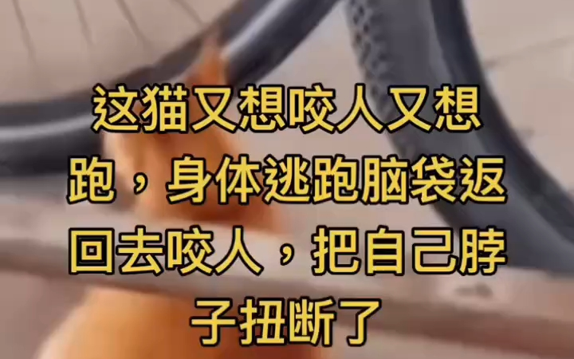 | 6.0万 | 2025-07-04 |
| [【哈基米音乐】老北京の小曲AUV](https://www.bilibili.com/video/BV1et3MzxEfE) |  | 3.2万 | 2025-07-03 |
| [废物哈基米面对两条萌犬，善意哈气弓背反被揍](https://www.bilibili.com/video/BV1JQ3KzwECL) |  | 861 | 2025-07-03 |
| [【哈基米音乐】🧡可爱又迷人的基米💛](https://www.bilibili.com/video/BV1FE3YzzEdk) |  | 1.9万 | 2025-07-03 |
| [哈基米:那叫一个槟榔爽](https://www.bilibili.com/video/BV1XM3nzoEDc) | 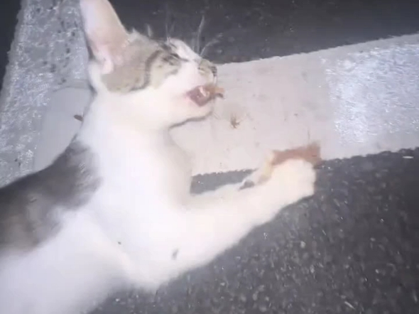 | 33.8万 | 2025-07-01 |
| [哈基米音乐：Over &quot;Quartzer&quot;](https://www.bilibili.com/video/BV1bYKDzsEav) |  | 2.9万 | 2025-06-25 |
| [异世界耄耋🐱哈基米音乐Anxiety](https://www.bilibili.com/video/BV1VCNRzgEUt) | 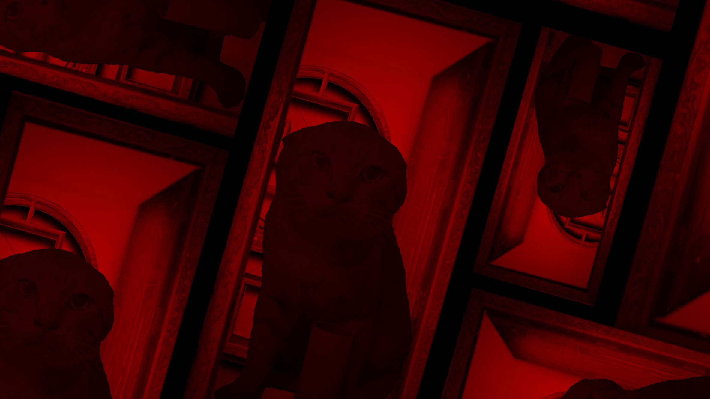 | 35.9万 | 2025-06-22 |
| [最好听的哈基米](https://www.bilibili.com/video/BV1EfMcz3EhM) |  | 3.1万 | 2025-06-12 |
| [【哈基米x绝地潜兵2】哈气潜兵(A cup of Liber-tea)](https://www.bilibili.com/video/BV1PsT2zMEFU) |  | 3.4万 | 2025-06-07 |
| [🎵Savage Love🎵哈基米Beat](https://www.bilibili.com/video/BV1mFjTzWEoT) |  | 63.9万 | 2025-05-25 |
| [【哈基米FM】脑袋空空的小曲(纯净哈基米)](https://www.bilibili.com/video/BV1VYVVzLEyB) |  | 2.7万 | 2025-05-03 |
| [【哈基米音乐】brutal](https://www.bilibili.com/video/BV1JTG9zhE6j) |  | 18.2万 | 2025-04-30 |
| [[哈基米音乐] 地平线4开场音乐 a 曼波 apart 【试听版】](https://www.bilibili.com/video/BV1asoqY6Ej8) |  | 5.8万 | 2025-03-23 |
| [【补档】哈基米音乐：哈基打歌](https://www.bilibili.com/video/BV1G4wSexEdY) |  | 32.6万 | 2025-02-16 |
| [【哈基米音乐】成为魔法耄耋吧！（成为魔法少女吧！）](https://www.bilibili.com/video/BV1kYNqeCEAm) |  | 2.5万 | 2025-02-11 |
| [【哈基米乐】🎵Whataya Want from Manbo🎵你想要曼波怎么做](https://www.bilibili.com/video/BV1jxcVe4End) |  | 5.0万 | 2025-01-12 |
| [使命召唤：哈基米行动6](https://www.bilibili.com/video/BV1qEUkYrEAA) |  | 13.1万 | 2024-11-17 |
| [两只看起来很眼熟的哈基米](https://www.bilibili.com/video/BV1d5pneYEPj) |  | 48.1万 | 2024-09-09 |
| [疯狂的哈基米音乐之Axel F ｜ 基米合战应援作](https://www.bilibili.com/video/BV1MCYLevENv) |  | 26.1万 | 2024-08-10 |
| [♪哈基米音乐——At The Edge♪](https://www.bilibili.com/video/BV1HE421G7ZM) | 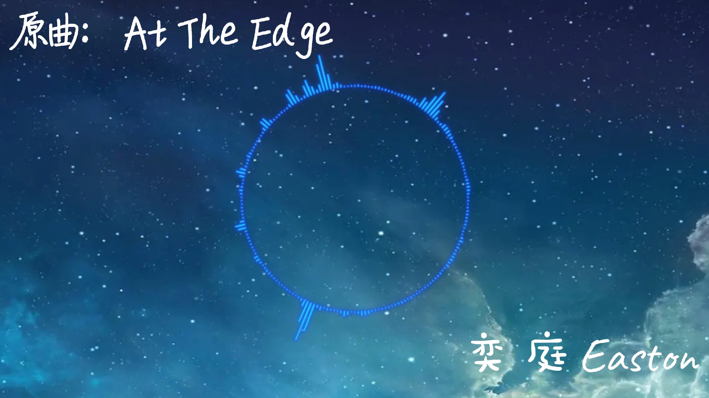 | 11.9万 | 2024-05-16 |

---
*最后更新: 2025-09-22 02:39:32 (自动生成)*
*数据来源: [Bilibili](https://www.bilibili.com)*

## 使用说明

运行以下命令更新视频列表:
```bash
python3 fetch_hajimi_videos.py
```
