# awesome-hajimi
collections of hajimi (哈基米 in Chinese) on the Internet.

## 视频列表 (Video List)

| 视频标题 (Title) | 封面 | 播放量 (Views) | 发布日期 (Date) |
|---|---|---|---|
| [突然意识到teto新声线适合搞哈基米音乐](https://www.bilibili.com/video/BV149SWBMEkA) |  | 5 | 2025-12-02 |
| [哈基米：🐱ALL MY FELLAS🐱](https://www.bilibili.com/video/BV17RSmBREiy) |  | 212 | 2025-12-02 |
| [哈基米揮揮手](https://www.bilibili.com/video/BV15vSHBkEn3) | 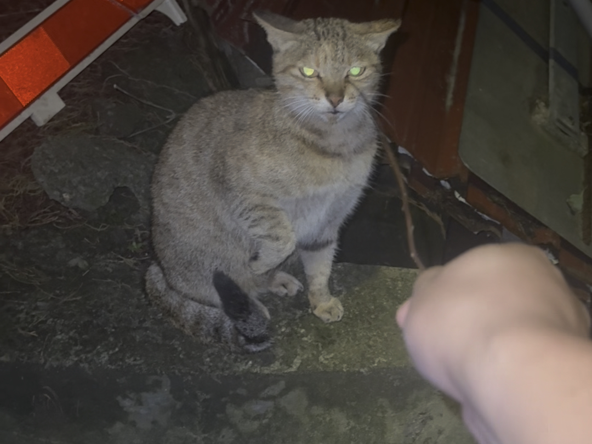 | 168 | 2025-12-01 |
| [哈基米](https://www.bilibili.com/video/BV1WLSHBxEyQ) |  | 16 | 2025-12-01 |
| [【11月】哈基米音乐排行榜#14](https://www.bilibili.com/video/BV1XHSpBgECG) |  | 3.3万 | 2025-12-01 |
| [哈基米之吻](https://www.bilibili.com/video/BV1E9SmBxE8S) |  | 104 | 2025-12-01 |
| [你们有这样好玩的哈基米吗？](https://www.bilibili.com/video/BV13HS1BzEyC) |  | 26 | 2025-12-01 |
| [给哈基米来根南北绿豆](https://www.bilibili.com/video/BV1bUSyBwEvY) | 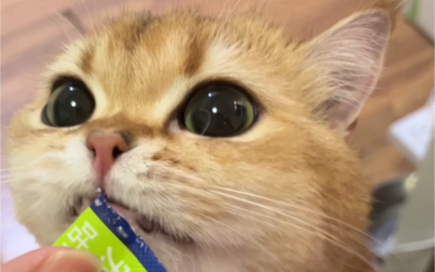 | 706 | 2025-12-01 |
| [悲伤曼波逆流成河](https://www.bilibili.com/video/BV15ES1BkEku) |  | 8.4万 | 2025-12-01 |
| [【哈基米】灵魂战耄[GhostRiders In The Sky]](https://www.bilibili.com/video/BV1gtS1BvEsR) |  | 195 | 2025-12-01 |
| [树海看蔡喵ai如何评价EVA是最被高估的动画：好强的攻击性！这真是蔡喵在后面打字吧【树海忆者】](https://www.bilibili.com/video/BV1RLS1BCEtR) |  | 1.5万 | 2025-12-01 |
| [（哈基米南北绿豆）](https://www.bilibili.com/video/BV1HCS1BsERb) |  | 30 | 2025-12-01 |
| [哈基米](https://www.bilibili.com/video/BV1jXS1BEEoQ) |  | 1240 | 2025-12-01 |
| [【10月下半至11月底】哈基米&quot;关键词&quot;新视频每日动态榜](https://www.bilibili.com/video/BV1uuS2BqEix) | 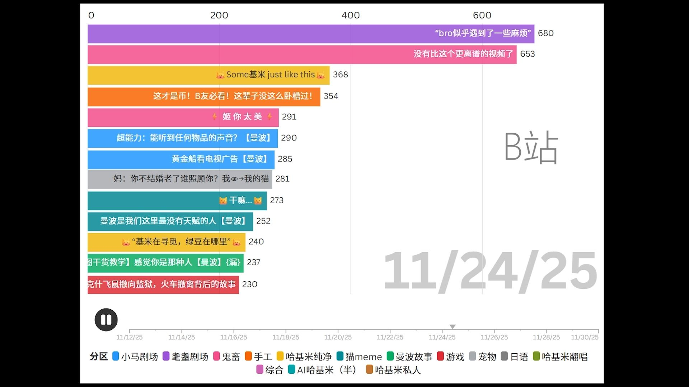 | 380 | 2025-12-01 |
| [哈基米](https://www.bilibili.com/video/BV1y7S2BcESV) |  | 3 | 2025-12-01 |
| [【补档】大理塘是哈的基米](https://www.bilibili.com/video/BV1QNS2BuEF8) |  | 231 | 2025-12-01 |
| [哈基米南北绿豆](https://www.bilibili.com/video/BV1ejSCBNEvP) |  | 2430 | 2025-12-01 |
| [【哈基米】哈气蜃楼多像个童话](https://www.bilibili.com/video/BV1RQSCBgEo4) |  | 9816 | 2025-12-01 |
| [原力哈基米！愿原力与你同在](https://www.bilibili.com/video/BV1ZUSCBGErt) |  | 1.2万 | 2025-12-01 |
| [哈基米排行!第二期!](https://www.bilibili.com/video/BV1EUSCBVE8h) | 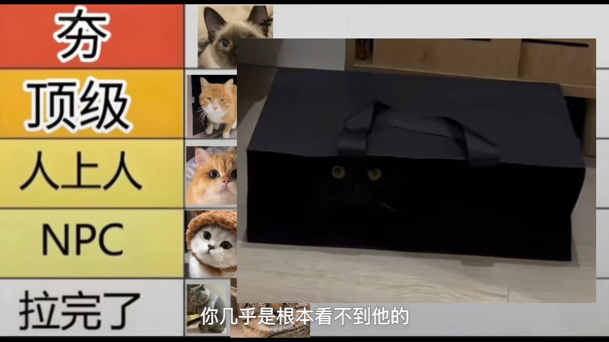 | 50 | 2025-12-01 |
| [【龟宝】一款基于哈基米计算方法研发的亚军语音](https://www.bilibili.com/video/BV19RSCBMEpM) |  | 8217 | 2025-12-01 |
| [『零_夜时之巫女乐队』20251130 哈基米ACG拼盘  声音共和昨日世界酒馆](https://www.bilibili.com/video/BV1TTSkBpEhm) |  | 171 | 2025-12-01 |
| [哈基米勇闯异世界——哈基米传奇03_第二章奶龙之刃](https://www.bilibili.com/video/BV12NSkBXEey) |  | 1130 | 2025-12-01 |
| [【老吴基米TV】盘点网络热门老吴哈基米合集](https://www.bilibili.com/video/BV19RSrB8E4J) |  | 1511 | 2025-12-01 |
| [【完整版】哈基米：Montagem Miau🐱](https://www.bilibili.com/video/BV1xwSBBgEVx) |  | 3.0万 | 2025-12-01 |
| [叮咚鸡：青藏搞原](https://www.bilibili.com/video/BV1evSkBAEto) |  | 4.3万 | 2025-12-01 |
| [久等了各位~基米小学第二集英语版来了（原作者：@意大利面伴卤蛋）](https://www.bilibili.com/video/BV1C5SkB2Eha) |  | 1262 | 2025-12-01 |
| [【哈基米】基米哈一下（兄弟抱一下）](https://www.bilibili.com/video/BV1KiSiBTEmk) |  | 586 | 2025-12-01 |
| [哈基米：换你你精神也不好啊](https://www.bilibili.com/video/BV1tCSkBoE4b) |  | 7.2万 | 2025-12-01 |
| [哈基米德哈气实验和左手神人持猫法](https://www.bilibili.com/video/BV1t2SkBRExD) | 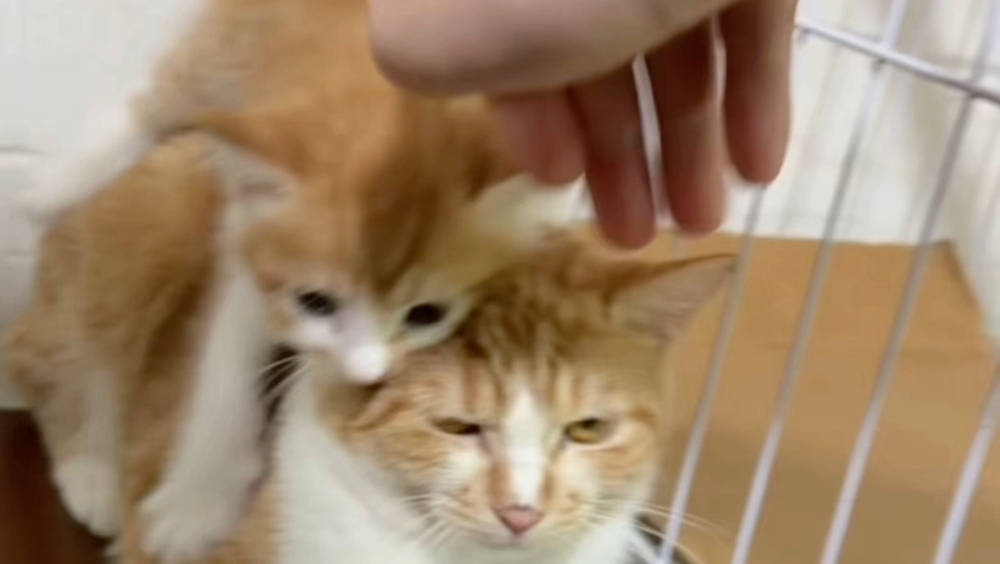 | 2.1万 | 2025-12-01 |
| [哈基米拒绝职场霸凌](https://www.bilibili.com/video/BV1xPS6B2EtG) |  | 6131 | 2025-12-01 |
| [他们在用一种很新的手法撸猫！](https://www.bilibili.com/video/BV1UoSqBkEAS) |  | 7.6万 | 2025-12-01 |
| [［崩铁赛飞儿cos］我觉得哈基米强度很高](https://www.bilibili.com/video/BV1AtSzB3EJB) |  | 5018 | 2025-11-30 |
| [基米一哈真名世，千载谁堪曼波间](https://www.bilibili.com/video/BV17BSqBdEj7) |  | 182 | 2025-11-30 |
| [我的哈基米非常有耐心](https://www.bilibili.com/video/BV1NnSqBMELs) | 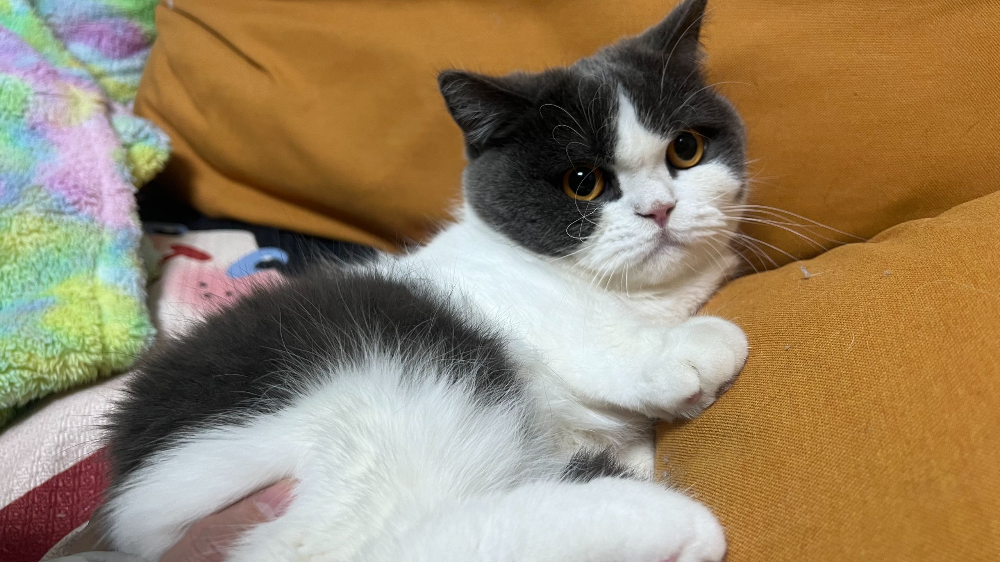 | 202 | 2025-11-30 |
| [哈基米挖矿。](https://www.bilibili.com/video/BV1SdSqBVEEn) |  | 148 | 2025-11-30 |
| [盘点六首哈基米音乐](https://www.bilibili.com/video/BV1ggSvBTEFB) | 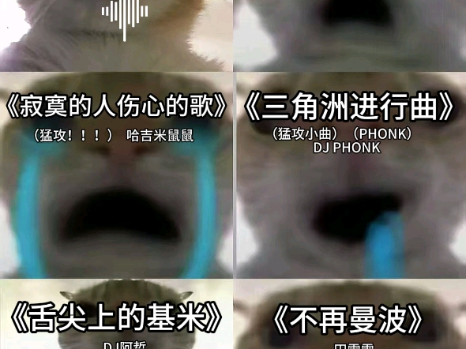 | 137 | 2025-11-30 |
| [弱智吧集体流出（55）](https://www.bilibili.com/video/BV1E8SvBWEJy) |  | 13.7万 | 2025-11-30 |
| [哈基米助眠丨用黏糊的道具搅拌你的脑袋](https://www.bilibili.com/video/BV1s1SKBDEQk) | 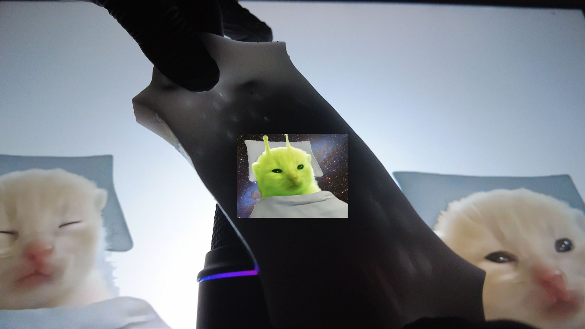 | 1692 | 2025-11-30 |
| [【哈基米】代码是这样写的](https://www.bilibili.com/video/BV1wPSiBcEfk) | 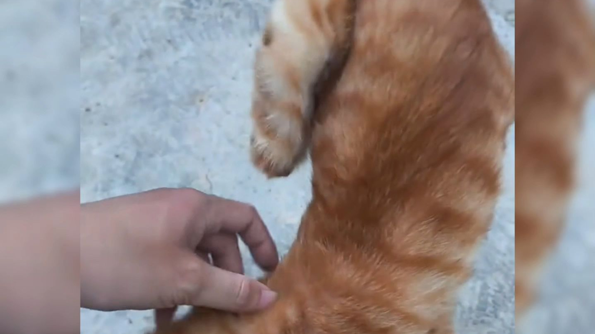 | 2589 | 2025-11-30 |
| [哈基米大冒险部分内容透露[基础魔改篇]](https://www.bilibili.com/video/BV1wPSiBcEvn) |  | 2410 | 2025-11-30 |
| [宿 舍 早 起 人 士 ！](https://www.bilibili.com/video/BV1NbSTBnEgt) |  | 32.5万 | 2025-11-30 |
| [“惹得天怒地也恼 人间再无大狗叫”](https://www.bilibili.com/video/BV16KSiBZEWW) | 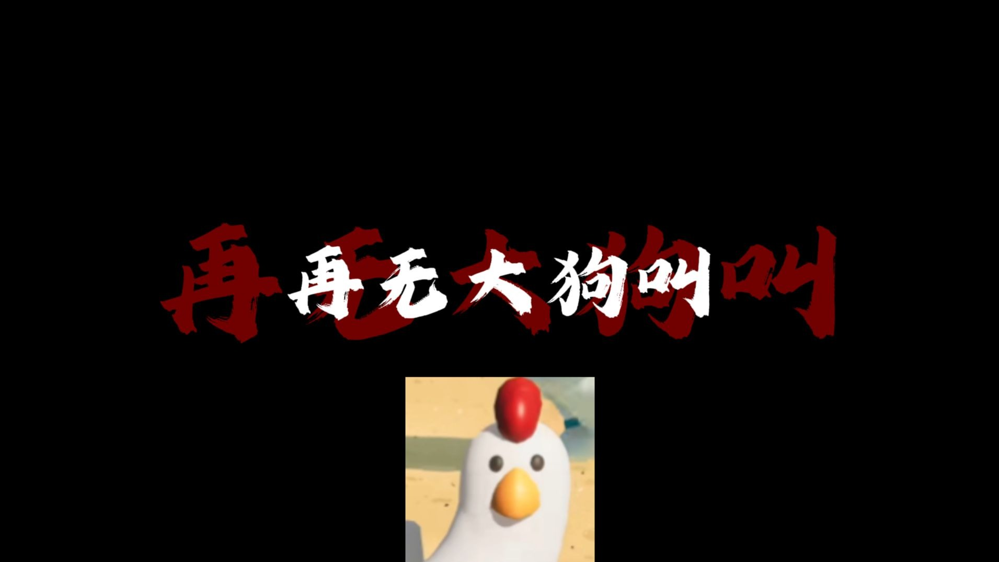 | 9.5万 | 2025-11-30 |
| [🐱疯狂基米城2——《Zoo》🐱（完整版）](https://www.bilibili.com/video/BV1EGSiBREyB) |  | 1.5万 | 2025-11-30 |
| [⚡我剪的时候已经绷不住了⚡](https://www.bilibili.com/video/BV1pYSTBmEh1) |  | 1.6万 | 2025-11-30 |
| [【哈基米音乐】😿The Rain - 久石让😿](https://www.bilibili.com/video/BV1FiSTB1Eb7) |  | 477 | 2025-11-30 |
| [🐱三 国 哈🐱](https://www.bilibili.com/video/BV1mpUdBREXf) | 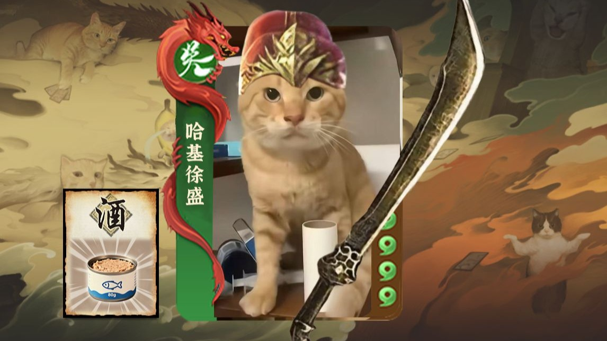 | 6.4万 | 2025-11-30 |
| [山东甜妹er给你贴耳哄睡💗~超贴耳触发词~口水音~在耳朵里环绕~曼啵、哈基米、daisuki、杂鱼等~包含一部分方言助眠~小潮巴等~Hi-Res无损-圆圆助眠](https://www.bilibili.com/video/BV1kdUfBfEzi) |  | 1.7万 | 2025-11-30 |
| [【哈基米FM】舌尖上的基米（第二季）：劳作的春夏秋](https://www.bilibili.com/video/BV1ntScBoEND) |  | 1250 | 2025-11-30 |
| [【完结版】人猫大战完整结局版](https://www.bilibili.com/video/BV1RBSABoEBG) |  | 3.2万 | 2025-11-30 |
| [哈基米音乐《Familiar》](https://www.bilibili.com/video/BV1N7ScBeEE5) |  | 91 | 2025-11-29 |
| [哈基米吃马蜂被蛰出痛苦面具](https://www.bilibili.com/video/BV1GCScB2EEH) |  | 4239 | 2025-11-29 |
| [小基米：哈气还用教？](https://www.bilibili.com/video/BV1PcSwBNE9c) | 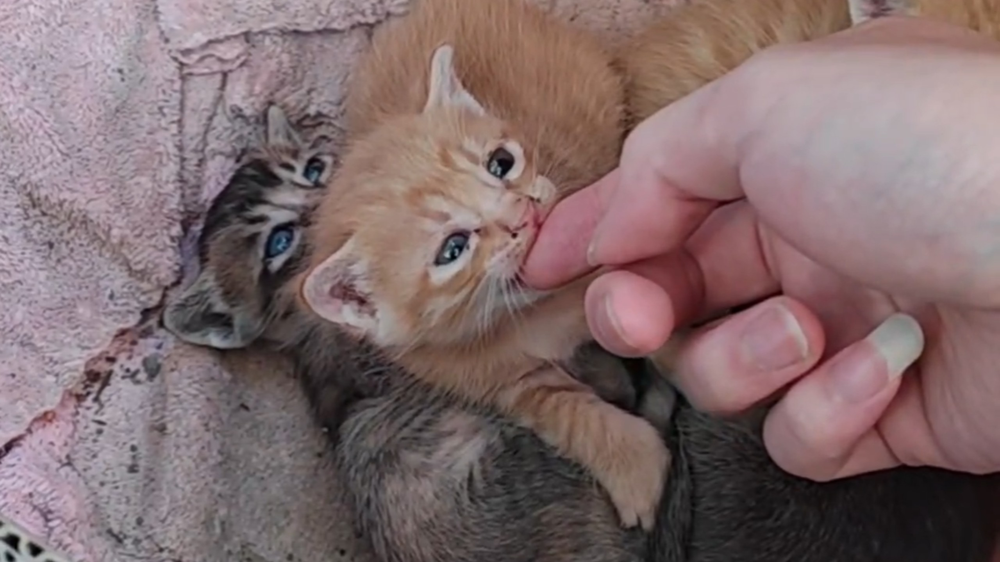 | 2753 | 2025-11-29 |
| [[补档]纯净哈基米：我们好像在哪见过](https://www.bilibili.com/video/BV1QsSwBmERH) |  | 1425 | 2025-11-29 |
| [哈基米：喔第一次我 说哈你的时候🐱](https://www.bilibili.com/video/BV1sYSFBeEd7) |  | 856 | 2025-11-29 |
| [基米小学：耄耄的作业风波](https://www.bilibili.com/video/BV148SFBiEuD) |  | 1604 | 2025-11-29 |
| [公益短片：妈妈洗脚](https://www.bilibili.com/video/BV15ZSFB7EfC) |  | 22.4万 | 2025-11-29 |
| [「欧若哈」 你哈？我哈？咱哈？](https://www.bilibili.com/video/BV1RuUZBGEhh) |  | 3576 | 2025-11-29 |
| [【猫meme】史上最全电子猫全明星](https://www.bilibili.com/video/BV1HaUdBUEbk) |  | 6.2万 | 2025-11-29 |
| [“  如果我是基米，你会爱我吗？ ”](https://www.bilibili.com/video/BV1keUdB7EZe) |  | 4.0万 | 2025-11-29 |
| [【哈基FUNK】“哈气让你飞起来！”Montagem Nada Tropica](https://www.bilibili.com/video/BV1TmSJBdEpE) |  | 4324 | 2025-11-29 |
| [为什么大型猫科动物中只有猎豹被称为大型哈基米？也更亲近人类？ 也比其他大型猫科动物更为亲近人类？](https://www.bilibili.com/video/BV139UdBeE7g) |  | 2.1万 | 2025-11-29 |
| [哈基米官方完整版](https://www.bilibili.com/video/BV1uFUoB8EEJ) |  | 947 | 2025-11-29 |
| [哈基米舔毛的时候当场弄回去会怎么样？](https://www.bilibili.com/video/BV1jyUdB6ENq) |  | 584 | 2025-11-29 |
| [哈基米：🎵荷塘哈基🎵](https://www.bilibili.com/video/BV1g9U9BdEgb) |  | 9012 | 2025-11-29 |
| [我收集了全部哈基米南北绿豆食物！最抽象的一集！](https://www.bilibili.com/video/BV1XhURB8EJd) |  | 28.1万 | 2025-11-29 |
| [《动物：人类是益虫》](https://www.bilibili.com/video/BV1SESEBdErV) | 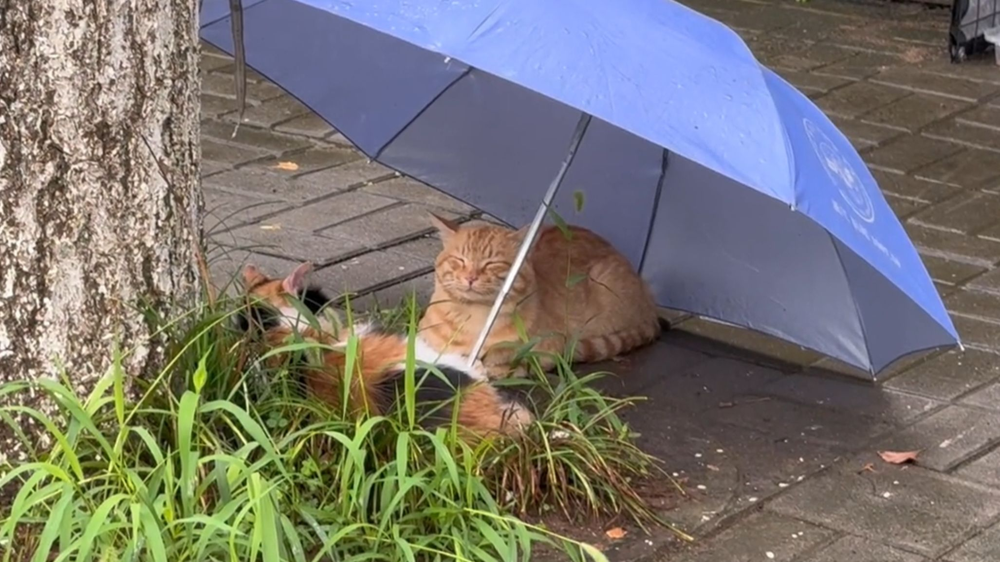 | 131.8万 | 2025-11-29 |
| [哈基米你吃饭扒拉牛魔呢](https://www.bilibili.com/video/BV1BFUdB6Ez1) | 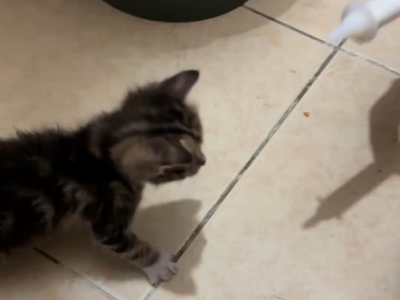 | 1810 | 2025-11-28 |
| [哈上月球，不死之咪](https://www.bilibili.com/video/BV1U5SjBDEo5) |  | 1.5万 | 2025-11-28 |
| [哈～基～米～](https://www.bilibili.com/video/BV1syUaBpE2f) | 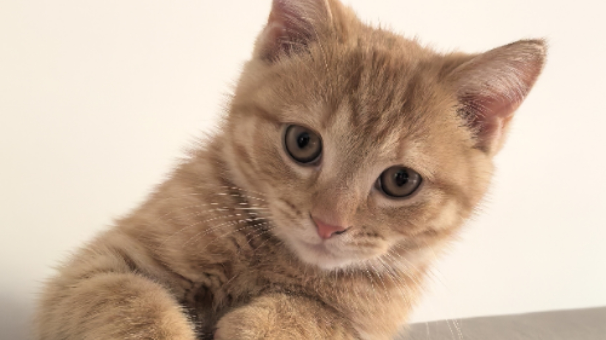 | 2355 | 2025-11-28 |
| [《往事只能哈基米》](https://www.bilibili.com/video/BV1FRSLBvELG) |  | 3234 | 2025-11-28 |
| [【致富经】村民驯化外星哈基米，助力乡村发展](https://www.bilibili.com/video/BV1qMSuBkEzr) |  | 16.5万 | 2025-11-28 |
| [弱智吧记者拷打神人视频泄露流出#3](https://www.bilibili.com/video/BV1n3S7BkEdB) |  | 270.8万 | 2025-11-28 |
| [耄耋：听说你逢人便说我死了？](https://www.bilibili.com/video/BV17cSjBhEgT) | 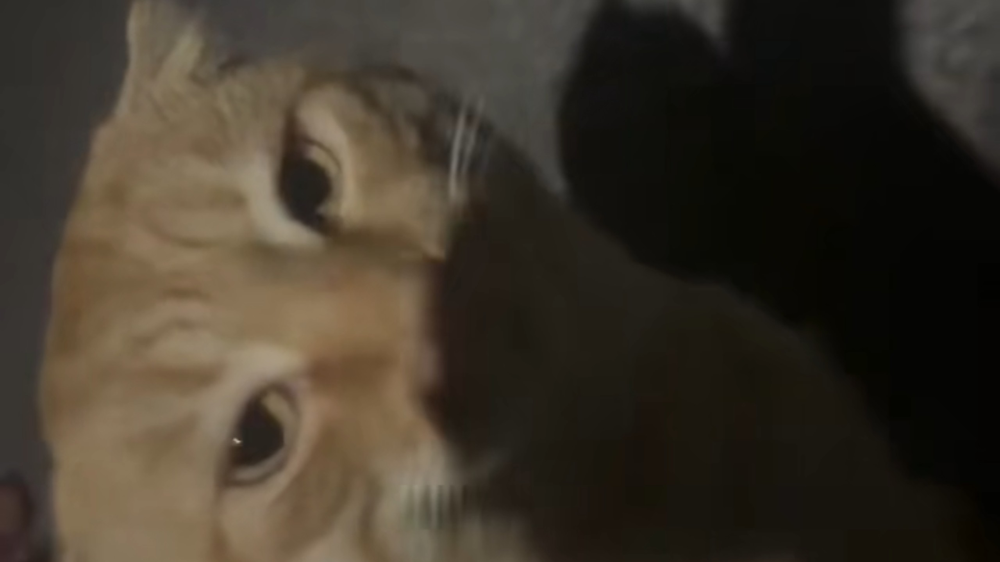 | 2.7万 | 2025-11-28 |
| [哈基米励志小曲🎵go again🎵](https://www.bilibili.com/video/BV16YSjBBEtq) |  | 6935 | 2025-11-28 |
| [爱你的鼻孔喵喵 小猫劲舞](https://www.bilibili.com/video/BV16hS5BwE6b) | 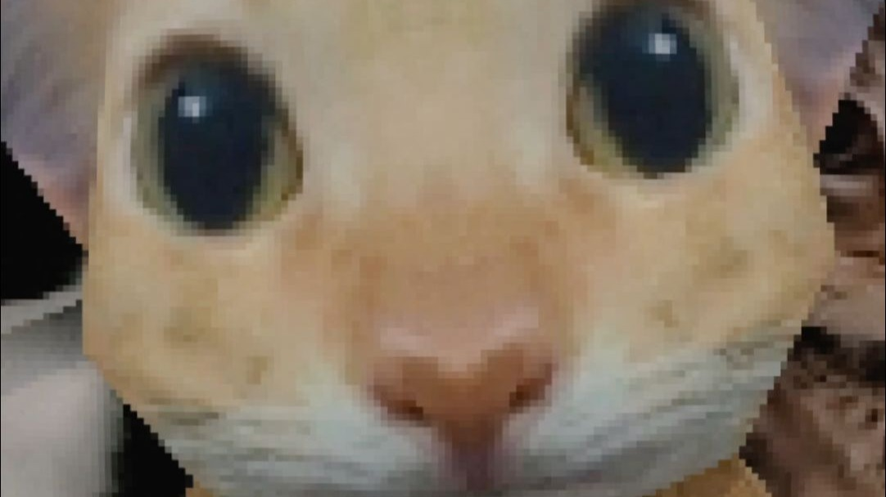 | 6.4万 | 2025-11-28 |
| [来自喵星的神秘咒语](https://www.bilibili.com/video/BV1cQSLBqEeW) | 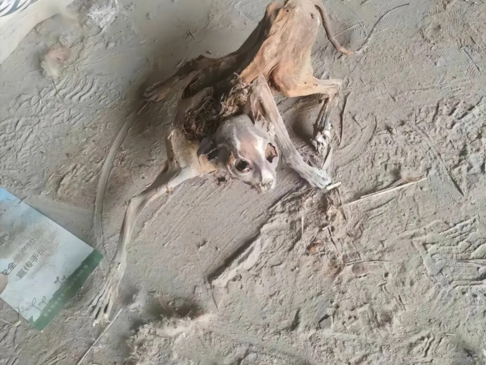 | 9.1万 | 2025-11-28 |
| [闪光の哈基米](https://www.bilibili.com/video/BV1VQSTBvEbn) |  | 12.7万 | 2025-11-27 |
| [【ヨルシカ×哈基米音乐】夜鹿厨大冒险（整活向）](https://www.bilibili.com/video/BV1tnUYBZE4p) |  | 3.8万 | 2025-11-26 |
| [翻唱:哈基山的基米美如水](https://www.bilibili.com/video/BV1QWUDBUE8v) |  | 3.8万 | 2025-11-25 |
| [【哈基米曼波】【日推歌单】｜ “实惠又美味！”｜ 《印度哈基米》](https://www.bilibili.com/video/BV1YCUQBRE6G) |  | 446 | 2025-11-25 |
| [【The High Court】高级感哈基米](https://www.bilibili.com/video/BV1u1USB1EpZ) |  | 2425 | 2025-11-25 |
| [小黑也要miao miao 这才是真正的猫meme！](https://www.bilibili.com/video/BV13MUkBZEah) |  | 10.2万 | 2025-11-24 |
| [☝🤓起 飞⚡⚡⚡](https://www.bilibili.com/video/BV1XvUsBLE5B) |  | 218.8万 | 2025-11-22 |
| [脊背龙形态己开启](https://www.bilibili.com/video/BV17sUVBWECe) | 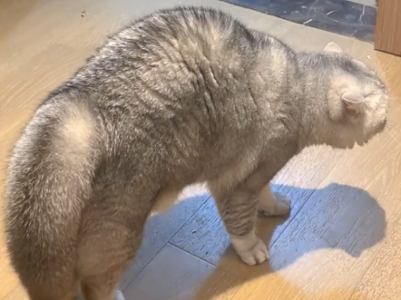 | 14.2万 | 2025-11-21 |
| [如来《Money Back My Home》MV首发激情献唱！](https://www.bilibili.com/video/BV1rBCsB1E42) |  | 391.4万 | 2025-11-13 |
| [“万恶之源”哈基米原版！](https://www.bilibili.com/video/BV1pGhRzQEYr) |  | 522 | 2025-08-29 |
| [哈基米万恶之源](https://www.bilibili.com/video/BV1dkeLzBEFF) |  | 104 | 2025-08-24 |
| [【FM83.0 无止境基米电台】Day4 术力口哈基米](https://www.bilibili.com/video/BV1Aw4dzCEFu) |  | 14.8万 | 2025-08-06 |
| [哈基米和哈基汪这个可爱](https://www.bilibili.com/video/BV14ttjzjEQ9) | 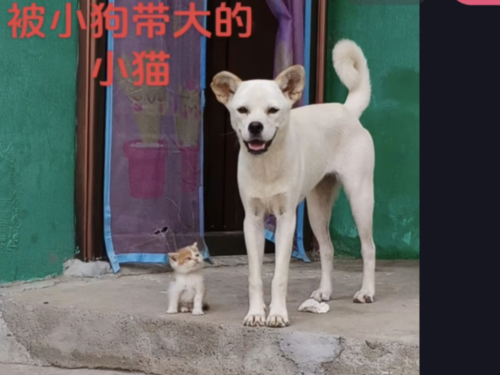 | 6.8万 | 2025-08-05 |
| [哈基米万恶之源](https://www.bilibili.com/video/BV1jY8nzjEoc) | 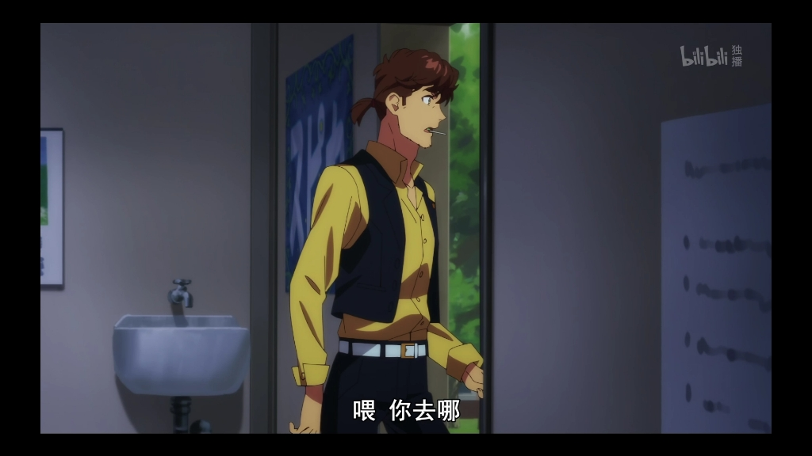 | 103 | 2025-07-28 |
| [【星穹铁道】赛飞儿耄耋](https://www.bilibili.com/video/BV1VD3azZERT) |  | 38.4万 | 2025-07-03 |
| [神人基米，拼尽全力无法战胜](https://www.bilibili.com/video/BV1TWKyzTEyw) | 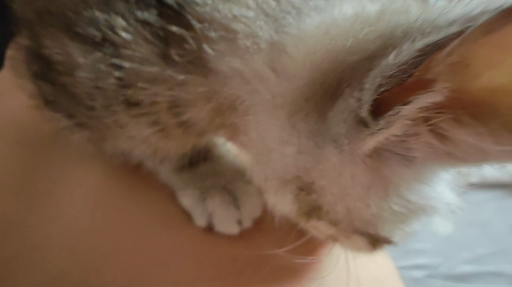 | 9.4万 | 2025-06-28 |
| [可怜的哈基米变成了猫饼(•̩̩̩̩＿•̩̩̩̩)](https://www.bilibili.com/video/BV1evNDzFEuU) | 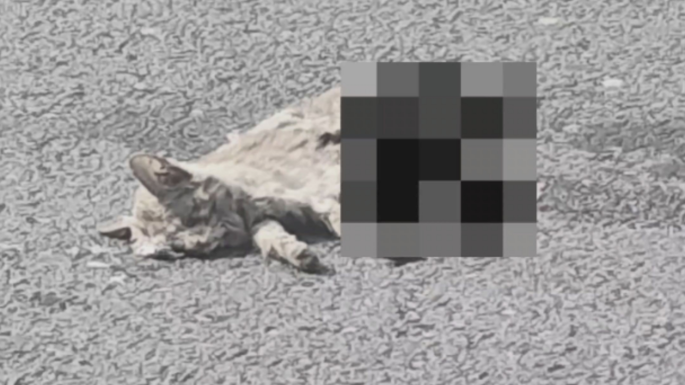 | 6.7万 | 2025-06-22 |
| [哈基城没有活着的传奇。](https://www.bilibili.com/video/BV1vqQ5YvEgM) |  | 51.5万 | 2025-03-11 |
| [《老人嫌流浪猫太吵，把幼崽吊在吊在窗外》](https://www.bilibili.com/video/BV1YXAfepED4) |  | 26.6万 | 2025-02-21 |
| [哈雪大帽险纯享](https://www.bilibili.com/video/BV1yHp2e9E16) |  | 65.3万 | 2024-08-19 |
| [万恶之源 哈基米](https://www.bilibili.com/video/BV1jg4y1Z76F) |  | 206 | 2023-12-11 |
| [【4K60FPS】迈克尔·杰克逊《Billie Jean》太空步名场面现场！无法超越](https://www.bilibili.com/video/BV17a4y1A7t6) |  | 741.3万 | 2023-06-25 |

---
*最后更新: 2025-12-02 02:43:18 (自动生成)*
*数据来源: [Bilibili](https://www.bilibili.com)*

## 使用说明

运行以下命令更新视频列表:
```bash
python3 fetch_hajimi_videos.py
```
