# awesome-hajimi
collections of hajimi (哈基米 in Chinese) on the Internet.

## 视频列表 (Video List)

| 视频标题 (Title) | 封面 | 播放量 (Views) | 发布日期 (Date) |
|---|---|---|---|
| [哈基米海鲜面](https://www.bilibili.com/video/BV1gxzmBEELt) |  | 472 | 2026-01-25 |
| [哈基米小曲锦标赛 十六首小曲solo淘汰赛](https://www.bilibili.com/video/BV1LZzmB4EEm) |  | 1383 | 2026-01-25 |
| [🎨](https://www.bilibili.com/video/BV1RRz1BSEMv) |  | 183 | 2026-01-24 |
| [外星哈基米和耄耋的日常](https://www.bilibili.com/video/BV1rpz2BhEVX) |  | 265 | 2026-01-24 |
| [哈基米看电脑一分钟](https://www.bilibili.com/video/BV1xuzyBYErh) | 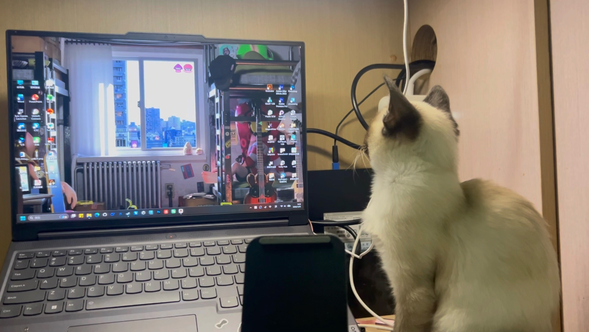 | 227 | 2026-01-24 |
| [咕哒子爱马伏笔原来早已确定希波吕忒CV是咕哒子,关根明良 干翻两位冠位守门员【FSF】](https://www.bilibili.com/video/BV1QfzCBuEz4) |  | 5.2万 | 2026-01-24 |
| [神人TV之经典感动自己，救下哈基米之后秒变脸不养，最后美美放生](https://www.bilibili.com/video/BV1XBzyBkEjg) | 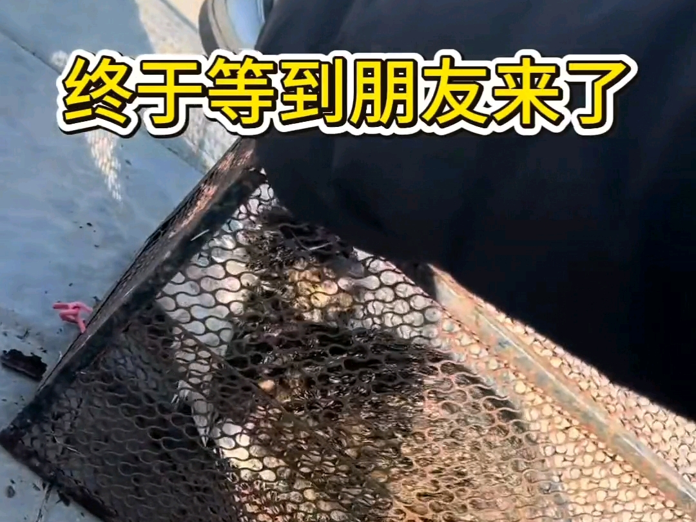 | 6542 | 2026-01-24 |
| [哈基米独断万古](https://www.bilibili.com/video/BV1wHzABVEe1) |  | 3815 | 2026-01-24 |
| [学会这招：皮筋穿手指！过年给小侄子表演，直接把他迷成哈基米](https://www.bilibili.com/video/BV1ttz1BuEuP) | 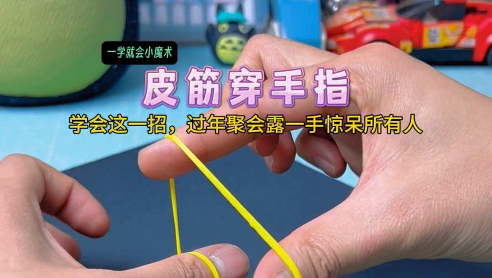 | 493 | 2026-01-24 |
| [哈基米想吃猪肉了](https://www.bilibili.com/video/BV1upz1BkEbd) | 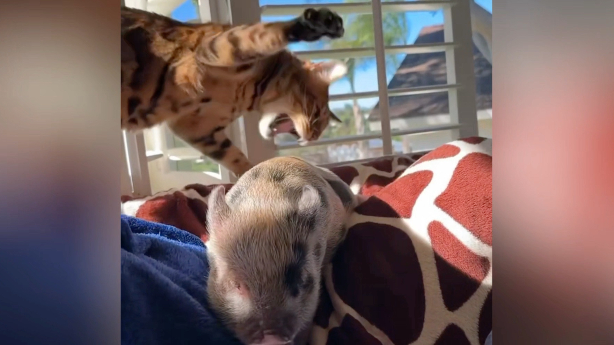 | 524 | 2026-01-24 |
| [调的还算满意的哈基米李健版在水一方（片段）](https://www.bilibili.com/video/BV1Nez1BNELb) |  | 332 | 2026-01-24 |
| [哈基米耄耋打赢复活赛](https://www.bilibili.com/video/BV1Tbz1BBEE6) |  | 119 | 2026-01-24 |
| [耄耋遇上哈基米？谁是最强哈气王！](https://www.bilibili.com/video/BV1uHz1BVEQm) | 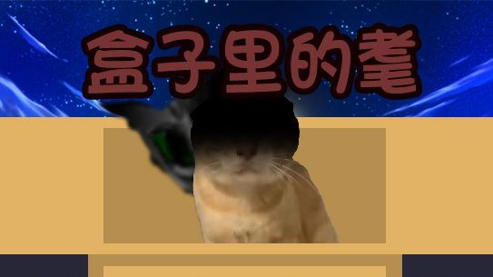 | 118 | 2026-01-24 |
| [哈基米入侵班级（胆小别慎入）](https://www.bilibili.com/video/BV1hizkBKEFx) | 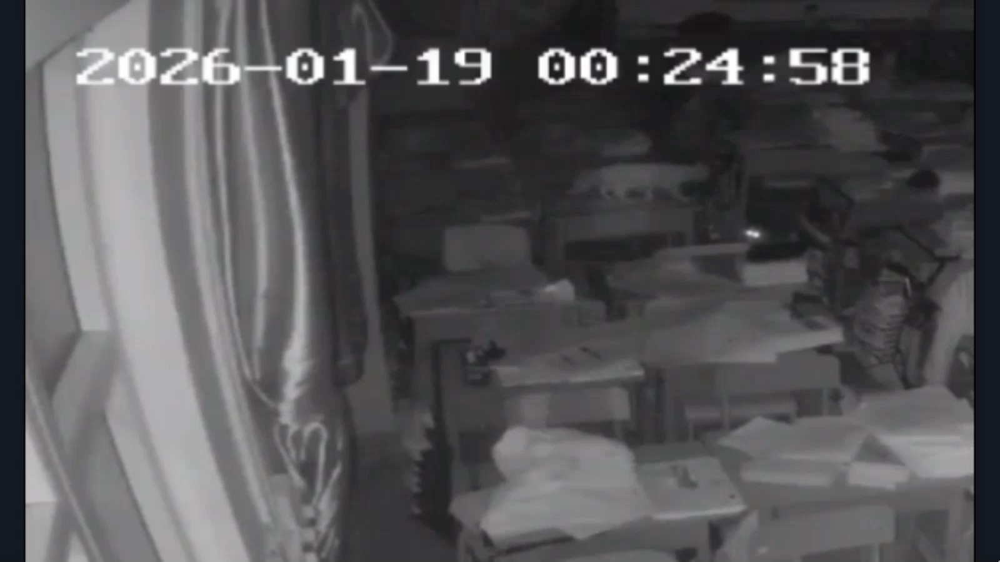 | 512 | 2026-01-24 |
| [哈基米的午睡时间](https://www.bilibili.com/video/BV1b6zkBYEvQ) |  | 18 | 2026-01-24 |
| [抽象AI视频集锦，哈基米会武功？真成猫爹了！#2](https://www.bilibili.com/video/BV1V8zkB3Enu) |  | 206 | 2026-01-24 |
| [你不是真的哈基米](https://www.bilibili.com/video/BV1vszkBCEox) |  | 791 | 2026-01-24 |
| [哈基米梗百科｜“神 你会拯救我吗”是啥梗？](https://www.bilibili.com/video/BV1R4zkBGEpg) |  | 181 | 2026-01-24 |
| [当哈基米来到我的世界](https://www.bilibili.com/video/BV1rgzKB7Eun) | 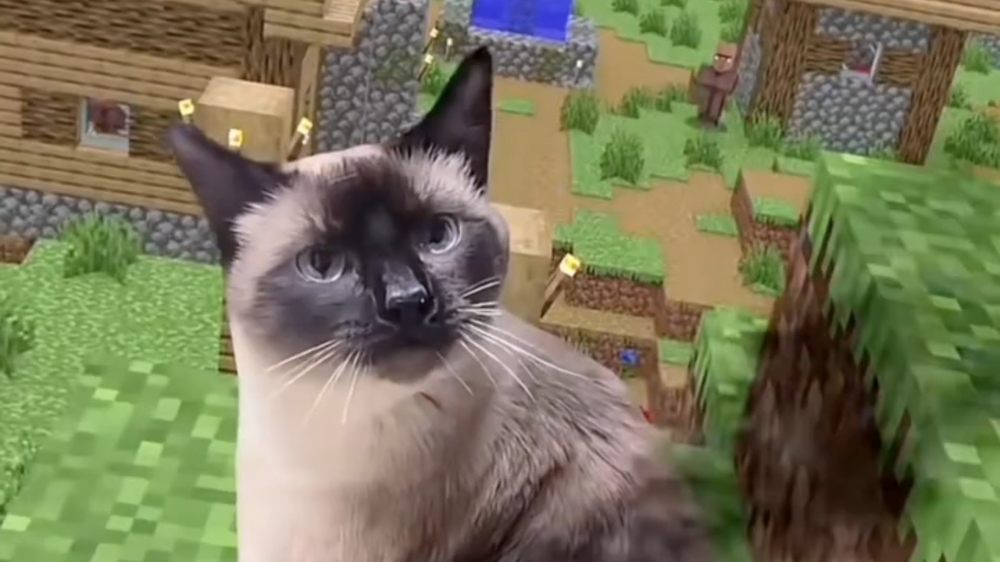 | 67 | 2026-01-24 |
| [花了37684拍的哈基米广告 &quot;哈基米 &quot;抽象 &quot;曼波 &quot;搞笑](https://www.bilibili.com/video/BV1EFzCBSEBu) |  | 2 | 2026-01-24 |
| [哈基米](https://www.bilibili.com/video/BV16ozkBQEax) | 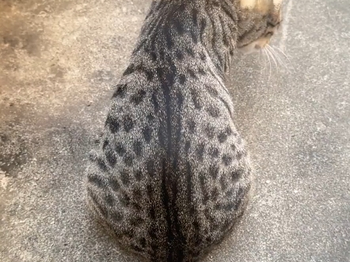 | 2110 | 2026-01-24 |
| [哈基米看见狗哈气](https://www.bilibili.com/video/BV1iKzCB1EgG) | 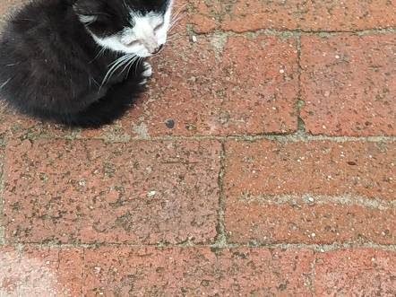 | 637 | 2026-01-24 |
| [给队友唱《我爱你哈基米》-上海蟹](https://www.bilibili.com/video/BV1LKzCB1EqD) |  | 1034 | 2026-01-24 |
| [最后那动静配了几十次才过...不是因为有多难...而是总没忍住笑场... 杨坤老师对不起！](https://www.bilibili.com/video/BV1smzkBZExV) |  | 5.1万 | 2026-01-24 |
| [【哈基米音乐】最后的色彩/庄严的ink,但是完整版](https://www.bilibili.com/video/BV1uHzCBvEge) |  | 619 | 2026-01-24 |
| [哈基米钻进车子里死活不出来，差点让车子报废](https://www.bilibili.com/video/BV1K8zCBcEw5) |  | 579 | 2026-01-24 |
| [【哈基米音乐】三哈曼波漫——《三拜红尘凉》](https://www.bilibili.com/video/BV11hzCBbEWy) |  | 147 | 2026-01-24 |
| [B站可以有鬼畜区，就是没有乌托邦](https://www.bilibili.com/video/BV1xtzCBhEvo) |  | 4.1万 | 2026-01-24 |
| [明日方舟印象曲《明日曼波》【哈基米曼波歌词/Ai歌曲】](https://www.bilibili.com/video/BV1VGzCBrEpg) |  | 1.4万 | 2026-01-24 |
| [基米小学：花花的日记-下](https://www.bilibili.com/video/BV1YGzCBrENs) | 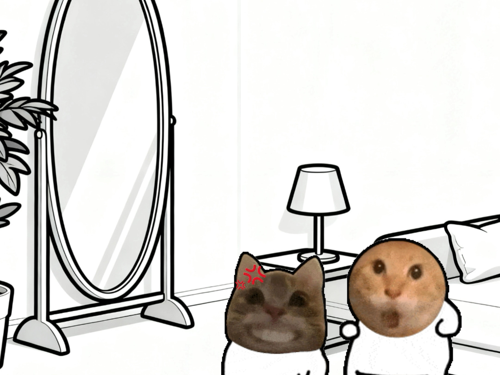 | 609 | 2026-01-24 |
| [【哈基米】不死哈ごっこ demo](https://www.bilibili.com/video/BV1h7zCBMEUw) |  | 824 | 2026-01-24 |
| [【哈基米音乐】&quot;所有人保持耳朵通畅“](https://www.bilibili.com/video/BV1LmzCBmEGy) |  | 1272 | 2026-01-24 |
| [基米TV之可爱豪猫15分钟合集](https://www.bilibili.com/video/BV1LmzCBmEgE) | 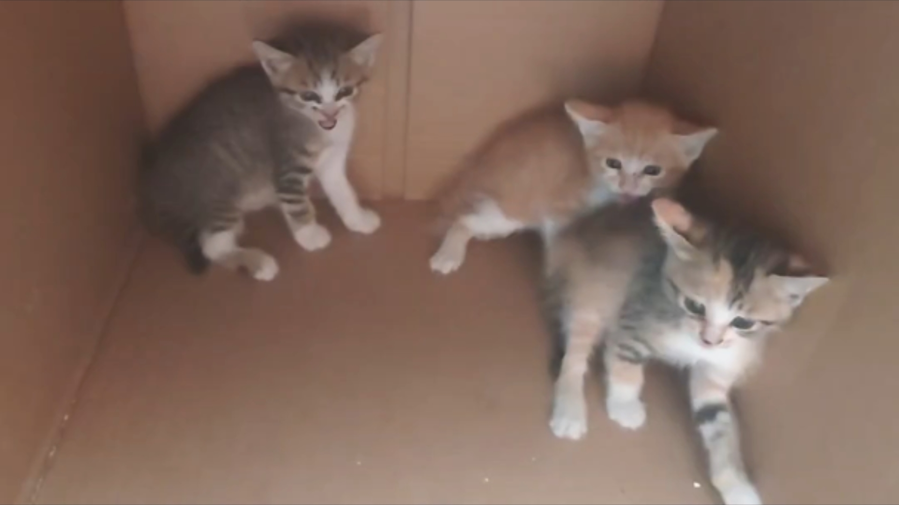 | 2.9万 | 2026-01-24 |
| [亲亲漫波](https://www.bilibili.com/video/BV1o2zCB7EFu) |  | 1501 | 2026-01-24 |
| [分享17种猫咪，这种哈基米乖吗？](https://www.bilibili.com/video/BV1X9zCBkE9L) |  | 132 | 2026-01-24 |
| [老年管理员大战超雄机器人!](https://www.bilibili.com/video/BV1cqzCBsEJ7) |  | 56.1万 | 2026-01-24 |
| [给神人男朋友手搓了一个哈基米播放器](https://www.bilibili.com/video/BV1wqzCBsEe2) | 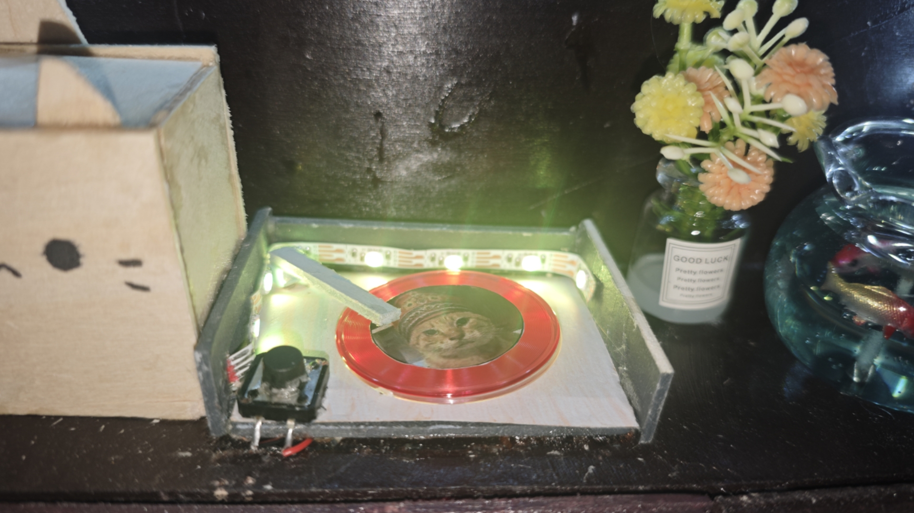 | 192 | 2026-01-24 |
| [一直抠猫咪手手，让它觉得莫名其妙](https://www.bilibili.com/video/BV1AazCBZEd8) | 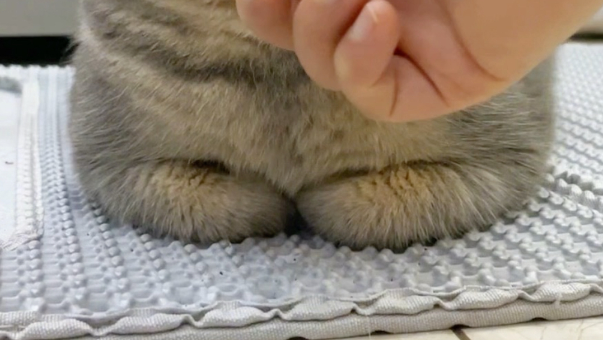 | 8.1万 | 2026-01-24 |
| [《诺瓦基米》手搓版](https://www.bilibili.com/video/BV1HezCB4EC1) |  | 2513 | 2026-01-24 |
| [这才是真正的音乐！哈基米翻唱《蓝莲哈》](https://www.bilibili.com/video/BV1WxzzBjE5g) |  | 409 | 2026-01-24 |
| [“这是一场属于鬼畜的盛宴！”](https://www.bilibili.com/video/BV1nXz6B2Er5) |  | 2989 | 2026-01-24 |
| [改编张学友一千个伤心的理由《我的猫不是哈基米》](https://www.bilibili.com/video/BV16Rz6BLEW3) | 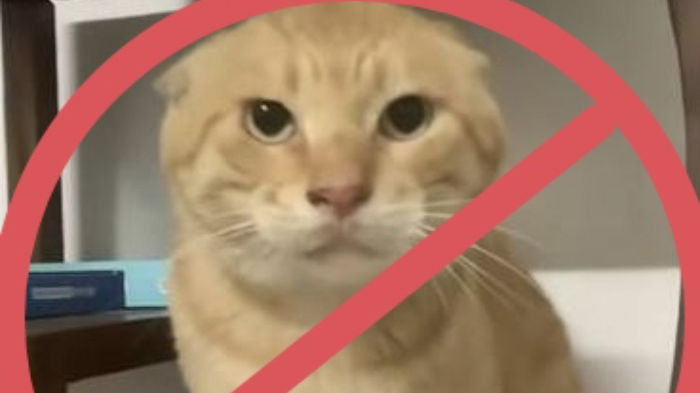 | 333 | 2026-01-24 |
| [超哈基要塞：基基的地平线《基米基米爱》](https://www.bilibili.com/video/BV17czrB3EQw) |  | 2390 | 2026-01-24 |
| [哈基米一家又被蟒蛇发现，只能丢下小猫跑了](https://www.bilibili.com/video/BV1P1z6BpEmb) | 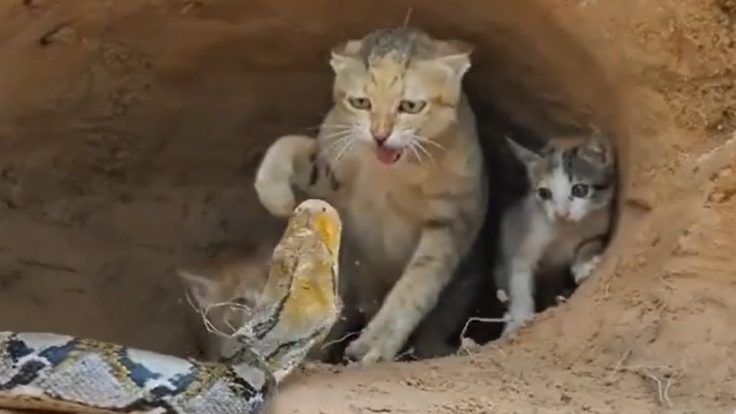 | 740 | 2026-01-24 |
| [哈基米和人的日常](https://www.bilibili.com/video/BV1m6z6BREeQ) | 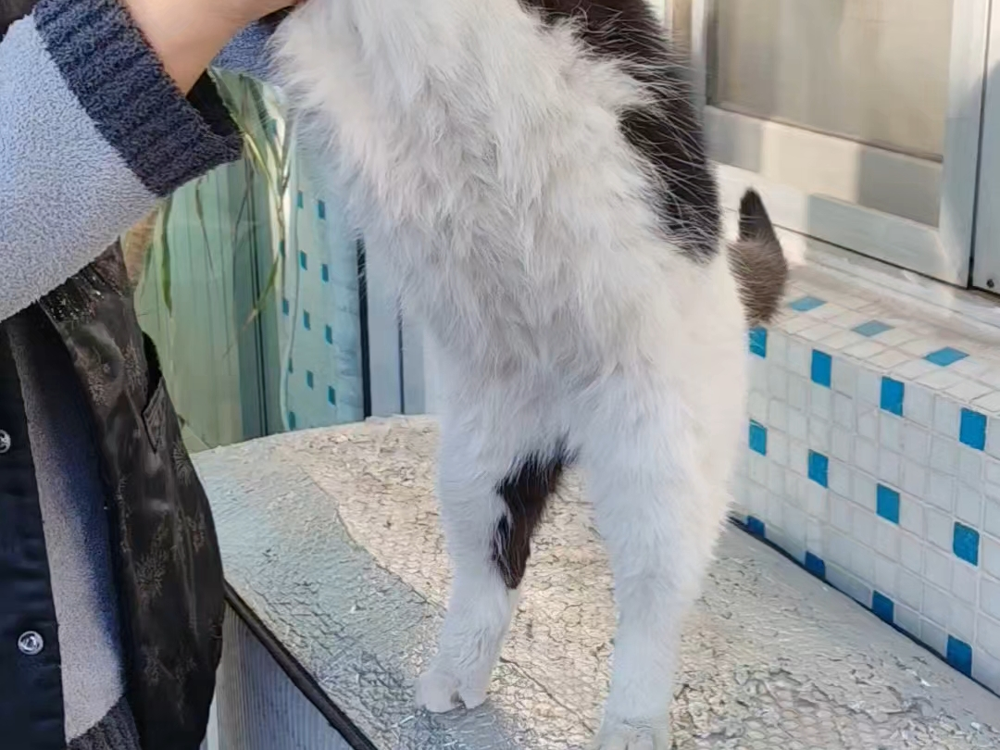 | 54 | 2026-01-24 |
| [【N4】00仆大战哈基米之狗](https://www.bilibili.com/video/BV126z6BRED7) |  | 115 | 2026-01-24 |
| [用PVZ音效打开海绵宝宝 - [三傻露营]](https://www.bilibili.com/video/BV14HzrBoE82) |  | 1780 | 2026-01-24 |
| [基米挑战冬将军不成，只能抱团取暖，生死不明！](https://www.bilibili.com/video/BV1gVzrBAEEm) | 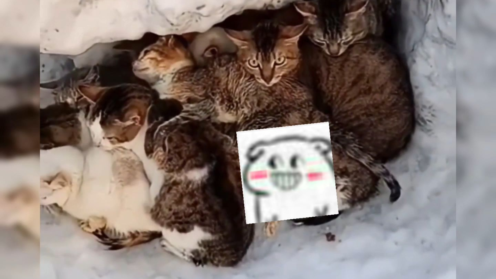 | 8793 | 2026-01-24 |
| [墨喆喆的哈基米之歌搭配酷洛米绝配](https://www.bilibili.com/video/BV1gqk7BgEea) | 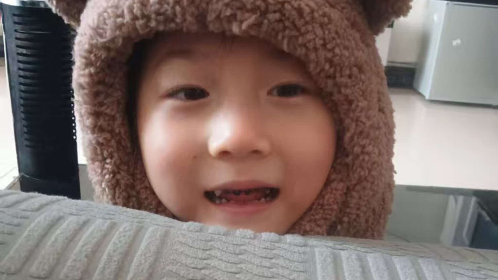 | 138 | 2026-01-24 |
| [无限全家福的方法！](https://www.bilibili.com/video/BV1whzrBDED7) |  | 4.6万 | 2026-01-24 |
| [〔SGM〕尝试用哈基米打竞技](https://www.bilibili.com/video/BV1f6zrBCETe) |  | 153 | 2026-01-24 |
| [哈基楚水凄凉咪，基米只是想cos水獭](https://www.bilibili.com/video/BV1FqzrB2EiZ) | 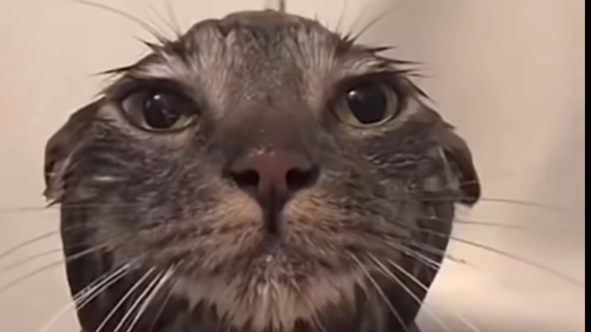 | 356 | 2026-01-24 |
| [蠢猫TV之一个气球引发哈基米营啸](https://www.bilibili.com/video/BV1W3zkBWEKH) | 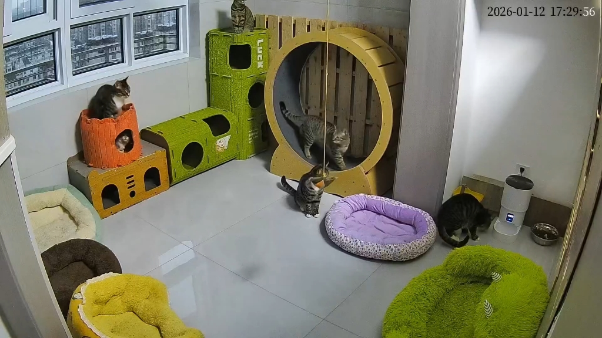 | 2.1万 | 2026-01-24 |
| [喜欢你，哈基米，喵喵叫～](https://www.bilibili.com/video/BV1z7zkBEEUh) | 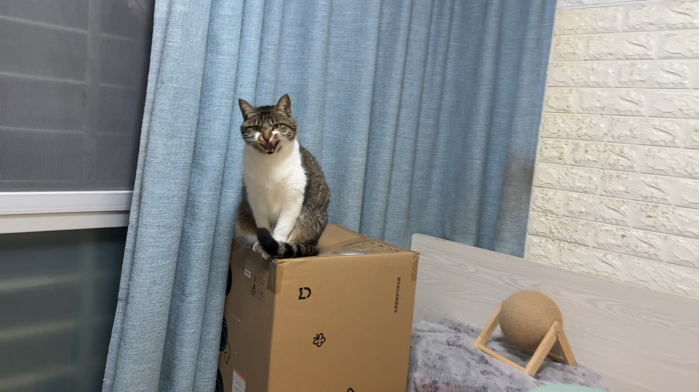 | 169 | 2026-01-24 |
| [白菜难绷安慰朋友反被吐槽语气太嘲讽w，屑味已深入骨髓w](https://www.bilibili.com/video/BV1UZzrBwE1j) |  | 4.1万 | 2026-01-24 |
| [基~米~到~🎵](https://www.bilibili.com/video/BV1GgzTBTEAL) |  | 2.4万 | 2026-01-24 |
| [琳奈唐笑200小时纯享版](https://www.bilibili.com/video/BV1QCkWBbEmy) |  | 6.3万 | 2026-01-24 |
| [“当《Counting Stars》响起的那一刻，鬼畜区有了光”](https://www.bilibili.com/video/BV1UczkBFEKA) |  | 691 | 2026-01-24 |
| [【全明星鬼畜】⚡️凯 恩 不 认 识 中 文⚡️](https://www.bilibili.com/video/BV17BrQBCEp9) |  | 7112 | 2026-01-24 |
| [农村哈基米绝育（亖）](https://www.bilibili.com/video/BV1T5zzB9EXV) | 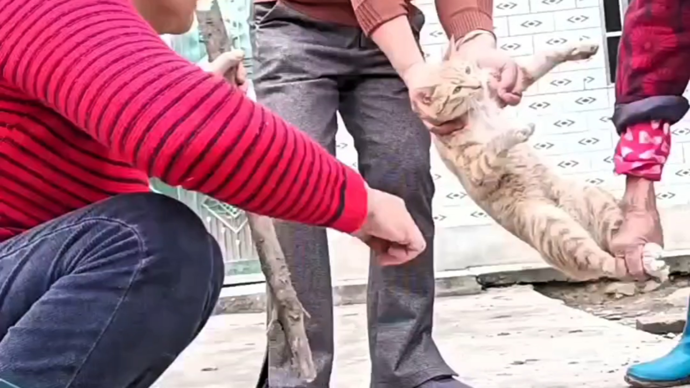 | 14.7万 | 2026-01-24 |
| [【熟肉】外国博主从中国买了堆离谱喵喵用品！没想到哈基米真的喜欢！太有趣了！](https://www.bilibili.com/video/BV1gMzzBZEs7) | 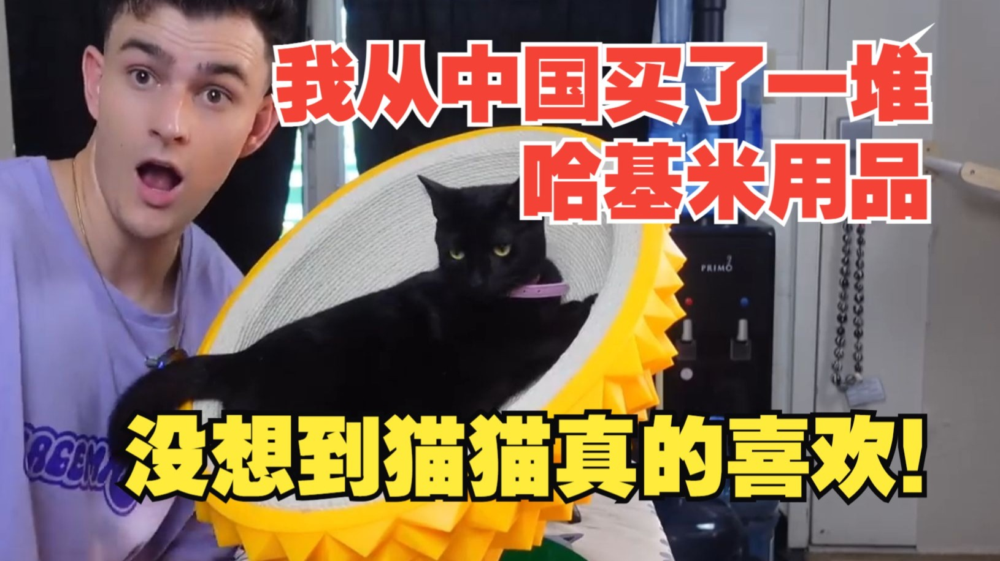 | 2.7万 | 2026-01-24 |
| [《爱丑猫说》](https://www.bilibili.com/video/BV1KczKBsEes) | 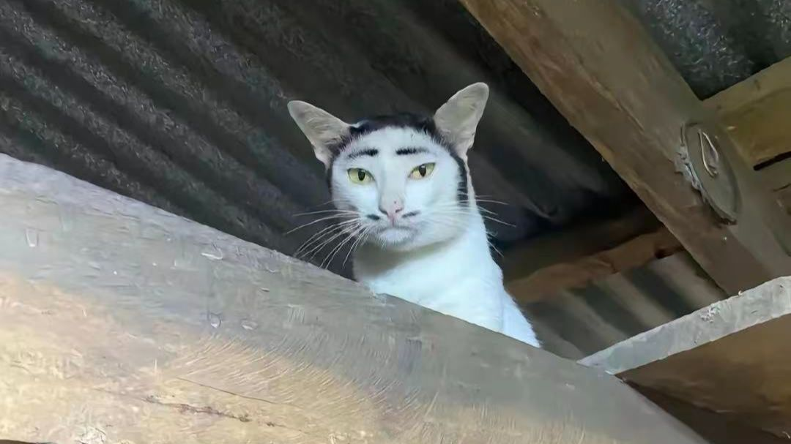 | 9.2万 | 2026-01-24 |
| [34分钟沉浸式听歌｜纯享版音乐合集｜哈基米治愈系｜萌到变形#哈基米#音乐合集#音乐分享#治愈#萌系](https://www.bilibili.com/video/BV1crz3BaEvm) |  | 56 | 2026-01-23 |
| [中文6级的樱花妹玩中文谐音梗游戏，被自己的抽象脑回路逗懵了w](https://www.bilibili.com/video/BV1TWzuBKEY6) | 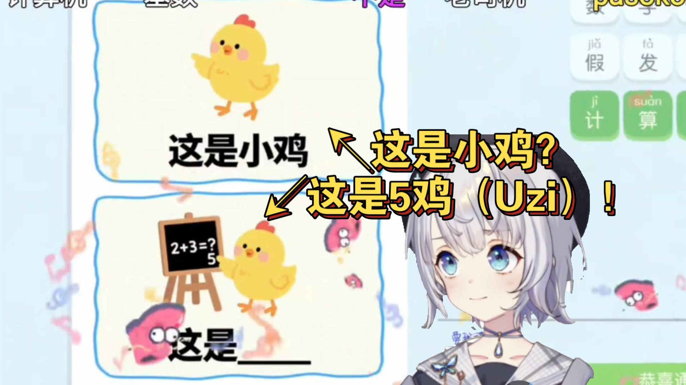 | 4.8万 | 2026-01-23 |
| [新疆雪豹攻击人类现场](https://www.bilibili.com/video/BV1LAzuBSEDF) |  | 18.3万 | 2026-01-23 |
| [（完整版）地狱神鹰——康斯坦鹰](https://www.bilibili.com/video/BV1cqzuB4E6Z) |  | 3803 | 2026-01-23 |
| [diy哈基米参考小小汪做的](https://www.bilibili.com/video/BV1cBzuBdETx) | 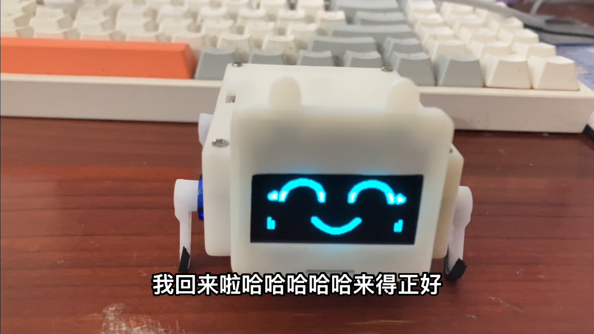 | 553 | 2026-01-23 |
| [莫名戳中笑点348](https://www.bilibili.com/video/BV1FvzuBZEfg) | 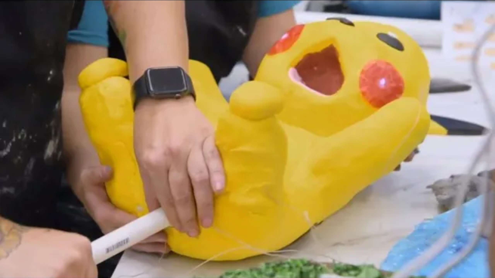 | 15.5万 | 2026-01-23 |
| [鸡汤来咯，但是诗词对诵](https://www.bilibili.com/video/BV1wYzuBFEYn) |  | 1.2万 | 2026-01-23 |
| [早期哈基米驯服人类的珍贵影像](https://www.bilibili.com/video/BV12KzgBqEKF) | 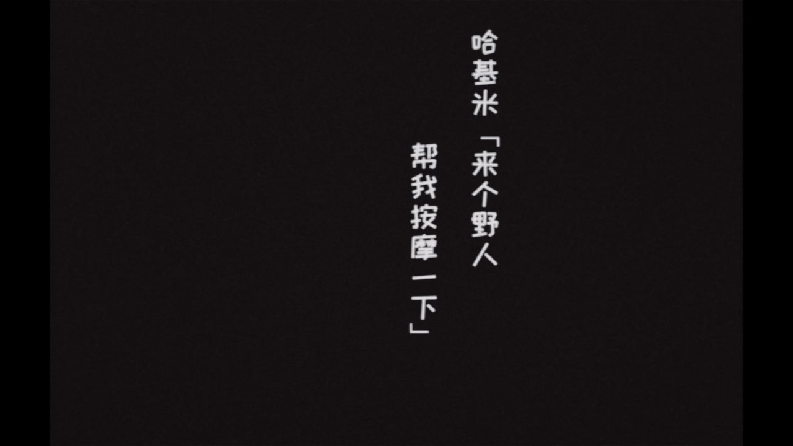 | 72 | 2026-01-23 |
| [哈基米的老窝又被蟒蛇发现，被咬出痛苦面具](https://www.bilibili.com/video/BV1y3zgBAEoc) | 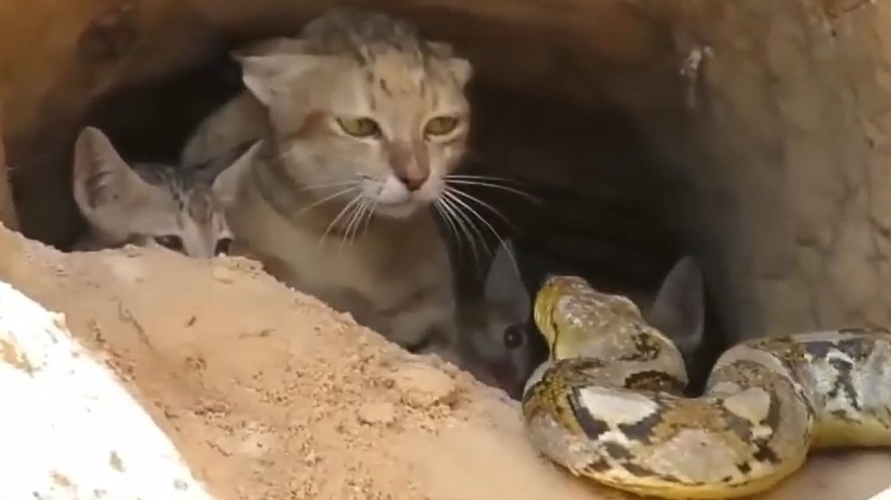 | 2758 | 2026-01-23 |
| [【哈基米音乐】自律の小曲](https://www.bilibili.com/video/BV1uMrSBxEFp) |  | 871 | 2026-01-23 |
| [挑战在小猫身上放东西](https://www.bilibili.com/video/BV1wbzNBjEGK) | 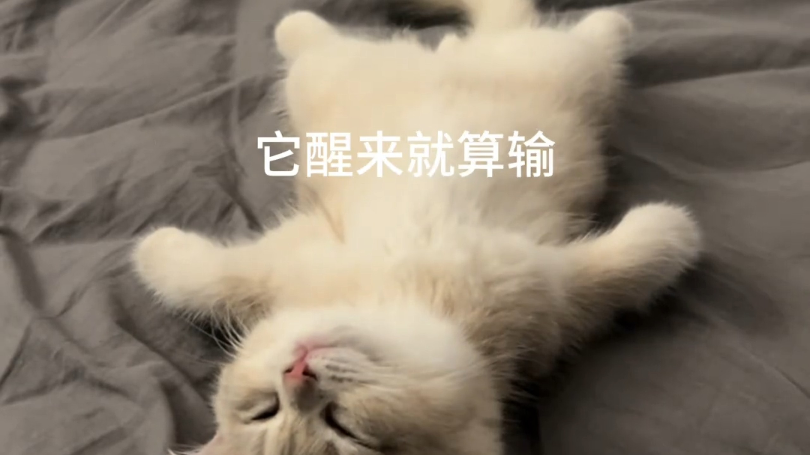 | 12.7万 | 2026-01-23 |
| [哈基米](https://www.bilibili.com/video/BV19tzMBCE5E) |  | 387 | 2026-01-23 |
| [恭喜发财，但是分类讨论](https://www.bilibili.com/video/BV12zzKBtESF) |  | 60.4万 | 2026-01-23 |
| [丹尼尔低音炮，但不同倍速（50倍速～0.1倍速）和倒放](https://www.bilibili.com/video/BV1kNzKBDE6v) |  | 2.0万 | 2026-01-23 |
| [真当我猫家无人了吗？](https://www.bilibili.com/video/BV1nQzKBJEPv) | 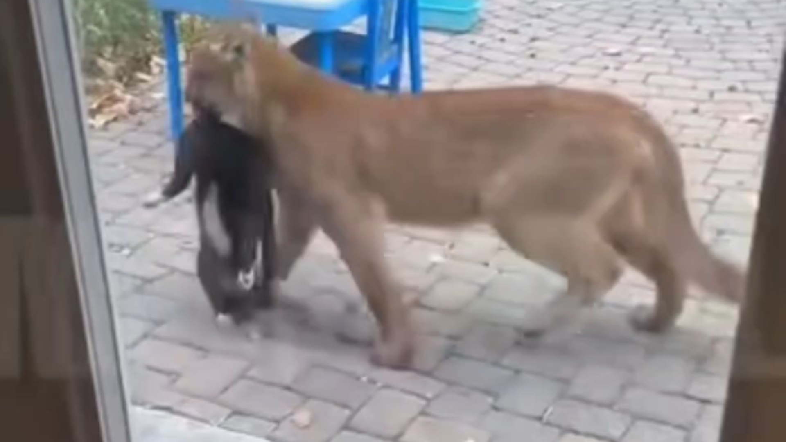 | 4.8万 | 2026-01-23 |
| [⚡️皇 室 战 争 战 斗 哈 基 米 音 乐 0 1⚡️](https://www.bilibili.com/video/BV1SnzFBjEBz) |  | 4813 | 2026-01-23 |
| [哈基米遭遇洪水被锁在屋内被水淹没无处可逃](https://www.bilibili.com/video/BV1FbzABBETU) | 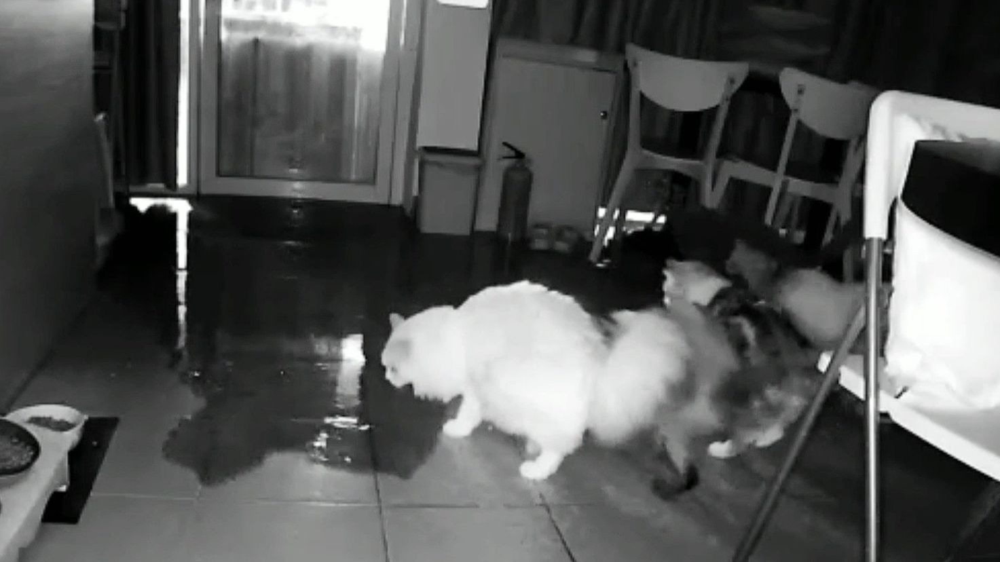 | 6684 | 2026-01-22 |
| [坠入深渊的哈基米](https://www.bilibili.com/video/BV1ExzWBcEub) |  | 12.6万 | 2026-01-22 |
| [素质差的根本玩不了这游戏！【这是谐音梗】](https://www.bilibili.com/video/BV1jNzpBdEf5) |  | 20.2万 | 2026-01-22 |
| [请吃比奇堡全员拟人](https://www.bilibili.com/video/BV1nakjB9ErE) |  | 14.5万 | 2026-01-20 |
| [小猫咪用猫毛来控制主人](https://www.bilibili.com/video/BV124kTBKEBc) |  | 123.2万 | 2026-01-20 |
| [jangmi Rose](https://www.bilibili.com/video/BV1zQkVBVEwf) |  | 1148 | 2026-01-20 |
| [🐧我的兄弟像士兵，没日没夜的守营🐧](https://www.bilibili.com/video/BV1xqrjB4Epp) |  | 150.9万 | 2026-01-13 |
| [《猫猫专属动画片》](https://www.bilibili.com/video/BV1pLreBvEpD) |  | 2.8万 | 2026-01-12 |
| [⚡ 柱 子 哥 の 爱 ⚡](https://www.bilibili.com/video/BV1iDrABgEGt) |  | 66.6万 | 2026-01-09 |
| [咕咕嘎嘎圣诞老人合辑](https://www.bilibili.com/video/BV14mrwBWEMD) | 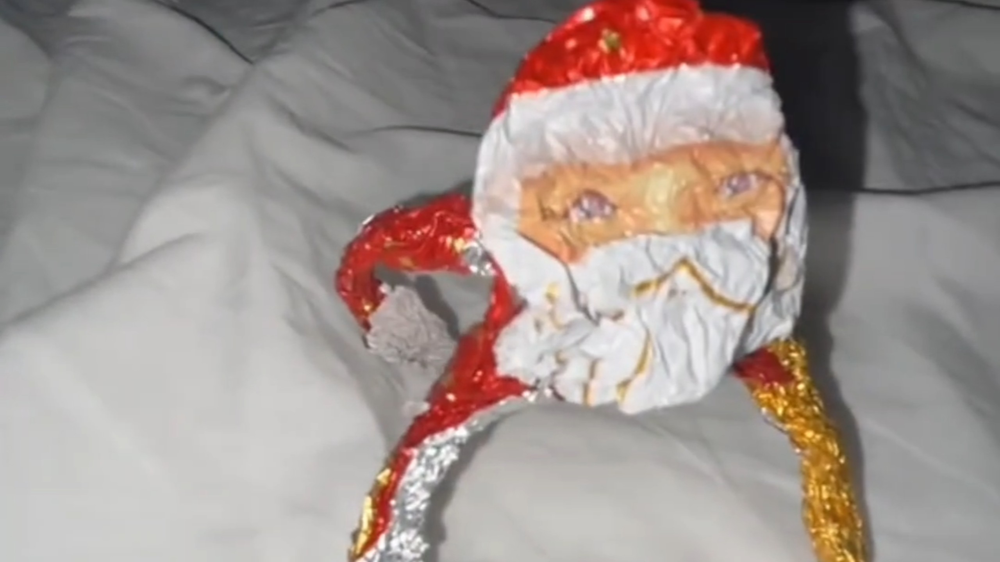 | 53.6万 | 2026-01-09 |
| [给我擦皮鞋（法国口音）](https://www.bilibili.com/video/BV1bAiAByESY) |  | 168.0万 | 2025-12-31 |
| [哈基米怎么跑马路上睡觉](https://www.bilibili.com/video/BV1uKqpBMEnR) | 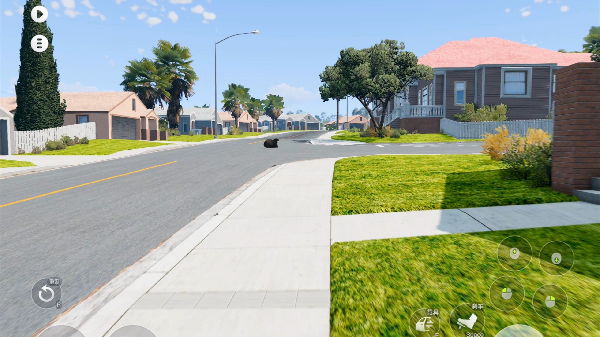 | 2.7万 | 2025-12-18 |
| [颗秒](https://www.bilibili.com/video/BV1FDUDBwEiq) |  | 17.0万 | 2025-11-25 |
| [ピノキオピー - T氏の話を信じるな feat. 初音ミク・重音テト](https://www.bilibili.com/video/BV1SfK9zPEL3) |  | 1286.9万 | 2025-06-27 |
| [出山（哈基米）完整版](https://www.bilibili.com/video/BV1BiTxzuEMZ) |  | 22.5万 | 2025-06-05 |
| [流浪猫的冬天](https://www.bilibili.com/video/BV11mrYY5Epc) | 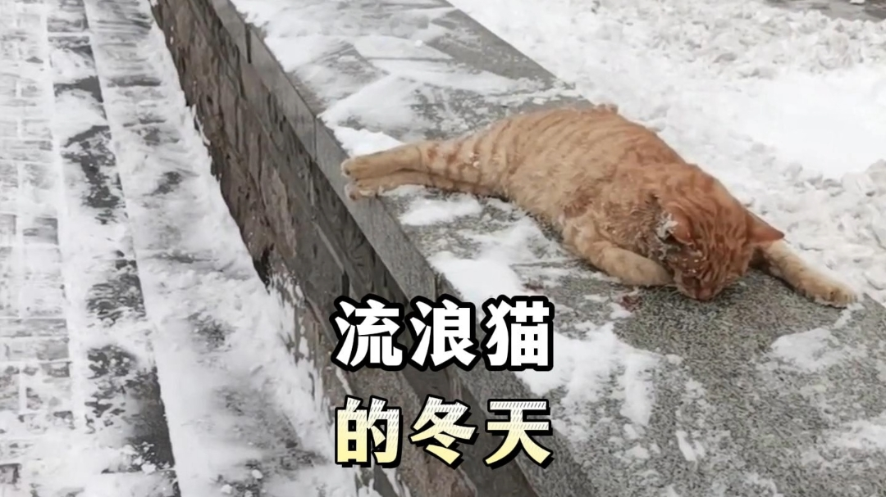 | 23.7万 | 2025-01-08 |
| [无加速完整版缅因猫配种成功需要讲解可问我， 视频较长，家里不会配种的公猫可以直接把这个视频给他看几次，他就会配了！！一定要听到母猫的哀叫和打滚](https://www.bilibili.com/video/BV1gvBxYtEBA) | 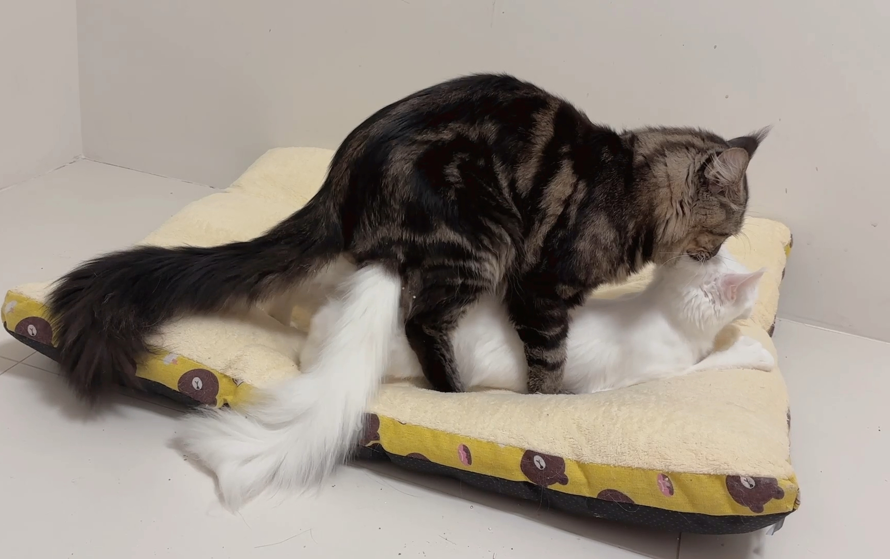 | 18.1万 | 2024-11-24 |
| [基米流蒙恬](https://www.bilibili.com/video/BV1HJ4m1T7ys) |  | 177.3万 | 2024-06-29 |
| [给一只发情的公猫听母猫叫会怎样？这反应太刺激了！@油兔不二字幕组](https://www.bilibili.com/video/BV1QV411y7XY) |  | 42.1万 | 2020-11-04 |
| [前方高能！大型猫片现场！请不要走开！](https://www.bilibili.com/video/BV1h64y1T7A4) |  | 561.5万 | 2020-04-22 |
| [高能预警！真猫片！](https://www.bilibili.com/video/BV1gs411n7VD) | 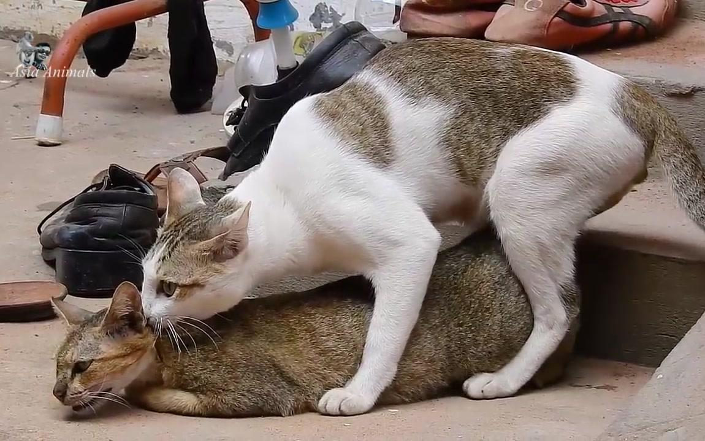 | 13.2万 | 2018-07-15 |
| [猫与狗的火辣调情](https://www.bilibili.com/video/BV1as411S7oU) |  | 120.9万 | 2015-07-18 |

---
*最后更新: 2026-01-25 02:58:54 (自动生成)*
*数据来源: [Bilibili](https://www.bilibili.com)*

## 使用说明

运行以下命令更新视频列表:
```bash
python3 fetch_hajimi_videos.py
```
