# awesome-hajimi
collections of hajimi (哈基米 in Chinese) on the Internet.

## 视频列表 (Video List)

| 视频标题 (Title) | 封面 | 播放量 (Views) | 发布日期 (Date) |
|---|---|---|---|
| [哈基米的哈气技能升级了！](https://www.bilibili.com/video/BV1bXsczAERi) | 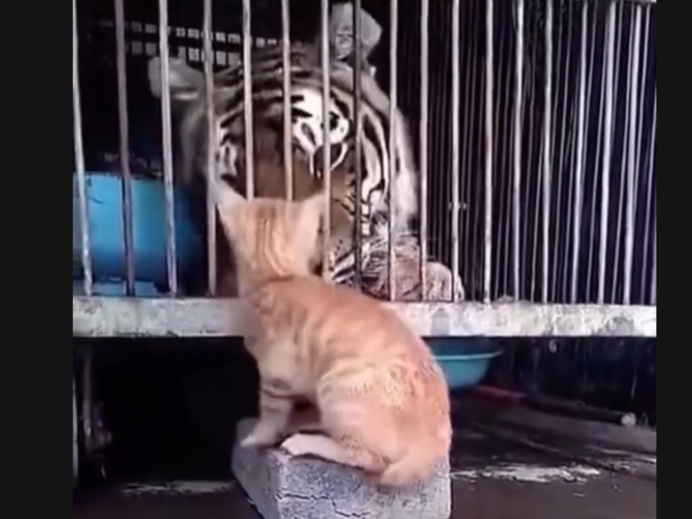 | 1 | 2025-10-19 |
| [哈基米南北绿豆](https://www.bilibili.com/video/BV1sAswzxECk) | 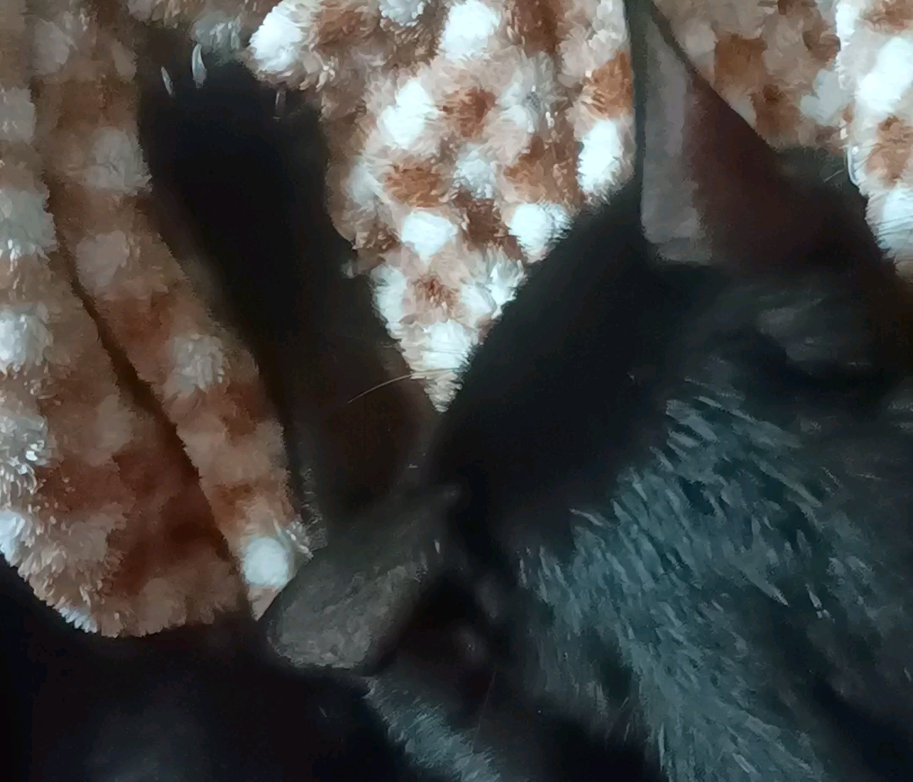 | 5 | 2025-10-19 |
| [⚡哈基米：Detonation⚡（暗区突围s9赛季主题曲）](https://www.bilibili.com/video/BV1eCsczuEXs) |  | 370 | 2025-10-19 |
| [高考常考的哈基米三角形](https://www.bilibili.com/video/BV1RAWbzjEGm) | 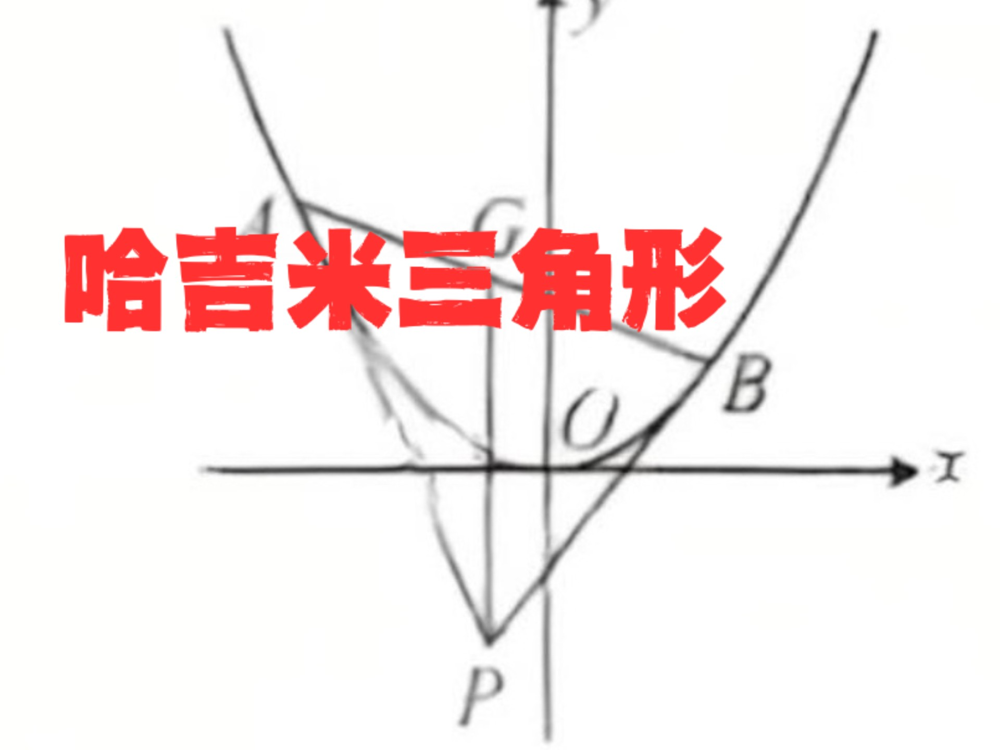 | 53 | 2025-10-19 |
| [毛概小组展示：浅析哈基米文化（总结部分）](https://www.bilibili.com/video/BV1v6scz3E6R) | 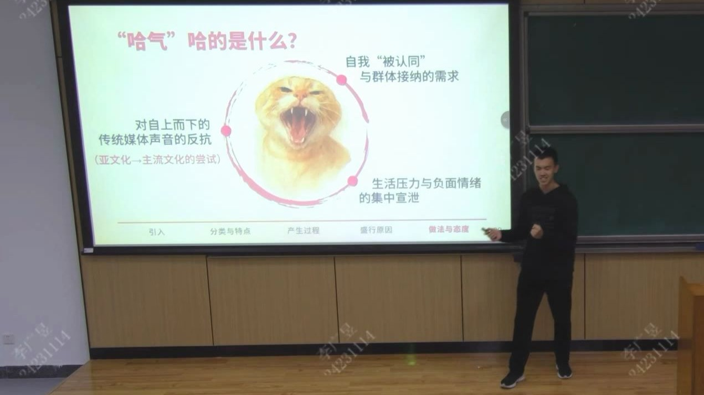 | 16 | 2025-10-19 |
| [“臣本哈基，躬耕于河北，种植南北绿豆”｜循环歌单｜《哈基米在你的身边》-哈基米/ZeYe.](https://www.bilibili.com/video/BV11pWbzYEhV) |  | 21 | 2025-10-19 |
| [【哈基米音乐】🎵Maps🎵](https://www.bilibili.com/video/BV1puW8zwEiU) |  | 630 | 2025-10-19 |
| [猫猫枪 贫民版——哈基米枪械，换弹速度和哈基米一样快](https://www.bilibili.com/video/BV1UDW4ziEtb) |  | 29 | 2025-10-19 |
| [哈基米起床～](https://www.bilibili.com/video/BV1SuWfz9EcY) |  | 530 | 2025-10-19 |
| [【猫猫歌单】盘点哈基米音乐的十大神曲，每一首都是配享太庙的存在](https://www.bilibili.com/video/BV1NBWtzeELd) |  | 74 | 2025-10-18 |
| [（补档）[希丝奈cisne][ASMR精切]今天特别特别喜欢你 25.08.18 P1 KU100 哈基米 孔雀鱼 水瓶 搓耳朵 略略略 弹舌 鹅毛棒 解压球](https://www.bilibili.com/video/BV1SeWtzTEYm) |  | 3688 | 2025-10-18 |
| [【完整版】Mr.Broken Hajimi&quot;](https://www.bilibili.com/video/BV1eHWtzLEaq) |  | 2311 | 2025-10-18 |
| [【哈基米音乐】听基米的哈](https://www.bilibili.com/video/BV1gtWtz3EZr) |  | 1108 | 2025-10-18 |
| [【真栗】最解压的一集《蓝莲哈》！谁懂这一声哈基米的救赎感！](https://www.bilibili.com/video/BV17ZWtzDEbt) |  | 2651 | 2025-10-18 |
| [【单曲循环】 ｜ 《曼波の小曲》｜ 《不再曼波 (哈基米纯享)》](https://www.bilibili.com/video/BV1XKWbz5E1D) |  | 314 | 2025-10-18 |
| [群友发癫神情歌唱哈基米音乐珍贵录像.mp3](https://www.bilibili.com/video/BV1QuWbzGEGr) |  | 1235 | 2025-10-18 |
| [哈基米～～～](https://www.bilibili.com/video/BV1XKWbz5EsM) | 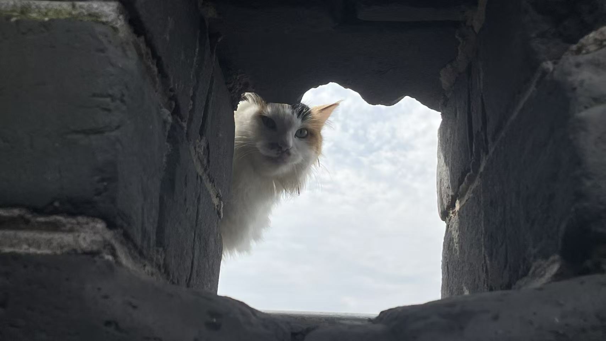 | 340 | 2025-10-18 |
| [“好基米，不哈气 ”](https://www.bilibili.com/video/BV1AtWbzcEDe) |  | 1.6万 | 2025-10-18 |
| [哈G.E.M 米《Sacrifice（争）》（哈基米版）](https://www.bilibili.com/video/BV1aQWbzCEKM) | 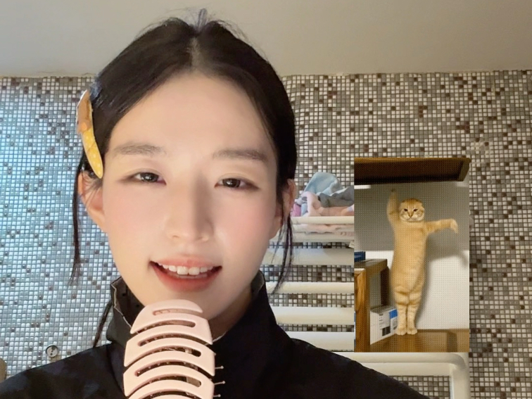 | 11.9万 | 2025-10-18 |
| [哈基米哦南北绿豆~](https://www.bilibili.com/video/BV1doWxzkE1V) | 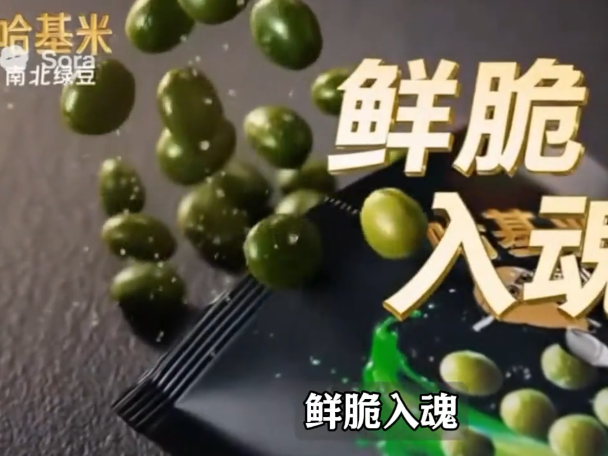 | 1258 | 2025-10-18 |
| [【Hi-Res循环】DJ音乐《神曼波【哈基米音乐】》“见证哈基米音乐的里程碑，哈门~”](https://www.bilibili.com/video/BV1ehWCzsEaw) |  | 461 | 2025-10-18 |
| [循环歌单——《打火基》“哈基米啊南北绿豆”](https://www.bilibili.com/video/BV1fSWxz7EBz) |  | 889 | 2025-10-18 |
| [你再说我是哈基米试试](https://www.bilibili.com/video/BV1CeWyz3Ej1) |  | 14.8万 | 2025-10-18 |
| [当我用低音唱哈基米，是什么样子？](https://www.bilibili.com/video/BV1AGWnzuE2Y) |  | 605 | 2025-10-18 |
| [🐱基友一生一起走🐱](https://www.bilibili.com/video/BV1dBW4zyENC) |  | 2.6万 | 2025-10-18 |
| [愤怒的基米](https://www.bilibili.com/video/BV1A7WszHELG) | 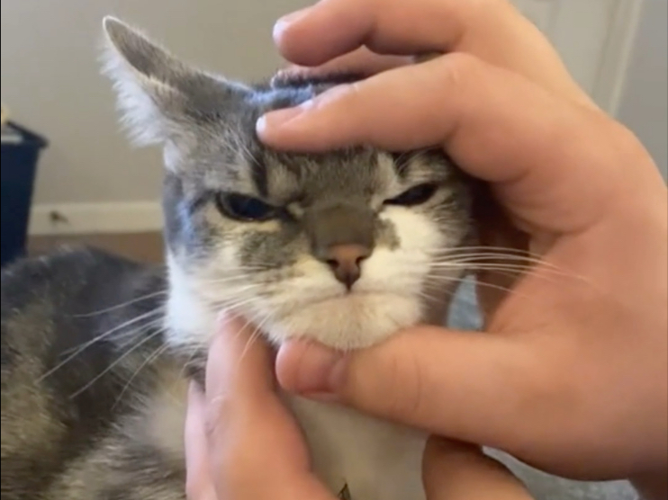 | 960 | 2025-10-18 |
| [【哈基米音乐】搁浅（曼波读瘾犯了）](https://www.bilibili.com/video/BV1DkWszPEfu) |  | 3769 | 2025-10-18 |
| [【翻唱】打火基  师傅你的头怎么圆圆的？](https://www.bilibili.com/video/BV14XWsz4EVh) |  | 4491 | 2025-10-18 |
| [布鲁斯：好哈基米等我肚子饿了，我来找你](https://www.bilibili.com/video/BV1diWszMEnw) | 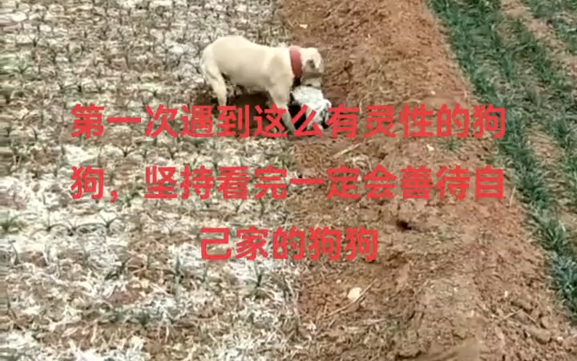 | 922 | 2025-10-18 |
| [哈基米牌南北绿豆](https://www.bilibili.com/video/BV1viWszuEX1) | 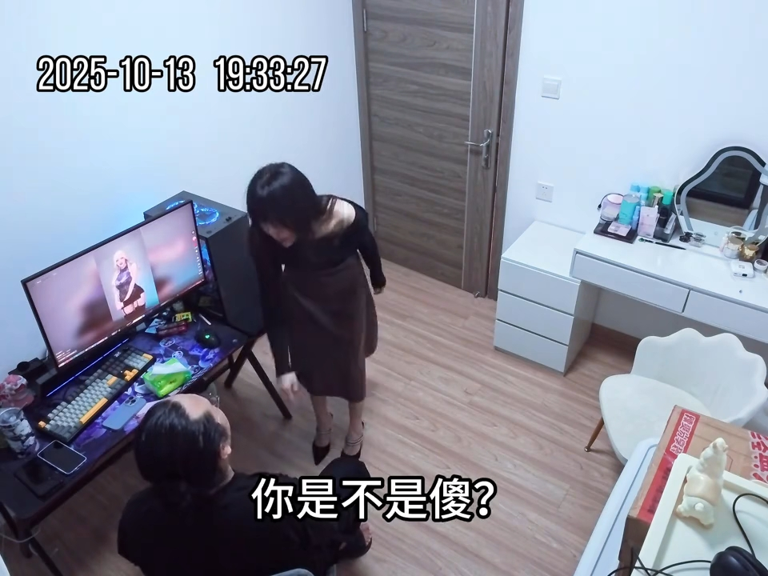 | 4751 | 2025-10-18 |
| [【哈基米FM】哈榄树](https://www.bilibili.com/video/BV1WFWxzQEpx) | 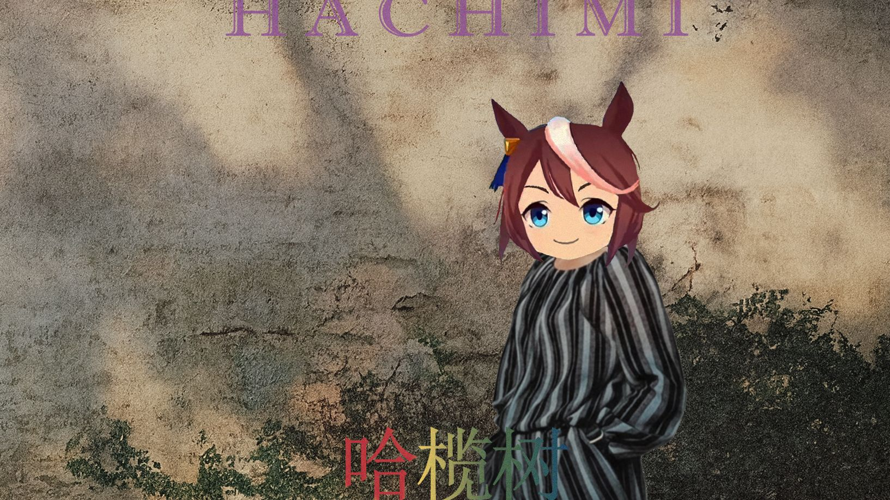 | 5516 | 2025-10-18 |
| [哈基米の山歌 （10分钟纯享版👍）](https://www.bilibili.com/video/BV14eWxzbEvc) |  | 387 | 2025-10-18 |
| [我把哈鸡煲加入了杀戮尖塔？最哈气的一集！【自制mod】](https://www.bilibili.com/video/BV16jWnzvExw) |  | 3541 | 2025-10-18 |
| [哈基米版汉尼拔上线：“尝尝这碗南北绿豆瘦肉粥喵～”](https://www.bilibili.com/video/BV16dWEzcErN) |  | 13.4万 | 2025-10-18 |
| [哈基米的最后一舞](https://www.bilibili.com/video/BV1PqWxz4EAM) | 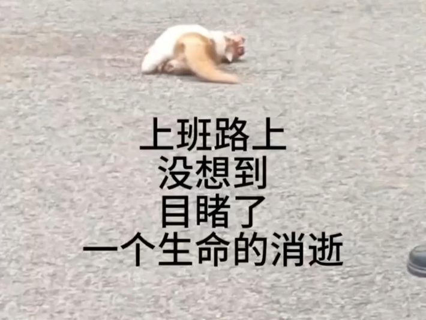 | 9042 | 2025-10-18 |
| [基米.哈根达斯](https://www.bilibili.com/video/BV1anWxzMEyA) | 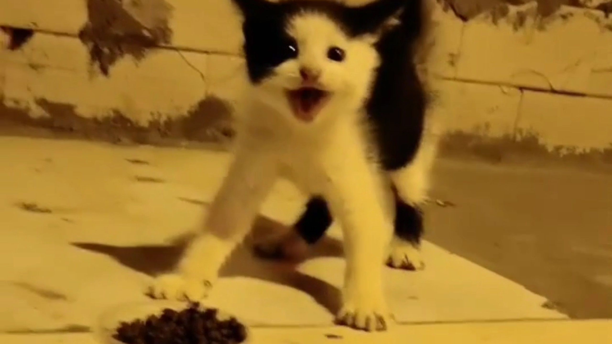 | 3252 | 2025-10-18 |
| [《放轻松，头晕是正常的》](https://www.bilibili.com/video/BV1XSW7zjEg4) | 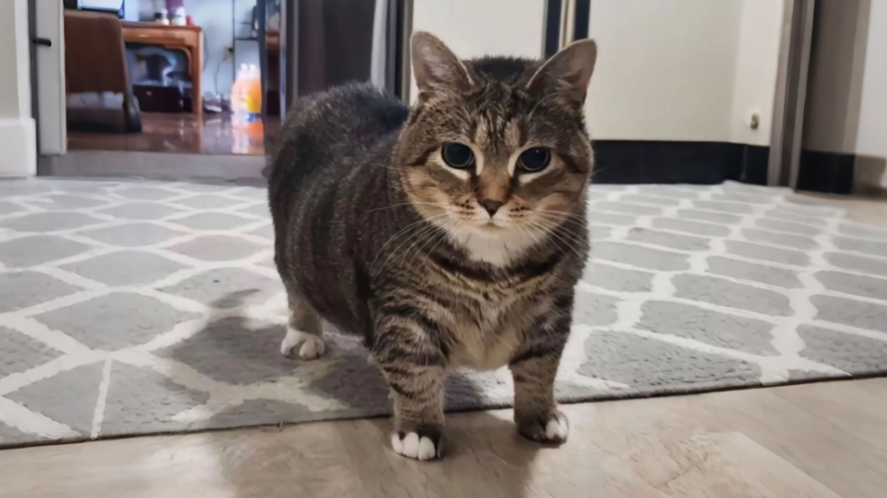 | 40.2万 | 2025-10-18 |
| [魔曼波【哈基米音乐】](https://www.bilibili.com/video/BV1C3Wpz2Ee9) |  | 493 | 2025-10-17 |
| [锐评大狗嚼俱乐部打手实力排行（2）](https://www.bilibili.com/video/BV1UFWnzjEEC) | 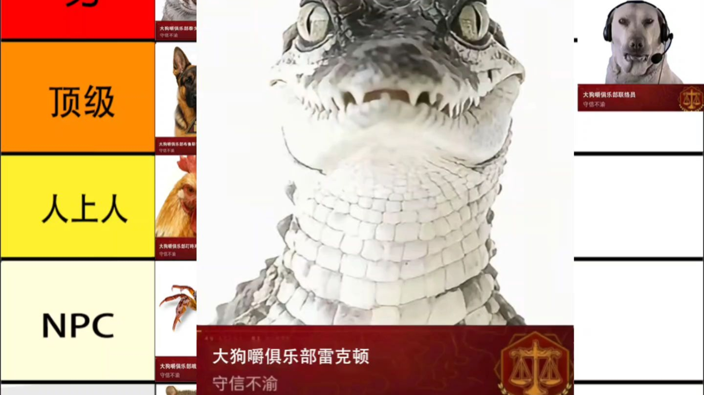 | 23.0万 | 2025-10-17 |
| [纯净哈基米：后会无期](https://www.bilibili.com/video/BV1zEWnzPExX) |  | 553 | 2025-10-17 |
| [【洛神杯】八喵齐聚军争，喵娘乱舞！决战哈基米之巅！谁是最会哈气的猫娘？](https://www.bilibili.com/video/BV1zJWnzYENp) |  | 4048 | 2025-10-17 |
| [基米小学：耄耄失眠的一夜](https://www.bilibili.com/video/BV1xmWnz5EzZ) | 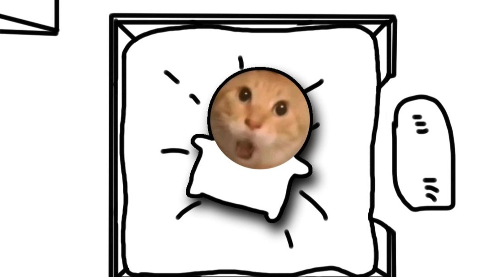 | 16.5万 | 2025-10-17 |
| [魏晋隐士与哈基米的惬意生活 ｜ 沉浸历史](https://www.bilibili.com/video/BV1gr4uzhEjJ) |  | 823 | 2025-10-17 |
| [所以说AI战胜不了人类！浴室翻唱《夜曲》，但哈基米！](https://www.bilibili.com/video/BV13DW7z1ETv) |  | 3.0万 | 2025-10-17 |
| [天 耄 八 部](https://www.bilibili.com/video/BV1dJWEzREyf) |  | 4.5万 | 2025-10-17 |
| [谁能听懂哈基米在说什么？](https://www.bilibili.com/video/BV1fLWEztEVf) | 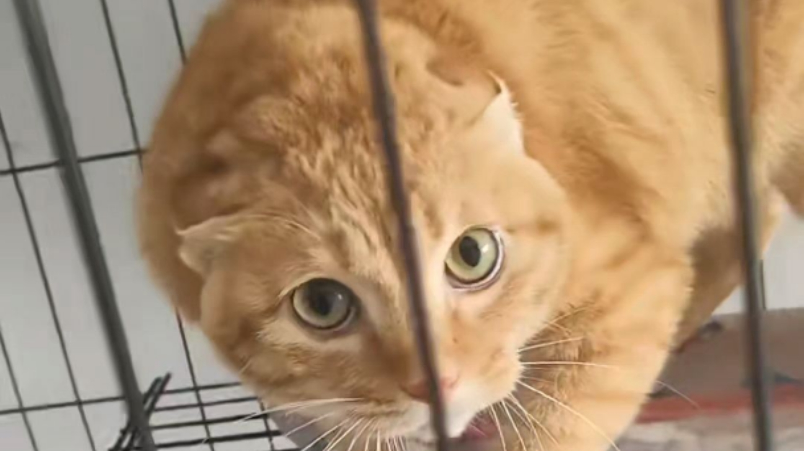 | 1.8万 | 2025-10-17 |
| [【Hi-Res无损】哈基米音乐《神曼波【哈基米音乐】》“见证哈基米音乐的里程碑，哈门~”](https://www.bilibili.com/video/BV1g6WCzEEMV) |  | 1936 | 2025-10-17 |
| [20后高能量哈基米一天vs 10后低能量哈基米一天](https://www.bilibili.com/video/BV1tqWEzVEtD) |  | 1734 | 2025-10-17 |
| [小猫这么爬楼梯一定有它的道理！！！](https://www.bilibili.com/video/BV14CWEzuEcs) | 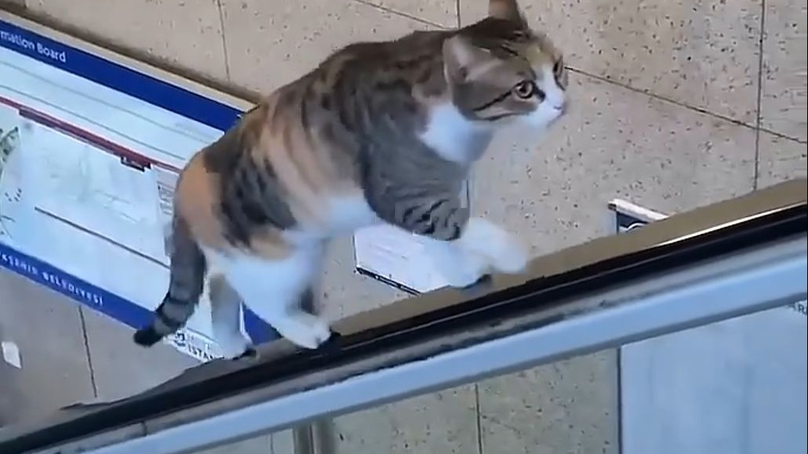 | 21.6万 | 2025-10-17 |
| [《命运：群星》赛博撸猫？哈基米悄咪咪出现的位置！](https://www.bilibili.com/video/BV1t6WEz3EFZ) | 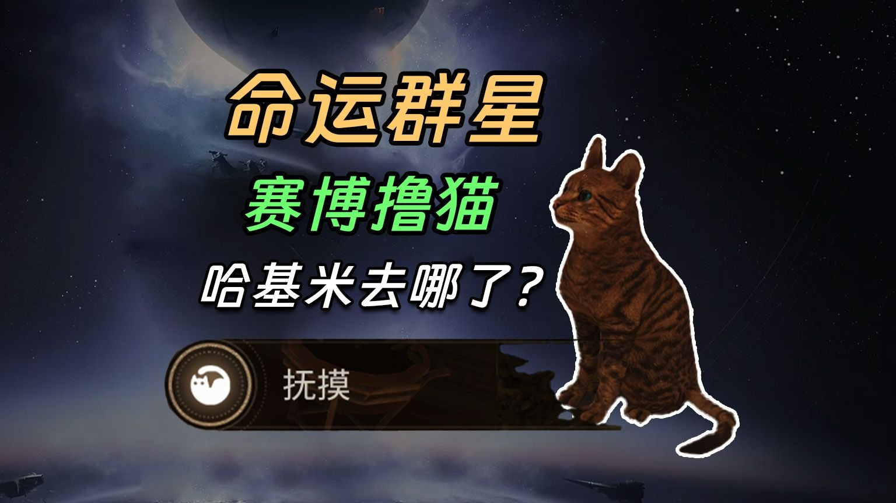 | 2792 | 2025-10-17 |
| [竟然有这样的哈基米！](https://www.bilibili.com/video/BV14NWCzGEWr) |  | 5575 | 2025-10-17 |
| [【哈基音乐】Unwelcome 哈基米 银行不妙这种事在这里也会发生吗（混音重置）](https://www.bilibili.com/video/BV18mWiz8E1w) |  | 1504 | 2025-10-17 |
| [哈基米的膝跳反射](https://www.bilibili.com/video/BV15TWJzXEM4) | 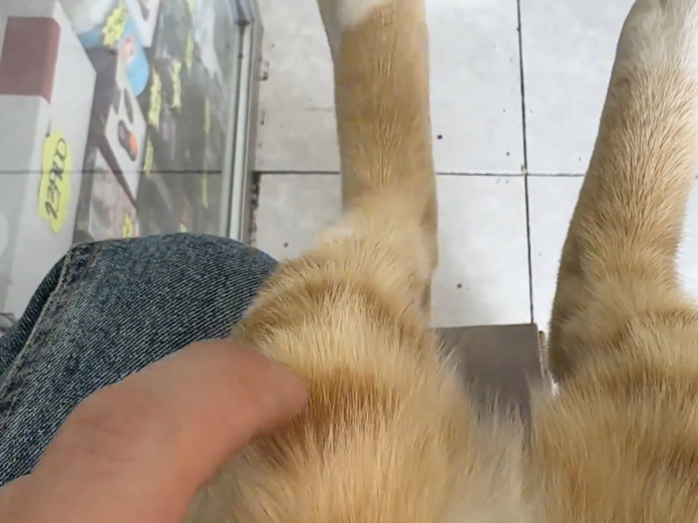 | 9.8万 | 2025-10-17 |
| [【活全家哈基米】哈属性](https://www.bilibili.com/video/BV1NCWrzBE7M) |  | 1.3万 | 2025-10-17 |
| [123我哈你](https://www.bilibili.com/video/BV1DLWYz9EzB) | 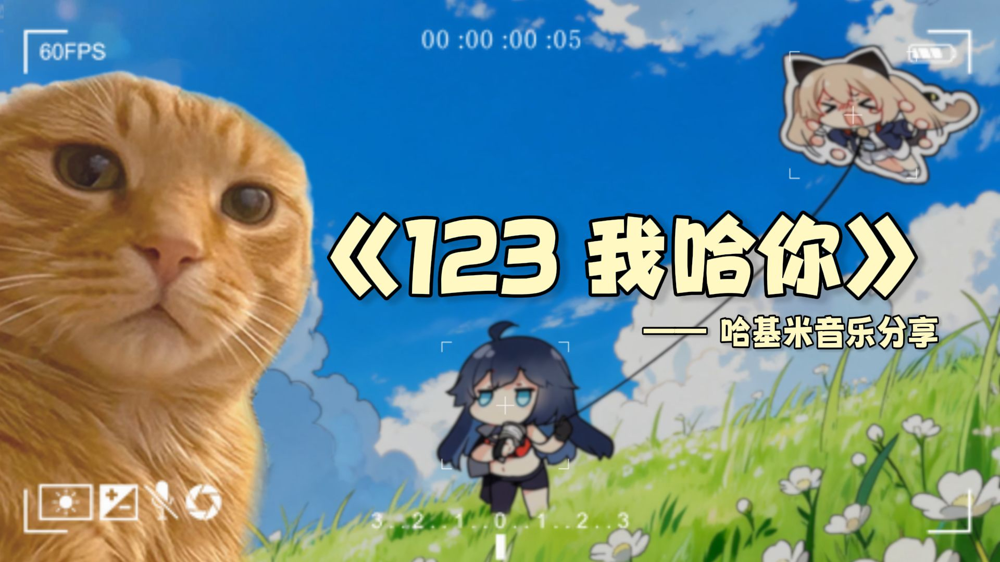 | 813 | 2025-10-17 |
| [哈基米：🐱风哈仪🐱](https://www.bilibili.com/video/BV1LiWBz1EEn) |  | 802 | 2025-10-17 |
| [【活侠传×哈基米音乐】子夜寄君哈](https://www.bilibili.com/video/BV1LxWCzZEiz) |  | 5662 | 2025-10-17 |
| [“【基不落】合唱”哈基寂寞摸摸寂寂。](https://www.bilibili.com/video/BV1RtWCzxEJQ) | 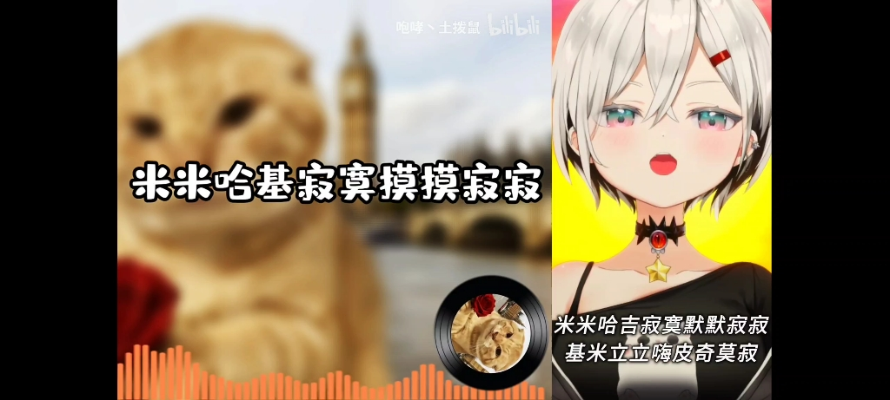 | 1032 | 2025-10-17 |
| [哈基米的底层代码](https://www.bilibili.com/video/BV1KNWCzGEKC) | 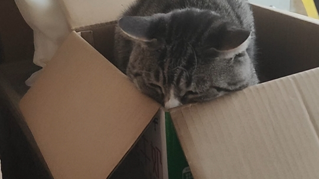 | 184 | 2025-10-17 |
| [哈基米牌零食，从夯到拉排名](https://www.bilibili.com/video/BV1kXWCzuECG) |  | 5808 | 2025-10-17 |
| [《褒皮书》](https://www.bilibili.com/video/BV1CXWCzuEB9) |  | 11.6万 | 2025-10-17 |
| [哈基米自己钓的鱼被哈基人抢走了](https://www.bilibili.com/video/BV1QvWCzDEvj) |  | 4.0万 | 2025-10-17 |
| [猫：底层代码已启动](https://www.bilibili.com/video/BV1zfWCzNE8k) | 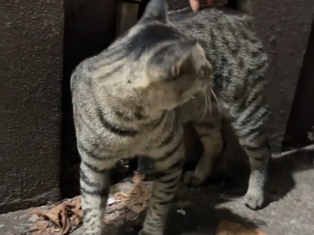 | 4700 | 2025-10-17 |
| [Nobody(哈基米版)](https://www.bilibili.com/video/BV1qNWyzcETb) | 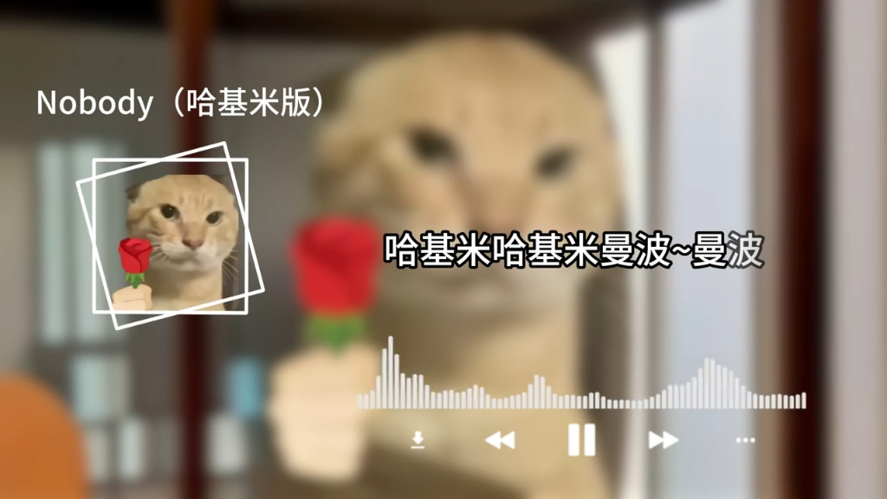 | 251 | 2025-10-17 |
| [【哈基米音乐】明日坐标](https://www.bilibili.com/video/BV1yhWyzVECm) |  | 1960 | 2025-10-17 |
| [哈基米神曲八大洗脑神曲，全听过的网瘾很大了！](https://www.bilibili.com/video/BV14uWizxEER) | 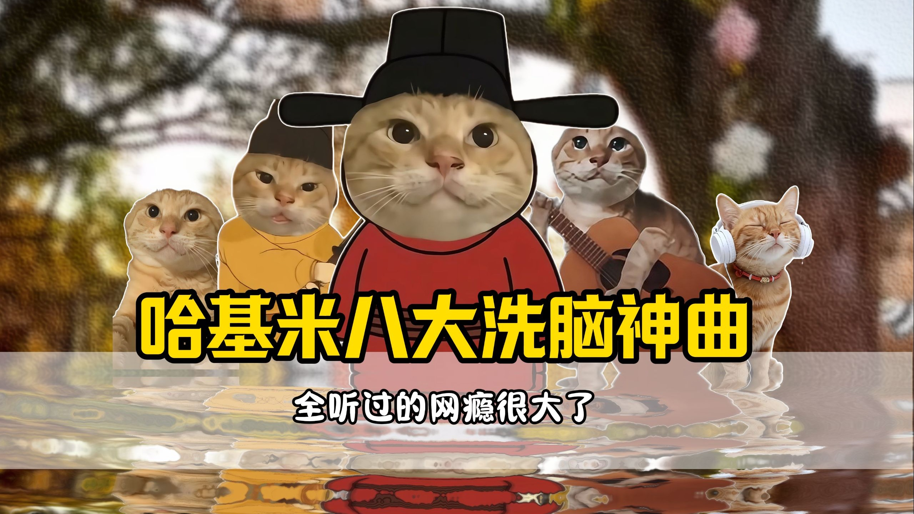 | 10.3万 | 2025-10-17 |
| [哈基米 猛攻战歌](https://www.bilibili.com/video/BV1K1WrzTETf) | 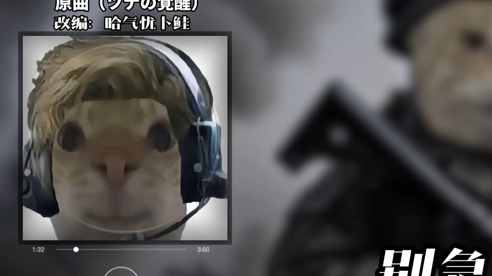 | 1002 | 2025-10-17 |
| [耄耋喜提南北绿豆](https://www.bilibili.com/video/BV1P1WrzTErQ) |  | 13.4万 | 2025-10-17 |
| [都说养儿防老，养猫也一样。](https://www.bilibili.com/video/BV1xiWqzoESY) | 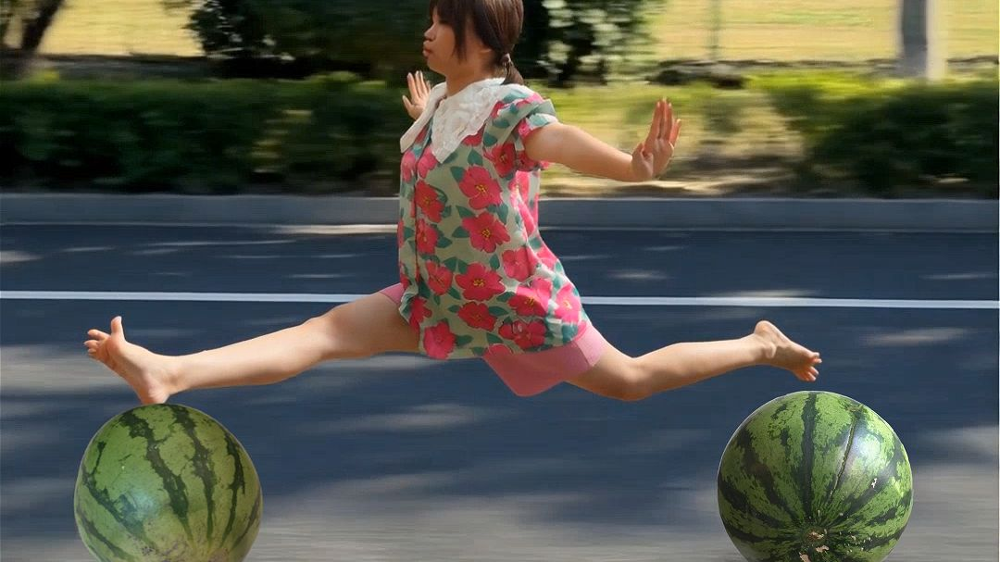 | 17.6万 | 2025-10-16 |
| [【哈基米音乐】看，哈基米！](https://www.bilibili.com/video/BV1j3WvzKEBh) |  | 1679 | 2025-10-16 |
| [哈基米南北绿豆是什么意思](https://www.bilibili.com/video/BV1kqWvz7EDh) |  | 669 | 2025-10-16 |
| [耄耋.....你没死啊（似是故人来）](https://www.bilibili.com/video/BV17tWizVEr9) | 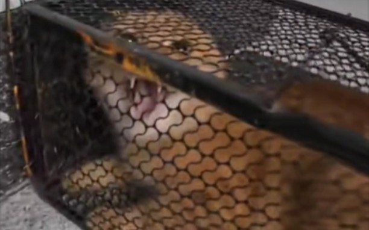 | 6.9万 | 2025-10-16 |
| [【哈基米方舟】促融共基#2（促融共竞PV哈基米音乐）](https://www.bilibili.com/video/BV1i1WYzPEqd) |  | 6868 | 2025-10-16 |
| [如何触发猫咪的底层代码？](https://www.bilibili.com/video/BV1Jb4izWEDu) |  | 8.8万 | 2025-10-15 |
| [是听了多少遍哈基米之歌啊，唱的如此熟练。[泪奔]](https://www.bilibili.com/video/BV1iF4izVEcb) | 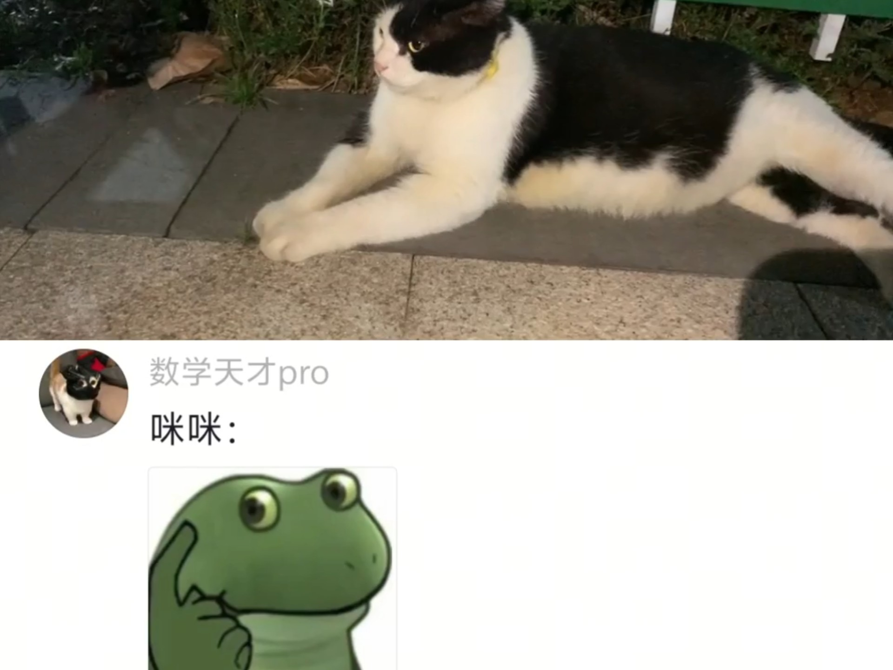 | 2.3万 | 2025-10-15 |
| [打火机（哈基米版）](https://www.bilibili.com/video/BV16M4qzdECw) | 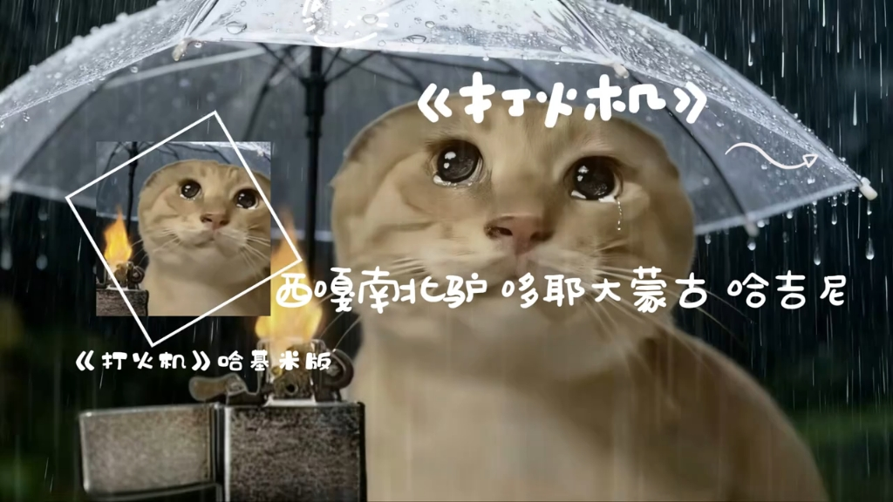 | 1002 | 2025-10-15 |
| [猫儿这个拒绝采访](https://www.bilibili.com/video/BV1AE4ezpE1p) | 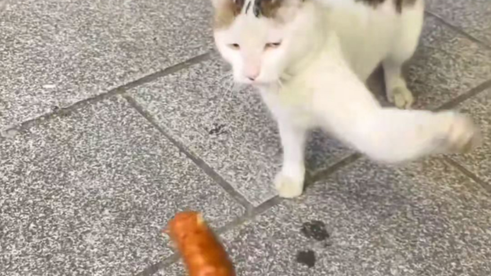 | 2.2万 | 2025-10-15 |
| [【哈基米】fairy stage（4修）](https://www.bilibili.com/video/BV1NE4ezpEFv) |  | 1946 | 2025-10-15 |
| [🐱没 哈 息🐱](https://www.bilibili.com/video/BV1Di48zWEin) |  | 657 | 2025-10-14 |
| [基米略人千百遍，基人待它如亲蝶](https://www.bilibili.com/video/BV1cV4tzaEt4) | 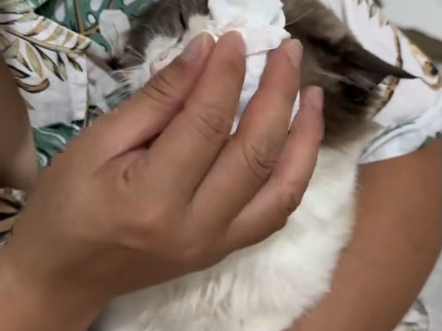 | 14.7万 | 2025-10-14 |
| [飞舞哈基虎🐯被哈基鼠吓哭了](https://www.bilibili.com/video/BV1XJ49zpEc9) | 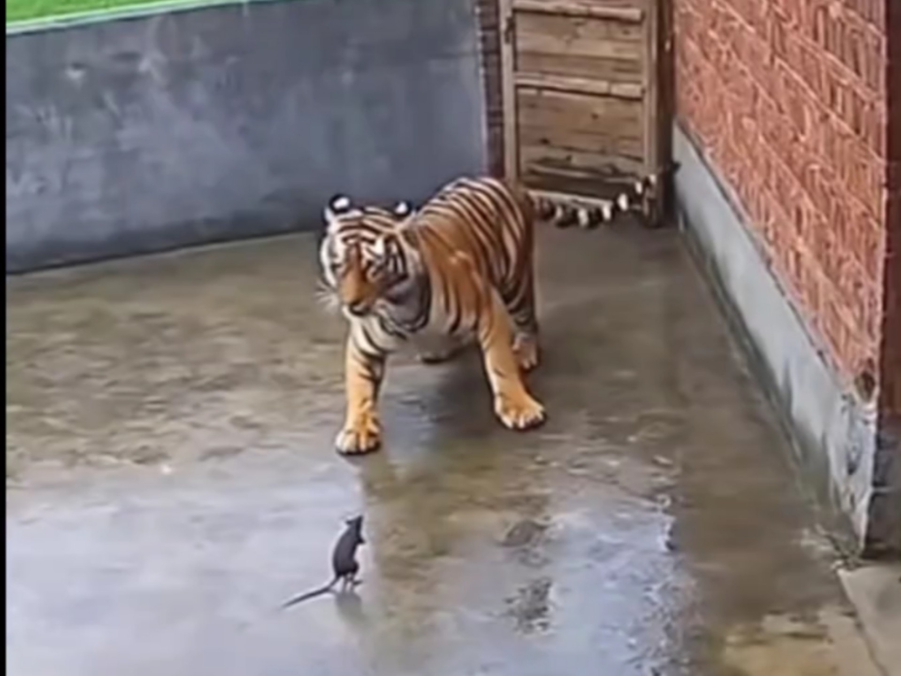 | 1494 | 2025-10-14 |
| [假如猫咪去学车（纯AI非实拍）](https://www.bilibili.com/video/BV12a49z5Egh) |  | 12.0万 | 2025-10-14 |
| [哈基米成为了布鲁斯的大便了](https://www.bilibili.com/video/BV1Ce4QzNEpm) | 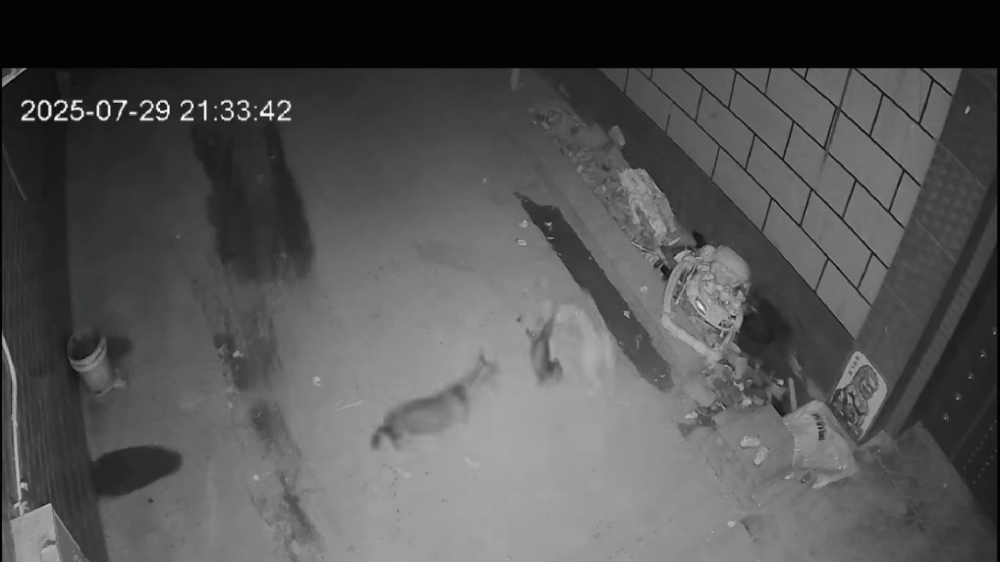 | 1984 | 2025-10-14 |
| [猫儿这个调皮，猫儿这个攻击火腿肠](https://www.bilibili.com/video/BV1be4UzBEYF) | 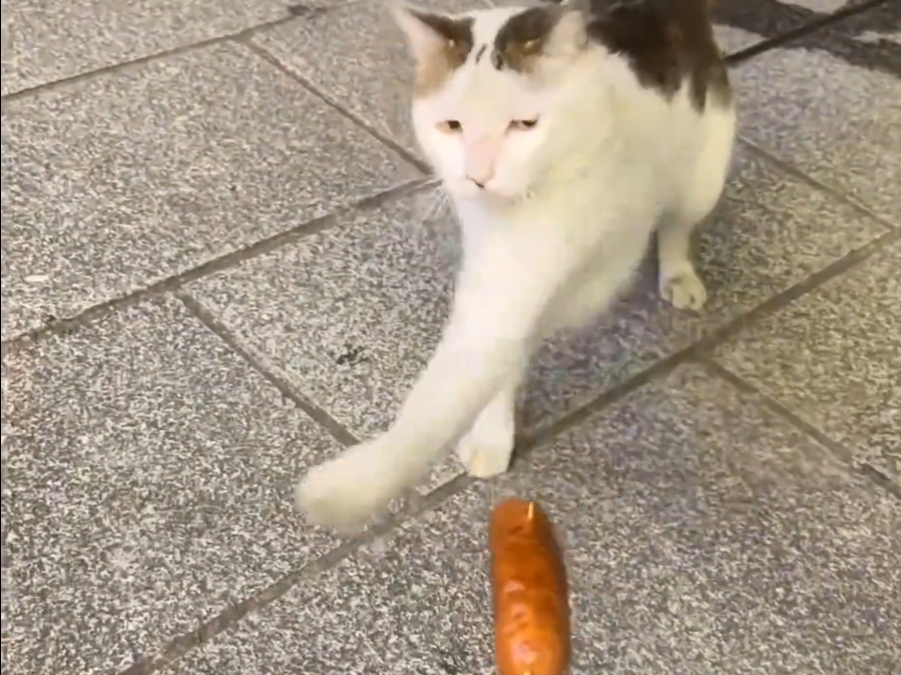 | 2890 | 2025-10-13 |
| [？？这个？？？](https://www.bilibili.com/video/BV1VW42zqEJt) | 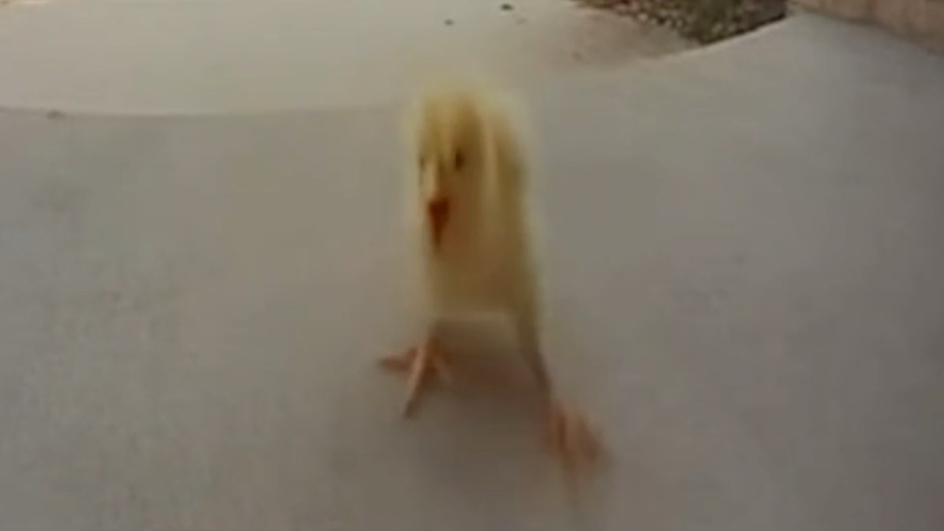 | 9.5万 | 2025-10-13 |
| [【哈基米音乐】《没出息》“本来应该从从容容哈哈气气！”](https://www.bilibili.com/video/BV1Pz42z4E31) |  | 1.2万 | 2025-10-13 |
| [Sora2爆火哈基米牌零食广告2.0，3分钟入门AI视频制作！AI生成视频零基础入门保姆级教程（2025最新）AI视频制作全流程教学！](https://www.bilibili.com/video/BV1eB41zMEh1) |  | 3191 | 2025-10-13 |
| [哈基米音乐：《夜航基》 哈基米，前进四！！！](https://www.bilibili.com/video/BV1va4uziEzr) |  | 4674 | 2025-10-12 |
| [哈基米牌病毒广告](https://www.bilibili.com/video/BV1Nu4TzyETw) |  | 3215 | 2025-10-12 |
| [弱小无助](https://www.bilibili.com/video/BV1Aa47zzE48) |  | 4.7万 | 2025-10-10 |
| [曼波出处](https://www.bilibili.com/video/BV1HwxBzdEGx) |  | 2.1万 | 2025-10-08 |
| [⚡复刻鼠鼠表情包⚡家中爱耄也是出COS了](https://www.bilibili.com/video/BV1sexfzsEDD) | 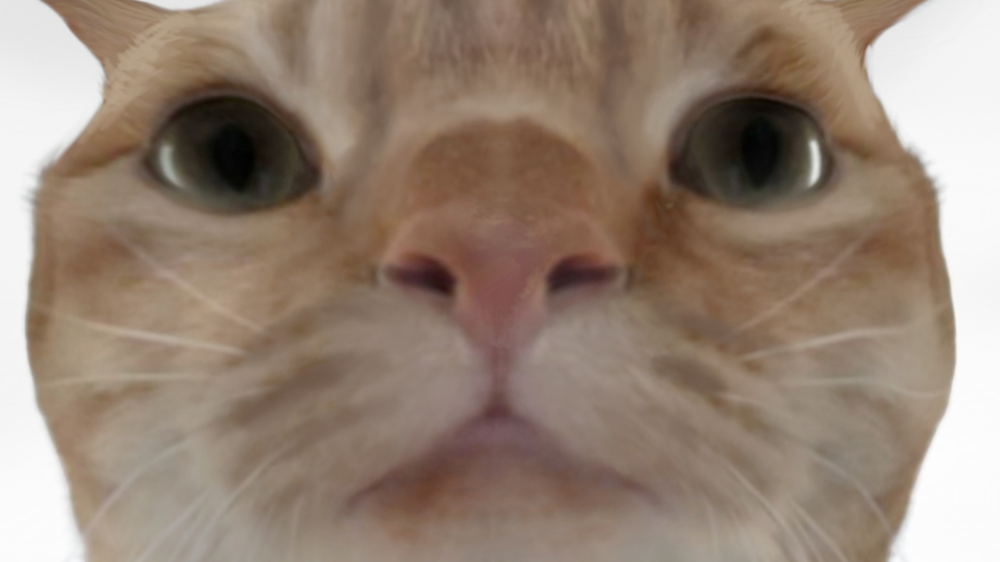 | 74.6万 | 2025-10-08 |
| [循环歌单｜【云南打跳】｜“【远古时期云南人の小曲】【哈尼宝贝の小曲】”](https://www.bilibili.com/video/BV13wxxzMEWF) |  | 118.8万 | 2025-10-05 |
| [“摇滚哈基米”~哈基米！~曼！波！#哈基米](https://www.bilibili.com/video/BV1rPx4zREAd) |  | 1836 | 2025-10-04 |
| [偶遇野生暴毙哈基米](https://www.bilibili.com/video/BV1CoHgz6Egu) | 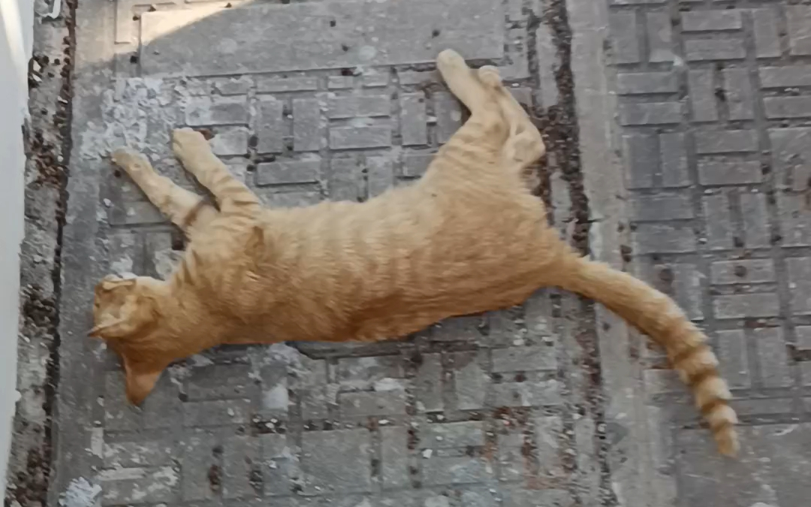 | 1.5万 | 2025-10-03 |
| [【哈基米】🐱旅人🐱 MV](https://www.bilibili.com/video/BV12QnBz9EYz) |  | 1757 | 2025-09-29 |
| [《蜜雪冰城哈基米》你爱我~我爱你 哈基米 甜蜜蜜](https://www.bilibili.com/video/BV1CG8UzeEs2) | 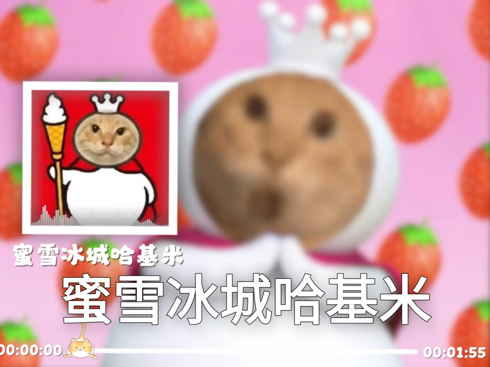 | 6.6万 | 2025-07-31 |
| [遇到哈基米偷吃我们的外卖该怎么办？](https://www.bilibili.com/video/BV1NfoiYbELc) | 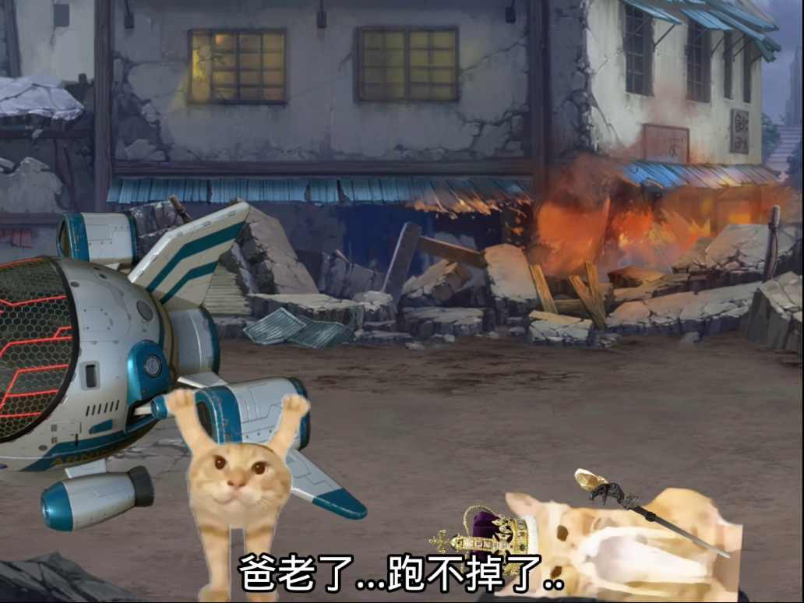 | 372.4万 | 2025-03-26 |
| [我的电子哈基米哈哈哈花花](https://www.bilibili.com/video/BV1Yu411n78R) | 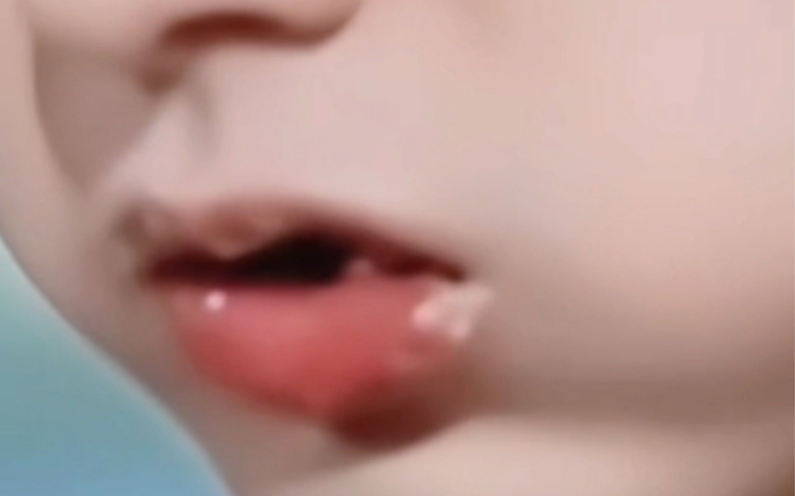 | 103.8万 | 2023-08-11 |

---
*最后更新: 2025-10-19 02:42:05 (自动生成)*
*数据来源: [Bilibili](https://www.bilibili.com)*

## 使用说明

运行以下命令更新视频列表:
```bash
python3 fetch_hajimi_videos.py
```
