# awesome-hajimi
collections of hajimi (哈基米 in Chinese) on the Internet.

## 视频列表 (Video List)

| 视频标题 (Title) | 封面 | 播放量 (Views) | 发布日期 (Date) |
|---|---|---|---|
| [循环歌单｜月底没钱君《神曼波》哈基米の神曲](https://www.bilibili.com/video/BV15vizBbEoU) |  | 10 | 2026-01-04 |
| [【肖肖哈基米的店】更新了一条视频，快来围观！](https://www.bilibili.com/video/BV12qikB9Exy) |  | 0 | 2026-01-04 |
| [【哈基米音乐】𝓘⚡️𝓦𝓐𝓝𝓣⚡️𝓨𝓞𝓤⚡️𝓣𝓞⚡️𝓚𝓝𝓞𝓦⚡️](https://www.bilibili.com/video/BV1tuizBjEVs) |  | 113 | 2026-01-04 |
| [本哈基米最喜欢零元购了！](https://www.bilibili.com/video/BV1eFizBpEu9) |  | 4 | 2026-01-04 |
| [《全网最火的哈基米之歌》你听过几首？](https://www.bilibili.com/video/BV1Dxi6BWE2f) |  | 441 | 2026-01-03 |
| [生命不泯灭于泛泛，我在哈气中重生#耄耋#哈基米](https://www.bilibili.com/video/BV1oVi6BaEWk) |  | 76 | 2026-01-03 |
| [主包比不上哈基米](https://www.bilibili.com/video/BV1QEiBBnEos) |  | 12 | 2026-01-03 |
| [哈基米——樱桃炸弹版](https://www.bilibili.com/video/BV1wFiBBeE3P) |  | 11 | 2026-01-03 |
| [哈基米终极亏手combo](https://www.bilibili.com/video/BV1cwiBBAEei) |  | 12 | 2026-01-03 |
| [哈基米：它曾经哈过啊（feat. 电棍）](https://www.bilibili.com/video/BV1dgiBBdE8Y) |  | 96 | 2026-01-03 |
| [roblox音乐id 哈基米](https://www.bilibili.com/video/BV1JxizBvEDS) |  | 29 | 2026-01-03 |
| [哈基鹿老师的哈基米组曲](https://www.bilibili.com/video/BV1LvizBbEwx) |  | 184 | 2026-01-03 |
| [谁是最强哈基米meme?](https://www.bilibili.com/video/BV1kqiiB8Ery) |  | 415 | 2026-01-03 |
| [哈基米：艾瑞卡](https://www.bilibili.com/video/BV1kiiiBcEEV) |  | 265 | 2026-01-03 |
| [哈基米.EXE【MyGun！冬雪联！】](https://www.bilibili.com/video/BV1hfiiBLEYL) |  | 1156 | 2026-01-03 |
| [那一天哈基米变成了光](https://www.bilibili.com/video/BV1bKiqB6EgJ) |  | 442 | 2026-01-03 |
| [纪念哈基米。](https://www.bilibili.com/video/BV1BsiqBtEmp) |  | 31 | 2026-01-03 |
| [【哈基米洲】最新视频上线，求关注！](https://www.bilibili.com/video/BV1zpiqBfEmF) |  | 2 | 2026-01-03 |
| [神哈基米【哈基米音乐】](https://www.bilibili.com/video/BV1nsiqBtEw6) |  | 53 | 2026-01-03 |
| [什么！你说这样的暖手宝竟然有两个？](https://www.bilibili.com/video/BV1VeiqBHE2a) | 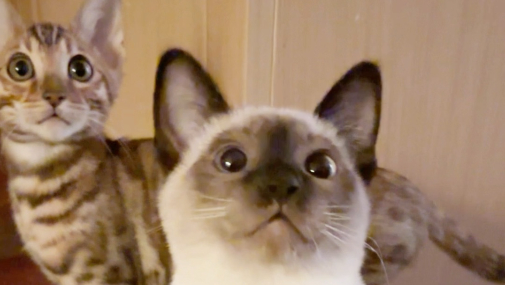 | 2572 | 2026-01-03 |
| [【楠楠食品】楠楠哈基米南北绿豆历年广告（2013-）](https://www.bilibili.com/video/BV1s5iqBNEqu) |  | 25 | 2026-01-03 |
| [跨年晚会哈基米神曲，我还以为是Ai](https://www.bilibili.com/video/BV1TSiqB3E7s) |  | 4078 | 2026-01-03 |
| [哈基米曼波聊天对话机器人](https://www.bilibili.com/video/BV1K9iqBBE7u) | 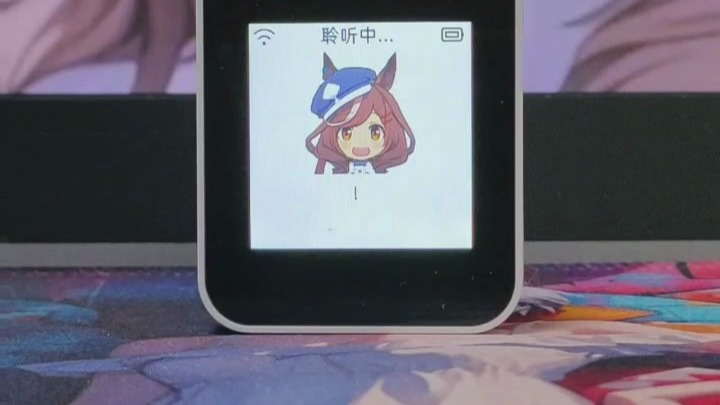 | 1 | 2026-01-03 |
| [尼康Z30（哈基米战歌）](https://www.bilibili.com/video/BV1GBiqBUEnh) |  | 39 | 2026-01-03 |
| [为什么把猎豹当野生哈基米养？只因是猫科动物吗？](https://www.bilibili.com/video/BV1gyiqByEzs) |  | 87 | 2026-01-03 |
| [挂机阵，来听哈基米](https://www.bilibili.com/video/BV18riqB2EoE) |  | 23 | 2026-01-03 |
| [【哈基米】哈基米之舞【马口铁之舞】](https://www.bilibili.com/video/BV1DriqB2EXb) |  | 367 | 2026-01-03 |
| [哈基米南北绿豆，阿西噶阿西～](https://www.bilibili.com/video/BV1DriqB2E32) |  | 32 | 2026-01-03 |
| [【哈基米洲】最新视频来袭，快来看看吧！](https://www.bilibili.com/video/BV1SCiqBLEo7) |  | 42 | 2026-01-03 |
| [日V猫猫看圆头耄耋 好凶的猫【子猫球】](https://www.bilibili.com/video/BV1F8vZBQE6R) |  | 3309 | 2026-01-03 |
| [哈基米/碧梨-《一根耄毛》](https://www.bilibili.com/video/BV1YQieBGEGw) |  | 469 | 2026-01-03 |
| [哈基米这个高频共振](https://www.bilibili.com/video/BV1aQieBGEQK) | 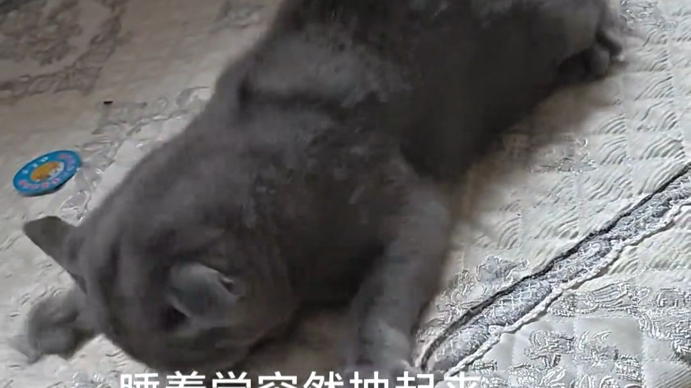 | 7033 | 2026-01-03 |
| [鼠鼠害怕打正面 鼠鼠只想偷钩子有什么错](https://www.bilibili.com/video/BV1zHivBQEkt) |  | 2.3万 | 2026-01-03 |
| [《哈 基 米 南 北 路 堵》](https://www.bilibili.com/video/BV1yxiFBwEgR) |  | 6631 | 2026-01-03 |
| [当我在PK中拿出六只小猫咪，哈基米南北绿豆太强大了！评论区换蛋哦](https://www.bilibili.com/video/BV1K2icBqESx) |  | 6017 | 2026-01-03 |
| [...最权威的2025基米音乐翻唱！【1~12月】](https://www.bilibili.com/video/BV1itivBmEmu) |  | 153 | 2026-01-03 |
| [哈基米日常发颠](https://www.bilibili.com/video/BV1s3ivBbEKk) |  | 128 | 2026-01-03 |
| [【音MAD】哈基米曼波战士【Hachimitoon】](https://www.bilibili.com/video/BV1s3ivBbEVj) |  | 523 | 2026-01-03 |
| [听哈基米歌做树下回环](https://www.bilibili.com/video/BV1HGivBZEXJ) |  | 101 | 2026-01-03 |
| [哈基米英短金渐层](https://www.bilibili.com/video/BV1H7ivBsEGW) |  | 42 | 2026-01-03 |
| [高山上的基米 (传统约德尔哈气)](https://www.bilibili.com/video/BV16EivB9E3b) |  | 35 | 2026-01-03 |
| [假如猫和老鼠有血条 第1期 美国老鼠杰瑞](https://www.bilibili.com/video/BV1NSivBYEGh) |  | 2053 | 2026-01-03 |
| [2026第一次薅哈基米～](https://www.bilibili.com/video/BV1KSivBYEgg) |  | 47 | 2026-01-03 |
| [哈基米在路边见人就挠谁来收养一下(无奈补档)](https://www.bilibili.com/video/BV1ARivBFE3j) |  | 1.1万 | 2026-01-03 |
| [【纯净哈基米】给你500万，代价是在春节前只能看一个视频，你会选哪个？《green to blue》《ai的小曲》](https://www.bilibili.com/video/BV1AdivBbE52) |  | 2310 | 2026-01-03 |
| [哈基米勇闯北舞](https://www.bilibili.com/video/BV1PXivBhEqd) |  | 76 | 2026-01-03 |
| [有没有可能是基米自己开的鱼摊呢](https://www.bilibili.com/video/BV13qivBrEwt) | 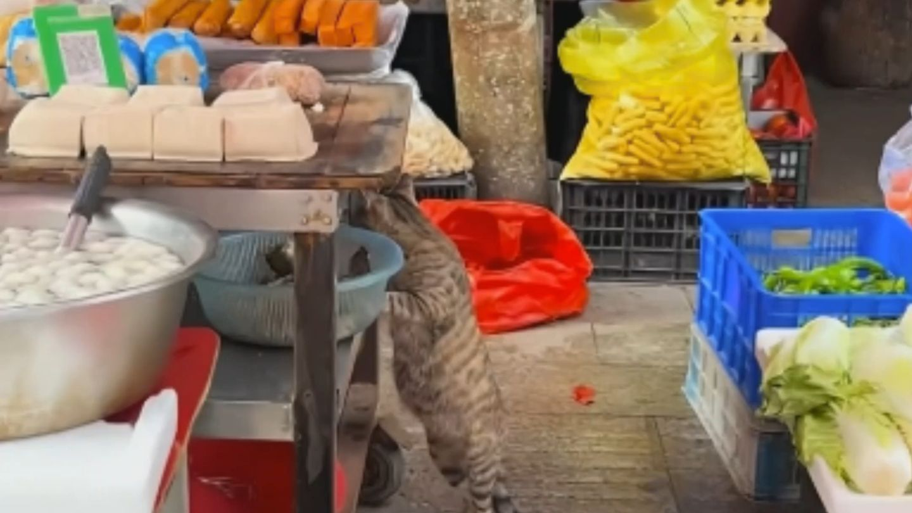 | 121 | 2026-01-03 |
| [“当bro在不同时间遇到哈基米”](https://www.bilibili.com/video/BV1MkivBME89) |  | 4.9万 | 2026-01-03 |
| [闲得无聊按网上教程做哈基米音乐](https://www.bilibili.com/video/BV1rfivB4EQ4) |  | 123 | 2026-01-03 |
| [哈基米突然这样了怎么办](https://www.bilibili.com/video/BV1n3iYBDEQc) | 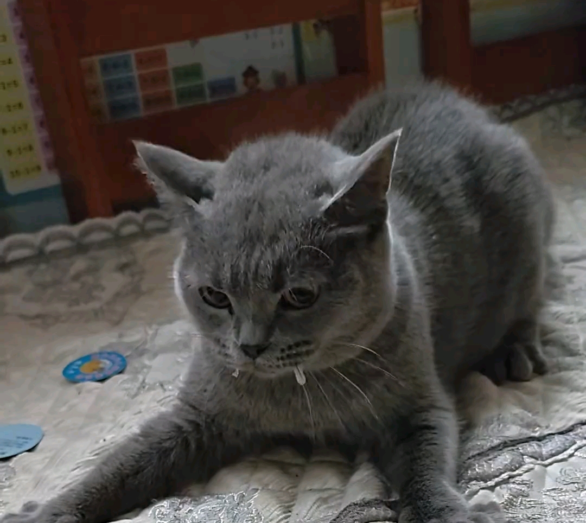 | 1721 | 2026-01-03 |
| [关住哈基米！](https://www.bilibili.com/video/BV1N2iYBoEaH) | 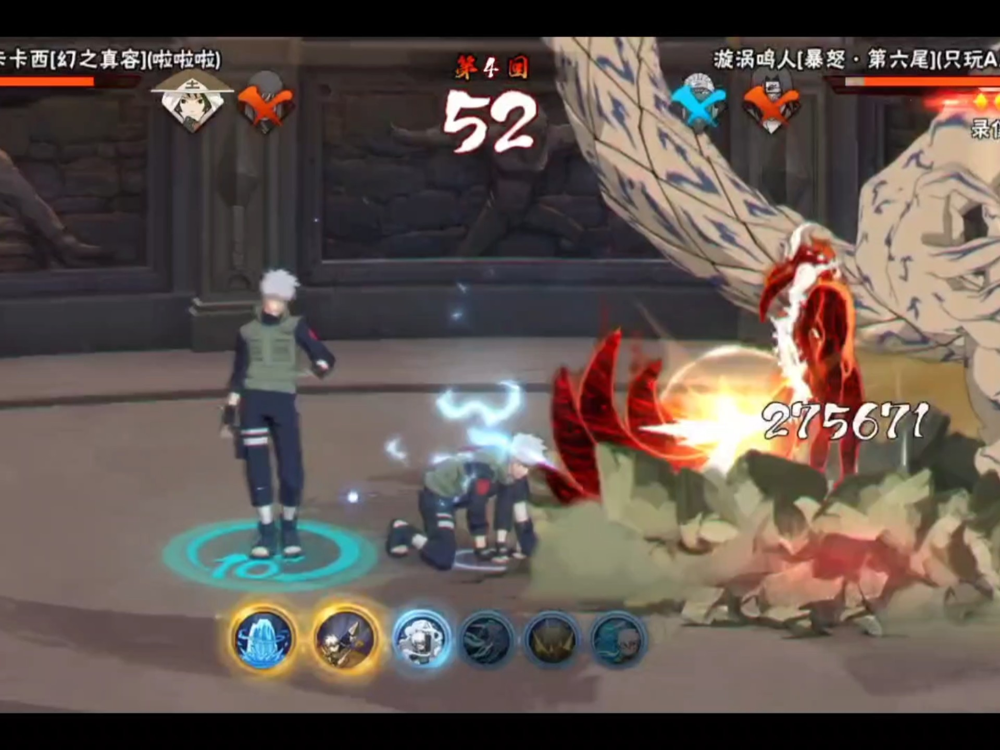 | 0 | 2026-01-03 |
| [把基米拼好给你_#哈基米](https://www.bilibili.com/video/BV1wSiYBRE9P) |  | 23 | 2026-01-03 |
| [哈基米 [地球仪] [松泽由美] (圣斗士星矢之冥王十二宫篇)](https://www.bilibili.com/video/BV1dTieBGEqS) |  | 220 | 2026-01-03 |
| [假如科比养了圆头耄耋](https://www.bilibili.com/video/BV1xcihBSE4k) |  | 3.8万 | 2026-01-03 |
| [哈基米录像之专注](https://www.bilibili.com/video/BV1KkihBQE3r) |  | 103 | 2026-01-03 |
| [哈基米又来了！测绘设备也不在话下！](https://www.bilibili.com/video/BV1xrihBpE17) |  | 442 | 2026-01-03 |
| [装睡哈基米](https://www.bilibili.com/video/BV1RMiwBHE3Z) |  | 602 | 2026-01-03 |
| [哈基米合集](https://www.bilibili.com/video/BV1MBihBsE7c) |  | 89 | 2026-01-03 |
| [哈基米乐队《喵喵喵》](https://www.bilibili.com/video/BV1TvihB4E63) |  | 15 | 2026-01-03 |
| [阳光下的哈基米，是哈气的](https://www.bilibili.com/video/BV1QGiaBcEsg) |  | 867 | 2026-01-03 |
| [【K字仇杀队】基米学——我说我赢我斩沙](https://www.bilibili.com/video/BV1ypi8B1E7p) | 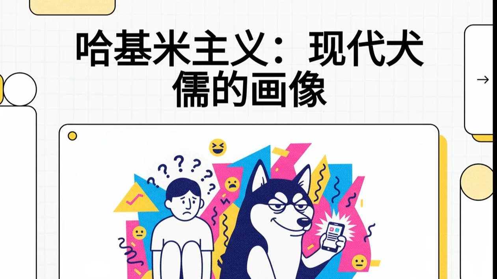 | 60 | 2026-01-02 |
| [耄耋劲舞合集](https://www.bilibili.com/video/BV1a2i8BFEE6) |  | 277 | 2026-01-02 |
| [【K字仇杀队】基米学——从野狗到哈基米](https://www.bilibili.com/video/BV1rLicBZEvF) |  | 121 | 2026-01-02 |
| [Primrose hachimi](https://www.bilibili.com/video/BV1HVicBFEPP) |  | 1470 | 2026-01-02 |
| [面对恐惧的最好办法就是播放哈基米音乐](https://www.bilibili.com/video/BV1xMicBYEc9) |  | 170 | 2026-01-02 |
| [乖巧小哈基](https://www.bilibili.com/video/BV1uzicBGEKc) |  | 54 | 2026-01-02 |
| [[MHWI]白手套龙战斗曲「黄泉を統べる死を哈基米」](https://www.bilibili.com/video/BV1giicB5Ee7) |  | 267 | 2026-01-02 |
| [[maimai自制谱面] 哈雪大帽险 全站第一哈气文字押 Lv.13+.6 [MMFC12场外？？？]](https://www.bilibili.com/video/BV1sQicBPEuk) |  | 2045 | 2026-01-02 |
| [神人官方逆天操作，竟然让哈基米实现赛博永生？【乐子快爆】](https://www.bilibili.com/video/BV1P6iMBREUB) |  | 24.8万 | 2026-01-02 |
| [傻逼R星的猫不会上台阶](https://www.bilibili.com/video/BV1cmvoBnEqC) |  | 8341 | 2026-01-02 |
| [冰雪节耄耋进屋后续，痛失比亚迪碎片（邻居的猫）](https://www.bilibili.com/video/BV1AyvoBpE3Y) | 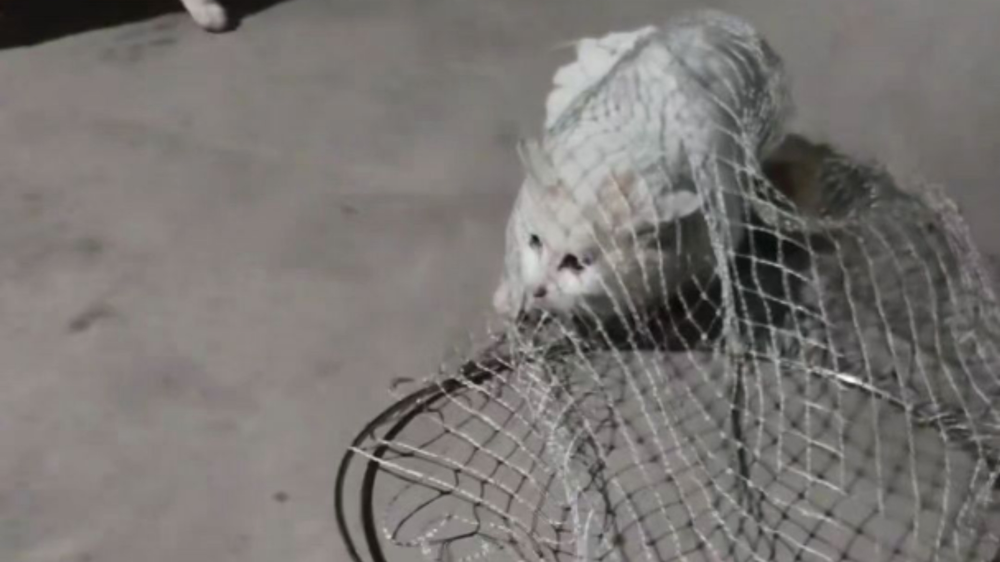 | 1.5万 | 2026-01-02 |
| [【东方哈基米音乐】基米的世界（原曲不使用）](https://www.bilibili.com/video/BV1VRvDBHEBh) |  | 733 | 2026-01-02 |
| [【哈基米音乐】明日方舟蛮（曼）波行动主题曲-Operation Wild Manbo](https://www.bilibili.com/video/BV1x9v9BUEC2) |  | 2666 | 2026-01-02 |
| [可怜的毛孩子被送回喵星了](https://www.bilibili.com/video/BV1MMv9BnEoq) | 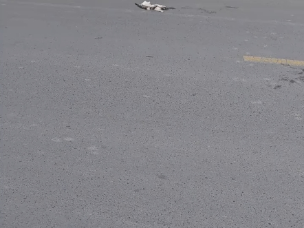 | 1840 | 2026-01-01 |
| [哈基米封神](https://www.bilibili.com/video/BV1pjvQBTEDS) |  | 2216 | 2026-01-01 |
| [【A_SOUL】贝拉kira《哈基米南北绿豆》](https://www.bilibili.com/video/BV1n8iuBnEiG) |  | 155 | 2025-12-31 |
| [哈基米《新年快乐》！快接收你的电子年货](https://www.bilibili.com/video/BV1XFvYBNE1W) |  | 281 | 2025-12-30 |
| [大狗为什么嚼哈基咪](https://www.bilibili.com/video/BV1cBv8BkEUo) |  | 5716 | 2025-12-30 |
| [【圆头耄耋】误闯你家，劝你放下手中叉，张口欲哈声却哑](https://www.bilibili.com/video/BV1Wgv4BPE77) | 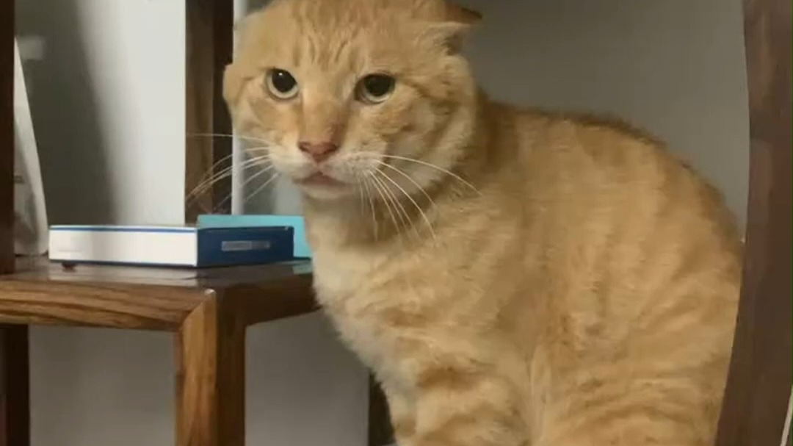 | 1095 | 2025-12-29 |
| [耄耋，但是弱水三千](https://www.bilibili.com/video/BV1sTv4BKEeM) |  | 186 | 2025-12-29 |
| [闭好嘴](https://www.bilibili.com/video/BV14XvHBFEQL) |  | 11.1万 | 2025-12-29 |
| [圣诞哈基米:We Wish You a Merry Christmas](https://www.bilibili.com/video/BV1Q7BUBUEuF) |  | 2024 | 2025-12-25 |
| [初音未来想唱一首哈基米巴赫：哥德堡变奏曲 - 变奏3 - 同度卡农](https://www.bilibili.com/video/BV1boByBiEqa) |  | 158 | 2025-12-24 |
| [果神双倍输了以后看红色哈基米解压，看到fg在上高感觉天塌了。接了杯水回来看见fg在守高又笑出了声，龙神奶哥要抓醋，fg积极自首，果神喜笑颜开](https://www.bilibili.com/video/BV1fNqyB7Eyk) |  | 2.2万 | 2025-12-21 |
| [下雪啦](https://www.bilibili.com/video/BV1a5m7BXEu2) | 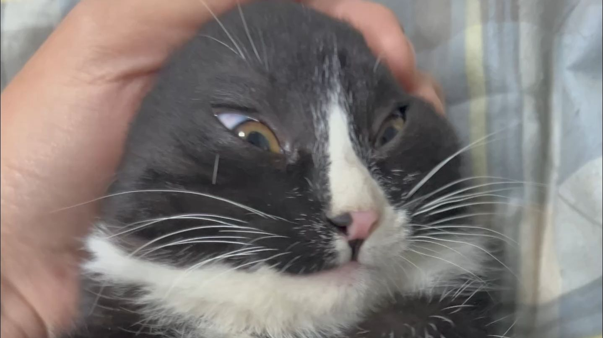 | 1234 | 2025-12-12 |
| [哈基米之一毛不拔铁公鸡](https://www.bilibili.com/video/BV1PsmsBFECG) |  | 707 | 2025-12-10 |
| [锐评锐评锐评从夯到拉从夯到拉从夯到拉](https://www.bilibili.com/video/BV1VdmJBYEb2) |  | 385.5万 | 2025-12-09 |
| [基米小学：耄耄的表妹创意来源@意大利面伴卤蛋](https://www.bilibili.com/video/BV1To2DBgEL9) | 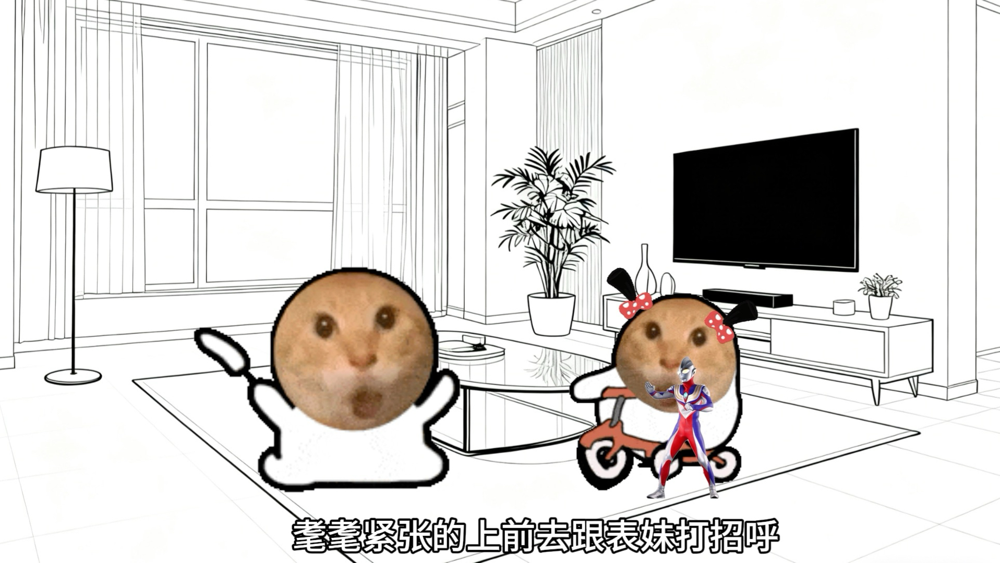 | 1350 | 2025-12-09 |
| [白猫在马路上匍匐前进。等待着司机避让他，场面确实让人暖心。你是司机你会为了猫狗故意避让，甚至不顾自己和他人安全吗？希望没这样的马路杀手。如果有，建议你重开](https://www.bilibili.com/video/BV1jC2XBoEXA) |  | 6796 | 2025-12-06 |
| [《往事只能哈基米》¥@%！#&amp;@](https://www.bilibili.com/video/BV1oz2EBhEpa) |  | 1.7万 | 2025-12-06 |
| [哈吉米哈吉米](https://www.bilibili.com/video/BV1tjUQBVETi) |  | 1695 | 2025-11-25 |
| [【先导篇】die for hachimi](https://www.bilibili.com/video/BV1Vh1fBKEgG) |  | 2.2万 | 2025-11-06 |
| [奇迹再哈 哈基米版](https://www.bilibili.com/video/BV1PtxezpEob) |  | 2158 | 2025-10-08 |
| [【基霸6】哈基尔夫主题曲~🐱R.E.D.🐱~完整版](https://www.bilibili.com/video/BV1NYnjztEbd) |  | 13.1万 | 2025-09-27 |
| [哈基米来打三角洲！！](https://www.bilibili.com/video/BV1A9H9zaEjY) |  | 9967 | 2025-09-10 |
| [耄耋有股媚劲](https://www.bilibili.com/video/BV1aUHUz8E8B) |  | 47.8万 | 2025-09-10 |
| [“就这个停顿爽！”｜《伯虎说dj》双声道停顿版](https://www.bilibili.com/video/BV1q6a5zPEN8) |  | 124.9万 | 2025-08-31 |
| [哈基米协奏曲：AI人声演绎《勃兰登堡协奏曲第三号》](https://www.bilibili.com/video/BV11HMFz2Eec) | 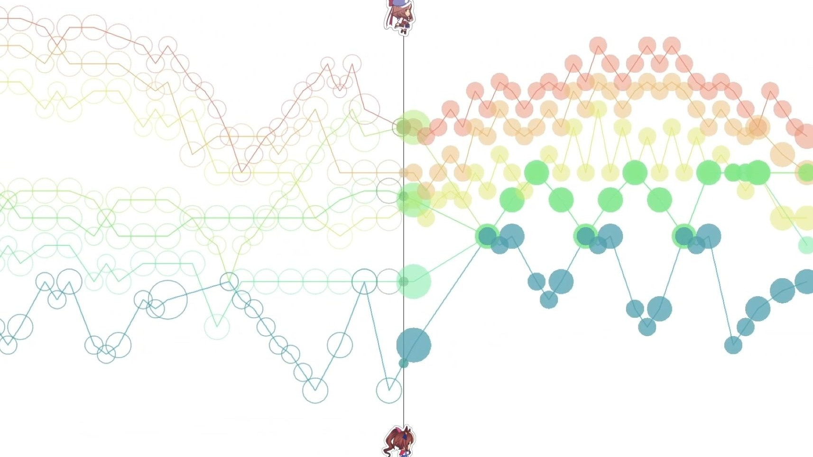 | 6.5万 | 2025-06-12 |
| [好可爱的哈基米](https://www.bilibili.com/video/BV1V6fqY7Ekg) |  | 37.4万 | 2025-01-23 |
| [野火哈基米](https://www.bilibili.com/video/BV1uyCSYuErH) |  | 13.9万 | 2024-10-18 |

---
*最后更新: 2026-01-04 02:58:47 (自动生成)*
*数据来源: [Bilibili](https://www.bilibili.com)*

## 使用说明

运行以下命令更新视频列表:
```bash
python3 fetch_hajimi_videos.py
```
