# awesome-hajimi
collections of hajimi (哈基米 in Chinese) on the Internet.

## 视频列表 (Video List)

| 视频标题 (Title) | 封面 | 播放量 (Views) | 发布日期 (Date) |
|---|---|---|---|
| [偶遇三只流浪的哈基米](https://www.bilibili.com/video/BV1beCkBGEc4) |  | 40 | 2025-11-18 |
| [该怎么说服老板生产“哈基米南北绿豆饼干”呢？真的有人买吗？](https://www.bilibili.com/video/BV13hCkB5ETm) |  | 387 | 2025-11-18 |
| [我真的不是哈基米南北绿豆啊！](https://www.bilibili.com/video/BV1FpCqBLEdt) |  | 608 | 2025-11-18 |
| [善良美女请哈基米吃蛋糕](https://www.bilibili.com/video/BV1rHCzBXEB1) | 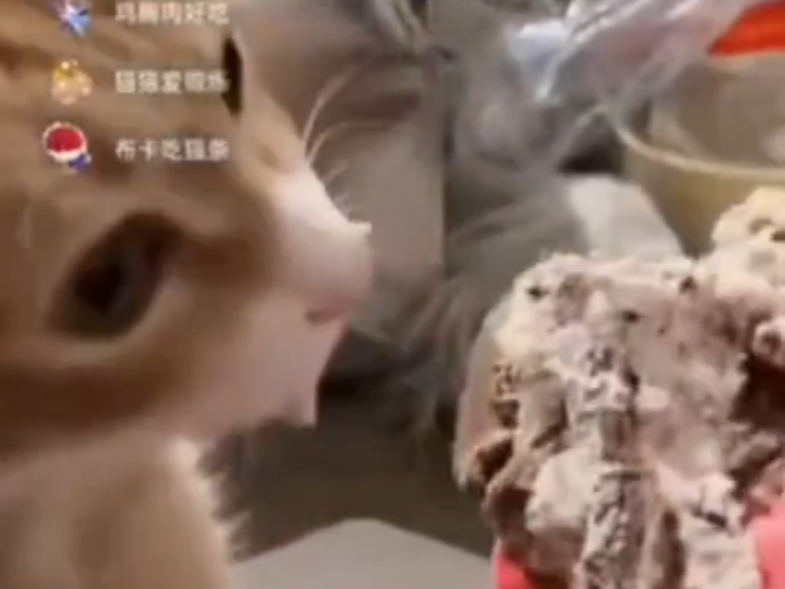 | 1648 | 2025-11-17 |
| [【哈基米】哈基米：复兴之路（战雷中系BGM）](https://www.bilibili.com/video/BV1tQCzBAEAa) |  | 732 | 2025-11-17 |
| [下半年以来最喜欢的两首哈基米，顺便打个深渊，6仆2茜62秒上半三连](https://www.bilibili.com/video/BV1C7CzBxE75) |  | 372 | 2025-11-17 |
| [哈基米正在按住W推图](https://www.bilibili.com/video/BV1kECzBREp4) | 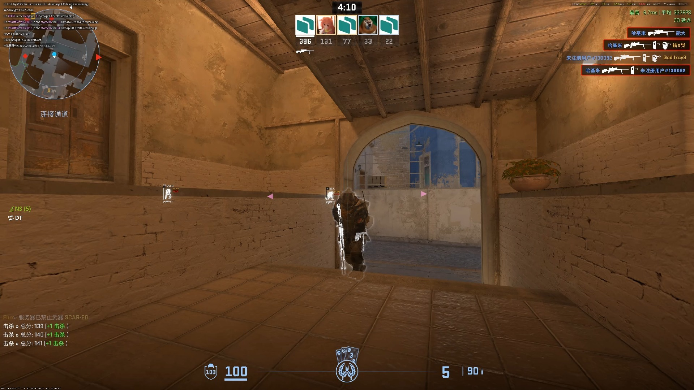 | 123 | 2025-11-17 |
| [哈基米](https://www.bilibili.com/video/BV1yLCzBoE81) | 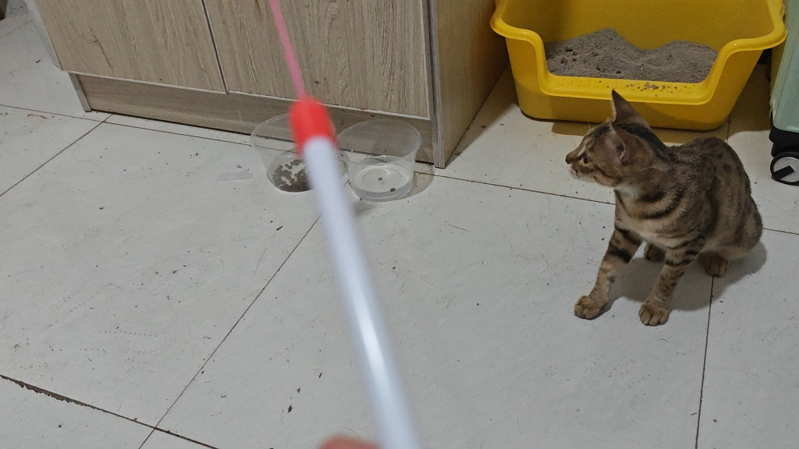 | 669 | 2025-11-17 |
| [❤❤可爱甜美哈基米音乐之BUMBLE BEE❤❤ 《历史版图の小曲》](https://www.bilibili.com/video/BV15dCBBrEdk) |  | 318 | 2025-11-17 |
| [用哈基米的号打出的神人1v5](https://www.bilibili.com/video/BV1STCzBAEBr) | 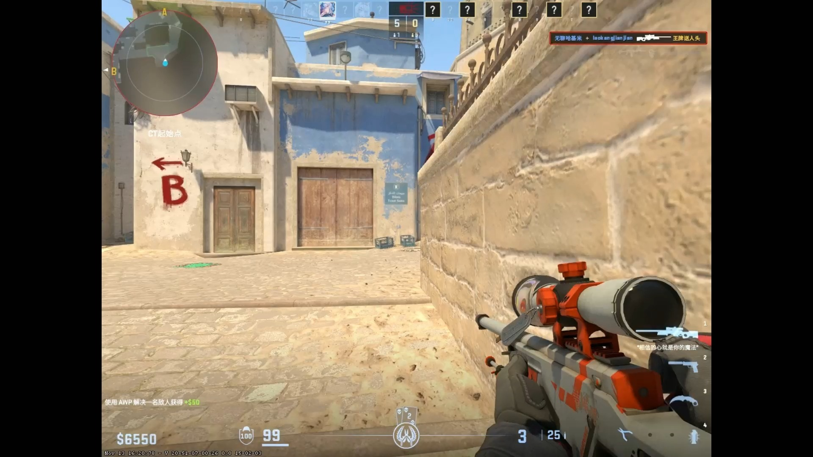 | 320 | 2025-11-17 |
| [【哈基米音乐】Tobu-Life](https://www.bilibili.com/video/BV1DwCzBiEt9) |  | 1940 | 2025-11-17 |
| [哈基米/哈基汪友好模式 想带宠物出去玩，当然是是选电车咯](https://www.bilibili.com/video/BV1jPCiBBExj) |  | 253 | 2025-11-17 |
| [【哈基米】有顶天变](https://www.bilibili.com/video/BV1VLCiBcEKZ) |  | 39 | 2025-11-17 |
| [哈基米2](https://www.bilibili.com/video/BV1aLCiBcEL6) |  | 89 | 2025-11-17 |
| [初代哈基米](https://www.bilibili.com/video/BV1VGCiBAEj6) | 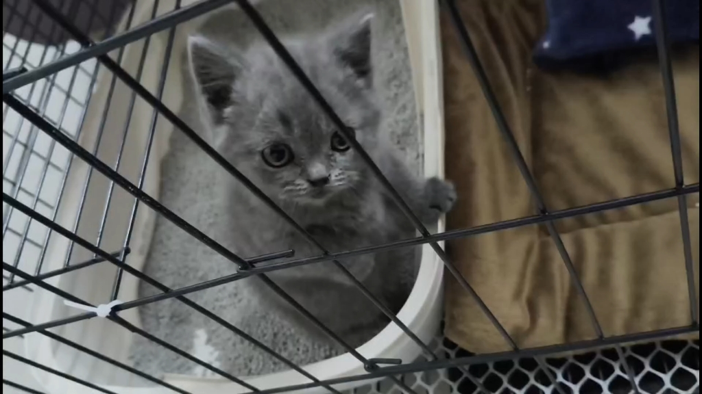 | 23 | 2025-11-17 |
| [跟踪一只哈基米并是它疑惑](https://www.bilibili.com/video/BV17yCiB3EG6) | 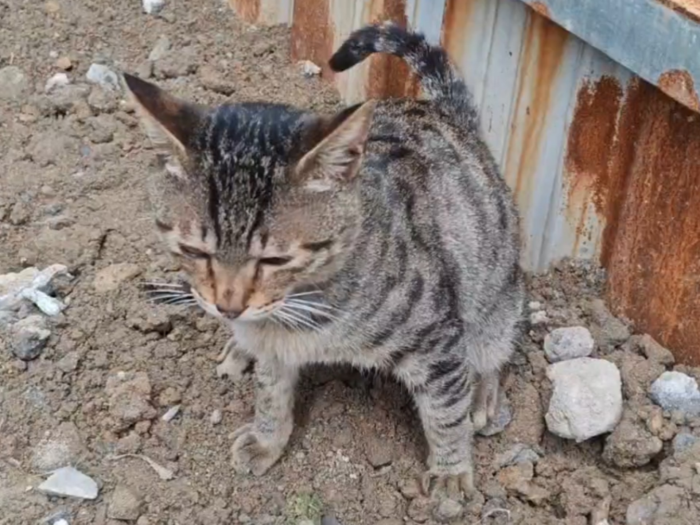 | 492 | 2025-11-17 |
| [日本社畜吃点啥？打工两小时，半价撑到死，这波啊，这波是日本贵族晚宴](https://www.bilibili.com/video/BV1dQCiBvEFq) |  | 15.3万 | 2025-11-17 |
| [【哈基米南北-_绿豆】第一支视频求三连！](https://www.bilibili.com/video/BV1RDCiBKEKK) |  | 62 | 2025-11-17 |
| [昨天吃拼好饭中毒晕厥了，所以没更新，也是给大家看看哈基兔还有最近帮粉丝的兔子画的画吧](https://www.bilibili.com/video/BV1PVCqBHEbB) | 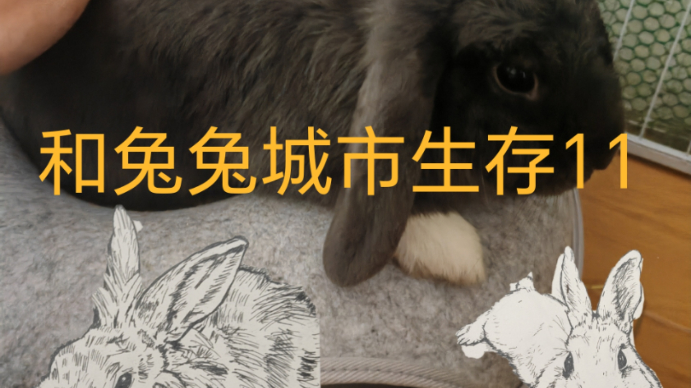 | 1251 | 2025-11-17 |
| [我的哈基米曼波](https://www.bilibili.com/video/BV18FCqBcEMa) | 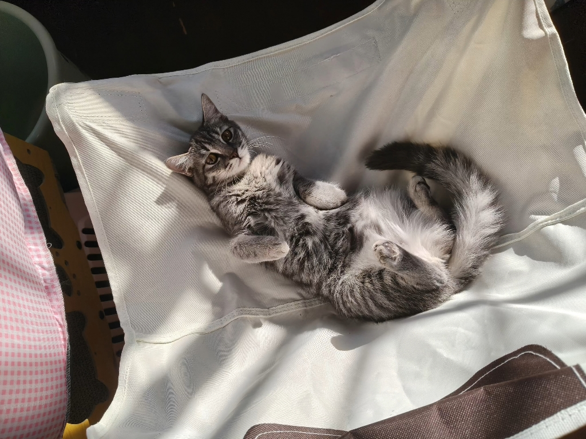 | 42 | 2025-11-17 |
| [哈基迷单曲《昔涟》](https://www.bilibili.com/video/BV1oCCeBAEC5) | 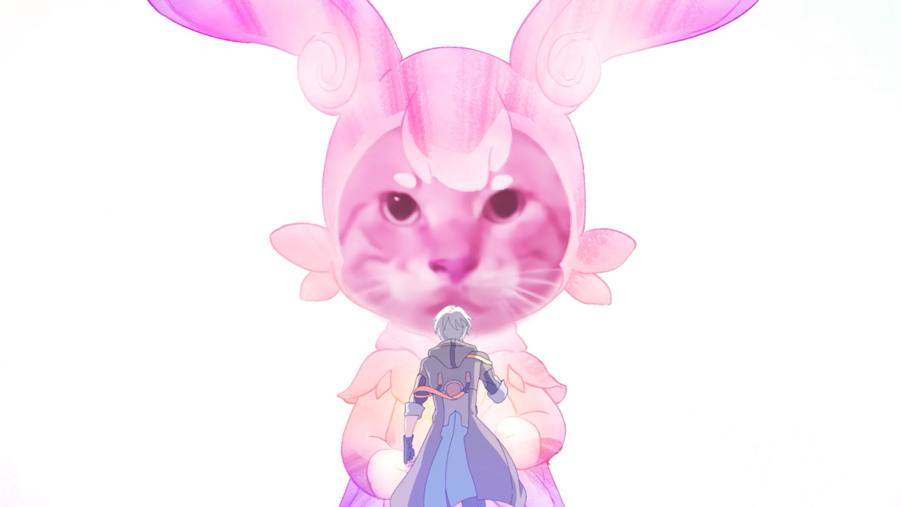 | 5.3万 | 2025-11-17 |
| [【哈基米】[补档二十三次]老哈[老街]](https://www.bilibili.com/video/BV1fBCeBiE6j) |  | 267 | 2025-11-17 |
| [考公人必看哈基米拿捏豆浆爆款](https://www.bilibili.com/video/BV1zBCeBqELy) |  | 1308 | 2025-11-17 |
| [哈基米车载音乐：Tuesday](https://www.bilibili.com/video/BV176CeBKEBk) |  | 373 | 2025-11-17 |
| [哈基米代码冲突了，蚌的住的都是神人](https://www.bilibili.com/video/BV192CeBcE2P) |  | 3.0万 | 2025-11-17 |
| [从牢大到哈基米，网友们的梗是否会无偿变成商人盈利的工具？劣币良币谁存谁亡？](https://www.bilibili.com/video/BV1PtCeB5EeK) |  | 3287 | 2025-11-17 |
| [没有人寄予厚望的哈基米概念股倒下了](https://www.bilibili.com/video/BV1cvCeBzEHi) | 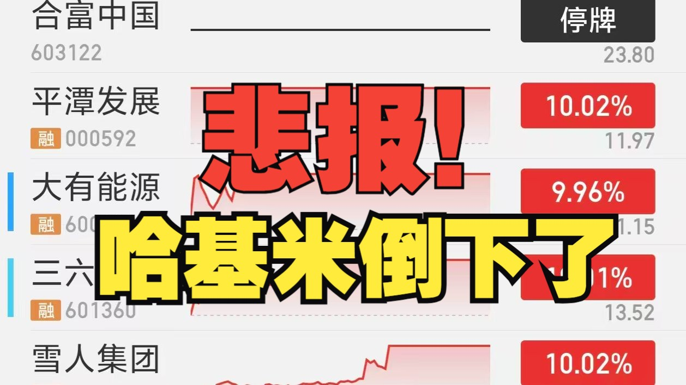 | 9.2万 | 2025-11-17 |
| [二胡抽象版丨陶喆【找自己】 哦啊啊 耶～哈基米南北绿豆～](https://www.bilibili.com/video/BV1vxCvBeEpT) |  | 773 | 2025-11-17 |
| [准备退游了，哈基米大肘子](https://www.bilibili.com/video/BV1weCeBgEbD) |  | 42 | 2025-11-17 |
| [哈基米肥橘](https://www.bilibili.com/video/BV1xKCvBEEP7) | 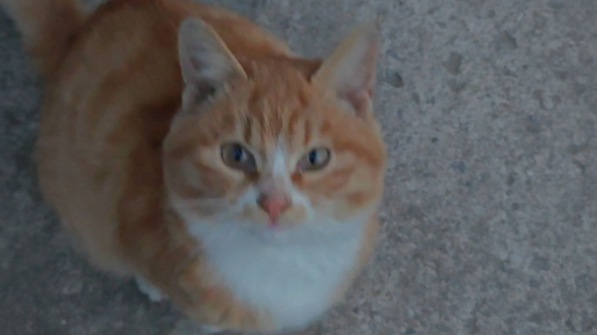 | 306 | 2025-11-17 |
| [⚡基  耄  说⚡](https://www.bilibili.com/video/BV1tACvBnEZj) |  | 1709 | 2025-11-17 |
| [哈基米方舟但《浸春芜曼波》](https://www.bilibili.com/video/BV1QQCeBoEWU) |  | 1282 | 2025-11-17 |
| [哈基米由超燃](https://www.bilibili.com/video/BV1vtCvBAEw9) |  | 308 | 2025-11-17 |
| [哈基米合集](https://www.bilibili.com/video/BV1nZCvBkEgW) |  | 1040 | 2025-11-17 |
| [【基米TV】超长基米合集](https://www.bilibili.com/video/BV1c3CYBTEYZ) | 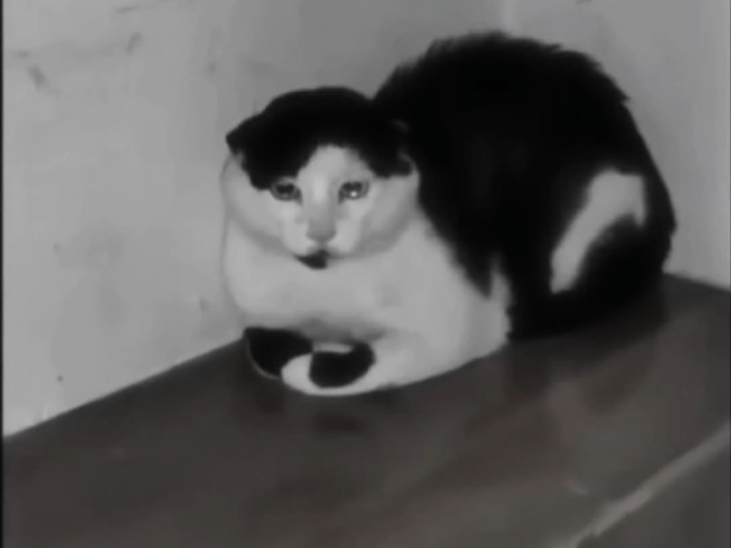 | 2974 | 2025-11-17 |
| [青春蹲人哈基美不会遇见传奇飞天哈基米喵](https://www.bilibili.com/video/BV1moCaB1Ebg) |  | 388 | 2025-11-17 |
| [哈基米杀疯了！哈基米带火豆浆，资本闹乌龙？](https://www.bilibili.com/video/BV1vxCYBdEw8) |  | 204 | 2025-11-17 |
| [《进击的哈基米》(燃尽小曲)](https://www.bilibili.com/video/BV1XhCYBpEqi) |  | 328 | 2025-11-17 |
| [爱猫tv之脑髓抽取](https://www.bilibili.com/video/BV1B7CYBwErP) | 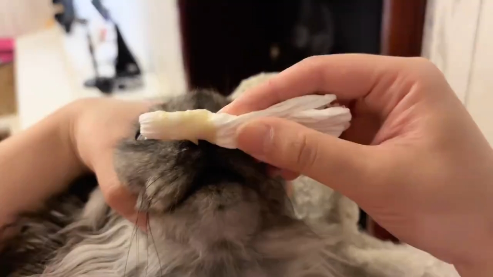 | 14.0万 | 2025-11-17 |
| [全网搜寻哈基米南北绿豆](https://www.bilibili.com/video/BV1pDCYBzEe5) |  | 6832 | 2025-11-17 |
| [【哈基米音乐】🐱稻 香🐱](https://www.bilibili.com/video/BV1J9CYBqEd2) |  | 1265 | 2025-11-17 |
| [九阳股份（哈基米）股票暴跌，评论区全在嘲讽年轻人没有任何购买力](https://www.bilibili.com/video/BV1zdCYBKEyL) |  | 2901 | 2025-11-17 |
| [【余多多Dudu】逐渐迷恋上主人鞋的哈基米～](https://www.bilibili.com/video/BV1TCCYBLEnJ) |  | 3114 | 2025-11-17 |
| [最早的哈基米音乐](https://www.bilibili.com/video/BV1TECeBnErQ) | 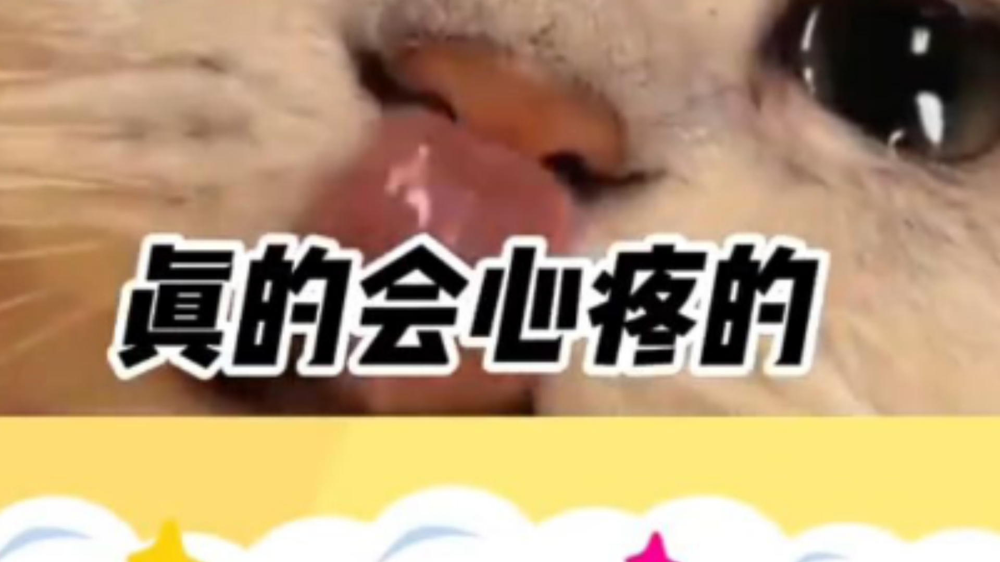 | 267 | 2025-11-17 |
| [【哈基米音乐】无名の哈](https://www.bilibili.com/video/BV13VCeB9EvR) |  | 662 | 2025-11-17 |
| [【术力口哈基米】天雨之咪【天つ水のはちみ】](https://www.bilibili.com/video/BV1RqC8BDEKD) | 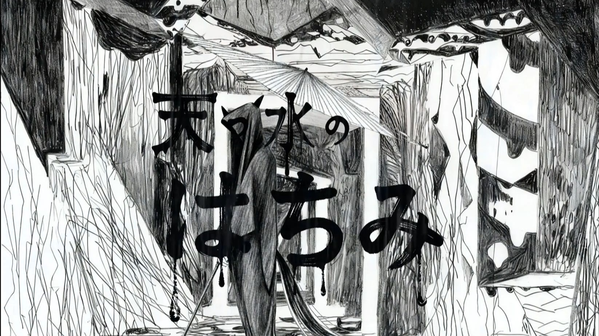 | 572 | 2025-11-17 |
| [你吃点哈基米南北绿豆吧！](https://www.bilibili.com/video/BV1EQChBcEaA) |  | 67 | 2025-11-17 |
| [“哈基米”和“葫芦娃”是如何让股票涨停的？](https://www.bilibili.com/video/BV18QC8BGEhc) |  | 318 | 2025-11-17 |
| [鸭基米挂机](https://www.bilibili.com/video/BV1joChBoERe) |  | 406 | 2025-11-17 |
| [⚡️⚡️【哈基米电音/Hyper Trance】⚡️⚡️我竟然将《神曼波》改编成了电音！](https://www.bilibili.com/video/BV1WzCbBhEBn) |  | 1119 | 2025-11-16 |
| [“鸡蛋”](https://www.bilibili.com/video/BV1H8CRBYEN4) |  | 8595 | 2025-11-16 |
| [子欲养而亲不待，浅尝亲妈补补钙🐱](https://www.bilibili.com/video/BV1uXCRBmEWg) |  | 6619 | 2025-11-16 |
| [【顶级模型】“哈基米喔南北路豆 ”神曼波/AI初华](https://www.bilibili.com/video/BV1sPC9BaEVu) |  | 2917 | 2025-11-16 |
| [哈基米品尝哈基汪迪克](https://www.bilibili.com/video/BV1UiCdB7E8H) | 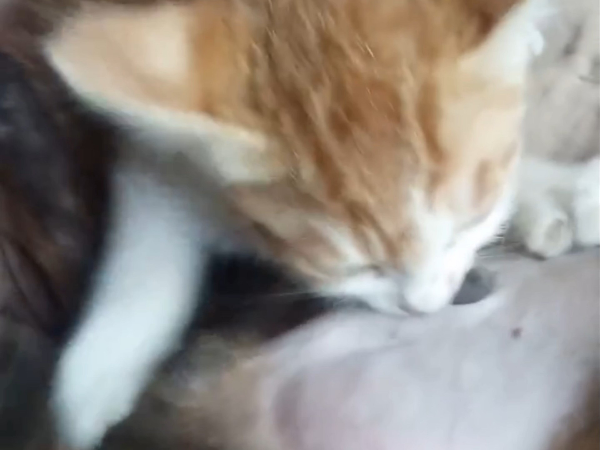 | 4.2万 | 2025-11-16 |
| [泰曼波纯享](https://www.bilibili.com/video/BV1dsCdBREAD) |  | 322 | 2025-11-16 |
| [【活侠传×哈基米音乐】谢幕时分 雨哈零落](https://www.bilibili.com/video/BV1VsCdBdEfo) |  | 1460 | 2025-11-16 |
| [哈基米被喜鹊引诱到树上下不来了](https://www.bilibili.com/video/BV1n8CXBRENU) |  | 790 | 2025-11-16 |
| [先生，救救这个世界吧](https://www.bilibili.com/video/BV1AKC9BcEeW) | 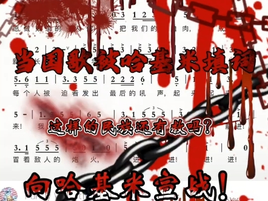 | 1.1万 | 2025-11-16 |
| [强制基米 大狗交](https://www.bilibili.com/video/BV1b9CXBuEW9) |  | 1.2万 | 2025-11-16 |
| [总算搞到鱼了，喂哈基米](https://www.bilibili.com/video/BV1tRCXBBEPr) | 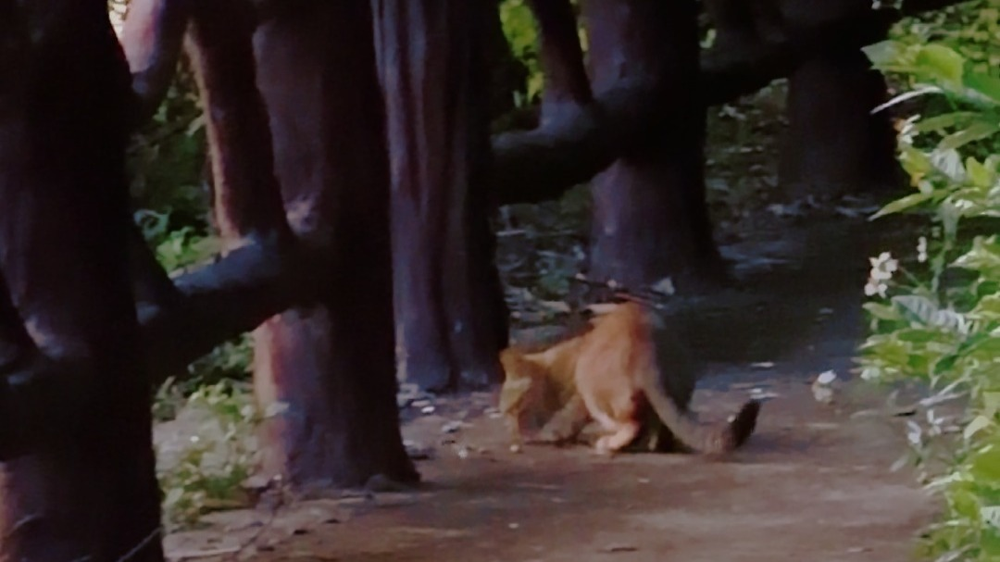 | 841 | 2025-11-16 |
| [被赛博坦星人爱到头了，哈基米还有救吗？](https://www.bilibili.com/video/BV1mvC9BgEoq) | 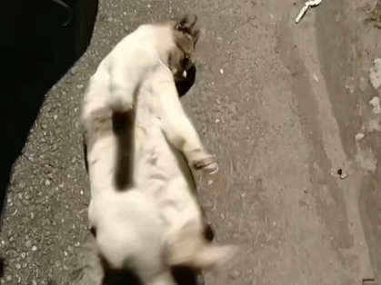 | 5301 | 2025-11-16 |
| [原来哈基米也爱猫](https://www.bilibili.com/video/BV1dJC9BnEqr) | 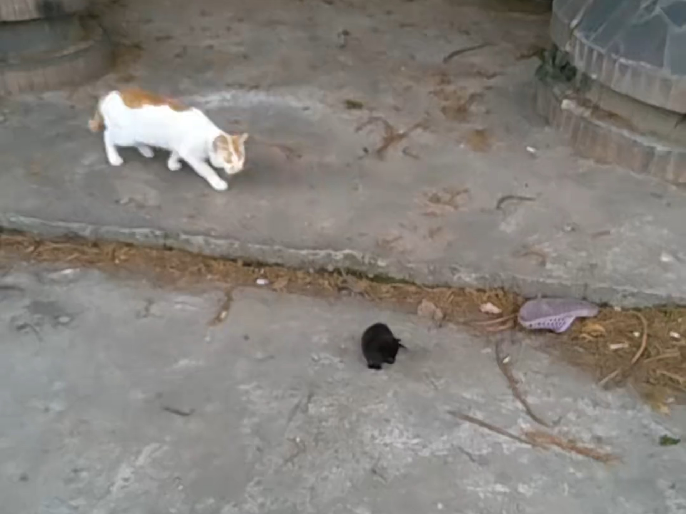 | 2.8万 | 2025-11-16 |
| [爱人TV之请停止玩这些网络梗](https://www.bilibili.com/video/BV1o9CQBJEJr) |  | 1.1万 | 2025-11-16 |
| [挑衅的下场](https://www.bilibili.com/video/BV14LCXBNEuh) | 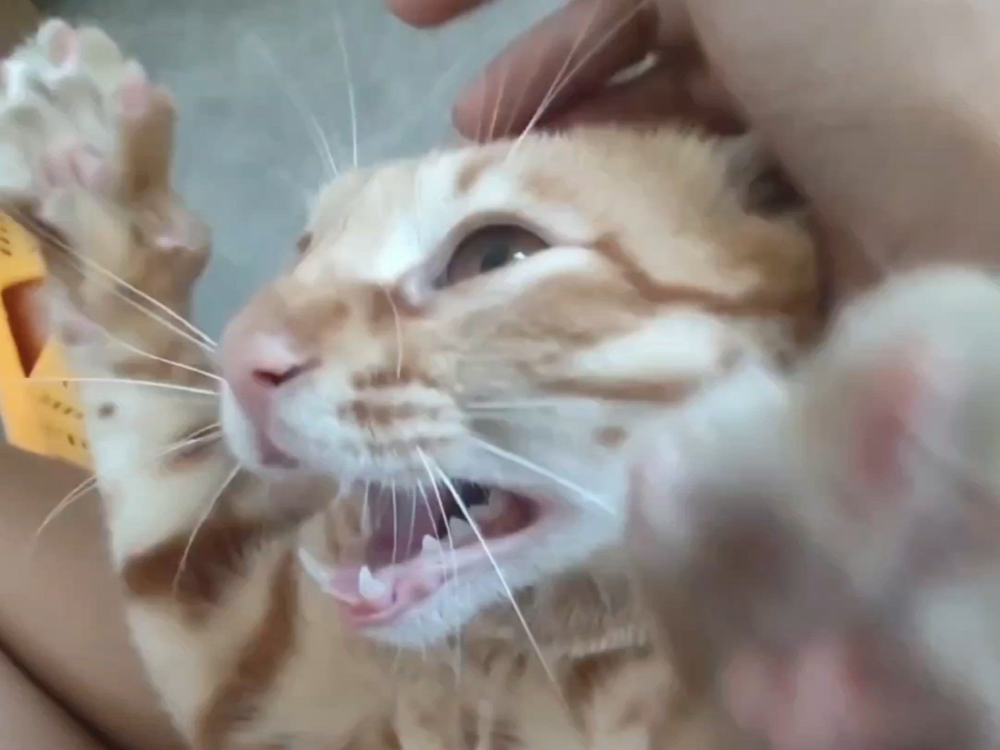 | 12.6万 | 2025-11-16 |
| [哈基米南北绿豆新产品，绿豆包！！！](https://www.bilibili.com/video/BV1QWCSBwEuW) |  | 3068 | 2025-11-16 |
| [哈基米又跌18%，昔涟升至年度第五！](https://www.bilibili.com/video/BV1XfCSBMEe3) |  | 1061 | 2025-11-16 |
| [【哈基米】哈基米山歌](https://www.bilibili.com/video/BV1m4CmBHE8j) |  | 128 | 2025-11-15 |
| [🐱哈基咪！你怎么在我的洛克家园仓库里偷偷哈气啊！！🐱⚡洛克王国家园⚡](https://www.bilibili.com/video/BV18vCyBJE4g) |  | 2371 | 2025-11-15 |
| [如何评价九阳推出「哈基米南北绿豆」豆浆？](https://www.bilibili.com/video/BV1VYC5BuEe1) |  | 6417 | 2025-11-15 |
| [给猫打扮成这样还是过于猎奇了](https://www.bilibili.com/video/BV1XgC1BsEux) | 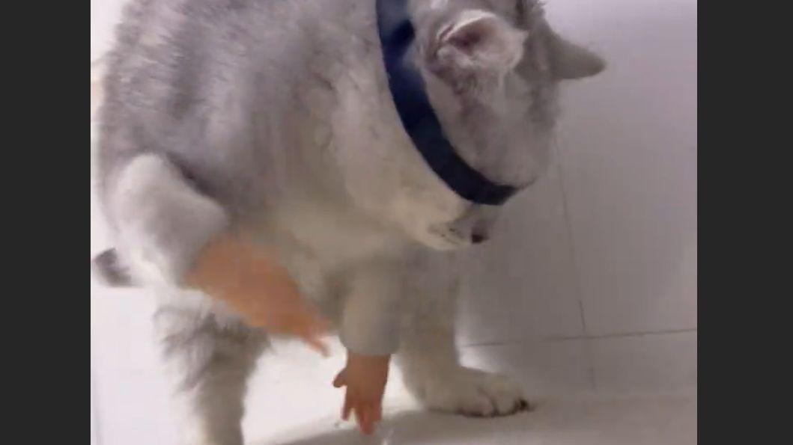 | 8422 | 2025-11-15 |
| [这个爆改我等了一年！](https://www.bilibili.com/video/BV1G3C1BRExk) |  | 3061 | 2025-11-15 |
| [哈基米！别打哈基兔了😖](https://www.bilibili.com/video/BV1oAC3BwEcv) |  | 3386 | 2025-11-15 |
| [关在倒闭店里的猫](https://www.bilibili.com/video/BV1qBCCBtEkH) | 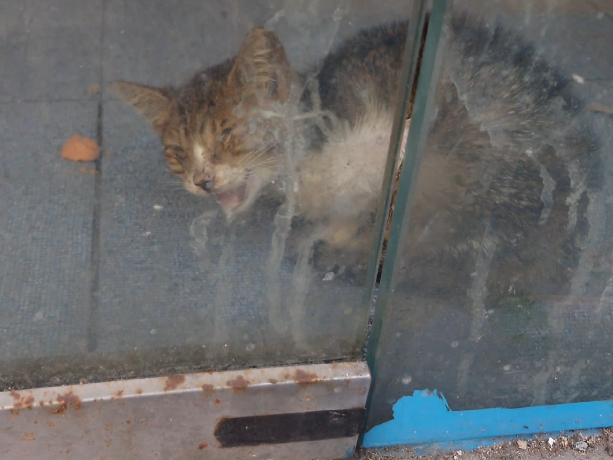 | 4.2万 | 2025-11-15 |
| [我做梦了？](https://www.bilibili.com/video/BV1WuC5BRE6p) | 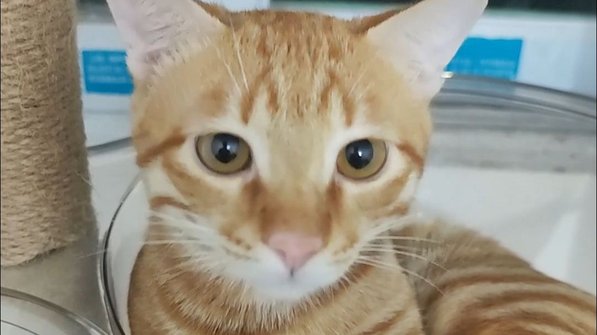 | 20.6万 | 2025-11-15 |
| [天天哈气 不想养了 谁要这耄耋](https://www.bilibili.com/video/BV17WC5BLEQJ) |  | 29.2万 | 2025-11-15 |
| [[美食曼波] 哈基米的早餐流派](https://www.bilibili.com/video/BV1AdC5BWEs2) |  | 1.6万 | 2025-11-15 |
| [《打火机哈基米南北绿豆》音乐纯享版](https://www.bilibili.com/video/BV1ioCMB4EfW) | 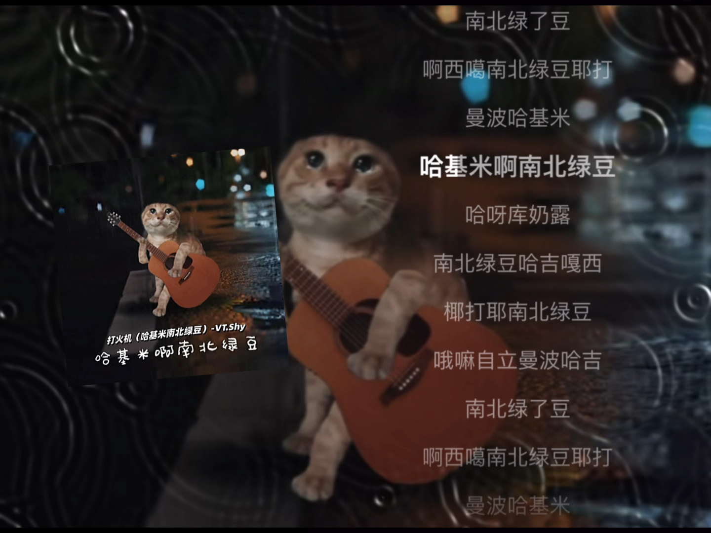 | 173 | 2025-11-14 |
| [8u：大网红这一块🤣哈基米南北绿豆](https://www.bilibili.com/video/BV1a1CuBREFy) | 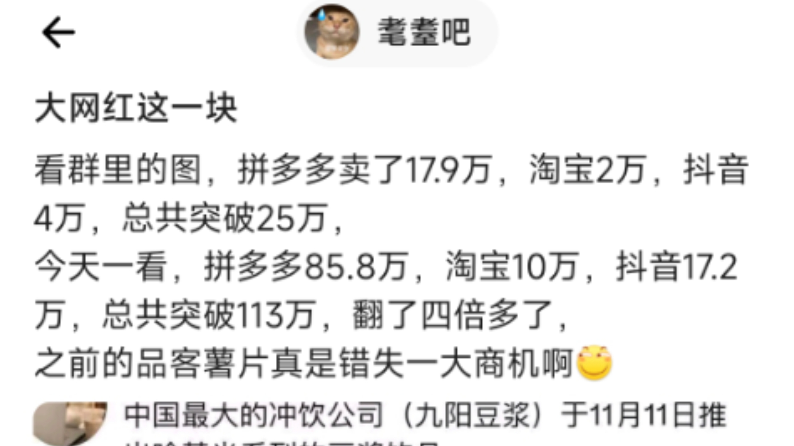 | 2.7万 | 2025-11-14 |
| [正在对哈基米施加祝福而被拒绝的土龙妈妈](https://www.bilibili.com/video/BV1gACtBTEJV) |  | 2427 | 2025-11-14 |
| [哈畸八🐱](https://www.bilibili.com/video/BV1pHCTBeEMY) | 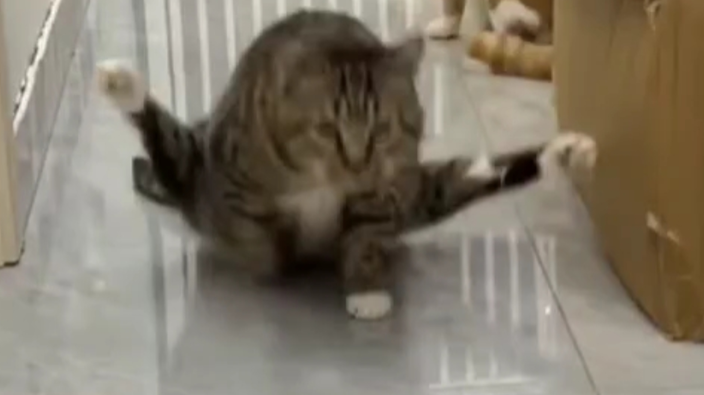 | 4545 | 2025-11-14 |
| [九阳不语，只是一味的带【哈基米南北绿豆】(◕ܫ◕)](https://www.bilibili.com/video/BV1bSCTB5Epo) |  | 1831 | 2025-11-14 |
| [大型记录片:哈基米南北绿豆卖爆了](https://www.bilibili.com/video/BV1L5CKBJEUQ) | 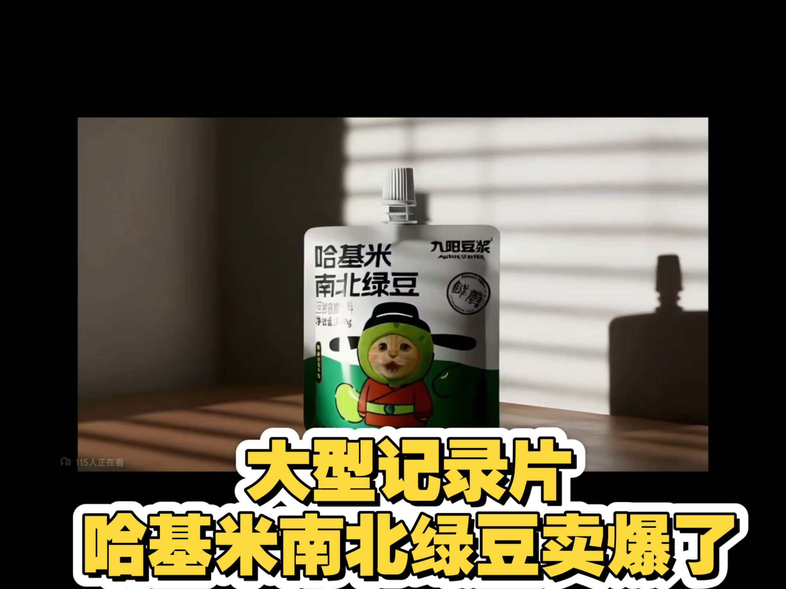 | 3401 | 2025-11-14 |
| [伯虎说（哈基米版）](https://www.bilibili.com/video/BV1EMCKBWExp) |  | 834 | 2025-11-14 |
| [⚡我统一六国了⚡](https://www.bilibili.com/video/BV1JCCKB8Eou) |  | 134.3万 | 2025-11-14 |
| [WC！太炸裂了! 九阳哈基米南北绿豆浆彻底卖爆了，连九阳科技股份都连带涨停，品客直接哭晕在厕所.....](https://www.bilibili.com/video/BV1f2CKBtE9M) | 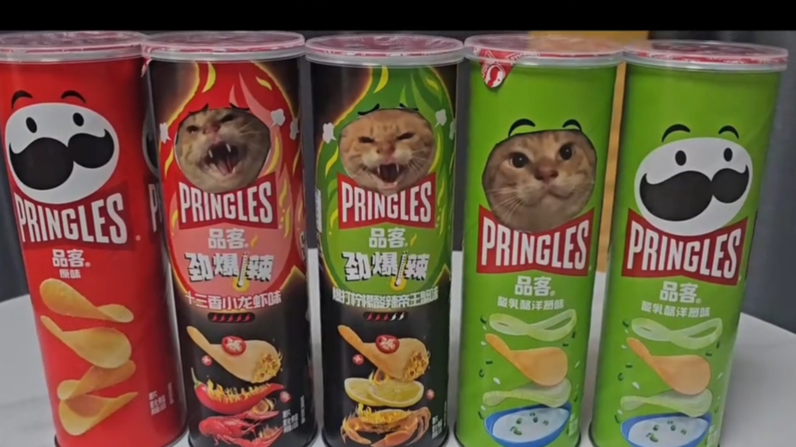 | 28.0万 | 2025-11-14 |
| [哈基米南北绿豆饮料一出，九阳涨停！](https://www.bilibili.com/video/BV1rcCbB4Evy) |  | 8824 | 2025-11-13 |
| [哈基米南北绿豆:品客，可有何话说](https://www.bilibili.com/video/BV1mDCtBPEnZ) | 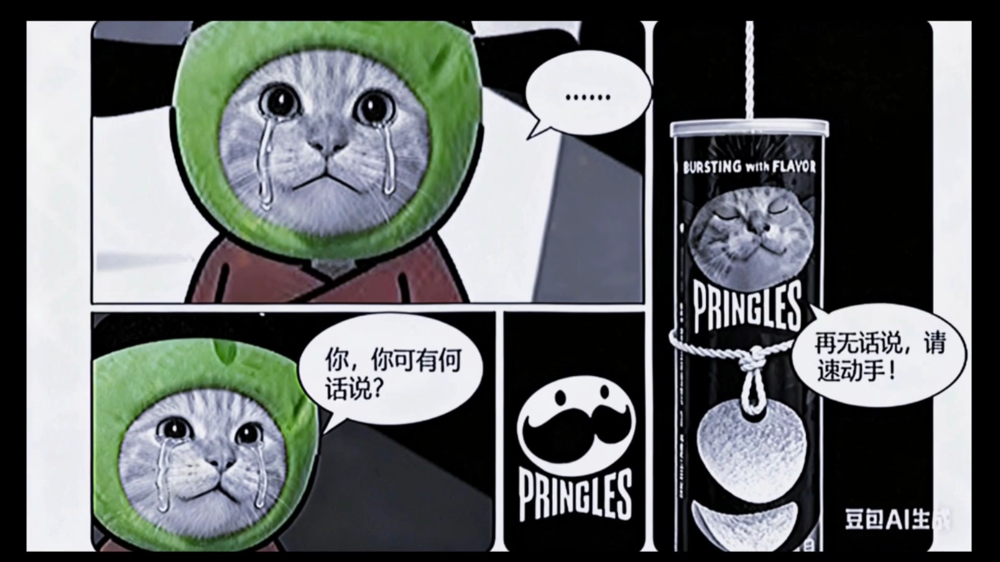 | 5.9万 | 2025-11-13 |
| [哈基白虎（哈气版）](https://www.bilibili.com/video/BV1yRCxBXE7P) |  | 1.7万 | 2025-11-13 |
| [哈基米以为是自己狩猎的食物](https://www.bilibili.com/video/BV1svC4BxEai) |  | 1.0万 | 2025-11-13 |
| [【哈基米】Alone](https://www.bilibili.com/video/BV1vMCsBKEX7) |  | 9373 | 2025-11-13 |
| [神人持猫法之关闭所有安全屋](https://www.bilibili.com/video/BV1ZSCLBjEG5) | 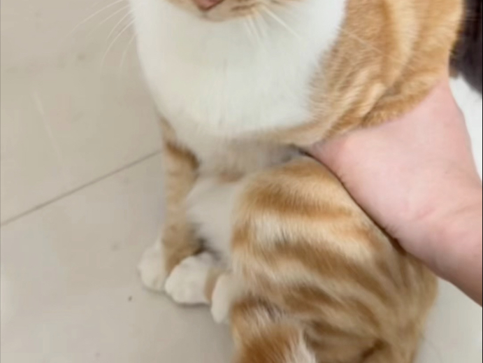 | 15.1万 | 2025-11-12 |
| [耶～duang duang duang](https://www.bilibili.com/video/BV1htkoBUE2m) |  | 7343 | 2025-11-10 |
| [哎刀马刀马哎刀马刀马@瓦瓦](https://www.bilibili.com/video/BV11bkDB9ENz) |  | 9.4万 | 2025-11-09 |
| [耶～duang duang duang](https://www.bilibili.com/video/BV1QmW7z2ESS) |  | 2.2万 | 2025-10-17 |
| [哈基米哈基米哈基米](https://www.bilibili.com/video/BV1Dj4Jz4E6x) |  | 4131 | 2025-10-10 |
| [被三只狗围攻的哈基米，既然选择照顾，为什么这么不小心？](https://www.bilibili.com/video/BV1XQe7zgE3h) |  | 9.4万 | 2025-08-26 |
| [第三篇，将反抗进行到底](https://www.bilibili.com/video/BV1kN8HzWEmc) | 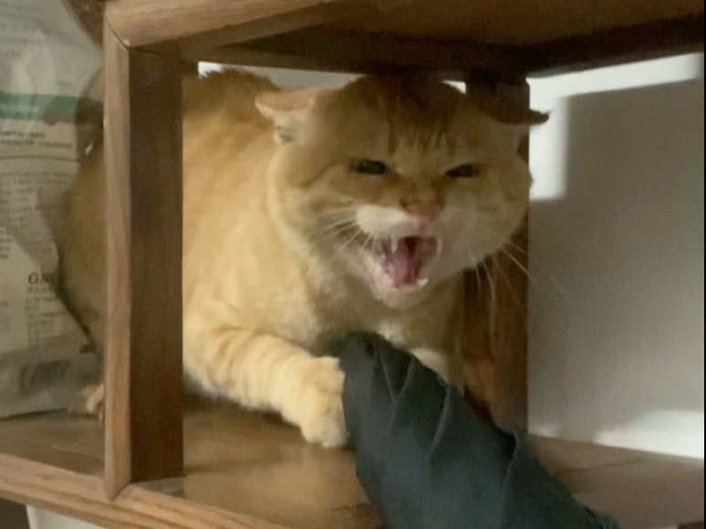 | 128.9万 | 2025-07-28 |
| [循环歌曲｜雨姐的小曲｜大东北我的家乡 (DJ何鹏版)-何玉](https://www.bilibili.com/video/BV1sYQmY7EoM) |  | 73.5万 | 2025-03-15 |
| [爱猫tv之《胖宝宝哈基米》bgm的首创者找到了](https://www.bilibili.com/video/BV12D421E7Pn) |  | 52.1万 | 2024-03-17 |
| [【搬运】现场版口合基米](https://www.bilibili.com/video/BV1Wp4y1N7kS) |  | 55.3万 | 2023-09-01 |

---
*最后更新: 2025-11-18 02:40:54 (自动生成)*
*数据来源: [Bilibili](https://www.bilibili.com)*

## 使用说明

运行以下命令更新视频列表:
```bash
python3 fetch_hajimi_videos.py
```
