# awesome-hajimi
collections of hajimi (哈基米 in Chinese) on the Internet.

## 视频列表 (Video List)

| 视频标题 (Title) | 封面 | 播放量 (Views) | 发布日期 (Date) |
|---|---|---|---|
| [曼波《没出息》完整版【哈基米音乐】哭什么哭，你在哽咽什么啦~](https://www.bilibili.com/video/BV1fk46zFEjm) |  | 404 | 2025-10-15 |
| [ASMR哈基米抓挠助眠哄睡](https://www.bilibili.com/video/BV15m46zoE2U) | 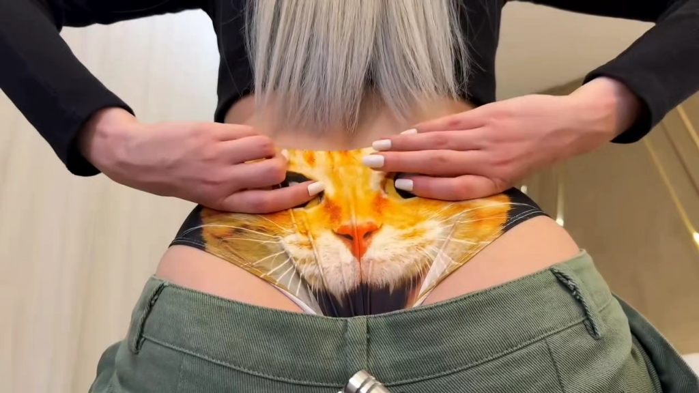 | 2260 | 2025-10-15 |
| [🐱哈基米 Beat It🐱](https://www.bilibili.com/video/BV1gu4izTENY) |  | 4202 | 2025-10-15 |
| [哈基米这个相爱相杀](https://www.bilibili.com/video/BV1dz4iz1E5v) | 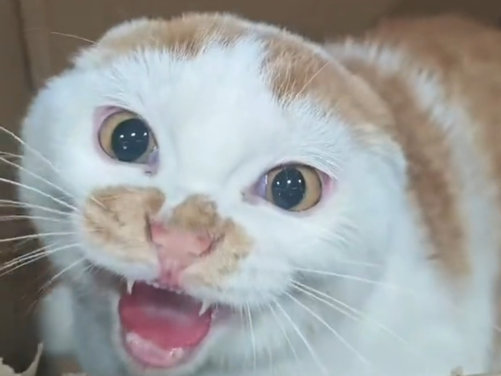 | 2827 | 2025-10-15 |
| [哈基米这个爱嚼口香糖](https://www.bilibili.com/video/BV1px4izxEUV) | 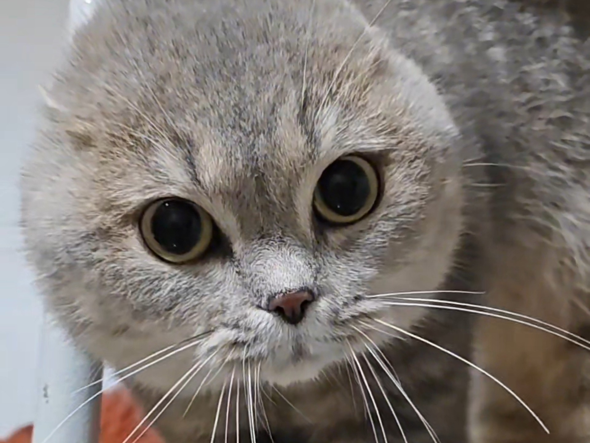 | 8614 | 2025-10-15 |
| [【哈基米】“哈基米南北绿豆～”](https://www.bilibili.com/video/BV1Le4ezGEC6) | 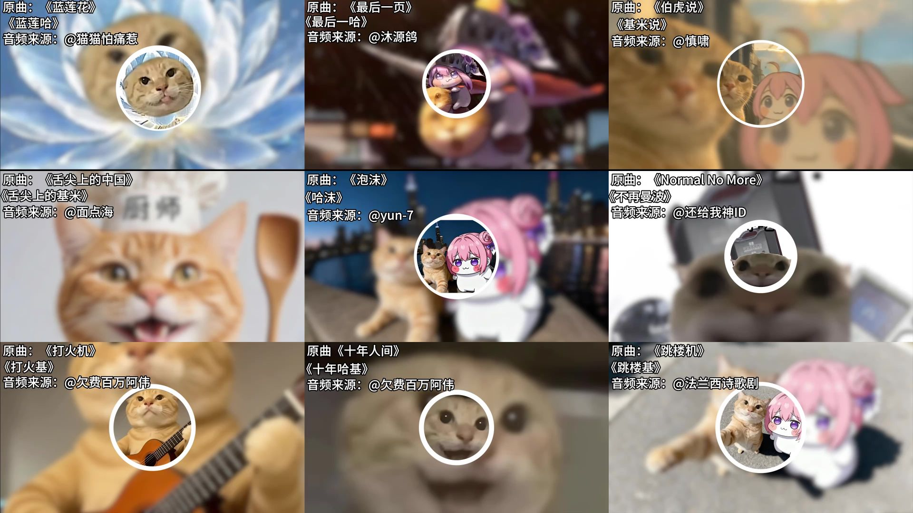 | 2200 | 2025-10-15 |
| [悬溺一响，基米登场](https://www.bilibili.com/video/BV1MD4ezhEgb) |  | 5.4万 | 2025-10-15 |
| [哈基米的最后一舞](https://www.bilibili.com/video/BV1hx4vziENM) | 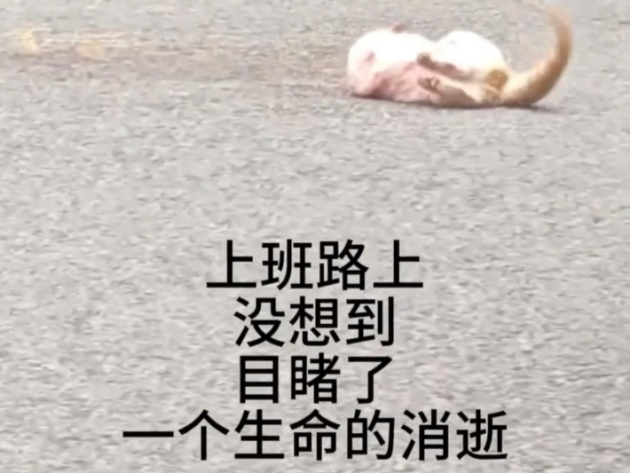 | 9590 | 2025-10-15 |
| [哈基米牌零食广告4.0](https://www.bilibili.com/video/BV1rT4vzUEsr) |  | 4.1万 | 2025-10-15 |
| [哈基米~啊！](https://www.bilibili.com/video/BV1Fu4vzEECa) |  | 1663 | 2025-10-15 |
| [剥蒜的情谊69.0](https://www.bilibili.com/video/BV1NN48z1EfJ) |  | 64.3万 | 2025-10-15 |
| [关于为了波多黎各独立去刺杀总统这件事【神奇组织40】](https://www.bilibili.com/video/BV1L84XzoE2a) |  | 148.7万 | 2025-10-15 |
| [★哈基米牌零食广告4.0](https://www.bilibili.com/video/BV1xB4vztE3g) |  | 3.6万 | 2025-10-15 |
| [猫 中 有 善 口 技 者](https://www.bilibili.com/video/BV1ba4vzaEkP) | 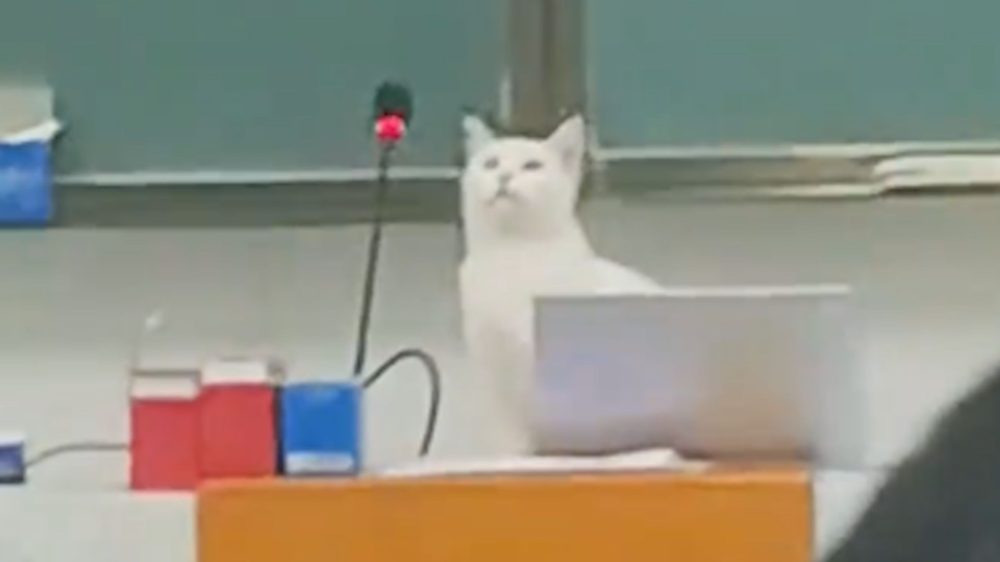 | 109.7万 | 2025-10-15 |
| [哈基米大战哈基米合集](https://www.bilibili.com/video/BV1i54YzKEup) |  | 2481 | 2025-10-14 |
| [我买了一支AK47，第一人称开箱](https://www.bilibili.com/video/BV1sh4hz2E7R) |  | 10.9万 | 2025-10-14 |
| [孩子们这才是我的专武](https://www.bilibili.com/video/BV1W54az7Ego) |  | 21.1万 | 2025-10-14 |
| [打满25局！中国队3-2逆转日本队晋级亚锦赛男团决赛，网友赛后评分。](https://www.bilibili.com/video/BV1de4azYEGq) |  | 14.1万 | 2025-10-14 |
| [【emo歌曲合集】&quot; 时间一直在走，我也没留住什么 &quot;](https://www.bilibili.com/video/BV1Nc4tz6Eyg) |  | 5253 | 2025-10-14 |
| [奶猫遇见绿色哈基米，一起打怪兽](https://www.bilibili.com/video/BV1fL4tzFE6C) |  | 2996 | 2025-10-14 |
| [【哈基米音乐】你看世界好美｜卡拉彼丘](https://www.bilibili.com/video/BV1Fj4tz8Esb) |  | 4269 | 2025-10-14 |
| [这是一期道歉视频……](https://www.bilibili.com/video/BV1PQ4XzkEnE) |  | 12.4万 | 2025-10-14 |
| [循环歌单｜【蓝莲哈】｜“哈基米喔南北绿豆”](https://www.bilibili.com/video/BV1JT4yz6Enf) |  | 4.0万 | 2025-10-14 |
| [（基米TV）小猫之间最纯粹的善意](https://www.bilibili.com/video/BV1gB4XzHEge) | 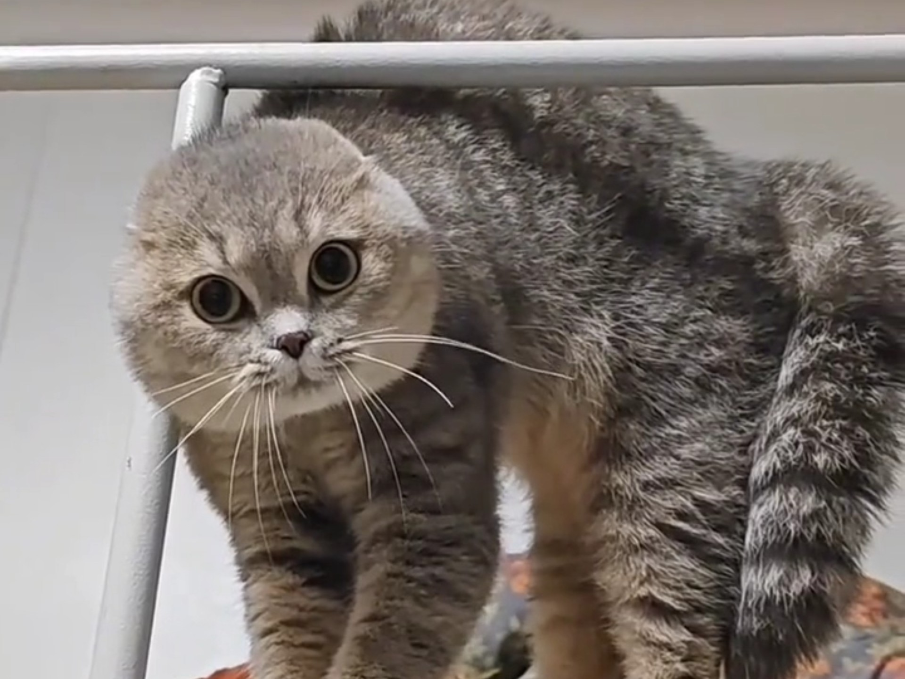 | 4.0万 | 2025-10-14 |
| [补发⚡️哈基米机⚡️教程](https://www.bilibili.com/video/BV1j44XzfESh) | 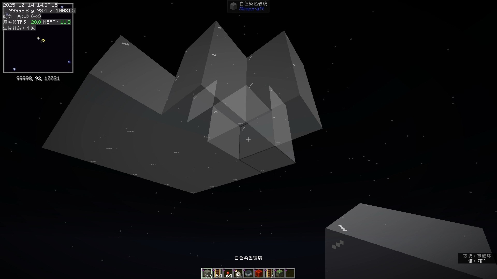 | 1818 | 2025-10-14 |
| [【蕪楽chupa】新人日本小妹妹尝试理解“哈基米歌词”，但理解不能！(T＿T)](https://www.bilibili.com/video/BV17s4XzcEYS) |  | 1.1万 | 2025-10-14 |
| [几个人打你完整版](https://www.bilibili.com/video/BV1cZ4XzBEjd) |  | 182.8万 | 2025-10-14 |
| [哈基米，曼波](https://www.bilibili.com/video/BV1Mm4XzLEKX) |  | 1.6万 | 2025-10-14 |
| [疑似49年国军娘希啤广告流出](https://www.bilibili.com/video/BV1NQ4XzkEqP) |  | 82.4万 | 2025-10-14 |
| [小猫，你不能躺平](https://www.bilibili.com/video/BV1z149zvEBN) | 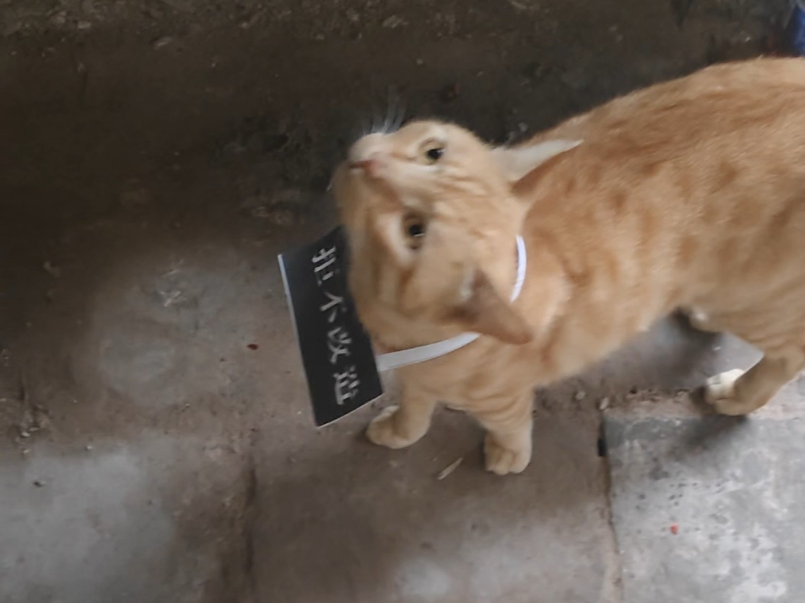 | 9.5万 | 2025-10-14 |
| [哈基米音乐大赏，听完直接变成哈基米](https://www.bilibili.com/video/BV1XP4mzuEEa) |  | 29.9万 | 2025-10-14 |
| [[哈基米古典乐]维瓦尔第 RV445 《I. Allegro》完整版](https://www.bilibili.com/video/BV18o4QzJEvP) |  | 1372 | 2025-10-14 |
| [埃及哈基米拍摄花絮，第三视角](https://www.bilibili.com/video/BV1ya49z5E6m) |  | 17.1万 | 2025-10-14 |
| [哈基米，你可知罪？](https://www.bilibili.com/video/BV1AS4DzKEu3) | 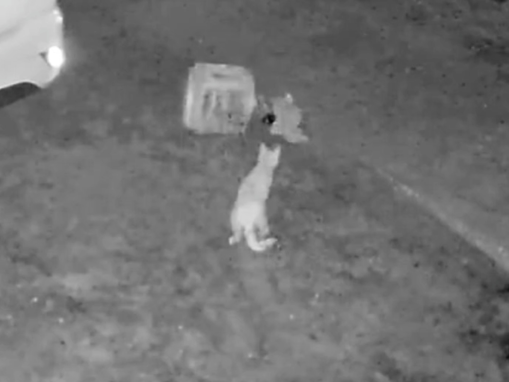 | 2290 | 2025-10-14 |
| [《没出息》超燃完整版](https://www.bilibili.com/video/BV1xg4XzrEnh) |  | 12.6万 | 2025-10-14 |
| [我只为装逼而来](https://www.bilibili.com/video/BV1Ym4SzmE3n) |  | 186.2万 | 2025-10-13 |
| [sora2奥运会，但是比赛项目比较奇怪](https://www.bilibili.com/video/BV1js4DzpEas) |  | 136.6万 | 2025-10-13 |
| [大狗大狗交交交](https://www.bilibili.com/video/BV1Mi4UzTEFh) |  | 64.4万 | 2025-10-13 |
| [门捷列夫：实验室制取哈基米药水](https://www.bilibili.com/video/BV1Jd4UzWEQh) |  | 3111 | 2025-10-13 |
| [【2025芙宁娜生日会】吃这么多蛋糕，会长胖的啦](https://www.bilibili.com/video/BV13442zvEgd) |  | 51.0万 | 2025-10-13 |
| [哈基米全明星，你都认识谁？](https://www.bilibili.com/video/BV1Mv42zFEGS) |  | 2.2万 | 2025-10-13 |
| [⚡哈基米南北绿豆⚡](https://www.bilibili.com/video/BV1CC42z9ELZ) |  | 7221 | 2025-10-13 |
| [我靠-一招毙命锁喉](https://www.bilibili.com/video/BV1QN4mzBEcV) | 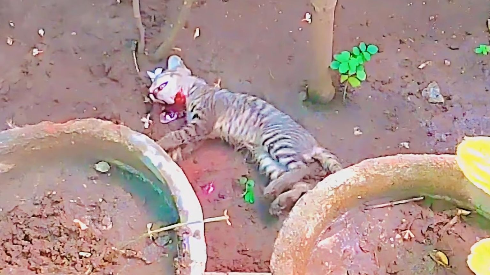 | 4.4万 | 2025-10-13 |
| [大阪猫猫听《神曼波》听到日文模块崩坏w](https://www.bilibili.com/video/BV1Em4yzVEyd) |  | 11.5万 | 2025-10-13 |
| [哈基米底层代码发力了](https://www.bilibili.com/video/BV12V41zsENt) |  | 1427 | 2025-10-13 |
| [月亮的歌《挪德卡莱我的家乡》-大东北我的家乡](https://www.bilibili.com/video/BV1F841zyEPx) |  | 2.2万 | 2025-10-13 |
| [新植物：伪装的樱桃炸弹](https://www.bilibili.com/video/BV1Yh4TzbEGy) |  | 70.7万 | 2025-10-13 |
| [疑似东汉末年哈基米牌南北绿豆广告](https://www.bilibili.com/video/BV1yG4Cz7EXe) |  | 1.1万 | 2025-10-13 |
| [与猫究极智斗](https://www.bilibili.com/video/BV1CV4uzUEXL) | 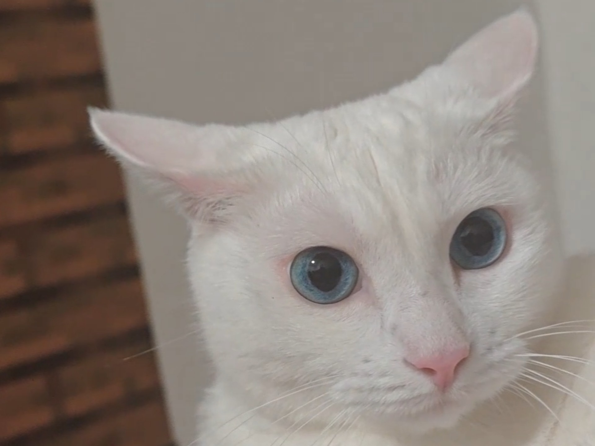 | 7.6万 | 2025-10-13 |
| [《空洞基米：丝之哈》](https://www.bilibili.com/video/BV1Lu4kzhEbR) |  | 3.9万 | 2025-10-13 |
| [王世坚火到了全网！日本网友制作了日文版的《没出息》](https://www.bilibili.com/video/BV1EP4yzkE2g) |  | 8.9万 | 2025-10-13 |
| [【循环歌单】｜｜ &quot;顶级智斗の小曲！三体人最严厉的父亲！！&quot; ｜｜《You Ballin In The Wrong Neighborh》-Exsire](https://www.bilibili.com/video/BV1XB43zgE9w) | 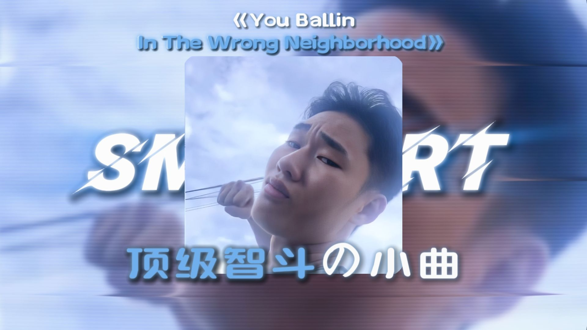 | 67.2万 | 2025-10-13 |
| [哈基米站的不动最终被撞跳起了街舞好友过来想吃饭](https://www.bilibili.com/video/BV1x94CzJEvN) |  | 7758 | 2025-10-13 |
| [循环歌单｜【yмри, если менЯ не лбишь】｜“【育苗小学の小曲】【颗秒の小曲】”](https://www.bilibili.com/video/BV1nH4uz5E4r) |  | 76.5万 | 2025-10-13 |
| [sora2生成的哈基米南北恩情](https://www.bilibili.com/video/BV17443z2EGB) |  | 6.9万 | 2025-10-12 |
| [哈基米爪贱这一块](https://www.bilibili.com/video/BV13J4gzeEfE) |  | 2.5万 | 2025-10-12 |
| [不同世界观下的联合国：](https://www.bilibili.com/video/BV1dD4MzeEe9) |  | 26.2万 | 2025-10-12 |
| [关于光头强算计熊结果全员白给，丁亮查无此集这件事](https://www.bilibili.com/video/BV1Zm4MziEu4) |  | 51.2万 | 2025-10-12 |
| [5D环绕《伯虎说（哈基米）》【“哈基米南北绿豆，阿西噶鸭库奶龙”】](https://www.bilibili.com/video/BV1VX4MzPEb4) | 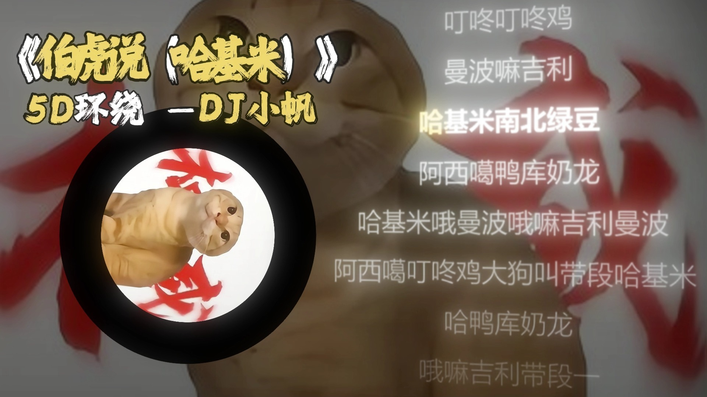 | 2760 | 2025-10-12 |
| [神曼波！职业民美选手初次尝试【哈基米音乐】直接封神！史诗级翻唱](https://www.bilibili.com/video/BV1Ye4uzNErr) |  | 5.4万 | 2025-10-12 |
| [【哈基米音乐】🐱半点心🐱“听半点哈做气质基米”](https://www.bilibili.com/video/BV1yV4uzUEJF) |  | 6604 | 2025-10-12 |
| [疑似《哈基米》的神人广告](https://www.bilibili.com/video/BV14U4uzREZk) |  | 3.5万 | 2025-10-12 |
| [燃曼波【哈基米音乐】](https://www.bilibili.com/video/BV17y4MzzEWh) |  | 8009 | 2025-10-12 |
| [【哈基米】🐱我怎么哈气也走不到你心里🐱](https://www.bilibili.com/video/BV16o4TzrEWz) |  | 4879 | 2025-10-12 |
| [午夜超市，如果顾客是伪人，立即击毙](https://www.bilibili.com/video/BV1cb4PzPE5c) |  | 226.8万 | 2025-10-12 |
| [【原神】芙 芙 一 败 涂 地](https://www.bilibili.com/video/BV1Q64FzuECn) |  | 10.9万 | 2025-10-11 |
| [你被电击枪这样折磨 你受得了吗？破防62.0](https://www.bilibili.com/video/BV1cf4nzmEDt) | 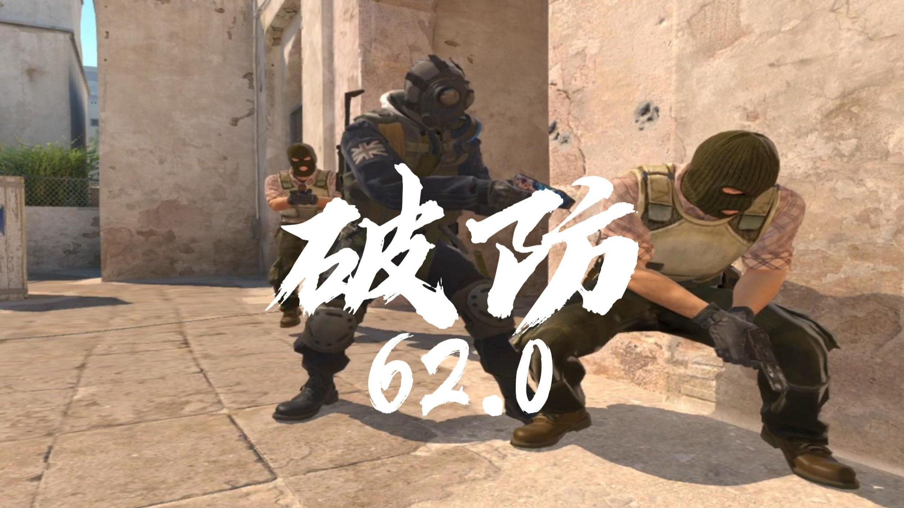 | 30.8万 | 2025-10-11 |
| [凯尔特史诗-《大北境，我的家乡》Northlands, my heart&#x27;s own home](https://www.bilibili.com/video/BV1n14czRE2o) |  | 180.4万 | 2025-10-11 |
| [当我的世界变得抽象2.0](https://www.bilibili.com/video/BV1s54nzmEuZ) |  | 106.0万 | 2025-10-11 |
| [Sora2 Ai彻底失控！太可怕了！4](https://www.bilibili.com/video/BV1xS4nz9ErY) |  | 10.2万 | 2025-10-11 |
| [恋曼波【哈基米音乐】](https://www.bilibili.com/video/BV1cA4WzXE1H) |  | 7072 | 2025-10-10 |
| [朝鲜军歌《大东北白头山，我神圣的家乡》-백두산, 신성한 고향입니다](https://www.bilibili.com/video/BV18w4nzdEju) |  | 166.1万 | 2025-10-10 |
| [🍄鸡蛋啊~鸡蛋啊🍄](https://www.bilibili.com/video/BV1jx4EzaEHJ) |  | 27.1万 | 2025-10-10 |
| [哈基米誓师大会](https://www.bilibili.com/video/BV1QK4LzmERr) |  | 30.4万 | 2025-10-09 |
| [当你发现《大东北我的家乡》和Alan Walker的适配度是100%……](https://www.bilibili.com/video/BV1rLxyz3EKv) |  | 414.7万 | 2025-10-09 |
| [太抽象了！这就是现代艺术？艺术展上看哈基米之歌……🤣](https://www.bilibili.com/video/BV15uxezvEgM) | 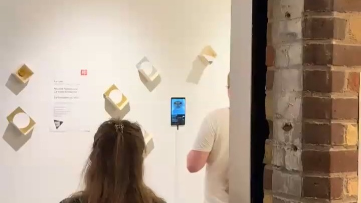 | 53.1万 | 2025-10-09 |
| [大狗嚼俱乐部，不清图不结单](https://www.bilibili.com/video/BV1MHxez4E5V) | 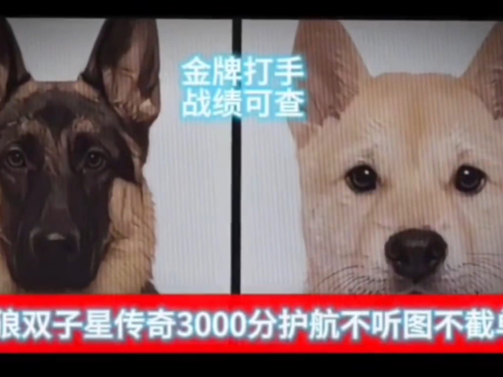 | 10.9万 | 2025-10-08 |
| [[Baldi&#x27;s basics]挖掘机里腌萝卜, 咿呀咿呀哟](https://www.bilibili.com/video/BV1juxfzkEod) |  | 8.0万 | 2025-10-08 |
| [哈基米歌曲合集，全听过的网瘾很大了](https://www.bilibili.com/video/BV1bHxfzYESn) |  | 28.5万 | 2025-10-08 |
| [疑似39年德国希力架巧克力广告流出](https://www.bilibili.com/video/BV1MM4FzwErf) |  | 177.6万 | 2025-10-08 |
| [叠 甲 过](https://www.bilibili.com/video/BV169x9zKEZ2) |  | 74.6万 | 2025-10-08 |
| [🐧就要抠皮鼓🐧](https://www.bilibili.com/video/BV1xLxjzqEc1) |  | 131.9万 | 2025-10-06 |
| [循环歌单｜《bro无处不在の小曲》《怀疑の小曲》poster boy](https://www.bilibili.com/video/BV1z1xVzJEL5) |  | 36.3万 | 2025-10-06 |
| [【补国庆作业の高燃小曲】｜“当你单排时候的你”｜歌曲《urbanisation》](https://www.bilibili.com/video/BV1L5xKztEeJ) | 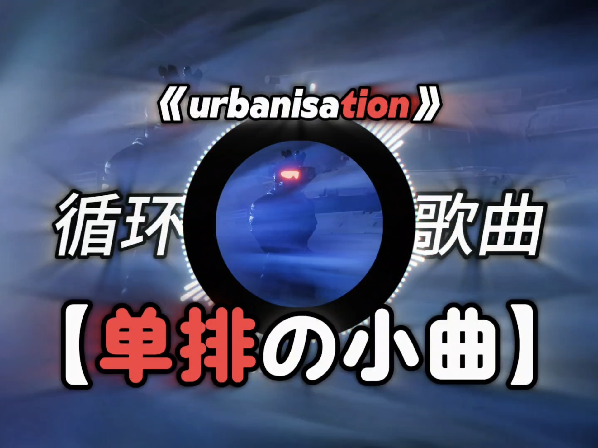 | 93.0万 | 2025-10-05 |
| [颗秒1小时纯享](https://www.bilibili.com/video/BV1B7HKzDEv6) |  | 27.2万 | 2025-10-02 |
| [当代学生开学良好的精神状态 34.0](https://www.bilibili.com/video/BV14cH7zwEBS) |  | 629.8万 | 2025-10-01 |
| [“因为哈基人的投喂而面露难色的三基米 ”](https://www.bilibili.com/video/BV18cnmzSEC6) | 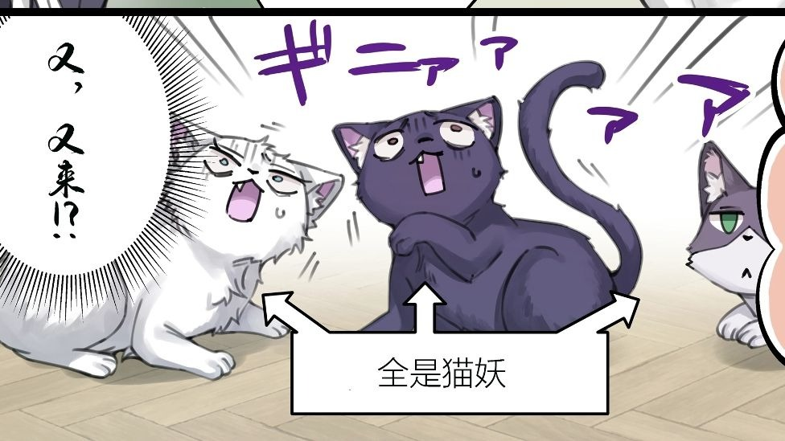 | 15.4万 | 2025-09-30 |
| [我妈捡的哈基米](https://www.bilibili.com/video/BV1Brn2zYErE) | 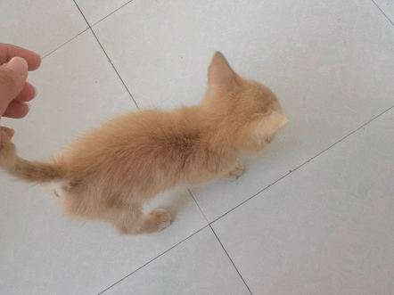 | 14.5万 | 2025-09-30 |
| [【原神生日会】提瓦特民谣](https://www.bilibili.com/video/BV1NRnSzHEdu) |  | 149.4万 | 2025-09-28 |
| [颗秒！](https://www.bilibili.com/video/BV1J9nnz8EG8) |  | 116.8万 | 2025-09-27 |
| [循环歌单｜【Whoopty2】｜“【智斗の小曲】【朵拉の小曲】小时候看这集冷汗流下来了”](https://www.bilibili.com/video/BV1urnwzdEqR) |  | 305.0万 | 2025-09-23 |
| [如果少女哥伦比娅用中文哼唱……你听懂了吗……](https://www.bilibili.com/video/BV1MgWLzNETc) |  | 142.8万 | 2025-09-20 |
| [循环歌单｜《囊囊囊の小曲》Nom Nom Nom Nom Nom Nom Nom](https://www.bilibili.com/video/BV1YcHZzWEmE) | 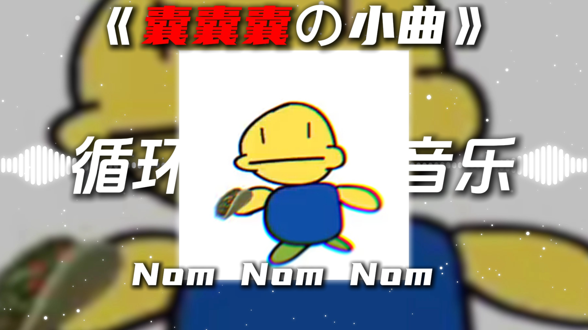 | 140.0万 | 2025-09-14 |
| [【哈基米】哈气之庭（银月之庭）](https://www.bilibili.com/video/BV1YGpVzwEjs) |  | 10.5万 | 2025-09-12 |
| [【完整版】超甜哈基米：❤️one more last 曼波❤️](https://www.bilibili.com/video/BV19UHrzjE9a) |  | 1.5万 | 2025-09-12 |
| [🐱哈吉山的曼波打不打瓦🐱](https://www.bilibili.com/video/BV1WuHQz9Eip) |  | 13.0万 | 2025-09-10 |
| [真基米快哈](https://www.bilibili.com/video/BV1jb8jzYEms) |  | 112.3万 | 2025-07-28 |
| [【中字】xQc看键帽哈基米合集](https://www.bilibili.com/video/BV1J2QmYBEdP) |  | 31.8万 | 2025-03-15 |
| [kards金曲《沟槽的美芬》（PV付）](https://www.bilibili.com/video/BV1HS421R7uz) |  | 286.3万 | 2024-07-12 |

---
*最后更新: 2025-10-16 02:37:39 (自动生成)*
*数据来源: [Bilibili](https://www.bilibili.com)*

## 使用说明

运行以下命令更新视频列表:
```bash
python3 fetch_hajimi_videos.py
```
