# awesome-hajimi
collections of hajimi (哈基米 in Chinese) on the Internet.

## 视频列表 (Video List)

| 视频标题 (Title) | 封面 | 播放量 (Views) | 发布日期 (Date) |
|---|---|---|---|
| [《印度神曲 (哈基米版)》完整，哈基米莫南北绿！](https://www.bilibili.com/video/BV1WcnTztEsH) |  | 17 | 2025-09-23 |
| [『哈基米音乐』胡萝卜张嘴 O咪O咪](https://www.bilibili.com/video/BV1KYnNzZEqR) |  | 60 | 2025-09-23 |
| [【？Wota艺？】哈基米笑傳 之 直面樺加沙，你也想起舞嗎？(22/9)【JV】](https://www.bilibili.com/video/BV1munKzAEcm) | 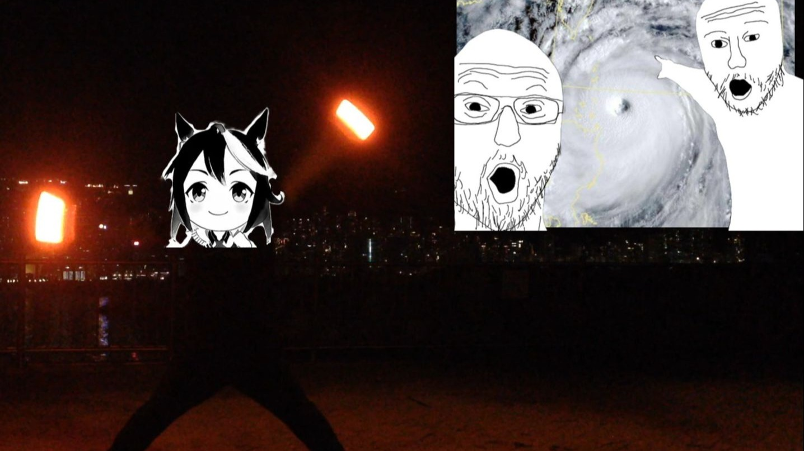 | 97 | 2025-09-22 |
| [我有些有关哈基米歌曲的新想法，要来听听吗！！](https://www.bilibili.com/video/BV1eznKzkEdz) |  | 18 | 2025-09-22 |
| [好摇不挑曲这一块（哈基米音乐）](https://www.bilibili.com/video/BV1fCnAzGEyo) |  | 1104 | 2025-09-22 |
| [【哈基米音乐】伯虎说（万万翻唱）](https://www.bilibili.com/video/BV1yGnPzpEcq) |  | 154 | 2025-09-22 |
| [9月哈基米铃声回顾，一天一个哈基米音乐陶冶来电好友](https://www.bilibili.com/video/BV1UAnPzbE5j) | 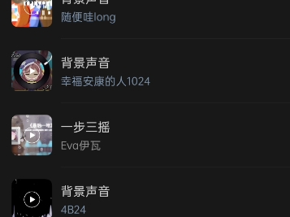 | 18 | 2025-09-22 |
| [【哈基米音乐】纯狐主题曲 心之所在 即使已然不共戴天 矿大北语东方联动作品](https://www.bilibili.com/video/BV1oSnAzMEqY) | 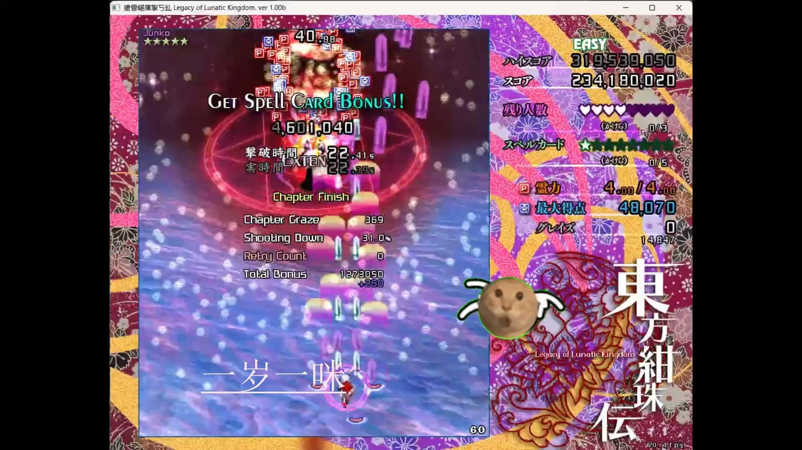 | 338 | 2025-09-22 |
| [《蓝莲花》——哈基米](https://www.bilibili.com/video/BV15DnAzBEkJ) | 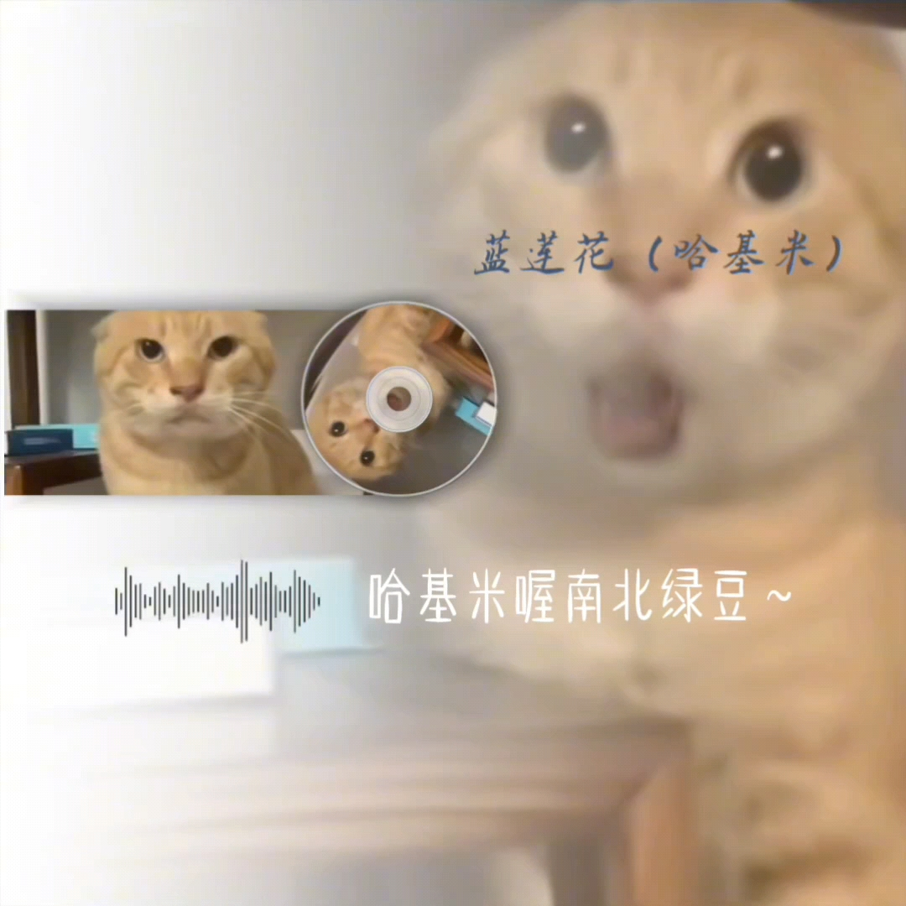 | 17 | 2025-09-22 |
| [【哈基米音乐】Edge Of My Hachimi](https://www.bilibili.com/video/BV1DfnAzwErw) |  | 8598 | 2025-09-22 |
| [《重生之我在乐高当哈基米》](https://www.bilibili.com/video/BV1SFnPzhEHz) |  | 22 | 2025-09-22 |
| [快把音乐给我上传啊！哈基米！](https://www.bilibili.com/video/BV1BtnPzGEtx) |  | 0 | 2025-09-22 |
| [《蓝莲花》——哈基米](https://www.bilibili.com/video/BV1yLnPznEFx) | 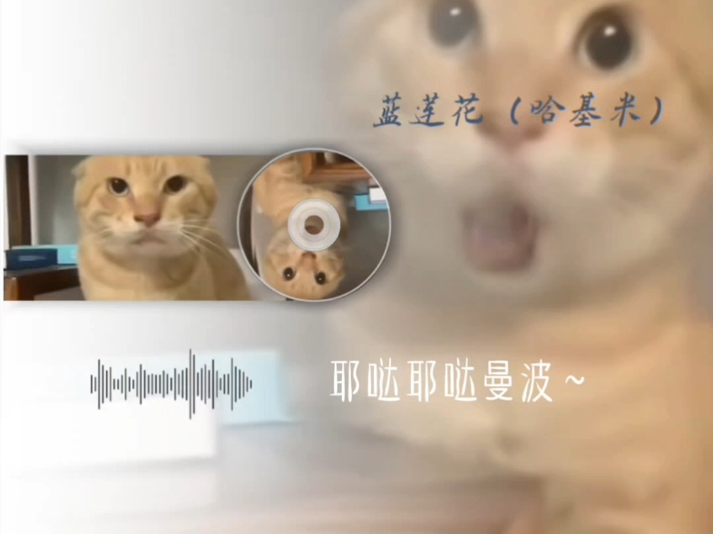 | 176 | 2025-09-22 |
| [【言无期】主包完全沉浸在哈基米的艺术中了2](https://www.bilibili.com/video/BV1zsnPz5EJS) | 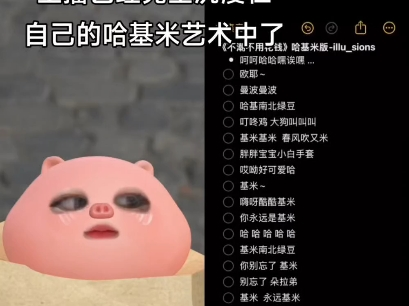 | 400 | 2025-09-22 |
| [【哈基米】哈基米钢琴太肝了](https://www.bilibili.com/video/BV1XCJRzgEn1) |  | 90 | 2025-09-22 |
| [我将只用哈基米做背景音乐](https://www.bilibili.com/video/BV11KnwzUEuC) | 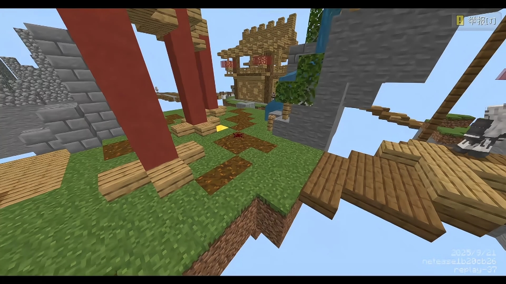 | 31 | 2025-09-22 |
| [《哈曼波》（哈基米曼波）【哈基米音乐】](https://www.bilibili.com/video/BV1vipDzgEF8) |  | 4.4万 | 2025-09-22 |
| [【哈基米音乐】⚡️The Spectre⚡️私人笑声纯享](https://www.bilibili.com/video/BV1LPnczwEVn) |  | 381 | 2025-09-22 |
| [【哈基米】⚡基米地亚狂哈曲⚡](https://www.bilibili.com/video/BV1pdnwzLEH7) |  | 192 | 2025-09-22 |
| [神人机厅播放哈基米音乐](https://www.bilibili.com/video/BV1S6nwzxEfr) | 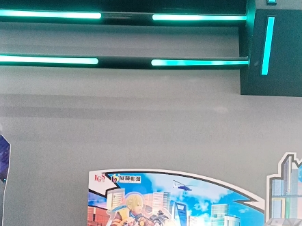 | 58 | 2025-09-22 |
| [PSP听哈基米音乐](https://www.bilibili.com/video/BV1mCnwzWE44) | 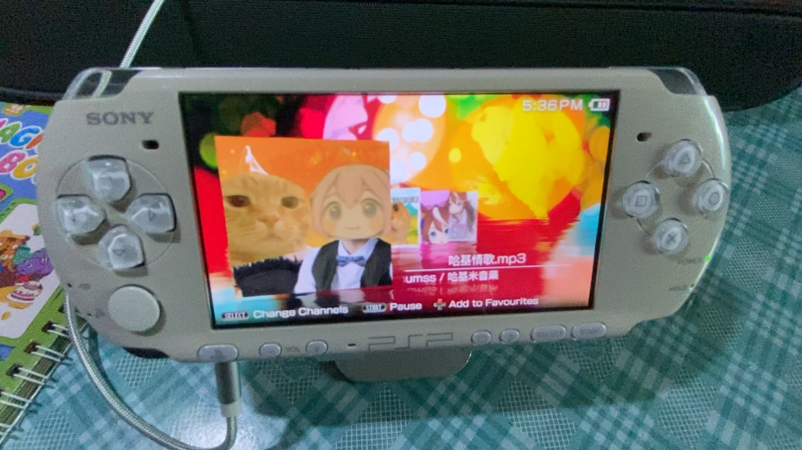 | 267 | 2025-09-22 |
| [循环歌单｜&quot;在凡尘磨练二十载 听闻楼下烤盒蒜”《出山 哈基米纯享版》](https://www.bilibili.com/video/BV16VnFzKE7H) |  | 1115 | 2025-09-22 |
| [【哈基米音乐】Next To You](https://www.bilibili.com/video/BV1ZaJRzmE3A) | 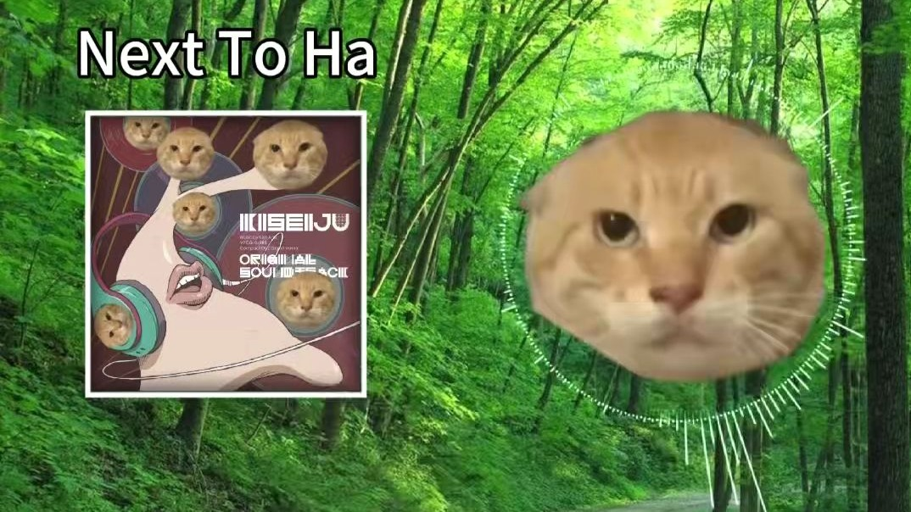 | 340 | 2025-09-22 |
| [【哈基米音乐】这就是Melody！！！](https://www.bilibili.com/video/BV1DyJRzzEwh) |  | 1589 | 2025-09-22 |
| [当你的AI女友开始听哈基米](https://www.bilibili.com/video/BV1tcHQzFEY7) |  | 736 | 2025-09-22 |
| [【哈基米音乐】基XO出道曲（基不发音）](https://www.bilibili.com/video/BV13CJRz3EWa) |  | 360 | 2025-09-22 |
| [哈基米音乐(合集)](https://www.bilibili.com/video/BV1Ntncz1EtR) | 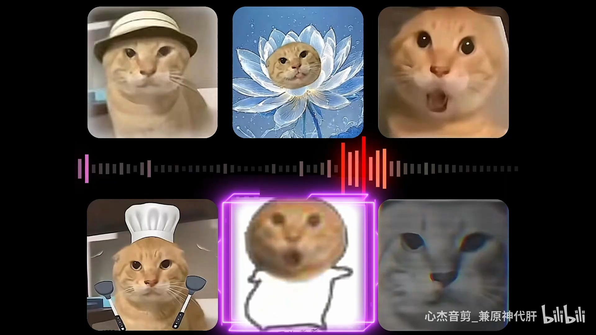 | 34 | 2025-09-22 |
| [【真栗】有甲方找我唱哈基米音乐！](https://www.bilibili.com/video/BV1JHWwzJEQ5) |  | 1496 | 2025-09-22 |
| [【纯净哈基米】绝区零-度假の小曲](https://www.bilibili.com/video/BV1aHJdz5EQn) |  | 832 | 2025-09-21 |
| [【纯净哈基米音乐】如果大哈能够带走我的哀愁～《大海》（Hi-Res）](https://www.bilibili.com/video/BV1cAWAzHEQc) |  | 803 | 2025-09-21 |
| [【古风DJ哈基米】“怎叹那哈有基兮啊基有米”—怎叹](https://www.bilibili.com/video/BV1AoWwzxEo2) |  | 447 | 2025-09-21 |
| [用哈基米的曲配上《春江花月夜》的词](https://www.bilibili.com/video/BV1dQWAzmEzM) |  | 112 | 2025-09-21 |
| [巴迪但是哈基米山歌](https://www.bilibili.com/video/BV1gEWczYED5) |  | 183 | 2025-09-21 |
| [没活了，Ai流萤唱猛毒注意（哈基米）](https://www.bilibili.com/video/BV1HEWwzHEsP) |  | 513 | 2025-09-21 |
| [【哈基米音乐】曼波一场 原曲【旧梦一场】](https://www.bilibili.com/video/BV1ExWwz2EGE) |  | 98 | 2025-09-21 |
| [【钢琴】哈基米山歌 哈基米哦南北绿多](https://www.bilibili.com/video/BV1RvWwz6EFH) | 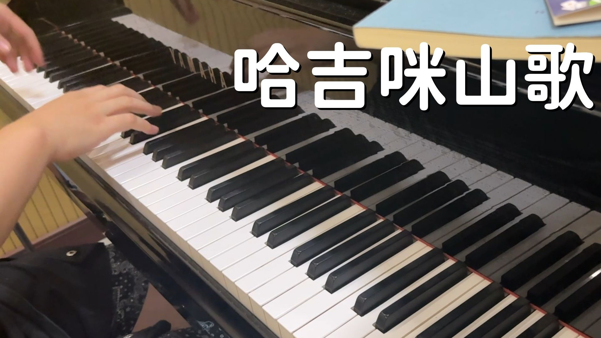 | 618 | 2025-09-21 |
| [[哈基米音乐]《萌系基米直球法则》](https://www.bilibili.com/video/BV1AppRziES6) |  | 502 | 2025-09-21 |
| [【AI Neuro】《最后一哈》这才是真正的哈基米音乐](https://www.bilibili.com/video/BV1XUpRzmEGR) |  | 996 | 2025-09-21 |
| [【哈基米音乐】The Path (A New Beginning)——最后哈气者](https://www.bilibili.com/video/BV1rLWFz1EQs) |  | 1074 | 2025-09-21 |
| [哈基米居然能衍生出这么多首歌，全听过的可以把手机扔了](https://www.bilibili.com/video/BV1Sfpfz4EJy) |  | 409 | 2025-09-21 |
| [等3个云南人一起跳｜哈基宝贝｜哈尼宝贝｜哈基米音乐｜云南山歌｜黑白疯_ye出品｜云南打跳｜哈基米之歌](https://www.bilibili.com/video/BV1sTpZzVECE) |  | 530 | 2025-09-21 |
| [曼波~曼波~有时哈基米（短尾猞猁版）](https://www.bilibili.com/video/BV1gGpRzVEFX) | 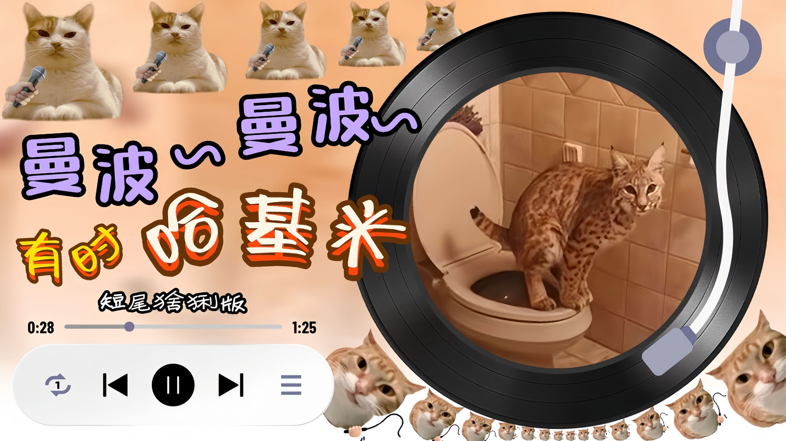 | 1689 | 2025-09-20 |
| [【哈基米音乐】棉花糖【原曲差点不使用】（纯净白切基零添加）（非公式化作词）（无私人笑声）（无B动静）（活字印刷）（古法切片）（全文押韵）](https://www.bilibili.com/video/BV1vBpRzsE1G) |  | 144 | 2025-09-20 |
| [《哈基米儿歌》但鬼泣版](https://www.bilibili.com/video/BV1HPp9zfE6f) |  | 161 | 2025-09-20 |
| [【真栗】太上头了！又是一期栗栗妹哈基米音乐合集](https://www.bilibili.com/video/BV1WAp9z8EjU) |  | 1035 | 2025-09-20 |
| [哈基米音乐机关卡——哈基米起床](https://www.bilibili.com/video/BV1sepQzhECp) |  | 1626 | 2025-09-20 |
| [【哈基米音乐】如哈过耳](https://www.bilibili.com/video/BV1vtWuzbEoa) |  | 465 | 2025-09-19 |
| [基米说男版 停顿卡点 私人笑声【哈基米翻唱】基米说，清唱 （伯虎说停顿卡点 ）](https://www.bilibili.com/video/BV1vMWgzcEop) |  | 449 | 2025-09-19 |
| [起初人们只是以为是一句普通的哈基米，直到这一千多首歌的出现 #哈基米 #哈基米音乐 #抽象 #曼波](https://www.bilibili.com/video/BV1YwWKzUEY2) | 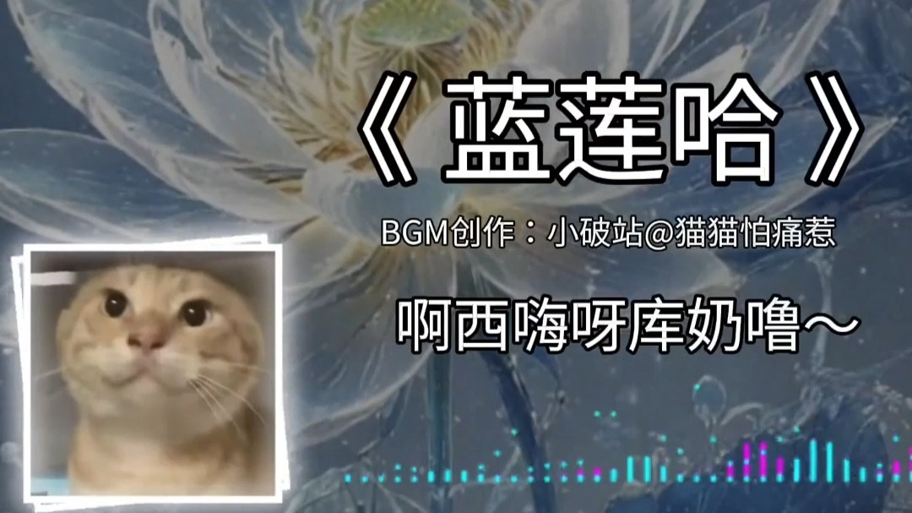 | 1082 | 2025-09-18 |
| [哈基米~哈基米~南北绿豆哈基米~](https://www.bilibili.com/video/BV1ympvz2EKy) |  | 1783 | 2025-09-18 |
| [《 哈 基 米 破 碎 》](https://www.bilibili.com/video/BV1SjpizoEZg) |  | 1569 | 2025-09-18 |
| [【哈基米音乐】我落泪情绪零碎（还是做不到吗哈基米你这家伙）](https://www.bilibili.com/video/BV13qpxzYEtM) |  | 359 | 2025-09-17 |
| [【哈基米音乐】123我哈你/123哈基米/翻唱](https://www.bilibili.com/video/BV1G8pWz8Em8) |  | 419 | 2025-09-17 |
| [【180步频/精选哈基米音乐】【近一小时超长合集】【自用】【180节拍器】跑步笑不出来的可以确诊玉玉症了～](https://www.bilibili.com/video/BV1UPpDzwEbL) |  | 225 | 2025-09-16 |
| [哈基米音乐-基米说](https://www.bilibili.com/video/BV18bpyzDED8) |  | 359 | 2025-09-16 |
| [哈基米音乐：世界之王](https://www.bilibili.com/video/BV1Anprz8Eo3) |  | 58 | 2025-09-16 |
| [【超甜萌妹版】哈基米：🐱左手右手🐱](https://www.bilibili.com/video/BV1yfpEzNEk3) |  | 8656 | 2025-09-14 |
| [【哈基米音乐】P4基-Your Affecttion](https://www.bilibili.com/video/BV1ggp3zRENp) |  | 7148 | 2025-09-12 |
| [【Move your 基米】哈↑哇→哈↑夏→哈↑曼→哈↑波→哈↑哦→哈↑耶→哈↑基米→wow↑](https://www.bilibili.com/video/BV1KdadzNELi) |  | 461 | 2025-09-08 |
| [Tell me~ 哈基米~](https://www.bilibili.com/video/BV11uY5zEEHf) | 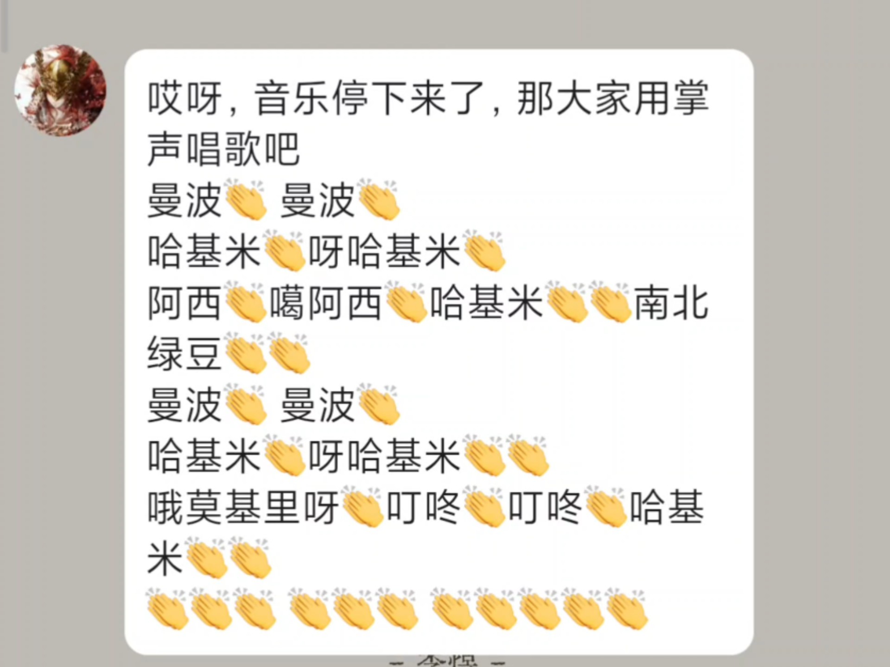 | 1629 | 2025-09-07 |
| [【真栗】夸我是哈基米音乐圣体我可要骄傲了 哪天一只老师更一期你们就老实了！](https://www.bilibili.com/video/BV1jZYMzHEqf) |  | 3459 | 2025-09-07 |
| [【哈基米】对山歌](https://www.bilibili.com/video/BV1koabzUEV2) |  | 1183 | 2025-09-05 |
| [HachiBoard哈基米音乐周榜第2期(2025/9/3 第36周）](https://www.bilibili.com/video/BV1A9aSzGEtd) |  | 3434 | 2025-09-04 |
| [哈基米破坏情侣感情！🤣家里请哈基高也没用了！😡](https://www.bilibili.com/video/BV1zaa2zfE32) |  | 1.6万 | 2025-09-04 |
| [【哈基米音乐】体面](https://www.bilibili.com/video/BV1Gna3znEjL) |  | 1148 | 2025-09-03 |
| [【哈基米音乐】EAT 米！假面骑士加布战斗曲 纯享版](https://www.bilibili.com/video/BV1rCanzxEuf) |  | 1227 | 2025-09-01 |
| [活全家基米：《地狱の哈流》😋，快分享给你的朋友吧](https://www.bilibili.com/video/BV1DMaGz7EWd) |  | 509 | 2025-08-31 |
| [我听了一百首哈基米活全家音乐](https://www.bilibili.com/video/BV1gwhiz2ETC) |  | 31 | 2025-08-30 |
| [哈基米山歌](https://www.bilibili.com/video/BV148e9zwEuT) |  | 1001 | 2025-08-28 |
| [【哈基米音乐】新歌预告：请不要对我哈。/诗宝翻唱（原曲：请不要带我走。/诗岸原创- 奥莉安多幻想曲）](https://www.bilibili.com/video/BV1WXenzTEJn) |  | 898 | 2025-08-24 |
| [【哈基米音乐】荒野大镖客2：see the ha in your eyes(基米电台day7）](https://www.bilibili.com/video/BV1gHeHz7ELJ) |  | 3285 | 2025-08-24 |
| [【哈基米FM】曾经的米](https://www.bilibili.com/video/BV1Afe3zGE5b) |  | 1846 | 2025-08-20 |
| [【Sakata27】Cos 02 翻唱《牵私人戏》翻跳《哈基米Nobody》（第2届鬼畜音乐节）](https://www.bilibili.com/video/BV1rRYYz8EwE) |  | 140 | 2025-08-16 |
| [【哈基米音乐】藤井风--Hachimī](https://www.bilibili.com/video/BV1wTbBzPECs) |  | 3663 | 2025-08-14 |
| [哈基米音乐：哈我（知我）](https://www.bilibili.com/video/BV1ezt9zYE9Z) | 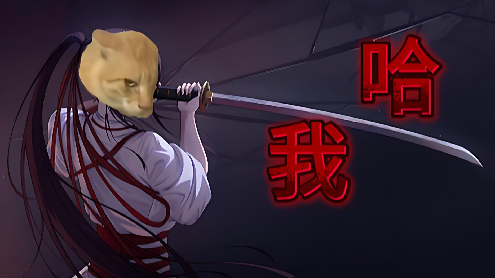 | 4636 | 2025-08-12 |
| [大冒险，哈基米音乐](https://www.bilibili.com/video/BV1fotuzVEuD) |  | 2.0万 | 2025-08-04 |
| [【leedo】直播切片 — 哈基米小曲合集](https://www.bilibili.com/video/BV1rjb9zGEfp) |  | 2.0万 | 2025-07-25 |
| [（哈基米音乐）格鲁德小镇 塞尔达传说旷野之息BGM](https://www.bilibili.com/video/BV1wXgVzDE1G) |  | 456 | 2025-07-21 |
| [〖哈基米音乐〗恐怖基米](https://www.bilibili.com/video/BV18igPz6Eeo) |  | 4646 | 2025-07-17 |
| [哈基米音乐之sugar](https://www.bilibili.com/video/BV1wagAzsEZV) |  | 1.6万 | 2025-07-17 |
| [【哈基米】哈农（卡农）（古典哈基米）](https://www.bilibili.com/video/BV1MKunzGEPk) |  | 3317 | 2025-07-15 |
| [弱水三基～问题是我只准备了一桌米，来了两桌哈基](https://www.bilibili.com/video/BV1m9MXzvEY2) | 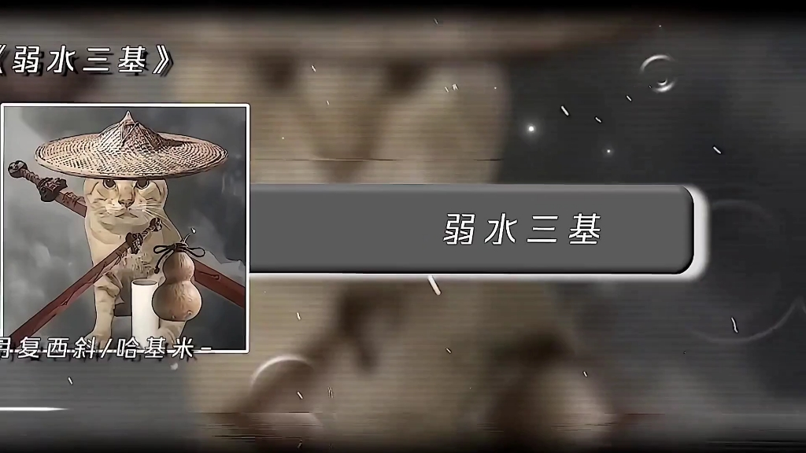 | 1096 | 2025-07-12 |
| [哈基米音乐：MORE！JUMP！MORE！](https://www.bilibili.com/video/BV1mZGVzPEoG) |  | 3.9万 | 2025-07-10 |
| [【哈基米音乐】 寂静岭 true](https://www.bilibili.com/video/BV1QeGNzmEfg) |  | 3052 | 2025-07-09 |
| [哈基米音乐5分钟特供版，但是青海摇](https://www.bilibili.com/video/BV1thGHzREhx) |  | 309 | 2025-07-08 |
| [【哈基米音乐】学了两天做的《曼波2000》](https://www.bilibili.com/video/BV1ze3XzFEdu) |  | 4223 | 2025-07-05 |
| [【循环歌单】“这期间赛马娘和CL都沉默了”《哈基米の小曲儿》动漫/二创/游戏｜《馬鹿ふたり》](https://www.bilibili.com/video/BV19fKUzZExX) |  | 1.3万 | 2025-06-28 |
| [【哈基米音乐】曼波神殿-冒险岛时间神殿](https://www.bilibili.com/video/BV1W9K1zvEx6) |  | 7550 | 2025-06-28 |
| [补档 早期哈基米bgm之H档案](https://www.bilibili.com/video/BV1hfMwzFEVC) | 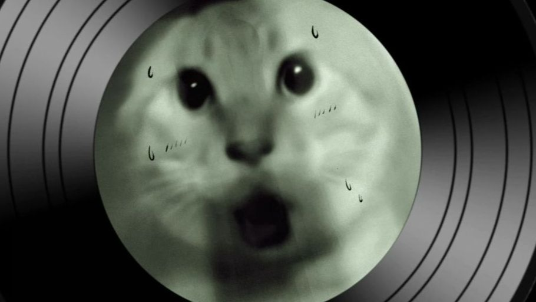 | 7588 | 2025-06-12 |
| [【开源哈基米音乐】哈基Midnight City FL工程分享](https://www.bilibili.com/video/BV1LVT3zfEE4) |  | 4.6万 | 2025-06-06 |
| [《we don&#x27;t talk manbo》-哈基米](https://www.bilibili.com/video/BV1RtE9zBE5s) |  | 2.4万 | 2025-05-19 |
| [【補檔】【2025哈基米拜年基】哈哈氣氣過大年](https://www.bilibili.com/video/BV1iyRTYtEHR) |  | 5978 | 2025-03-06 |
| [【哈基米音乐】但 草东没有派对](https://www.bilibili.com/video/BV1nUPteUEv3) | 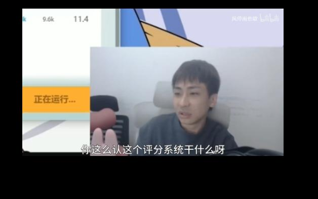 | 618 | 2025-02-24 |
| [伤感活全家哈基米音乐之哈基米 dehors](https://www.bilibili.com/video/BV1rvK3egEWd) |  | 21.2万 | 2025-02-14 |
| [哈基米china-e](https://www.bilibili.com/video/BV1dYNHetEUL) |  | 1.3万 | 2025-02-06 |
| [山歌好比哈基米【翻唱】](https://www.bilibili.com/video/BV1YswPeFEhy) |  | 9941 | 2025-01-18 |
| [掰开来是樱花味的哈基米音乐](https://www.bilibili.com/video/BV1cYzJYhEXE) | 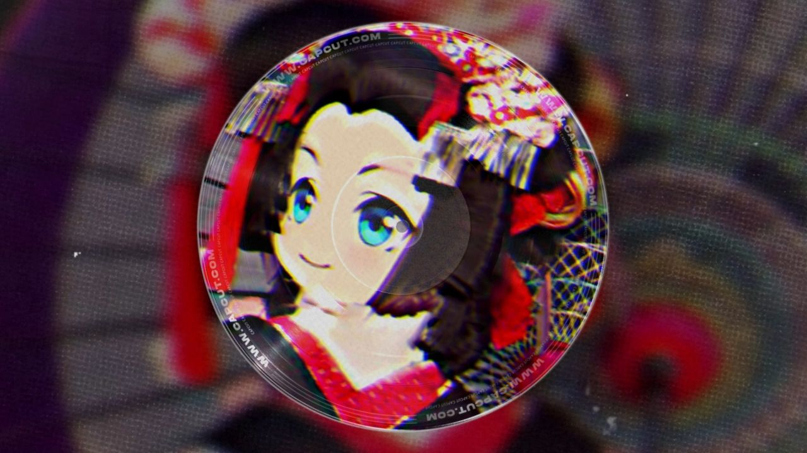 | 3758 | 2024-11-30 |
| [哈基米之歌(´▽｀)ﾉ♪原创音乐](https://www.bilibili.com/video/BV1jWpBeHEkE) | 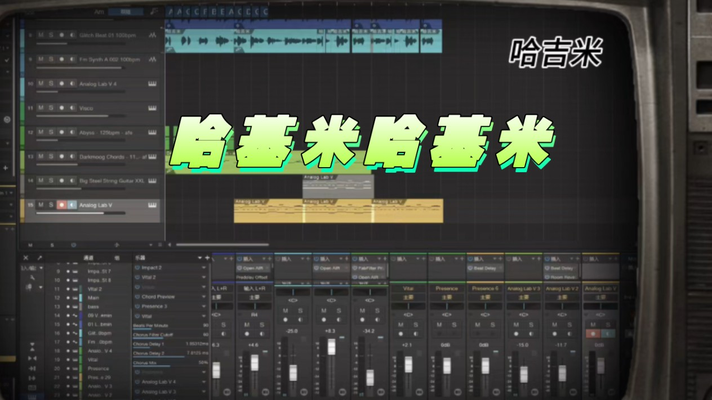 | 1312 | 2024-09-08 |
| [【哈基米音乐】哈基小米](https://www.bilibili.com/video/BV12wWHesEGG) |  | 971 | 2024-08-20 |
| [哈基米之诗](https://www.bilibili.com/video/BV1AuiueLEFD) |  | 9.2万 | 2024-08-02 |

---
*最后更新: 2025-09-23 02:35:20 (自动生成)*
*数据来源: [Bilibili](https://www.bilibili.com)*

## 使用说明

运行以下命令更新视频列表:
```bash
python3 fetch_hajimi_videos.py
```
