# awesome-hajimi
collections of hajimi (哈基米 in Chinese) on the Internet.

## 视频列表 (Video List)

| 视频标题 (Title) | 封面 | 播放量 (Views) | 发布日期 (Date) |
|---|---|---|---|
| [哈基米日常：第2集 睡觉的哈基米（结尾有彩蛋）](https://www.bilibili.com/video/BV1xH9XB4EnA) | 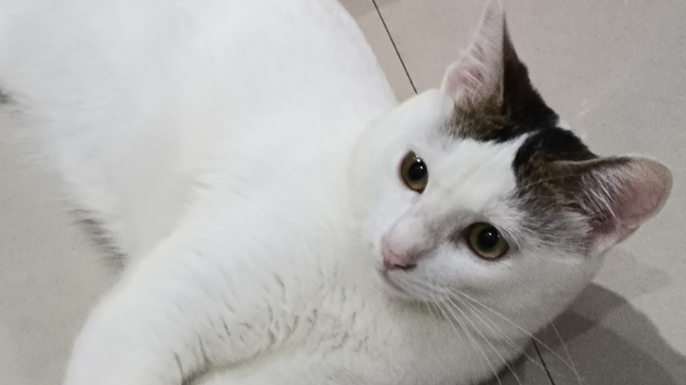 | 58 | 2026-05-02 |
| [齐齐“哈”尔的哈基米，我能玩一整天](https://www.bilibili.com/video/BV19uR7BrEgL) |  | 2644 | 2026-05-02 |
| [人声版【古典哈基米】巴赫g小调 小赋格曲 BWV578](https://www.bilibili.com/video/BV135R7BuE4x) |  | 1926 | 2026-05-02 |
| [假期露营【哈基动物园281期】](https://www.bilibili.com/video/BV1i2R7BjEzr) |  | 532 | 2026-05-02 |
| [魔兽RPG自走棋:哈基米(耄耋)棋子神人作者家里请哈基高了 啊米诺斯](https://www.bilibili.com/video/BV19XR7BGEap) |  | 907 | 2026-05-02 |
| [【哈基米】🐱青柠🍋](https://www.bilibili.com/video/BV1YXR7BGETM) |  | 7287 | 2026-05-02 |
| [狸花猫生存挑战之假如遇到蛇怎么办？](https://www.bilibili.com/video/BV1eSR7B5E3w) | 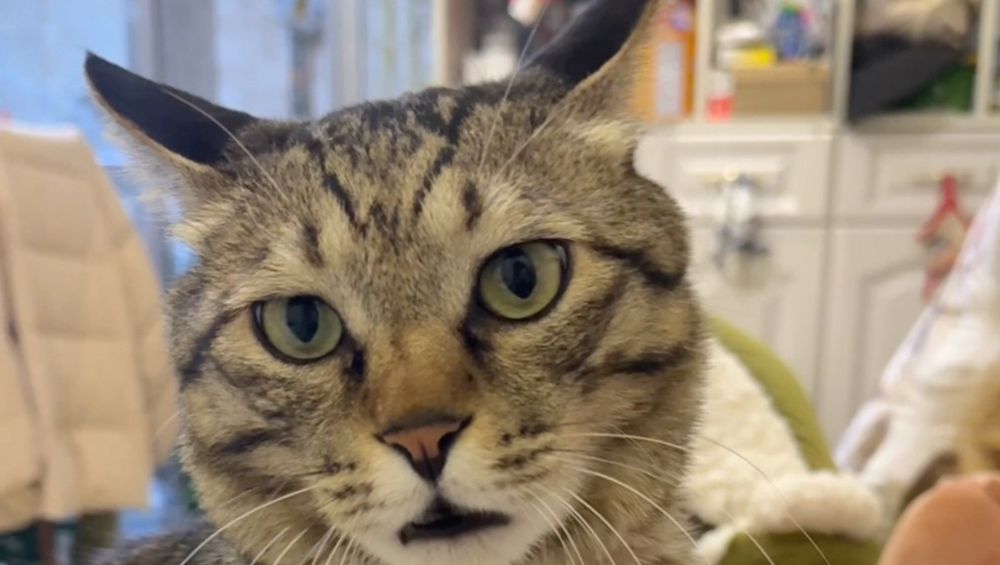 | 4912 | 2026-05-02 |
| [【基米TV】地球最耐人寻味生物22分钟剧场版，一次看个够！](https://www.bilibili.com/video/BV14KREBYENU) | 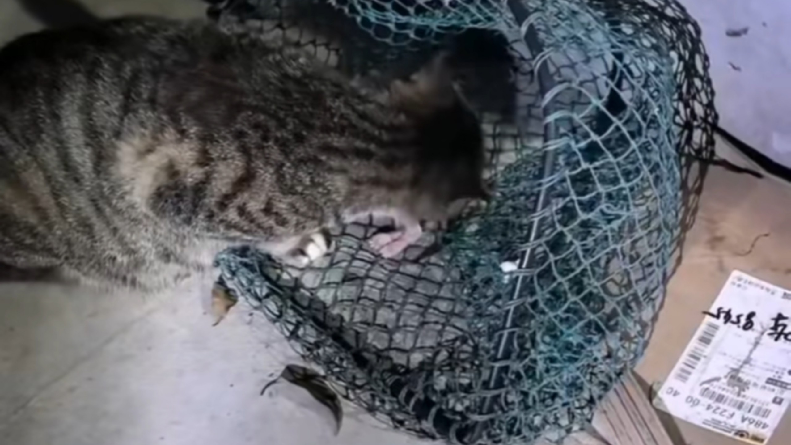 | 4406 | 2026-05-02 |
| [哈基米 这个这个上头](https://www.bilibili.com/video/BV1xNREBPEaz) | 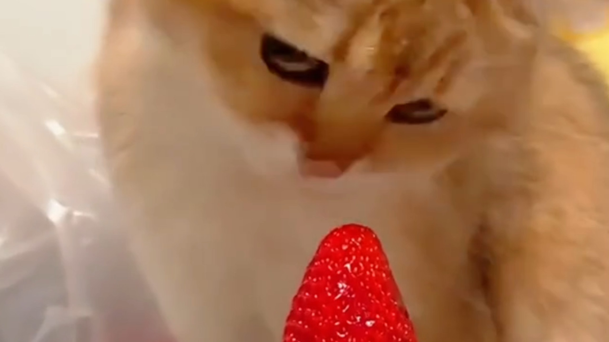 | 1178 | 2026-05-02 |
| [哎听说了，主人好像是恋爱了！！！](https://www.bilibili.com/video/BV1YvREBCEJV) |  | 1.6万 | 2026-05-02 |
| [那些小众也难听的哈基米音乐](https://www.bilibili.com/video/BV1EpREBQEYZ) |  | 3788 | 2026-05-02 |
| [哈基米：爱的故事（上基）](https://www.bilibili.com/video/BV1iCRLBrErT) |  | 201 | 2026-05-02 |
| [哈基米日常：第1集 自己给自己洗澡的哈基米](https://www.bilibili.com/video/BV1B6RLBkEPd) | 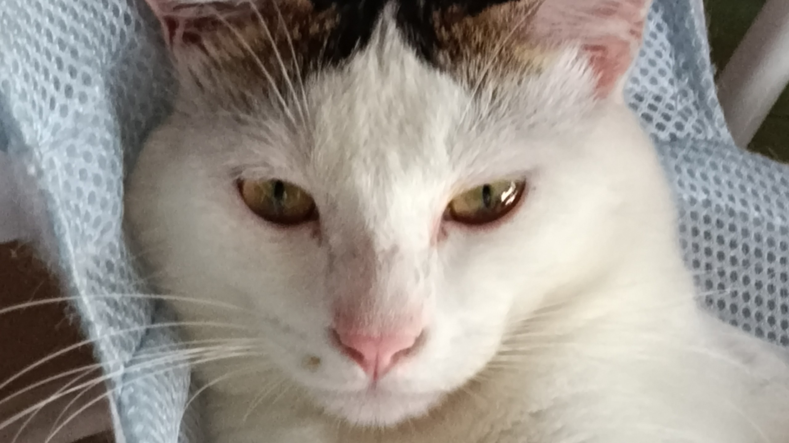 | 194 | 2026-05-02 |
| [哈基米音乐：😺The Rebel Path（哈博朋克2077）——“你是想做无名小耄，还是名扬天下？”😺](https://www.bilibili.com/video/BV1A8RLBnEvP) |  | 1032 | 2026-05-02 |
| [零个人知道哈基米和曼波的出处在哪](https://www.bilibili.com/video/BV1y4RLBHExZ) |  | 696 | 2026-05-02 |
| [【哈基米】“兰亭集序”（神人杯应援作）](https://www.bilibili.com/video/BV1BeRLB2ER3) |  | 1124 | 2026-05-02 |
| [牢玩家的小曲-哈基米](https://www.bilibili.com/video/BV1WKRjBREj6) |  | 1019 | 2026-05-02 |
| [哈基米](https://www.bilibili.com/video/BV1tFRjBfEvB) | 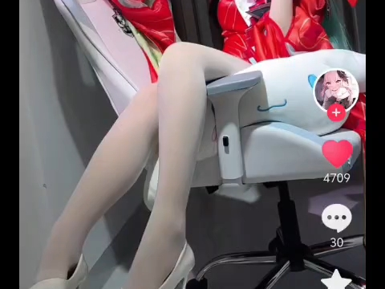 | 14 | 2026-05-02 |
| [基米售货机6-10集合订版](https://www.bilibili.com/video/BV1c9RjBXEwj) | 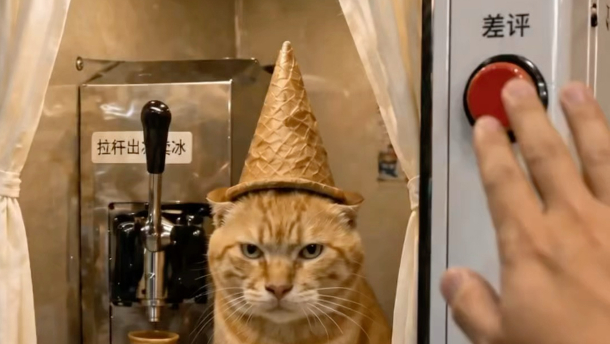 | 18.6万 | 2026-05-02 |
| [日子慢悠悠，惊喜刚刚好#哈基米](https://www.bilibili.com/video/BV1wDRjBRESv) | 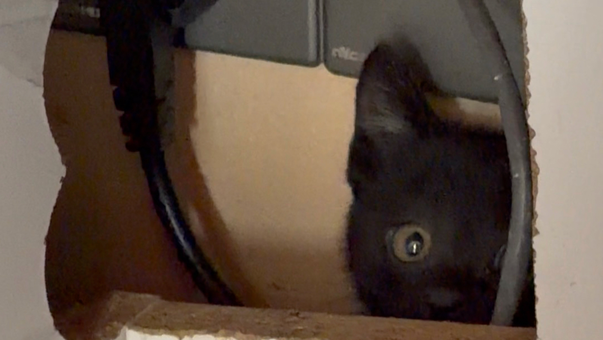 | 577 | 2026-05-02 |
| [老师开始了唱歌——44](https://www.bilibili.com/video/BV1WTR5BjEA2) |  | 6762 | 2026-05-02 |
| [【神人杯day2】哈基米：曼波人生路](https://www.bilibili.com/video/BV1eBR3BtEuV) |  | 1305 | 2026-05-02 |
| [酸月天 - 离开咚鸡表面](https://www.bilibili.com/video/BV1dcRLBuE3R) |  | 1141 | 2026-05-02 |
| [双倍快乐～](https://www.bilibili.com/video/BV1rpR3BBELU) | 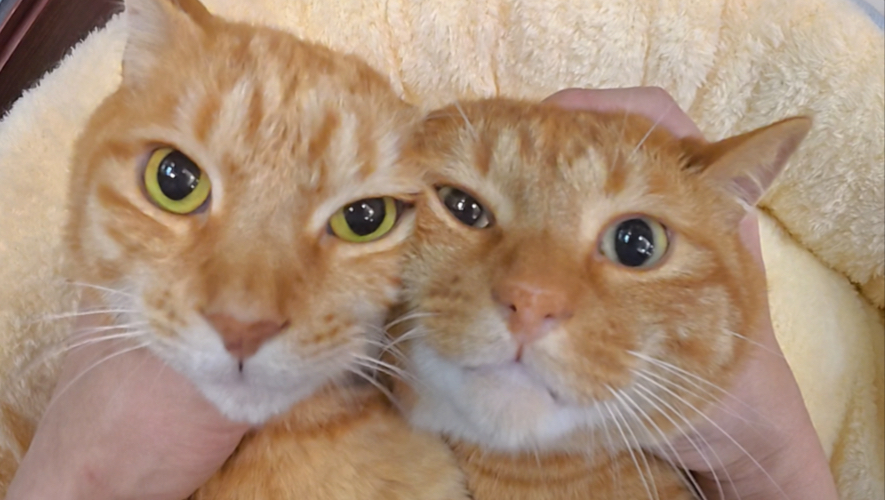 | 23.1万 | 2026-05-02 |
| [台风似乎带来了某些东西…【哈基米恐怖故事-台风天第十二集】](https://www.bilibili.com/video/BV1xZRVBpEmL) |  | 3.6万 | 2026-05-02 |
| [哈基米这个小偷](https://www.bilibili.com/video/BV14ZRVBpEwK) | 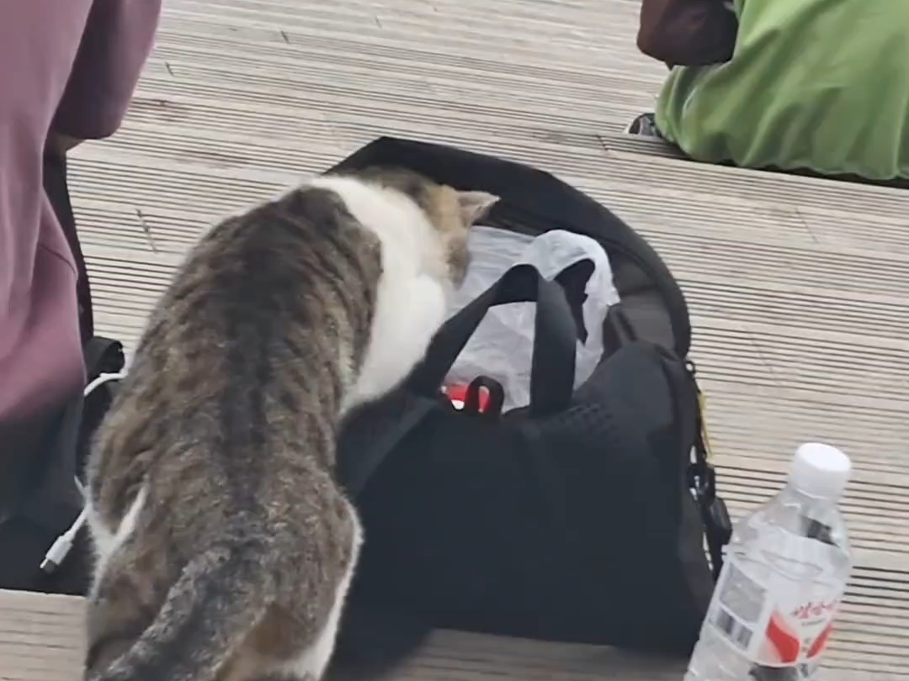 | 4312 | 2026-05-02 |
| [巷子偶遇变异哈基米 试图和太奶对话](https://www.bilibili.com/video/BV1fXR5ByEyR) | 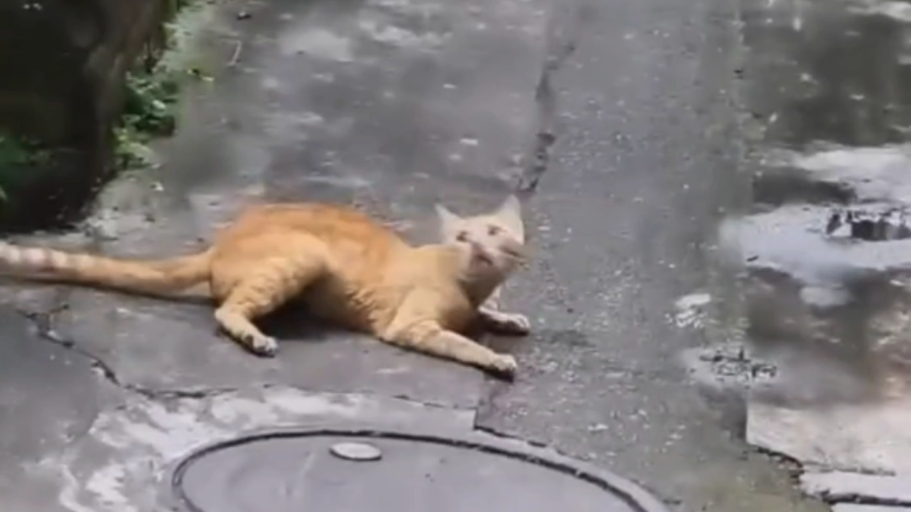 | 2570 | 2026-05-02 |
| [小火耄偷吃包子](https://www.bilibili.com/video/BV1ZZR5B3E3U) | 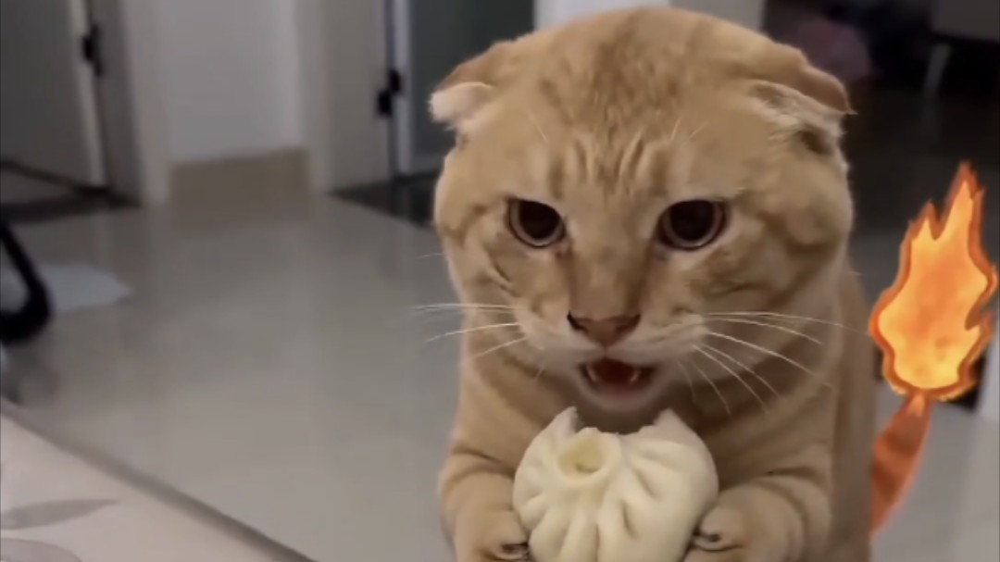 | 2667 | 2026-05-02 |
| [有点招笑了这个哈基米](https://www.bilibili.com/video/BV1yWRLBWEHb) |  | 3614 | 2026-05-02 |
| [基米这个代码错乱](https://www.bilibili.com/video/BV1xRR3B2EHT) | 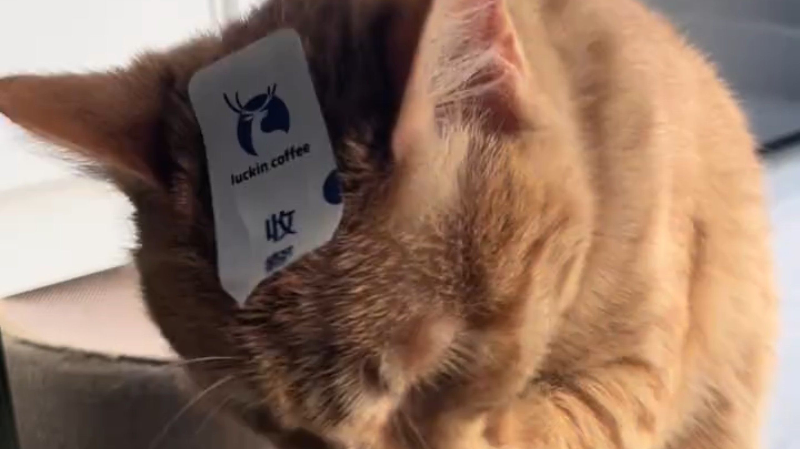 | 2.6万 | 2026-05-01 |
| [怎么给我一种到了风俗之地的错觉…感觉下一秒就要问我:“进来玩吗？”](https://www.bilibili.com/video/BV1k7RuBPEo4) | 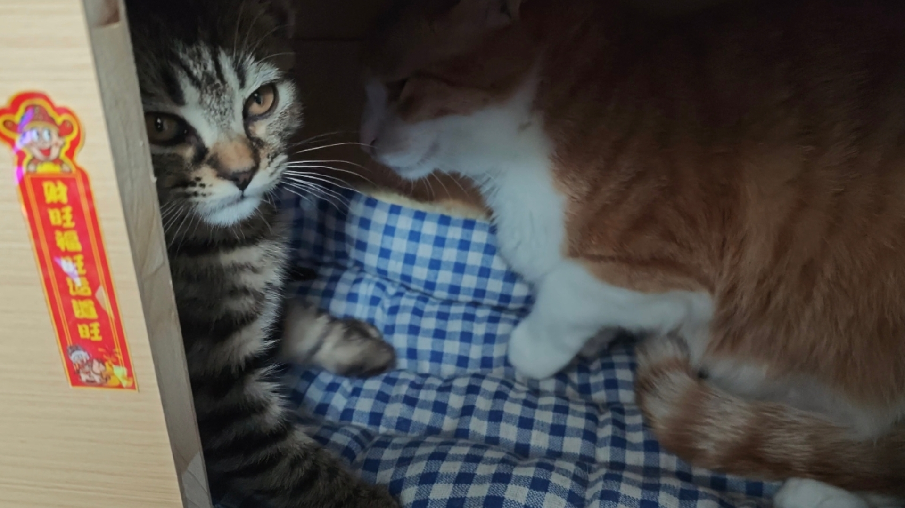 | 9126 | 2026-05-01 |
| [每只猫都有奇奇怪怪的小癖好！](https://www.bilibili.com/video/BV13VRKBgEiq) | 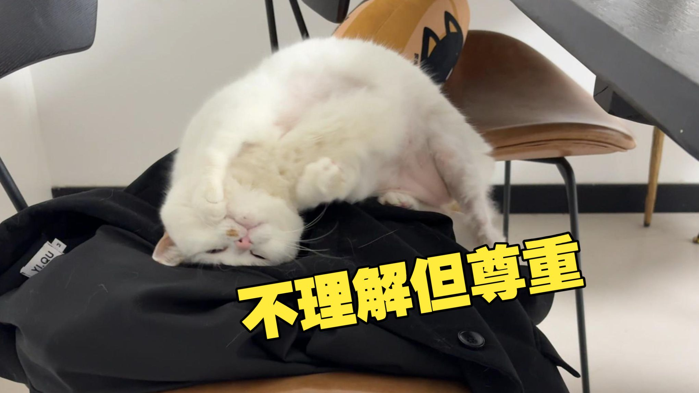 | 8116 | 2026-05-01 |
| [DECO*27 - Love Para feat. Hatsune Miku](https://www.bilibili.com/video/BV15PoUBNEGt) |  | 54.4万 | 2026-05-01 |
| [Bili_Board术力口传说曲周榜第59期2026年5月1日第18周](https://www.bilibili.com/video/BV14S9vB5EWj) |  | 21.2万 | 2026-05-01 |
| [这...这猫不对吧🙀](https://www.bilibili.com/video/BV1LNRKB1Eyg) |  | 82.4万 | 2026-05-01 |
| [这就是你所谓的猛攻？！](https://www.bilibili.com/video/BV1ZCRMB4EUH) |  | 146.2万 | 2026-05-01 |
| [就知道你最喜欢的是我了！【名创优品x鸣潮】](https://www.bilibili.com/video/BV1om9eBoELH) |  | 36.0万 | 2026-05-01 |
| [啊？54.5](https://www.bilibili.com/video/BV1L19aBnETX) |  | 36.9万 | 2026-05-01 |
| [哈吉咪](https://www.bilibili.com/video/BV1h7RKBqEFM) | 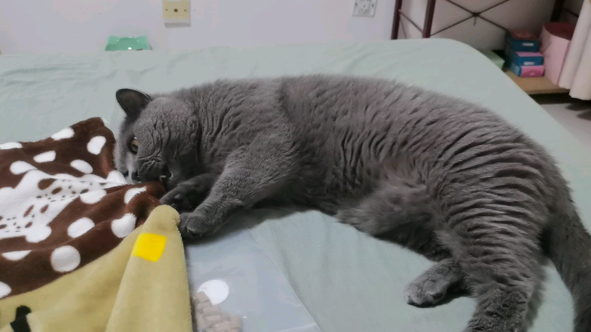 | 123 | 2026-05-01 |
| [你自己约的架打不赢看我也没办法啊！](https://www.bilibili.com/video/BV1N4RKBhEnZ) | 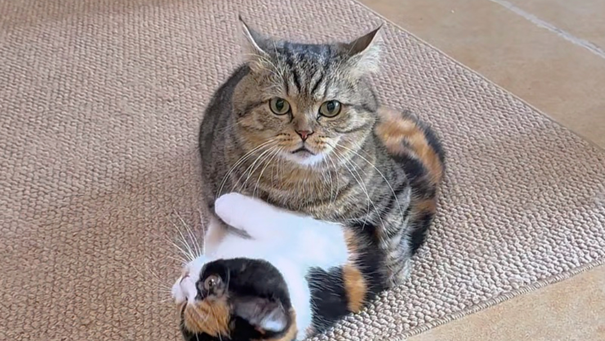 | 3.1万 | 2026-05-01 |
| [沙暴武最变态的一集！什么叫叠了38层的海豹和30层的皇后？！](https://www.bilibili.com/video/BV1P69SBmE2d) |  | 6.4万 | 2026-04-30 |
| [奇怪的哈基米](https://www.bilibili.com/video/BV1Mc9YBgETs) | 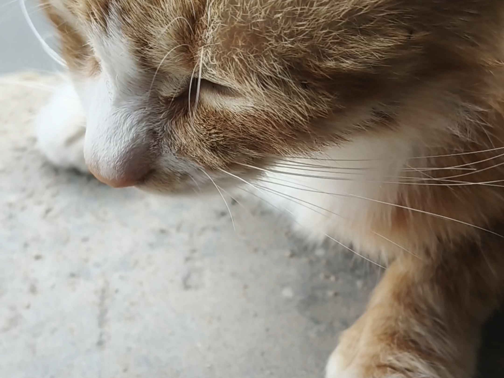 | 178 | 2026-04-30 |
| [摇摆基米](https://www.bilibili.com/video/BV1iz98B2Eay) | 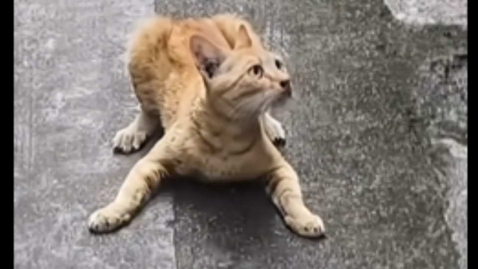 | 1.4万 | 2026-04-30 |
| [中文版【HEAVENLY JUMPSTYLE】-【白衣】赛博菩萨吟唱慈悲小曲 AI翻唱!!!](https://www.bilibili.com/video/BV1z59hBQEwM) |  | 15.9万 | 2026-04-30 |
| [哈月夜｜《花月夜》](https://www.bilibili.com/video/BV1Bh9tB5EXg) |  | 619 | 2026-04-29 |
| [基米不再懦弱，勇敢哈气。耄耋](https://www.bilibili.com/video/BV18H9sBXErC) |  | 7915 | 2026-04-29 |
| [老大我们在看猫片喵](https://www.bilibili.com/video/BV1x89sB7ER9) | 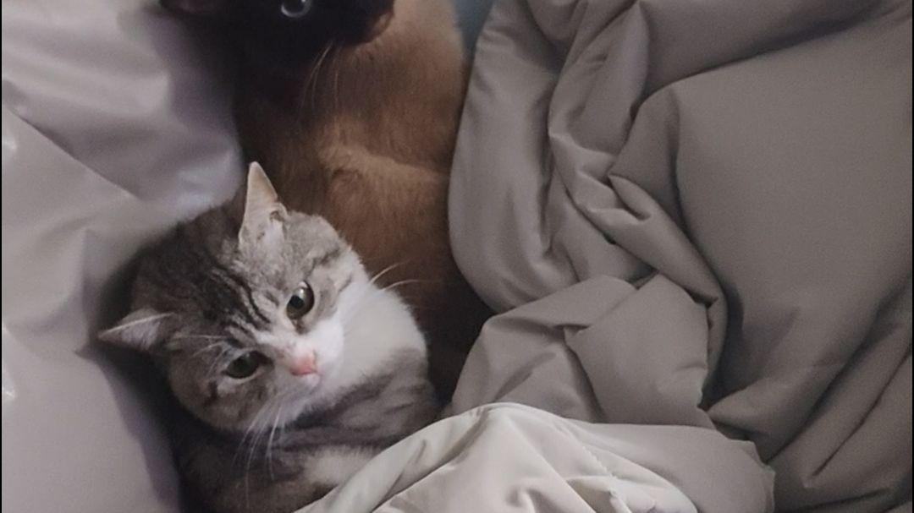 | 4.0万 | 2026-04-29 |
| [《 神 人 视 频 5.0 》](https://www.bilibili.com/video/BV1to9DBREAy) |  | 40.6万 | 2026-04-29 |
| [Bili_Board术力口周榜第99期2026年4月29日第17周](https://www.bilibili.com/video/BV1fK9mBwEzG) |  | 28.0万 | 2026-04-29 |
| [撸猫不！胖胖的劲贼大！](https://www.bilibili.com/video/BV1WR92B6ESK) |  | 386.3万 | 2026-04-29 |
| [谢谢所有可爱的宝宝#哈基米 #美人鱼 #猫咪 #AI](https://www.bilibili.com/video/BV1Ni9SBnErY) |  | 2567 | 2026-04-29 |
| [[冰与火之舞]反乌托邦哈基米版](https://www.bilibili.com/video/BV1X79mB9ECx) |  | 442 | 2026-04-29 |
| [？？？](https://www.bilibili.com/video/BV1GV91BSESs) |  | 27.3万 | 2026-04-28 |
| [这一刻心底埋下争气的种子](https://www.bilibili.com/video/BV1HX9kBxEbU) |  | 67.1万 | 2026-04-28 |
| [八零彪子听自己带火的歌《往事只能哈基》是什么感受？](https://www.bilibili.com/video/BV1ue9kBBEiC) |  | 366 | 2026-04-28 |
| [豆包，如何无痕处理一只140斤的鸡](https://www.bilibili.com/video/BV1NC9kBaEaJ) |  | 27.0万 | 2026-04-28 |
| [哈吉米](https://www.bilibili.com/video/BV1K696BdEN1) | 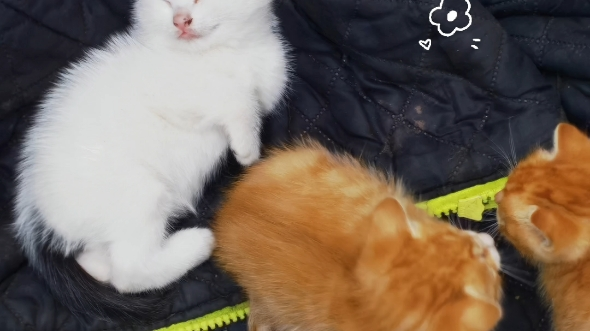 | 151 | 2026-04-28 |
| [比奇堡酷哥男团（上半场）](https://www.bilibili.com/video/BV1q9o1BAEzH) |  | 19.2万 | 2026-04-27 |
| [哇，还有回血特效！](https://www.bilibili.com/video/BV1iGoCBWEAx) |  | 7.2万 | 2026-04-27 |
| [皮蛋节哈基米也太萌了吧](https://www.bilibili.com/video/BV1zdo6BxE13) |  | 1.8万 | 2026-04-27 |
| [玩吕布不笑的家里可以请哈基米了](https://www.bilibili.com/video/BV17ioqBkEkC) |  | 2.4万 | 2026-04-26 |
| [【老鼠人行动】航天基地（绝密）????w→0](https://www.bilibili.com/video/BV1JuoiBGEq9) | 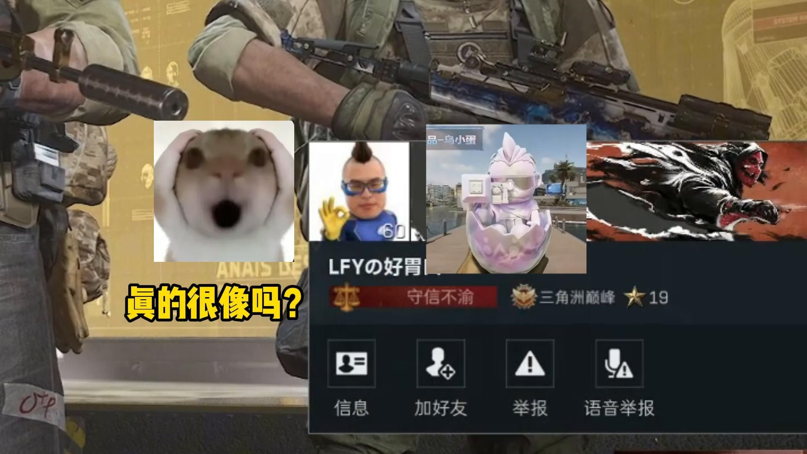 | 62.6万 | 2026-04-26 |
| [误闯天家的哈基米（二）](https://www.bilibili.com/video/BV1ysZFBEELo) | 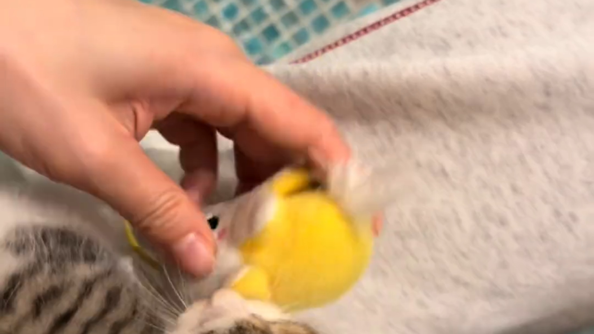 | 1248 | 2026-04-26 |
| [“求你别离开我”小马升key高音翻唱《海屿你》](https://www.bilibili.com/video/BV1xBoSBfEQm) |  | 3.8万 | 2026-04-26 |
| [《处刑拍手》但是豆包唱](https://www.bilibili.com/video/BV1DBo9BLEWB) |  | 42.2万 | 2026-04-25 |
| [bilibili全站术力口二创周榜第6期2026/4/25](https://www.bilibili.com/video/BV1wVoQBRELw) |  | 98.7万 | 2026-04-25 |
| [【本家投稿】かしこ。- プラリネ / feat. 初音ミク](https://www.bilibili.com/video/BV1exoQB1EMB) | 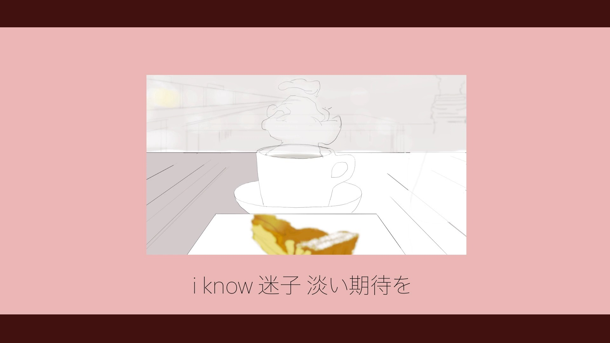 | 25.5万 | 2026-04-25 |
| [[E6高音警告]诗歌剧《Execution Clap（处刑鼓掌）》｜“真是笑死个人了”](https://www.bilibili.com/video/BV1fzoEBZEPy) |  | 2.8万 | 2026-04-25 |
| [皮蛋节哈基米盲盒上线](https://www.bilibili.com/video/BV1rFo3B3EVF) |  | 1.9万 | 2026-04-24 |
| [哈基米这个喜欢在马路上玩](https://www.bilibili.com/video/BV1cLd1BKE6q) | 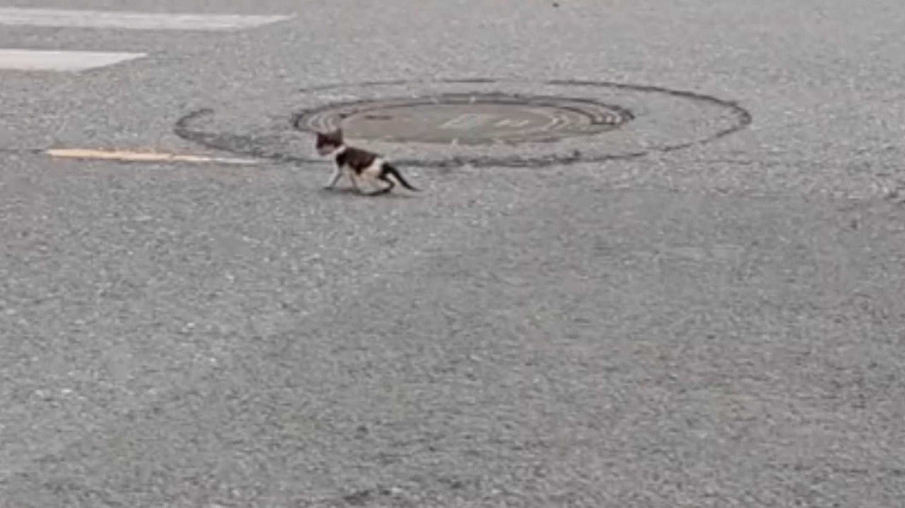 | 9035 | 2026-04-21 |
| [哈基米也太可爱了](https://www.bilibili.com/video/BV1tgoABaEPi) | 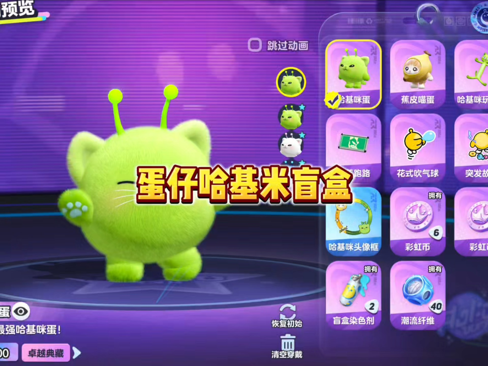 | 1.5万 | 2026-04-20 |
| [桃纸听太空曼波绷不住了：我能不能说我刷视频刷到过 这才是真正的音乐呀](https://www.bilibili.com/video/BV1MmocBbEm1) |  | 8.1万 | 2026-04-19 |
| [自用(サンタ•アプア)2026.04.17](https://www.bilibili.com/video/BV1uvdnBLEH6) |  | 27.9万 | 2026-04-18 |
| [だ・し・て／LET.ME.OUT.🐍初音ミク👮重音テトSV【官方投稿】](https://www.bilibili.com/video/BV11ydeB1EgF) |  | 78.1万 | 2026-04-17 |
| [676767！！！！](https://www.bilibili.com/video/BV1YtdaBSE2y) |  | 33.6万 | 2026-04-16 |
| [【纯净哈基米】那些年你听过的电音之——Jiliscope 🎵](https://www.bilibili.com/video/BV19wQ4B4EdC) |  | 1.9万 | 2026-04-14 |
| [无敌可爱哈基咪！！！](https://www.bilibili.com/video/BV1uNDjBQEuD) |  | 3.2万 | 2026-04-08 |
| [小奶咪这个粘人](https://www.bilibili.com/video/BV17EDvBREkd) | 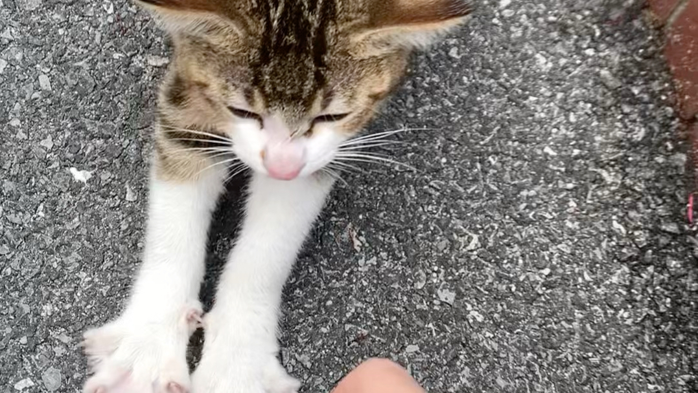 | 75.3万 | 2026-04-07 |
| [这又是什么代码。](https://www.bilibili.com/video/BV1hDDaBKEwA) | 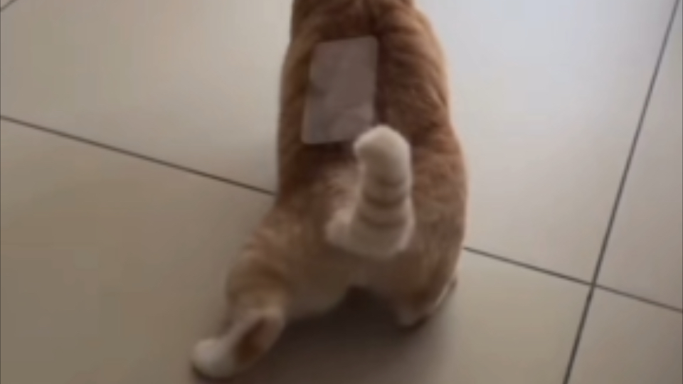 | 5.6万 | 2026-04-07 |
| [[循环歌单]&quot;压迫感の小曲&quot;REVENGE (Super Slowed)-1HXSX, wnorg17](https://www.bilibili.com/video/BV1hTDaBvEwS) |  | 12.9万 | 2026-04-06 |
| [［官方投稿］アンタに言ってんの！　ぴーなた feat.重音テト　本物！！！](https://www.bilibili.com/video/BV1huAGz1EfC) |  | 148.0万 | 2026-03-22 |
| [点点尖尖收藏家](https://www.bilibili.com/video/BV1FdAVzPEXT) |  | 30.8万 | 2026-03-20 |
| [我的基米是水做的～是水做的～（其实是特别的人）](https://www.bilibili.com/video/BV1xfzjBsENx) |  | 65 | 2026-01-21 |
| [奶龙大笑 2000小时纯享版](https://www.bilibili.com/video/BV1rHrfBqE4a) |  | 65.4万 | 2026-01-15 |
| [哈运来](https://www.bilibili.com/video/BV14zS4BLEP7) | 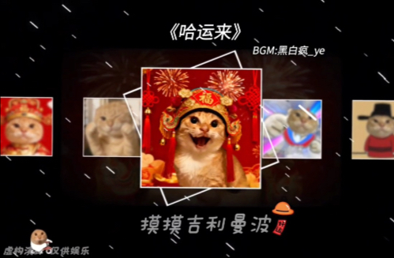 | 2409 | 2025-12-02 |
| [《蒸曼波》——哈基米音乐](https://www.bilibili.com/video/BV17Q2wBJEV9) |  | 1.1万 | 2025-11-06 |
| [哈基米音乐：朋友](https://www.bilibili.com/video/BV1Zy4kziEAm) |  | 893 | 2025-10-13 |
| [哈基米这个可爱](https://www.bilibili.com/video/BV14AWFz9Eh5) | 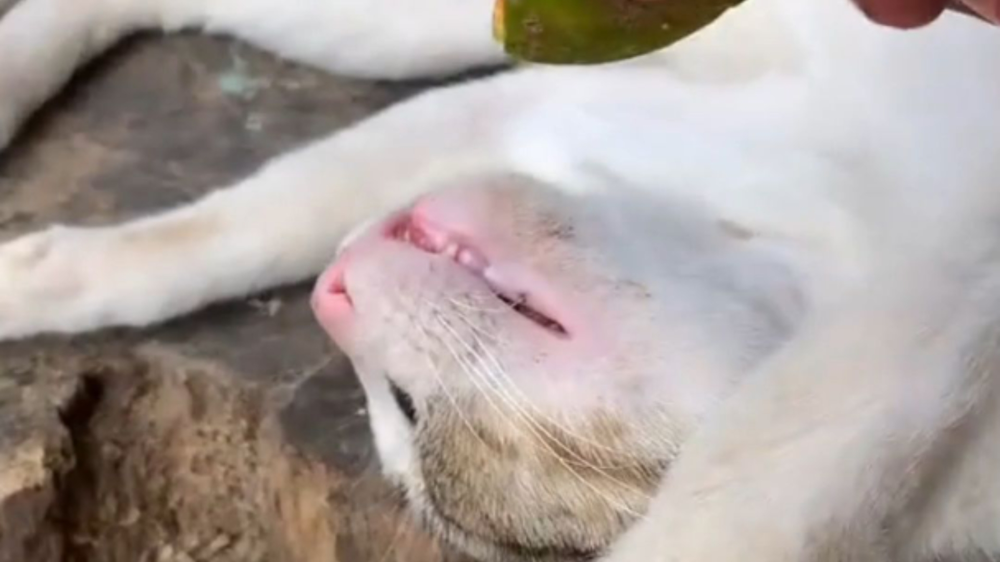 | 2.1万 | 2025-09-21 |
| [“ 我这个级别的耄尾草可以哈任何人 ”](https://www.bilibili.com/video/BV1JTp9zoEaU) |  | 13.6万 | 2025-09-20 |
| [一般来说我这个级别的基米是不敢哈你的](https://www.bilibili.com/video/BV1CTutz9ESp) |  | 52.8万 | 2025-07-16 |
| [我从地狱回来了](https://www.bilibili.com/video/BV1KrKEzfEeV) | 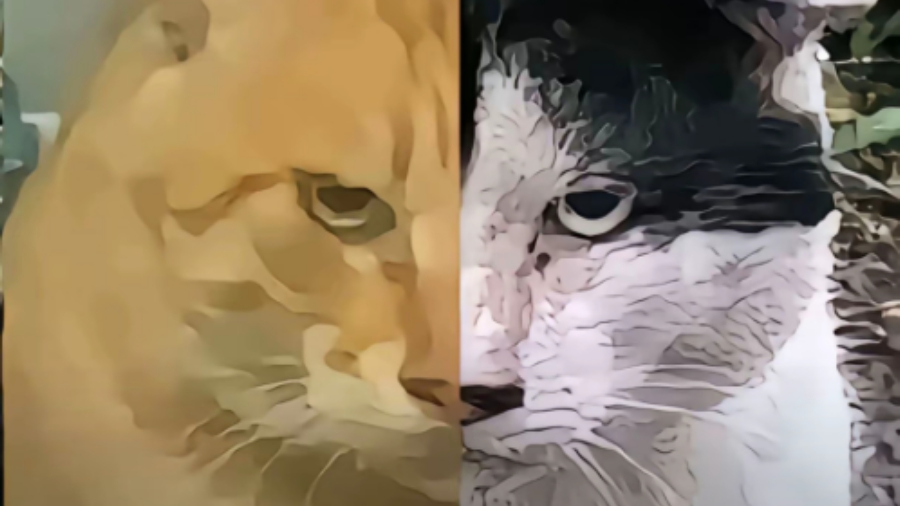 | 32.1万 | 2025-06-25 |
| [哈基米：星茶会（修复版）](https://www.bilibili.com/video/BV1ej7rzeEu8) |  | 5.8万 | 2025-06-01 |
| [“竟然是东方曲 难怪这么惊艳”！Thank you for dears.](https://www.bilibili.com/video/BV1gSV6zEETi) | 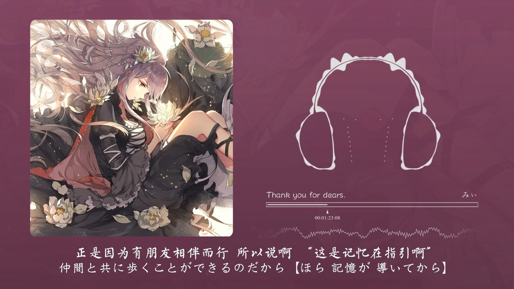 | 501.1万 | 2025-05-06 |
| [【循环歌单】“好可爱的低声细语呜呜呜被诱惑了！” ｜《もうどくちゅうい》](https://www.bilibili.com/video/BV12AQ9YwEgC) |  | 62.6万 | 2025-03-19 |
| [“好可爱的低声细语呜呜呜被诱惑了！” ｜《もうどくちゅうい》](https://www.bilibili.com/video/BV14cQ9YYEF3) |  | 17.3万 | 2025-03-19 |
| [【补档】土耳其进行曲【哈基米音乐】](https://www.bilibili.com/video/BV1sQFTeHEfY) | 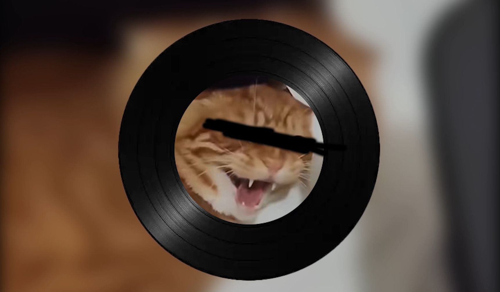 | 14.7万 | 2025-01-29 |
| [暴躁的哈基米！](https://www.bilibili.com/video/BV1z1Hve1EC6) | 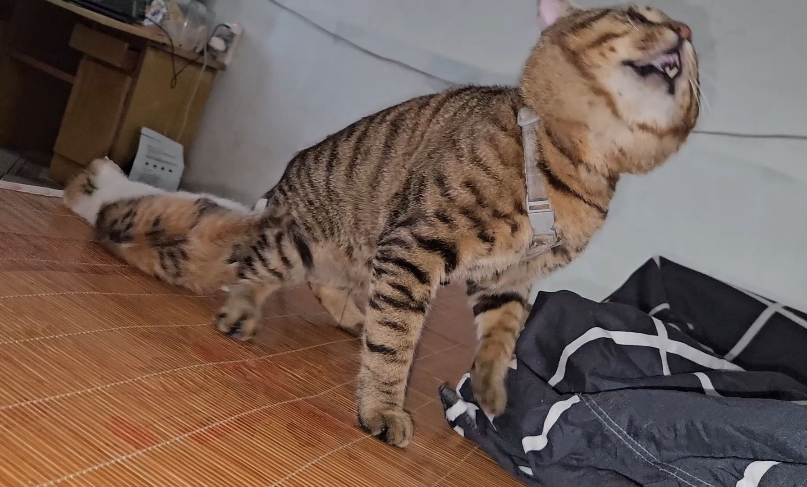 | 1.9万 | 2024-09-01 |
| [略略略纯略100%略略略助眠！](https://www.bilibili.com/video/BV1xi421a76v) | 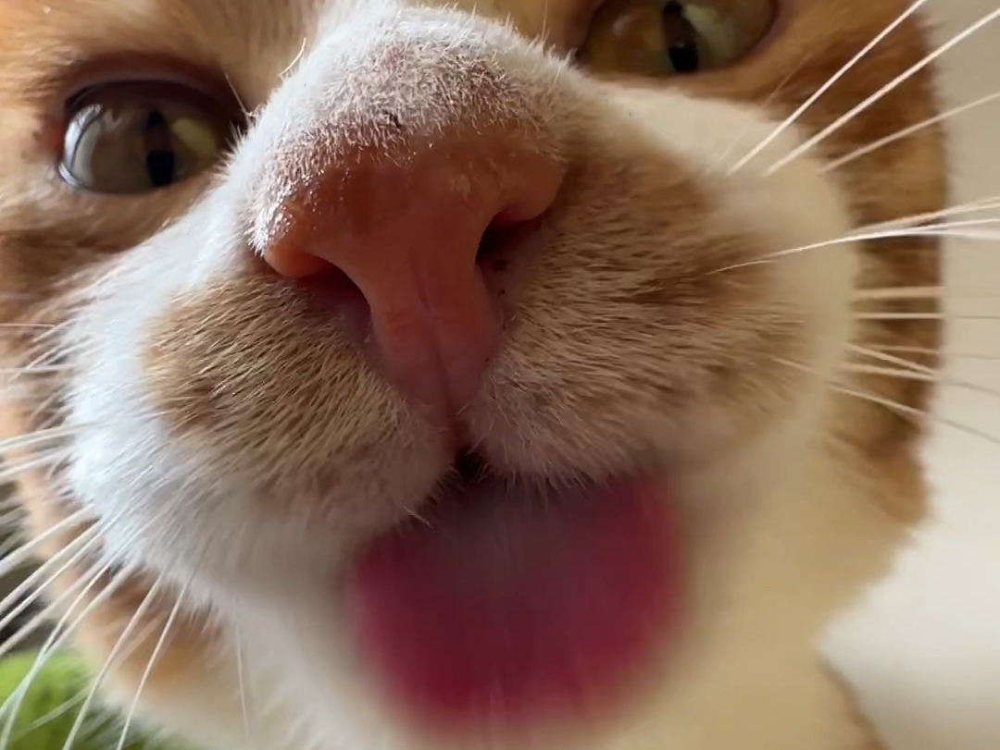 | 26.0万 | 2024-08-10 |
| [哈基米音乐之发明小曲](https://www.bilibili.com/video/BV1kSvAefEda) |  | 2.8万 | 2024-07-28 |
| [《赛博朋克：边缘行者》I Really Want to Stay at Your House【Hi-Res百万级录音棚试听】](https://www.bilibili.com/video/BV1FN411n7FT) |  | 501.8万 | 2023-09-27 |

---
*最后更新: 2026-05-03 03:19:24 (自动生成)*
*数据来源: [Bilibili](https://www.bilibili.com)*

## 使用说明

运行以下命令更新视频列表:
```bash
python3 fetch_hajimi_videos.py
```
