# awesome-hajimi
collections of hajimi (哈基米 in Chinese) on the Internet.

## 视频列表 (Video List)

| 视频标题 (Title) | 封面 | 播放量 (Views) | 发布日期 (Date) |
|---|---|---|---|
| [可爱的哈基米！](https://www.bilibili.com/video/BV1BxNTzjEgP) | 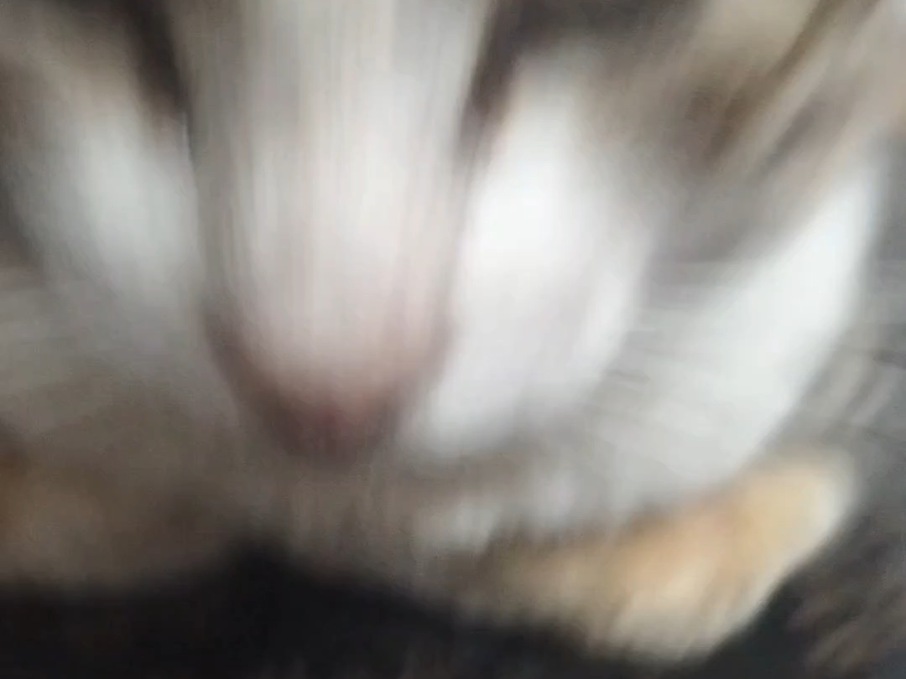 | 0 | 2026-03-08 |
| [哈基米:接下来我就要摇人了](https://www.bilibili.com/video/BV1BxNTzjEiB) |  | 5 | 2026-03-08 |
| [遛哈基米](https://www.bilibili.com/video/BV1q8NTzCENm) | 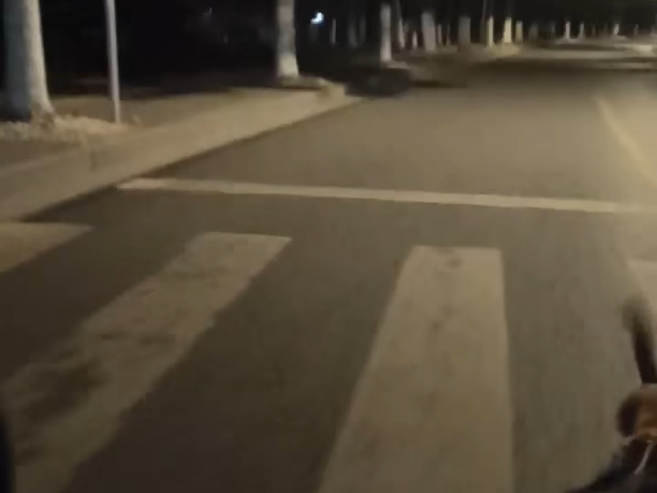 | 10 | 2026-03-08 |
| [哈基米](https://www.bilibili.com/video/BV1npNTzJEzk) | 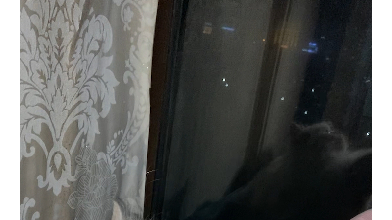 | 1 | 2026-03-08 |
| [哈基米录像之切换姿态](https://www.bilibili.com/video/BV1pfNTz9Es7) | 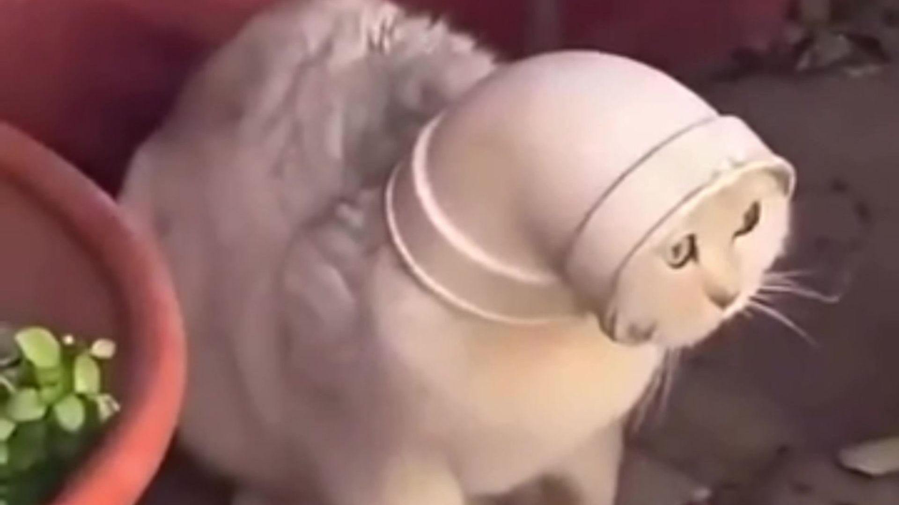 | 29 | 2026-03-08 |
| [🐱爵士基米🐱Hit the road JIMI](https://www.bilibili.com/video/BV1xCNAzEEuv) |  | 109 | 2026-03-08 |
| [哈基米：？？？？？？？？](https://www.bilibili.com/video/BV1tmNTzwEDM) |  | 0 | 2026-03-08 |
| [哈基米这个吃自助](https://www.bilibili.com/video/BV18oNPzbELQ) | 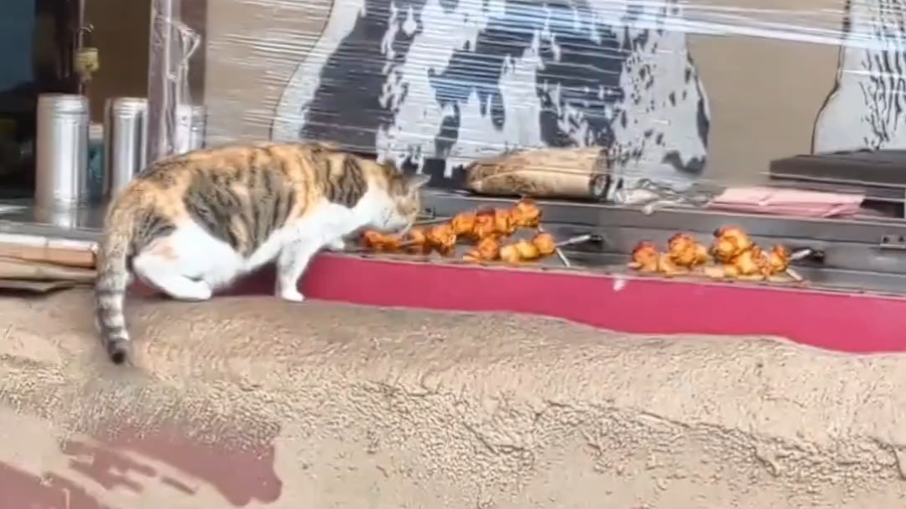 | 356 | 2026-03-08 |
| [【洛天依原创曲】抽到了演唱会门票却没空去看](https://www.bilibili.com/video/BV1RyNPziE94) | 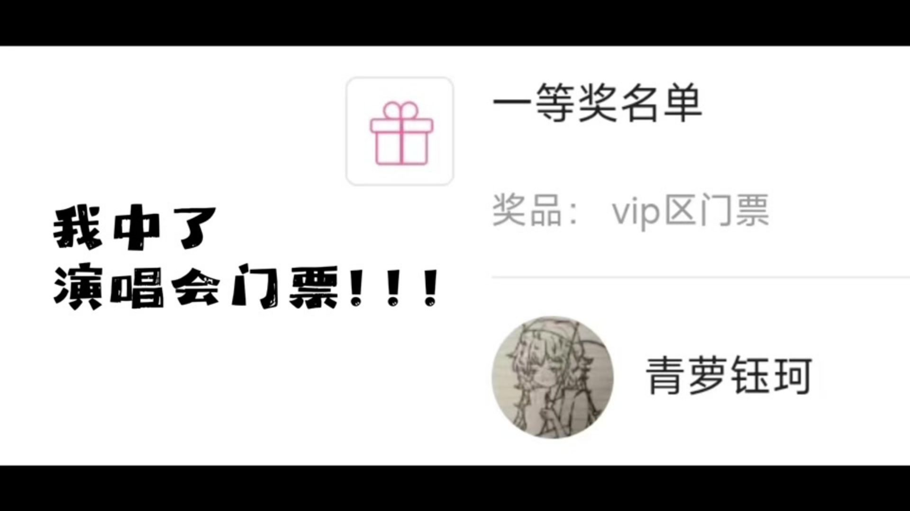 | 647 | 2026-03-07 |
| [【守望先锋】【CYX】打断哈基米午时已到！](https://www.bilibili.com/video/BV1LgNKzBEWU) |  | 219 | 2026-03-07 |
| [暴躁哈基米，别bb不然给你两铲子](https://www.bilibili.com/video/BV1VgNKzBErE) |  | 111 | 2026-03-07 |
| [哈基米闹铃服务](https://www.bilibili.com/video/BV1EANKzVELH) | 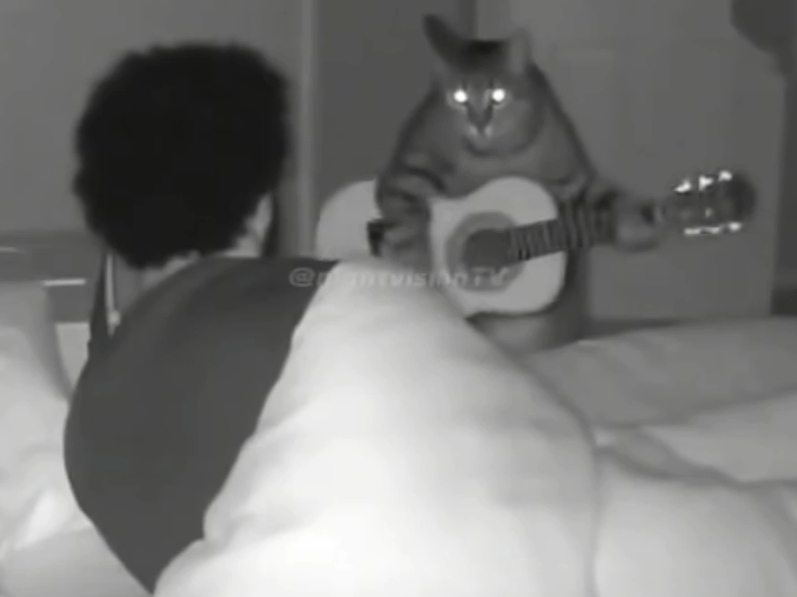 | 8 | 2026-03-07 |
| [大冷天大晚上一只哈基米](https://www.bilibili.com/video/BV14yNAzmEwx) | 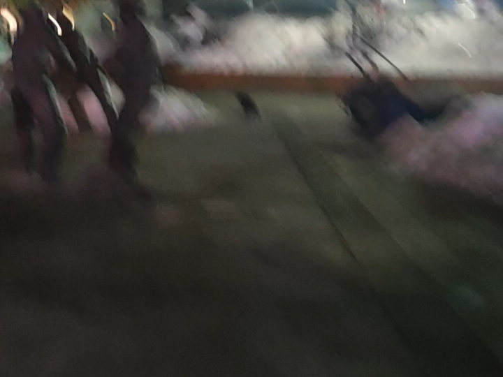 | 111 | 2026-03-07 |
| [这个发型配首哈基米音乐绝了 这才是真正的发型](https://www.bilibili.com/video/BV1U6NAznEY7) |  | 145 | 2026-03-07 |
| [哈基米摸金打法](https://www.bilibili.com/video/BV1ffNAzMECp) | 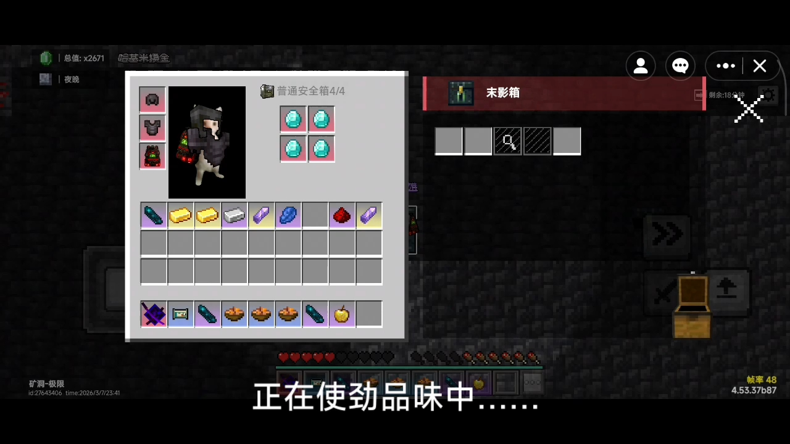 | 6 | 2026-03-07 |
| [一个小盲袋用一个哈基米打败哇哈哈](https://www.bilibili.com/video/BV1rdNAzgETP) | 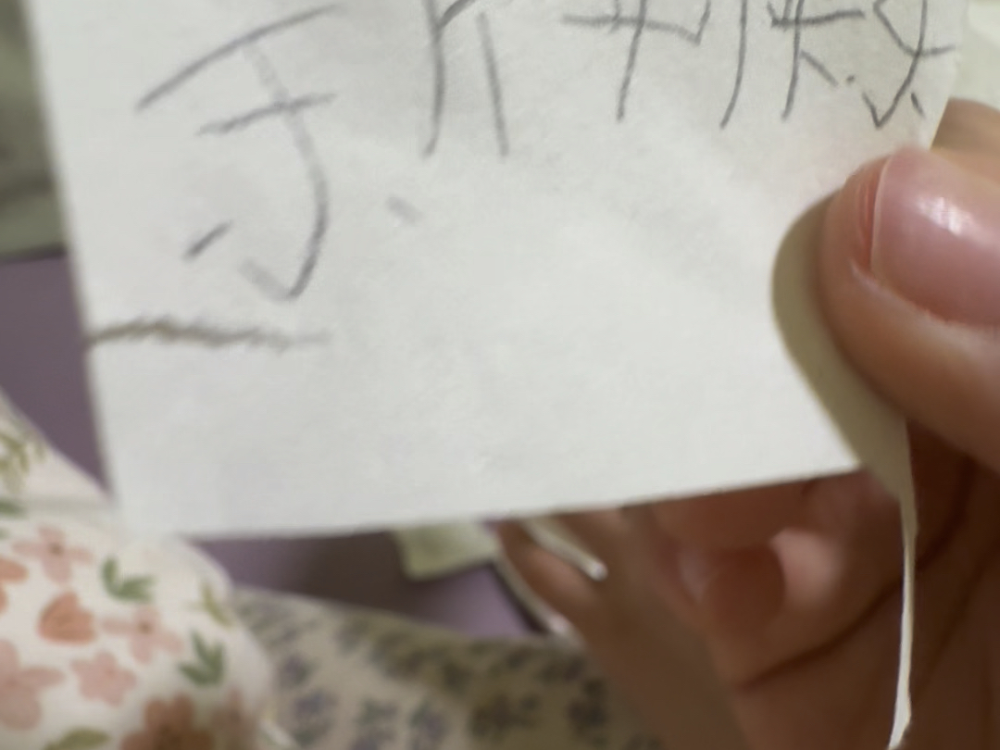 | 10 | 2026-03-07 |
| [小脏哈基米想吃冰淇淋](https://www.bilibili.com/video/BV1MJNPz9EdE) | 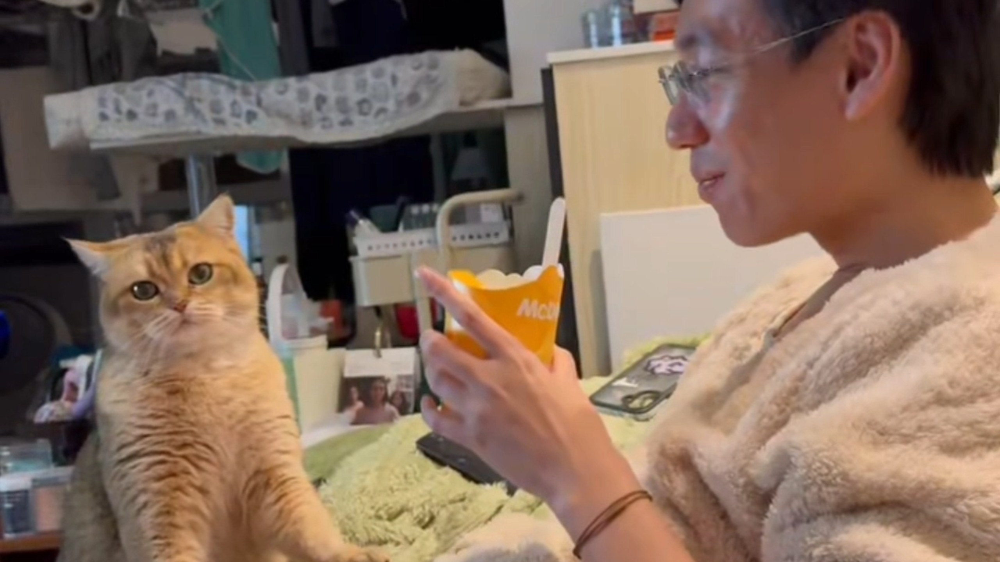 | 79 | 2026-03-07 |
| [基米小学：刻舟求剑](https://www.bilibili.com/video/BV1JQNczNE1Q) | 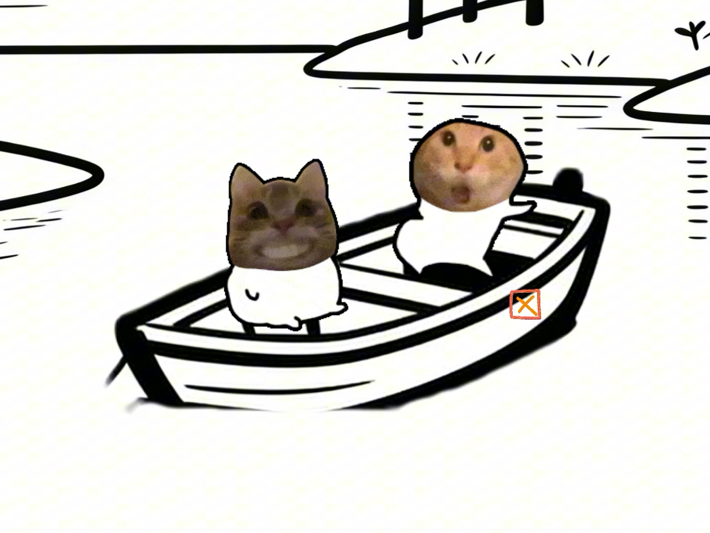 | 210 | 2026-03-07 |
| [我知道怎么让耄耋不哈气了【哈基动物园224期】](https://www.bilibili.com/video/BV1o6NwzhES4) |  | 1611 | 2026-03-07 |
| [纯净哈基米：on my own](https://www.bilibili.com/video/BV1QhNczUEAr) |  | 431 | 2026-03-07 |
| [哈基米的日常生活(1)](https://www.bilibili.com/video/BV138NcznExk) |  | 144 | 2026-03-07 |
| [怎么会有那么粘人的哈基米。](https://www.bilibili.com/video/BV1GMNwzWEvS) | 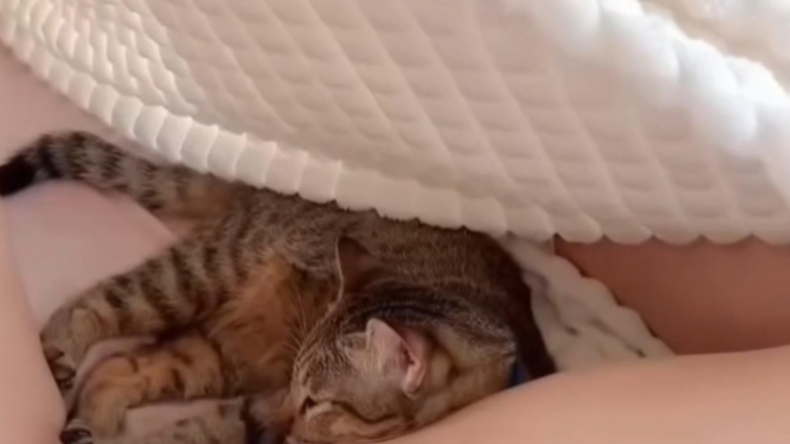 | 1106 | 2026-03-07 |
| [【哈基米现代战舰】更新啦，赶紧来围观吧！](https://www.bilibili.com/video/BV1beNcz2Ez5) |  | 1 | 2026-03-07 |
| [【超棍木辉夜姬】♿️Remember♿️（加冰加长版）](https://www.bilibili.com/video/BV1GuNwzXEeG) |  | 1374 | 2026-03-07 |
| [认识没几天的哈基米](https://www.bilibili.com/video/BV1H8NwzuEuj) | 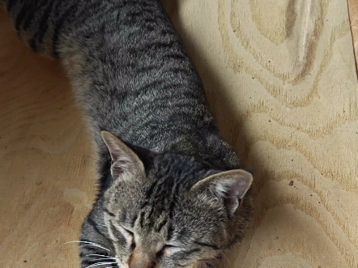 | 499 | 2026-03-07 |
| [【小鱼不菜哈基米】Up主探索中，欢迎收看求三连！](https://www.bilibili.com/video/BV1HhNwzBEaj) | 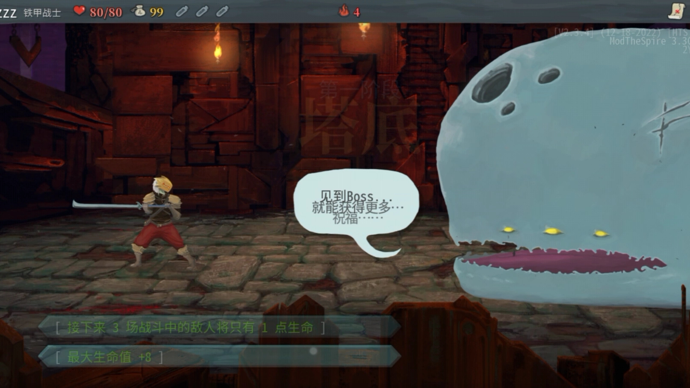 | 1 | 2026-03-07 |
| [哈基米 哈基米的不耐烦 hhh](https://www.bilibili.com/video/BV1ozNwzAEax) | 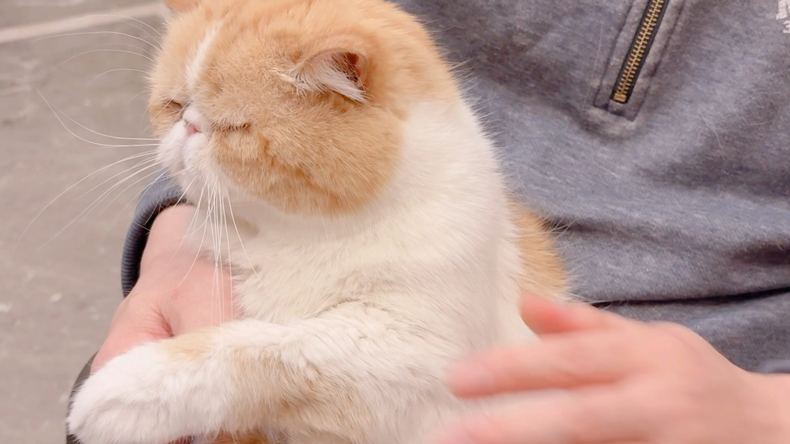 | 455 | 2026-03-07 |
| [“🐔歪 鸡马鸡马鸡马🐔”  《CHICKEN MÁ》](https://www.bilibili.com/video/BV1j6NwzaEKB) |  | 4168 | 2026-03-07 |
| [小狗vs哈基米6](https://www.bilibili.com/video/BV1qqNwzeEZD) | 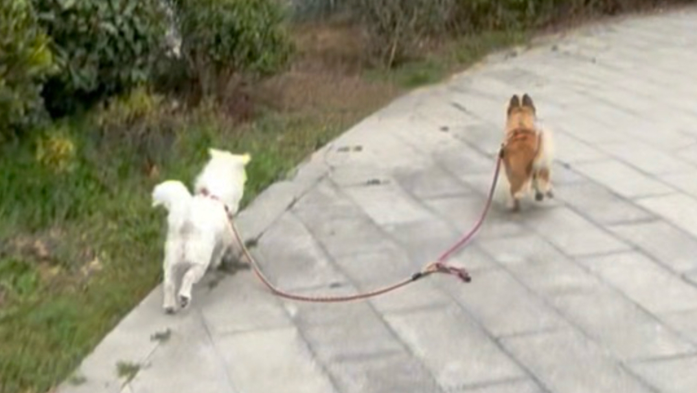 | 142 | 2026-03-07 |
| [【哈基米音乐】哈基ray](https://www.bilibili.com/video/BV1t7Nwz7Eii) | 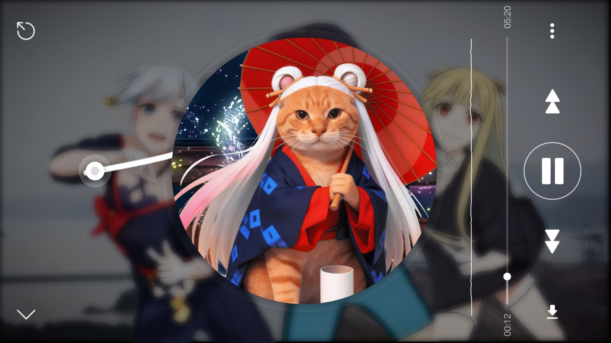 | 1528 | 2026-03-07 |
| [哈基米 助眠｜“豆腐脑”闪亮登场！（甜系免疫）小猫吃罐头的声音超级治愈呀~](https://www.bilibili.com/video/BV1PWNwzVE8U) |  | 1406 | 2026-03-07 |
| [看什么看！没听过喵唱歌啊！？](https://www.bilibili.com/video/BV1XoPazMEcz) |  | 737 | 2026-03-07 |
| [哥哥~求求你了~ 再唱一遍~ 好~不~好~嘛~](https://www.bilibili.com/video/BV11DPHzaEpY) | 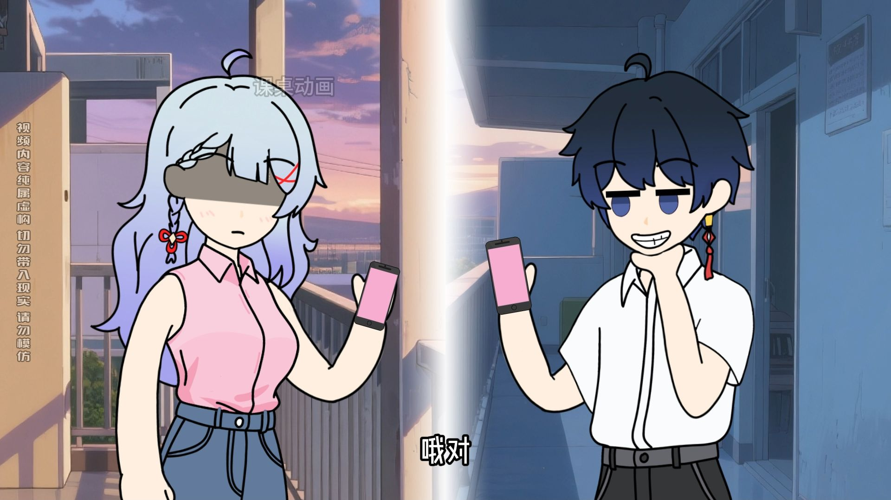 | 1.2万 | 2026-03-07 |
| [恐怖哈基米，哈机米。](https://www.bilibili.com/video/BV1ZyPazjEmy) | 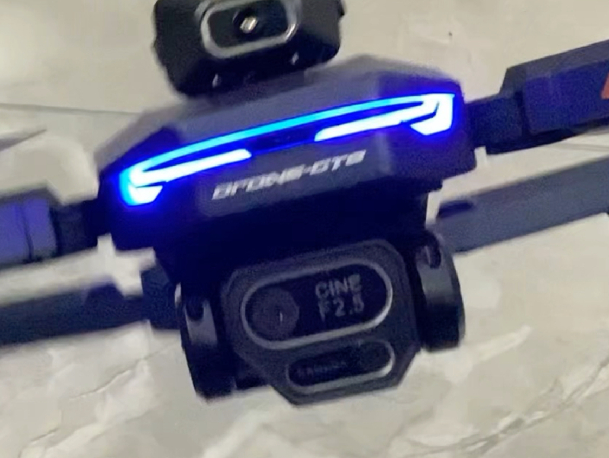 | 49 | 2026-03-07 |
| [豆包可以猜出金正恩将军吗](https://www.bilibili.com/video/BV11uPYzFEYS) |  | 1.1万 | 2026-03-07 |
| [《耶呼！黏苞米》第三期](https://www.bilibili.com/video/BV12uPYzFEKx) |  | 25.5万 | 2026-03-07 |
| [不该让爷爷看b站的](https://www.bilibili.com/video/BV1xuPYzcEdo) |  | 376.4万 | 2026-03-07 |
| [基米被生命所厌恶](https://www.bilibili.com/video/BV1mPPYzYEWS) | 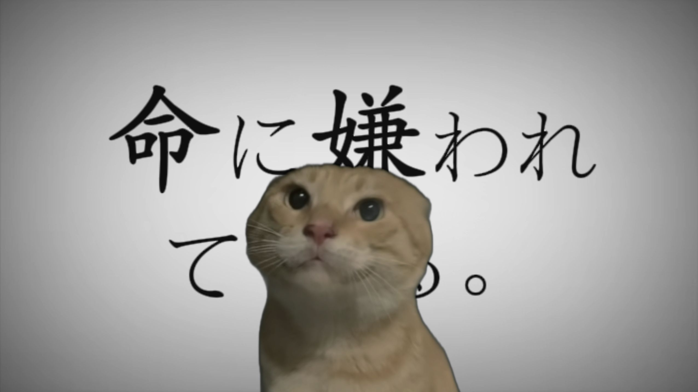 | 2.9万 | 2026-03-07 |
| [我将朋友骗进了这个世界，并把他们做成了食物...](https://www.bilibili.com/video/BV1UPPYzYEQC) |  | 7.7万 | 2026-03-07 |
| [哈基米变成冰冻鸡了](https://www.bilibili.com/video/BV12KPYzwEtx) | 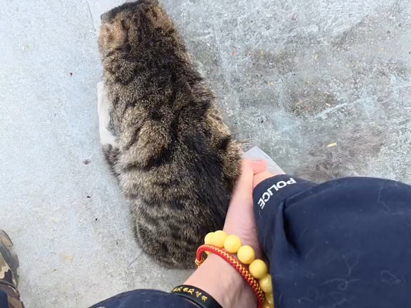 | 2.8万 | 2026-03-07 |
| [哈基米被老鼠夹夹住了哈基人营救反被哈气](https://www.bilibili.com/video/BV1yVPYz4EVc) | 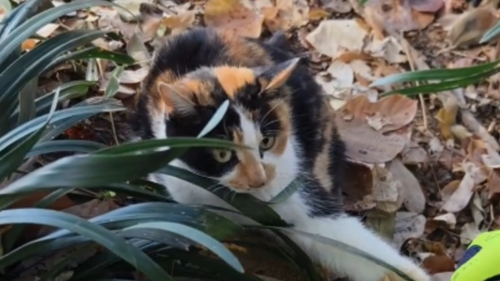 | 386 | 2026-03-07 |
| [😾基米也要上班吗😾](https://www.bilibili.com/video/BV1z1PszYEzi) |  | 5.4万 | 2026-03-07 |
| [大战哈基米](https://www.bilibili.com/video/BV1eYPYzCEXT) | 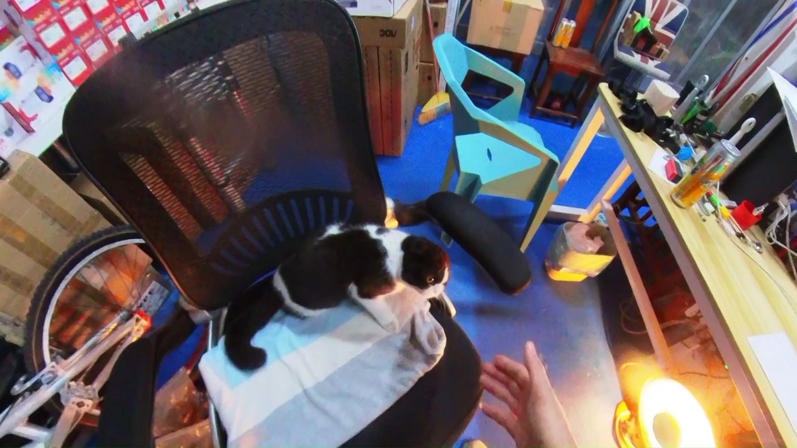 | 347 | 2026-03-07 |
| [哈基米这个当街睡大觉](https://www.bilibili.com/video/BV17NPezQECM) |  | 2.1万 | 2026-03-07 |
| [哈基米这个自挂东南枝](https://www.bilibili.com/video/BV1syPbzSEMF) | 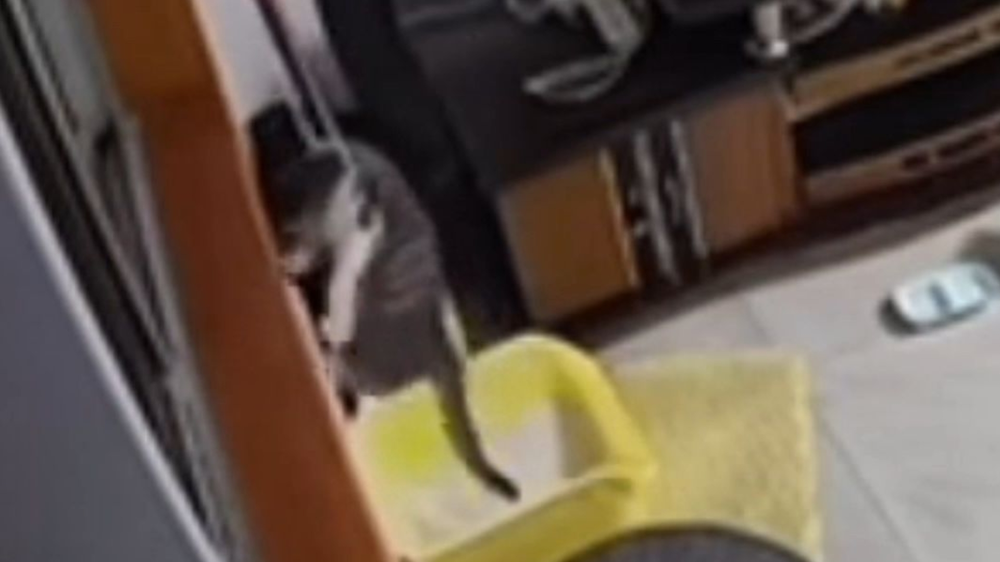 | 1524 | 2026-03-07 |
| [🐱hello~~🐱](https://www.bilibili.com/video/BV1JEPhzjEqQ) |  | 2408 | 2026-03-07 |
| [可爱哈基米](https://www.bilibili.com/video/BV1rGPhzJEr1) | 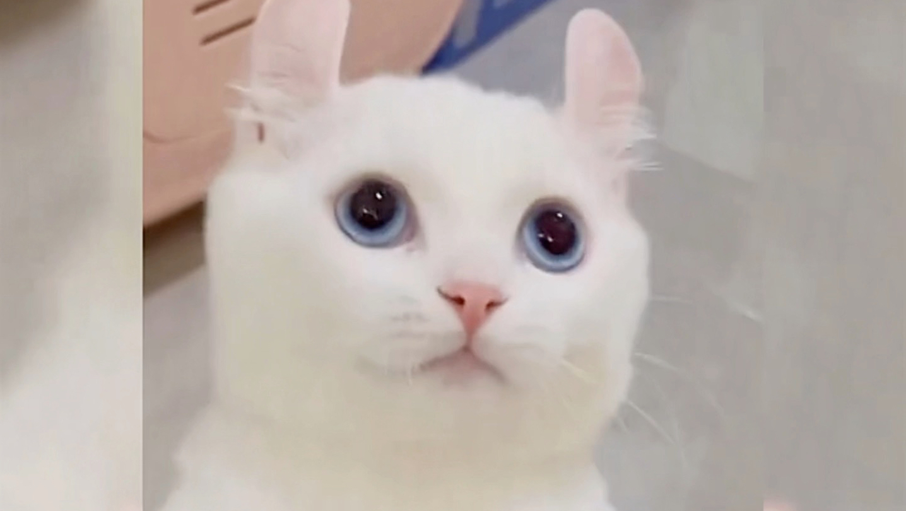 | 206 | 2026-03-07 |
| [哈基米世界](https://www.bilibili.com/video/BV1WUPhzREf8) | 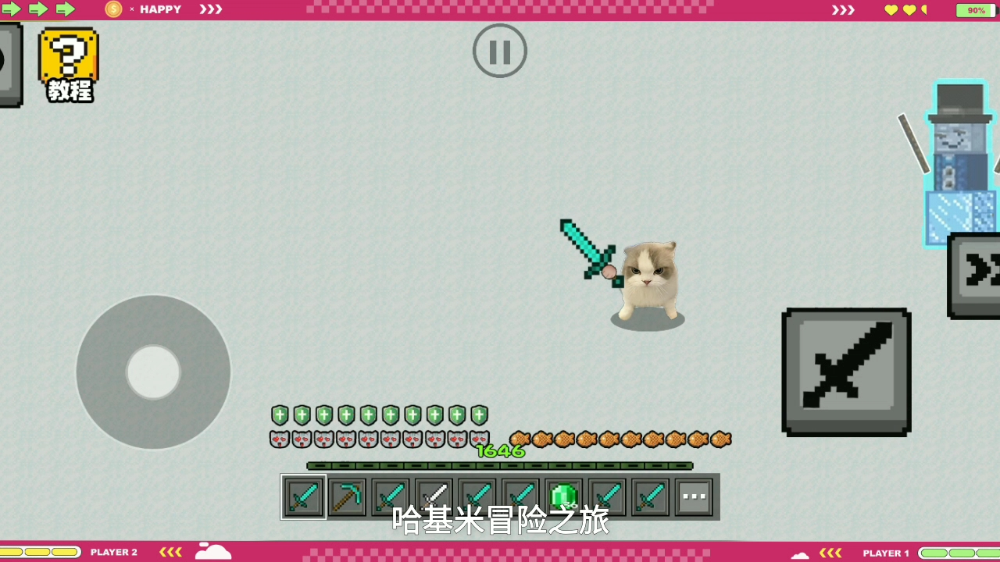 | 24 | 2026-03-07 |
| [“压力”](https://www.bilibili.com/video/BV121PhzoEn4) |  | 3.1万 | 2026-03-07 |
| [《云云真心》【义炭】中了真言咒的义勇，整张脸都染上薄红，紧紧抱着炭治郎，直白又笨拙地吐露心意：“z 喜 欢你做的饭，也z 喜 欢你。”](https://www.bilibili.com/video/BV1ixPhz6EWu) |  | 529 | 2026-03-07 |
| [《看我的童年黑历史》6.0](https://www.bilibili.com/video/BV1eWP4zxE3d) | 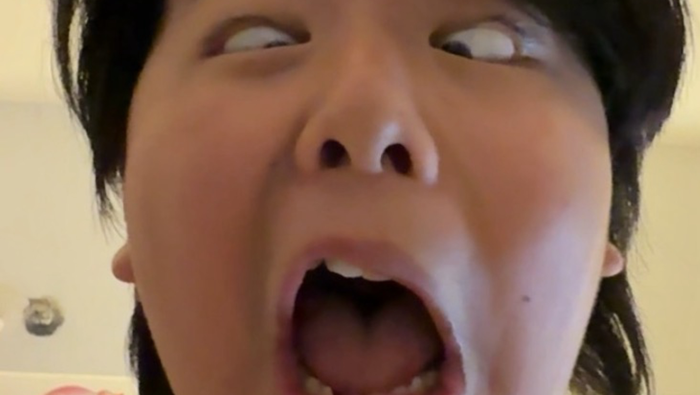 | 9227 | 2026-03-07 |
| [【哈基跑酷】基从天降，哈气狰狞！2.0](https://www.bilibili.com/video/BV1ZUPezHEmZ) |  | 398 | 2026-03-07 |
| [楼上谁在装修啊？快把哈基米给吓死了](https://www.bilibili.com/video/BV1yDPhzWE4P) | 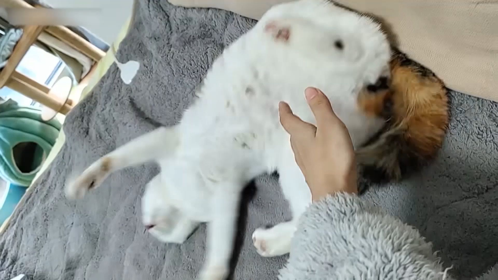 | 5872 | 2026-03-07 |
| [[万粉合集]  看来人类文明这次凶多吉少了](https://www.bilibili.com/video/BV1HQPhzXEzc) |  | 4.5万 | 2026-03-07 |
| [哈基米成为了猫一杯一天了](https://www.bilibili.com/video/BV1wvPazWErN) | 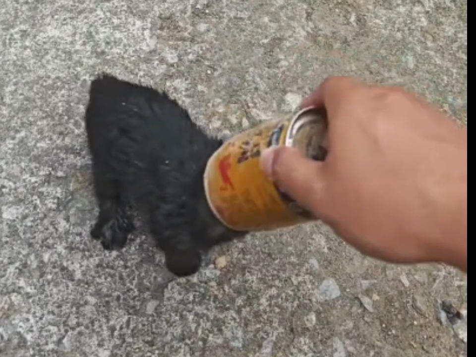 | 1114 | 2026-03-07 |
| [好像养一只扫码的清雨啊](https://www.bilibili.com/video/BV1tvPbzdEfV) |  | 15.3万 | 2026-03-07 |
| [《骥张辽建议改名区张辽》  （抽奖第三期喵）](https://www.bilibili.com/video/BV1GNPtztE9b) |  | 1.8万 | 2026-03-06 |
| [博丽灵梦：刷到我说明你要发大财了，所以请给我4751529円‌ありがとう！](https://www.bilibili.com/video/BV1DSPtz4ELV) |  | 1.2万 | 2026-03-06 |
| [哈基米](https://www.bilibili.com/video/BV1d6PtzYEVm) | 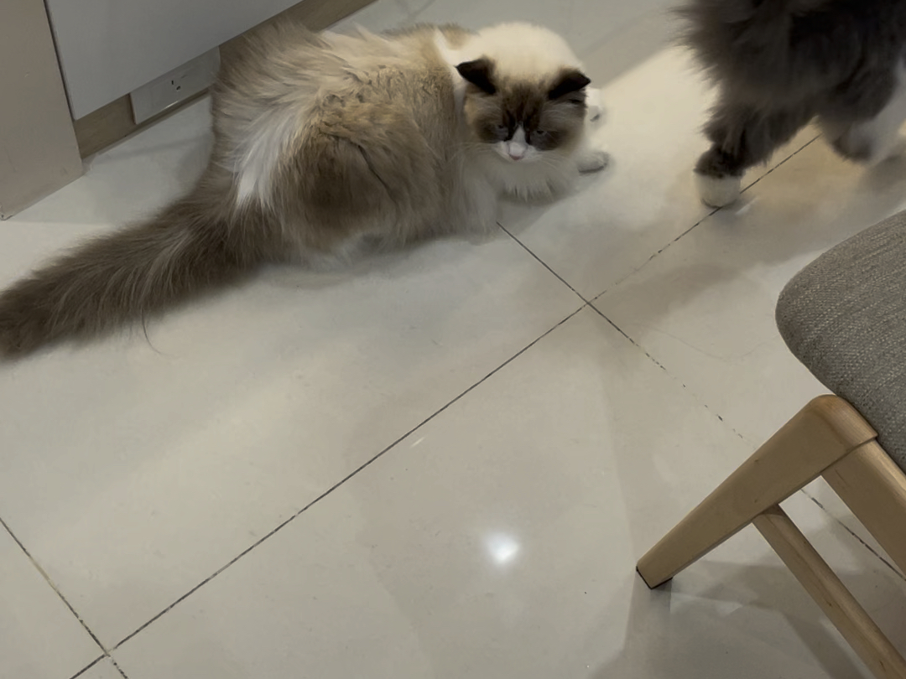 | 0 | 2026-03-06 |
| [大坝神人之宗门大阵](https://www.bilibili.com/video/BV1FGPbzkEun) |  | 28.4万 | 2026-03-06 |
| [哈基米南北绿豆～](https://www.bilibili.com/video/BV1FbPxzPEJU) |  | 310 | 2026-03-06 |
| [谁家好人去和歌山出这么远的差，就给两天时间啊😅？？？](https://www.bilibili.com/video/BV1RzPxzxEEu) |  | 22.0万 | 2026-03-06 |
| [评分跌至7.0！时隔5年《赛马娘》迎来史诗级大爆雷！重女频出，人物崩坏，北部玄驹为何没能引起的节日狂潮！](https://www.bilibili.com/video/BV1eEP4zfEJM) |  | 3.2万 | 2026-03-06 |
| [（补档）鹰角还没说什么有ai人先急了！](https://www.bilibili.com/video/BV1AwP4zrE2D) |  | 50.0万 | 2026-03-06 |
| [但凡你有只哈基米，就不会抑郁成林黛玉！](https://www.bilibili.com/video/BV16TP4zTEsa) |  | 2228 | 2026-03-06 |
| [《被玩坏的马卡龙》](https://www.bilibili.com/video/BV1teP4zUE9e) |  | 2.1万 | 2026-03-06 |
| [我们中系居然有二战挂载最多的双翼机！](https://www.bilibili.com/video/BV116P4zyEVe) | 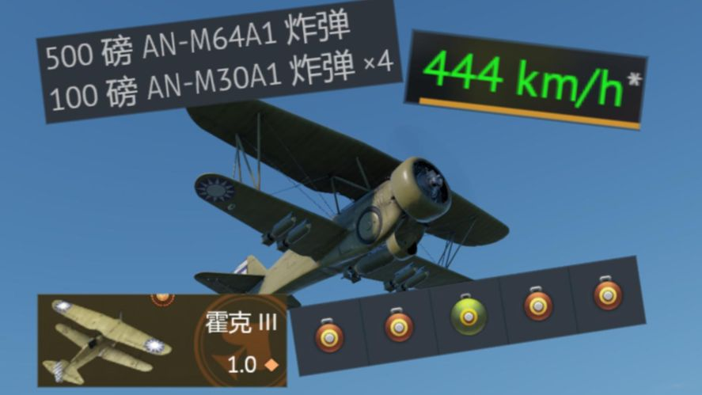 | 2.5万 | 2026-03-06 |
| [可恶 : 被他装到了！](https://www.bilibili.com/video/BV1KDPWz3EmH) |  | 25.6万 | 2026-03-06 |
| [不 动 就 发 波](https://www.bilibili.com/video/BV161PszYEBh) |  | 1.8万 | 2026-03-06 |
| [《辛巴巴药水》](https://www.bilibili.com/video/BV1VvPWzHEZk) |  | 6.0万 | 2026-03-06 |
| [🐱感情の基米楼🐱](https://www.bilibili.com/video/BV1v5Psz9Euo) | 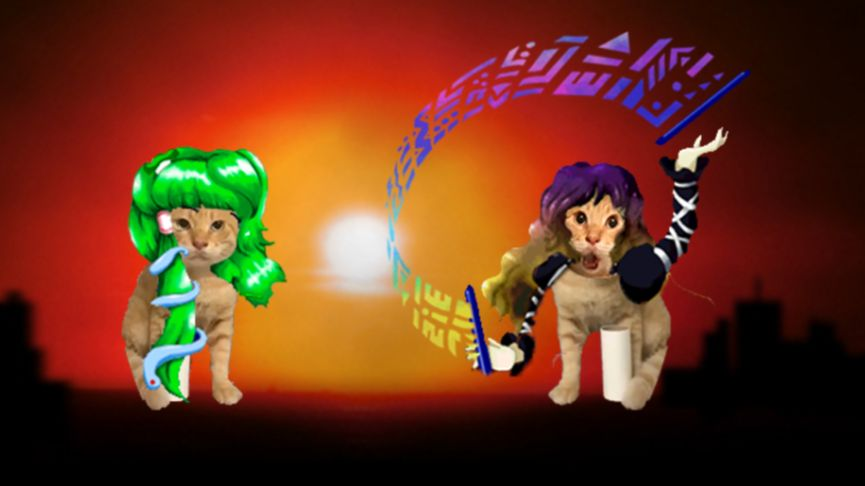 | 1802 | 2026-03-06 |
| [舍友养的哈基米，太可爱了，什么时候能学会哈气呢？](https://www.bilibili.com/video/BV1K9PWzuEcr) | 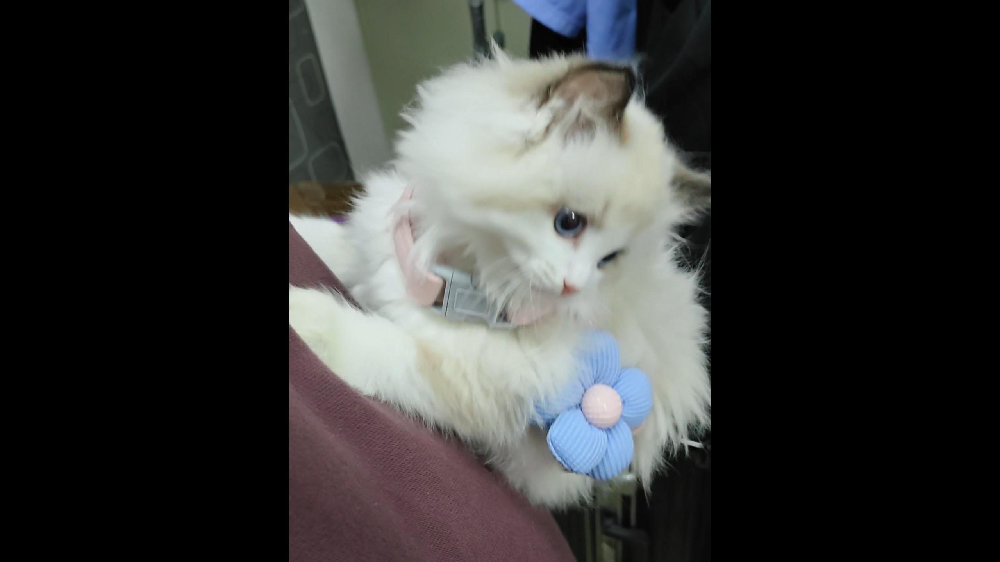 | 2066 | 2026-03-06 |
| [周 五 夜 卡 脖](https://www.bilibili.com/video/BV1DWPszmEnH) |  | 1.3万 | 2026-03-06 |
| [跑刀不等于无脑！航天基地2.0新手思路教学！](https://www.bilibili.com/video/BV1nzPpzfEg1) | 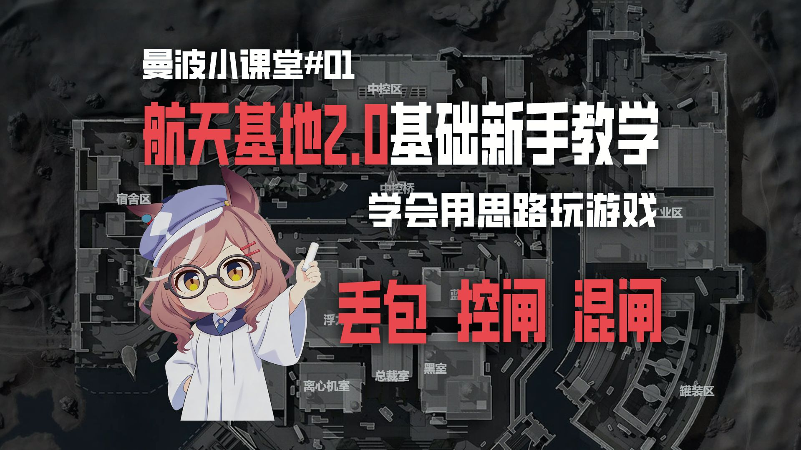 | 28.7万 | 2026-03-06 |
| [这基米有力气！ 🎵](https://www.bilibili.com/video/BV158PkzqEqq) |  | 5005 | 2026-03-06 |
| [两只正在“玩耍”的哈基米](https://www.bilibili.com/video/BV1HHPWzcEff) | 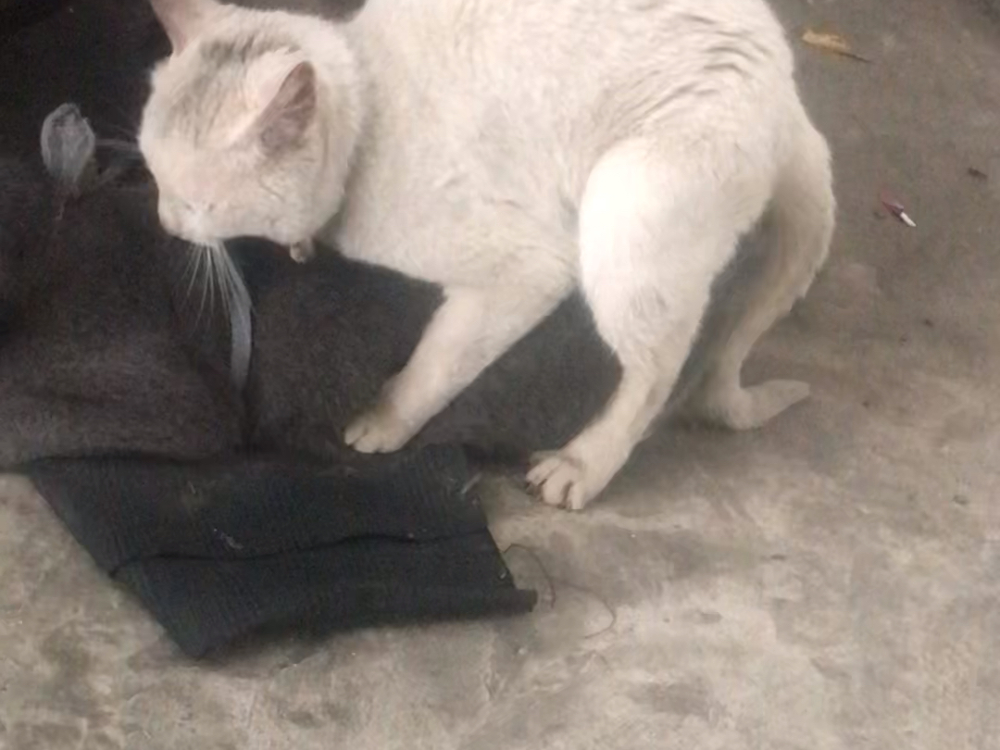 | 147 | 2026-03-06 |
| [当你的游戏装了太多模组belike 7.0](https://www.bilibili.com/video/BV1WjPWzeEgf) |  | 3.6万 | 2026-03-06 |
| [哈基米](https://www.bilibili.com/video/BV1JpPWz8EiZ) | 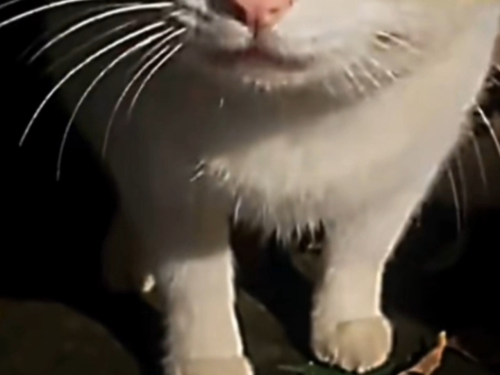 | 1897 | 2026-03-06 |
| [一一丫丫：哈基米～](https://www.bilibili.com/video/BV1ZMP1zEEjX) |  | 2320 | 2026-03-05 |
| [bro的安慰能力堪比边牧（配音）](https://www.bilibili.com/video/BV1SsP1zqEqK) |  | 3221 | 2026-03-05 |
| [弹 幕 火 舞](https://www.bilibili.com/video/BV1SVPrzbEUc) |  | 1.4万 | 2026-03-05 |
| [“我愿把胸膛解剖，有在跳动的血肉”](https://www.bilibili.com/video/BV1BzPrzrE1W) |  | 6.8万 | 2026-03-05 |
| [关于小猫疯狂模仿我的动作这件事](https://www.bilibili.com/video/BV1ffPkz2EzE) | 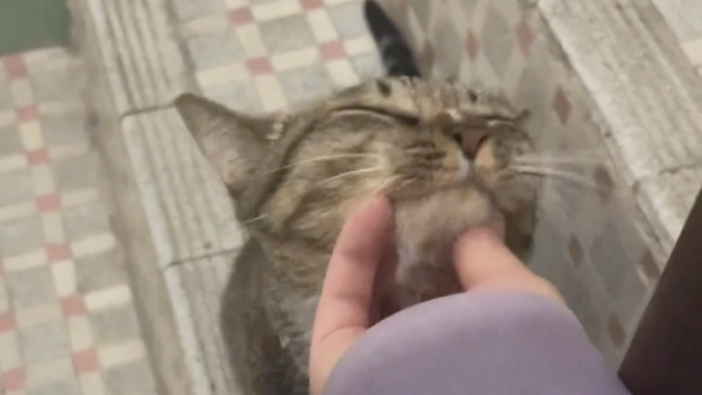 | 287.9万 | 2026-03-05 |
| [“我也要咏春吗？”](https://www.bilibili.com/video/BV1DZPCzTE85) |  | 3.2万 | 2026-03-05 |
| [《我本将心向明月》升12key！就这个高音爽！](https://www.bilibili.com/video/BV1q1PCzLEwf) |  | 7743 | 2026-03-05 |
| [小猫开大车](https://www.bilibili.com/video/BV1jSPCzCELV) |  | 127.9万 | 2026-03-05 |
| [手搓的老艺术家也太欢愉了](https://www.bilibili.com/video/BV1ubPBzQEt9) |  | 3000 | 2026-03-05 |
| [哈基米](https://www.bilibili.com/video/BV1F6PezZEbP) | 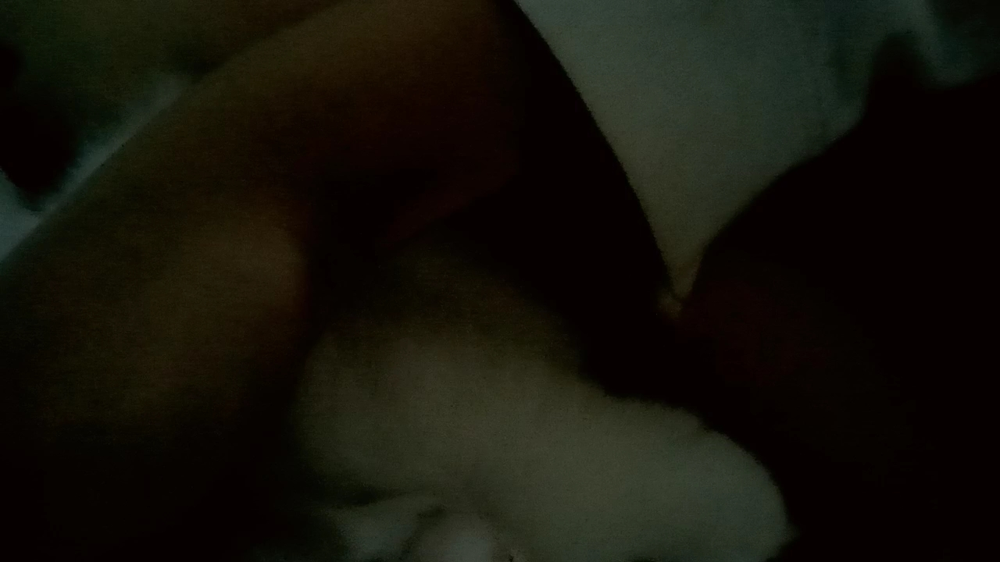 | 2 | 2026-03-04 |
| [🐱基米谋杀案🐱](https://www.bilibili.com/video/BV1rXPJzpEin) |  | 7881 | 2026-03-02 |
| [当我有只陪我出门的小猫](https://www.bilibili.com/video/BV1VyPjzwEKU) | 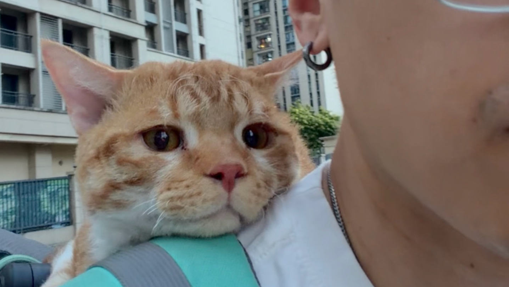 | 20.2万 | 2026-03-02 |
| [“我欲成冰再也无退路”《游山恋》](https://www.bilibili.com/video/BV1sTfCByEmP) |  | 7.3万 | 2026-03-01 |
| [曼波哈基米小狗](https://www.bilibili.com/video/BV1E7AezSEX8) | 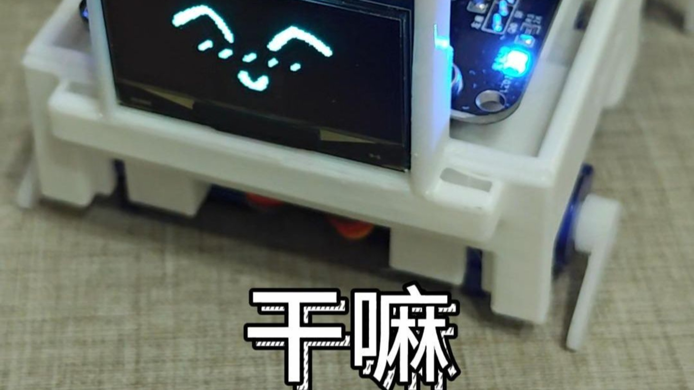 | 3639 | 2026-02-28 |
| [甜美女声²之KTV时候](https://www.bilibili.com/video/BV1xoAhzxEXu) | 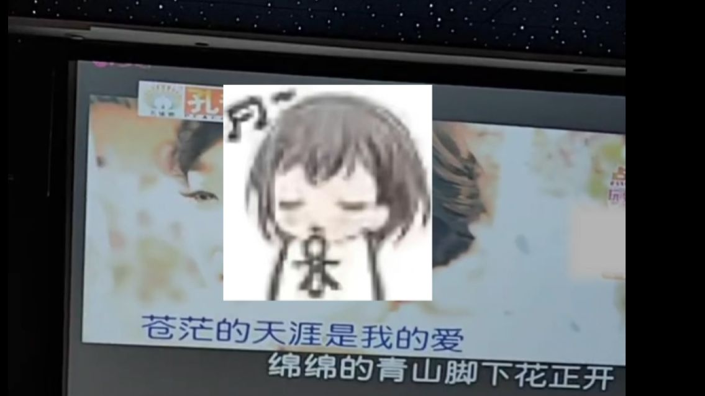 | 7.0万 | 2026-02-28 |
| [观察哈基米飞天猫一分钟](https://www.bilibili.com/video/BV1j8AQzvEfs) |  | 9408 | 2026-02-28 |
| [射杀耄耋之日](https://www.bilibili.com/video/BV1hxZJBJEKF) |  | 4.7万 | 2026-02-14 |
| [20分钟的拔罐猫集大成合集！绝对的神圣邪教溜冰场！](https://www.bilibili.com/video/BV1ysrMBYEad) |  | 32.2万 | 2026-01-09 |
| [「何意味?」Sora 神人广告](https://www.bilibili.com/video/BV1U6xdzXErU) |  | 249.1万 | 2025-10-07 |
| [大狗大狗交交交](https://www.bilibili.com/video/BV1y3T7zWEAo) |  | 34.5万 | 2025-06-04 |
| [巴巴博一](https://www.bilibili.com/video/BV1EpHCeYEgw) | 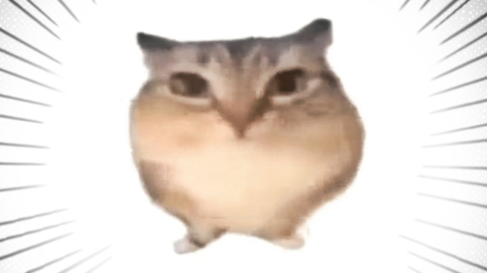 | 392.2万 | 2024-09-02 |
| [谁能告诉我它在说什么](https://www.bilibili.com/video/BV1vN4y1a7LG) | 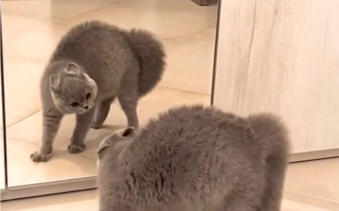 | 104.2万 | 2023-12-07 |

---
*最后更新: 2026-03-08 03:11:39 (自动生成)*
*数据来源: [Bilibili](https://www.bilibili.com)*

## 使用说明

运行以下命令更新视频列表:
```bash
python3 fetch_hajimi_videos.py
```
