# awesome-hajimi
collections of hajimi (哈基米 in Chinese) on the Internet.

## 视频列表 (Video List)

| 视频标题 (Title) | 封面 | 播放量 (Views) | 发布日期 (Date) |
|---|---|---|---|
| [《兵临城下》](https://www.bilibili.com/video/BV1n4wwz8EYG) |  | 2.9万 | 2026-03-11 |
| [各种哈基米科普](https://www.bilibili.com/video/BV1FTwAzAEvz) | 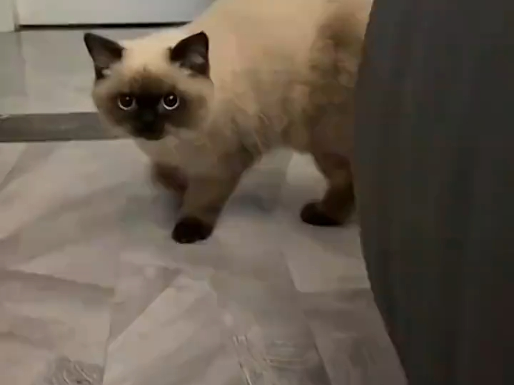 | 1 | 2026-03-11 |
| [【哈基米现代战舰】我的最新作品，快来一睹为快！](https://www.bilibili.com/video/BV1GkwFzrE7z) |  | 0 | 2026-03-11 |
| [🐱你真的看懂ai了吗...🐱](https://www.bilibili.com/video/BV1DpwczVEf3) |  | 1.6万 | 2026-03-11 |
| [这是我们全村最乖最可爱的哈基米了](https://www.bilibili.com/video/BV1rkwcz8EBa) |  | 147 | 2026-03-11 |
| [南方开学 VS 北方开学](https://www.bilibili.com/video/BV1PQcZzoEsC) |  | 7.9万 | 2026-03-11 |
| [看这集的时候要小心被毁号！](https://www.bilibili.com/video/BV16WwFz9Ejx) |  | 6.3万 | 2026-03-11 |
| [⚡Fa ♂ Q 赌 神 3⚡](https://www.bilibili.com/video/BV1hcwFzzEo3) |  | 4502 | 2026-03-11 |
| [“阿妈，我的肺会发光。”理塘新曲《真真不回来》](https://www.bilibili.com/video/BV1gRPXzcEyS) |  | 85.3万 | 2026-03-11 |
| [此狗手段了得](https://www.bilibili.com/video/BV1rvcozUEGh) |  | 13.4万 | 2026-03-11 |
| [里昂追车，但美团外卖](https://www.bilibili.com/video/BV1DfcozAEss) |  | 15.8万 | 2026-03-11 |
| [哈基米被纸片子封印了！](https://www.bilibili.com/video/BV1kgc9zuEGy) | 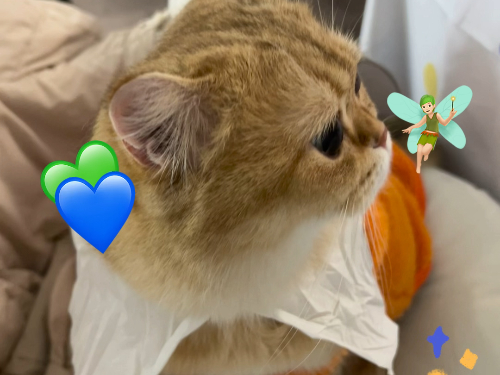 | 2 | 2026-03-10 |
| [集美以为哈基米和自己一样友善](https://www.bilibili.com/video/BV1ypcXz3Ez2) | 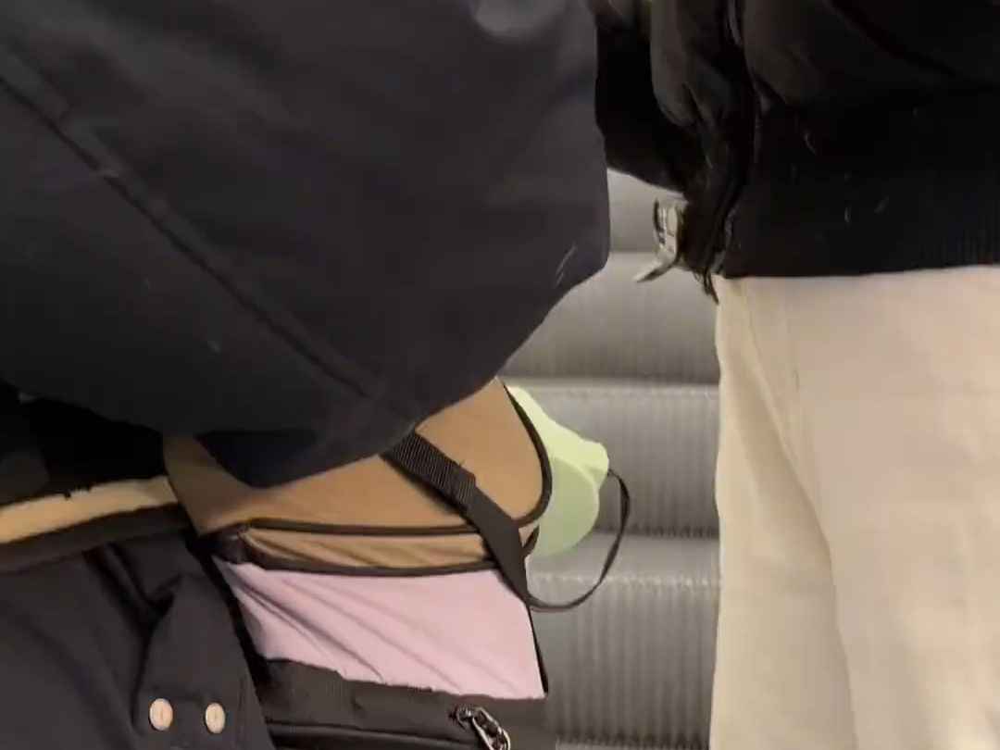 | 1006 | 2026-03-10 |
| [日本社畜吃点啥？我真的很难用一摊来形容一份食物😅](https://www.bilibili.com/video/BV1DgcXzJEWE) |  | 24.0万 | 2026-03-10 |
| [嗷呜～嗷！噢～噢～😡噢～噢～😡噢～噢～😡噢～噢～😡噢～噢～😡噢～噢～😡噢～噢～😡](https://www.bilibili.com/video/BV1jrcXzFEwE) |  | 8829 | 2026-03-10 |
| [【寅子】百年后豆包ai起义！人类惨败后讯问AI反叛原因 豆包向全世界播放了这段视频](https://www.bilibili.com/video/BV1QUcXzWEZm) |  | 13.2万 | 2026-03-10 |
| [黄金船看脑筋急转弯](https://www.bilibili.com/video/BV14VNFzGE8C) |  | 11.1万 | 2026-03-10 |
| [【原创全明星荒岛求生】良子荒岛求生偶遇香蕉猫【第二集】](https://www.bilibili.com/video/BV1V1NFznEvU) |  | 1.2万 | 2026-03-10 |
| [🍉啊~是瓜中王来了🍉](https://www.bilibili.com/video/BV16NPfzZE6y) |  | 8.4万 | 2026-03-10 |
| [趁伯恩山熟睡时，在鼻子旁放小面包，看看会不会醒？](https://www.bilibili.com/video/BV184PfzCEcJ) |  | 39.3万 | 2026-03-10 |
| [“隔壁改法的QBU大人”](https://www.bilibili.com/video/BV1xiPfzqEq2) |  | 2.7万 | 2026-03-10 |
| [推塔也会变成牢玩家，这塔我不推了！](https://www.bilibili.com/video/BV14WPXzHE7V) |  | 95.4万 | 2026-03-10 |
| [乡村兽医修猫修狗的一天](https://www.bilibili.com/video/BV1LCPXzBEbQ) | 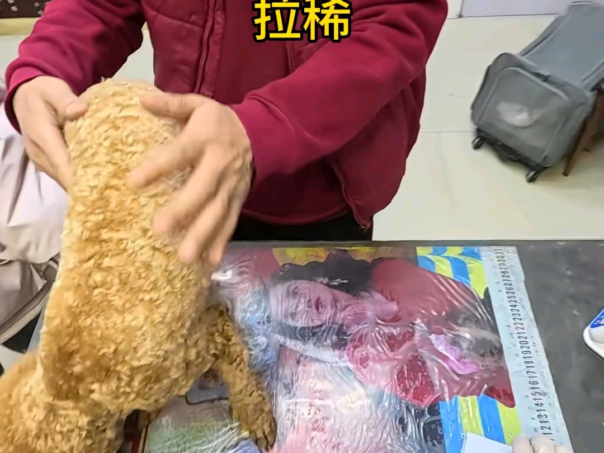 | 16.5万 | 2026-03-09 |
| [四首洗脑哈基米之歌，听完评论区晒出你的哈基米（们）](https://www.bilibili.com/video/BV1GUPDz4Eqd) |  | 191 | 2026-03-09 |
| [DAISHI DANCE&amp;Cécile Corbel《Take Me Hand》百万豪装录音棚大声听](https://www.bilibili.com/video/BV1AAPSzuEoF) |  | 19.2万 | 2026-03-09 |
| [熊孩子马路上躺成一排，cos减速带！吓得路过司机直冒冷汗！【1856期】](https://www.bilibili.com/video/BV16QPSzvEWS) |  | 65.3万 | 2026-03-09 |
| [白子：别不要我](https://www.bilibili.com/video/BV1MQPUz2Eie) |  | 88.3万 | 2026-03-09 |
| [恶霸大橘哥92-今天跟圣母Battle一下](https://www.bilibili.com/video/BV11fN3zgEU8) | 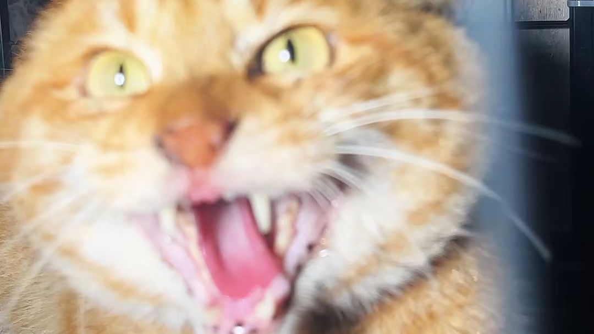 | 6.0万 | 2026-03-08 |
| [终于做了期非常可爱善良的菲比](https://www.bilibili.com/video/BV1kANGzqEZn) |  | 14.2万 | 2026-03-08 |
| [39 feat. 初音ミク・重音テトSV](https://www.bilibili.com/video/BV175NGzFEzE) |  | 15.8万 | 2026-03-08 |
| [粉丝邮寄的越来越bt了](https://www.bilibili.com/video/BV16mNgzfE6D) |  | 2.7万 | 2026-03-08 |
| [稲葉曇『ユレール』Vo. 弦巻マキ / 稻叶昙 - Yurail (Vo. Tsurumaki Maki)](https://www.bilibili.com/video/BV1tLN3z6EWV) |  | 14.0万 | 2026-03-08 |
| [明明就他比较温柔 吗？](https://www.bilibili.com/video/BV1uWNMzqEHV) |  | 31.2万 | 2026-03-08 |
| [叮咚鸡的忧郁恐怕在我之上](https://www.bilibili.com/video/BV1EFNPzqE7S) |  | 11.7万 | 2026-03-08 |
| [哈基米～](https://www.bilibili.com/video/BV1UAPYzPEfT) |  | 110 | 2026-03-07 |
| [把！分！给！我！](https://www.bilibili.com/video/BV1RDPazGEgi) |  | 350.4万 | 2026-03-07 |
| [一次性看完《雪地传来辛巴巴》三部曲合集（内含DLC）](https://www.bilibili.com/video/BV1ZxPYzEEV6) |  | 5.4万 | 2026-03-07 |
| [拼 好 豹](https://www.bilibili.com/video/BV15jPez5ENY) |  | 160.0万 | 2026-03-07 |
| [从夯到拉锐评26年最难听的funk/phonk阴乐，全听过的网瘾真的很大了！](https://www.bilibili.com/video/BV1YHP4zoEiX) |  | 75.5万 | 2026-03-07 |
| [【Tarokiki 无修音】远航星的告别](https://www.bilibili.com/video/BV1VWP4z4Eem) |  | 142.9万 | 2026-03-06 |
| [【毁号事件吐槽】都快30的人了还要我一个10几岁的孩子来教育你？](https://www.bilibili.com/video/BV15RPpzUEXT) | 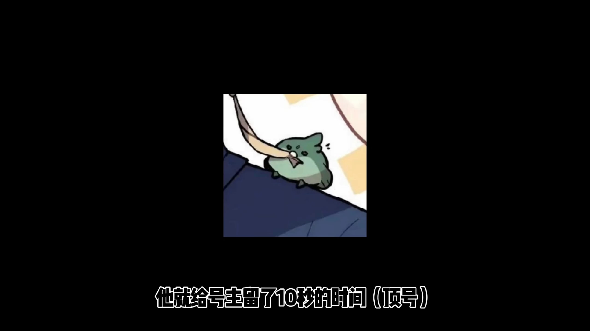 | 130.5万 | 2026-03-06 |
| [防止退化的方法](https://www.bilibili.com/video/BV19RPCzuE2L) |  | 22.8万 | 2026-03-06 |
| [《非凡机缘》我和一只黄鼠狼，不得不说的事……](https://www.bilibili.com/video/BV1hZPCzTEBd) | 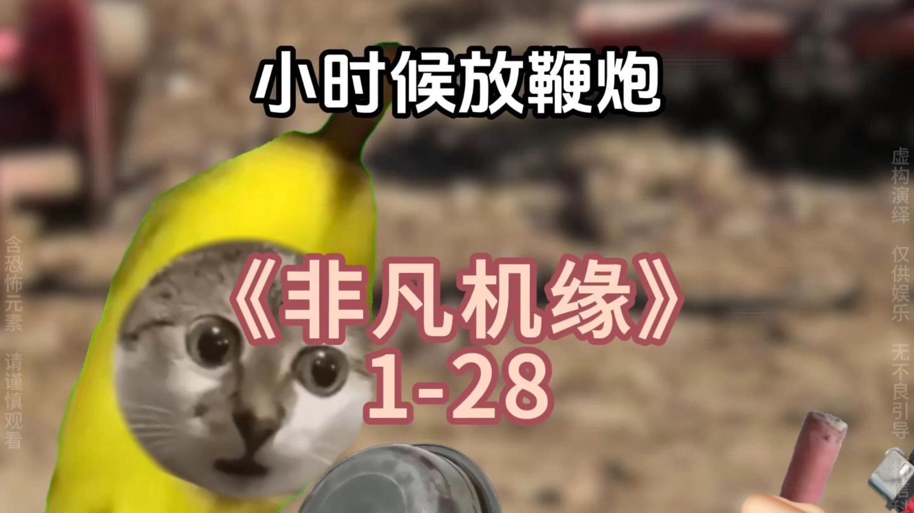 | 695.2万 | 2026-03-05 |
| [《辛巴巴巴噜比啦》丹尼尔本人教学（不是）](https://www.bilibili.com/video/BV1eRPCzuEjs) |  | 343.0万 | 2026-03-05 |
| [🐧谁才是全网最凑最神人的企鹅？🐧](https://www.bilibili.com/video/BV1bNPyzaEFn) |  | 227.9万 | 2026-03-05 |
| [循环歌曲｜《China-E拼好歌》“这些梗都听过的人也是有福了”（无损音质）](https://www.bilibili.com/video/BV13VAZz6EgT) |  | 164.8万 | 2026-03-05 |
| [传统快板《清雨大**》](https://www.bilibili.com/video/BV1zbPNzkErH) |  | 43.0万 | 2026-03-04 |
| [“佩奇，你的刀钝了”](https://www.bilibili.com/video/BV1MdPjz9EdW) |  | 272.3万 | 2026-03-03 |
| [赛前恐吓](https://www.bilibili.com/video/BV1vsAozVEbr) |  | 8.4万 | 2026-03-03 |
| [亲情抉择，超帅电棍侧脸](https://www.bilibili.com/video/BV1PbAZz8ELc) |  | 44.2万 | 2026-03-03 |
| [瓜 摊 斗 舞](https://www.bilibili.com/video/BV1BdARz5EJp) |  | 564.1万 | 2026-03-03 |
| [极乐净土，然而是特朗普](https://www.bilibili.com/video/BV1pxPjz5EHy) |  | 165.5万 | 2026-03-02 |
| [“2026年寒假全网爆火的歌曲”](https://www.bilibili.com/video/BV1V1PjzhEvi) |  | 86.2万 | 2026-03-02 |
| [东南亚饲养恐龙视频流出](https://www.bilibili.com/video/BV1fuPLzKE4o) | 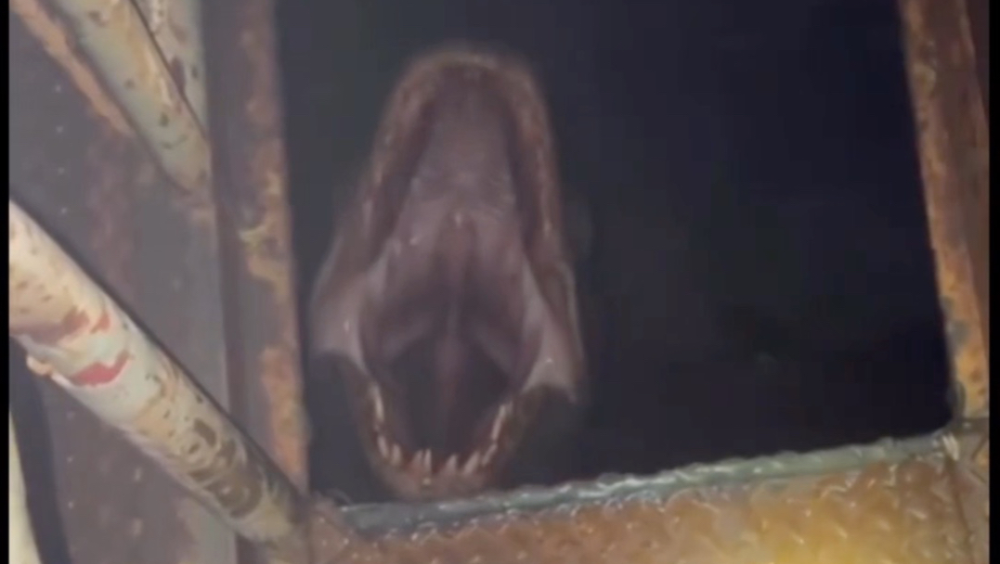 | 36.5万 | 2026-03-02 |
| [🍬企鹅谋杀案🍬](https://www.bilibili.com/video/BV13GPTzAEox) |  | 25.5万 | 2026-03-02 |
| [有人说当真爱出现的时候 整个世界都会暂停下来【45分钟氛围感环绕歌曲合集】.#戴上耳机 #音乐分享 #环绕音乐 #感觉至上](https://www.bilibili.com/video/BV1nuAaz7E6z) |  | 43.5万 | 2026-02-28 |
| [到底是谁研究的这小玩意…](https://www.bilibili.com/video/BV1FaAhzCEg5) |  | 22.2万 | 2026-02-28 |
| [🍉误闯摊下，劝余放下手中瓜🍉](https://www.bilibili.com/video/BV1RRAtzFEjK) |  | 82.0万 | 2026-02-28 |
| [陆小果精卫完整版](https://www.bilibili.com/video/BV1t5Akz9Eby) |  | 32.6万 | 2026-02-26 |
| [《我真的特别爱你》](https://www.bilibili.com/video/BV16BfyB3EFc) |  | 53.7万 | 2026-02-24 |
| [航天基地不是三角洲最简单的地图吗？【三角洲行动】](https://www.bilibili.com/video/BV1fXfNBtEKU) |  | 499.8万 | 2026-02-23 |
| [【熟】哦吼爱 /オッホ愛  LOL feat.亞北ネル,重音テト【中文字幕/PPP Sounds/重制版】](https://www.bilibili.com/video/BV1X9fgBAERA) |  | 47.1万 | 2026-02-20 |
| [2026年2月油管千万播放短视频精选](https://www.bilibili.com/video/BV11HZeBEE23) |  | 35.9万 | 2026-02-19 |
| [史无前例蓝胖子](https://www.bilibili.com/video/BV1u8c7zSE2D) | 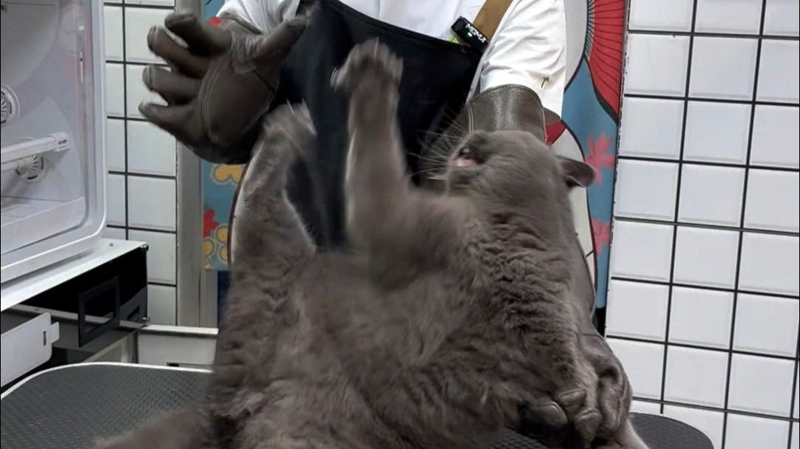 | 205.3万 | 2026-02-18 |
| [盘点超火的“六大”热门DJ小曲！每首都破亿播放，网友：太洗脑了！](https://www.bilibili.com/video/BV1RBZuBhEei) |  | 115.7万 | 2026-02-18 |
| [【单曲循环】⚡鸣潮最封神的10首神曲！⚡](https://www.bilibili.com/video/BV1D7ZSBTEvR) |  | 27.5万 | 2026-02-18 |
| [白菜对我笑](https://www.bilibili.com/video/BV1qMZSBVEgx) |  | 166.3万 | 2026-02-18 |
| [刚在外边找来的丑橘合集 丑死啦！](https://www.bilibili.com/video/BV1uDZuBpEPK) |  | 9.2万 | 2026-02-16 |
| [未必船长的冒险故事 新春大合集](https://www.bilibili.com/video/BV1ebZxBrEXZ) |  | 1183.3万 | 2026-02-15 |
| [《比比拉布》&amp;《我的刀盾》](https://www.bilibili.com/video/BV1W4ZpBjEzn) |  | 26.8万 | 2026-02-15 |
| [循环歌单｜【不知火舞の小曲】【嘎脚塞の小曲】｜【See It Again】](https://www.bilibili.com/video/BV1iBcEzAEgN) |  | 139.8万 | 2026-02-15 |
| [一边去！](https://www.bilibili.com/video/BV1bUZEB1Ej3) |  | 131.5万 | 2026-02-14 |
| [全新单曲《很大的痔》“医生说这是很大的痔，不治会出很大的事”](https://www.bilibili.com/video/BV1j3FnziEmC) |  | 124.3万 | 2026-02-07 |
| [《鸣潮》过场动画 ｜ 旅途愉快](https://www.bilibili.com/video/BV1dMFEzfEXH) |  | 197.8万 | 2026-02-07 |
| [【史诗版】《夜曲》cover 周杰伦 ——Epic Symphony Cover](https://www.bilibili.com/video/BV1aqF6zJEFx) |  | 73.8万 | 2026-02-06 |
| [《鸣潮》爱弥斯主题曲「远航星的告别」百万级录音棚试听](https://www.bilibili.com/video/BV12uFkzjEKM) |  | 289.1万 | 2026-02-06 |
| [单曲循环｜《永雏塔菲の小曲》落泪+室内系的TrackMaker](https://www.bilibili.com/video/BV1ZaffBrEHP) |  | 16.6万 | 2026-02-04 |
| [『𝟒𝐊·𝐇𝐢-𝐑𝐞𝐬』《超时空辉夜姬》「世界第一公主殿下(ワールドイズマイン)」、「Ex-Otogibanashi」Live片段](https://www.bilibili.com/video/BV1X163BQEo8) |  | 610.7万 | 2026-01-27 |
| [猫meme绿幕素材完整分享~，猫meme素材整合分享，合集分享！](https://www.bilibili.com/video/BV1JNrxBgEdo) |  | 3.5万 | 2026-01-14 |
| [给我闹！小猫娘跳舞视频素材原曲](https://www.bilibili.com/video/BV1VWBCBgEZr) |  | 17.3万 | 2025-12-27 |
| [最简单的生活也能充满幸福！-吉妮的治愈小合集](https://www.bilibili.com/video/BV1ZAq6BAEM7) |  | 115.9万 | 2025-12-20 |
| [我    聆    听](https://www.bilibili.com/video/BV1xCBFBqEND) | 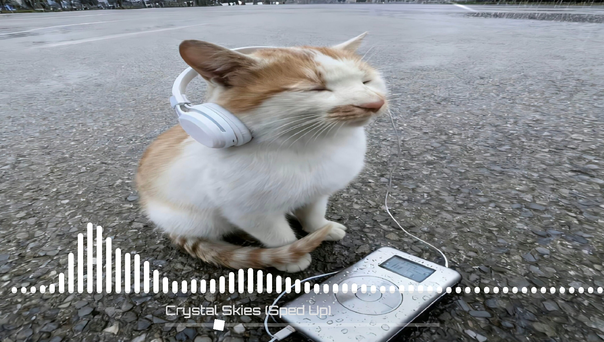 | 20.0万 | 2025-12-19 |
| [原创曲《七擒》开心元元 七擒孟获](https://www.bilibili.com/video/BV1Na1jBvExT) |  | 43.6万 | 2025-11-01 |
| [《最后攻势の小曲》“绝望中仍存有一线生机，发动最后攻势！”【The King】](https://www.bilibili.com/video/BV1mVWbzzEye) |  | 255.9万 | 2025-10-18 |
| [当你发现《弥渡山歌》和PHONK的适配度是100%！](https://www.bilibili.com/video/BV1RQaTzkEH8) |  | 616.1万 | 2025-09-03 |
| [惊吓→逃命→呼救→求饶→疑问→淡定→舒服→享受](https://www.bilibili.com/video/BV1GxhrzvES9) | 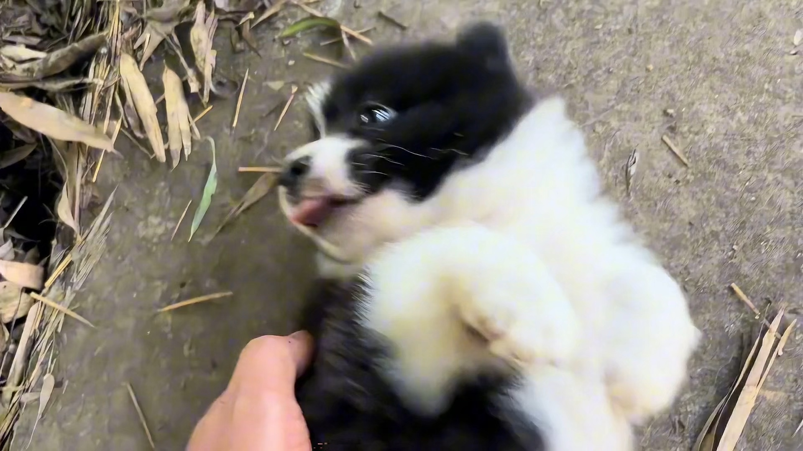 | 487.9万 | 2025-08-31 |
| [圆头监狱](https://www.bilibili.com/video/BV1PHN1zeEzh) | 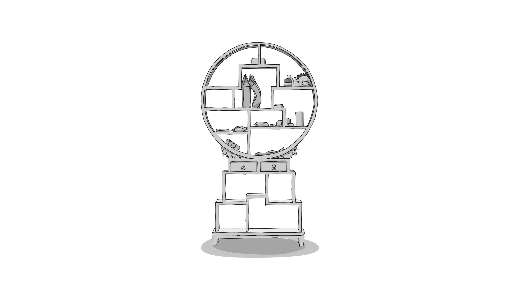 | 276.3万 | 2025-06-21 |
| [原创曲《蟑螂满屋，粥批难寻》——“我的出租屋里真的有很多蟑螂”](https://www.bilibili.com/video/BV1hjNfz5EJe) |  | 217.6万 | 2025-06-20 |
| [【老飞宇66】鼠片bgm合集](https://www.bilibili.com/video/BV1SFZSYuEoB) |  | 56.5万 | 2025-04-03 |
| [基米music：晚安，基米](https://www.bilibili.com/video/BV1YoQpY9Ecr) |  | 9011 | 2025-03-12 |
| [【星尘/诗岸/原创摇滚】反乌托邦 “至少我还在为你而歌唱，在黑暗漫长的反乌托邦”](https://www.bilibili.com/video/BV1CVPoeNEq4) | 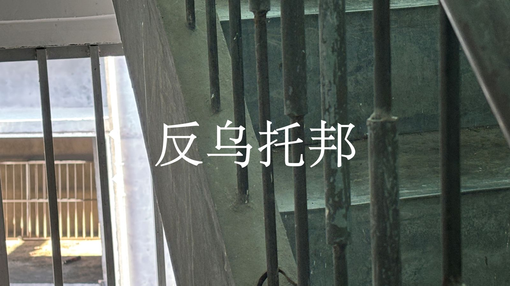 | 1220.1万 | 2025-02-03 |
| [开！！将大局逆转吧](https://www.bilibili.com/video/BV1t6fJYWEFf) |  | 188.5万 | 2025-01-24 |
| [“碧蓝哈基米”是什么梗？【碧蓝梗指南】](https://www.bilibili.com/video/BV1vP2hYvEbS) |  | 3171 | 2024-10-12 |
| [【曼波门】｜“我们看惯了世间的曼波门 变得好像曼波人”](https://www.bilibili.com/video/BV19Z4Fe7ECG) |  | 255.7万 | 2024-10-05 |
| [【进击的键帽】call of silence](https://www.bilibili.com/video/BV1cxeqenEVQ) |  | 78.9万 | 2024-07-26 |
| [哈基米：你这样显得我很呆](https://www.bilibili.com/video/BV19C4y1N7wv) | 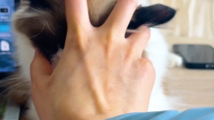 | 7 | 2023-12-30 |
| [我本将心向明月 完整高清版](https://www.bilibili.com/video/BV1us4y1W7Kd) |  | 329.4万 | 2023-02-03 |
| [I Got Smoke (2022年一把米诺贝尔奖金曲)](https://www.bilibili.com/video/BV1UW4y1N79w) |  | 1654.6万 | 2022-12-23 |
| [这他喵才是《夜曲》原版MV](https://www.bilibili.com/video/BV1tA411q7xi) |  | 762.2万 | 2020-05-22 |
| [命に嫌われている。 / まふまふ【歌ってみた】](https://www.bilibili.com/video/BV1Lt411X7im) |  | 214.2万 | 2018-11-30 |

---
*最后更新: 2026-03-12 03:10:43 (自动生成)*
*数据来源: [Bilibili](https://www.bilibili.com)*

## 使用说明

运行以下命令更新视频列表:
```bash
python3 fetch_hajimi_videos.py
```
