# awesome-hajimi
collections of hajimi (哈基米 in Chinese) on the Internet.

## 视频列表 (Video List)

| 视频标题 (Title) | 封面 | 播放量 (Views) | 发布日期 (Date) |
|---|---|---|---|
| [Katrina｜叮咚鸡和哈基米的单恋故事](https://www.bilibili.com/video/BV1BjRNBEERr) |  | 80 | 2026-05-04 |
| [哈基米太好玩了](https://www.bilibili.com/video/BV1MuReB2Eni) |  | 124 | 2026-05-04 |
| [哈基米](https://www.bilibili.com/video/BV1LARPBuEtD) | 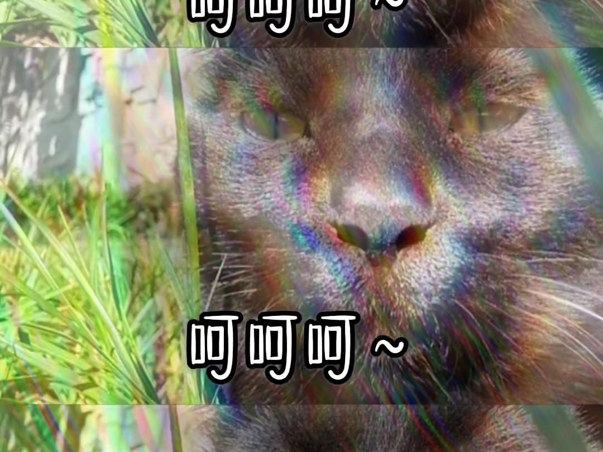 | 6 | 2026-05-04 |
| [哈基米：又被看扁了](https://www.bilibili.com/video/BV1QuRPBNEpi) | 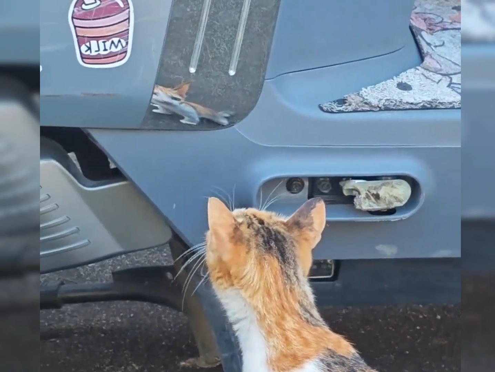 | 845 | 2026-05-04 |
| [全是哈基米，速来](https://www.bilibili.com/video/BV1qjRAB6Ey5) |  | 223 | 2026-05-03 |
| [哈基米被木板砸的屎都出来了仍然哈气中](https://www.bilibili.com/video/BV1sfRFBLErk) | 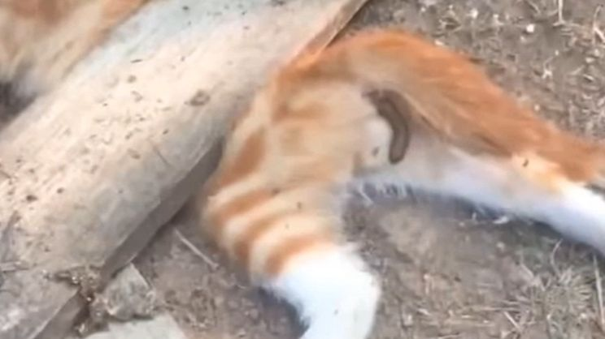 | 7573 | 2026-05-03 |
| [可爱哈基米](https://www.bilibili.com/video/BV1QCRFBsEec) | 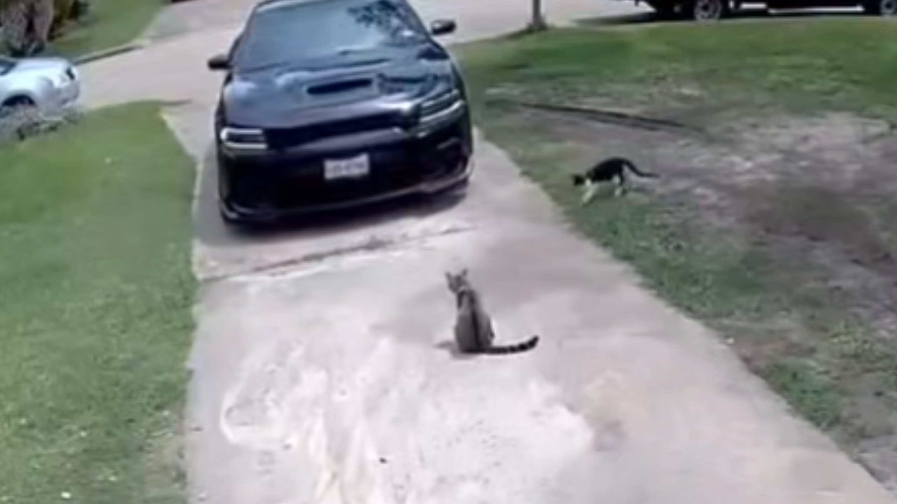 | 725 | 2026-05-03 |
| [哈基米睡眠可视化](https://www.bilibili.com/video/BV1VnRcBcEWS) | 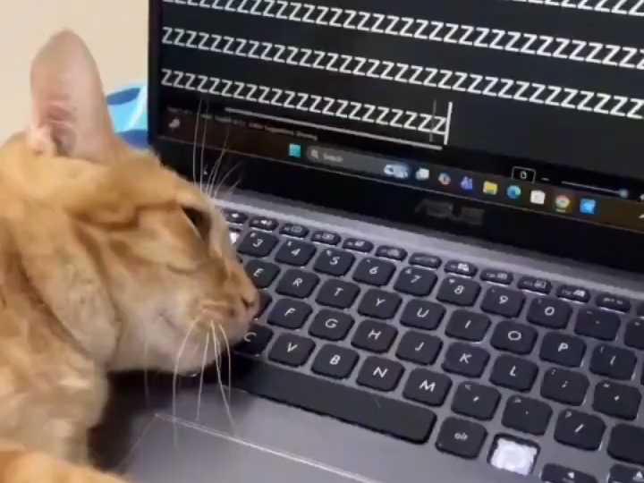 | 434 | 2026-05-03 |
| [哈气米 — 惧基米 — 豪基米](https://www.bilibili.com/video/BV1qGRcBvExP) | 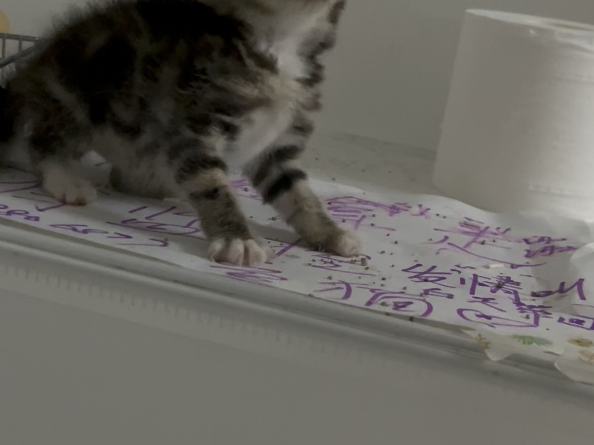 | 308 | 2026-05-03 |
| [自设也想哈基米](https://www.bilibili.com/video/BV1dLRcBYEph) |  | 496 | 2026-05-03 |
| [基米TV之假期超长版](https://www.bilibili.com/video/BV1WBRcBmE2F) | 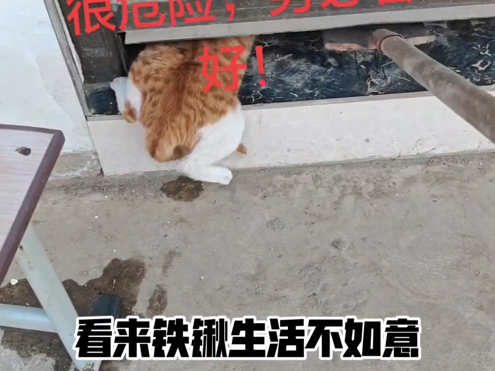 | 1051 | 2026-05-03 |
| [请你吃哈基米和406](https://www.bilibili.com/video/BV1bGRwBsErp) |  | 221 | 2026-05-03 |
| [哈基米又哈气](https://www.bilibili.com/video/BV1ugRwBdEwh) | 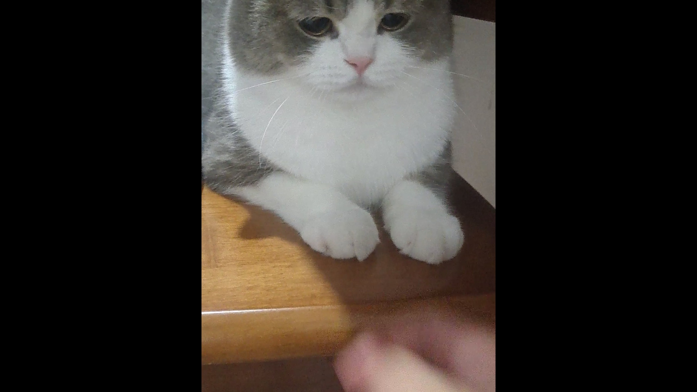 | 25 | 2026-05-03 |
| [bro充实的一天！——解锁一直哈基米](https://www.bilibili.com/video/BV1YwRwBwE2w) |  | 113 | 2026-05-03 |
| [谁家装修呀把我家哈基米吓死了](https://www.bilibili.com/video/BV1aNRwBFEVT) |  | 4473 | 2026-05-03 |
| [哈基米号码：小花瓜    又又又哈气啦！](https://www.bilibili.com/video/BV1aNRwBFErS) | 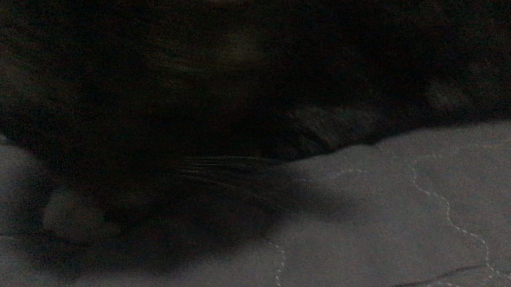 | 140 | 2026-05-03 |
| [跳的不错啊【哈基动物园282期】](https://www.bilibili.com/video/BV1e79fBWEeq) | 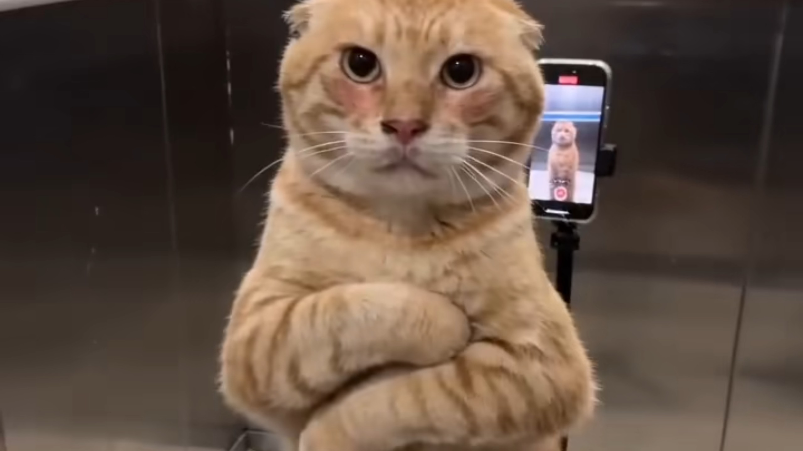 | 1290 | 2026-05-03 |
| [哈基米呀南北绿豆~](https://www.bilibili.com/video/BV1fM9fB8EN8) |  | 104 | 2026-05-03 |
| [哈基米难被驴逗](https://www.bilibili.com/video/BV1Zu9fBfEFe) |  | 273 | 2026-05-03 |
| [哈基米](https://www.bilibili.com/video/BV1qu9fBfEHU) | 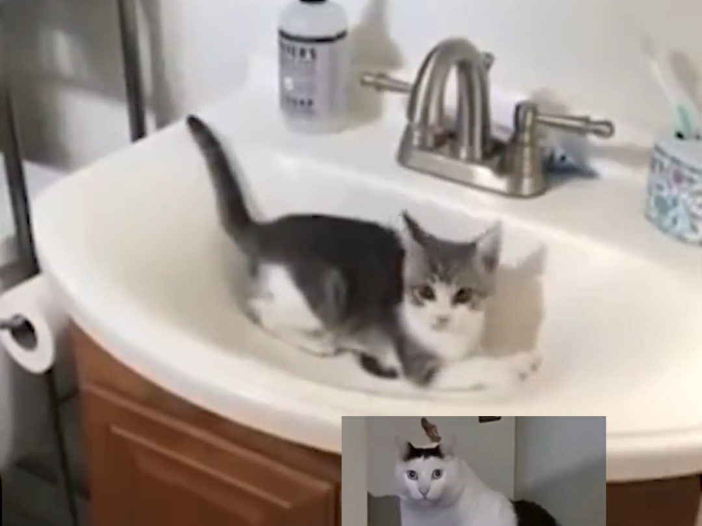 | 238 | 2026-05-03 |
| [哈基汪TV](https://www.bilibili.com/video/BV1UuRFBUEig) |  | 1.2万 | 2026-05-03 |
| [哈基米依旧神兵哈基进化](https://www.bilibili.com/video/BV1MKRFBDEWC) | 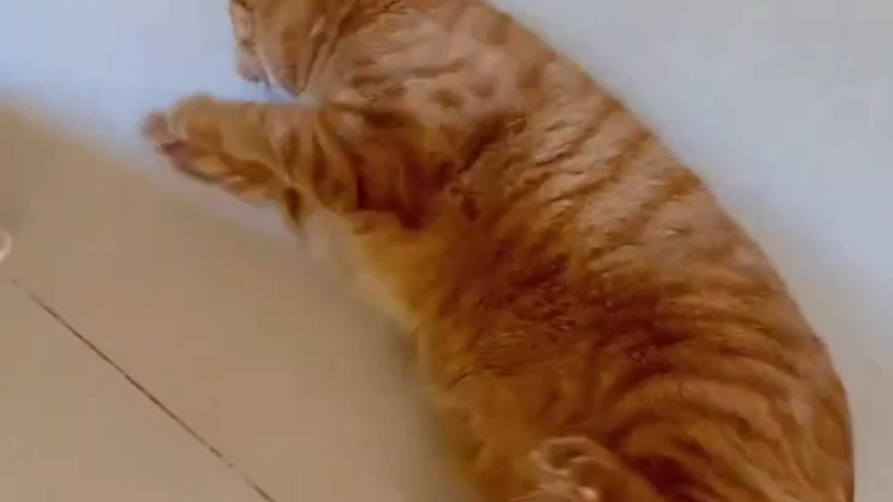 | 590 | 2026-05-03 |
| [小基米在车里躲避哈基隼](https://www.bilibili.com/video/BV14GRFB2EyJ) | 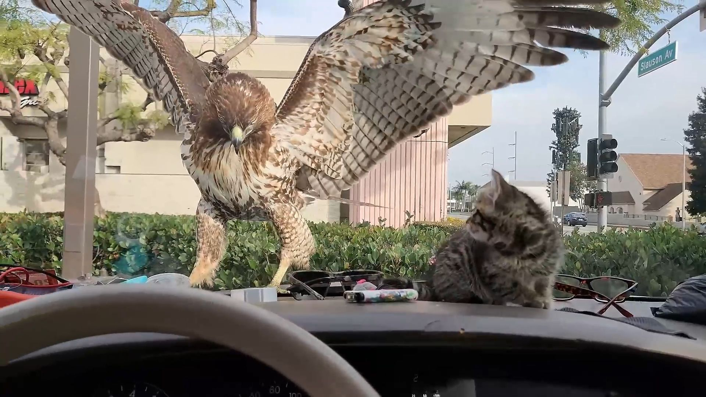 | 2378 | 2026-05-03 |
| [这是哈基米自己打猎获得的](https://www.bilibili.com/video/BV1TGRFB2E33) | 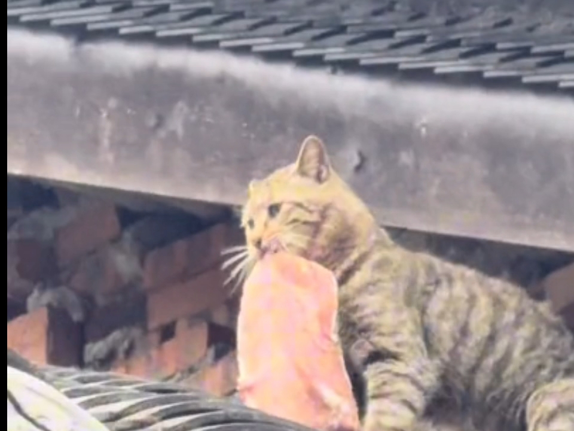 | 1286 | 2026-05-03 |
| [小院又添四只小橘子 橘猫数量突破两位数](https://www.bilibili.com/video/BV19D9RBLEU8) | 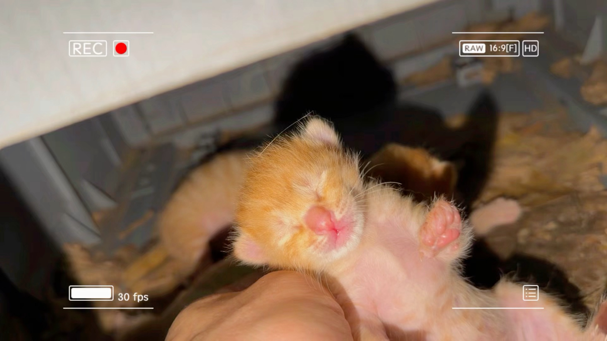 | 7419 | 2026-05-03 |
| [顶级哈基米脸](https://www.bilibili.com/video/BV1SNRFBHEig) |  | 1.0万 | 2026-05-03 |
| [哈基米这个以后没有烦恼](https://www.bilibili.com/video/BV1LeRFBaEaB) | 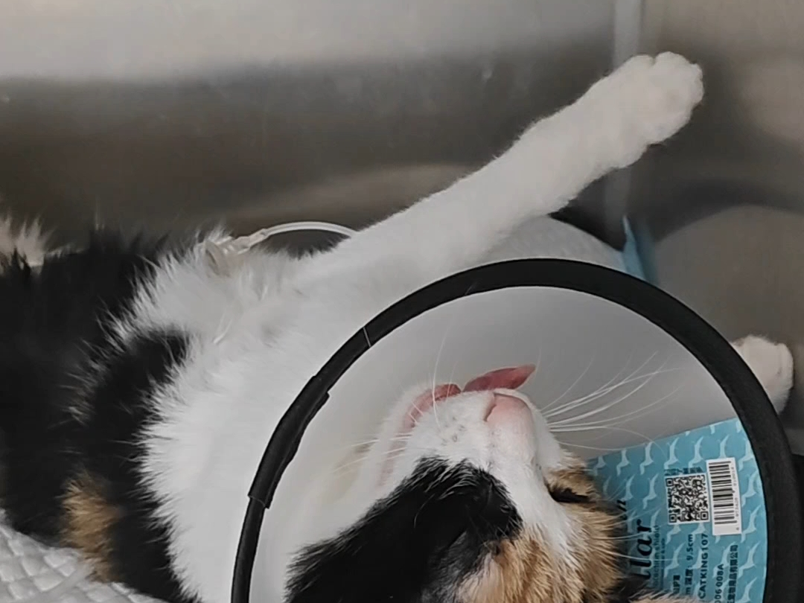 | 160 | 2026-05-03 |
| [认真的论述哈基米](https://www.bilibili.com/video/BV1rQ99BRENR) |  | 310 | 2026-05-03 |
| [【哈基米急哭了】最新视频已上线，快来围观！](https://www.bilibili.com/video/BV1diRFBFEYQ) | 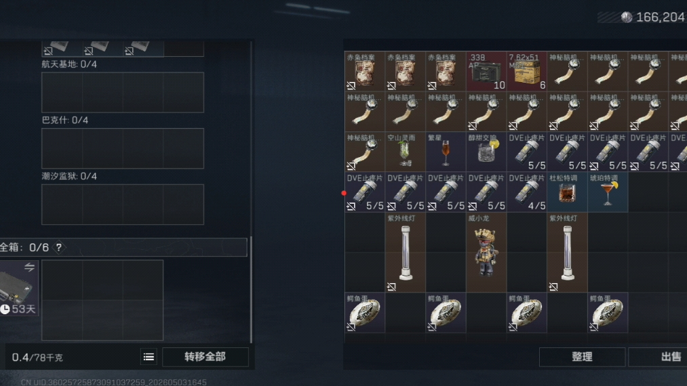 | 18 | 2026-05-03 |
| [主播家里跑来一只哈基米](https://www.bilibili.com/video/BV15BRFBfEkW) |  | 174 | 2026-05-03 |
| [哈基米没认出来老吴](https://www.bilibili.com/video/BV1189oBqE6j) | 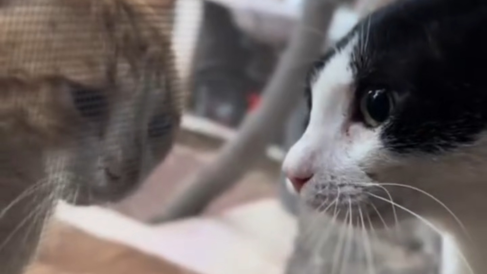 | 1.8万 | 2026-05-03 |
| [哈吉米](https://www.bilibili.com/video/BV1Qq9ZBDE8U) |  | 222 | 2026-05-03 |
| [哈基米 难被掠夺～～](https://www.bilibili.com/video/BV1Z49ZBtEcV) | 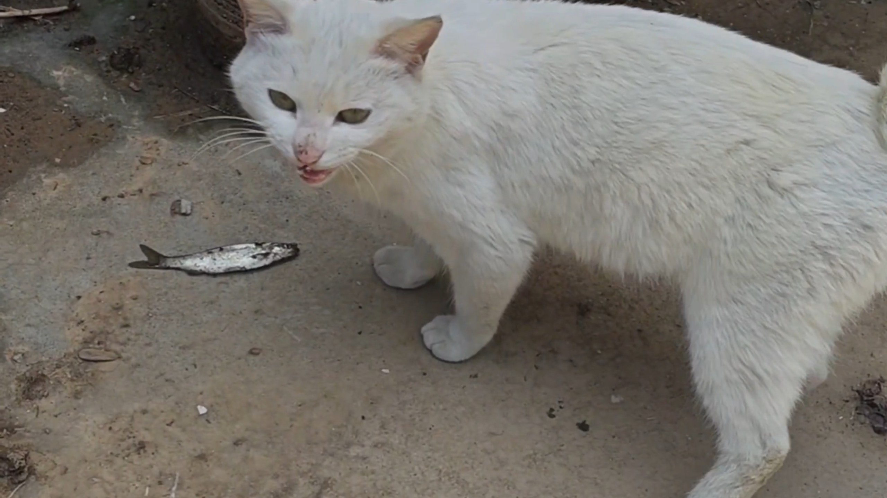 | 98 | 2026-05-03 |
| [哈基米](https://www.bilibili.com/video/BV1kd9ZBBEos) | 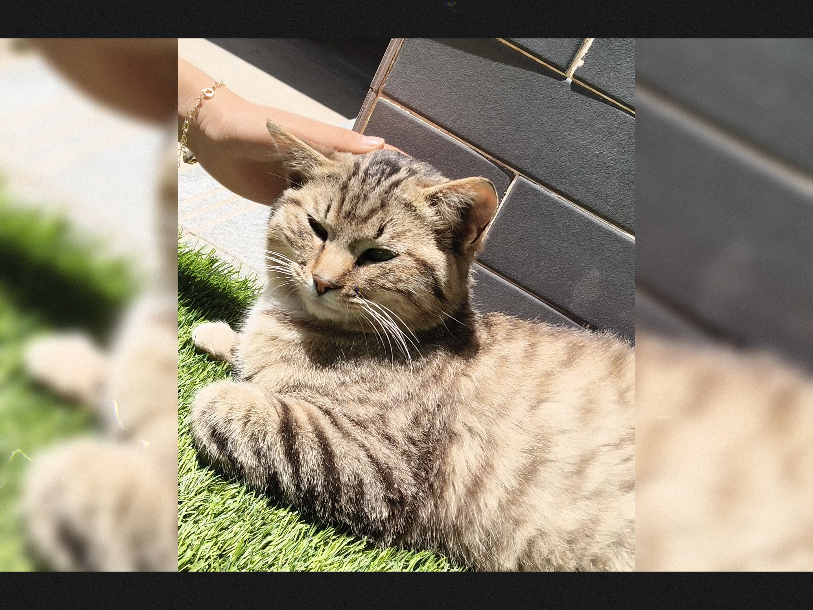 | 21 | 2026-05-03 |
| [星河追梦1.0+哈基米战斗小曲1.0](https://www.bilibili.com/video/BV1rf9ZBiEDT) | 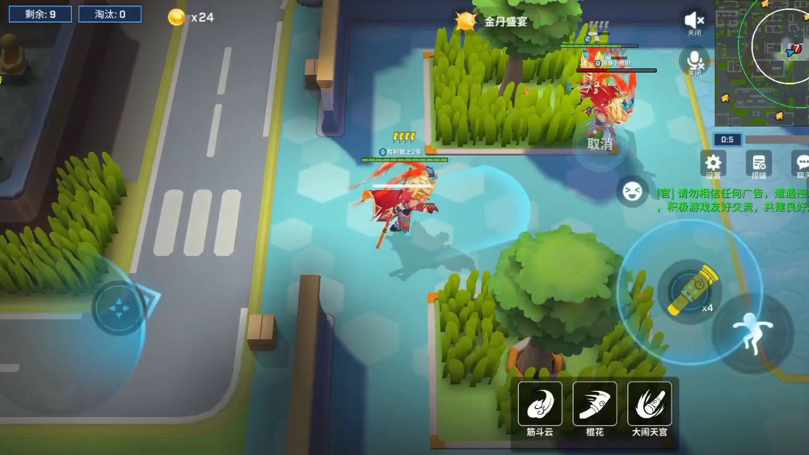 | 121 | 2026-05-03 |
| [【神人杯Day3】🐱压迫感哈基米：Criminals🐱](https://www.bilibili.com/video/BV1up9iBQE8z) |  | 1955 | 2026-05-03 |
| [【哈基米神人杯Day3】哈基米：夏霞（完整版）](https://www.bilibili.com/video/BV14WR7BAE22) |  | 4269 | 2026-05-03 |
| [废物哈基米！！！！](https://www.bilibili.com/video/BV1T29ZB1ED5) | 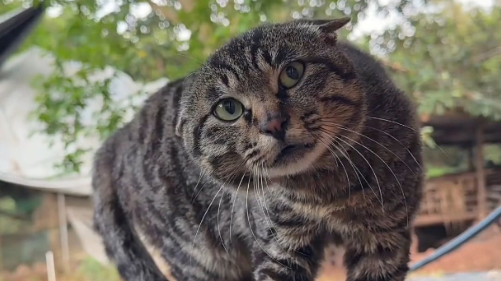 | 45 | 2026-05-03 |
| [震惊！是什么让爷爷和哈基米跑路](https://www.bilibili.com/video/BV1uc9dBBEKF) |  | 224 | 2026-05-03 |
| [哈基米这个喜欢偷快递](https://www.bilibili.com/video/BV1fn9dB9Ed5) | 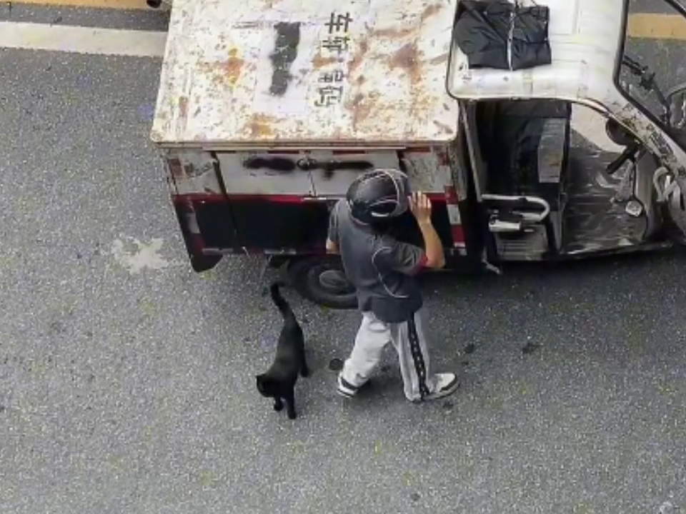 | 1030 | 2026-05-03 |
| [挑战谁没有蛋仔哈基米，看最后有蛋仔哈基米](https://www.bilibili.com/video/BV12M9vBGEeJ) | 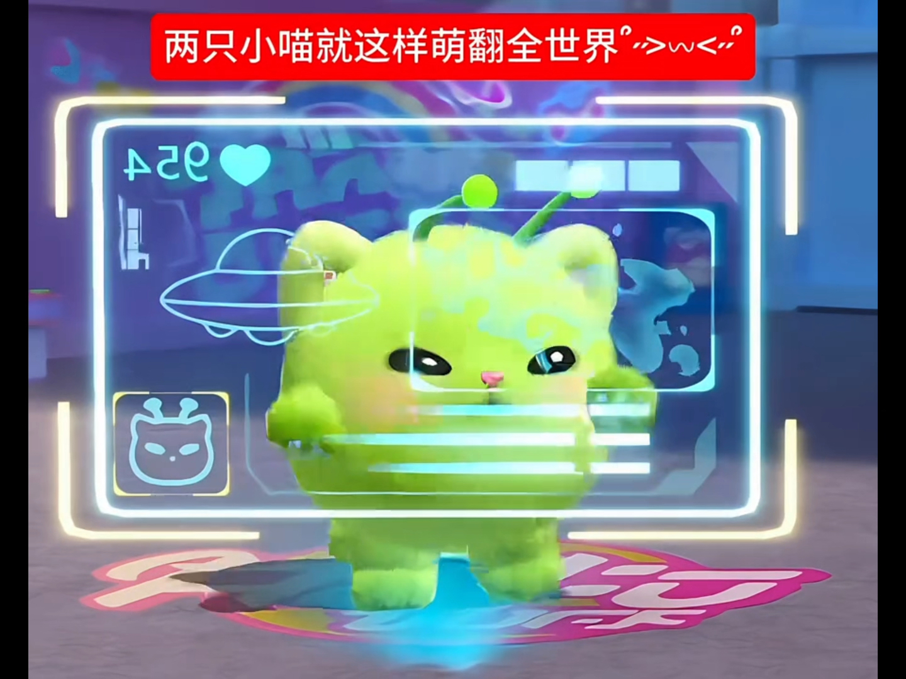 | 382 | 2026-05-03 |
| [飞天哈基米](https://www.bilibili.com/video/BV1qy9RBJEBV) | 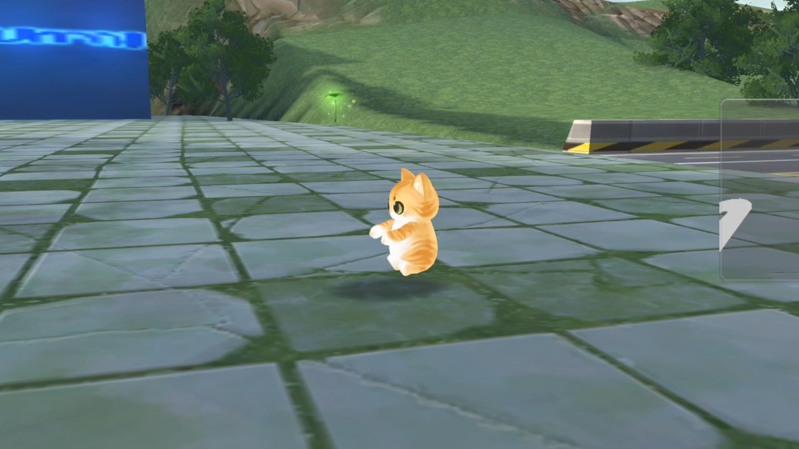 | 390 | 2026-05-02 |
| [【哈基米音乐】空中猎场哈基米](https://www.bilibili.com/video/BV1fd9QB5EPM) |  | 382 | 2026-05-02 |
| [哇！哈基米 哎!TVQAQ](https://www.bilibili.com/video/BV1oF9XBrEt6) |  | 225 | 2026-05-02 |
| [雪地里传来哈基米～](https://www.bilibili.com/video/BV1ew9XBgEpj) |  | 144 | 2026-05-02 |
| [《哈基米智斗哨兵》](https://www.bilibili.com/video/BV1LC9XBGEy7) | 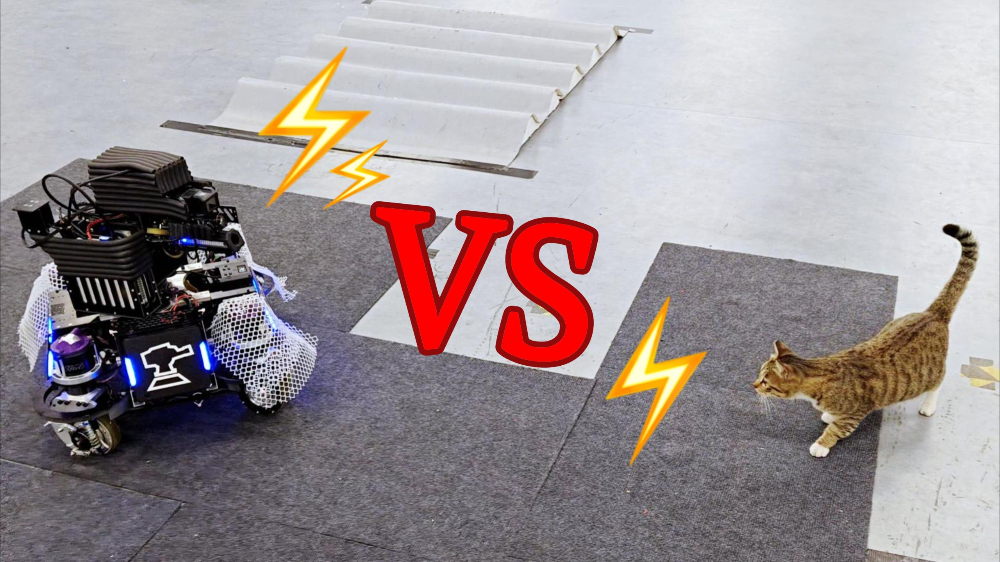 | 253 | 2026-05-02 |
| [哈基米狩猎本性潜能大激发](https://www.bilibili.com/video/BV1Hb9XBXEsL) | 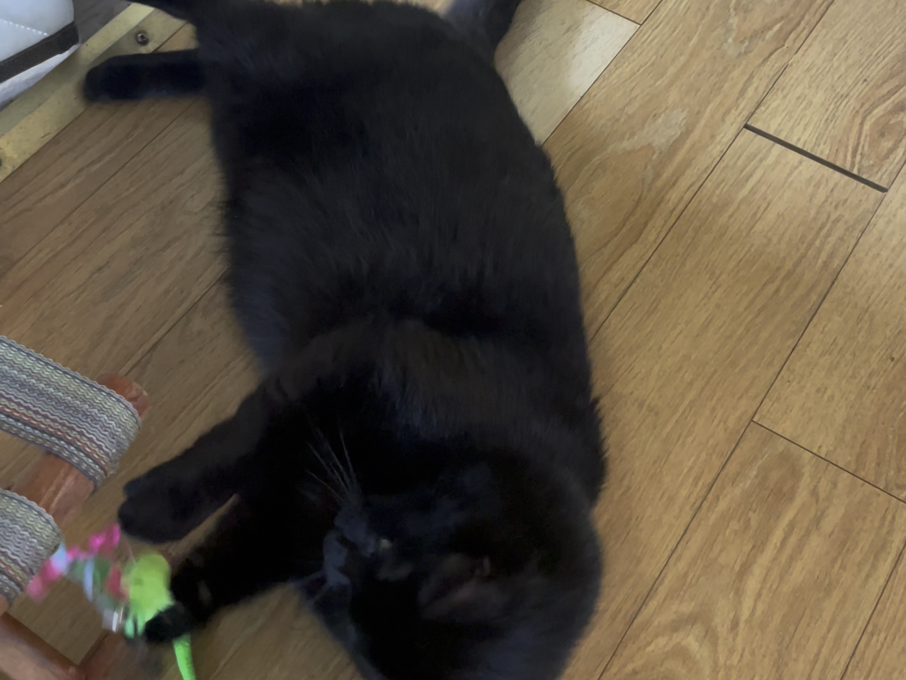 | 792 | 2026-05-02 |
| [哈基米](https://www.bilibili.com/video/BV1kt9XBpEd4) | 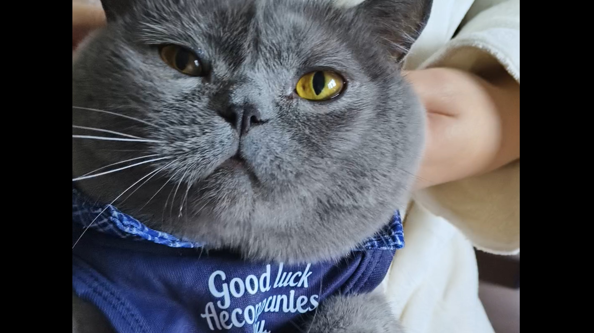 | 339 | 2026-05-02 |
| [JK婚纱哈基米说唱《哈基米南北绿豆》，最后10秒为差异调性舞台效果对比Demo。之前素材库存。AI生成](https://www.bilibili.com/video/BV1xw99BFE4b) |  | 300 | 2026-05-02 |
| [哈基米南北绿豆](https://www.bilibili.com/video/BV1mF99BhEH1) | 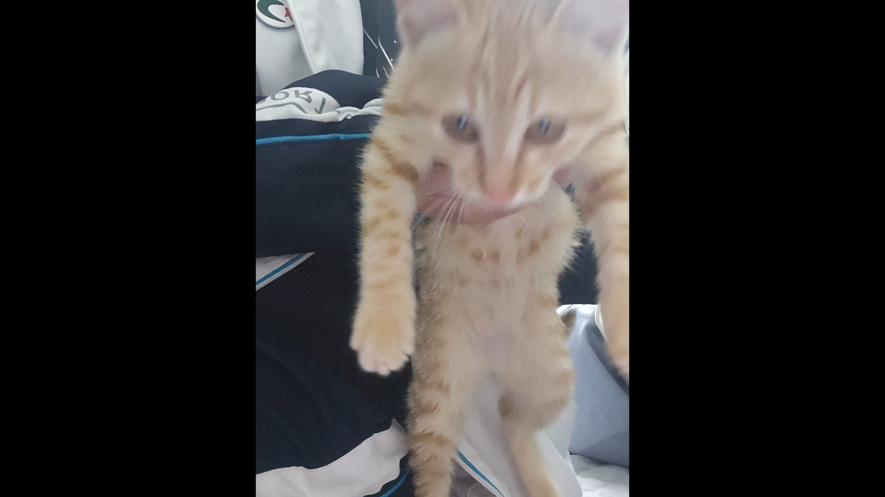 | 158 | 2026-05-02 |
| [今晚效果炸了！大司马+高仿联动，本尊被逗的一直笑](https://www.bilibili.com/video/BV1vuR7BkEew) |  | 230.4万 | 2026-05-02 |
| [假心哈（哈基米音乐）](https://www.bilibili.com/video/BV1iNR7BLEsn) | 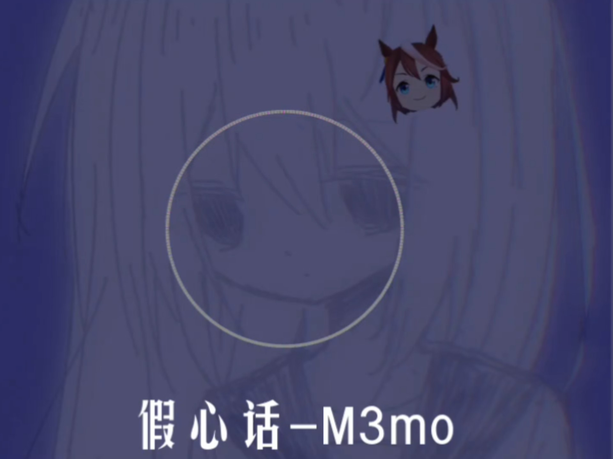 | 177 | 2026-05-02 |
| [咪要吃肉，万一是咪自己烤的呢](https://www.bilibili.com/video/BV1X5R7BuEWr) | 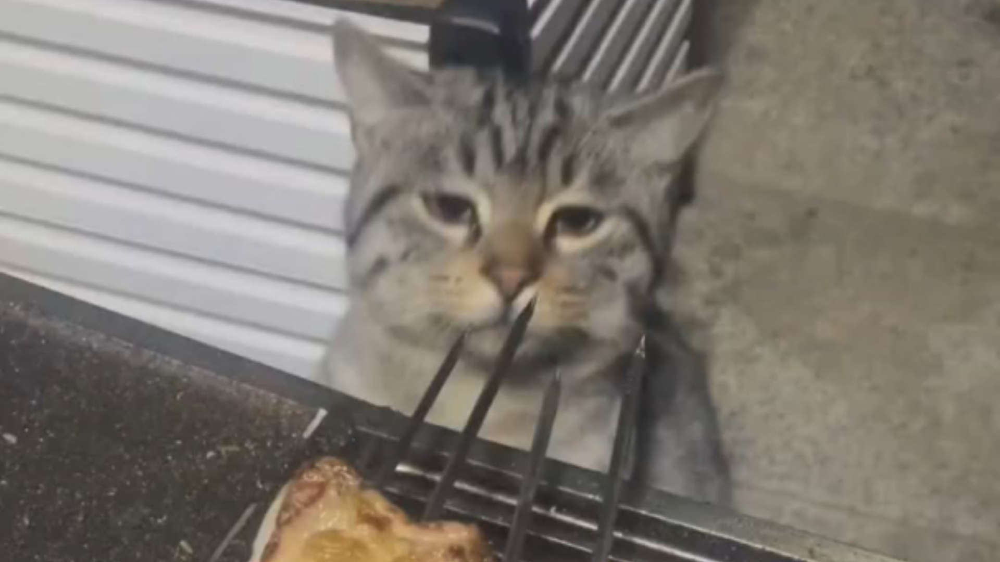 | 10.3万 | 2026-05-02 |
| [哈基米](https://www.bilibili.com/video/BV11uREBhEhY) | 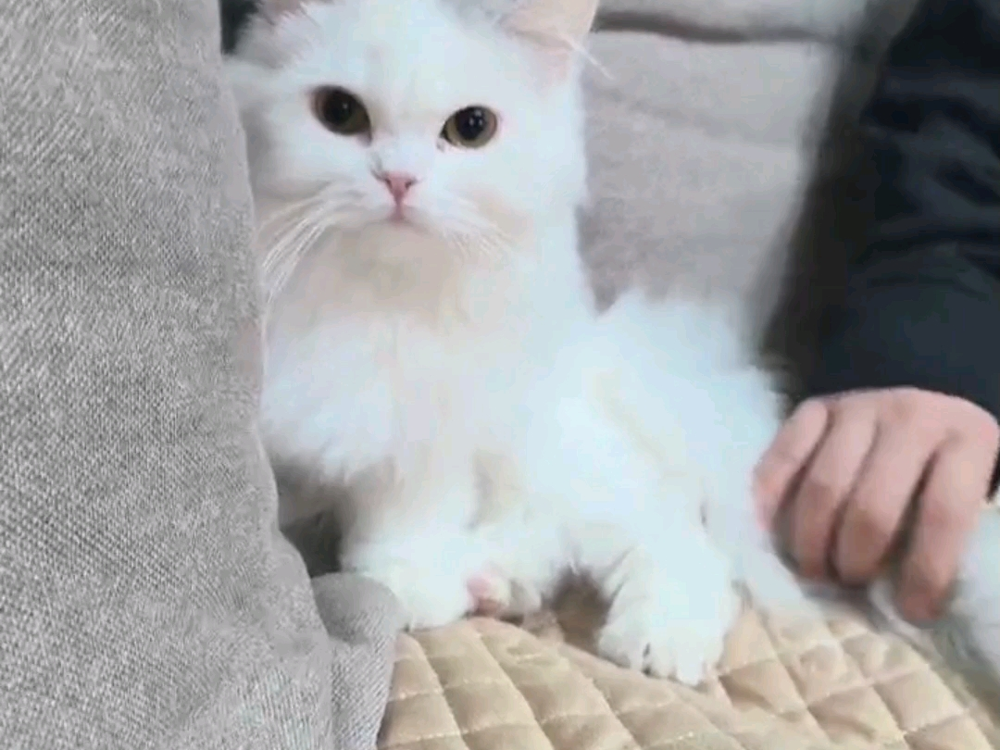 | 76 | 2026-05-02 |
| [【智人TV】:可爱的哈基米被坏大妈骑车压了](https://www.bilibili.com/video/BV1BpREBQEgY) | 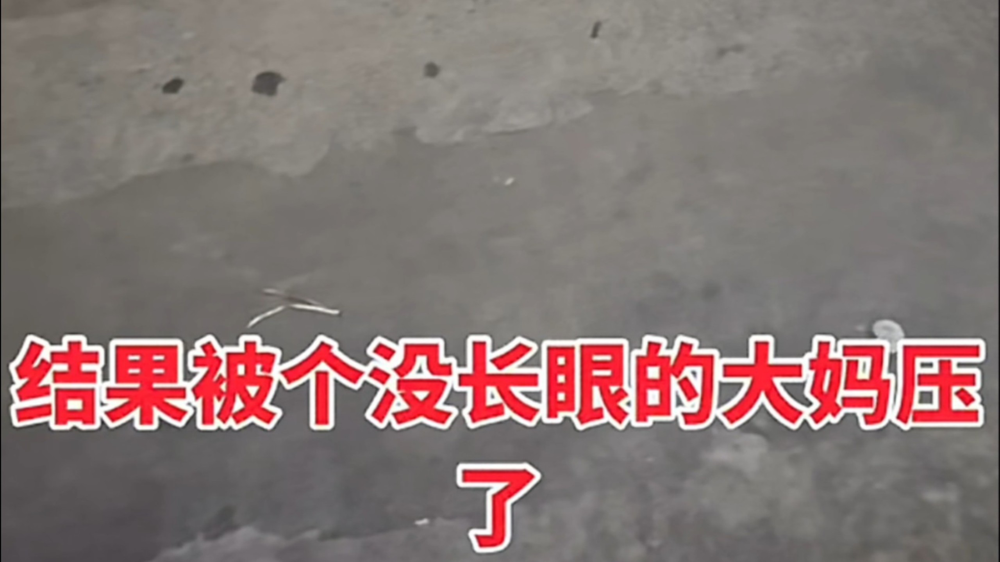 | 2.3万 | 2026-05-02 |
| [剑人tv之在每句话后面都加个“哈基米”](https://www.bilibili.com/video/BV1JEREBsEeP) |  | 2.5万 | 2026-05-02 |
| [[哈基米版-第二期]](https://www.bilibili.com/video/BV15bREBmEqL) | 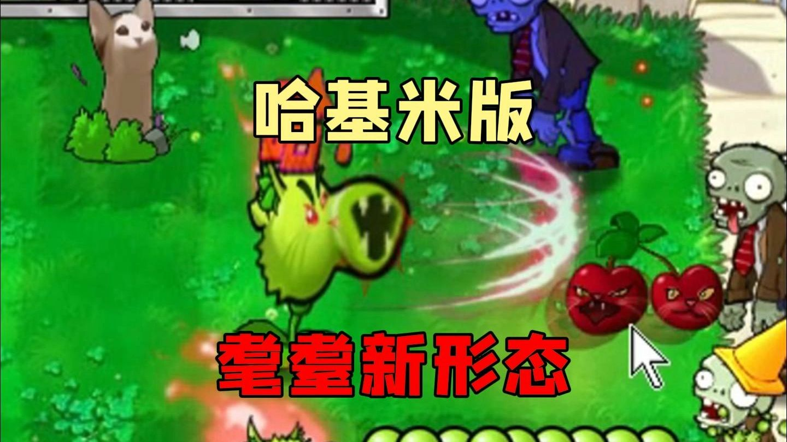 | 14.5万 | 2026-05-02 |
| [跑刀连出双九格的对局有多刺激？](https://www.bilibili.com/video/BV154RjB3EPV) | 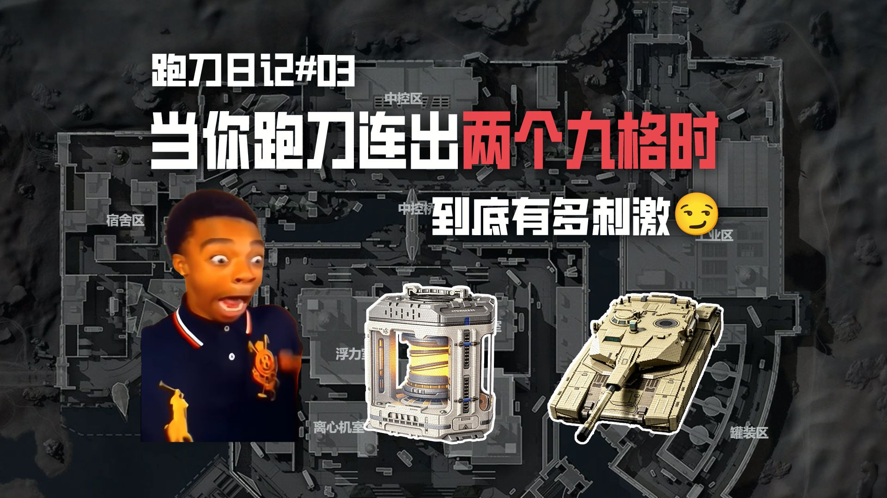 | 1.2万 | 2026-05-02 |
| [史上最爽的三声老吴没有之一](https://www.bilibili.com/video/BV1q6RLBkEHL) | 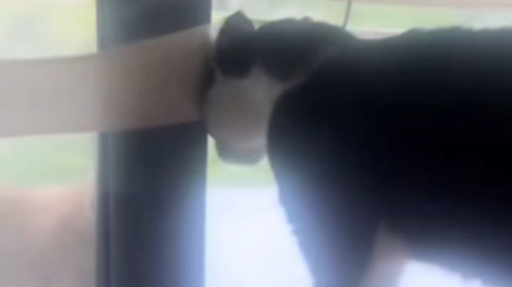 | 9.7万 | 2026-05-02 |
| [【人声哈基米】牧神午后序曲 (Prélude à l&#x27;après-midi d&#x27;un faune)](https://www.bilibili.com/video/BV1v1RLBuEuR) | 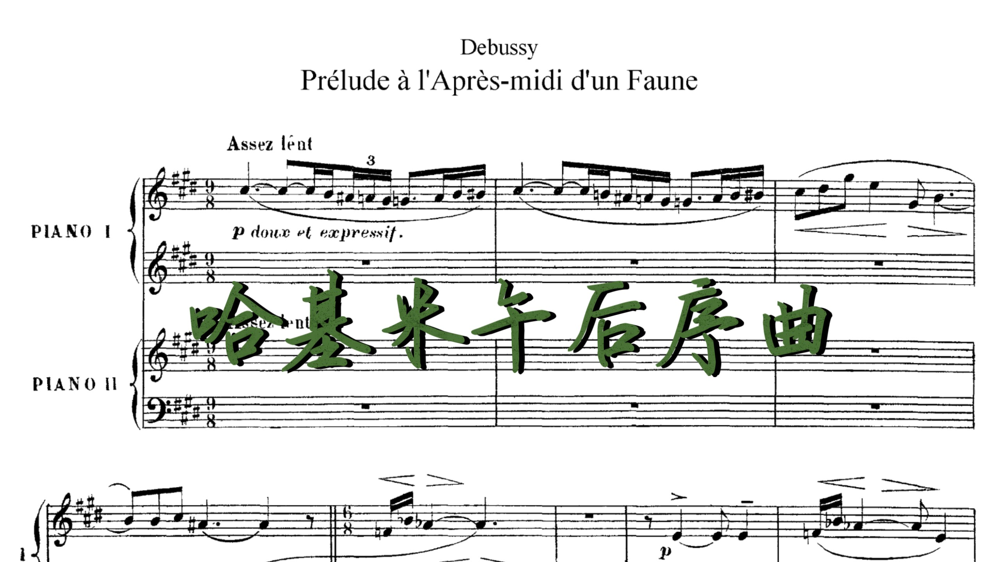 | 248 | 2026-05-02 |
| [【智人TV】人类文明，要难逃一劫了](https://www.bilibili.com/video/BV1P2RjBtERP) |  | 25.0万 | 2026-05-02 |
| [【人声哈基米】德沃夏克幽默曲 (-24key) Op.101 No.7](https://www.bilibili.com/video/BV1aXRLBvETv) | 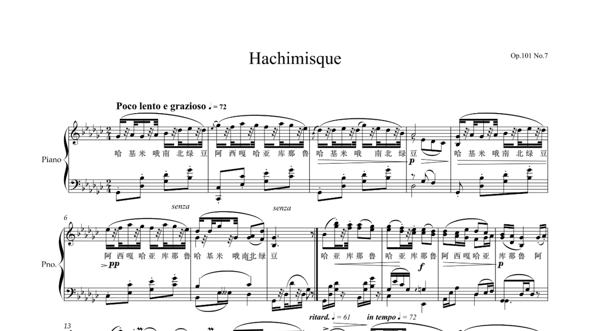 | 319 | 2026-05-02 |
| [乡下基米对上城市基米，老辈子零帧起手打断施法](https://www.bilibili.com/video/BV1bzRjBAEX7) | 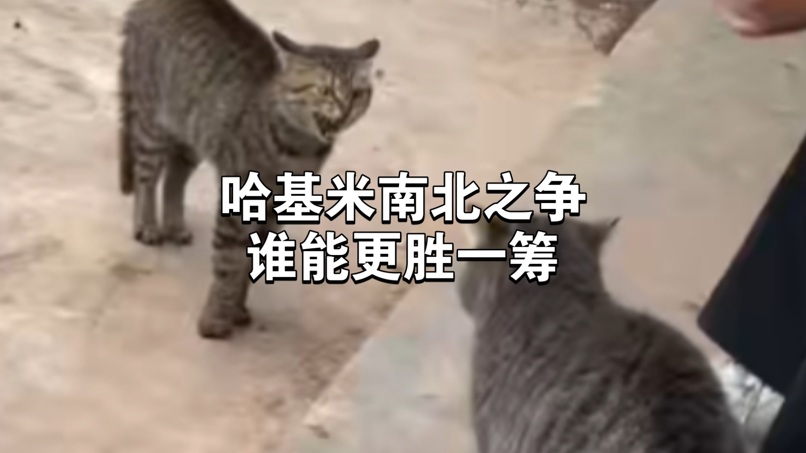 | 754 | 2026-05-02 |
| [我的世界动画（女仆猫·终）](https://www.bilibili.com/video/BV15sRjBkErS) |  | 6867 | 2026-05-02 |
| [猫儿这个求饶](https://www.bilibili.com/video/BV1ivR3B8EcB) | 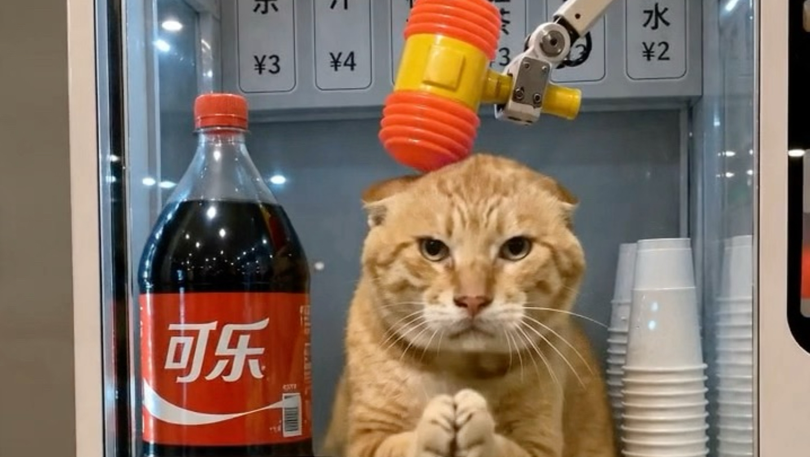 | 13.0万 | 2026-05-02 |
| [“哈基米附体！一把呆萌到犯规的无锁小折”——Civivi Purr 哈基米 开箱分享](https://www.bilibili.com/video/BV17jR5BgETy) | 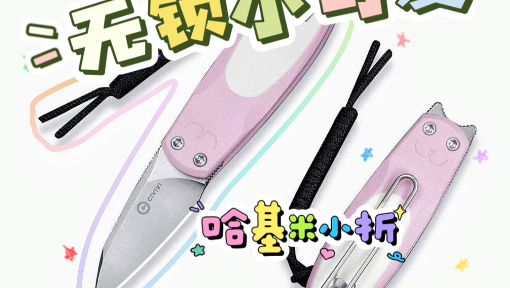 | 703 | 2026-05-02 |
| [朱门胖宝宝，路有冻死基。](https://www.bilibili.com/video/BV1bQRVB4EhU) | 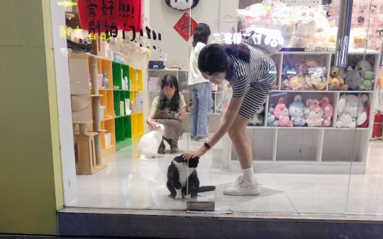 | 13.4万 | 2026-05-02 |
| [芙芙哈基米南北路多](https://www.bilibili.com/video/BV1hURVBbECB) |  | 1097 | 2026-05-02 |
| [嘎子哥语言系统瘫痪疯狂胡言乱语！不停的左脑反驳右脑，最爆笑的一集！](https://www.bilibili.com/video/BV1doRGBPEdj) |  | 28.8万 | 2026-05-02 |
| [收留“落魄小少爷”的第31天](https://www.bilibili.com/video/BV1muR3B7Eds) | 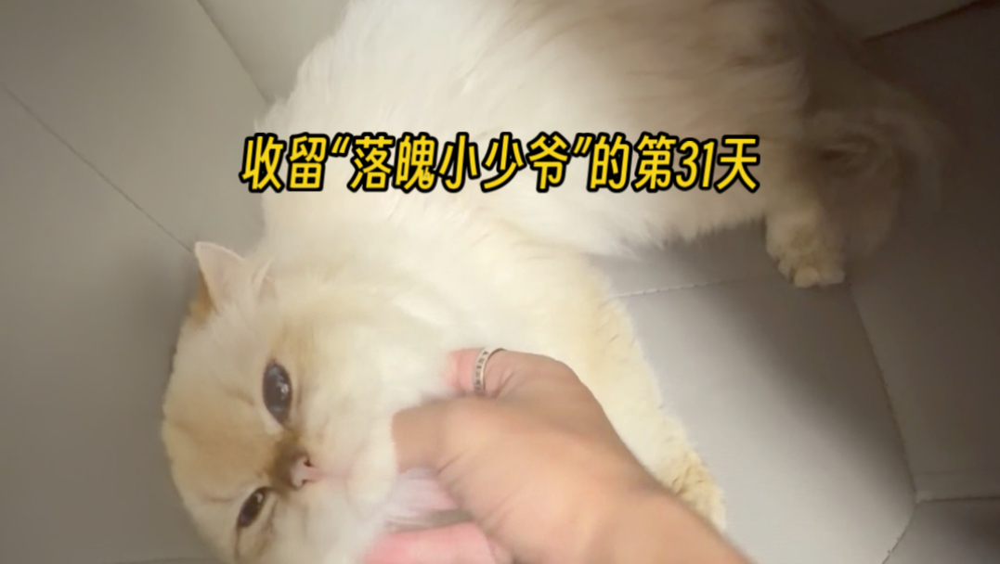 | 3.8万 | 2026-05-02 |
| [哈基米的秘密计划，我竟变成了销毁！](https://www.bilibili.com/video/BV1erR3BxEMC) |  | 10.5万 | 2026-05-01 |
| [大家觉得我会成为一只乖乖的小基米吗](https://www.bilibili.com/video/BV1qeR3BcE1K) | 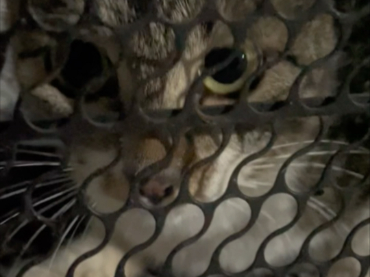 | 3377 | 2026-05-01 |
| [PVZ哈基米版 冒险模式通关（持续更新中）](https://www.bilibili.com/video/BV1y9RuBzEEi) |  | 1549 | 2026-05-01 |
| [咪不明白…咪只想跟你回家！](https://www.bilibili.com/video/BV1owRKBmEnC) | 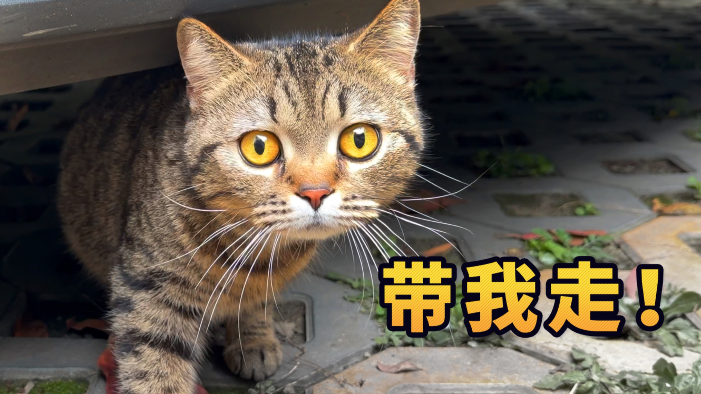 | 139.4万 | 2026-05-01 |
| [⚡️基米 vs 叮咚鸡⚡️](https://www.bilibili.com/video/BV1439xBJEQs) |  | 4.1万 | 2026-05-01 |
| [【78食堂】豪到你了吗？](https://www.bilibili.com/video/BV1fyRMBoE44) |  | 187.1万 | 2026-05-01 |
| [【表情配布】银狼哈基米南北路多](https://www.bilibili.com/video/BV12yRNBFExy) |  | 757 | 2026-05-01 |
| [哈基米都看不下去了](https://www.bilibili.com/video/BV13F9qB4Ev3) | 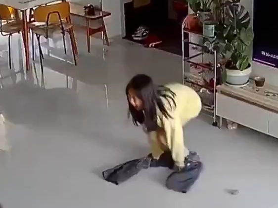 | 59.0万 | 2026-05-01 |
| [小朋友被哈基米了！](https://www.bilibili.com/video/BV17k9eBcEyD) | 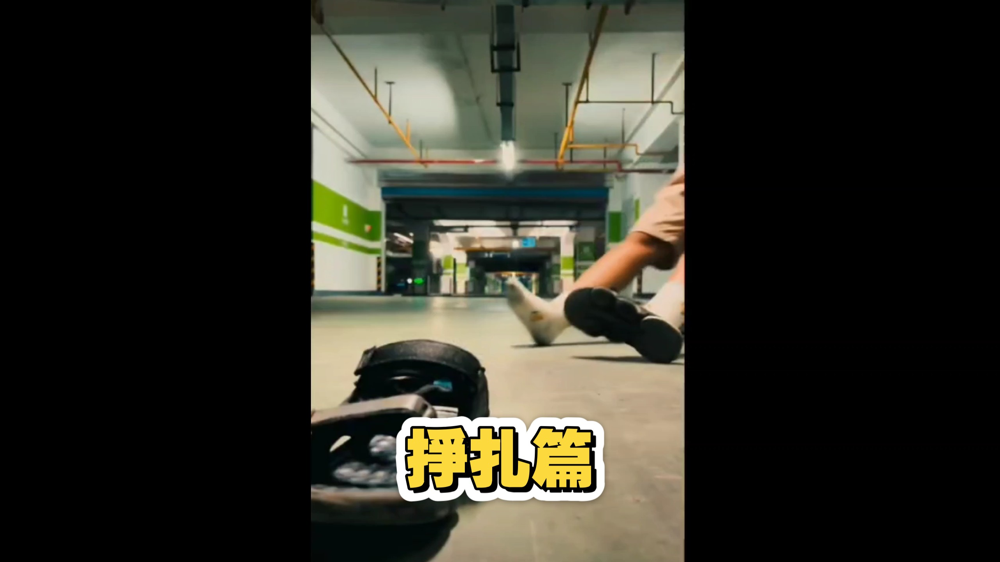 | 1648 | 2026-04-30 |
| [黄瓜，哈吉咪的隐藏BUG](https://www.bilibili.com/video/BV1by9xBRE1o) | 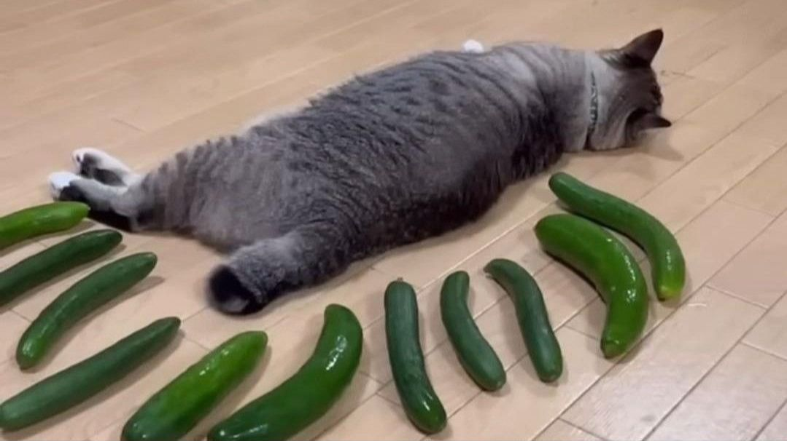 | 3.2万 | 2026-04-30 |
| [猫儿这个变异](https://www.bilibili.com/video/BV1Kj98BaEaz) | 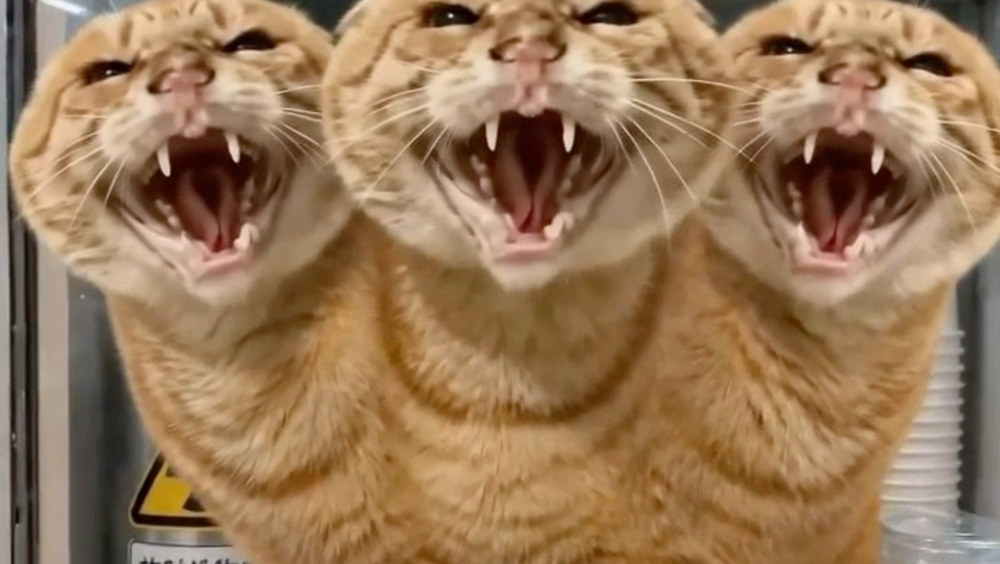 | 19.6万 | 2026-04-30 |
| [梗图系列961.](https://www.bilibili.com/video/BV19z9xBFE1Q) | 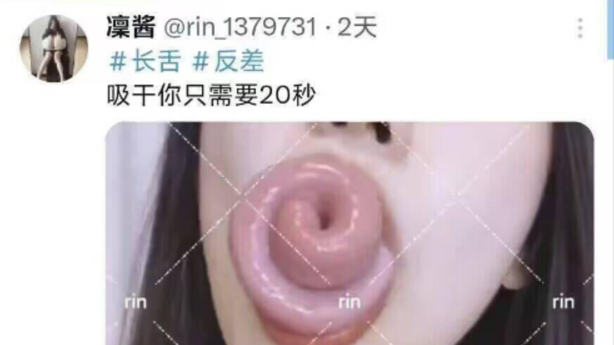 | 11.0万 | 2026-04-30 |
| [爱猫人士大合集 网络人物志之哈基米哈基米哈基米](https://www.bilibili.com/video/BV1w19SB5EuE) |  | 1.3万 | 2026-04-29 |
| [小猫学会哈气后：妈妈，给你看个好东西](https://www.bilibili.com/video/BV1eC9rBkEQi) |  | 9.8万 | 2026-04-28 |
| [【哈基米音乐】战争雷霆-呐呐呐呐呐~（Arise Great County!）](https://www.bilibili.com/video/BV13896BYEPx) |  | 4865 | 2026-04-28 |
| [哈基米这个哈气](https://www.bilibili.com/video/BV1rPomB5EvT) | 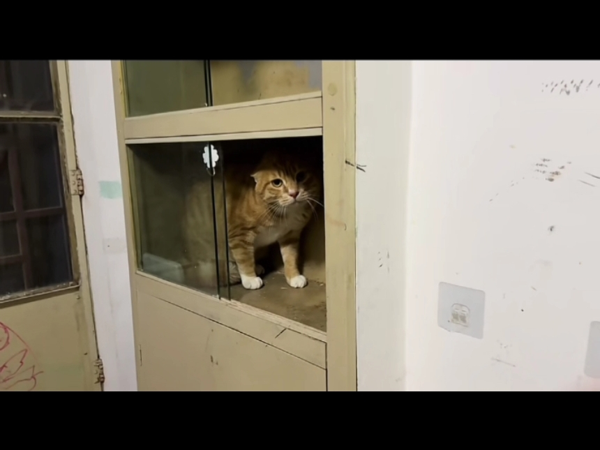 | 547 | 2026-04-27 |
| [大运卡车 VS 1000只哈气耄耋谁会获胜 全新玩法来了一起来看看吧~#解压 #哈基米 #大运 #polo小球 #视觉震撼](https://www.bilibili.com/video/BV1N2o6BYESH) | 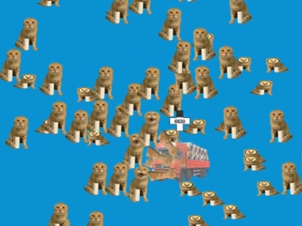 | 6620 | 2026-04-27 |
| [猫儿这个好喝到爆](https://www.bilibili.com/video/BV1PGo9BPET1) | 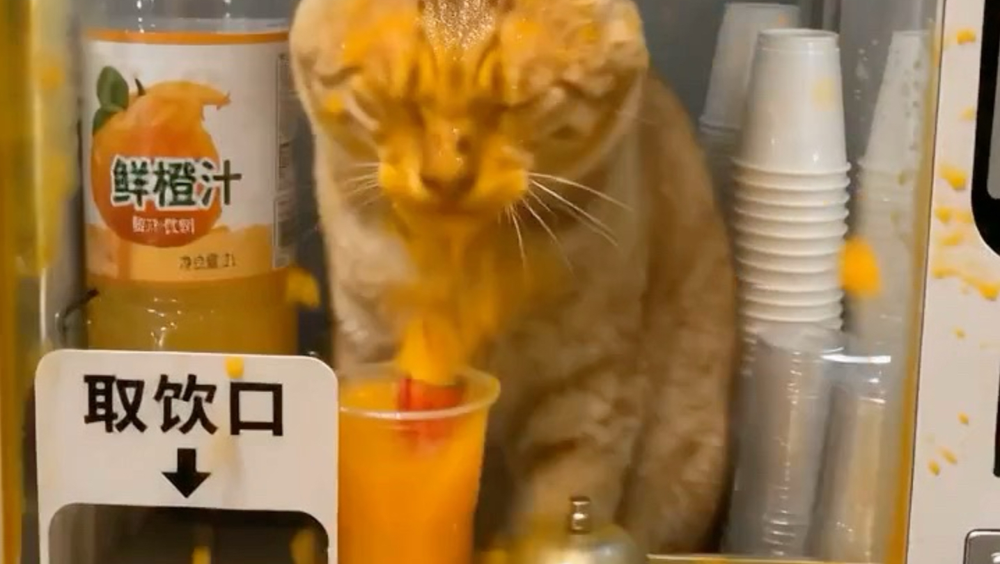 | 38.8万 | 2026-04-25 |
| [【崩坏：星穹铁道】初音未来 x 银狼 LV.999 米化警告：把你变得HoYoHoYo哒♪｜HoYoHoYoにしてあげる♪ / 初音ミク×銀狼LV.999](https://www.bilibili.com/video/BV1VqoYBxE2s) |  | 186.3万 | 2026-04-23 |
| [̗̥̯̔͜H͈̳͍̃̈Ă̡̭̍͢P̡̹̾̓͠P̸͓̮̪̒Y̛̩̋͡͡ ̤̗̌͜͢D̗̟̻̫̏Ȁ̪̱̮̄Y̴̷̟̎̍S̯̫̝̒̇](https://www.bilibili.com/video/BV16udrBXEg6) |  | 5.6万 | 2026-04-20 |
| [【4K 60FPS】【中英双语】《烦人的村民》（附网盘文件）1-65全集](https://www.bilibili.com/video/BV1xfQ4BEEVy) |  | 45.2万 | 2026-04-13 |
| [小猫的彪马形态](https://www.bilibili.com/video/BV1KW9FBLER4) | 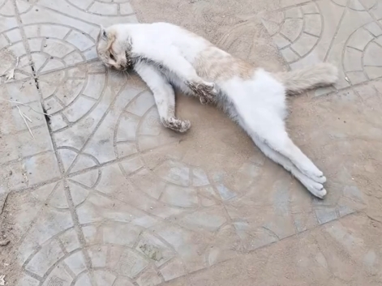 | 18.7万 | 2026-04-02 |
| [哈基米还没吃饱就打厨子了](https://www.bilibili.com/video/BV1HmXoBwEYi) | 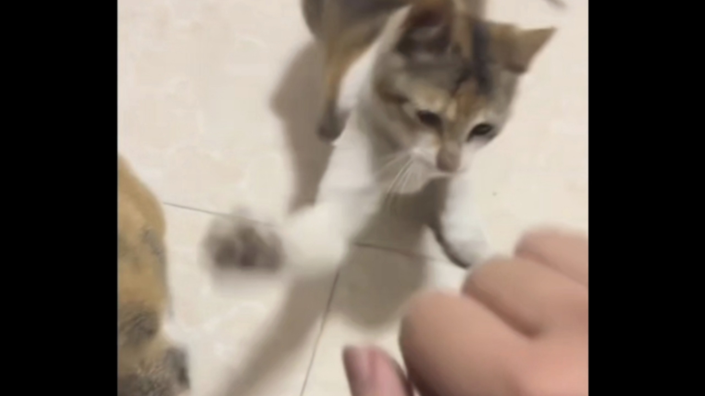 | 12.1万 | 2026-03-30 |
| [妈妈酱别叫，基米只是和大狗爵们玩去了](https://www.bilibili.com/video/BV1pScgzXE3W) |  | 2.4万 | 2026-02-09 |
| [猫儿这个撞大运，下次好好看路吧](https://www.bilibili.com/video/BV1LrFZz6EsE) | 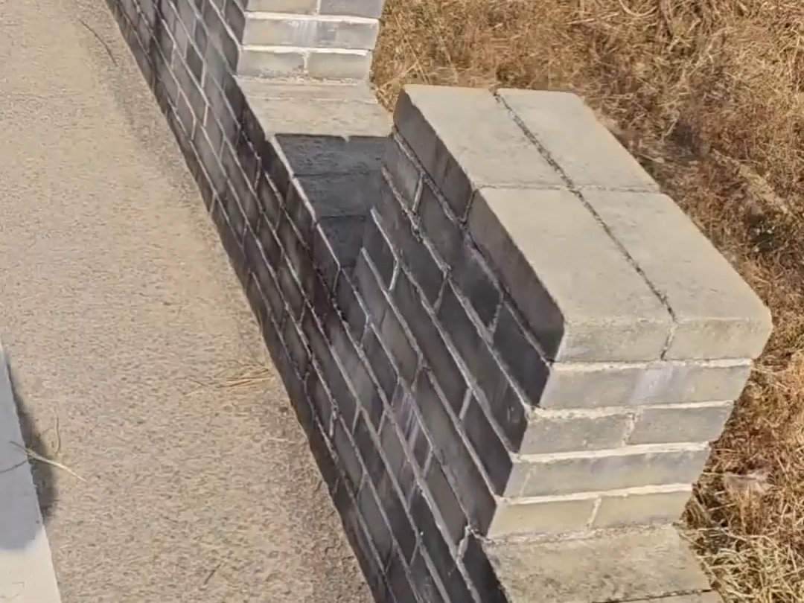 | 5.9万 | 2026-02-08 |
| [ASMR｜不er..哈个气能爽成这样？浑身通电般...脚底板都痒痒起来✦哈气/刺激向摩擦敲击快速穿脑/掏耳等✦Hi-Res无损音质](https://www.bilibili.com/video/BV1QQYXzPEwn) |  | 270.3万 | 2025-08-21 |
| [当男生进入的时候，女生是什么心情呢？一个视频告诉你！](https://www.bilibili.com/video/BV1TUgSzFESJ) |  | 234.4万 | 2025-07-01 |
| [老北京哈基米地地道道行礼](https://www.bilibili.com/video/BV1Pw4m1e7iv) | 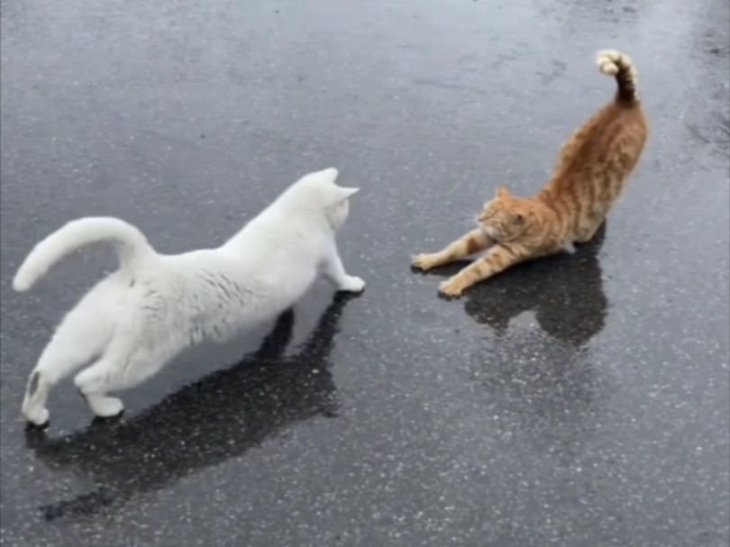 | 38.3万 | 2024-06-18 |
| [你的耳朵被带倒刺的猫舌头舔舔舔舔啦｜Sumimi](https://www.bilibili.com/video/BV1LZ421b74E) | 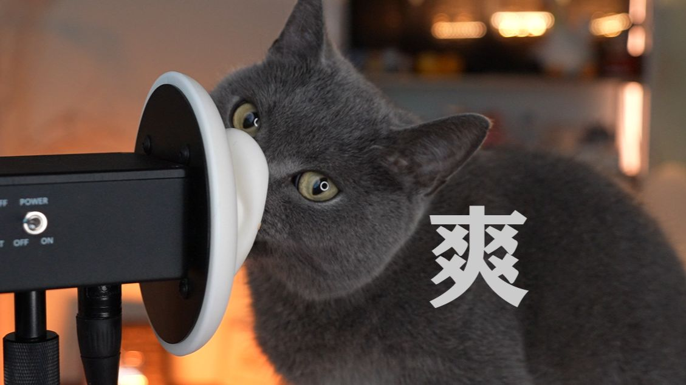 | 208.2万 | 2024-03-17 |
| [【猫狗】流浪狗来到流浪猫地盘屠杀](https://www.bilibili.com/video/BV1st4y167y8) |  | 124.0万 | 2021-01-26 |

---
*最后更新: 2026-05-04 03:21:30 (自动生成)*
*数据来源: [Bilibili](https://www.bilibili.com)*

## 使用说明

运行以下命令更新视频列表:
```bash
python3 fetch_hajimi_videos.py
```
