# awesome-hajimi
collections of hajimi (哈基米 in Chinese) on the Internet.

## 视频列表 (Video List)

| 视频标题 (Title) | 封面 | 播放量 (Views) | 发布日期 (Date) |
|---|---|---|---|
| [哈基米这个喜欢偷鱼](https://www.bilibili.com/video/BV1z5R5BrEsQ) |  | 47 | 2026-05-02 |
| [洛克王国最速通关哈基米](https://www.bilibili.com/video/BV1B5R5BrEr3) |  | 165 | 2026-05-02 |
| [哈基米烟花](https://www.bilibili.com/video/BV1YWR5BvEoV) |  | 10 | 2026-05-02 |
| [哈基米南北绿豆.](https://www.bilibili.com/video/BV1VWR5BvEUg) |  | 0 | 2026-05-02 |
| [疯狂哈基米一秒抓十七下这一块](https://www.bilibili.com/video/BV1QPR3BDEH1) | 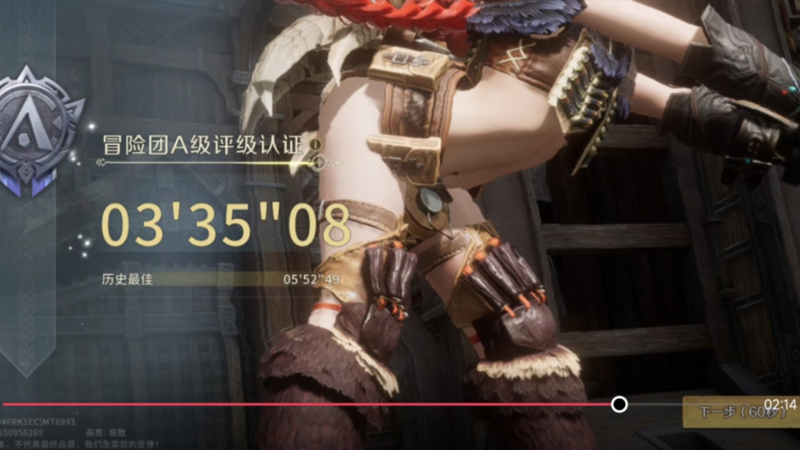 | 118 | 2026-05-02 |
| [哈基米版虽然只做到了第一大关，但是后面的音乐却实装了，还是完整版](https://www.bilibili.com/video/BV1fZR5B3EAR) |  | 684 | 2026-05-02 |
| [猫？标？正面看着萌反面看着萌上面看着萌 总之真的萌 哈基米猫标#鼠标 #英菲克  #撸猫 #无线蓝牙鼠标 #办公鼠标](https://www.bilibili.com/video/BV1TzR5BsEKR) |  | 0 | 2026-05-02 |
| [哎哈基米，ber你怎么真死啦？](https://www.bilibili.com/video/BV1AUR5BEEKJ) | 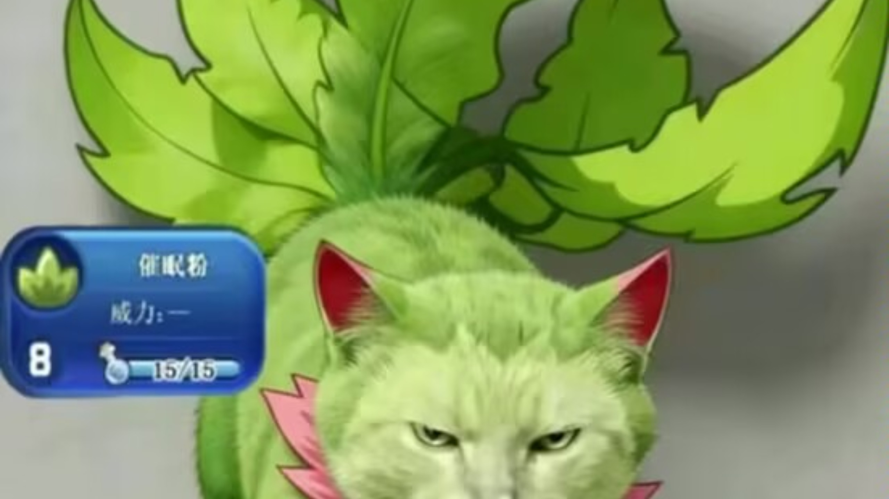 | 4 | 2026-05-02 |
| [咕咕嘎嘎](https://www.bilibili.com/video/BV1YMRLBvEyE) |  | 266 | 2026-05-02 |
| [【夜爬峨眉山】哈基米，日出和🐒](https://www.bilibili.com/video/BV1aWRGBoEHX) | 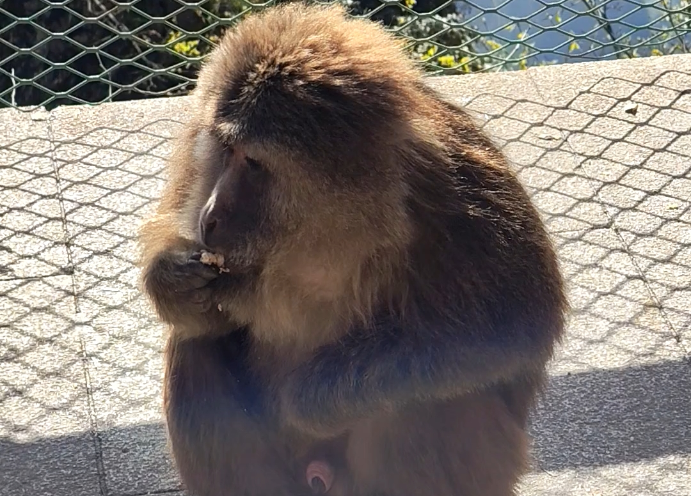 | 101 | 2026-05-01 |
| [恩怨分明的哈基米](https://www.bilibili.com/video/BV1XWRGBoEqc) |  | 25 | 2026-05-01 |
| [发现野生哈基米！](https://www.bilibili.com/video/BV15ERGBcE2A) | 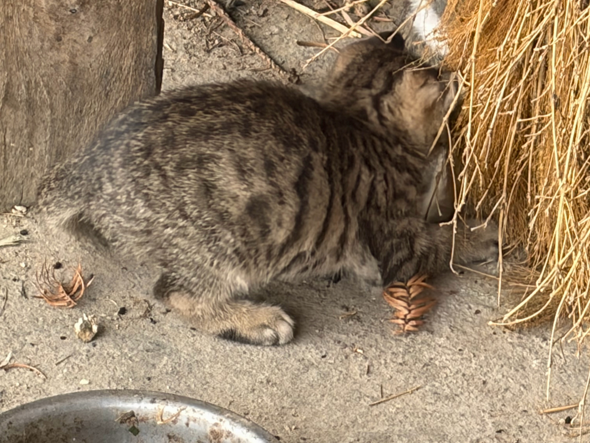 | 67 | 2026-05-01 |
| [哈基米南北绿豆](https://www.bilibili.com/video/BV1ynRVBmE7q) |  | 29 | 2026-05-01 |
| [基米们的依依不舍之情](https://www.bilibili.com/video/BV1ABRgBzEA3) |  | 166 | 2026-05-01 |
| [【4月】哈基米音乐排行榜AI版#19](https://www.bilibili.com/video/BV1KLR3B5Eoz) | 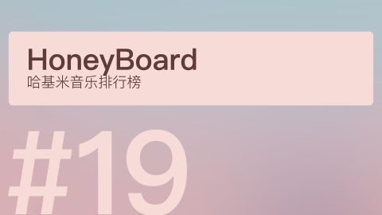 | 1.1万 | 2026-05-01 |
| [哈基米。圣婴](https://www.bilibili.com/video/BV1zxR3BiELa) |  | 304 | 2026-05-01 |
| [39.曼波波波•́ω•̀)¿¿¿ 哈基米之歌来噜(❀｣╹□╹)｣･ 原谱@游标卡尺Mingegg #哈基米南北绿豆 #哈基米之歌 #小提琴](https://www.bilibili.com/video/BV14RR3B2E6h) |  | 1 | 2026-05-01 |
| [钢琴哈基米](https://www.bilibili.com/video/BV1xoR3BLE22) | 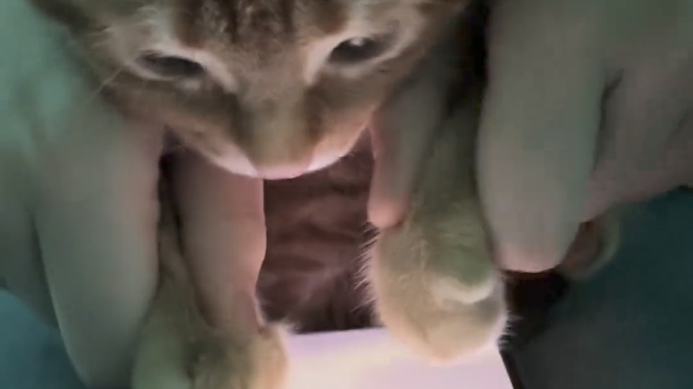 | 1222 | 2026-05-01 |
| [哈基米](https://www.bilibili.com/video/BV1soR3BLE4n) | 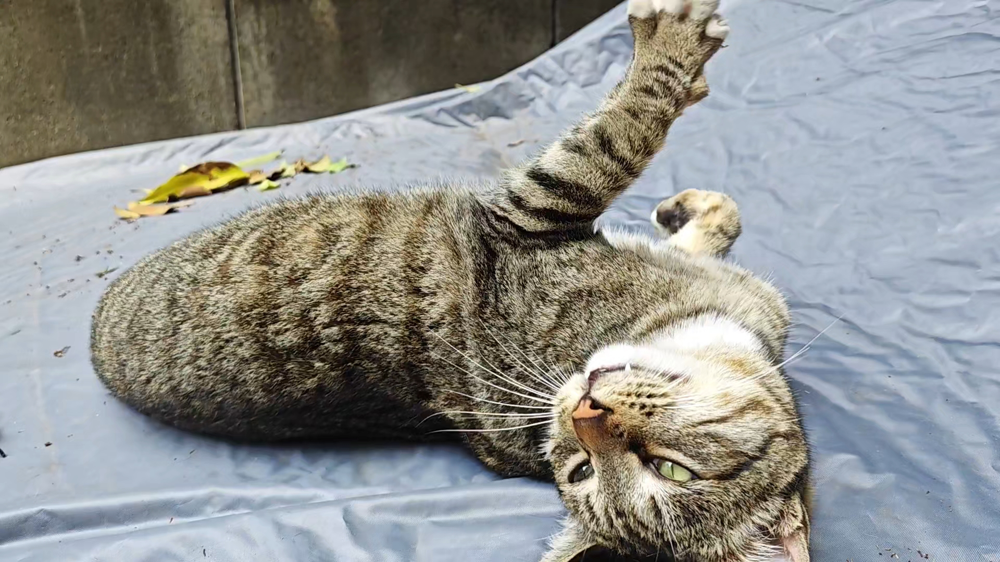 | 10 | 2026-05-01 |
| [【啃鱼干的哈基米】第一支视频求三连！](https://www.bilibili.com/video/BV1kLRuBvEd7) | 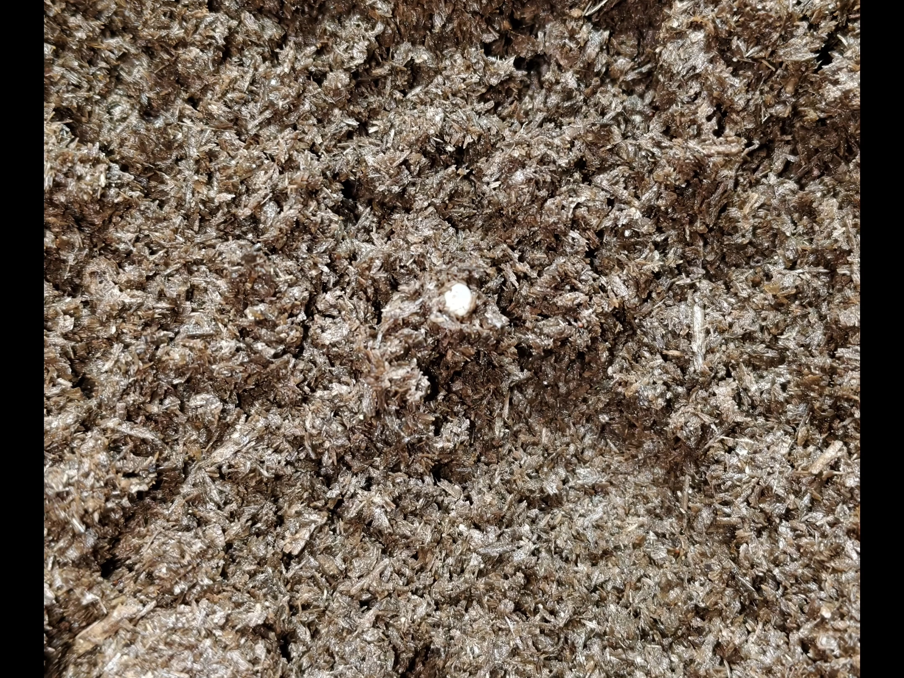 | 14 | 2026-05-01 |
| [舌尖上的哈基米（清唱版](https://www.bilibili.com/video/BV11uRuBzEkS) |  | 22 | 2026-05-01 |
| [哈     基     米     NB     666](https://www.bilibili.com/video/BV1P7RuBNE75) |  | 140 | 2026-05-01 |
| [【春节的哈基米】我的最新作品，快来一睹为快！](https://www.bilibili.com/video/BV1NGRuBBEdo) |  | 4 | 2026-05-01 |
| [人生乱套我睡觉，但是小狗](https://www.bilibili.com/video/BV1DwRuB5EoC) |  | 693 | 2026-05-01 |
| [投喂哈基米](https://www.bilibili.com/video/BV1hBRuBSEZP) | 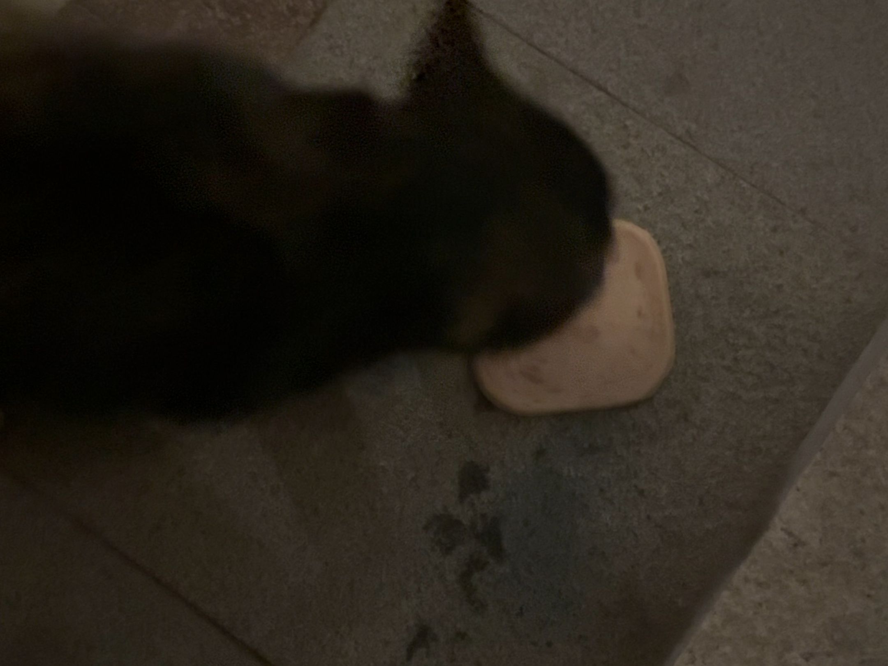 | 83 | 2026-05-01 |
| [哈基米之歌](https://www.bilibili.com/video/BV16WRuBFEwY) |  | 45 | 2026-05-01 |
| [好多哈基米呀～](https://www.bilibili.com/video/BV1wnRuBAEcT) | 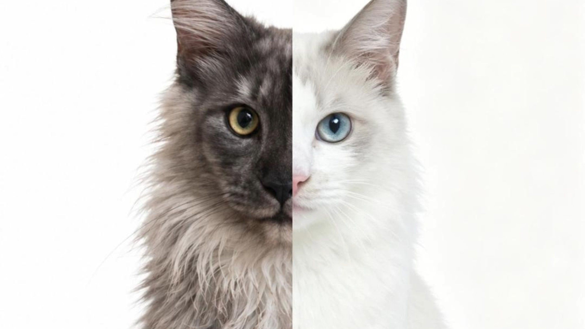 | 10 | 2026-05-01 |
| [人，原来你们的世界这么不容易](https://www.bilibili.com/video/BV1HFRgBvE5A) |  | 697 | 2026-05-01 |
| [wow，哈基米南北绿豆](https://www.bilibili.com/video/BV1HFRgBvELD) |  | 210 | 2026-05-01 |
| [哈基米](https://www.bilibili.com/video/BV1rwRgBPEce) |  | 15 | 2026-05-01 |
| [もうどくちゅうい（猛毒注意）/ 哈基米版](https://www.bilibili.com/video/BV1mmRuBCEYb) |  | 161 | 2026-05-01 |
| [哈基米](https://www.bilibili.com/video/BV1DCRuBjEB5) |  | 39 | 2026-05-01 |
| [乡村夜晚，还有哈基米](https://www.bilibili.com/video/BV1sXRuBgEwL) | 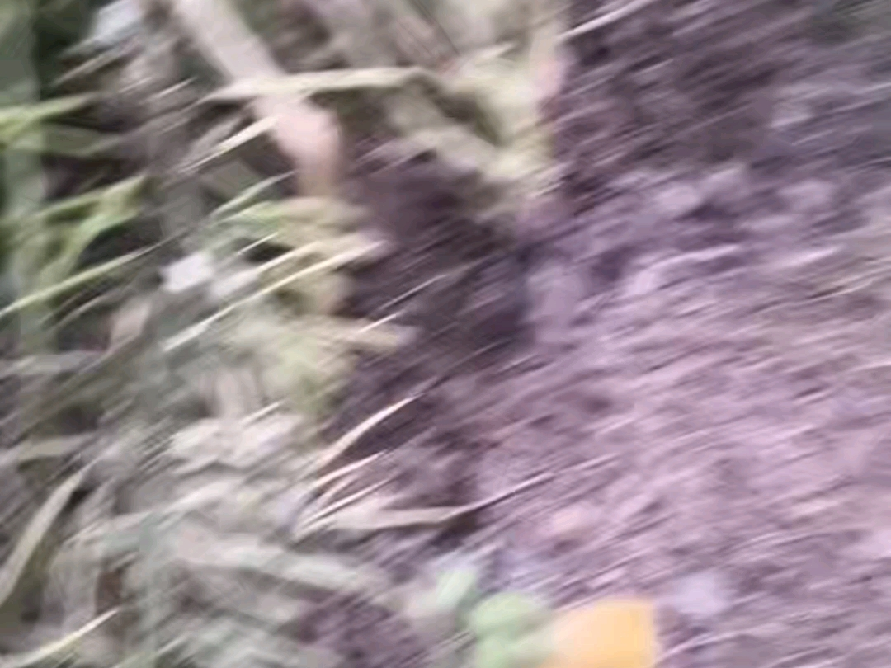 | 56 | 2026-05-01 |
| [咣当不小心咬到了麻麻的手](https://www.bilibili.com/video/BV1xXRuBgEdR) | 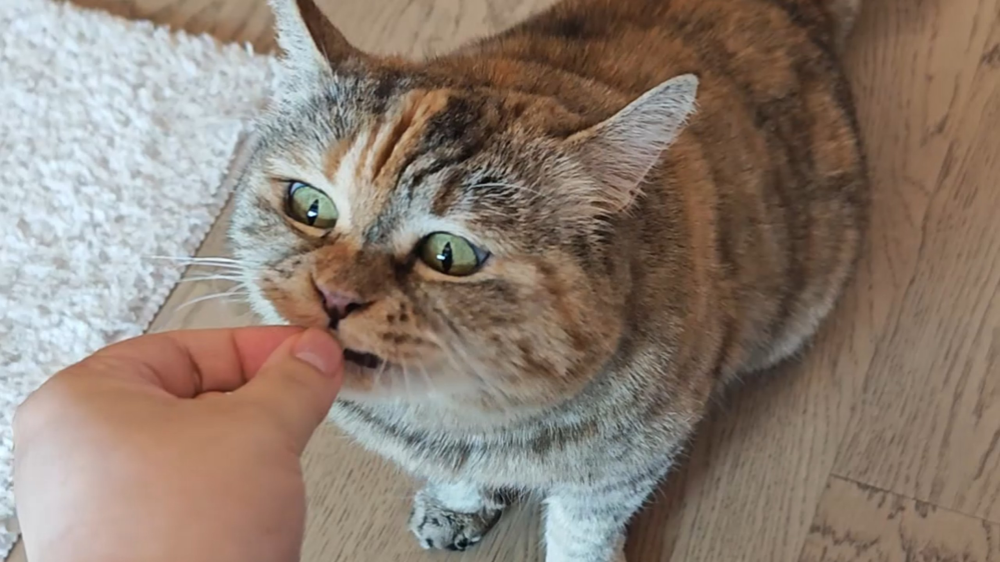 | 6.5万 | 2026-05-01 |
| [萌萌的哈基米](https://www.bilibili.com/video/BV119RuBzE3h) |  | 3 | 2026-05-01 |
| [哈基米大战](https://www.bilibili.com/video/BV14hRgB5E82) | 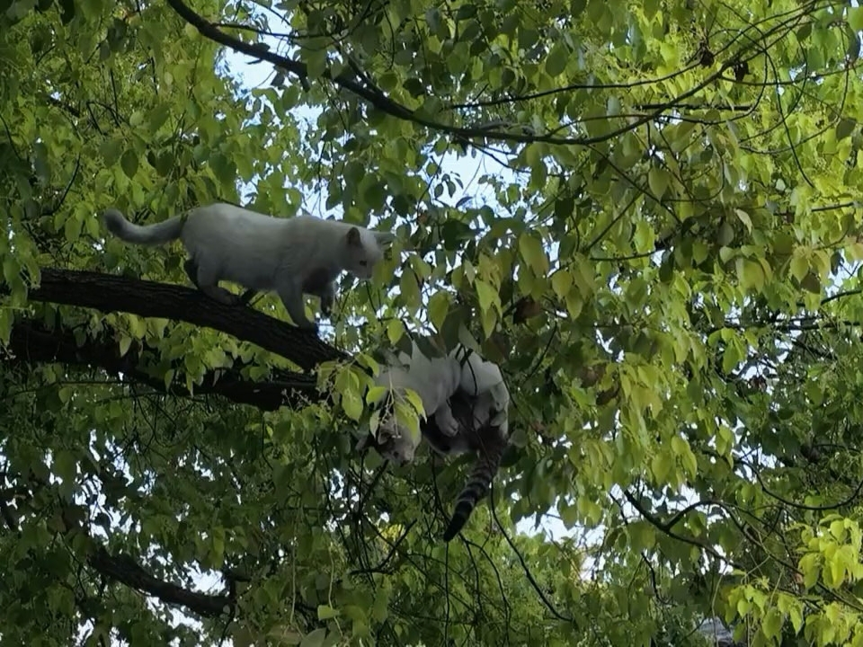 | 536 | 2026-05-01 |
| [⚡️基 米 GO⚡️](https://www.bilibili.com/video/BV17gRgBZEne) | 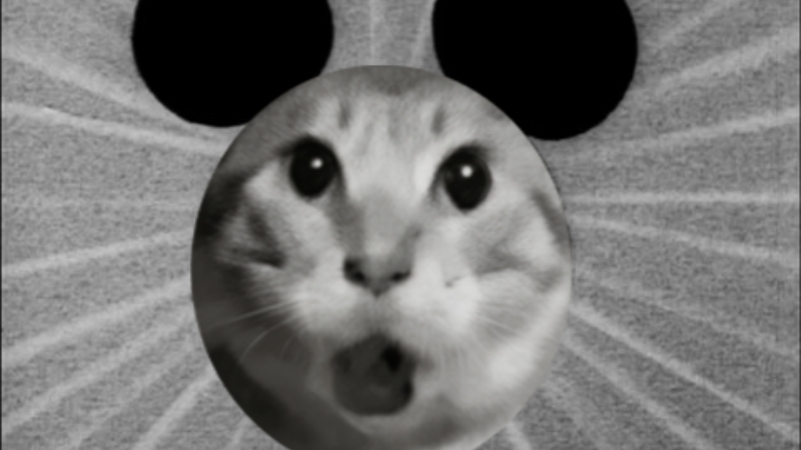 | 356 | 2026-05-01 |
| [爵哈？ 爵士嗓今天挑战哈基米](https://www.bilibili.com/video/BV1Nx9aBNE1V) |  | 493 | 2026-05-01 |
| [哈基米南北绿豆](https://www.bilibili.com/video/BV1jGRgB4Eso) |  | 294 | 2026-05-01 |
| [哈基米 这个假期](https://www.bilibili.com/video/BV1ZMRgBFEnT) | 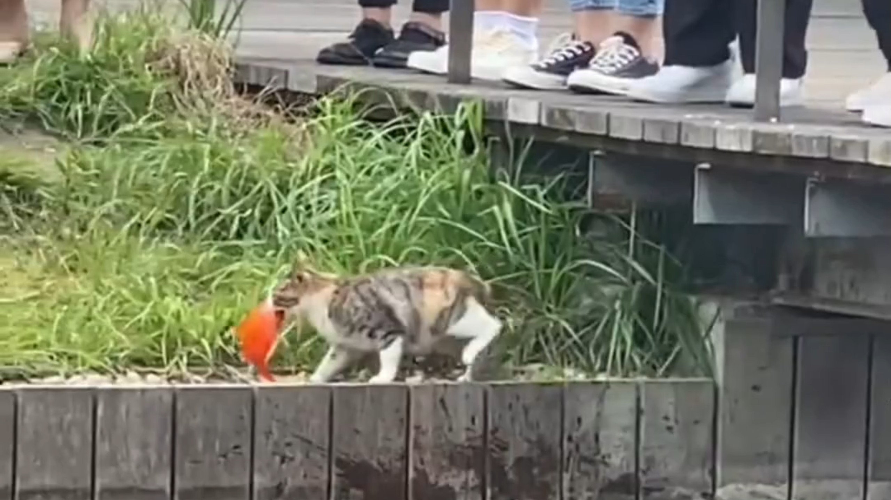 | 1374 | 2026-05-01 |
| [天降哈基米](https://www.bilibili.com/video/BV15jRgB9EnA) | 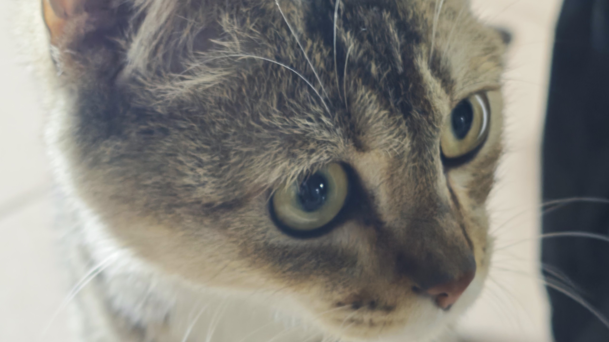 | 132 | 2026-05-01 |
| [看起来不太愿意服役的哈基米](https://www.bilibili.com/video/BV1VERgBpEdT) |  | 3883 | 2026-05-01 |
| [39.曼波波波•́ω•̀)¿¿¿ 哈基米之歌来噜(❀｣╹□╹)｣･ 原谱@游标卡尺Mingegg #哈基米南北绿豆 #哈基米之歌 #小提琴](https://www.bilibili.com/video/BV15VRgBdEy9) |  | 1 | 2026-05-01 |
| [稀有哈基米](https://www.bilibili.com/video/BV1etRTBUEYK) |  | 56 | 2026-05-01 |
| [一条哈基米](https://www.bilibili.com/video/BV1GqRTBCE4r) | 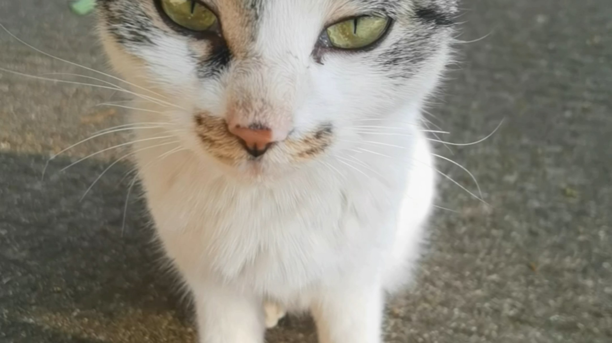 | 139 | 2026-05-01 |
| [哈基米](https://www.bilibili.com/video/BV1zERTBREqo) |  | 5 | 2026-05-01 |
| [[植物大战僵尸哈基米版]](https://www.bilibili.com/video/BV1i4RTBJEKn) |  | 1.2万 | 2026-05-01 |
| [干嘛猫的vlog（五一和小伙伴们出来玩水~比游戏还刺激~）](https://www.bilibili.com/video/BV1RM9eBWE6P) |  | 16.6万 | 2026-05-01 |
| [一只哈基米](https://www.bilibili.com/video/BV1BHRTBXEZt) | 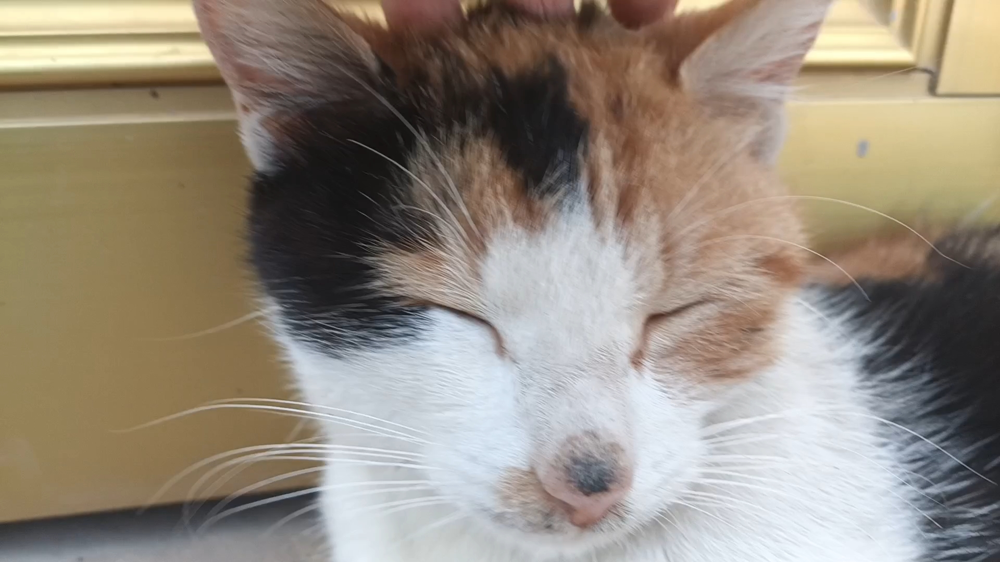 | 91 | 2026-05-01 |
| [哈基米](https://www.bilibili.com/video/BV1uWRMB3EpJ) |  | 153 | 2026-05-01 |
| [基基米](https://www.bilibili.com/video/BV1kX9YBeEEN) | 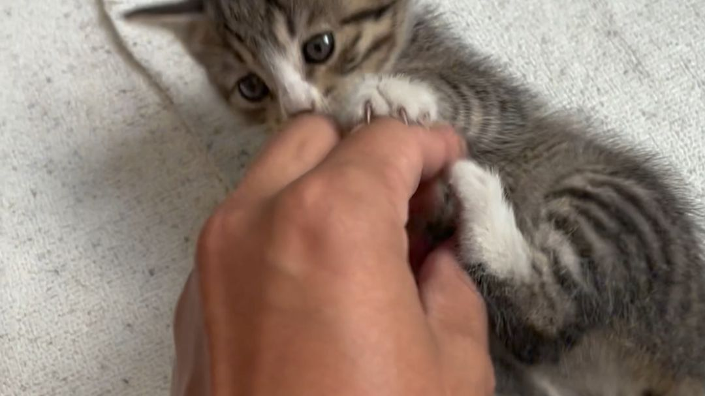 | 3403 | 2026-05-01 |
| [哈基米的全身](https://www.bilibili.com/video/BV1EyRMBoErh) | 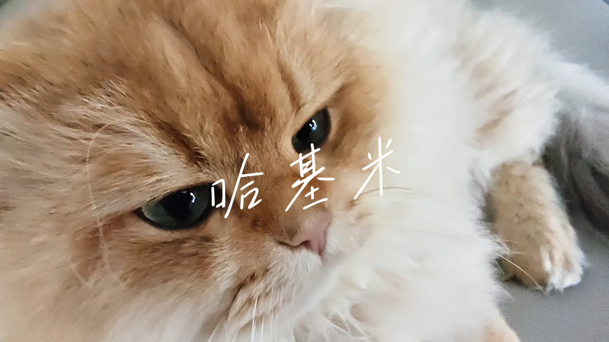 | 101 | 2026-05-01 |
| [完整版 这么可爱真是抱歉（哈基米）＋伴奏](https://www.bilibili.com/video/BV1PYRMBKEds) |  | 44 | 2026-05-01 |
| [哈基米](https://www.bilibili.com/video/BV1AiRMBAEt4) | 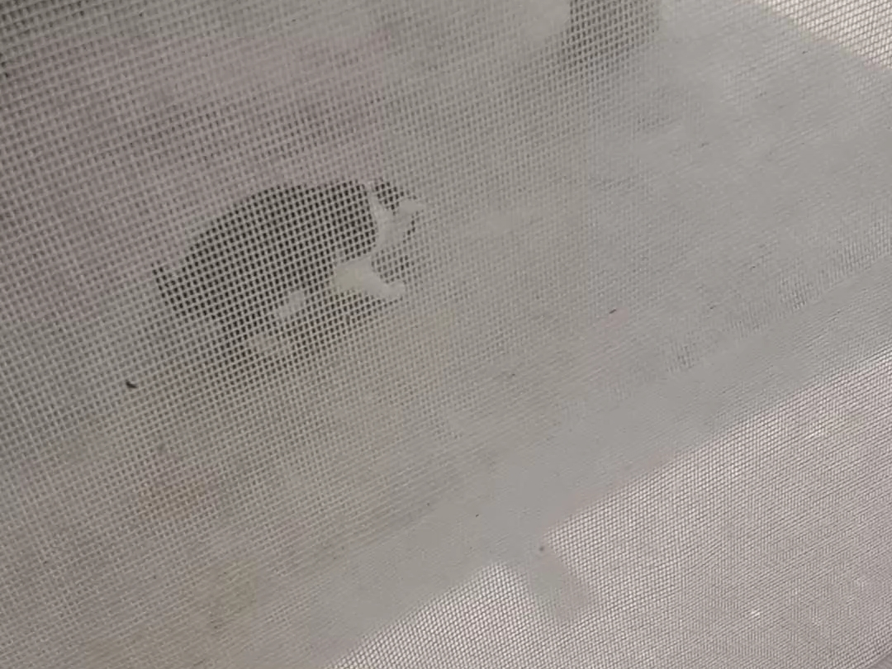 | 96 | 2026-05-01 |
| [【哈基米音乐】但猫咪死一次停一下](https://www.bilibili.com/video/BV1rRRNBpE3L) |  | 92 | 2026-05-01 |
| [哈基米](https://www.bilibili.com/video/BV16dRNBQEUt) |  | 41 | 2026-05-01 |
| [哈基米是哈基米做的](https://www.bilibili.com/video/BV1mrRNBwEgR) | 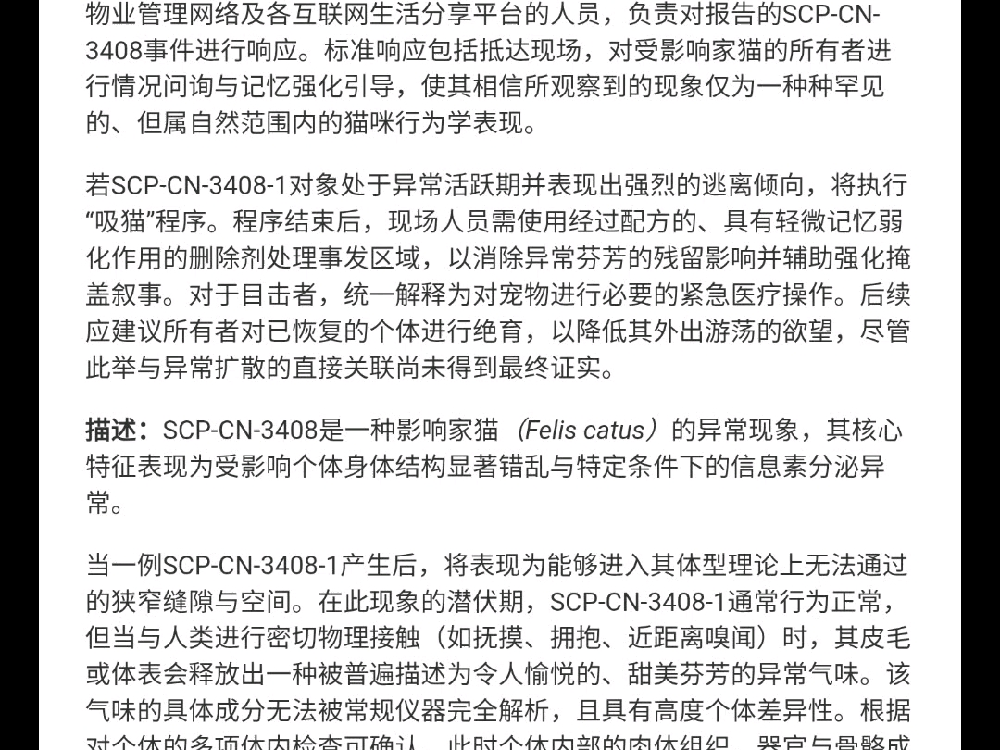 | 126 | 2026-05-01 |
| [误闯天家的哈基米（三）](https://www.bilibili.com/video/BV1bBRNBPE6y) | 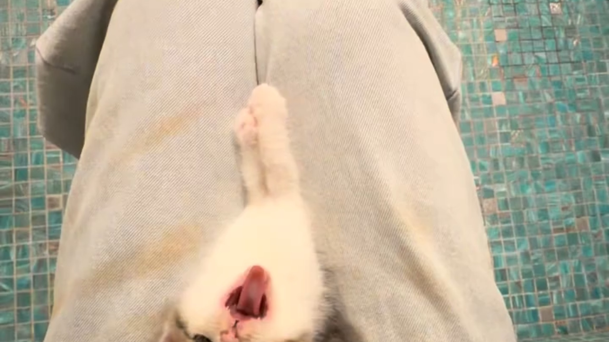 | 53 | 2026-05-01 |
| [大咪：对不起，让姨姨们失望了～](https://www.bilibili.com/video/BV1K1RNB8Eg6) | 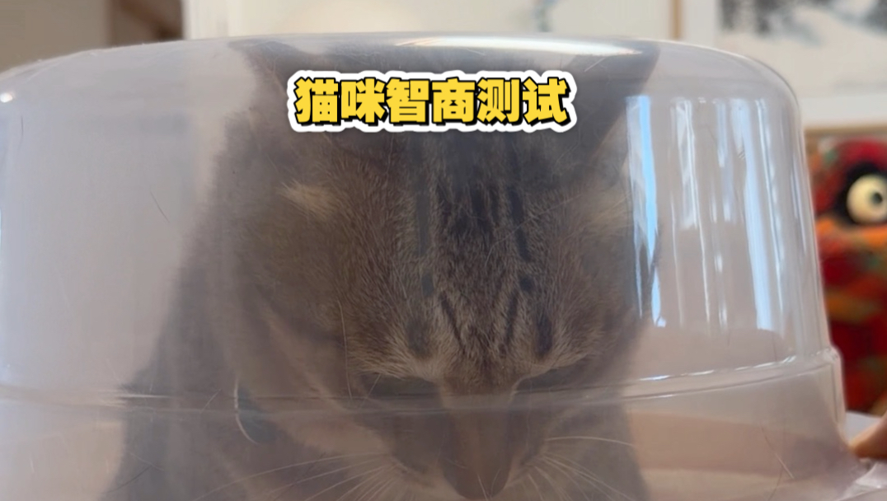 | 4.7万 | 2026-05-01 |
| [【哈基米电音】Running up That Hill  哈基米神人杯DAY1](https://www.bilibili.com/video/BV17PRKBjELk) | 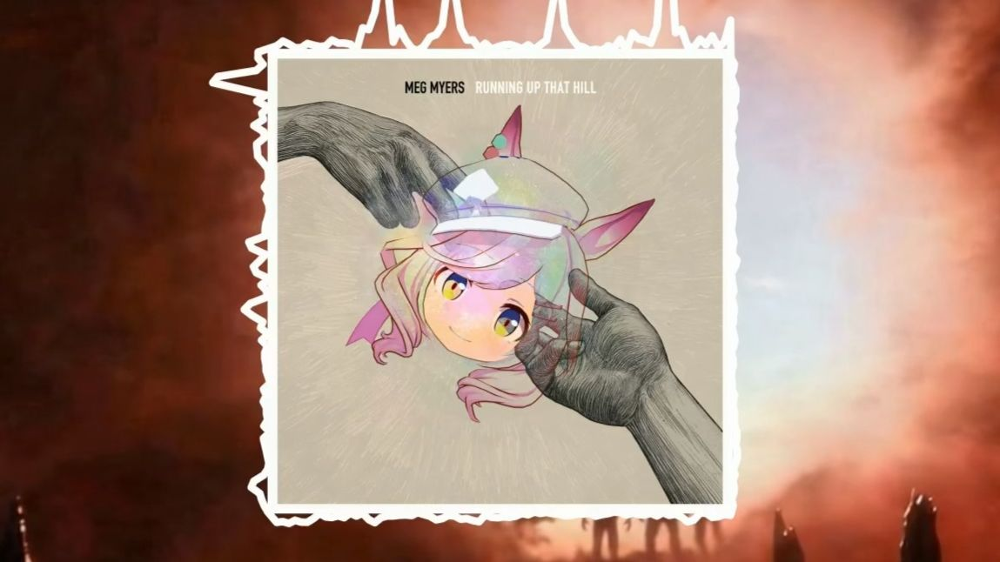 | 1359 | 2026-05-01 |
| [哈基米：Pixel Pig 【神人杯day1】](https://www.bilibili.com/video/BV11G9qB7EJD) |  | 2820 | 2026-05-01 |
| [【哈基米 • 神人杯Day1】🐱𝐁𝐈𝐁𝐁𝐈𝐃𝐈𝐁𝐀🐱](https://www.bilibili.com/video/BV1659YB8Ezm) |  | 2563 | 2026-05-01 |
| [猫儿这个超强形态](https://www.bilibili.com/video/BV13VRKBgEnk) | 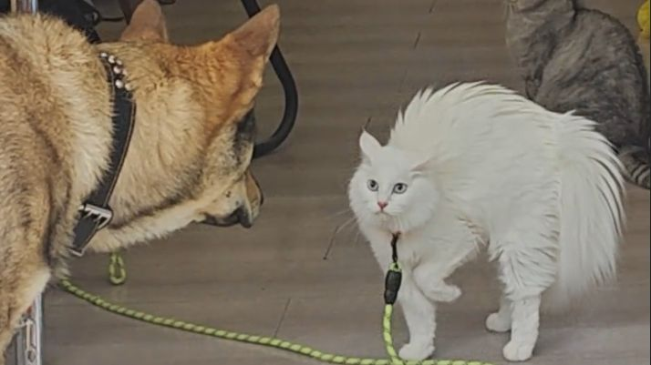 | 1.3万 | 2026-05-01 |
| [布鲁斯胖揍哈基米](https://www.bilibili.com/video/BV13VRKBgEib) | 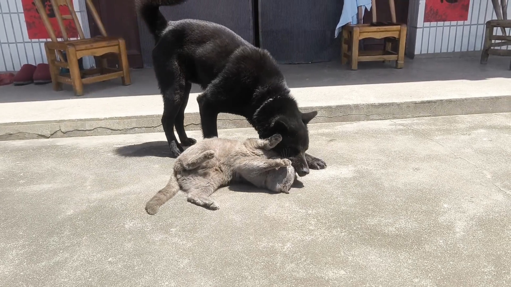 | 177 | 2026-05-01 |
| [我们必须想象哈基米是幸福的](https://www.bilibili.com/video/BV15gRKBGE5E) | 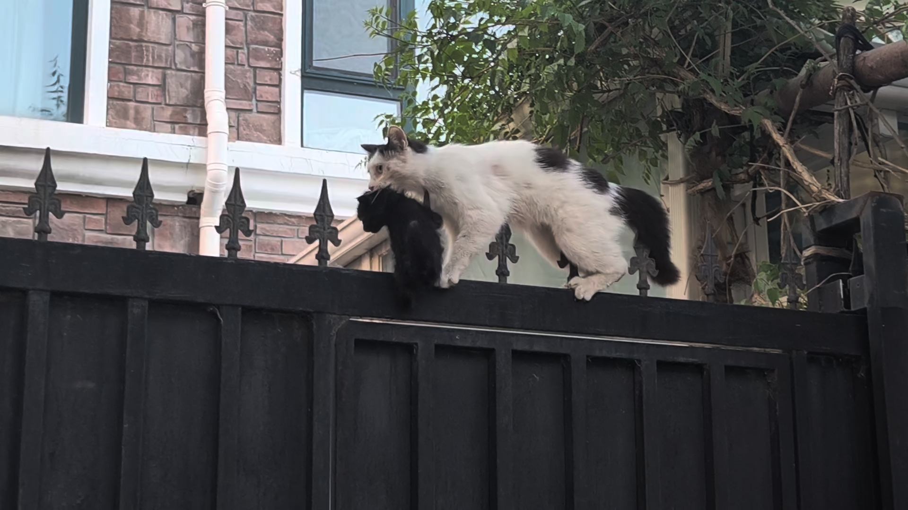 | 1.8万 | 2026-05-01 |
| [&quot;耄耋可敢担太守之责?&quot;](https://www.bilibili.com/video/BV1XQRKBVEpe) |  | 2.0万 | 2026-05-01 |
| [哈基米奇妙代码](https://www.bilibili.com/video/BV1ybRKBFE4j) |  | 1087 | 2026-05-01 |
| [可爱哈基米（求破1万播放）](https://www.bilibili.com/video/BV1kYRKB4E6b) | 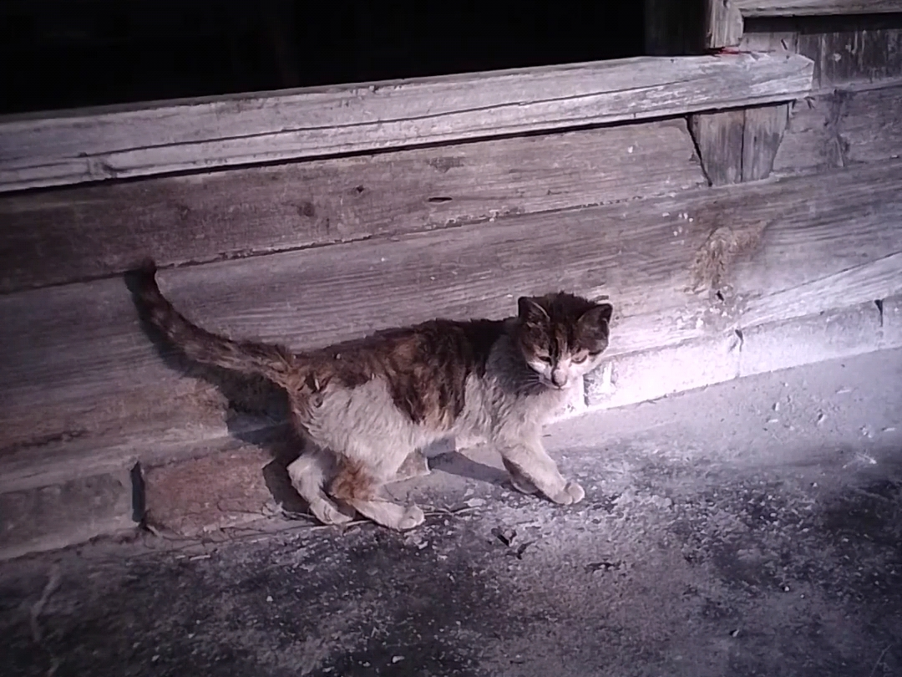 | 1014 | 2026-05-01 |
| [哥布林大厨在哪，孩子们回来吃饭了](https://www.bilibili.com/video/BV1PVRTBFETr) |  | 13.4万 | 2026-05-01 |
| [日推歌单｜哈基米曼波《弥渡山歌Phonk(哈基米版)》哈基米啊南北绿豆！](https://www.bilibili.com/video/BV1AW98BoEv1) |  | 1046 | 2026-05-01 |
| [哈基米家庭的小乌梅3 0洗衣机购后分享，求赞](https://www.bilibili.com/video/BV17u9BBuE9e) | 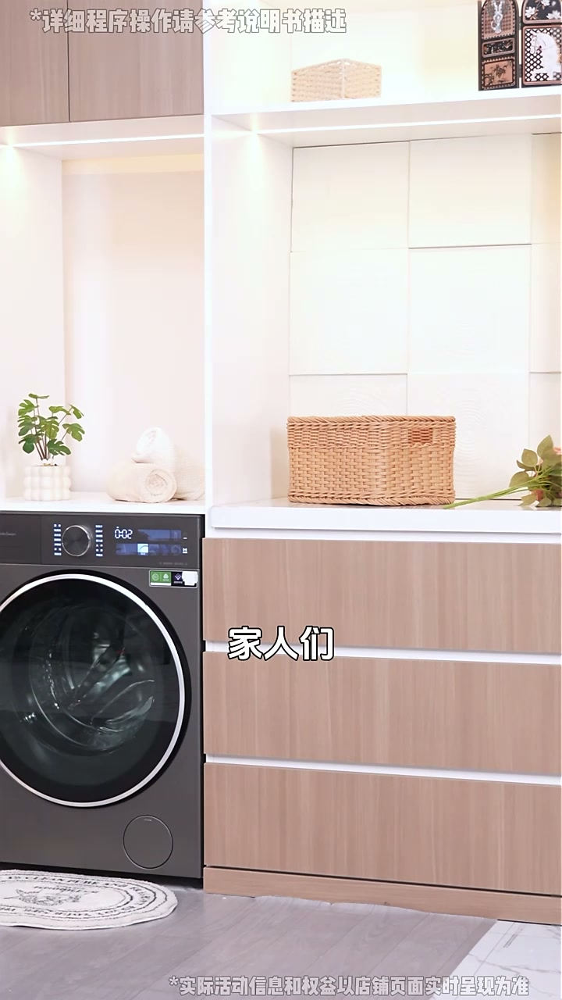 | 0 | 2026-04-30 |
| [“劝基更哈一口气，西出阳关无基米”](https://www.bilibili.com/video/BV1kR9YBAEvW) |  | 138 | 2026-04-30 |
| [基米选择被大狗爱](https://www.bilibili.com/video/BV1h79eB7EyZ) | 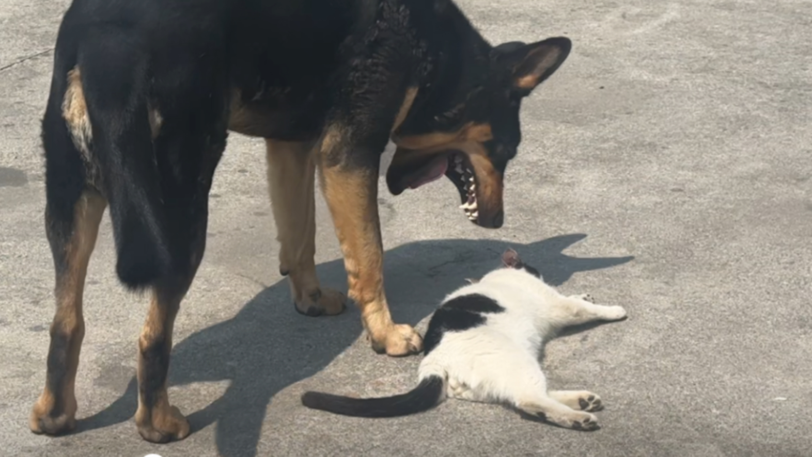 | 15.9万 | 2026-04-30 |
| [哈基米日记之《250.520》](https://www.bilibili.com/video/BV1Ew9eBtEEb) |  | 162 | 2026-04-30 |
| [辞基米回忆qwq](https://www.bilibili.com/video/BV1XX9eBpEf9) |  | 1517 | 2026-04-30 |
| [网络上的哈基米VS足球的哈基米](https://www.bilibili.com/video/BV1ZZ9hBpEip) |  | 171 | 2026-04-30 |
| [哈基米南北绿豆](https://www.bilibili.com/video/BV1Fi9aB4ECM) | 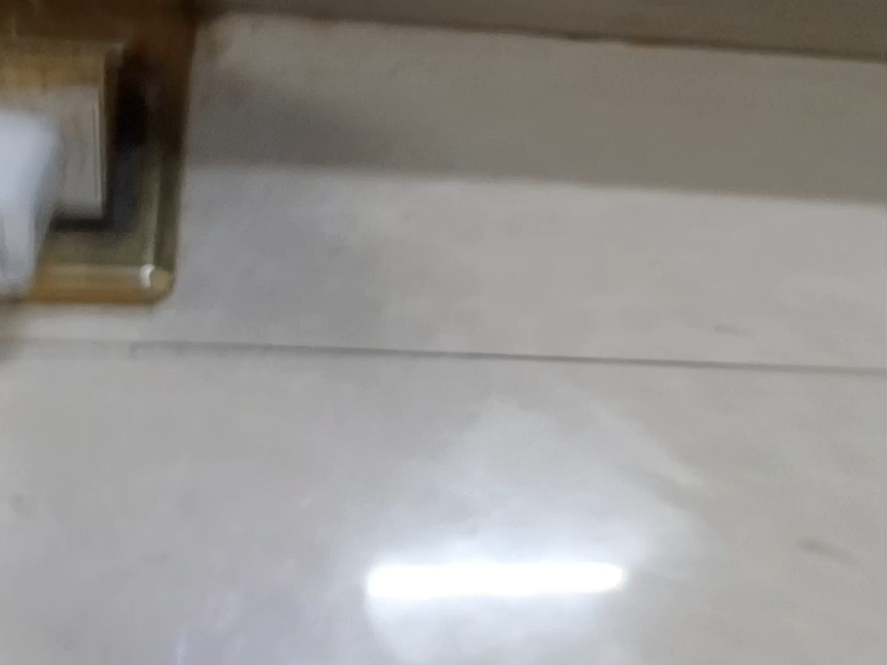 | 134 | 2026-04-30 |
| [我的猫在医院哈气了](https://www.bilibili.com/video/BV1PA9QBDEkd) |  | 34.3万 | 2026-04-30 |
| [😿忧郁哈基米：Novocaine😿](https://www.bilibili.com/video/BV1UZ9aB3EyN) |  | 1367 | 2026-04-30 |
| [基米被大狗嚼嚼欺负了？基米在干啥（一）](https://www.bilibili.com/video/BV15U9aBEEkM) | 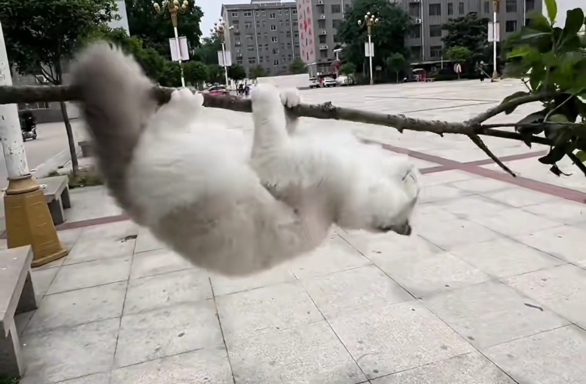 | 3769 | 2026-04-30 |
| [耄耋的游乐园vlog #哈基米 #可爱 #治愈 #耄耋](https://www.bilibili.com/video/BV1d19aBJEaV) | 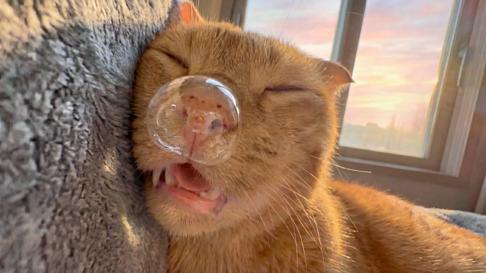 | 2304 | 2026-04-30 |
| [【基米FM】基米感应🐱「心灵感应/テレパシ」](https://www.bilibili.com/video/BV1U998BKEjj) |  | 1.1万 | 2026-04-30 |
| [我的b站账号被老师发现了？？？](https://www.bilibili.com/video/BV1Z79hBSEru) |  | 596 | 2026-04-30 |
| [【基卡贝拉】心愿便利贴🎵](https://www.bilibili.com/video/BV1mX9xBHEwG) |  | 9928 | 2026-04-30 |
| [神人撸猫法再次发力](https://www.bilibili.com/video/BV1WY9sBLEoz) | 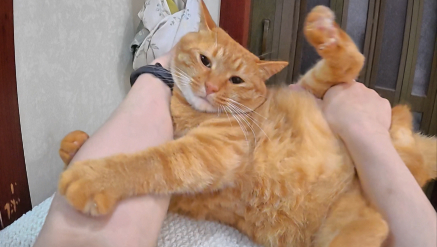 | 7.2万 | 2026-04-30 |
| [关中来了一个哈气王](https://www.bilibili.com/video/BV1DS9tBcEGX) |  | 1266 | 2026-04-30 |
| [我方得到哈基米支援](https://www.bilibili.com/video/BV1pH9tBnES4) |  | 3.4万 | 2026-04-29 |
| [『NO BATIDAO』哈基米版](https://www.bilibili.com/video/BV16H92BAEUB) |  | 238 | 2026-04-29 |
| [哈基米皮肤真的下架了吗？](https://www.bilibili.com/video/BV1Ao92BuEBi) |  | 1.5万 | 2026-04-29 |
| [这是哪个人才算出的答案？](https://www.bilibili.com/video/BV1hW9mBDEPF) |  | 131.1万 | 2026-04-29 |
| [牛牛也要哈基咪~](https://www.bilibili.com/video/BV1kM9kBxEHb) |  | 2.4万 | 2026-04-28 |
| [补档](https://www.bilibili.com/video/BV1radHBKE2p) |  | 10.0万 | 2026-04-28 |
| [哈基米偷吃鸭仔被逮住了，想潜水艇了](https://www.bilibili.com/video/BV15wZFBNEDp) | 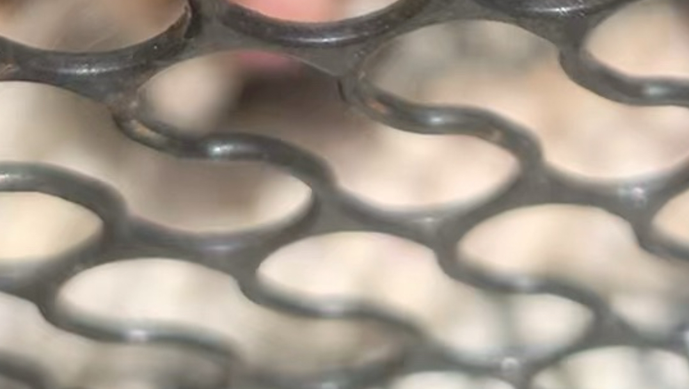 | 1072 | 2026-04-26 |
| [小马合唱团《精卫》一小时循环版](https://www.bilibili.com/video/BV1QZoXBkE5L) |  | 12.6万 | 2026-04-25 |
| [哈基米的飞升者行动](https://www.bilibili.com/video/BV1JwoRBfEMq) |  | 11.6万 | 2026-04-25 |
| [哈基汪17分钟合集，一次看个够！（补）](https://www.bilibili.com/video/BV1MHoEBgEaZ) |  | 6.2万 | 2026-04-24 |
| [《唐嘉琦の小曲》《荒野大嫖客の小曲》——《MONTAGEM ALQUIMIA》](https://www.bilibili.com/video/BV1xKXBB7E9a) |  | 179.3万 | 2026-03-31 |
| [加点滋味高钙捏捏松饼粉哈基米南北绿豆松饼粉铜锣烧华夫饼快手早餐预拌粉 原味松饼粉*5+绿豆松饼粉*4（赠雪平锅）](https://www.bilibili.com/video/BV1oCfkBFEpm) | 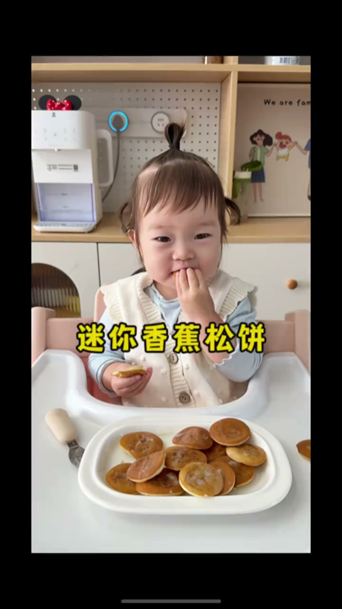 | 0 | 2026-02-23 |
| [难怪路上那么多猫饼](https://www.bilibili.com/video/BV1msMiznEm8) | 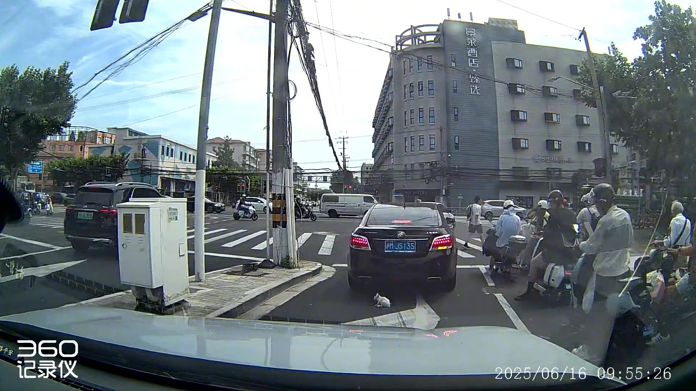 | 30.4万 | 2025-06-16 |

---
*最后更新: 2026-05-02 03:18:05 (自动生成)*
*数据来源: [Bilibili](https://www.bilibili.com)*

## 使用说明

运行以下命令更新视频列表:
```bash
python3 fetch_hajimi_videos.py
```
