# awesome-hajimi
collections of hajimi (哈基米 in Chinese) on the Internet.

## 视频列表 (Video List)

| 视频标题 (Title) | 封面 | 播放量 (Views) | 发布日期 (Date) |
|---|---|---|---|
| [【哈基米】🐱浪人基琶（DJ爆爽版）🐱](https://www.bilibili.com/video/BV13kja6QEXS) |  | 418 | 2026-06-19 |
| [【峡谷有嘻哈】英雄联盟哈基米](https://www.bilibili.com/video/BV1RQjh6dEYY) |  | 1513 | 2026-06-18 |
| [哈基米这个秒开老吴模式](https://www.bilibili.com/video/BV1sgja6CEUC) | 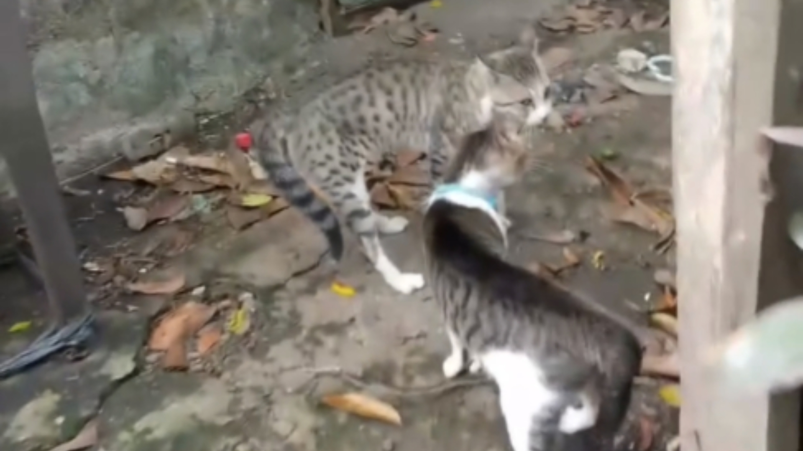 | 1544 | 2026-06-18 |
| [哈基米这个奶油乱飞（废稿分享）](https://www.bilibili.com/video/BV1xGja6GEXL) | 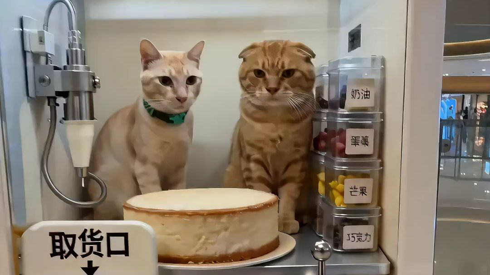 | 671 | 2026-06-18 |
| [赛飞儿❤️哈基米基米基 阿西嘎嘎阿西 曼波曼波曼曼波 叮叮咚咚叮 叮叮咚咚…💕 赛飞儿美图精选【崩坏：星穹铁道】每日美图分享 第一千一百零八期](https://www.bilibili.com/video/BV1Mmja6EEg7) |  | 4604 | 2026-06-18 |
| [公园里的哈基米](https://www.bilibili.com/video/BV1Poja6GErv) | 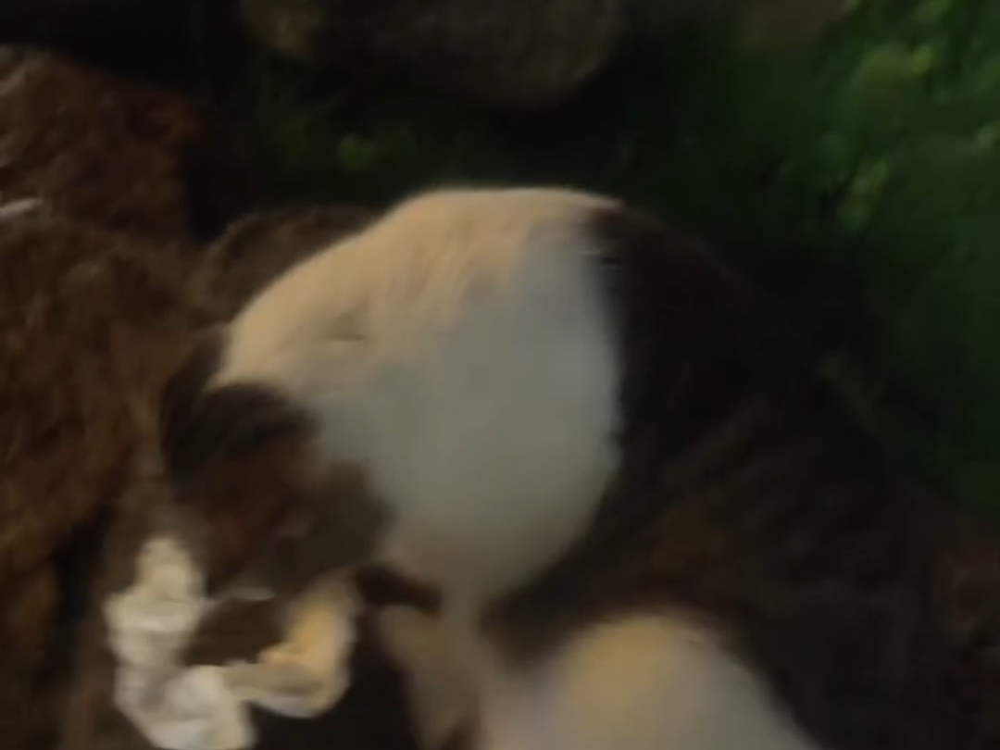 | 45 | 2026-06-18 |
| [【真的啊】哈基米这个发牌谁能绷得住](https://www.bilibili.com/video/BV1K9ja65Eq2) | 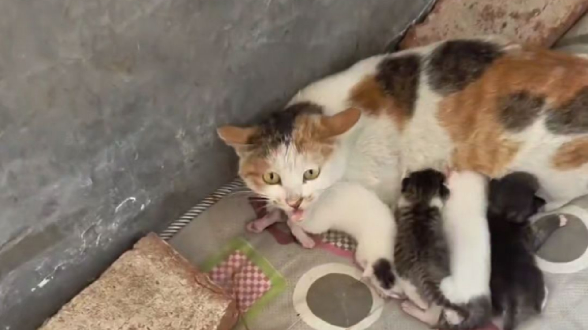 | 4860 | 2026-06-18 |
| [哈基米世界杯](https://www.bilibili.com/video/BV13Ujw6KEHz) |  | 2292 | 2026-06-18 |
| [我感觉现在可以一拳打爆一只哈基米](https://www.bilibili.com/video/BV1uSjw6vE9M) |  | 51 | 2026-06-18 |
| [继哈基米届第一声曼波出现后，世界杯迎来了第一只哈基米！](https://www.bilibili.com/video/BV1V1jw6MEV2) |  | 1282 | 2026-06-18 |
| [哈基米dancer](https://www.bilibili.com/video/BV1uRjw6wEjA) |  | 1.4万 | 2026-06-18 |
| [用后腿解决底层代码冲突的哈基米](https://www.bilibili.com/video/BV1oEjA6yEYW) | 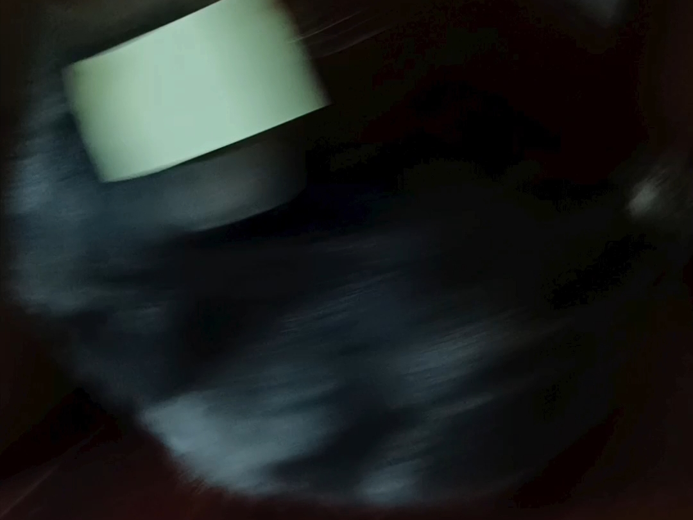 | 650 | 2026-06-18 |
| [人，端午除了吃粽子还要想我们哦～](https://www.bilibili.com/video/BV15HjA6CETF) | 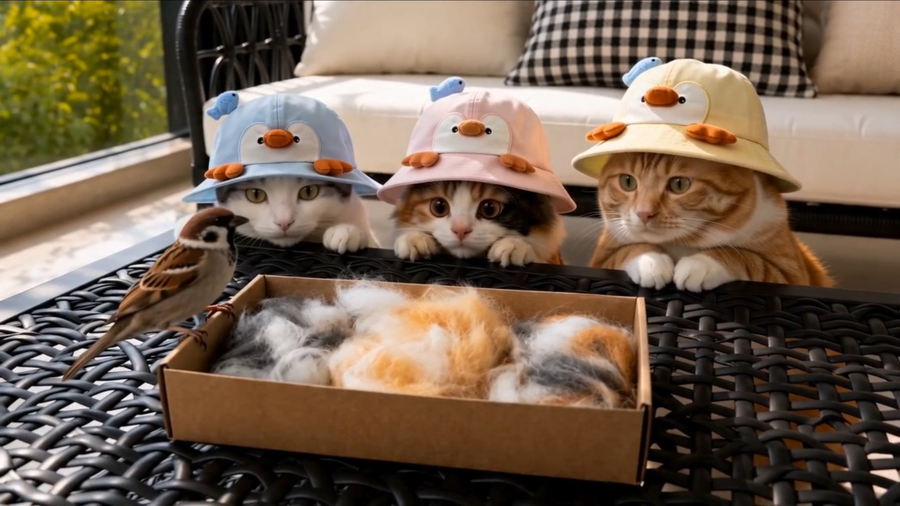 | 4628 | 2026-06-18 |
| [这么可爱的哈基米，当然要两个(˵¯͒〰¯͒˵)！](https://www.bilibili.com/video/BV1AZjF6HEoe) |  | 1889 | 2026-06-18 |
| [哈基米我难被掠夺~](https://www.bilibili.com/video/BV1DhjA6iEBA) |  | 2140 | 2026-06-18 |
| [大黑塔也要哈基米](https://www.bilibili.com/video/BV1h8jA6MEo7) |  | 3693 | 2026-06-18 |
| [哈基米乱跑被铁链困住了脖子](https://www.bilibili.com/video/BV1oFjP62EpK) | 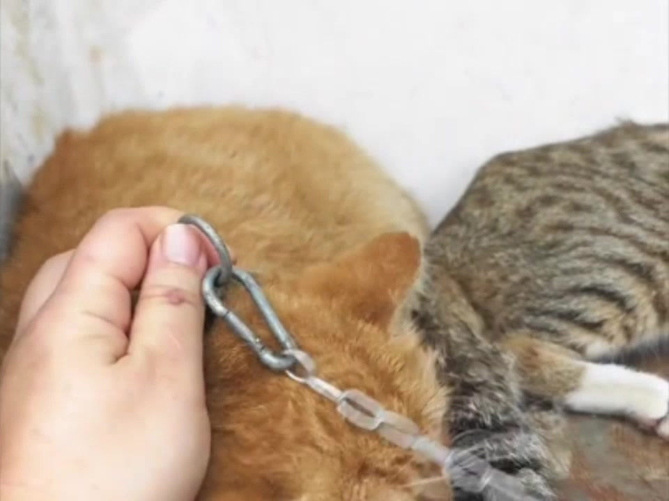 | 1793 | 2026-06-18 |
| [哈基米的日常生活1](https://www.bilibili.com/video/BV1LNjP65EF1) | 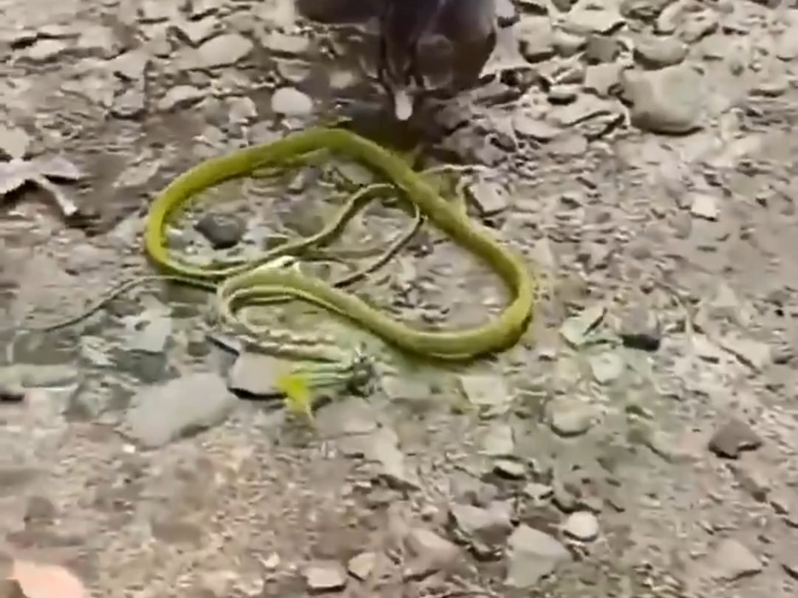 | 458 | 2026-06-18 |
| [葵花基：通过哈气生产阳光！](https://www.bilibili.com/video/BV1kmjA6REn3) |  | 1621 | 2026-06-18 |
| [哈基米世界杯正火热进行中！快来观赛（假如哈基米跟驴pk会发生···什么呢？！](https://www.bilibili.com/video/BV12djF6XEMS) | 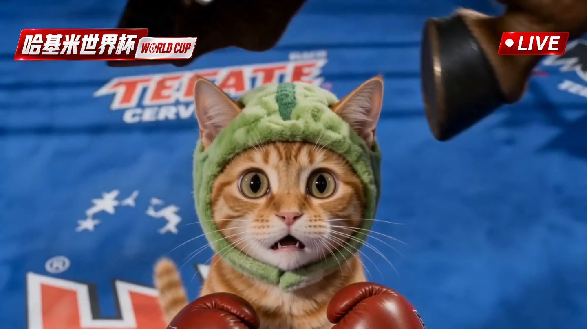 | 987 | 2026-06-18 |
| [“哥，这问题太严重了！咱妈不会流落街头吧？”“别瞎说！”](https://www.bilibili.com/video/BV1XWjc6YEg5) |  | 8900 | 2026-06-18 |
| [循环歌单｜《moshi moshi》此版本 哈基米版 【打完三角洲来上这么一曲真是惬意】](https://www.bilibili.com/video/BV17Xjc6yE7W) |  | 822 | 2026-06-18 |
| [【干嘛猫vlog】咪被粽子刺客了！](https://www.bilibili.com/video/BV1FxjF65EpQ) |  | 1582 | 2026-06-18 |
| [小陈的往事只能哈基](https://www.bilibili.com/video/BV1NdjF6XENh) |  | 3097 | 2026-06-18 |
| [零姐也要哈基米~](https://www.bilibili.com/video/BV1KsLR6zECk) |  | 7382 | 2026-06-18 |
| [哈 基 米](https://www.bilibili.com/video/BV11ijc6sEai) |  | 822 | 2026-06-18 |
| [【哈基米一直绕着人转圈圈】在成都便利店碰到一个一直围着我转的哈基米，一边弓着背一直贴着走，有没有养猫的，懂猫语的，来说一下是什么意思](https://www.bilibili.com/video/BV1yzjc6pEM2) | 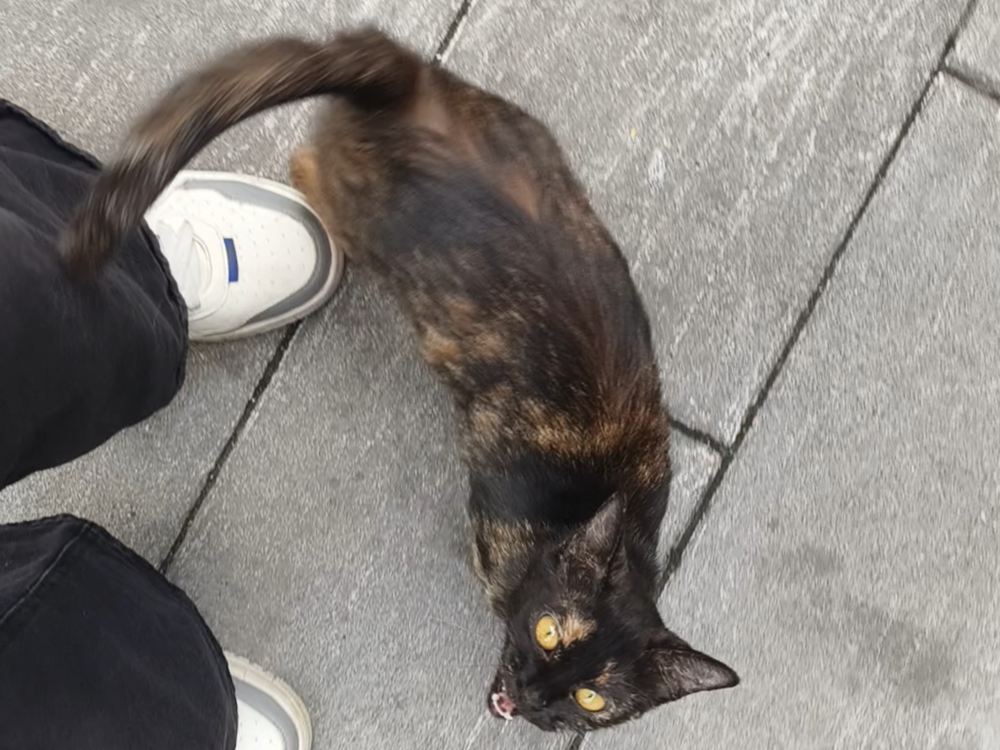 | 1015 | 2026-06-18 |
| [双轴互转，彻底失衡！艮基米鲜花锁缚魔王护，肿头龙封锁不削必亡](https://www.bilibili.com/video/BV1gxjc6AEE8) |  | 1107 | 2026-06-18 |
| [哈基米？？？](https://www.bilibili.com/video/BV19cjw6MErs) | 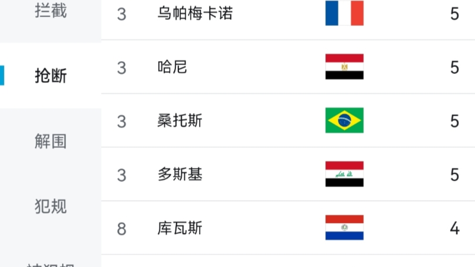 | 864 | 2026-06-18 |
| [哈基米开自动跟随了](https://www.bilibili.com/video/BV1iRjc6GEYo) |  | 1067 | 2026-06-18 |
| [哈基米这个渴望食物](https://www.bilibili.com/video/BV1BSjc61Emc) | 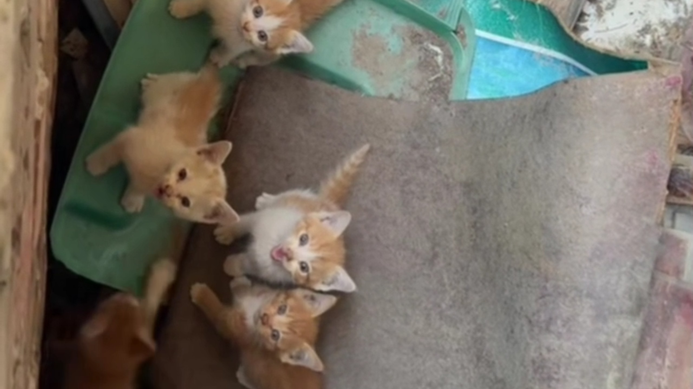 | 1269 | 2026-06-18 |
| [哈基米这个圆头](https://www.bilibili.com/video/BV1fSjc61ECg) | 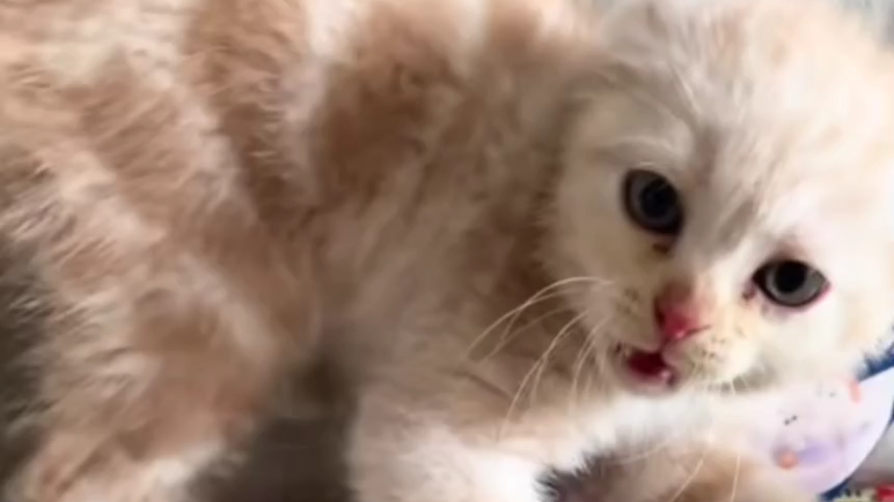 | 794 | 2026-06-18 |
| [哈基米成功阻止小哈基米钻入车底](https://www.bilibili.com/video/BV1BSjc61Exn) | 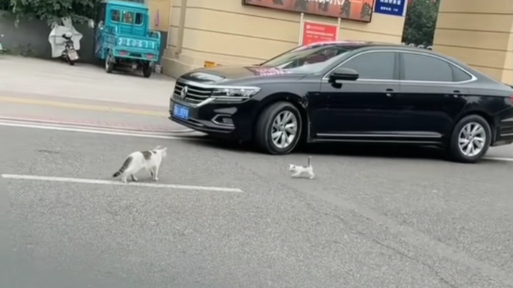 | 6027 | 2026-06-18 |
| [哈基米依旧文斗](https://www.bilibili.com/video/BV1qQjc65E6k) | 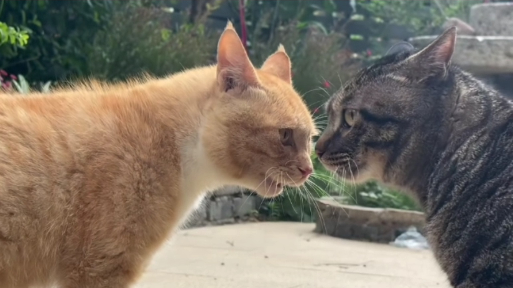 | 330 | 2026-06-18 |
| [哈基米这个身法猫](https://www.bilibili.com/video/BV1fQjc65Eco) | 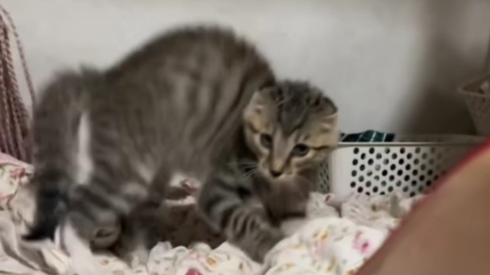 | 781 | 2026-06-18 |
| [哈基米正在寻找食物](https://www.bilibili.com/video/BV1HWjw6pE9y) | 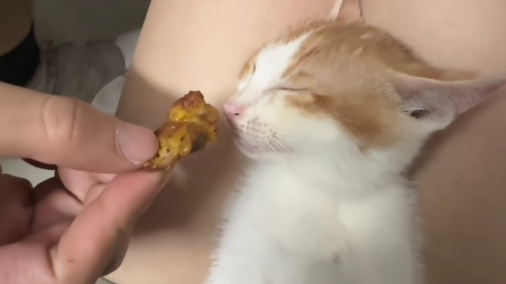 | 1265 | 2026-06-18 |
| [哈基米这个霸道](https://www.bilibili.com/video/BV1nsjw6QEmA) | 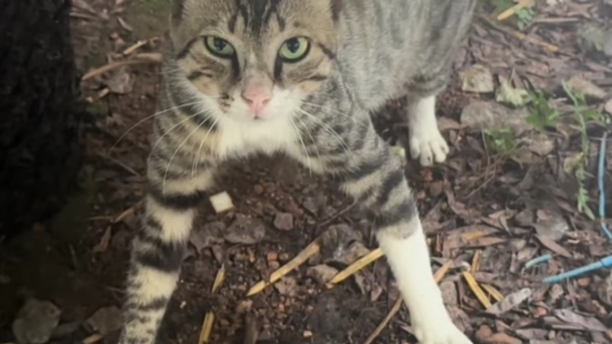 | 2143 | 2026-06-18 |
| [猫儿这个拖家带口](https://www.bilibili.com/video/BV1nhjw6mEcc) | 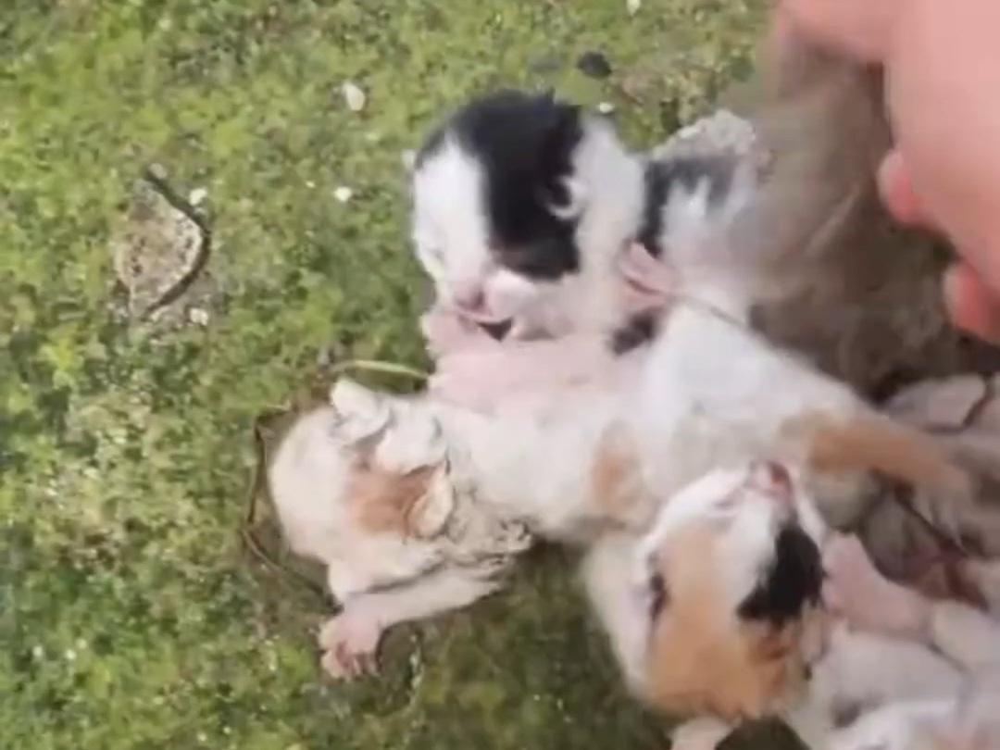 | 1845 | 2026-06-18 |
| [赛飞儿喵喵哈基米【bilibilionly】](https://www.bilibili.com/video/BV1b3jw6hEoM) |  | 4800 | 2026-06-18 |
| [耄耋TV之我推的基米](https://www.bilibili.com/video/BV1MxLf6sErN) | 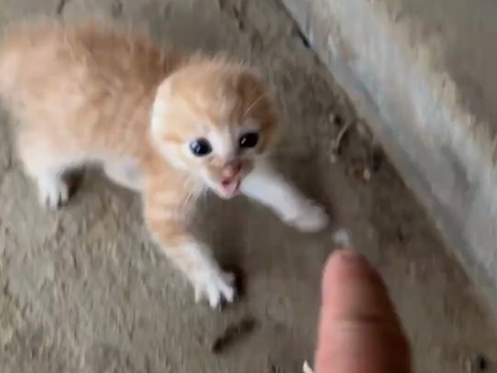 | 2491 | 2026-06-18 |
| [哈基米晚自习日常](https://www.bilibili.com/video/BV18xLf6sEPn) | 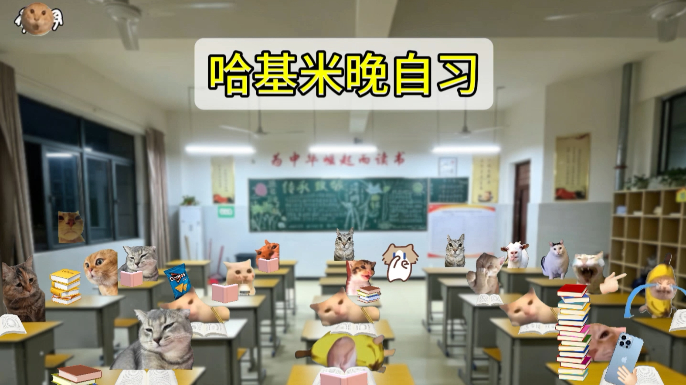 | 555 | 2026-06-18 |
| [我去居然被探测出来了](https://www.bilibili.com/video/BV1DpLf6xEwG) | 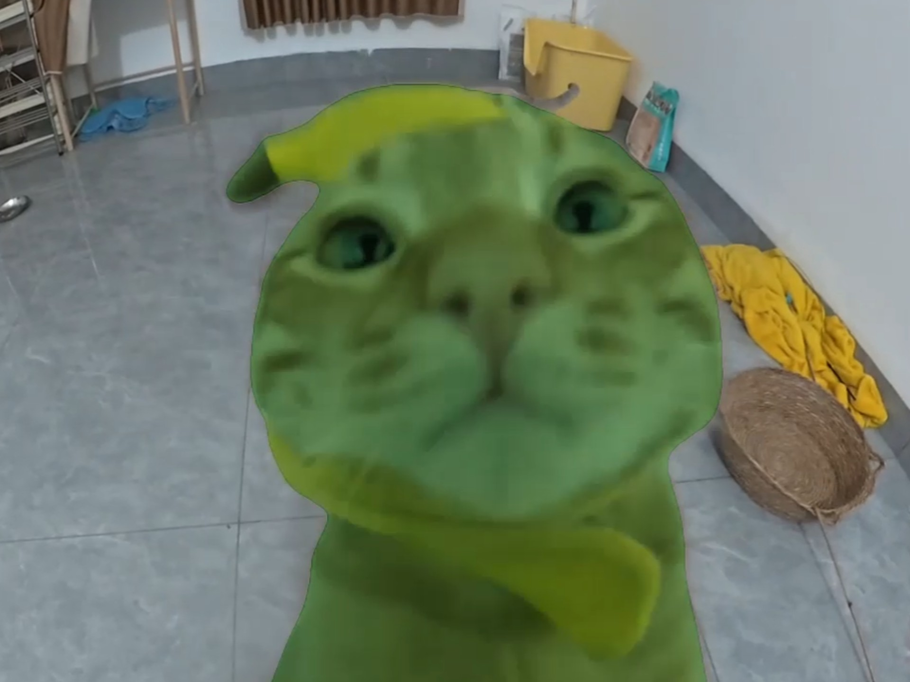 | 3.8万 | 2026-06-18 |
| [这次不是我发疯,是它先动的手。](https://www.bilibili.com/video/BV1v9Lf6NEaM) |  | 1.5万 | 2026-06-18 |
| [【哈基米音乐】⚡️躲在超市后门哈气的二人⚡️](https://www.bilibili.com/video/BV1kGLd6iEa3) |  | 4586 | 2026-06-18 |
| [小夏也要哈基米南北绿豆](https://www.bilibili.com/video/BV161Lf66EjB) |  | 363 | 2026-06-18 |
| [前有靠神颜出圈的哈兰德，后有靠名字出圈的哈基米！](https://www.bilibili.com/video/BV1iQLf6iEaL) |  | 7.9万 | 2026-06-18 |
| [我压根不会哈气啊](https://www.bilibili.com/video/BV1zULf6BE3M) | 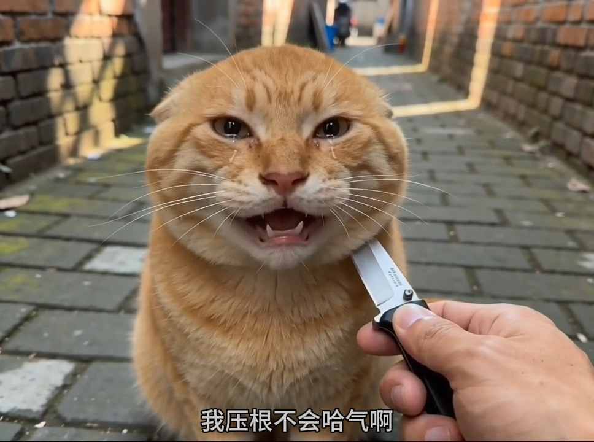 | 9093 | 2026-06-18 |
| [把哈基米关冰箱总共分几步](https://www.bilibili.com/video/BV14VjF6HEzJ) | 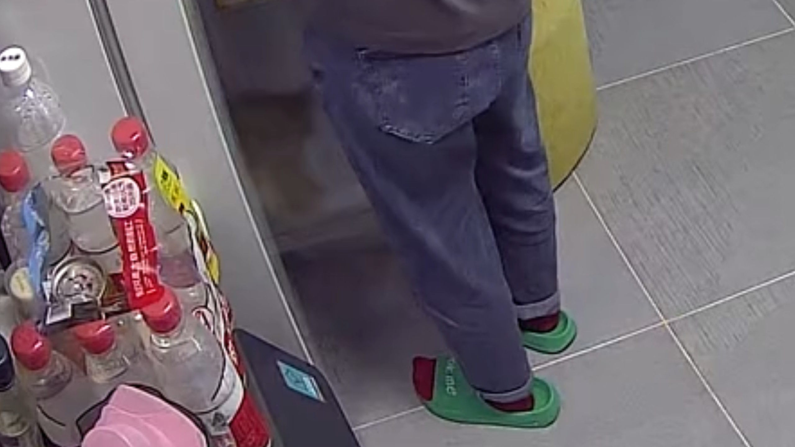 | 7932 | 2026-06-18 |
| [哈基米躲在超市里疯狂偷吃今天终于被抓了](https://www.bilibili.com/video/BV182jF6fE9Q) | 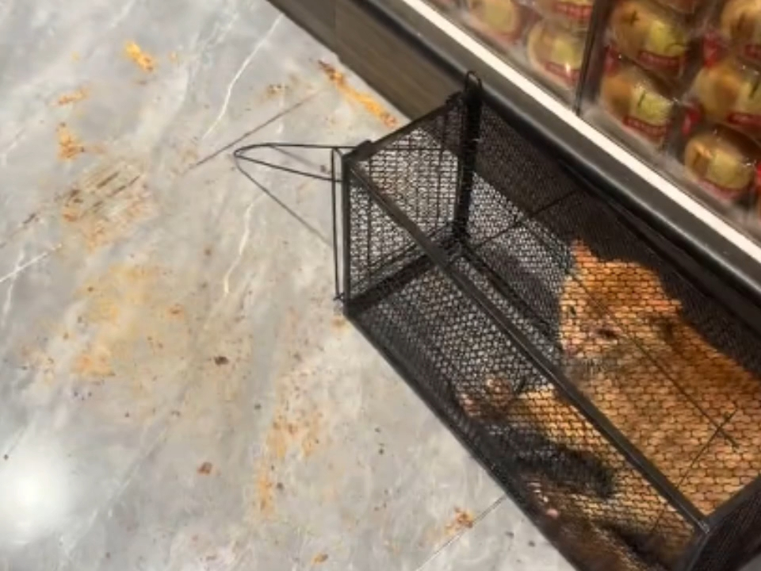 | 3724 | 2026-06-18 |
| [Hachimi OS｜哈基米东北黄豆奶十二生肖系列，正式上市。](https://www.bilibili.com/video/BV1ofLQ6mEeN) |  | 3841 | 2026-06-18 |
| [基米这个步坦协同](https://www.bilibili.com/video/BV1eQLo6ZEN1) |  | 3929 | 2026-06-18 |
| [哈基米高空落下砸晕老人](https://www.bilibili.com/video/BV1hoLo6sEoG) |  | 2.7万 | 2026-06-18 |
| [基米齐心，其利断金](https://www.bilibili.com/video/BV1YoLo6sELY) | 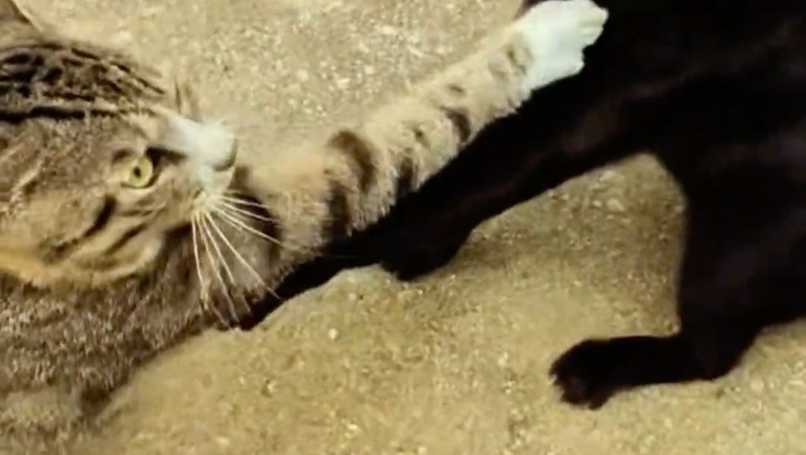 | 1.0万 | 2026-06-18 |
| [【术力口哈基米】少女M](https://www.bilibili.com/video/BV1M6Ld67E4d) |  | 289 | 2026-06-17 |
| [哈基米这个价格翻倍](https://www.bilibili.com/video/BV13JLo6DEP4) |  | 1180 | 2026-06-17 |
| [哈基米歌王争霸赛：what咪do](https://www.bilibili.com/video/BV1EfL964Evd) |  | 439 | 2026-06-17 |
| [好神经的哈基米小夜灯](https://www.bilibili.com/video/BV1AUL96PE4d) | 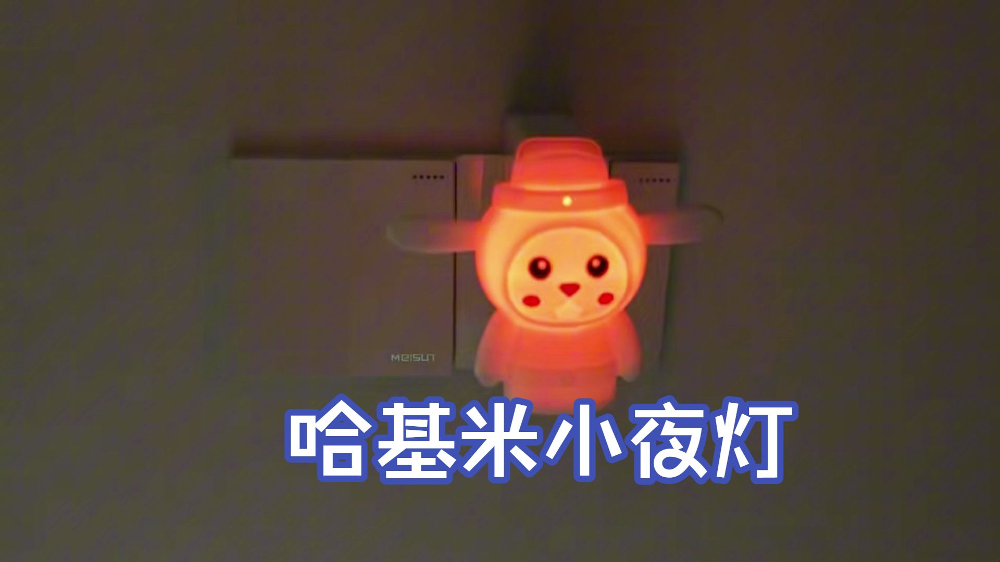 | 1840 | 2026-06-17 |
| [一镜到底来咯](https://www.bilibili.com/video/BV1BrLR6oEjF) | 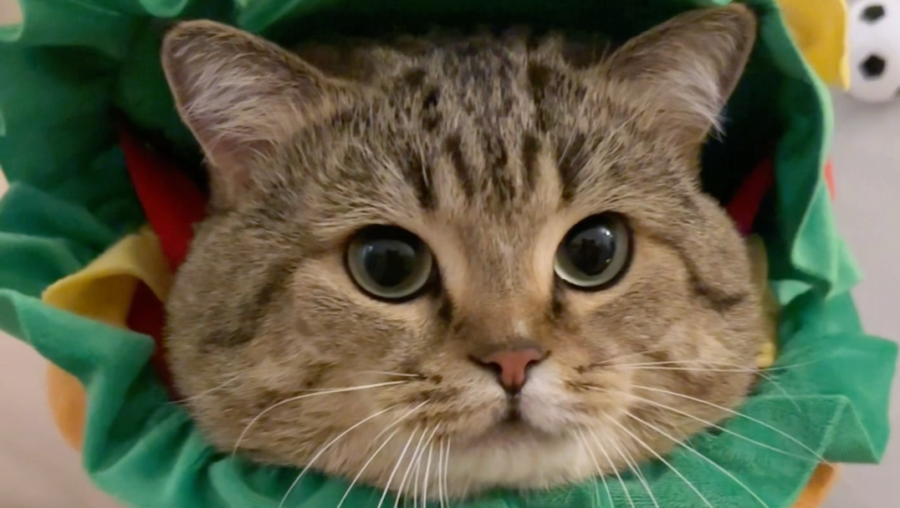 | 5.2万 | 2026-06-17 |
| [哈基米歌王争霸赛！俺来了！](https://www.bilibili.com/video/BV1zYLX6sE4b) |  | 4453 | 2026-06-17 |
| [哈基米被冻在铁管子上了](https://www.bilibili.com/video/BV1W1LQ6tEmL) |  | 1.6万 | 2026-06-17 |
| [之前发现的超绝气泡音哈基米:)](https://www.bilibili.com/video/BV16RLQ6HEce) | 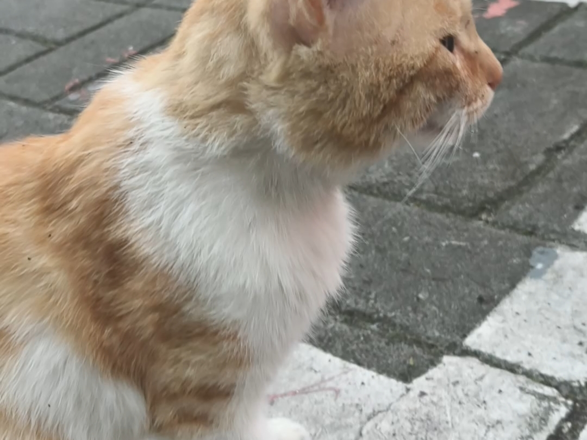 | 8 | 2026-06-17 |
| [哈基米，你为何会落泪](https://www.bilibili.com/video/BV1FSLQ6REuS) | 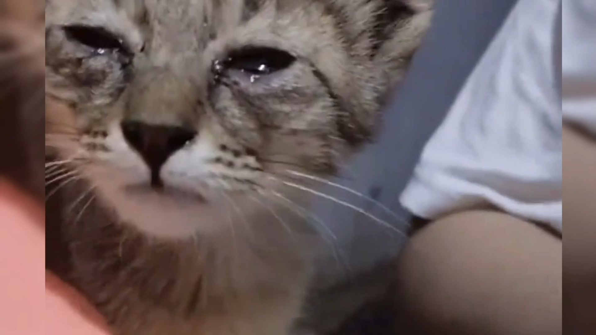 | 8492 | 2026-06-17 |
| [幼年哈基米不敌幼年布鲁斯](https://www.bilibili.com/video/BV1HtLX6oE9r) |  | 1092 | 2026-06-17 |
| [😽哈基米想爱你😽](https://www.bilibili.com/video/BV1YWjG6AEJB) |  | 191 | 2026-06-17 |
| [【哈基米】🐱九万哈（DJ纯享版）🐱](https://www.bilibili.com/video/BV11ejg6mEHf) |  | 2.0万 | 2026-06-17 |
| [今天咪遇到了开心的事情](https://www.bilibili.com/video/BV1idjg6YEwM) | 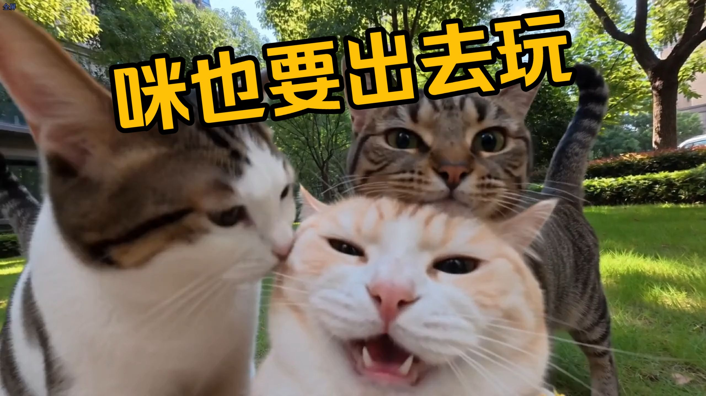 | 8319 | 2026-06-16 |
| [神医哈基米【邵氏风格】](https://www.bilibili.com/video/BV1wnj36jErQ) |  | 2758 | 2026-06-16 |
| [【模组发布】让你的哈基米为你干活！（基米工艺）](https://www.bilibili.com/video/BV1gdjP6uETz) | 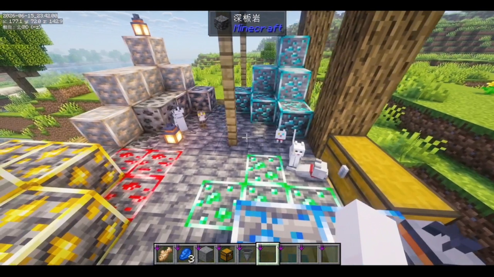 | 1768 | 2026-06-15 |
| [迈克尔杰克逊的billiejean，斗胆跳一段。](https://www.bilibili.com/video/BV1dmJP6sEgd) | 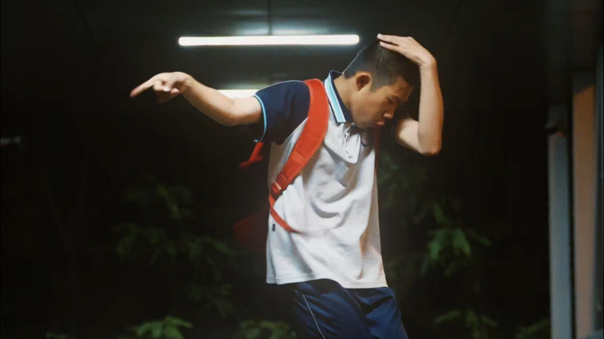 | 526.5万 | 2026-06-14 |
| [史上第一声曼波，竟然真是哈基米发出来的](https://www.bilibili.com/video/BV1JYJF6JEUk) |  | 937 | 2026-06-14 |
| [自不量力的后果极其严重](https://www.bilibili.com/video/BV1VyJn6aEFZ) |  | 8.5万 | 2026-06-13 |
| [【哈基米音乐】来杯好茶摇一摇，但是纯曼波](https://www.bilibili.com/video/BV17yEn6BEpc) |  | 741 | 2026-06-06 |
| [好样的哈基米](https://www.bilibili.com/video/BV1PPVD6SEEZ) |  | 1.7万 | 2026-05-31 |
| [六一快乐哈基们！《大家一起喜羊羊》哈基米版](https://www.bilibili.com/video/BV1fTVG6AENb) |  | 256 | 2026-05-31 |
| [老吴TV之空投入场](https://www.bilibili.com/video/BV1waVh6fEdU) | 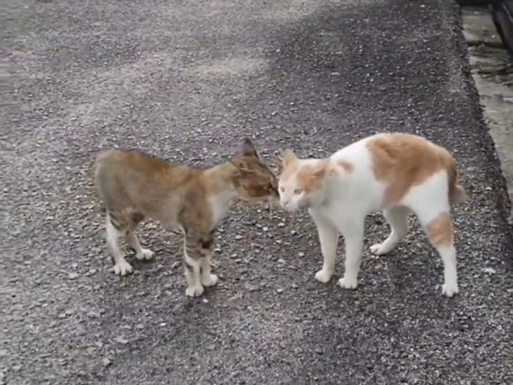 | 28.0万 | 2026-05-29 |
| [基米镜.哈基米系统校准](https://www.bilibili.com/video/BV1juG46NEG5) | 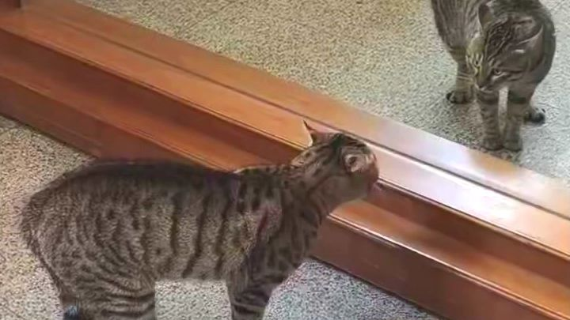 | 1685 | 2026-05-25 |
| [哈基米：不反射🐱🐱](https://www.bilibili.com/video/BV1nNGh6WEst) |  | 568 | 2026-05-23 |
| [【哈基米】Overdose🐱](https://www.bilibili.com/video/BV1Hk5X6xEBf) |  | 565 | 2026-05-14 |
| [当你的右手变成美少女，这是种怎样的体验？一口气看完动画《美鸟日记》](https://www.bilibili.com/video/BV1Du526XEii) |  | 75.7万 | 2026-05-14 |
| [“俩咪若是长久时，又岂在朝朝暮暮”](https://www.bilibili.com/video/BV129RFBmE6R) | 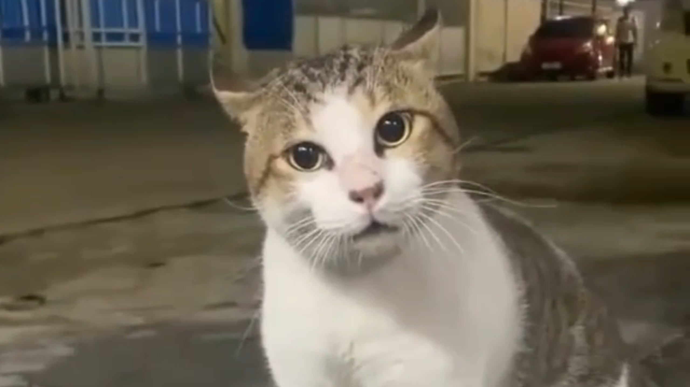 | 9.3万 | 2026-05-03 |
| [是你吗！我的哈基咪哥哥！](https://www.bilibili.com/video/BV1gnwJztEP7) |  | 2118 | 2026-03-13 |
| [除夕也要哈基米！](https://www.bilibili.com/video/BV1TpZ4BvEpa) |  | 1891 | 2026-02-15 |
| [哭中作乐罢了](https://www.bilibili.com/video/BV1AJcTz2Eop) |  | 15.6万 | 2026-02-09 |
| [【越南屠夫案】俩男子为满足独特XP摆拍流出，一个被另一个烹煮食用。。。](https://www.bilibili.com/video/BV1a7F8zpEkH) |  | 161.7万 | 2026-02-08 |
| [【大肉嘎】哈基米要统治这个世界了](https://www.bilibili.com/video/BV1THzXB4E3g) |  | 6232 | 2026-01-29 |
| [在菜市场的哈基咪](https://www.bilibili.com/video/BV19krSBwEe1) | 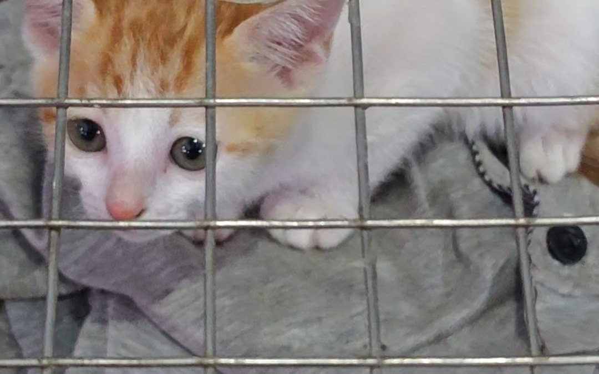 | 1.4万 | 2026-01-17 |
| [哈基米录像之忍无可忍](https://www.bilibili.com/video/BV1qTm7BtEKL) |  | 3044 | 2025-12-12 |
| [可爱基米和水盆斗智斗勇](https://www.bilibili.com/video/BV1F2UNBTE9a) |  | 1.1万 | 2025-11-23 |
| [基米波波［哈基米音樂］](https://www.bilibili.com/video/BV1c7sSzHExF) |  | 645 | 2025-10-27 |
| [日推歌单｜“就这个停顿爽！！！ 好词不挑曲”｜《基米说》](https://www.bilibili.com/video/BV16qxCzTEpZ) | 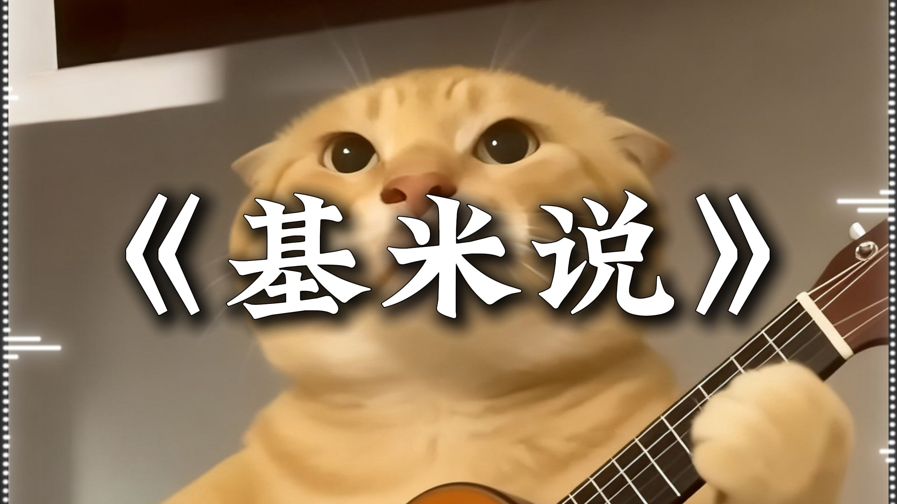 | 1.9万 | 2025-10-10 |
| [有的咪走着走着就没有了](https://www.bilibili.com/video/BV1N7aGzGEte) | 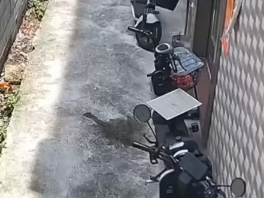 | 2.0万 | 2025-08-31 |
| [哈基米：40oz](https://www.bilibili.com/video/BV1zZbkzyEkm) |  | 2.7万 | 2025-07-24 |
| [《向基米奔去》](https://www.bilibili.com/video/BV167u8zdEVQ) | 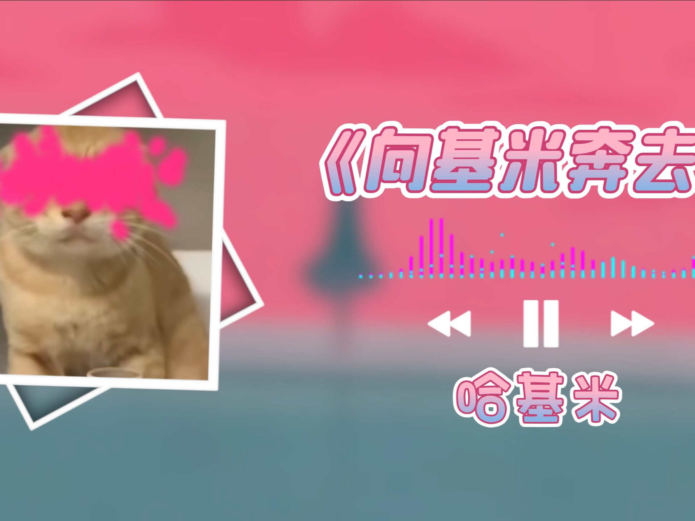 | 4.4万 | 2025-07-16 |
| [哈基米那没炉堕](https://www.bilibili.com/video/BV1geuEzLEvo) | 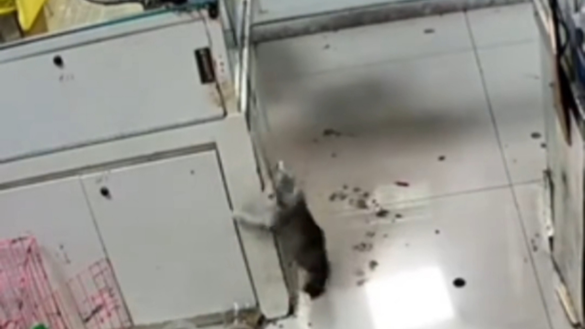 | 13.6万 | 2025-07-15 |
| [哈基米:踏浪](https://www.bilibili.com/video/BV1AyuqznEq4) | 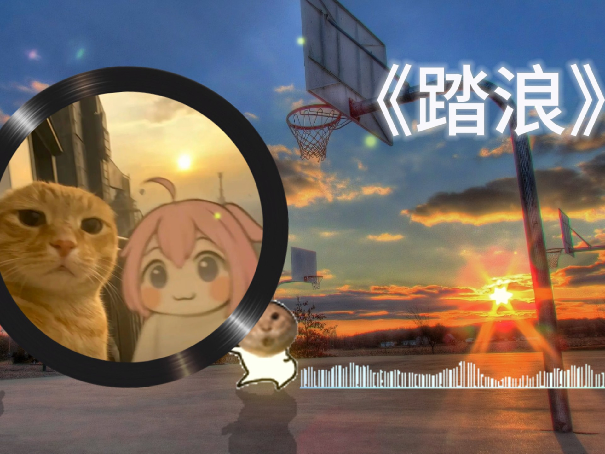 | 1.9万 | 2025-07-14 |
| [⚡Hachimi Daisuki⚡ 最喜欢哈基米辣！](https://www.bilibili.com/video/BV1ZuUQYBERT) |  | 1.9万 | 2024-11-21 |
| [基米世纪主题曲——哈光](https://www.bilibili.com/video/BV1Qx4meyEg3) |  | 6060 | 2024-09-15 |
| [不是所有的哈基米都会踢足球](https://www.bilibili.com/video/BV1bg4y1P74K) |  | 16.2万 | 2023-06-20 |
| [【电棍】哈吉米哈吉米哈吉米哈吉米哈吉米（补档）](https://www.bilibili.com/video/BV1Ac411K7Y2) |  | 13.3万 | 2023-05-10 |
| [世间本无恶，有了“人”便出现了善恶虐猫 亲猫舍予客](https://www.bilibili.com/video/BV1w341147E3) |  | 10.2万 | 2021-12-01 |

---
*最后更新: 2026-06-19 03:26:48 (自动生成)*
*数据来源: [Bilibili](https://www.bilibili.com)*

## 使用说明

运行以下命令更新视频列表:
```bash
python3 fetch_hajimi_videos.py
```
