# awesome-hajimi
collections of hajimi (哈基米 in Chinese) on the Internet.

## 视频列表 (Video List)

| 视频标题 (Title) | 封面 | 播放量 (Views) | 发布日期 (Date) |
|---|---|---|---|
| [这么凶的哈基米你几点回家？](https://www.bilibili.com/video/BV1fBXqBiE8V) |  | 32 | 2026-03-31 |
| [不太聪明的哈基米](https://www.bilibili.com/video/BV1EJXBBBEwg) | 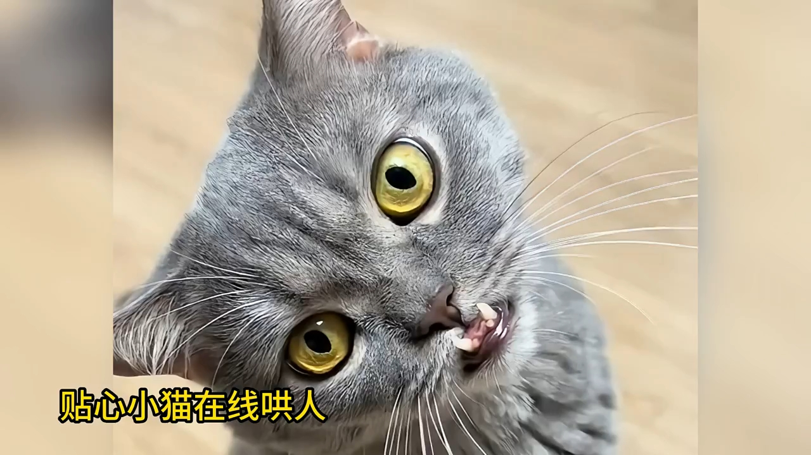 | 0 | 2026-03-31 |
| [哈基米耄耋の大口嚼棍](https://www.bilibili.com/video/BV1JjXBB6E2E) | 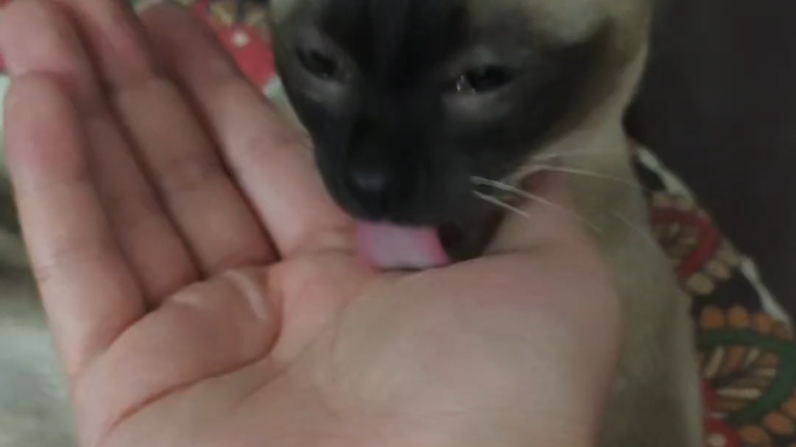 | 151 | 2026-03-31 |
| [刚上班就被骂！哈基米也太委屈了](https://www.bilibili.com/video/BV1njXBB6EBA) | 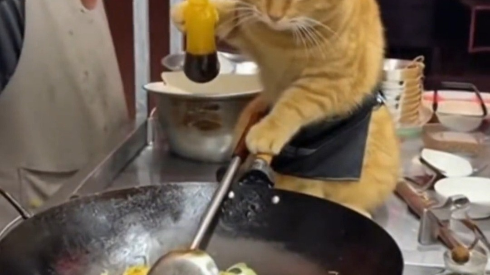 | 0 | 2026-03-31 |
| [哈基米漫步](https://www.bilibili.com/video/BV16EXBBuEvq) |  | 197 | 2026-03-31 |
| [哈基米趴碗里吃汤圆啦](https://www.bilibili.com/video/BV16EXBBuEiw) |  | 0 | 2026-03-31 |
| [哈基米：这人干啥呢](https://www.bilibili.com/video/BV1SZXqBXE1G) | 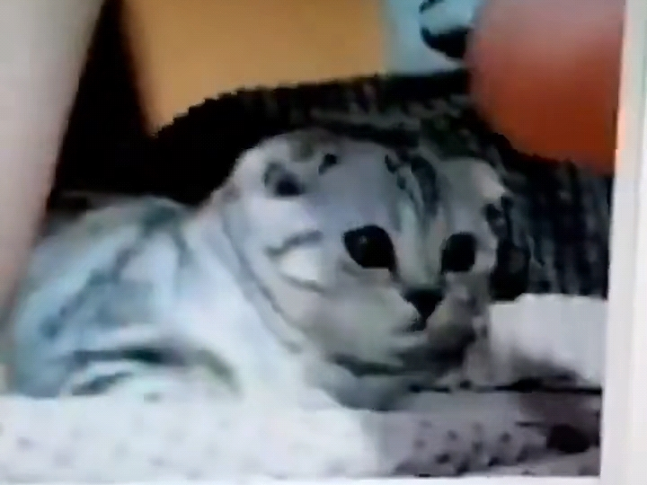 | 5 | 2026-03-31 |
| [【哈基米音乐】基米湾(人鱼湾)](https://www.bilibili.com/video/BV1TrXBBWEfM) |  | 392 | 2026-03-31 |
| [哈基米](https://www.bilibili.com/video/BV1TrXBBWEod) | 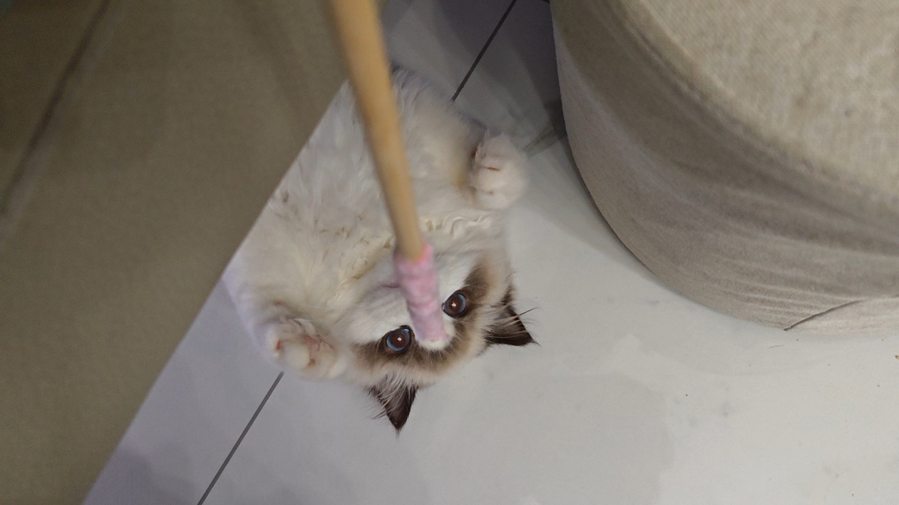 | 2 | 2026-03-31 |
| [哈基米](https://www.bilibili.com/video/BV1MrXBBWEqR) |  | 14 | 2026-03-31 |
| [沉浸式投喂小区流浪哈基米](https://www.bilibili.com/video/BV1LtXBBAEAH) | 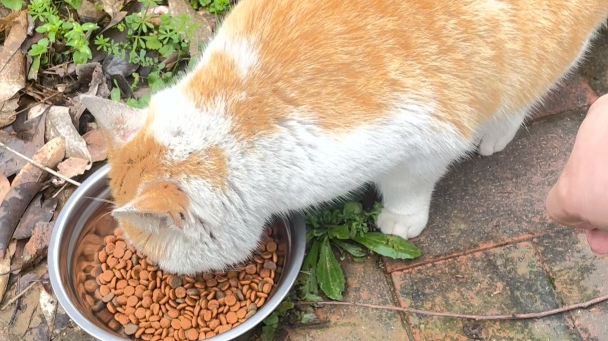 | 3 | 2026-03-31 |
| [基于RVC的哈基米翻唱歌曲《MONTAGEM XONADA》](https://www.bilibili.com/video/BV1fAXzBMEtq) |  | 8 | 2026-03-31 |
| [哈基米](https://www.bilibili.com/video/BV1dPXqBfEW2) |  | 22 | 2026-03-30 |
| [【哈基米】 Oblivion🐱](https://www.bilibili.com/video/BV1cQXeBcEn3) |  | 121 | 2026-03-30 |
| [哈基米扫描失败](https://www.bilibili.com/video/BV1sWXvBuEZN) | 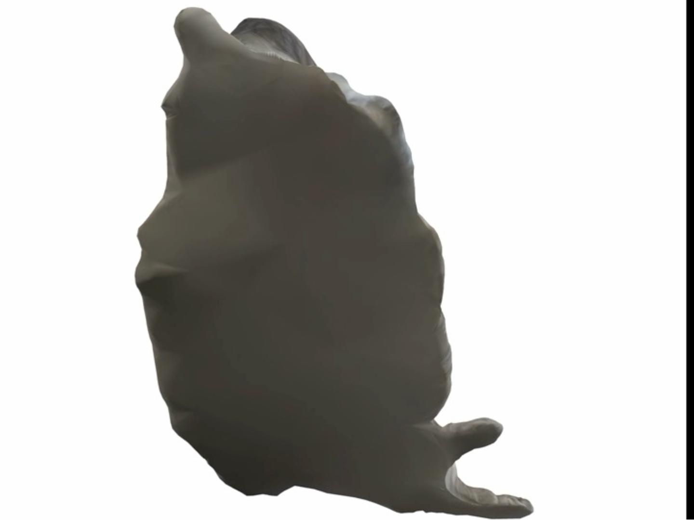 | 32 | 2026-03-30 |
| [丑橘](https://www.bilibili.com/video/BV12nXvBgEnJ) |  | 2999 | 2026-03-30 |
| [半夜睡不着发癫，给大家来一首艾斯哈基米。](https://www.bilibili.com/video/BV1w4XvBTEBD) |  | 5 | 2026-03-30 |
| [什么叫自瞄武装哈基米？](https://www.bilibili.com/video/BV1P4XvBTEt4) |  | 139 | 2026-03-30 |
| [哈基米跳舞，小试牛刀！！！](https://www.bilibili.com/video/BV1QMXvBEENv) | 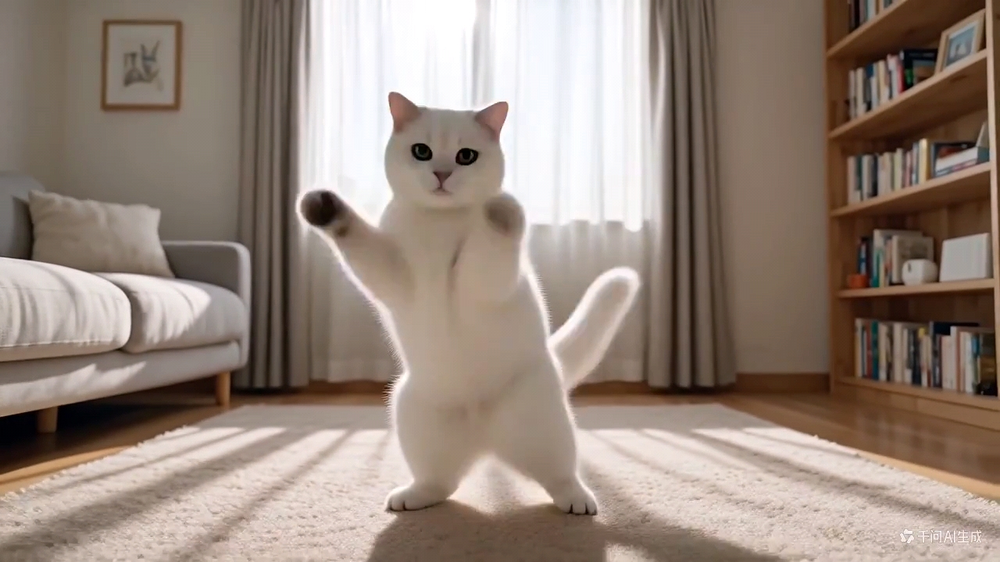 | 15 | 2026-03-30 |
| [哈基米](https://www.bilibili.com/video/BV1oqXvBbESU) | 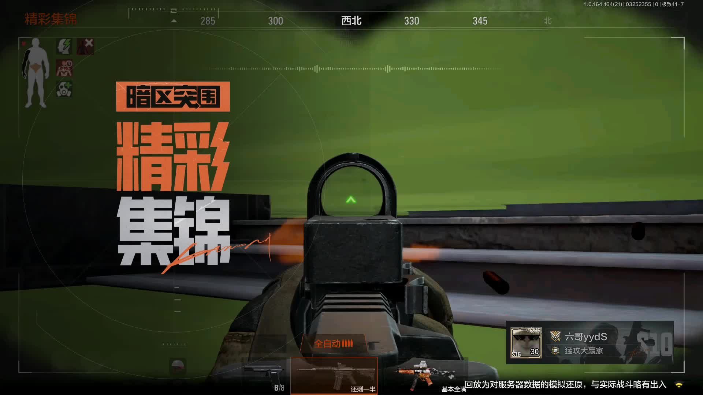 | 2 | 2026-03-30 |
| [哈基米](https://www.bilibili.com/video/BV1qBXvBZESW) | 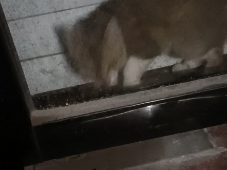 | 3 | 2026-03-30 |
| [外面的猫偷摸进屋咬死了我两只小猫，受够了，流浪猫和放养的以敢后进门就打。](https://www.bilibili.com/video/BV1fQXaBHEnM) | 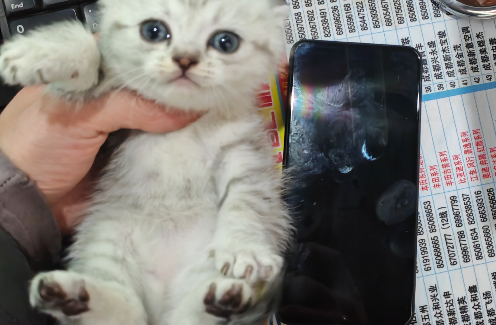 | 1.6万 | 2026-03-30 |
| [哈基米vlog喂饭教程](https://www.bilibili.com/video/BV1BXXaBQEYr) |  | 20 | 2026-03-30 |
| [哈基汪TV15分钟合集](https://www.bilibili.com/video/BV1RfXaB2ELR) |  | 8440 | 2026-03-30 |
| [哈基米的夏天又来啦](https://www.bilibili.com/video/BV1RfXaB2ExR) | 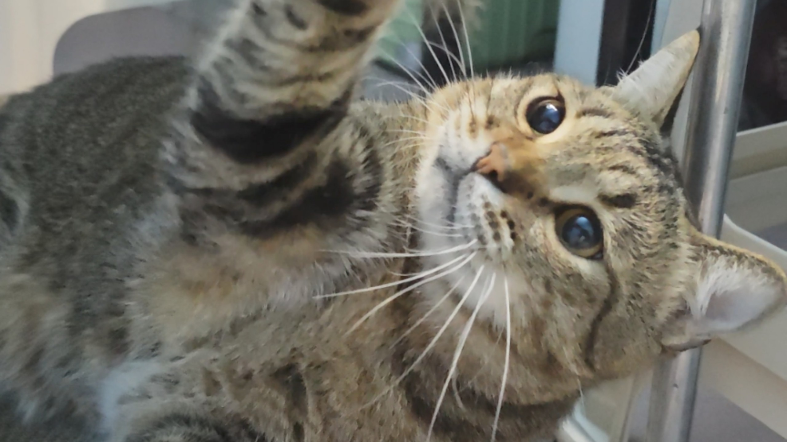 | 537 | 2026-03-30 |
| [耄耋陪你过生日](https://www.bilibili.com/video/BV1wkXaBbE3e) | 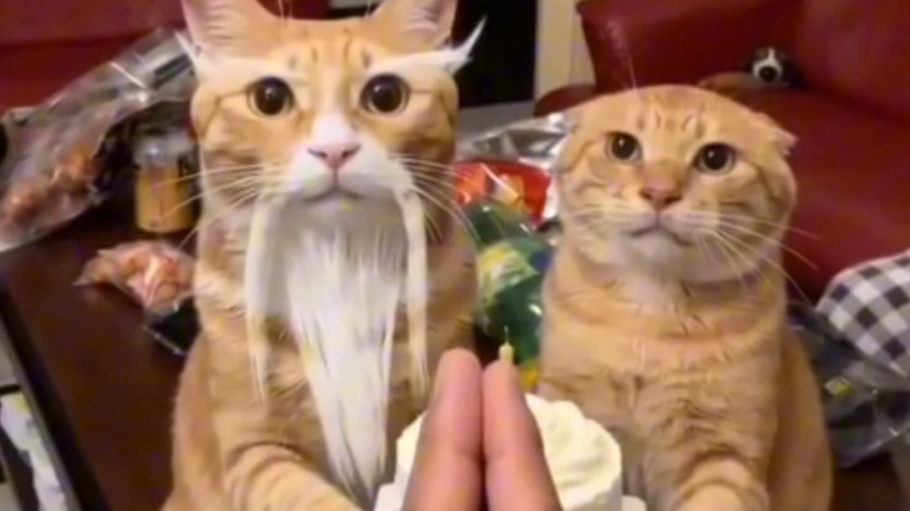 | 1876 | 2026-03-30 |
| [喂个猫条 依旧老吴 依旧棘背](https://www.bilibili.com/video/BV1F2XaBdEgk) |  | 1013 | 2026-03-30 |
| [看似不想吃实则在偷笑](https://www.bilibili.com/video/BV1PJXYBPEg3) | 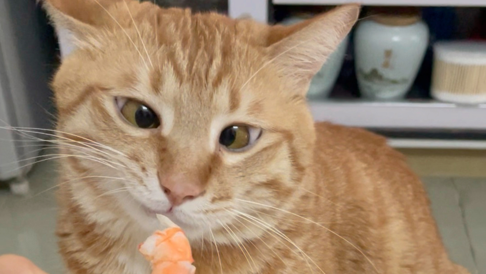 | 6737 | 2026-03-30 |
| [三哈一强普的哈基米](https://www.bilibili.com/video/BV1iLXeBREXo) | 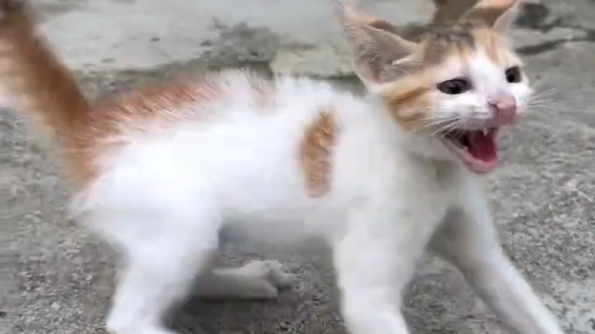 | 1927 | 2026-03-30 |
| [哈基米➕快乐水＝？](https://www.bilibili.com/video/BV1uNA7z9EvJ) |  | 426 | 2026-03-30 |
| [哈基米经典先哈救命人](https://www.bilibili.com/video/BV1XPXYBVE2D) | 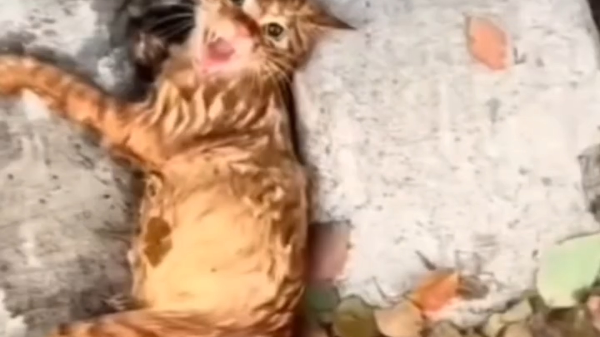 | 341 | 2026-03-30 |
| [上炕一点都不费劲，还会大跳呢！](https://www.bilibili.com/video/BV1azXhBrEik) | 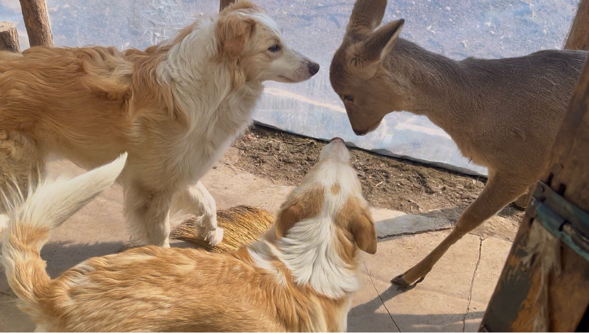 | 7.0万 | 2026-03-30 |
| [武斗酷耄和迪耄【哈基动物园247期】](https://www.bilibili.com/video/BV1UVXYBTEEL) |  | 5853 | 2026-03-30 |
| [小猫：没有聪明的义务！](https://www.bilibili.com/video/BV1SSXYBkEKS) | 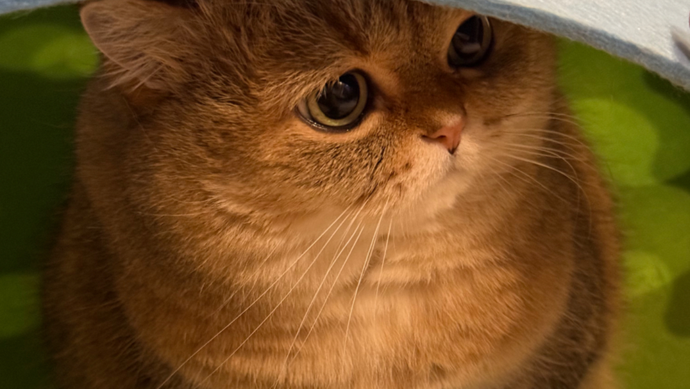 | 2468 | 2026-03-30 |
| [哈基米的生活你不要羡慕](https://www.bilibili.com/video/BV1tQXYB3E24) | 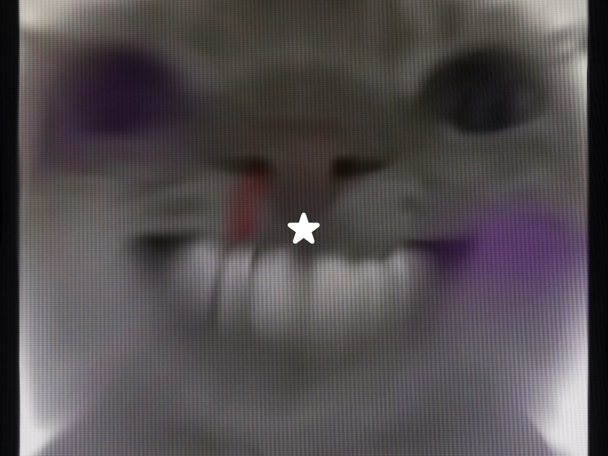 | 18 | 2026-03-30 |
| [原来你是这种哈基米！](https://www.bilibili.com/video/BV1UuXhBwErM) | 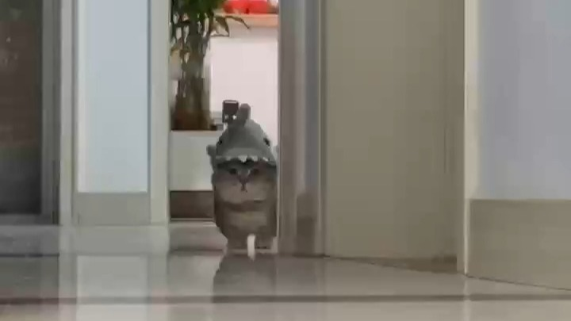 | 4965 | 2026-03-30 |
| [这三只猫比年猪都难嗯！](https://www.bilibili.com/video/BV1STXhBYEPo) | 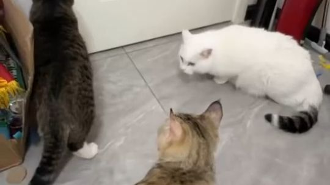 | 2898 | 2026-03-30 |
| [原来国外撸猫真的和我们不一样耶](https://www.bilibili.com/video/BV1E5XeBxEEi) |  | 476 | 2026-03-30 |
| [我的小猫一天要吃五顿😨😰](https://www.bilibili.com/video/BV163XeBtESB) | 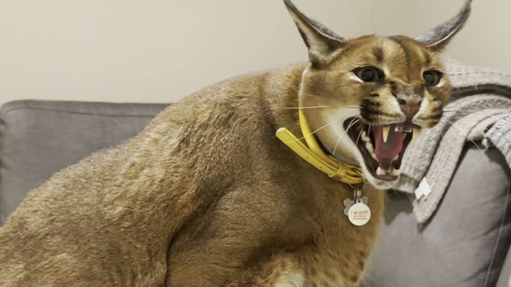 | 2659 | 2026-03-30 |
| [哈基咪还是要哈基奶来治，哈基咪在哈基奶面前情绪稳定](https://www.bilibili.com/video/BV1fGXeBoEGR) | 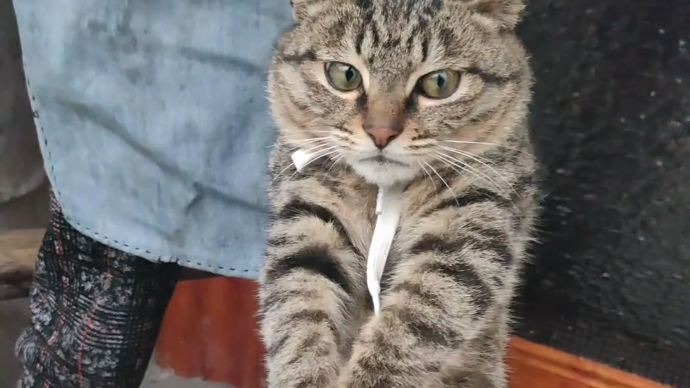 | 2.1万 | 2026-03-30 |
| [当我不停的跟它要孩子，然后…](https://www.bilibili.com/video/BV1TZXYBMEzy) | 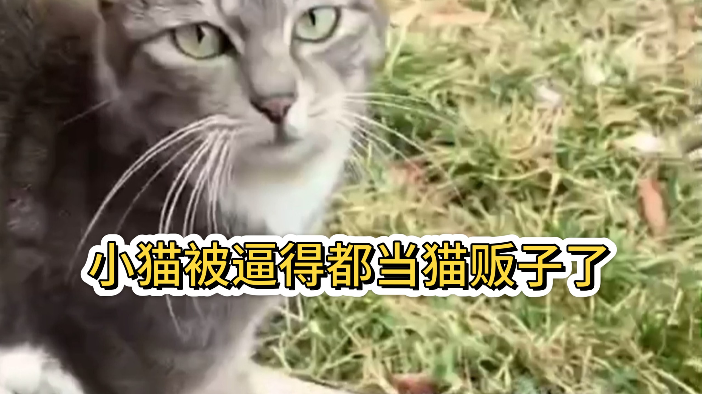 | 3.2万 | 2026-03-30 |
| [哈基米的毛真能许愿吗](https://www.bilibili.com/video/BV1xwXeBvEuc) | 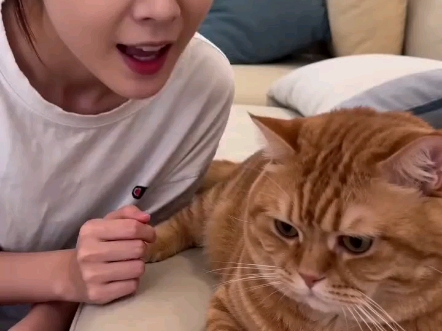 | 32 | 2026-03-30 |
| [【智人TV】为什么不能做制造多巴胺的药，吃一颗就能快乐一整天呢？](https://www.bilibili.com/video/BV1L5XaBmEn9) |  | 11.2万 | 2026-03-30 |
| [谁敢说哈基米没用](https://www.bilibili.com/video/BV1PPXeBPE8J) | 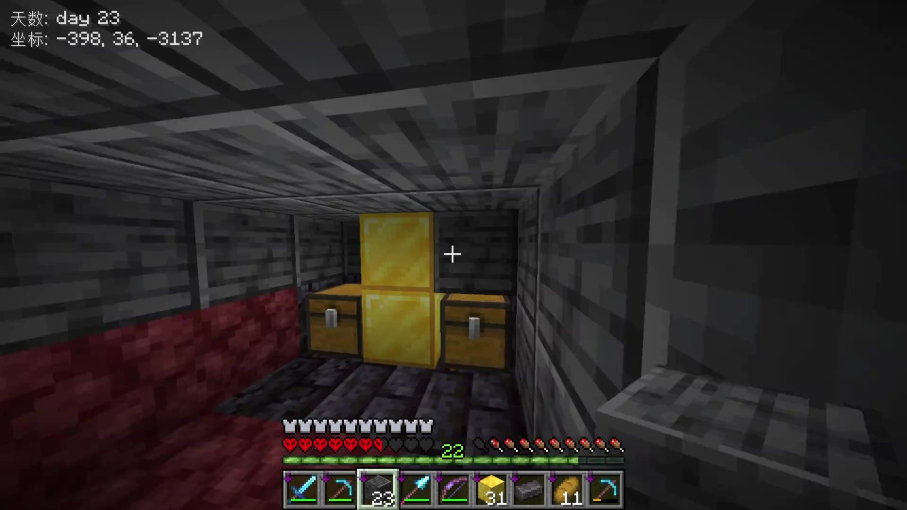 | 142 | 2026-03-30 |
| [只有你想不到的，没有手工大佬们做不到的！](https://www.bilibili.com/video/BV1xfXYBiEfQ) | 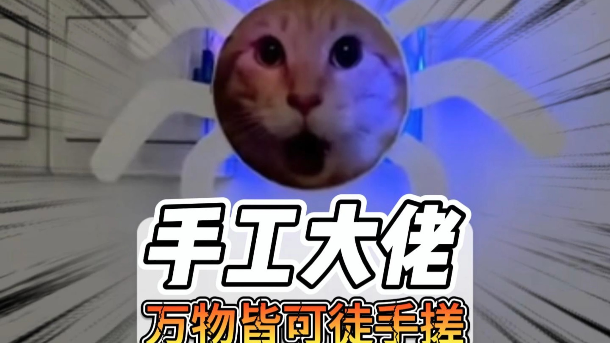 | 681 | 2026-03-30 |
| [哈基米喜欢哈气怎么办](https://www.bilibili.com/video/BV1CjXhB4EJq) | 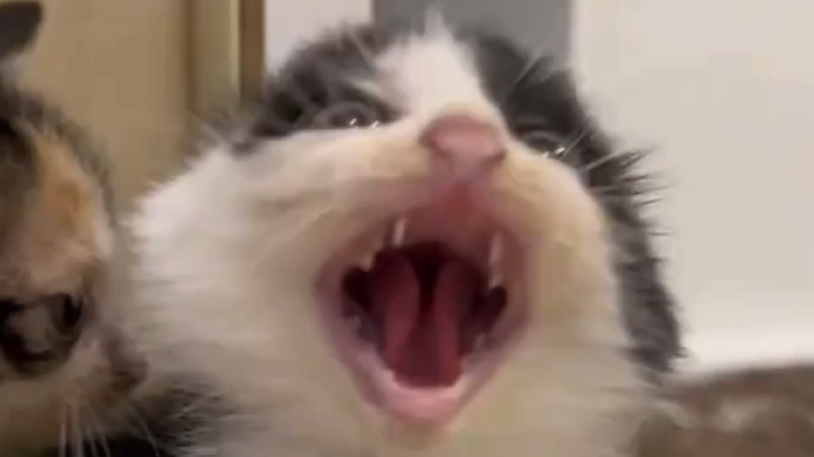 | 87 | 2026-03-30 |
| [这是仙舟第一哈基米你敢跟他对视吗](https://www.bilibili.com/video/BV1y5XhBZENC) |  | 292 | 2026-03-30 |
| [哈基米游太原](https://www.bilibili.com/video/BV1sqXRBcEpu) |  | 109 | 2026-03-30 |
| [毛绒基米1号 实物展示](https://www.bilibili.com/video/BV1CJXhBsExV) |  | 7873 | 2026-03-30 |
| [哈基米大侠之风浪越大](https://www.bilibili.com/video/BV12gXhBhE8H) | 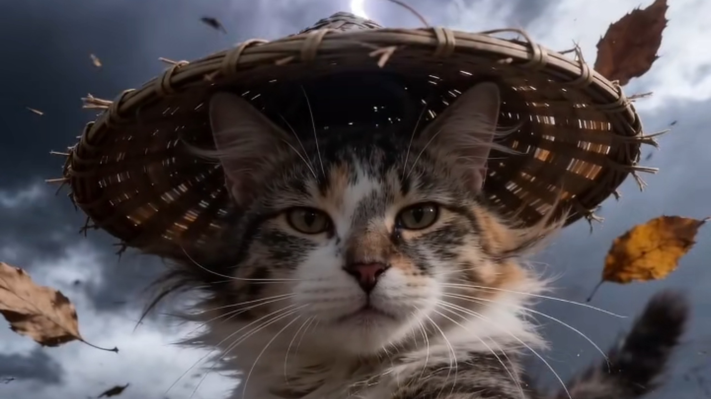 | 97 | 2026-03-30 |
| [控图就控图你怎么把包点都打穿了？](https://www.bilibili.com/video/BV1YrXhBgEjP) |  | 3.5万 | 2026-03-30 |
| [哈基米被肯定的感觉真的非常开心 感谢各位长官的肯定与支持！](https://www.bilibili.com/video/BV181XhBqE17) |  | 1169 | 2026-03-30 |
| [布鲁斯：哈基米成为我的养料吧！](https://www.bilibili.com/video/BV1jgXaBnEZk) |  | 1245 | 2026-03-30 |
| [不小心蒸了一锅变y哈基米….](https://www.bilibili.com/video/BV1L5XaBmEpj) | 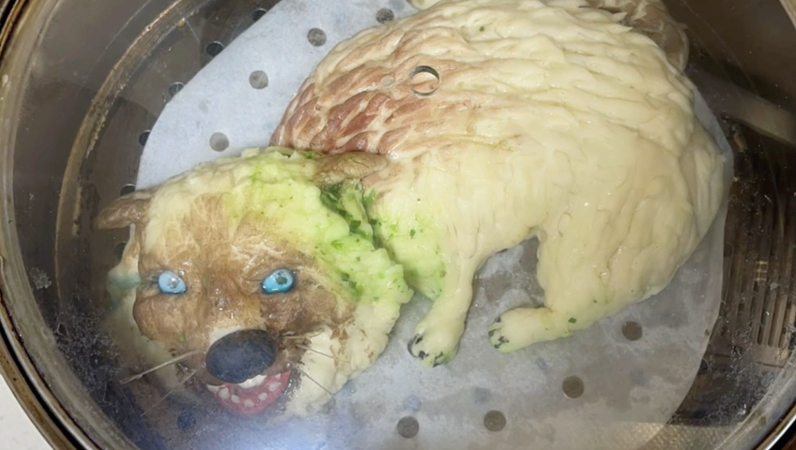 | 2431 | 2026-03-30 |
| [礼尚往来互相宠幸这块～](https://www.bilibili.com/video/BV1aHXRB3E1C) | 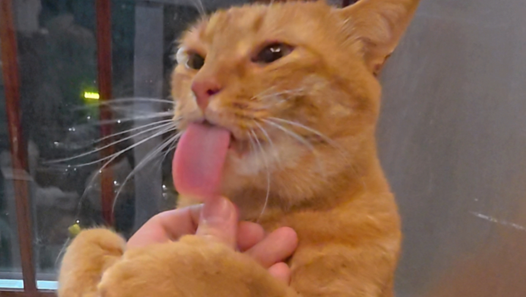 | 1.0万 | 2026-03-30 |
| [有这么萌一只哈基米存在庄园【章鱼粉猫猫切片】](https://www.bilibili.com/video/BV1i7XoBQExS) |  | 146 | 2026-03-30 |
| [你醒辣](https://www.bilibili.com/video/BV1yhXDBUENC) | 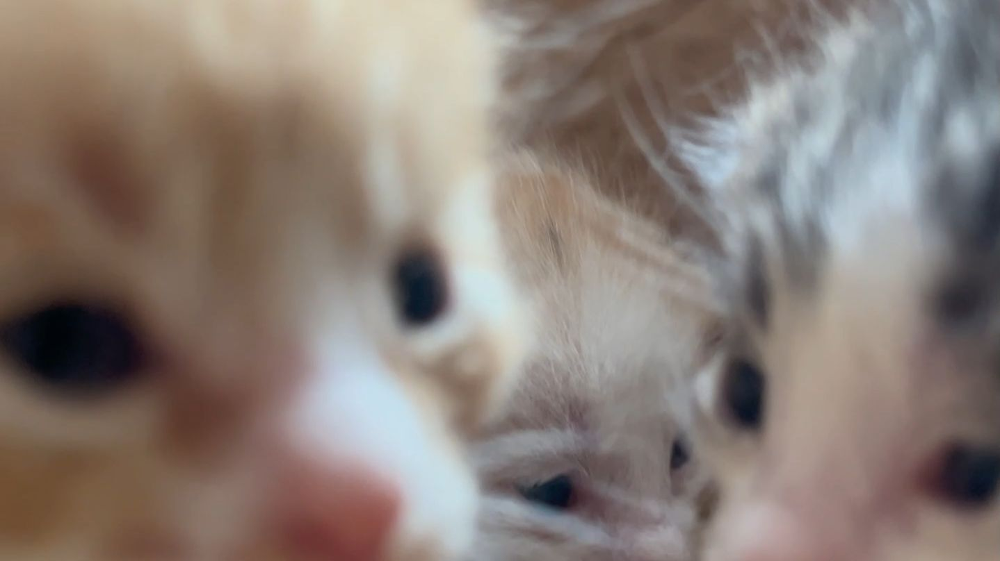 | 1727 | 2026-03-30 |
| [雨后春草，鲜嫩多汁，哈基米滴最爱](https://www.bilibili.com/video/BV1yPXoBhEto) | 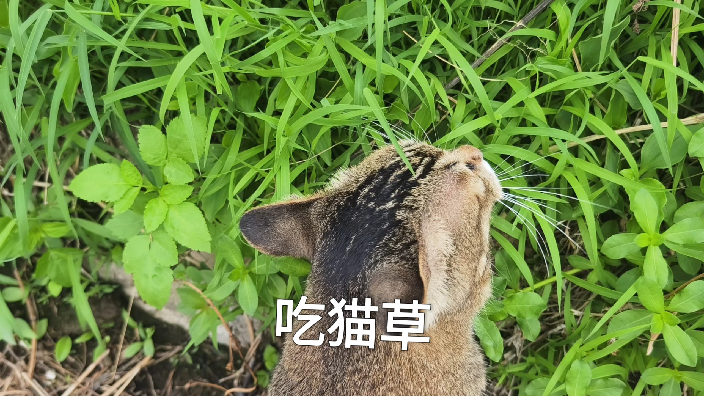 | 223 | 2026-03-30 |
| [多 动 症](https://www.bilibili.com/video/BV1syXoBPE8g) |  | 41.6万 | 2026-03-30 |
| [谁是钧正平？盘点各大官媒的笔名！【基米大科普】](https://www.bilibili.com/video/BV1adXDBaE1U) |  | 8.8万 | 2026-03-30 |
| [美人鱼猫这么可爱，怎么能说它们丑呢？ #猫咪  #人鱼 #哈基米 #AI](https://www.bilibili.com/video/BV1nDXoBFEpF) |  | 163 | 2026-03-30 |
| [《动物迷惑行为大赏300》](https://www.bilibili.com/video/BV12DXQB9Edz) |  | 16.6万 | 2026-03-30 |
| [“这一世我要拿回属于我的一切”](https://www.bilibili.com/video/BV1fbX9B2E2A) |  | 4.8万 | 2026-03-29 |
| [哈基米哈基米哈基米](https://www.bilibili.com/video/BV182X9BKEh6) | 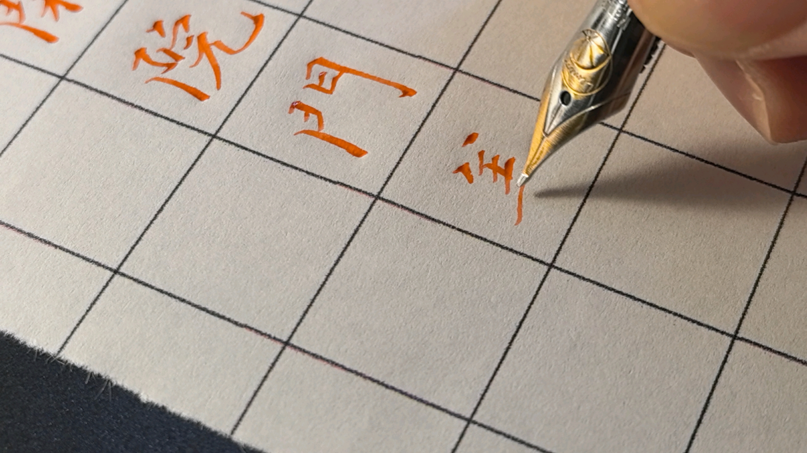 | 807 | 2026-03-29 |
| [《哈基米拯救世界》预告](https://www.bilibili.com/video/BV11DXQB9ErP) |  | 1016 | 2026-03-29 |
| [“ 法 力 无 边 哈 大 仙 ！欲 把 基 人 变 基 米 ！！！！”](https://www.bilibili.com/video/BV1vLXXBqEic) |  | 5.2万 | 2026-03-29 |
| [咪咪都死了，你怎么笑得出来的](https://www.bilibili.com/video/BV1cAXXB2E8G) | 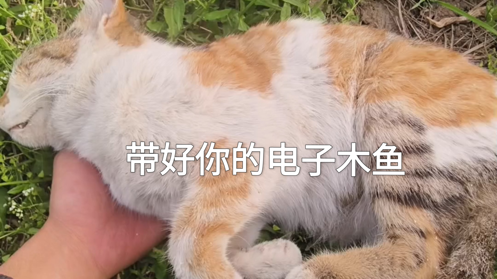 | 36.3万 | 2026-03-29 |
| [最帅的一集](https://www.bilibili.com/video/BV1FnXSBqEgU) |  | 2046 | 2026-03-29 |
| [播放量轻松破百万，热搜直冲前十！](https://www.bilibili.com/video/BV1UwXSBSEpt) |  | 2.0万 | 2026-03-29 |
| [蛋仔派对：皮蛋节活动爆料！免费皮肤、动作？全新哈基米外观](https://www.bilibili.com/video/BV1RbXSBcEsH) |  | 2.7万 | 2026-03-29 |
| [一分钟讲清楚什么是薪资架构！【基米大科普】](https://www.bilibili.com/video/BV1wDXVB3EMj) |  | 7409 | 2026-03-29 |
| [家里来了一只流浪猫，为什么每次都用这种眼神打量我？](https://www.bilibili.com/video/BV1qPXDBTE5w) | 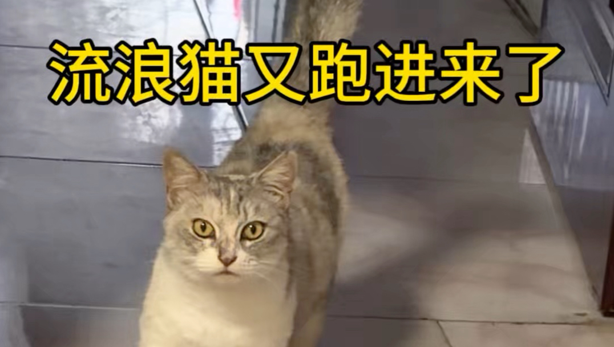 | 18.7万 | 2026-03-29 |
| [🐱死耄回游-aizo🐱](https://www.bilibili.com/video/BV1CXXSByE1r) |  | 2.7万 | 2026-03-29 |
| [哈基米一步一哈气，一步一炸毛，有没有人试过让一只猫一直哈气能哈多久](https://www.bilibili.com/video/BV1AQXSBjEdR) | 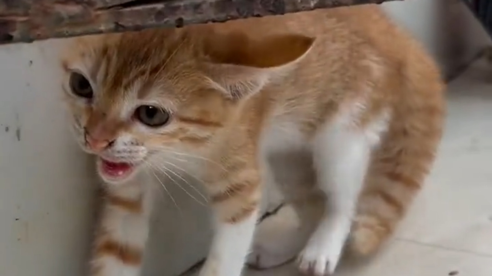 | 2832 | 2026-03-29 |
| [哈基米~](https://www.bilibili.com/video/BV1rdXSBkEw7) | 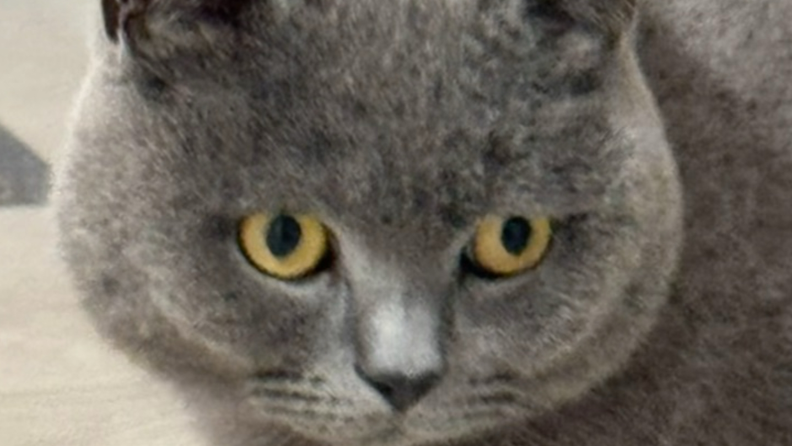 | 896 | 2026-03-29 |
| [【WOTB】外网抽象❤️合集（3）](https://www.bilibili.com/video/BV1UHXDBREmg) | 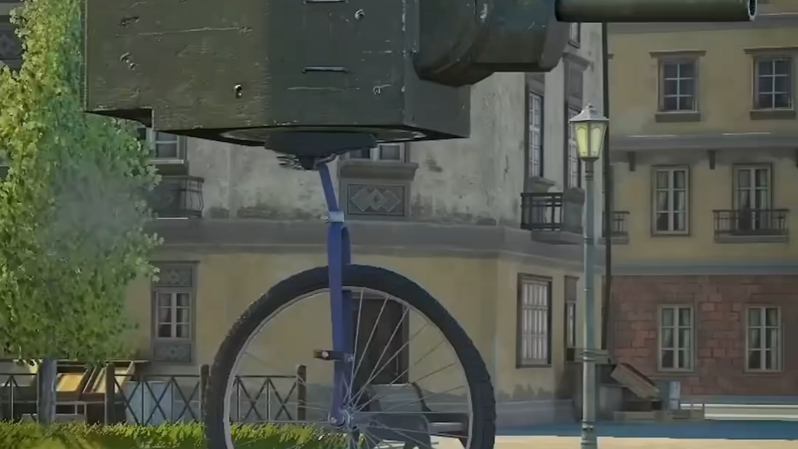 | 947 | 2026-03-29 |
| [哈基米这个可爱](https://www.bilibili.com/video/BV1vPXUBbEyr) | 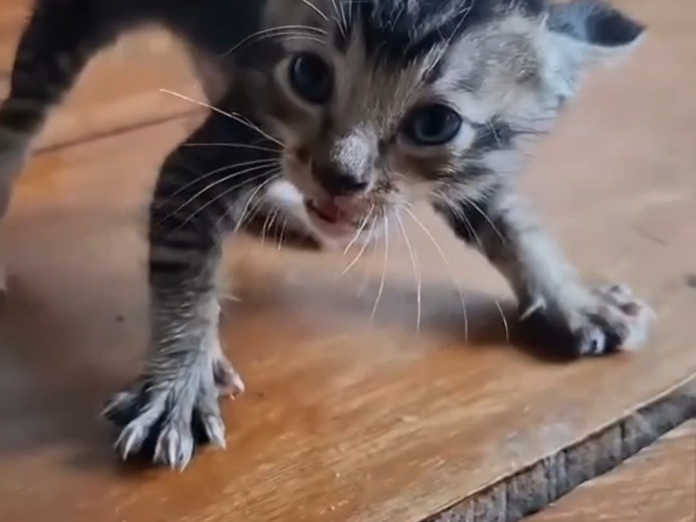 | 4550 | 2026-03-29 |
| [哈基米知恩图报（二）](https://www.bilibili.com/video/BV1CmXmBgEDj) |  | 3.6万 | 2026-03-29 |
| [一撸一个不吱声](https://www.bilibili.com/video/BV1rDXVB3EqU) | 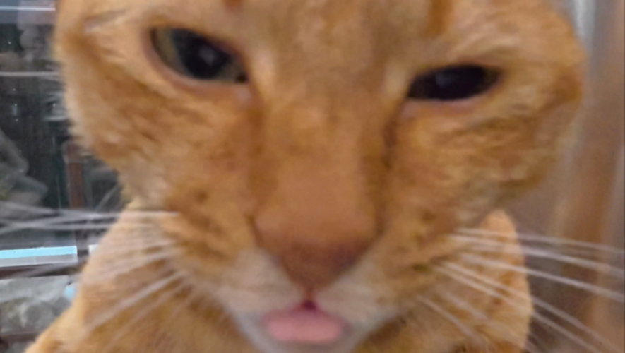 | 3.1万 | 2026-03-29 |
| [哈基米助眠丨绵羊油揉耳和刺激的贴耳触发](https://www.bilibili.com/video/BV1nhX2BAEmv) | 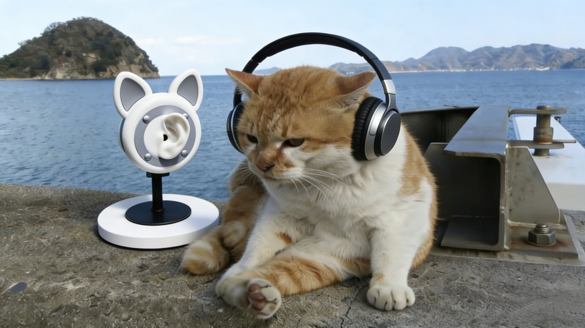 | 1347 | 2026-03-29 |
| [嘬不给我摸！](https://www.bilibili.com/video/BV17rXUBPE17) | 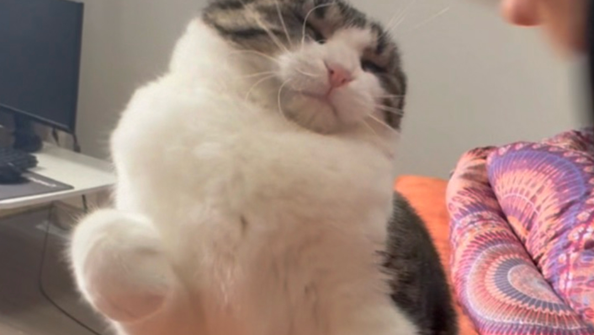 | 8.0万 | 2026-03-29 |
| [我趣 基米突然的街舞](https://www.bilibili.com/video/BV1iZX1BREiJ) |  | 7818 | 2026-03-29 |
| [失踪三个月的猫回家了(°ー°〃)](https://www.bilibili.com/video/BV18gX2B2EdY) | 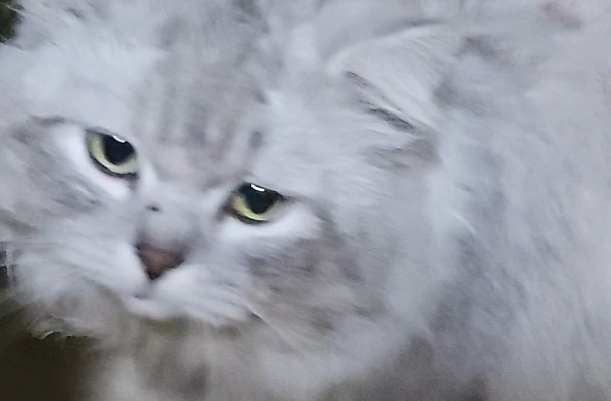 | 2858 | 2026-03-28 |
| [“整个夏天，想和基米一起环游世界”](https://www.bilibili.com/video/BV1ytXjBXE1j) |  | 1138 | 2026-03-28 |
| [4败的耄](https://www.bilibili.com/video/BV151X5BYEJk) | 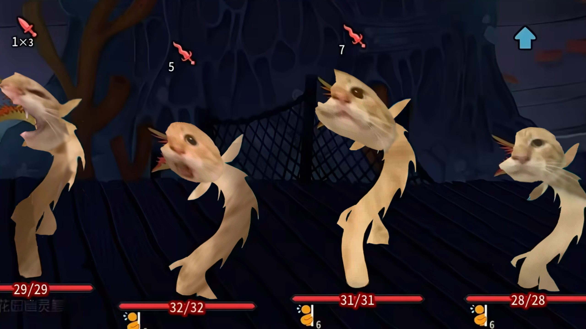 | 4.1万 | 2026-03-28 |
| [UT擬人，唉我給標題湊個字數吧](https://www.bilibili.com/video/BV15cXGBdEiH) |  | 6419 | 2026-03-28 |
| [基咪内心暗自窃喜](https://www.bilibili.com/video/BV1xXXMBeEtK) | 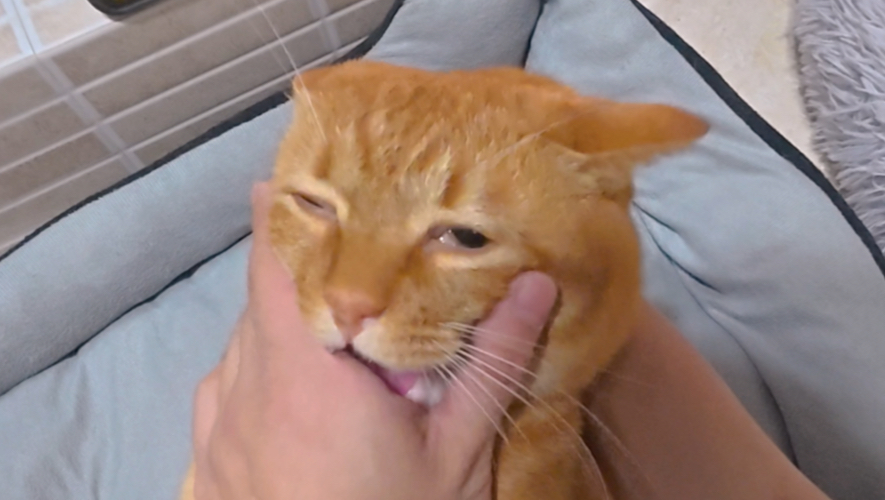 | 2.0万 | 2026-03-28 |
| [“ 你是臭基米~你是臭基米~你是谁呀~~~”](https://www.bilibili.com/video/BV1MoXGB7EQS) | 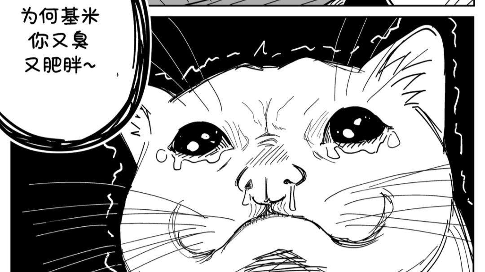 | 8.2万 | 2026-03-28 |
| [为什么又让我遇到这种事](https://www.bilibili.com/video/BV1fPXTB7EBX) |  | 13.2万 | 2026-03-27 |
| [野外的哈基蜂](https://www.bilibili.com/video/BV1rRXsBTE5F) |  | 4304 | 2026-03-26 |
| [【叮咚鸡重度依赖】DINGDONGJI OVERDOSE](https://www.bilibili.com/video/BV1XLXEBzE4D) |  | 4548 | 2026-03-26 |
| [不知火舞循环…](https://www.bilibili.com/video/BV16gXFBcEib) |  | 264.1万 | 2026-03-23 |
| [大壮见到小猫咪的样子](https://www.bilibili.com/video/BV1ZQQZBWEER) | 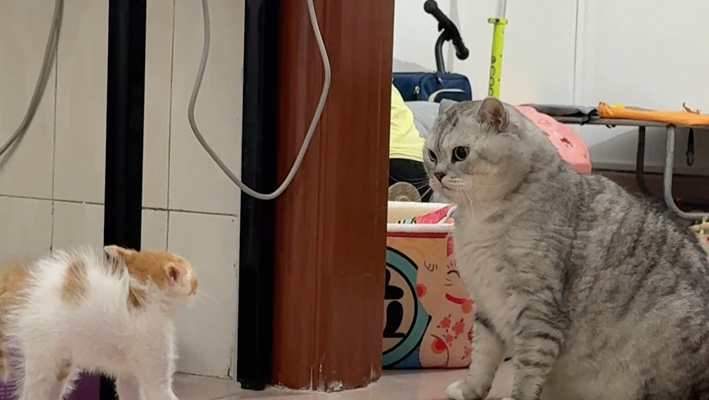 | 51.0万 | 2026-03-23 |
| [我宣布迪莫就是洛克王国史上最最可爱的哈基米！](https://www.bilibili.com/video/BV1MRAgzTEkL) |  | 37.4万 | 2026-03-22 |
| [依旧粉色哈基米](https://www.bilibili.com/video/BV17WAPzPEvr) |  | 4.1万 | 2026-03-21 |
| [全网四大赛博神兽，我的刀盾居然这么魔性，比比拉布，巴巴博一，八嘎牙路居然组成四大神兽](https://www.bilibili.com/video/BV1wkwczhEgN) |  | 19.9万 | 2026-03-11 |
| [《眼睛瞎在手机上》手机之歌，手也粘在手机上！](https://www.bilibili.com/video/BV1tjcXzjEAq) | 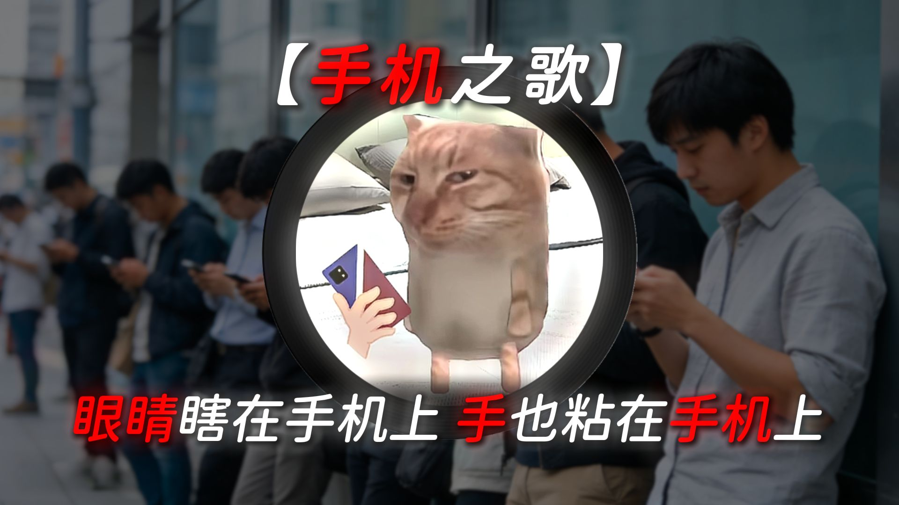 | 147.6万 | 2026-03-10 |
| [猫：？？？](https://www.bilibili.com/video/BV1rUPLzzE3A) | 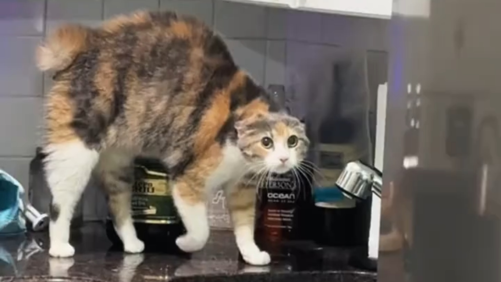 | 90.4万 | 2026-03-02 |
| [《哈基米大风车》](https://www.bilibili.com/video/BV1KYYQztEdM) | 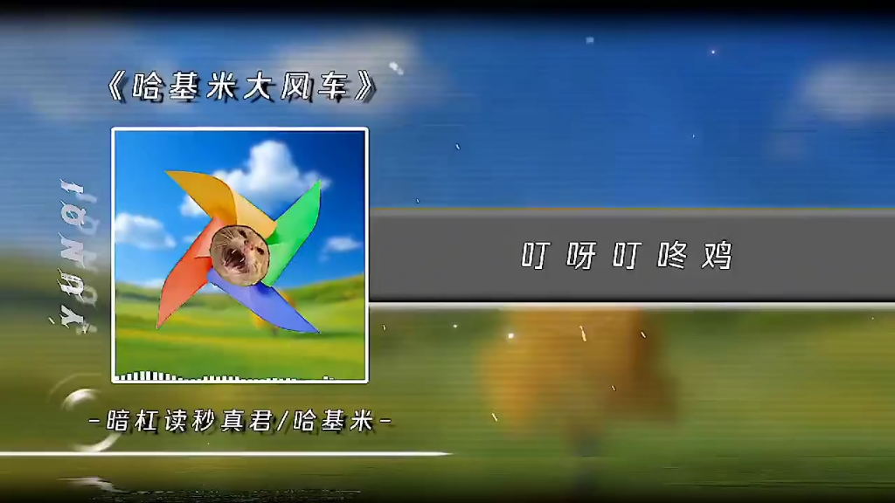 | 1.9万 | 2025-08-21 |
| [【纯净哈基米】洛克王国战斗BGM](https://www.bilibili.com/video/BV1MtQmYDEXW) |  | 4.6万 | 2025-03-15 |

---
*最后更新: 2026-03-31 03:17:33 (自动生成)*
*数据来源: [Bilibili](https://www.bilibili.com)*

## 使用说明

运行以下命令更新视频列表:
```bash
python3 fetch_hajimi_videos.py
```
