# awesome-hajimi
collections of hajimi (哈基米 in Chinese) on the Internet.

## 视频列表 (Video List)

| 视频标题 (Title) | 封面 | 播放量 (Views) | 发布日期 (Date) |
|---|---|---|---|
| [哈基米这个喜欢攻击人类](https://www.bilibili.com/video/BV1UWdqBoE2k) |  | 59 | 2026-04-17 |
| [哈基米不能太闲了，得给它整点事干](https://www.bilibili.com/video/BV1yadqBHEEU) | 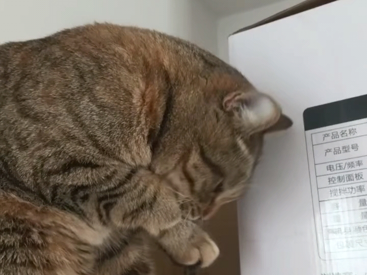 | 2 | 2026-04-17 |
| [哈基米这个喜欢攻击布鲁斯](https://www.bilibili.com/video/BV1xadqBHEKY) |  | 28 | 2026-04-17 |
| [水之阿犀噶，金之大狗叫，土之哈基米](https://www.bilibili.com/video/BV1BRQNBrEGS) | 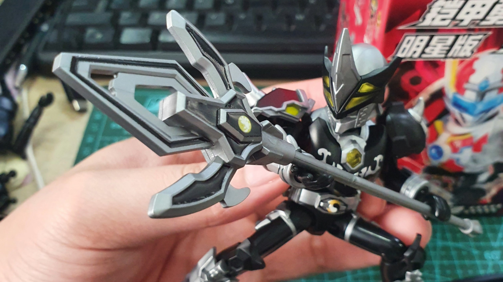 | 0 | 2026-04-17 |
| [竖屏4k哈基米miku](https://www.bilibili.com/video/BV1B4dBByEP8) |  | 19 | 2026-04-17 |
| [【哈基米音乐之】十猛龙，我今天要哈你了！](https://www.bilibili.com/video/BV1FWdBB2E2L) | 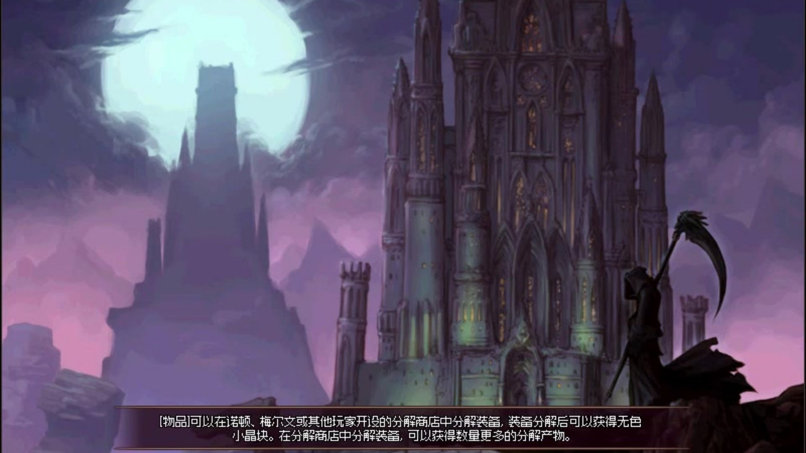 | 34 | 2026-04-17 |
| [花火——哈基米南北绿豆~](https://www.bilibili.com/video/BV1JqdvBgEQT) |  | 484 | 2026-04-17 |
| [【三补】哈基米：基米功夫tu](https://www.bilibili.com/video/BV1zBdvBzEAs) |  | 0 | 2026-04-17 |
| [宵宫姐姐要哈基米](https://www.bilibili.com/video/BV1Dbd8BgEbQ) |  | 125 | 2026-04-16 |
| [哈基米你这家伙，老鼠可不兴放进锅里](https://www.bilibili.com/video/BV1McdiB9EvD) |  | 4 | 2026-04-16 |
| [每一只有趣猫猫，都是人间小开心果](https://www.bilibili.com/video/BV16nDjB6E1L) | 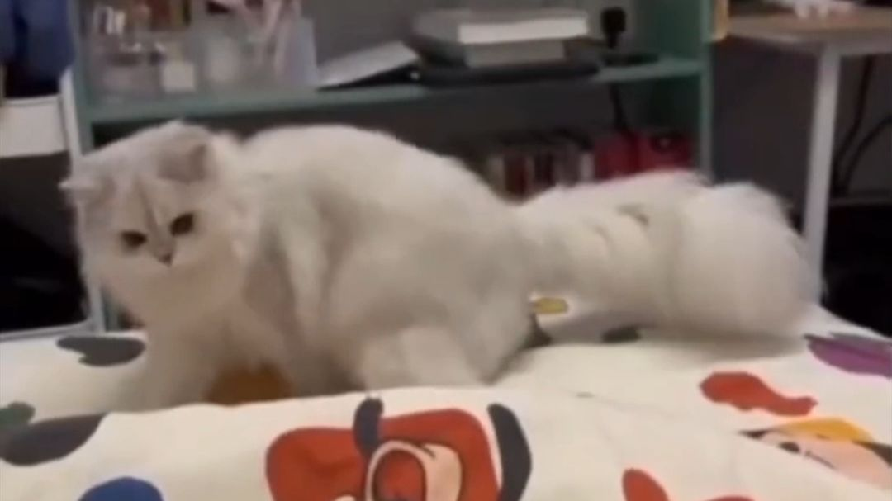 | 1025 | 2026-04-16 |
| [【哈基米FM】握着我的基米tu](https://www.bilibili.com/video/BV1VadiBYEx6) |  | 1 | 2026-04-16 |
| [【哈基米】鲁棺去世主题曲：震基！(shock!)tu](https://www.bilibili.com/video/BV15bdiBvEoZ) |  | 0 | 2026-04-16 |
| [【哈基米音乐】⚡唐⚡人⚡哈⚡曲tu](https://www.bilibili.com/video/BV1cEdiBGEsc) |  | 0 | 2026-04-16 |
| [【哈基米音乐】《没出息》“本来应该从从容容哈哈气气！”tu](https://www.bilibili.com/video/BV1fJdiB6Edm) |  | 0 | 2026-04-16 |
| [【哈基米音乐】《进击の曼波》Call Of Silencetu](https://www.bilibili.com/video/BV1cLdiB5ESZ) |  | 2 | 2026-04-16 |
| [【哈基米音乐】欧美怀旧金曲《It_s My 哈基米》tu](https://www.bilibili.com/video/BV1A9diBEE7K) |  | 0 | 2026-04-16 |
| [哈基米哦南北绿豆](https://www.bilibili.com/video/BV1GXdYBHEwg) |  | 725 | 2026-04-16 |
| [【天生哈才/曼波翻唱】⚡️嘻嘻嘻嘻哈哈哈哈曼波⚡️](https://www.bilibili.com/video/BV1QvdeBQE5e) |  | 355 | 2026-04-16 |
| [哈基米被工业X光机全身辐照,没几天活头了](https://www.bilibili.com/video/BV1PwdaBqE24) |  | 2.0万 | 2026-04-16 |
| [【卖哈基米送南北绿豆】更新了一条视频，快来围观！](https://www.bilibili.com/video/BV1fwdvBPEFc) |  | 5 | 2026-04-16 |
| [这只哈基米非常亲人](https://www.bilibili.com/video/BV1jEdaBdE4x) | 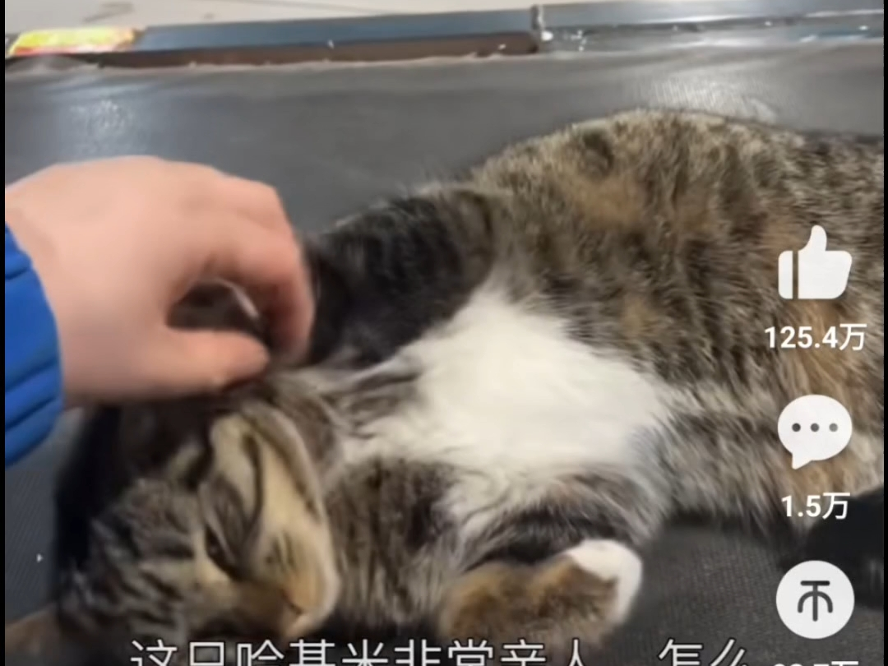 | 84 | 2026-04-16 |
| [【卖哈基米送南北绿豆】Up主探索中，欢迎收看求三连！](https://www.bilibili.com/video/BV1BLdaBZEfn) |  | 3 | 2026-04-16 |
| [变成猫面包了#猫咪#小奶猫#哈基米](https://www.bilibili.com/video/BV1cMdaBYEaz) |  | 143 | 2026-04-16 |
| [👅🐱](https://www.bilibili.com/video/BV1fGdaBfEvQ) | 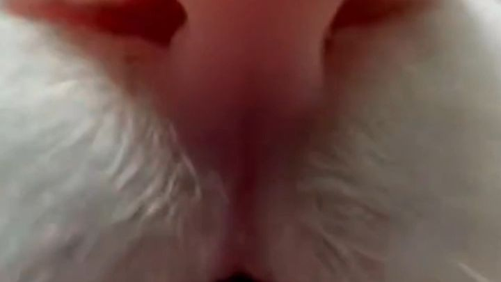 | 1460 | 2026-04-16 |
| [哈基米在和看不见的敌人战斗](https://www.bilibili.com/video/BV1c3daBhEV7) | 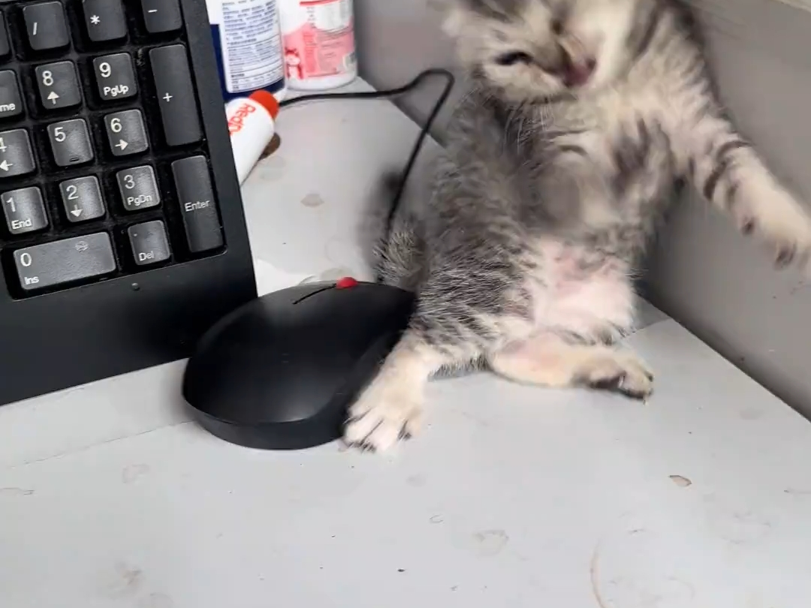 | 873 | 2026-04-16 |
| [哈基米可能是想换换口味合并同类项了](https://www.bilibili.com/video/BV1y1daBTEW1) |  | 70 | 2026-04-16 |
| [此基米智商超群堪称哈基米德](https://www.bilibili.com/video/BV146daBrEJ3) | 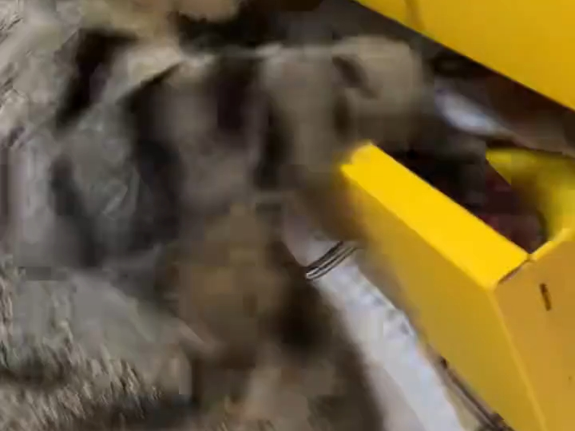 | 134 | 2026-04-16 |
| [冷知识，这不是哈基米自己捕猎的](https://www.bilibili.com/video/BV1P1daBMEyC) | 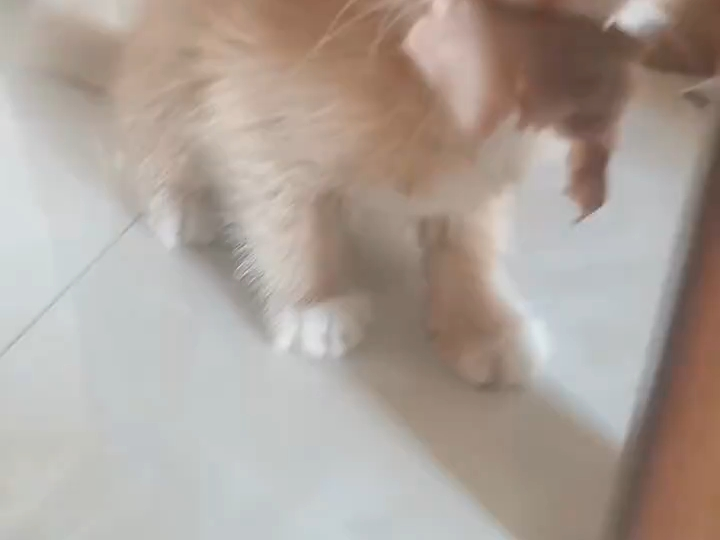 | 420 | 2026-04-16 |
| [可可爱爱的哈基米](https://www.bilibili.com/video/BV1rSdaBeEgE) | 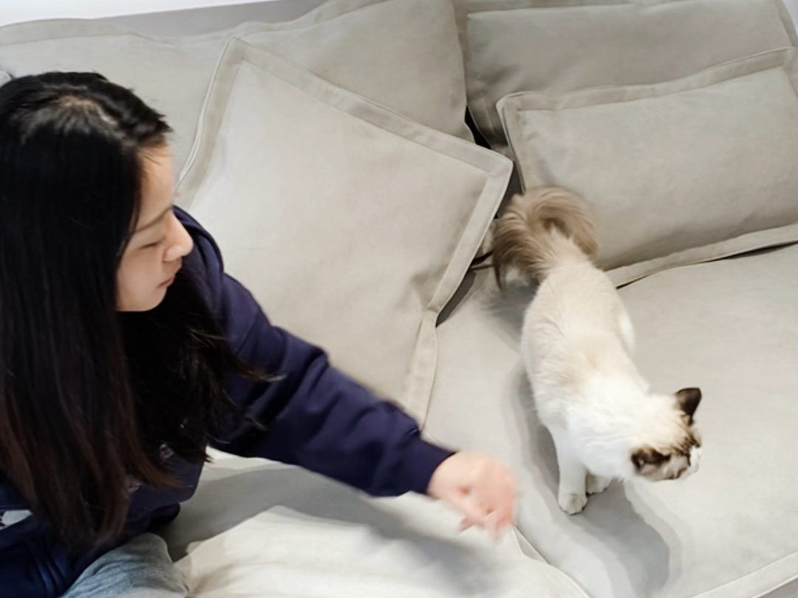 | 21 | 2026-04-16 |
| [哈基米居然能衍生出这么多首歌《两个笨蛋》《基米说》《舌尖上的哈基米》《蓝莲哈》《跳楼基》《悬疑哈基米》《不潮不用哈钱》《埃基摇》](https://www.bilibili.com/video/BV1midaBVEt3) |  | 134 | 2026-04-16 |
| [可爱的哈基米](https://www.bilibili.com/video/BV1GMdYBpES6) | 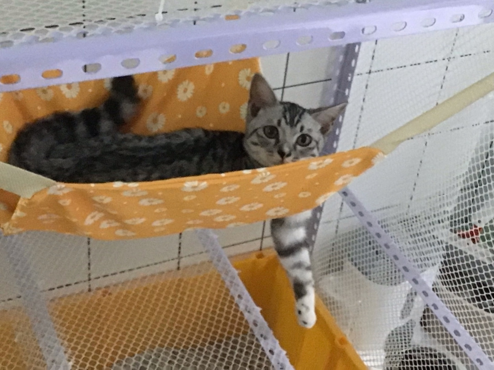 | 13 | 2026-04-16 |
| [中场休息，但是哈基米山歌](https://www.bilibili.com/video/BV1zddaB8Eic) |  | 194 | 2026-04-16 |
| [人鱼湾（哈基米版）](https://www.bilibili.com/video/BV1BfdaBtEjx) |  | 5.1万 | 2026-04-16 |
| [谢谢菲比的奖励喵🥵哈基米南北绿豆~](https://www.bilibili.com/video/BV1fidYBAEav) |  | 1411 | 2026-04-16 |
| [哈基米](https://www.bilibili.com/video/BV1y4dYBuEEJ) | 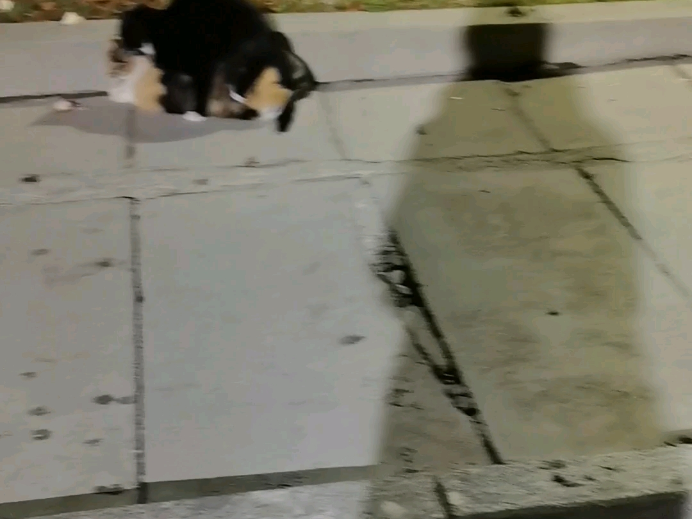 | 149 | 2026-04-16 |
| [【哈基米音乐】Gospel（Friday Night Funkin&#x27; Mid-Fight Masses Mod)](https://www.bilibili.com/video/BV1ryd8BFEZA) |  | 971 | 2026-04-16 |
| [【哈基米开战机】最新视频来袭，快来看看吧！](https://www.bilibili.com/video/BV1Qbd8B3EFH) |  | 22 | 2026-04-16 |
| [哈基米这个喜欢游泳](https://www.bilibili.com/video/BV1YPdhBjEB8) |  | 2740 | 2026-04-16 |
| [🐱哈基米一生🐱小学一走就是一天，初中一走就是一周…](https://www.bilibili.com/video/BV1yKQEBQEB3) | 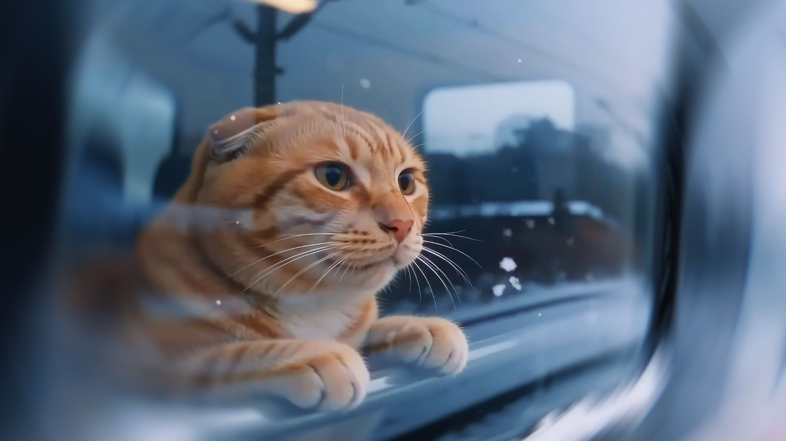 | 8764 | 2026-04-16 |
| [一生要耍朋友的猫](https://www.bilibili.com/video/BV1WWdhBYEPT) | 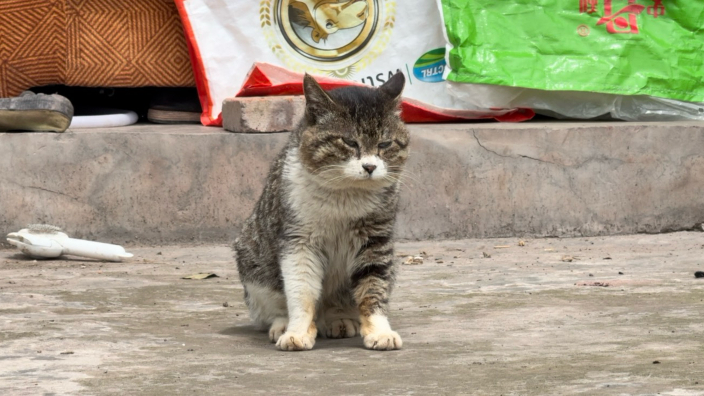 | 4.4万 | 2026-04-16 |
| [哈基米这个傻福乱钻洞](https://www.bilibili.com/video/BV14jdhBMERd) | 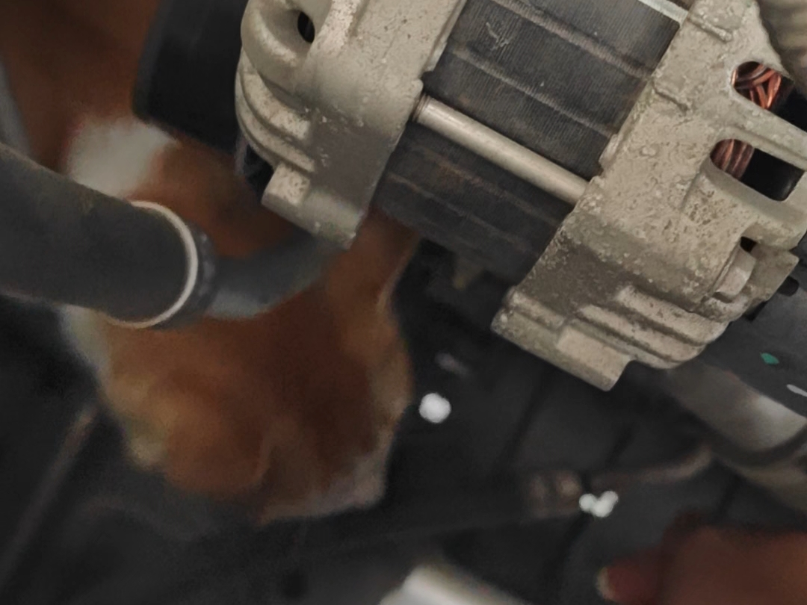 | 60 | 2026-04-16 |
| [🐱哈基米出山🐱这高音！真有劲！！](https://www.bilibili.com/video/BV1MHQJBhEYk) |  | 5991 | 2026-04-16 |
| [居然还带锅碗瓢盆一起玩，也是很喜欢哈基米了](https://www.bilibili.com/video/BV1zbdbBHE48) |  | 3.8万 | 2026-04-16 |
| [【IGN】《兔兔秘密花园2》40分钟实机演示](https://www.bilibili.com/video/BV1Exd4B1EFJ) |  | 24.5万 | 2026-04-16 |
| [【祖国版】哈基米原神芙宁娜开箱：造型惊艳！面雕不错！可惜涂装一般](https://www.bilibili.com/video/BV1NsQJBbEkJ) |  | 2401 | 2026-04-16 |
| [谢谢符玄的奖励🥵哈基米南北绿豆~](https://www.bilibili.com/video/BV1bDdbBTEJe) |  | 1.5万 | 2026-04-16 |
| [我是遐蝶的哈基米](https://www.bilibili.com/video/BV1fWQpBdE7s) |  | 1.4万 | 2026-04-16 |
| [不蒸馒头争口气 蘸豆！](https://www.bilibili.com/video/BV1daQpBnEjH) | 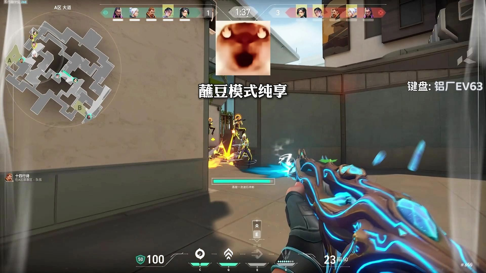 | 5.3万 | 2026-04-16 |
| [【吴买乐的哈基米】更新啦，赶紧来围观吧！](https://www.bilibili.com/video/BV1M2d4BwEq1) |  | 958 | 2026-04-16 |
| [你屁大点 抓什么老鼠啊](https://www.bilibili.com/video/BV1UxdtBeEa2) | 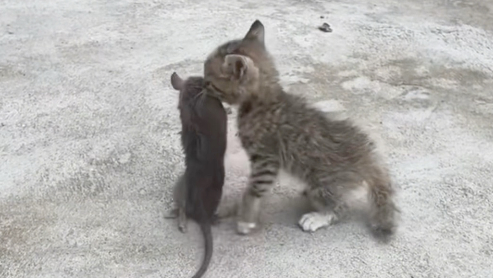 | 20.0万 | 2026-04-16 |
| [［meme］宝石。](https://www.bilibili.com/video/BV16ydtBHE1m) | 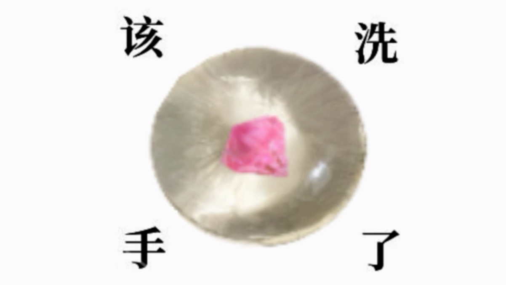 | 101.9万 | 2026-04-15 |
| [哈基米](https://www.bilibili.com/video/BV1UKQpBMEyZ) |  | 11 | 2026-04-15 |
| [【不得不哈】《小八翻唱》（原唱 哈基米 曼波）「原曲 不得不爱 Have to love」「原作调音填词 慎啸」原唱 潘玮柏 Wilber Pan 弦子](https://www.bilibili.com/video/BV1dgQGBREuA) |  | 382 | 2026-04-15 |
| [【基米世界】植物大战僵尸2 喵趣横生の小曲（Hi-Res）](https://www.bilibili.com/video/BV1eCQ7BBEEg) |  | 2466 | 2026-04-15 |
| [三角洲居然有片了！](https://www.bilibili.com/video/BV1B7QEB5Epz) |  | 16.6万 | 2026-04-15 |
| [晚安，小白](https://www.bilibili.com/video/BV15tQEBBEY5) | 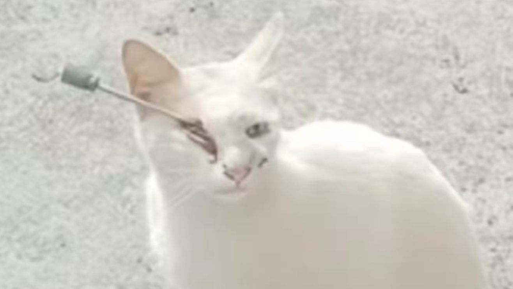 | 1.9万 | 2026-04-15 |
| [哈基米能否免疫画中女郎❗️](https://www.bilibili.com/video/BV1CNQEBpEDB) | 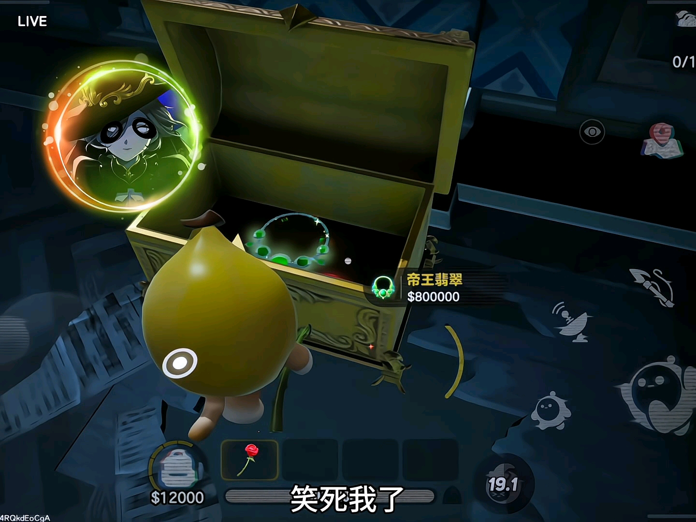 | 8.7万 | 2026-04-15 |
| [【miku/meme】关注一直卡在12.9感觉憋着一口气-低皮质醇](https://www.bilibili.com/video/BV1pDQEBQEBk) |  | 8.3万 | 2026-04-15 |
| [【乐正绫V5_chi】 翻唱 《蓝莲花》“哈基米哦~南北绿豆”](https://www.bilibili.com/video/BV1a8QEBTEog) |  | 71 | 2026-04-15 |
| [这是啥子角色？](https://www.bilibili.com/video/BV14EQ7BREmr) |  | 3.7万 | 2026-04-15 |
| [哈基米南北绿豆~](https://www.bilibili.com/video/BV1S8QjBtEUQ) |  | 4.9万 | 2026-04-15 |
| [叫！！！！！！！！！！！！！](https://www.bilibili.com/video/BV1YTQ7BAEkG) |  | 148.0万 | 2026-04-15 |
| [我只看到了一个绝望的威龙😉](https://www.bilibili.com/video/BV1XNQ7BeEUU) |  | 2.0万 | 2026-04-15 |
| [今天我们逃离的是绿色哈基米](https://www.bilibili.com/video/BV1VwQ7BiEys) |  | 1582 | 2026-04-15 |
| [这谁能忍住不摸！](https://www.bilibili.com/video/BV1JmQ5BMEBB) | 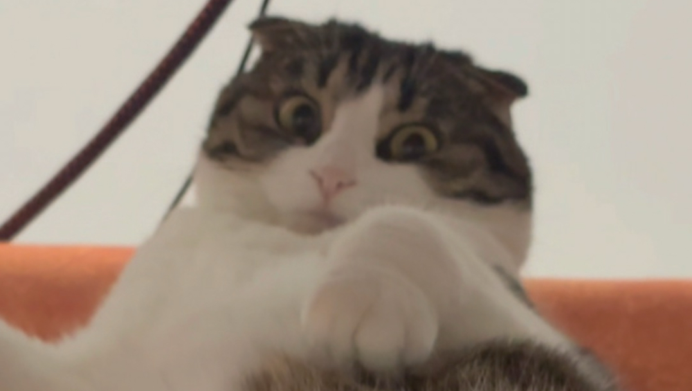 | 2.9万 | 2026-04-15 |
| [哈基米这个玩蛇](https://www.bilibili.com/video/BV1MXQLB9EAX) | 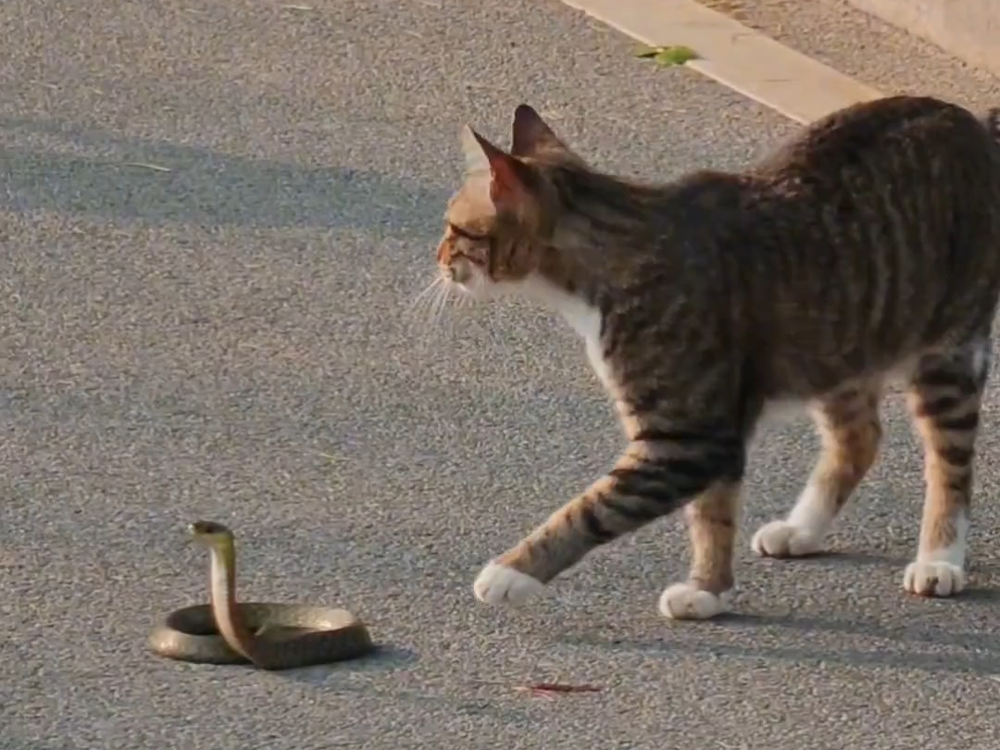 | 1.4万 | 2026-04-14 |
| [洛茜也要哈基米](https://www.bilibili.com/video/BV1K1QuBNEtL) |  | 3639 | 2026-04-14 |
| [【智人TV】这小章鱼一定得有塑料条才能支棱起来吗](https://www.bilibili.com/video/BV11bQYBAEni) |  | 26.8万 | 2026-04-14 |
| [小猫自己学会了耍玩具](https://www.bilibili.com/video/BV1bWQgBMEjs) | 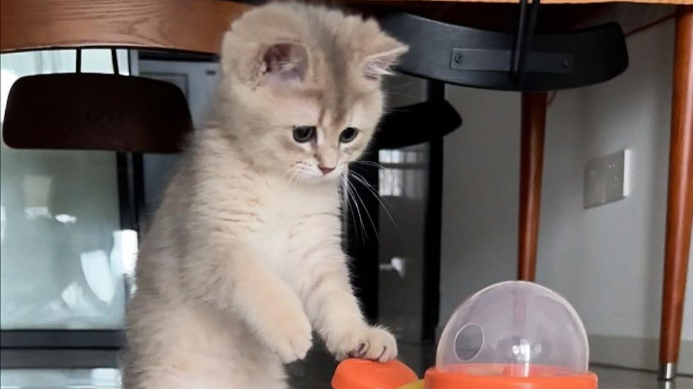 | 7.6万 | 2026-04-14 |
| [一些猎奇离谱AI视频（41）](https://www.bilibili.com/video/BV12GQ4BSE9B) |  | 4.3万 | 2026-04-14 |
| [哈基米：一下子好了，偷狗贼把媳妇偷走了](https://www.bilibili.com/video/BV1sVQeBAEwd) | 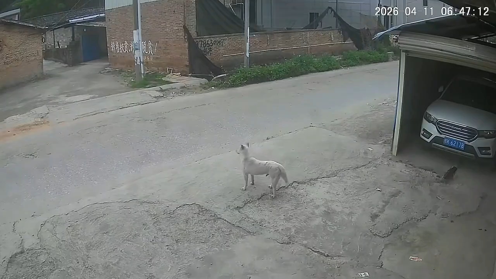 | 5.8万 | 2026-04-14 |
| [凯撒也要哈基咪~](https://www.bilibili.com/video/BV1CbQhBsEYb) |  | 6.3万 | 2026-04-13 |
| [高松灯也要哈基米~](https://www.bilibili.com/video/BV1bGQbBbESY) |  | 1.2万 | 2026-04-13 |
| [小猫咪是自愿跟我拍视频的](https://www.bilibili.com/video/BV1TEQbBsEsX) |  | 15.6万 | 2026-04-13 |
| [哈基米关灯神器曼波声控灯(带外壳版） 这关灯操作太抓马了 哈基米  曼波 这哈基米版关灯神器太抽象了 宿舍关灯神器](https://www.bilibili.com/video/BV1LZQxBcEQg) | 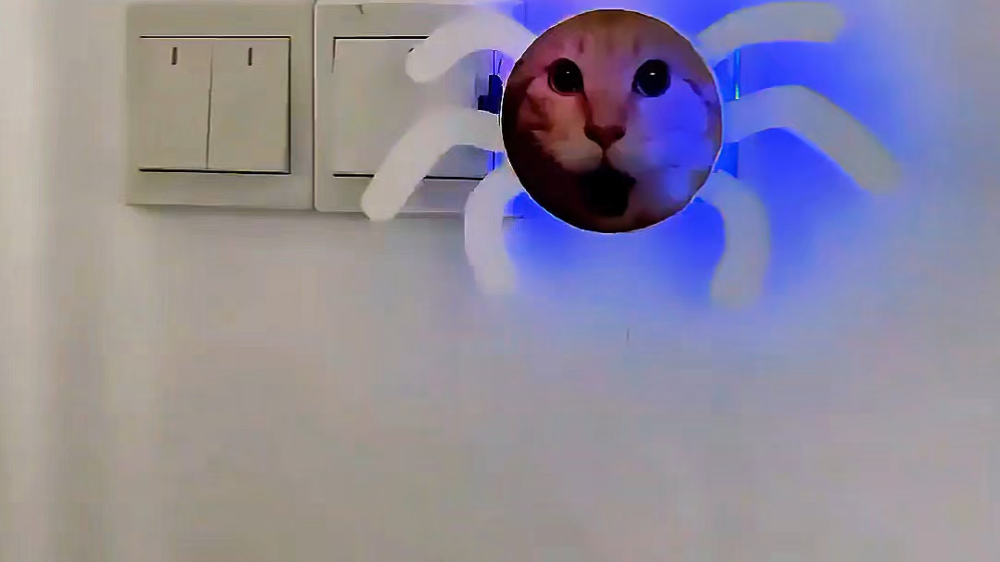 | 168 | 2026-04-13 |
| [有些小猫一看就是女孩子](https://www.bilibili.com/video/BV11FQtBmEuV) | 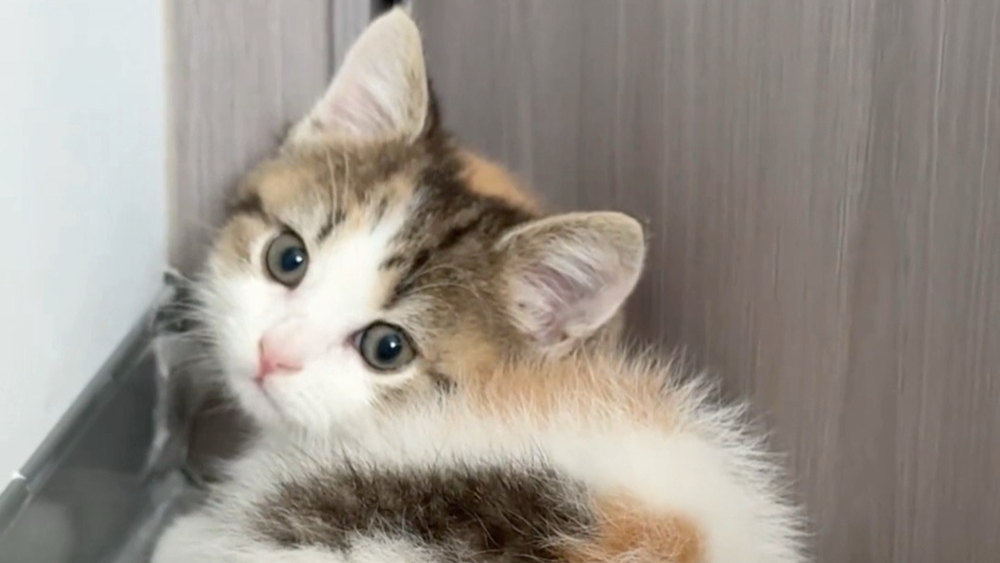 | 29.3万 | 2026-04-13 |
| [注意看，小马们发现一根水管](https://www.bilibili.com/video/BV1RCQ4BbENA) |  | 27.8万 | 2026-04-13 |
| [印度买瓜](https://www.bilibili.com/video/BV1ZbQsBcEkk) |  | 169.1万 | 2026-04-13 |
| [皮特大战侯默，但是插入AIZO](https://www.bilibili.com/video/BV1L3DQBeEUa) |  | 46.3万 | 2026-04-12 |
| [小时候第一次去充气城堡](https://www.bilibili.com/video/BV144DSB1ETh) | 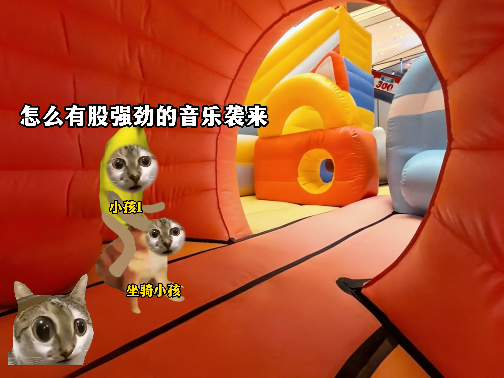 | 47.3万 | 2026-04-12 |
| [多 动 症 2.0](https://www.bilibili.com/video/BV1J1DSBYEhL) |  | 143.2万 | 2026-04-12 |
| [完了，出不去了](https://www.bilibili.com/video/BV12CDyBbEAj) |  | 29.0万 | 2026-04-11 |
| [进来听主唱哈基米南北绿豆阿西噶啊哈压库](https://www.bilibili.com/video/BV1TnD1BPEgC) | 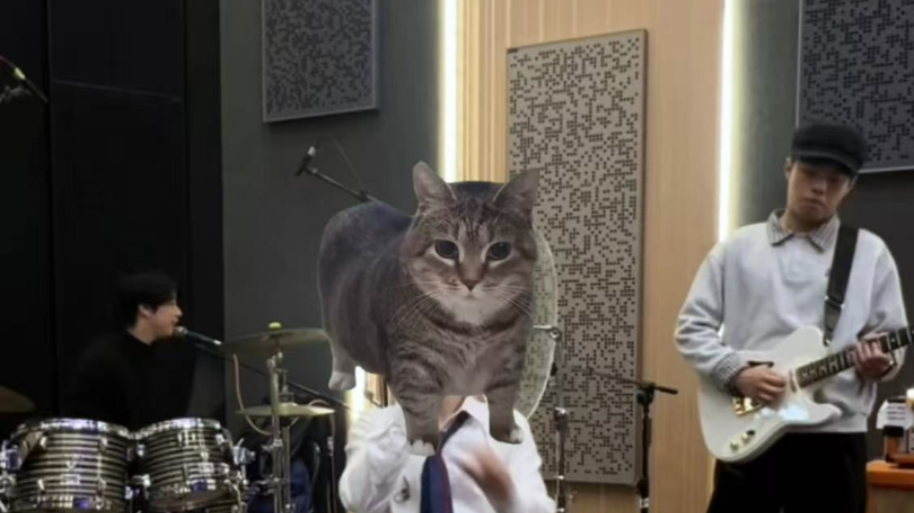 | 117 | 2026-04-11 |
| [这小蛇能吃得下这个哈基米？](https://www.bilibili.com/video/BV1g7QMBvEFn) | 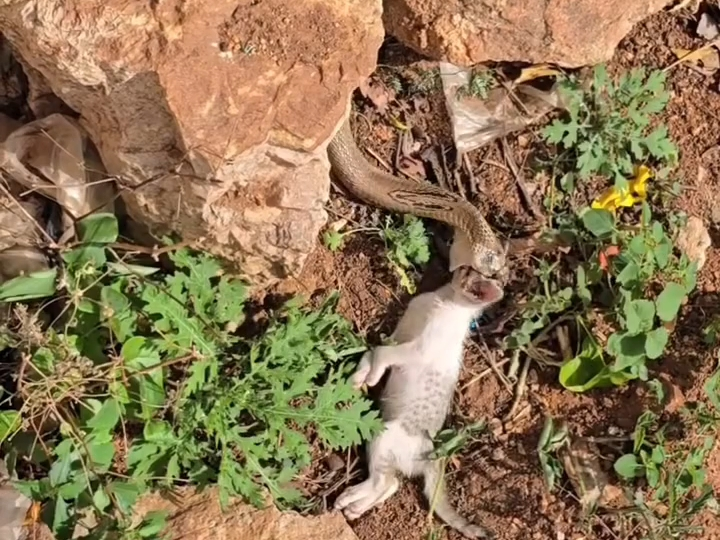 | 1.6万 | 2026-04-11 |
| [曼波出处 诗歌剧:曼波～曼波～](https://www.bilibili.com/video/BV1VmQKBKEqk) |  | 1166 | 2026-04-11 |
| [日推音乐｜【植物大战僵尸+？】](https://www.bilibili.com/video/BV1r7DjBkEYW) |  | 29.8万 | 2026-04-08 |
| [哈基咪驱魔](https://www.bilibili.com/video/BV1MADqBCELw) |  | 8.5万 | 2026-04-07 |
| [当bro以为它们是最火的猫咪时：](https://www.bilibili.com/video/BV175SfBQEpZ) | 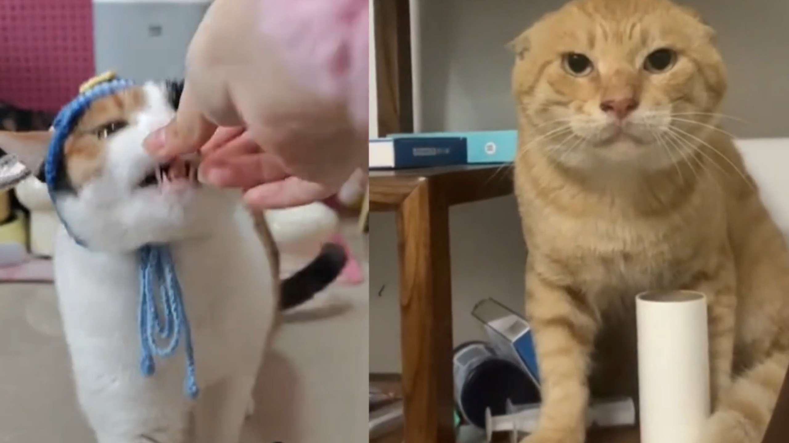 | 2.1万 | 2026-04-06 |
| [哈~基~马~路~哟~](https://www.bilibili.com/video/BV1uvSSBjEo3) |  | 91.2万 | 2026-04-05 |
| [当洛克累了一天回到家](https://www.bilibili.com/video/BV1npDNB6EEm) |  | 49.6万 | 2026-04-04 |
| [哈基米因为咬死小鸡被打](https://www.bilibili.com/video/BV1tsDPBJEUo) | 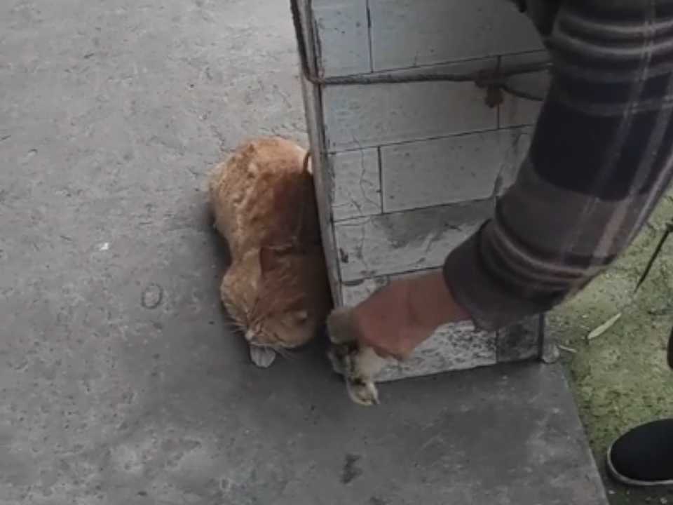 | 2.0万 | 2026-04-04 |
| [循环歌单｜《苏格拉底の小曲》BAD ENDING FUNK(Slowed)](https://www.bilibili.com/video/BV17V9KBjEB4) |  | 151.5万 | 2026-04-03 |
| [【循环歌单】丨《MONTAGEM ALQUIMIA》【唐嘉琦の小曲】【赏金猎人の小曲】“依旧摄影师单干，依旧剪辑单干，依旧尾部打双闪”](https://www.bilibili.com/video/BV1UT9ABXEcQ) |  | 109.4万 | 2026-04-02 |
| [没有了你我就像条🐧渴死的企鹅🐧](https://www.bilibili.com/video/BV1XCQSBoEQN) |  | 19.6万 | 2026-03-25 |
| [【AI三角洲全干员】《NO BATIDÃO》](https://www.bilibili.com/video/BV1omAAzZEM5) |  | 197.4万 | 2026-03-21 |
| [【猫meme】史上最全电子猫全明星](https://www.bilibili.com/video/BV1p5PyzxERL) |  | 3.7万 | 2026-03-06 |
| [乌克兰女兵自雷现场](https://www.bilibili.com/video/BV1ScPyzNEW1) |  | 59.1万 | 2026-03-05 |
| [来看企鹅跳舞2000小时纯享版](https://www.bilibili.com/video/BV1VVWGziEJ9) |  | 102.9万 | 2025-10-03 |
| [听取老吴一片](https://www.bilibili.com/video/BV1X45VzGEN5) | 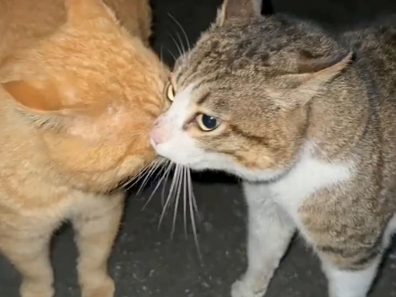 | 15.9万 | 2025-05-09 |

---
*最后更新: 2026-04-17 03:18:45 (自动生成)*
*数据来源: [Bilibili](https://www.bilibili.com)*

## 使用说明

运行以下命令更新视频列表:
```bash
python3 fetch_hajimi_videos.py
```
