# awesome-hajimi
collections of hajimi (哈基米 in Chinese) on the Internet.

## 视频列表 (Video List)

| 视频标题 (Title) | 封面 | 播放量 (Views) | 发布日期 (Date) |
|---|---|---|---|
| [哈基米](https://www.bilibili.com/video/BV1hcwezqEoe) | 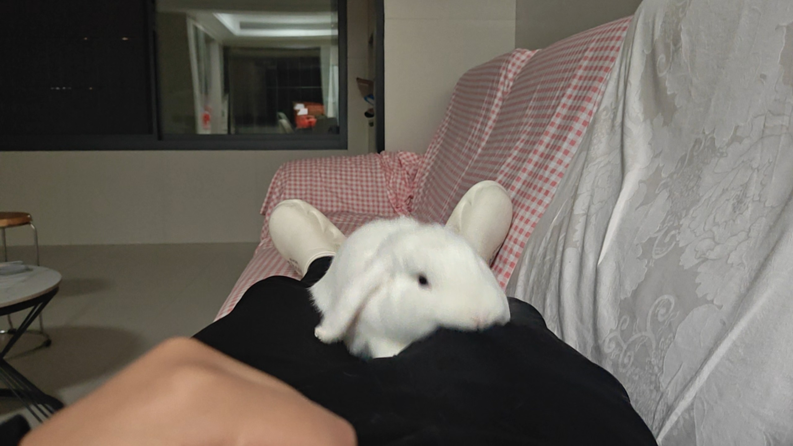 | 19 | 2026-03-18 |
| [大型纪录片《让哈基米炒两个菜》持续为您播出！](https://www.bilibili.com/video/BV1v9wYzGECM) |  | 8 | 2026-03-18 |
| [周杰伦新专辑预告【哈基米版】](https://www.bilibili.com/video/BV11jwozREaq) |  | 288 | 2026-03-18 |
| [【守望先锋】【CYX】路霸+哈基米太强了！](https://www.bilibili.com/video/BV19AwfzGEfw) |  | 293 | 2026-03-17 |
| [哈基米牌飞行员申请出战](https://www.bilibili.com/video/BV1mKwRz9EFk) |  | 80 | 2026-03-17 |
| [哈基米](https://www.bilibili.com/video/BV1JSwdz5EFw) |  | 3 | 2026-03-17 |
| [驴讲了一个笑话 所有动物都笑了 猫没笑为什么哈基米难被驴逗](https://www.bilibili.com/video/BV19fwdzTEUT) |  | 10 | 2026-03-17 |
| [哈基米难被驴逗](https://www.bilibili.com/video/BV1XFwoziEor) |  | 90 | 2026-03-17 |
| [哈基米难被驴逗](https://www.bilibili.com/video/BV19FwoziE8A) |  | 109 | 2026-03-17 |
| [哈基米难被驴逗](https://www.bilibili.com/video/BV19FwoziEW9) |  | 83 | 2026-03-17 |
| [【战地6】新图确实好玩！T0配备惨遭削弱！仍可在新图哈基米基地遨游？](https://www.bilibili.com/video/BV11LwozxE76) |  | 1452 | 2026-03-17 |
| [野生哈基米不懂抓老鼠](https://www.bilibili.com/video/BV1xRwozfEen) | 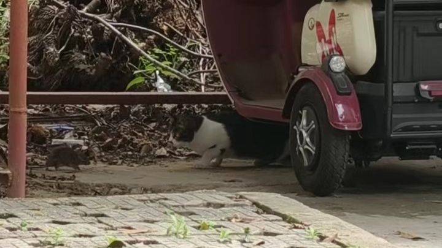 | 124 | 2026-03-17 |
| [【猫饼tv】“我的哈基米被车撞了”](https://www.bilibili.com/video/BV1erwozBEah) |  | 7390 | 2026-03-17 |
| [哈基米：困](https://www.bilibili.com/video/BV1vBwoz6Eb4) | 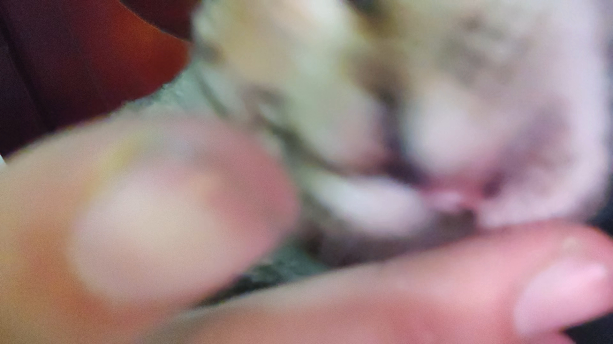 | 34 | 2026-03-17 |
| [蠢笔TV P28](https://www.bilibili.com/video/BV1X6wozuE87) |  | 12.9万 | 2026-03-17 |
| [神秘耄耋基米，重现哈人间](https://www.bilibili.com/video/BV11uwRzQEpG) |  | 92 | 2026-03-17 |
| [【哈基米现代战舰】更新啦，赶紧来围观吧！](https://www.bilibili.com/video/BV1iQw9zNEXt) |  | 18 | 2026-03-17 |
| [🐱 我 本 将 心 向 明 月 🐱](https://www.bilibili.com/video/BV1RXw9zYE6i) |  | 1817 | 2026-03-17 |
| [眼睛瞎在小猫上，无敌可爱哈基米](https://www.bilibili.com/video/BV1qtwRzzE1W) |  | 126 | 2026-03-17 |
| [三角洲@哈基米#AI视频](https://www.bilibili.com/video/BV1YewRzvERX) |  | 595 | 2026-03-17 |
| [哈基米的野都被犬神偷光了](https://www.bilibili.com/video/BV1iewRzvEMY) |  | 151 | 2026-03-17 |
| [哈基米逃跑计划](https://www.bilibili.com/video/BV1qhwRzqEAn) | 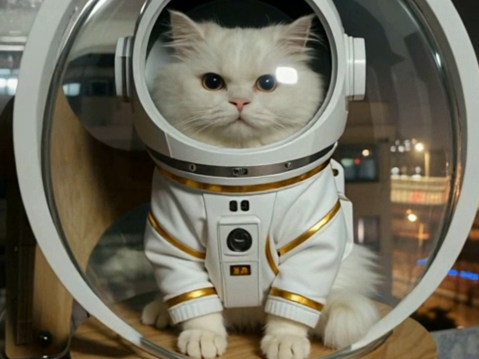 | 20 | 2026-03-17 |
| [哈基米南北绿豆](https://www.bilibili.com/video/BV1s5wRzJEQf) | 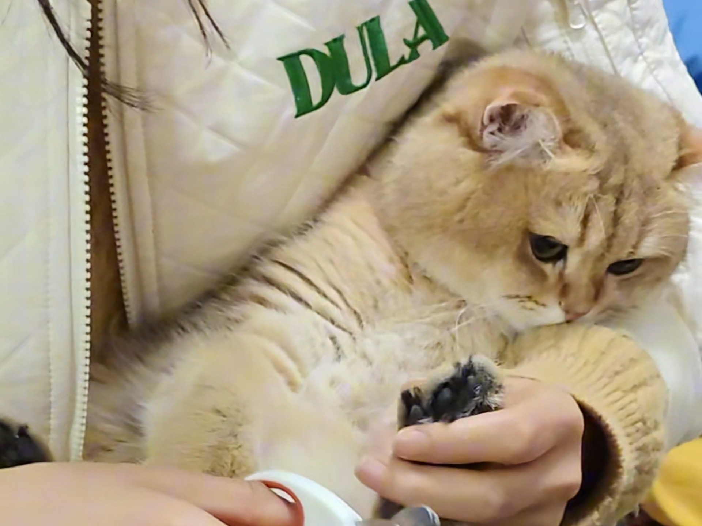 | 134 | 2026-03-17 |
| [哈基米吃播](https://www.bilibili.com/video/BV1C5wRzEEpd) |  | 106 | 2026-03-17 |
| [【Hi‑Res】哈基米 - 哈沫｜哈沫 全都是曼波～](https://www.bilibili.com/video/BV1yLwRzmEjk) | 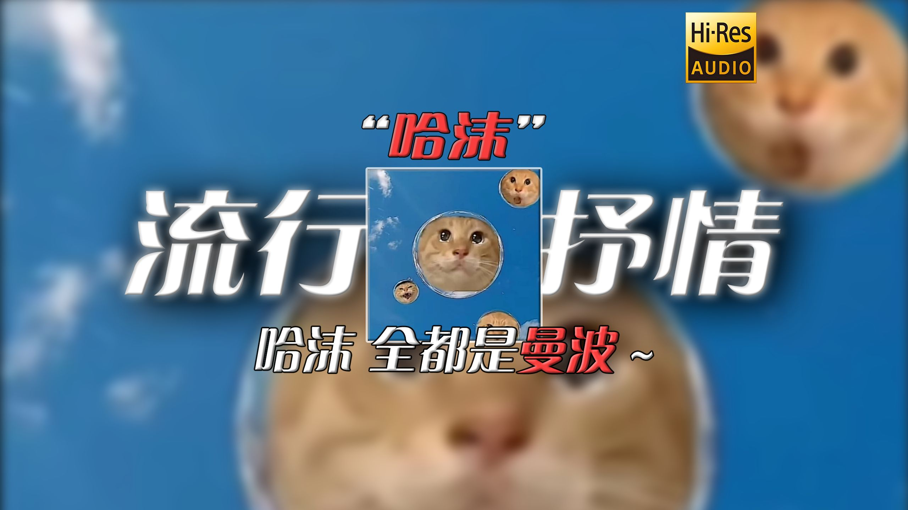 | 48 | 2026-03-17 |
| [隔壁蓝猫哈基米快燃尽了，在大马路上睡觉。#蓝猫 #哈基米   #哈基米燃尽 #哈基米哈基米  #爱猫TV](https://www.bilibili.com/video/BV1P7wRz7EhY) | 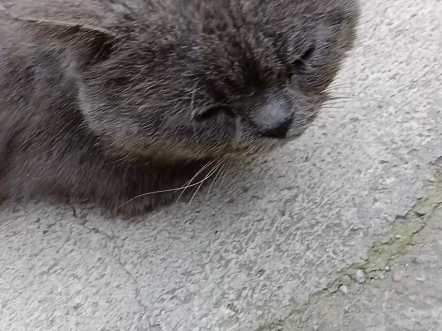 | 77 | 2026-03-17 |
| [哈基米吸奶茶x2](https://www.bilibili.com/video/BV1sXwRzpEUW) | 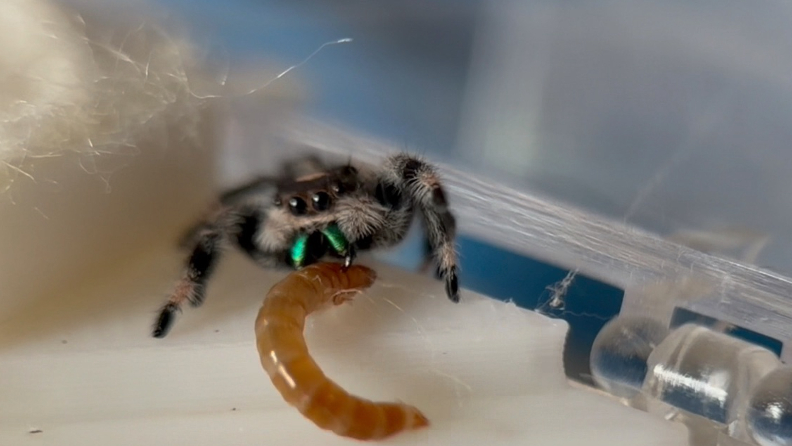 | 33 | 2026-03-17 |
| [龙骑哈基米。](https://www.bilibili.com/video/BV1N9wRzXE4X) | 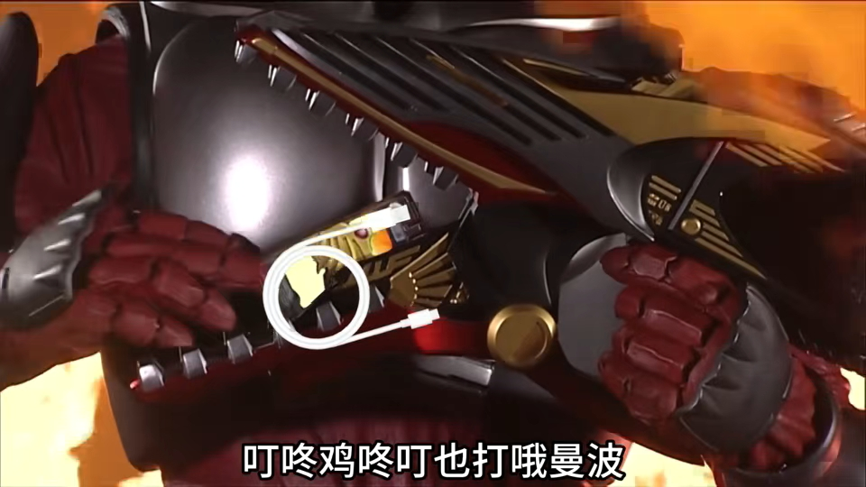 | 19 | 2026-03-17 |
| [泰罗（哈基米版）](https://www.bilibili.com/video/BV1DywRzZEcr) | 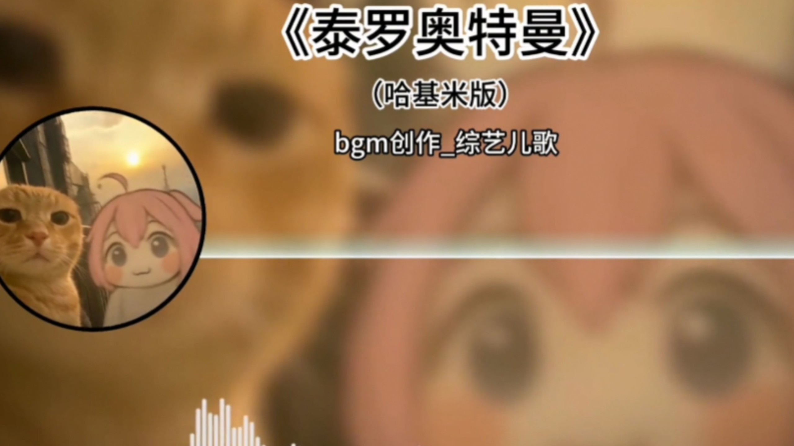 | 208 | 2026-03-17 |
| [国外趣味视频集锦＆动物迷惑行为大赏#272](https://www.bilibili.com/video/BV11MwXzyEaT) |  | 7.0万 | 2026-03-17 |
| [未必船长的冒险故事 第四季 26](https://www.bilibili.com/video/BV1RYwXztEFw) |  | 1.1万 | 2026-03-17 |
| [火花:粉丝宝宝们~花花火是好女孩吗?〖白白剧场〗](https://www.bilibili.com/video/BV137w9ztE2i) |  | 8.7万 | 2026-03-17 |
| [报告长官 鼠鼠把人口完了](https://www.bilibili.com/video/BV18BwDzjE3Q) | 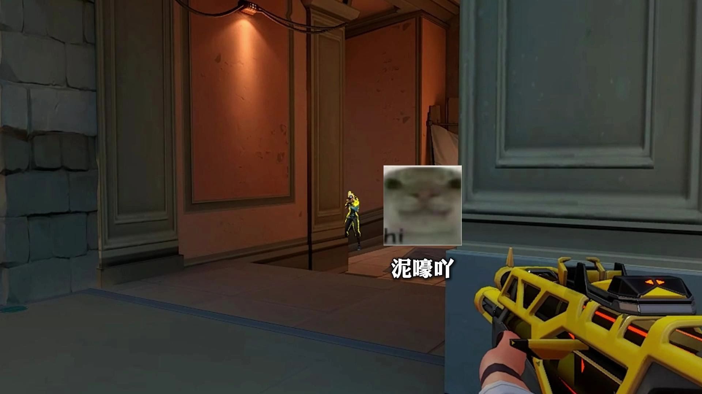 | 2.5万 | 2026-03-17 |
| [一口气听完三十首哈基米合集，全听过的网瘾不小呀](https://www.bilibili.com/video/BV1LMw9zeECd) | 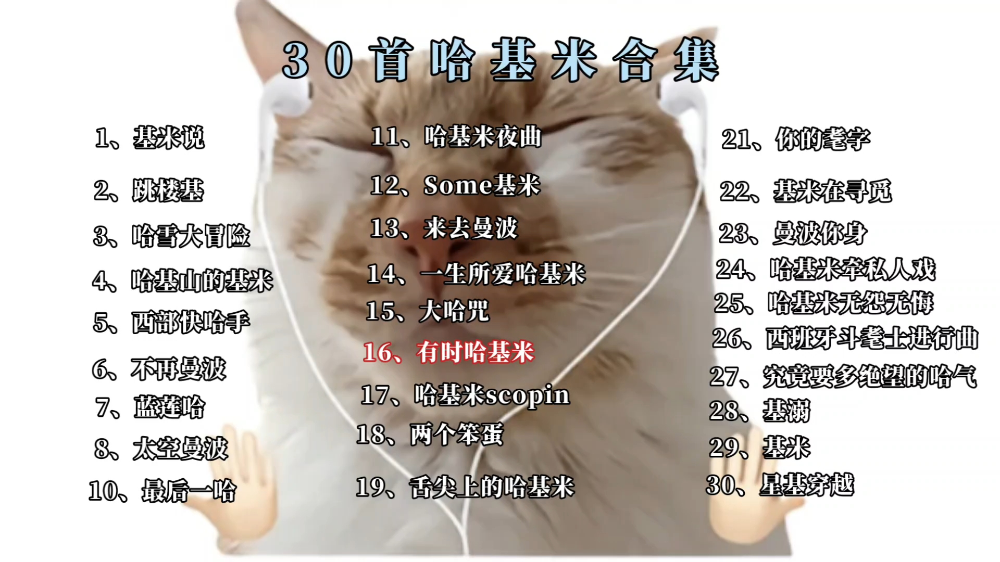 | 1763 | 2026-03-17 |
| [混社会的哈基米](https://www.bilibili.com/video/BV1Wew9z2EyM) | 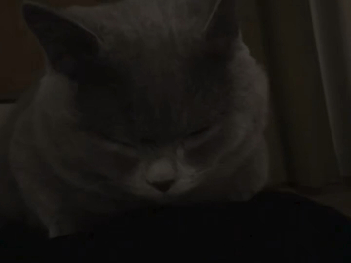 | 22 | 2026-03-17 |
| [哈基米：伪哈基语【哈基杯Day3】so](https://www.bilibili.com/video/BV1FCw9z6EhU) |  | 0 | 2026-03-17 |
| [哈基汪15分钟合集](https://www.bilibili.com/video/BV1uHw9zREfX) |  | 3486 | 2026-03-17 |
| [哈基米我允许你哈气了](https://www.bilibili.com/video/BV1W8wQzrEPB) | 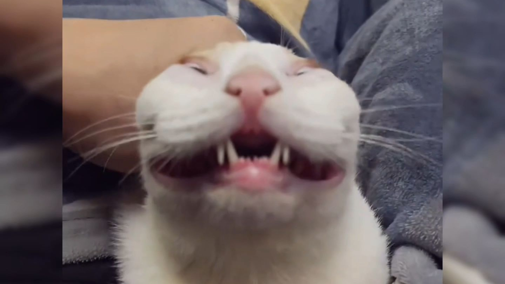 | 3250 | 2026-03-17 |
| [哈基米吃饭的时候被坚强了](https://www.bilibili.com/video/BV1pDwDzME2C) |  | 4.0万 | 2026-03-17 |
| [最最最后の哈基米](https://www.bilibili.com/video/BV16ZwDzYEkt) |  | 572 | 2026-03-17 |
| [最后后后の哈基米](https://www.bilibili.com/video/BV1nRwDzvEoA) |  | 645 | 2026-03-17 |
| [傲娇的小姐](https://www.bilibili.com/video/BV1NxwQz5E1F) | 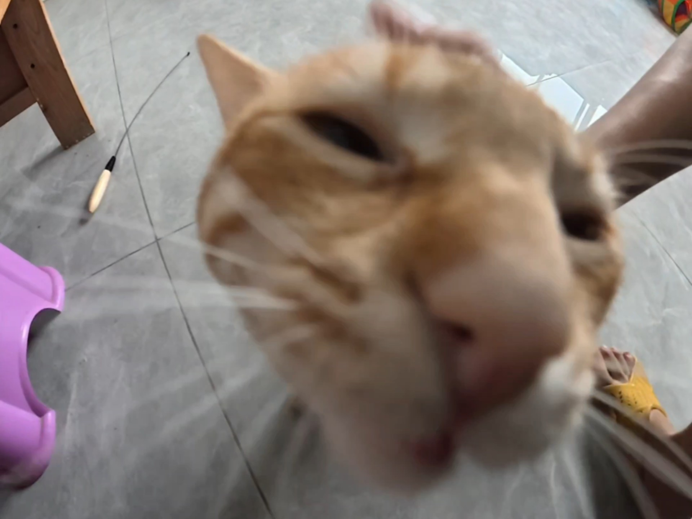 | 10.0万 | 2026-03-17 |
| [眼睛瞎在小猫上！](https://www.bilibili.com/video/BV1q5w2zjEw7) | 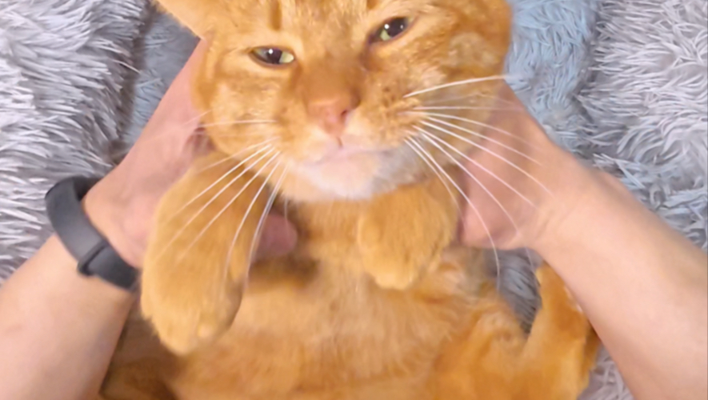 | 1.4万 | 2026-03-17 |
| [哈基米这个舒服呦](https://www.bilibili.com/video/BV1DZwQzHEcP) |  | 328 | 2026-03-17 |
| [张顺飞看炫神和电棍事件！张顺飞：跟我没关系我不评论，我不给某某UP主桌子上加餐！](https://www.bilibili.com/video/BV1LPwSzDEKq) |  | 6.8万 | 2026-03-17 |
| [哈基米不想跟樹耗子玩耍](https://www.bilibili.com/video/BV1ovwmzDEQj) | 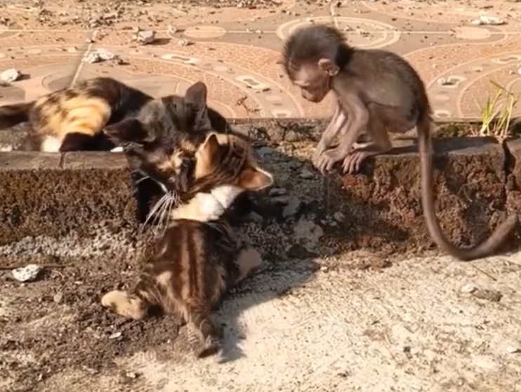 | 1143 | 2026-03-16 |
| [这我可以玩一天](https://www.bilibili.com/video/BV1g2w1ziEpU) | 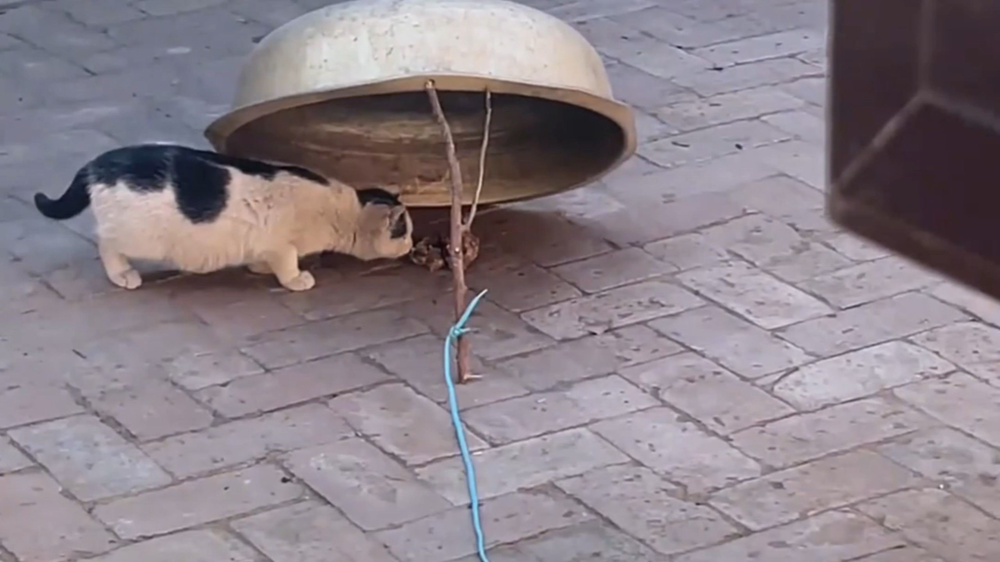 | 2.0万 | 2026-03-16 |
| [【哈基米音乐】🐱as long as 基哈米🐱](https://www.bilibili.com/video/BV1EXw2znExn) | 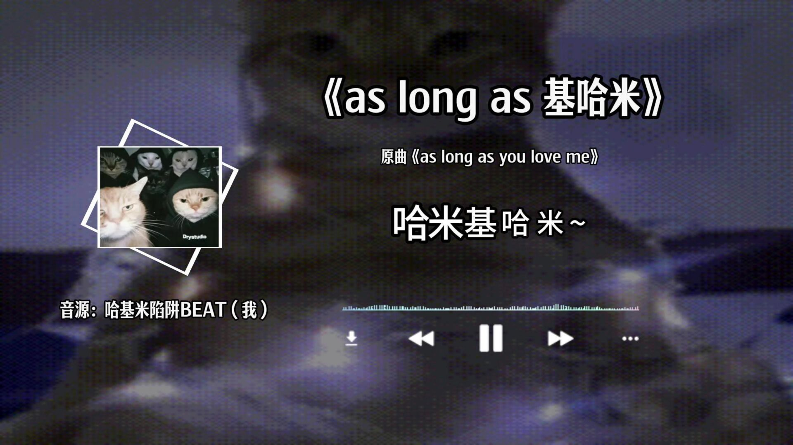 | 150 | 2026-03-16 |
| [牵丝♂戏](https://www.bilibili.com/video/BV17Fw7zPEvM) |  | 2.2万 | 2026-03-16 |
| [驾校目击电摩哈基米](https://www.bilibili.com/video/BV1QRw7zxEzy) | 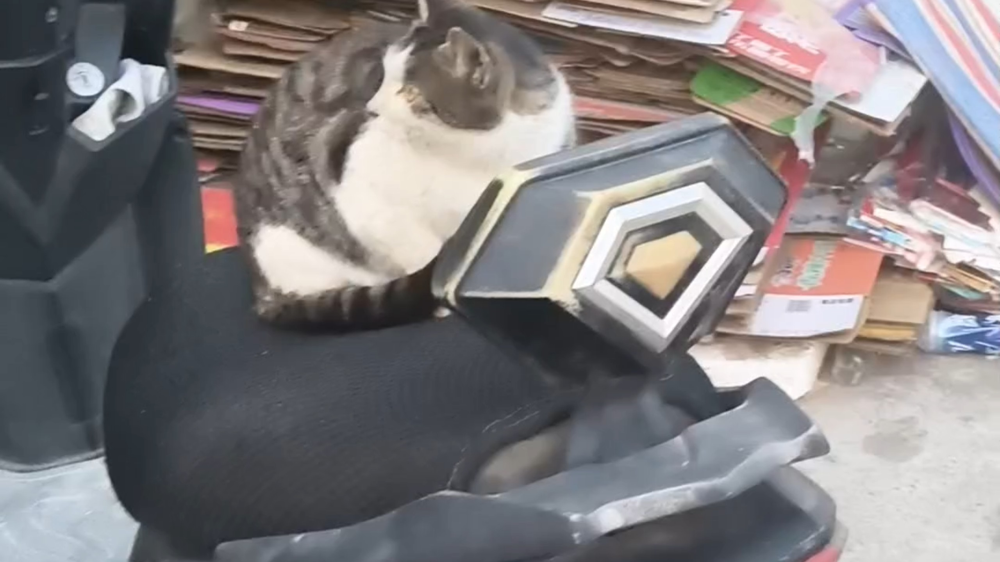 | 202 | 2026-03-16 |
| [【果泥TV】当小学生遇上ch，已吓哭😱](https://www.bilibili.com/video/BV1Lmw7zwEaN) |  | 4.6万 | 2026-03-16 |
| [当 代 热 门 游 戏 现 状：](https://www.bilibili.com/video/BV16jwEz3Eht) |  | 43.5万 | 2026-03-16 |
| [“绝 世 好 猫！”](https://www.bilibili.com/video/BV1xMwEzmEsW) | 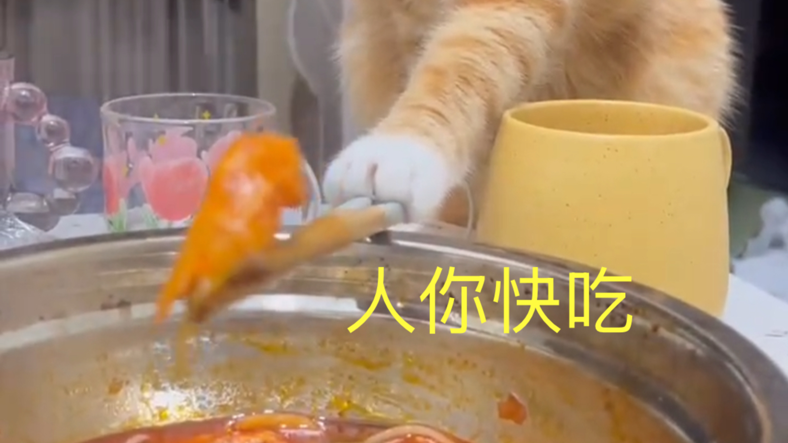 | 9.1万 | 2026-03-16 |
| [【哈基米】“哈基米南北绿豆~”](https://www.bilibili.com/video/BV14HwLz3E3Y) |  | 334 | 2026-03-16 |
| [《爱属性》但全程一个音](https://www.bilibili.com/video/BV1bGwLz7E6c) |  | 6571 | 2026-03-16 |
| [小刀盾的进化之路S2-01](https://www.bilibili.com/video/BV13uwLzJEj5) |  | 15.9万 | 2026-03-16 |
| [哈基米一路走好](https://www.bilibili.com/video/BV1fvwLzhEi2) | 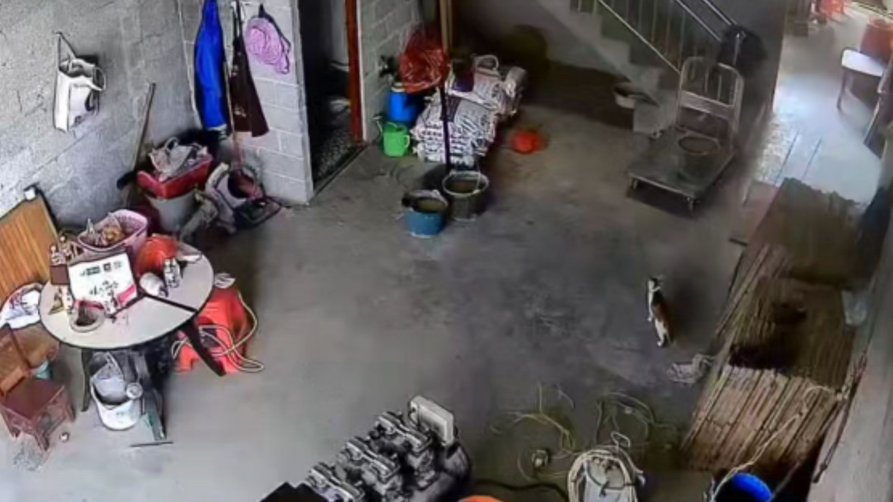 | 9916 | 2026-03-16 |
| [反正咪的身材很曼妙](https://www.bilibili.com/video/BV1PLw3zfEWx) | 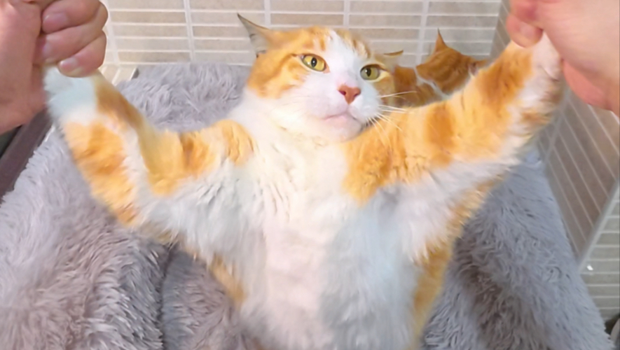 | 6145 | 2026-03-16 |
| [老大你的手在干嘛](https://www.bilibili.com/video/BV1D2wVzLEKc) | 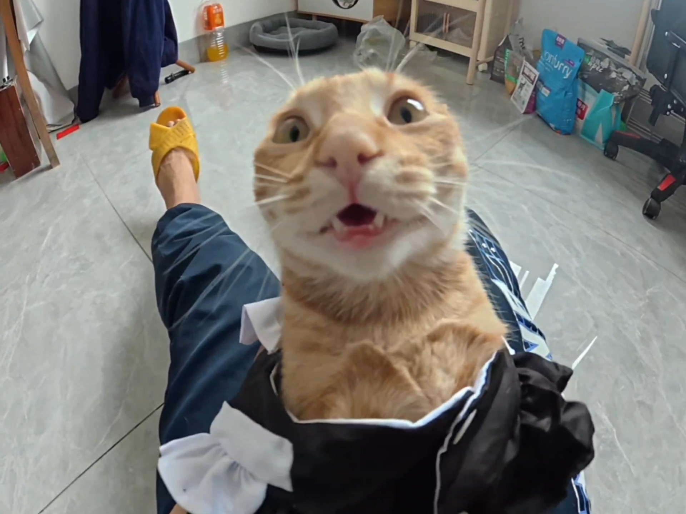 | 18.3万 | 2026-03-16 |
| [“隔壁改法的P90也能爽吃百万！”](https://www.bilibili.com/video/BV14Bw5z6EtV) |  | 1.1万 | 2026-03-16 |
| [猫: 怎么舔我都可以…扎我可就不行了！](https://www.bilibili.com/video/BV1KVw3zcEQi) | 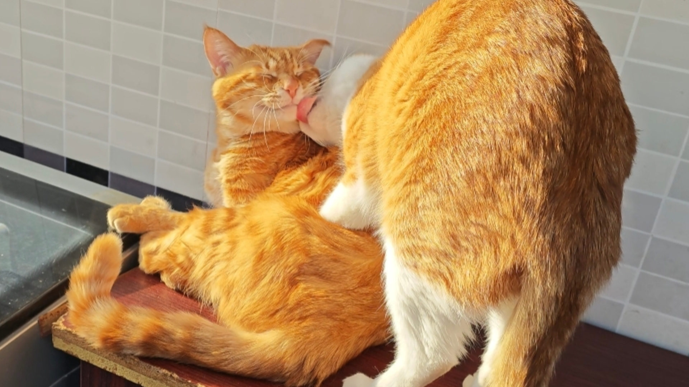 | 1.5万 | 2026-03-15 |
| [一边打猫一边求原谅会怎样](https://www.bilibili.com/video/BV1bPwuzbEoc) | 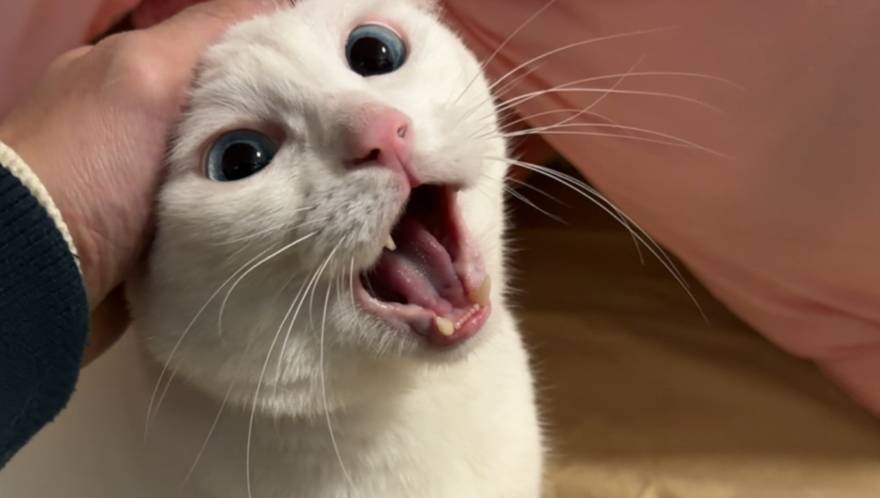 | 36.2万 | 2026-03-15 |
| [不看说明书这一块](https://www.bilibili.com/video/BV1BTwgzLEkF) |  | 29.1万 | 2026-03-15 |
| [⚡️Beep Beep扣帽子⚡️](https://www.bilibili.com/video/BV1rfwuzDECa) |  | 20.4万 | 2026-03-15 |
| [【智人TV】没有人跟我一样喜欢吃发霉的东西吗？](https://www.bilibili.com/video/BV1XxwNzoEUi) |  | 35.5万 | 2026-03-15 |
| [曼波大战凑企鹅](https://www.bilibili.com/video/BV14CwNzjEYN) | 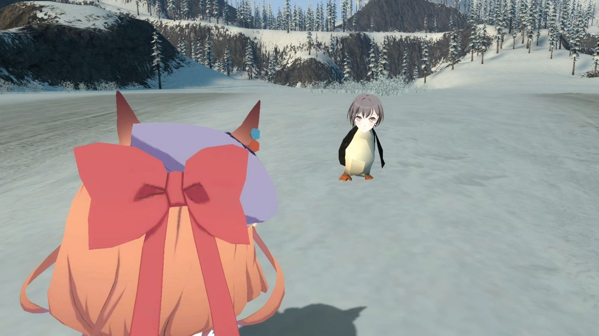 | 45.9万 | 2026-03-15 |
| [请选择你的英雄～](https://www.bilibili.com/video/BV1oHwNz8EtS) | 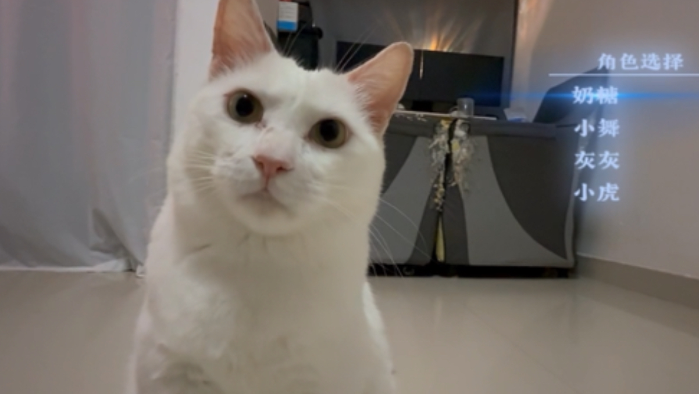 | 93.3万 | 2026-03-15 |
| [猫咪：“特喵的，这辈子没这么无语过”](https://www.bilibili.com/video/BV1LNwKzwEK9) | 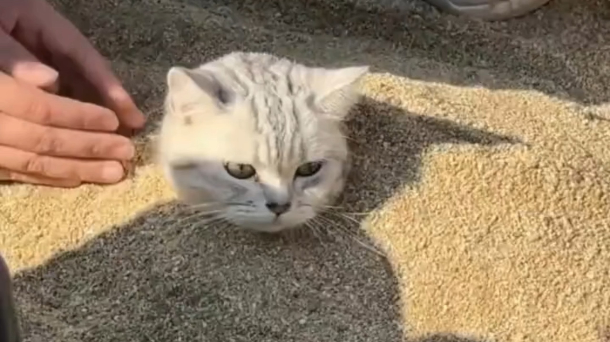 | 7.5万 | 2026-03-15 |
| [全B站最全常熟阿诺诺神胡言乱语45分钟超长合集，一次看到爽](https://www.bilibili.com/video/BV1gowKzxEZn) |  | 2.5万 | 2026-03-15 |
| [狗子：生不出狗宝宝，烦死狗了](https://www.bilibili.com/video/BV1jWwtztEH6) | 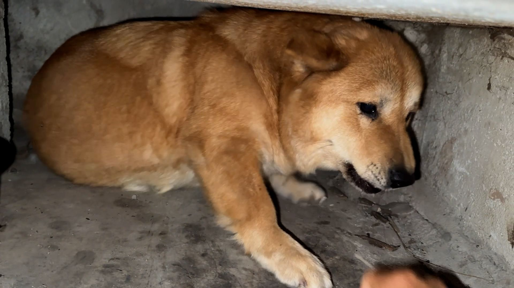 | 11.3万 | 2026-03-15 |
| [冻: 小时候真傻，居然盼望着长大…面对两个大变泰](https://www.bilibili.com/video/BV1aQw4zJE3t) | 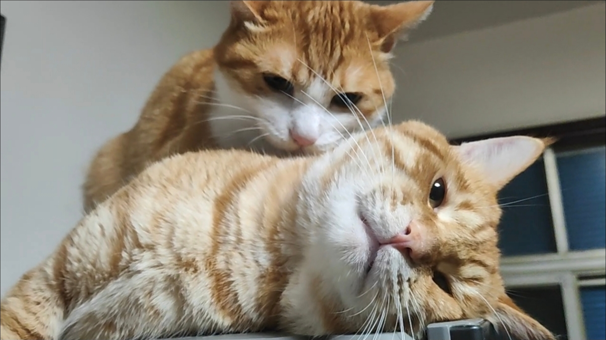 | 10.2万 | 2026-03-14 |
| [大耄耋【填词改编】](https://www.bilibili.com/video/BV1xwwtzkERf) |  | 5567 | 2026-03-14 |
| [暴雨可湿衣衫，难浇胸中坚持之心。勇敢的去⚡爆⚡回⚡吧！](https://www.bilibili.com/video/BV16mcSztEMi) |  | 10.9万 | 2026-03-13 |
| [Bili_Board术力口传说曲周榜第52期2026年3月13日第11周](https://www.bilibili.com/video/BV1R1cCzeEYE) |  | 46.1万 | 2026-03-13 |
| [自由的龙儿是关不住的《笑声客的救赎》](https://www.bilibili.com/video/BV1nTcQzYEnc) |  | 74.3万 | 2026-03-13 |
| [小刀盾的进化之路第一季（完整版）](https://www.bilibili.com/video/BV1tQcDzCEtj) |  | 314.3万 | 2026-03-13 |
| [【智人TV】治疗宫寒这一块 &amp; 打胎这一块](https://www.bilibili.com/video/BV1dkcCziErP) |  | 27.7万 | 2026-03-13 |
| [【初音ミク】Looping the Rooms【Neutroa Remix】](https://www.bilibili.com/video/BV1bmcUzBEnL) |  | 23.5万 | 2026-03-13 |
| [大只吗？倒也可斩！！](https://www.bilibili.com/video/BV18scSzVEdE) |  | 75.8万 | 2026-03-13 |
| [rush meep](https://www.bilibili.com/video/BV13ncmzMEog) | 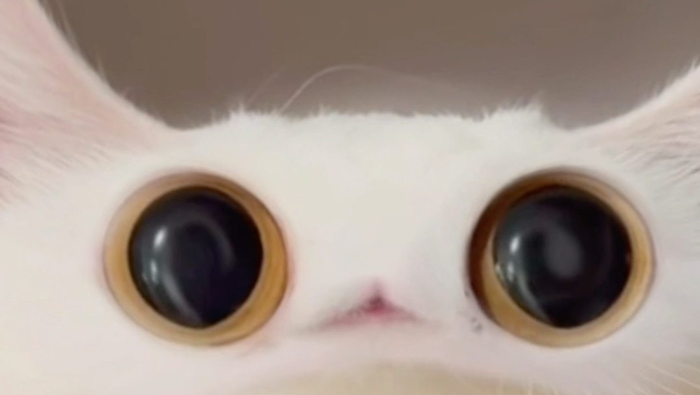 | 33.6万 | 2026-03-12 |
| [TikTok小企鹅管理员成功污染外网，评论区化身大型发癫现场。令鹅头疼～(￣▽￣～)~](https://www.bilibili.com/video/BV1Ycwwz7EjG) |  | 32.1万 | 2026-03-12 |
| [【循环歌单】【死对头小猫の小曲】【猫memeの小曲】《我们俩DJ》](https://www.bilibili.com/video/BV1FPwcz4ELe) | 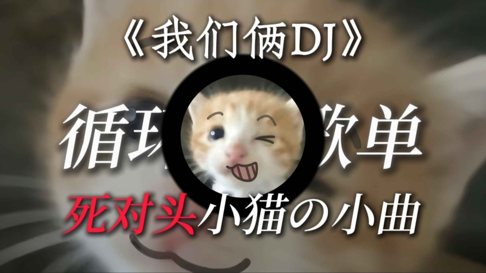 | 7.3万 | 2026-03-12 |
| [黄金船看脑筋急转弯（配音）](https://www.bilibili.com/video/BV1wwwczZEa8) |  | 84.0万 | 2026-03-11 |
| [🐧原来大家已经不喜欢凑企鹅了吗……？🐧【番外篇】](https://www.bilibili.com/video/BV1sowFzwEs8) |  | 872.8万 | 2026-03-11 |
| [嘎 嘎 滴 辣 虾](https://www.bilibili.com/video/BV1o5wczUEPu) |  | 39.2万 | 2026-03-11 |
| [“彼养得功德”](https://www.bilibili.com/video/BV1XpwczVELq) |  | 37.1万 | 2026-03-11 |
| [“小狗我啊，又要挨揍咯！”](https://www.bilibili.com/video/BV1RGcfzGEPC) | 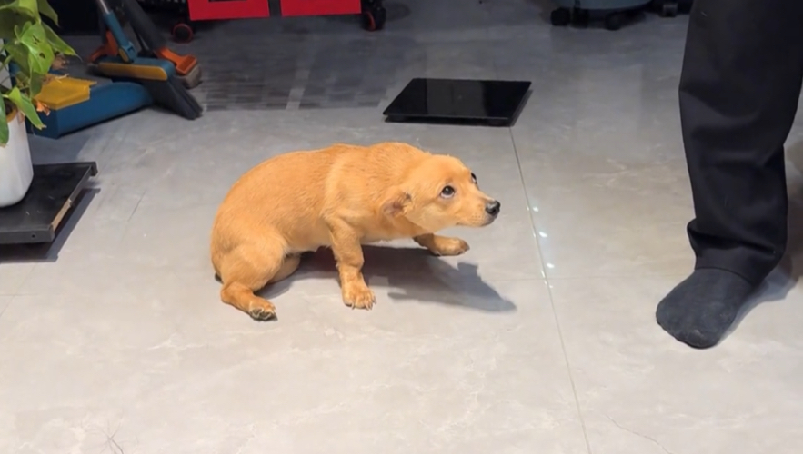 | 19.5万 | 2026-03-11 |
| [【伯虎哈】基米说，提督专属投稿给小咔拉米，哈基米歌曲翻唱](https://www.bilibili.com/video/BV1P4cRz7ETS) |  | 499 | 2026-03-11 |
| [Wake Up Hajimi - 哈基米起床](https://www.bilibili.com/video/BV1GxcQznEJK) |  | 280 | 2026-03-10 |
| [绝世好猫](https://www.bilibili.com/video/BV1Q4PfzCEgG) | 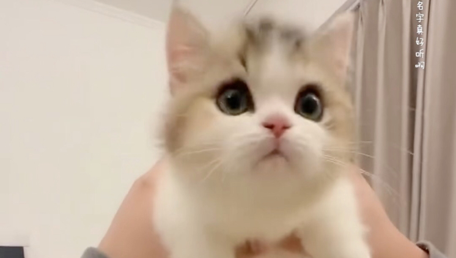 | 3.0万 | 2026-03-10 |
| [动物们的无语瞬间～](https://www.bilibili.com/video/BV1vjADzxE6T) | 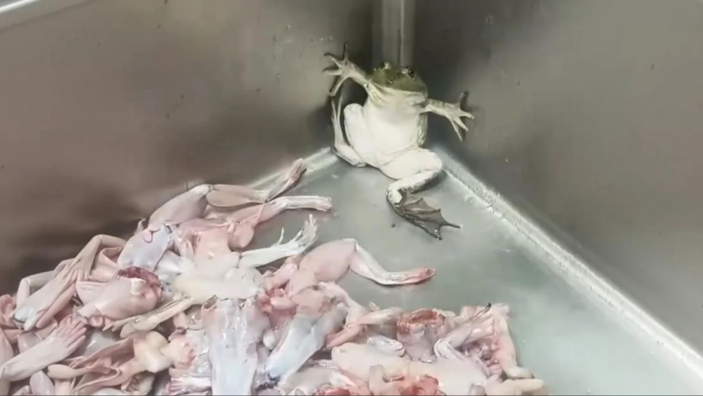 | 40.5万 | 2026-03-05 |
| [【音MAD】雪地里传来了铁砧声](https://www.bilibili.com/video/BV1E9PPzqEaJ) |  | 24.5万 | 2026-03-04 |
| [✋🐱](https://www.bilibili.com/video/BV1wXAizeE9H) |  | 29.9万 | 2026-03-01 |
| [白菜对我笑 大狗对我叫](https://www.bilibili.com/video/BV1k3Aez9EAA) |  | 14.9万 | 2026-02-28 |
| [外网meme视频合集](https://www.bilibili.com/video/BV1jBAhzzEkP) | 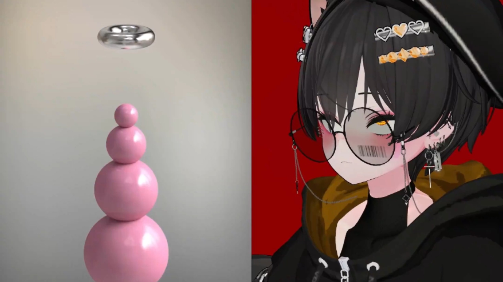 | 34.9万 | 2026-02-28 |
| [&quot;十年窗下无人问 一举成名他名扬&quot; 《我本将心向明月》【Hi-Res 24bit/192kHz】](https://www.bilibili.com/video/BV1vPcuzvEVj) |  | 123.7万 | 2026-02-09 |
| [我在等前奏](https://www.bilibili.com/video/BV1bdqfB6EGZ) |  | 22.8万 | 2025-12-19 |
| [【中日字幕/ぴーなた】求＆影 - feat. 重音テト](https://www.bilibili.com/video/BV1qG2LBpEUV) |  | 326.4万 | 2025-12-05 |
| [(完整版) 曼波《莫愁乡》](https://www.bilibili.com/video/BV1uK3qzPEZq) |  | 90.2万 | 2025-07-06 |
| [波西米亚狂想抽](https://www.bilibili.com/video/BV1aTvieqEfw) |  | 1552.6万 | 2024-08-01 |

---
*最后更新: 2026-03-18 03:15:17 (自动生成)*
*数据来源: [Bilibili](https://www.bilibili.com)*

## 使用说明

运行以下命令更新视频列表:
```bash
python3 fetch_hajimi_videos.py
```
