# awesome-hajimi
collections of hajimi (哈基米 in Chinese) on the Internet.

## 视频列表 (Video List)

| 视频标题 (Title) | 封面 | 播放量 (Views) | 发布日期 (Date) |
|---|---|---|---|
| [哈基米](https://www.bilibili.com/video/BV1QnRhBrEFF) |  | 131 | 2026-05-07 |
| [哈基米就是自己最爱的心头好](https://www.bilibili.com/video/BV1DkRaBLEp7) |  | 12 | 2026-05-06 |
| [【哈基米音乐】掉血の小曲（洛克王国手游）](https://www.bilibili.com/video/BV19vR8BGEsj) |  | 1058 | 2026-05-06 |
| [哈基米下楼](https://www.bilibili.com/video/BV12DR8BwELP) | 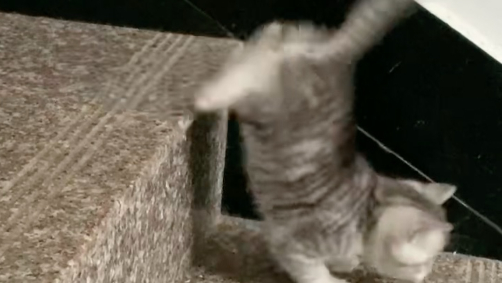 | 10 | 2026-05-06 |
| [用哈基米视角观察哈基米](https://www.bilibili.com/video/BV1fJRtByE4N) | 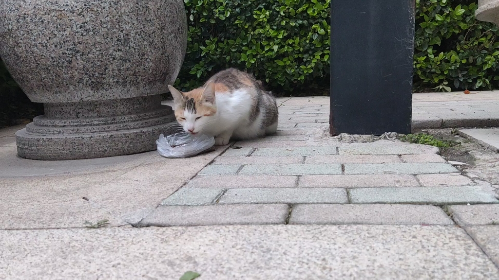 | 257 | 2026-05-06 |
| [陋室偶得一哈基米](https://www.bilibili.com/video/BV17pRtBCE6m) | 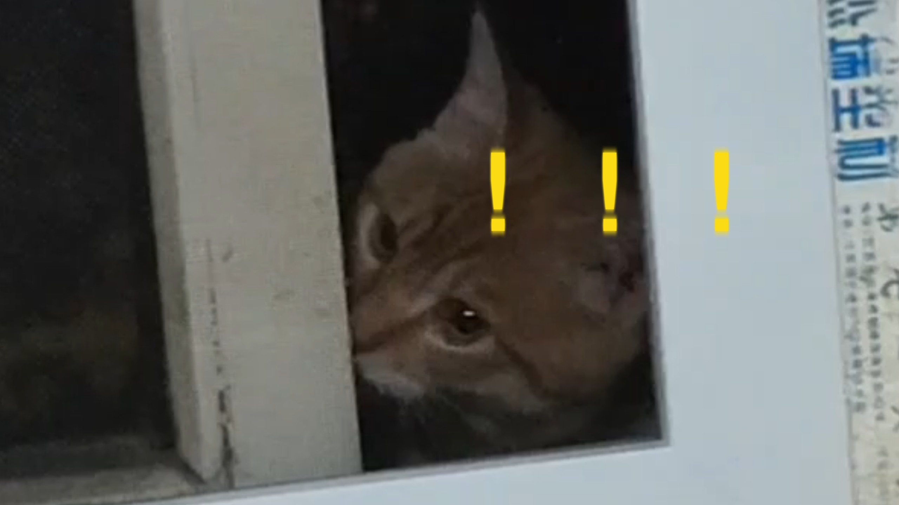 | 22 | 2026-05-06 |
| [小基米抢着吃饭，抢着吃就是香，小基米你这家伙！](https://www.bilibili.com/video/BV16ZRtBUEE7) | 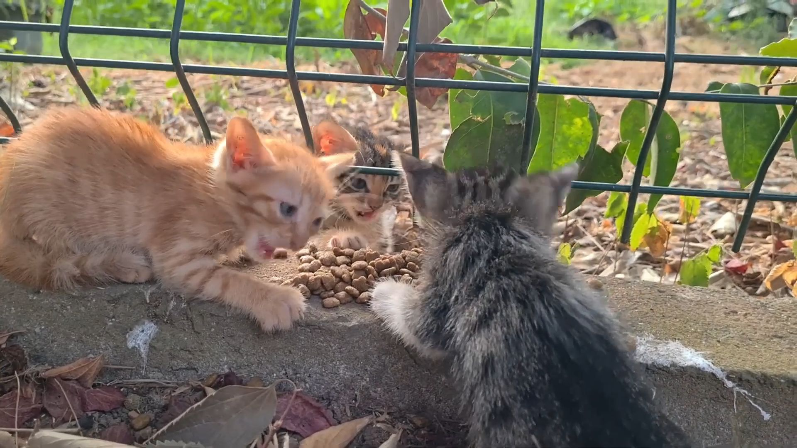 | 398 | 2026-05-06 |
| [【MHW】太刀 你是罕见奖杯 4pt 哈基米规则](https://www.bilibili.com/video/BV1LsRtBGEZC) |  | 500 | 2026-05-06 |
| [小猫学游泳](https://www.bilibili.com/video/BV1k9RtBHE5E) | 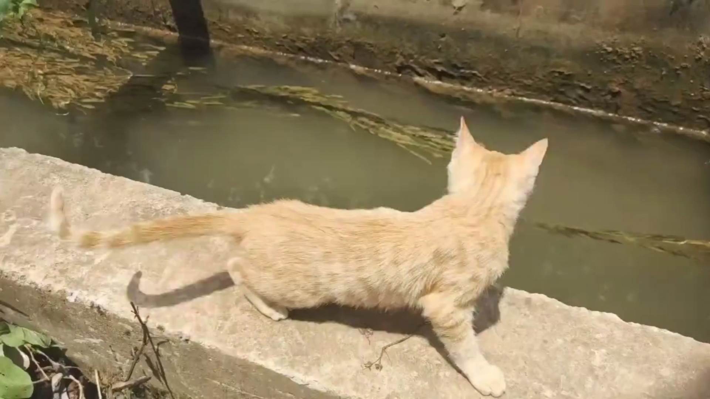 | 5055 | 2026-05-06 |
| [哈基米这个爽飞～](https://www.bilibili.com/video/BV1upRbBYELY) | 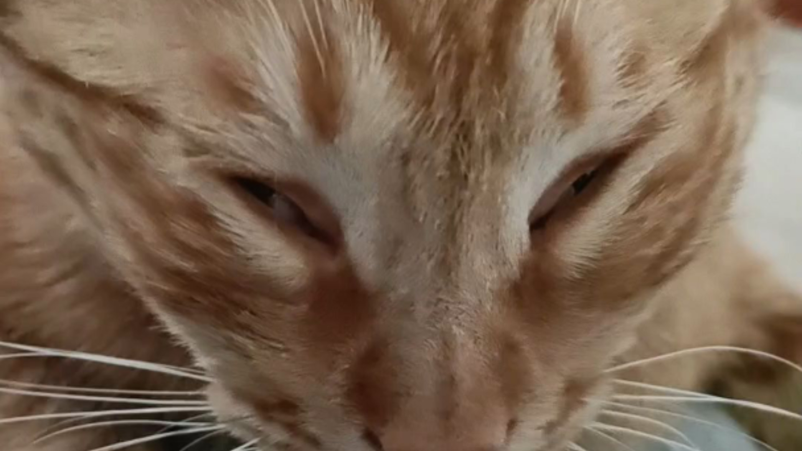 | 116 | 2026-05-06 |
| [【哈基米音乐】Here,There,and Everywhere](https://www.bilibili.com/video/BV1sbRbBtELW) |  | 717 | 2026-05-06 |
| [基米TV之汪汪队立大功](https://www.bilibili.com/video/BV1UeRxB4ERU) |  | 526 | 2026-05-06 |
| [突然的哈基米](https://www.bilibili.com/video/BV1YsRxBeEft) |  | 12 | 2026-05-06 |
| [狼尊哈基米](https://www.bilibili.com/video/BV1eSR4BKEAh) |  | 215 | 2026-05-06 |
| [基基基基基基基基基哈基米哈基米基哈基米基哈基米](https://www.bilibili.com/video/BV1qFR4BzEvh) | 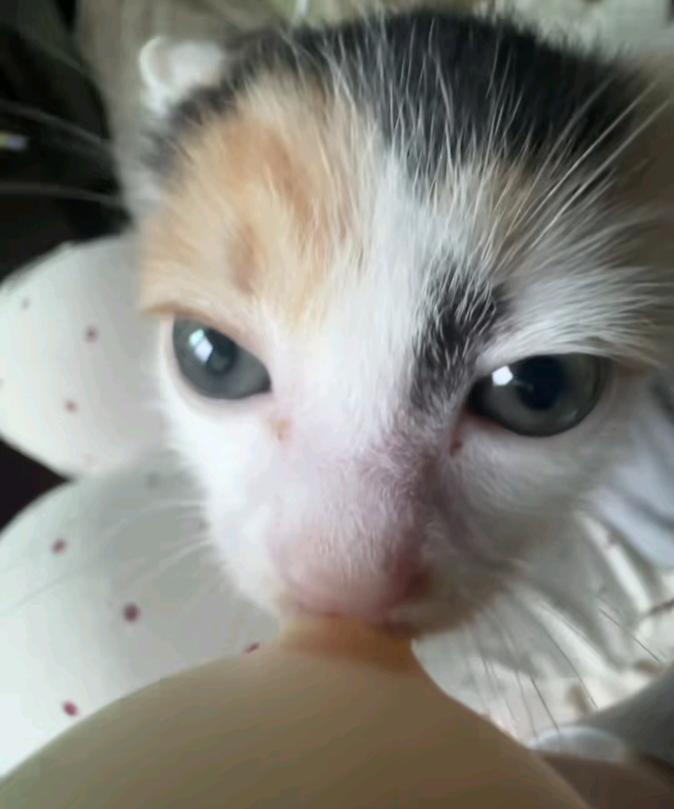 | 67 | 2026-05-06 |
| [气都哈不出来还是要哈吗，哈基米你这家伙](https://www.bilibili.com/video/BV11rRxBQEwE) | 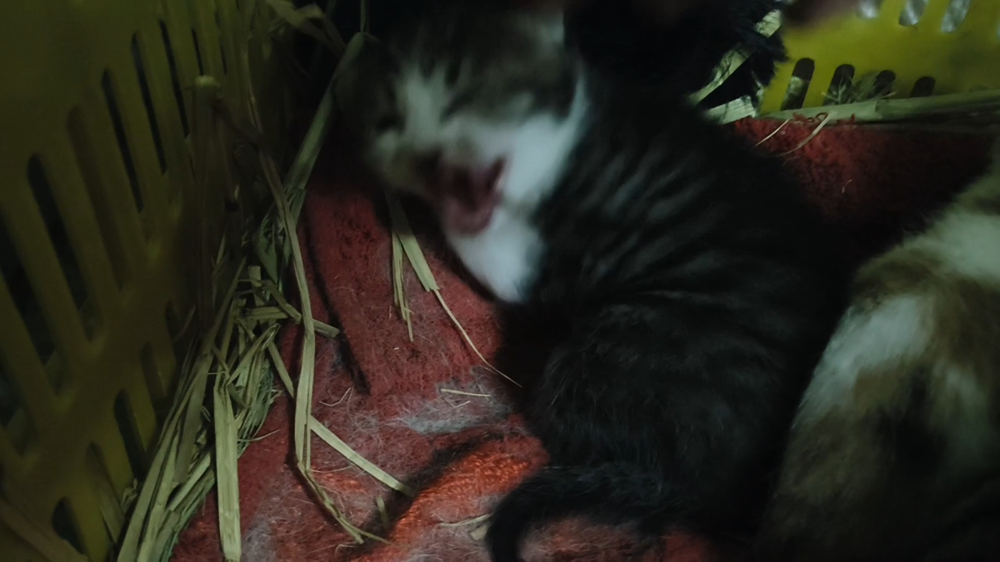 | 179 | 2026-05-06 |
| [咪：松饼，咪想吃咪爱吃！](https://www.bilibili.com/video/BV12rRxBQEgJ) | 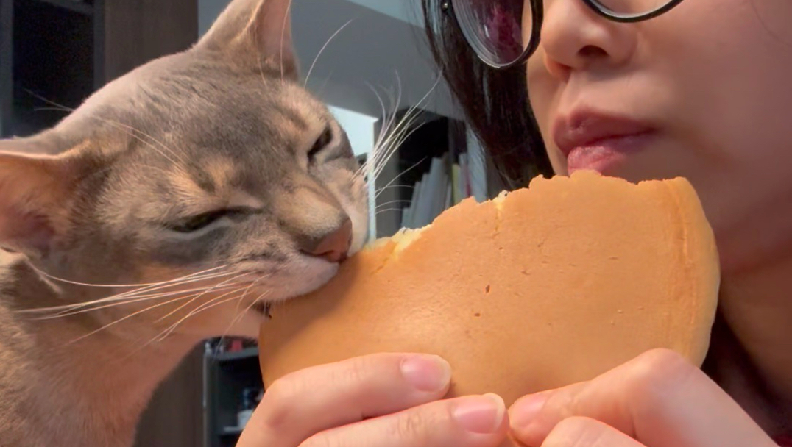 | 3365 | 2026-05-06 |
| [可爱基米教幼崽捕猎](https://www.bilibili.com/video/BV1ASRxB7Eju) | 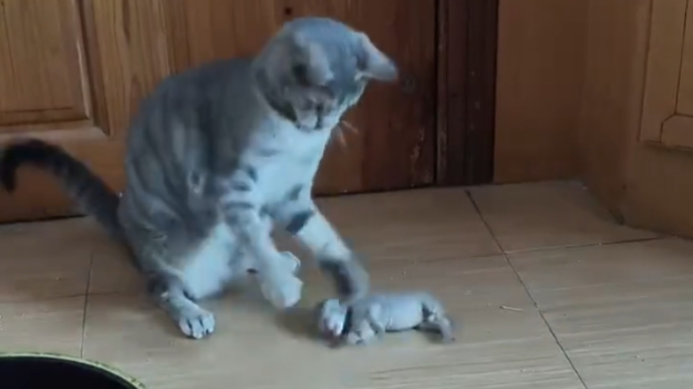 | 2393 | 2026-05-06 |
| [【哈基米TV】布鲁斯三打哈基米](https://www.bilibili.com/video/BV1rSRxBjEZo) |  | 1722 | 2026-05-06 |
| [原来现实中真的有哈基米的食物！](https://www.bilibili.com/video/BV1TJR4BoEey) | 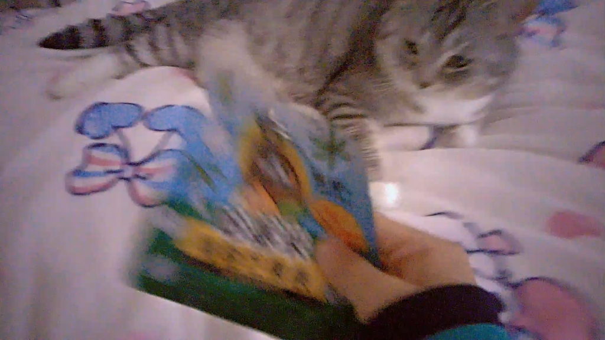 | 124 | 2026-05-06 |
| [小基米还有救吗？](https://www.bilibili.com/video/BV1WxR4BQEyX) | 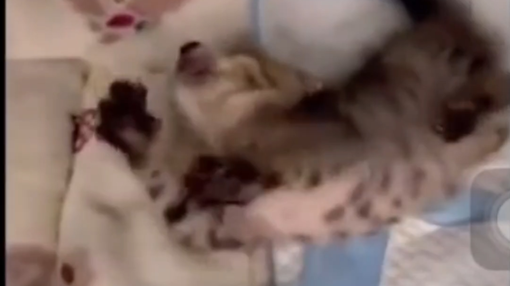 | 886 | 2026-05-06 |
| [奋斗的耄耋](https://www.bilibili.com/video/BV1eNR4BKEUg) | 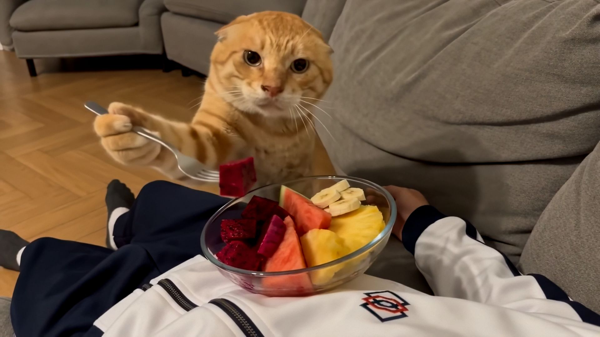 | 2689 | 2026-05-06 |
| [哈基哈基哈基哈基米](https://www.bilibili.com/video/BV183R4BwEQU) | 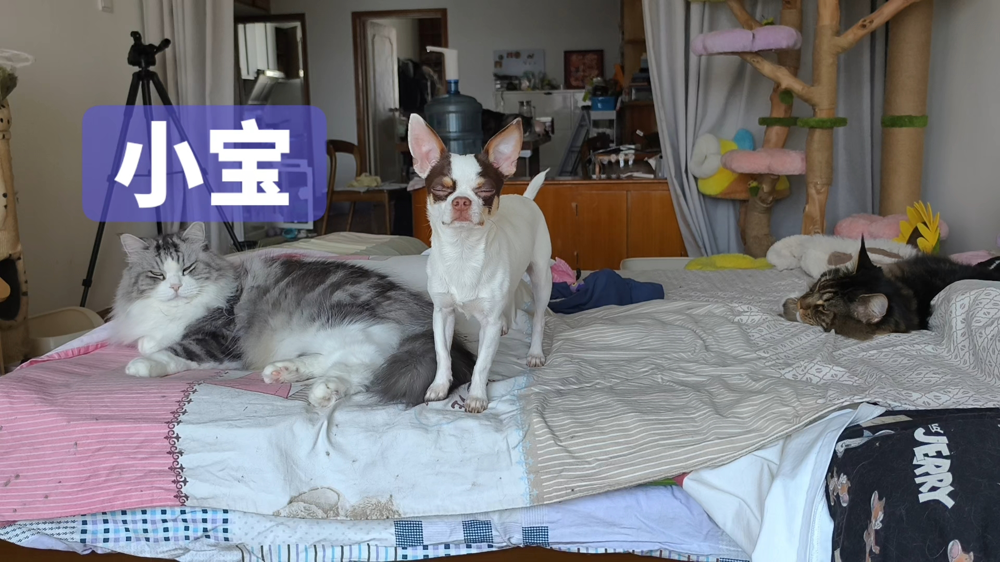 | 232 | 2026-05-06 |
| [“哈基米”其实也是套公式，你的日常用词是不是早就被动画腌入味了？](https://www.bilibili.com/video/BV127RsBJEFi) |  | 2.7万 | 2026-05-06 |
| [和好朋友们的重庆之旅太开心啦](https://www.bilibili.com/video/BV1xkRNBhE93) |  | 6750 | 2026-05-06 |
| [哈基米青年大学习](https://www.bilibili.com/video/BV15yR4BzE6t) |  | 61 | 2026-05-06 |
| [【哈基米音乐】小猫洗衣服 MEG - PRECIOUS](https://www.bilibili.com/video/BV1vCR4BgE1g) |  | 76 | 2026-05-06 |
| [这其实是哈基米自己点的外卖](https://www.bilibili.com/video/BV1VDR4BiECG) | 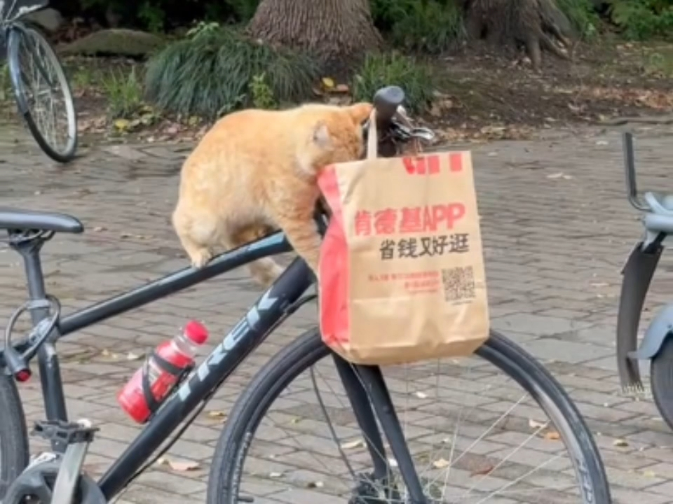 | 1048 | 2026-05-06 |
| [哈基米南北绿豆【雅努斯】](https://www.bilibili.com/video/BV1aXR4BPEkw) |  | 290 | 2026-05-06 |
| [恐怖哈基米：Epiphany](https://www.bilibili.com/video/BV1qdRWBeEp9) | 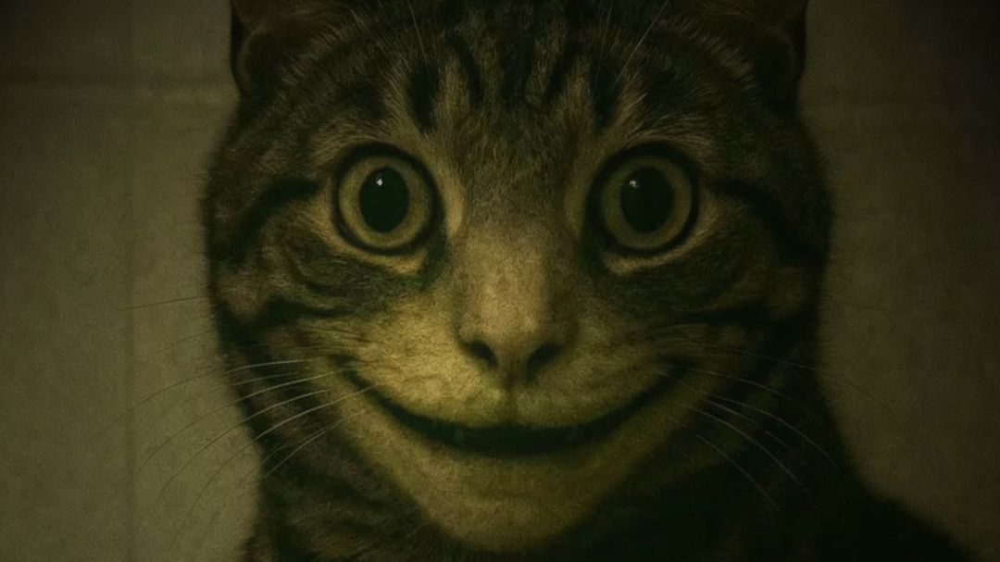 | 818 | 2026-05-06 |
| [基米高反掐人中触发哈气被动](https://www.bilibili.com/video/BV1jZRWBPEGw) |  | 1.4万 | 2026-05-06 |
| [用CodeX养一只哈基米](https://www.bilibili.com/video/BV1yzRWBLEsY) |  | 180 | 2026-05-06 |
| [【三国杀一将成名】限时地主特辑1，网爆香香软软的两只哈基米？](https://www.bilibili.com/video/BV1b5RsBHE3w) |  | 4480 | 2026-05-06 |
| [耍大牌选手，哈基米又高光时刻了](https://www.bilibili.com/video/BV1VCRsBaEa4) |  | 112 | 2026-05-06 |
| [体力升满的幼年哈基米](https://www.bilibili.com/video/BV1jzRsBNE4k) | 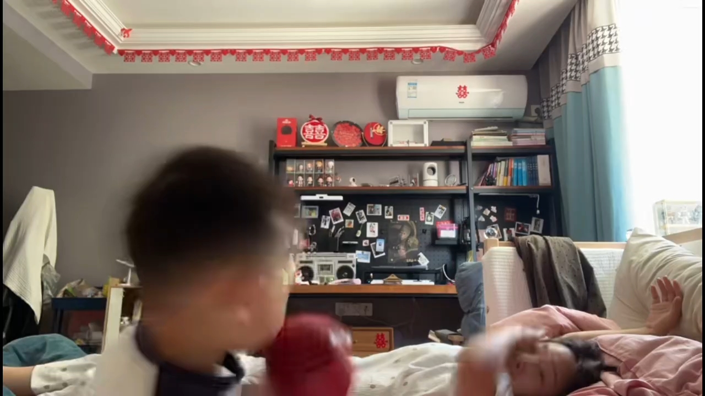 | 58 | 2026-05-06 |
| [哈基米音乐](https://www.bilibili.com/video/BV1L6RsBeE75) |  | 26 | 2026-05-06 |
| [哈基米你也是不要搞了好吧](https://www.bilibili.com/video/BV1G1RsBcE6Z) |  | 1686 | 2026-05-06 |
| [【Halona】地球online你是哪种玩家？OP哈基米合唱](https://www.bilibili.com/video/BV1zhRsB6Ee8) |  | 413 | 2026-05-06 |
| [哈基米这个电摇嘲讽](https://www.bilibili.com/video/BV16hRsB6EPU) | 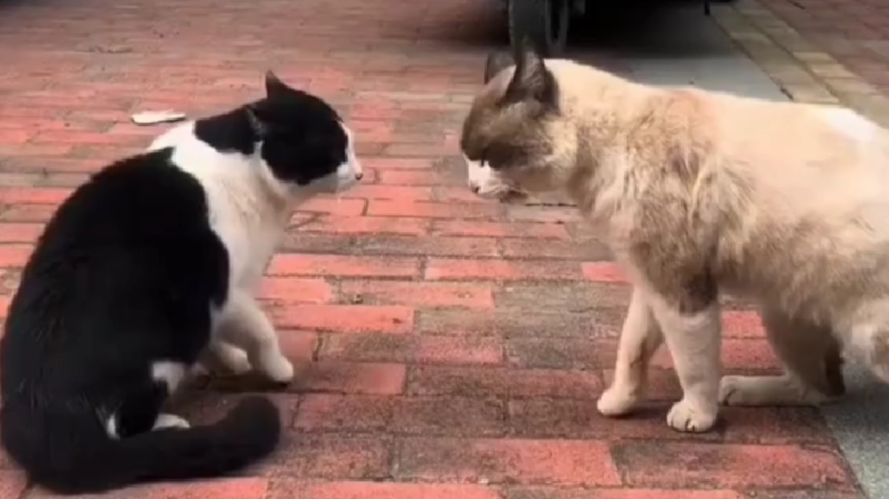 | 242 | 2026-05-06 |
| [【seedance2.0】哈基米读研记](https://www.bilibili.com/video/BV1ctRsBCEXR) |  | 119 | 2026-05-06 |
| [上，三角洲，底府曼不，哈基米都](https://www.bilibili.com/video/BV1ptRsBkEAZ) |  | 97 | 2026-05-06 |
| [［哈基米TV］666基米跳伞不叫我［第4次补档版］](https://www.bilibili.com/video/BV1AKRxB2E6C) | 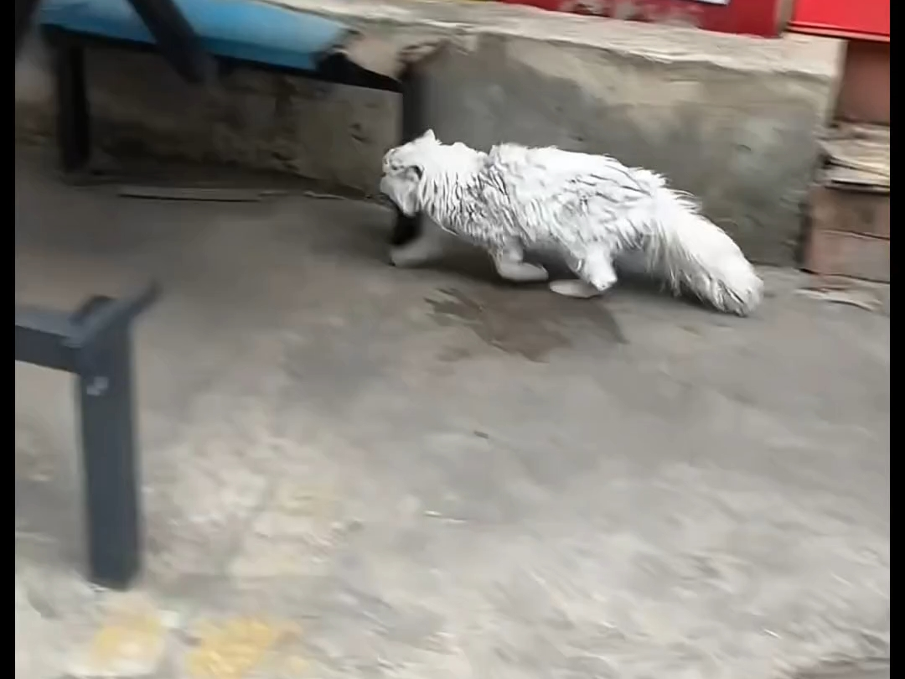 | 1260 | 2026-05-06 |
| [哈基米你怎么这么会找地方睡觉](https://www.bilibili.com/video/BV1pMRxBLExQ) | 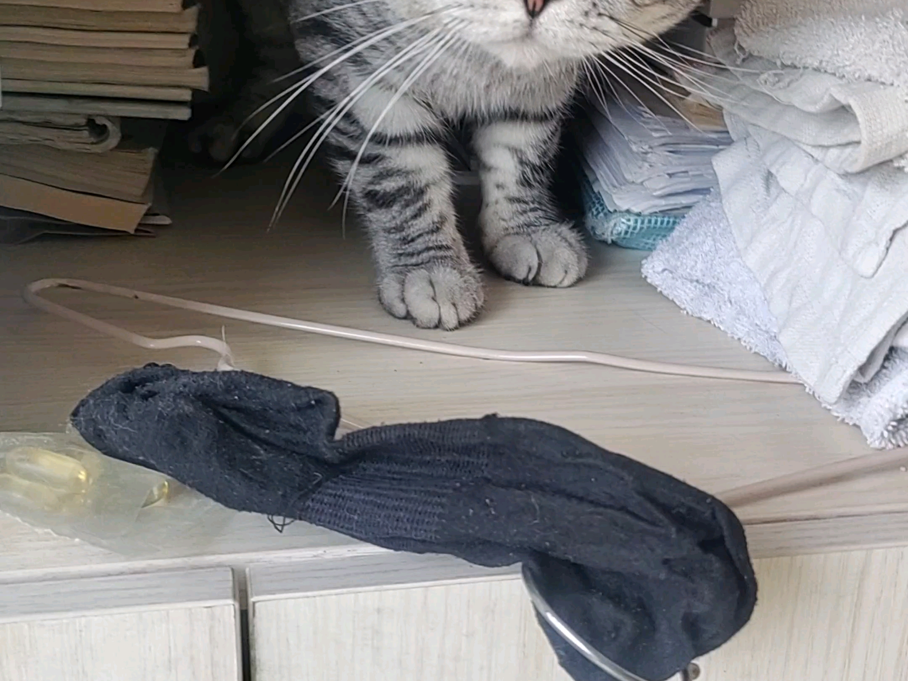 | 125 | 2026-05-06 |
| [德丽莎的哈基米南北绿豆~](https://www.bilibili.com/video/BV1ANRxB7Emt) |  | 1029 | 2026-05-06 |
| [这就是“哈基米”高人一等的原因吗？](https://www.bilibili.com/video/BV1u9RsBRExa) | 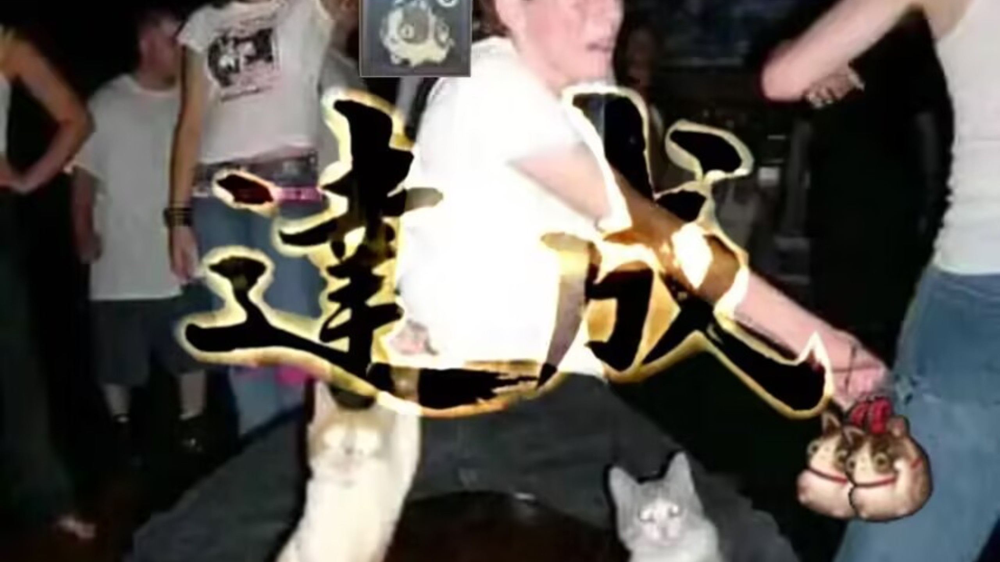 | 666 | 2026-05-06 |
| [尽情享受吧](https://www.bilibili.com/video/BV1KoRsBXE1U) | 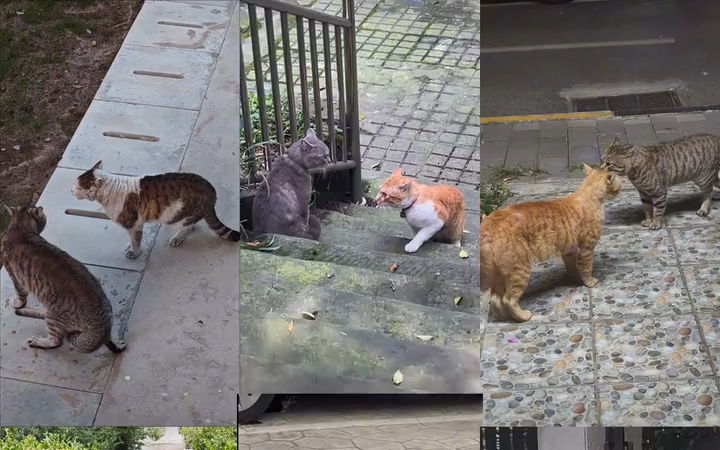 | 1283 | 2026-05-06 |
| [【纯净哈基米】Montagem Pitty (拼接遗憾) 🎵](https://www.bilibili.com/video/BV1w6RJBFEMB) |  | 4114 | 2026-05-06 |
| [【哈基米神人杯Day6】咪豆 of the night](https://www.bilibili.com/video/BV1ntR1BPE5v) |  | 739 | 2026-05-06 |
| [挑战疯狂撸猫半分钟](https://www.bilibili.com/video/BV19GRJB7E1W) | 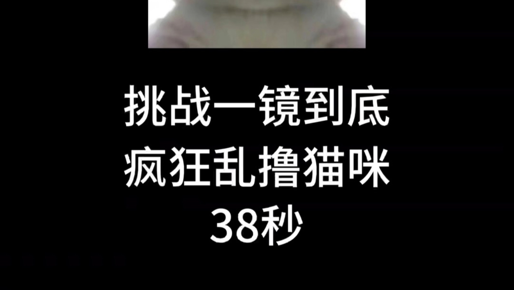 | 2.2万 | 2026-05-06 |
| [哈基米：Вдох (Phonk Version)【补档】【神人杯day6】](https://www.bilibili.com/video/BV1jVRyB9E3A) |  | 1210 | 2026-05-06 |
| [【神人杯day6】植物大战基米 砸罐子](https://www.bilibili.com/video/BV16MRWBqEgf) |  | 1494 | 2026-05-06 |
| [哈基米掉入电磁炉设计的陷阱了](https://www.bilibili.com/video/BV1GPRpBHEJf) | 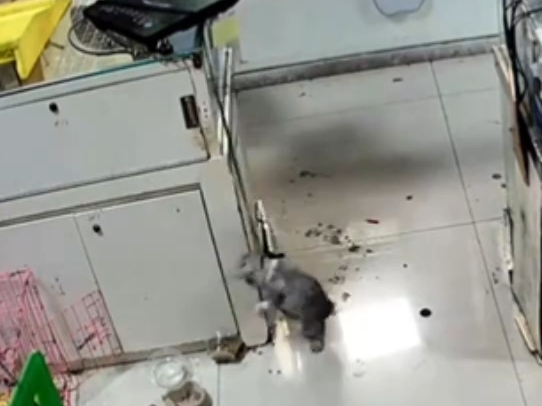 | 6.9万 | 2026-05-06 |
| [哈基米的清晨唤醒服务](https://www.bilibili.com/video/BV19fRHB9ExB) |  | 216 | 2026-05-06 |
| [小小哈基米](https://www.bilibili.com/video/BV1DNRpBSE2H) | 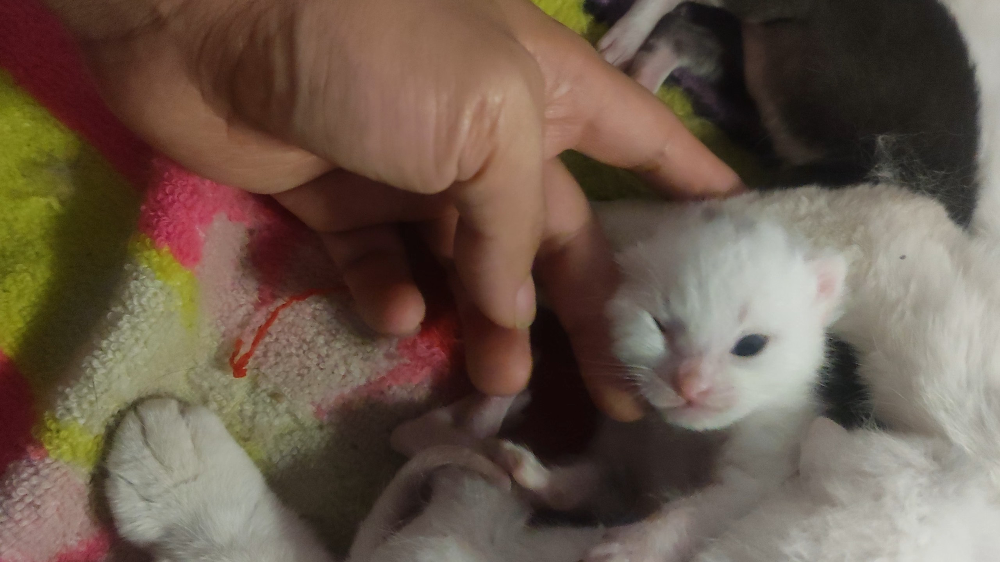 | 66 | 2026-05-06 |
| [哈基哈基哈基哈基哈基米](https://www.bilibili.com/video/BV18NRpBSEGy) |  | 99 | 2026-05-06 |
| [Be JIMI feat. 哈基米](https://www.bilibili.com/video/BV1uMRpBUEDy) |  | 69 | 2026-05-06 |
| [千万不要让陌生小朋友摸你家狗，已经上瘾了！](https://www.bilibili.com/video/BV1G6RpBdECr) | 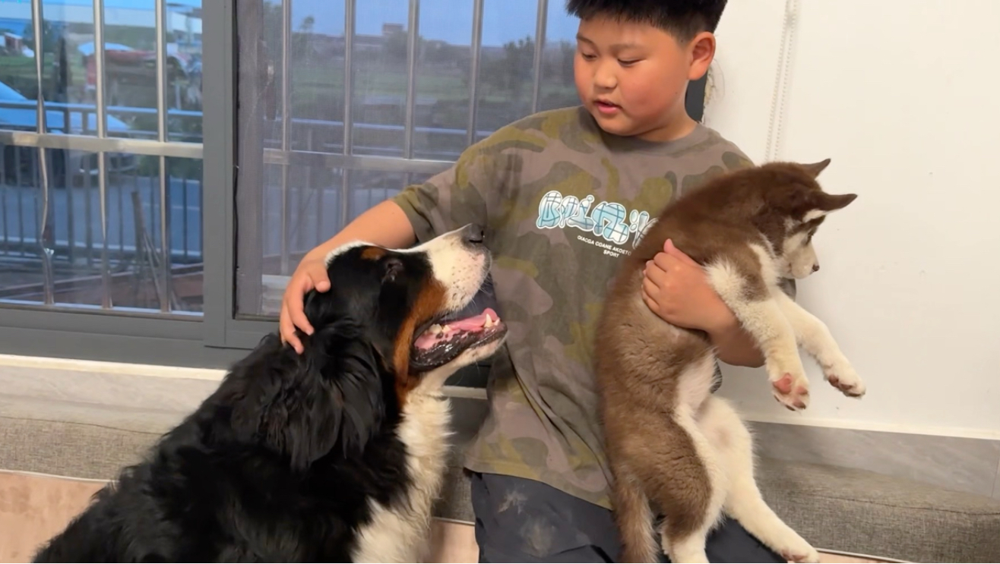 | 12.6万 | 2026-05-06 |
| [【卡机哈基米】新作上线，快来看看！](https://www.bilibili.com/video/BV1G6RpBdESH) | 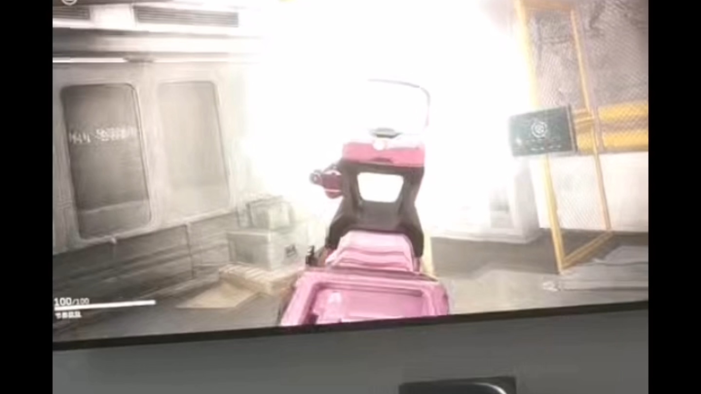 | 107 | 2026-05-06 |
| [曼波波波，哈基米，南北绿豆，阿西嘎哈，压库耐龙～](https://www.bilibili.com/video/BV1GkRpBsEjw) |  | 138 | 2026-05-06 |
| [不吃别扒拉](https://www.bilibili.com/video/BV13CRpB9Esx) | 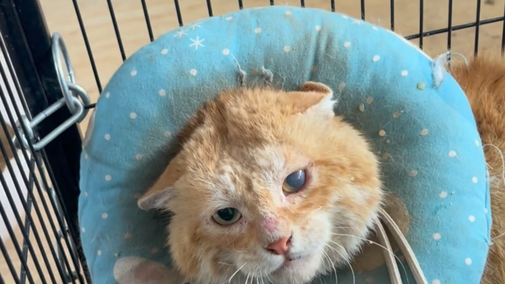 | 3352 | 2026-05-06 |
| [这是哈基米自己打猎获得的](https://www.bilibili.com/video/BV1PcRWBGEB7) | 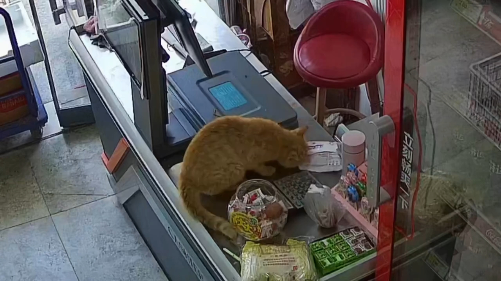 | 878 | 2026-05-06 |
| [横滨中华街的哈基米音乐（2026.05.05）](https://www.bilibili.com/video/BV1u1RnByEzA) | 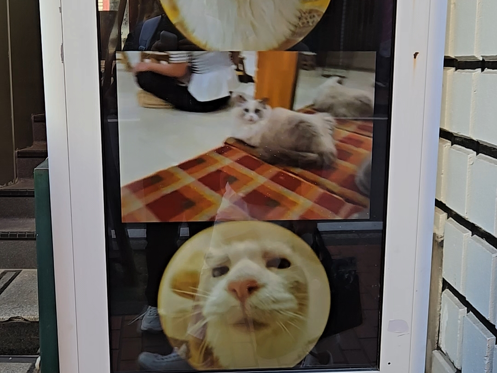 | 898 | 2026-05-05 |
| [我的绿色哈基米呢？](https://www.bilibili.com/video/BV1eZRHBsEk8) |  | 244 | 2026-05-05 |
| [小哈基米 碗好吃不](https://www.bilibili.com/video/BV1yLRnBNEnc) | 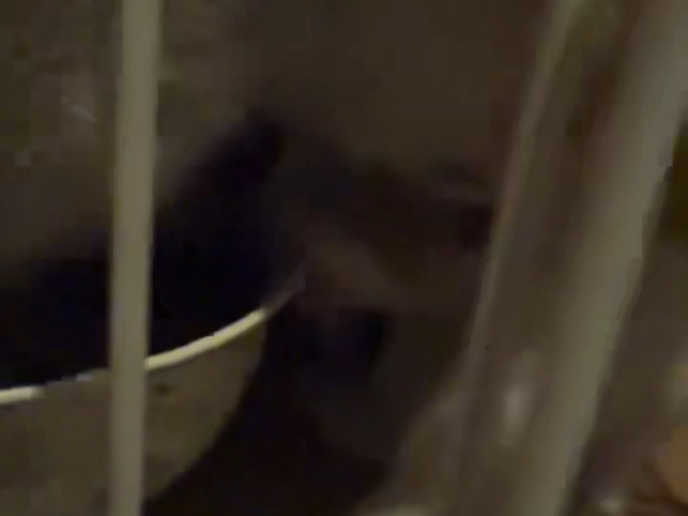 | 59 | 2026-05-05 |
| [【异环】哈基米薄荷炸毛“哈气” 四国配音](https://www.bilibili.com/video/BV1mGR1BVEuG) |  | 1902 | 2026-05-05 |
| [【小只芋】逆子哈基米突然发狂抓伤芋手！芋头发出尖锐爆鸣声！展示战损黑手！弹幕：羞死了！](https://www.bilibili.com/video/BV1mKRCBzE4H) |  | 9722 | 2026-05-05 |
| [【Yuko】Yuko房东双哨发力，羊妈妈六个小时没法回防……哈基米还自己把窗户开了！一打三确实没办法啊😭](https://www.bilibili.com/video/BV1b2RCBGESe) |  | 1.2万 | 2026-05-05 |
| [🐱星际穿越的耄耋提醒自己不要哈气🐱](https://www.bilibili.com/video/BV1JNRyBFEyT) | 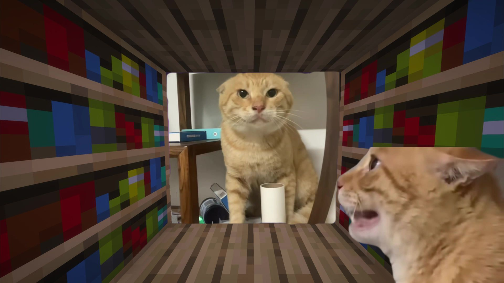 | 5862 | 2026-05-05 |
| [不想喂直说！](https://www.bilibili.com/video/BV13fR6BqE3M) | 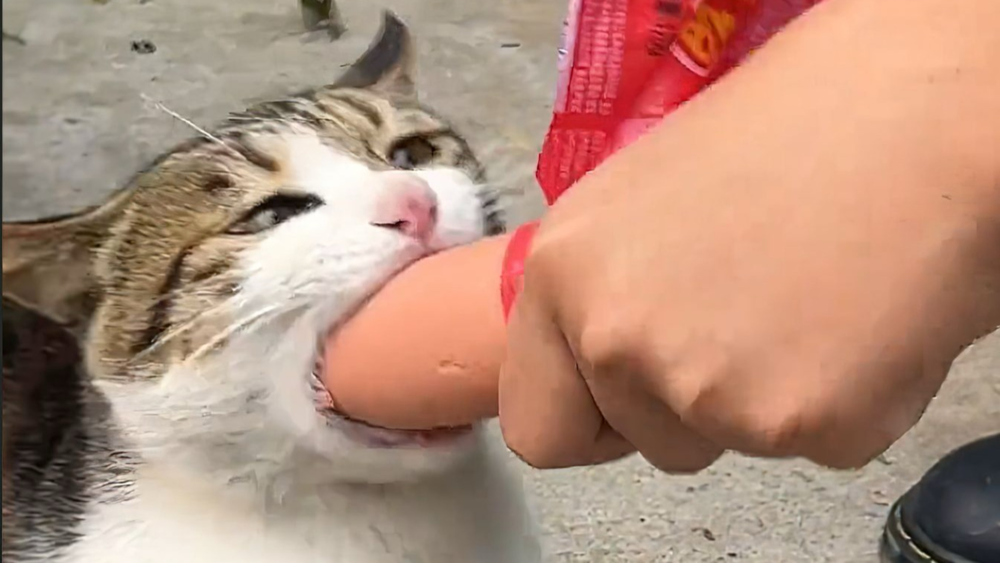 | 7.7万 | 2026-05-05 |
| [哈基米这个生死决斗](https://www.bilibili.com/video/BV15YRrB5EZf) | 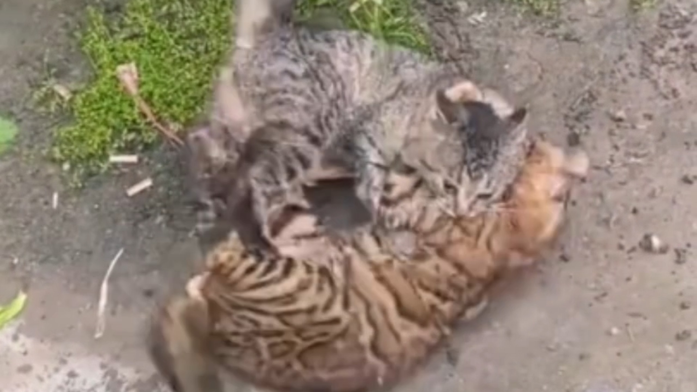 | 3433 | 2026-05-05 |
| [银狼LV999，哈基米南北都摇一摇](https://www.bilibili.com/video/BV1vYRrBVEt2) |  | 4882 | 2026-05-05 |
| [疯跑的嘬！](https://www.bilibili.com/video/BV1LuRkBUE2b) | 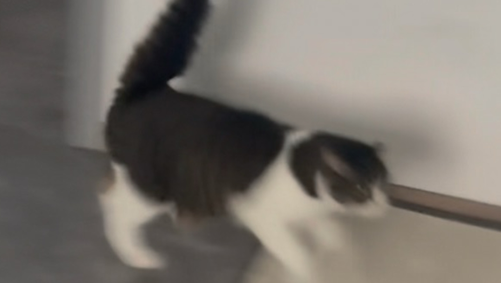 | 2.5万 | 2026-05-05 |
| [骗过 90% 人的眼睛，这些AI视频太逼真了](https://www.bilibili.com/video/BV1wY9aBbEau) | 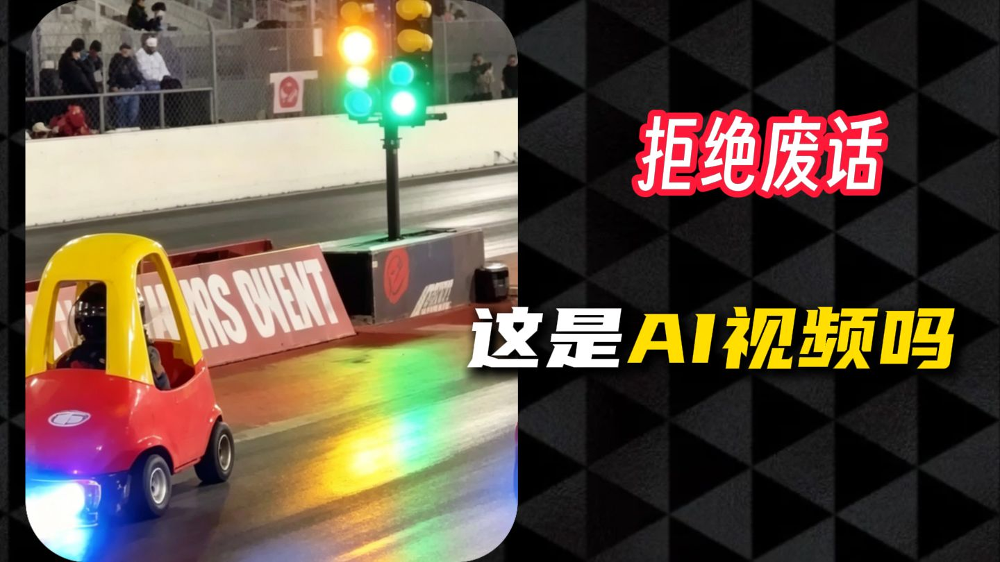 | 5317 | 2026-05-05 |
| [哈基米在说什么](https://www.bilibili.com/video/BV1UkRzBbEua) | 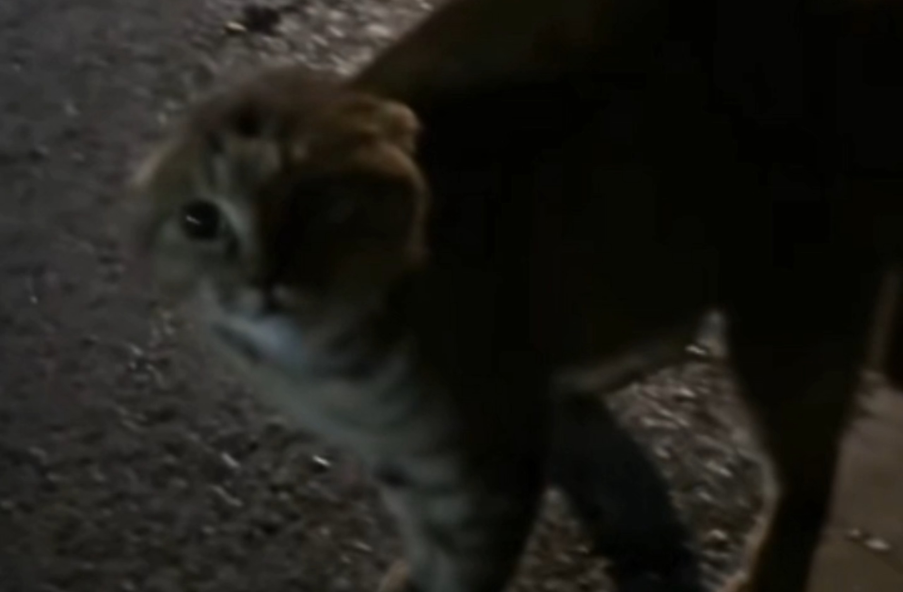 | 1185 | 2026-05-05 |
| [💥纯净精简版💥弥渡山歌PHONK💥哈基米版💥](https://www.bilibili.com/video/BV1meRvBEEHt) |  | 2286 | 2026-05-04 |
| [哈基米这个枪软猫儿硬](https://www.bilibili.com/video/BV1nvRBBLEyQ) | 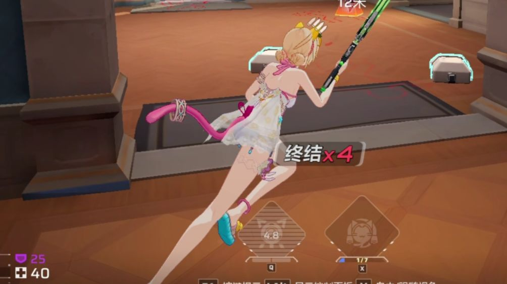 | 2954 | 2026-05-04 |
| [[哈基米TV]补档版，哈基米史上最爽的3声老吴之倒放与正放版](https://www.bilibili.com/video/BV1wtRiBGESn) | 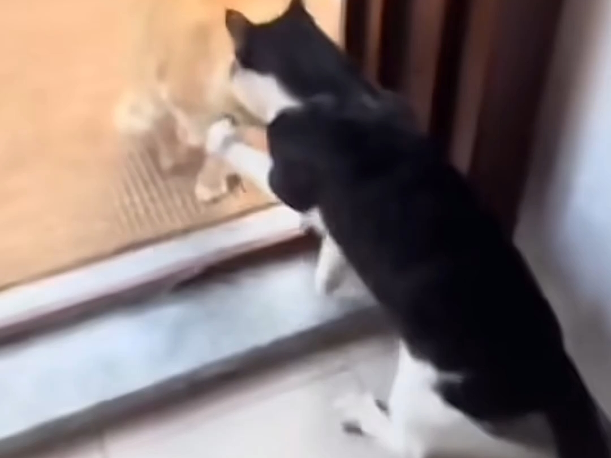 | 373 | 2026-05-04 |
| [哈基汪TV](https://www.bilibili.com/video/BV1tzRqBXEN2) | 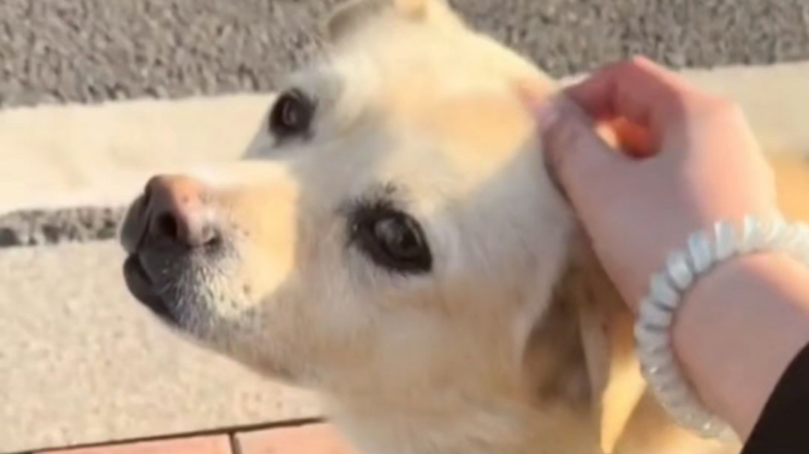 | 1.8万 | 2026-05-04 |
| [猫的底层代码从拉到夯](https://www.bilibili.com/video/BV1tBRqBWEg3) |  | 8.0万 | 2026-05-04 |
| [普拉娜也要哈基米南北绿豆](https://www.bilibili.com/video/BV1YtRqBcEPG) |  | 1931 | 2026-05-04 |
| [亿口甜筒黑长直造型！粉色哈基米已经被困在月下地下室了](https://www.bilibili.com/video/BV1VyReBXEFM) |  | 2.7万 | 2026-05-04 |
| [家人们谁懂啊喜欢吃榴莲的哈基米](https://www.bilibili.com/video/BV18aRvBSEVP) | 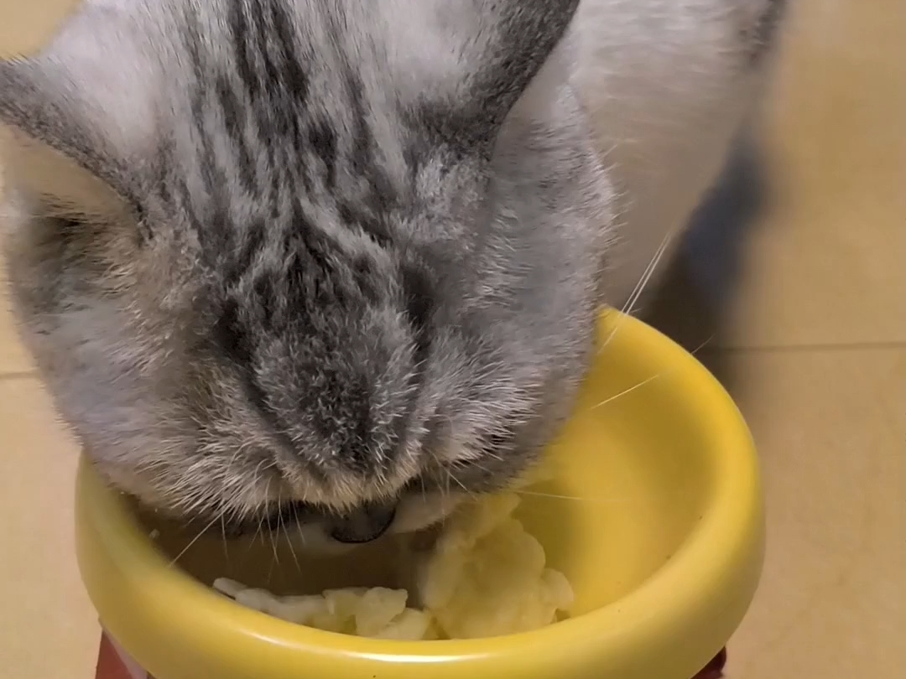 | 155 | 2026-05-04 |
| [爱丽丝也要哈基米南北绿豆~🥵](https://www.bilibili.com/video/BV1eJRvBZEpb) |  | 3888 | 2026-05-04 |
| [哈基汪TV](https://www.bilibili.com/video/BV1pyRvBrEZn) | 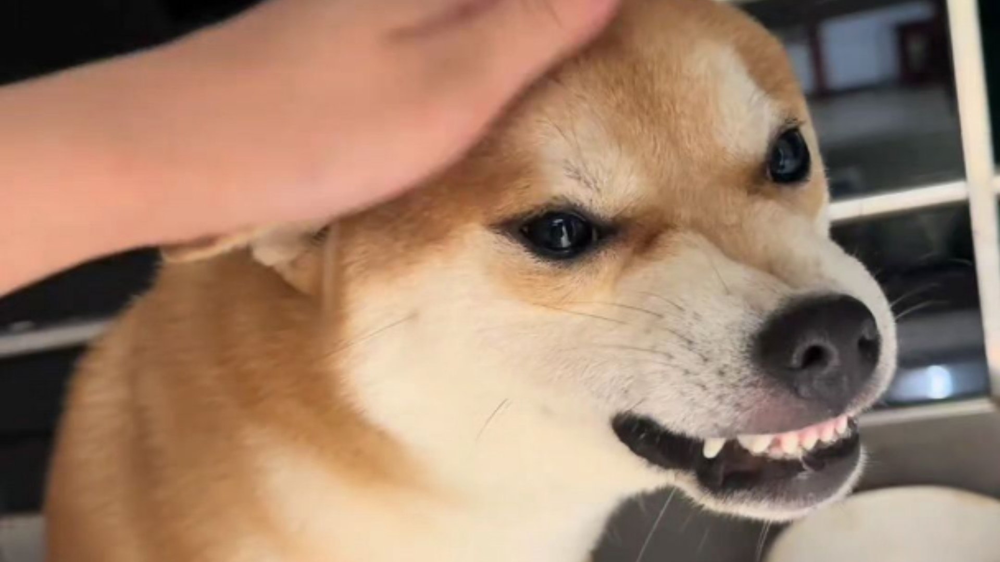 | 1.7万 | 2026-05-04 |
| [哈基米起床](https://www.bilibili.com/video/BV1waRPBJEG4) | 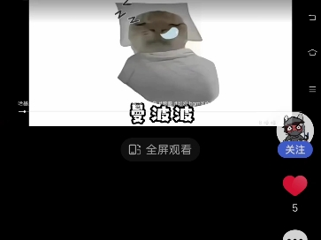 | 75 | 2026-05-03 |
| [这猫啥情况？](https://www.bilibili.com/video/BV1HDRAB7EEG) | 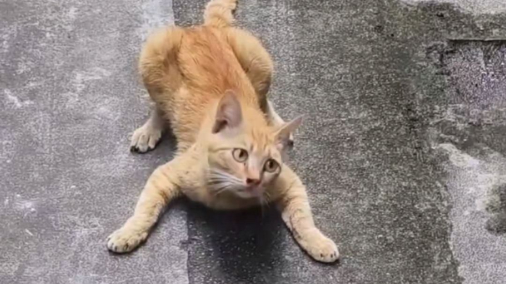 | 2.6万 | 2026-05-03 |
| [猫咪：我宣布这才是真正的猫条！](https://www.bilibili.com/video/BV1hsRcB4EWQ) | 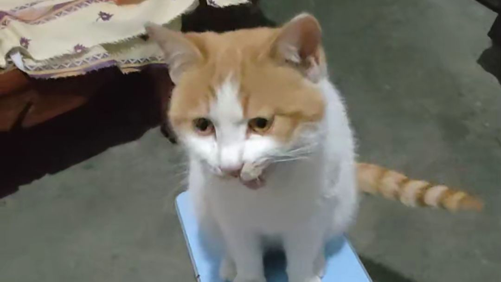 | 28.2万 | 2026-05-03 |
| [⚡ 百万级 哈基米 礼物机 ⚡](https://www.bilibili.com/video/BV1C59ZBqEYU) |  | 29.4万 | 2026-05-03 |
| [女友竟是契约兽 地上动漫惨遭绿化工程](https://www.bilibili.com/video/BV1NQ9dBeEgY) |  | 43.6万 | 2026-05-03 |
| [哈基米起床](https://www.bilibili.com/video/BV1Ur9dBgEKx) |  | 171 | 2026-05-03 |
| [哈の米](https://www.bilibili.com/video/BV1Tw99BFETx) |  | 54 | 2026-05-02 |
| [谁懂哈基米和欧大金绝配](https://www.bilibili.com/video/BV1D7R7BKEDg) | 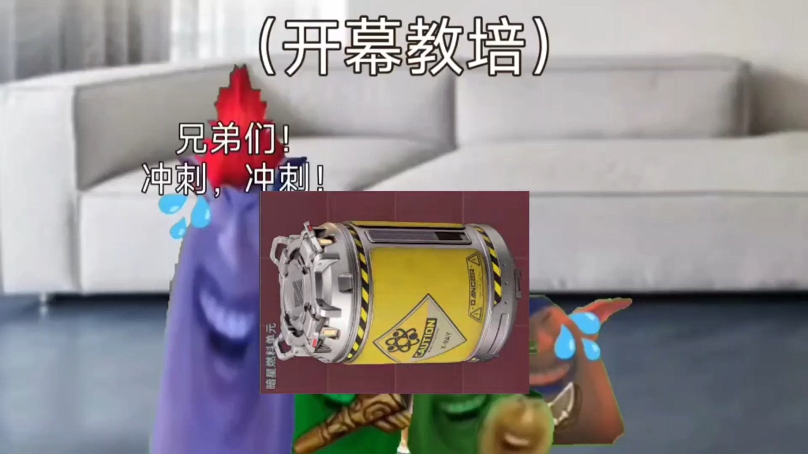 | 1.3万 | 2026-05-02 |
| [耄耋的十万个主人](https://www.bilibili.com/video/BV1GM9aB1E9h) | 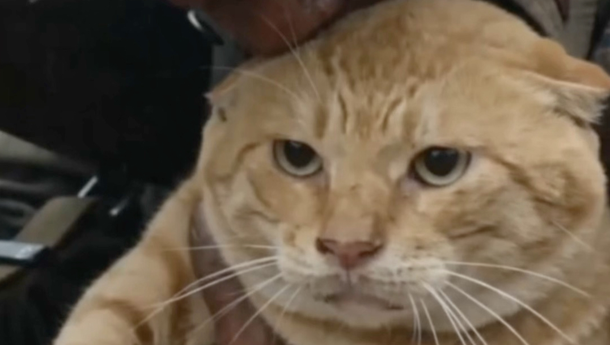 | 5.4万 | 2026-04-30 |
| [猫咪:“您好，很不高兴为您服务”](https://www.bilibili.com/video/BV1mY9SBHEpB) |  | 10.6万 | 2026-04-29 |
| [《糖猫正传》智商只有75，却创造了一个又一个奇迹](https://www.bilibili.com/video/BV115dSBHEgd) |  | 19.9万 | 2026-04-21 |
| [奶龙捧腹大笑出处](https://www.bilibili.com/video/BV14XNuziEDm) |  | 152.4万 | 2026-03-08 |
| [猫儿这个捆绑诱惑](https://www.bilibili.com/video/BV1K9A6zJEBN) | 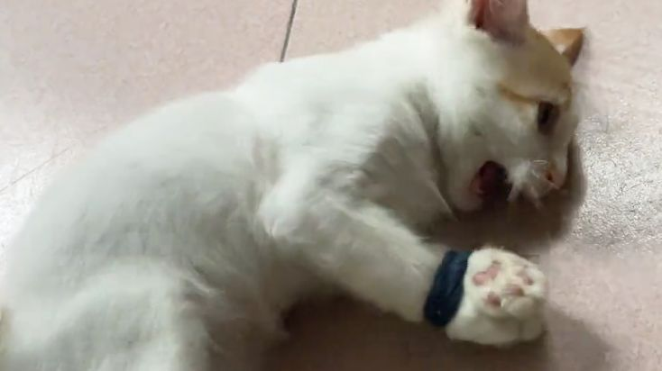 | 3.1万 | 2026-02-26 |
| [一亿人看过的曼波哈基咪关灯神器脏话版+闹钟 ！！！](https://www.bilibili.com/video/BV1aMiCBYE5y) | 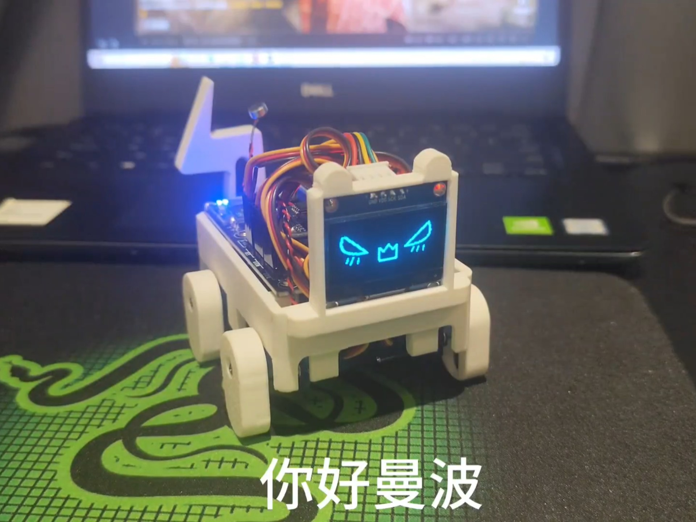 | 38.7万 | 2026-01-07 |
| [消除哈基米](https://www.bilibili.com/video/BV1gNnbzNEx1) | 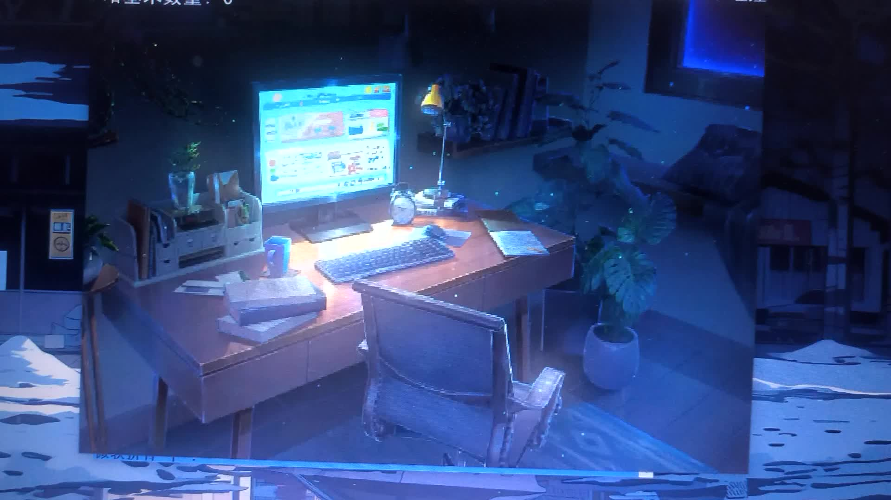 | 149 | 2025-09-25 |
| [哈基米](https://www.bilibili.com/video/BV1HHn4z1EYe) | 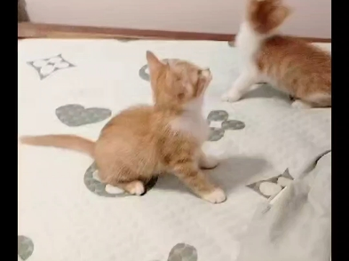 | 676 | 2025-09-25 |

---
*最后更新: 2026-05-07 03:21:22 (自动生成)*
*数据来源: [Bilibili](https://www.bilibili.com)*

## 使用说明

运行以下命令更新视频列表:
```bash
python3 fetch_hajimi_videos.py
```
