# awesome-hajimi
collections of hajimi (哈基米 in Chinese) on the Internet.

## 视频列表 (Video List)

| 视频标题 (Title) | 封面 | 播放量 (Views) | 发布日期 (Date) |
|---|---|---|---|
| [哈基米](https://www.bilibili.com/video/BV1yHQ7BXEEm) | 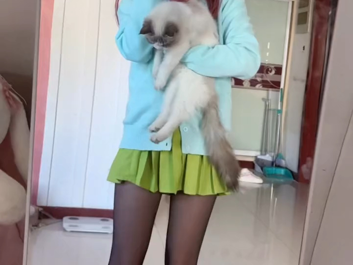 | 10 | 2026-04-15 |
| [哈基米这个喜欢断头台](https://www.bilibili.com/video/BV1EQQ5BvExJ) | 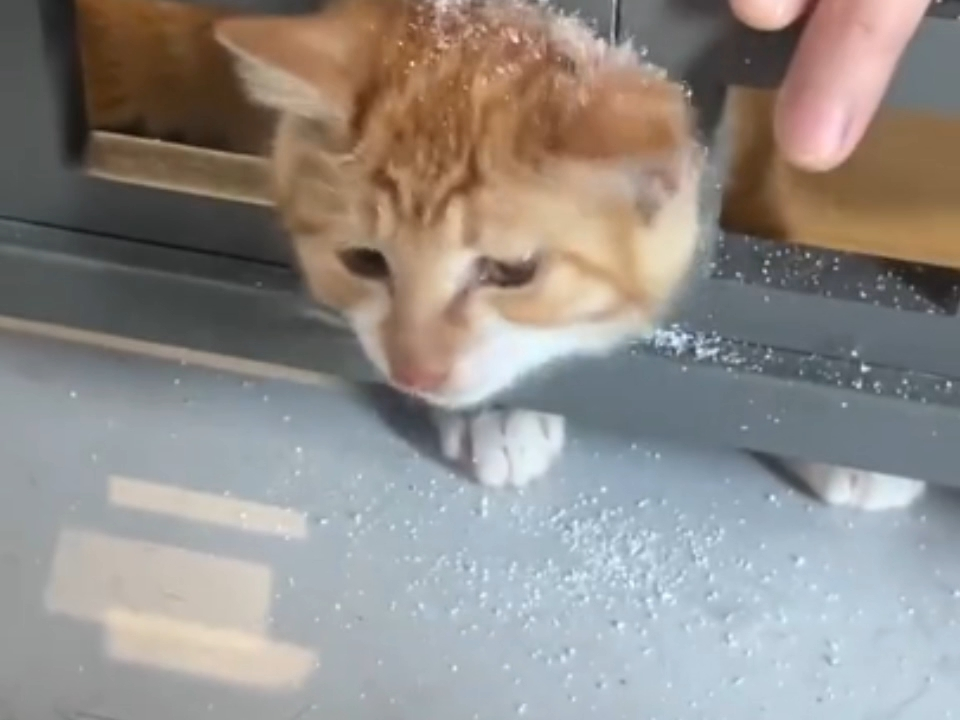 | 224 | 2026-04-15 |
| [被虐的哈基米](https://www.bilibili.com/video/BV1E9Q5BPELP) |  | 15 | 2026-04-15 |
| [哈基米哈基米](https://www.bilibili.com/video/BV1JrQGBeESq) |  | 399 | 2026-04-15 |
| [大橘哥132-提不动刀了??大橘哥的自由具体是干什么?](https://www.bilibili.com/video/BV1VvQ3BSEVr) |  | 4.6万 | 2026-04-14 |
| [残基米](https://www.bilibili.com/video/BV1BPQGBfEwf) | 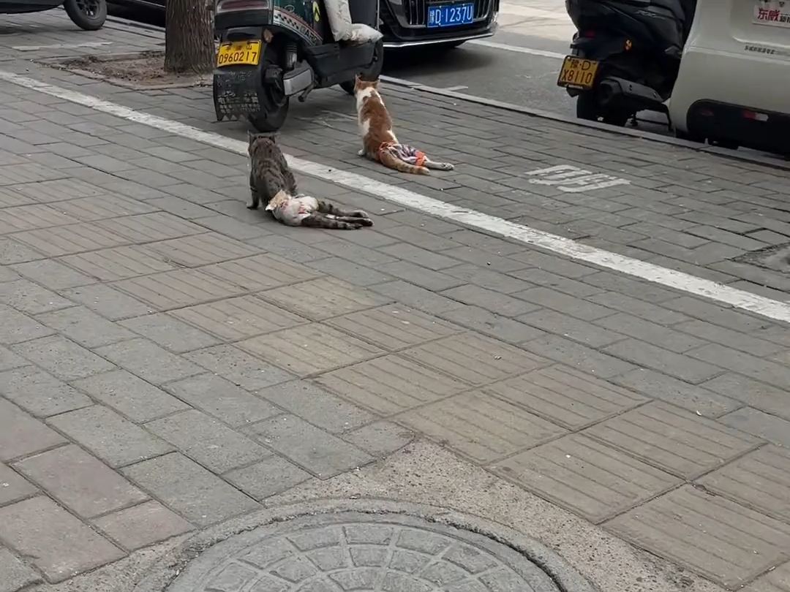 | 6918 | 2026-04-14 |
| [哈基米底层代码这一块，棘背龙形态这一块，秒开仙人这一块](https://www.bilibili.com/video/BV1C6QGBNEVe) | 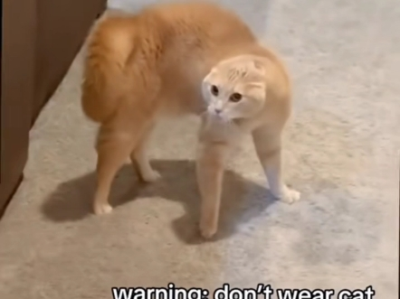 | 37 | 2026-04-14 |
| [哈基米和飞天目镜双双坠机](https://www.bilibili.com/video/BV1rrQGBeEur) | 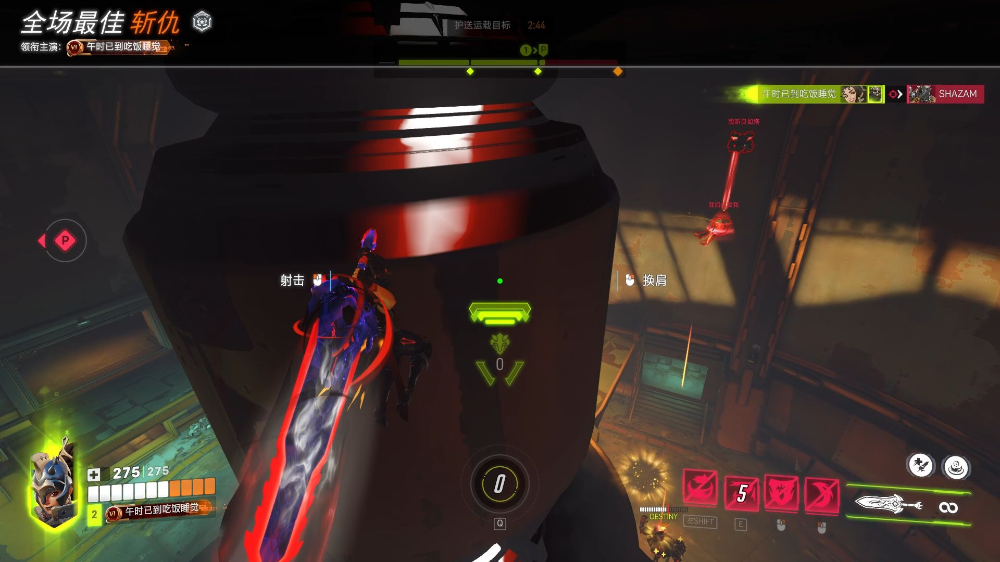 | 4 | 2026-04-14 |
| [【曼波传奇】哈基米泰囧](https://www.bilibili.com/video/BV1bpQGB2Exn) |  | 770 | 2026-04-14 |
| [虫虫助手 《哈基米曼波语音盒》，众多哈基米和曼波语音音效，来个节目效果！](https://www.bilibili.com/video/BV18pQGB2ELr) |  | 42 | 2026-04-14 |
| [火花花要哈基米](https://www.bilibili.com/video/BV18pQGB2EjB) |  | 14 | 2026-04-14 |
| [[roblox]当哈基米迈着步伐曼波时](https://www.bilibili.com/video/BV14bQGBkEXu) |  | 737 | 2026-04-14 |
| [【纯净哈基米】🐱哈基米汉堡🐱](https://www.bilibili.com/video/BV1mCQuBvESM) |  | 803 | 2026-04-14 |
| [对着纸片启动棘背龙形态吗，哈基米你这家伙……](https://www.bilibili.com/video/BV11UQuBwEkv) | 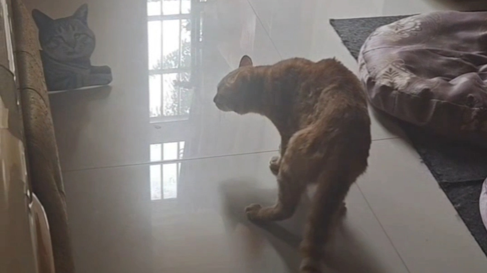 | 169 | 2026-04-14 |
| [【虫虫助手】哈基米南北绿豆？《哈基米曼波语音盒》语音或开黑曼波一下！](https://www.bilibili.com/video/BV1SiQuBgE6e) |  | 110 | 2026-04-14 |
| [甘雨也要哈基米~](https://www.bilibili.com/video/BV1DqQuBzEEh) |  | 1539 | 2026-04-14 |
| [-天使瞑-《我愛你-哈基米-》怪叫可爱 版](https://www.bilibili.com/video/BV1ojQNBqEeX) |  | 160 | 2026-04-14 |
| [维港湾烤鱼店的哈基米，头小身瘦，两岁然而孩子一岁半。战斗力爆表，去年战绩大约15条蛇，几十只老鼠。。](https://www.bilibili.com/video/BV1aGQgB1ERS) | 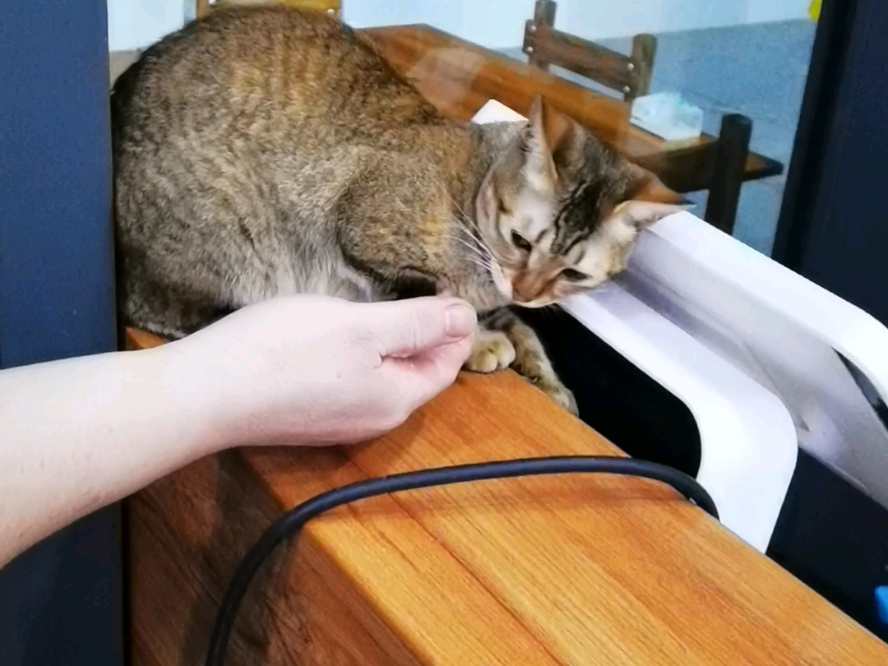 | 117 | 2026-04-14 |
| [万物皆可哈基米](https://www.bilibili.com/video/BV1r9QuBZEDb) |  | 169 | 2026-04-14 |
| [禅者行脚哈基米版｜千万不要不小心掉到床缝里哦！](https://www.bilibili.com/video/BV1FFQgBRE2c) |  | 1460 | 2026-04-14 |
| [《补档》哈基米体验商鞅](https://www.bilibili.com/video/BV1riQgBFEuM) | 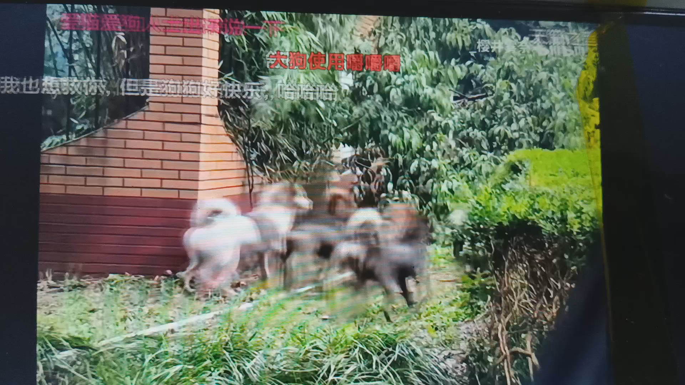 | 2507 | 2026-04-14 |
| [棉花糖美人鱼猫来咯#美人鱼 #哈基米 #猫咪 #Ai](https://www.bilibili.com/video/BV1WhQgBYEsL) |  | 258 | 2026-04-14 |
| [哈基米这个喜欢装死](https://www.bilibili.com/video/BV1wBQgBfEM7) | 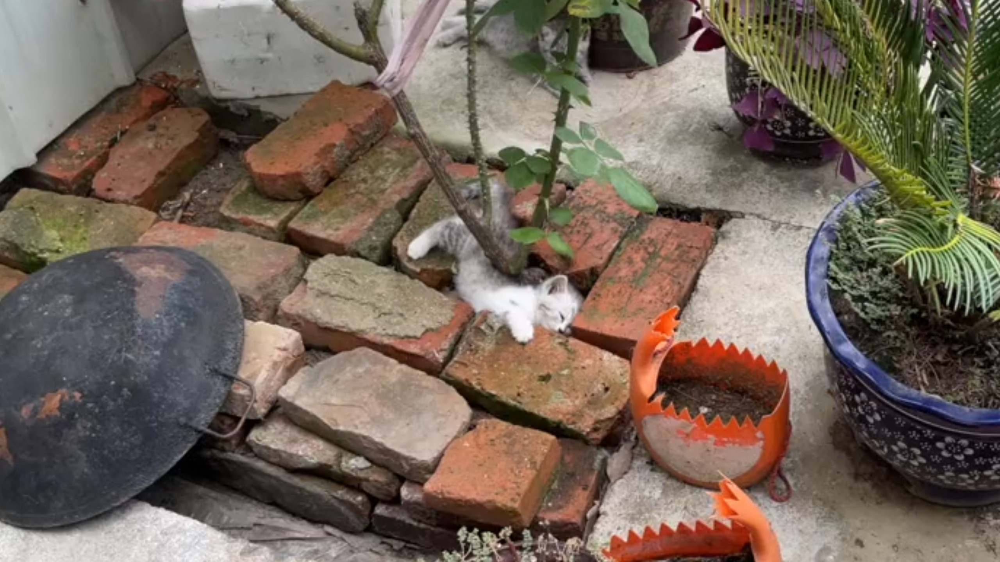 | 1323 | 2026-04-14 |
| [哈基米宝宝从楼上掉下来，幸好没大事](https://www.bilibili.com/video/BV1bHQgBzEUt) |  | 1.1万 | 2026-04-14 |
| [听哈基米房间，自动踩奶](https://www.bilibili.com/video/BV1SnQgBgET5) | 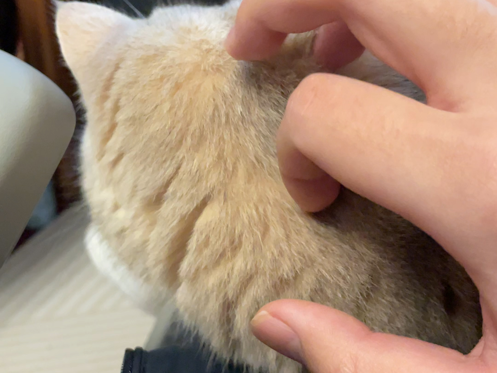 | 72 | 2026-04-14 |
| [跟我的哈基米亲子装](https://www.bilibili.com/video/BV1SHQgBzEs6) |  | 40 | 2026-04-14 |
| [哈基米南北绿多~](https://www.bilibili.com/video/BV1MWQgBuEts) |  | 3108 | 2026-04-14 |
| [【神仙天团组合】《拼好歌》哈基米他不是米](https://www.bilibili.com/video/BV13EQgBkEtn) |  | 254 | 2026-04-14 |
| [哈基米呀南北绿豆](https://www.bilibili.com/video/BV12tQgBvEBU) |  | 1155 | 2026-04-14 |
| [老吴大战哈基米](https://www.bilibili.com/video/BV1xtQgBvEVP) | 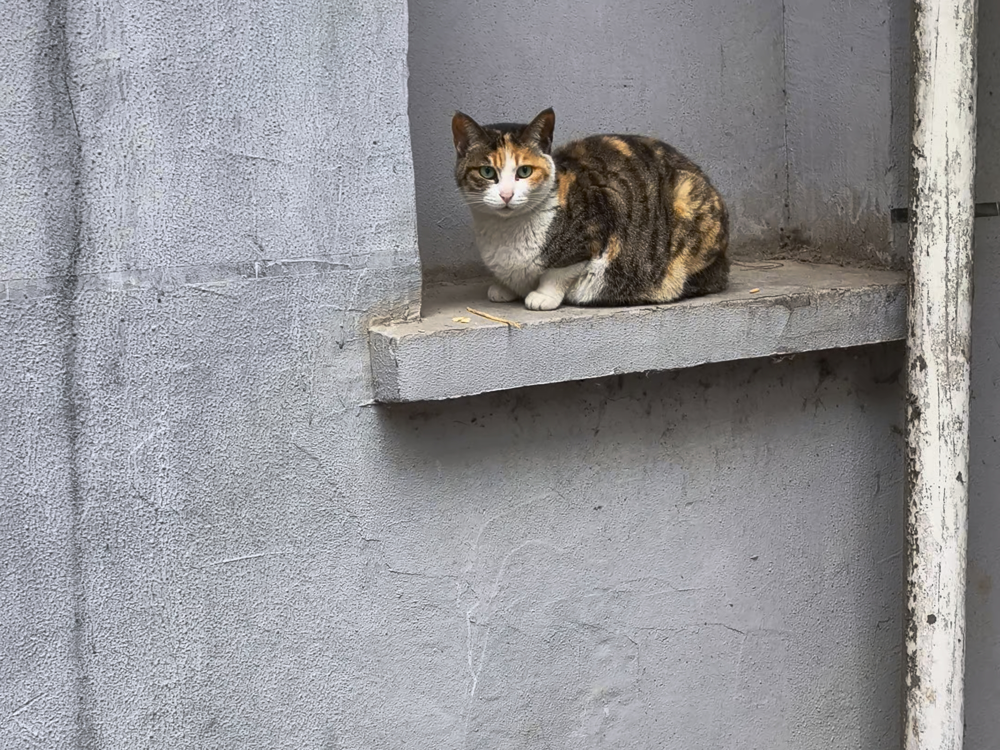 | 894 | 2026-04-14 |
| [哈基咪南北绿豆~](https://www.bilibili.com/video/BV1m3QiBGE1y) |  | 8442 | 2026-04-14 |
| [哈基米爪子痒了](https://www.bilibili.com/video/BV13oQgB1EWK) | 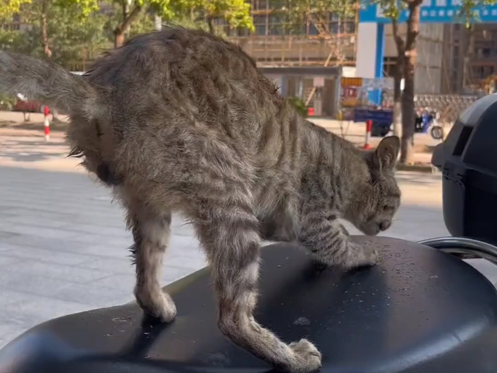 | 6106 | 2026-04-14 |
| [哈基米:蠕动模式开启](https://www.bilibili.com/video/BV1iSQgBnEWm) | 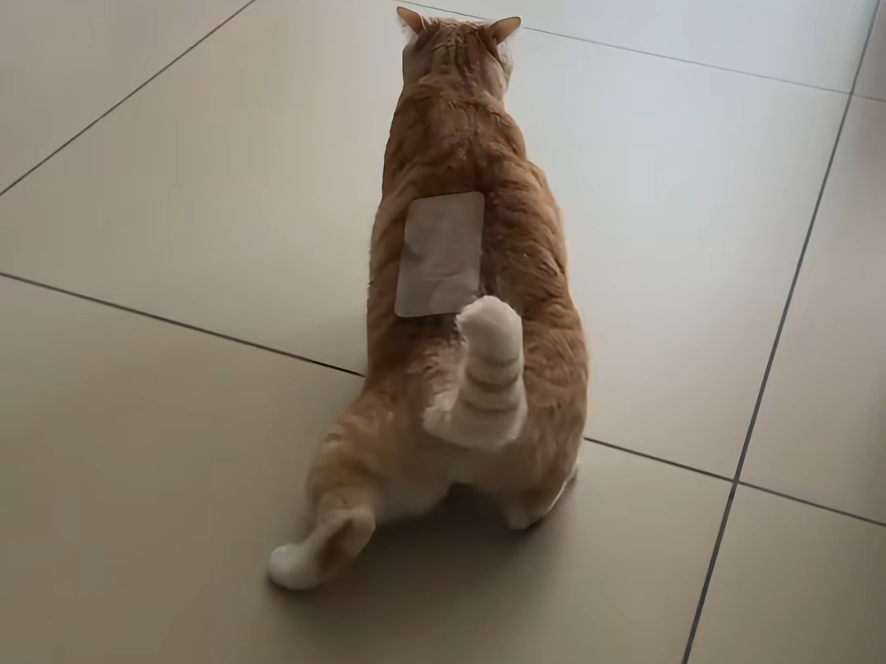 | 51 | 2026-04-14 |
| [可爱的哈基米不愿面对我TwT](https://www.bilibili.com/video/BV1gWQvBLE4n) | 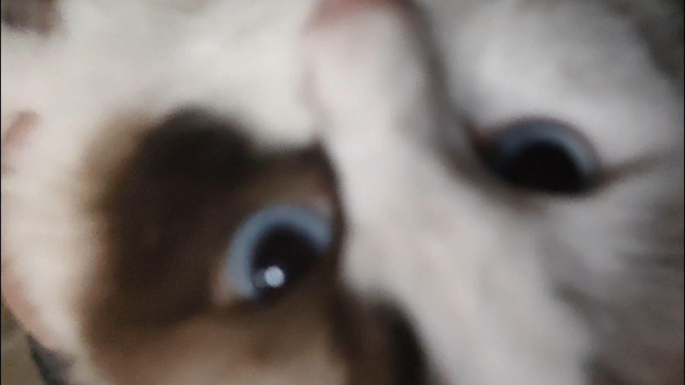 | 156 | 2026-04-14 |
| [大橘哥最新力作-《基度空间》迷雾/解谜](https://www.bilibili.com/video/BV1DAQiBmEEb) | 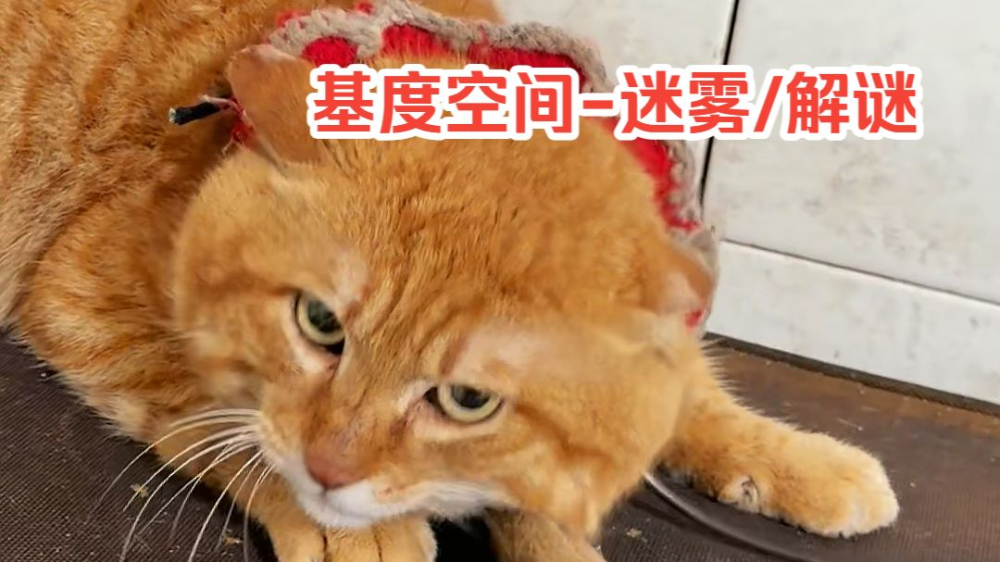 | 3.3万 | 2026-04-14 |
| [遐蝶也要哈基米~](https://www.bilibili.com/video/BV1vBQiB9EYM) |  | 3611 | 2026-04-14 |
| [超大号哈基米，撑满屏幕也挡不住美貌！](https://www.bilibili.com/video/BV1WEQiBqE5m) |  | 401 | 2026-04-14 |
| [哈基米足球兄弟](https://www.bilibili.com/video/BV1czQYB4Eb7) | 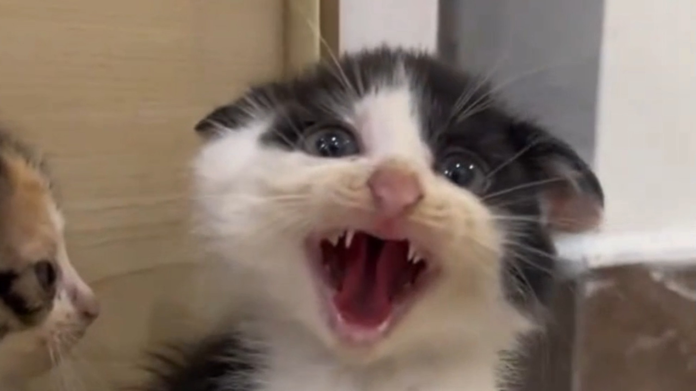 | 441 | 2026-04-14 |
| [谢谢长风妈妈的奖励🥵哈基米南北绿豆~](https://www.bilibili.com/video/BV1wqQYBZEwA) |  | 1.6万 | 2026-04-14 |
| [基米又消失两天，整点鱼肉吃吃](https://www.bilibili.com/video/BV14bQYBPEui) | 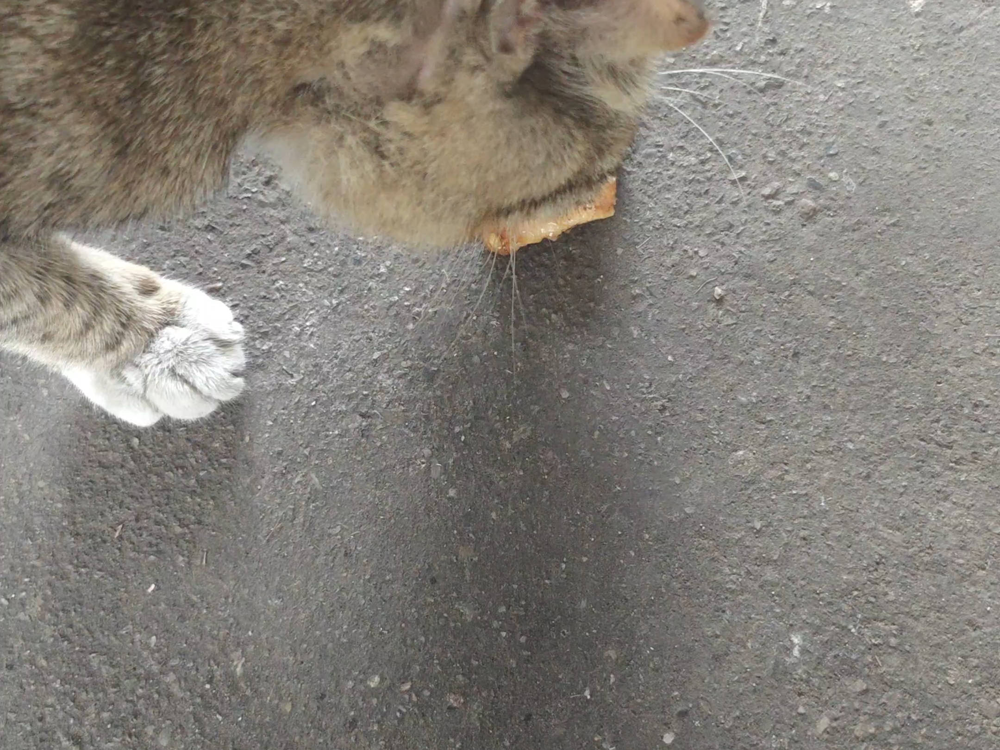 | 101 | 2026-04-14 |
| [以防你不知道，哈基米贴贴也会哈气](https://www.bilibili.com/video/BV1hfQYBkEpj) | 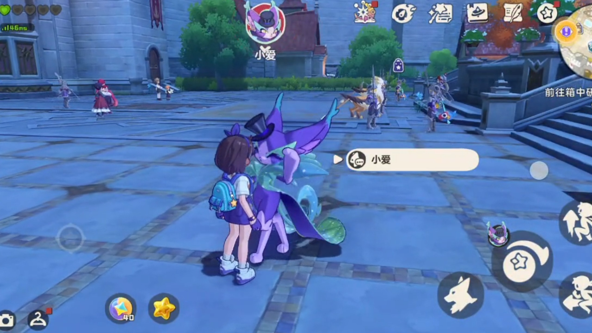 | 349 | 2026-04-14 |
| [哈基米起床！一根手指弹琴版！这是真正的音乐！如听仙乐耳暂明！#哈基米 #曼波 #抽象 #可爱 #钢琴 视频素材来自@懵懂小冉 音频bgm来自@面点海 这首有没有](https://www.bilibili.com/video/BV1iNQYBSEr1) | 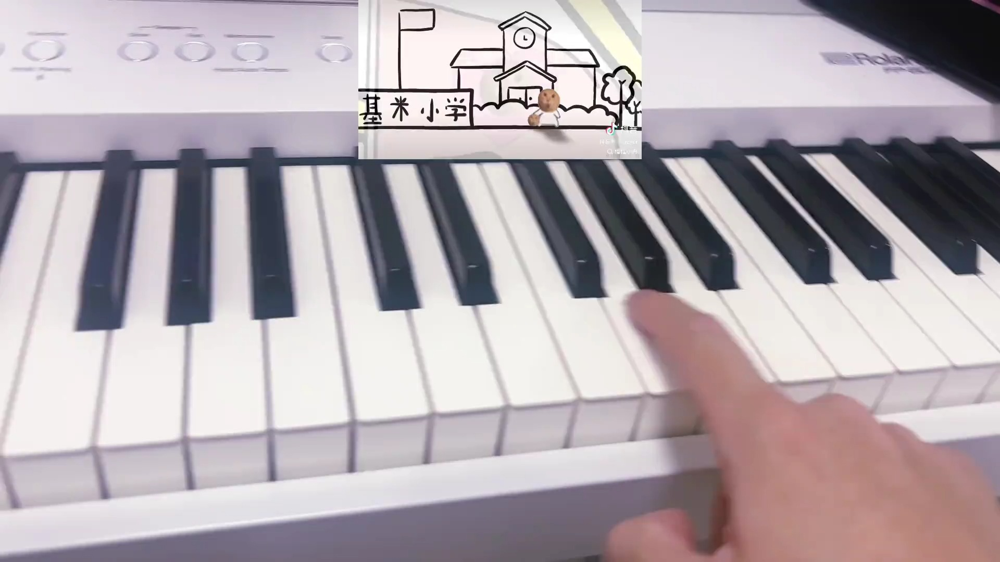 | 3 | 2026-04-14 |
| [【哈气TV】毛孩子的宿命对决](https://www.bilibili.com/video/BV1AZQeBAEUd) | 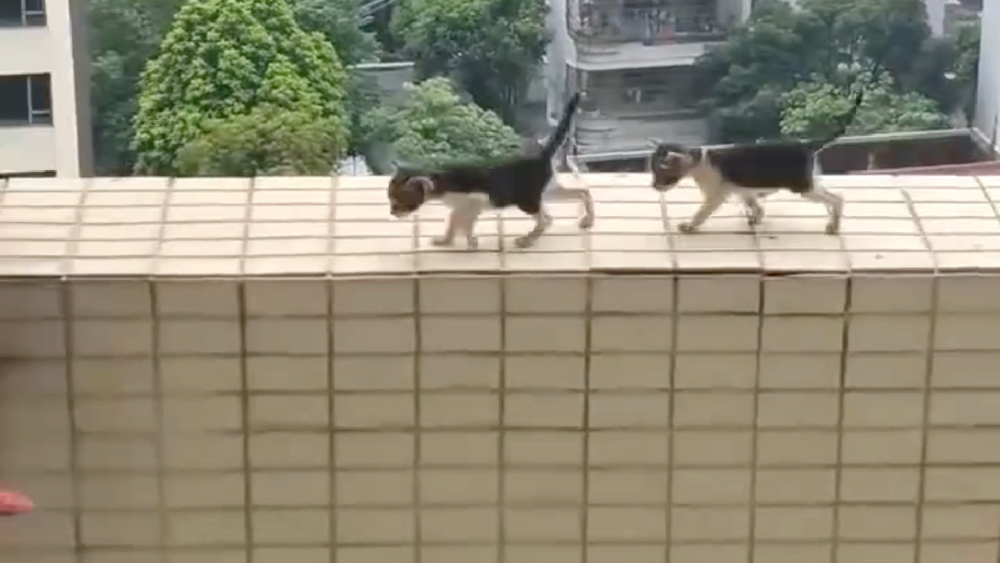 | 9986 | 2026-04-14 |
| [[无主之地4]一个响指上千万！魔女的大猫猫终于支愣起来啦！](https://www.bilibili.com/video/BV1FBQhBJEgG) |  | 1417 | 2026-04-14 |
| [哈基米基哈](https://www.bilibili.com/video/BV1VbQ8BiEzA) | 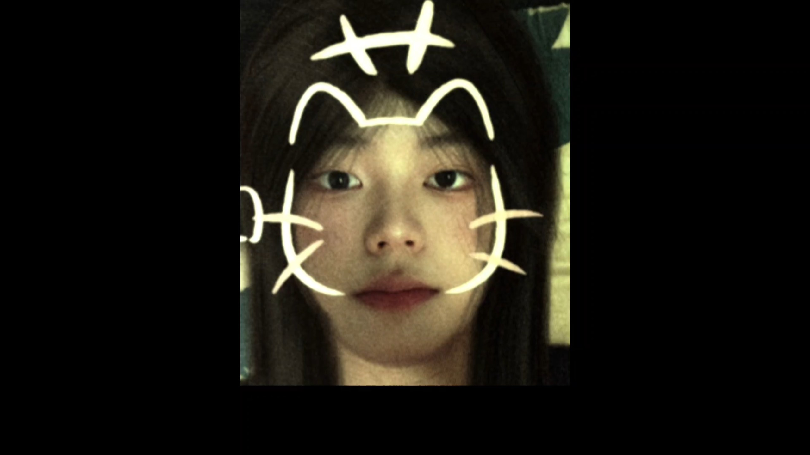 | 18 | 2026-04-13 |
| [《哈基米法典》](https://www.bilibili.com/video/BV1QLQhBPENt) | 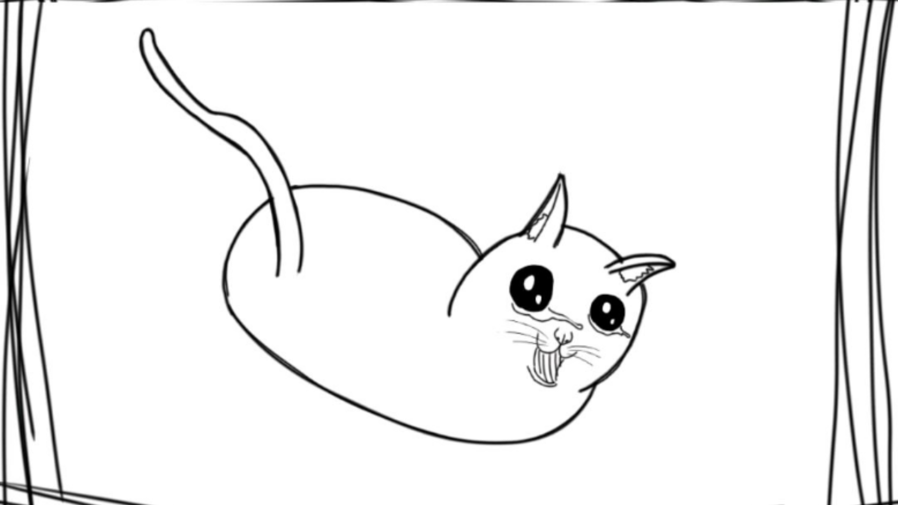 | 50 | 2026-04-13 |
| [两只睡醒就打架的哈基米](https://www.bilibili.com/video/BV1vKQhB3Eg9) | 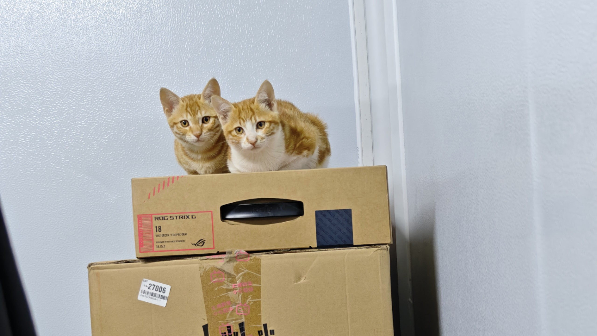 | 256 | 2026-04-13 |
| [【云游的哈基米】最新视频已上线，快来围观！](https://www.bilibili.com/video/BV1qyQhB5EPd) | 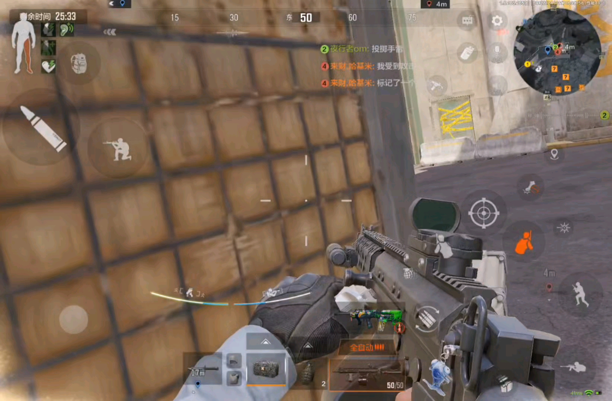 | 157 | 2026-04-13 |
| [这是我的哈基米～看看你的](https://www.bilibili.com/video/BV12xQhB4EVd) | 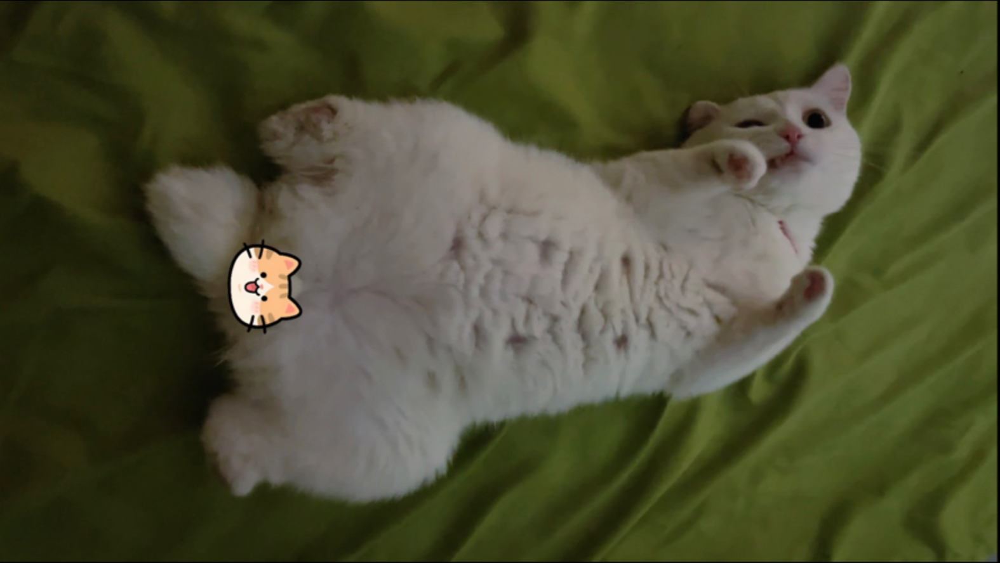 | 474 | 2026-04-13 |
| [少女也要哈基咪~](https://www.bilibili.com/video/BV1KBQtBQErq) |  | 5.4万 | 2026-04-13 |
| [咪记烧烤，味道好极了！（还配舞蹈）](https://www.bilibili.com/video/BV1F9QtBrEFZ) |  | 6.2万 | 2026-04-13 |
| [【棕黑锦蛇】一坨完全信任树杈子的黑色大便这不比哈基米乖吗！这不比哈基米乖吗！这不比哈基米乖吗！这不比哈基米乖吗！](https://www.bilibili.com/video/BV1VSQbBPEBu) | 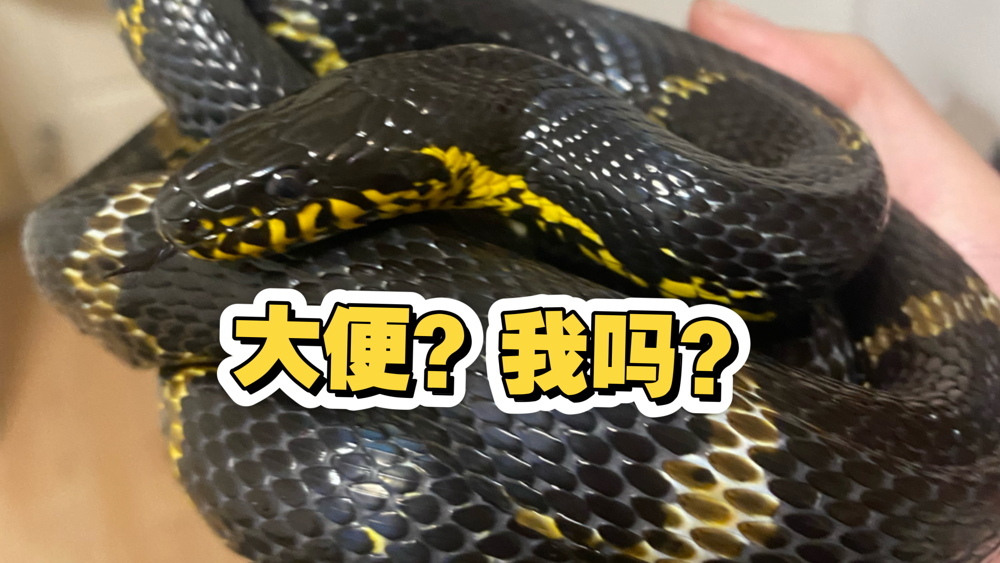 | 983 | 2026-04-13 |
| [哈基米这个喜欢穿袜子](https://www.bilibili.com/video/BV1c8Q4BuEJ2) | 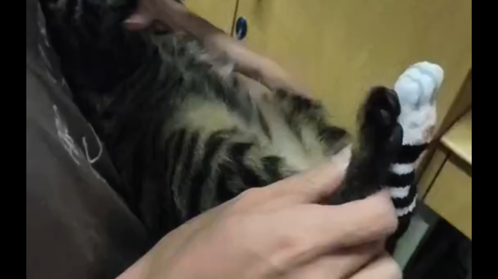 | 1065 | 2026-04-13 |
| [他余生都会追逐那种巅峰体验](https://www.bilibili.com/video/BV1wBDSBMEHM) | 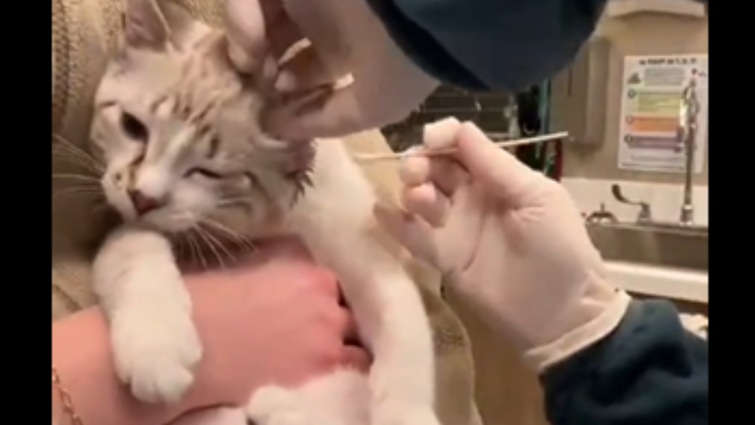 | 4.8万 | 2026-04-13 |
| [马路上的哈基米](https://www.bilibili.com/video/BV1WcQxBuEr9) |  | 4306 | 2026-04-13 |
| [哈基咪南北绿豆~](https://www.bilibili.com/video/BV1qiDXBKEgM) |  | 7.8万 | 2026-04-13 |
| [【环世界】哈基米背景音乐系列之 劲舞派对](https://www.bilibili.com/video/BV1WHDXB2EzK) |  | 3563 | 2026-04-13 |
| [小涟也要哈基咪~](https://www.bilibili.com/video/BV1YzQsBWEuh) |  | 3.1万 | 2026-04-13 |
| [哈基米这个勇气可嘉 即使劣势也要哈！](https://www.bilibili.com/video/BV13HQxBREe6) | 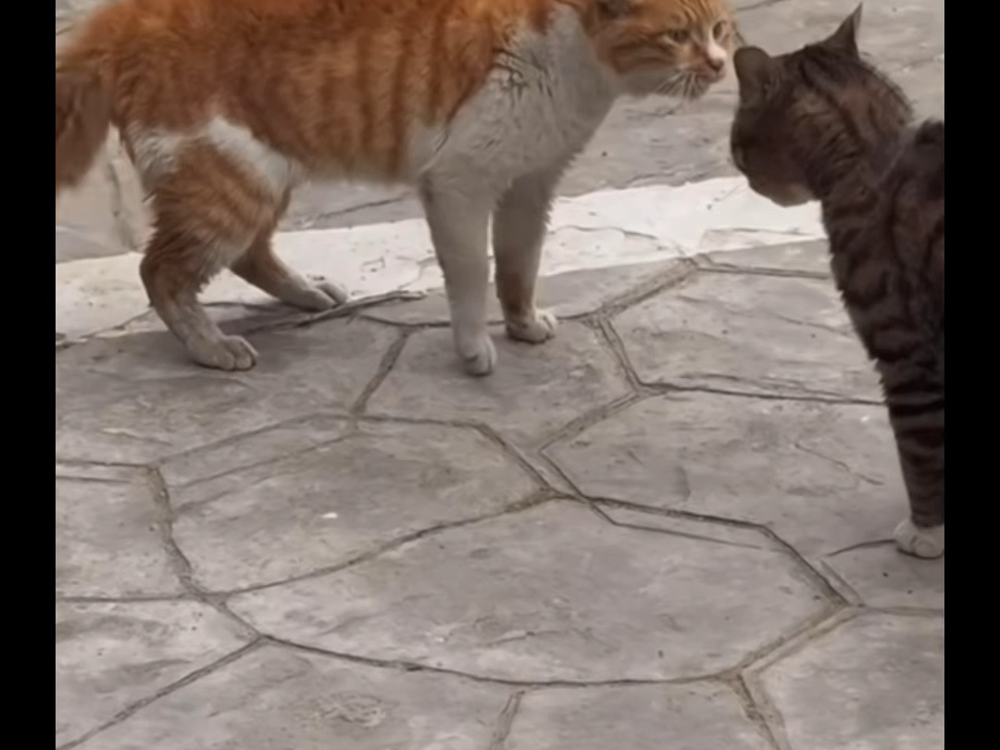 | 1000 | 2026-04-13 |
| [《当我玩了一天游戏想起还有一个兄弟》](https://www.bilibili.com/video/BV1rPQxBTE5W) |  | 52.8万 | 2026-04-13 |
| [六只哈基米钻进车子里面](https://www.bilibili.com/video/BV1MhQxBUESG) | 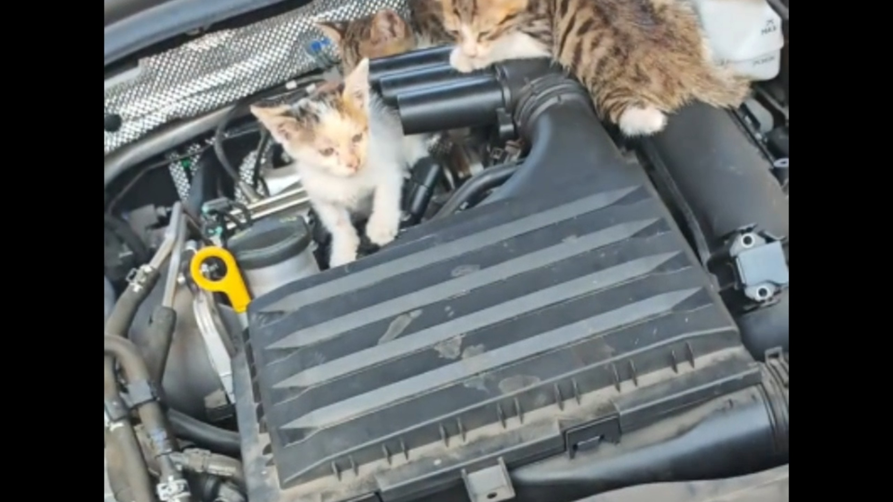 | 2334 | 2026-04-13 |
| [收留“落魄小少爷”的第14天](https://www.bilibili.com/video/BV1QmDRBiE8a) | 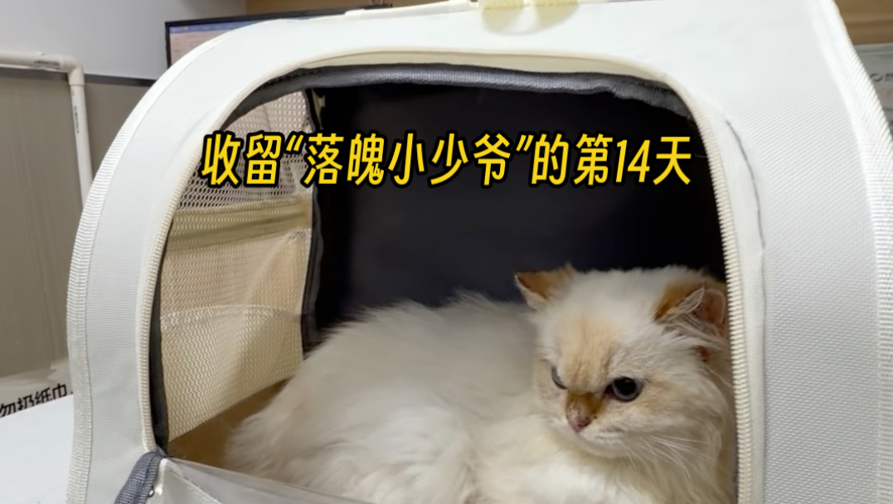 | 5.3万 | 2026-04-13 |
| [🐱当代电子榨菜合集🐱](https://www.bilibili.com/video/BV1AHDXB2EAj) | 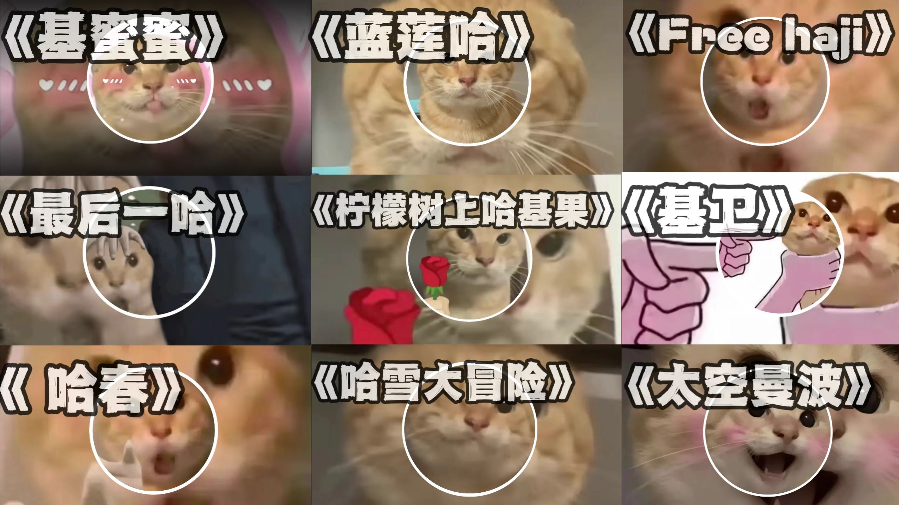 | 1388 | 2026-04-12 |
| [哈基米这个哈气接力赛](https://www.bilibili.com/video/BV1swD9BEE71) | 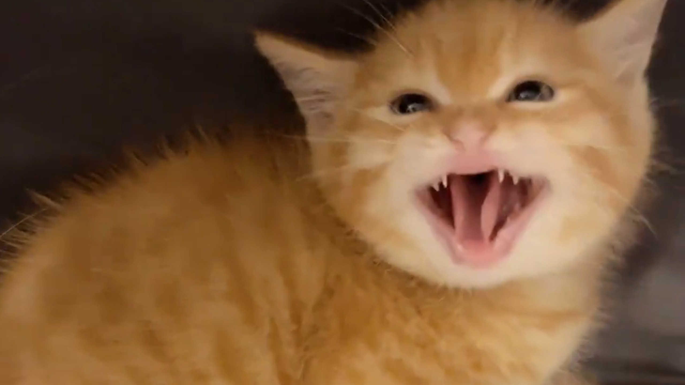 | 2663 | 2026-04-12 |
| [主播我想要哈基米蛋](https://www.bilibili.com/video/BV1MaD9BZEYn) |  | 793 | 2026-04-12 |
| [#福瑞#小狼也要哈基米](https://www.bilibili.com/video/BV182DDBDEN2) |  | 386 | 2026-04-12 |
| [食材展示](https://www.bilibili.com/video/BV1F1DSBYE3g) |  | 8.7万 | 2026-04-12 |
| [“穷玩车富玩表，顶富就玩哈基米快跑”](https://www.bilibili.com/video/BV1inDyB5EK7) |  | 906 | 2026-04-12 |
| [假如我是耄耋](https://www.bilibili.com/video/BV1jDDSBFELp) | 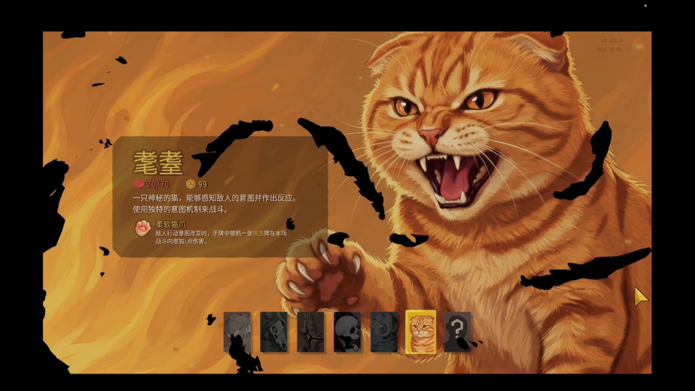 | 7.0万 | 2026-04-12 |
| [耄耋也爱吃焖子](https://www.bilibili.com/video/BV1cJDDBgEkv) | 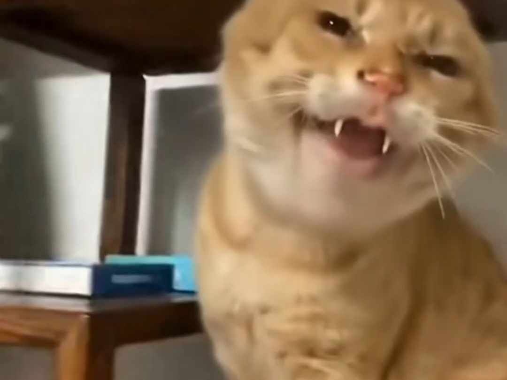 | 27.8万 | 2026-04-12 |
| [[挑战]给路人发意义不明传单3](https://www.bilibili.com/video/BV17ADmBWErD) |  | 166.7万 | 2026-04-12 |
| [【小芙ProMax】《基米说》 2026.4.11](https://www.bilibili.com/video/BV1hvD2BkEvF) |  | 293 | 2026-04-11 |
| [哈基米cos平行四边形](https://www.bilibili.com/video/BV1EADmBWEH5) | 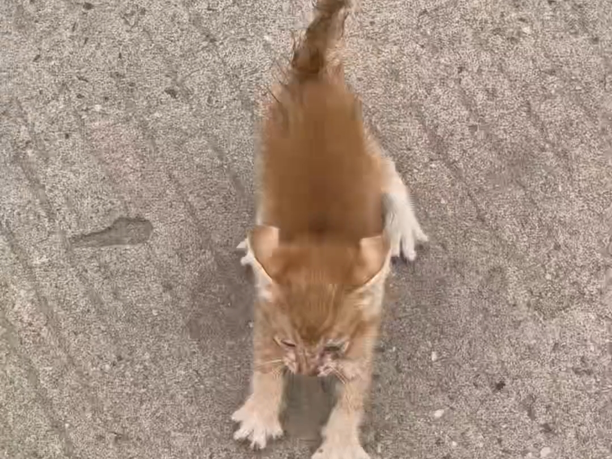 | 11.4万 | 2026-04-11 |
| [这基米有力气](https://www.bilibili.com/video/BV11fDCBbEJ5) | 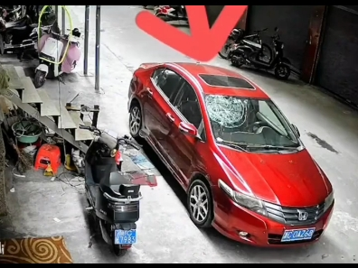 | 1.1万 | 2026-04-11 |
| [tiktok外国博主给自家猫听中国哈基米音乐 ～](https://www.bilibili.com/video/BV1ePDCBTEYP) | 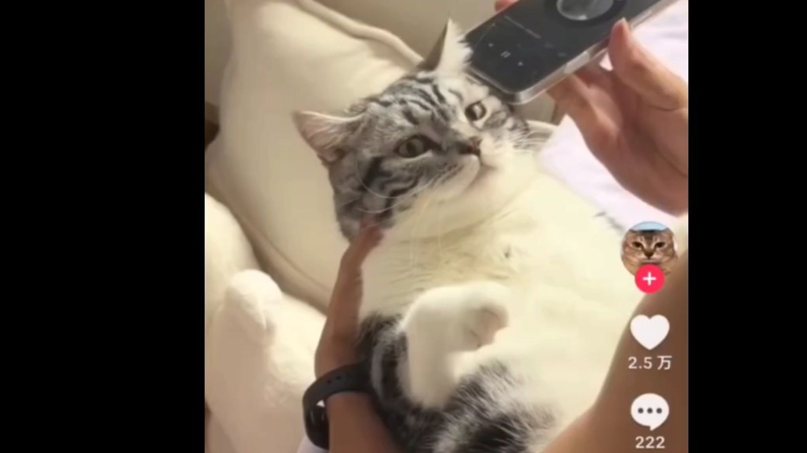 | 1.7万 | 2026-04-11 |
| [我们就是宇宙第一厉害的猫猫#美人鱼 #哈基米 #猫咪 #a](https://www.bilibili.com/video/BV1WuQuBfEcK) |  | 2269 | 2026-04-11 |
| [【哈基米音乐】《众里寻哈》](https://www.bilibili.com/video/BV1yFDhBHEWW) |  | 160 | 2026-04-10 |
| [唐嘉基米舞の小曲](https://www.bilibili.com/video/BV1FwD4BeEMK) |  | 4768 | 2026-04-09 |
| [终于把偷吃的哈基米抓住了](https://www.bilibili.com/video/BV1sTDWBYEPn) | 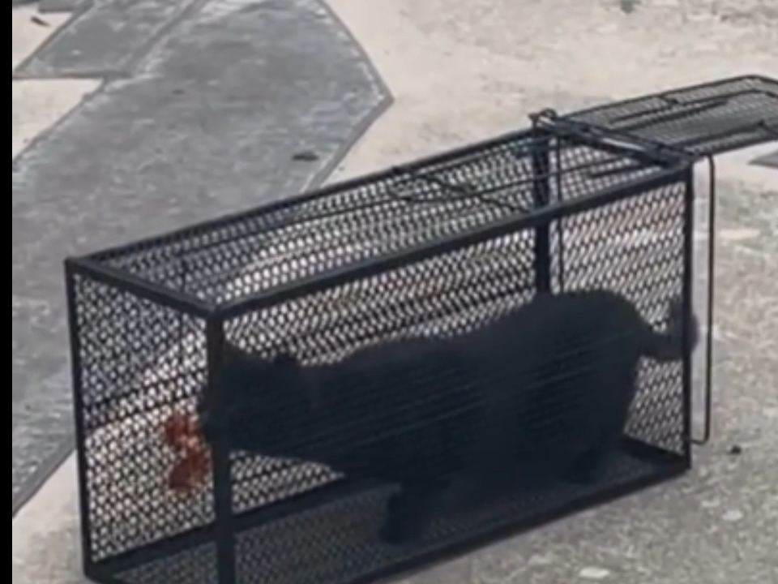 | 1536 | 2026-04-09 |
| [【自用】哈基米](https://www.bilibili.com/video/BV123DEBsEt1) | 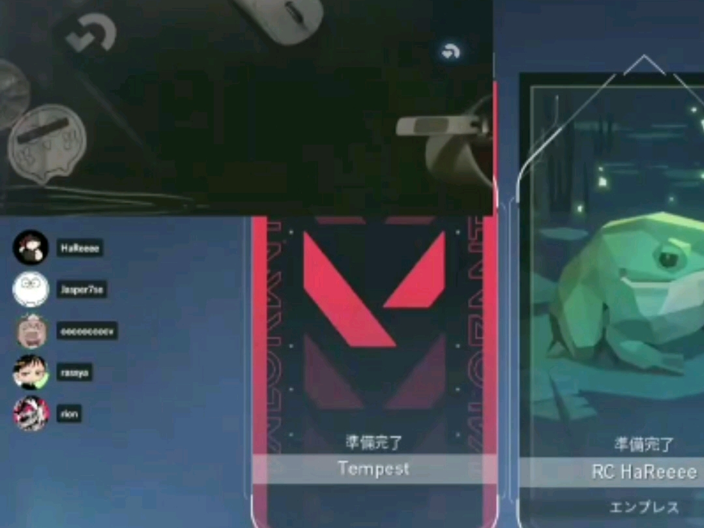 | 147 | 2026-04-08 |
| [疯狂星基米](https://www.bilibili.com/video/BV1RsDvBSEfe) | 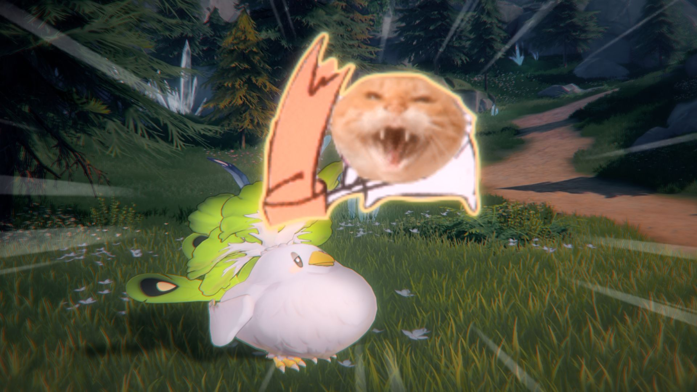 | 5.2万 | 2026-04-07 |
| [易笑物品，请勿大笑](https://www.bilibili.com/video/BV1ULXvBCEhR) |  | 75.3万 | 2026-03-30 |
| [全部共享！哈基米openutau AI音源配布so](https://www.bilibili.com/video/BV1avcyzcEwK) | 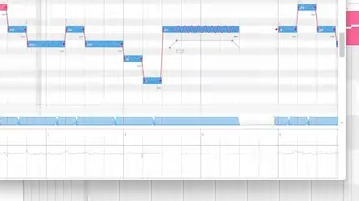 | 622 | 2026-03-12 |
| [啊老吴~嗷~~老吴啊~嗷~老吴啊老吴~啊老吴~嗷~~老吴啊~嗷~老吴啊老吴~啊老吴~嗷~~老吴啊~嗷~老吴啊老吴~啊老吴~嗷~~老吴啊~嗷~老吴啊老吴~啊老吴~](https://www.bilibili.com/video/BV1qQPmzoEX9) | 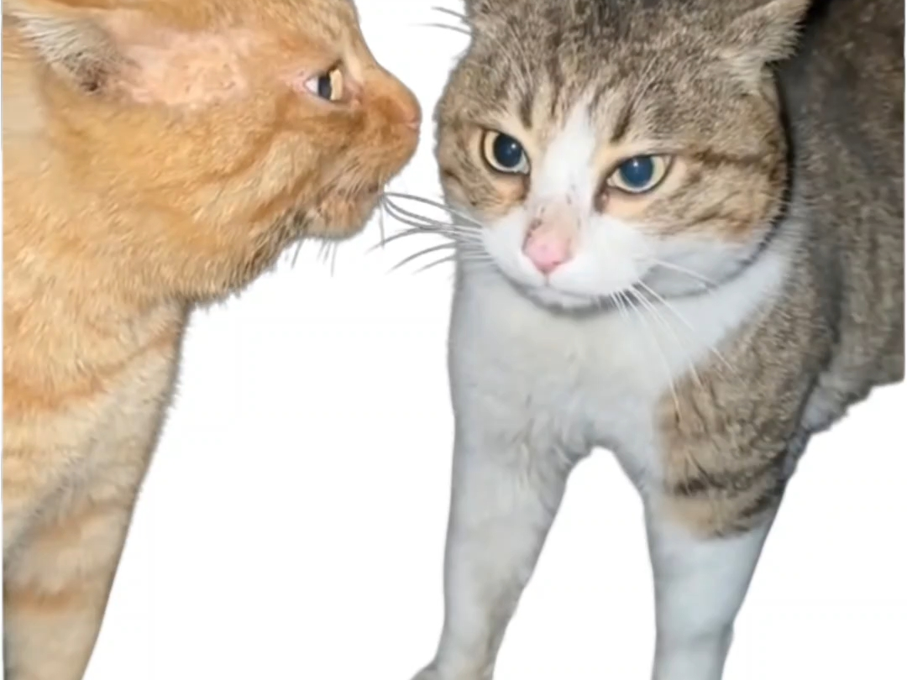 | 7.8万 | 2026-03-09 |
| [看好了！哈基米之剑是这样使用的！！！](https://www.bilibili.com/video/BV1kFPszPEuX) |  | 597 | 2026-03-06 |
| [哈基米内战，天丛云就是爹啊！](https://www.bilibili.com/video/BV1GvZtBjEXe) |  | 647 | 2026-02-15 |
| [🍓](https://www.bilibili.com/video/BV1pJFJz3EEk) |  | 2.5万 | 2026-02-06 |
| [【牌子】当世界过分“诚实”，我们要如何保持好奇与勇气【B站AI创作大赛-开放赛道】](https://www.bilibili.com/video/BV11mFLziEyP) | 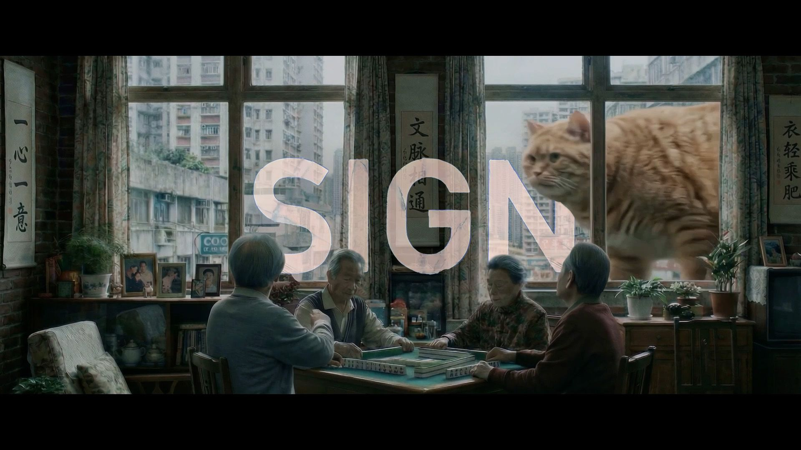 | 1865.2万 | 2026-02-03 |
| [【本家】月が綺麗ねと言われたい！ - 初音ミク【カササギ】](https://www.bilibili.com/video/BV15HFVz1EvM) | 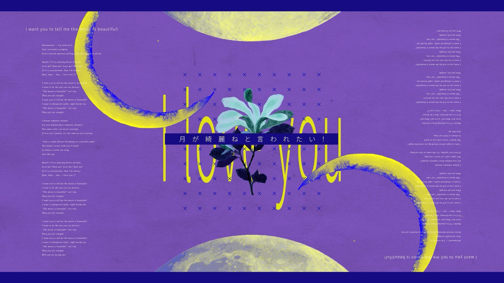 | 214.8万 | 2026-02-03 |
| [EVA整不活了《大家一起变橙汁》哈基米](https://www.bilibili.com/video/BV1aE1TBpEhK) |  | 3.4万 | 2025-10-31 |
| [天一冷身上就会长只哈基米](https://www.bilibili.com/video/BV1H6sXzAE7j) | 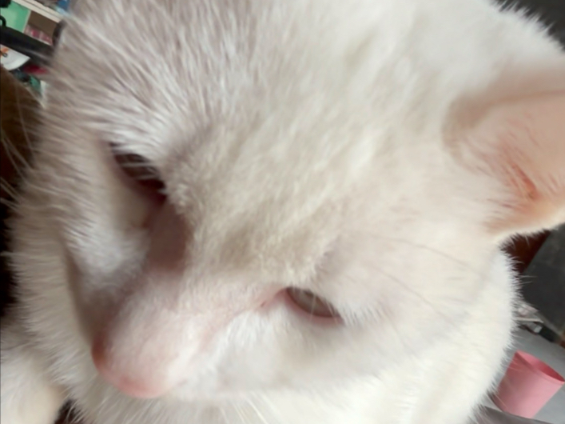 | 96 | 2025-10-25 |
| [我们（哈基米）](https://www.bilibili.com/video/BV1DWpMzEEvD) |  | 932 | 2025-09-15 |
| [Windows 8 哈基米提示音](https://www.bilibili.com/video/BV1XvbgzgEF1) | 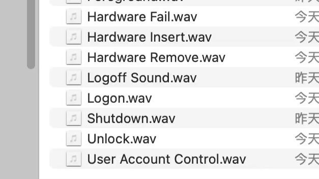 | 2659 | 2025-08-11 |
| [小基米这个死别😭](https://www.bilibili.com/video/BV16GutznE5f) | 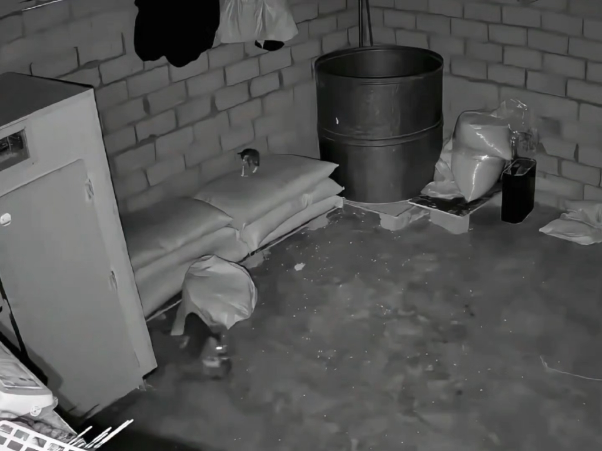 | 35.4万 | 2025-07-16 |
| [哈基米采样](https://www.bilibili.com/video/BV1gru3z4EHi) | 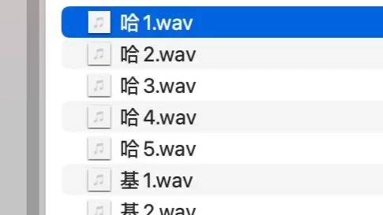 | 2.3万 | 2025-07-11 |
| [哈基米：史蒂夫的熔岩烤鸡](https://www.bilibili.com/video/BV1tCNqzjEey) |  | 1.4万 | 2025-06-18 |
| [《跳楼基米》](https://www.bilibili.com/video/BV1ur7bzfE7o) |  | 21.5万 | 2025-06-03 |
| [vs ha哈基米ji](https://www.bilibili.com/video/BV1p97mzYEES) |  | 1093 | 2025-06-02 |
| [猫儿这个发情](https://www.bilibili.com/video/BV1xE7Gz6Em6) |  | 2.0万 | 2025-05-29 |
| [基米 on mars](https://www.bilibili.com/video/BV1M9VMzxEYA) |  | 17.2万 | 2025-05-02 |

---
*最后更新: 2026-04-15 03:18:33 (自动生成)*
*数据来源: [Bilibili](https://www.bilibili.com)*

## 使用说明

运行以下命令更新视频列表:
```bash
python3 fetch_hajimi_videos.py
```
