# awesome-hajimi
collections of hajimi (哈基米 in Chinese) on the Internet.

## 视频列表 (Video List)

| 视频标题 (Title) | 封面 | 播放量 (Views) | 发布日期 (Date) |
|---|---|---|---|
| [念动力哈基米无限哈气流？](https://www.bilibili.com/video/BV1xodQBhE9C) | 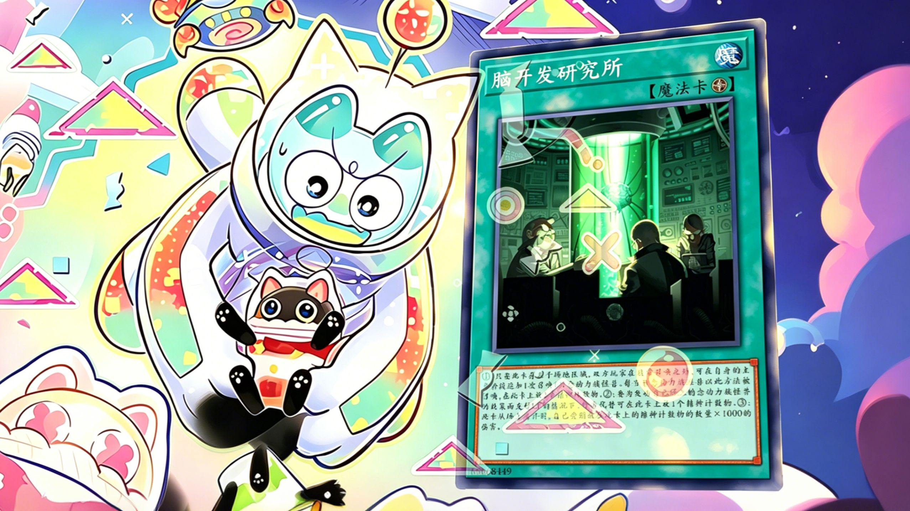 | 715 | 2026-04-22 |
| [哈基米～](https://www.bilibili.com/video/BV1azoHBsEQP) | 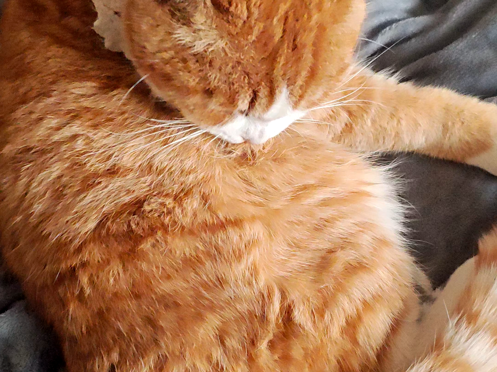 | 1 | 2026-04-22 |
| [收留“落魄小少爷”的第22天](https://www.bilibili.com/video/BV1oRdXBDEmx) | 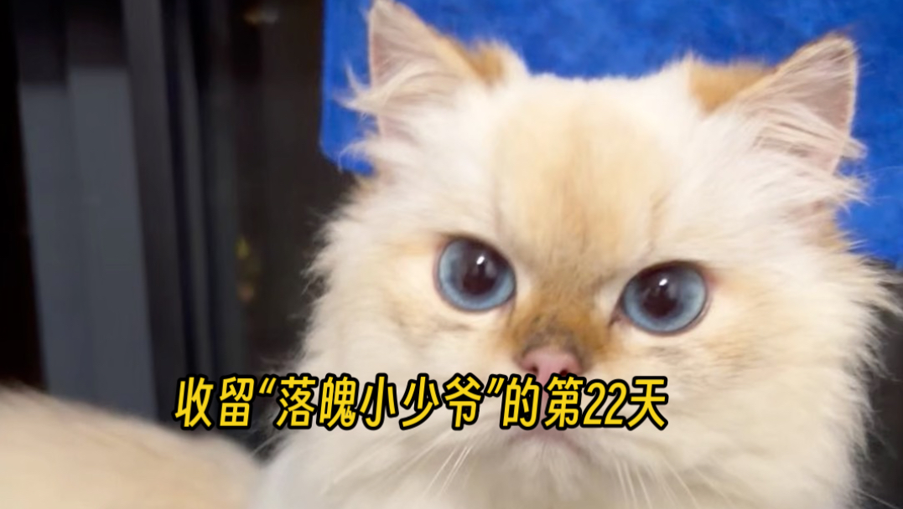 | 1.6万 | 2026-04-22 |
| [重返哈基米多顿](https://www.bilibili.com/video/BV1WdoHBCECC) |  | 24 | 2026-04-21 |
| [一人一猫，同款快乐](https://www.bilibili.com/video/BV1EudDByEgR) | 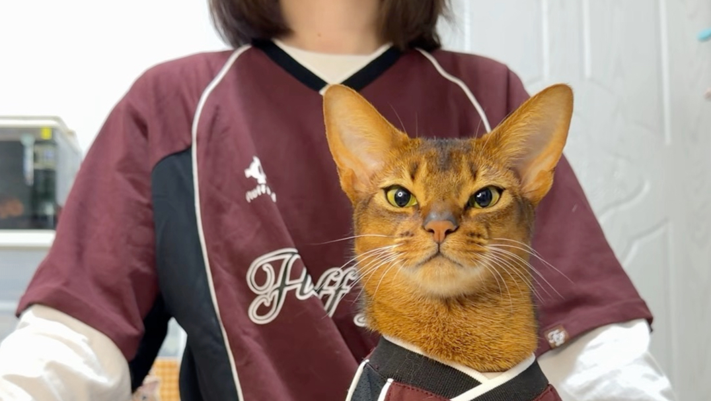 | 2153 | 2026-04-21 |
| [平民白蛆至尊哈基米](https://www.bilibili.com/video/BV1andDBTEqS) |  | 120 | 2026-04-21 |
| [邪恶哈基米](https://www.bilibili.com/video/BV1zMdDBLEJS) | 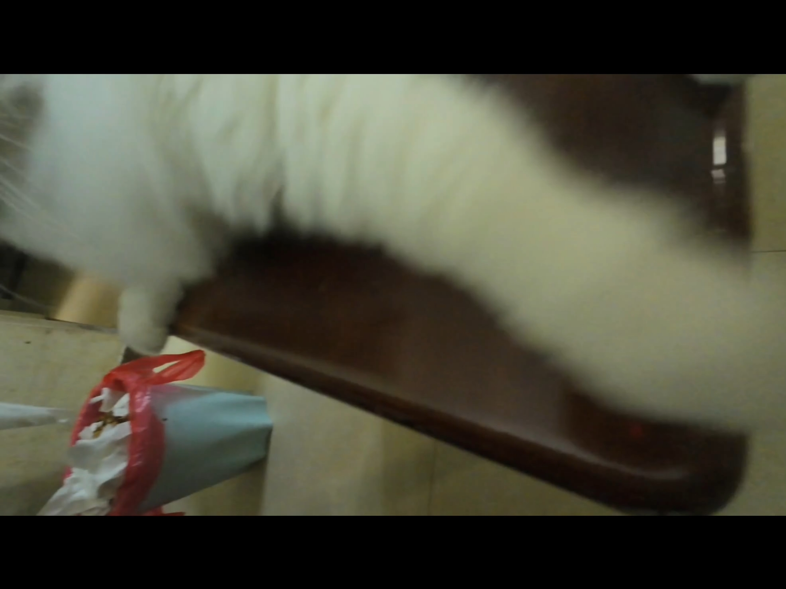 | 12 | 2026-04-21 |
| [哈基米这么做生意的？](https://www.bilibili.com/video/BV1FmdDBUEp2) | 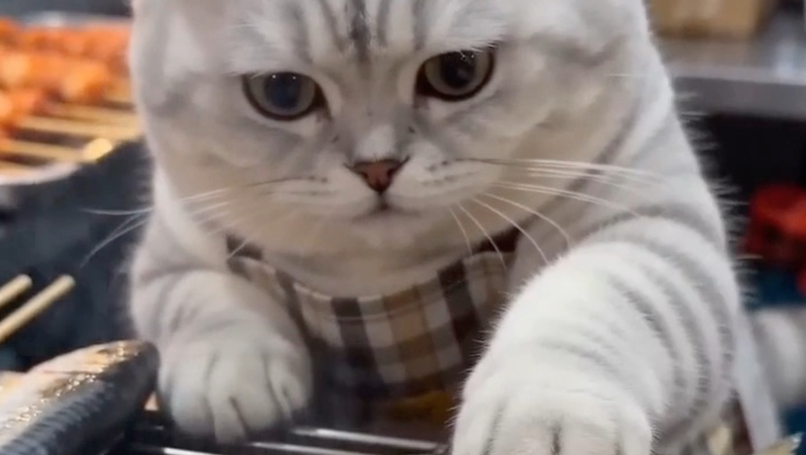 | 20 | 2026-04-21 |
| [【哈基米】一哈千基（一发千钧）ue](https://www.bilibili.com/video/BV1NedDBtE6t) | 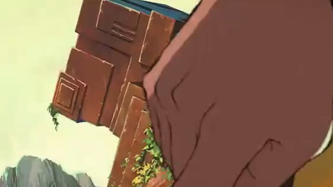 | 0 | 2026-04-21 |
| [“哈基米豆南北绿豆”](https://www.bilibili.com/video/BV1DMdQBPEPe) | 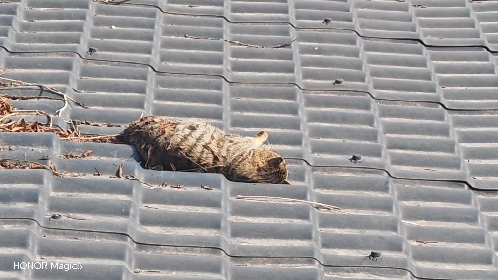 | 11 | 2026-04-21 |
| [哈哈哈基米](https://www.bilibili.com/video/BV16bdQBSEFt) | 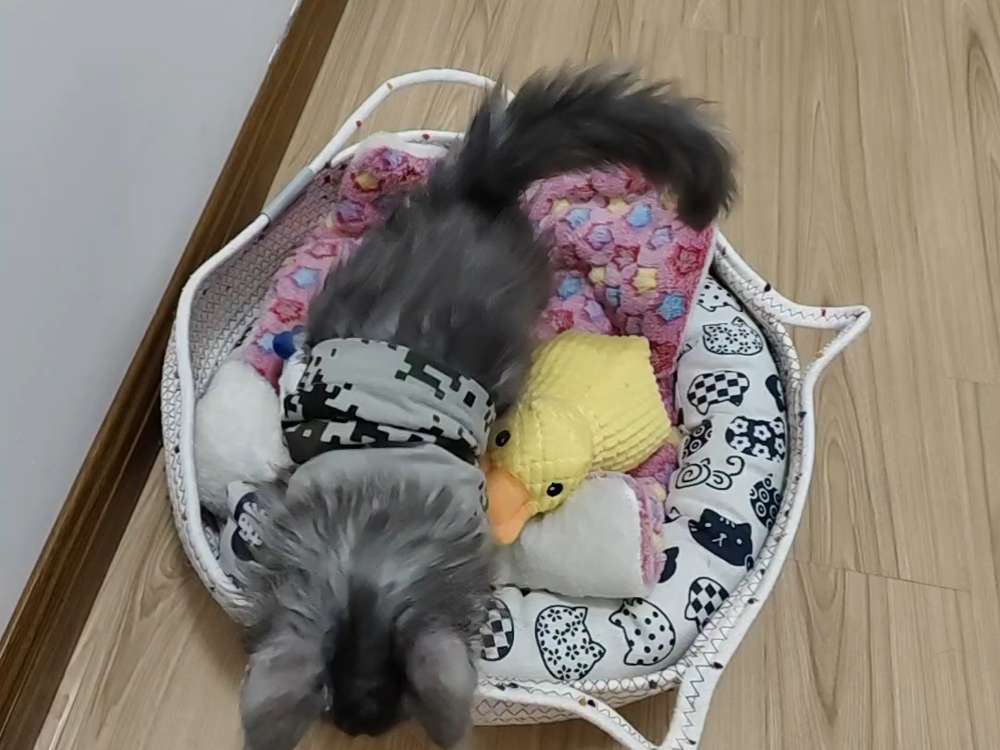 | 122 | 2026-04-21 |
| [咪师傅爪做牛肉堡，吃了都说好！](https://www.bilibili.com/video/BV1zhdQBEEx5) |  | 1.9万 | 2026-04-21 |
| [成功的把门口的流浪猫带偏！](https://www.bilibili.com/video/BV1v6dQBGEgE) | 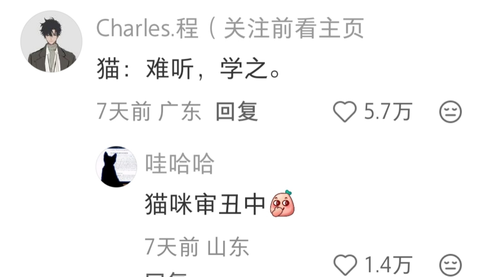 | 1.9万 | 2026-04-21 |
| [哈基米？](https://www.bilibili.com/video/BV1v6dQBGEKC) |  | 34 | 2026-04-21 |
| [人，为什么咪的碗总是空空的](https://www.bilibili.com/video/BV1yJdQBREJv) | 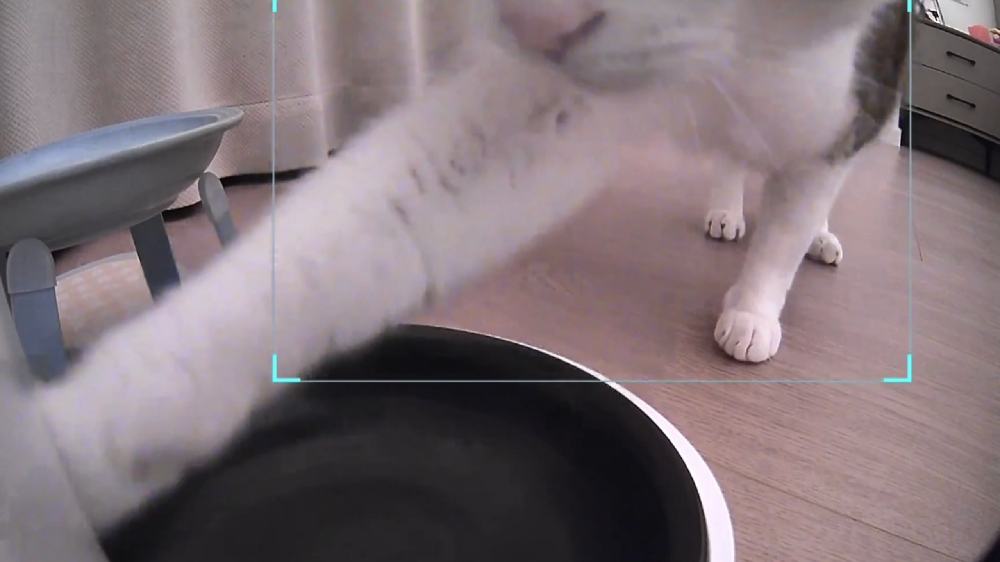 | 1.3万 | 2026-04-21 |
| [可爱哈基米](https://www.bilibili.com/video/BV1PJdQBoEF6) | 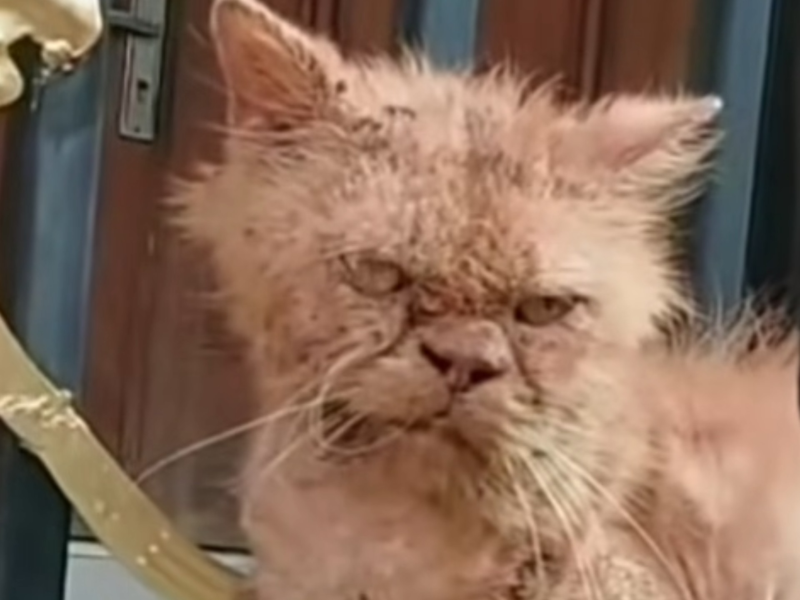 | 29 | 2026-04-21 |
| [小猫怕冷](https://www.bilibili.com/video/BV1AJdQBoESo) | 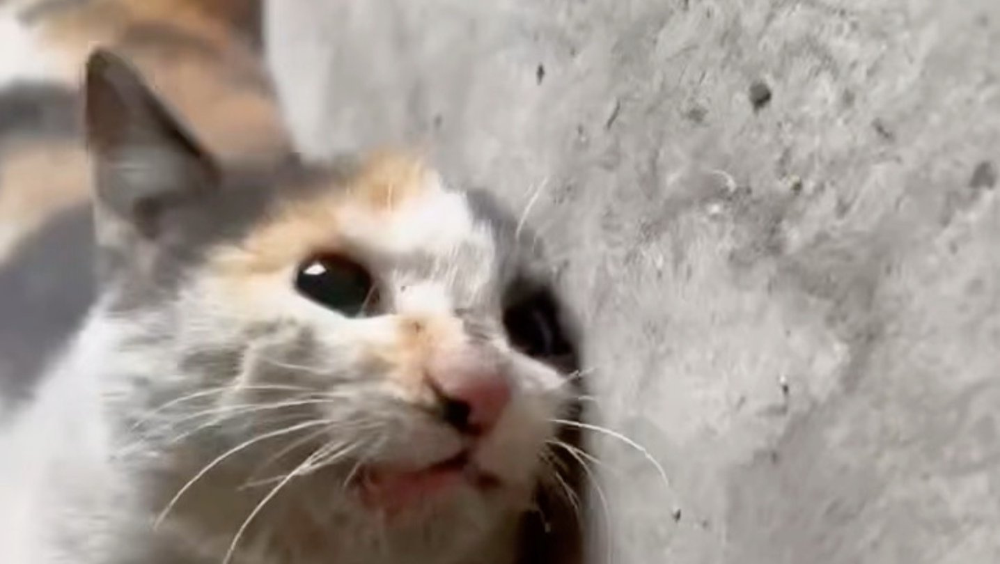 | 3262 | 2026-04-21 |
| [案例2 哈基米之歌](https://www.bilibili.com/video/BV1HzdUBjETN) |  | 15 | 2026-04-21 |
| [3.《哈曼波》（哈基米曼波）【哈基米音乐】 真的被各种哈基米洗脑了，竟然不知不觉做了首哈基米音乐，希望大家喜欢！ 作词：月底没钱君（这真的算作词吗 笑）作曲&amp;演](https://www.bilibili.com/video/BV1qUdUBgEVi) |  | 1 | 2026-04-21 |
| [超凶哈基米](https://www.bilibili.com/video/BV1oUdUBuEop) | 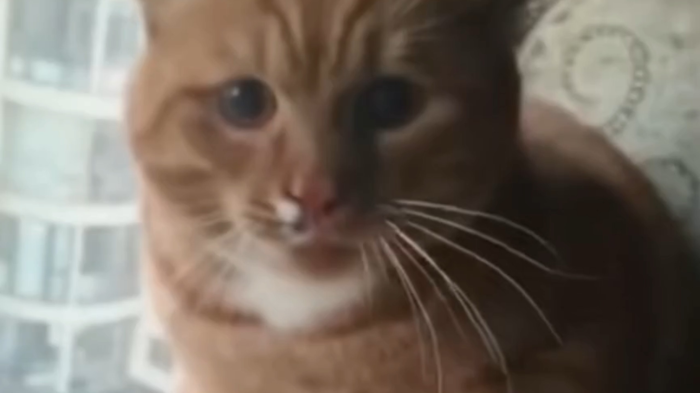 | 102 | 2026-04-21 |
| [58.另一个曼波【没钱君的哈基米音乐】 这段时间，收到了大量的催更要求，为了回应大家的期待，就有了这首歌，这次的主题是 镜子里另一个曼波。 歌曲名《另一个曼波》](https://www.bilibili.com/video/BV1E1dUBGEBb) |  | 0 | 2026-04-21 |
| [蛋仔派对：多场景多玩法逃离哈基米世界❗网速慢的都玩不明白哈哈哈❗](https://www.bilibili.com/video/BV1ttdUB9ErS) |  | 401 | 2026-04-21 |
| [恐怖哈基米，一命速通](https://www.bilibili.com/video/BV1KtdUB9E9H) | 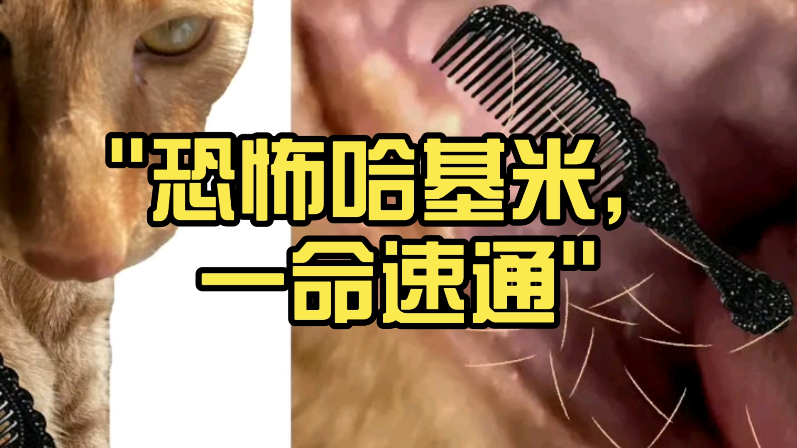 | 101 | 2026-04-21 |
| [哈基米神人杯即将举办*](https://www.bilibili.com/video/BV1PedUBSE3U) |  | 160 | 2026-04-21 |
| [傲娇哈基米](https://www.bilibili.com/video/BV1sedUBSECi) |  | 352 | 2026-04-21 |
| [飞吧，飞吧，哈基米](https://www.bilibili.com/video/BV1NhdUBQEsn) |  | 1885 | 2026-04-21 |
| [哈基米吃哈基条](https://www.bilibili.com/video/BV1xYdUBnETn) | 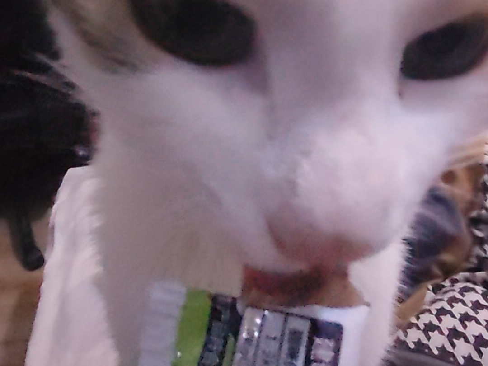 | 6 | 2026-04-21 |
| [别说了。包爽的。哈基米版loser-米津玄師](https://www.bilibili.com/video/BV1DwdSB8EKU) |  | 152 | 2026-04-21 |
| [哈基米](https://www.bilibili.com/video/BV1UNdSBtEWB) | 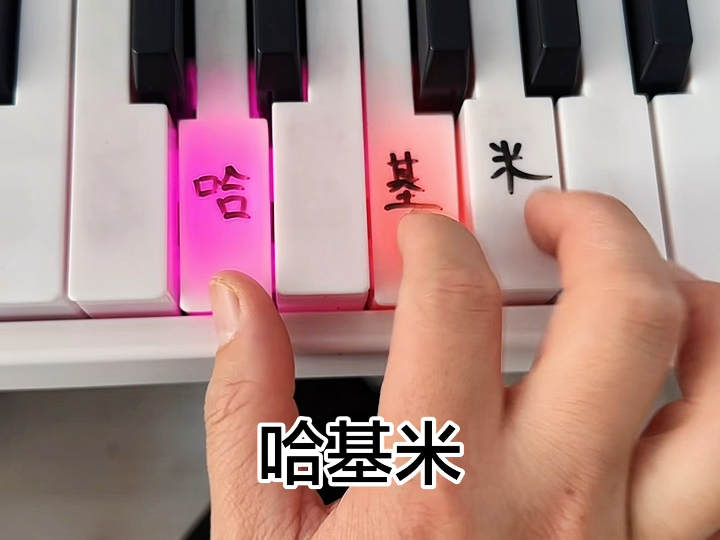 | 34 | 2026-04-21 |
| [今晚的助眠素材更新了，你喜欢哪一张哈基米床？ 布偶猫🐱暹罗猫🐱橘猫🐱折耳猫🐱波斯猫【AI偶像】](https://www.bilibili.com/video/BV1n5oKB4Egy) |  | 1111 | 2026-04-21 |
| [小猫一拳打破emo心](https://www.bilibili.com/video/BV1q8dSB3EAN) | 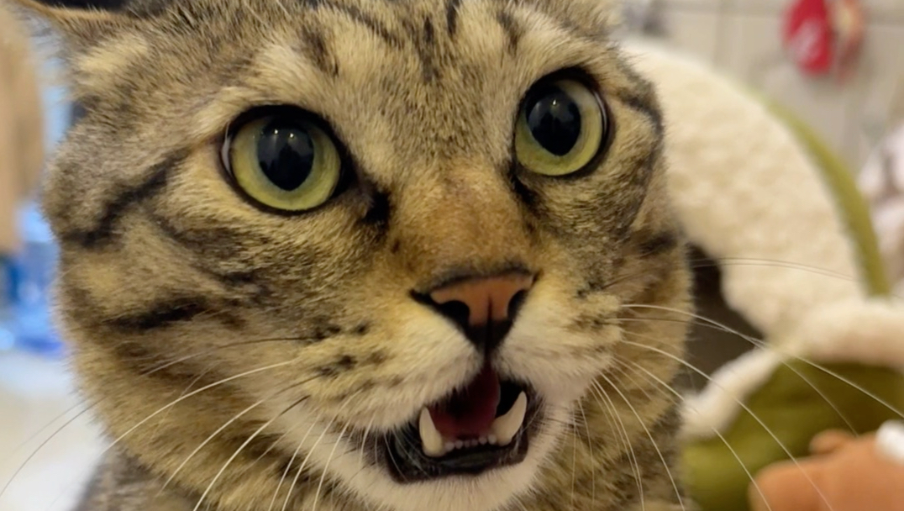 | 4757 | 2026-04-21 |
| [谁家的哈基米](https://www.bilibili.com/video/BV1i8dSB3E24) | 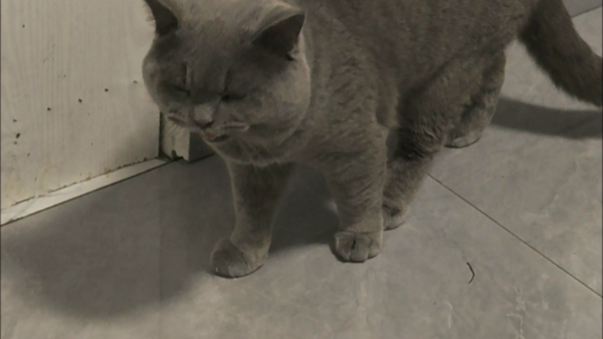 | 37 | 2026-04-21 |
| [哈基米“一败涂地”](https://www.bilibili.com/video/BV1q8dSB3EfN) | 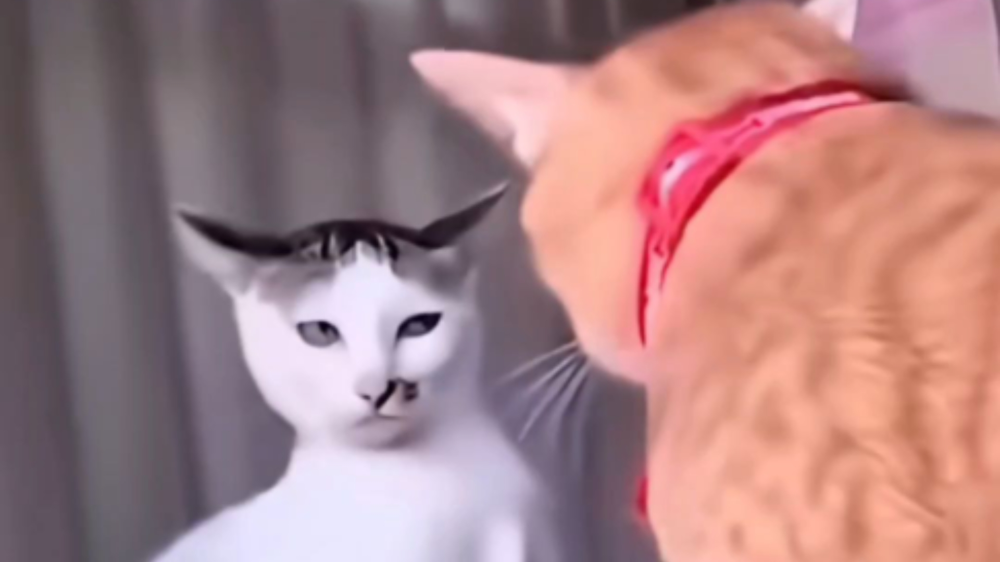 | 1304 | 2026-04-21 |
| [【补档】雪地里传来了叮咚鸡](https://www.bilibili.com/video/BV1ZtdSBkEmp) |  | 5671 | 2026-04-21 |
| [哈基米](https://www.bilibili.com/video/BV1YqdSBiEhE) | 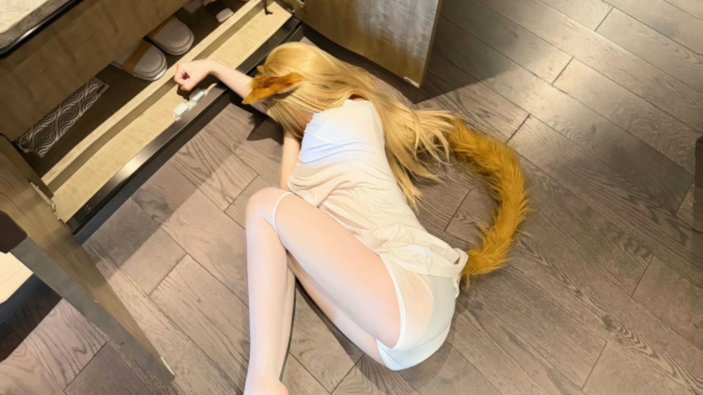 | 141 | 2026-04-21 |
| [【基米TV】对咯就这么养，可报恩了](https://www.bilibili.com/video/BV1W7dSBnEyc) | 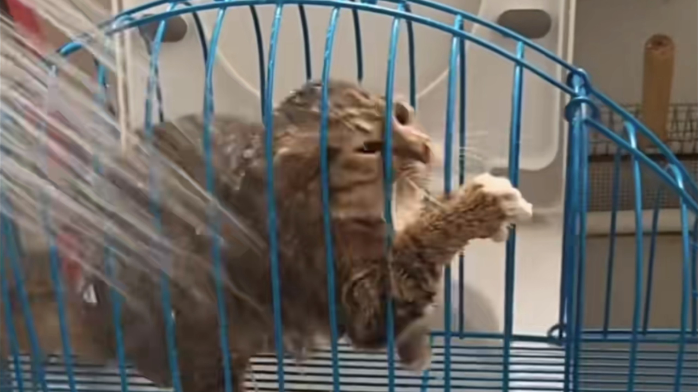 | 3552 | 2026-04-21 |
| [无敌可爱哈基米~](https://www.bilibili.com/video/BV1RYdSBuEfg) |  | 412 | 2026-04-21 |
| [难得有几个哈基米【3】](https://www.bilibili.com/video/BV1NwoKBvEGE) | 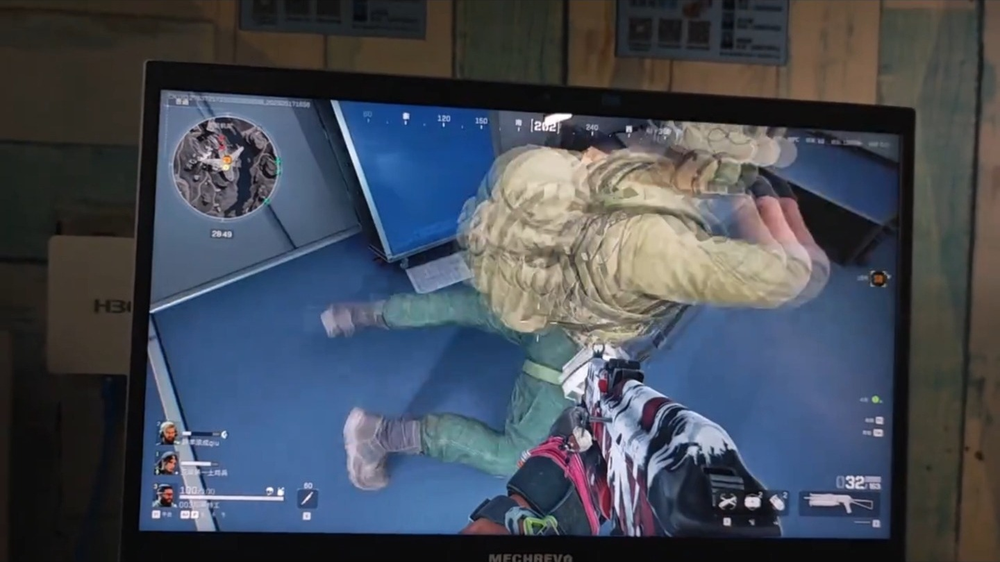 | 310 | 2026-04-21 |
| [什么？曼波说我是南通？实测超好玩的电子宠物！赛博朋克风满满的！能治愈又能陪伴，轻松又省事！](https://www.bilibili.com/video/BV1y5dSBHEaj) | 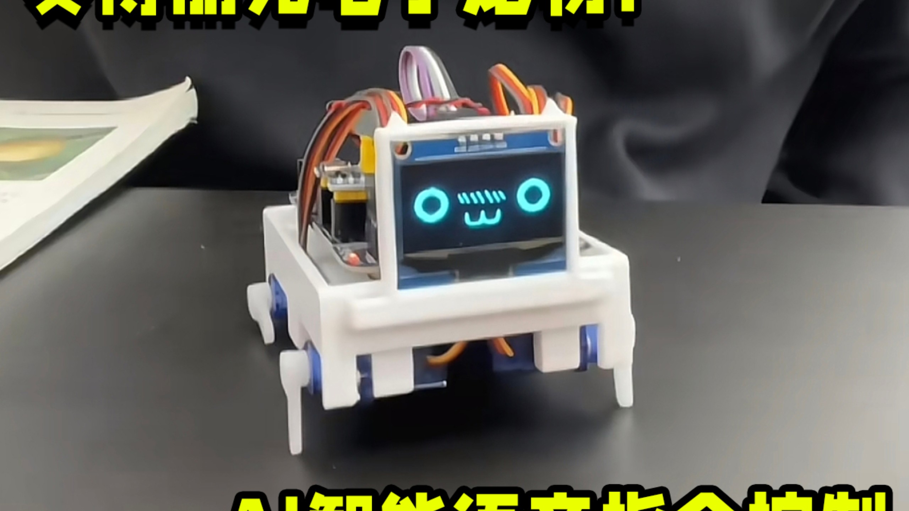 | 4280 | 2026-04-21 |
| [当你在雪地演唱了哈基米后](https://www.bilibili.com/video/BV1CLdSBDE8q) | 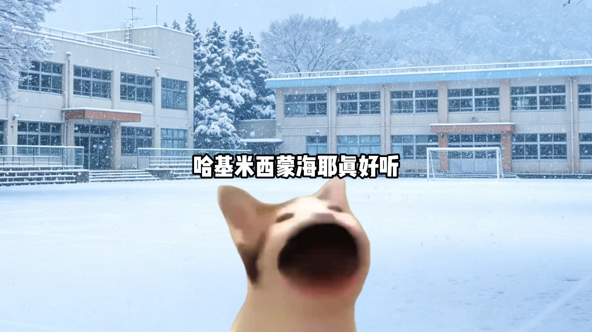 | 210 | 2026-04-21 |
| [【哈基米音乐】2026LPL 第二赛段BPの小曲（原曲：La Batalla）](https://www.bilibili.com/video/BV16WdSBLENx) |  | 2159 | 2026-04-21 |
| [他俩谁错我不知道，但下回你吃好吃的不给我留份儿指定不行奥！](https://www.bilibili.com/video/BV1JsdSB1ERC) |  | 6716 | 2026-04-21 |
| [【MeMe集装箱】#277 视频不能P，所以是真的](https://www.bilibili.com/video/BV13HdUBZENH) |  | 1.4万 | 2026-04-21 |
| [可爱哈基米](https://www.bilibili.com/video/BV1wndSBEEwn) |  | 24 | 2026-04-21 |
| [回家假装没看到哈基米](https://www.bilibili.com/video/BV1yddSBWEn2) | 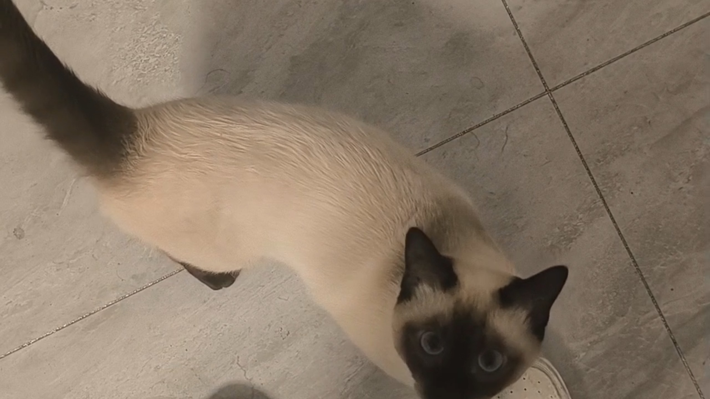 | 941 | 2026-04-21 |
| [哈基米过完2025该请高人了](https://www.bilibili.com/video/BV14DdSBoENU) | 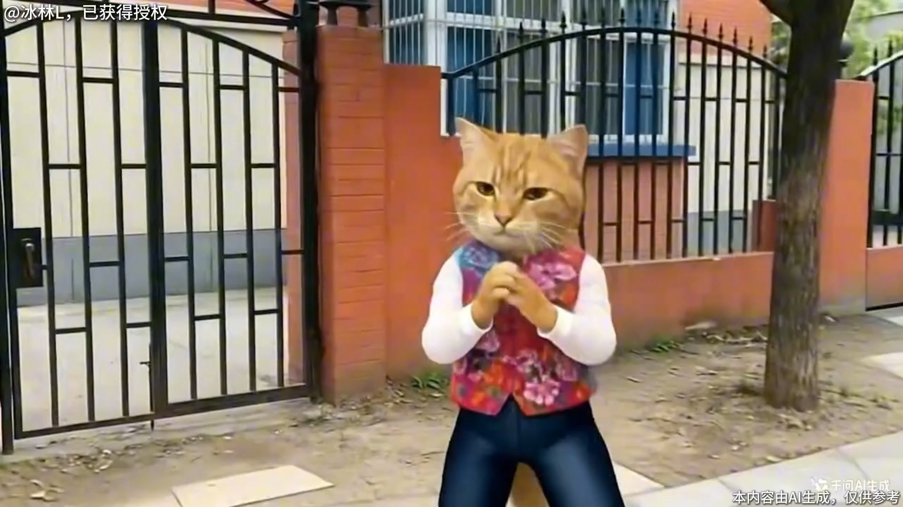 | 4 | 2026-04-21 |
| [基米小学：布拉布拉仙人一天都在干什么？](https://www.bilibili.com/video/BV1tDdSBoEEK) | 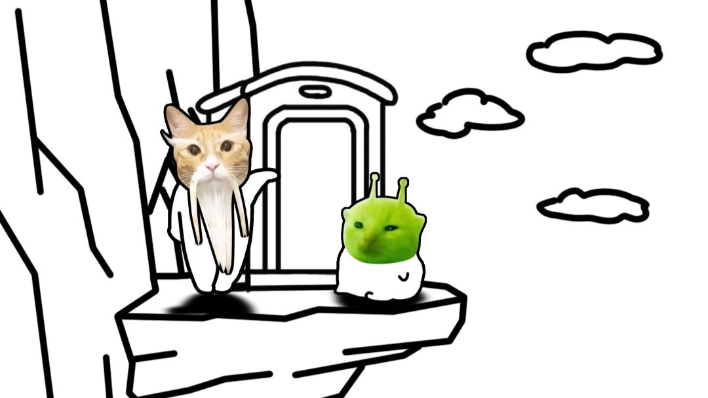 | 1.1万 | 2026-04-21 |
| [红哈基米早八迟到鸟加](https://www.bilibili.com/video/BV1HwdDBJECz) |  | 47 | 2026-04-21 |
| [耄耋VS法国赌神 谁会赢呢 #我要验牌 #哈基米 #耄耋 #解压 #神人大乱斗](https://www.bilibili.com/video/BV13CdSBYEkE) | 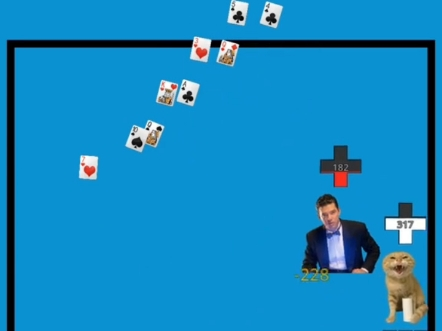 | 94 | 2026-04-21 |
| [超凶哈基米，是不是口渴了](https://www.bilibili.com/video/BV1GzdSBKEWQ) |  | 169 | 2026-04-21 |
| [偶遇野生哈基米](https://www.bilibili.com/video/BV1S1dSBcEJR) | 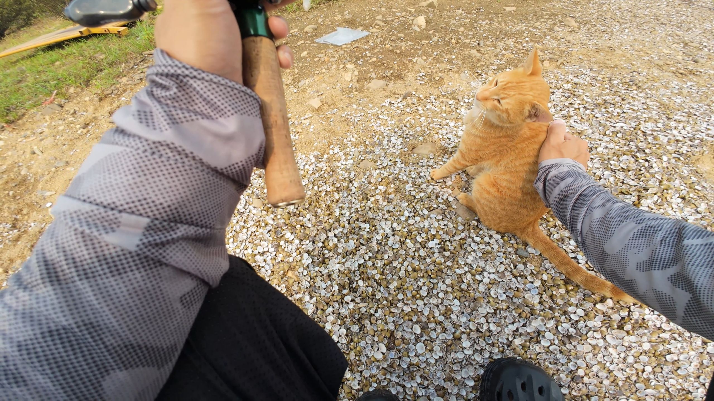 | 105 | 2026-04-21 |
| [对着哈基米唱歌](https://www.bilibili.com/video/BV1ScdmBpEQp) | 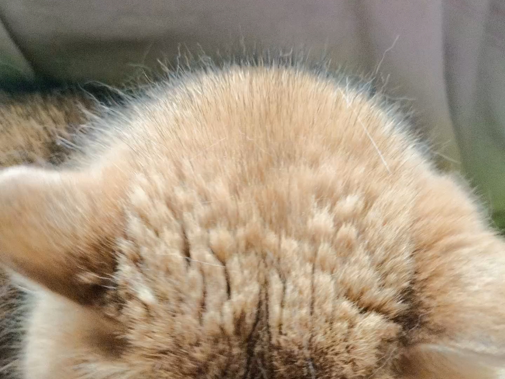 | 571 | 2026-04-21 |
| [七个哈基米《取个什么小名好呢？》](https://www.bilibili.com/video/BV1nwdUBrEwn) |  | 180 | 2026-04-21 |
| [小火耄和水耄耄练习了很久！](https://www.bilibili.com/video/BV1UcdmBpEh3) |  | 2375 | 2026-04-21 |
| [哈基米...你这家伙！](https://www.bilibili.com/video/BV1RDd2BFEEf) |  | 891 | 2026-04-21 |
| [已经无法满足大基米了](https://www.bilibili.com/video/BV1RDd2BFEDw) | 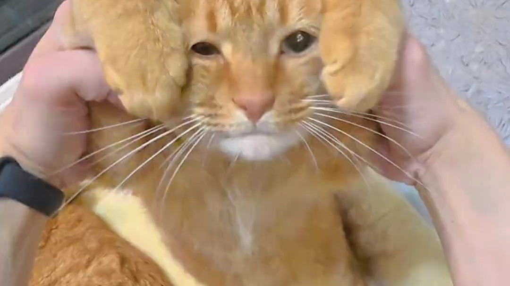 | 32 | 2026-04-21 |
| [基米这个可怜，又消失好几天](https://www.bilibili.com/video/BV1omd2BwE5M) | 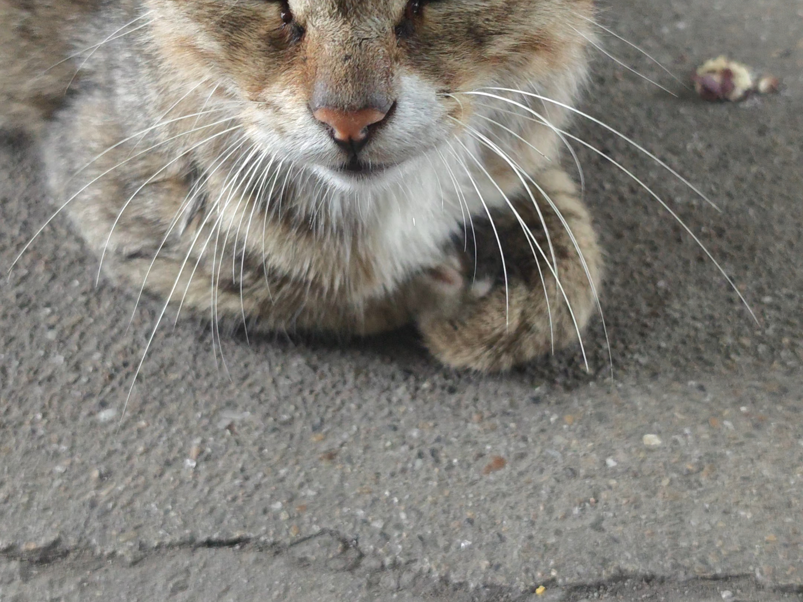 | 67 | 2026-04-21 |
| [[19320S]机甲杯final （ 操作手第一视角 哈基米配音版](https://www.bilibili.com/video/BV1Gdd2BoEUf) | 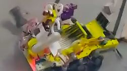 | 155 | 2026-04-21 |
| [呛咳嗽的小咪](https://www.bilibili.com/video/BV1VRd2BtEaj) | 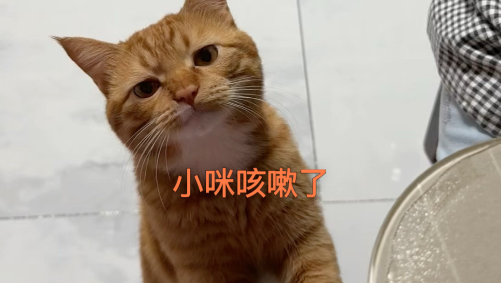 | 1.5万 | 2026-04-21 |
| [【哈基米神殿】](https://www.bilibili.com/video/BV1i8dmBYEWh) |  | 566 | 2026-04-21 |
| [稻香 哈基米](https://www.bilibili.com/video/BV1Y4d1BoE1Y) |  | 28 | 2026-04-21 |
| [已经无法满足大基米了](https://www.bilibili.com/video/BV1zGdCBbEhq) | 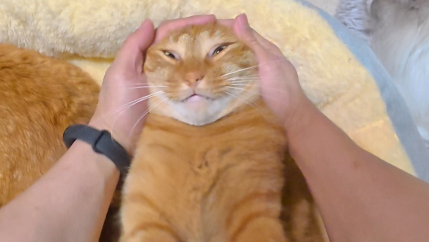 | 2.2万 | 2026-04-21 |
| [哈基米被困在天花板上了整整一天了](https://www.bilibili.com/video/BV1cjd1BvEKk) | 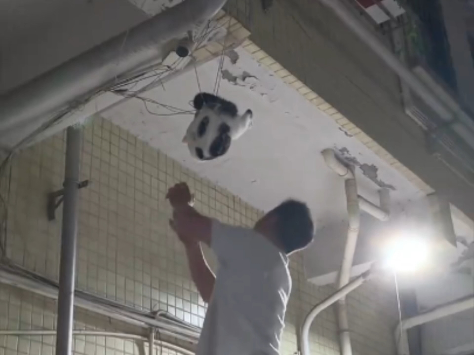 | 1262 | 2026-04-21 |
| [蛋仔哈基米寻宝游戏](https://www.bilibili.com/video/BV1wvd2B3EkZ) | 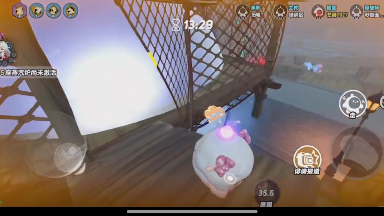 | 0 | 2026-04-21 |
| [收留“落魄小少爷”的第21天](https://www.bilibili.com/video/BV1qGdrBDEDj) | 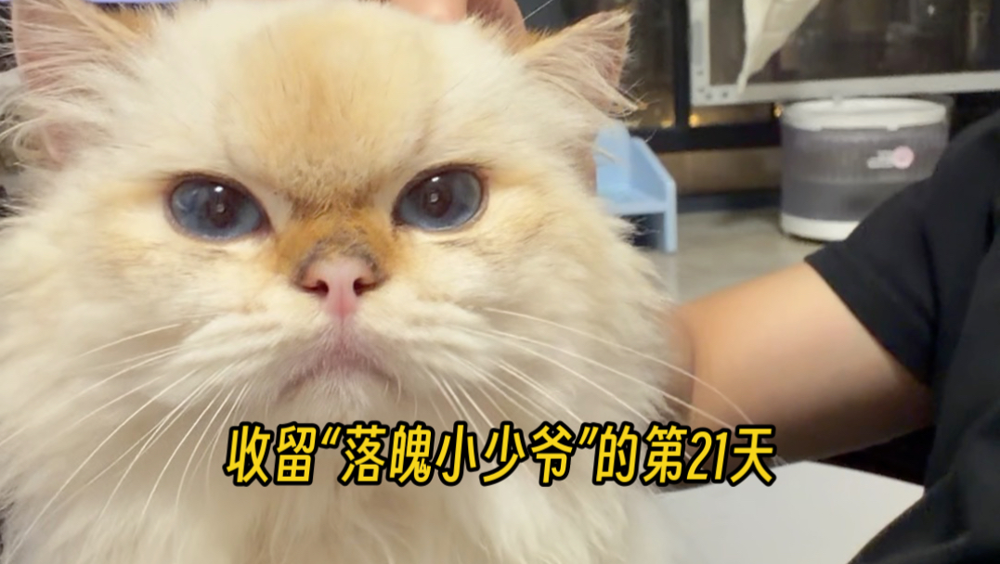 | 5.7万 | 2026-04-21 |
| [胜利结算](https://www.bilibili.com/video/BV1HSdCBPEnC) |  | 1.6万 | 2026-04-20 |
| [贾斯汀·比伯 -《Baby》改编（朝鲜）](https://www.bilibili.com/video/BV1epdCBQExf) |  | 37.7万 | 2026-04-20 |
| [猫咪在哪都能眯一会，所以叫猫咪？](https://www.bilibili.com/video/BV1kMoKBbEyx) | 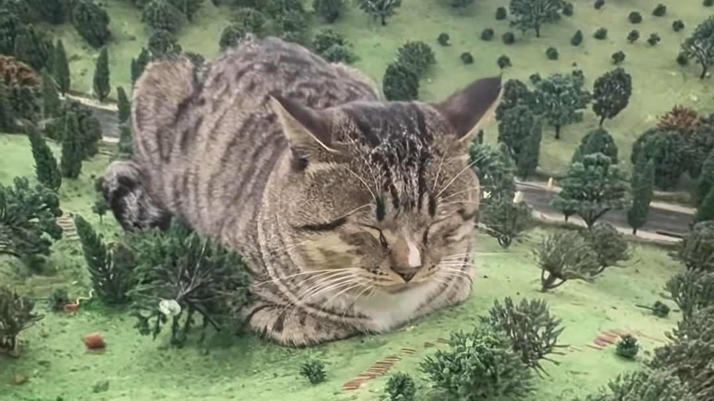 | 5.7万 | 2026-04-20 |
| [免费小灯这一块](https://www.bilibili.com/video/BV1QsowBPEoC) | 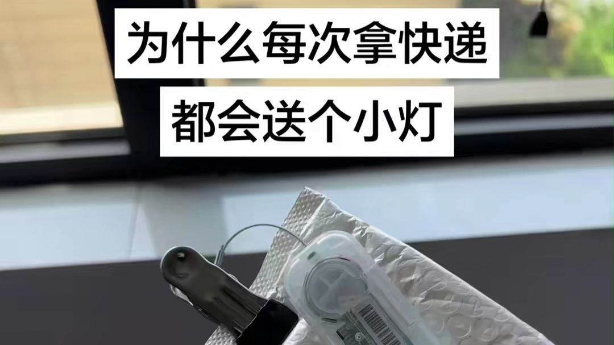 | 12.1万 | 2026-04-20 |
| [哈基米工厂明令禁止！不准殴打同事啊喂！！](https://www.bilibili.com/video/BV1AgoKBFEjv) |  | 1.2万 | 2026-04-20 |
| [早说是这种禁军啊！](https://www.bilibili.com/video/BV1CzdzBsEiR) |  | 27.5万 | 2026-04-20 |
| [人，看好了，咪只教一遍！](https://www.bilibili.com/video/BV18goNBgE2Z) | 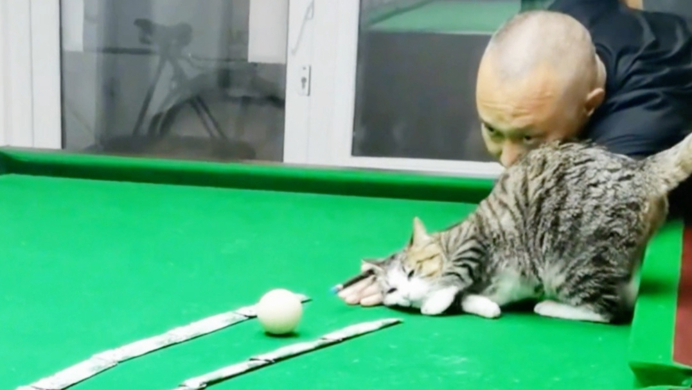 | 17.4万 | 2026-04-20 |
| [哈基米](https://www.bilibili.com/video/BV1G4oPB6EGT) | 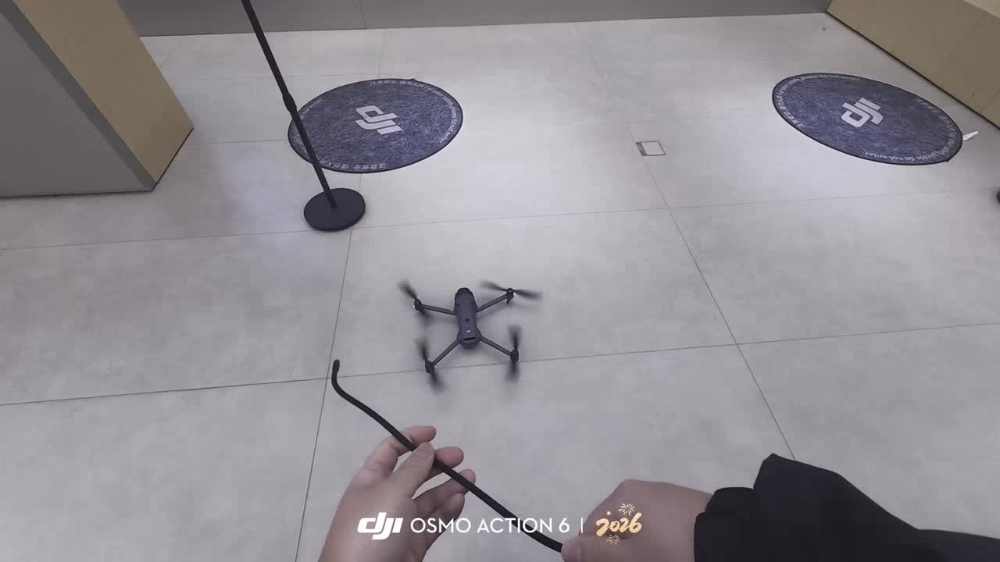 | 79 | 2026-04-20 |
| [台风似乎带来了某些东西…【哈基米恐怖故事-台风天第十集】](https://www.bilibili.com/video/BV12ioPBYE9j) | 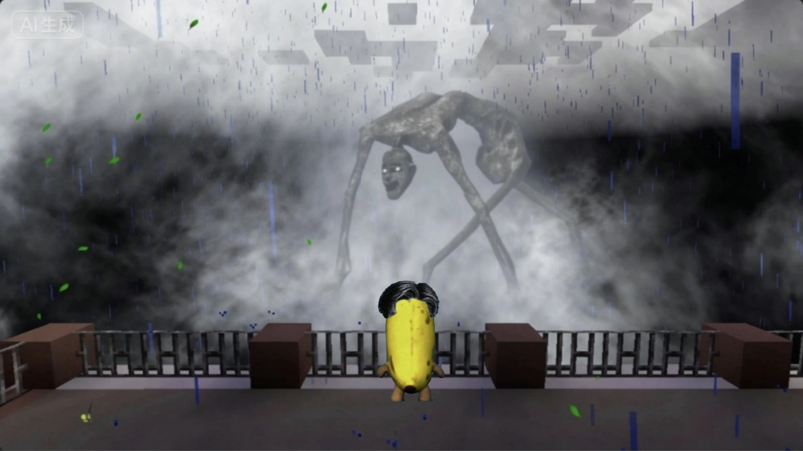 | 3.2万 | 2026-04-20 |
| [猫咪一定很舒服吧](https://www.bilibili.com/video/BV1SxowBaE2d) | 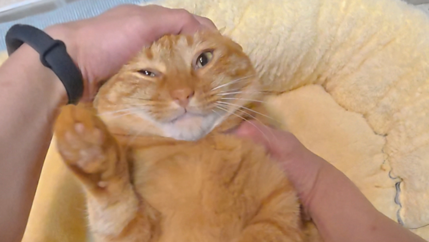 | 7.3万 | 2026-04-20 |
| [再见白菜，别哭帕清姬！真白花音毕业纪念，日本萝莉告别闪回](https://www.bilibili.com/video/BV14zoPBaEtS) |  | 13.9万 | 2026-04-20 |
| [剥蒜的情谊132.0](https://www.bilibili.com/video/BV1jtdfBeEum) | 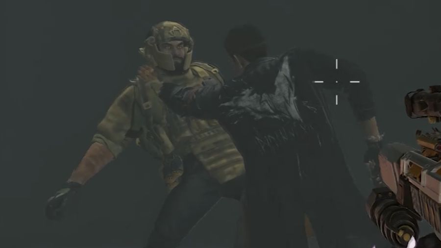 | 62.3万 | 2026-04-20 |
| [咪 的 大 学 校 园 Vlog ！](https://www.bilibili.com/video/BV1fuowBVECb) |  | 8.9万 | 2026-04-20 |
| [《动物迷惑行为大赏303》](https://www.bilibili.com/video/BV1t2dfBHEQg) | 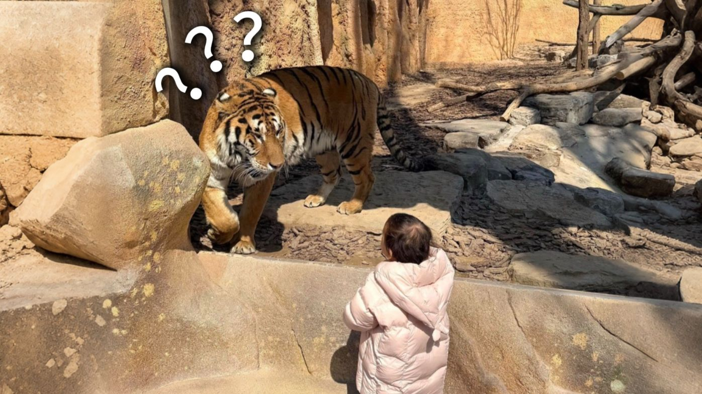 | 16.6万 | 2026-04-20 |
| [(°∀°)ﾉ](https://www.bilibili.com/video/BV18PoABiEoG) |  | 14.4万 | 2026-04-19 |
| [🐱 “国道带我走”【Take Me Home, Country Road】 🐱【完整版】](https://www.bilibili.com/video/BV1iLowBgExg) |  | 1709 | 2026-04-19 |
| [安保系统瘫痪啦🐶](https://www.bilibili.com/video/BV1UsoFBsE54) |  | 8941 | 2026-04-19 |
| [街 霸 双 舞 会](https://www.bilibili.com/video/BV1gidoBnEaD) |  | 1.5万 | 2026-04-19 |
| [“  基 米 欺 颠 婆  ”](https://www.bilibili.com/video/BV1fZdRB4ESL) | 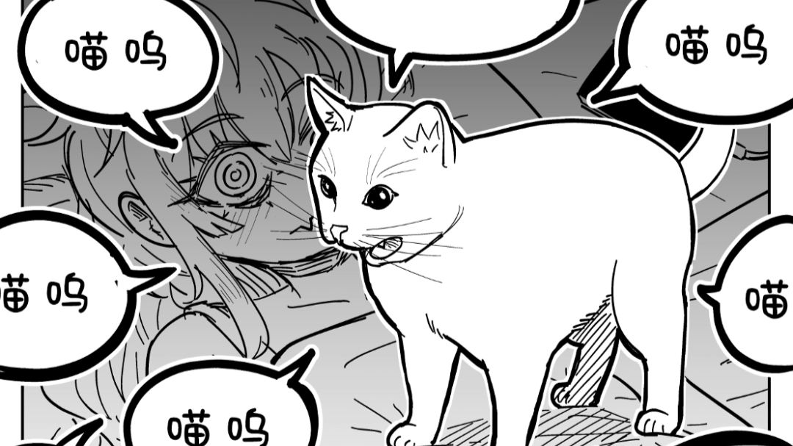 | 11.5万 | 2026-04-19 |
| [赶集篇](https://www.bilibili.com/video/BV14fddB1EXK) | 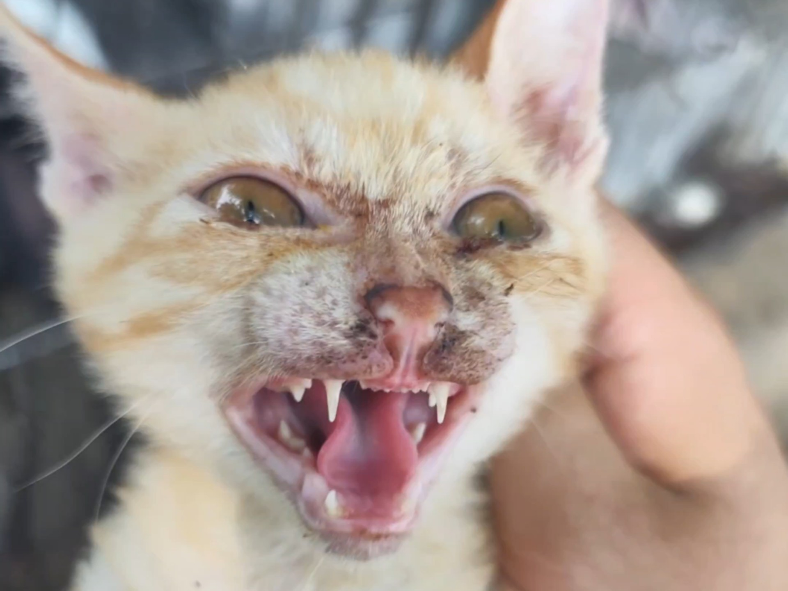 | 5.2万 | 2026-04-19 |
| [哈基米6th秋上的めにしゅき♡ラッシュっしゅ！](https://www.bilibili.com/video/BV1i4doB4EBu) |  | 158 | 2026-04-19 |
| [天气一热嘬就很跃动！](https://www.bilibili.com/video/BV1EJdoBwE3w) | 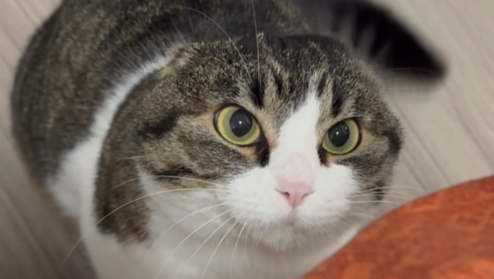 | 7.8万 | 2026-04-19 |
| [小基米落枕了](https://www.bilibili.com/video/BV1rbdHBMEWL) | 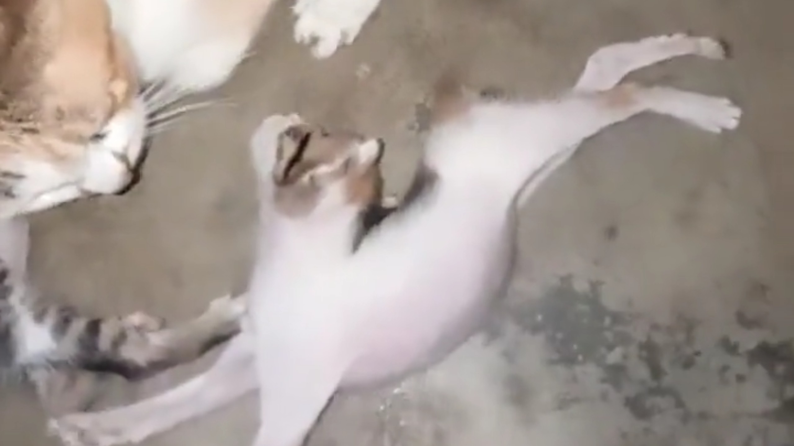 | 3.3万 | 2026-04-18 |
| [猫妈理发记：给崽崽做顶小虎帽🐯🎩](https://www.bilibili.com/video/BV1u5dHBUEuk) |  | 4862 | 2026-04-18 |
| [最聪明的一集](https://www.bilibili.com/video/BV1HgdpBgE2M) | 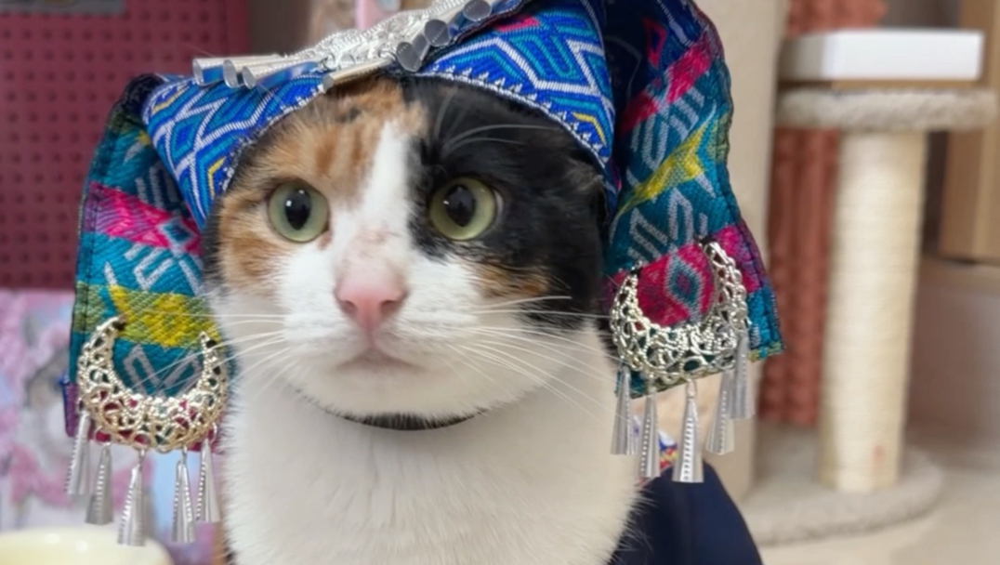 | 72.5万 | 2026-04-18 |
| [&quot;考 不 上，就 二 战！！！&quot;](https://www.bilibili.com/video/BV1wUdnBiE2L) |  | 164.4万 | 2026-04-18 |
| [【乐府】日本萝莉为何突然毕业？还是日V老大难问题之发不出工资](https://www.bilibili.com/video/BV1N6dEBPEbH) |  | 23.2万 | 2026-04-18 |
| [国外抽象难绷搞笑视频#34](https://www.bilibili.com/video/BV1vedLB6E5n) |  | 10.8万 | 2026-04-17 |
| [“ 已 严 肃 效 忠 鸣 潮 ！”](https://www.bilibili.com/video/BV1fpdVBgE4c) |  | 39.0万 | 2026-04-17 |
| [【哈基米音乐】call of silence（完整版）（原曲不使用）tu](https://www.bilibili.com/video/BV1xudiBEEyD) |  | 25 | 2026-04-16 |
| [【B站极限过审】【裸眼3D】【三连会有爆甲奖励】](https://www.bilibili.com/video/BV1hhdaBmE94) | 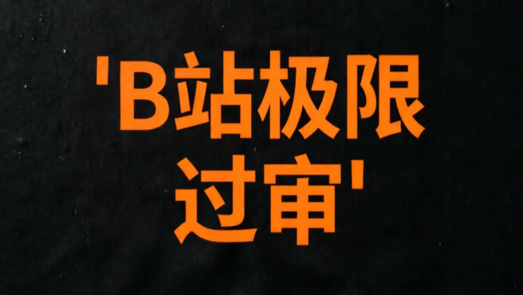 | 13.6万 | 2026-04-16 |
| [🐧你妈滴电话🐧](https://www.bilibili.com/video/BV1EoQEBmECQ) |  | 23.6万 | 2026-04-15 |
| [大家帮忙看看我家的小猫是不是想游泳了](https://www.bilibili.com/video/BV1z6QgB4Eey) | 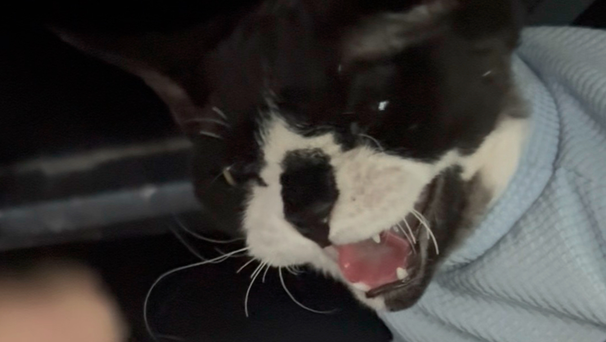 | 990 | 2026-04-14 |
| [辐里基4电台金曲](https://www.bilibili.com/video/BV1SJDfB3EJa) | 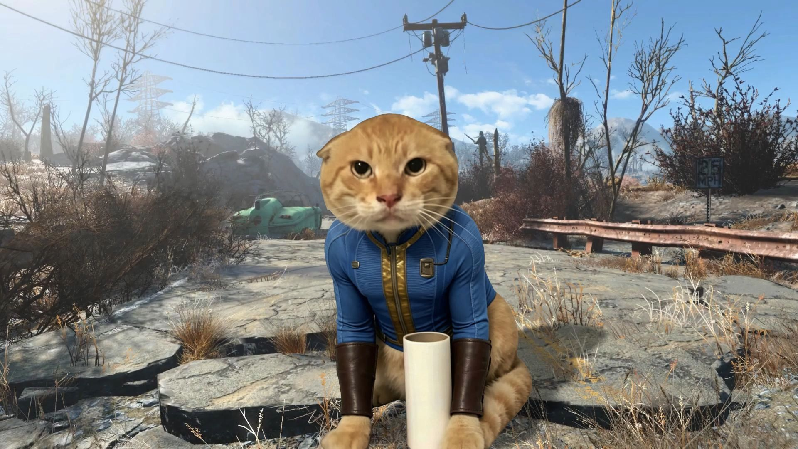 | 1.9万 | 2026-04-10 |
| [二十期：转生为“哈基米”在异世界开后宫？](https://www.bilibili.com/video/BV1tmNtzXEVP) |  | 1.3万 | 2025-06-18 |

---
*最后更新: 2026-04-22 03:19:37 (自动生成)*
*数据来源: [Bilibili](https://www.bilibili.com)*

## 使用说明

运行以下命令更新视频列表:
```bash
python3 fetch_hajimi_videos.py
```
