# awesome-hajimi
collections of hajimi (哈基米 in Chinese) on the Internet.

## 视频列表 (Video List)

| 视频标题 (Title) | 封面 | 播放量 (Views) | 发布日期 (Date) |
|---|---|---|---|
| [哈基米南北绿豆](https://www.bilibili.com/video/BV1iuNi66EAT) |  | 919 | 2026-07-15 |
| [哈基米差点自杀了](https://www.bilibili.com/video/BV185Ne6bETY) | 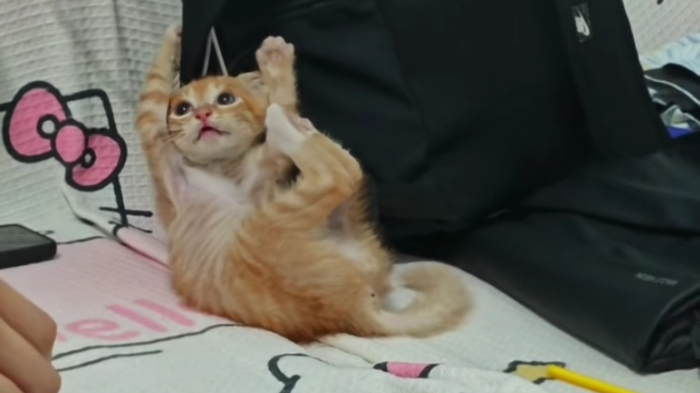 | 947 | 2026-07-14 |
| [硬与深空29](https://www.bilibili.com/video/BV1KZN86CEYF) |  | 1.4万 | 2026-07-14 |
| [【基米TV】补档合集](https://www.bilibili.com/video/BV1WENt6aEJz) | 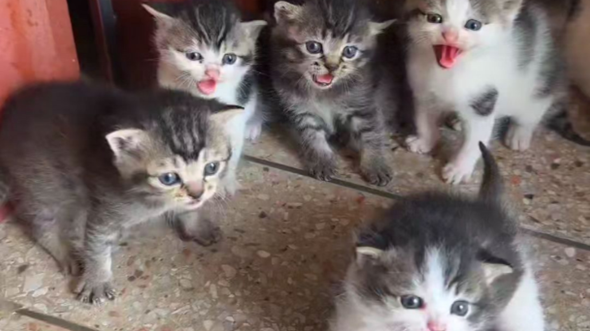 | 5167 | 2026-07-14 |
| [【基米】最最最喜欢的一集---小摔炮合集](https://www.bilibili.com/video/BV1oGNb6sEEh) | 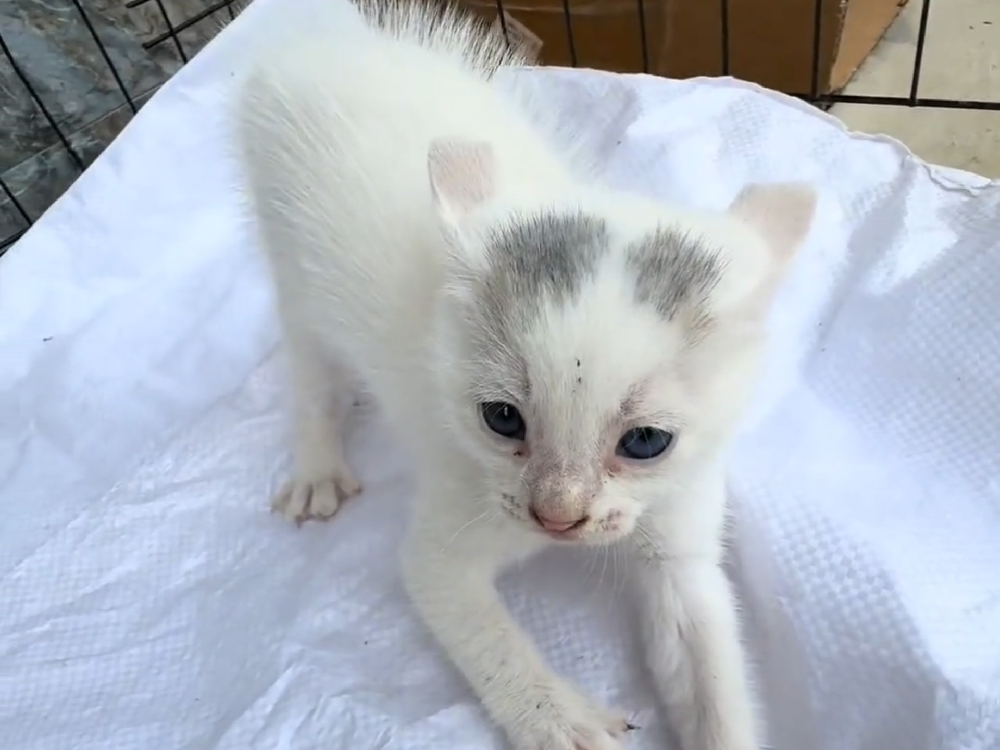 | 7756 | 2026-07-14 |
| [《哈基米の音乐合集》“重铸基米荣光我辈义不容辞！”](https://www.bilibili.com/video/BV1AfNt6NEPi) |  | 3677 | 2026-07-14 |
| [时隔多年害虫回归！1-17拆到对面崩溃，大司马的快乐回来了](https://www.bilibili.com/video/BV1XpNb6UEeU) |  | 44.0万 | 2026-07-14 |
| [有能的阿伟2.0](https://www.bilibili.com/video/BV1StNb65E84) |  | 11.5万 | 2026-07-14 |
| [🐶Stay With 大狗 (Phonk)🐶 泡沫经济の小曲](https://www.bilibili.com/video/BV18xNb62EAD) |  | 6422 | 2026-07-14 |
| [哈基米坠机了](https://www.bilibili.com/video/BV1m9NX6yErT) |  | 1428 | 2026-07-14 |
| [水疗法压制老吴哈基米](https://www.bilibili.com/video/BV1JuN96eE2D) | 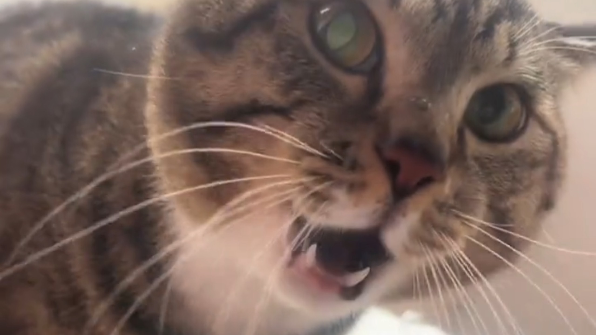 | 4165 | 2026-07-14 |
| [哈基米被卡住，全程哈气哈到最后](https://www.bilibili.com/video/BV1Q2NX6JEE5) | 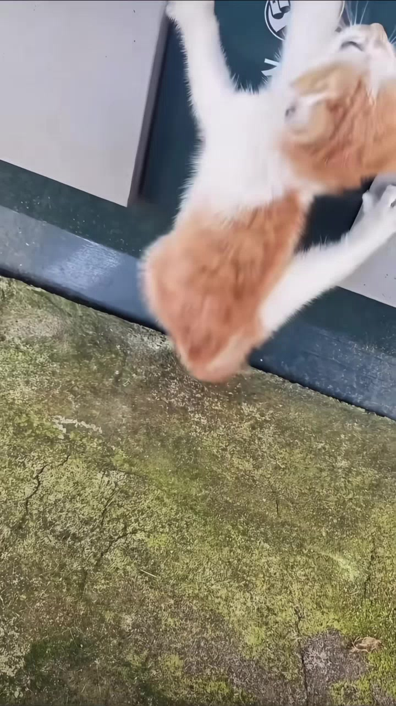 | 3126 | 2026-07-14 |
| [【超清黎明杀机】我们前戏是不是太久了些？](https://www.bilibili.com/video/BV1nfNU6RE9F) |  | 7.3万 | 2026-07-14 |
| [前有黑猫，后有乌鸦，哈基米招架不住了](https://www.bilibili.com/video/BV1uWNS6BELg) | 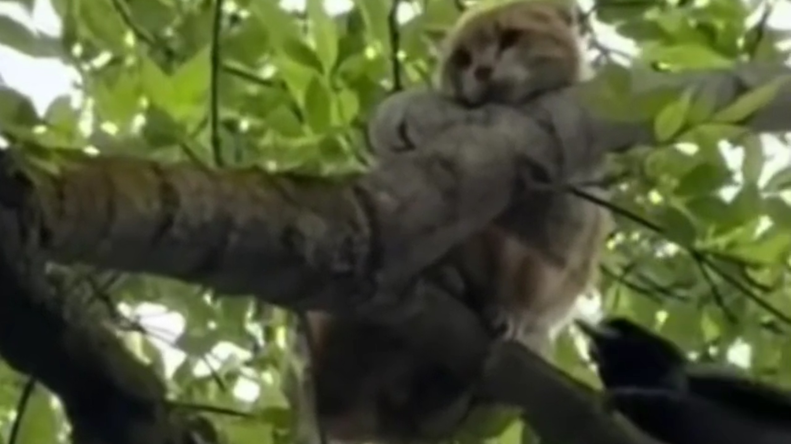 | 2.9万 | 2026-07-13 |
| [基米揣手手看老吴](https://www.bilibili.com/video/BV15VNm6qEAZ) | 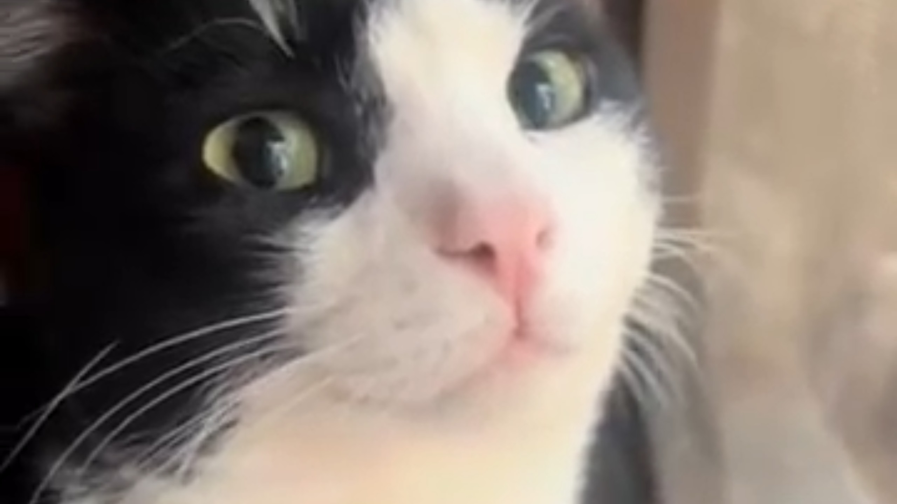 | 1.2万 | 2026-07-13 |
| [【卡拉彼丘】体验服拉维实测，烟刀打到哈基米就是生死局](https://www.bilibili.com/video/BV1jPNm6CEdY) |  | 6240 | 2026-07-13 |
| [哈基米也是吃上基腿了](https://www.bilibili.com/video/BV1wvNm6pEeq) | 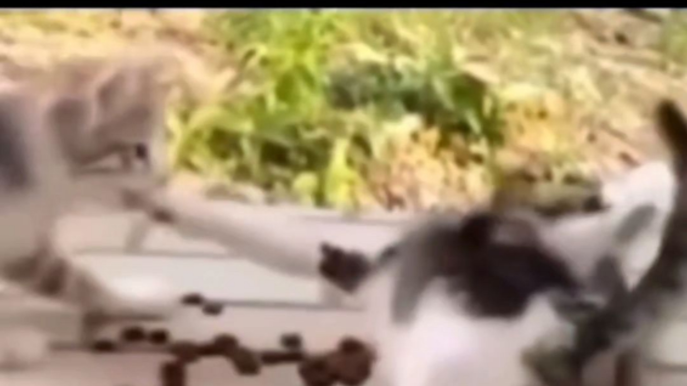 | 4718 | 2026-07-13 |
| [【大狗TV】可观测宇宙内最爽的一声大狗叫](https://www.bilibili.com/video/BV1xyNy6UEH2) |  | 2.1万 | 2026-07-13 |
| [【尼古基米OP】「一哈所有」 なんもねえ](https://www.bilibili.com/video/BV1n9Ny6kEHh) |  | 1.9万 | 2026-07-13 |
| [猫儿这个就地取材](https://www.bilibili.com/video/BV1HDNy6yEMZ) | 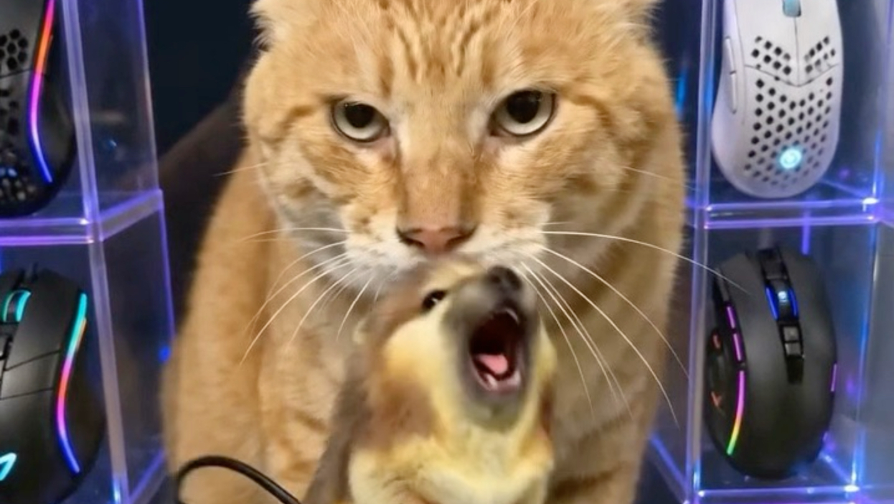 | 3.1万 | 2026-07-13 |
| [发暗网被追杀了三天三夜](https://www.bilibili.com/video/BV1neN16LEqq) | 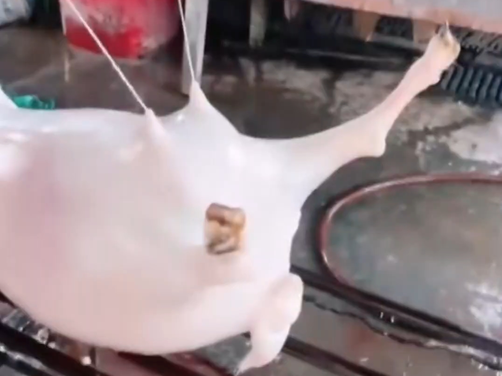 | 19.9万 | 2026-07-13 |
| [太奶的澎湖湾 2](https://www.bilibili.com/video/BV1ZBN16rECk) |  | 2.6万 | 2026-07-13 |
| [哈基米是智力低下物种吗？它的智力定位是什么？](https://www.bilibili.com/video/BV1vcNC6FEBy) | 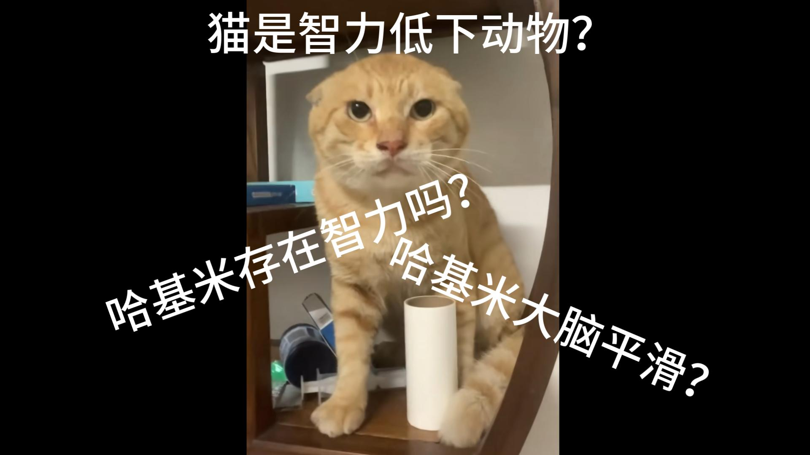 | 4.2万 | 2026-07-13 |
| [直播时突然歌瘾犯了然后折磨了6个小时直播间观众](https://www.bilibili.com/video/BV1KENC6mEML) |  | 8.9万 | 2026-07-13 |
| [哈基米转圈转晕合集](https://www.bilibili.com/video/BV1TFNy6SEbQ) | 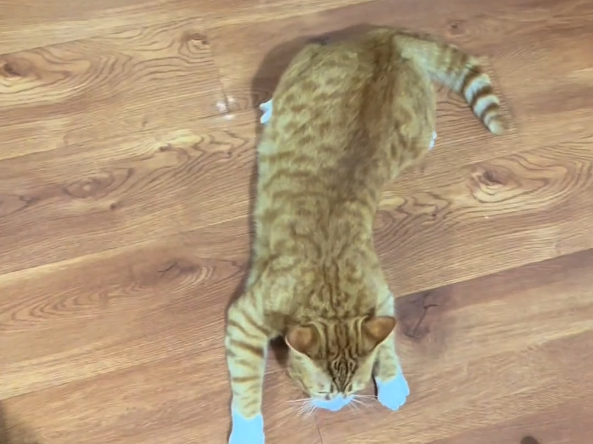 | 208 | 2026-07-13 |
| [哈基米~~~](https://www.bilibili.com/video/BV1jHNy6vEZF) | 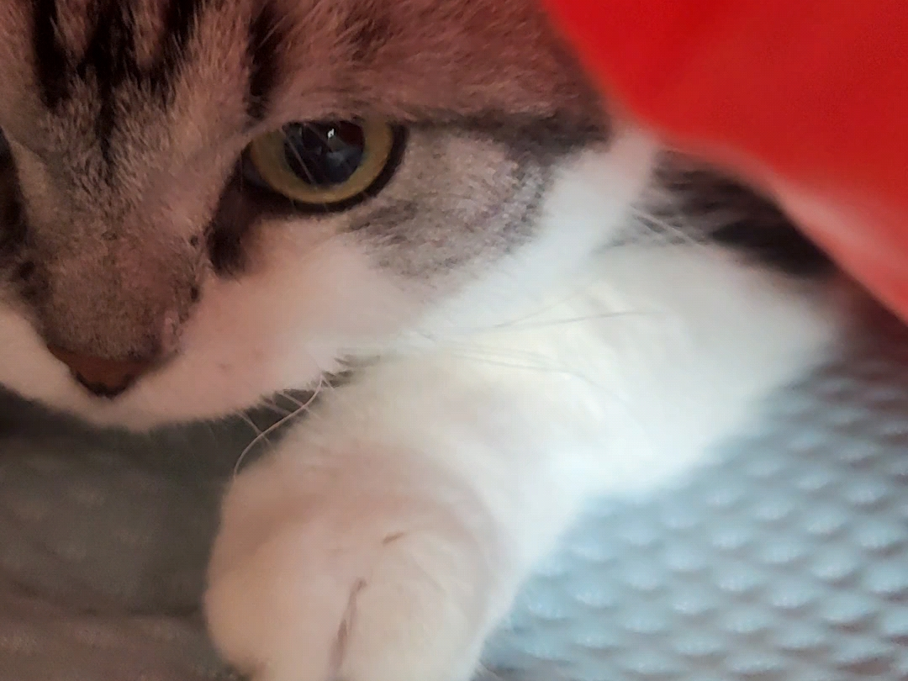 | 107 | 2026-07-13 |
| [哈吉米一脸享受](https://www.bilibili.com/video/BV1r3Ny63EiG) | 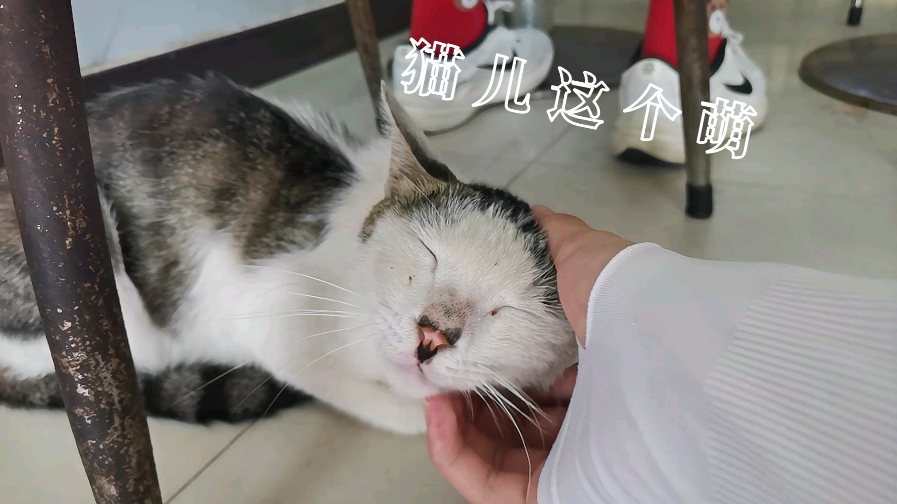 | 472 | 2026-07-13 |
| [菲比和糯糯的暑假生活](https://www.bilibili.com/video/BV1HvNV6sEK9) |  | 14.2万 | 2026-07-12 |
| [☝🤓 叫 ~ ！⚡⚡⚡](https://www.bilibili.com/video/BV11RNT6jEhG) |  | 26.7万 | 2026-07-12 |
| [TikTok上老外听曼波哈基米之歌视频有200万点赞](https://www.bilibili.com/video/BV11RNT6jEX1) |  | 277 | 2026-07-12 |
| [“我不在的日子里，你们很嚣张啊”](https://www.bilibili.com/video/BV1WhNw6tEyD) |  | 195.5万 | 2026-07-11 |
| [🐱尼 古 喵 喵🐱](https://www.bilibili.com/video/BV1giNW6eECc) |  | 3.6万 | 2026-07-10 |
| [全宇宙最爽的一声大狗叫](https://www.bilibili.com/video/BV1M9NE6mEzD) |  | 182.7万 | 2026-07-10 |
| [熬 猪 油](https://www.bilibili.com/video/BV1aKNn6xEiW) |  | 52.6万 | 2026-07-10 |
| [看完中国网友魔改加工版猫和老鼠，老外全程目瞪口呆直呼大开眼界](https://www.bilibili.com/video/BV12GNE6yEWt) | 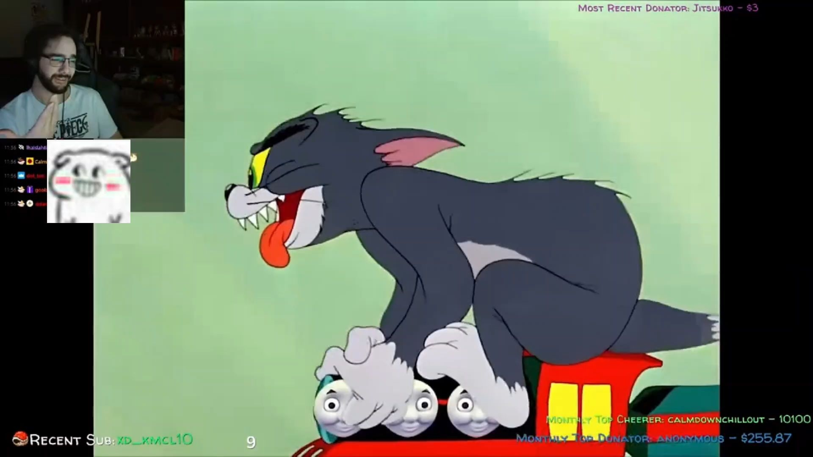 | 14.6万 | 2026-07-10 |
| [【菲比】耗时5小时！我做出来自创猫和老鼠！](https://www.bilibili.com/video/BV1e5NL62E4Z) |  | 21.6万 | 2026-07-10 |
| [【哈基米】Fever Pitch #哈基米音乐 #哈基米 #feverpitch #音乐分享](https://www.bilibili.com/video/BV1foMJ65EWn) | 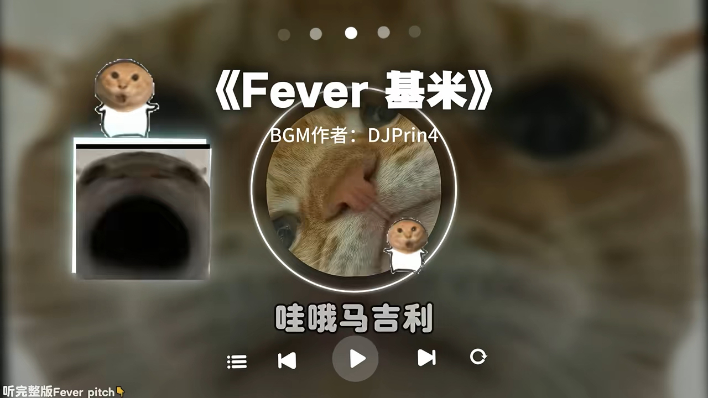 | 551 | 2026-07-09 |
| [来了宝宝 今天我们无伤速通《死亡公园2》](https://www.bilibili.com/video/BV1WPMJ6DEHc) |  | 184.7万 | 2026-07-09 |
| [精灵观察：喵喵家族！远看肥猫大，近看大猫肥，真是大肥猫](https://www.bilibili.com/video/BV15mMn6gEWT) |  | 17.0万 | 2026-07-09 |
| [小马高音翻唱《琵琶行》（完整版）](https://www.bilibili.com/video/BV1AsME6EEXM) |  | 8.0万 | 2026-07-09 |
| [他真的叫得好惨](https://www.bilibili.com/video/BV1n9MJ67EZw) | 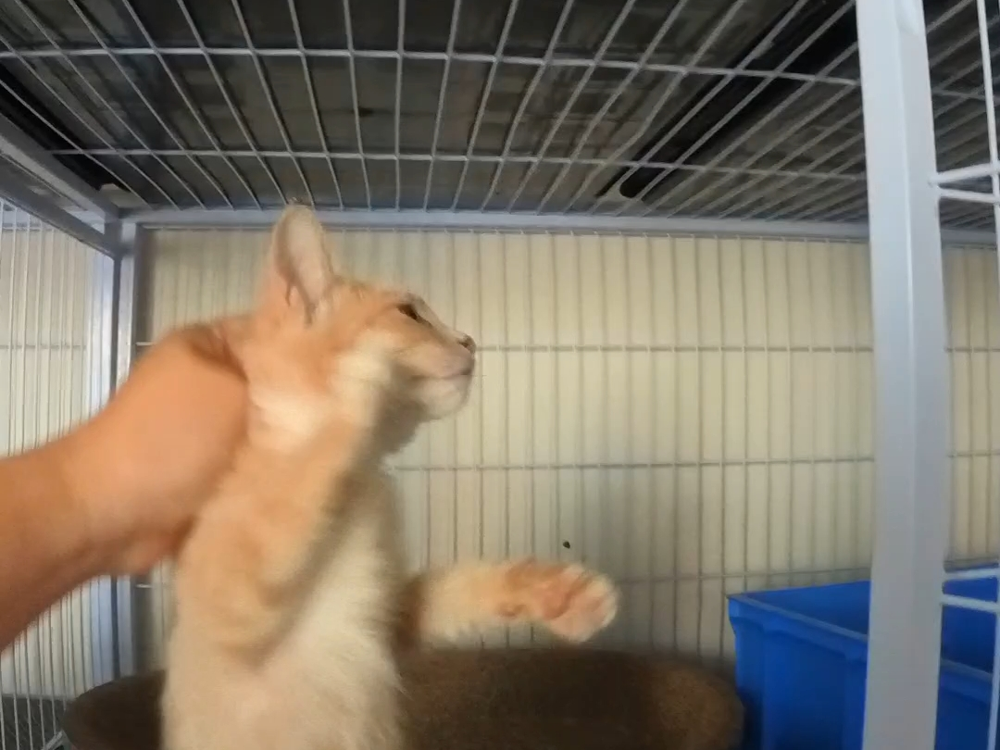 | 1.8万 | 2026-07-09 |
| [王者最抽象的边路，一人选九人慌](https://www.bilibili.com/video/BV1x5M56BEv9) |  | 31.3万 | 2026-07-09 |
| [宿舍空调哥，舍友夏天不开空调](https://www.bilibili.com/video/BV1TcTs6NEsw) |  | 1152.7万 | 2026-07-08 |
| [哈基米界—赤壁之战](https://www.bilibili.com/video/BV1fCMe6JEUB) | 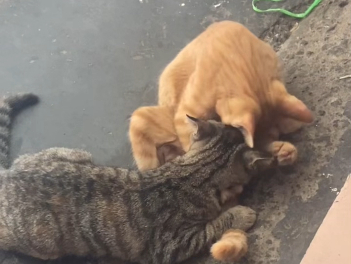 | 344 | 2026-07-08 |
| [45分钟近期热歌合集，戴好耳机开听！](https://www.bilibili.com/video/BV1QyT964EdK) | 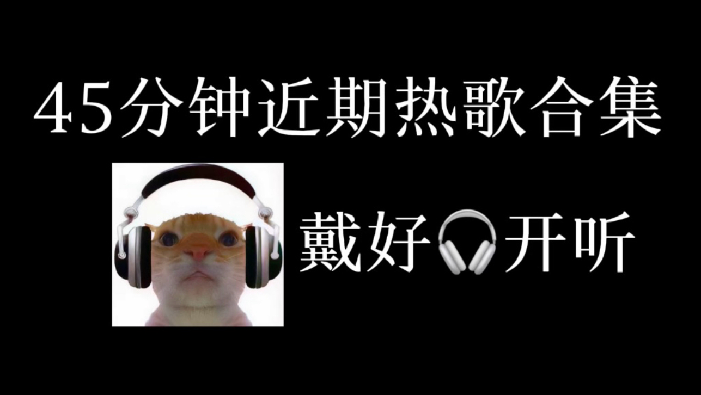 | 15.1万 | 2026-07-08 |
| [【尼古喵喵】全13话 超清中字（未删减版）周更](https://www.bilibili.com/video/BV1pXMh62EVX) |  | 7.2万 | 2026-07-07 |
| [（语音盘点）盘点三角洲3位Boss的熟悉语音，来看看哪句能听懂！](https://www.bilibili.com/video/BV1jPMa6uELb) |  | 85.9万 | 2026-07-07 |
| [《节肘天国》](https://www.bilibili.com/video/BV19TM86bEhv) |  | 222.6万 | 2026-07-07 |
| [来自电影院的博弈](https://www.bilibili.com/video/BV1HbM865EJx) |  | 10.9万 | 2026-07-07 |
| [男友视角](https://www.bilibili.com/video/BV14aM46yEQk) | 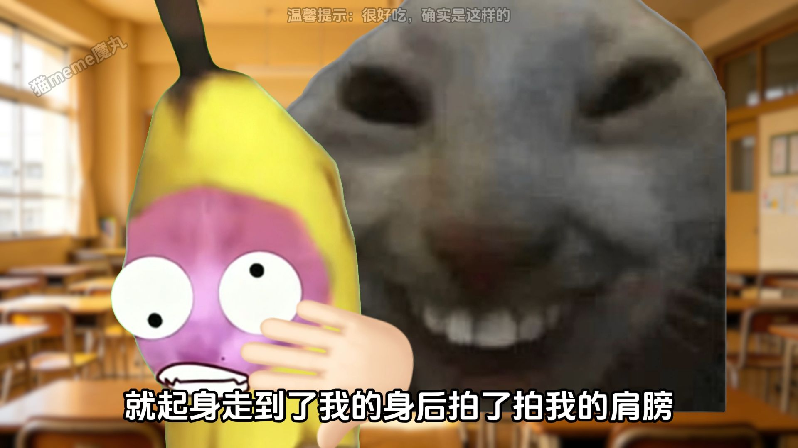 | 4.0万 | 2026-07-07 |
| [咕咕嘎嘎变成字节的了？不止这些！还有高手！](https://www.bilibili.com/video/BV1ugMt6UE8S) |  | 51.2万 | 2026-07-07 |
| [剥蒜的情谊157.0](https://www.bilibili.com/video/BV1ecTd6vEgD) |  | 120.8万 | 2026-07-07 |
| [循环歌单｜CTID《Haaland (Ha Ha Ha)》「哈兰德进行曲」](https://www.bilibili.com/video/BV1c8Td61EN8) |  | 4693 | 2026-07-07 |
| [“盘点近期全网爆火的大狗神曲”](https://www.bilibili.com/video/BV191Td6eEJs) |  | 2.3万 | 2026-07-06 |
| [老鹰最厉害，但好像不太对劲](https://www.bilibili.com/video/BV1M2TQ6EEQV) |  | 7.0万 | 2026-07-06 |
| [40分钟助眠阴乐合集（睡前必听）](https://www.bilibili.com/video/BV1ytMu6WESG) | 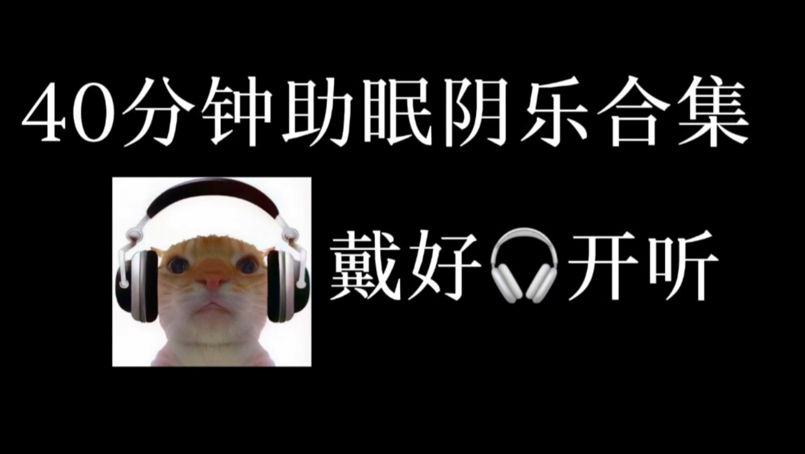 | 5983 | 2026-07-06 |
| [盘点三角洲所有BOSS以及他们背后的故事](https://www.bilibili.com/video/BV1KBTC6QEzv) |  | 26.3万 | 2026-07-05 |
| [哈基蜂和德穆兰 1~3集](https://www.bilibili.com/video/BV112MM6pEsY) |  | 10.0万 | 2026-07-05 |
| [【循环歌单】“人类史上最严重的核灾难”‖《LO0K》](https://www.bilibili.com/video/BV1NtMF6YEj8) |  | 176.8万 | 2026-07-04 |
| [【夜车Azuya】啊↑啊↓啊↖啊↗啊→](https://www.bilibili.com/video/BV1GzTb6RE3v) |  | 7.9万 | 2026-07-03 |
| [【ASMR福利】最最舒服的声音！⚠极致酥麻的丝袜大腿黑丝手摩擦音 无人声  圈圈助眠解压到昏迷](https://www.bilibili.com/video/BV1EFTt6aESd) |  | 54.9万 | 2026-07-03 |
| [大狗叫音效替换爱丽丝光之剑发射音效...](https://www.bilibili.com/video/BV1fLTs69ErM) |  | 216.1万 | 2026-07-03 |
| [【原神】请问这种猫好养吗？](https://www.bilibili.com/video/BV18ZTq6CESM) |  | 8.4万 | 2026-07-02 |
| [【今日推荐】《落泪》DJ完整版～](https://www.bilibili.com/video/BV1HgTi6oEm1) |  | 9500 | 2026-07-01 |
| [⚡《呀啦啦啦》但是能大⚡](https://www.bilibili.com/video/BV1geTF6iEFe) |  | 79.5万 | 2026-06-30 |
| [新赛季新地图，巨大哈基蜂出没](https://www.bilibili.com/video/BV1L7KZ6zERF) |  | 27.4万 | 2026-06-30 |
| [循环歌单｜【大狗叫】｜“可观测宇宙中最爽的一句诶大狗！”](https://www.bilibili.com/video/BV1jUKd6zES1) |  | 21.1万 | 2026-06-30 |
| [弗糯糯：就跟老己对着干](https://www.bilibili.com/video/BV1UFKX6yEbW) |  | 36.7万 | 2026-06-30 |
| [轰轰这样排到喵喵球!比头大，懂我意思吗？](https://www.bilibili.com/video/BV1Yx7n6oE11) |  | 2.1万 | 2026-06-27 |
| [中奖概率倍儿高](https://www.bilibili.com/video/BV16a7Y63EUR) |  | 316.4万 | 2026-06-25 |
| [老鼠和猫](https://www.bilibili.com/video/BV1Vp786DEtH) |  | 13.0万 | 2026-06-25 |
| [循环歌单丨你好像踩到我的山丘了【house of puso走路の小曲】【pusoの小曲】【walks and ants farm】](https://www.bilibili.com/video/BV1g6j86LEXR) | 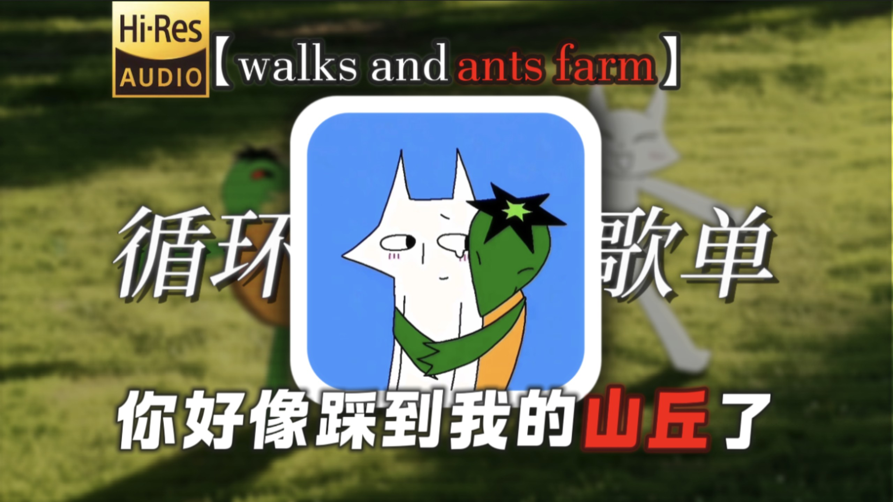 | 69.3万 | 2026-06-21 |
| [喵喵喵](https://www.bilibili.com/video/BV1ZAjh6bEBF) |  | 17.1万 | 2026-06-21 |
| [合约45分批发！小猫快跑妈妈级教学](https://www.bilibili.com/video/BV1cij768EZ8) |  | 43.2万 | 2026-06-20 |
| [【儿童节金曲】诶？云朵☁️？！](https://www.bilibili.com/video/BV13b5F6sE8h) |  | 93.6万 | 2026-06-01 |
| [【原神x猫和老鼠】小饿神](https://www.bilibili.com/video/BV1y9GD6HEDJ) |  | 16.8万 | 2026-05-28 |
| [你能坚持到第几关？](https://www.bilibili.com/video/BV11VVw6EECG) |  | 132.5万 | 2026-05-26 |
| [SPRUNKI - NO BATIDÃO MOD/COVER](https://www.bilibili.com/video/BV1bVGn6MEiv) | 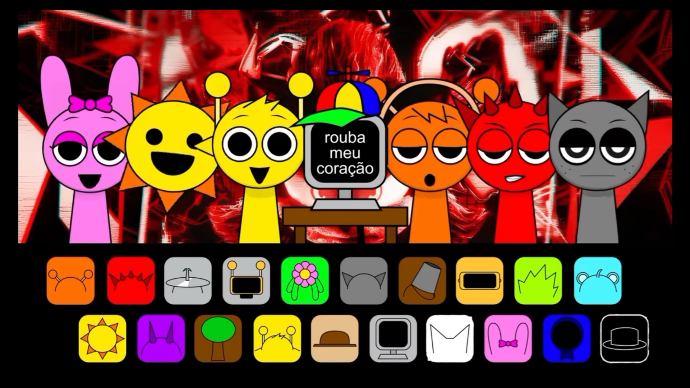 | 20.0万 | 2026-05-24 |
| [sunny77~catch catch](https://www.bilibili.com/video/BV19ARsBfEiy) |  | 55.6万 | 2026-05-06 |
| [咕嘎助眠小曲 沉浸式咕咕嘎嘎～](https://www.bilibili.com/video/BV1tCdVBoEnm) | 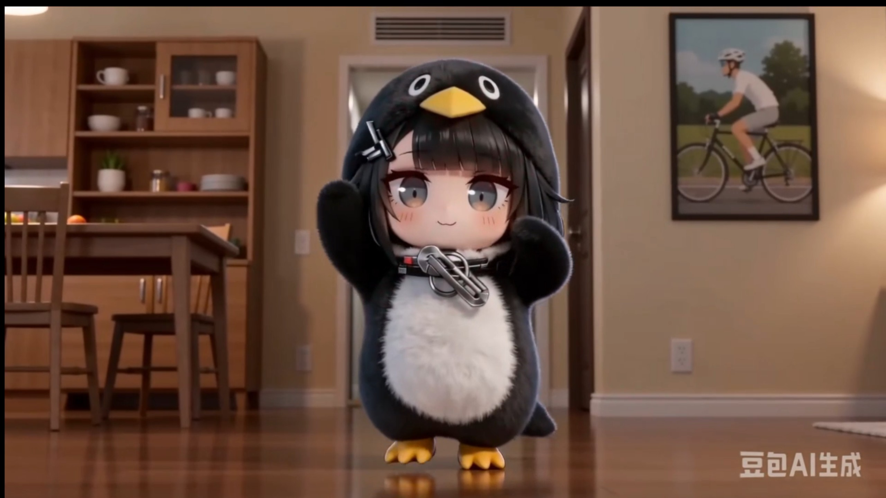 | 12.8万 | 2026-04-17 |
| [维特鲁姆劲爆电音《tom tom》](https://www.bilibili.com/video/BV1E4dBByETK) | 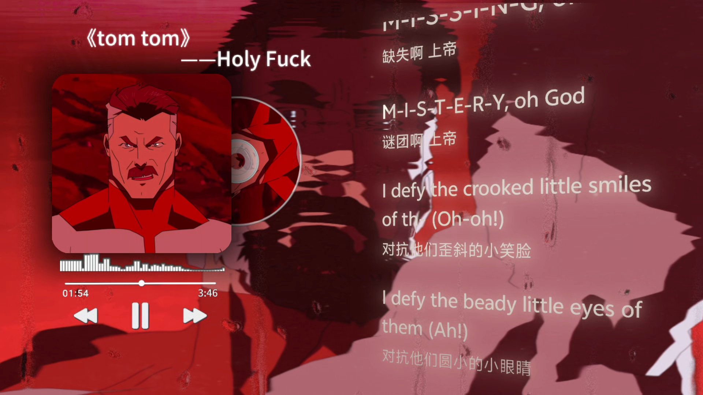 | 30.6万 | 2026-04-17 |
| [[SUNO V5.5] 《夜曲》周杰伦 AI翻唱 黑人大叔卖力演唱 “夜曲还没写完 我已经崩溃”](https://www.bilibili.com/video/BV15dDSBdEur) |  | 138.6万 | 2026-04-12 |
| [儿歌40首合集连续播放 早教益智亲子启蒙儿歌 儿歌大全儿歌精选](https://www.bilibili.com/video/BV15GSXBfEPN) |  | 89.0万 | 2026-04-06 |
| [多年功德，毁于一旦](https://www.bilibili.com/video/BV1gL9FBDE5U) |  | 117.0万 | 2026-04-02 |
| [写实版植物大战僵尸的日常生活（总集篇） #植物大战僵尸 #AI生成](https://www.bilibili.com/video/BV1oeAJzrEGm) |  | 57.3万 | 2026-03-20 |
| [《柿子发癫》1-4合集#猫meme#超爆小故事#猫meme小剧场](https://www.bilibili.com/video/BV1rnwRz5Epj) | 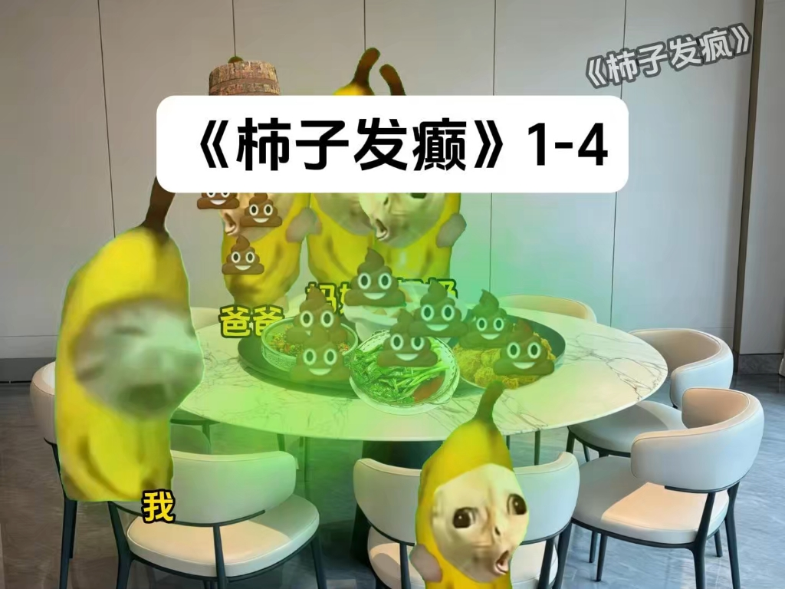 | 18.2万 | 2026-03-17 |
| [26个字母歌中英文双语字幕完整版全集，A-Z都有！](https://www.bilibili.com/video/BV1hqZxBKED4) | 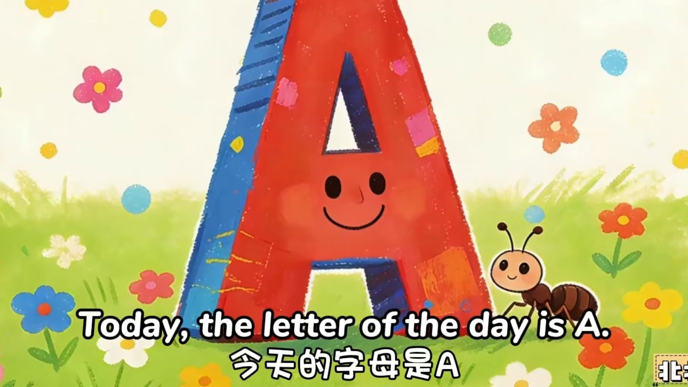 | 101.6万 | 2026-02-15 |
| [一口气看完野猪佩奇9分钟合集，当春晚看！](https://www.bilibili.com/video/BV17nFmz5Esz) |  | 35.3万 | 2026-02-10 |
| [《叹云兮》 DJ Reimx （重置完整版） 单曲循环 开心元元壁纸伴睡 （歌词在简介）](https://www.bilibili.com/video/BV1A3zhB9Ev2) |  | 10.4万 | 2026-01-26 |
| [憋住别笑：2025年最搞笑的猫狗视频合集](https://www.bilibili.com/video/BV18GiXBQEJJ) |  | 26.1万 | 2026-01-08 |
| [循环歌单丨【游京-妮蔻进行曲】“悠悠的古城中 听美人奏琴声 朗朗夜色星空 望孩童放花灯 盼郎君几撩纱 夜泊借宿酒家 君载着黑骏马”](https://www.bilibili.com/video/BV17BSzBeEXr) |  | 74.8万 | 2025-12-01 |
| [【流萤】❤️喜欢可爱的流萤小猫咪嘛，“喵～”^O^【68#崩铁】](https://www.bilibili.com/video/BV1TVsHznEtg) |  | 137.8万 | 2025-10-24 |
| [《天真的橡皮》完整版](https://www.bilibili.com/video/BV16dMyzwEQ6) |  | 126.6万 | 2025-06-14 |
| [热歌合集丨《若月亮没来》《悬溺》《起风了》《凄美地》《土坡上的狗尾草》《跳楼机》《暮色回响》《小美满》《青花》《童话镇》](https://www.bilibili.com/video/BV1awR2Y8Epe) |  | 121.5万 | 2025-04-07 |
| [【宝藏BGM】“这些曲子也太太太可爱了！豪庭！”治愈·放松·学习·vlog](https://www.bilibili.com/video/BV1C6QfY3EwR) |  | 67.3万 | 2025-03-19 |
| [第一次“嗯嗯啊啊”被父母听到？](https://www.bilibili.com/video/BV1B3kGYGECq) |  | 7.3万 | 2024-12-16 |
| [【极致丝滑60帧】这谁看了不迷糊呀？](https://www.bilibili.com/video/BV1Eq4y1k7pS) |  | 164.1万 | 2021-11-10 |
| [【洗脑】EEEAAAOOO 十分魔性的猫猫MV&amp;音乐（多版本）](https://www.bilibili.com/video/BV1Kk4y127KG) |  | 91.8万 | 2020-08-24 |
| [阿悠悠 - 《你若三冬》【完整无损音质】](https://www.bilibili.com/video/BV19J41157iE) |  | 583.5万 | 2020-01-04 |
| [贝乐虎儿歌合集 点给宝贝听](https://www.bilibili.com/video/BV13b41157Gx) |  | 1323.5万 | 2019-04-16 |

---
*最后更新: 2026-07-15 05:01:06 (自动生成)*
*数据来源: [Bilibili](https://www.bilibili.com)*

## 使用说明

运行以下命令更新视频列表:
```bash
python3 fetch_hajimi_videos.py
```
