# awesome-hajimi
collections of hajimi (哈基米 in Chinese) on the Internet.

## 视频列表 (Video List)

| 视频标题 (Title) | 封面 | 播放量 (Views) | 发布日期 (Date) |
|---|---|---|---|
| [爷爷赶集抱来的哈基米，也太粘人了吧！](https://www.bilibili.com/video/BV1SbPmzkEwy) | 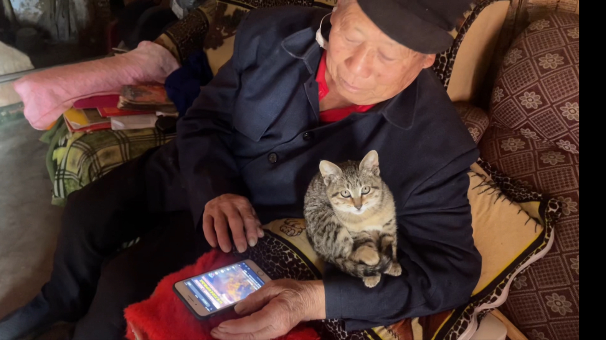 | 88 | 2026-03-09 |
| [中华猫中最神秘的哈基米](https://www.bilibili.com/video/BV1dZPmzXELv) |  | 0 | 2026-03-09 |
| [哈 基 米 哈气了！！！](https://www.bilibili.com/video/BV14FN5z7Eti) |  | 382 | 2026-03-09 |
| [《动物迷惑行为大赏297》](https://www.bilibili.com/video/BV1pANgzfEac) |  | 2.3万 | 2026-03-09 |
| [云中哈：老不死的终于疯了](https://www.bilibili.com/video/BV16aNVziEFJ) |  | 400 | 2026-03-08 |
| [哈基米2.0](https://www.bilibili.com/video/BV1CANGzqExt) | 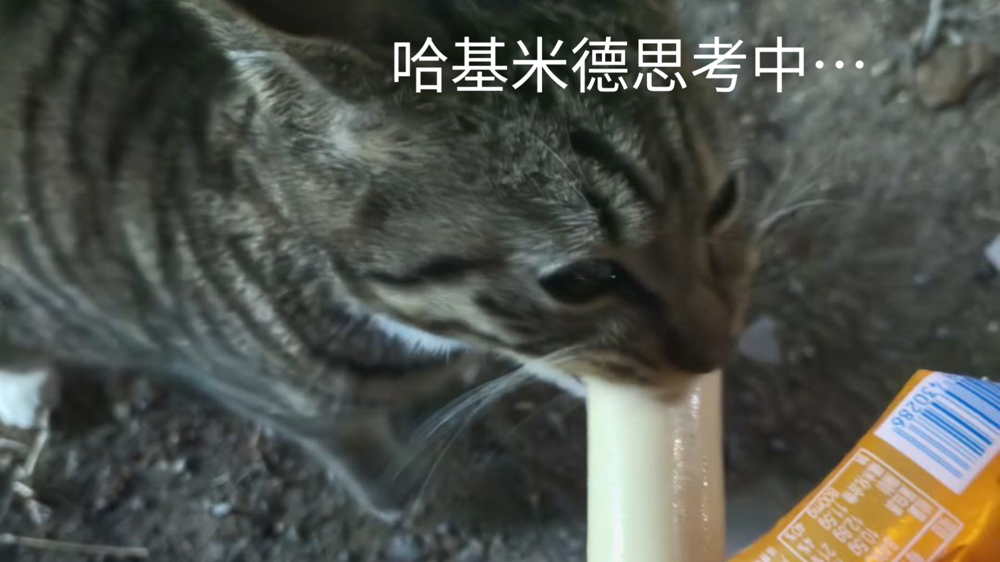 | 1351 | 2026-03-08 |
| [往下滑，教训辅助哈基米不关你的事](https://www.bilibili.com/video/BV1ywNGzMEra) |  | 5455 | 2026-03-08 |
| [哈基米依旧街舞回血](https://www.bilibili.com/video/BV17LNGzbEKg) | 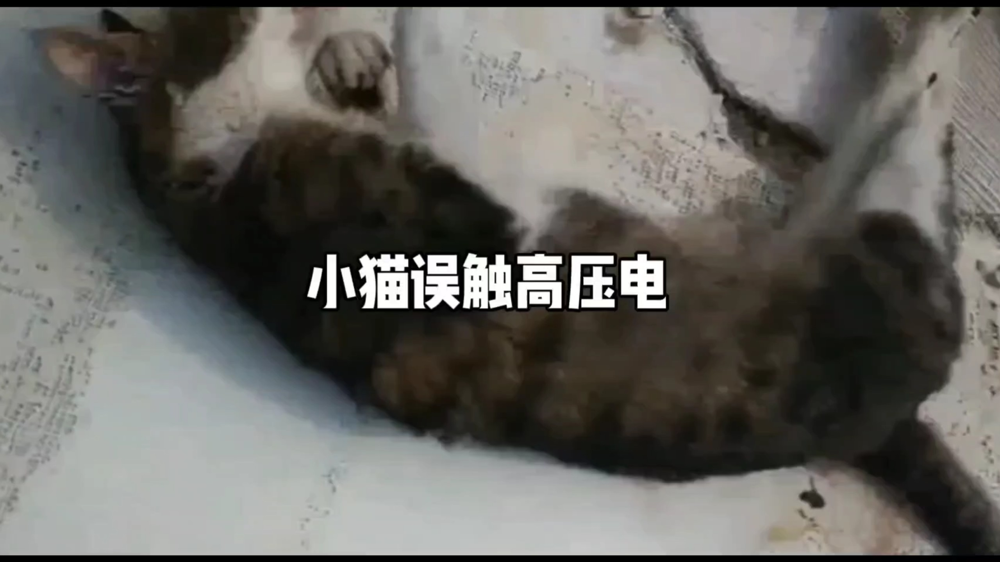 | 3000 | 2026-03-08 |
| [🐱Clash of Cats🐱首领，你的村庄被耄耋袭击了](https://www.bilibili.com/video/BV12XNuziEpc) |  | 914 | 2026-03-08 |
| [哈基米一言不合就打起来了](https://www.bilibili.com/video/BV1nNNgztETT) | 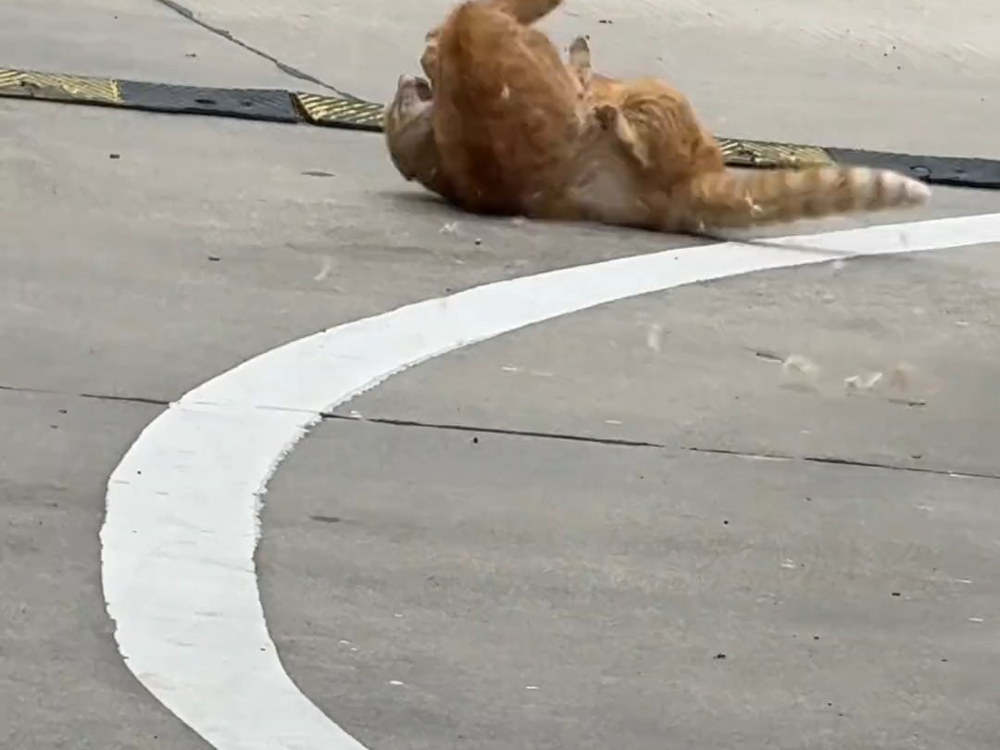 | 214 | 2026-03-08 |
| [可怜的哈基米被烟花点燃了全身，幸好被好心人救助了](https://www.bilibili.com/video/BV17GNgzXE8C) | 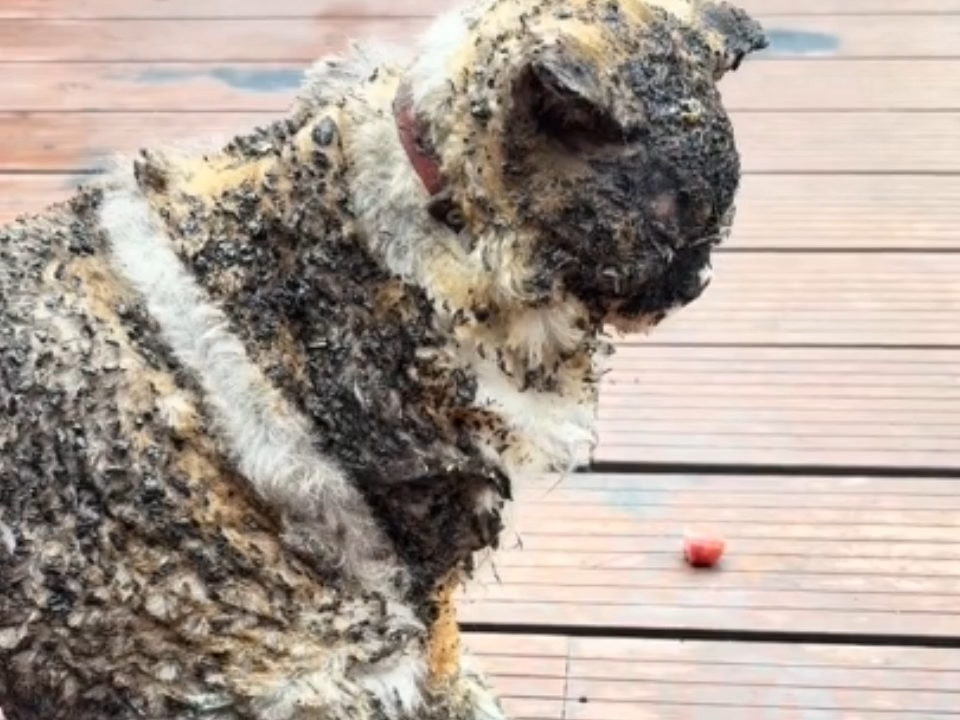 | 485 | 2026-03-08 |
| [Devlog 轻松实现哈基米同款甲飞 pb.Sertraline](https://www.bilibili.com/video/BV1xeNgzBE6P) |  | 1139 | 2026-03-08 |
| [【洛克王国】哈基米：塞勒姆是什么东西，这才是年费该有的压迫感](https://www.bilibili.com/video/BV1T5N3z3Ezf) |  | 1274 | 2026-03-08 |
| [🐱少女耄~3rd ha](https://www.bilibili.com/video/BV1e7NMzrEv3) |  | 5712 | 2026-03-08 |
| [震惊 哈基米马路上生孩子 小基米天崩开局](https://www.bilibili.com/video/BV1nwNMzQEaM) | 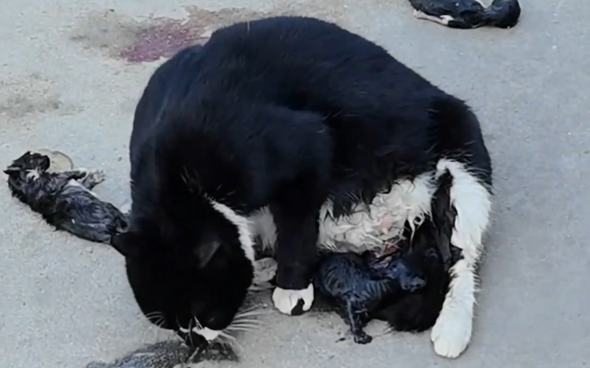 | 4759 | 2026-03-08 |
| [哈基米依旧底层代码发力](https://www.bilibili.com/video/BV1AiNMzbEda) | 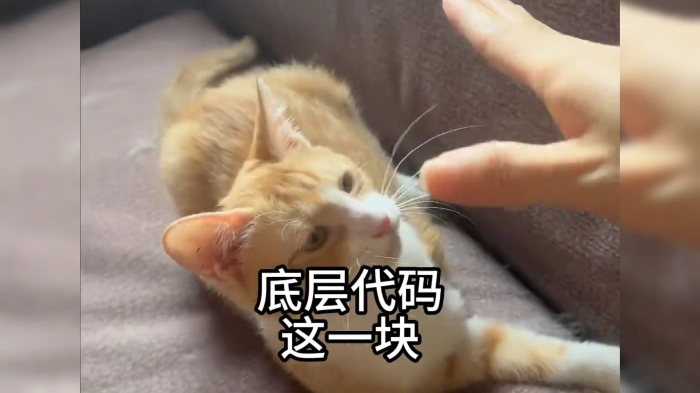 | 418 | 2026-03-08 |
| [哈基米南北绿豆~](https://www.bilibili.com/video/BV1DTNuzTEL3) | 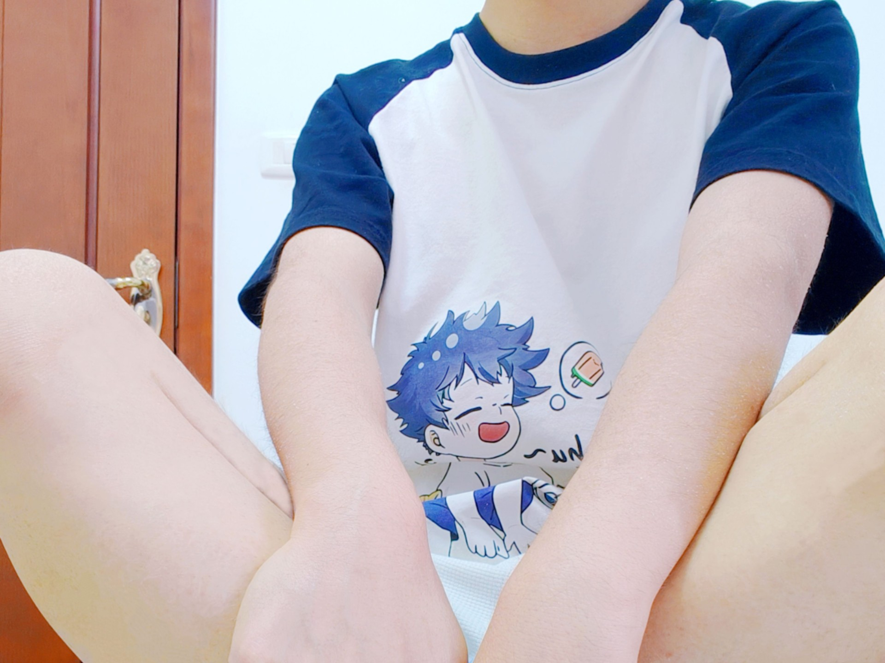 | 197 | 2026-03-08 |
| [全游戏当量最小的炸弹！对面：怎么今天鞭炮声这么响？](https://www.bilibili.com/video/BV1U3NuzeEPq) | 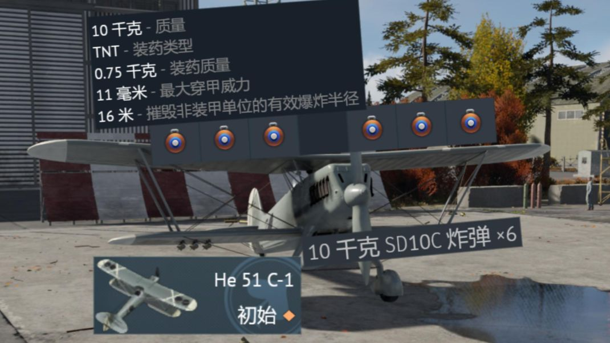 | 1.5万 | 2026-03-08 |
| [【吉星派对/星引擎】针对爱猫同志的纯整活流打法，区之耄耋大魔法师流AP哈基米](https://www.bilibili.com/video/BV1PnNuzbENp) |  | 411 | 2026-03-08 |
| [当前轮椅流，哈基米太强了](https://www.bilibili.com/video/BV1NbNKzxE8Z) |  | 1368 | 2026-03-08 |
| [为什么不喜欢毛茸茸的粉色带铃铛的可爱哈基米](https://www.bilibili.com/video/BV1xbNKzxEaa) |  | 1917 | 2026-03-08 |
| [小企鹅和哈基米](https://www.bilibili.com/video/BV1ucNTzeEm6) |  | 1176 | 2026-03-08 |
| [哈基米这个权威](https://www.bilibili.com/video/BV18qNAzpE7U) |  | 0 | 2026-03-07 |
| [哈基米饮水被肉食巨鱼埋伏，变成鱼鱼的大粪](https://www.bilibili.com/video/BV1k1NczuEeg) | 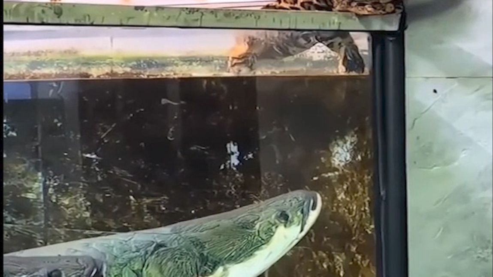 | 1.2万 | 2026-03-07 |
| [【哈基米音乐】退后](https://www.bilibili.com/video/BV1x6NczkEaG) |  | 415 | 2026-03-07 |
| [哈基米版《夜曲》——《哈基曲》你们满意了？！这下我是真要哈气了！](https://www.bilibili.com/video/BV1MeNczmEpo) |  | 725 | 2026-03-07 |
| [逃离后室，但是术力口](https://www.bilibili.com/video/BV13uNwzXE97) |  | 5.1万 | 2026-03-07 |
| [要好好疼爱哈基米🩷](https://www.bilibili.com/video/BV14xAZzaE3K) |  | 1910 | 2026-03-07 |
| [白 忙 活](https://www.bilibili.com/video/BV1yuPYzFEeD) |  | 13.2万 | 2026-03-07 |
| [初华只是在撸猫](https://www.bilibili.com/video/BV1RxPhz6E6K) |  | 1.6万 | 2026-03-07 |
| [邻居喜欢我爸](https://www.bilibili.com/video/BV12uPYzFEC2) | 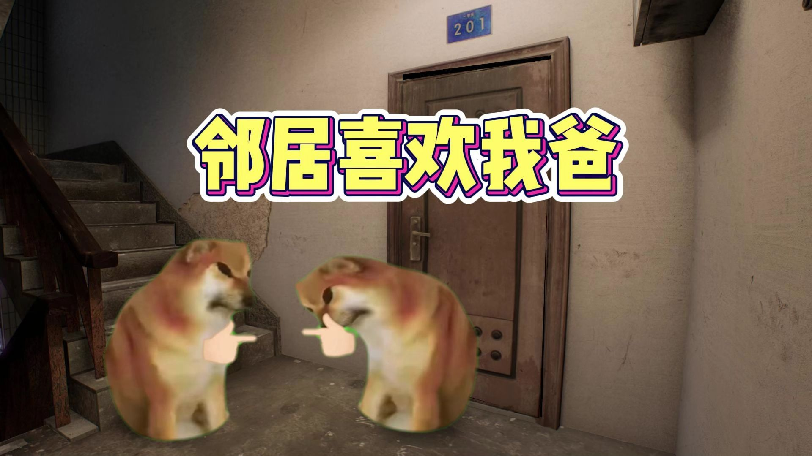 | 555.3万 | 2026-03-07 |
| [哈基米疯狂踢自己的头](https://www.bilibili.com/video/BV1C5PYzdEkJ) | 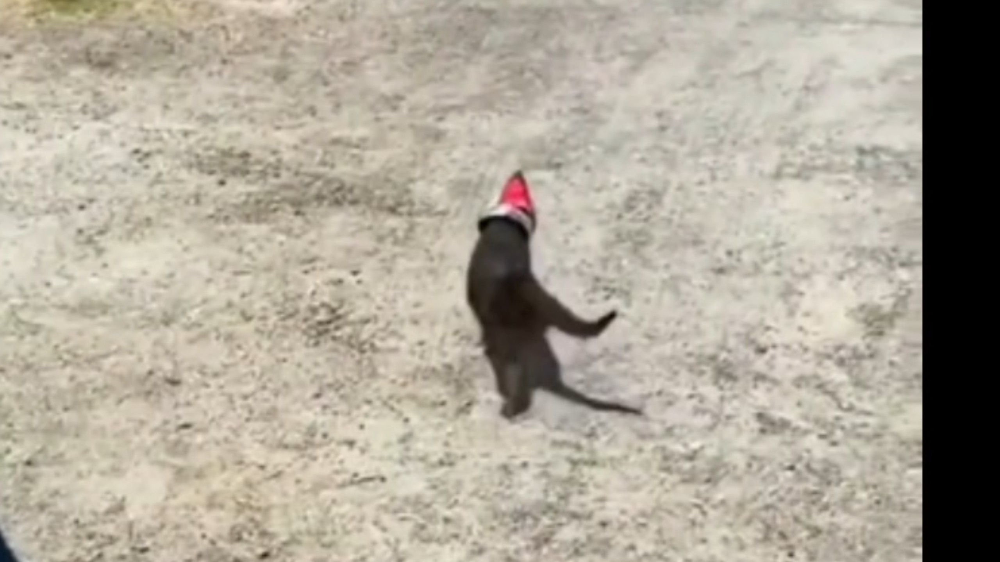 | 5599 | 2026-03-07 |
| [上古异兽，耄耋](https://www.bilibili.com/video/BV1HVPhzSEDK) |  | 1210 | 2026-03-07 |
| [本喵控制不住了喵!变成哈基米喵!哈气喵!跳上电脑桌喵!打翻水杯喵!被本喵弄倒水杯吓到应激喵!猛](https://www.bilibili.com/video/BV141PhzoEAD) |  | 4720 | 2026-03-07 |
| [田埂上的小企鹅](https://www.bilibili.com/video/BV1RbPhzBEV7) |  | 39.3万 | 2026-03-07 |
| [哈基米JK周末激情说唱《明天不上班》，Seedance2.0审核各种过不了，燃尽了，后半段UP干脆让哈基米单独输出！视频中人物场景均由AI提示词生成。](https://www.bilibili.com/video/BV1jPPazyEcX) |  | 390 | 2026-03-07 |
| [看见我准备睡觉的嘬！](https://www.bilibili.com/video/BV1zZPhzUEW8) | 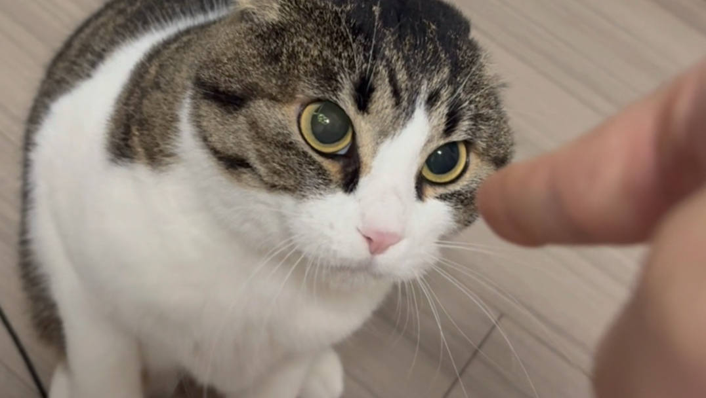 | 5.8万 | 2026-03-07 |
| [哈基米这点脑子，三条线一起运行就卡住了？](https://www.bilibili.com/video/BV18JPpzkER4) | 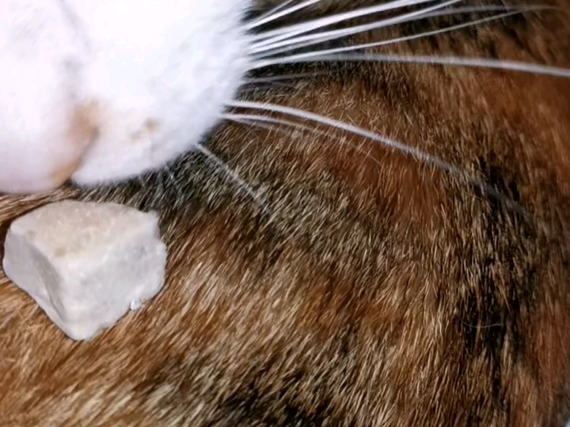 | 8.4万 | 2026-03-07 |
| [狐儿那个咪](https://www.bilibili.com/video/BV1CKPbz1EtN) |  | 101.1万 | 2026-03-07 |
| [哈基军团抢宝藏](https://www.bilibili.com/video/BV1NZPxz5EM1) |  | 3.6万 | 2026-03-07 |
| [炫神锐评三角洲清雨毁号事件被连续中断直播！后会无期了各位B友！](https://www.bilibili.com/video/BV1X6PxzREeQ) |  | 64.9万 | 2026-03-06 |
| [盘点最近海外最火的内容（事件）&amp;[全球热闻打捞计划]](https://www.bilibili.com/video/BV1SyPWz5EZP) |  | 30.0万 | 2026-03-06 |
| [🤫](https://www.bilibili.com/video/BV12QPWzzEnR) | 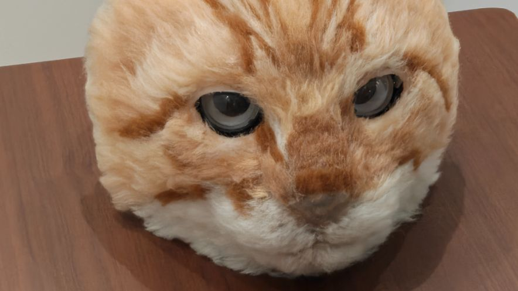 | 4.7万 | 2026-03-06 |
| [收养猫孩子的福报来了，基米小剧场](https://www.bilibili.com/video/BV11iPszzEcU) | 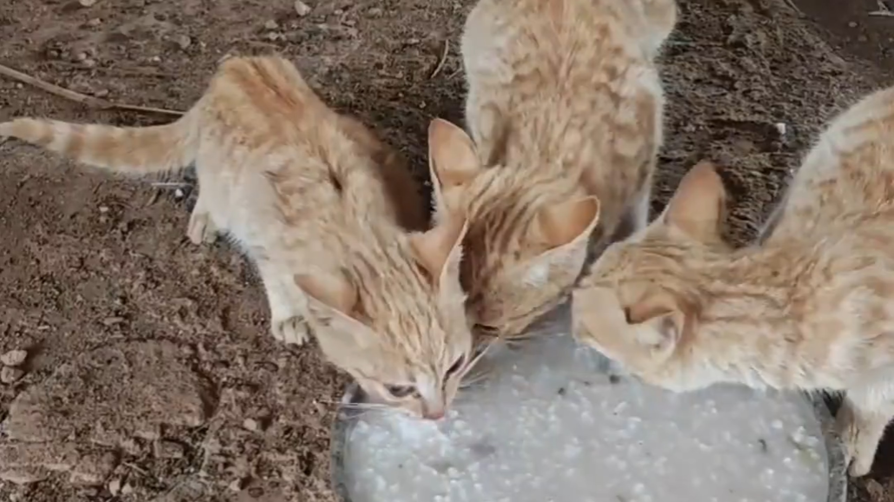 | 5032 | 2026-03-06 |
| [不要摸小企鹅的尾巴啦！生气了！【终末地】](https://www.bilibili.com/video/BV1egPpzUEf7) |  | 254.4万 | 2026-03-06 |
| [“边狱巴士瓦夜牢九门”](https://www.bilibili.com/video/BV1shPpzNEU5) |  | 8.8万 | 2026-03-06 |
| [爵士豪猫叫臭宝，你给我记好～](https://www.bilibili.com/video/BV11uPyzfEWV) | 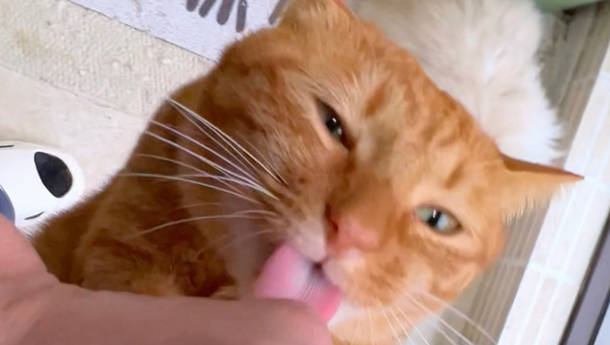 | 2.5万 | 2026-03-06 |
| [来一期意念交流](https://www.bilibili.com/video/BV1tKPWz3EXs) | 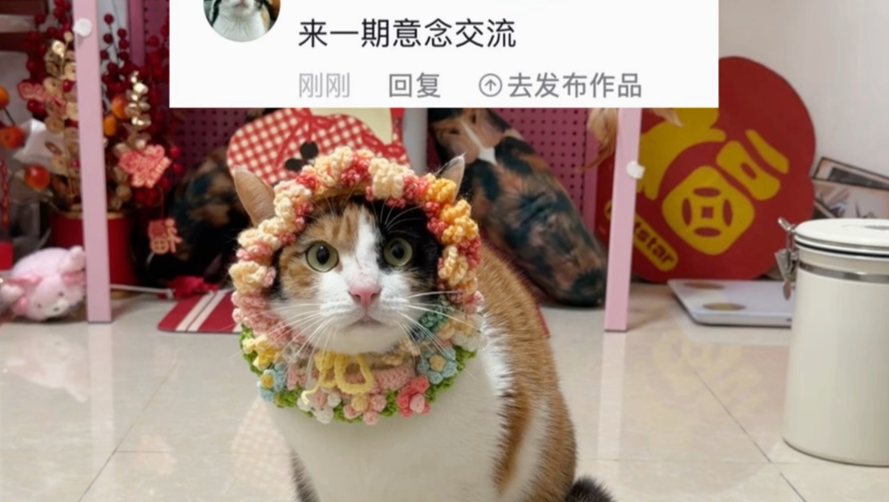 | 35.4万 | 2026-03-06 |
| [你们这到底缺不缺射手](https://www.bilibili.com/video/BV1nEPyzXE1M) |  | 8.6万 | 2026-03-06 |
| [恶霸大橘89-给大橘来了个全套](https://www.bilibili.com/video/BV1AXPyz8Eo2) | 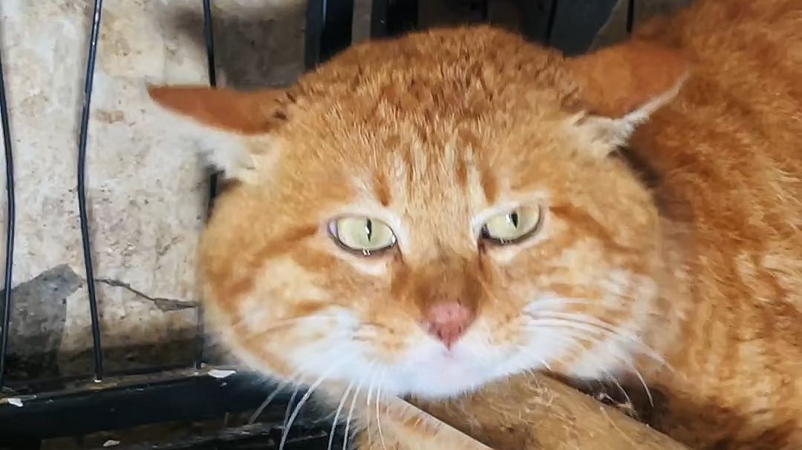 | 7.0万 | 2026-03-05 |
| [小猫能不能滚啊，老是来蹭饭](https://www.bilibili.com/video/BV1yeP1zhEjv) | 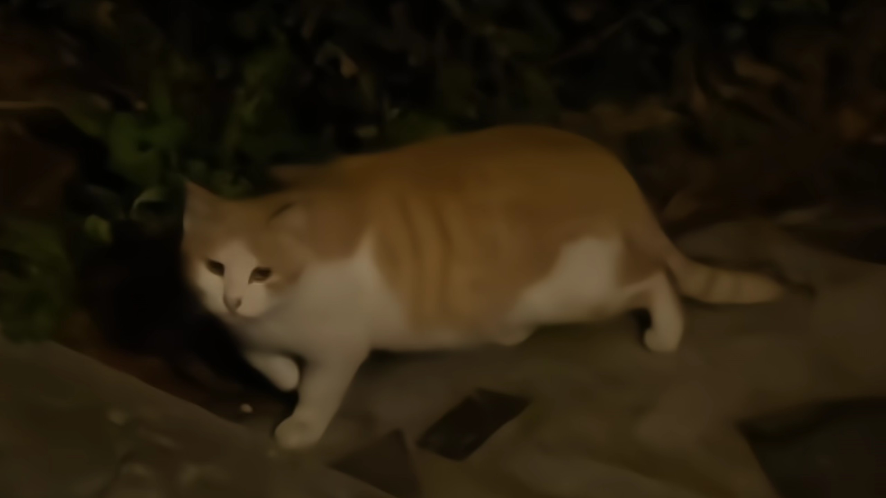 | 6.5万 | 2026-03-05 |
| [😺基米之歌😺](https://www.bilibili.com/video/BV1krP1zdEu6) |  | 668 | 2026-03-05 |
| [哈基米 这个大荒囚天指](https://www.bilibili.com/video/BV19MPCz6EfD) | 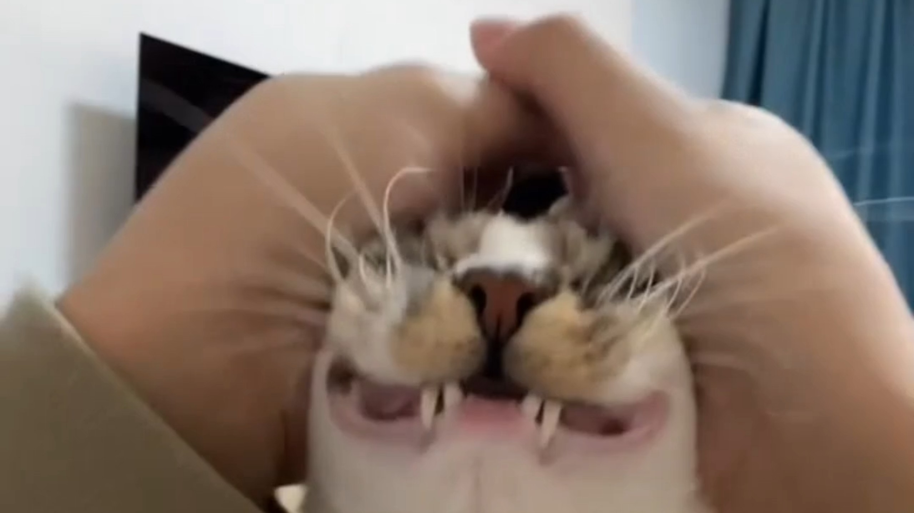 | 4797 | 2026-03-05 |
| [七深的哈基米1.3](https://www.bilibili.com/video/BV118PCzxE85) |  | 3756 | 2026-03-05 |
| [有朋友们说还是喜欢看原声](https://www.bilibili.com/video/BV1UnPCzaEas) | 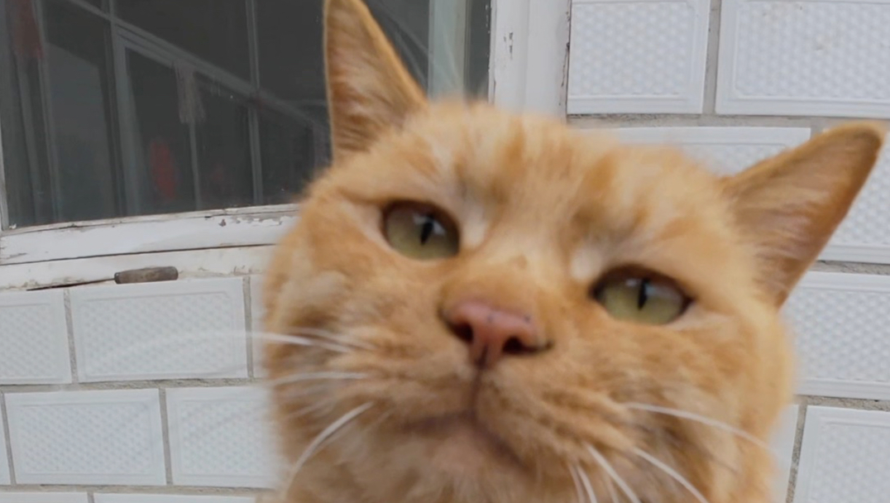 | 2.3万 | 2026-03-05 |
| [【日V】白虎姐姐看《基米说完整版》唱的好厉害！哈基米南北绿豆【白虎雷梦】](https://www.bilibili.com/video/BV1bRPzzXENc) |  | 708 | 2026-03-05 |
| [哈基米装糖阴到弥弗了 弥弗被糖猫撅了（悲）](https://www.bilibili.com/video/BV1ynPqzMETR) |  | 458 | 2026-03-04 |
| [《 神 人 视 频 3.0 》](https://www.bilibili.com/video/BV1mXPvzBEsH) |  | 54.4万 | 2026-03-04 |
| [鞭炮声让四橘共挤一窝](https://www.bilibili.com/video/BV1hhAozuEyt) | 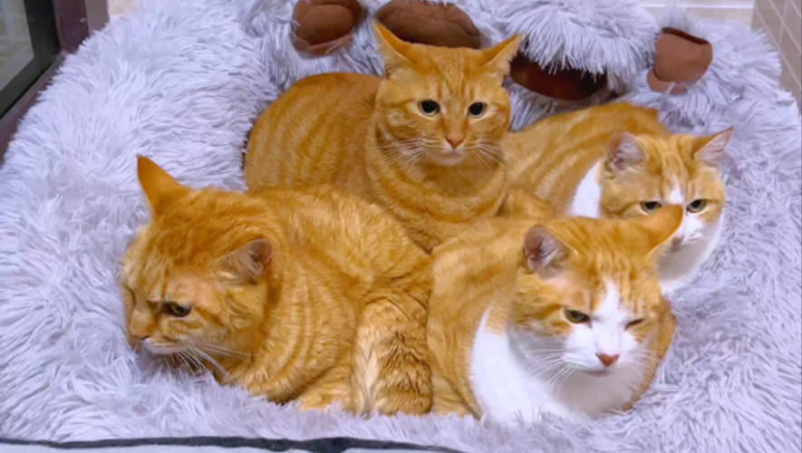 | 1.4万 | 2026-03-04 |
| [万一双方都乐在其中呢？](https://www.bilibili.com/video/BV19tPJzzEMg) | 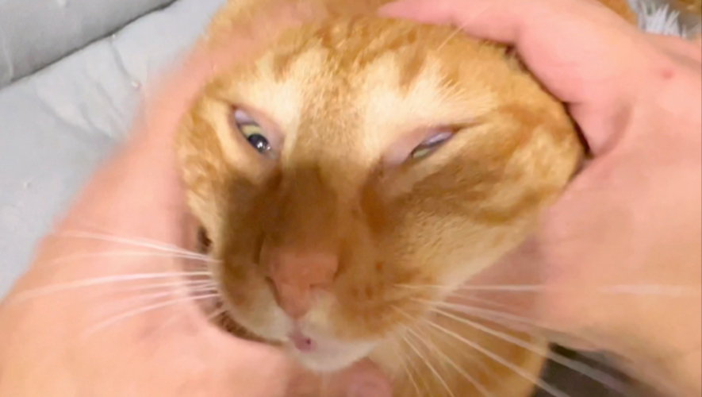 | 3.8万 | 2026-03-03 |
| [《夜曲》史诗版！](https://www.bilibili.com/video/BV1z9PLzKE3T) |  | 328.6万 | 2026-03-02 |
| [巨蛋大橘:此视频收费 禁止外传](https://www.bilibili.com/video/BV1CLPGzvE6v) | 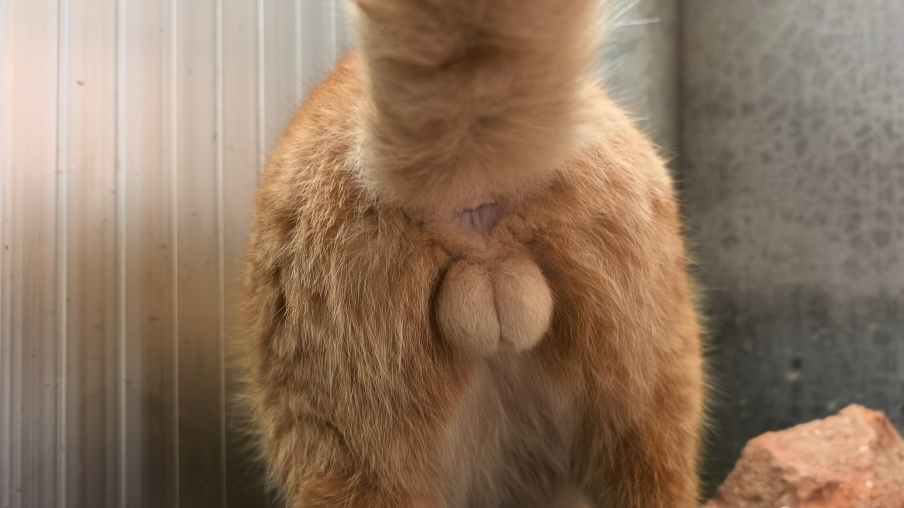 | 4.5万 | 2026-03-02 |
| [阴间视频合集，点赞护体](https://www.bilibili.com/video/BV1ozPTzCEMA) |  | 3.4万 | 2026-03-01 |
| [猫儿这个炸弹](https://www.bilibili.com/video/BV1xwPMzZEUd) | 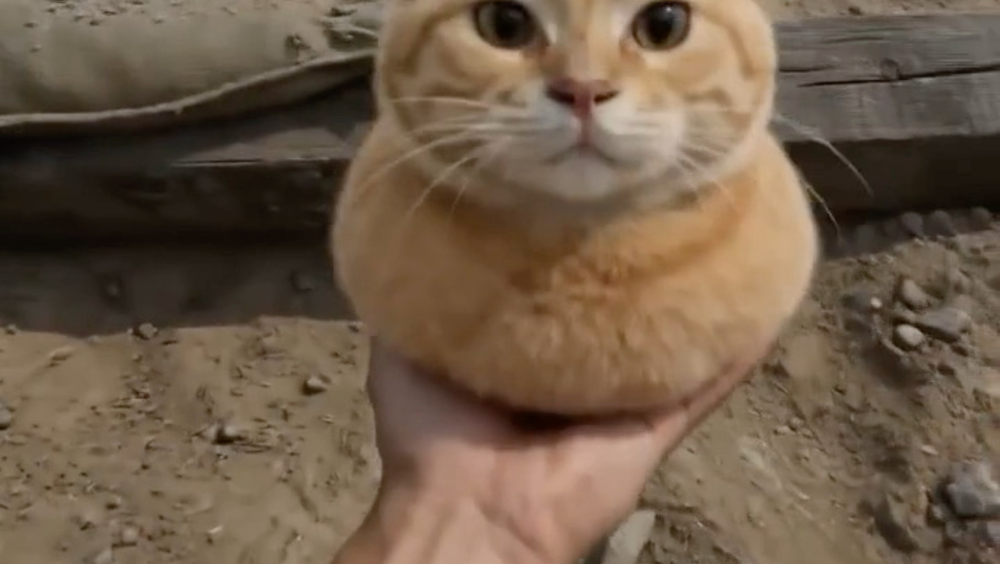 | 11.1万 | 2026-03-01 |
| [这两只萌物的忧郁恐怕在我之上](https://www.bilibili.com/video/BV16WABzwEj5) | 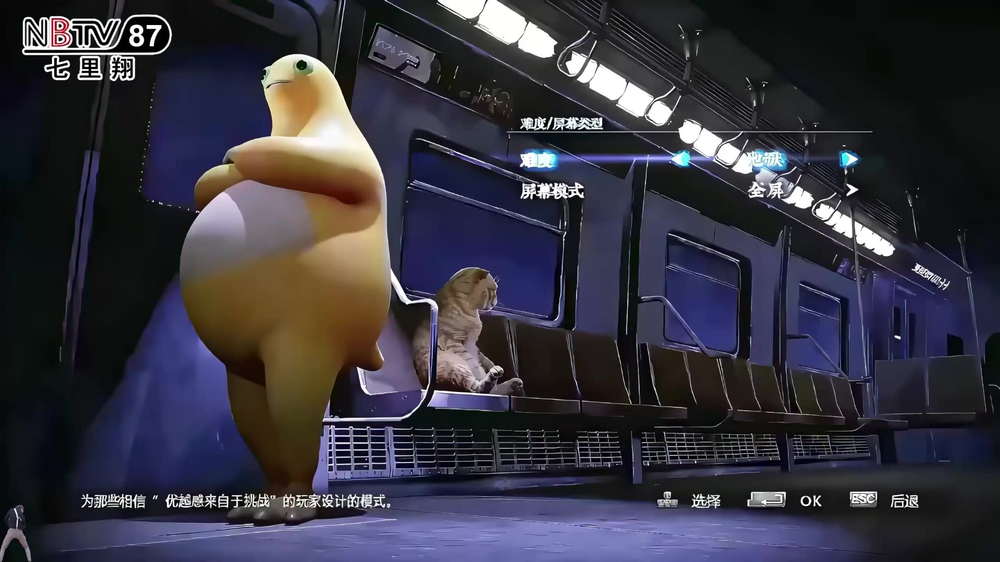 | 26.4万 | 2026-03-01 |
| [豆包的秘制饺子](https://www.bilibili.com/video/BV1b9AYzKE6K) |  | 17.0万 | 2026-02-28 |
| [哈基米剑魔](https://www.bilibili.com/video/BV1zbAhzyEmM) |  | 2.1万 | 2026-02-28 |
| [Mygo 抖肩舞](https://www.bilibili.com/video/BV1eAfKBQETL) |  | 124.9万 | 2026-02-23 |
| [哈基米来咯！](https://www.bilibili.com/video/BV1ppf7BqESd) | 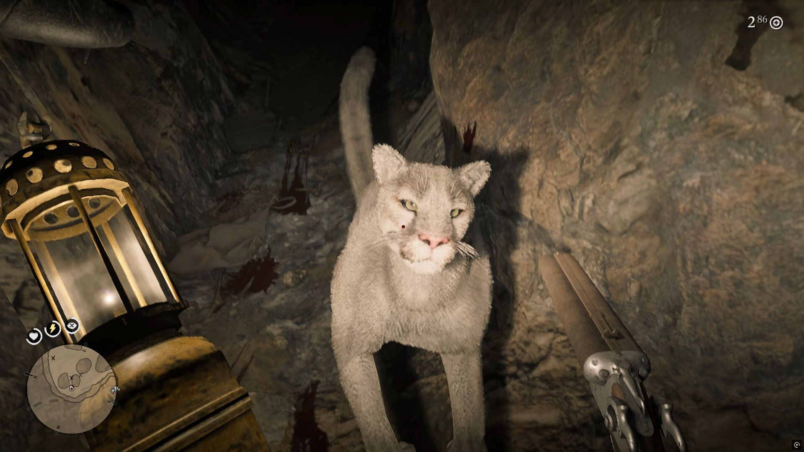 | 1.3万 | 2026-02-21 |
| [看到哈基米这姿势已经开始笑了！猫尾草最抽象bug诞生！](https://www.bilibili.com/video/BV1EXcKzNEmb) |  | 2.8万 | 2026-02-09 |
| [撞到墙知道停下来，已经超越了99%的哈基米了](https://www.bilibili.com/video/BV1yhFjzKEhS) | 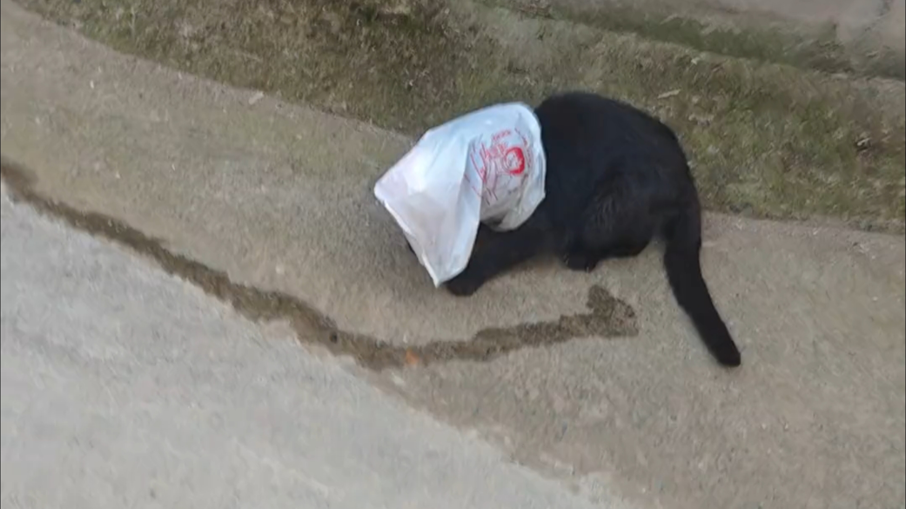 | 5.1万 | 2026-02-03 |
| [可爱哈基米一家 抱着取暖睡觉](https://www.bilibili.com/video/BV1HX6vBKEnc) | 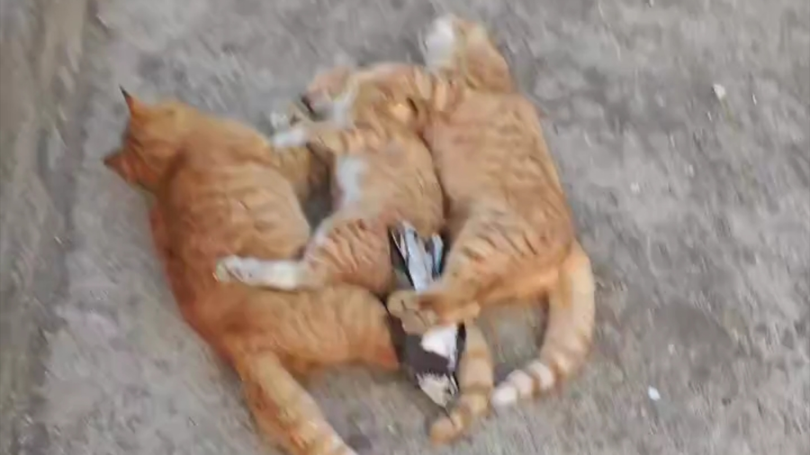 | 4.2万 | 2026-01-30 |
| [【梗知识】哈基米界最长的河](https://www.bilibili.com/video/BV1zLzQBrEBW) |  | 5.1万 | 2026-01-25 |
| [哈·基咪](https://www.bilibili.com/video/BV18Nq3BuEiR) | 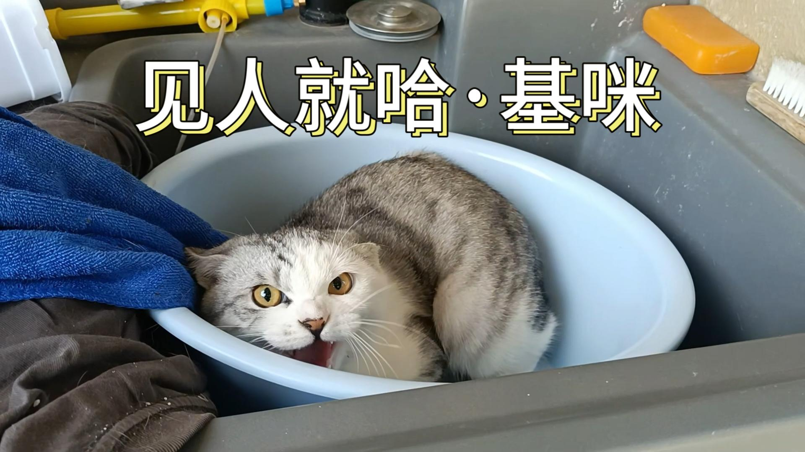 | 7023 | 2025-12-17 |
| [隐身大狗嚼](https://www.bilibili.com/video/BV18DW4ziEzX) |  | 46.2万 | 2025-10-18 |
| [【奶油-cream-】哈基米呀南北撸多~](https://www.bilibili.com/video/BV1QwpCzEEqK) |  | 2.0万 | 2025-09-16 |
| [哈基菜唱《哈基米之歌》太难绷了](https://www.bilibili.com/video/BV1iwatzqEHJ) |  | 19.3万 | 2025-09-05 |
| [不会哈基别哈基](https://www.bilibili.com/video/BV1ArhUzBEuw) | 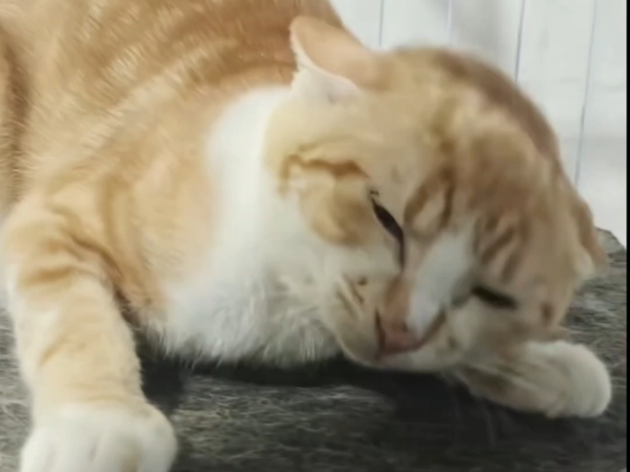 | 11.4万 | 2025-08-28 |
| [我帽帽可爱吧](https://www.bilibili.com/video/BV1kReuzKEiD) |  | 211.1万 | 2025-08-20 |
| [哈 基 米 哦 南 北 绿 豆](https://www.bilibili.com/video/BV17XY4zBEut) |  | 32.2万 | 2025-08-18 |
| [rua哈基米爽、一直rua一直爽](https://www.bilibili.com/video/BV1AMYkz9EcT) | 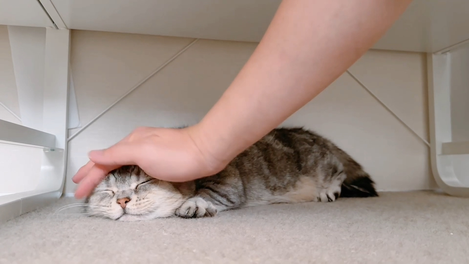 | 14.1万 | 2025-08-17 |
| [“哈基米哦南北绿多”](https://www.bilibili.com/video/BV1wjYvzNEut) |  | 133.6万 | 2025-08-16 |
| [偶遇长得像耄耋的哈基米，奖励它一下](https://www.bilibili.com/video/BV1aubTzhEos) | 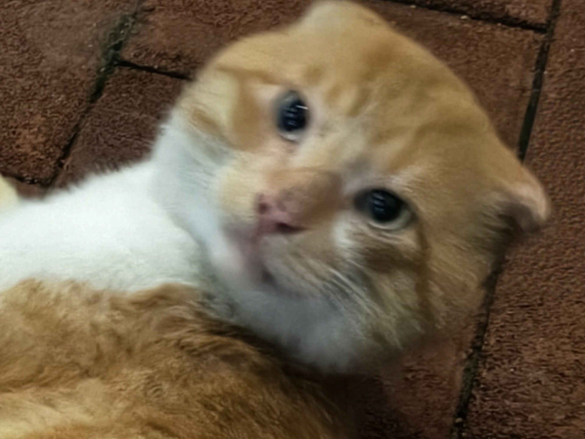 | 28.6万 | 2025-08-10 |
| [哈基时代](https://www.bilibili.com/video/BV1zmbwzFEKf) |  | 60.5万 | 2025-08-10 |
| [哈基米代码错乱这一块](https://www.bilibili.com/video/BV1X1ghzEEL6) | 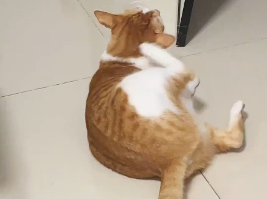 | 24.0万 | 2025-07-20 |
| [哈基米到野外的第九天 出来吧哈基仙人](https://www.bilibili.com/video/BV1nJu3zrEBJ) | 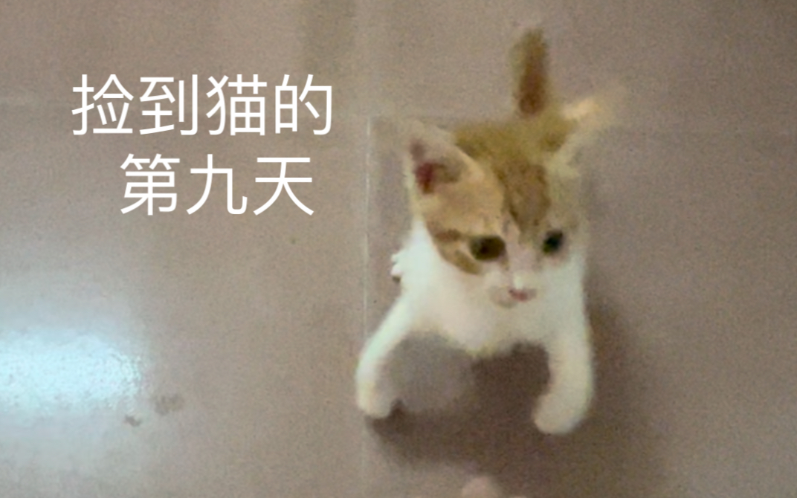 | 26.1万 | 2025-07-11 |
| [棘背龙基米](https://www.bilibili.com/video/BV1AaG4z8Ezj) | 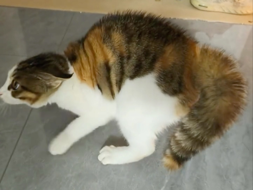 | 8.4万 | 2025-07-09 |
| [猫儿这个应激](https://www.bilibili.com/video/BV1G1NezEE5y) | 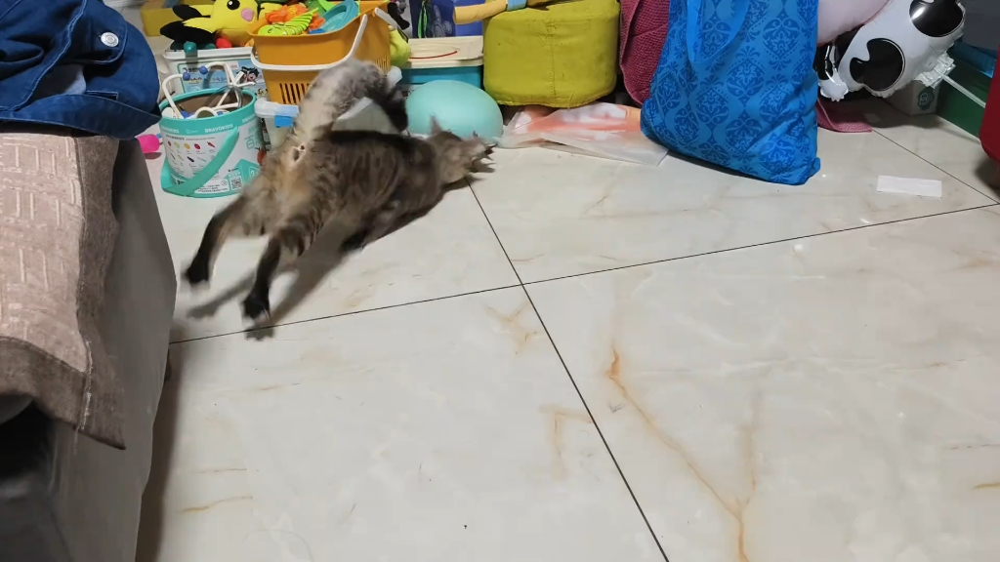 | 43.6万 | 2025-06-17 |
| [哈基米大脑程序错乱](https://www.bilibili.com/video/BV1SVL3zTEsY) | 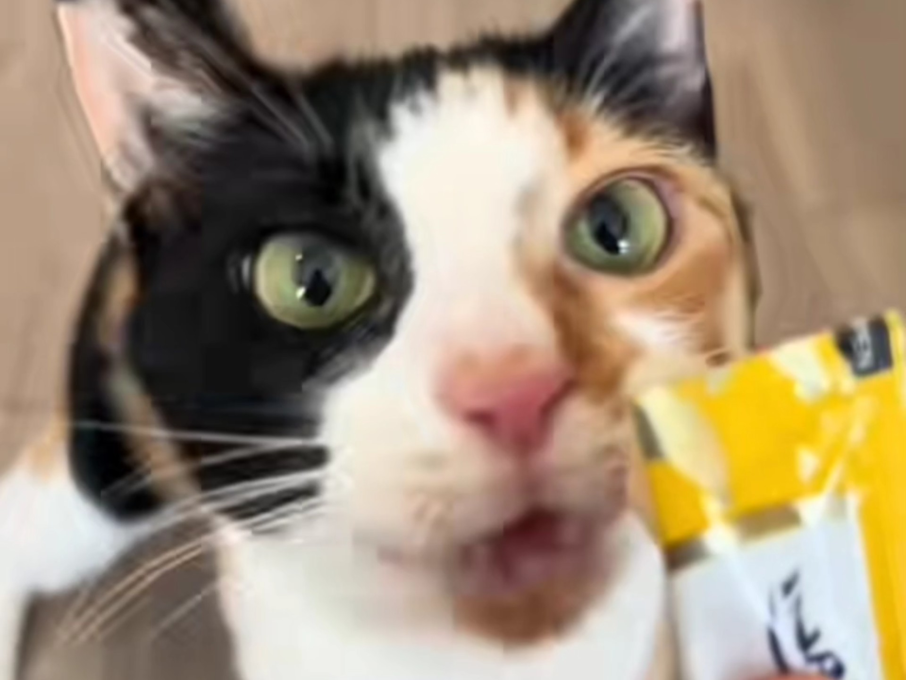 | 25.8万 | 2025-04-24 |
| [哈基入炖哈基米](https://www.bilibili.com/video/BV1MyoRYDEzi) |  | 29.9万 | 2025-03-28 |
| [咱老北京哈基米中午早上吃完必须打盹一下，那滋味跟您说，那叫一个地道](https://www.bilibili.com/video/BV1zVXxYyEy5) | 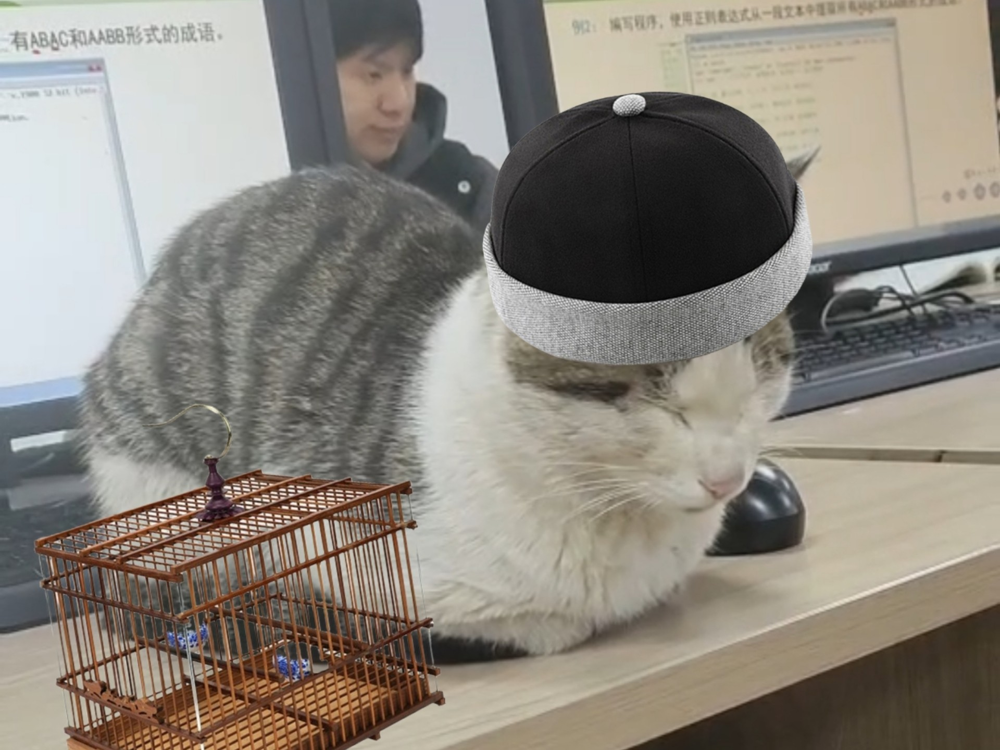 | 38.4万 | 2025-03-23 |
| [传统猫片春暖花开又是个交.....](https://www.bilibili.com/video/BV1q2KpeaETK) | 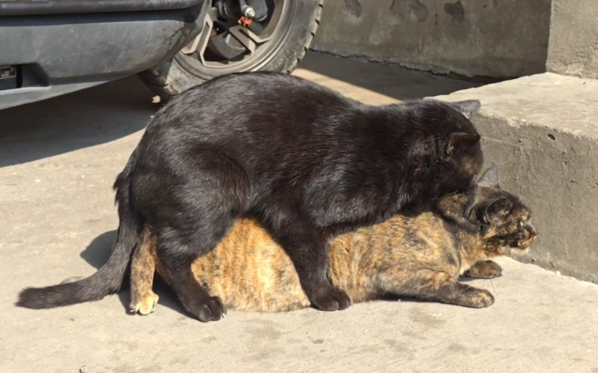 | 4.4万 | 2025-02-13 |
| [老吴猫原视频](https://www.bilibili.com/video/BV1iXN8emEMr) | 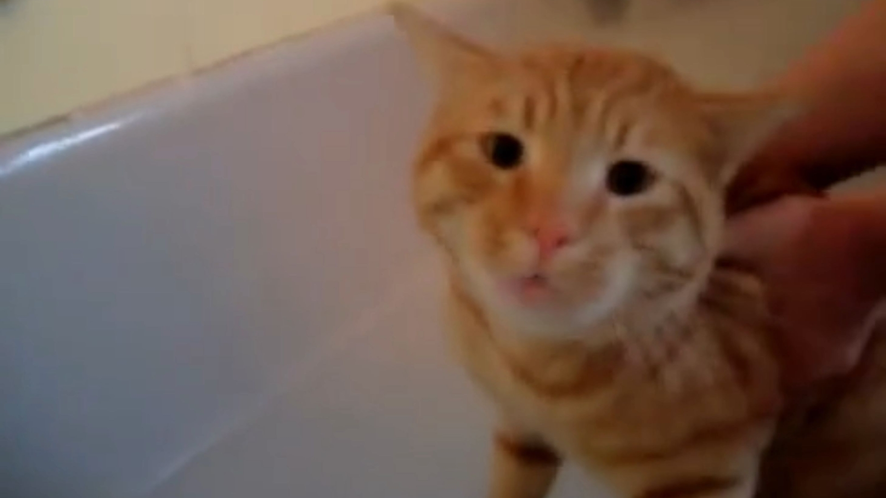 | 162.9万 | 2025-02-07 |
| [哈基米代码有漏洞](https://www.bilibili.com/video/BV1CMwMe4Ena) | 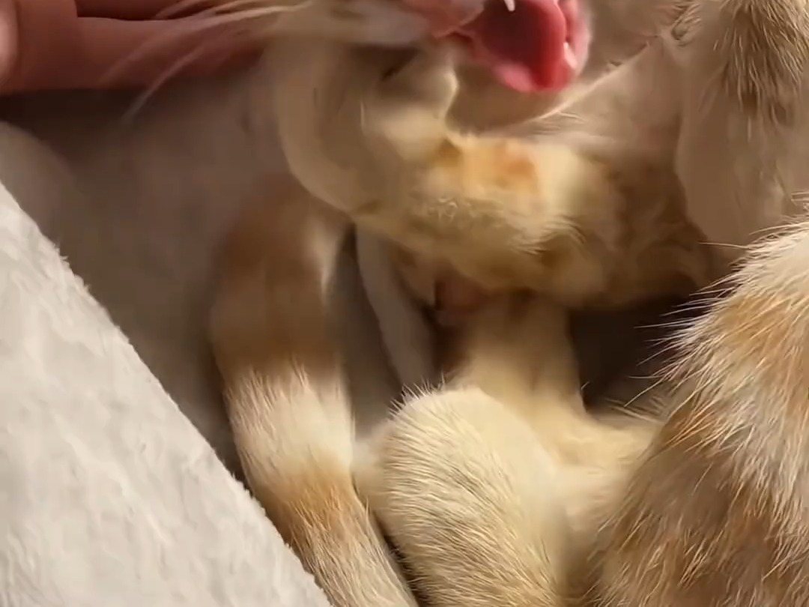 | 45.2万 | 2025-01-19 |
| [哈基米互爱小合集11](https://www.bilibili.com/video/BV1ZeqUYeE1i) | 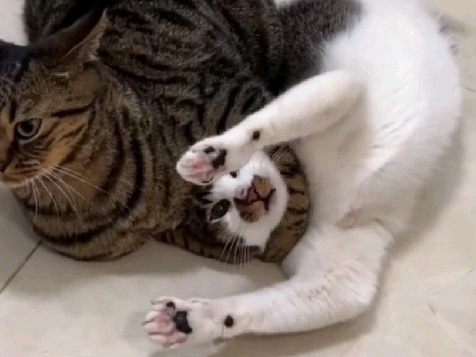 | 1.8万 | 2024-12-11 |
| [✨我的哈基米是💧水做的🪄【哈基合战应援作】](https://www.bilibili.com/video/BV1asaZe9EpC) | 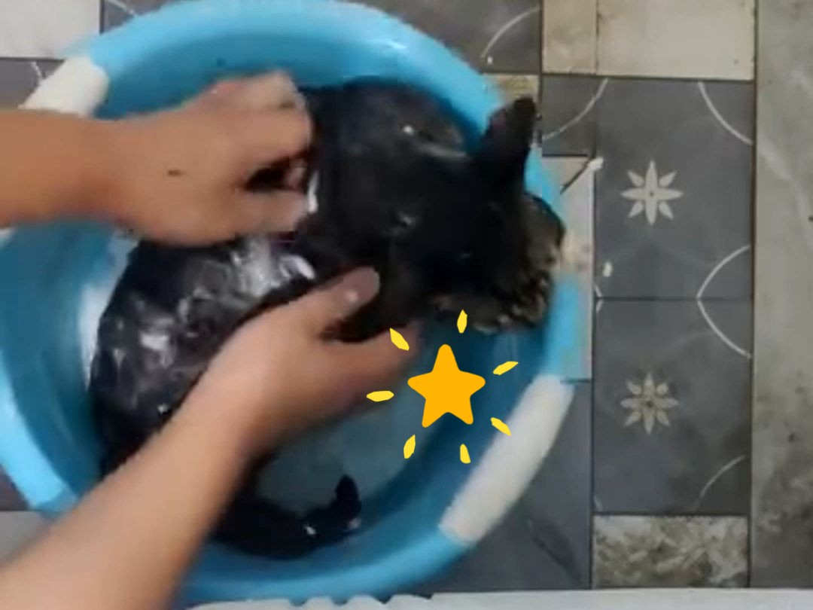 | 1.2万 | 2024-08-05 |
| [战斗吧！哈基米！](https://www.bilibili.com/video/BV1h142167XN) | 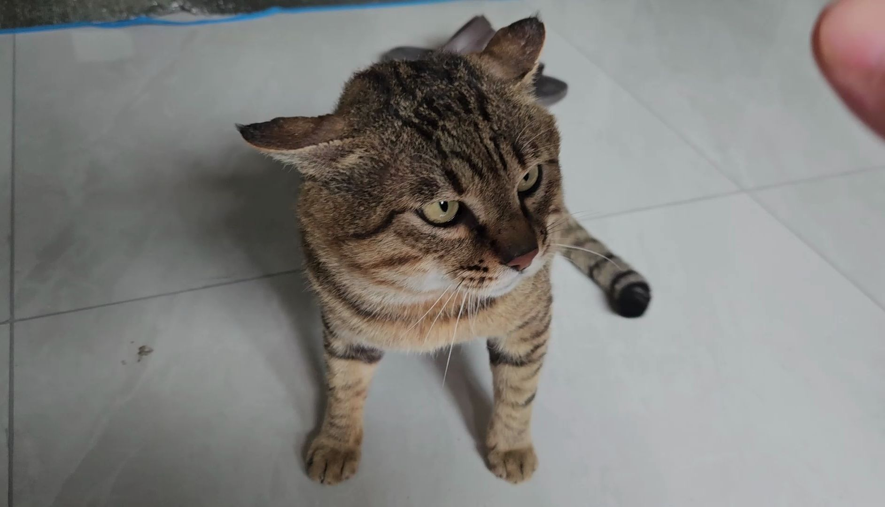 | 3.1万 | 2024-05-07 |
| [猫狗](https://www.bilibili.com/video/BV1gr421g7Ly) | 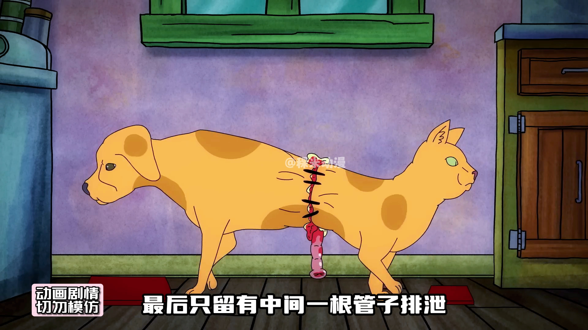 | 59.0万 | 2024-05-05 |
| [工作听歌效率加倍⚡（第二集）](https://www.bilibili.com/video/BV1e14y1B7mH) | 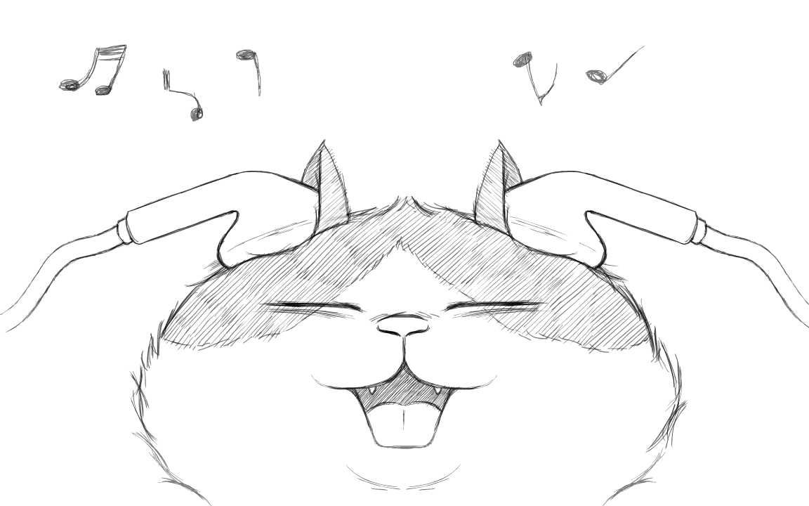 | 219.1万 | 2023-08-04 |
| [啊 哈 哈 哈 哈 ！ ！ ！](https://www.bilibili.com/video/BV1Y5411g7G9) |  | 2036.7万 | 2021-05-26 |

---
*最后更新: 2026-03-09 03:12:50 (自动生成)*
*数据来源: [Bilibili](https://www.bilibili.com)*

## 使用说明

运行以下命令更新视频列表:
```bash
python3 fetch_hajimi_videos.py
```
