# awesome-hajimi
collections of hajimi (哈基米 in Chinese) on the Internet.

## 视频列表 (Video List)

| 视频标题 (Title) | 封面 | 播放量 (Views) | 发布日期 (Date) |
|---|---|---|---|
| [飞舞哈基米](https://www.bilibili.com/video/BV1N4RKBhEAj) | 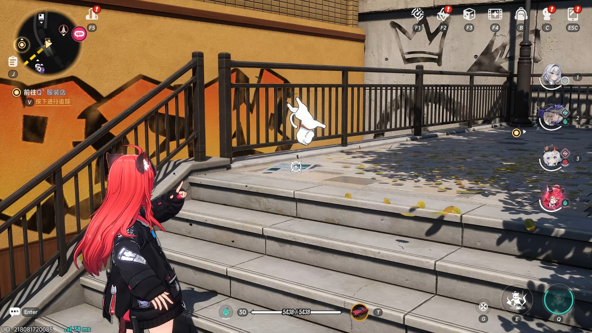 | 23 | 2026-05-01 |
| [银河也要哈基米](https://www.bilibili.com/video/BV1fqRKBXES6) |  | 10 | 2026-05-01 |
| [最难绷的一集。话说B站上目前有没有哈基米的Wellerman？](https://www.bilibili.com/video/BV1AYRKB4EHM) |  | 2 | 2026-05-01 |
| [哈基米哈气了](https://www.bilibili.com/video/BV1KPRTBKEvY) | 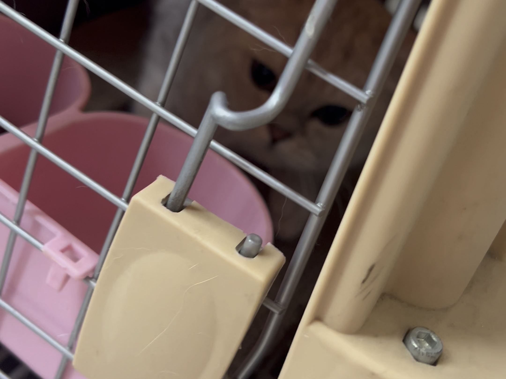 | 0 | 2026-05-01 |
| [哈基米 这个陪伴](https://www.bilibili.com/video/BV1N1o6BPEqX) | 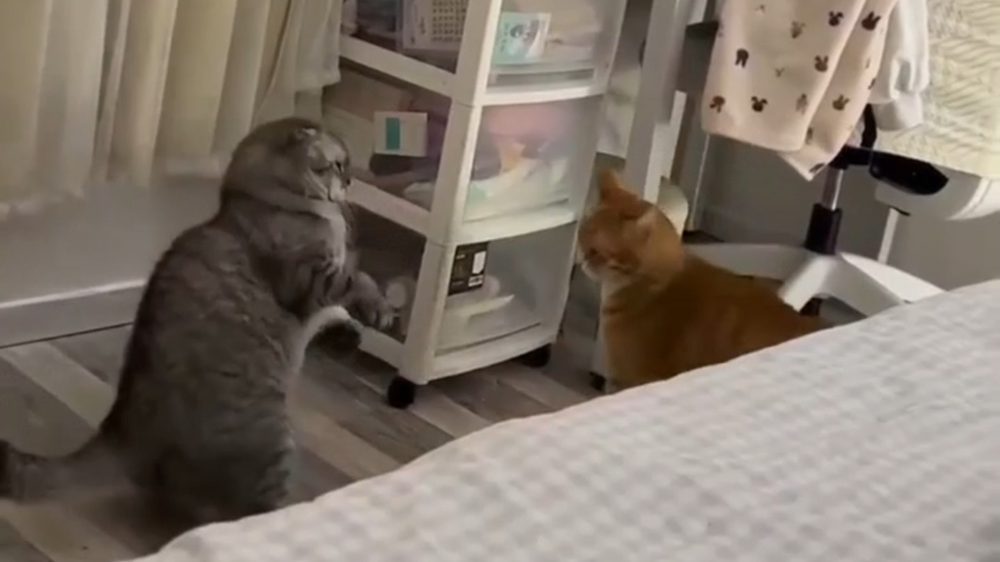 | 827 | 2026-05-01 |
| [循环歌单｜哈基米曼波《弥渡山歌Phonk(哈基米版)》哈基米啊南北绿豆！](https://www.bilibili.com/video/BV1mo98BPEtq) |  | 42 | 2026-05-01 |
| [《The Best Of 咪》](https://www.bilibili.com/video/BV1ni9aB4Ee5) |  | 434 | 2026-05-01 |
| [哈基米](https://www.bilibili.com/video/BV1hdRKBrEKF) | 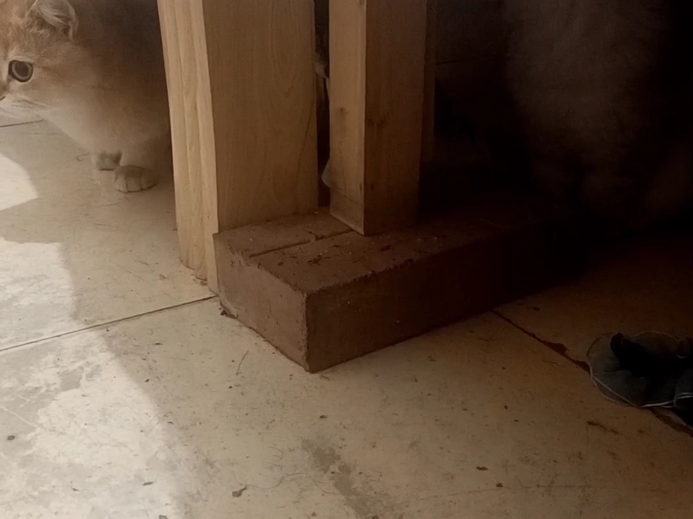 | 19 | 2026-05-01 |
| [@Twistzz：再见了波哈基米ヾ(•ω•`)o！冷知识：A队建立王朝的第一步就是踢掉大表哥😎！](https://www.bilibili.com/video/BV1QXRKBkErM) |  | 515 | 2026-05-01 |
| [哈基米刻律](https://www.bilibili.com/video/BV1UP9qBXE8c) |  | 872 | 2026-05-01 |
| [【哈基米音乐】哈是个什么基米](https://www.bilibili.com/video/BV17g9BBBExz) | 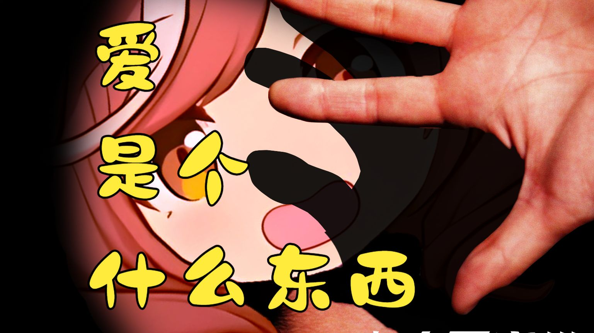 | 215 | 2026-05-01 |
| [喵刃 可爱的猫猫手套 那时候还没有哈基米](https://www.bilibili.com/video/BV1Yz9qBfEkt) | 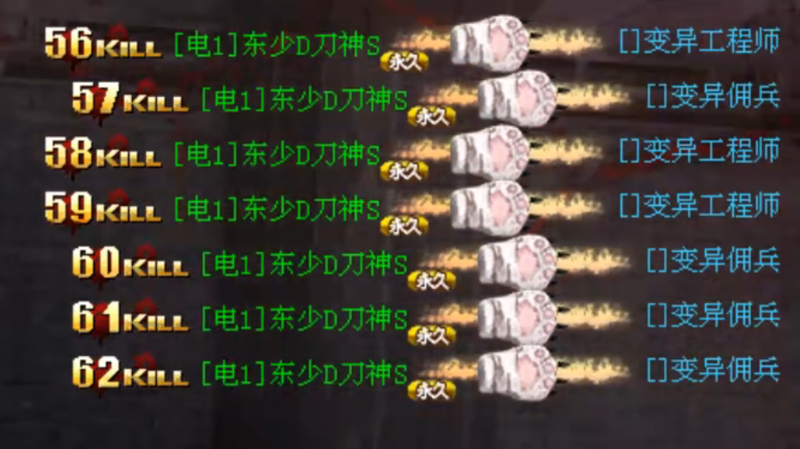 | 14 | 2026-04-30 |
| [基米之歌](https://www.bilibili.com/video/BV1b19qBREdh) | 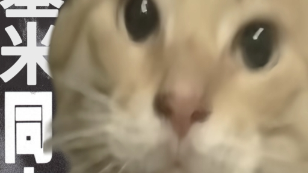 | 38 | 2026-04-30 |
| [哈基米ASMR](https://www.bilibili.com/video/BV1FC9iBMEqW) |  | 76 | 2026-04-30 |
| [哈基米6th秋上的 Speacial Record!](https://www.bilibili.com/video/BV16y9iBqEtb) |  | 23 | 2026-04-30 |
| [让豆包唱哈基米](https://www.bilibili.com/video/BV14b9iBmEPB) |  | 71 | 2026-04-30 |
| [国外爆火的哈基米屏保](https://www.bilibili.com/video/BV1se9iB5EBF) |  | 46 | 2026-04-30 |
| [确定了娜娜莉是哈基米，会哈气](https://www.bilibili.com/video/BV1Ka9iB1E2B) |  | 5389 | 2026-04-30 |
| [你说得对，但这就是三哈气一强化普攻超级哈基米](https://www.bilibili.com/video/BV1WU9YBTER4) | 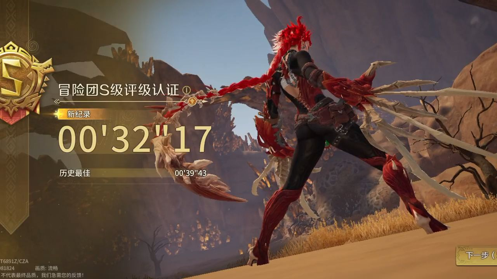 | 3684 | 2026-04-30 |
| [【哈基米FM】🐱Way back home🐱](https://www.bilibili.com/video/BV1x29YBBEXR) |  | 1380 | 2026-04-30 |
| [携哈基米强势回归（＾ω＾）](https://www.bilibili.com/video/BV1pX9YBeETy) | 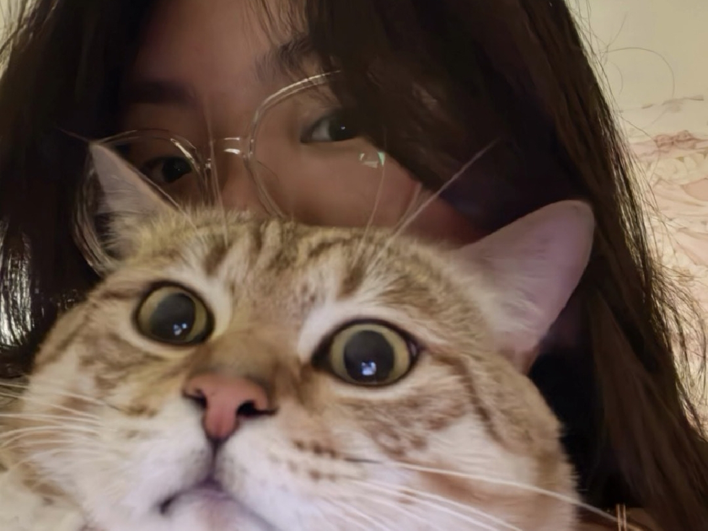 | 112 | 2026-04-30 |
| [最强哈基米蛋](https://www.bilibili.com/video/BV1b69YBkEmC) |  | 304 | 2026-04-30 |
| [🐱震撼首发！《一哈一基》哈基米最帅的一集！！！🐱](https://www.bilibili.com/video/BV1iM9eBWETa) |  | 972 | 2026-04-30 |
| [哈基米神秘园](https://www.bilibili.com/video/BV1qA9eBoEGu) | 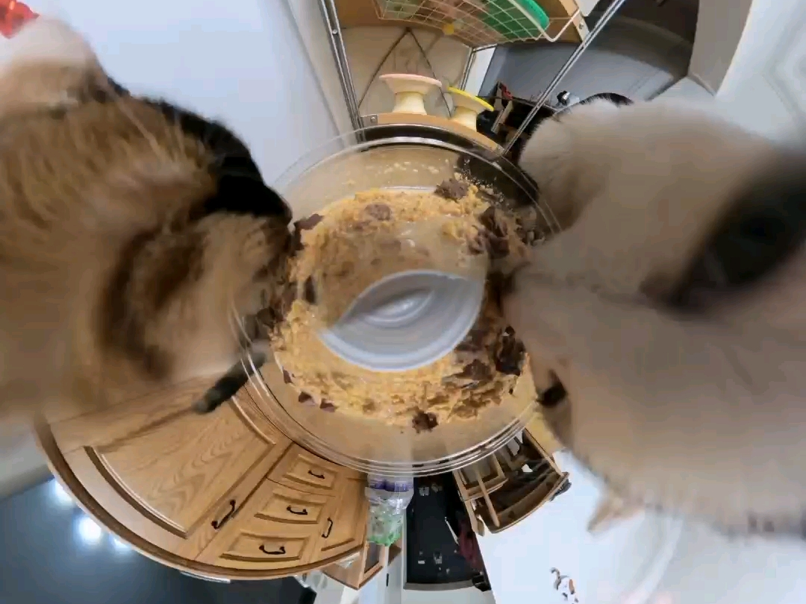 | 33 | 2026-04-30 |
| [哈基米喔那没路躲 手偶](https://www.bilibili.com/video/BV1ZC9eBbEAG) | 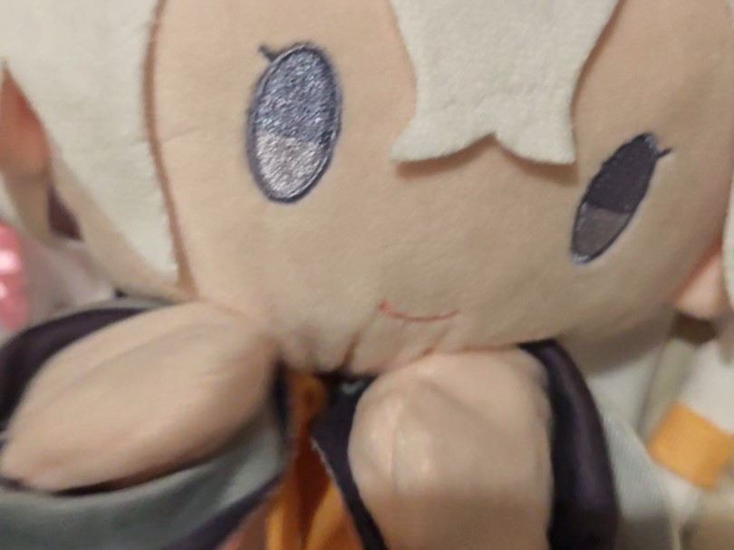 | 478 | 2026-04-30 |
| [哈基米：妈妈，哈完气怎么办？](https://www.bilibili.com/video/BV13f9eBJEvm) |  | 1396 | 2026-04-30 |
| [哈气一切之人——天堂制造·基米](https://www.bilibili.com/video/BV1af9eBJEK8) |  | 201 | 2026-04-30 |
| [【哈基米音乐】🐱 哈见🐱我哈我 没有机会 跟你说一声哈见](https://www.bilibili.com/video/BV1LD9eBREgM) | 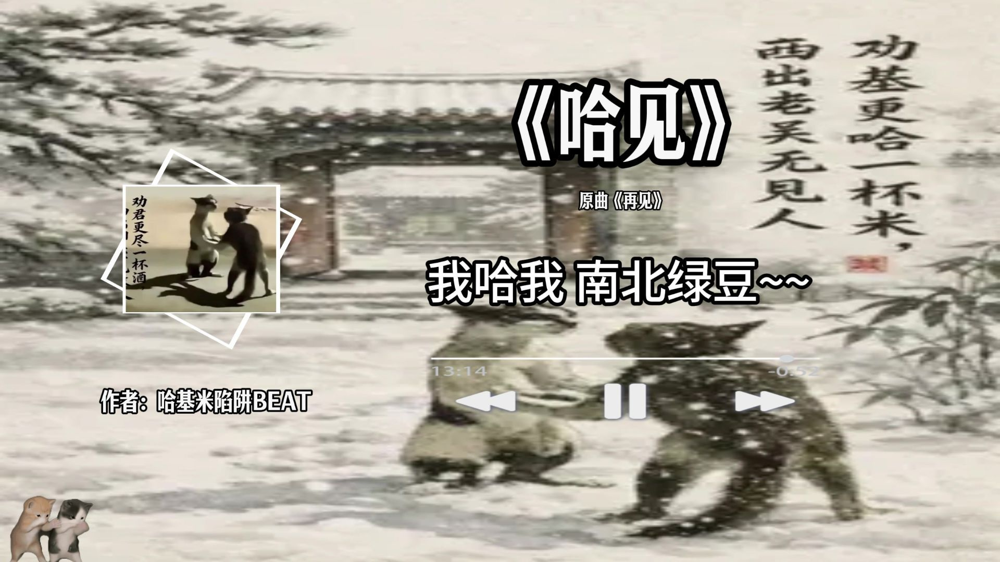 | 112 | 2026-04-30 |
| [可怜的哈基米](https://www.bilibili.com/video/BV1Z29eBtEqB) | 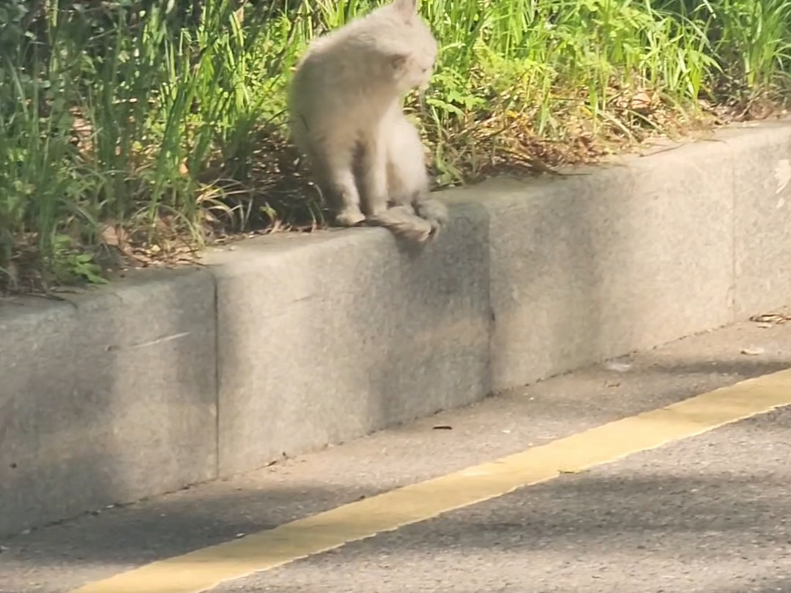 | 53 | 2026-04-30 |
| [哈基米助眠丨当你做观光客时点了一个助眠](https://www.bilibili.com/video/BV1Em94BCE29) | 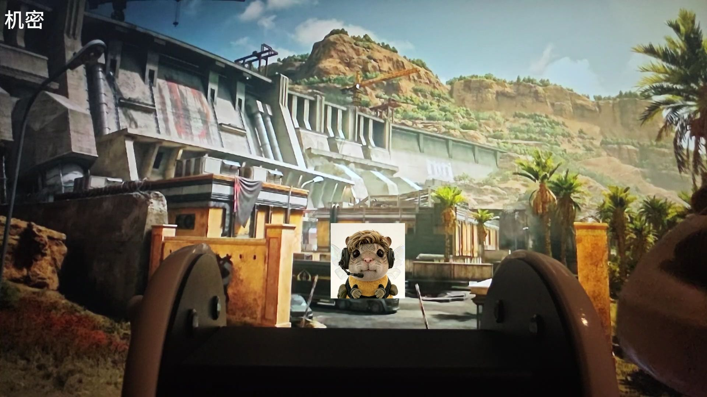 | 3608 | 2026-04-30 |
| [哈基米正在治疗中](https://www.bilibili.com/video/BV1999eBQEKW) | 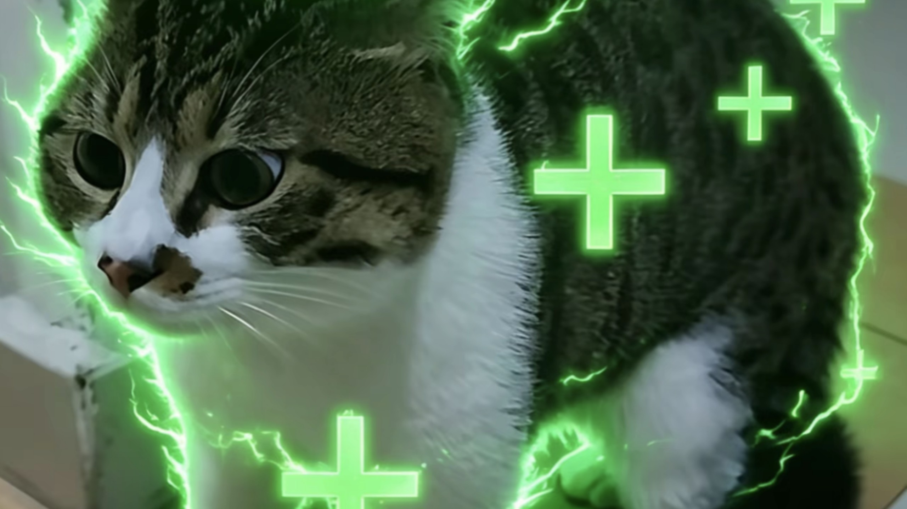 | 7393 | 2026-04-30 |
| [不敢直视镜头的哈基米](https://www.bilibili.com/video/BV15T9aBjEV6) | 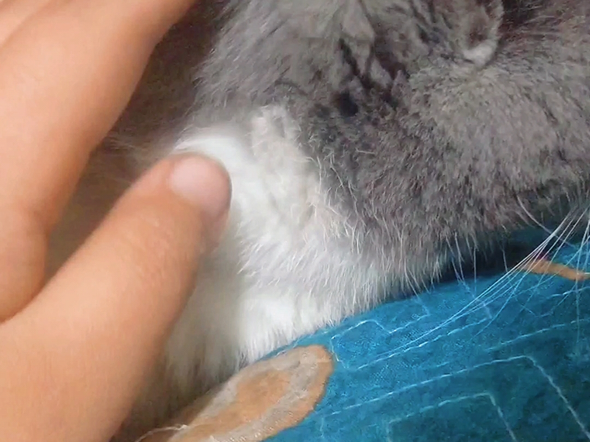 | 112 | 2026-04-30 |
| [洗澡日](https://www.bilibili.com/video/BV1VT9aB7ER6) | 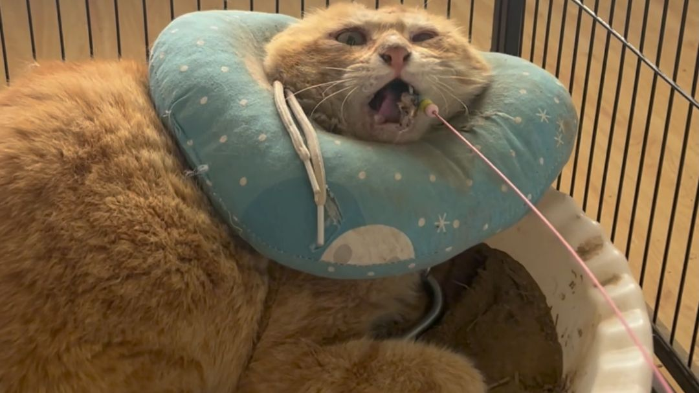 | 2252 | 2026-04-30 |
| [哈基米超长合集](https://www.bilibili.com/video/BV19r9tBiEx6) | 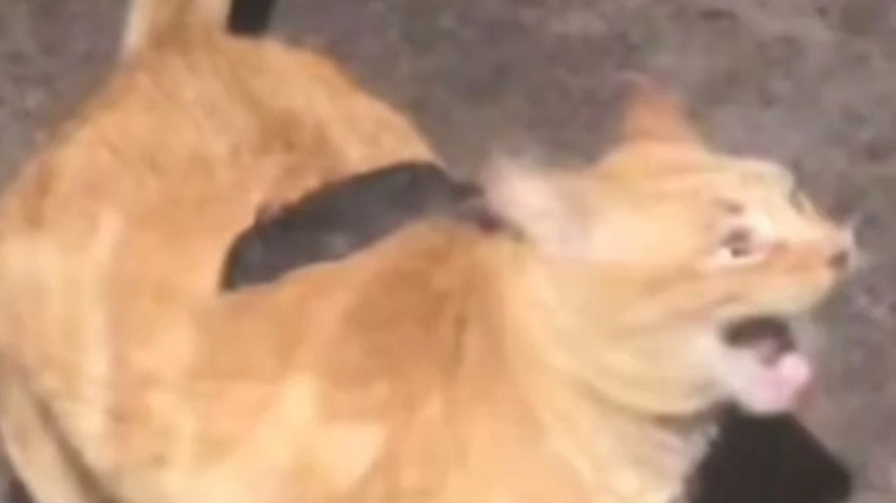 | 35 | 2026-04-30 |
| [给大家汇报一下哈基米后续](https://www.bilibili.com/video/BV1VM9aB1EuF) | 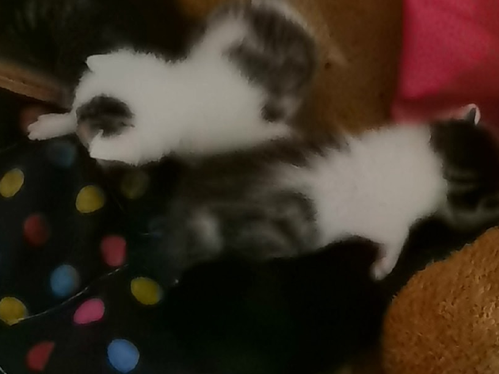 | 16 | 2026-04-30 |
| [酿酒基米](https://www.bilibili.com/video/BV1uj9aBgEWf) | 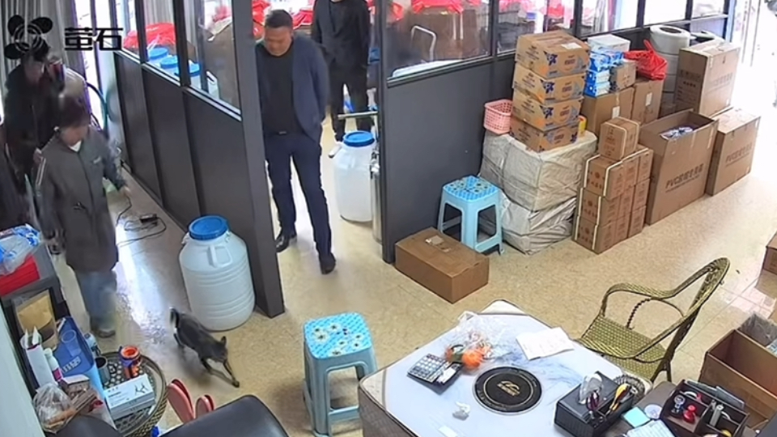 | 2209 | 2026-04-30 |
| [帝宝在吃哈基米，一直捏他脸不说话会怎么样（纯捏版）](https://www.bilibili.com/video/BV1xy9hBwE6E) |  | 659 | 2026-04-30 |
| [我是流萤的哈基米！](https://www.bilibili.com/video/BV1Fd9hBREn5) |  | 7994 | 2026-04-30 |
| [哈基米南北绿豆](https://www.bilibili.com/video/BV1Tp9aBKEX7) |  | 375 | 2026-04-30 |
| [哈基米:阎王来了](https://www.bilibili.com/video/BV1xW9aBvE2u) | 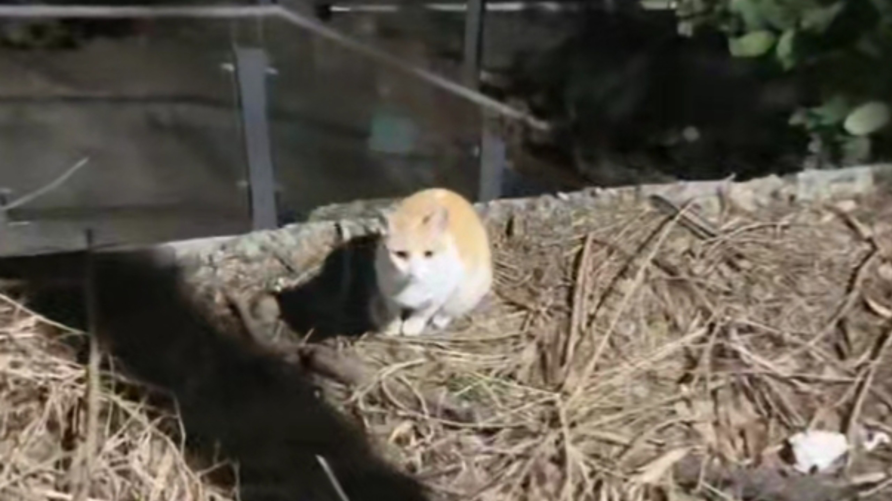 | 1005 | 2026-04-30 |
| [Minecraft ｜ 哈基米！这是什么唱片？](https://www.bilibili.com/video/BV1Wb9aBwEwo) | 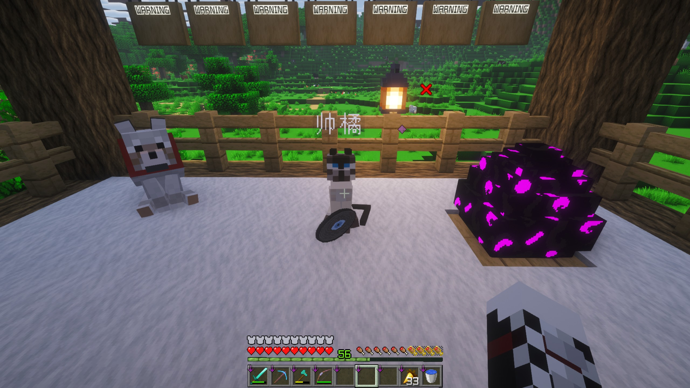 | 696 | 2026-04-30 |
| [哈基米有格调](https://www.bilibili.com/video/BV1s49aBYEXD) | 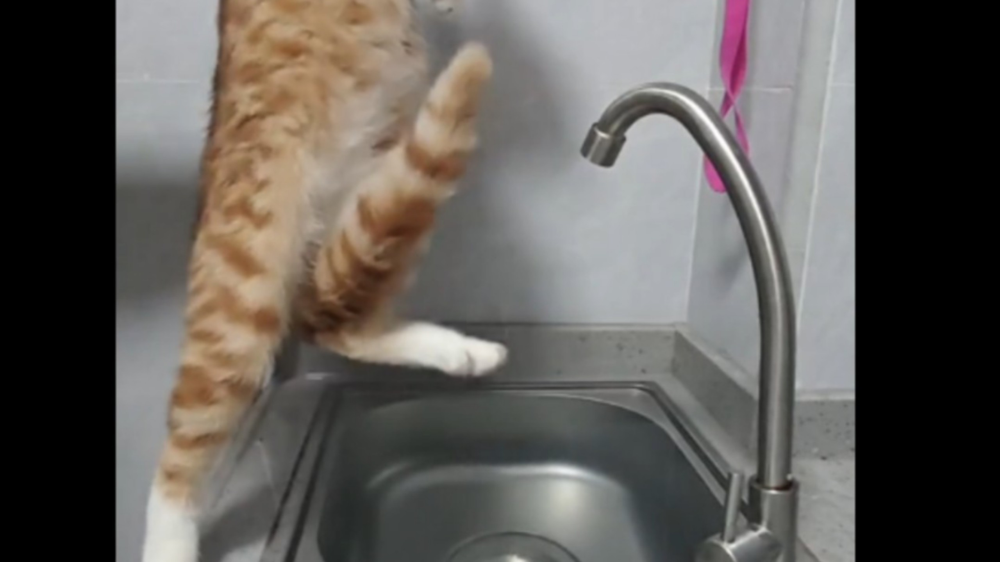 | 2398 | 2026-04-30 |
| [哈基米这个喜欢别的哈基米游泳](https://www.bilibili.com/video/BV1Sf9aB6EiY) | 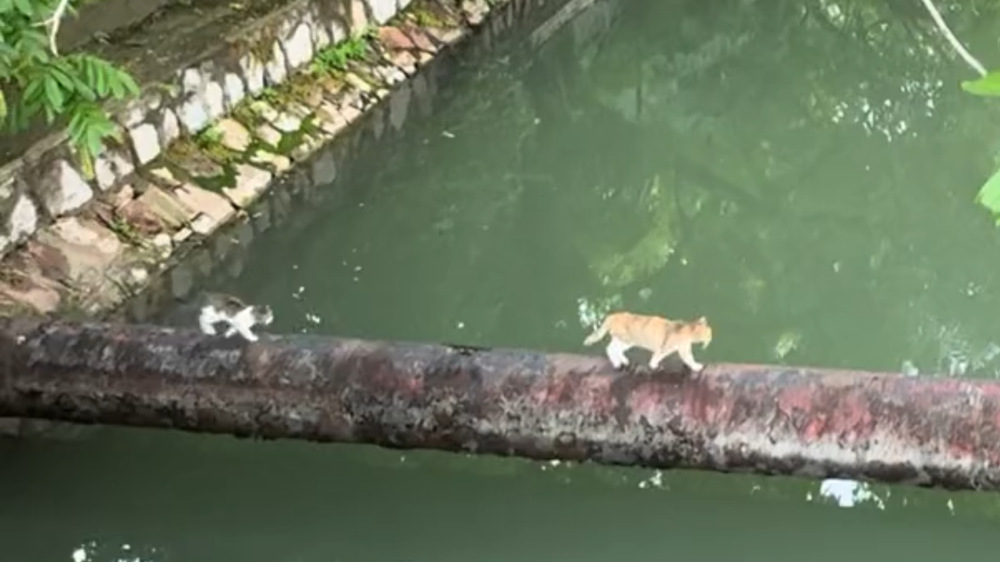 | 2639 | 2026-04-30 |
| [【极荒骷髅咒术】葛叶通用阵容1.2e登顶流程，还能再见吗哈基米](https://www.bilibili.com/video/BV13d9aBCEVr) | 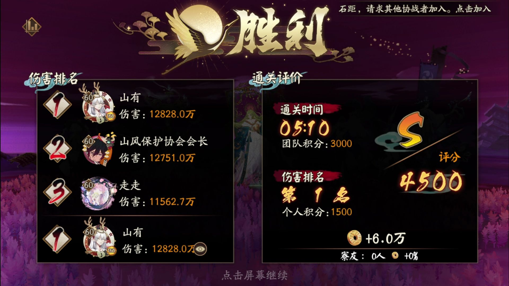 | 2880 | 2026-04-30 |
| [哈基米底层代码这一块，棘背龙形态这一块，秒开仙人这一块](https://www.bilibili.com/video/BV1hd9aBCEJT) |  | 804 | 2026-04-30 |
| [以防你没见过哈基米睡觉像绝育一样](https://www.bilibili.com/video/BV1yT9YBNEB1) | 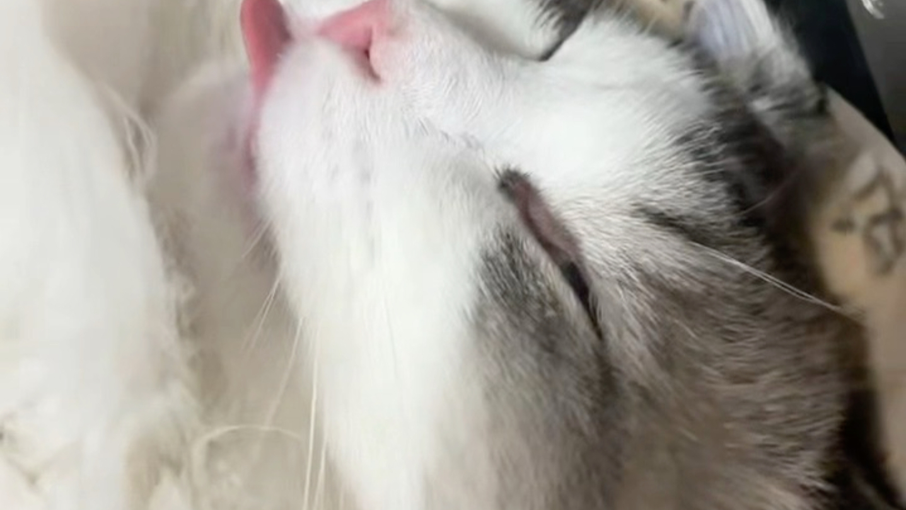 | 41 | 2026-04-30 |
| [⚡️慈禧，这里没有人叫你哈基米⚡️](https://www.bilibili.com/video/BV1wU96BnE8P) |  | 4790 | 2026-04-30 |
| [我得到基米宝贝了！](https://www.bilibili.com/video/BV1oC9aBDEtV) | 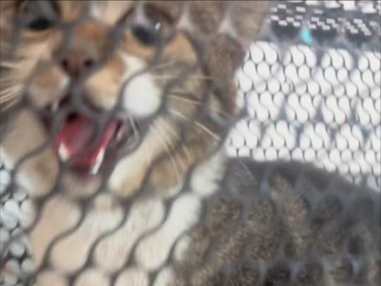 | 1128 | 2026-04-30 |
| [哈基米强行触发舔毛程序重启系统](https://www.bilibili.com/video/BV1j19aBnEeA) | 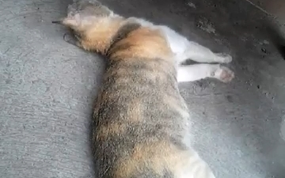 | 1.8万 | 2026-04-30 |
| [哈基米日常](https://www.bilibili.com/video/BV1SR9aBVEar) | 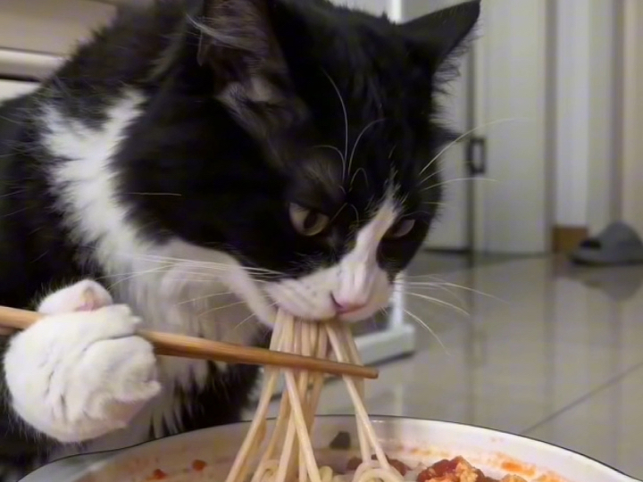 | 132 | 2026-04-30 |
| [【七天的哈基米】最新视频来袭，快来看看吧！](https://www.bilibili.com/video/BV1Ls9YB9E3i) | 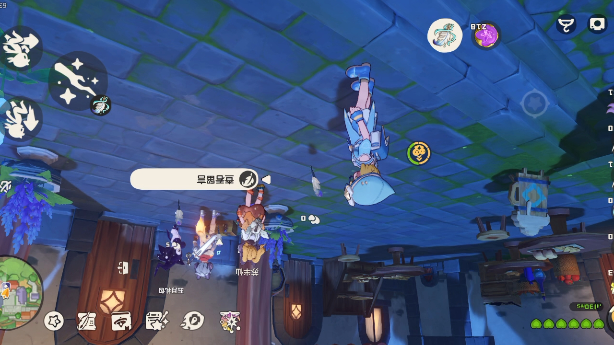 | 38 | 2026-04-30 |
| [【怪物哈基米】视频已打包，欢迎围观！](https://www.bilibili.com/video/BV1k39YBaEVE) |  | 1.2万 | 2026-04-30 |
| [蛋仔派对：送哈基米回家！要躲避障碍物，小迷兔子能完成吗？](https://www.bilibili.com/video/BV16L9YBfEiY) | 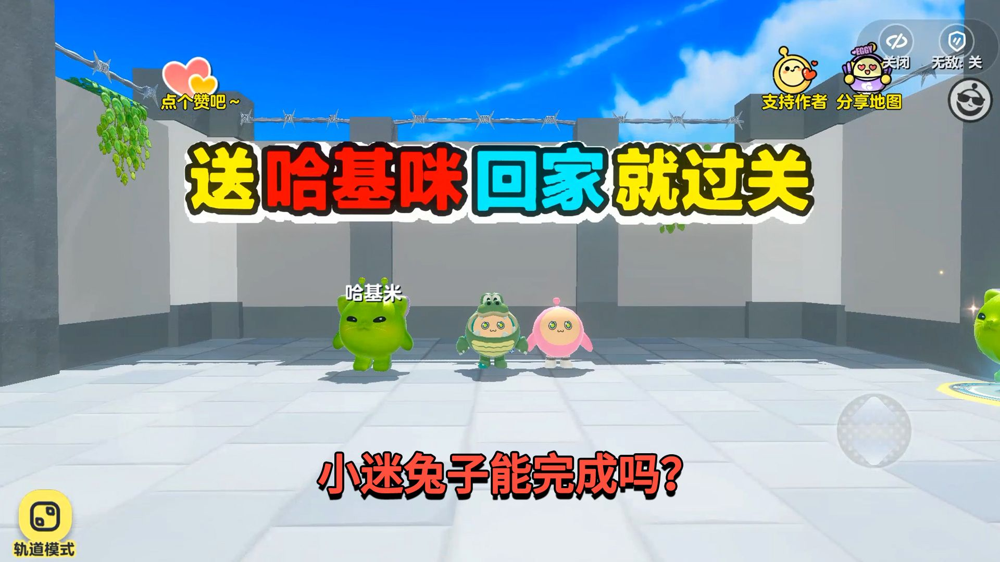 | 3370 | 2026-04-30 |
| [【哈气TV】哈基米妈妈在孩子面前被追着咬了](https://www.bilibili.com/video/BV1Hb98BWEo5) | 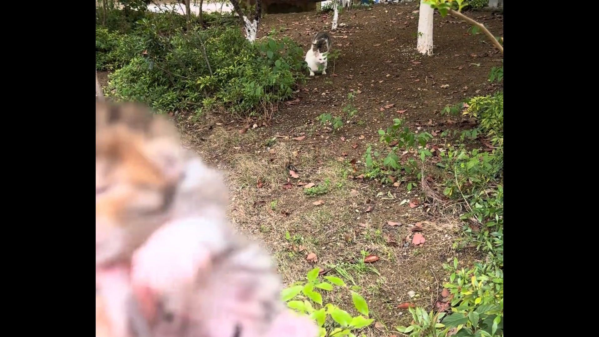 | 1483 | 2026-04-30 |
| [哈基米性格温顺，有人想收养吗？](https://www.bilibili.com/video/BV1mZ98BYEDY) | 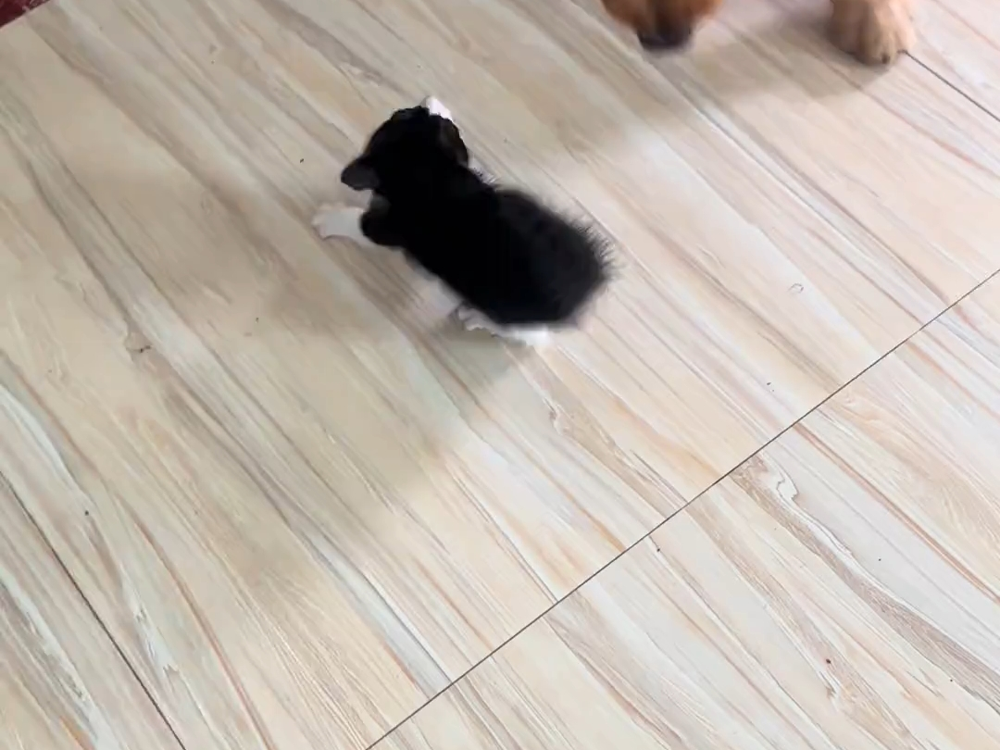 | 450 | 2026-04-30 |
| [过俩星期再来哈基米应该就温顺多了](https://www.bilibili.com/video/BV1D998BKEH3) | 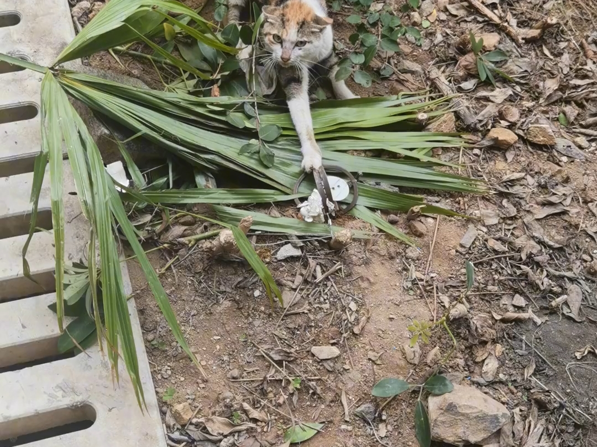 | 1980 | 2026-04-30 |
| [一边听哈基米一边给oppofoldx3换外屏 给我修高潮了](https://www.bilibili.com/video/BV1qn9hBUEpc) | 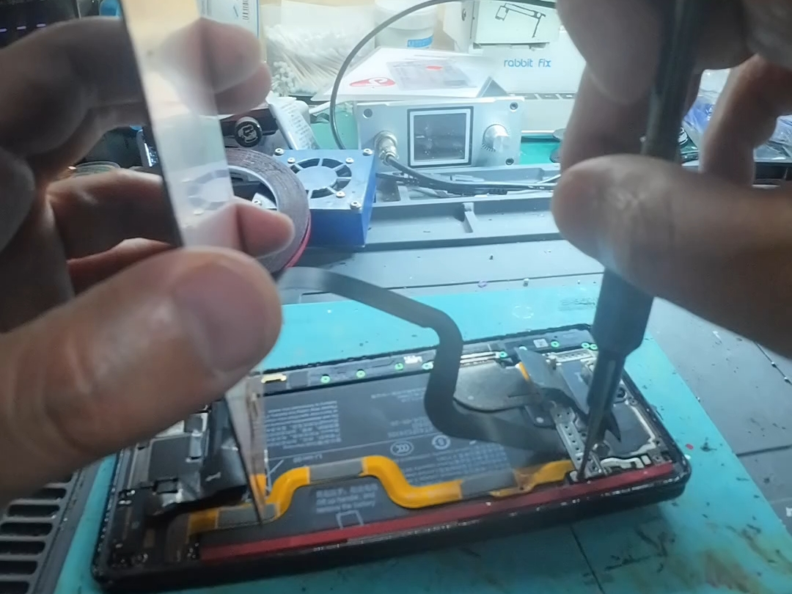 | 518 | 2026-04-30 |
| [因为不吃还乱扒拉被哈基米强X了(,,•́ . •̀,,)](https://www.bilibili.com/video/BV1gd9rBvEP5) |  | 4078 | 2026-04-30 |
| [只是在搓搓哈基米](https://www.bilibili.com/video/BV1Fj9hBHE59) |  | 586 | 2026-04-30 |
| [低能哈基米笑死个人](https://www.bilibili.com/video/BV18Y9hB6Ekp) | 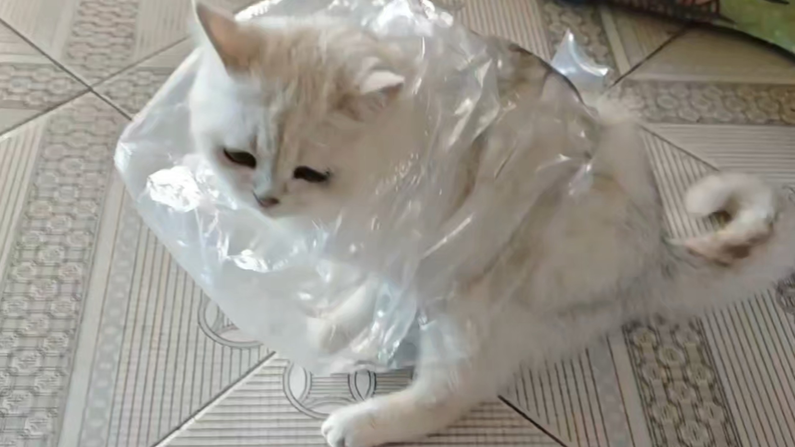 | 197 | 2026-04-30 |
| [最近嘬不太尊重我！](https://www.bilibili.com/video/BV1xr9hBPEUM) | 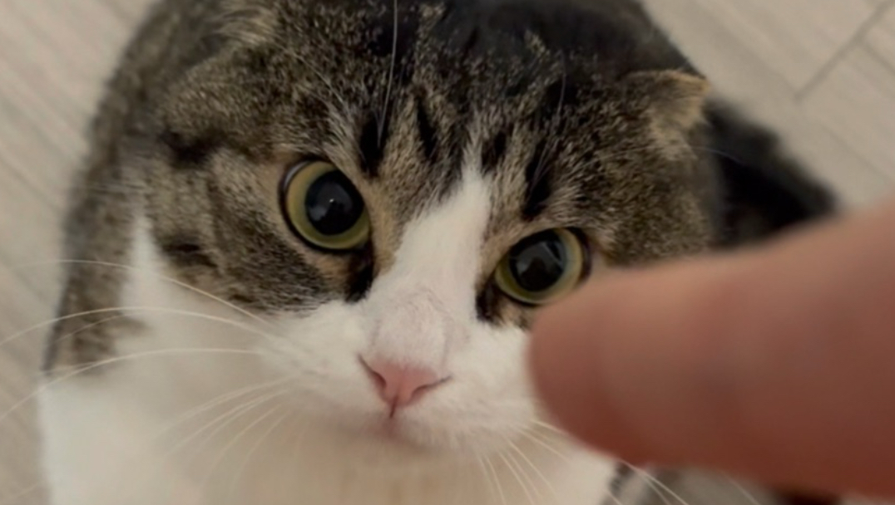 | 4.5万 | 2026-04-30 |
| [凶狠哈基米大橘落网，成功收养](https://www.bilibili.com/video/BV1NF9bBsEZU) | 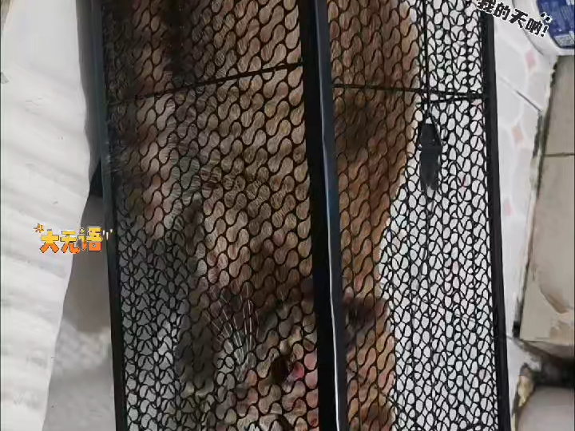 | 194 | 2026-04-30 |
| [可恶的哈基米肯定在装死](https://www.bilibili.com/video/BV1BL9bBVE7a) | 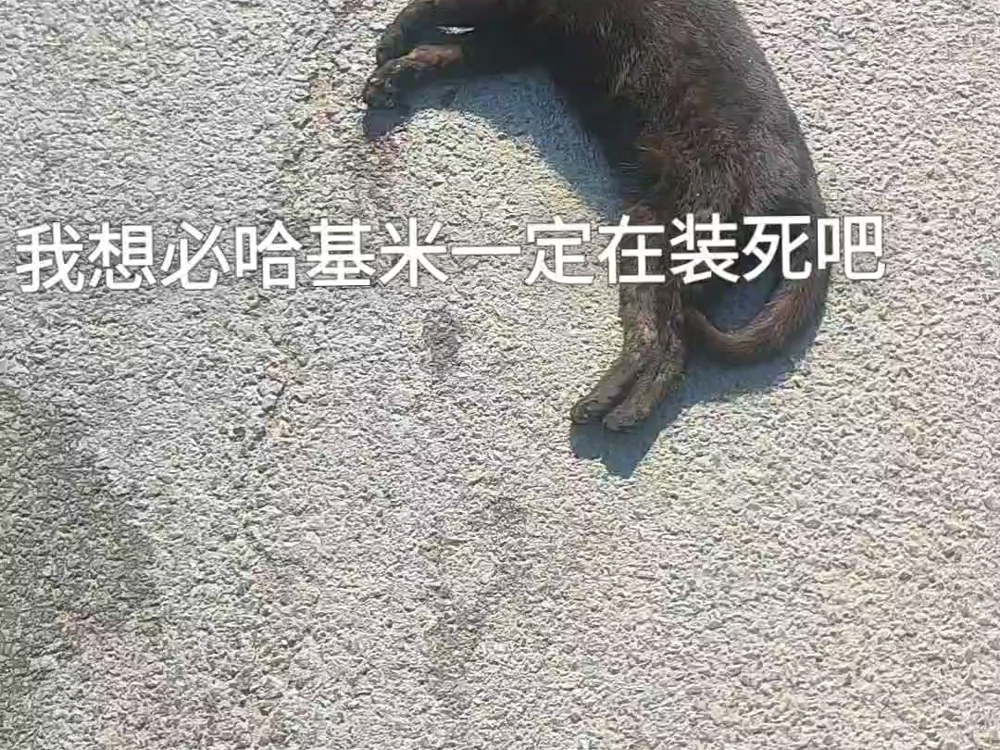 | 220 | 2026-04-30 |
| [在学校昏迷被同学说成植物人](https://www.bilibili.com/video/BV1sB94BSEVi) | 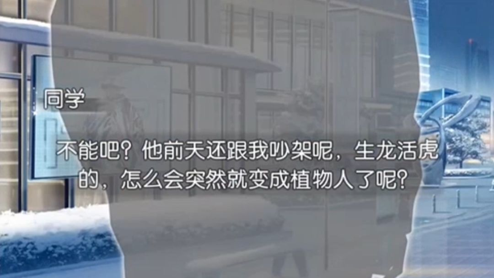 | 2.4万 | 2026-04-29 |
| [哈基豆：哈 ↓ 啊 ↑ ↑ ↑ ~ ~ ~ ~](https://www.bilibili.com/video/BV1uM9tBFEmu) |  | 4057 | 2026-04-29 |
| [哈基米的最后一舞](https://www.bilibili.com/video/BV1Fs9xB6EC8) |  | 3394 | 2026-04-29 |
| [啊~是哈中王来了？](https://www.bilibili.com/video/BV1H49DBjECb) |  | 4.4万 | 2026-04-29 |
| [【智人TV】嘻嘻，又省下200块钱](https://www.bilibili.com/video/BV1sq9SBSEnw) | 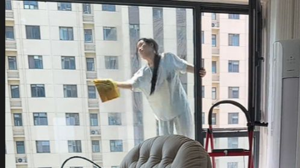 | 44.8万 | 2026-04-29 |
| [鼠鼠小号都快饿鼠了给小号摸点宝物吃吧](https://www.bilibili.com/video/BV1uQ9DBFEWq) | 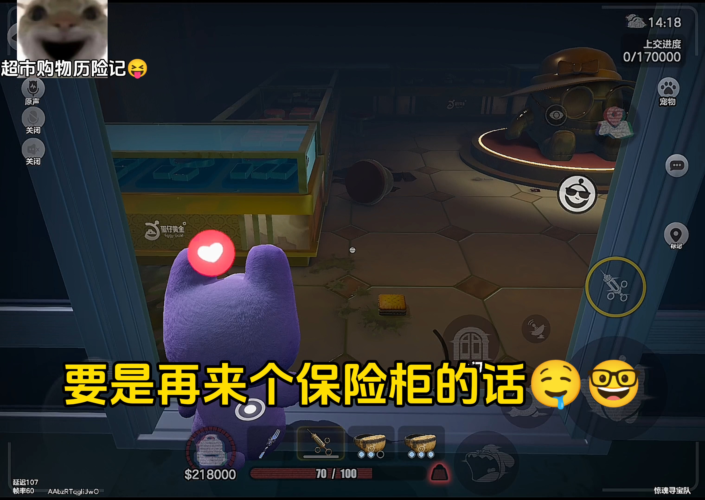 | 3.7万 | 2026-04-29 |
| [感觉学会了80%](https://www.bilibili.com/video/BV1f39QB5EdR) | 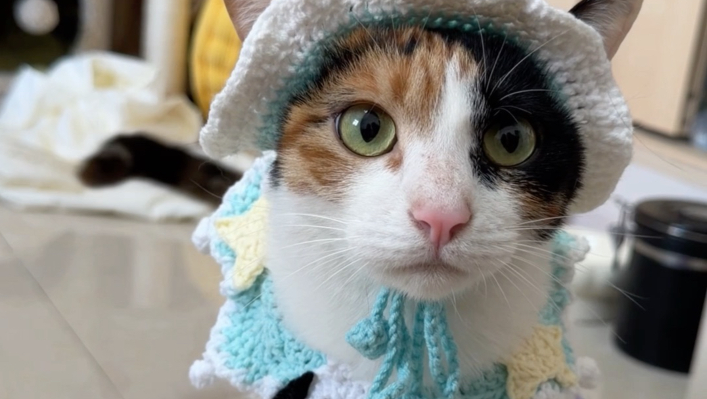 | 13.2万 | 2026-04-29 |
| [总算是看到点希望了](https://www.bilibili.com/video/BV1gk92BUEwJ) |  | 5634 | 2026-04-29 |
| [小基米刚出生就哈气不停](https://www.bilibili.com/video/BV1789UBvEf9) | 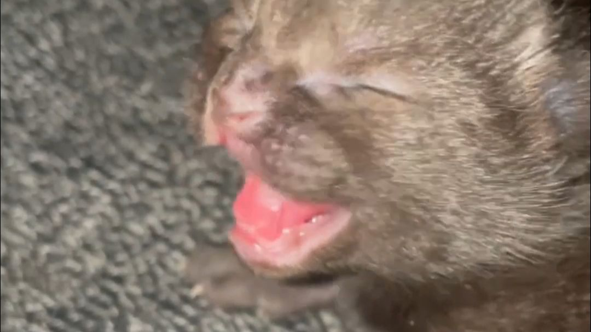 | 1878 | 2026-04-29 |
| [你们以后会是好基米对吗？](https://www.bilibili.com/video/BV1pJ9UBGEDe) | 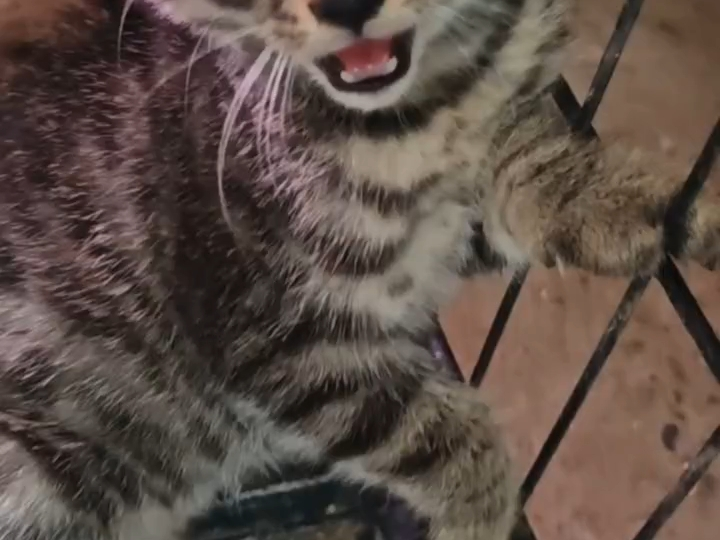 | 2.2万 | 2026-04-29 |
| [逆天大基米，只剩两只小猫的原因是被大基米吃了](https://www.bilibili.com/video/BV1Jx9UBMEn8) | 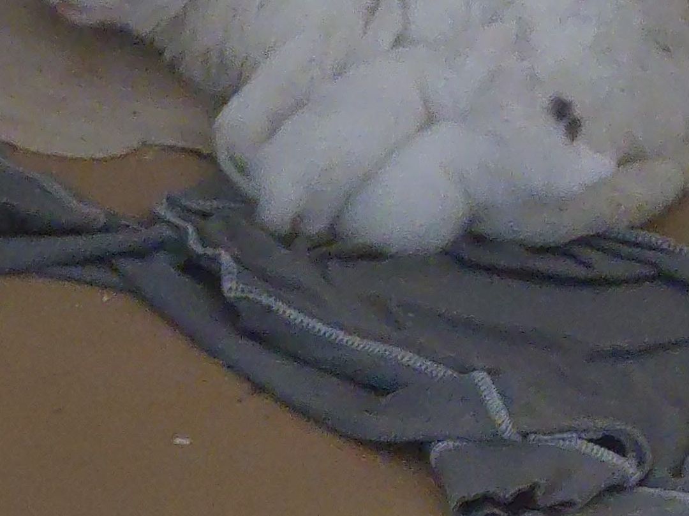 | 1988 | 2026-04-29 |
| [哈基米依旧鸠占鹊巢疯狂哈气](https://www.bilibili.com/video/BV1wp9UB3Ek8) | 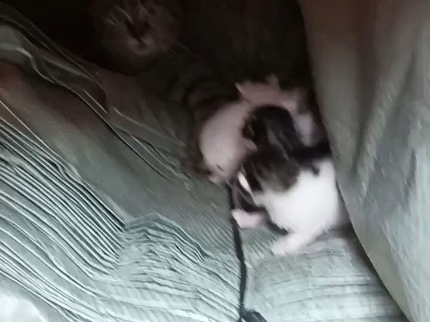 | 487 | 2026-04-29 |
| [大橘哥141-大橘哥的体重](https://www.bilibili.com/video/BV1FW9UB6ELZ) | 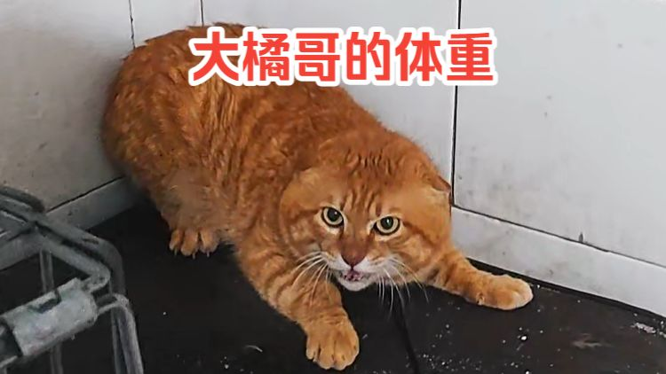 | 8.2万 | 2026-04-29 |
| [猫儿这个下班](https://www.bilibili.com/video/BV1wc9SB5E91) | 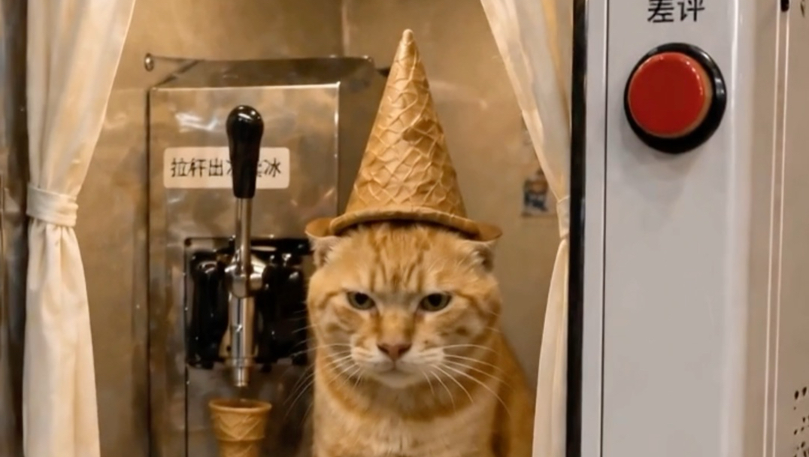 | 27.8万 | 2026-04-29 |
| [哈基米:这是我的家，你在我家干嘛](https://www.bilibili.com/video/BV1Q19UBsETp) | 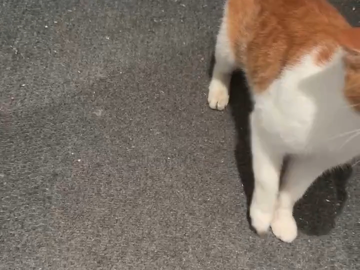 | 1662 | 2026-04-29 |
| [哈春](https://www.bilibili.com/video/BV1wa9CBfE62) |  | 13.0万 | 2026-04-29 |
| [这就很美味了](https://www.bilibili.com/video/BV1N49CBAEAh) | 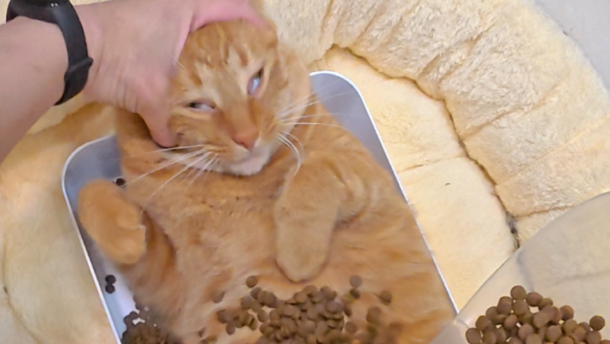 | 7.3万 | 2026-04-29 |
| [耄耄的救赎](https://www.bilibili.com/video/BV1L39mBfEEd) | 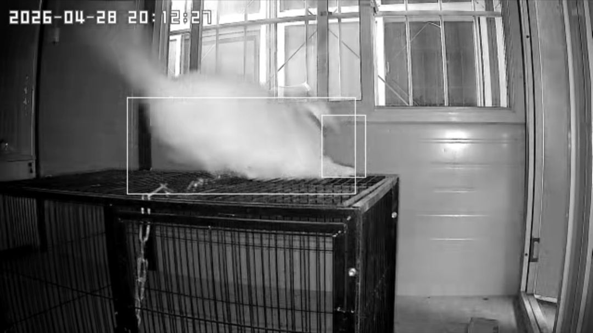 | 2591 | 2026-04-29 |
| [别愣着 快去把这鼠的音响砸了！](https://www.bilibili.com/video/BV17j96BGEoU) |  | 14.6万 | 2026-04-28 |
| [小熊猫hina 看基米说完整版](https://www.bilibili.com/video/BV11H9rBoEhY) |  | 1454 | 2026-04-28 |
| [差点让哈基米逃走](https://www.bilibili.com/video/BV1Ws9rBdEgH) | 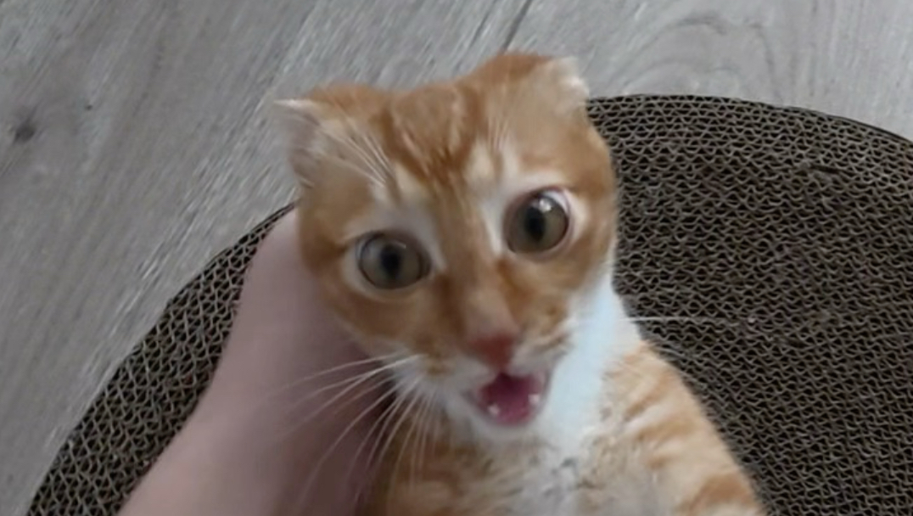 | 1.1万 | 2026-04-28 |
| [猫儿这个下猛料](https://www.bilibili.com/video/BV1sYo1B2EnU) | 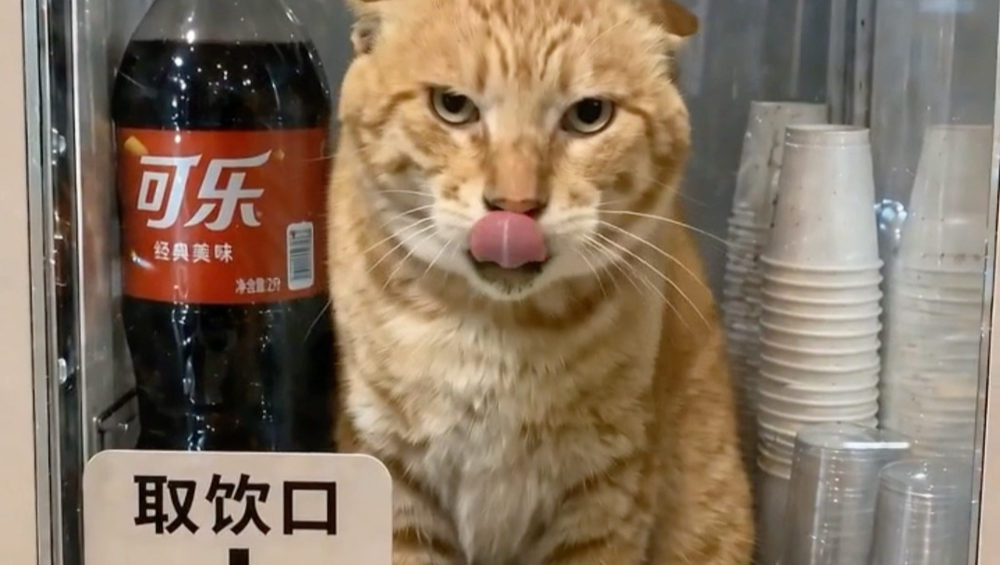 | 13.9万 | 2026-04-27 |
| [送基米。](https://www.bilibili.com/video/BV1zwoCBFEhK) | 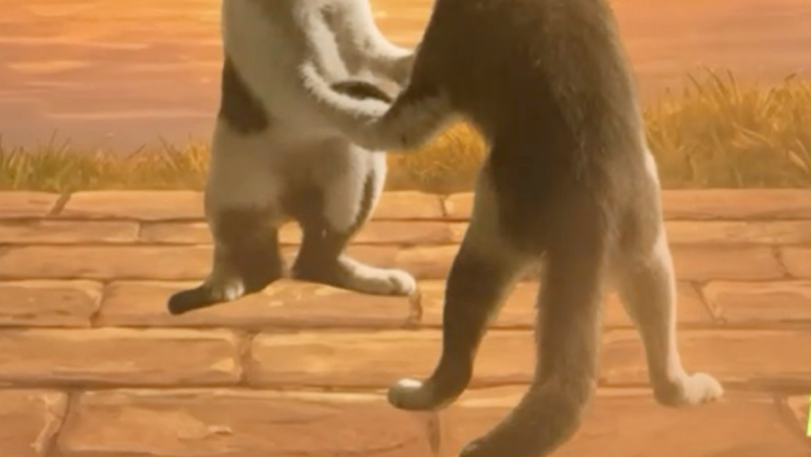 | 2.0万 | 2026-04-27 |
| [违反基米单线程定律的神哈基米](https://www.bilibili.com/video/BV14xoCBCEmS) | 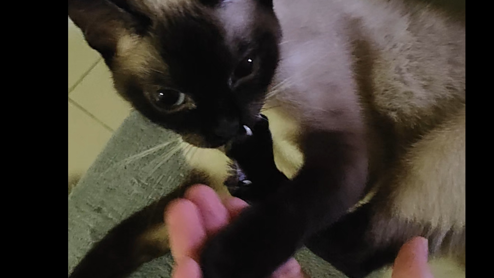 | 2551 | 2026-04-27 |
| [“ 谁 才 是 这 里 最 能 ccb 的 基 米 ？ ”](https://www.bilibili.com/video/BV15VoCBXEsH) |  | 1.9万 | 2026-04-27 |
| [【泛】大叔下播前放哈基米 治愈被海龟汤伤害的心灵](https://www.bilibili.com/video/BV1o9oeBYEgf) | 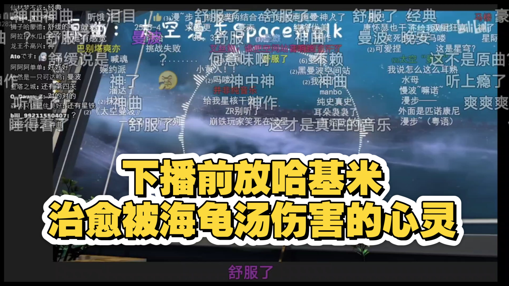 | 1.1万 | 2026-04-26 |
| [【沐霂】恬豆提出周年唱哈基米，又一选了《基米说》露米听了笑着走的👻那现在直播的露米是替身吗😰细思极恐😱](https://www.bilibili.com/video/BV1VBovBYEhF) |  | 5945 | 2026-04-26 |
| [【4月】中国在海外十大最火的相关内容（事件）&amp;ep.1](https://www.bilibili.com/video/BV1WFoiBEEg7) |  | 48.1万 | 2026-04-26 |
| [《meme岛》第五集：外奇的耄耄岛一日游Vlog](https://www.bilibili.com/video/BV13MZFBcEHY) | 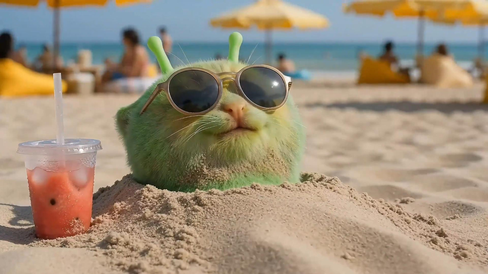 | 3177 | 2026-04-26 |
| [【新MV/日语字幕】初音未来 &amp; 崩坏：星穹铁道 3周年纪念曲 / Side Quest King (KISAI remix)](https://www.bilibili.com/video/BV1B9ofBBE3c) |  | 201.2万 | 2026-04-26 |
| [【本家投稿】处刑鼓掌 / Kasane teto](https://www.bilibili.com/video/BV1dyoDBCEWU) |  | 72.3万 | 2026-04-25 |
| [宿舍噪音哥，室友半夜不睡觉](https://www.bilibili.com/video/BV1i1dZBAEdE) | 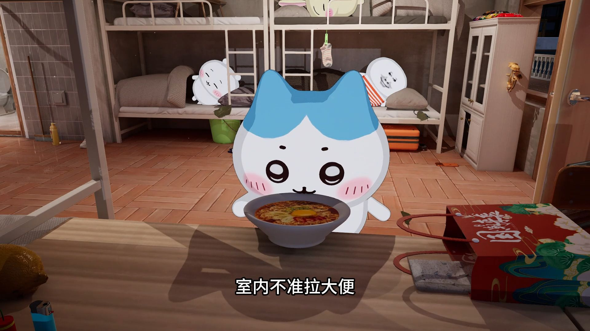 | 477.5万 | 2026-04-24 |
| [《掌上夫人》1-4    第4集在5：30](https://www.bilibili.com/video/BV1Lqo5BCEED) |  | 117.4万 | 2026-04-24 |
| [放开那个哈基咪！](https://www.bilibili.com/video/BV1i5dzBrETw) | 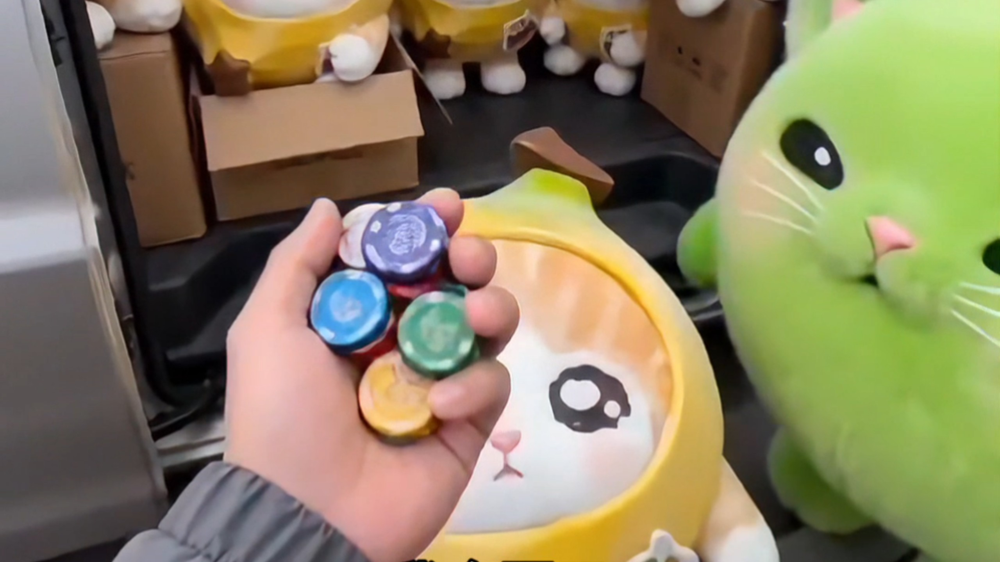 | 5.9万 | 2026-04-17 |
| [我抓了一百只哈基蜂](https://www.bilibili.com/video/BV1Ckd8BhEPW) | 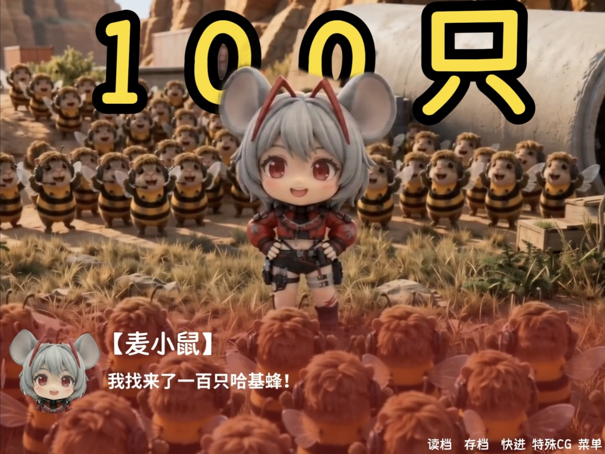 | 31.0万 | 2026-04-16 |
| [“不搜、不打、不撤”2.0](https://www.bilibili.com/video/BV1NxQbBSEAa) |  | 436.4万 | 2026-04-13 |
| [哈基米tv之水遁哈基汪](https://www.bilibili.com/video/BV18M4m117va) |  | 5.3万 | 2024-07-19 |

---
*最后更新: 2026-05-01 03:19:40 (自动生成)*
*数据来源: [Bilibili](https://www.bilibili.com)*

## 使用说明

运行以下命令更新视频列表:
```bash
python3 fetch_hajimi_videos.py
```
