# awesome-hajimi
collections of hajimi (哈基米 in Chinese) on the Internet.

## 视频列表 (Video List)

| 视频标题 (Title) | 封面 | 播放量 (Views) | 发布日期 (Date) |
|---|---|---|---|
| [“家有哈基米”｜mula](https://www.bilibili.com/video/BV14CTf6YEEK) | 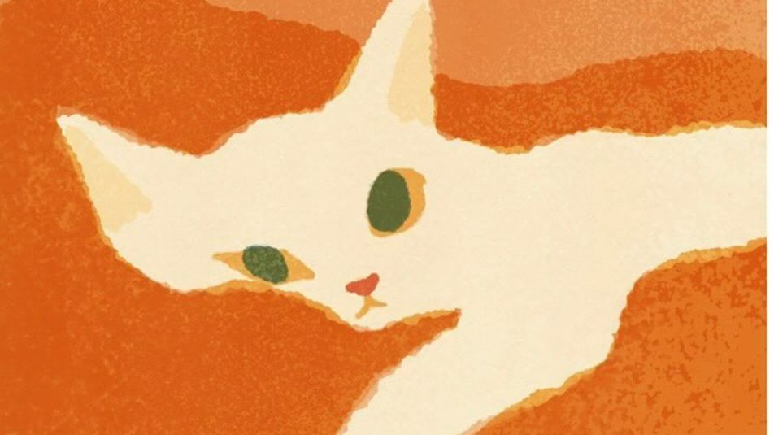 | 380 | 2026-07-04 |
| [😡🌹一生徘徊🌹走不出这相思的苦海😡🌹【Hi-Res/4K】](https://www.bilibili.com/video/BV1hfjb6VE6V) |  | 134 | 2026-07-04 |
| [欸？大狗! 50小时纯享版](https://www.bilibili.com/video/BV1ZKTE6iE81) |  | 1387 | 2026-07-04 |
| [依旧哈基米](https://www.bilibili.com/video/BV1VSTZ66EWH) | 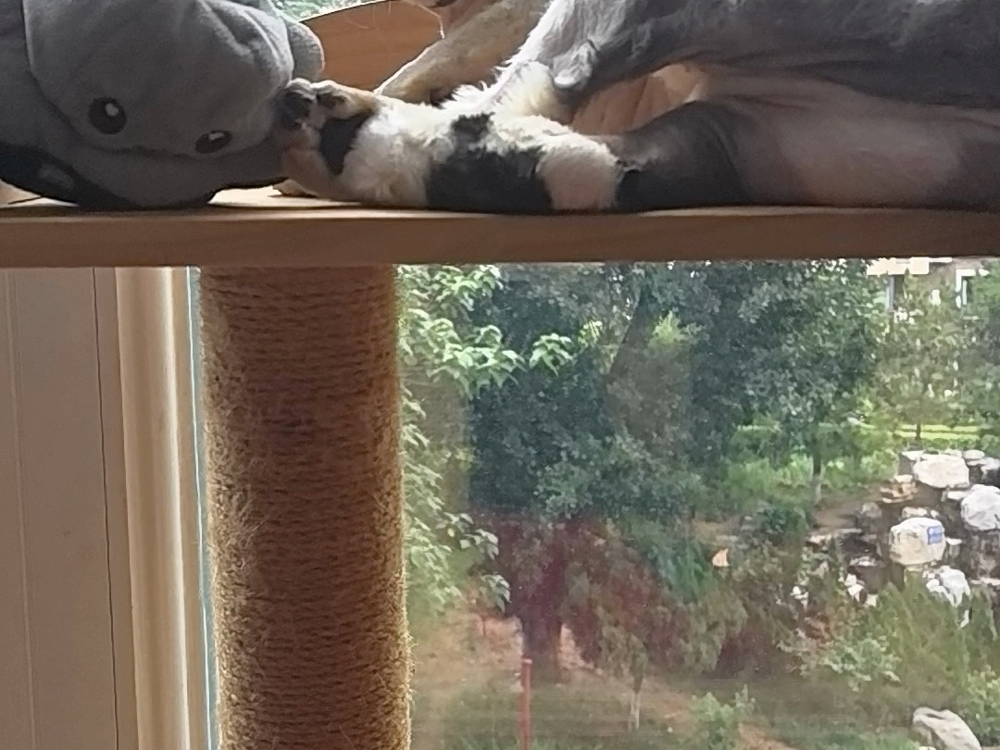 | 386 | 2026-07-04 |
| [五只猫五种怪癖，你家那位“逆子”对号入座了哪一条？](https://www.bilibili.com/video/BV1rTTn6CEw6) | 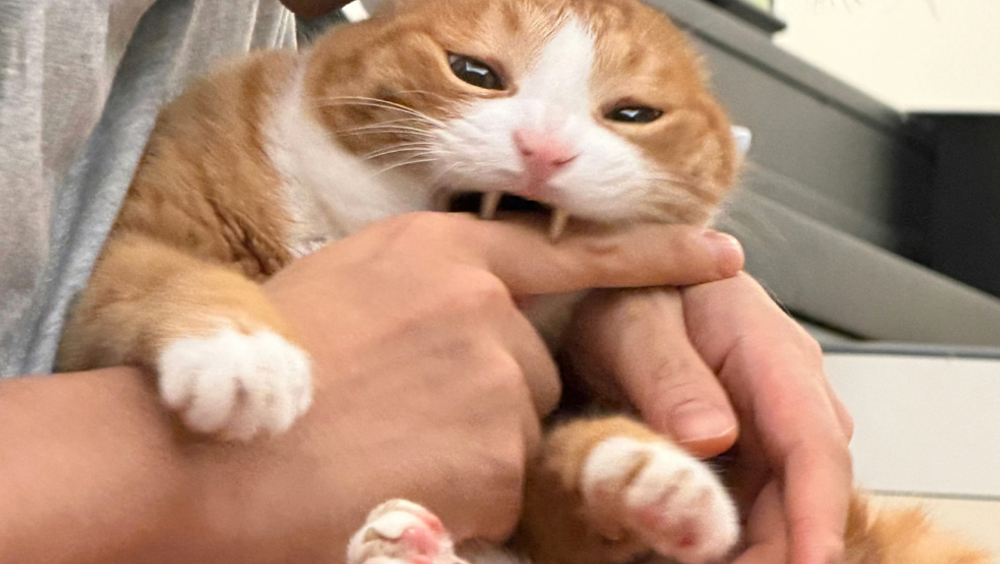 | 1.5万 | 2026-07-04 |
| [《哈基米音乐》🐱你不知道基米有多可爱~🐱（DJ0.8x）](https://www.bilibili.com/video/BV1kQTo6JEpe) |  | 84 | 2026-07-04 |
| [哈基米差点被代码杀，还好有代码优先级救](https://www.bilibili.com/video/BV1xCTf6YE2T) | 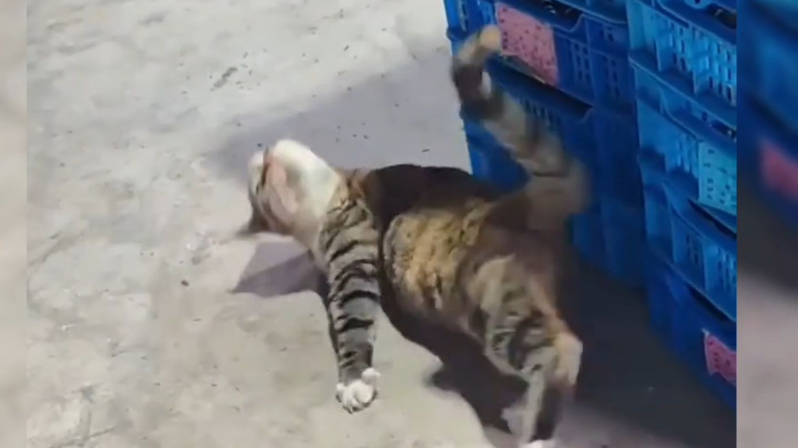 | 1521 | 2026-07-04 |
| [哈基米这个酒瘾](https://www.bilibili.com/video/BV1H9Tf6dEej) | 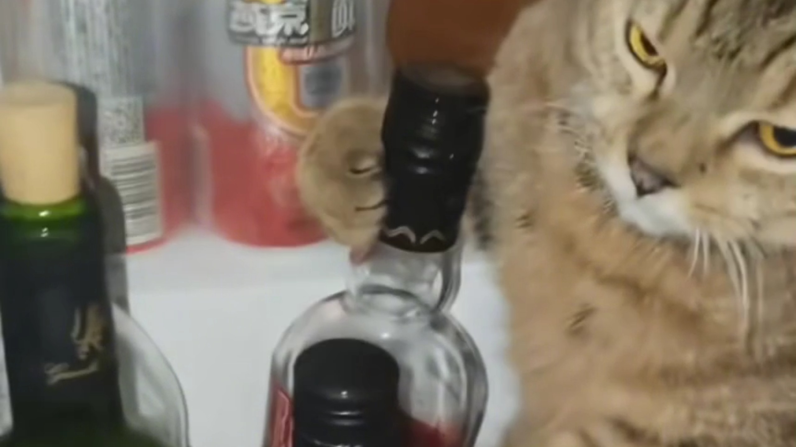 | 600 | 2026-07-03 |
| [哈基米这个大跳](https://www.bilibili.com/video/BV1H9Tf6dEG5) | 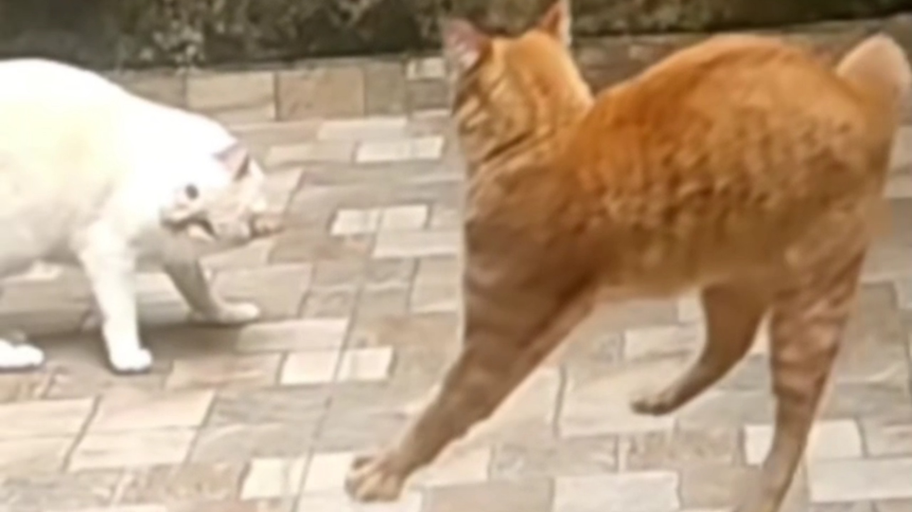 | 247 | 2026-07-03 |
| [洛茜单人无伤苦难哈基米](https://www.bilibili.com/video/BV1uJTZ6cEVa) |  | 32 | 2026-07-03 |
| [【二倍速十分鐘純享】狗叫苦行山](https://www.bilibili.com/video/BV1JxTb6eEcn) |  | 1039 | 2026-07-03 |
| [土耳其哈基米](https://www.bilibili.com/video/BV1yVTb6rEWu) |  | 452 | 2026-07-03 |
| [yuko看龟教哈基米视频 龟龟：给你吃龟血馒头吃爽了呀！](https://www.bilibili.com/video/BV181Tb6SEWD) |  | 5418 | 2026-07-03 |
| [【哈基米音乐】开心战雷 之 无敌俄联邦【新世代音乐人】](https://www.bilibili.com/video/BV15iTb6oE4k) |  | 555 | 2026-07-03 |
| [这哈基米可太哈基米了](https://www.bilibili.com/video/BV1XiTb6dEER) |  | 356 | 2026-07-03 |
| [【哈基米音乐】不灵不灵不灵？基米基米基米！🐱不米不米🐱](https://www.bilibili.com/video/BV1vvTb64E56) |  | 160 | 2026-07-03 |
| [哈基米匹配成功](https://www.bilibili.com/video/BV1QoTx6yEN6) | 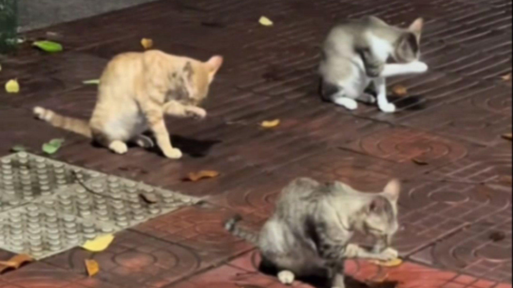 | 285 | 2026-07-03 |
| [哈基米相遇](https://www.bilibili.com/video/BV1SfTx6VEjH) | 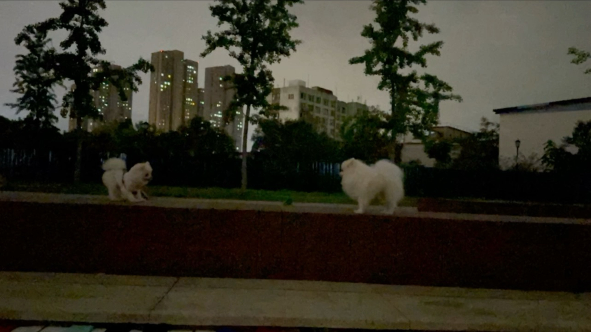 | 283 | 2026-07-03 |
| [哈基米扭麻花](https://www.bilibili.com/video/BV1yuT46iE1j) | 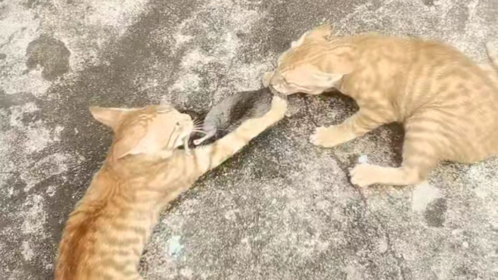 | 948 | 2026-07-03 |
| [哈基米你来真的？](https://www.bilibili.com/video/BV1y3T46NERf) |  | 871 | 2026-07-03 |
| [带我的刀盾和香蕉猫比比拉布去爬山，遇神奇生物！](https://www.bilibili.com/video/BV1vxT46REQM) |  | 52.1万 | 2026-07-03 |
| [我叔家不大聪明的哈基米](https://www.bilibili.com/video/BV1RhT46HEFh) | 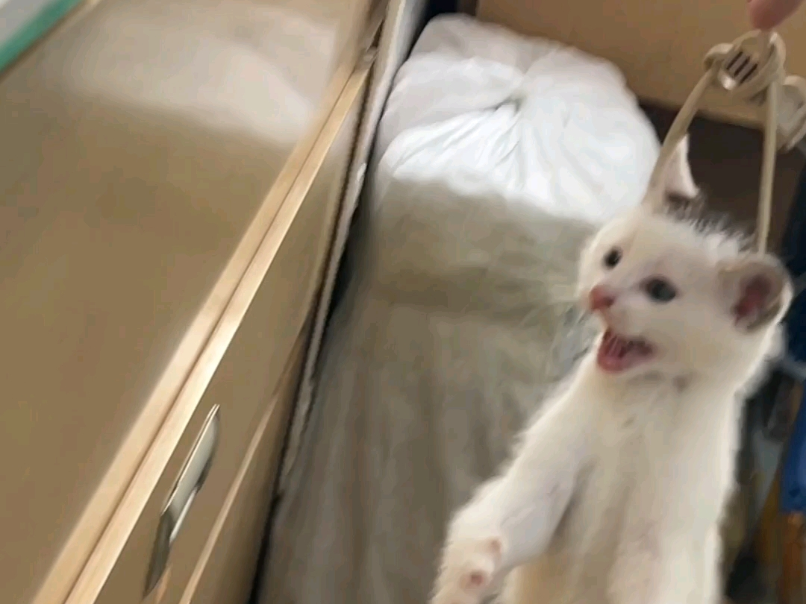 | 349 | 2026-07-03 |
| [捡回家后，咪面相都变了！](https://www.bilibili.com/video/BV1YaT46DE54) | 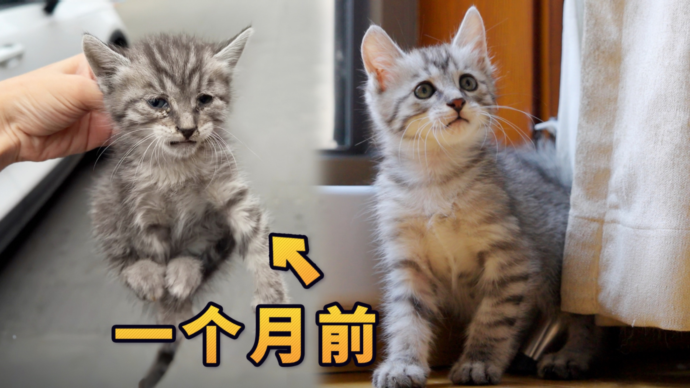 | 4.7万 | 2026-07-03 |
| [【哈基米音乐】遥远的哈](https://www.bilibili.com/video/BV1qTTt6oEXr) |  | 102 | 2026-07-03 |
| [哈基米密室](https://www.bilibili.com/video/BV1iTTt6oE1o) |  | 605 | 2026-07-03 |
| [潜行的哈基米](https://www.bilibili.com/video/BV1p9T46iEno) |  | 425 | 2026-07-03 |
| [“不是！谁把这个视频塞我手机里的？！”](https://www.bilibili.com/video/BV1nFTt6aEca) |  | 17.5万 | 2026-07-03 |
| [外出登dua郎的杰哥](https://www.bilibili.com/video/BV16FTt6aE8s) |  | 9.1万 | 2026-07-03 |
| [自制会唱歌的猫项圈，让猫能唱哈基米南北绿豆！](https://www.bilibili.com/video/BV1Y3Tx6jEHn) | 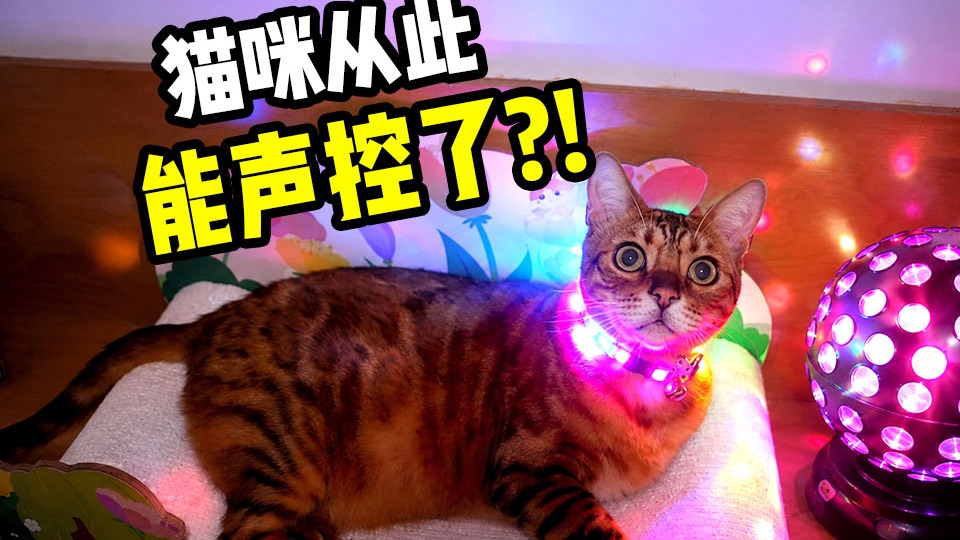 | 9872 | 2026-07-03 |
| [【哈基米】猫狗修仙传！](https://www.bilibili.com/video/BV1WBTE6yEu8) |  | 2.8万 | 2026-07-03 |
| [众神眷恋的大狗叫](https://www.bilibili.com/video/BV1mcTs6PEx6) |  | 6.5万 | 2026-07-03 |
| [全网最痛的哈基米音乐](https://www.bilibili.com/video/BV1CTTs6FEGm) |  | 398 | 2026-07-03 |
| [【TOP1】潜行吧，哈基米！本家VS调教#1](https://www.bilibili.com/video/BV198Ts65EcG) |  | 389 | 2026-07-03 |
| [【东方哈基米】🐱红楼🐱](https://www.bilibili.com/video/BV1BfTs6sEY9) |  | 218 | 2026-07-03 |
| [【最终版】像大狗一样叫呐](https://www.bilibili.com/video/BV1pSTs6hEYu) |  | 13.9万 | 2026-07-03 |
| [⚡21世纪最伟大的大狗叫⚡](https://www.bilibili.com/video/BV1mWTx6ME8q) |  | 7478 | 2026-07-03 |
| [给你们显摆一下俺滴哈基米～](https://www.bilibili.com/video/BV1wYTx6wEKK) | 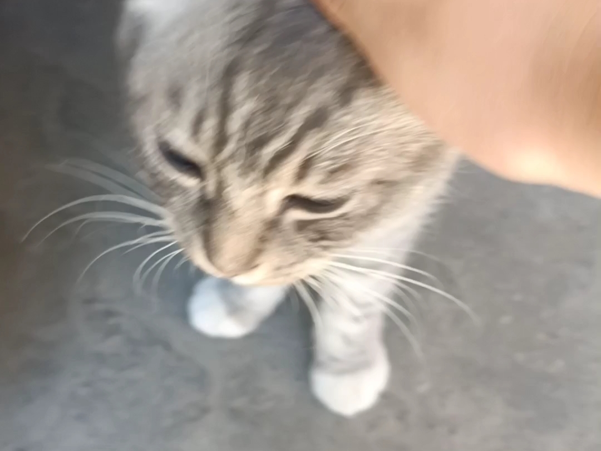 | 179 | 2026-07-03 |
| [papi酱最新单曲《OH MY GOD》，纯享MV金豹大碟正式发售，空降Billboard，Oricon榜单第一☝🏻](https://www.bilibili.com/video/BV1xBTp6cE9f) |  | 3.0万 | 2026-07-03 |
| [4.3的小朋友你们好啊，听说你的装甲很硬？](https://www.bilibili.com/video/BV16gTp6JEfY) |  | 2.3万 | 2026-07-03 |
| [优秀的防沉迷机制！](https://www.bilibili.com/video/BV1JQTp6HEso) | 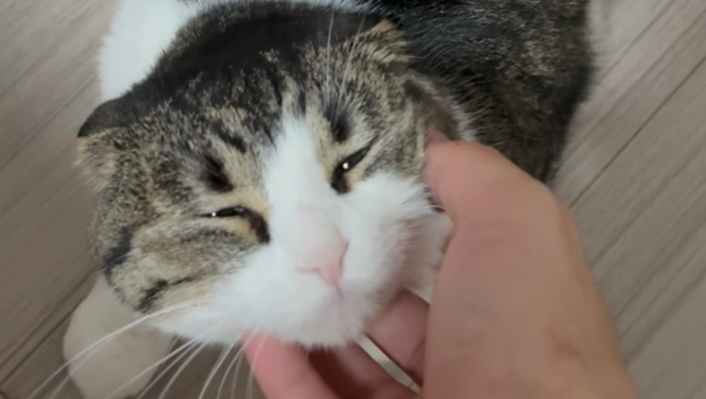 | 3.5万 | 2026-07-03 |
| [奶奶的哈基米南北绿豆](https://www.bilibili.com/video/BV1XSTW6rE2n) |  | 633 | 2026-07-03 |
| [史上最速吟唱的老吴，你吴不过我你信么](https://www.bilibili.com/video/BV1ZzTW6EERz) | 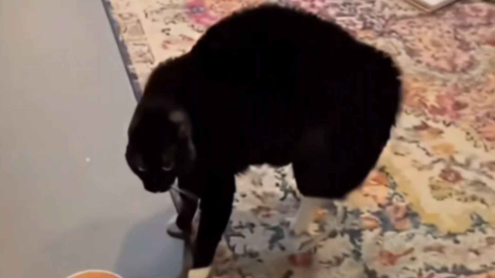 | 17.3万 | 2026-07-03 |
| [救上一只落水的哈基米](https://www.bilibili.com/video/BV1eFTH6ME1S) |  | 1006 | 2026-07-02 |
| [满月双胞胎哈气小老虎 哈基米](https://www.bilibili.com/video/BV1EQTn6CEpy) | 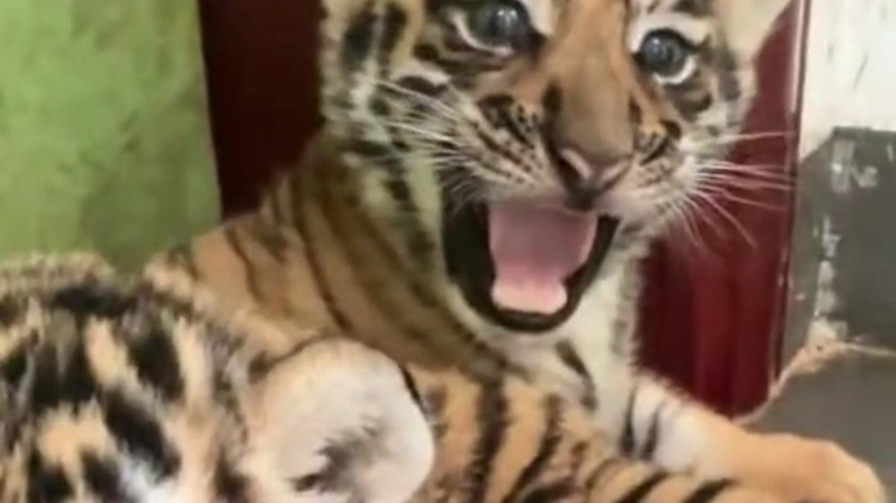 | 679 | 2026-07-02 |
| [《露营TV》带你“沉浸”式露营](https://www.bilibili.com/video/BV1oMTE6NECS) |  | 27.3万 | 2026-07-02 |
| [莫欺少年喵（库存视频）](https://www.bilibili.com/video/BV119T76yET2) | 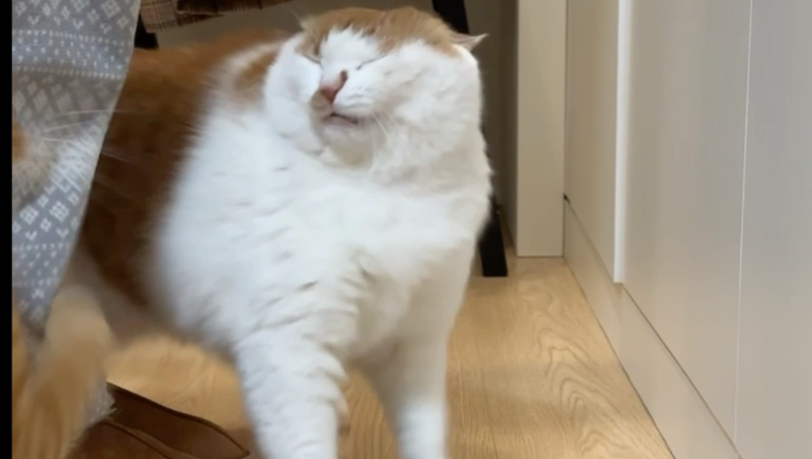 | 15.0万 | 2026-07-02 |
| [自卑（×）老吴？（✓）](https://www.bilibili.com/video/BV1kFTE66EvJ) | 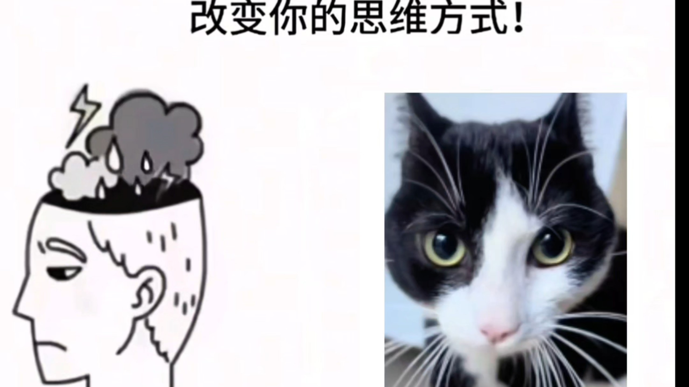 | 8.7万 | 2026-07-02 |
| [今天我们要学的成语是——就地取材](https://www.bilibili.com/video/BV19ETE6tEtu) | 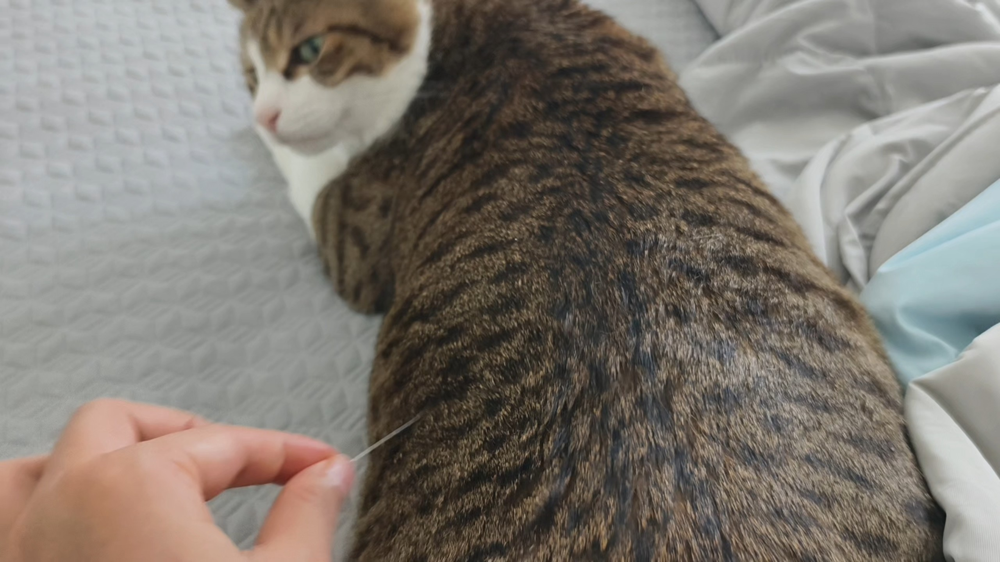 | 4.0万 | 2026-07-02 |
| [运动量超标的一天！！](https://www.bilibili.com/video/BV1LXTE6NE2C) | 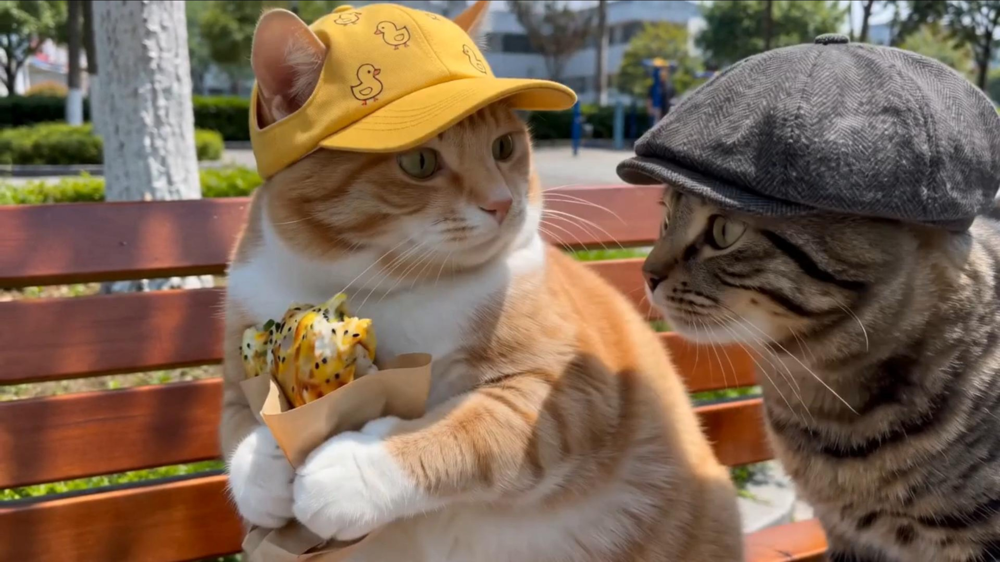 | 3.7万 | 2026-07-02 |
| [可爱哈基米夫](https://www.bilibili.com/video/BV1ZNTj6bEX7) |  | 1.5万 | 2026-07-02 |
| [人已急哭](https://www.bilibili.com/video/BV1X5Tj6pEgk) | 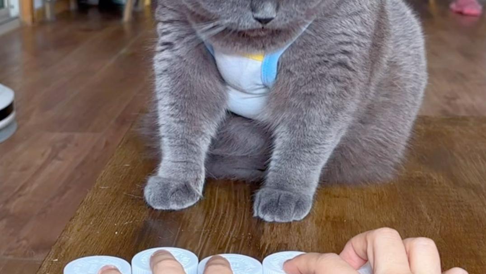 | 6.6万 | 2026-07-02 |
| [666舔毛触发底层代码了](https://www.bilibili.com/video/BV1qSTj6bENJ) | 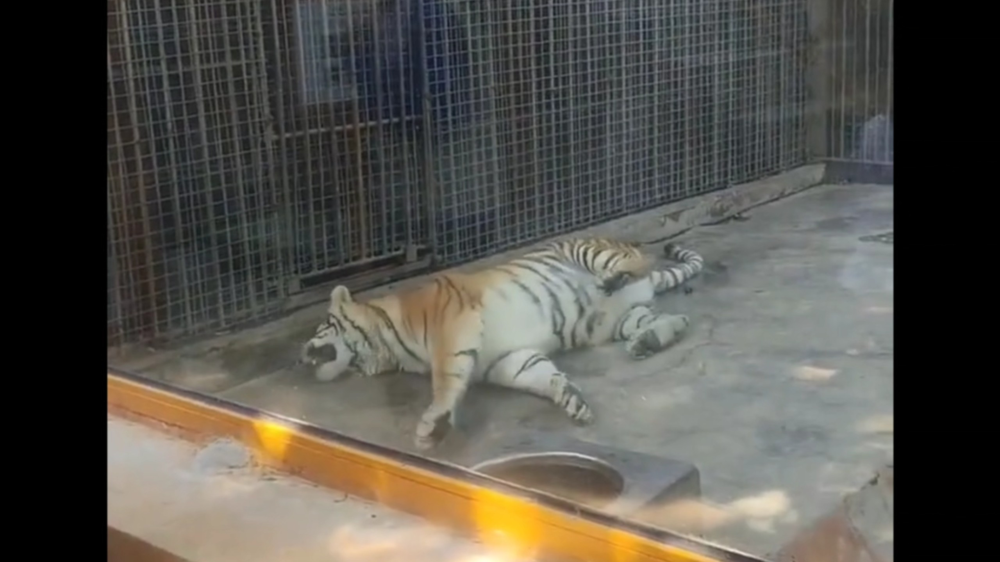 | 3.4万 | 2026-07-02 |
| [【异环】伊波恩往事只能哈基](https://www.bilibili.com/video/BV1idTr6aE2b) |  | 5.6万 | 2026-07-02 |
| [正在修补轮胎的哈基米](https://www.bilibili.com/video/BV1AWTk6VEno) | 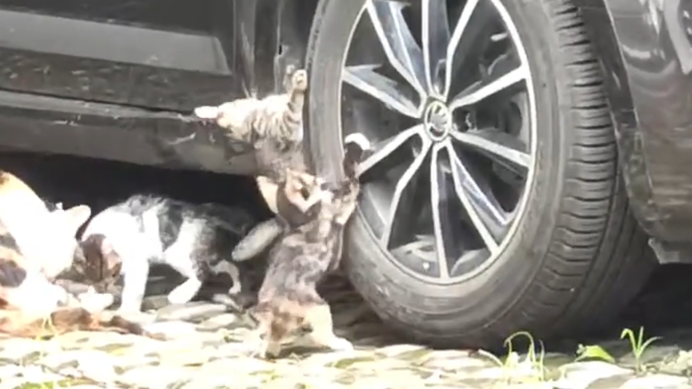 | 5522 | 2026-07-02 |
| [哈基米这个小心翼翼](https://www.bilibili.com/video/BV1nnT66iEiN) | 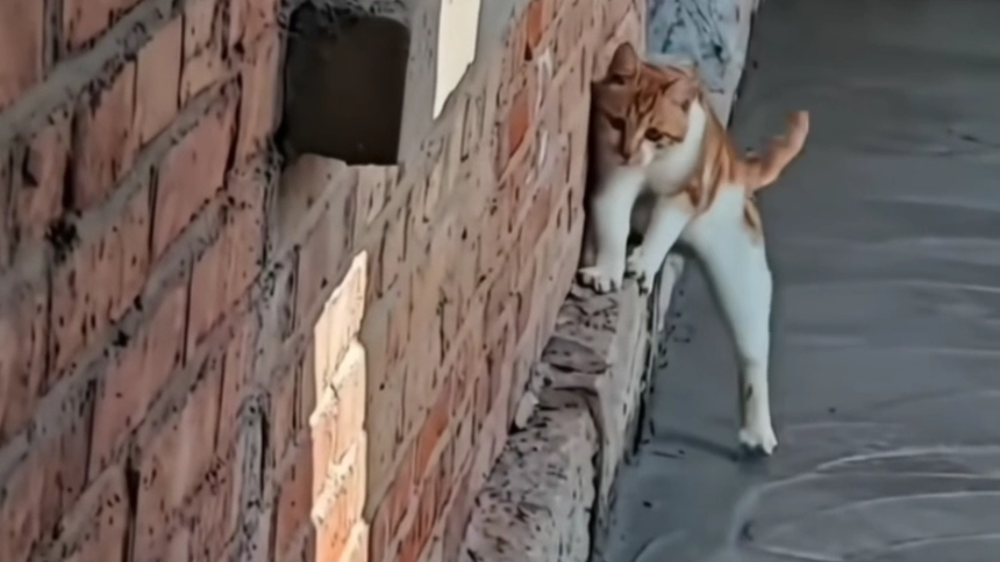 | 3.8万 | 2026-07-02 |
| [循环歌单｜【Fever Pitch】｜“【骗你の小曲】”](https://www.bilibili.com/video/BV1FNTr6iEEY) |  | 58.7万 | 2026-07-02 |
| [天 津 鼠 鼠 的 秘 密 ②](https://www.bilibili.com/video/BV1DVTq6CEDt) | 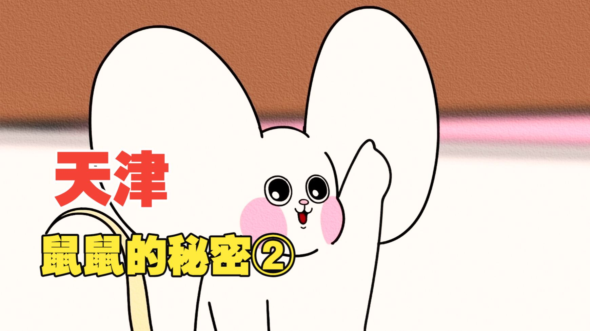 | 12.2万 | 2026-07-01 |
| [哈基米抹南北绿豆～（非静止画面）](https://www.bilibili.com/video/BV16zTz6eEm4) | 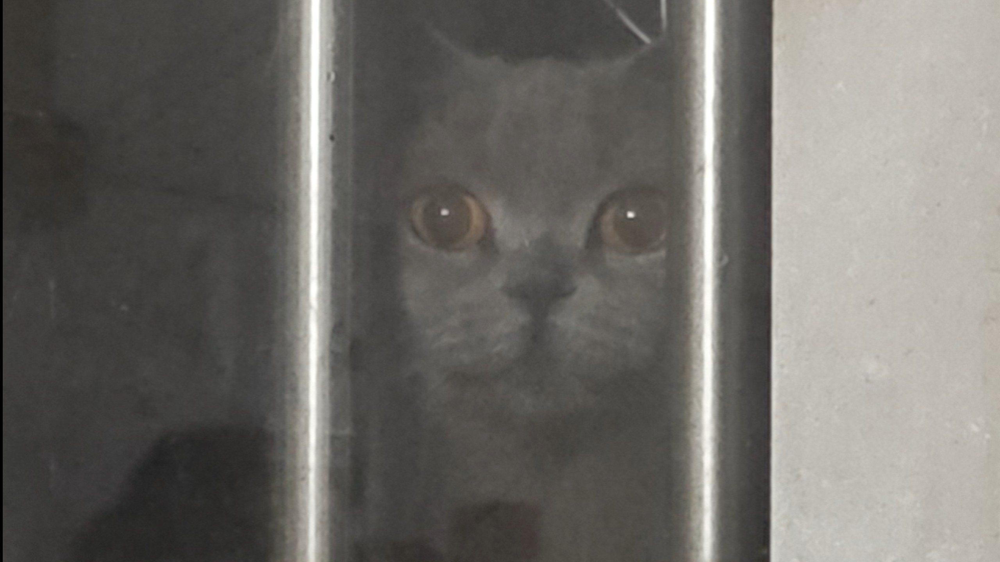 | 27 | 2026-07-01 |
| [基米的快乐周末~](https://www.bilibili.com/video/BV1LxTi62EzH) |  | 91 | 2026-07-01 |
| [？？？](https://www.bilibili.com/video/BV1mpTq6qEkh) | 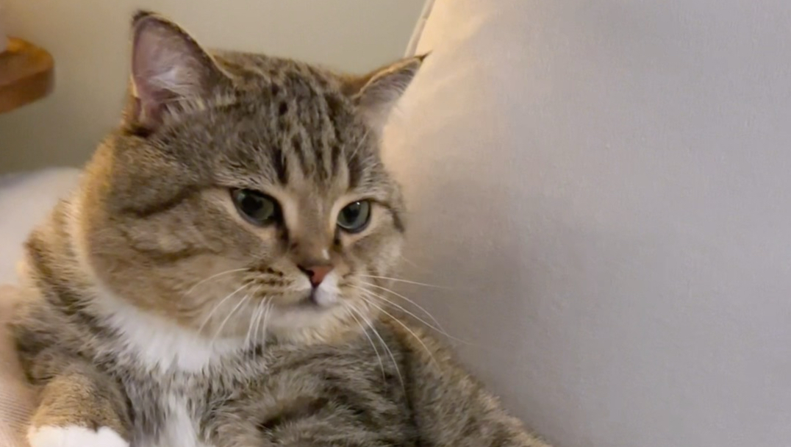 | 32.6万 | 2026-07-01 |
| [哈基米南北绿豆](https://www.bilibili.com/video/BV1YQTq6mENT) | 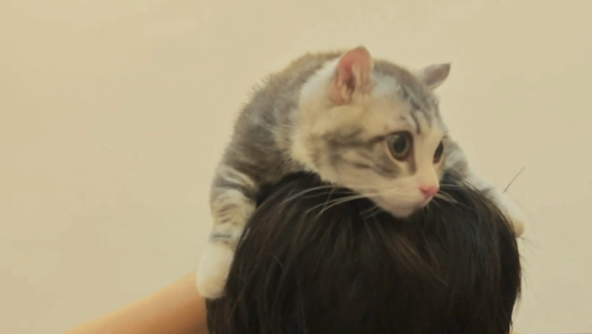 | 186 | 2026-07-01 |
| [典狱长进行曲（哈基米）](https://www.bilibili.com/video/BV1BrTq6sEXW) |  | 187 | 2026-07-01 |
| [当我在小猫哈气时唱哈基米歌...](https://www.bilibili.com/video/BV1nzTq6oETY) | 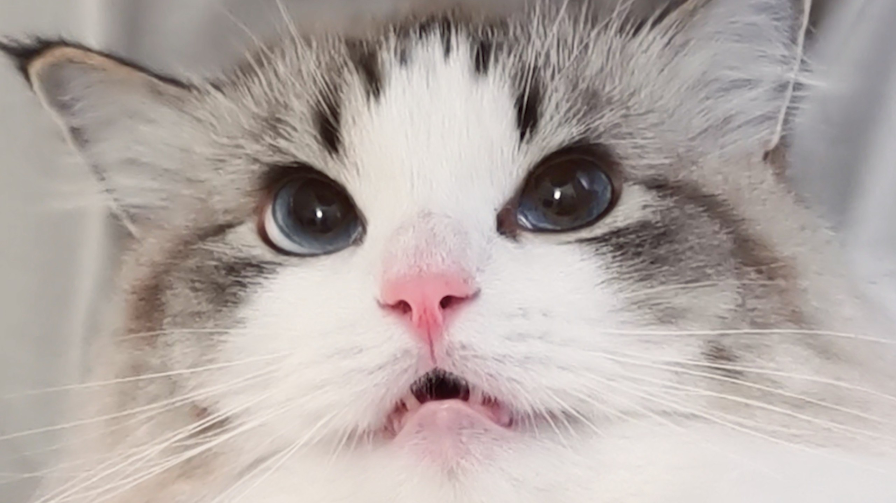 | 1.3万 | 2026-07-01 |
| [小猫咪就这样凑凑的叫](https://www.bilibili.com/video/BV1vUTq6SEbJ) | 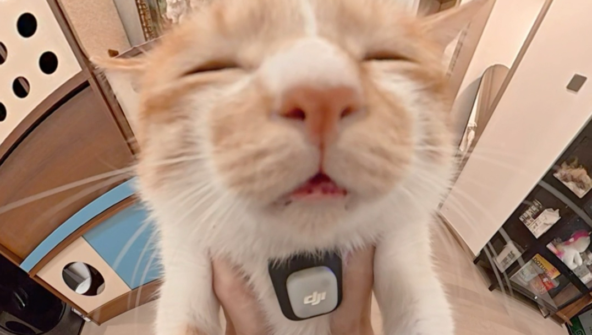 | 20.4万 | 2026-07-01 |
| [大狗：Your phone 叮咚！【叮咚鸡】](https://www.bilibili.com/video/BV1m7Tv6AEsn) |  | 4.1万 | 2026-07-01 |
| [探访女博主的家 竟然翻出了...](https://www.bilibili.com/video/BV1MLTY6oEE9) |  | 69.2万 | 2026-07-01 |
| [大狗叫在场，基米不敢对老吴放肆](https://www.bilibili.com/video/BV1qETe6CECp) | 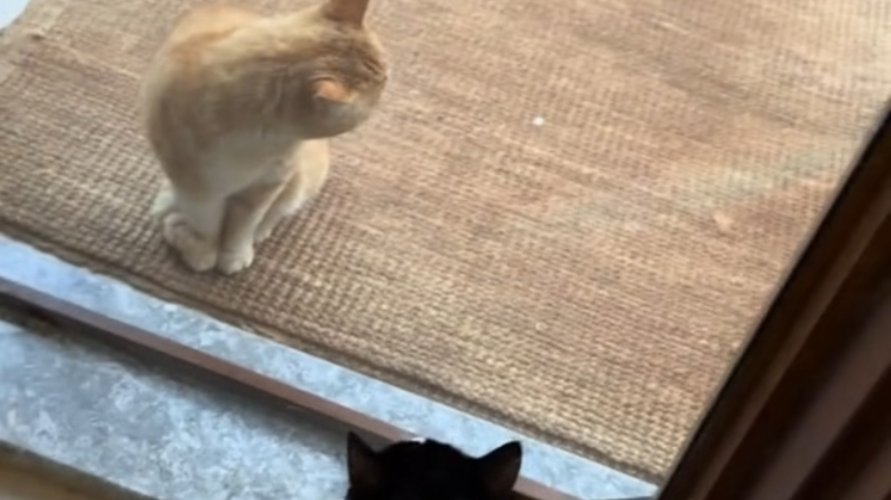 | 1.7万 | 2026-07-01 |
| [《猞猁，又称山中哈基米》](https://www.bilibili.com/video/BV1odTa6zExk) | 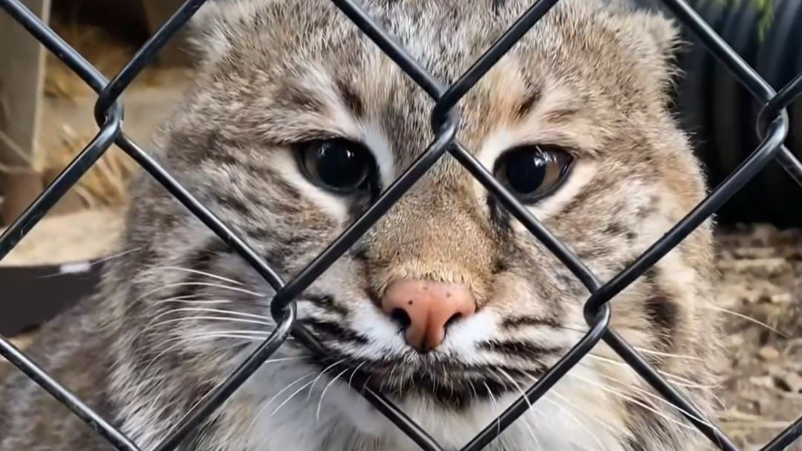 | 2223 | 2026-07-01 |
| [走错了，会哈气的坐那边](https://www.bilibili.com/video/BV175Ta6BEex) | 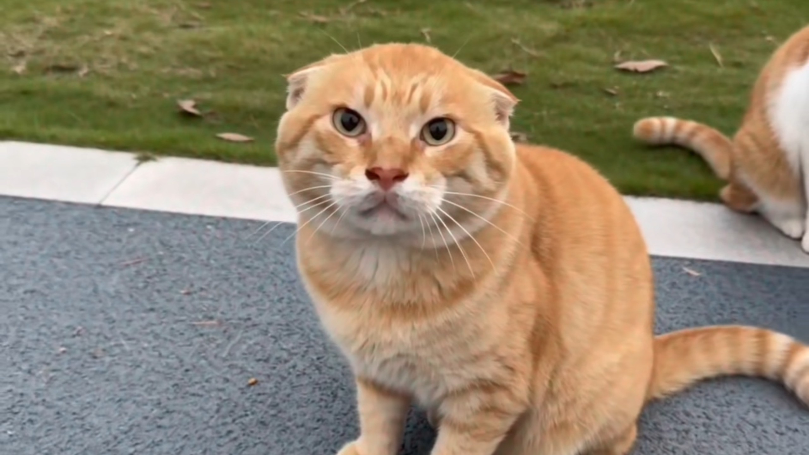 | 13.2万 | 2026-07-01 |
| [铁齿铜牙哈基米敲击钢管三分钟](https://www.bilibili.com/video/BV1sZTh6JEV3) | 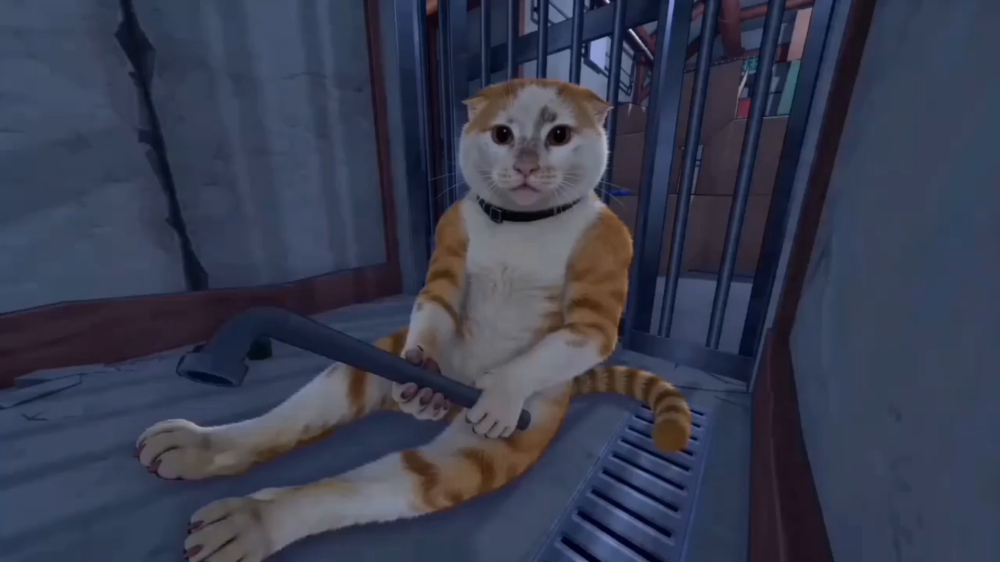 | 1763 | 2026-07-01 |
| [【基米TV】吼吼还有自学中医爱猫（补）](https://www.bilibili.com/video/BV1rsKf6QEZP) | 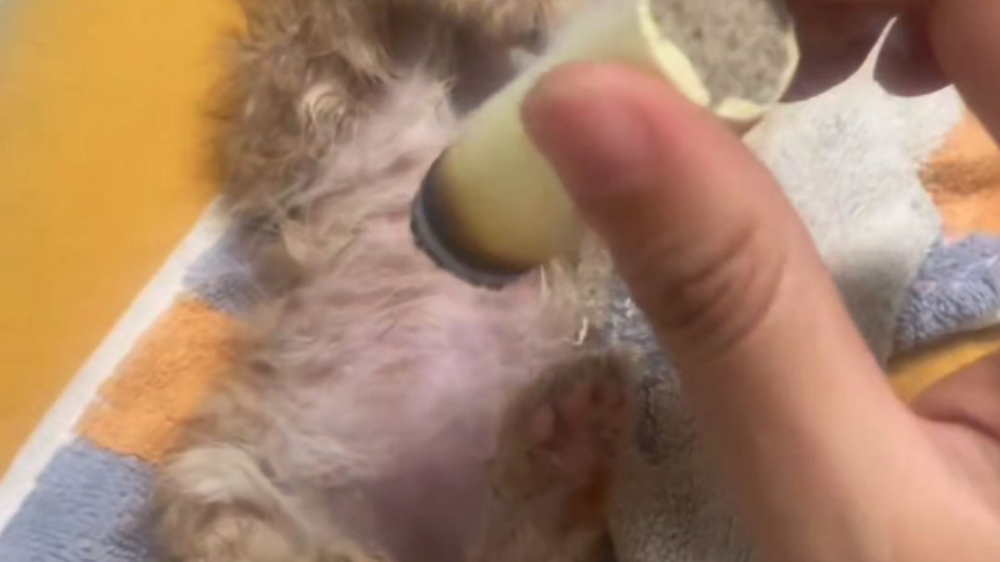 | 1.5万 | 2026-06-30 |
| [哈基米小黑~](https://www.bilibili.com/video/BV12KKR6EEsT) | 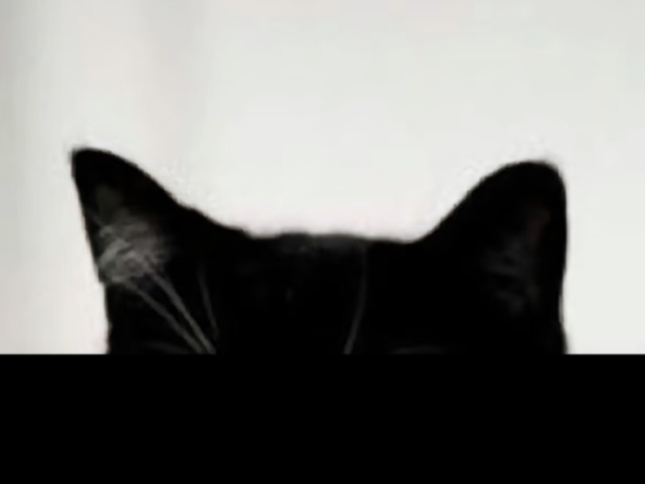 | 97 | 2026-06-29 |
| [哈基米被赛博坦星人攻击](https://www.bilibili.com/video/BV1BAK96aEzm) |  | 4524 | 2026-06-29 |
| [老吴老吴！！](https://www.bilibili.com/video/BV1z7KD6sEAB) | 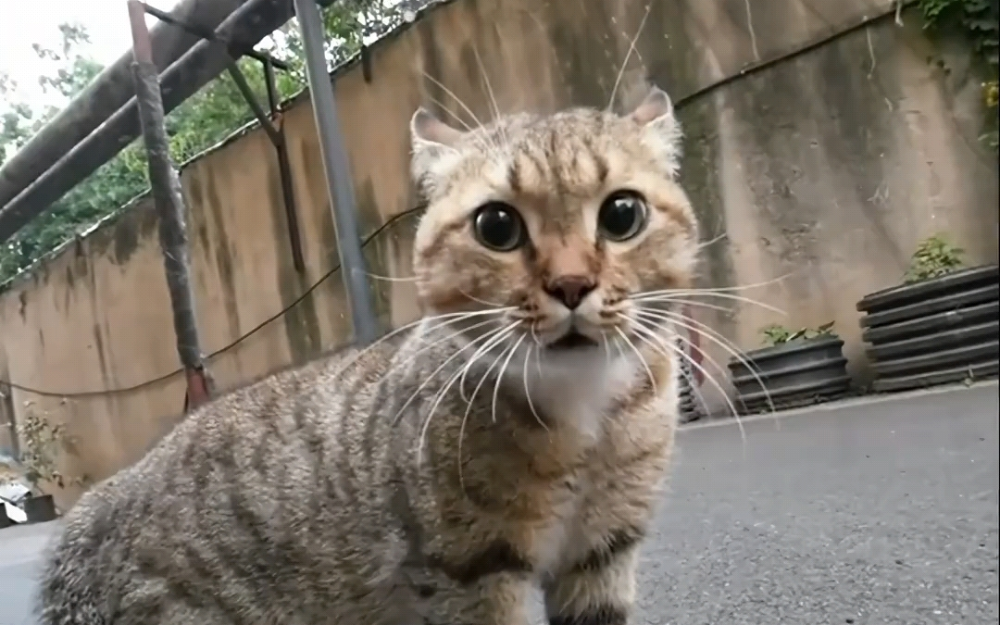 | 3.3万 | 2026-06-29 |
| [哈基米音乐预告](https://www.bilibili.com/video/BV1zQKU6WEEf) |  | 185 | 2026-06-29 |
| [往事只能哈基米](https://www.bilibili.com/video/BV1g4Tu6wEHx) |  | 261 | 2026-06-28 |
| [能拯救你自己的，从来都只有你自己](https://www.bilibili.com/video/BV1zzTN6iEhD) |  | 13.2万 | 2026-06-28 |
| [“当00后老了be like.”｜《Luvsic dj》循环歌单](https://www.bilibili.com/video/BV1op7p6qEo4) |  | 190.3万 | 2026-06-28 |
| [夸父追日](https://www.bilibili.com/video/BV18BTP6EEUw) | 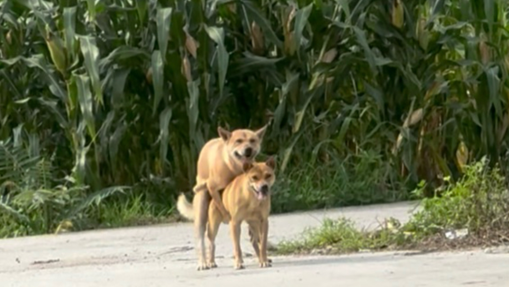 | 1.8万 | 2026-06-28 |
| [小众宝藏游戏《GOOOOOOAL!》神人中配纯享](https://www.bilibili.com/video/BV17y756nESJ) |  | 6.9万 | 2026-06-26 |
| [“依旧歪头老吴”](https://www.bilibili.com/video/BV1AV7V6XEN2) | 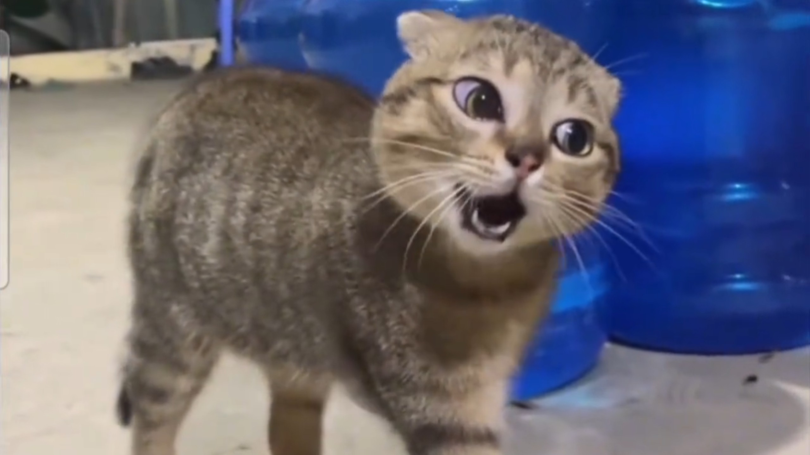 | 5.5万 | 2026-06-26 |
| [这才是《NIGHT DANCER》原版MV！](https://www.bilibili.com/video/BV1Rc7h69EMU) |  | 14.2万 | 2026-06-25 |
| [脚坑里喷涌而出的巨大牙膏泡沫，巨型百事可乐、芬达、可口可乐与曼妥思的对决](https://www.bilibili.com/video/BV1ET7N6RExo) |  | 24.4万 | 2026-06-24 |
| [太逆天了！韩国女团12人被塞了电动玩具表演…](https://www.bilibili.com/video/BV1GFj16ZEEi) |  | 16.1万 | 2026-06-24 |
| [哈基米这个一脸谄媚，又贱又可爱的表情](https://www.bilibili.com/video/BV1AY7A6FEJV) | 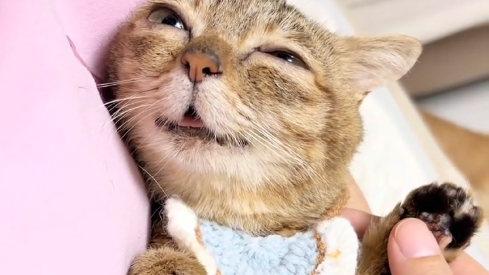 | 1.8万 | 2026-06-22 |
| [哈基米这是什么声音？](https://www.bilibili.com/video/BV1KRje6HEqv) | 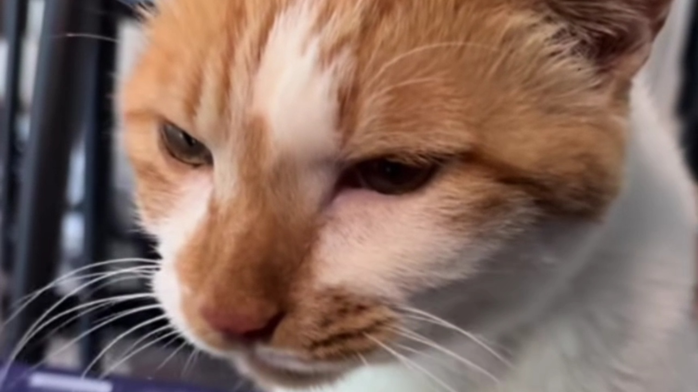 | 6812 | 2026-06-19 |
| [真香](https://www.bilibili.com/video/BV1gYjA6KEAj) | 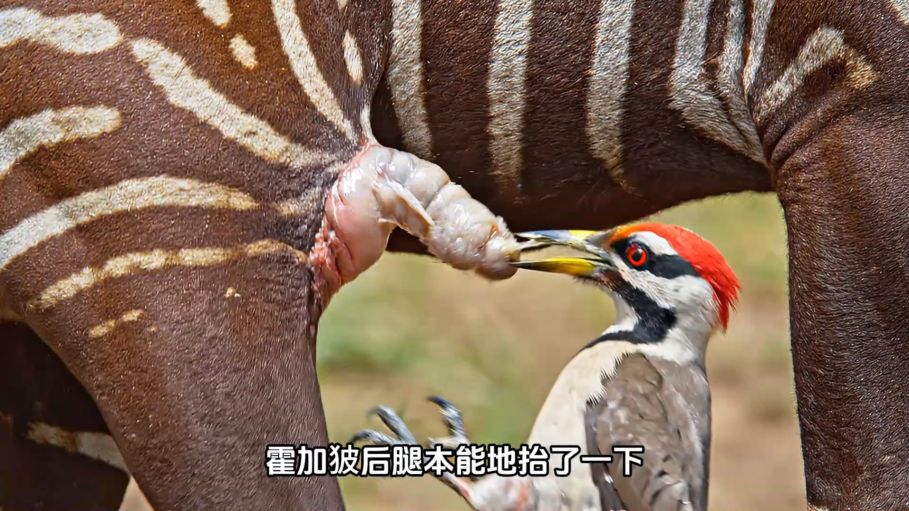 | 13.2万 | 2026-06-18 |
| [🐱神 奇 曼 波 马 戏 团 🐱](https://www.bilibili.com/video/BV1F2Ee6yEA6) |  | 7722 | 2026-06-13 |
| [欸？老吴！](https://www.bilibili.com/video/BV1DeEQ61EwN) | 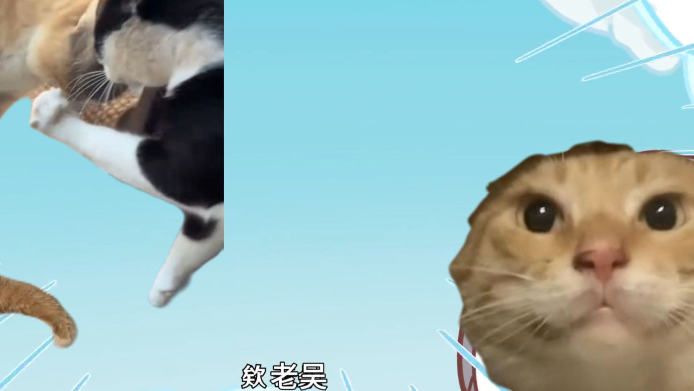 | 34.9万 | 2026-06-10 |
| [哈基米合集](https://www.bilibili.com/video/BV14Y3izdEih) |  | 9882 | 2025-07-06 |
| [嗨基米](https://www.bilibili.com/video/BV1ytM3zGEGX) |  | 3355 | 2025-06-10 |
| [哈基米](https://www.bilibili.com/video/BV1MzXxYoETc) | 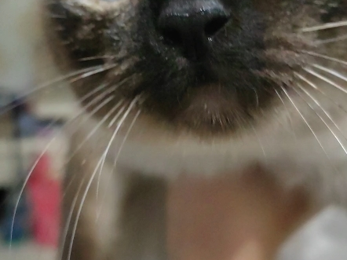 | 3966 | 2025-03-22 |
| [猫：哈基人](https://www.bilibili.com/video/BV1GVfoYqEKV) | 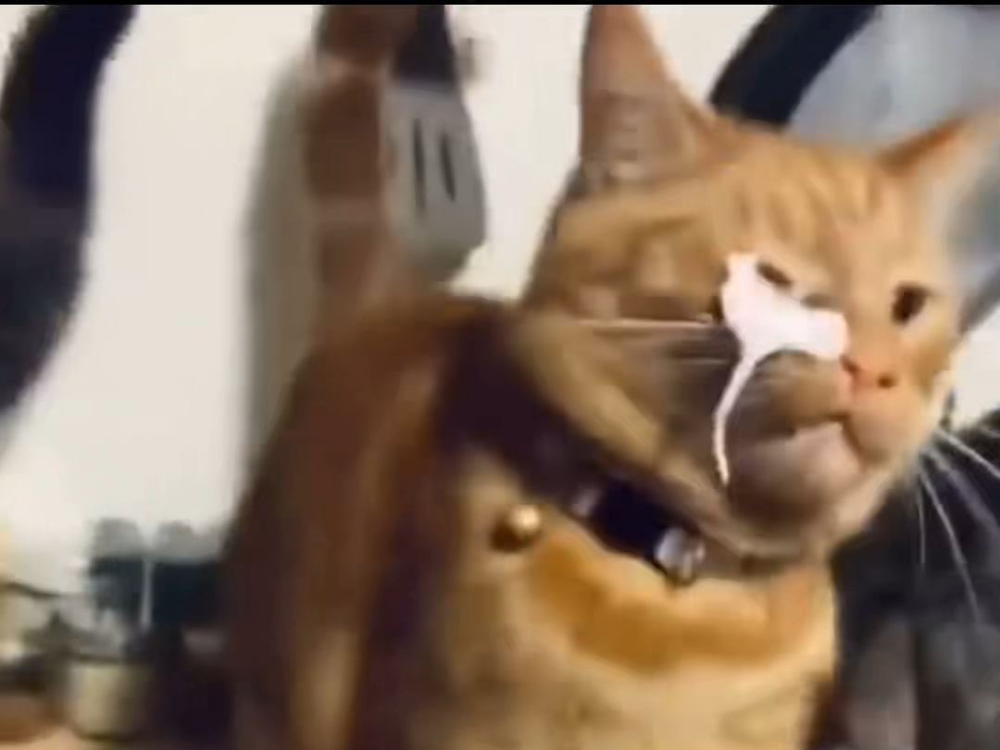 | 1.8万 | 2025-01-25 |
| [好大一只哈基米](https://www.bilibili.com/video/BV1WwqfYTE1Y) | 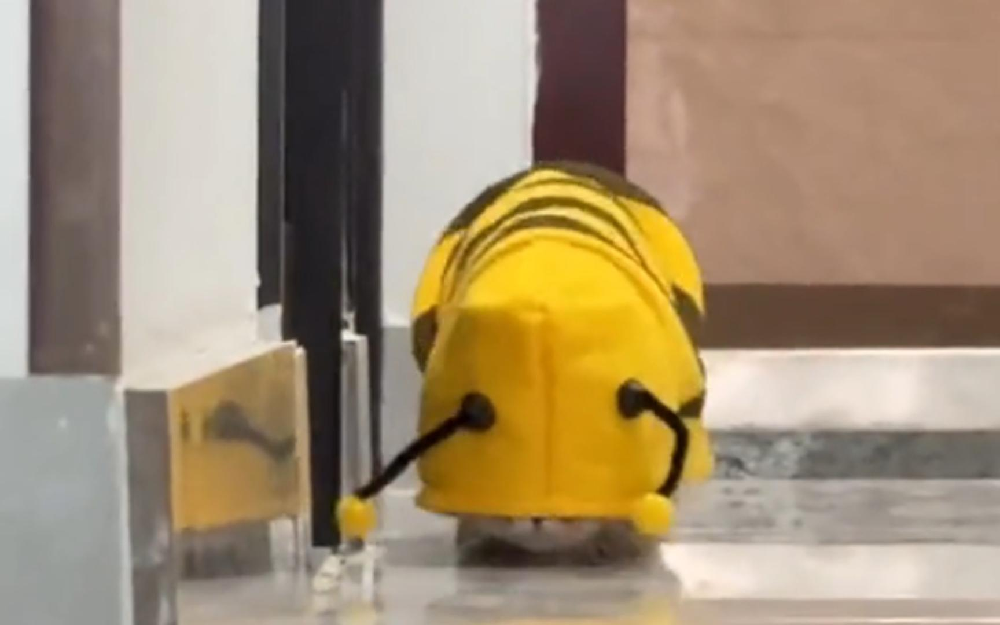 | 4.8万 | 2024-12-15 |
| [*你会学哈基米叫吗？](https://www.bilibili.com/video/BV1ufmTYYEWy) | 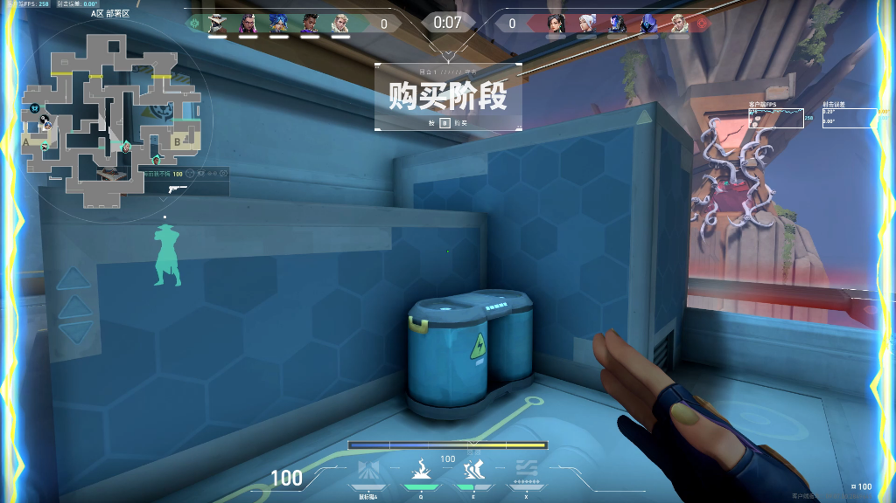 | 6.2万 | 2024-10-16 |
| [哈基米：天国和地狱（康康舞曲）](https://www.bilibili.com/video/BV1WZWjerERR) | 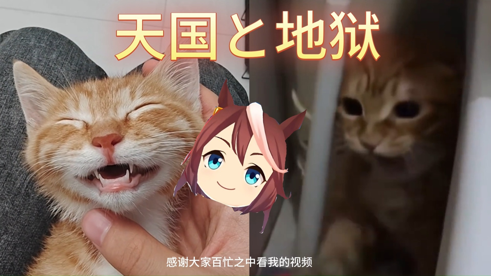 | 10.1万 | 2024-08-23 |
| [哈基米哈基米！](https://www.bilibili.com/video/BV1Qg4y1R7PP) |  | 5604 | 2023-11-06 |
| [哈基米哈基米！](https://www.bilibili.com/video/BV1j14y1Q7cw) | 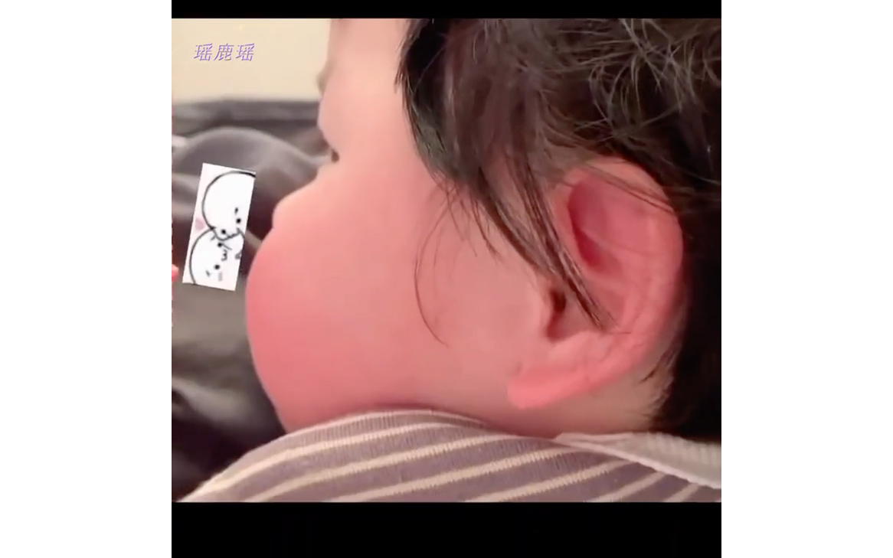 | 3219 | 2023-06-09 |
| [哈基米哈基米哈基米](https://www.bilibili.com/video/BV1Rj411c7Ky) | 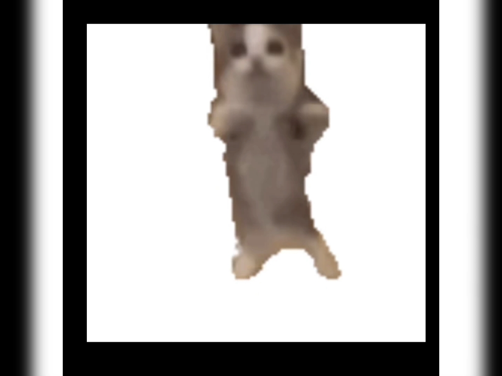 | 8246 | 2023-04-11 |

---
*最后更新: 2026-07-04 05:55:47 (自动生成)*
*数据来源: [Bilibili](https://www.bilibili.com)*

## 使用说明

运行以下命令更新视频列表:
```bash
python3 fetch_hajimi_videos.py
```
