# awesome-hajimi
collections of hajimi (哈基米 in Chinese) on the Internet.

## 视频列表 (Video List)

| 视频标题 (Title) | 封面 | 播放量 (Views) | 发布日期 (Date) |
|---|---|---|---|
| [哈基米这个不爱洗澡](https://www.bilibili.com/video/BV1MhQxBUEaM) | 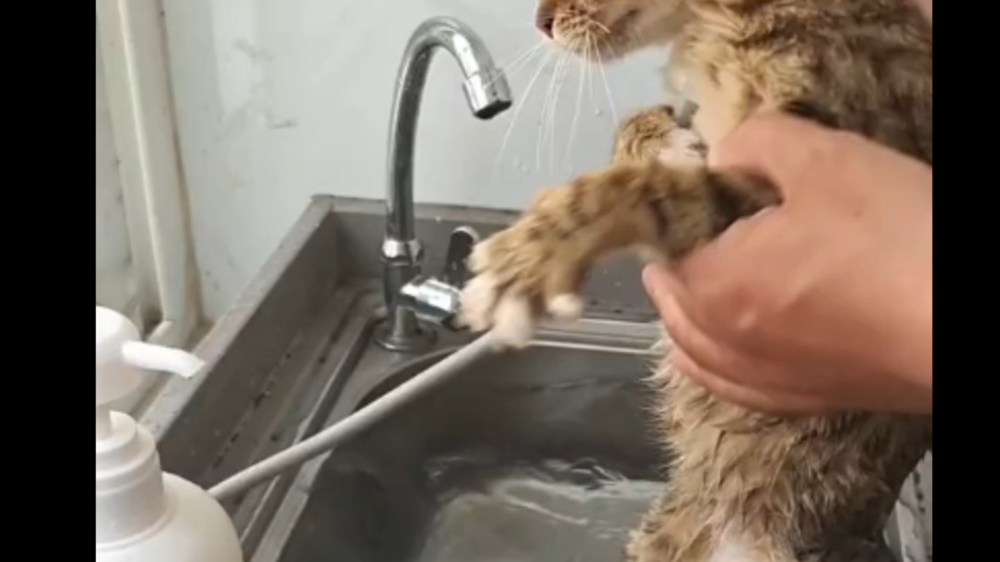 | 402 | 2026-04-13 |
| [哈基米](https://www.bilibili.com/video/BV1xiQxBLErV) | 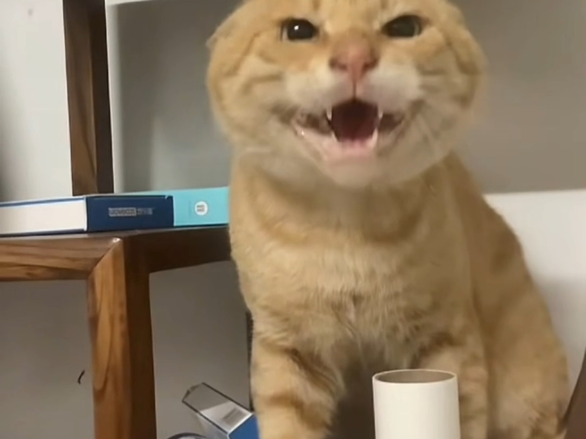 | 0 | 2026-04-13 |
| [狂飙名场面:哈基米倾情演绎](https://www.bilibili.com/video/BV1UyQpBGESU) |  | 3 | 2026-04-13 |
| [《动物迷惑行为大赏302》](https://www.bilibili.com/video/BV1nMD9B5ECY) |  | 2.9万 | 2026-04-13 |
| [哈基米不要再打架了，来上点药吧](https://www.bilibili.com/video/BV1vVQWBpEJj) | 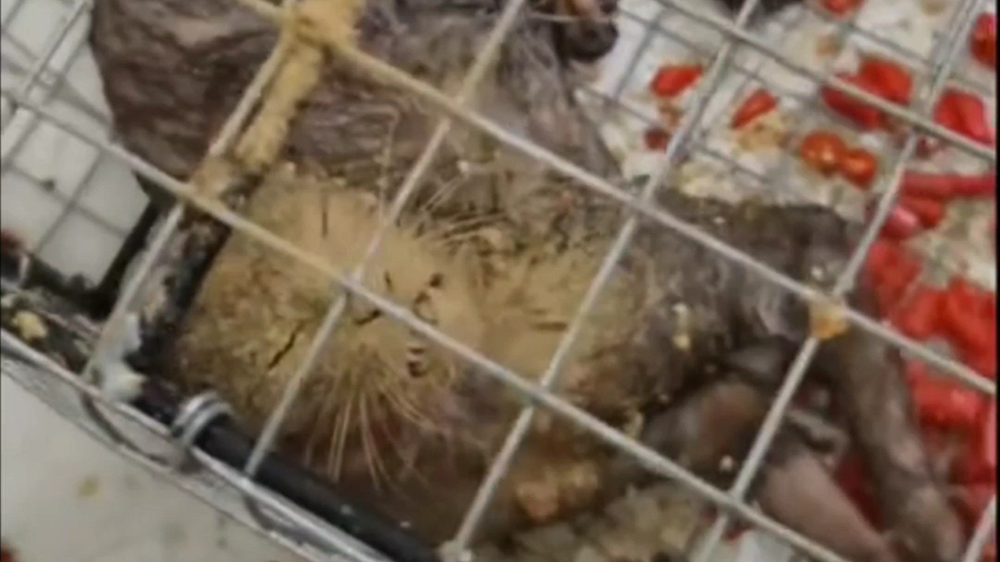 | 38 | 2026-04-12 |
| [【哈基米和DXF】哈气歼灭战！](https://www.bilibili.com/video/BV1rAQWBFExz) |  | 52 | 2026-04-12 |
| [关于我买了个哈基米版关灯神器](https://www.bilibili.com/video/BV1EvDRB1ELo) | 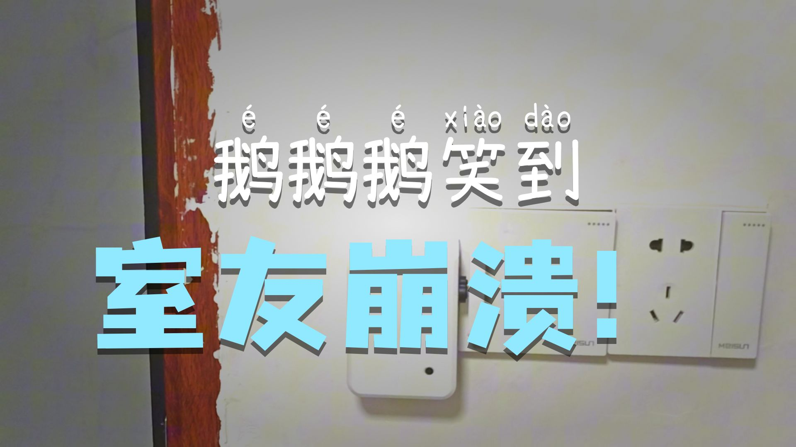 | 392 | 2026-04-12 |
| [可是哈基米真的很快乐啊](https://www.bilibili.com/video/BV1mVDRBfE1g) | 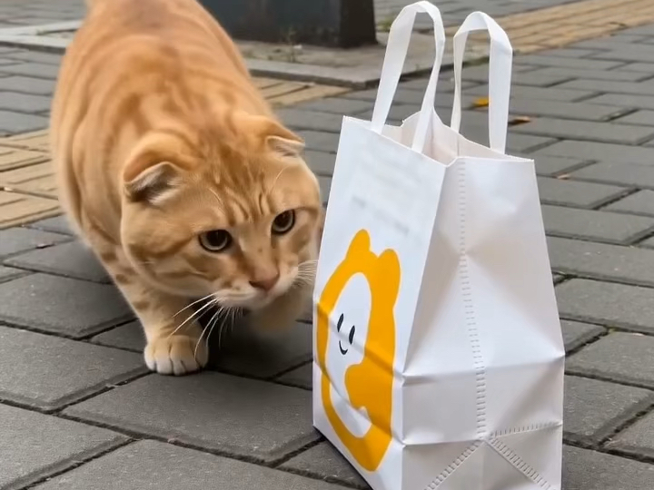 | 397 | 2026-04-12 |
| [《哈基米》的“快乐”](https://www.bilibili.com/video/BV1HuDdBHEVM) | 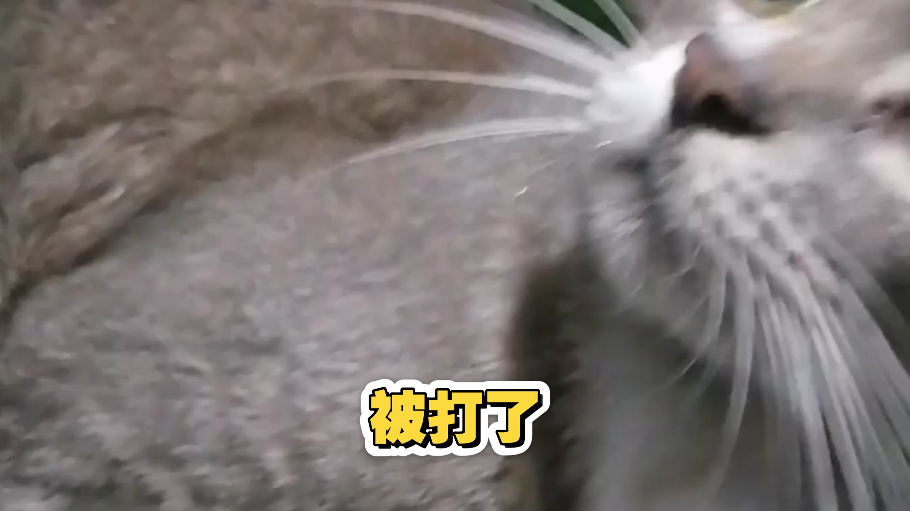 | 47 | 2026-04-12 |
| [第一视角看哈基米吵架](https://www.bilibili.com/video/BV1mGDXBQEd8) | 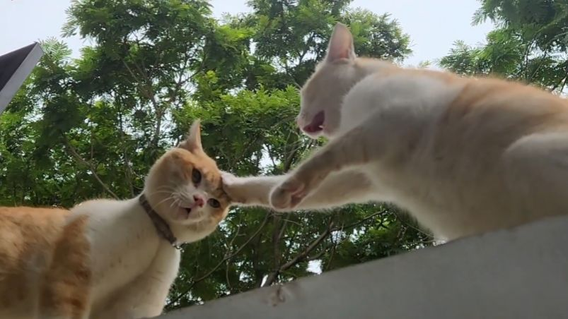 | 960 | 2026-04-12 |
| [【FF14】昂撒哈基米](https://www.bilibili.com/video/BV1muDXB9EfC) | 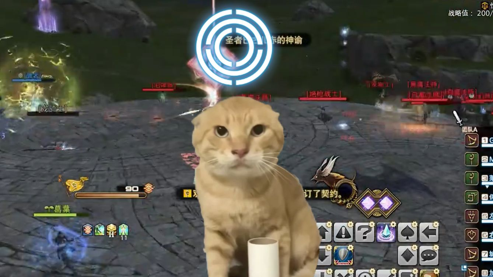 | 433 | 2026-04-12 |
| [哈基米南北绿豆~](https://www.bilibili.com/video/BV1hmDXBZEbg) |  | 3457 | 2026-04-12 |
| [哈基米](https://www.bilibili.com/video/BV1tDDXBdEqd) | 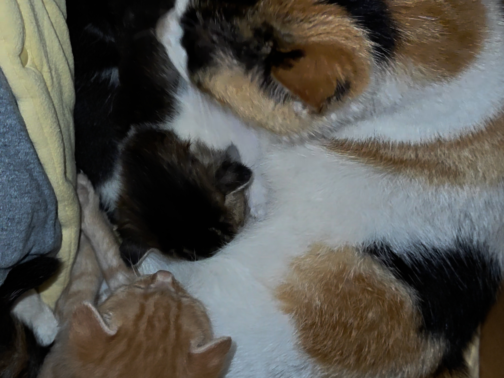 | 28 | 2026-04-12 |
| [哈基米](https://www.bilibili.com/video/BV1bXDXBsEsD) | 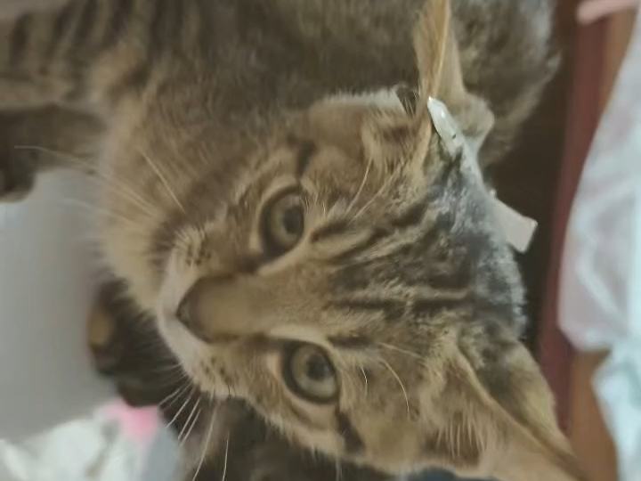 | 41 | 2026-04-12 |
| [没想到今天遇到了它 ｜最帅哈基米](https://www.bilibili.com/video/BV1mXDXBsEkq) |  | 17 | 2026-04-12 |
| [哈基米：每天打卡，哈气吃饭](https://www.bilibili.com/video/BV1JuD9BCEaS) | 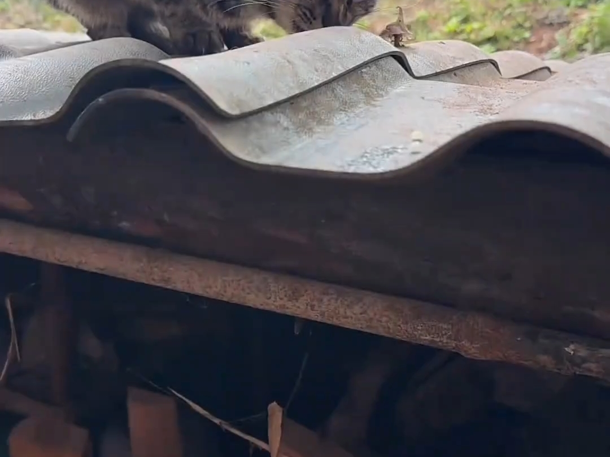 | 223 | 2026-04-12 |
| [哈基米日记之《远方，近处，商都》](https://www.bilibili.com/video/BV1iED9BqEaJ) |  | 238 | 2026-04-12 |
| [基米这波贪了，倒车出库失败](https://www.bilibili.com/video/BV142D2BNEAX) | 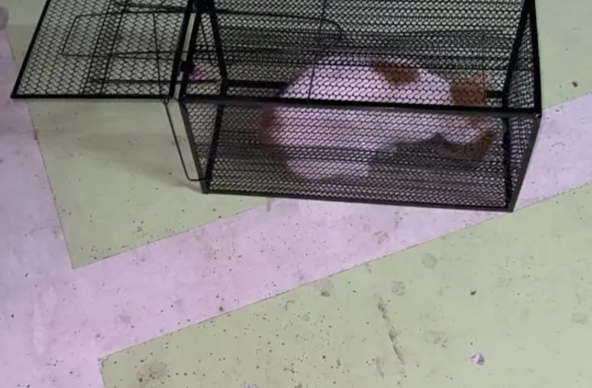 | 3456 | 2026-04-12 |
| [今天给哈基米带穿搭](https://www.bilibili.com/video/BV1q7D9BME4P) | 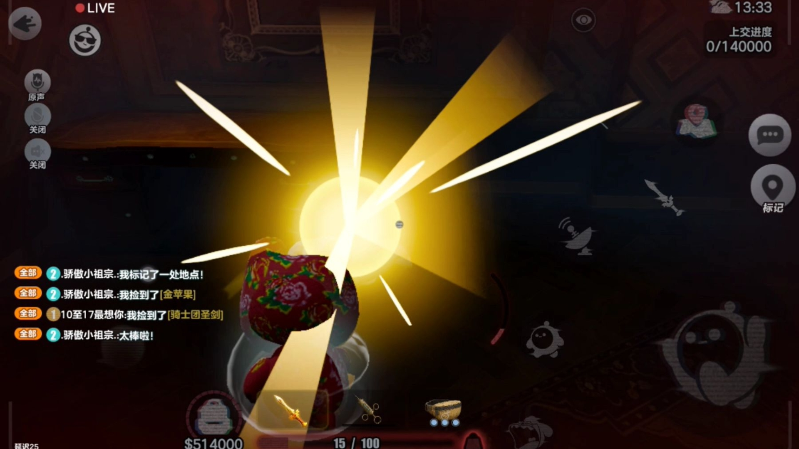 | 59 | 2026-04-12 |
| [哈基米TV:全体开起棘背龙形态](https://www.bilibili.com/video/BV1L7D9BME2K) | 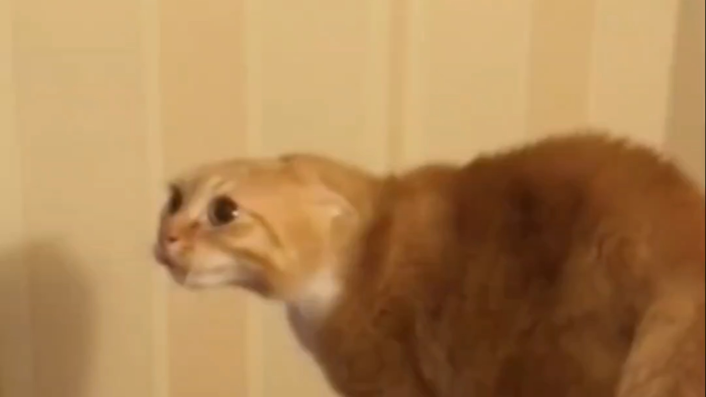 | 808 | 2026-04-12 |
| [哈基米南北绿豆酒，每一处，都彰显哈基米独有的锋芒](https://www.bilibili.com/video/BV11oDXBQE1i) |  | 154 | 2026-04-12 |
| [哈基米！！！！！](https://www.bilibili.com/video/BV1sBD9B9EEM) |  | 93 | 2026-04-12 |
| [宇宙最强哈基米](https://www.bilibili.com/video/BV1HyD9BSExp) | 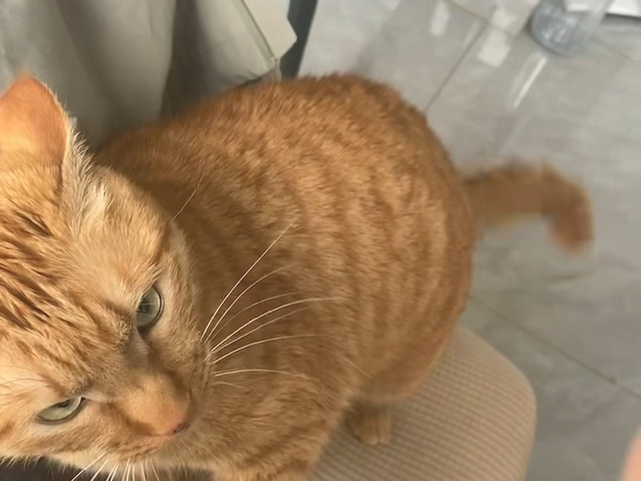 | 46 | 2026-04-12 |
| [哈基米这个抗拒](https://www.bilibili.com/video/BV1maD9BZEr9) | 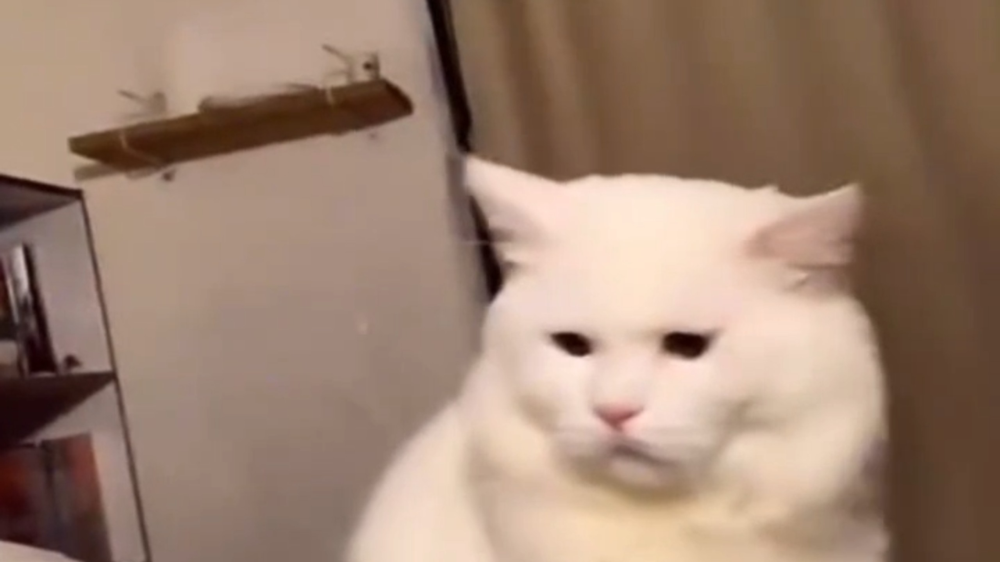 | 28 | 2026-04-12 |
| [吃口鱼真不容易](https://www.bilibili.com/video/BV1gtD9BhExJ) | 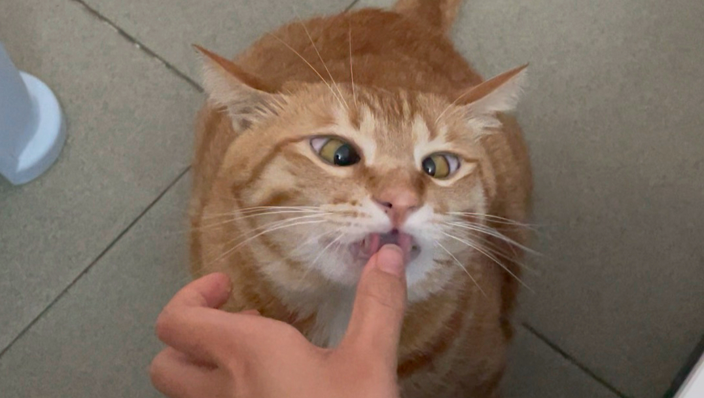 | 8851 | 2026-04-12 |
| [好猫TV](https://www.bilibili.com/video/BV1QCDDBXETR) | 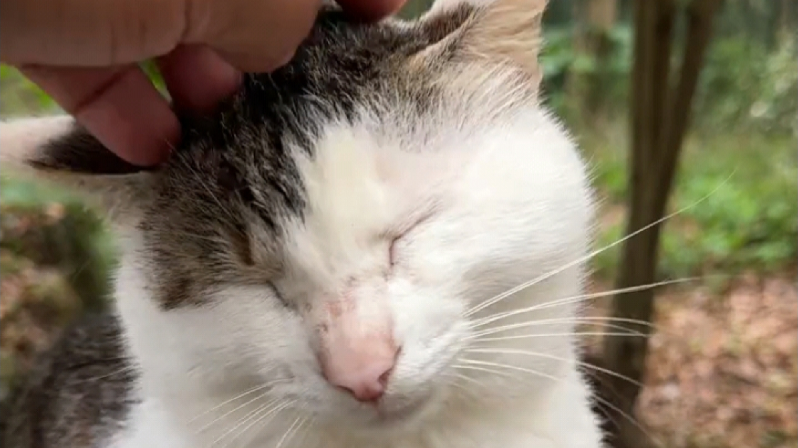 | 2929 | 2026-04-12 |
| [哈基米～南....](https://www.bilibili.com/video/BV1hCDDBXE8B) |  | 51 | 2026-04-12 |
| [【哈基米音乐】不得不哈（完整版）](https://www.bilibili.com/video/BV15vDDBFESX) |  | 5.8万 | 2026-04-12 |
| [【在暗器猛攻的哈基米】我的最新作品，快来一睹为快！](https://www.bilibili.com/video/BV1iYDDB8EB6) |  | 21 | 2026-04-12 |
| [朕的哈基米被别的描追着跑](https://www.bilibili.com/video/BV19qDDBoEJX) | 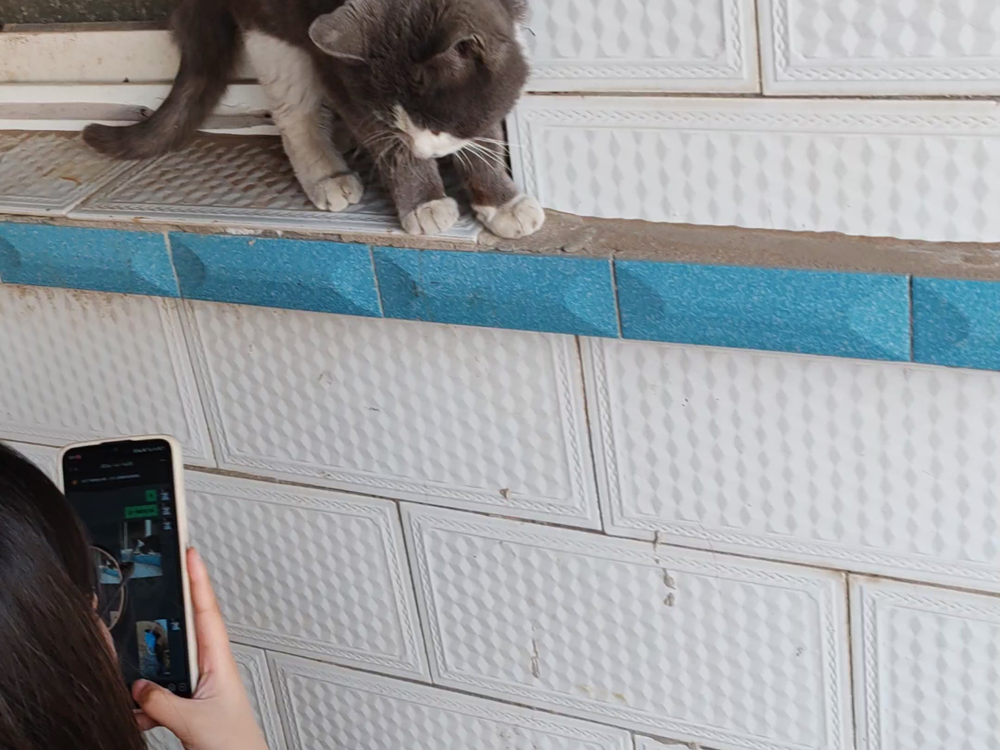 | 98 | 2026-04-12 |
| [哈基米不是很配合怎么办](https://www.bilibili.com/video/BV1VEDQBfEAc) |  | 885 | 2026-04-12 |
| [哈基米你这家伙](https://www.bilibili.com/video/BV1LjDQBcE4n) | 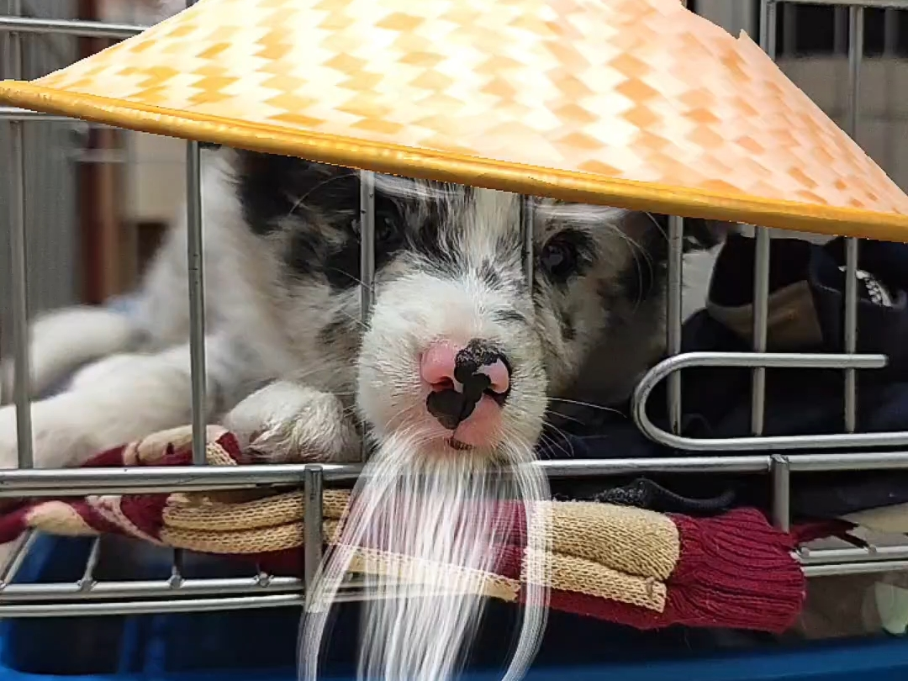 | 125 | 2026-04-12 |
| [“哈基米舞”](https://www.bilibili.com/video/BV1kfDDBkEvH) |  | 299 | 2026-04-12 |
| [不选择逃跑反而主动接近我吗](https://www.bilibili.com/video/BV1nNDQBBEsu) | 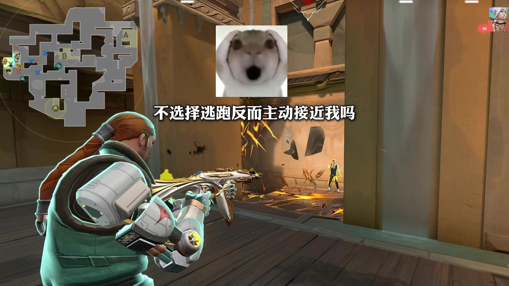 | 2.8万 | 2026-04-12 |
| [竹林高手#猫咪#小奶猫#哈基米](https://www.bilibili.com/video/BV1ncDQB3Emz) |  | 162 | 2026-04-12 |
| [哈基米餐厅](https://www.bilibili.com/video/BV12iDQB7EAT) |  | 47 | 2026-04-12 |
| [哈基米~](https://www.bilibili.com/video/BV1KhDQBDEd9) |  | 24 | 2026-04-12 |
| [还是没能逃过哈基米](https://www.bilibili.com/video/BV1KYDQBJEUr) |  | 6315 | 2026-04-12 |
| [【哈基米摸金】视频加载中，速速查收惊喜！](https://www.bilibili.com/video/BV1gWDQBxEed) | 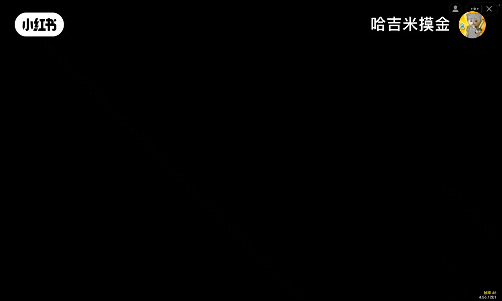 | 6 | 2026-04-12 |
| [足球哈基米](https://www.bilibili.com/video/BV1gWDQBxEr2) | 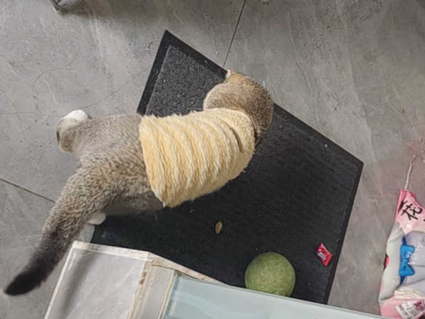 | 20 | 2026-04-12 |
| [哈基米南北绿豆～](https://www.bilibili.com/video/BV1GnDQBtE1M) |  | 9296 | 2026-04-12 |
| [哈基米怎么改的](https://www.bilibili.com/video/BV1VEDQBfEoF) | 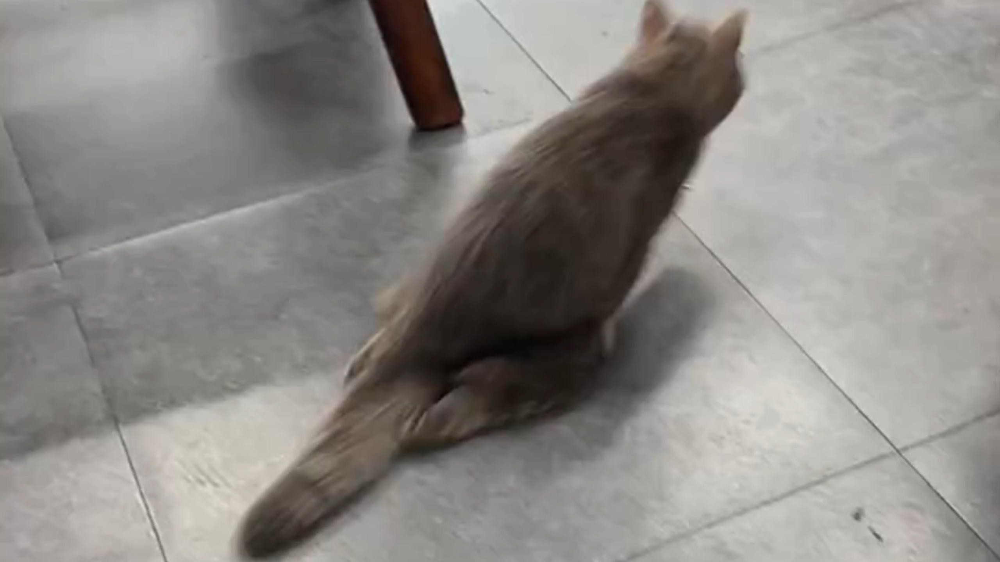 | 128 | 2026-04-12 |
| [哈基米南北绿豆再生侠给我掉](https://www.bilibili.com/video/BV1t8DQBHEZ2) |  | 88 | 2026-04-12 |
| [哈基米 yc瑰病](https://www.bilibili.com/video/BV1S8DQBHEGf) |  | 128 | 2026-04-12 |
| [哈基米听说还没开饭头也不回的走了](https://www.bilibili.com/video/BV18sDQBREex) | 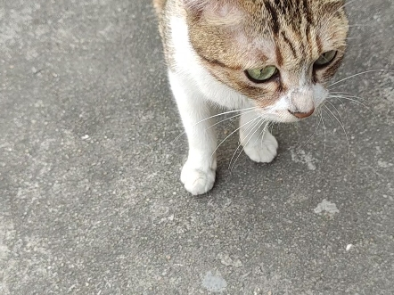 | 166 | 2026-04-12 |
| [【老柠萌】当我摸井盖摸出来了一只金条猫咪](https://www.bilibili.com/video/BV1SKDXBdE23) |  | 15.3万 | 2026-04-12 |
| [【基米FM】再哈宣言🐱](https://www.bilibili.com/video/BV1dXDQBvEp3) |  | 1955 | 2026-04-12 |
| [哈基米徽章](https://www.bilibili.com/video/BV1bWDSBmEDC) | 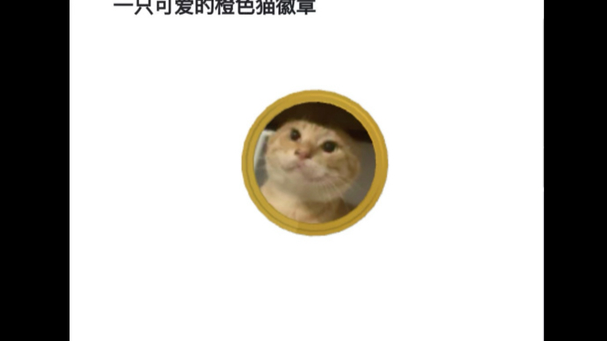 | 281 | 2026-04-12 |
| [守望先锋【午时已到】第59期：警惕哈基米](https://www.bilibili.com/video/BV1veQwBbEfC) |  | 10.0万 | 2026-04-12 |
| [居家祝福38.8，快至半小时出货！#哈基米 #神马教 #生日祝福](https://www.bilibili.com/video/BV1dSDSBfEdD) | 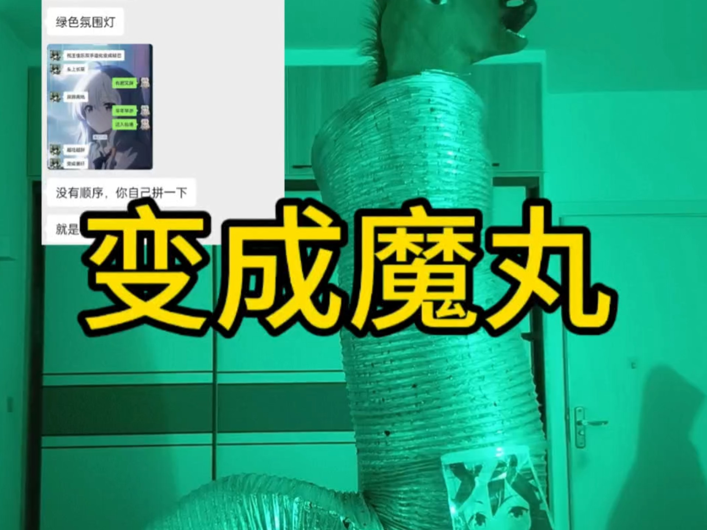 | 652 | 2026-04-12 |
| [【哈基米】甩葱歌🐱](https://www.bilibili.com/video/BV1ZqD1BHE9V) |  | 9.0万 | 2026-04-12 |
| [《没有礼貌》](https://www.bilibili.com/video/BV1k7DDB6EHE) |  | 4065 | 2026-04-12 |
| [小刀盾的进化之路S3-12](https://www.bilibili.com/video/BV1GVDmB2EwY) |  | 106.1万 | 2026-04-12 |
| [【库库鲁哈基米】Up主探索中，欢迎收看求三连！](https://www.bilibili.com/video/BV1bpDmB6E8F) |  | 0 | 2026-04-12 |
| [【库库鲁哈基米】更新啦，赶紧来围观吧！](https://www.bilibili.com/video/BV1tpDmB6Efw) |  | 0 | 2026-04-12 |
| [【库库鲁哈基米】视频加载中，速速查收惊喜！](https://www.bilibili.com/video/BV1MpDmB6E9P) |  | 0 | 2026-04-12 |
| [哈基米『男儿当自强』so](https://www.bilibili.com/video/BV1gvD2BCEFx) | 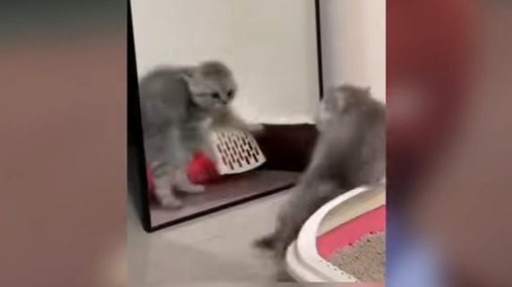 | 0 | 2026-04-11 |
| [哈基米：Dramamineso](https://www.bilibili.com/video/BV1EcDmBREzZ) |  | 0 | 2026-04-11 |
| [东海帝皇のFunk ｜ HACHIMI MAMBO FUNK–36 KINGDOM x SVNO](https://www.bilibili.com/video/BV1JZD2BoEnJ) |  | 831 | 2026-04-11 |
| [魔法少女对战哈基米怪人 不慎被偷袭](https://www.bilibili.com/video/BV1HSDyBsETc) |  | 2814 | 2026-04-11 |
| [乡村兽医修猫修狗的一天](https://www.bilibili.com/video/BV12ED1BvERN) | 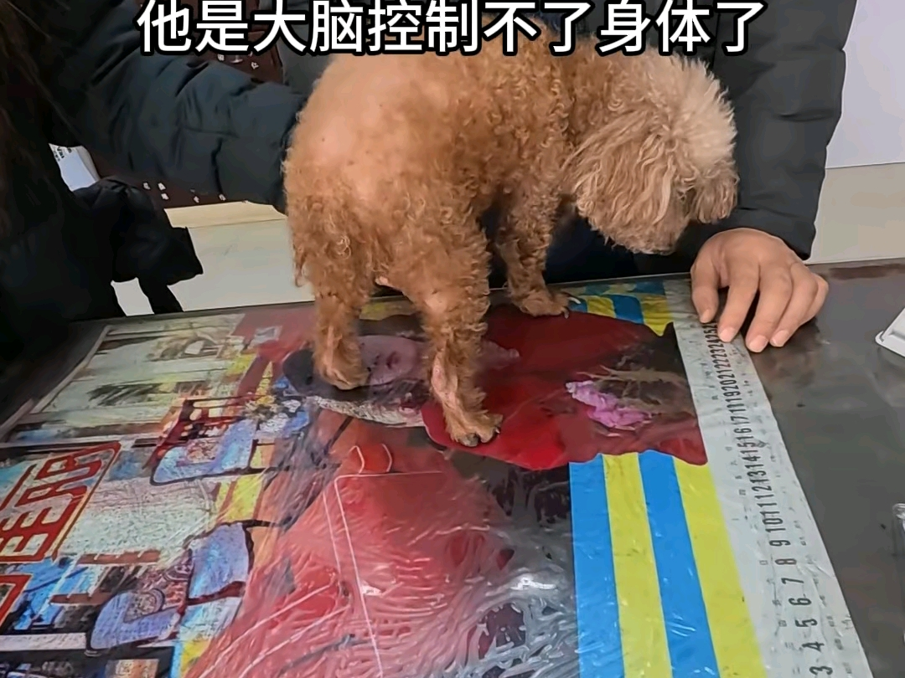 | 34.5万 | 2026-04-11 |
| [日本人听哈基米音乐be like:](https://www.bilibili.com/video/BV1GTDCBNEqy) |  | 446 | 2026-04-11 |
| [Please enter text.](https://www.bilibili.com/video/BV16SDkB2EfP) |  | 1601 | 2026-04-11 |
| [方舟也是舟！你教父玩塔防策略游戏也是高手！](https://www.bilibili.com/video/BV1YFDrBwEpT) |  | 45.2万 | 2026-04-11 |
| [绝世豪耄](https://www.bilibili.com/video/BV1TWQMBhEV9) | 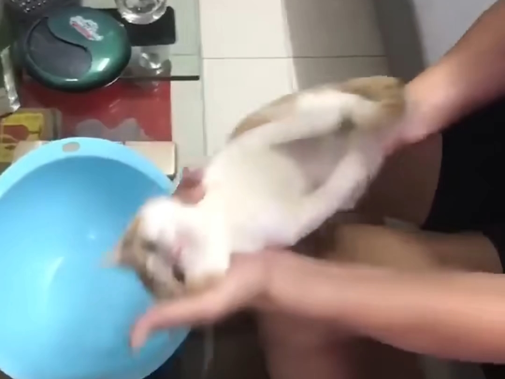 | 18.8万 | 2026-04-11 |
| [🐱where are 咪—咪在哪里🐱](https://www.bilibili.com/video/BV1SZQMBTEdz) |  | 815 | 2026-04-11 |
| [传统手搓动画，流萤挑战CatchCatch舞蹈！](https://www.bilibili.com/video/BV1j1QMBLEV4) |  | 21.5万 | 2026-04-11 |
| [黑白无常的日常吵架vlog](https://www.bilibili.com/video/BV16EQuBXExu) |  | 61.9万 | 2026-04-11 |
| [我的刀盾？](https://www.bilibili.com/video/BV1RtQuB1E2D) |  | 2486 | 2026-04-11 |
| [怒怼布黑!客观评价为何布鲁克群星S完爆奇妙积木！](https://www.bilibili.com/video/BV1u295BdEva) |  | 3.9万 | 2026-04-11 |
| [【动物配音】我发现吃饭可以缓解饥饿](https://www.bilibili.com/video/BV1QZDfBLEQw) | 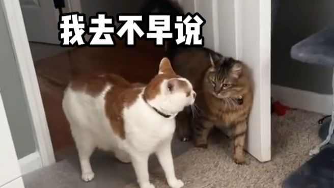 | 40.6万 | 2026-04-11 |
| [😱MC玩家深夜实测波比女孩模组，差点把手机摔了！](https://www.bilibili.com/video/BV1TcQTB4EN1) |  | 1.6万 | 2026-04-11 |
| [反乌托邦，但是Montagem Pitty](https://www.bilibili.com/video/BV1QUQKBvEfq) |  | 59.9万 | 2026-04-11 |
| [如何用四分钟叒把一个广东人唱红温🤟](https://www.bilibili.com/video/BV1L9QcBoEeH) |  | 184.8万 | 2026-04-10 |
| [🦟蚊 香 🦟](https://www.bilibili.com/video/BV1nnQFB8E9b) | 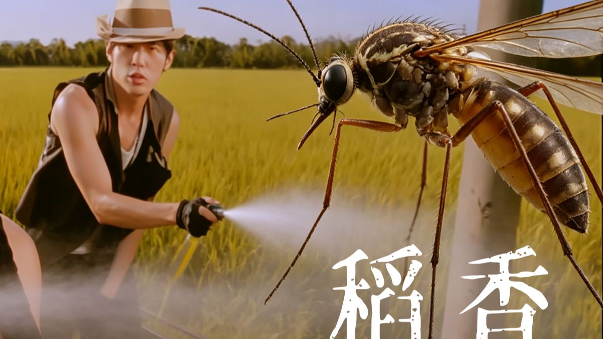 | 34.4万 | 2026-04-10 |
| [莫惧前路险，锋芒自亮剑。勇敢的去⚡爆⚡回⚡吧！](https://www.bilibili.com/video/BV1nJDxBAEEx) |  | 21.4万 | 2026-04-10 |
| [从洞口观察小猫](https://www.bilibili.com/video/BV165DZBdENX) | 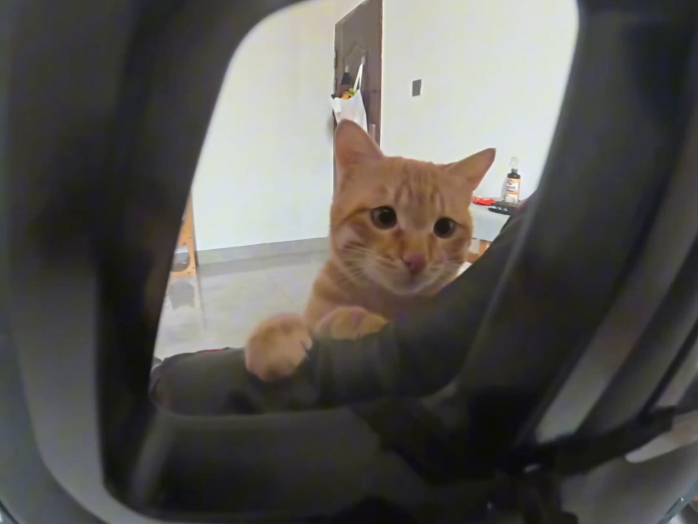 | 19.5万 | 2026-04-10 |
| [依旧板面小猪这一块](https://www.bilibili.com/video/BV11HDpBPEtB) |  | 46.7万 | 2026-04-09 |
| [大橘哥125-下大橘哥发癫了,连续叫6个小时](https://www.bilibili.com/video/BV1iXD7BBEJV) | 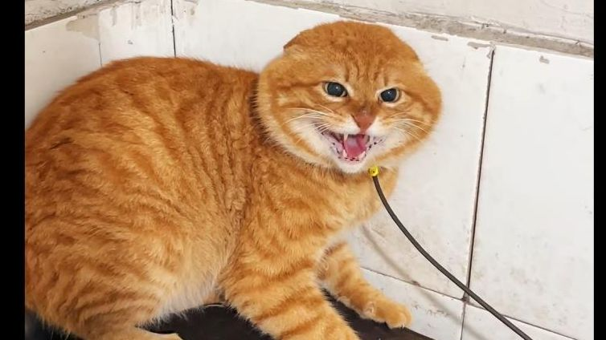 | 12.2万 | 2026-04-08 |
| [沉浸式体验撸小海豹](https://www.bilibili.com/video/BV1kHDEBmE8n) |  | 18.9万 | 2026-04-08 |
| [训化2（补）](https://www.bilibili.com/video/BV1cpDrBjEe8) | 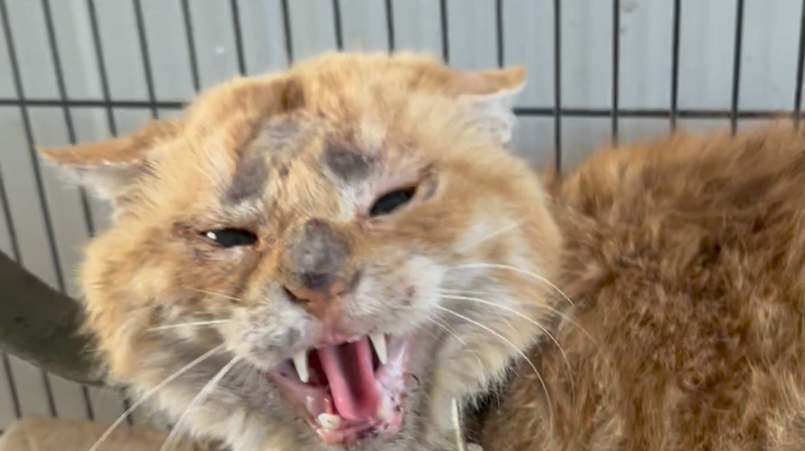 | 2.8万 | 2026-04-08 |
| [做梦中奖了](https://www.bilibili.com/video/BV1m1DzBQESj) | 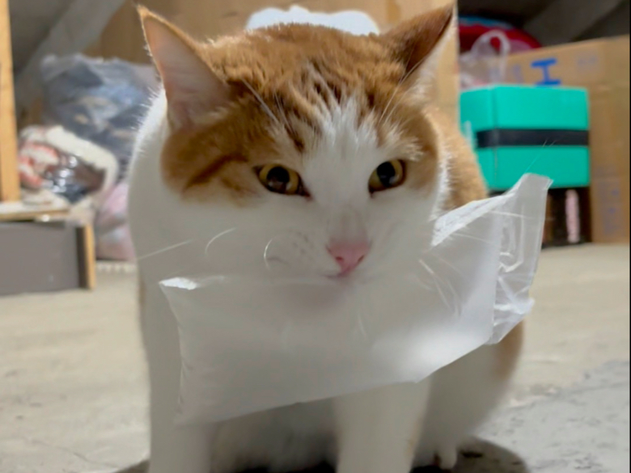 | 7.0万 | 2026-04-08 |
| [狗狗们的春日SPA Day~](https://www.bilibili.com/video/BV1BKDKBgEVC) | 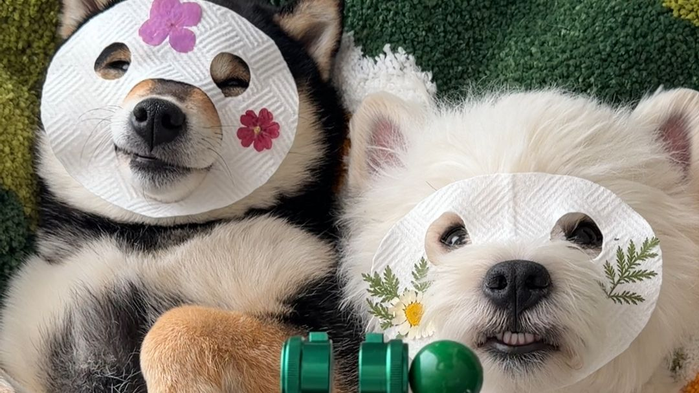 | 11.5万 | 2026-04-07 |
| [突然朝二哈嘴里扔一片柠檬，笑死，直接抑郁了！](https://www.bilibili.com/video/BV1qqDFBREzo) | 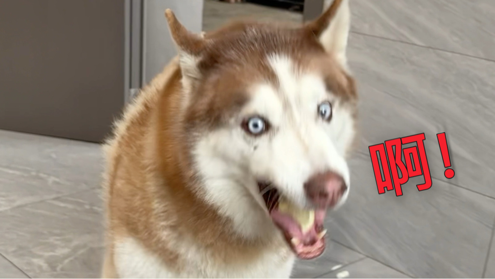 | 39.2万 | 2026-04-07 |
| [哈基蜂:我好像找到了最珍贵的东西](https://www.bilibili.com/video/BV1iFSUBHEg2) |  | 253.6万 | 2026-04-05 |
| [这俩真的听起来很像吗？｜MONTAGEM PITTY × 反乌托邦【高三销号/混音】](https://www.bilibili.com/video/BV1AsDuBREcx) |  | 8.7万 | 2026-04-04 |
| [一家6狗去上海宠物友好街区玩有多快乐？](https://www.bilibili.com/video/BV1XkDTBeEG1) | 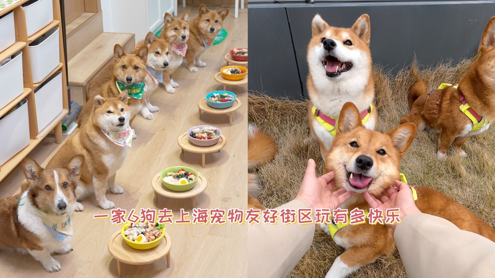 | 5.7万 | 2026-04-04 |
| [🦟 七 里 蚊 香 🦟](https://www.bilibili.com/video/BV1Bh9TBXE1J) |  | 195.0万 | 2026-04-03 |
| [假如你惹怒了变异的大公鸡，你能成功逃出他的鸡爪吗！](https://www.bilibili.com/video/BV1qE9JBnEaF) |  | 151.3万 | 2026-04-01 |
| [《禅者行脚》原版](https://www.bilibili.com/video/BV1PRX6BWEpb) |  | 64.8万 | 2026-03-31 |
| [赌上生命！最强校园躲猫猫大赛！第三期！](https://www.bilibili.com/video/BV1uCXQB8Em9) |  | 1660.4万 | 2026-03-29 |
| [60篇猫meme作文大合集！](https://www.bilibili.com/video/BV1MuQmBVEGD) | 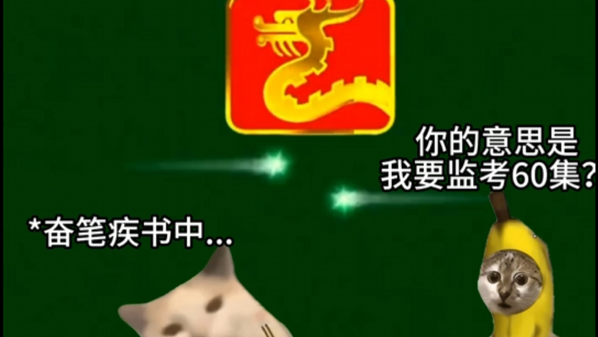 | 649.7万 | 2026-03-25 |
| [在古代，穷人会说“嘎嘎滴辣虾”有多爽](https://www.bilibili.com/video/BV1toQBBJEcV) |  | 212.3万 | 2026-03-24 |
| [【愛音フカ】猛毒注意cover【utau音源配布】](https://www.bilibili.com/video/BV1KkAFzvEhA) |  | 23.5万 | 2026-03-21 |
| [不吃别扒拉，小猫咪有什么坏心思](https://www.bilibili.com/video/BV1obvkBKEen) |  | 15.4万 | 2025-12-28 |
| [《反乌托邦Pt.2》【亚细亚旷世奇才/洛天依/乌托邦P】](https://www.bilibili.com/video/BV1epqZBVEPY) |  | 697.5万 | 2025-12-19 |
| [猫咪强制爱](https://www.bilibili.com/video/BV1QU4y1k7Ks) | 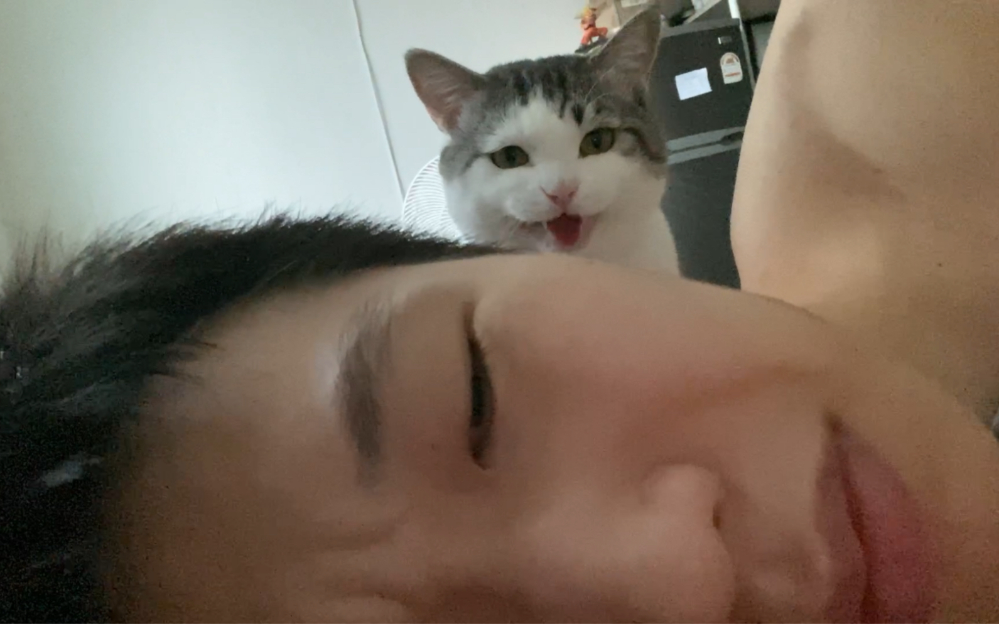 | 792.2万 | 2022-08-10 |
| [【4K60FPS】周杰伦《七里香》封神之作！华语乐坛最美的一首歌](https://www.bilibili.com/video/BV1qD4y1U7fs) |  | 2556.8万 | 2020-08-12 |
| [[猫咪电视] - 捉鱼](https://www.bilibili.com/video/BV1Qv411i7a7) |  | 117.0万 | 2020-07-13 |
| [【Laura Shigihara】Zombies on your Lawn 【PVZ ED】](https://www.bilibili.com/video/BV1Cs41197LU) |  | 699.3万 | 2015-12-18 |

---
*最后更新: 2026-04-13 03:20:03 (自动生成)*
*数据来源: [Bilibili](https://www.bilibili.com)*

## 使用说明

运行以下命令更新视频列表:
```bash
python3 fetch_hajimi_videos.py
```
