# awesome-hajimi
collections of hajimi (哈基米 in Chinese) on the Internet.

## 视频列表 (Video List)

| 视频标题 (Title) | 封面 | 播放量 (Views) | 发布日期 (Date) |
|---|---|---|---|
| [逆天音乐，说谎的哈基米](https://www.bilibili.com/video/BV1vzwszSEtf) | 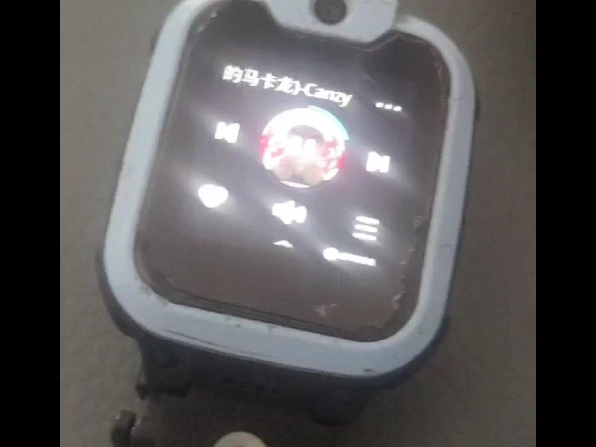 | 0 | 2026-03-14 |
| [三角洲行动-哈基米日常](https://www.bilibili.com/video/BV1XfwHzuEx8) | 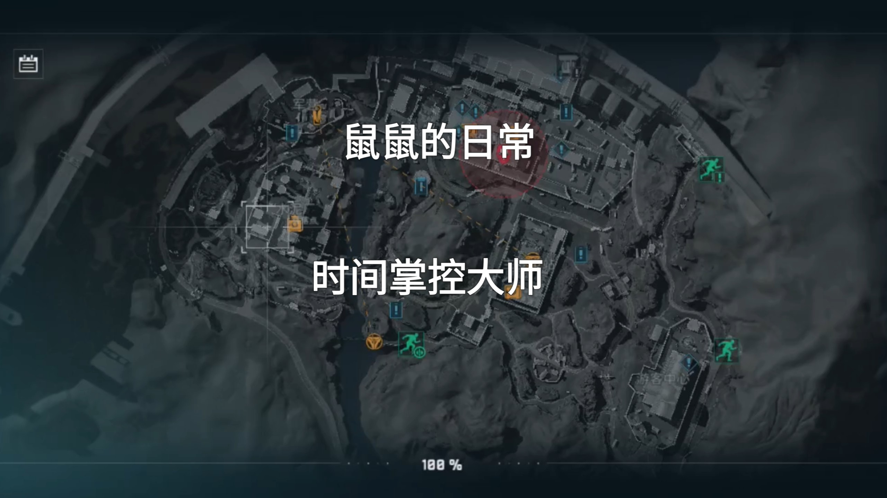 | 87 | 2026-03-14 |
| [哈基米发疯了疯狂袭击它的主人](https://www.bilibili.com/video/BV1d9wHzkEAG) | 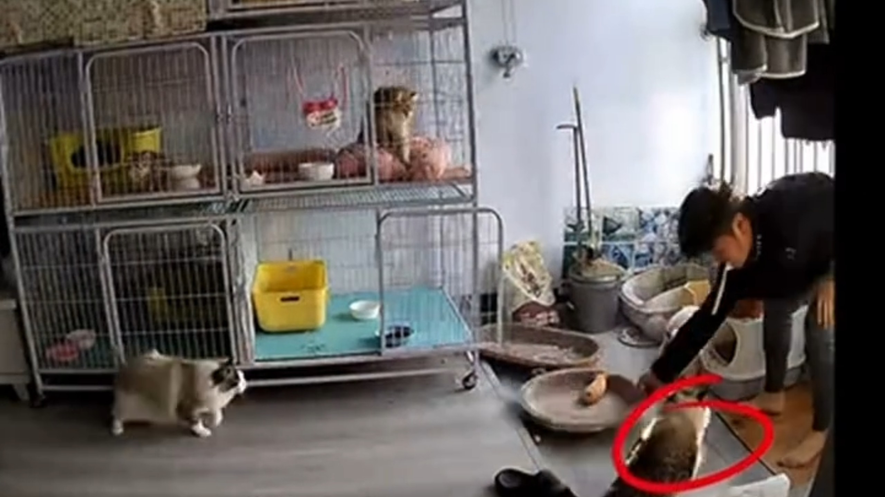 | 25 | 2026-03-14 |
| [【哈基米音乐】哈基米之曼波无敌3：哈气阴影：要塞（Fortress）主题曲](https://www.bilibili.com/video/BV1d9wHzkEhS) |  | 149 | 2026-03-14 |
| [《动物语音系统异常》](https://www.bilibili.com/video/BV1oicDz9Ews) | 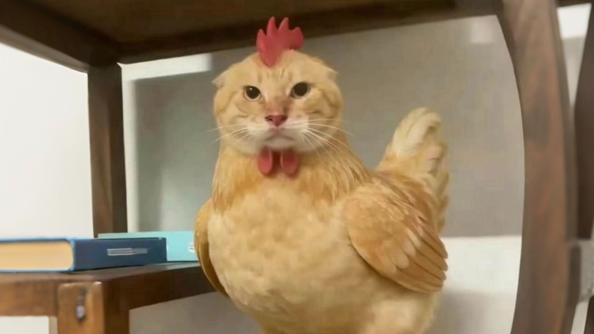 | 2.6万 | 2026-03-14 |
| [日本哈基米大叔演唱基米说](https://www.bilibili.com/video/BV1qawpz2E6x) |  | 1156 | 2026-03-13 |
| [哈基米南北绿豆](https://www.bilibili.com/video/BV1nAcSztEuj) |  | 1401 | 2026-03-13 |
| [来点哈基米神人图](https://www.bilibili.com/video/BV1r7wnzEEcG) |  | 11 | 2026-03-13 |
| [哈基米这个家伙，又开始骑手了](https://www.bilibili.com/video/BV1UAwnzZEbJ) | 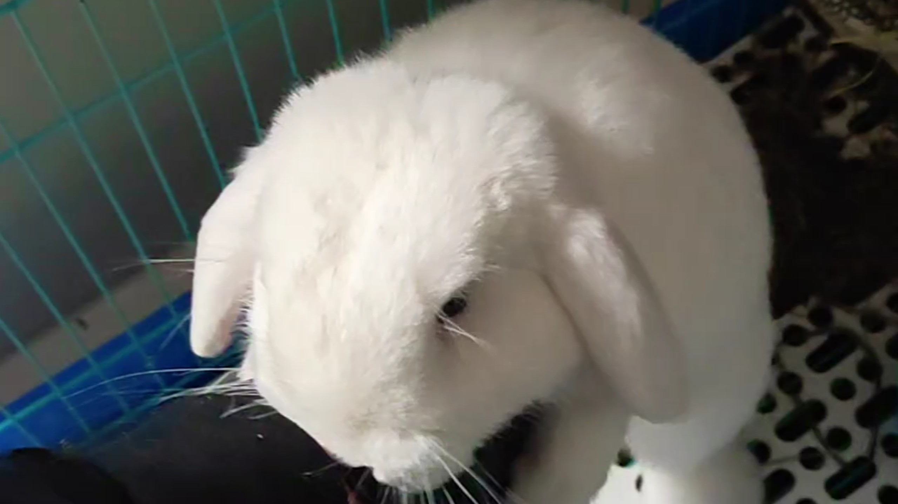 | 141 | 2026-03-13 |
| [哈基米vlog ｜ 第一集:深夜撸串](https://www.bilibili.com/video/BV1h6wnzYEcU) |  | 17 | 2026-03-13 |
| [P4G开头曲《基米World》（Shadow World）](https://www.bilibili.com/video/BV1HFwHzSEpN) |  | 940 | 2026-03-13 |
| [【哈气TV】哈基米给大家发摔炮](https://www.bilibili.com/video/BV18swHzYEx7) | 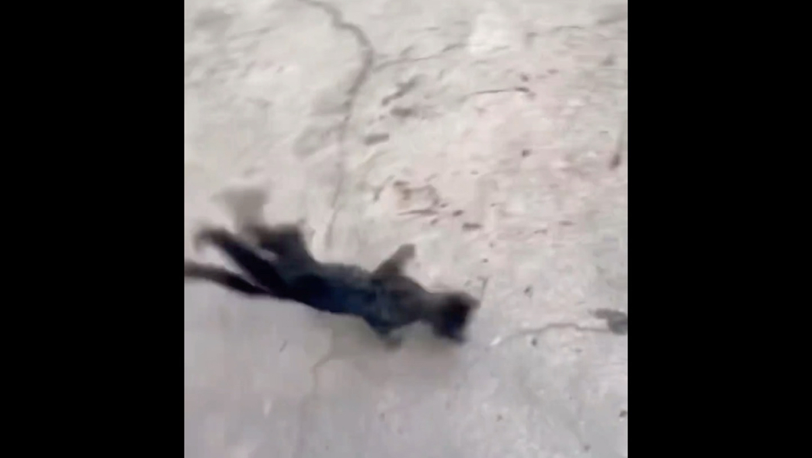 | 6173 | 2026-03-13 |
| [邪恶的哈基米](https://www.bilibili.com/video/BV1ixwEzNEA6) | 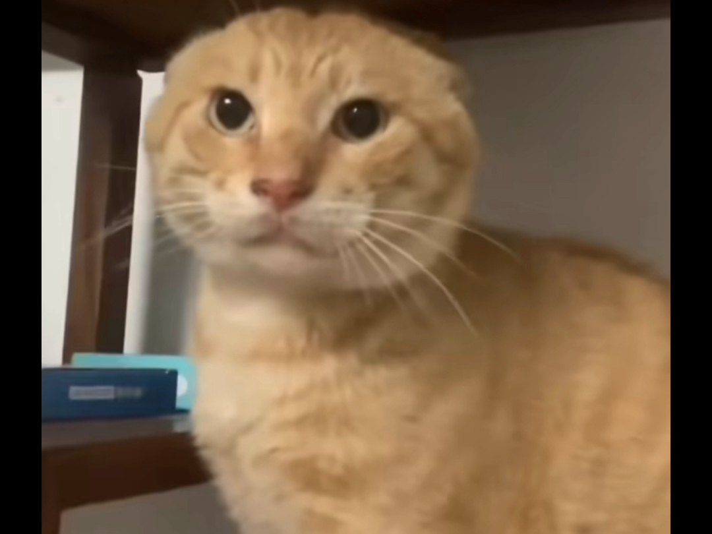 | 40 | 2026-03-13 |
| [【Hi‑Res】Pao7oO - IF YOU(哈基米版)｜初听不知曲中意，再听已是哈基米](https://www.bilibili.com/video/BV1QiwEztEyL) | 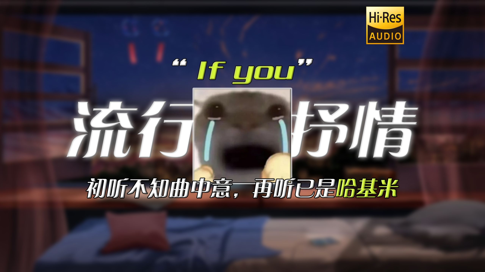 | 38 | 2026-03-13 |
| [哈基米](https://www.bilibili.com/video/BV17wwJz6EgW) |  | 32 | 2026-03-13 |
| [【基米FM】because I know](https://www.bilibili.com/video/BV1e3wJzeENm) |  | 155 | 2026-03-13 |
| [“最可爱的小猫 要分享给最可爱的你”](https://www.bilibili.com/video/BV1HZwEzVEhY) | 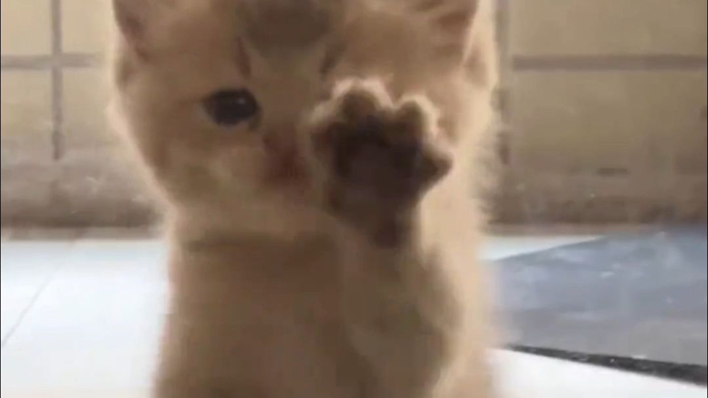 | 1421 | 2026-03-13 |
| [非主流哈基米](https://www.bilibili.com/video/BV1tHwJzoEDm) |  | 1031 | 2026-03-13 |
| [坏哈基米](https://www.bilibili.com/video/BV19QwJzKEmA) |  | 1227 | 2026-03-13 |
| [忘不了的哈基米生活](https://www.bilibili.com/video/BV1XdwJzeEXr) |  | 6 | 2026-03-13 |
| [「哈基米起床战争」第五集](https://www.bilibili.com/video/BV1QfwJzhEKL) | 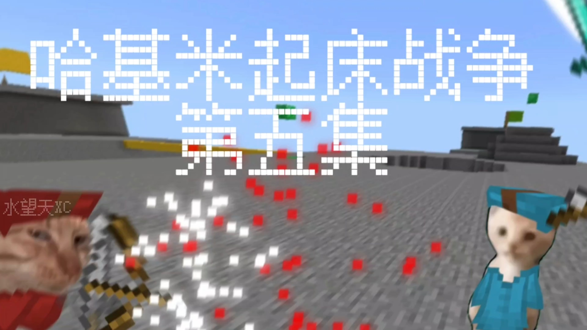 | 2744 | 2026-03-13 |
| [有没有懂绿头哈基米的](https://www.bilibili.com/video/BV1xEcDzTE3d) |  | 1385 | 2026-03-13 |
| [我哩个哈基米啊🙀](https://www.bilibili.com/video/BV1FkwJzVEpM) | 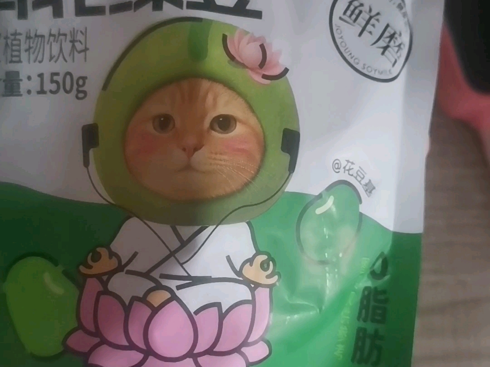 | 88 | 2026-03-13 |
| [古典哈基米～](https://www.bilibili.com/video/BV1LUwJzuEj9) | 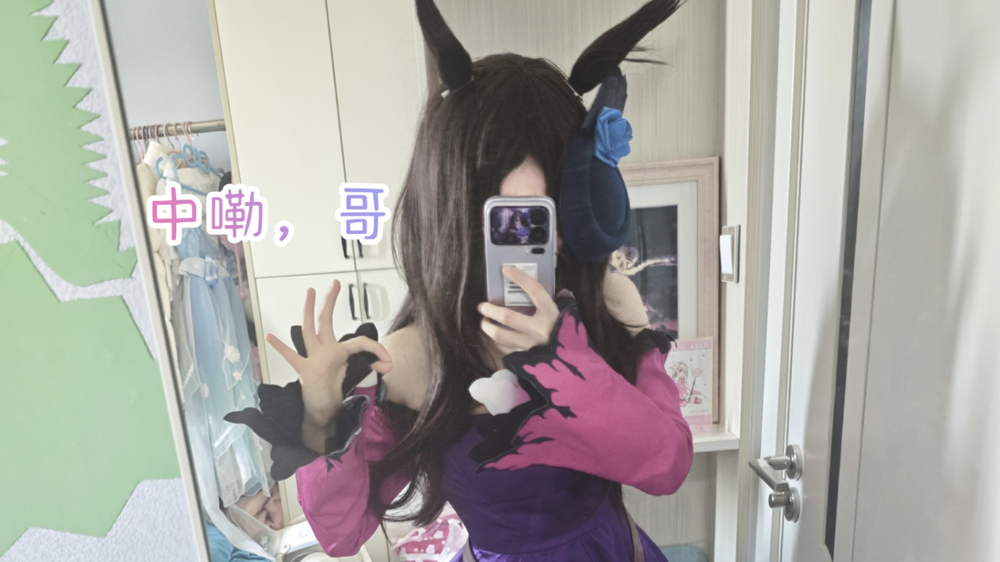 | 914 | 2026-03-13 |
| [《万物皆可压》](https://www.bilibili.com/video/BV1PBcSzeEHP) | 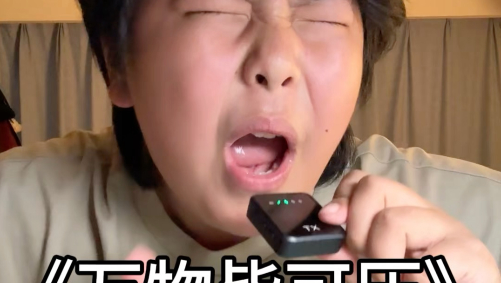 | 3.2万 | 2026-03-13 |
| [【3补】哈都](https://www.bilibili.com/video/BV1kscDzwEj8) |  | 2557 | 2026-03-13 |
| [【哈基米音乐】梦灯笼🎵](https://www.bilibili.com/video/BV1yJcDzvECm) |  | 1.5万 | 2026-03-13 |
| [叮咚鸡叫你起床（新世界）](https://www.bilibili.com/video/BV1VccDzUEei) | 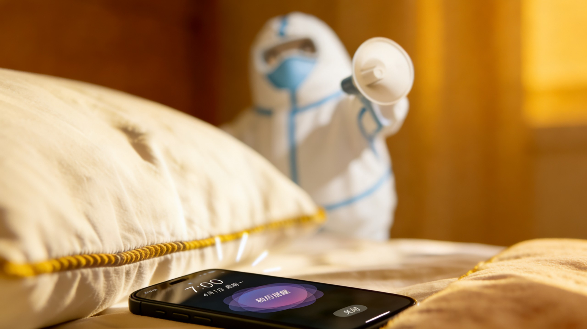 | 7730 | 2026-03-13 |
| [天暖和了哈基米又开始服刑](https://www.bilibili.com/video/BV1DAcDzjEB7) | 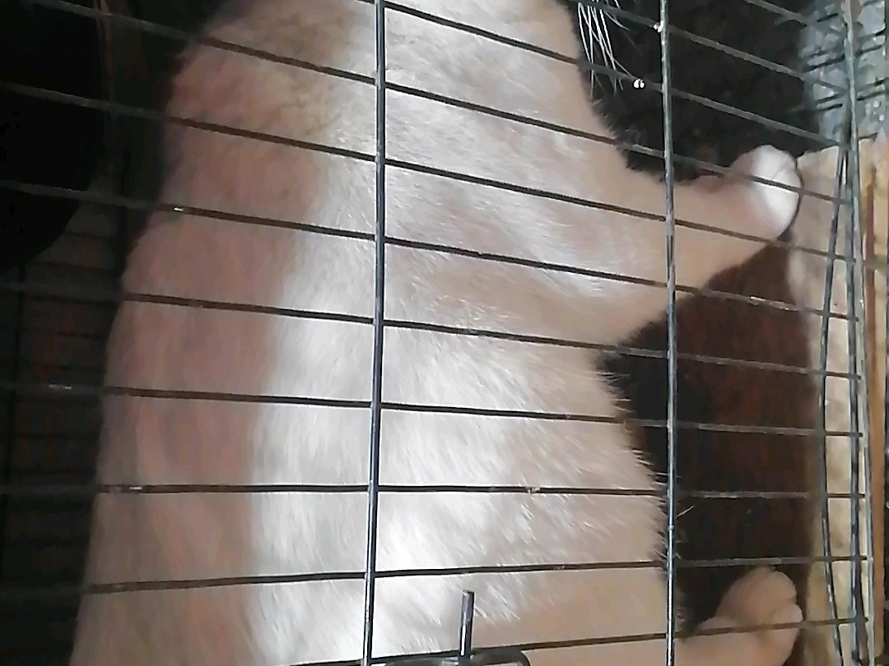 | 167 | 2026-03-13 |
| [【纯净哈基米】放课后的曼波~🐱悠闲の小曲🐱](https://www.bilibili.com/video/BV1bxcfzeERN) |  | 784 | 2026-03-13 |
| [哈基米整天被拴在马路边上每天如此](https://www.bilibili.com/video/BV1ezcDzQERa) |  | 4211 | 2026-03-13 |
| [街舞哈基米](https://www.bilibili.com/video/BV1DmcDzjELA) |  | 3192 | 2026-03-13 |
| [失而复得](https://www.bilibili.com/video/BV1ZxcUzXEoc) | 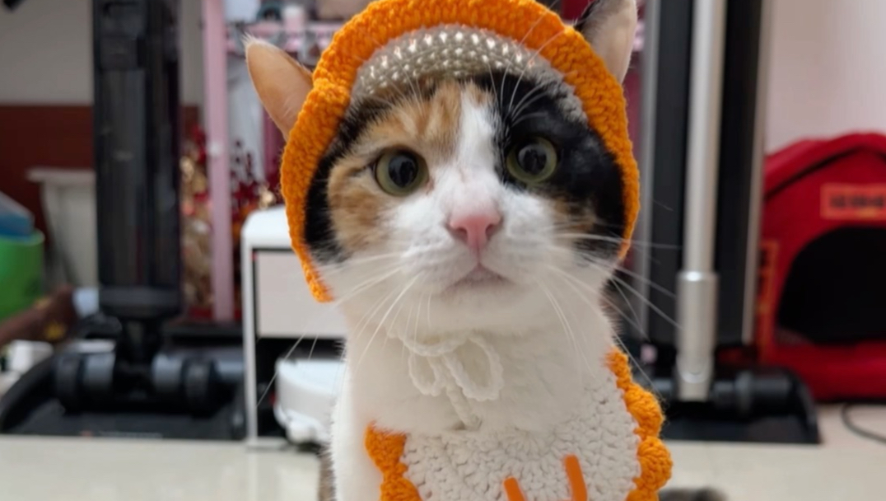 | 16.8万 | 2026-03-13 |
| [全网最可爱的猫来跳舞啦](https://www.bilibili.com/video/BV1iacDz4Eoc) |  | 1244 | 2026-03-13 |
| [哈基米做了一个天王梦，晚安哈基米](https://www.bilibili.com/video/BV1nKcQzPEkA) | 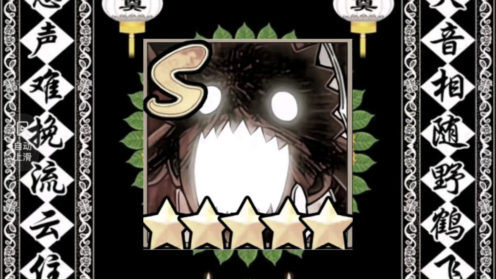 | 26 | 2026-03-13 |
| [小哈基米要在大哈基米的陪同下观看](https://www.bilibili.com/video/BV1cHcUz4EZd) |  | 139 | 2026-03-13 |
| [【纯净哈基米】基米重构](https://www.bilibili.com/video/BV1W6c6z3E6z) |  | 2520 | 2026-03-13 |
| [哈基米偷我皮筋](https://www.bilibili.com/video/BV1iacUzUEDn) | 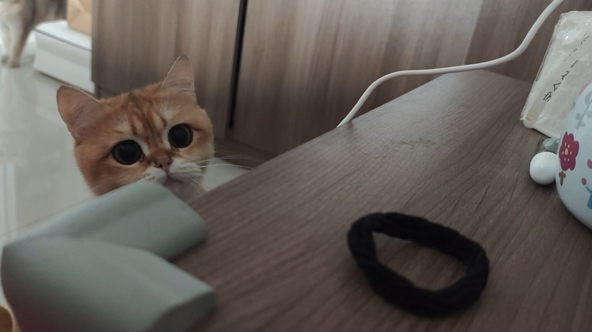 | 84 | 2026-03-13 |
| [太可怕了我的脸竟然摔在了兄弟的大脚上](https://www.bilibili.com/video/BV1eecUz7EDB) | 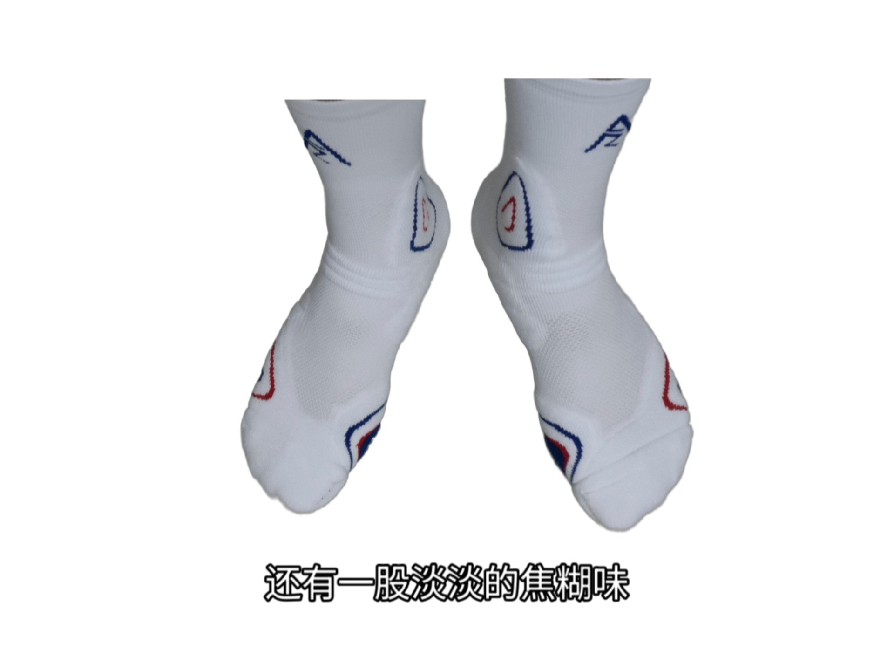 | 326 | 2026-03-13 |
| [哈基米已经晕了～](https://www.bilibili.com/video/BV1SmcUzBEwS) |  | 152 | 2026-03-13 |
| [我感觉很圣神](https://www.bilibili.com/video/BV18scSzVEDQ) | 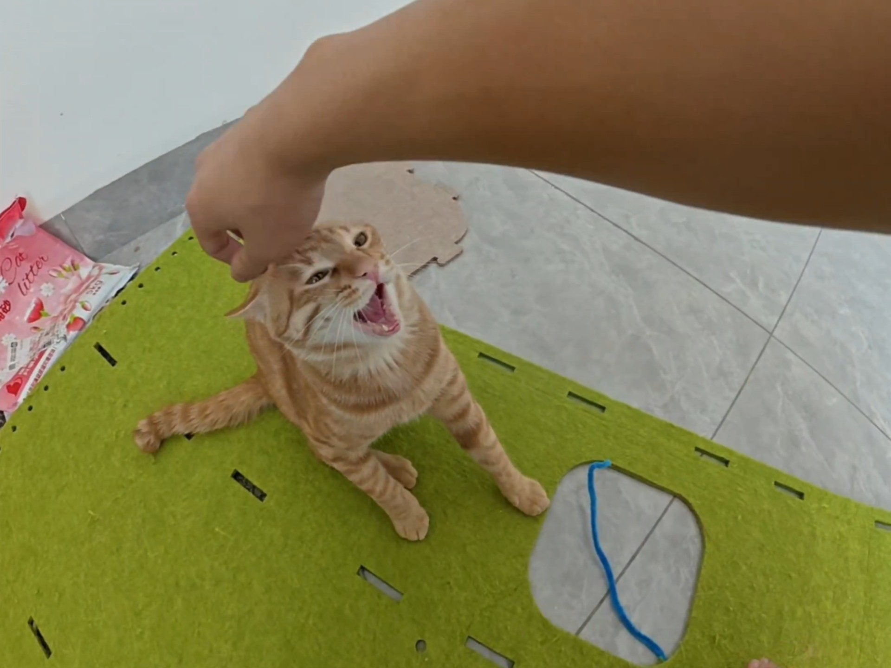 | 3.8万 | 2026-03-13 |
| [[oc]啊哈！偷吃被我抓到了吧ᗜ𖥦ᗜ](https://www.bilibili.com/video/BV1gscSzVEWj) | 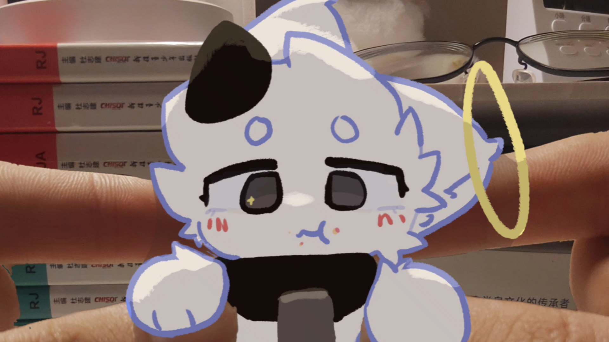 | 1.2万 | 2026-03-13 |
| [【超清黎明杀机】哈吉威最红的一集](https://www.bilibili.com/video/BV17vcrzeE2Q) |  | 5.2万 | 2026-03-13 |
| [有请新的幸运儿～](https://www.bilibili.com/video/BV1T7cCz9E25) | 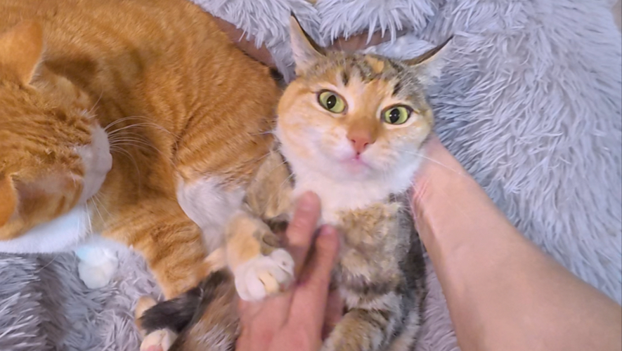 | 8365 | 2026-03-13 |
| [YOU CAN 哈基米！🎵(Clear)](https://www.bilibili.com/video/BV1uZcCz4EUu) |  | 7953 | 2026-03-13 |
| [哈基米](https://www.bilibili.com/video/BV1xvcSziEjK) |  | 44 | 2026-03-13 |
| [基米被生命所厌恶](https://www.bilibili.com/video/BV12acSzBErK) |  | 1.1万 | 2026-03-13 |
| [《有兽焉》主题曲哈基米填词《哈基焉》完整版。核桃声音翻唱](https://www.bilibili.com/video/BV1Yec2zzE3q) |  | 4501 | 2026-03-13 |
| [【肖肖哈基米的店】最新视频已上线，快来围观！](https://www.bilibili.com/video/BV142c2zhEtw) | 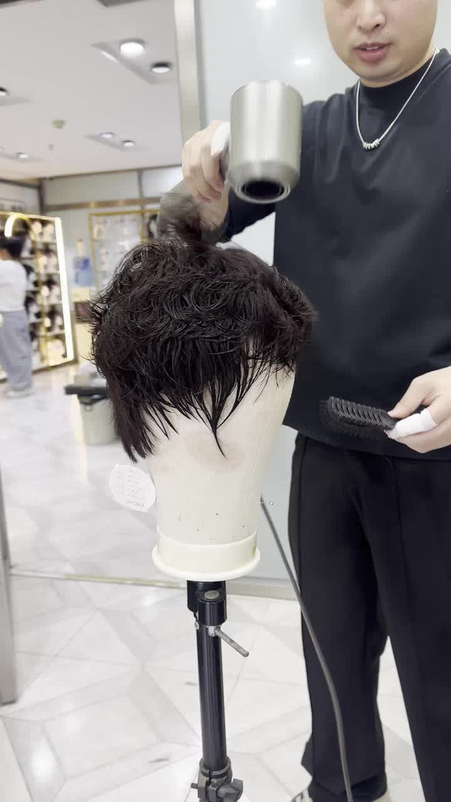 | 0 | 2026-03-13 |
| [哈基米不情不愿](https://www.bilibili.com/video/BV1AxcCzEEqX) | 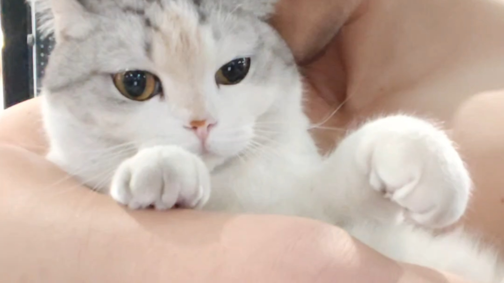 | 206 | 2026-03-12 |
| [基米不想走...](https://www.bilibili.com/video/BV1GDcCzwERn) |  | 92 | 2026-03-12 |
| [泠鸢可爱哈基米~南北路多~炸出来一群黑听！](https://www.bilibili.com/video/BV15bcyzKEc3) |  | 6334 | 2026-03-12 |
| [「智人TV」依旧对准油罐车开炮这一块](https://www.bilibili.com/video/BV1JbcrzBESe) |  | 12.4万 | 2026-03-12 |
| [不要离开耄耋好不好？](https://www.bilibili.com/video/BV1yAckz5EJP) | 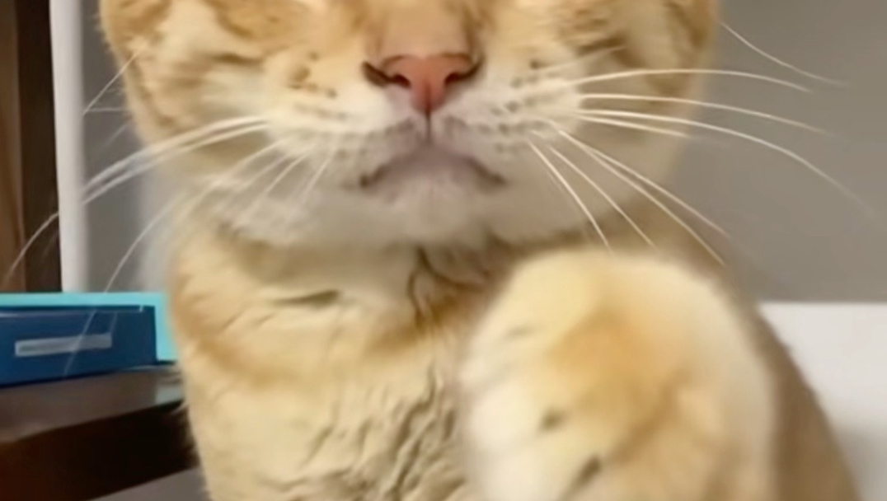 | 5844 | 2026-03-12 |
| [「哈基米私人音乐」街霸6 维加主题曲 Undying Desire](https://www.bilibili.com/video/BV1ykckzmE5E) |  | 5625 | 2026-03-12 |
| [哈基米版《明日方舟：终末地》汤汤EP:oh！my 哈基米！](https://www.bilibili.com/video/BV1xfczzgEtJ) |  | 3672 | 2026-03-12 |
| [剑人tv之大意食精粥](https://www.bilibili.com/video/BV1Dtc6zJEAx) |  | 1.7万 | 2026-03-12 |
| [基米对我哈😀](https://www.bilibili.com/video/BV1gbc6zSEcg) |  | 458 | 2026-03-12 |
| [让你知道什么叫黑“水手”!](https://www.bilibili.com/video/BV1src6z6EBW) |  | 3.2万 | 2026-03-12 |
| [柯基：你这旧思想！](https://www.bilibili.com/video/BV1NEcrzLECr) |  | 109.7万 | 2026-03-12 |
| [哈基米南北绿豆](https://www.bilibili.com/video/BV1NHcrzVEJL) | 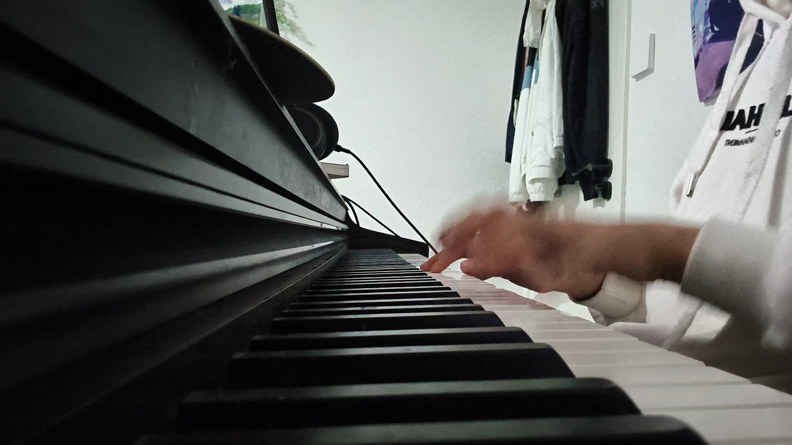 | 111 | 2026-03-12 |
| [西洋猫返场（原速）](https://www.bilibili.com/video/BV1xjwwzTEPJ) | 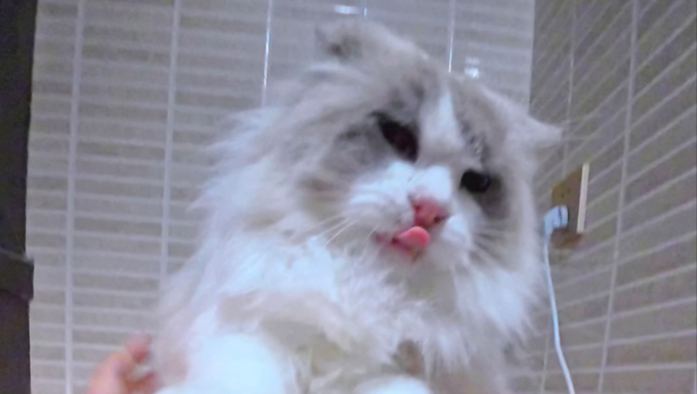 | 7738 | 2026-03-12 |
| [老虎，弟弟脾气太不好了](https://www.bilibili.com/video/BV19HwAzQEje) | 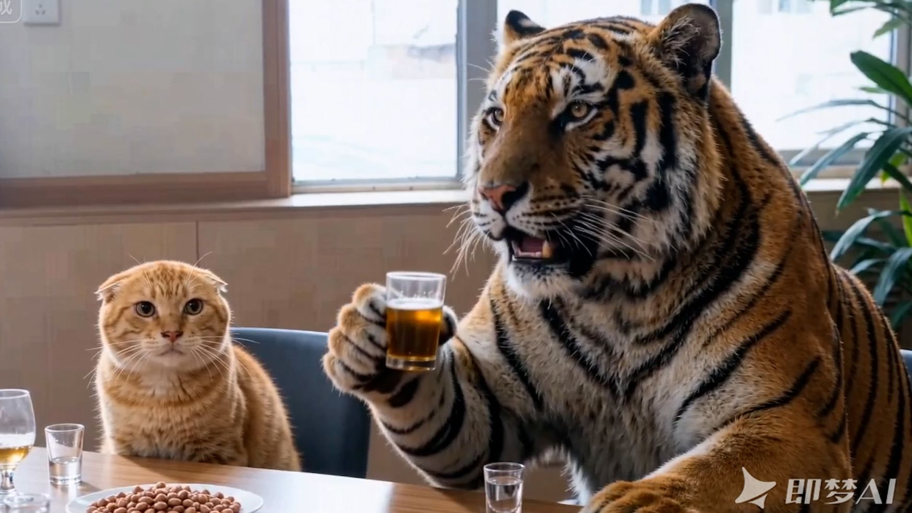 | 12.1万 | 2026-03-12 |
| [同是流浪猫 差别咋这么大](https://www.bilibili.com/video/BV1jEwAzRE58) | 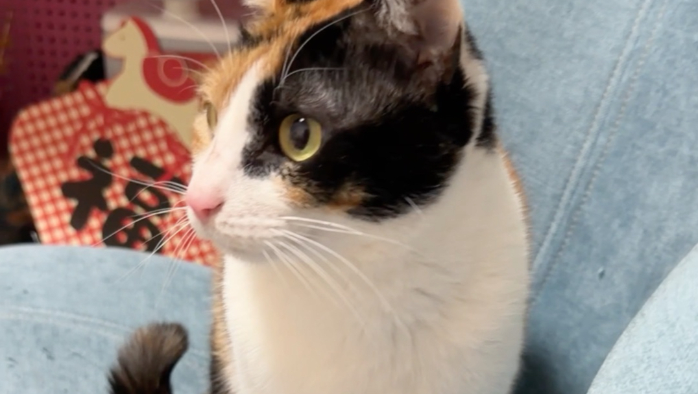 | 13.4万 | 2026-03-11 |
| [【哈基米音乐】哈基米哈绿豆哈压库🐱谢谢哈的温柔🐱](https://www.bilibili.com/video/BV1PFwczFEwf) | 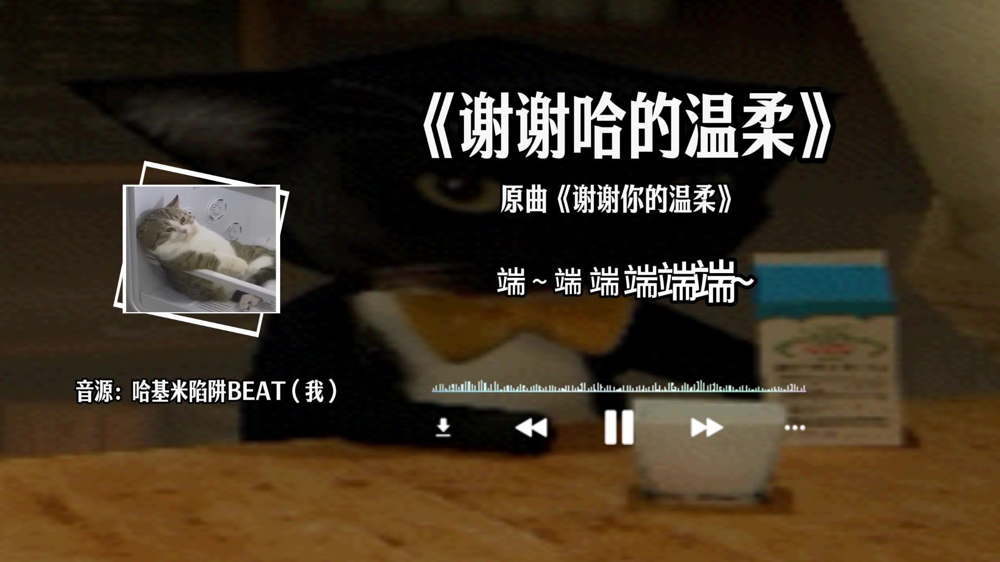 | 125 | 2026-03-11 |
| [【原曲不使用】🐱僵王博士の小曲 - Brainiac Maniac🐱（一分钟版）](https://www.bilibili.com/video/BV11owFzwEh4) |  | 4647 | 2026-03-11 |
| [“时刻保持蘸豆状态是一只鼠的基本素养”](https://www.bilibili.com/video/BV1Ckwcz8Ecf) |  | 9.3万 | 2026-03-11 |
| [哈基米](https://www.bilibili.com/video/BV1LgcfzyEkZ) | 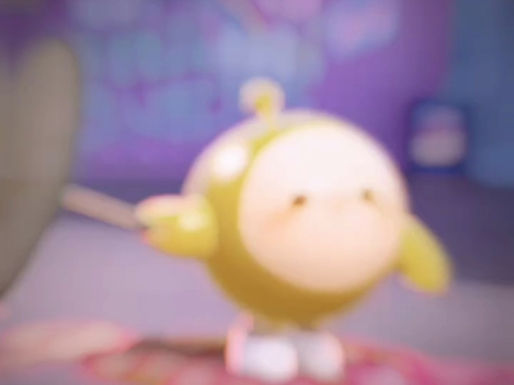 | 3 | 2026-03-11 |
| [小哈基米要在大哈基米的陪同下观看](https://www.bilibili.com/video/BV1ETcfz2EGY) |  | 305 | 2026-03-11 |
| [哈基米大学之如何洗衣服](https://www.bilibili.com/video/BV1yQcZzoESP) | 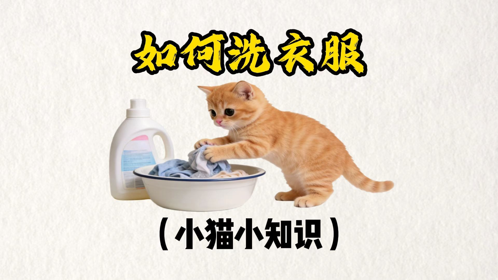 | 194 | 2026-03-11 |
| [哈吉米哦南北绿豆～](https://www.bilibili.com/video/BV1zacXzNEx4) | 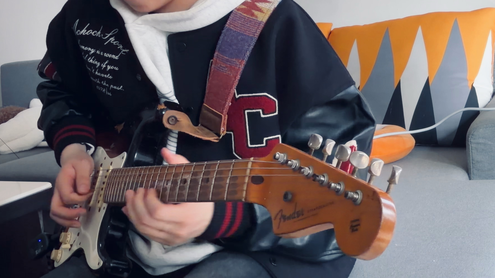 | 297 | 2026-03-10 |
| [哈基米消失了😨](https://www.bilibili.com/video/BV1UdNFzkEPR) |  | 561 | 2026-03-10 |
| [基米说](https://www.bilibili.com/video/BV1QyPZzGED9) | 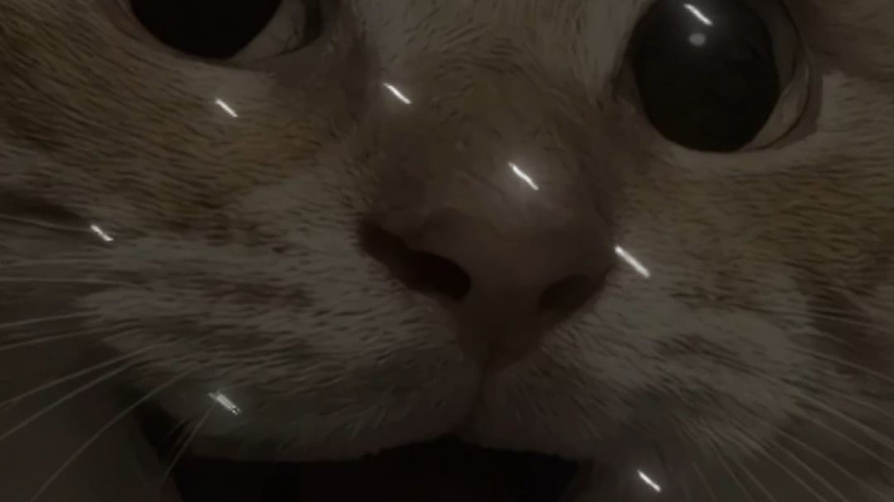 | 106 | 2026-03-10 |
| [哈基米脚被卡进电梯里，哈基人前来营救](https://www.bilibili.com/video/BV11BPfzKEkr) |  | 4281 | 2026-03-10 |
| [虐猫人士绞尽脑汁,不如爱猫人士灵机一动](https://www.bilibili.com/video/BV1VXPRzgE4L) | 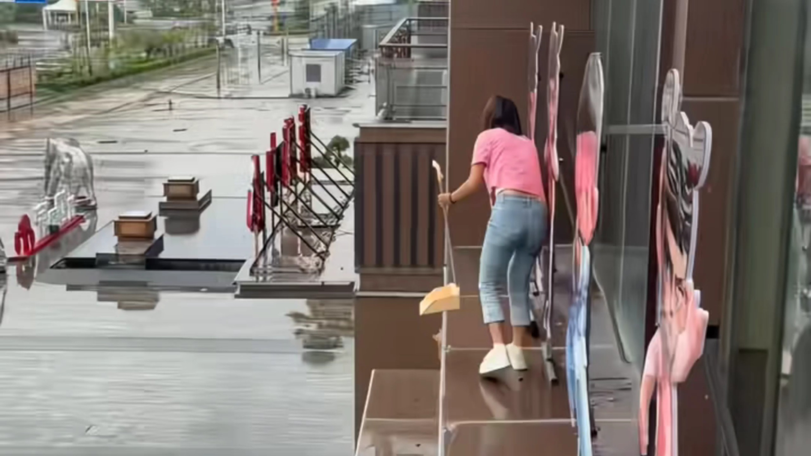 | 683 | 2026-03-09 |
| [哈基米](https://www.bilibili.com/video/BV1YPPDz4EkQ) |  | 3 | 2026-03-09 |
| [哈基米](https://www.bilibili.com/video/BV17UNMznEaL) | 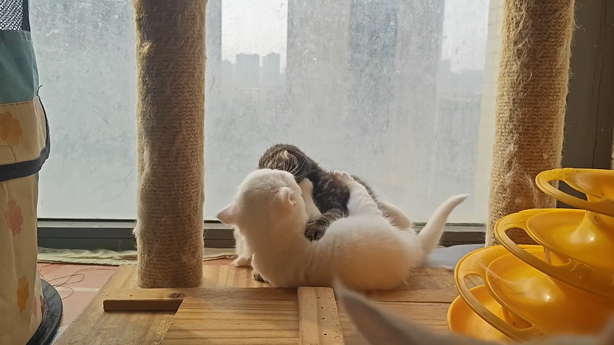 | 46 | 2026-03-08 |
| [哈基米音乐](https://www.bilibili.com/video/BV1tLNwzUEYi) | 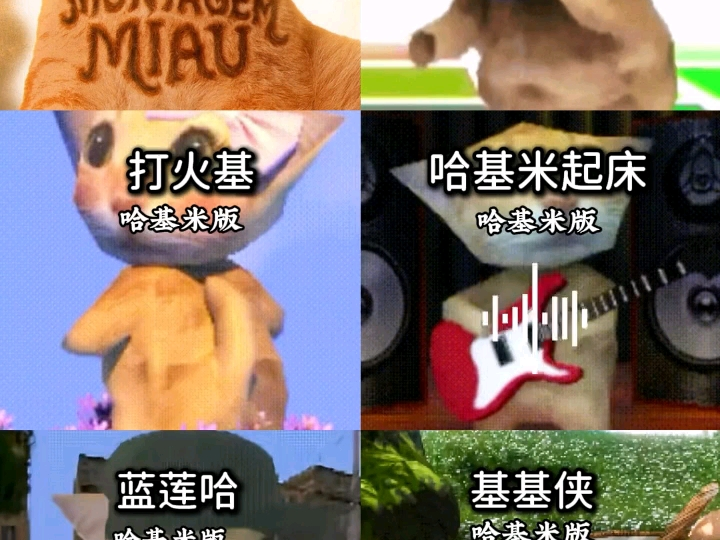 | 25 | 2026-03-07 |
| [今日话题：为什么全网都在用圆头耄耋当表情包](https://www.bilibili.com/video/BV1pLPgzoEjd) | 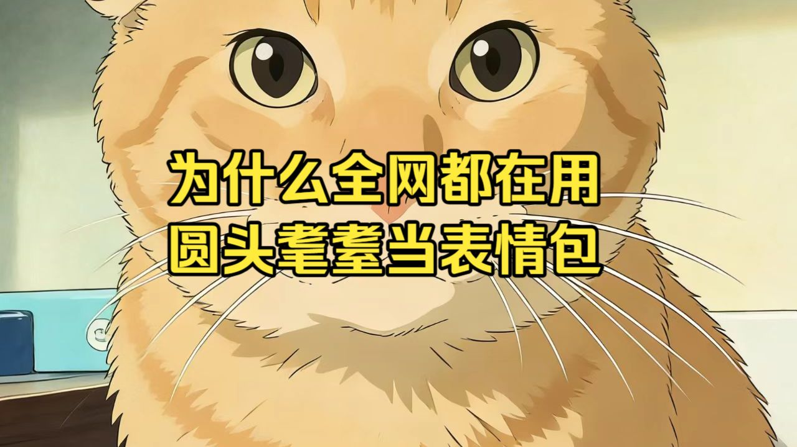 | 4.4万 | 2026-03-01 |
| [《严打》](https://www.bilibili.com/video/BV1trAezPEX7) |  | 5.4万 | 2026-02-28 |
| [大雄觉醒了](https://www.bilibili.com/video/BV1BYBMB7EM9) |  | 336.2万 | 2025-12-23 |
| [哈雪大帽险](https://www.bilibili.com/video/BV18wbYzwEoA) |  | 58.7万 | 2025-08-14 |
| [成功收容野生哈基米！](https://www.bilibili.com/video/BV15bKozHEdj) | 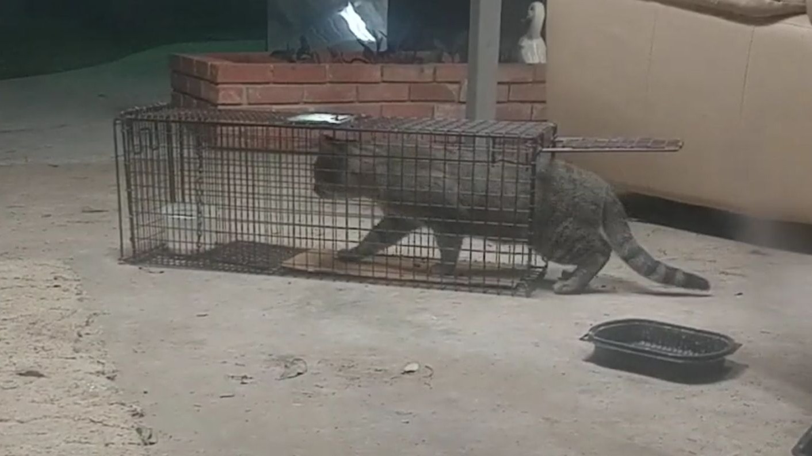 | 15.2万 | 2025-06-26 |
| [真正的哈基米为何物●︿●](https://www.bilibili.com/video/BV1ttMSzdE2u) |  | 2117 | 2025-06-14 |
| [🎵再见了，那蓝色眼眸的曼波🎵 [The Other Side of Paradise]](https://www.bilibili.com/video/BV1o9j2zSEXL) |  | 55.7万 | 2025-05-27 |
| [在实战中打出《出哈》（并非实战](https://www.bilibili.com/video/BV1WD5KzCEwD) |  | 105.5万 | 2025-05-08 |
| [丫丫，你没似啊？](https://www.bilibili.com/video/BV1fCQoYhE8q) |  | 150.2万 | 2025-03-19 |

---
*最后更新: 2026-03-14 03:34:45 (自动生成)*
*数据来源: [Bilibili](https://www.bilibili.com)*

## 使用说明

运行以下命令更新视频列表:
```bash
python3 fetch_hajimi_videos.py
```
