# awesome-hajimi
collections of hajimi (哈基米 in Chinese) on the Internet.

## 视频列表 (Video List)

| 视频标题 (Title) | 封面 | 播放量 (Views) | 发布日期 (Date) |
|---|---|---|---|
| [【无基米途】Parallel Manbo](https://www.bilibili.com/video/BV1wE5h6aE9s) |  | 8 | 2026-05-15 |
| [偶遇哈基米](https://www.bilibili.com/video/BV1XW5e6REMy) | 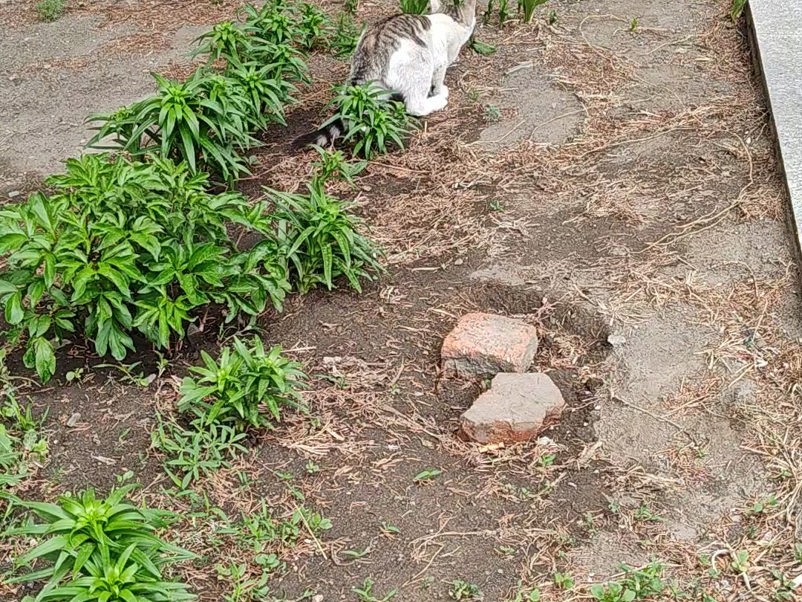 | 1 | 2026-05-15 |
| [哈基米之歌纯享版之蓝莲哈](https://www.bilibili.com/video/BV1wT5e6qEJM) |  | 348 | 2026-05-15 |
| [哈基米燃爆了！！！！](https://www.bilibili.com/video/BV1BV5e6aEwN) | 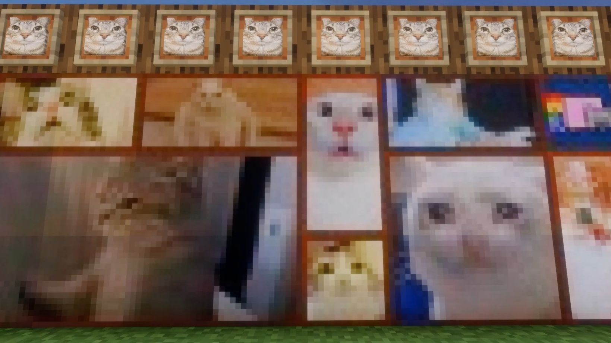 | 136 | 2026-05-15 |
| [《Beauty and a基米》](https://www.bilibili.com/video/BV1kC5p6GEXT) |  | 104 | 2026-05-15 |
| [哈基米](https://www.bilibili.com/video/BV1Zt5h6sEQg) | 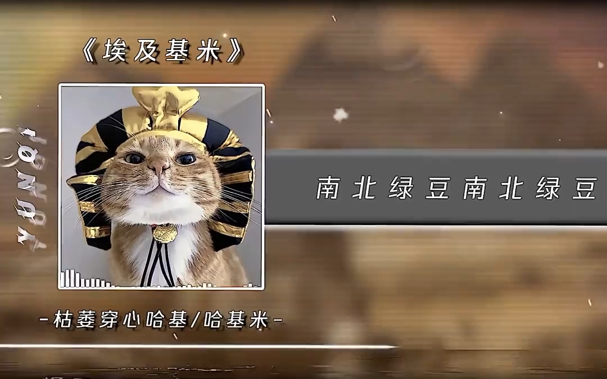 | 2 | 2026-05-15 |
| [嘎子剑手斧暴力真连，戳爆红狗火主双蹲哈基米！ ｜ 艾尔登法环PVP](https://www.bilibili.com/video/BV1Mr5S6bE1N) |  | 1090 | 2026-05-15 |
| [勇敢的哈基米](https://www.bilibili.com/video/BV1Le5h6HEvi) |  | 1 | 2026-05-15 |
| [超爽卡点！无伤哈基米药水，这游戏真的爽翻！](https://www.bilibili.com/video/BV1s55h6NEVU) |  | 3 | 2026-05-15 |
| [世界上最好的哈基米](https://www.bilibili.com/video/BV1Fp5h6fEzv) | 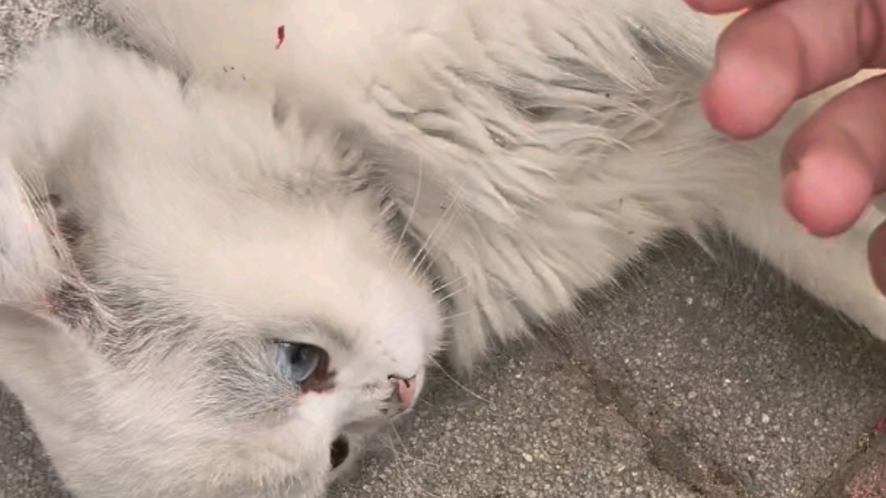 | 73 | 2026-05-15 |
| [哈基米录像之召唤曼波](https://www.bilibili.com/video/BV1g25h6VEXK) | 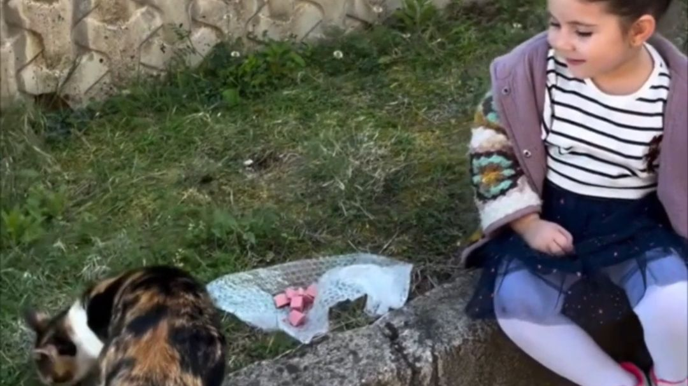 | 167 | 2026-05-15 |
| [哈基米你这家伙居然会飞吗？](https://www.bilibili.com/video/BV1xY586AEES) |  | 41 | 2026-05-14 |
| [难绷哈基米](https://www.bilibili.com/video/BV1uN5h63EAb) |  | 20 | 2026-05-14 |
| [平a穿插普攻，全图清理的手法哈基米](https://www.bilibili.com/video/BV159586UEKL) | 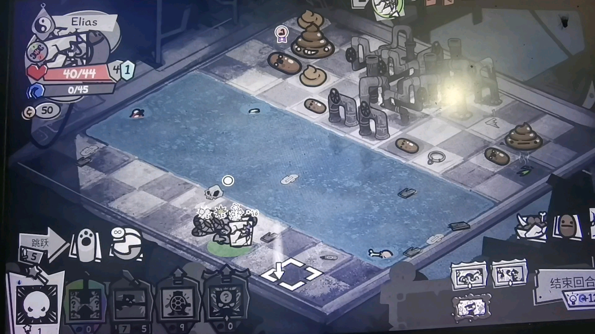 | 108 | 2026-05-14 |
| [哈基米百态之大狗二人转](https://www.bilibili.com/video/BV1QH5R62EDf) | 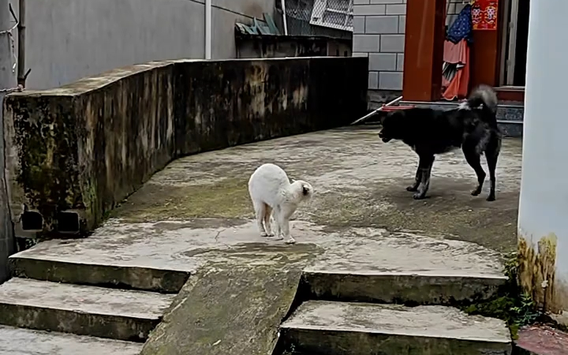 | 559 | 2026-05-14 |
| [【哈基米音乐】My Ordinary Life - Living Tomb Stone](https://www.bilibili.com/video/BV1o35R6WE9j) |  | 92 | 2026-05-14 |
| [我是哈基米🐱（面包）：厨房古战场](https://www.bilibili.com/video/BV1r25R68EQ1) |  | 94 | 2026-05-14 |
| [哈基米基米基，啊西嘎嘎啊西](https://www.bilibili.com/video/BV1kC5R6aEC1) |  | 44 | 2026-05-14 |
| [野生哈基米](https://www.bilibili.com/video/BV1k15R6cEim) | 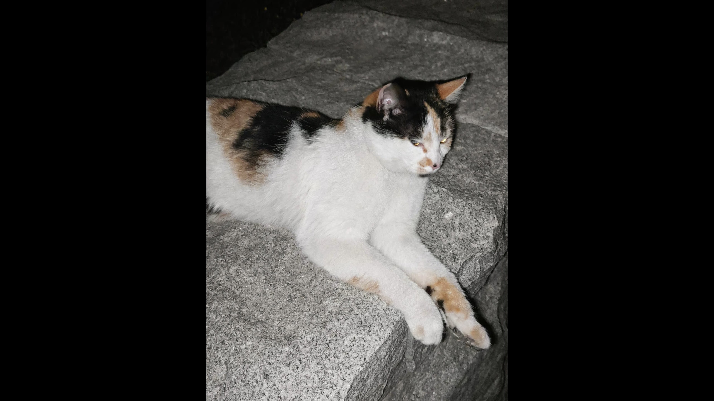 | 48 | 2026-05-14 |
| [哈基米磨南北路豆](https://www.bilibili.com/video/BV1k15R6cEPC) |  | 117 | 2026-05-14 |
| [史上最飞舞的哈基米出现了](https://www.bilibili.com/video/BV1Ki5R6MEp4) | 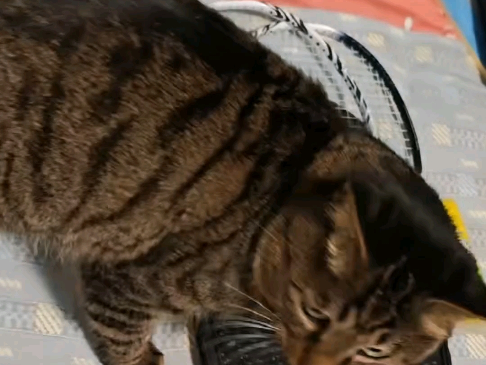 | 19 | 2026-05-14 |
| [哈基米](https://www.bilibili.com/video/BV12i5R6TESc) |  | 4577 | 2026-05-14 |
| [哈基米昔涟B款进度更新--实物](https://www.bilibili.com/video/BV1Ak5R6PEnD) |  | 7 | 2026-05-14 |
| [小猫卤肉饭，量大管饱](https://www.bilibili.com/video/BV1m75d6uELr) | 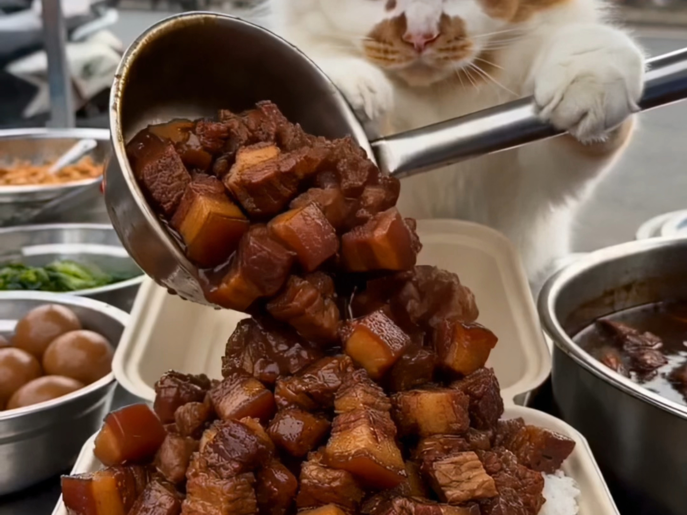 | 4794 | 2026-05-14 |
| [哈基米空中飞喵（废稿）](https://www.bilibili.com/video/BV1Zd5R6WEFt) |  | 3064 | 2026-05-14 |
| [蛮漂亮的哈基米](https://www.bilibili.com/video/BV1QK5d62Ev8) | 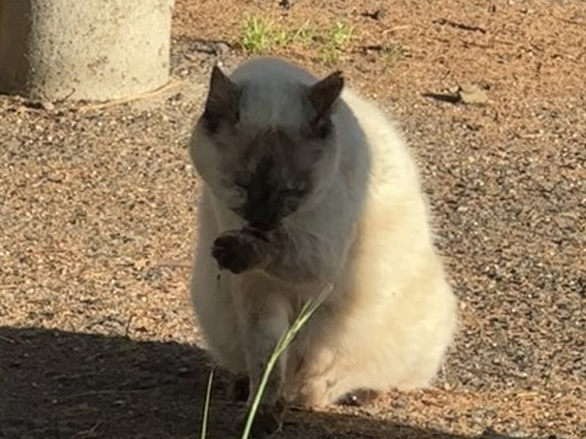 | 141 | 2026-05-14 |
| [请欣赏——『哈基米』（开源版）](https://www.bilibili.com/video/BV1Yw5d6JEJ9) |  | 436 | 2026-05-14 |
| [最喜欢的哈基米](https://www.bilibili.com/video/BV1jv5d6oEmY) |  | 4 | 2026-05-14 |
| [电影《哈基米》堂堂登场？](https://www.bilibili.com/video/BV19A5d6UEWe) |  | 357 | 2026-05-14 |
| [啊！草原！真大！](https://www.bilibili.com/video/BV1iq5d6xEax) |  | 1227 | 2026-05-14 |
| [哈基米音乐 DL6事件的小曲](https://www.bilibili.com/video/BV1ze5d6tExE) |  | 112 | 2026-05-14 |
| [哈基米](https://www.bilibili.com/video/BV1n85d6cEVS) |  | 30 | 2026-05-14 |
| [咪的头顶是信号接收器？](https://www.bilibili.com/video/BV16h5d68E5t) |  | 4.8万 | 2026-05-14 |
| [哈基米×电棍 ♿《星と僕らと (ottotofubeats Remix)》♿](https://www.bilibili.com/video/BV1Jh5d68E3M) |  | 391 | 2026-05-14 |
| [哈基米版12首金曲连唱](https://www.bilibili.com/video/BV1H45d6AEER) |  | 170 | 2026-05-14 |
| [显卡猫见到主人不问好被连扇巴掌](https://www.bilibili.com/video/BV16C5X69EA3) | 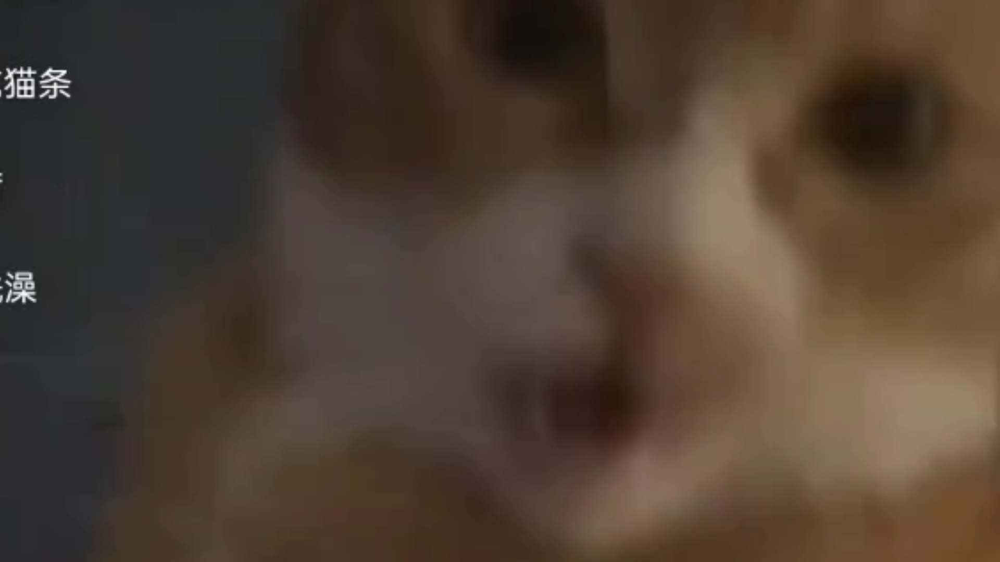 | 2009 | 2026-05-14 |
| [四仰八叉](https://www.bilibili.com/video/BV1dQ5X6EEk6) | 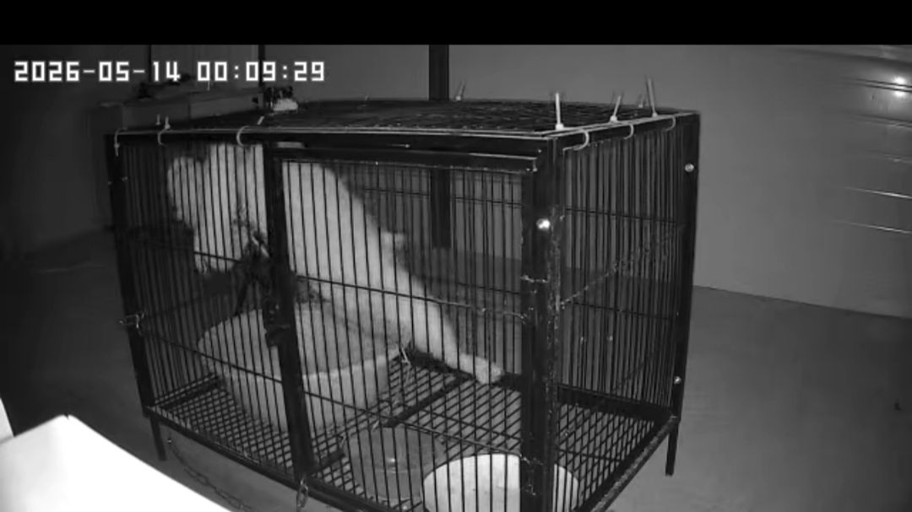 | 979 | 2026-05-14 |
| [哈基米真棒](https://www.bilibili.com/video/BV11a5X6wE8b) | 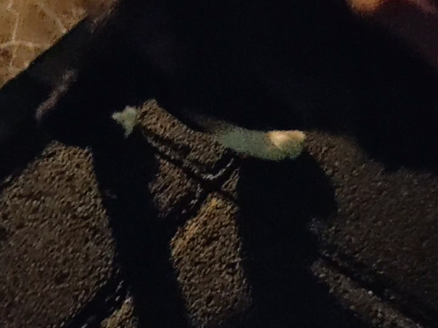 | 68 | 2026-05-14 |
| [小不点万敌和努努敌也要哈基米南北绿豆](https://www.bilibili.com/video/BV1285X6YEqm) |  | 1230 | 2026-05-14 |
| [哈基米~](https://www.bilibili.com/video/BV1rz5X64EDA) |  | 30 | 2026-05-14 |
| [哈基米：这是什么嘛？](https://www.bilibili.com/video/BV1Ai5X68E2p) | 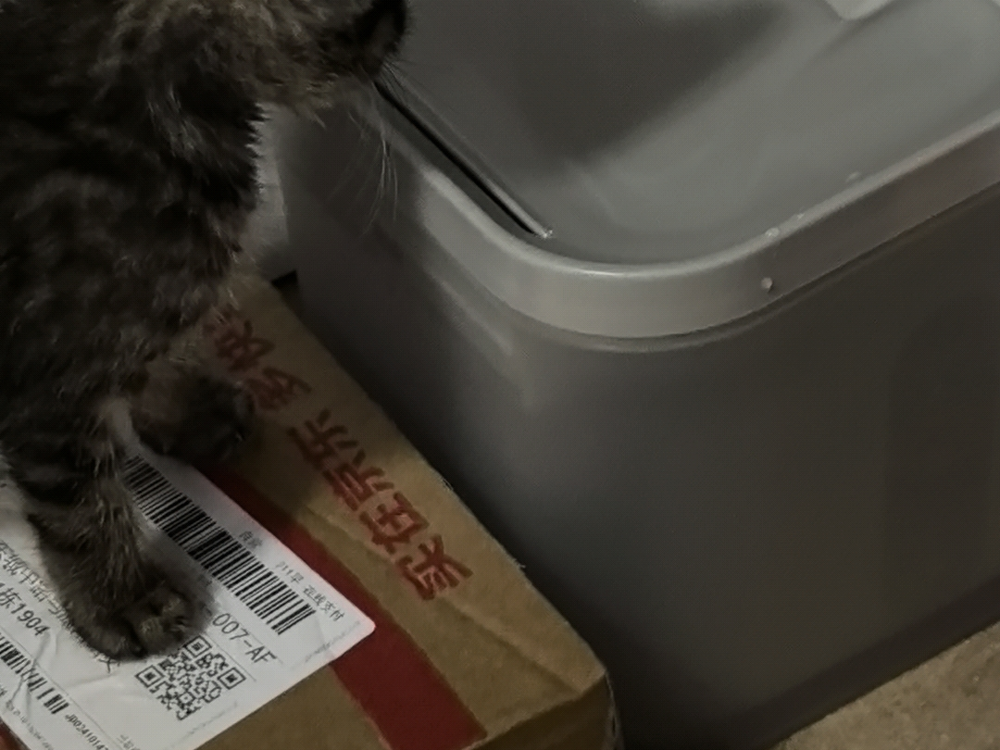 | 633 | 2026-05-14 |
| [三国哈基米](https://www.bilibili.com/video/BV14g596KEUx) |  | 21 | 2026-05-14 |
| [绝望的圆头哈基米](https://www.bilibili.com/video/BV18N596zEgV) |  | 2611 | 2026-05-14 |
| [这个哈基米王国还有人类吗](https://www.bilibili.com/video/BV11j596wEf2) |  | 24 | 2026-05-14 |
| [咪：你说人可真脆皮，本来毛发没咱多，掉了还不长，哎～](https://www.bilibili.com/video/BV1mV596PEnu) |  | 1.1万 | 2026-05-14 |
| [当哈基米河南蒜薹汁打开任督二脉！](https://www.bilibili.com/video/BV1eZ5X65E2Z) |  | 9698 | 2026-05-14 |
| [哈基米: 味真足](https://www.bilibili.com/video/BV1je596SER3) | 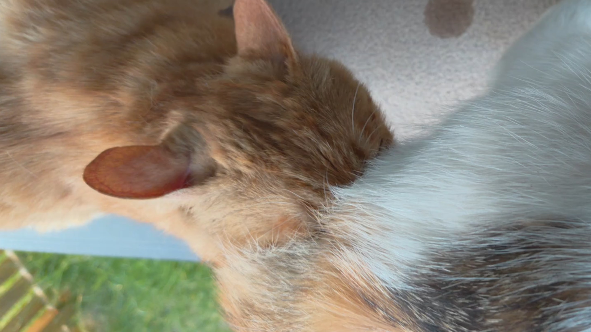 | 115 | 2026-05-14 |
| [【卡机哈基米】更新啦，赶紧来围观吧！](https://www.bilibili.com/video/BV1qh596QEc7) | 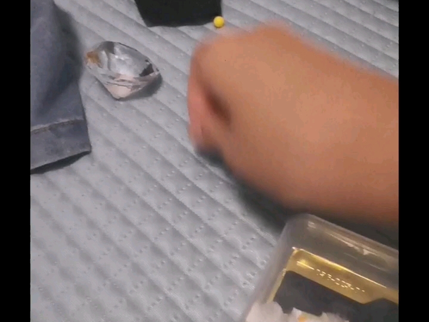 | 20 | 2026-05-14 |
| [电影“哈基米”即将开拍！！！](https://www.bilibili.com/video/BV1pH596fEoH) | 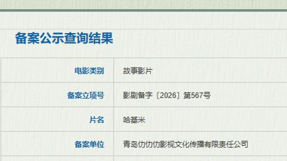 | 967 | 2026-05-14 |
| [？！哈基米  ！？](https://www.bilibili.com/video/BV15q596mEmg) |  | 1.8万 | 2026-05-14 |
| [哈基米史上最高的山](https://www.bilibili.com/video/BV1Vv5Q63ENk) | 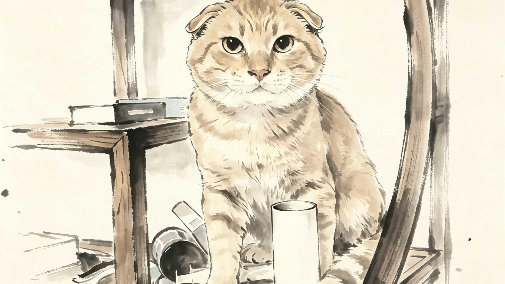 | 373 | 2026-05-14 |
| [蛋仔派对：有没有和我一样，想把哈基米带出来的？](https://www.bilibili.com/video/BV1PZ596PE8X) |  | 563 | 2026-05-14 |
| [小哈基米被妈妈哈基米叼起来走结果摔下来了幸好没事](https://www.bilibili.com/video/BV1Nf596YEhK) | 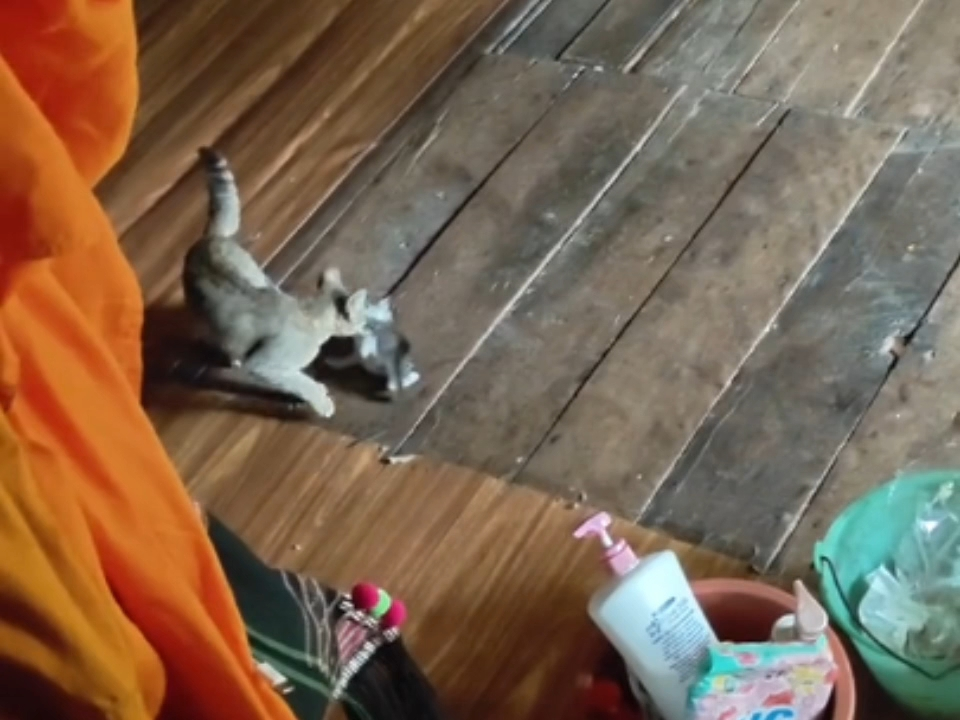 | 445 | 2026-05-14 |
| [第一弹：葛氏内绕（哈基米之歌）认准葛氏内绕，以防国内外soloham小偷偷偷占为己有](https://www.bilibili.com/video/BV182596rEdX) | 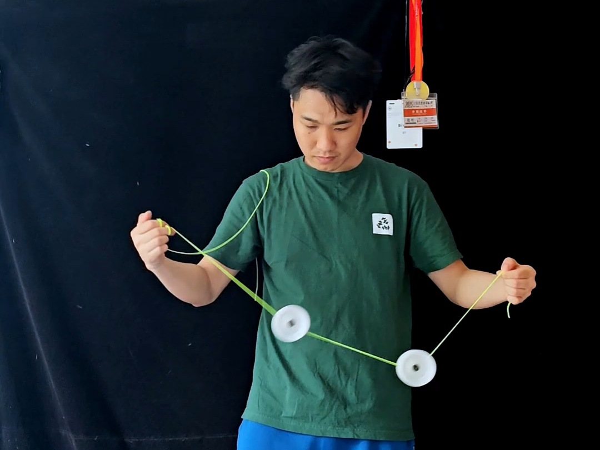 | 430 | 2026-05-14 |
| [【哈基暗】饿啊，来吧走起](https://www.bilibili.com/video/BV1TX596qEbK) |  | 175 | 2026-05-14 |
| [赶紧点个0.1元的奶茶陪给哈基米](https://www.bilibili.com/video/BV1r75Q6XECy) |  | 3 | 2026-05-14 |
| [哈基米玩小风扇](https://www.bilibili.com/video/BV1wc5X6WESv) | 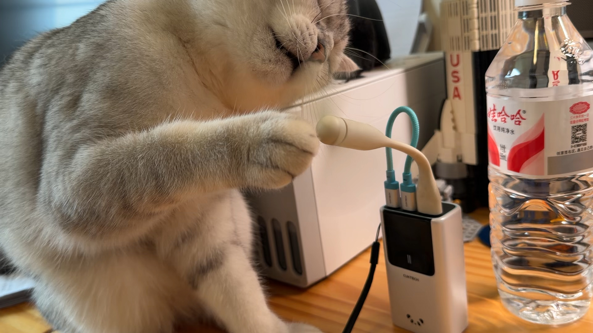 | 308 | 2026-05-14 |
| [哈基米快咬他啊](https://www.bilibili.com/video/BV19j5X6GE3C) |  | 10.0万 | 2026-05-14 |
| [哈基米对老吴这个感情深厚](https://www.bilibili.com/video/BV1ZK5D63EJ7) | 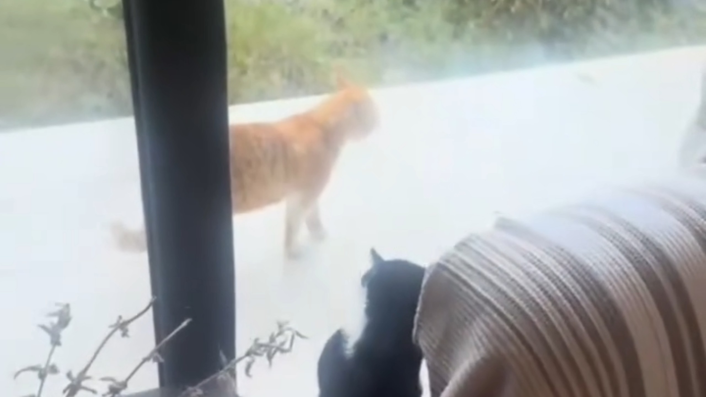 | 2052 | 2026-05-14 |
| [【神人杯day14】快 把 基 霸 关 上](https://www.bilibili.com/video/BV1c45y6eEKh) |  | 2455 | 2026-05-14 |
| [哈基米踏入陷阱啦！](https://www.bilibili.com/video/BV19N526xENE) |  | 5937 | 2026-05-14 |
| [哈基米系列（2）](https://www.bilibili.com/video/BV1Ya5S6vEVP) |  | 1.6万 | 2026-05-14 |
| [【哈基派】666新英雄你就玩吧👍](https://www.bilibili.com/video/BV1U5526JEqW) |  | 5.4万 | 2026-05-14 |
| [鼠最不怕失败 而是失去再来的勇气！](https://www.bilibili.com/video/BV146516CEHs) | 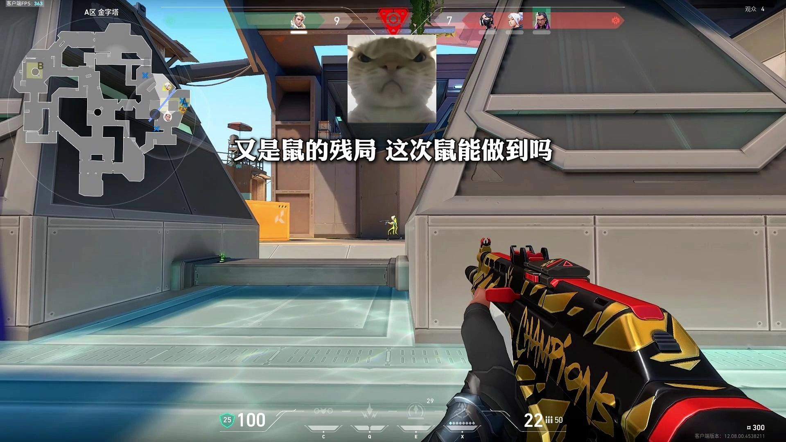 | 6.8万 | 2026-05-14 |
| [【补档】哈基米智取如意棒](https://www.bilibili.com/video/BV1zp5S6rE7M) | 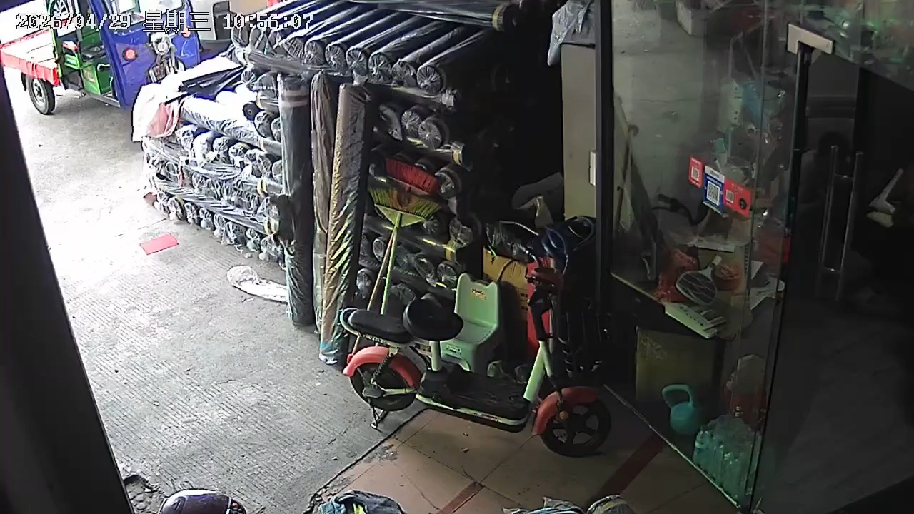 | 605 | 2026-05-14 |
| [充电哈基米](https://www.bilibili.com/video/BV1HR5S6SEzj) |  | 9247 | 2026-05-14 |
| [哈基米南北绿豆](https://www.bilibili.com/video/BV1zi526NEEZ) |  | 219 | 2026-05-14 |
| [哈基米](https://www.bilibili.com/video/BV12b5D6xEY3) | 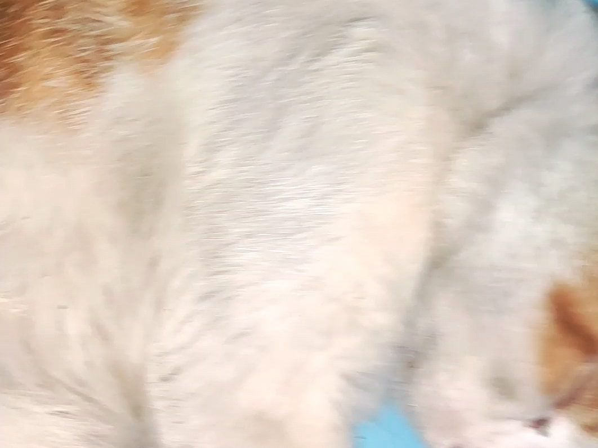 | 2 | 2026-05-13 |
| [盘点爆火的哈基米小曲第二弹](https://www.bilibili.com/video/BV1XN526xErR) |  | 121 | 2026-05-13 |
| [猫：你最好解释一下这东西能不能吃](https://www.bilibili.com/video/BV1At526rE4X) | 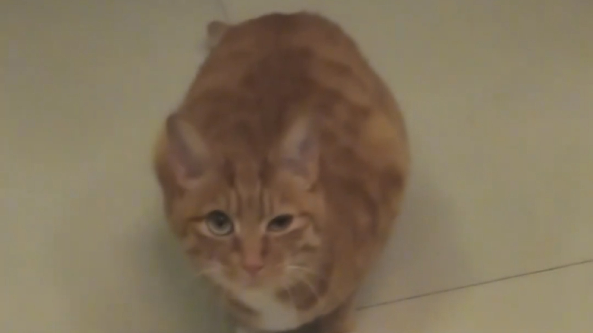 | 25.7万 | 2026-05-13 |
| [用心良苦？](https://www.bilibili.com/video/BV1hX526WEU8) | 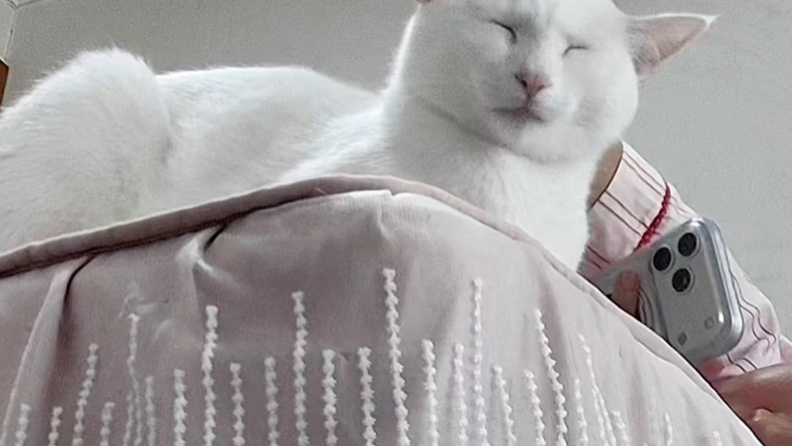 | 2.1万 | 2026-05-13 |
| [【娘化少女】哈机密南北绿豆](https://www.bilibili.com/video/BV1a15y6nEPs) |  | 6.2万 | 2026-05-13 |
| [一个比一个逆天 哈基米和大狗叫CCB，祖国人再次喜提冰男等身BJD](https://www.bilibili.com/video/BV1pT516TELq) |  | 3693 | 2026-05-13 |
| [刀盾狗：哈基米，新时代没有承载你的船了](https://www.bilibili.com/video/BV1N6516CEpu) |  | 1528 | 2026-05-13 |
| [哈基米：基米哀歌](https://www.bilibili.com/video/BV1u45C6yEWy) |  | 910 | 2026-05-13 |
| [哈基米南北路多毛力](https://www.bilibili.com/video/BV1Xw5y6SEN9) |  | 1008 | 2026-05-13 |
| [现在的年轻猫真不让人省心](https://www.bilibili.com/video/BV1Uj556ZEvp) | 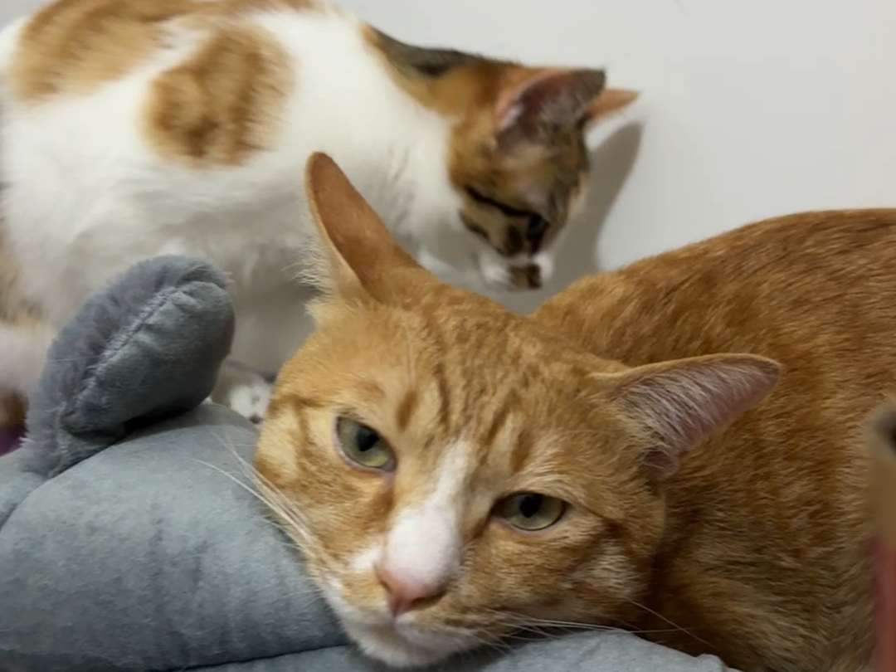 | 1.5万 | 2026-05-13 |
| [爱猫TV，你崛起吧](https://www.bilibili.com/video/BV1Hu5V6yENF) | 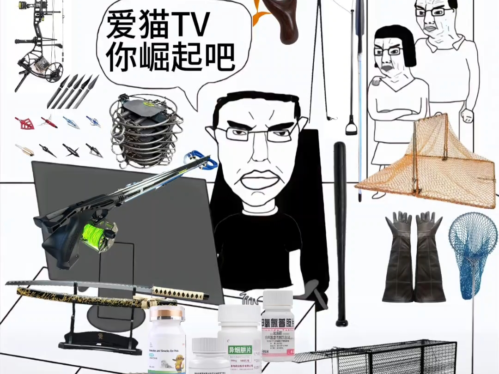 | 120 | 2026-05-12 |
| [猫是中华田园猫，狗是中华田园犬！](https://www.bilibili.com/video/BV19R5T6UEuh) | 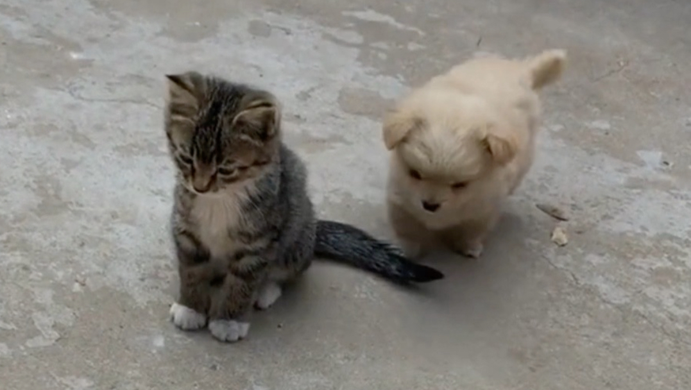 | 13.9万 | 2026-05-12 |
| [猫儿这个魅惑](https://www.bilibili.com/video/BV1925A6BEpi) |  | 11.0万 | 2026-05-11 |
| [可爱侵略症犯了](https://www.bilibili.com/video/BV1bP5J6GEYE) | 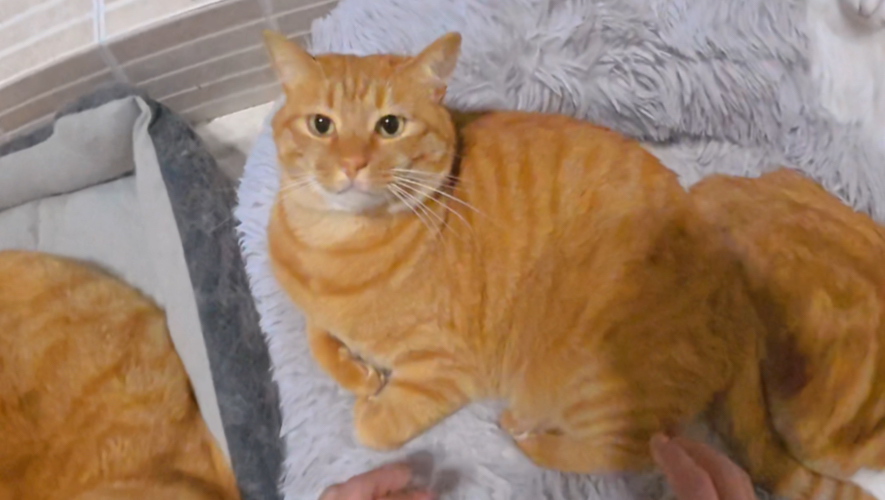 | 9.0万 | 2026-05-11 |
| [⚡我 早 已 麻 痹⚡️](https://www.bilibili.com/video/BV1oE5p6bEEC) |  | 3696 | 2026-05-11 |
| [相爱的我俩难道有错吗](https://www.bilibili.com/video/BV1tM5J6zE9D) |  | 49.7万 | 2026-05-10 |
| [“  职 场 四 基 米 ！ ？”](https://www.bilibili.com/video/BV1Ex576JEca) |  | 3.8万 | 2026-05-10 |
| [米子米也要哈基米南北绿豆](https://www.bilibili.com/video/BV1PR5768EPn) |  | 158 | 2026-05-10 |
| [【kards】谁是最强哈基米](https://www.bilibili.com/video/BV1QJ5E6GEqp) | 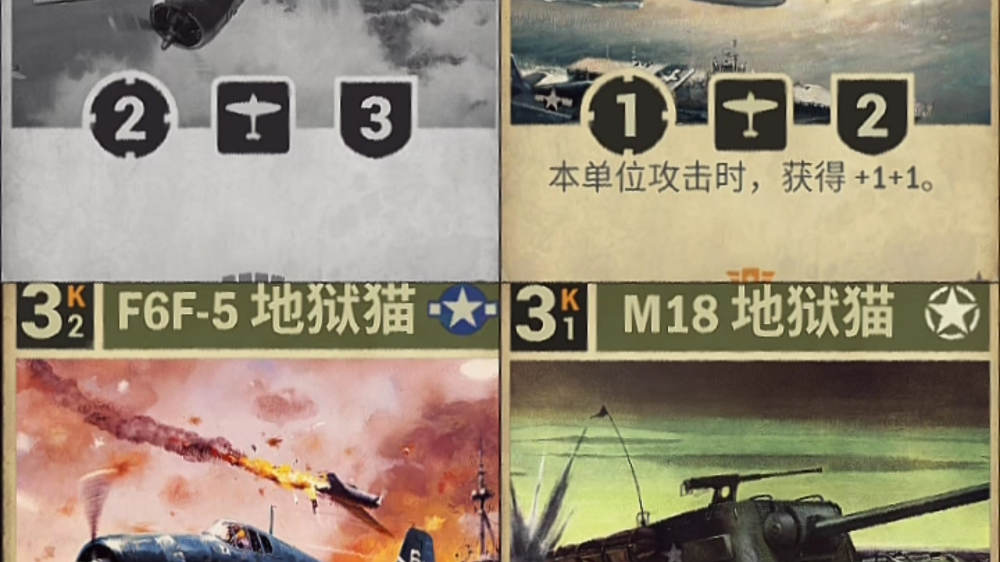 | 5033 | 2026-05-10 |
| [【史诗哈基米】「基米拯救2」最后的冲锋时的震撼配乐！](https://www.bilibili.com/video/BV1umRRB3Eda) |  | 3145 | 2026-05-09 |
| [大橘哥148-这只老虎有点像猫是怎么回事](https://www.bilibili.com/video/BV16rR9BxEnU) | 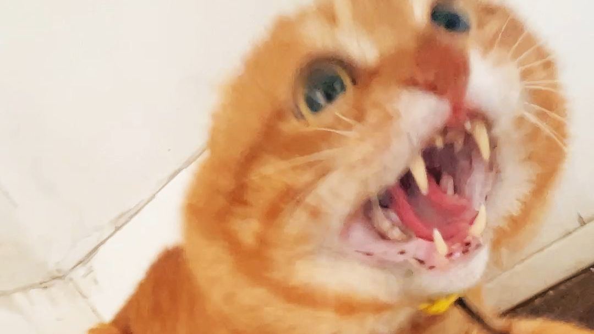 | 31.6万 | 2026-05-09 |
| [龙 相 尽 显](https://www.bilibili.com/video/BV1oARQBCEYz) | 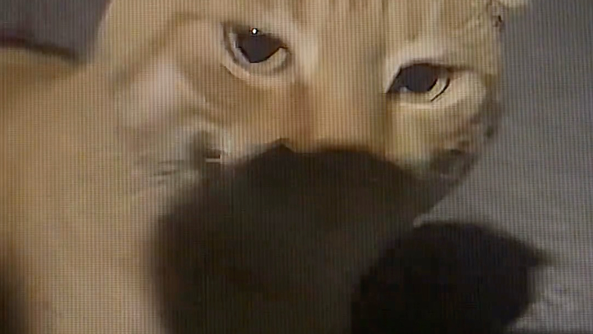 | 75.6万 | 2026-05-09 |
| [（补档）[MMD](ᗜ ˰ ᗜ)：哈基米南北绿豆](https://www.bilibili.com/video/BV1r4dMBcE4V) |  | 331 | 2026-05-08 |
| [哈基米大学生关灯神器，外壳是在嘉立创3D打印的](https://www.bilibili.com/video/BV1NrduBkEZf) | 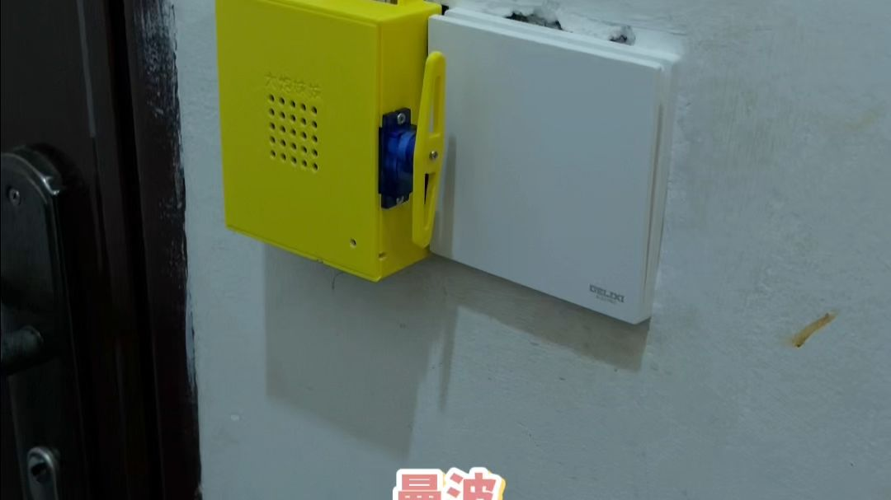 | 76.8万 | 2026-05-08 |
| [哈基米](https://www.bilibili.com/video/BV1EJREB9EZC) | 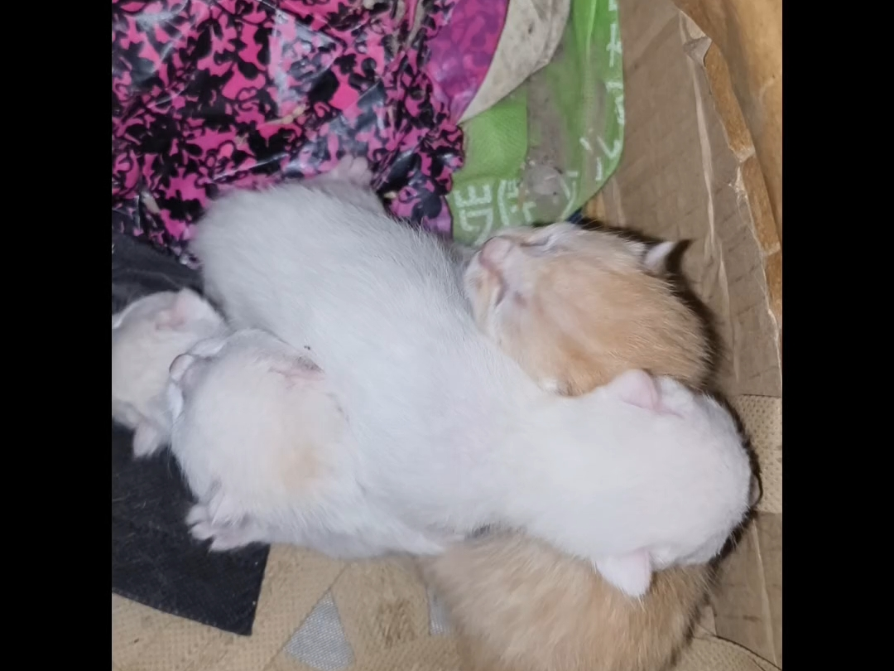 | 268 | 2026-05-02 |
| [萌妹哈基龙](https://www.bilibili.com/video/BV13V9aBGEXw) |  | 74.3万 | 2026-04-30 |
| [外面太危险了，保护哈基米](https://www.bilibili.com/video/BV1w2QxBBEMT) | 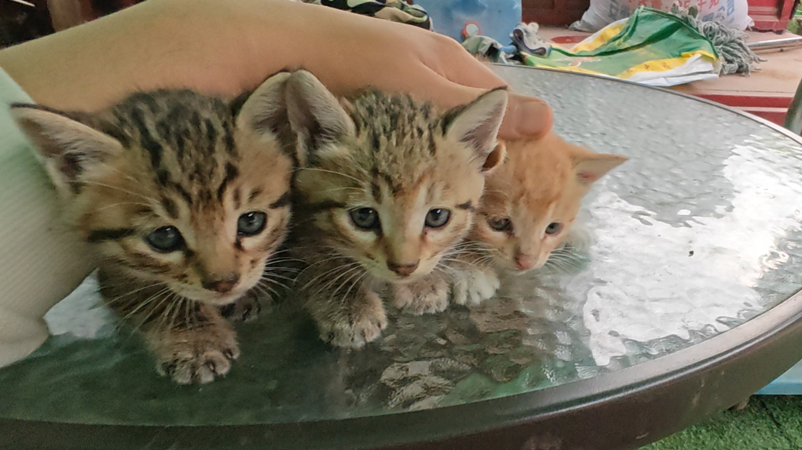 | 2613 | 2026-04-13 |
| [意外相遇......](https://www.bilibili.com/video/BV1PvDSBgEmF) | 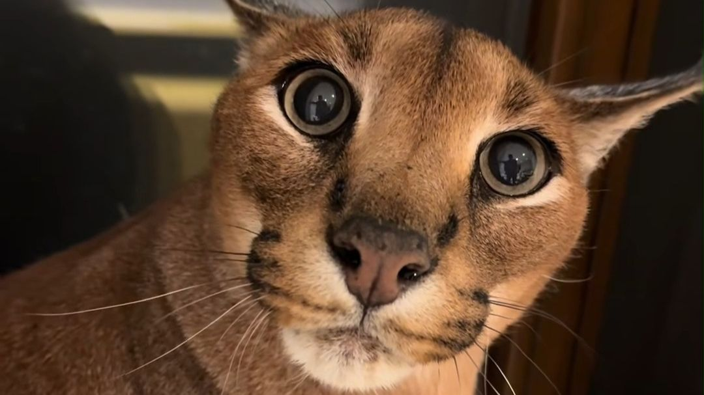 | 1.8万 | 2026-04-12 |
| [【哈基米｜180节拍器】跑步音乐 此时哈声胜有声（自用）](https://www.bilibili.com/video/BV1sTe8zfENV) |  | 840 | 2025-08-22 |
| [基米cospaly减速带](https://www.bilibili.com/video/BV1KbGJzEE9s) |  | 12.2万 | 2025-07-11 |
| [哈基米:南北绿豆开漫坡(红山果)](https://www.bilibili.com/video/BV1jj37zREvE) |  | 1.4万 | 2025-07-04 |
| [52分钟小小哈基米](https://www.bilibili.com/video/BV1XER1YfE6Q) |  | 604 | 2025-04-07 |
| [纯麦的哈基米](https://www.bilibili.com/video/BV16cA6eLEB1) | 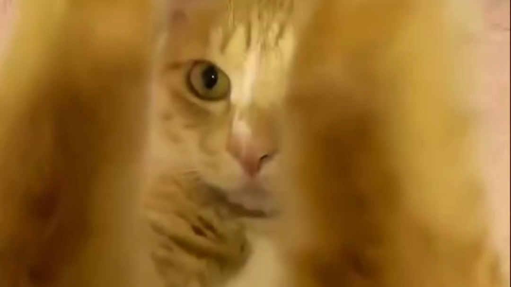 | 50.4万 | 2025-02-19 |

---
*最后更新: 2026-05-15 03:22:22 (自动生成)*
*数据来源: [Bilibili](https://www.bilibili.com)*

## 使用说明

运行以下命令更新视频列表:
```bash
python3 fetch_hajimi_videos.py
```
