# awesome-hajimi
collections of hajimi (哈基米 in Chinese) on the Internet.

## 视频列表 (Video List)

| 视频标题 (Title) | 封面 | 播放量 (Views) | 发布日期 (Date) |
|---|---|---|---|
| [哈基米饿了四天已学会醉拳](https://www.bilibili.com/video/BV1Y59sBtEeq) | 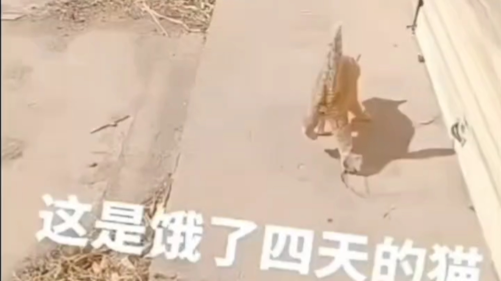 | 67 | 2026-04-02 |
| [【哈基米音乐】太平洋哈气条约组织胜利结算曲](https://www.bilibili.com/video/BV1RW9HB9E2T) |  | 178 | 2026-04-02 |
| [《动物社恐图鉴》](https://www.bilibili.com/video/BV1ZJ9JBUENd) | 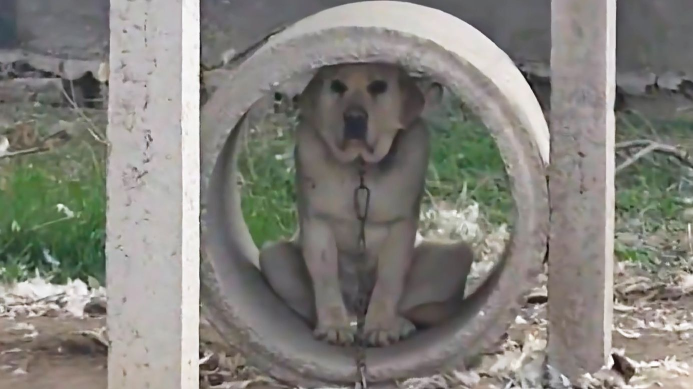 | 2.6万 | 2026-04-02 |
| [【哈基米音乐】🐱选人的小曲🐱（洛克王国世界手游）](https://www.bilibili.com/video/BV1CD9HBKENb) | 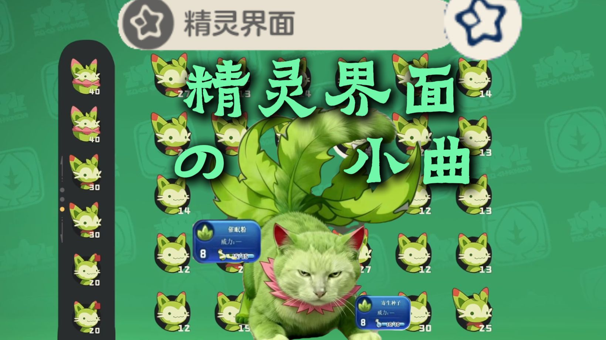 | 861 | 2026-04-01 |
| [哈基米瞬间](https://www.bilibili.com/video/BV19g9pBpETB) | 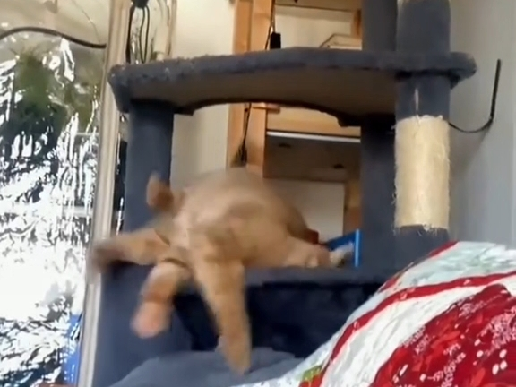 | 137 | 2026-04-01 |
| [这只哈基米真可爱](https://www.bilibili.com/video/BV1zZ9HBhE1J) | 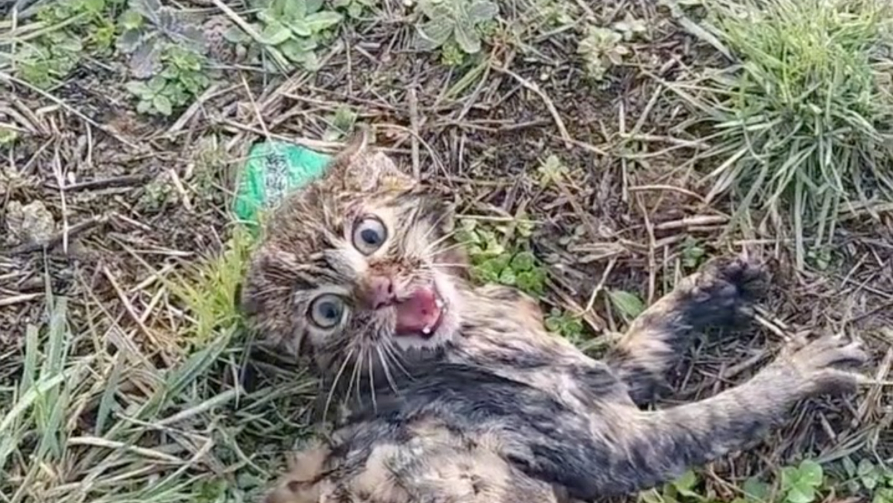 | 1601 | 2026-04-01 |
| [神人哈基米地图，但方向感很强](https://www.bilibili.com/video/BV1Xg9nByEGb) | 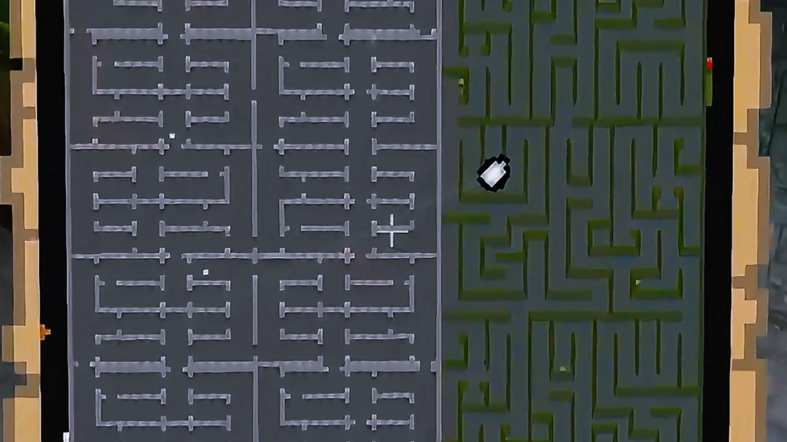 | 325 | 2026-04-01 |
| [哈基米互爱（六）](https://www.bilibili.com/video/BV14J9nBBEZ9) | 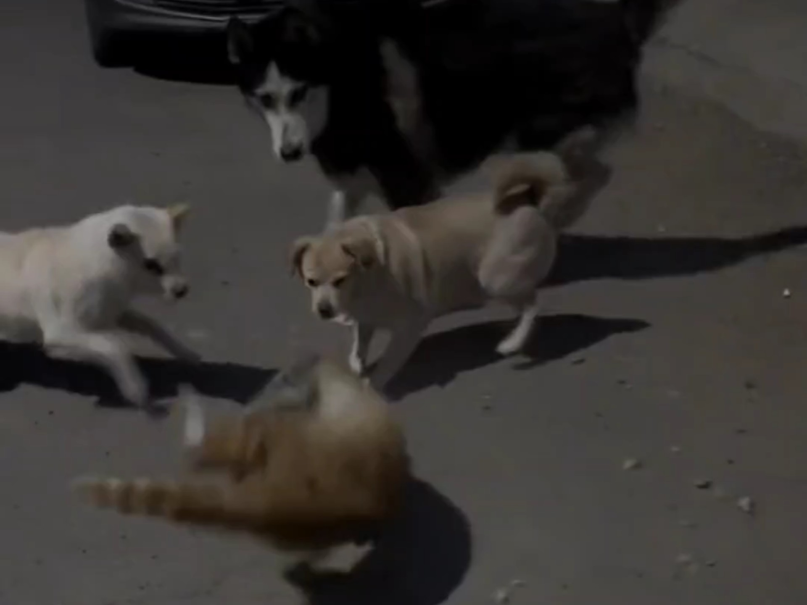 | 1071 | 2026-04-01 |
| [🐱](https://www.bilibili.com/video/BV1DM9EBMEuE) |  | 1529 | 2026-04-01 |
| [【哈基米FM】⚡️基米城堡⚡️](https://www.bilibili.com/video/BV13kXkBuES7) |  | 2951 | 2026-04-01 |
| [这个猫儿坠基](https://www.bilibili.com/video/BV1zX97BEE2Q) |  | 1793 | 2026-04-01 |
| [干嘛......](https://www.bilibili.com/video/BV1kt9EBsEeA) | 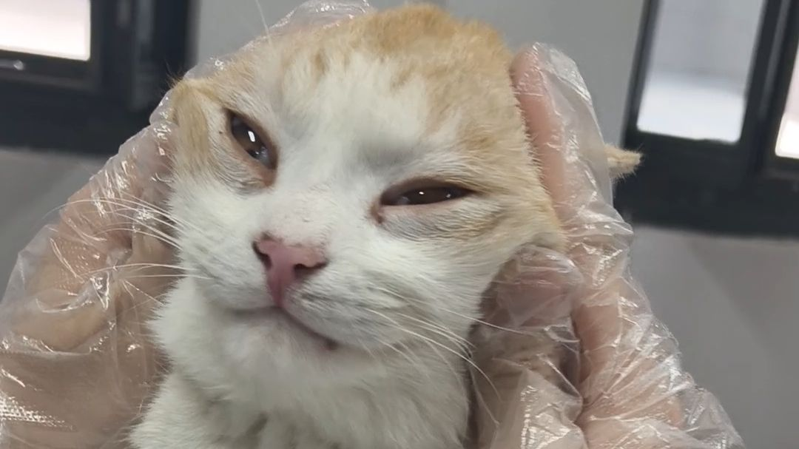 | 2627 | 2026-04-01 |
| [布鲁斯耐心的教哈基米怎么爬树](https://www.bilibili.com/video/BV1Ht9EBsELa) | 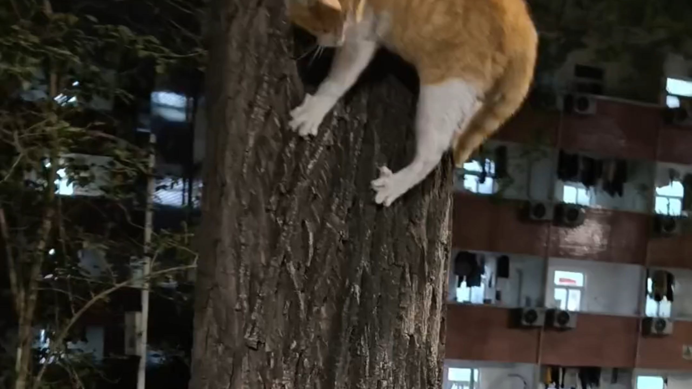 | 8149 | 2026-04-01 |
| [when哈基牡蛎想撸哈基米belike：](https://www.bilibili.com/video/BV1TE9EBaEJH) |  | 124 | 2026-04-01 |
| [【哈基米FM】🎵基宝岛🎵（新宝岛）](https://www.bilibili.com/video/BV1xE9EBhELZ) |  | 528 | 2026-04-01 |
| [咪团外卖 ｜ 第4集:咪的奇葩外卖经历2！](https://www.bilibili.com/video/BV18U9jBAEvD) | 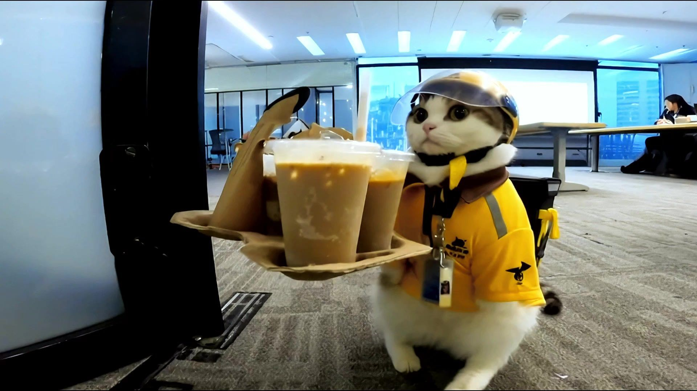 | 584 | 2026-04-01 |
| [哈基米这个哈气](https://www.bilibili.com/video/BV1M99EBqEkE) | 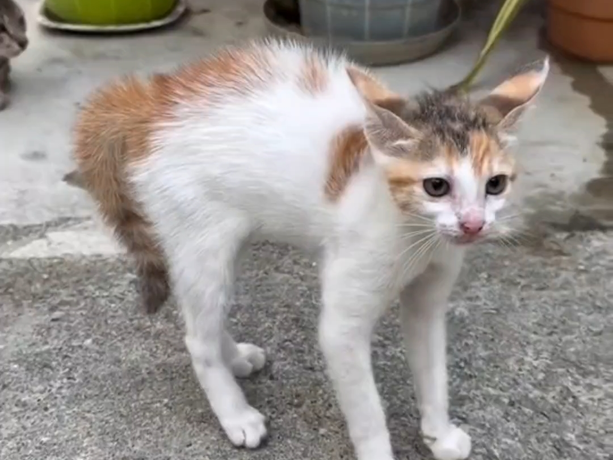 | 1030 | 2026-04-01 |
| [捡到的jk哈基米和黑皮犬娘](https://www.bilibili.com/video/BV1Td9EBKE4K) |  | 1.8万 | 2026-04-01 |
| [《基米一败涂地》](https://www.bilibili.com/video/BV1Nw9JBwEqF) | 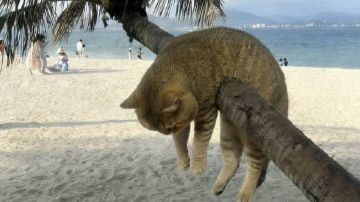 | 1591 | 2026-04-01 |
| [【哈基动物园250.250期】](https://www.bilibili.com/video/BV1Tf9EBPEUb) | 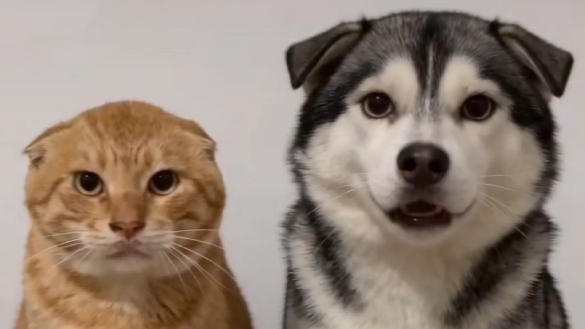 | 539 | 2026-04-01 |
| [哈基米战役之霸山为王（？](https://www.bilibili.com/video/BV1Lr9EB1EWy) | 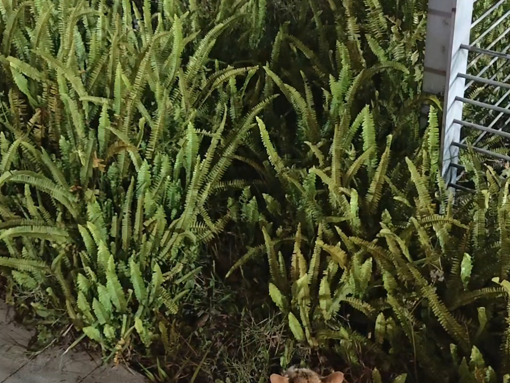 | 393 | 2026-04-01 |
| [哈基米这个遇见好主人](https://www.bilibili.com/video/BV1gS9EBgE7S) | 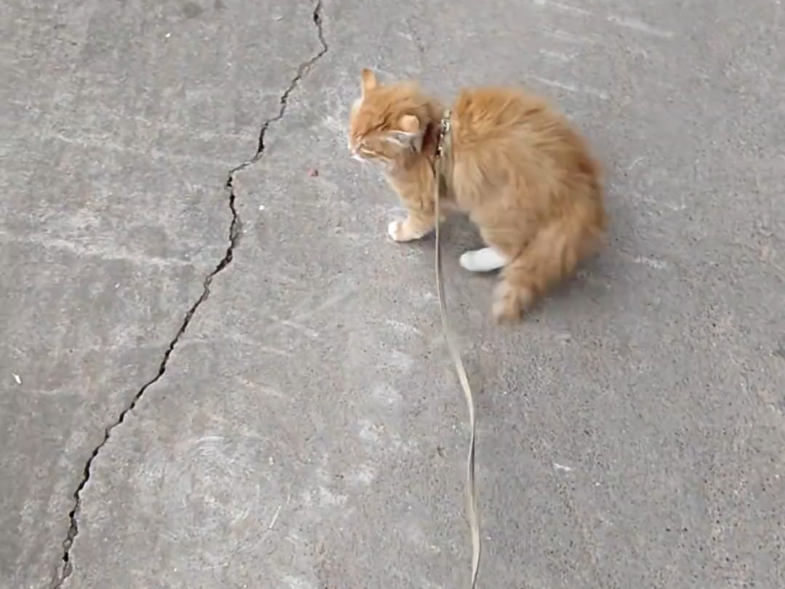 | 705 | 2026-04-01 |
| [是哈基miku不是哈基米](https://www.bilibili.com/video/BV1fj9JBDEYQ) |  | 909 | 2026-04-01 |
| [基米TV之报恩好猫15分钟剧场版，一次看个够！](https://www.bilibili.com/video/BV17Y9jBVEyt) | 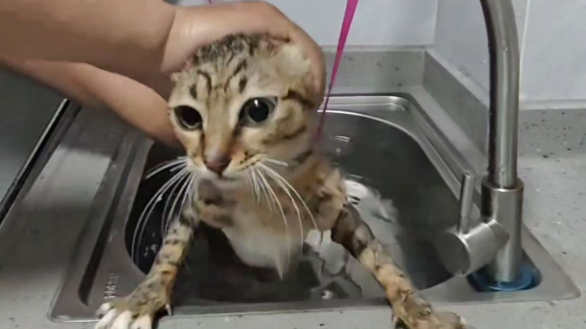 | 7486 | 2026-04-01 |
| [哈基米～](https://www.bilibili.com/video/BV1qY9jBVEgS) |  | 1351 | 2026-04-01 |
| [磁 化 基 米 【YUTANG】](https://www.bilibili.com/video/BV1je9jBkEGp) |  | 7531 | 2026-04-01 |
| [震惊！《哈基米厂长进化史》公布！](https://www.bilibili.com/video/BV1je9jBkEm2) |  | 1110 | 2026-04-01 |
| [养了两年的猫还是对我哈气了😭😭😭](https://www.bilibili.com/video/BV1fh9jByEoX) | 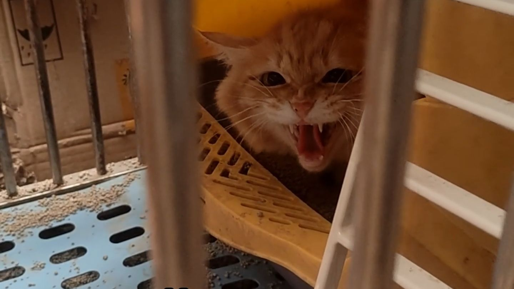 | 797 | 2026-04-01 |
| [对，大概就是哈基米](https://www.bilibili.com/video/BV1NL9jB9E6F) | 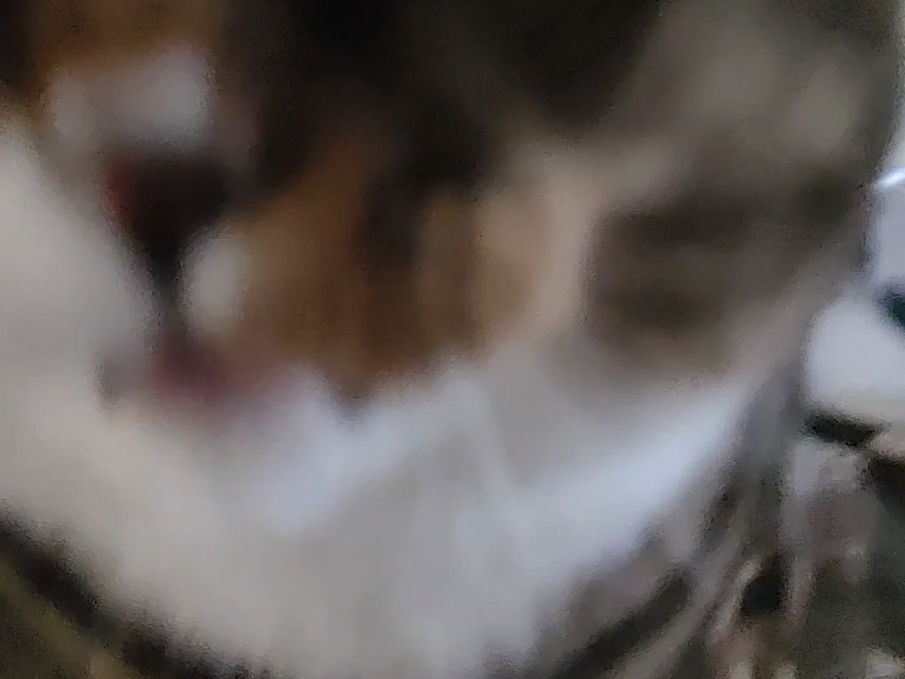 | 0 | 2026-04-01 |
| [哈基米依旧启动代码化身捷豹](https://www.bilibili.com/video/BV1yE9jBXEtD) | 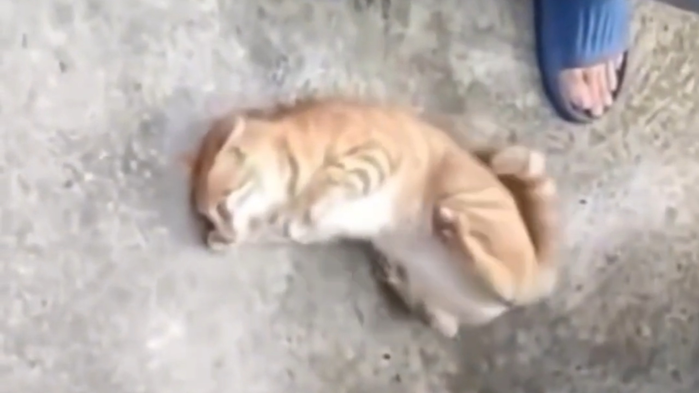 | 2.8万 | 2026-04-01 |
| [哈基米被三只哈基米交配](https://www.bilibili.com/video/BV1bQ9jBcEXU) | 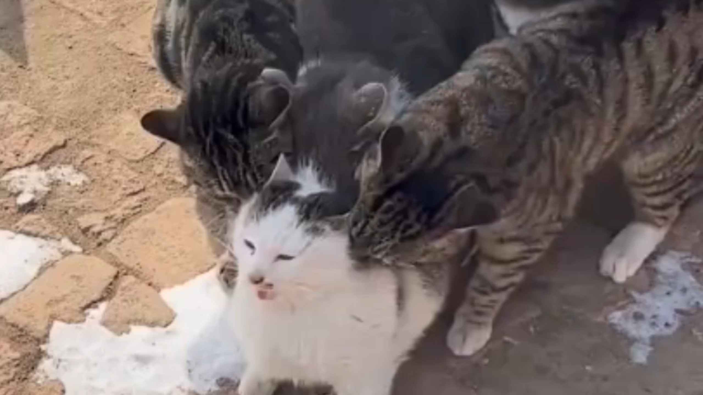 | 197 | 2026-04-01 |
| [【新品发布会】专为哈基米而生！红魔哈基米平板5Pro重磅来袭！](https://www.bilibili.com/video/BV1UX9jB8Eik) |  | 19.3万 | 2026-04-01 |
| [【智人TV】把儿子培养成张凌赫](https://www.bilibili.com/video/BV1S897BPE3W) |  | 8.8万 | 2026-04-01 |
| [【哈基米】快对他使用黑闪！！](https://www.bilibili.com/video/BV1Vz95BhEcF) |  | 12.4万 | 2026-04-01 |
| [我没死你觉得很意外吗](https://www.bilibili.com/video/BV1Q29jBeERW) | 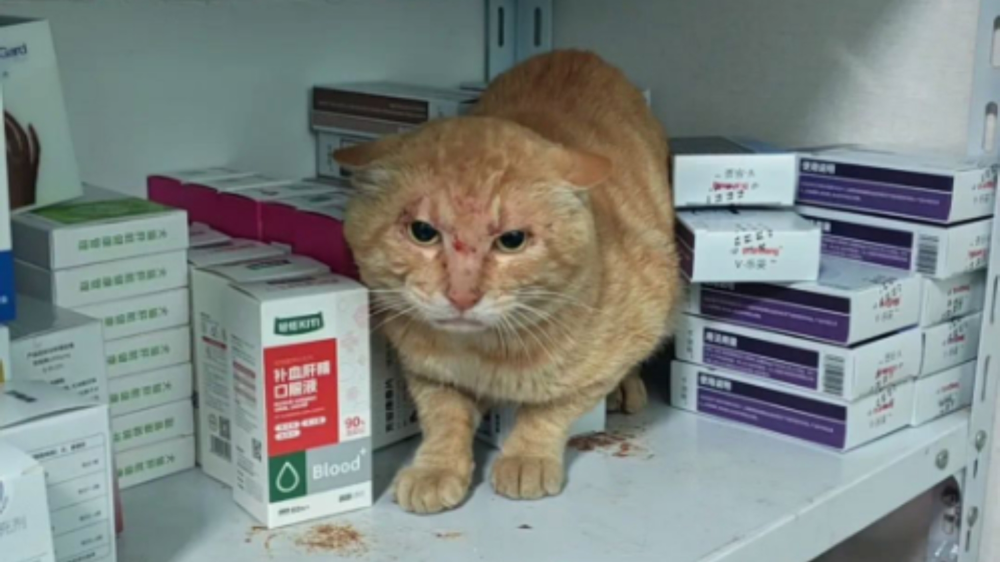 | 5.5万 | 2026-04-01 |
| [电梯被小耄霸占了！](https://www.bilibili.com/video/BV1oG97B1E8q) | 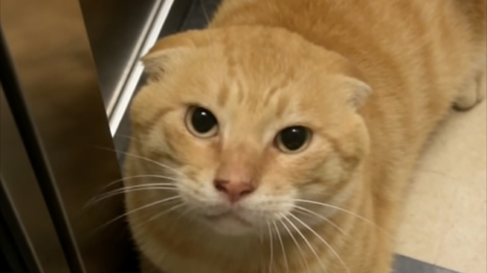 | 5634 | 2026-04-01 |
| [橘猫VS豹猫](https://www.bilibili.com/video/BV1B597BLEjX) | 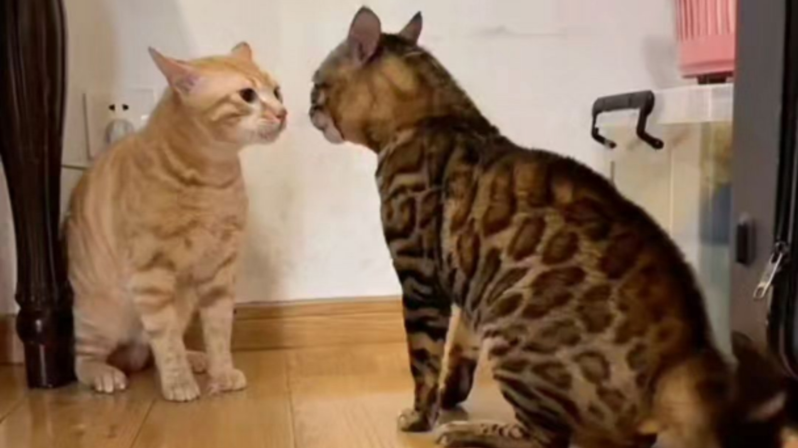 | 1491 | 2026-04-01 |
| [哈基米最阴的一集](https://www.bilibili.com/video/BV1XH97BzEfF) | 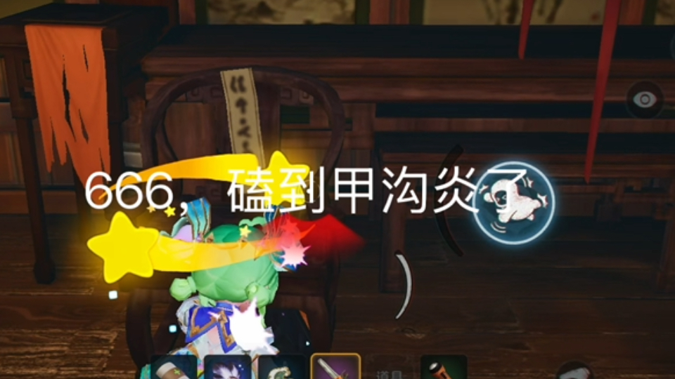 | 333 | 2026-04-01 |
| [猫狗大战！](https://www.bilibili.com/video/BV17397B7Eyc) |  | 32.6万 | 2026-04-01 |
| [抓到5个哈基米](https://www.bilibili.com/video/BV1GW97BuEUG) | 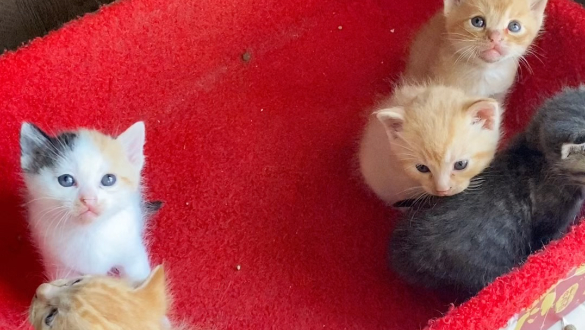 | 245 | 2026-04-01 |
| [【哈基动物园250期】](https://www.bilibili.com/video/BV1AA97BXEqe) | 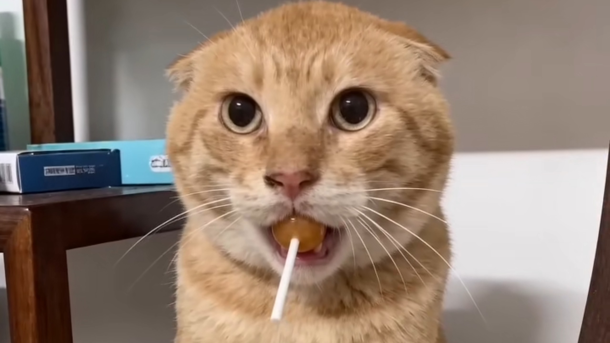 | 1417 | 2026-04-01 |
| [哈哈哈，哈基米的小眼神](https://www.bilibili.com/video/BV1Zu97BmEfw) | 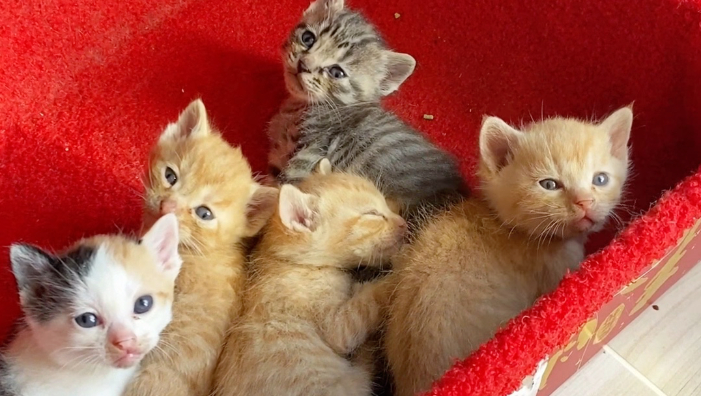 | 400 | 2026-04-01 |
| [五只哈基米南北绿豆在柜子里](https://www.bilibili.com/video/BV1PB97BfEmp) | 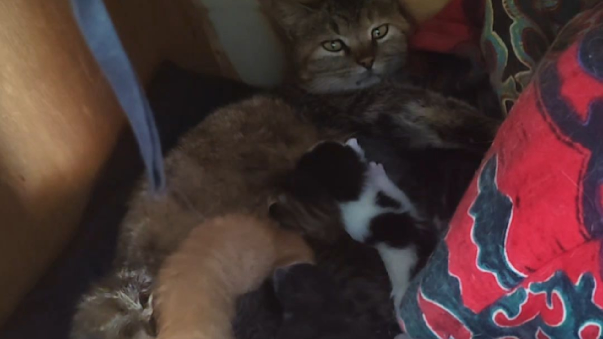 | 164 | 2026-04-01 |
| [[赛马娘X热斗小马 官方双猫联动]哈基米大战喵喵](https://www.bilibili.com/video/BV1k69LBUEWM) |  | 668 | 2026-04-01 |
| [众爱卿见到基米大王为何不拜](https://www.bilibili.com/video/BV1PeXrBdEqC) | 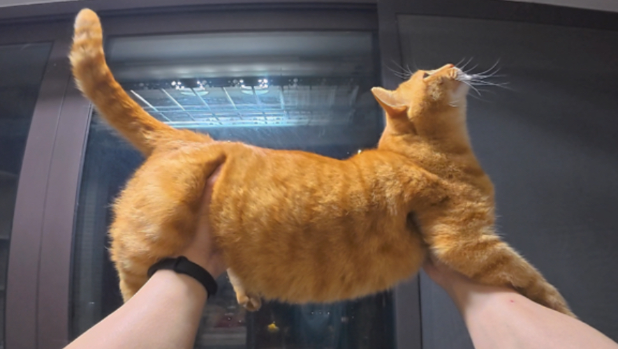 | 1.8万 | 2026-04-01 |
| [为什么李白的诗从未提及“哈基米”？](https://www.bilibili.com/video/BV1fDXCBQEAc) |  | 2577 | 2026-04-01 |
| [哈牛魔啊【哈基米跨界合作】](https://www.bilibili.com/video/BV1D8QUBmENW) |  | 2084 | 2026-04-01 |
| [“基米已达暗网尽头！！！”](https://www.bilibili.com/video/BV1z8XkB7E3r) |  | 1.8万 | 2026-04-01 |
| [哈基米不小心掉入水中成为了溺水机](https://www.bilibili.com/video/BV1Rf9LBiE5t) | 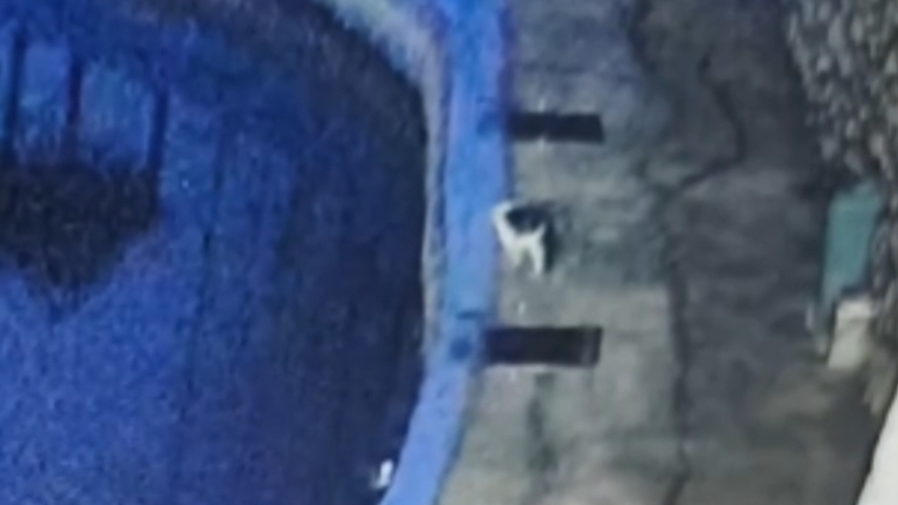 | 2663 | 2026-04-01 |
| [【哈基米音乐】弹弹堂大基米](https://www.bilibili.com/video/BV1oQ9LB3ESQ) |  | 241 | 2026-04-01 |
| [🐱 变成猫咪了哦 🐱](https://www.bilibili.com/video/BV1F29LB1EuM) |  | 2848 | 2026-04-01 |
| [【2月至3月】⚠️哈基米的危机⚠️——哈基米&quot;关键词&quot;新视频每日动态榜](https://www.bilibili.com/video/BV1LZ9LBMEWt) | 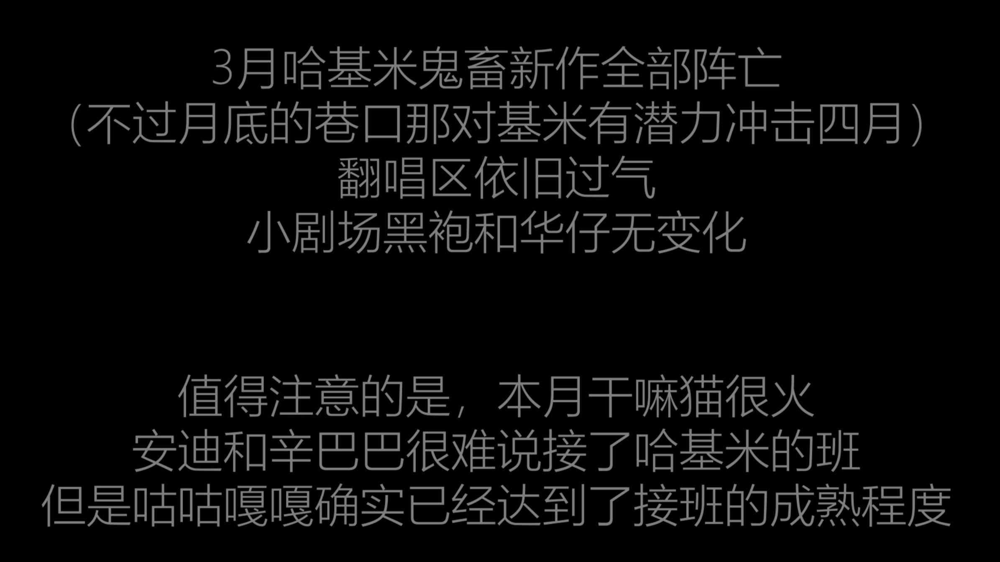 | 708 | 2026-04-01 |
| [这诗猫啊](https://www.bilibili.com/video/BV1379VBoEb2) | 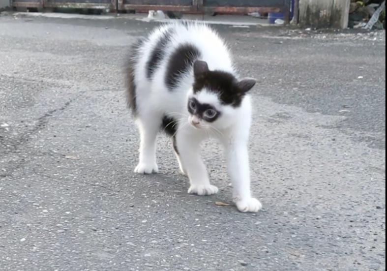 | 26.0万 | 2026-04-01 |
| [哈基米南北绿豆~](https://www.bilibili.com/video/BV1HAXCBREco) |  | 199 | 2026-03-31 |
| [哈基米的日记每日定投根据雷牛牛百分之四定投理念改进版辅助网页工具（视频无声音）](https://www.bilibili.com/video/BV1dgXrB3E6V) |  | 863 | 2026-03-31 |
| [哈基米这个喜欢装死](https://www.bilibili.com/video/BV15jXrBMEfE) | 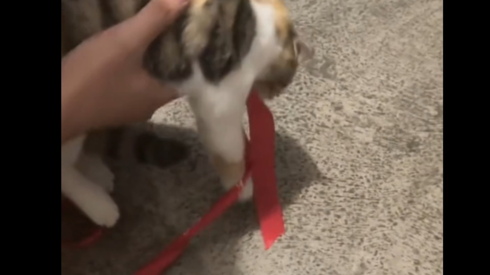 | 3822 | 2026-03-31 |
| [为什么有人爱拿古生物玩梗？谁才是真“老资历”？【哈基社会学之古生物】](https://www.bilibili.com/video/BV1YoXzBwEmF) |  | 12.7万 | 2026-03-31 |
| [香蕉哈基米和外星小绿猫谁更可爱](https://www.bilibili.com/video/BV1BSXrByEGV) |  | 2.8万 | 2026-03-31 |
| [居家祝福38.8，快至半小时出货！#哈基米 #神马教 #高考加油](https://www.bilibili.com/video/BV1HnXkBWEfw) | 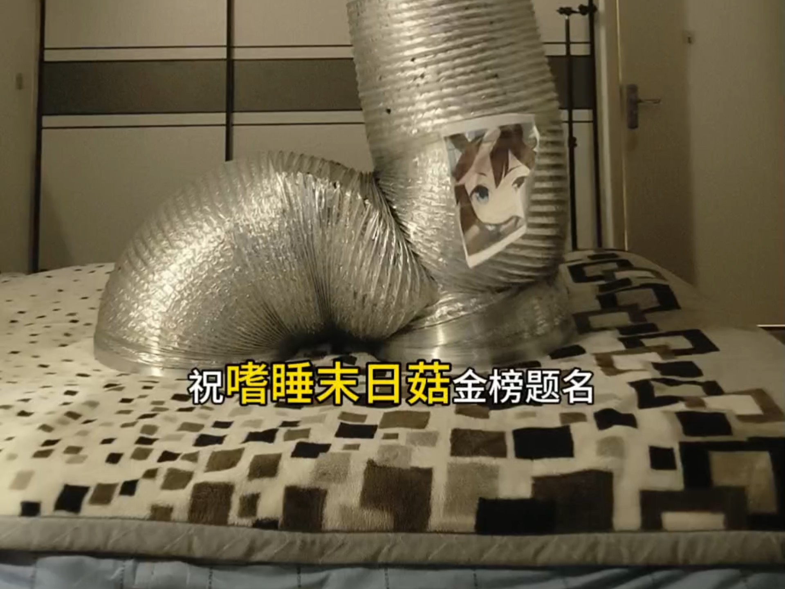 | 4895 | 2026-03-31 |
| [哈基米染色好好玩❗️实机效果抢先看❗️](https://www.bilibili.com/video/BV1yYXzBmEe1) |  | 6720 | 2026-03-31 |
| [耄耋表情复刻2【哈基动物园248期】](https://www.bilibili.com/video/BV1gvXiBSEFj) | 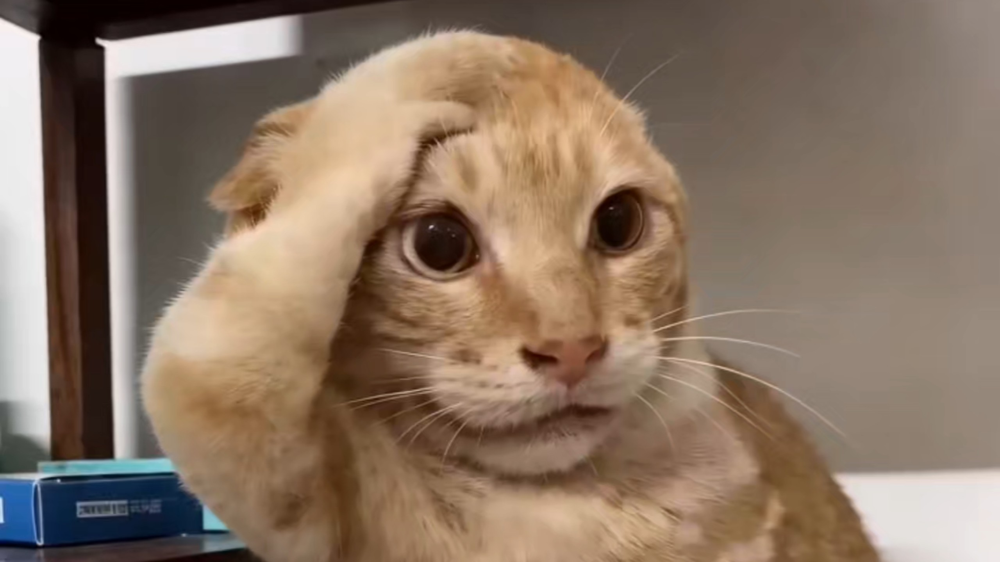 | 3.4万 | 2026-03-31 |
| [完全搞错了重点](https://www.bilibili.com/video/BV17LXeBREeQ) | 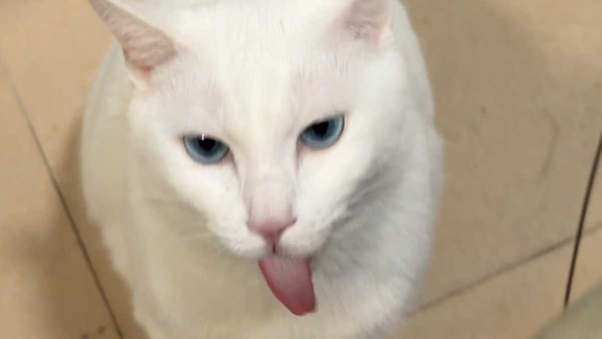 | 13.1万 | 2026-03-30 |
| [镜头低一点，人民就高一点](https://www.bilibili.com/video/BV1y5XhBZEWL) |  | 175.6万 | 2026-03-30 |
| [【东方哈基米】遥遥38万个哈基米](https://www.bilibili.com/video/BV1siXaBYEG2) | 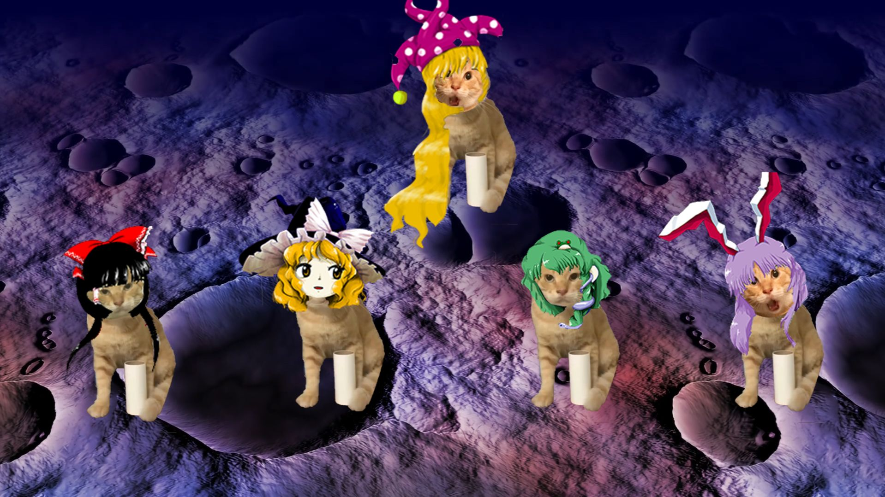 | 2034 | 2026-03-30 |
| [训 宠 大 师](https://www.bilibili.com/video/BV166XDBkEgE) |  | 11.2万 | 2026-03-29 |
| [一段时间没来看它，对我的感情淡了](https://www.bilibili.com/video/BV1BZXmBYErn) | 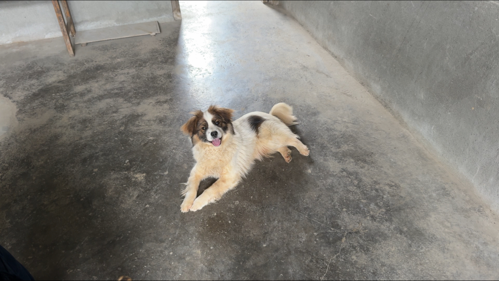 | 18.8万 | 2026-03-29 |
| [婉约哈基米音乐：桃花笑（重发）](https://www.bilibili.com/video/BV1HiXDBLEnN) |  | 2319 | 2026-03-29 |
| [捡个哈基米](https://www.bilibili.com/video/BV1GaXmBHE2q) | 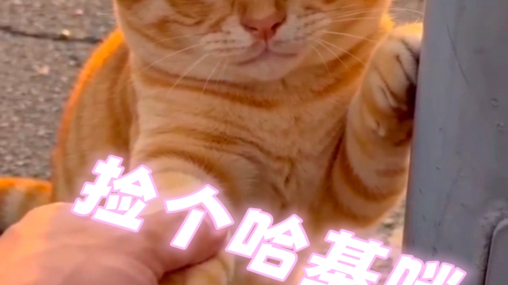 | 443 | 2026-03-29 |
| [你是故意的对吧【VS哈气猫】](https://www.bilibili.com/video/BV1eMXjBiEC3) |  | 6.5万 | 2026-03-28 |
| [喵咪的vlog ｜ 第11集:和香蕉meme出去玩啦！](https://www.bilibili.com/video/BV1ocX5BYETW) |  | 5207 | 2026-03-28 |
| [哈基米](https://www.bilibili.com/video/BV1Y5XjBaEu3) | 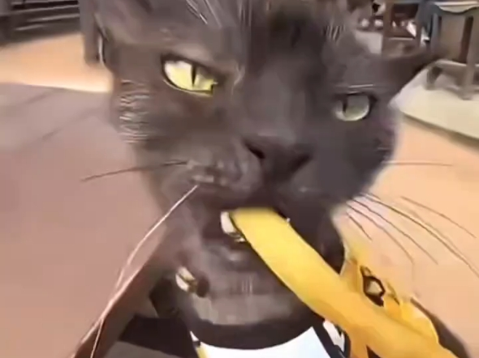 | 74 | 2026-03-28 |
| [我早已麻痹](https://www.bilibili.com/video/BV1f3X3BFE7Z) |  | 67.1万 | 2026-03-28 |
| [《那天基米了》](https://www.bilibili.com/video/BV1R5XTB6EEv) |  | 645 | 2026-03-28 |
| [⚡️手机真是好东西⚡️](https://www.bilibili.com/video/BV1gkXMB3Efd) |  | 267.1万 | 2026-03-27 |
| [当你被网络热梗洗脑后，请看vcr！](https://www.bilibili.com/video/BV1EjXPBkEBw) |  | 147.3万 | 2026-03-27 |
| [【哈基米FM】🎵曼波之子🎵（太阳之子 by周杰伦）](https://www.bilibili.com/video/BV1Y1XWBsE6d) |  | 741 | 2026-03-26 |
| [哈基界最高之山？](https://www.bilibili.com/video/BV1QQXWBJEcH) | 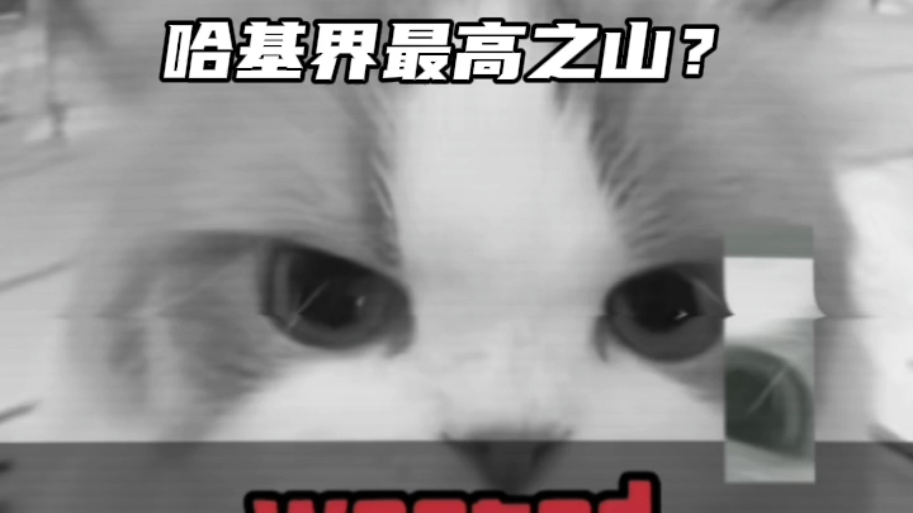 | 196 | 2026-03-26 |
| [小猫Mugi来赏樱花啦！🌸🍡](https://www.bilibili.com/video/BV1EfXsBeECi) | 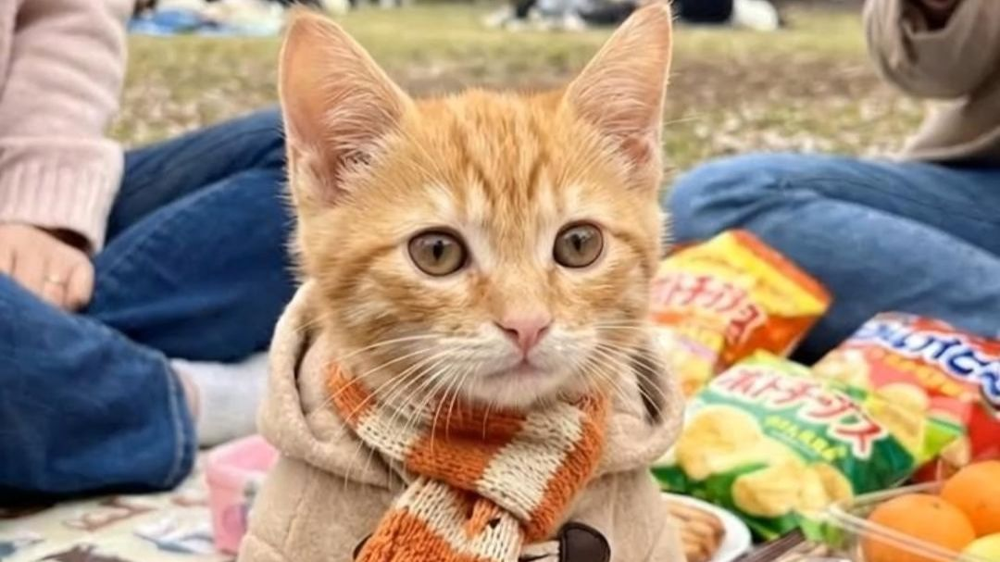 | 14.1万 | 2026-03-26 |
| [被洛克王国的这首歌净化了！！！](https://www.bilibili.com/video/BV1vjXnB2E2g) |  | 80.5万 | 2026-03-26 |
| [基米说  (伯虎说 哈基米) 小度 切片 015](https://www.bilibili.com/video/BV1GdXjBeEJA) |  | 68 | 2026-03-25 |
| [谁发明了小咪，无敌可爱哈基米～](https://www.bilibili.com/video/BV1xpQ6BnEQ9) | 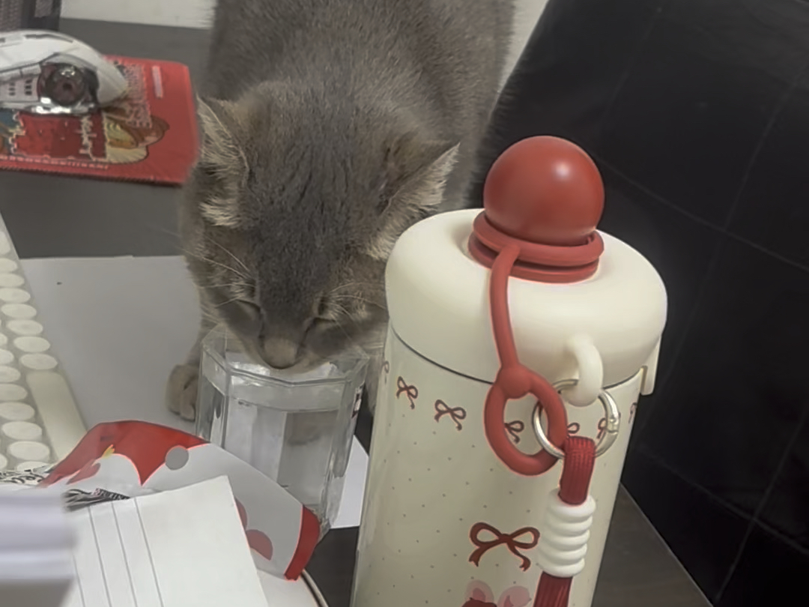 | 216 | 2026-03-24 |
| [开服不选喵喵的都是神人了](https://www.bilibili.com/video/BV162QqBTErx) |  | 185.6万 | 2026-03-24 |
| [【初音ミク】眼睛瞎在手机上【MARETU STYLE】](https://www.bilibili.com/video/BV1JbAMzjEzu) | 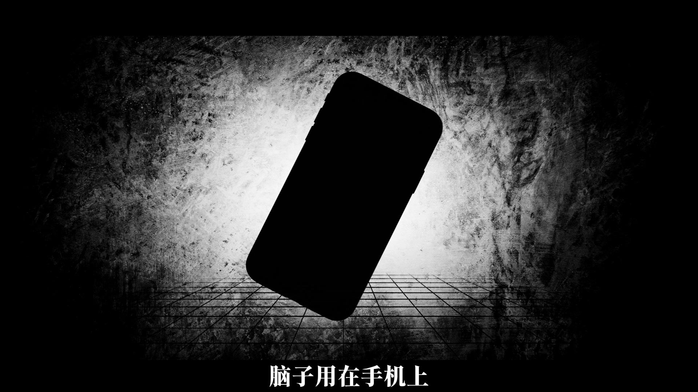 | 88.3万 | 2026-03-22 |
| [猫真是低智商动物，发狂攻击主人，全身都被它抓伤，脱下衣服就不认识你了](https://www.bilibili.com/video/BV1AwAuz9EKF) | 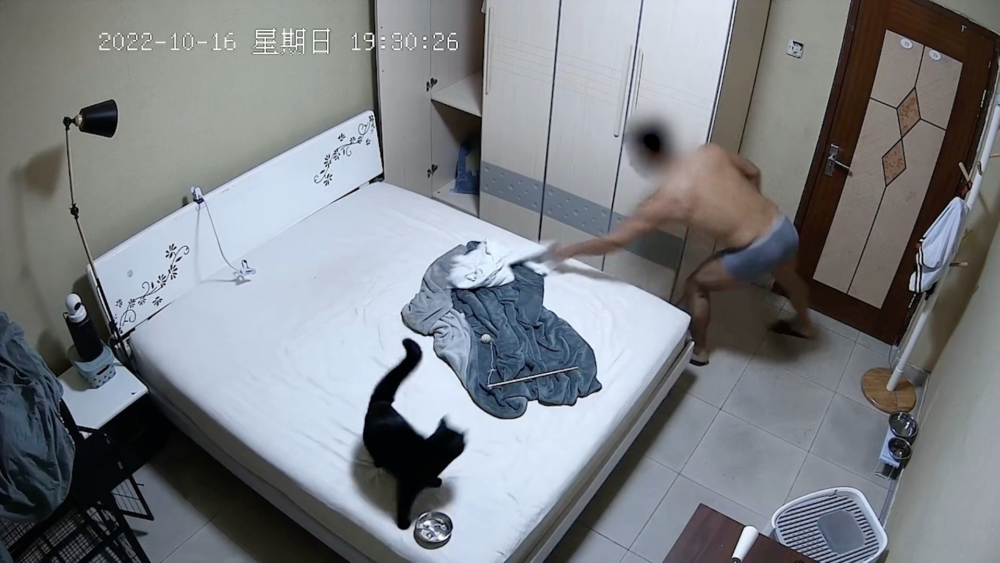 | 8.4万 | 2026-03-22 |
| [“寄龙坡的天气它是翻云又覆雨♿可惜就像落凤坡一样没有关羽”](https://www.bilibili.com/video/BV1qsAPzYEqy) |  | 31.2万 | 2026-03-21 |
| [最蠢最坏的群体——虐猫小子](https://www.bilibili.com/video/BV1zuAnzmErR) |  | 25.7万 | 2026-03-20 |
| [省流：团灭](https://www.bilibili.com/video/BV1FHwrzMESt) | 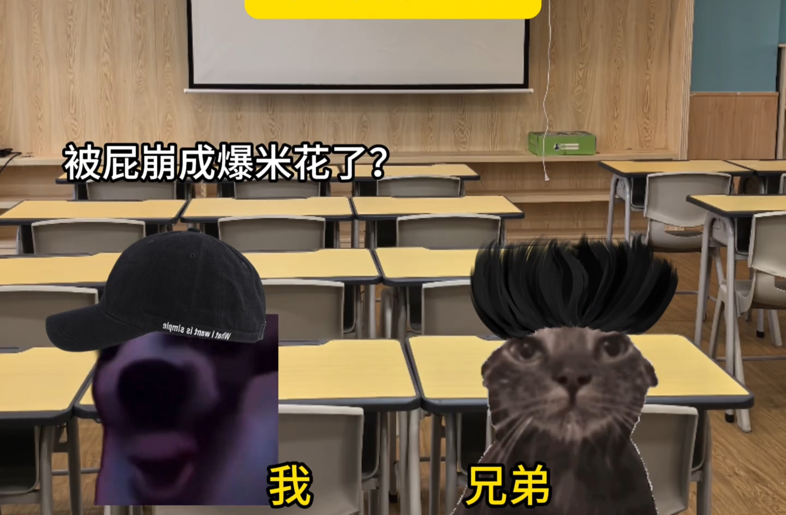 | 254.9万 | 2026-03-19 |
| [你吃饭会有这种萌宠吗？！](https://www.bilibili.com/video/BV1xUwrzUEc5) | 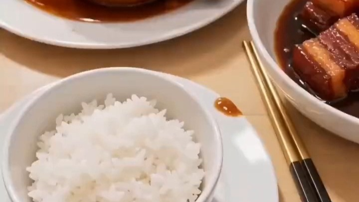 | 102.6万 | 2026-03-19 |
| [咕咕嘎嘎跳舞纯享版](https://www.bilibili.com/video/BV1pFwdzmEna) |  | 68.3万 | 2026-03-17 |
| [╰╭╮╯](https://www.bilibili.com/video/BV1BMwgz1ENs) | 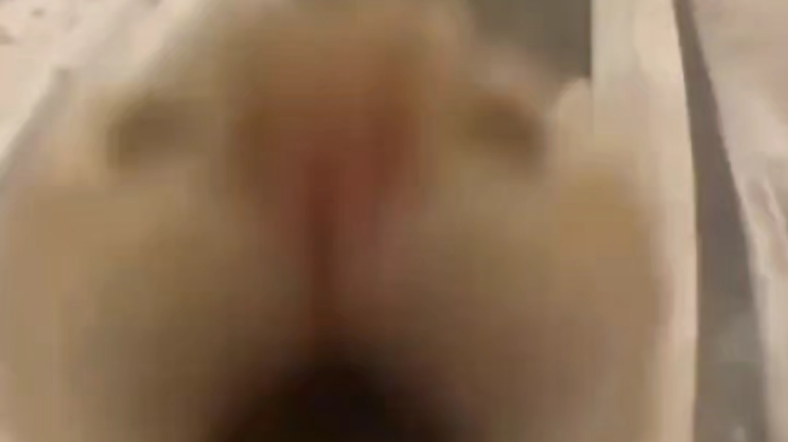 | 12.5万 | 2026-03-15 |
| [眼睛瞎在小猫上，手也长在小猫上](https://www.bilibili.com/video/BV1PRwuzsEA5) | 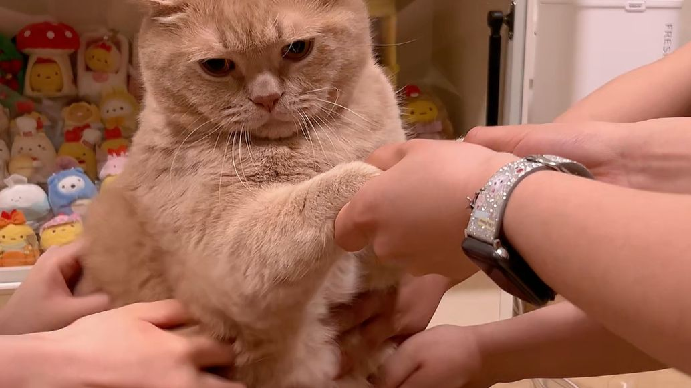 | 22.1万 | 2026-03-15 |
| [头上顶俩妙脆角给你狂的](https://www.bilibili.com/video/BV1JAcfzJEEL) | 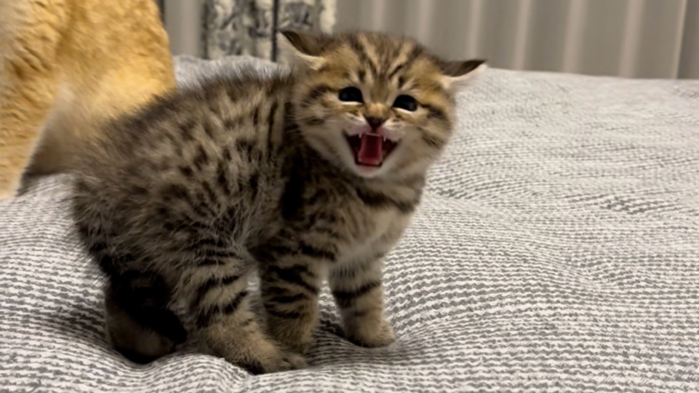 | 114.1万 | 2026-03-11 |
| [《打火机》哈基米版](https://www.bilibili.com/video/BV13LcozYEXE) |  | 181 | 2026-03-11 |
| [【完整版】腐化之基（The Heart）](https://www.bilibili.com/video/BV1RPuBziEnu) | 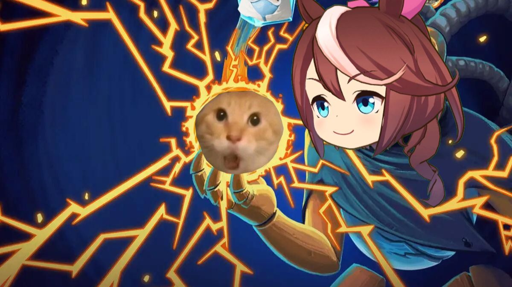 | 15.5万 | 2025-07-14 |
| [[补档]追加dlc！全网最全猫爹合集](https://www.bilibili.com/video/BV11ENCzoE5J) |  | 40.5万 | 2025-06-21 |
| [【哈基米fm】Straight Into The 哈基米](https://www.bilibili.com/video/BV1c8TUzkEYu) |  | 5.6万 | 2025-06-08 |
| [这是我弟弟耄耋](https://www.bilibili.com/video/BV1iMTTz1EML) |  | 21.1万 | 2025-06-06 |
| [哈基米：The Way I Still Love You(完整版)](https://www.bilibili.com/video/BV1oq99YREyg) |  | 30.6万 | 2025-03-08 |
| [哈基米之歌 Hachimi Song - 鸚鵡錄音機 鸚鵡口哨訓練 小雞網課](https://www.bilibili.com/video/BV1AVFDeTE4f) | 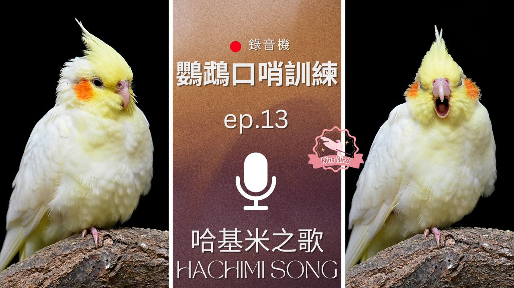 | 3.4万 | 2025-01-31 |
| [《月半猫の小曲》根本你不懂得爱我](https://www.bilibili.com/video/BV1r2pnerEAX) |  | 165.8万 | 2024-09-09 |

---
*最后更新: 2026-04-02 03:17:01 (自动生成)*
*数据来源: [Bilibili](https://www.bilibili.com)*

## 使用说明

运行以下命令更新视频列表:
```bash
python3 fetch_hajimi_videos.py
```
