# awesome-hajimi
collections of hajimi (哈基米 in Chinese) on the Internet.

## 视频列表 (Video List)

| 视频标题 (Title) | 封面 | 播放量 (Views) | 发布日期 (Date) |
|---|---|---|---|
| [想做一只没烦恼的快乐基米](https://www.bilibili.com/video/BV1AKA1zoEm2) |  | 269 | 2026-02-27 |
| [哈基米，哈基米](https://www.bilibili.com/video/BV1gXAyziEQm) |  | 1 | 2026-02-27 |
| [哈基米这个代码](https://www.bilibili.com/video/BV1XtA1zrEdP) | 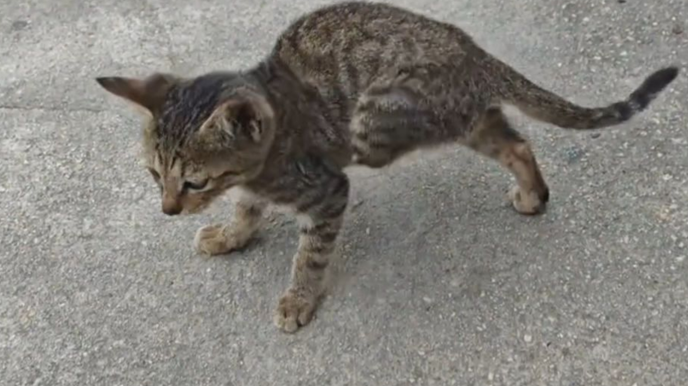 | 933 | 2026-02-27 |
| [哈基米鲨鱼舞](https://www.bilibili.com/video/BV1L4A1zVEnd) |  | 1 | 2026-02-27 |
| [确认过眼神，是只哈基米](https://www.bilibili.com/video/BV1dWA1z5EeZ) | 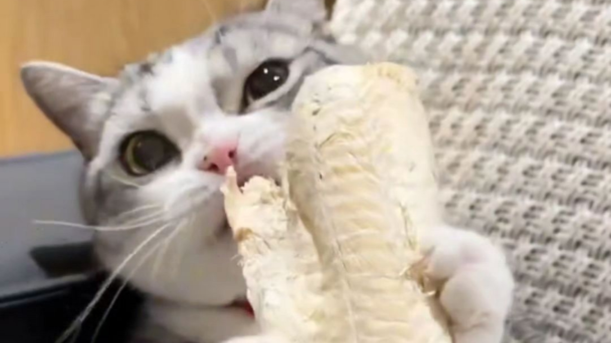 | 42 | 2026-02-27 |
| [每日哈基米报时](https://www.bilibili.com/video/BV1zfA1znE6E) |  | 5 | 2026-02-26 |
| [云朵喜欢的游戏#猫咪#哈基米#下班日常](https://www.bilibili.com/video/BV1y2A1zbES9) | 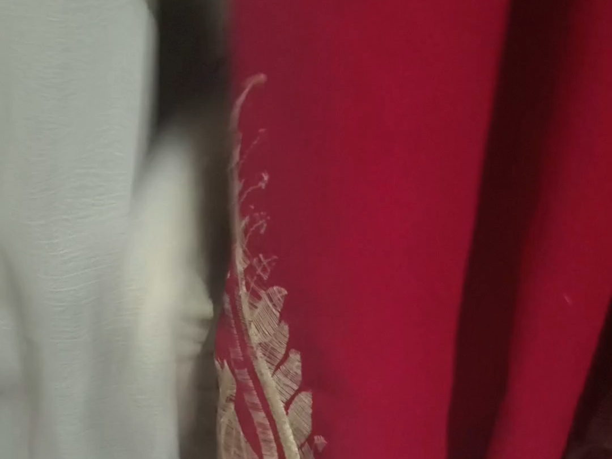 | 105 | 2026-02-26 |
| [哈果然是個煩人的哈基米](https://www.bilibili.com/video/BV1CrArzjEH4) | 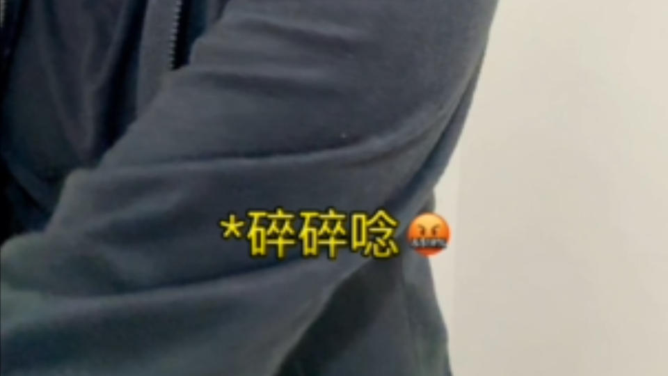 | 10 | 2026-02-26 |
| [天冷了，和捡来的哈基米一块烤火](https://www.bilibili.com/video/BV1DaACzcEkH) | 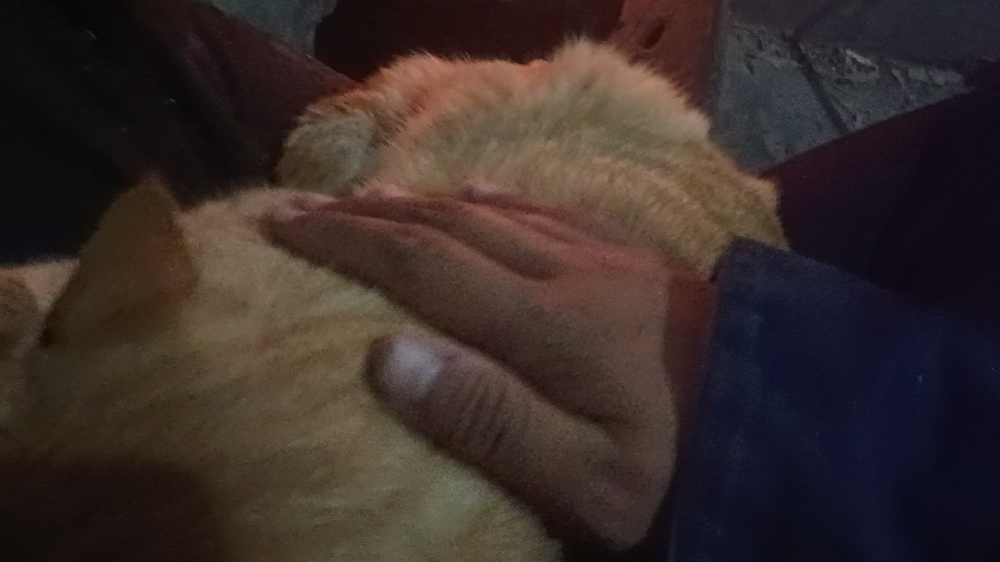 | 185 | 2026-02-26 |
| [哈基米对火很好奇](https://www.bilibili.com/video/BV1SaACzcE9q) | 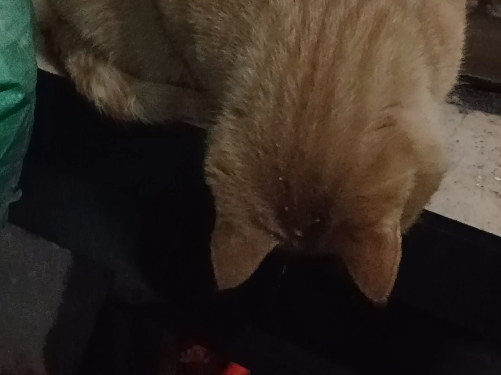 | 153 | 2026-02-26 |
| [哈基米南北绿豆](https://www.bilibili.com/video/BV1GUAyzuEik) | 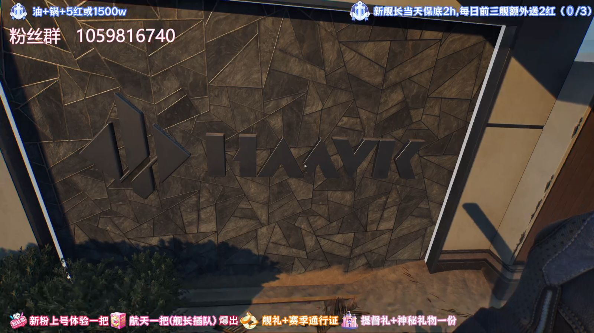 | 16 | 2026-02-26 |
| [【哈鸡咪哈鸡咪哈基米】视频已打包，欢迎围观！](https://www.bilibili.com/video/BV1oRArzqEWp) |  | 0 | 2026-02-26 |
| [哈基米😋😋😋😋😋](https://www.bilibili.com/video/BV11iArzSE1H) | 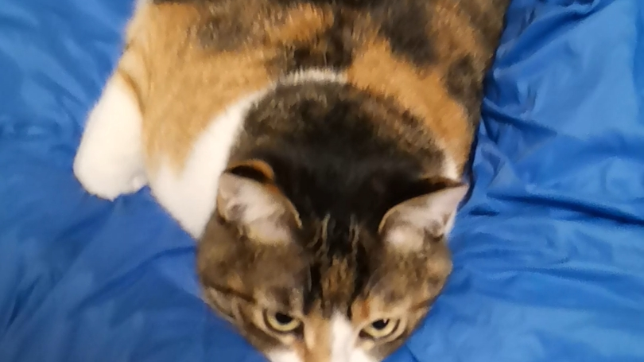 | 71 | 2026-02-26 |
| [哈基米 南北绿豆](https://www.bilibili.com/video/BV1tVAkzsEbw) |  | 46 | 2026-02-26 |
| [666哈基米依旧开启狂暴脊背龙形态，手流出红色番茄](https://www.bilibili.com/video/BV1aKAkzFEyr) | 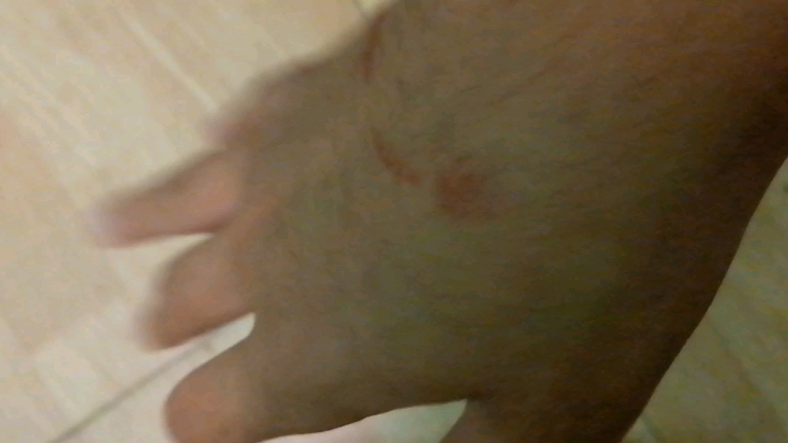 | 75 | 2026-02-26 |
| [哈基米之歌第五首](https://www.bilibili.com/video/BV1LzAkzqEEJ) |  | 134 | 2026-02-26 |
| [⚡️哈基米影⚡️](https://www.bilibili.com/video/BV1hmAkzwE9z) |  | 88 | 2026-02-26 |
| [哈基米](https://www.bilibili.com/video/BV1H4Akz1EXU) | 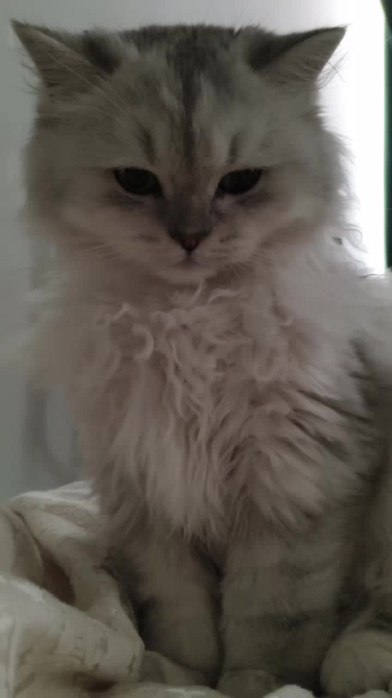 | 12 | 2026-02-26 |
| [【哈基米音乐】🐱基米戏dj🐱基米 去勇敢的超级爆爆回吧](https://www.bilibili.com/video/BV1nbAkz5Epy) | 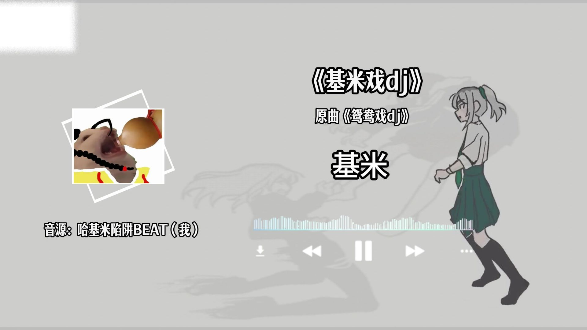 | 150 | 2026-02-26 |
| [委屈夹子哈基米](https://www.bilibili.com/video/BV1pWAkzmE48) | 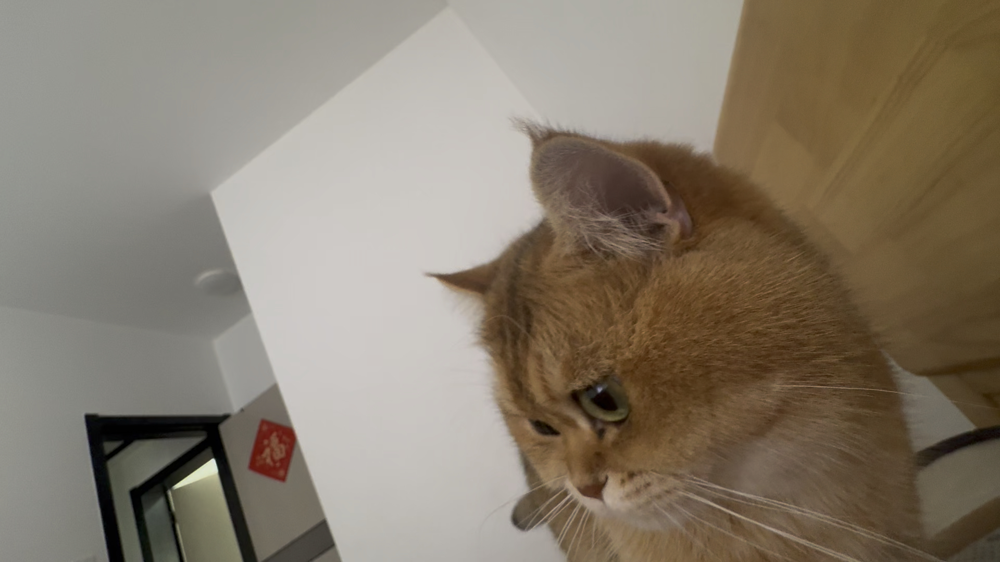 | 36 | 2026-02-26 |
| [【懂球帝】从哈基米找到曼波](https://www.bilibili.com/video/BV1BvAkzgE2R) |  | 169 | 2026-02-26 |
| [哈基米](https://www.bilibili.com/video/BV1NcACzpEGv) | 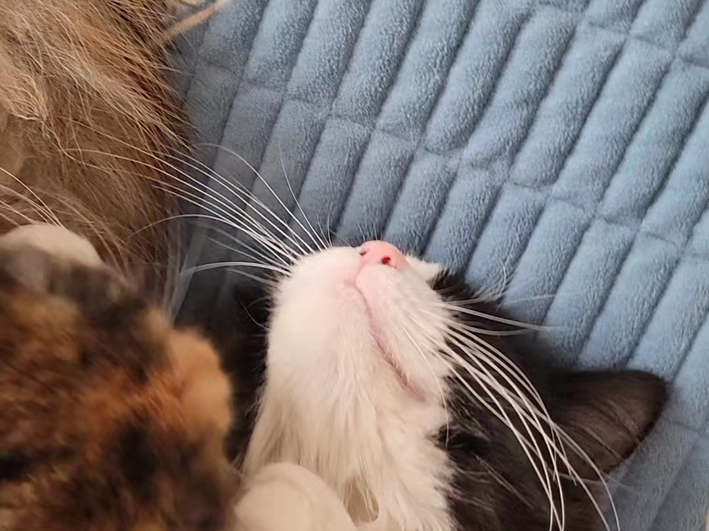 | 17 | 2026-02-26 |
| [呼呼呼呼呼呼呼呼呼呼呼呼呼呼呼呼呼呼呼呼呼呼呼呼呼呼呼呼呼呼呼呼呼呼呼呼呼呼呼呼呼呼呼呼呼呼呼呼呼呼呼呼呼呼呼呼呼呼呼呼呼呼呼呼呼呼呼呼呼呼呼呼呼呼呼呼呼呼呼呼](https://www.bilibili.com/video/BV1HNACzSEiE) | 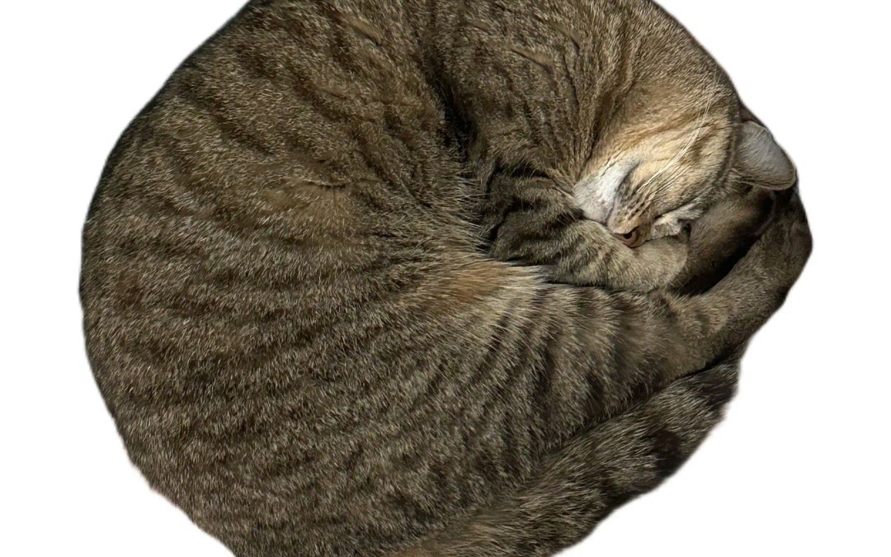 | 7397 | 2026-02-26 |
| [⚡如果基是只哆啦猫，你会接我吗？⚡【新人手书初尝试】](https://www.bilibili.com/video/BV1pwACzQEkh) |  | 1427 | 2026-02-26 |
| [怎么哈那么凶？都快成哈基米了](https://www.bilibili.com/video/BV1wTACzEEtb) |  | 249 | 2026-02-26 |
| [哈吉哈基哈基米](https://www.bilibili.com/video/BV1uXAkzZE1x) | 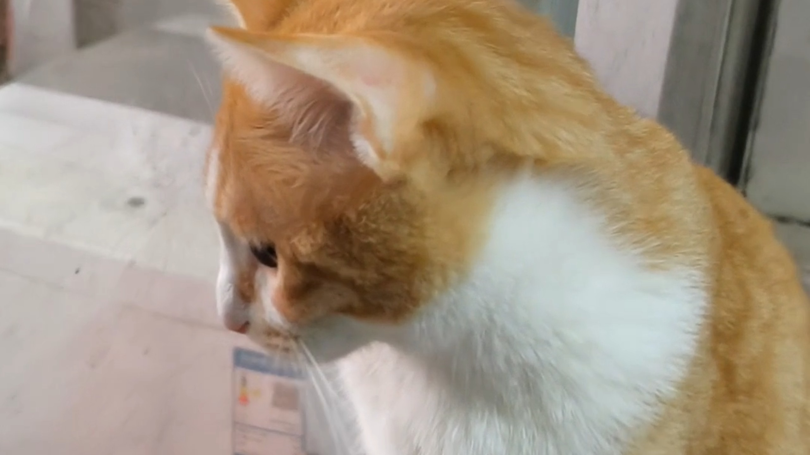 | 21 | 2026-02-26 |
| [古典哈基米](https://www.bilibili.com/video/BV1xZAkzsECu) | 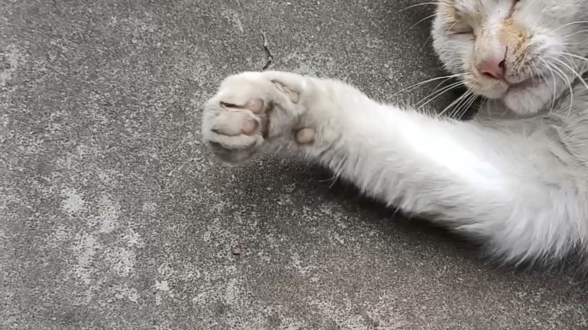 | 212 | 2026-02-26 |
| [【ai动画】哈基米vs过年烦人亲戚《恭喜恭喜》](https://www.bilibili.com/video/BV1TdAkzdEfY) |  | 323 | 2026-02-26 |
| [哈基米鼠鼠大王打瓦日常1](https://www.bilibili.com/video/BV1KVA6zmEvd) | 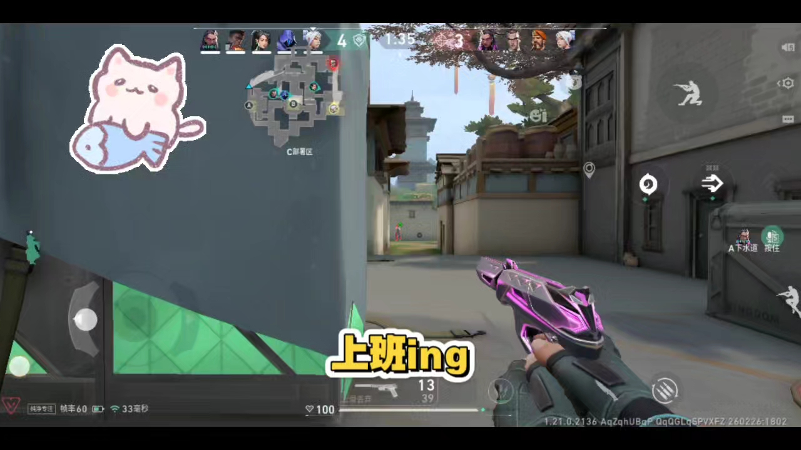 | 2 | 2026-02-26 |
| [献上一首哈基米](https://www.bilibili.com/video/BV1tuA6zJELF) |  | 15 | 2026-02-26 |
| [一只可爱哈基米](https://www.bilibili.com/video/BV1CjA6zyEL8) |  | 9 | 2026-02-26 |
| [绿茶狐狸抢猫窝，没抢到还委屈上了](https://www.bilibili.com/video/BV1akA6zoEp5) | 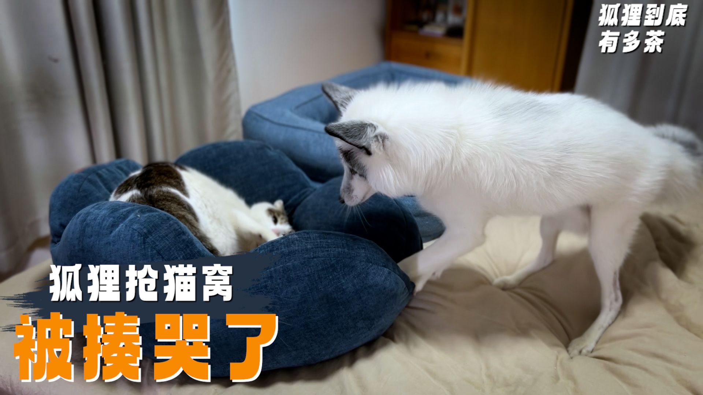 | 1543 | 2026-02-26 |
| [可爱的哈基米](https://www.bilibili.com/video/BV16xA6zBEHb) | 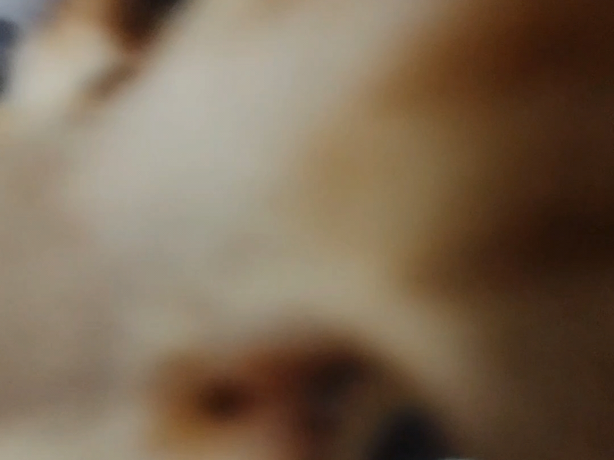 | 15 | 2026-02-26 |
| [哈基米](https://www.bilibili.com/video/BV1EhA6zNEhB) | 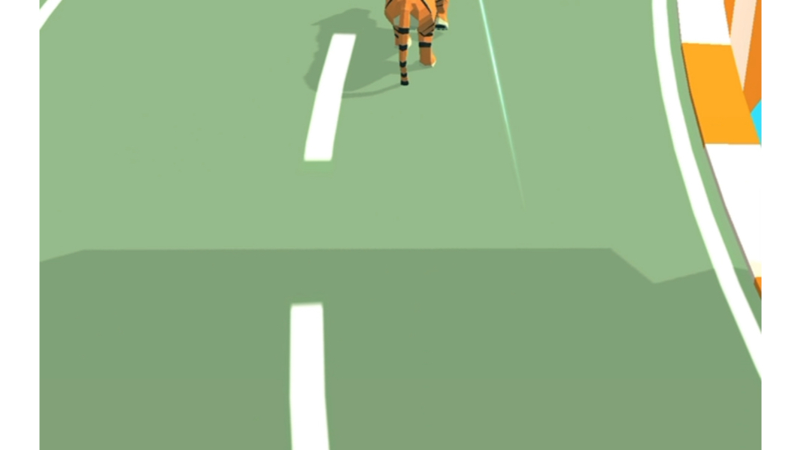 | 146 | 2026-02-26 |
| [哈基米多兰的一只](https://www.bilibili.com/video/BV1AcArzyEHX) |  | 0 | 2026-02-26 |
| [【哈基米FM】哈 谱 大—Raputa(demo)](https://www.bilibili.com/video/BV1cAArzVEjK) |  | 1272 | 2026-02-26 |
| [给狞猫听嘤嘤怪的声音会怎样？😏这猫有点不太聪明的亚子😅](https://www.bilibili.com/video/BV1PZA6z2EQM) | 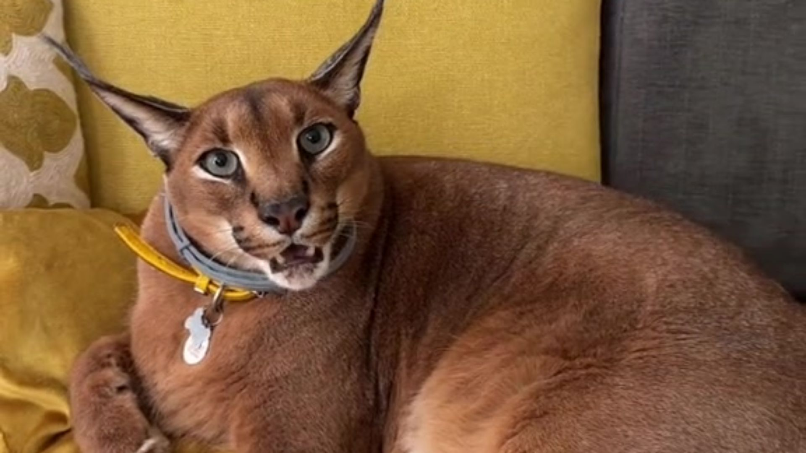 | 1728 | 2026-02-26 |
| [哈基米](https://www.bilibili.com/video/BV1EuArzuEdD) | 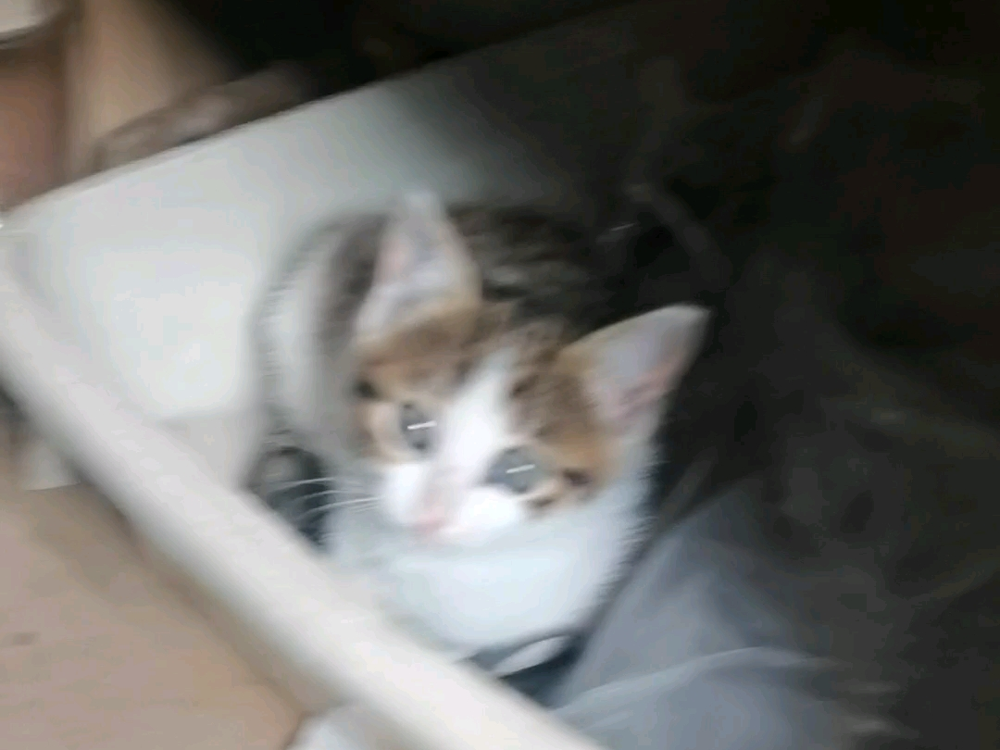 | 169 | 2026-02-26 |
| [？哈基米你这家伙](https://www.bilibili.com/video/BV1wPArzkE6W) | 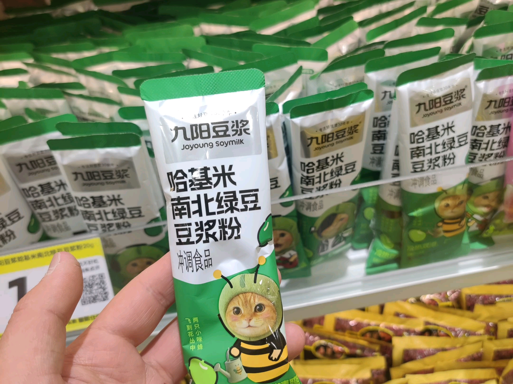 | 18 | 2026-02-26 |
| [这是哈基米，没人知道碰它的后果是什么](https://www.bilibili.com/video/BV1LQfvBrECj) |  | 288 | 2026-02-26 |
| [&quot;别在这理发店💈&quot;](https://www.bilibili.com/video/BV1PoA6z7EX1) |  | 58.4万 | 2026-02-26 |
| [你是一只可爱的哈基米awa](https://www.bilibili.com/video/BV181A6zRE4f) | 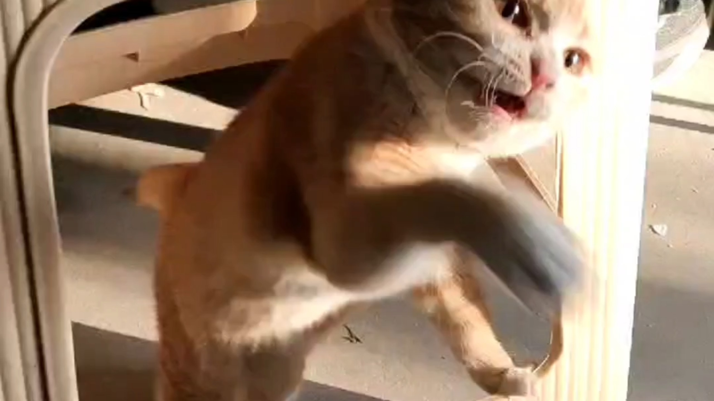 | 30 | 2026-02-26 |
| [【哈基米---曼波】我的最新作品，快来一睹为快！](https://www.bilibili.com/video/BV1umA6zWEJy) |  | 8 | 2026-02-26 |
| [一只奇怪会发出奇怪声音的哈基米](https://www.bilibili.com/video/BV1DxArz4Ex5) | 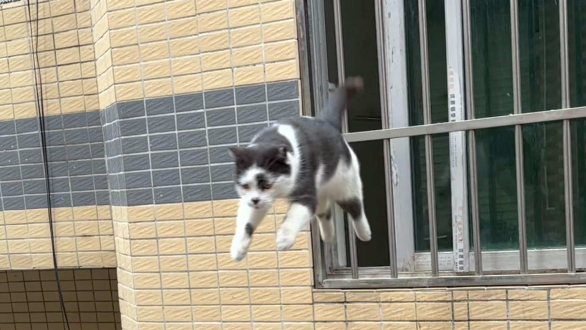 | 38 | 2026-02-26 |
| [哈基米～](https://www.bilibili.com/video/BV1xoA6z7Erd) |  | 28 | 2026-02-26 |
| [哈基米：华阴老吴一声哈🐱](https://www.bilibili.com/video/BV1QWArzZEPW) |  | 138 | 2026-02-26 |
| [🐱哈本将心向基米🐱](https://www.bilibili.com/video/BV1yjfiBWEMF) | 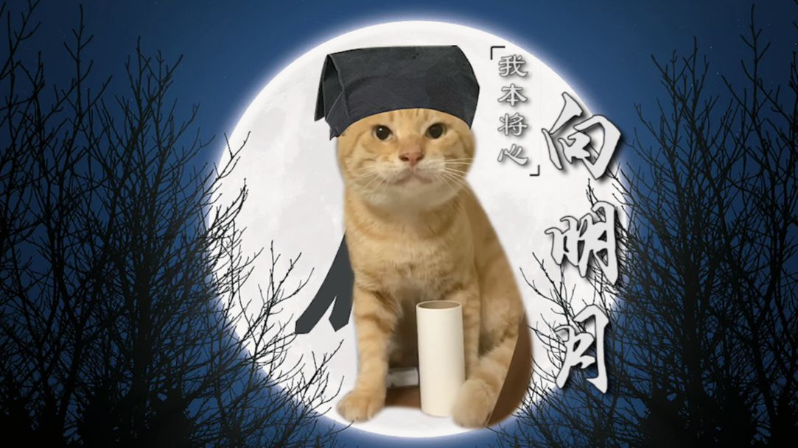 | 2.6万 | 2026-02-26 |
| [从深夜酒馆到哈基米之歌，谦大爷的 ASMR 主播初体验！【多新鲜呐ep16 ｜ 于谦的视频播客】](https://www.bilibili.com/video/BV1mgfPBMEmQ) |  | 49.9万 | 2026-02-26 |
| [今天就是折的哈基米一键三连加关注视频里面有](https://www.bilibili.com/video/BV1mYArzQEVi) | 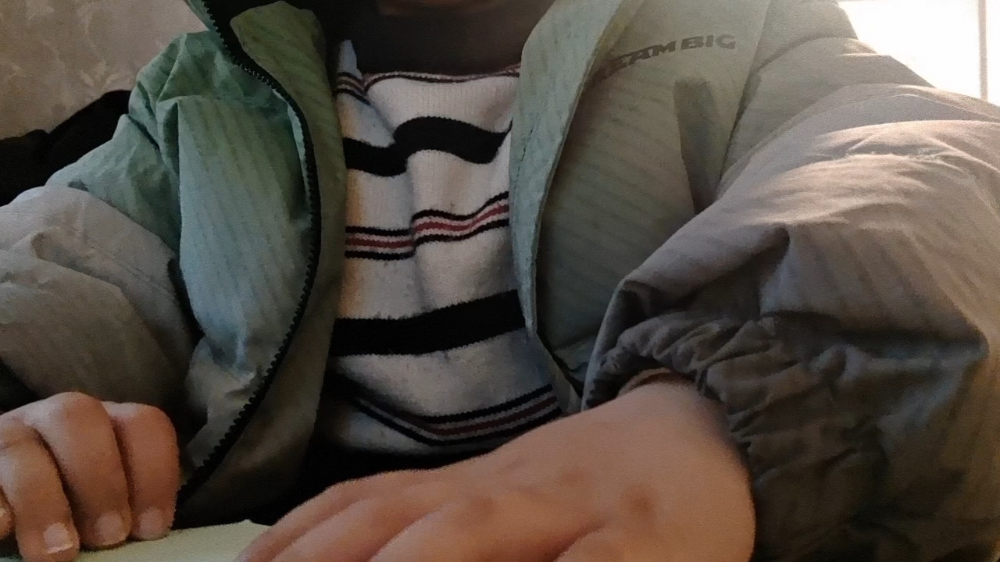 | 13 | 2026-02-26 |
| [新手入门快乐狗！！哈基米曼波！！！](https://www.bilibili.com/video/BV1SbArzxEb5) | 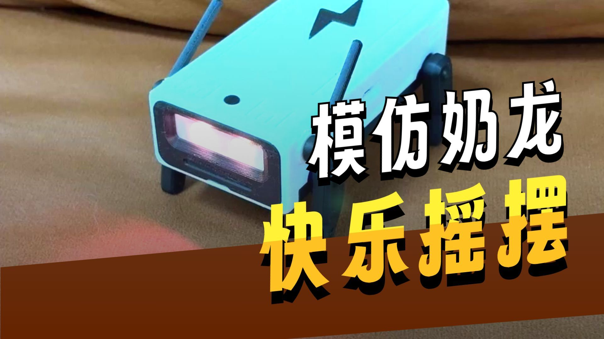 | 67 | 2026-02-26 |
| [哈基米](https://www.bilibili.com/video/BV1zgArzBE1V) | 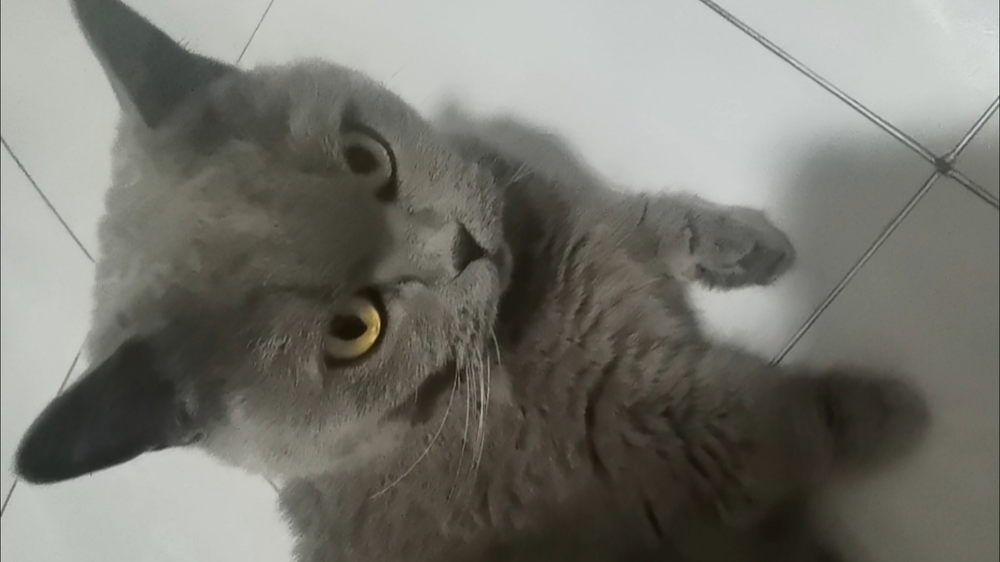 | 28 | 2026-02-26 |
| [哈基米，睡觉的猫](https://www.bilibili.com/video/BV1wcfvB2EF9) | 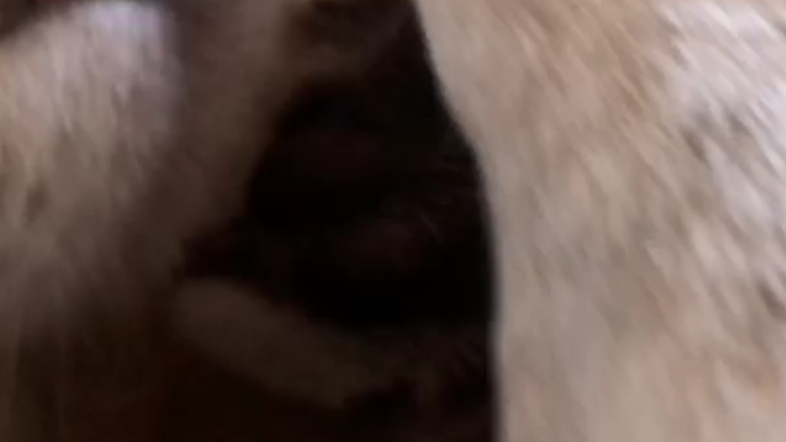 | 22 | 2026-02-26 |
| [🐱耄耋不想长大...🐱](https://www.bilibili.com/video/BV1CjfiBWEdh) |  | 16.1万 | 2026-02-26 |
| [哈基米可爱捏](https://www.bilibili.com/video/BV1nAfvB5EjM) | 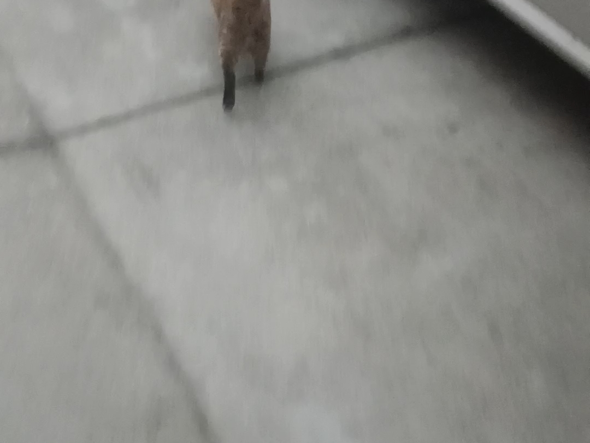 | 2 | 2026-02-26 |
| [核桃的臀部可以翘到顶起整个哈基米星球](https://www.bilibili.com/video/BV1JPfvBCEyR) | 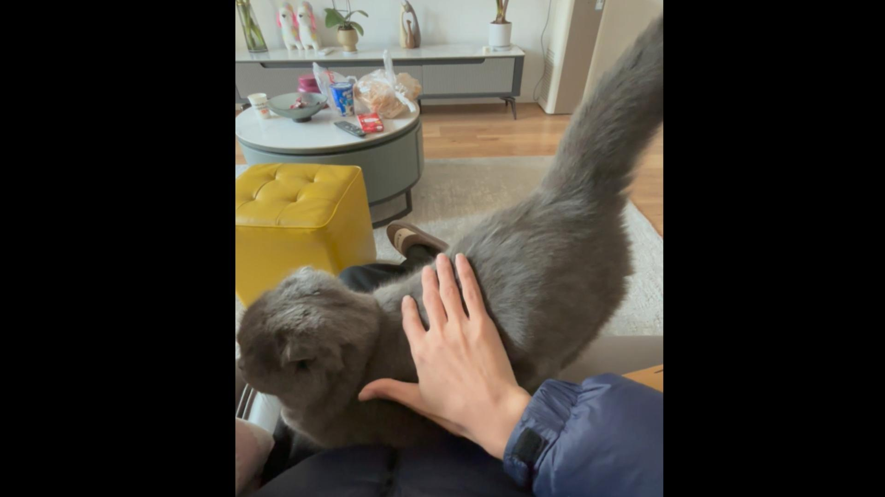 | 518 | 2026-02-26 |
| [哦，可爱的哈基米](https://www.bilibili.com/video/BV14UfeB9ELe) | 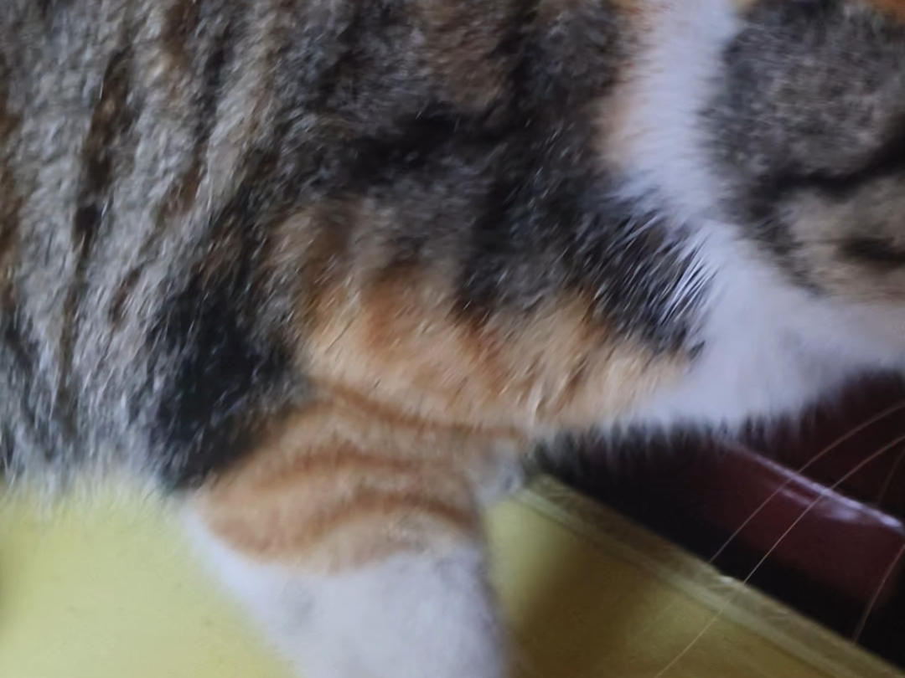 | 2 | 2026-02-26 |
| [哈基米](https://www.bilibili.com/video/BV1y9feBnEV6) | 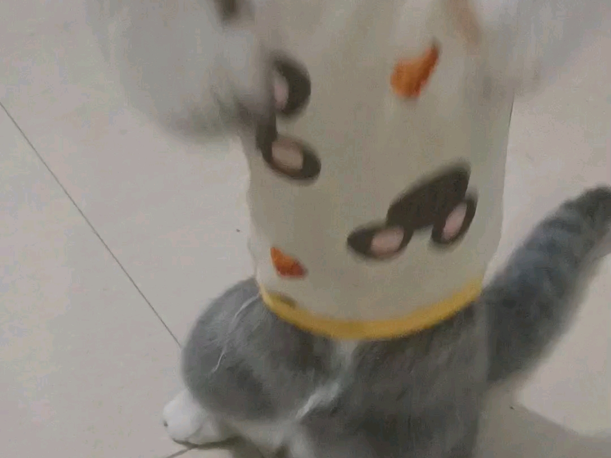 | 72 | 2026-02-26 |
| [哈基米](https://www.bilibili.com/video/BV1WRfeBDEgP) | 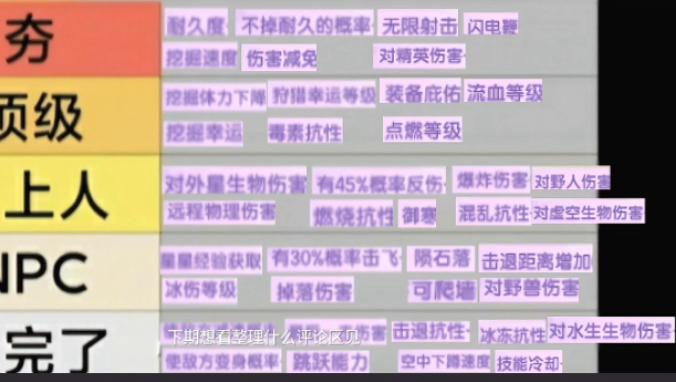 | 23 | 2026-02-26 |
| [养哈基米](https://www.bilibili.com/video/BV18pfvBhE4v) |  | 11 | 2026-02-26 |
| [开始讨厌哈基米了](https://www.bilibili.com/video/BV1jufvB3EZJ) | 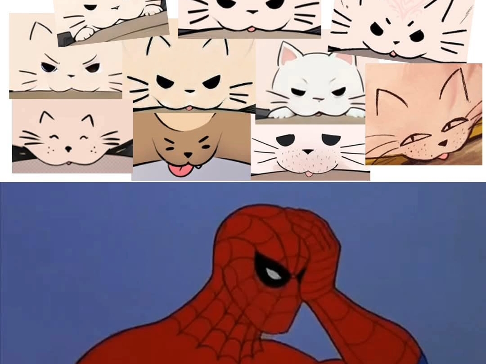 | 5.2万 | 2026-02-26 |
| [哈基米的诱惑](https://www.bilibili.com/video/BV1hJfvBYERW) |  | 636 | 2026-02-26 |
| [哈基米因为不努力才吃不到肉](https://www.bilibili.com/video/BV1VLfvBKE6e) | 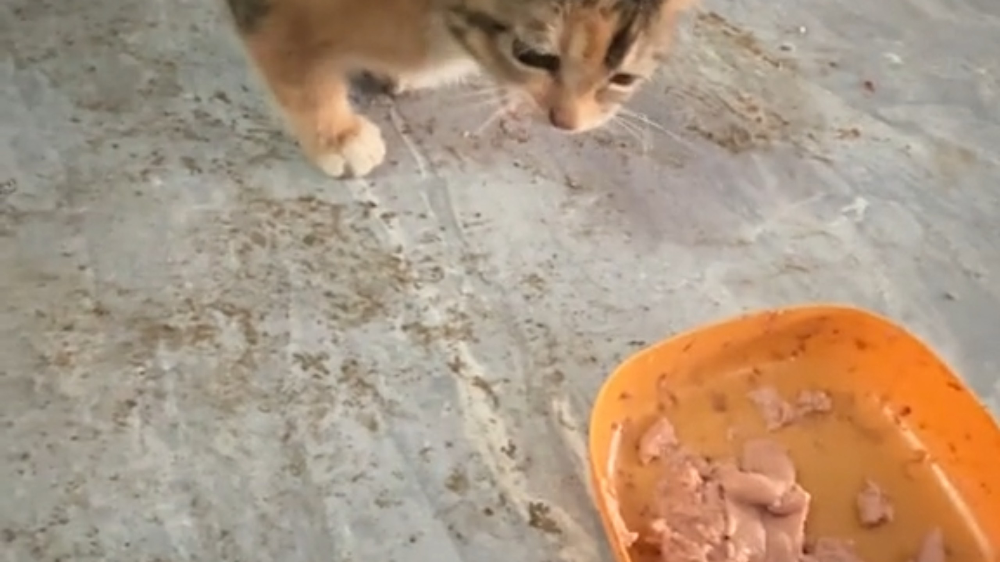 | 4919 | 2026-02-26 |
| [【爱玩陀螺的哈基米】视频已打包，欢迎围观！](https://www.bilibili.com/video/BV1oDfvB3Euj) | 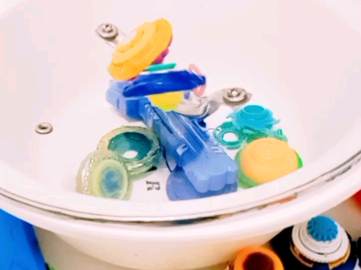 | 3 | 2026-02-26 |
| [哈基米上桌，抢食啦！](https://www.bilibili.com/video/BV1oDfvB3EhK) | 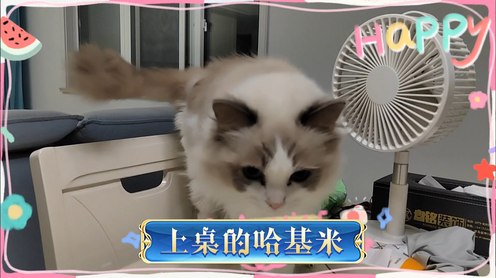 | 30 | 2026-02-26 |
| [蛋小黑但是哈基米](https://www.bilibili.com/video/BV1kBfvBnEv7) |  | 3142 | 2026-02-26 |
| [【山东哈基米rap】⚡《水饺》⚡](https://www.bilibili.com/video/BV1nzfvBSEQE) |  | 3025 | 2026-02-26 |
| [哈基米摸金：花费13000G测评武器，两把氪金武器比不过平民武器](https://www.bilibili.com/video/BV1DcfiBeEJX) | 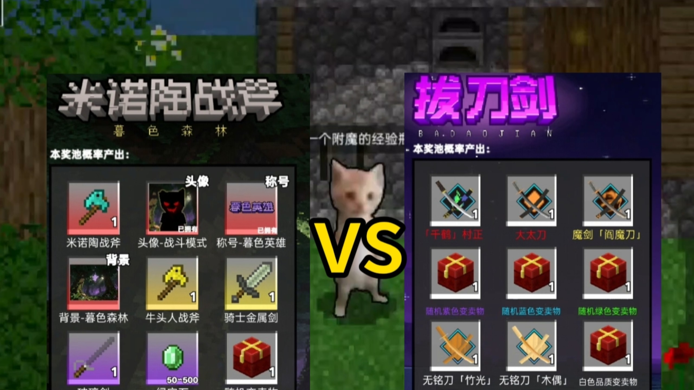 | 821 | 2026-02-26 |
| [有了红包，耄耋都不哈气了](https://www.bilibili.com/video/BV13cfiBvEiR) | 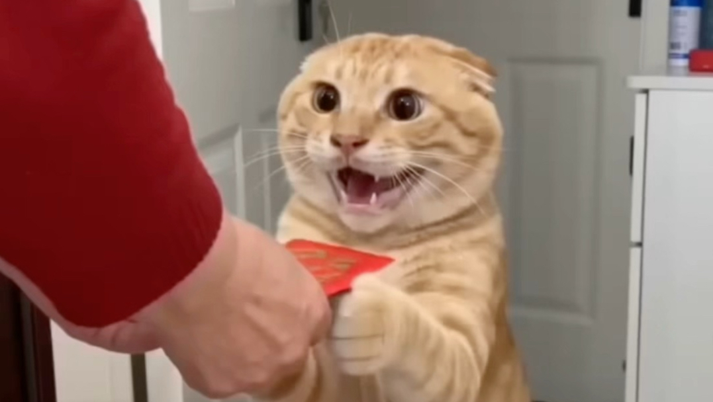 | 1868 | 2026-02-26 |
| [“爹，你没死啊”但是《朱元璋》版【seedance 2.0】](https://www.bilibili.com/video/BV1SAfiBAEhd) |  | 21.3万 | 2026-02-26 |
| [哈基米](https://www.bilibili.com/video/BV1XZfvBiEpQ) |  | 129 | 2026-02-26 |
| [哈基米的《弱水三哈》·翻唱](https://www.bilibili.com/video/BV1xtfYBJESH) |  | 1.1万 | 2026-02-26 |
| [哈基米鼠标也太可爱了吧#鼠标 #无线鼠标 #英菲克 #静音鼠标](https://www.bilibili.com/video/BV1AafYB2E4X) | 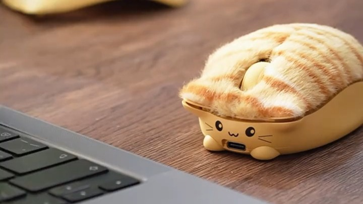 | 0 | 2026-02-26 |
| [【蛋仔主播哈基米】最新视频上线，求关注！](https://www.bilibili.com/video/BV16Qf8BKEet) |  | 5 | 2026-02-25 |
| [像哈基米一样巡视自己的领地](https://www.bilibili.com/video/BV11kf8BGELV) |  | 3.2万 | 2026-02-25 |
| [【基米TV】打猎高手这一块](https://www.bilibili.com/video/BV1bYftB6E2p) | 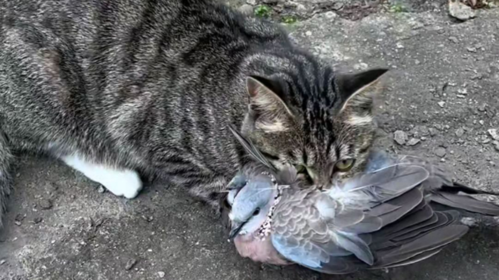 | 5052 | 2026-02-25 |
| [【新年巨作/异象】设计哈基米 - Designant. [Eternal 12/Arcaea自制]](https://www.bilibili.com/video/BV1bYftB6EBu) |  | 3755 | 2026-02-25 |
| [蒸蚌！](https://www.bilibili.com/video/BV1ggfbBLEae) |  | 788 | 2026-02-25 |
| [【哈基米音乐】很有曼波の小曲](https://www.bilibili.com/video/BV1NLf4BPE67) |  | 321 | 2026-02-25 |
| [【基米说】哈基米南北绿豆～](https://www.bilibili.com/video/BV1cxf4B4EGF) |  | 682 | 2026-02-25 |
| [第二次吃猫条的我](https://www.bilibili.com/video/BV1TGfsBtEcE) | 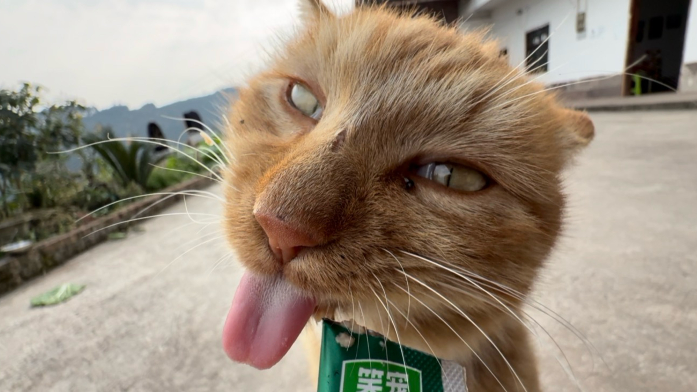 | 12.3万 | 2026-02-25 |
| [现在晚上不听小马唐笑都睡不着。](https://www.bilibili.com/video/BV1dbfsB1EZz) |  | 1018 | 2026-02-25 |
| [美短虎斑：没有一口猫粮是白吃的](https://www.bilibili.com/video/BV1umfsBeE3J) | 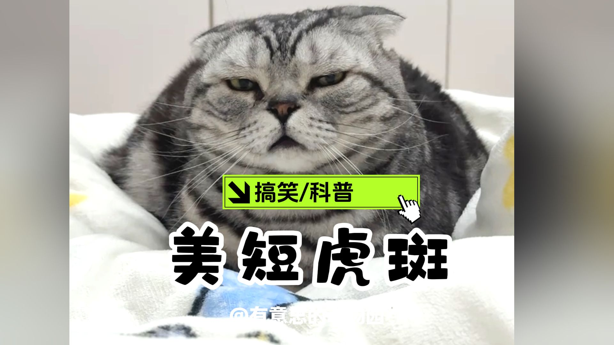 | 4.3万 | 2026-02-25 |
| [《哈基米南北绿豆》豆浆](https://www.bilibili.com/video/BV1cff1B2Erk) |  | 1605 | 2026-02-24 |
| [这么强](https://www.bilibili.com/video/BV1opfCBYE8k) | 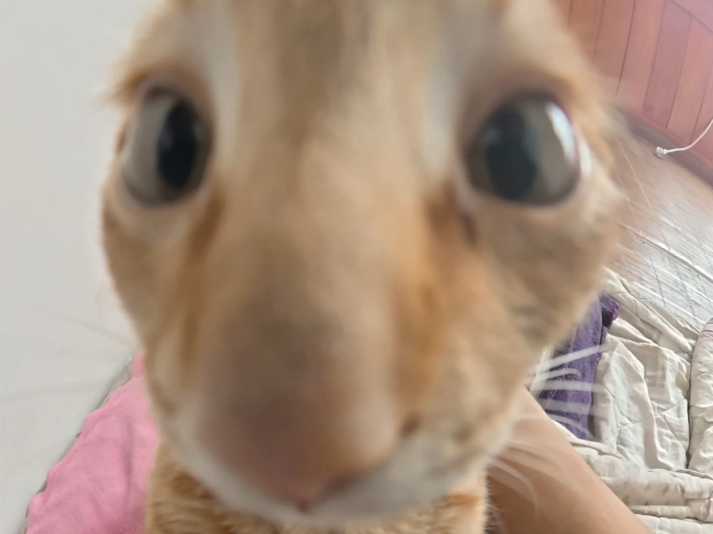 | 34.5万 | 2026-02-24 |
| [世界上最爱玩屎的小猫](https://www.bilibili.com/video/BV1gefrB7EMQ) |  | 27.6万 | 2026-02-24 |
| [新年祝大家长生不老，新年能给电子宠物头个币吗谢谢！年就这样过完了，没啥感觉。](https://www.bilibili.com/video/BV1nXfTBTETk) |  | 29.6万 | 2026-02-23 |
| [飞基](https://www.bilibili.com/video/BV1RyfMBhEqX) | 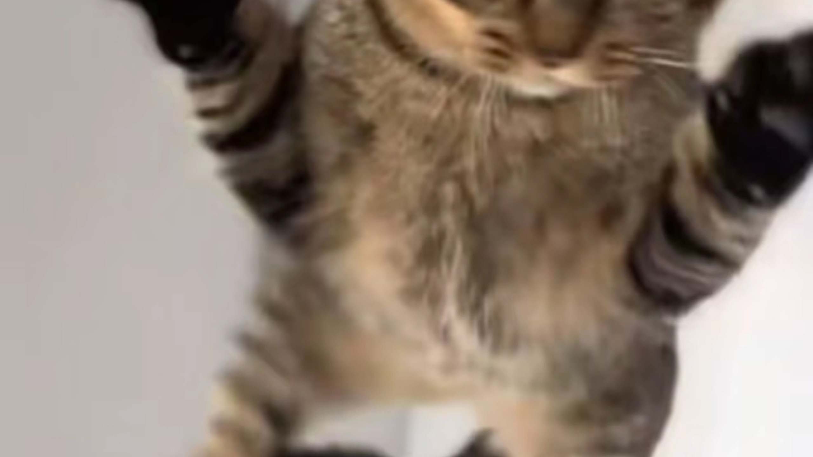 | 2450 | 2026-02-23 |
| [每天认识一种耄耋](https://www.bilibili.com/video/BV1gpfAB3EpC) |  | 264 | 2026-02-22 |
| [【夜哈】《小八翻唱》（原唱 曼波）「原曲 夜曲 Nocturne」「原唱 周杰伦 Jay Chou」（原作调音填词 慎啸）诗歌剧《11月的萧邦》（哈基米音乐）](https://www.bilibili.com/video/BV1KXfLBuEZ8) |  | 184 | 2026-02-21 |
| [胖耄耋在说什么](https://www.bilibili.com/video/BV1gafEBnEKH) | 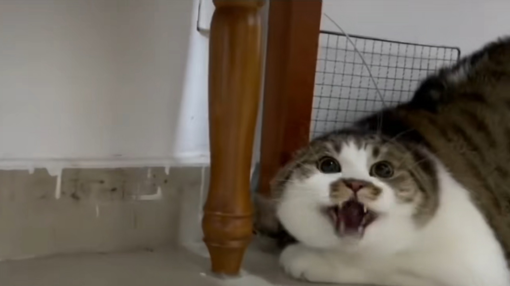 | 2.6万 | 2026-02-21 |
| [【哈基米音乐】安徽大学校歌](https://www.bilibili.com/video/BV13vZqBTEA3) |  | 680 | 2026-02-20 |
| [你是小丑吗？哈基米哈基米…](https://www.bilibili.com/video/BV1zeZeBgEBj) |  | 7479 | 2026-02-19 |
| [基米TV 当基米得知要去潜水后 高兴得跳起了街舞](https://www.bilibili.com/video/BV1kMZWB7Ei8) | 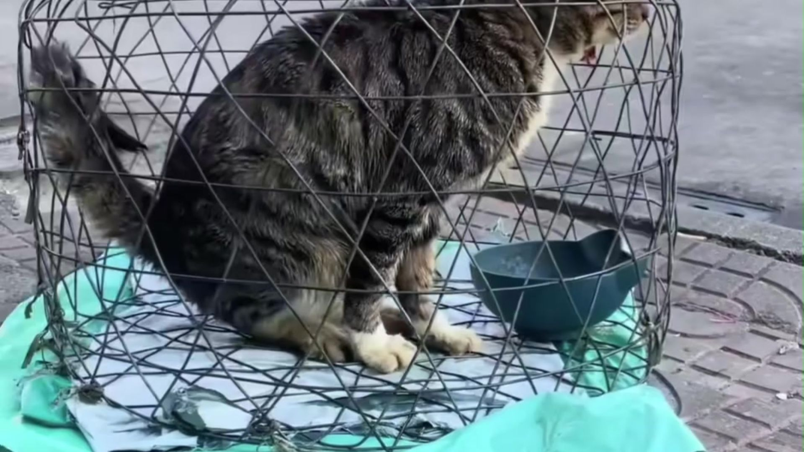 | 4.8万 | 2026-02-15 |
| [猫咪老吴合集](https://www.bilibili.com/video/BV1ja6nBWEfq) | 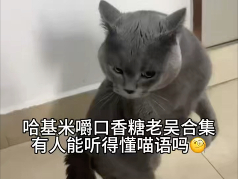 | 7.5万 | 2026-01-31 |
| [梦中情猫蓝胖子](https://www.bilibili.com/video/BV1gfN4zxEhM) | 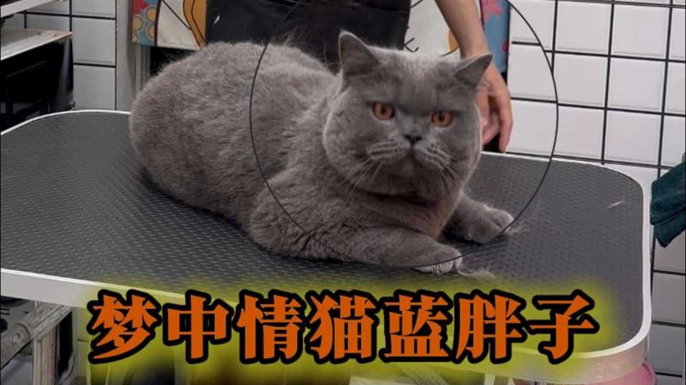 | 172.5万 | 2025-06-19 |
| [哈呀哈呀哈基米](https://www.bilibili.com/video/BV1YYVpzKETa) | 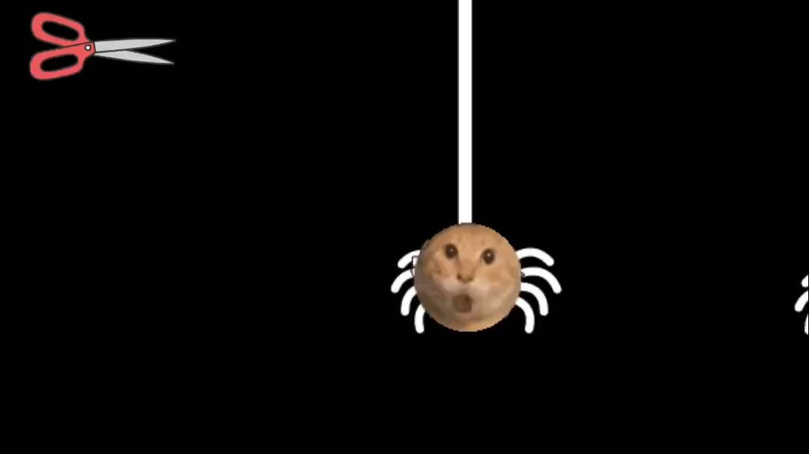 | 75.9万 | 2025-05-06 |
| [怪不得老是在公路上看到猫饼](https://www.bilibili.com/video/BV1QmQTYyE3s) |  | 65.8万 | 2025-03-14 |
| [哈基米](https://www.bilibili.com/video/BV1ZPBPYgEj8) | 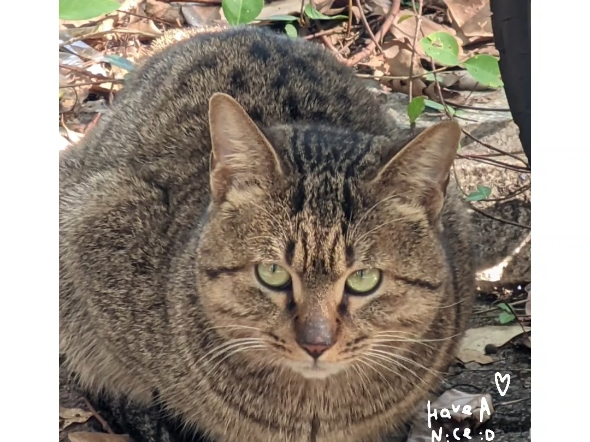 | 436 | 2024-12-16 |
| [哈基米丁真](https://www.bilibili.com/video/BV1YyBeYsEt6) |  | 49.1万 | 2024-11-22 |
| [节目效果之哈基米抢食](https://www.bilibili.com/video/BV11V4dedEgP) | 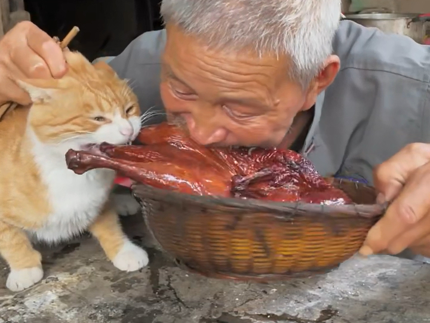 | 349.4万 | 2024-09-16 |

---
*最后更新: 2026-02-27 03:08:56 (自动生成)*
*数据来源: [Bilibili](https://www.bilibili.com)*

## 使用说明

运行以下命令更新视频列表:
```bash
python3 fetch_hajimi_videos.py
```
