# awesome-hajimi
collections of hajimi (哈基米 in Chinese) on the Internet.

## 视频列表 (Video List)

| 视频标题 (Title) | 封面 | 播放量 (Views) | 发布日期 (Date) |
|---|---|---|---|
| [哈基米哈基米！基米哈哈～](https://www.bilibili.com/video/BV18PocBZEms) |  | 205 | 2026-04-20 |
| [哈基米VS虎科动物](https://www.bilibili.com/video/BV1YPoNB5Ern) | 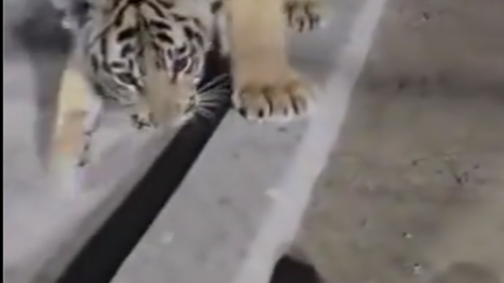 | 31 | 2026-04-20 |
| [娅娅也要哈基米南北绿豆~❤](https://www.bilibili.com/video/BV1o4dfBAEzg) |  | 288 | 2026-04-20 |
| [十种不一样的哈基米，你最想撸哪种？](https://www.bilibili.com/video/BV1e4dpBbEsQ) |  | 451 | 2026-04-20 |
| [【怪物猎人荒野音效mod】活全家哈基笛2.0](https://www.bilibili.com/video/BV1oRowBkEhk) |  | 794 | 2026-04-19 |
| [哈基米怎么改的？](https://www.bilibili.com/video/BV15zoABkELJ) | 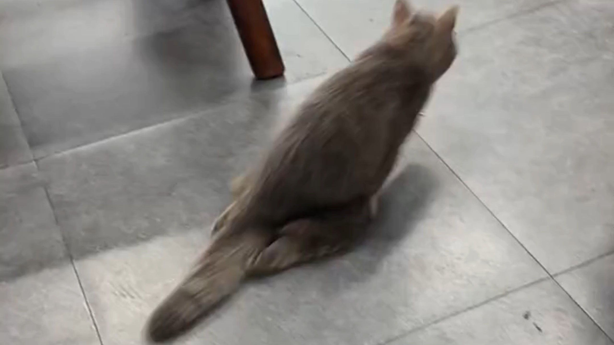 | 54 | 2026-04-19 |
| [哈基米玩累了开始舔鸟](https://www.bilibili.com/video/BV1MQoABeEjH) | 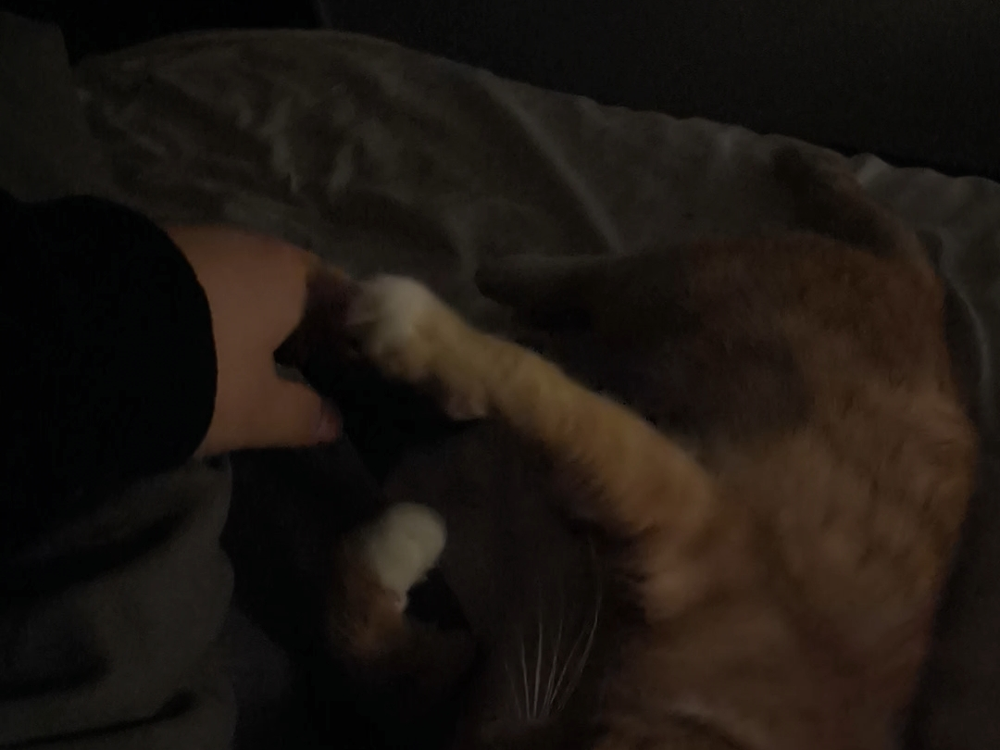 | 432 | 2026-04-19 |
| [卧槽！！！](https://www.bilibili.com/video/BV1cAowBEEfr) | 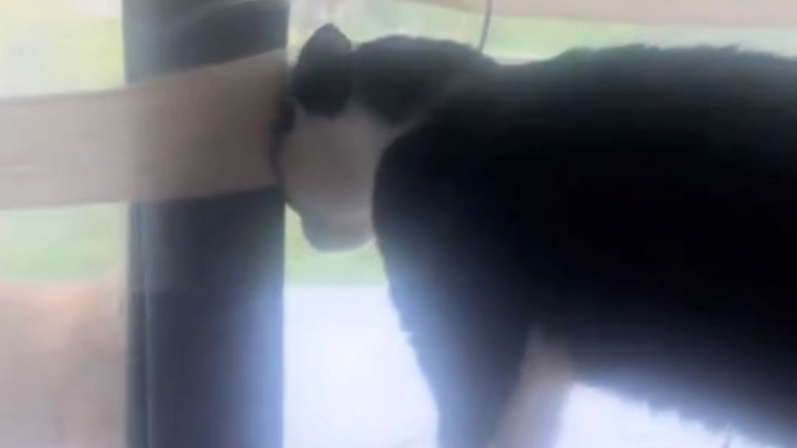 | 2297 | 2026-04-19 |
| [小基米这个不让人碰](https://www.bilibili.com/video/BV1B6dWBBEuq) | 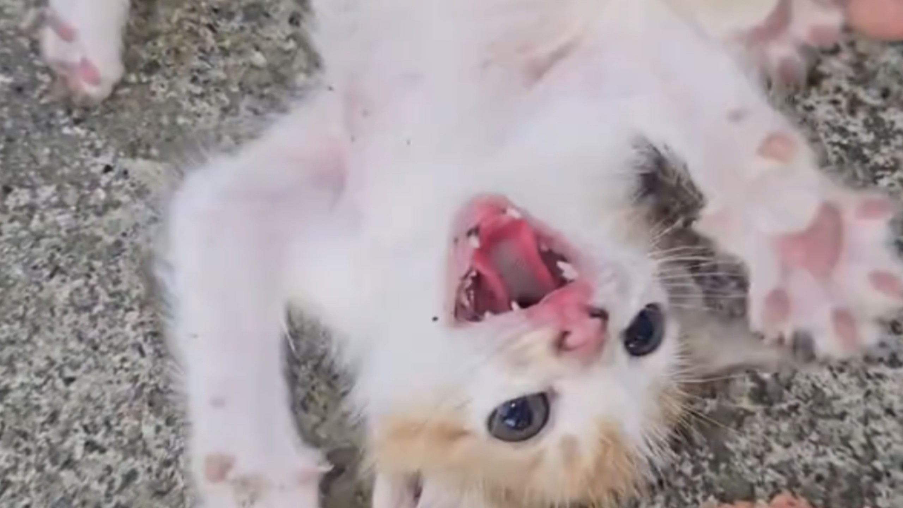 | 1071 | 2026-04-19 |
| [哈基米～哈基米～uc](https://www.bilibili.com/video/BV1EgowBCEvh) |  | 0 | 2026-04-19 |
| [哈基米6th秋上的 ∞](https://www.bilibili.com/video/BV1dLowBuEid) |  | 12 | 2026-04-19 |
| [卡妈也要哈基米](https://www.bilibili.com/video/BV15hdfBaEDR) |  | 27 | 2026-04-19 |
| [发现了小猫的秘密！](https://www.bilibili.com/video/BV1VvdfBfE8G) | 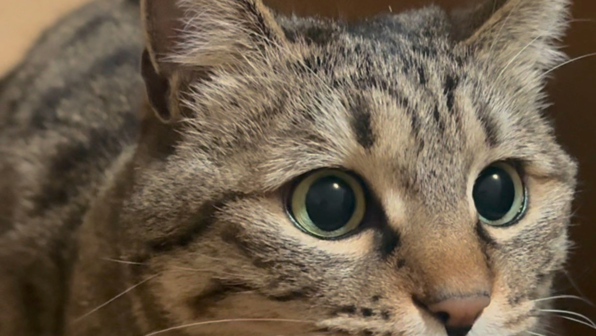 | 2123 | 2026-04-19 |
| [捏哈基米](https://www.bilibili.com/video/BV1HEdfB6EY3) | 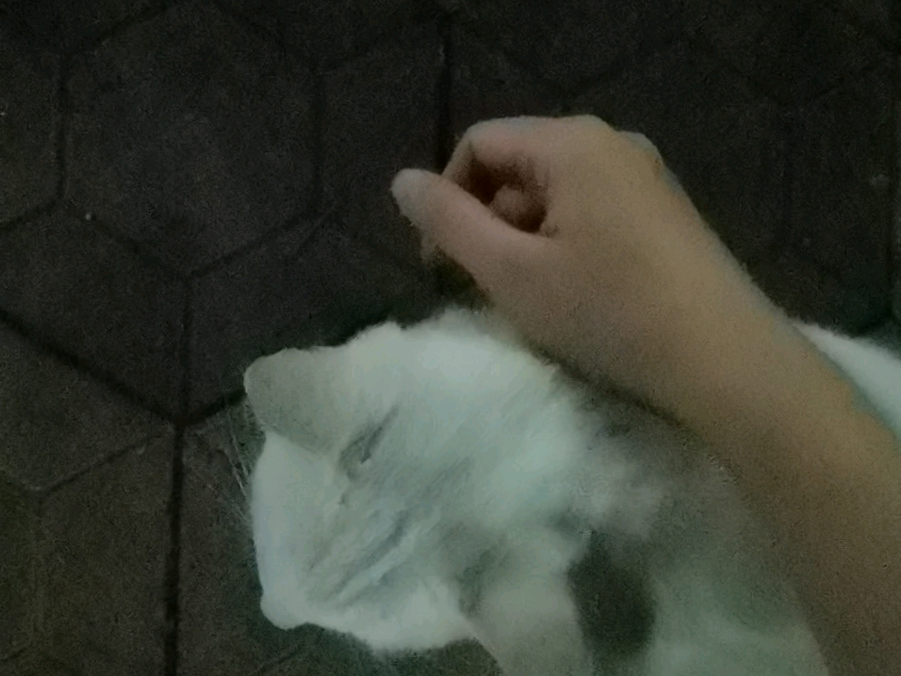 | 227 | 2026-04-19 |
| [哈基米：喵！](https://www.bilibili.com/video/BV1ZWdfBTEmZ) | 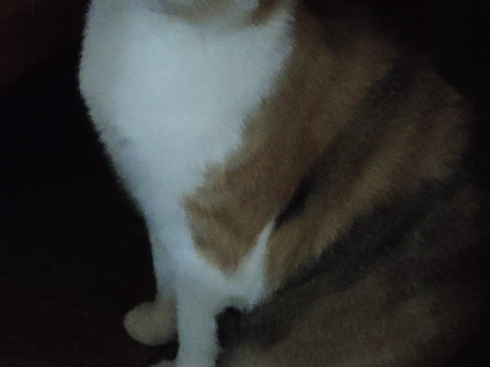 | 6 | 2026-04-19 |
| [【哈基米音乐/白切基】基 爱](https://www.bilibili.com/video/BV1JWdfBTEwN) |  | 39 | 2026-04-19 |
| [到底要我小猫咪怎么样啊！](https://www.bilibili.com/video/BV1HFoFBkEUu) | 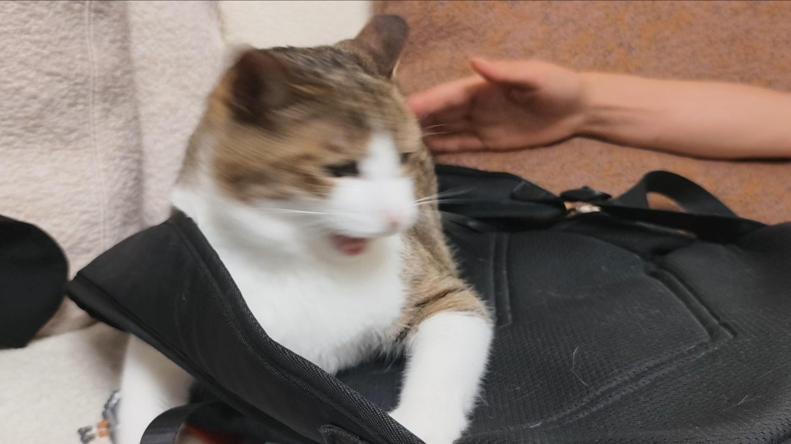 | 2.8万 | 2026-04-19 |
| [《春节序曲》哈基米版，有点儿烫嘴 #春节序曲 #哈基米 #哈基米音乐 #曼波 #rnb](https://www.bilibili.com/video/BV1PXdfB7EBz) |  | 0 | 2026-04-19 |
| [猩猩 VS 哈基米](https://www.bilibili.com/video/BV1cFoFBkEGP) | 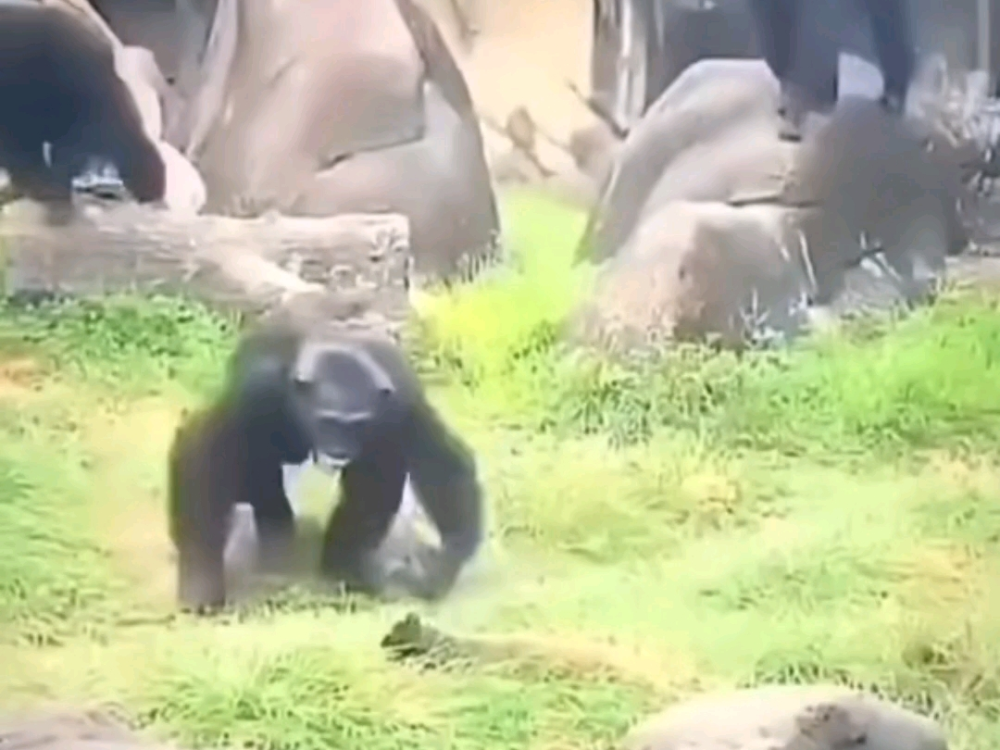 | 21 | 2026-04-19 |
| [偶遇哈基米](https://www.bilibili.com/video/BV1fwoFBgEod) |  | 10 | 2026-04-19 |
| [哈基米 哈基米 基米哈哈，哈基米 哈基米 搞搞小啾啾](https://www.bilibili.com/video/BV1wodfByEEn) | 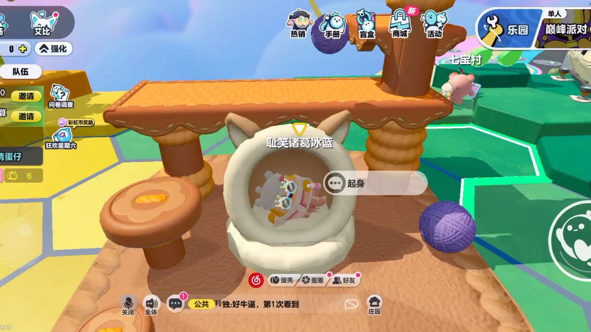 | 8 | 2026-04-19 |
| [【基米TV】温斯顿也爱哈基米，原始暴怒这块](https://www.bilibili.com/video/BV1TSdfBJEHu) | 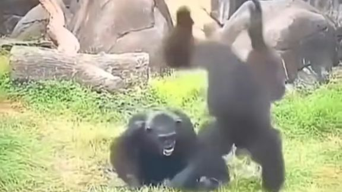 | 804 | 2026-04-19 |
| [哈基米南北绿豆](https://www.bilibili.com/video/BV1T2dfBHEPB) | 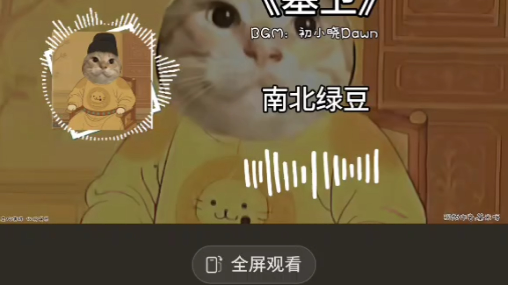 | 7 | 2026-04-19 |
| [符玄也要哈基米~](https://www.bilibili.com/video/BV1QEoFBbE2n) |  | 2990 | 2026-04-19 |
| [可不可以再叫我一次哈基米🥺](https://www.bilibili.com/video/BV1ZKoFBqEmw) |  | 9 | 2026-04-19 |
| [小爱音大战哈基米](https://www.bilibili.com/video/BV1juoFBiEKB) | 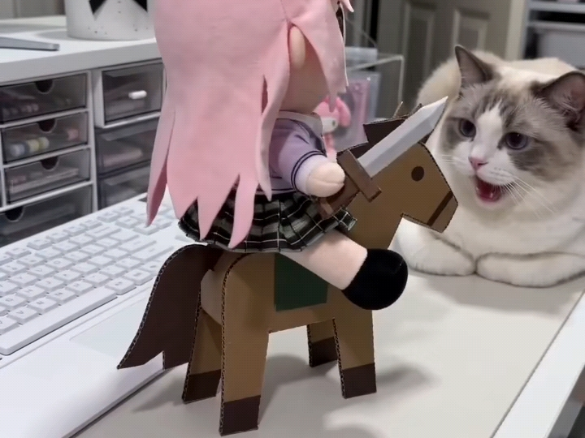 | 10 | 2026-04-19 |
| [【没见过哈基米吗】我的最新作品，快来一睹为快！](https://www.bilibili.com/video/BV16CoFBGEr2) | 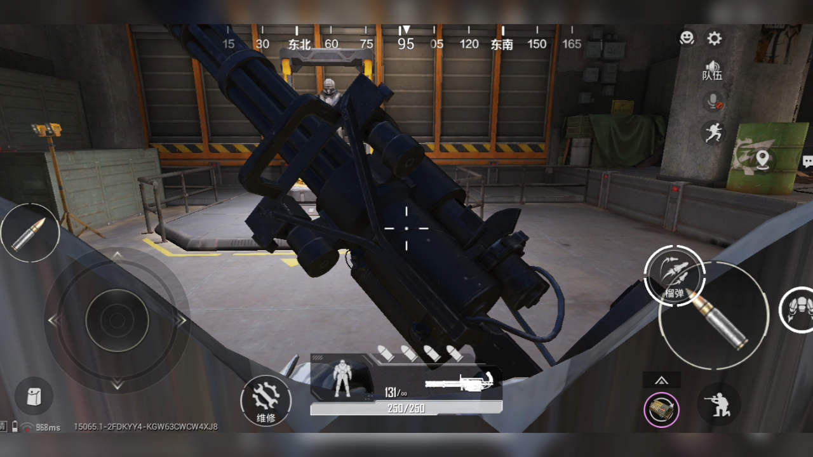 | 12 | 2026-04-19 |
| [哈基米这个恩将仇报](https://www.bilibili.com/video/BV16CoFBGEDr) | 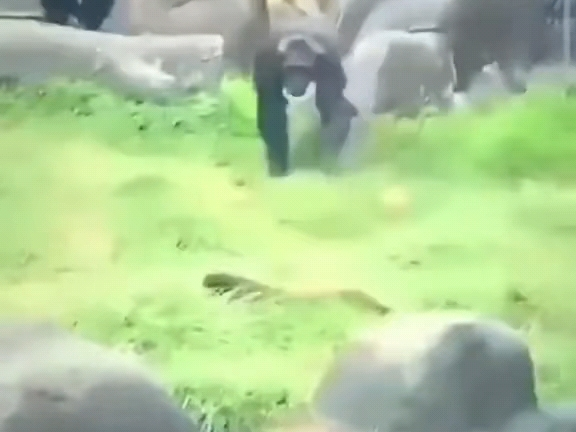 | 39 | 2026-04-19 |
| [给队友唱《基真的特别爱你》](https://www.bilibili.com/video/BV12toFBpEUQ) |  | 1493 | 2026-04-19 |
| [不是说猫科动物在睡觉时都很警觉吗？怎么有点不一样#学长#猫咪#哈基米#大学校园#随拍](https://www.bilibili.com/video/BV1CqoFBjEGp) |  | 122 | 2026-04-19 |
| [可怜的哈基米](https://www.bilibili.com/video/BV1AQdoBgEHv) | 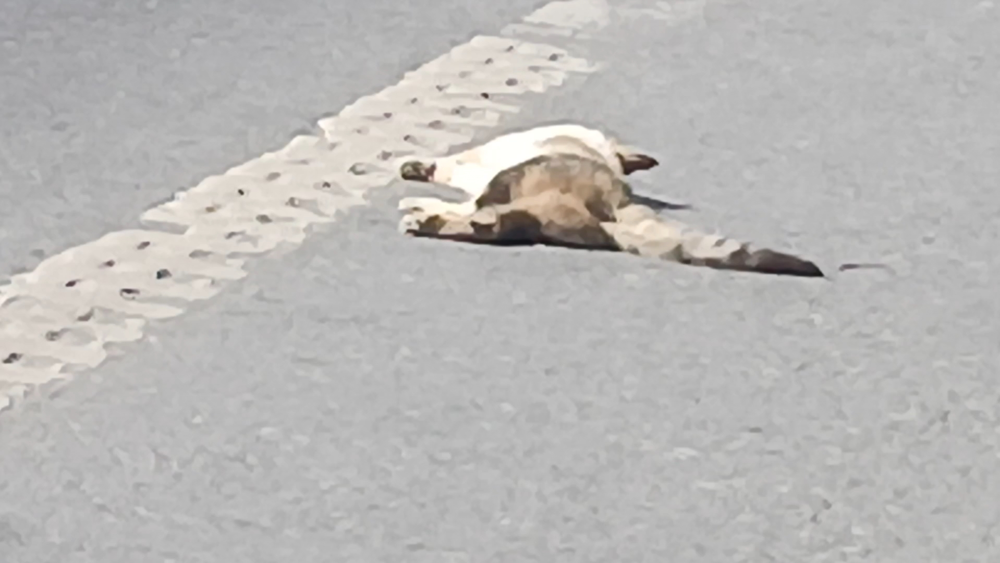 | 4 | 2026-04-19 |
| [好样的哈基米](https://www.bilibili.com/video/BV1WUdoBGERd) | 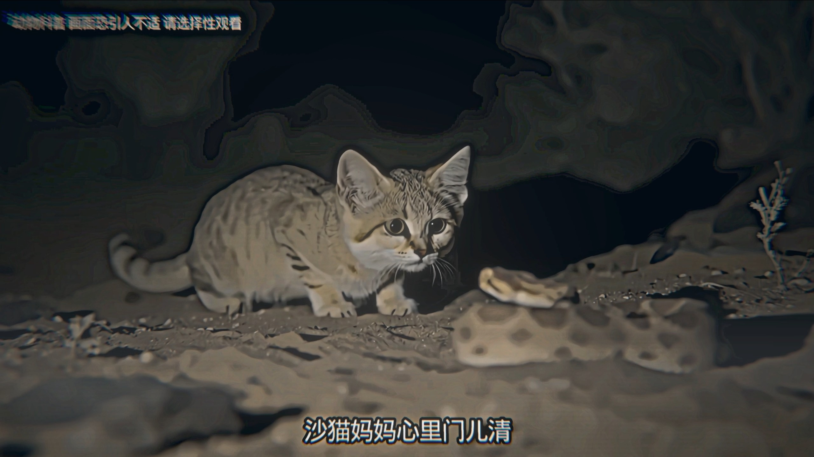 | 148 | 2026-04-19 |
| [谁家的邋遢哈基米](https://www.bilibili.com/video/BV1WSdoBrEtk) | 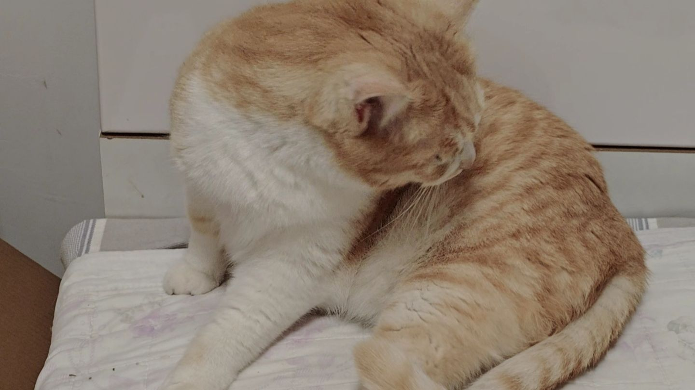 | 8 | 2026-04-19 |
| [圆头耋耋功夫 这是什么玩意](https://www.bilibili.com/video/BV1KtdZB1Ea1) |  | 1384 | 2026-04-19 |
| [难得有几个哈基米【1】](https://www.bilibili.com/video/BV1SidoBnEv7) |  | 160 | 2026-04-19 |
| [压力堪比哈基米上国道](https://www.bilibili.com/video/BV13idoBnEE5) |  | 416 | 2026-04-19 |
| [想要哈基米](https://www.bilibili.com/video/BV1XGdZBREci) | 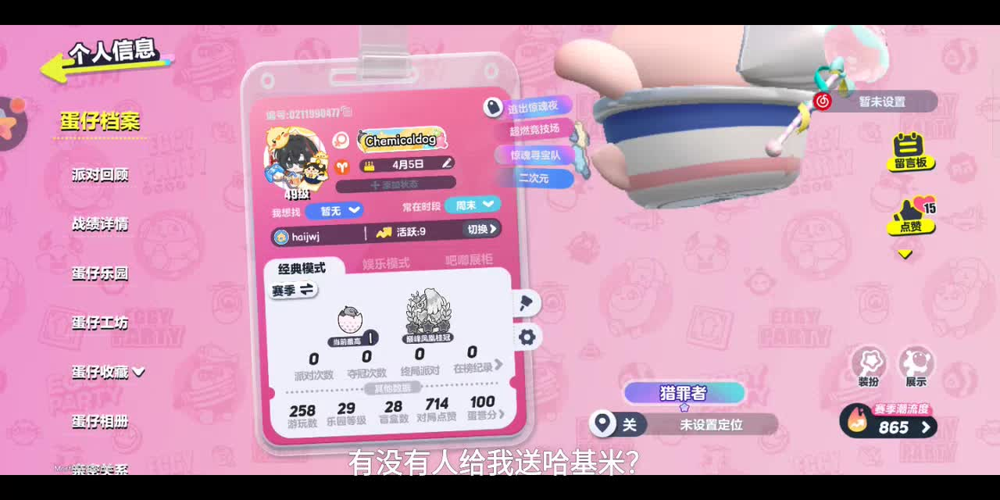 | 107 | 2026-04-19 |
| [你甚至都不愿意叫我一声老干妈…【弔文弔图】](https://www.bilibili.com/video/BV1pqd5BSET4) |  | 10.8万 | 2026-04-19 |
| [时间会证明哈基米AK](https://www.bilibili.com/video/BV1DjddB5Egv) |  | 2 | 2026-04-19 |
| [【哈基米开战机】更新啦，赶紧来围观吧！](https://www.bilibili.com/video/BV1jNdZBhE1t) |  | 13 | 2026-04-19 |
| [哈基米？NO！现在是土拨鼠的时代！](https://www.bilibili.com/video/BV1JcdZBPE4V) |  | 946 | 2026-04-19 |
| [语言学中有哪些类似「哈基米」的现象？](https://www.bilibili.com/video/BV1TnddBkEgN) |  | 1.2万 | 2026-04-19 |
| [哈基米也学会听歌了](https://www.bilibili.com/video/BV1fcdZBAER3) |  | 115 | 2026-04-19 |
| [绿皮技术修复小哈基米？](https://www.bilibili.com/video/BV1vudZBZE82) | 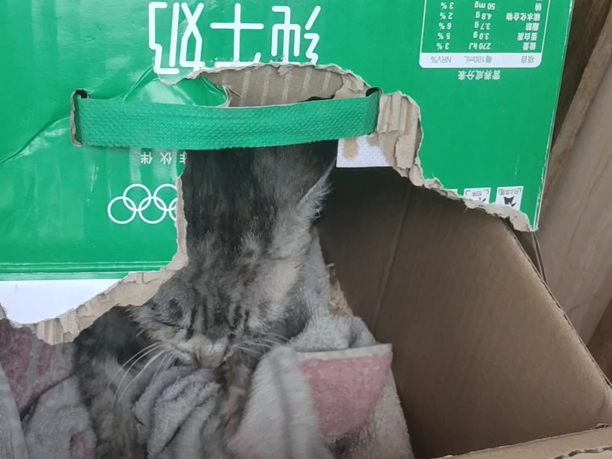 | 263 | 2026-04-19 |
| [赚多多的米 养胖胖的咪^⦁᎑-^ ੭](https://www.bilibili.com/video/BV1RMdZBtEMs) |  | 1678 | 2026-04-19 |
| [哈基咪哈基米](https://www.bilibili.com/video/BV1z6dZBiEwk) |  | 2635 | 2026-04-19 |
| [哈基米被下水道困住了](https://www.bilibili.com/video/BV1czdZBMEVt) | 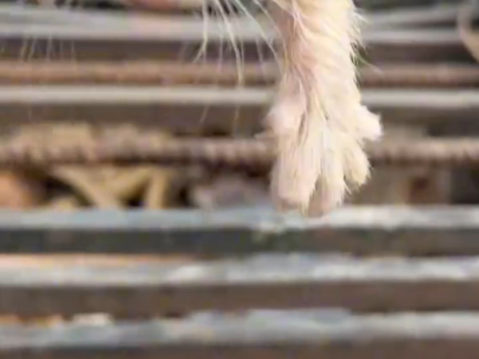 | 1485 | 2026-04-19 |
| [犹如哈基米底层代码冲突般](https://www.bilibili.com/video/BV1rzdZBTE73) | 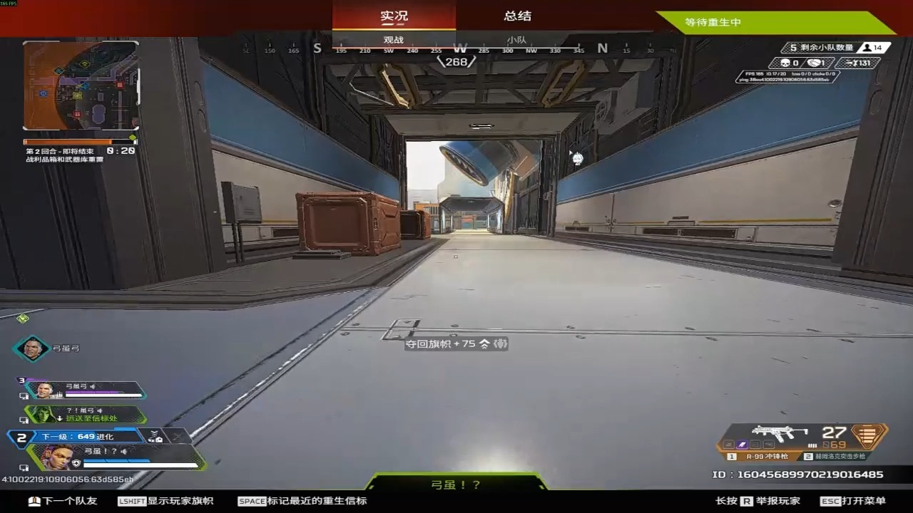 | 338 | 2026-04-19 |
| [当哈基米作者跑去做游戏Belike](https://www.bilibili.com/video/BV1bjddBLEei) |  | 674 | 2026-04-19 |
| [爱丽丝也要哈基米](https://www.bilibili.com/video/BV1B1dZBAEWb) |  | 4898 | 2026-04-19 |
| [哈基米 mio](https://www.bilibili.com/video/BV1q1dZBAE39) | 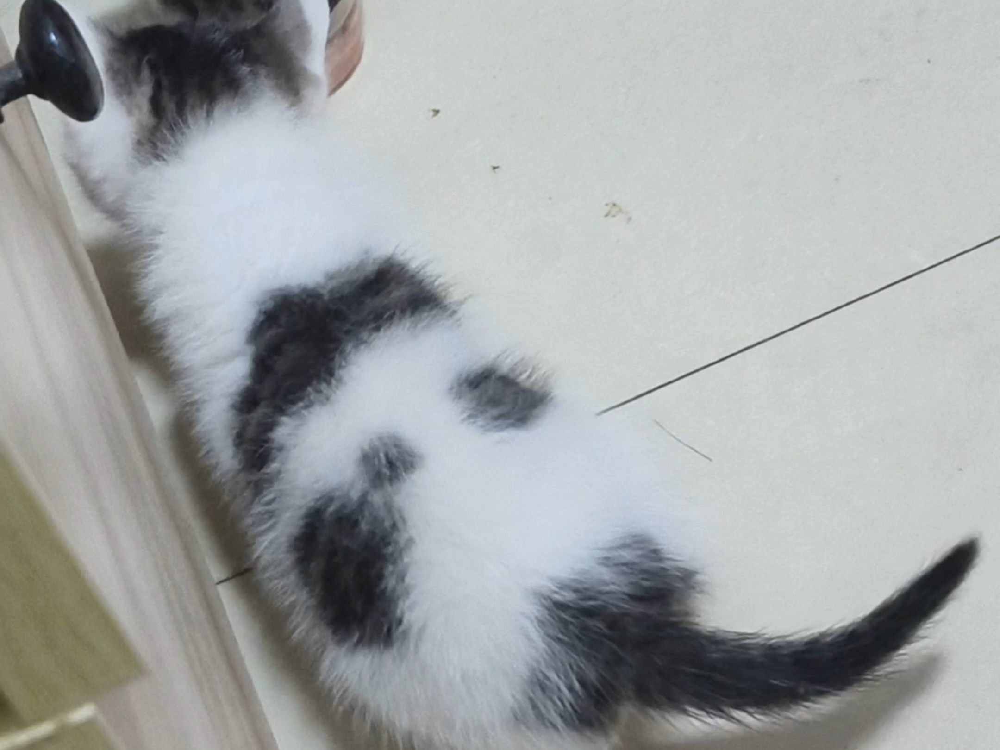 | 45 | 2026-04-19 |
| [记录哈基米＞w＜](https://www.bilibili.com/video/BV114dZBLEtW) | 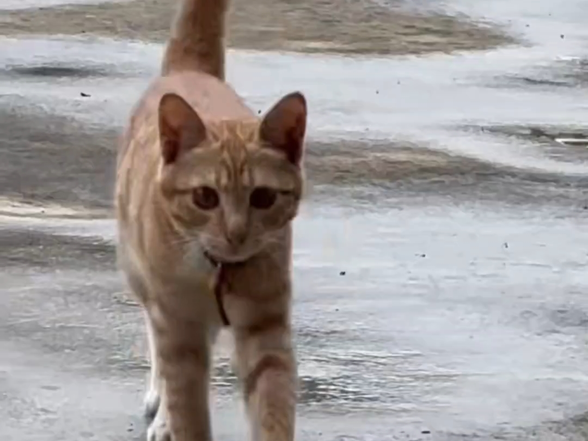 | 152 | 2026-04-19 |
| [钓鱼遇到一大群哈基米](https://www.bilibili.com/video/BV1wYdZBGEh8) |  | 155 | 2026-04-19 |
| [【肖肖哈基米的店】更新了一条视频，快来围观！](https://www.bilibili.com/video/BV1ChdZBkEn8) |  | 0 | 2026-04-19 |
| [哈基米哈基米哈基米](https://www.bilibili.com/video/BV1tNdfBJE1s) | 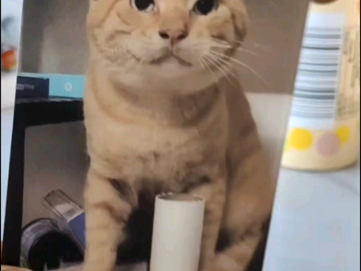 | 11 | 2026-04-19 |
| [路边的哈基米](https://www.bilibili.com/video/BV1tAdfBDEb4) | 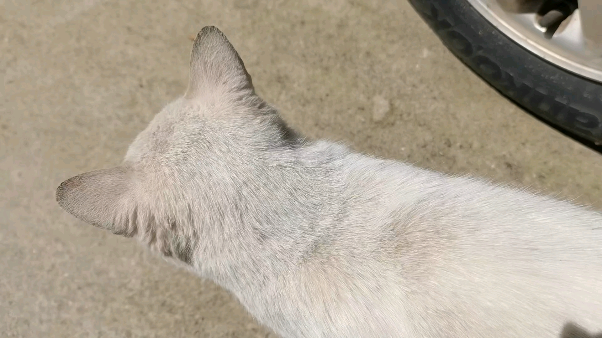 | 126 | 2026-04-19 |
| [《皮蛋陪你玩乐园》谁能拒绝一群卡哇伊的哈基米小弟！快被哄成胚胎啦～](https://www.bilibili.com/video/BV1y3dfBLE4T) |  | 110 | 2026-04-19 |
| [哈基米，](https://www.bilibili.com/video/BV1sGdfByEvt) |  | 6 | 2026-04-19 |
| [哈基米世界三幻神](https://www.bilibili.com/video/BV12MdfB7EUC) |  | 63 | 2026-04-19 |
| [乖巧的哈基米～](https://www.bilibili.com/video/BV1afdZBWEAq) | 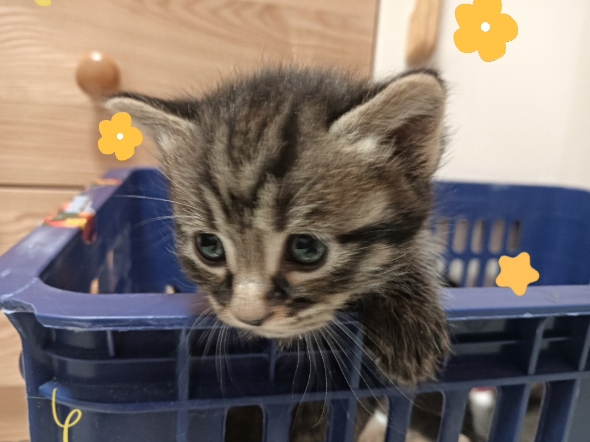 | 78 | 2026-04-19 |
| [哈基米～](https://www.bilibili.com/video/BV1u7ddByEm5) |  | 2 | 2026-04-19 |
| [哈基米南北绿豆~](https://www.bilibili.com/video/BV1ZZdRB4EYt) |  | 1535 | 2026-04-19 |
| [卡门也要哈基米](https://www.bilibili.com/video/BV1ziddBhEZV) |  | 481 | 2026-04-19 |
| [哈基米这个享受](https://www.bilibili.com/video/BV1qkddB4Err) | 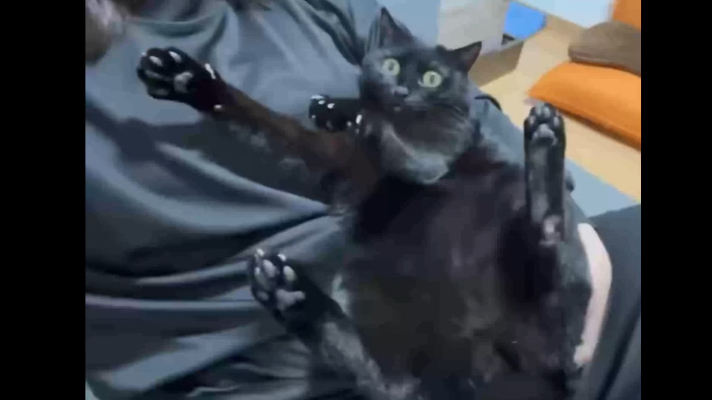 | 153 | 2026-04-19 |
| [哈基米反派の小曲⚡【审判时基】⚡](https://www.bilibili.com/video/BV1PxddBuEfK) | 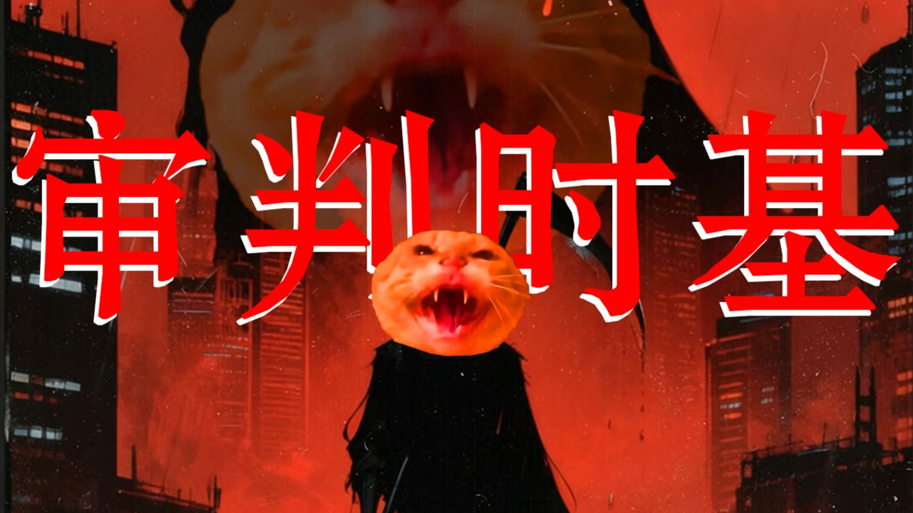 | 898 | 2026-04-19 |
| [【纯净哈基米】在银河中孤独哈气（完整版）](https://www.bilibili.com/video/BV1aQddBnEPP) |  | 1448 | 2026-04-19 |
| [哈基米](https://www.bilibili.com/video/BV12pddBgEfw) |  | 23 | 2026-04-19 |
| [星野也要哈基米南北绿豆~🥵](https://www.bilibili.com/video/BV1r8ddBvEZW) |  | 2.9万 | 2026-04-19 |
| [可爱的哈基米，依旧互关](https://www.bilibili.com/video/BV1mwdoBCEy6) | 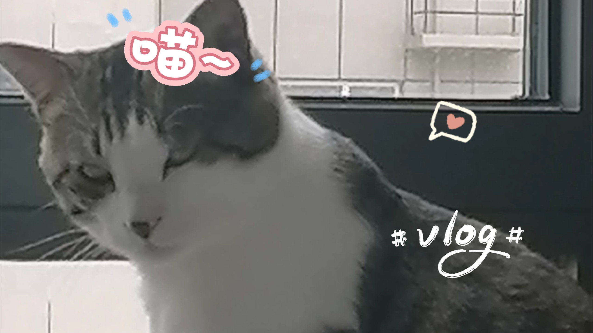 | 17 | 2026-04-19 |
| [谢谢纳西妲奖励喵🥵还要哈基米南北绿豆~](https://www.bilibili.com/video/BV1gdddBUEUQ) |  | 6219 | 2026-04-19 |
| [小卡哈基米](https://www.bilibili.com/video/BV1i4doB4Etu) |  | 1.2万 | 2026-04-19 |
| [哈基米](https://www.bilibili.com/video/BV1jsdoBZEeP) | 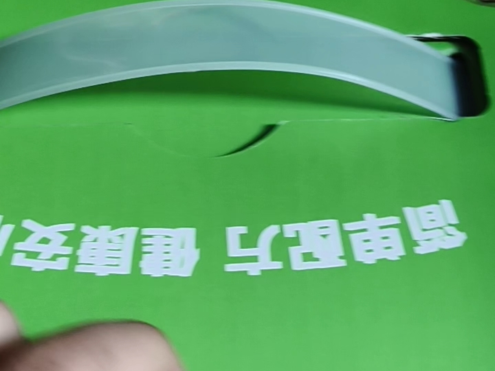 | 59 | 2026-04-19 |
| [总不能发只哈基米能比我做视频流量多吧](https://www.bilibili.com/video/BV1H3doBqETX) | 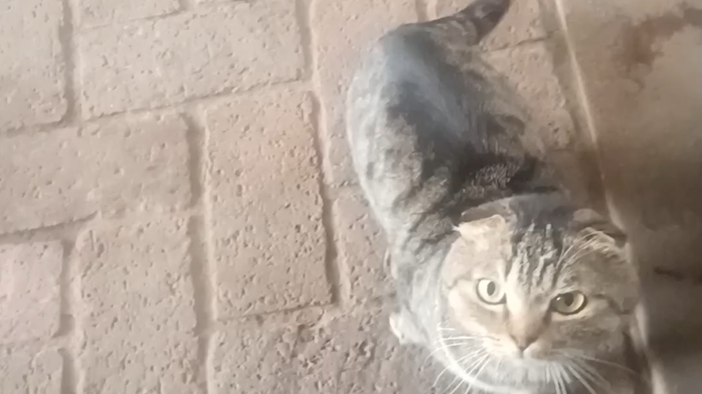 | 177 | 2026-04-19 |
| [鼠鼠赢过输过 就是没怂过！](https://www.bilibili.com/video/BV1NadxBXEY6) | 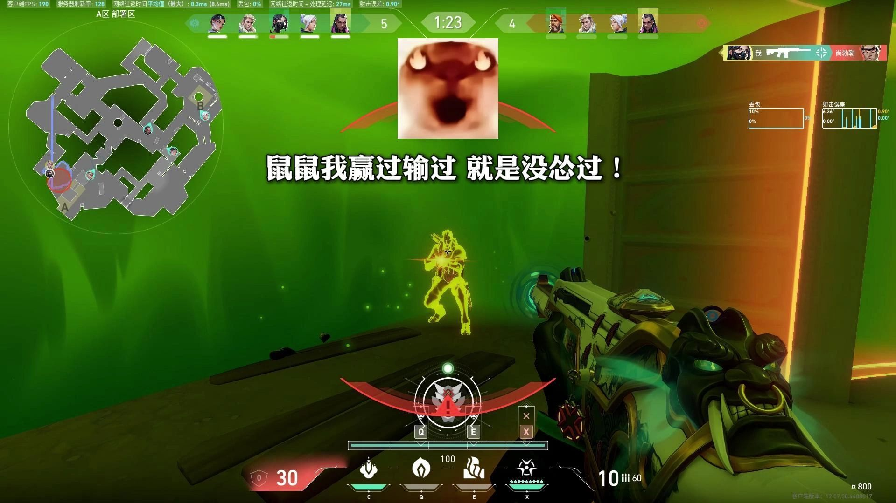 | 4.9万 | 2026-04-19 |
| [哈基米](https://www.bilibili.com/video/BV175dRBoE6X) | 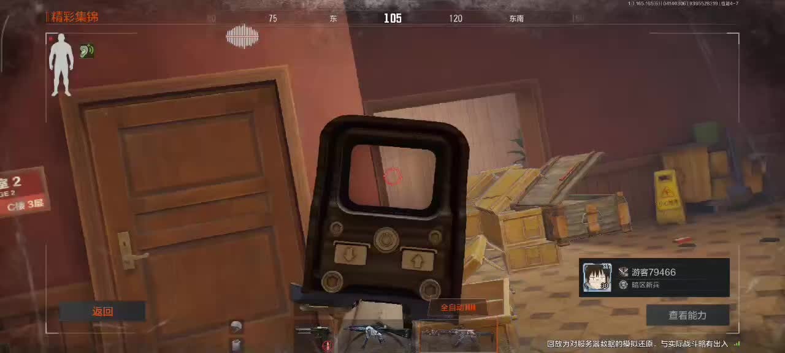 | 0 | 2026-04-18 |
| [哈基米南北绿豆](https://www.bilibili.com/video/BV1P1dRBiEuN) |  | 6.9万 | 2026-04-18 |
| [弥妮祁（无敌可爱哈基米](https://www.bilibili.com/video/BV1LVQGB9E1b) |  | 41 | 2026-04-18 |
| [【翻唱】這ゞ基米の漩窩，快要把莪呑沒゛](https://www.bilibili.com/video/BV11tdWB2Ev7) |  | 3261 | 2026-04-18 |
| [“   外表高冷实际上内心对你薯ki薯ki的不得了的辣妹基米   ”](https://www.bilibili.com/video/BV1sxdHB3EHH) |  | 2.9万 | 2026-04-18 |
| [《meme岛》第四集：偶遇海豚，解锁米级大金枪](https://www.bilibili.com/video/BV1tZdHBEE6N) |  | 1305 | 2026-04-18 |
| [哈基米南北绿豆](https://www.bilibili.com/video/BV1EjdpBKEBc) |  | 9459 | 2026-04-18 |
| [偷袭矿区的哈基米](https://www.bilibili.com/video/BV1LpdpBwE9c) |  | 805 | 2026-04-18 |
| [丑橘小时候还是挺好看的](https://www.bilibili.com/video/BV1yMdpBrENQ) | 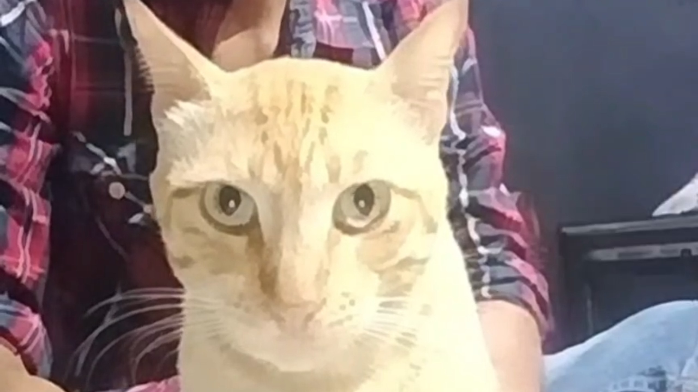 | 6395 | 2026-04-18 |
| [逆天小游戏2215](https://www.bilibili.com/video/BV1EYdhB4EfK) |  | 328.5万 | 2026-04-18 |
| [街猫出现哈基米高达🙀](https://www.bilibili.com/video/BV1wQdpBGEyw) |  | 2.1万 | 2026-04-18 |
| [前方哈基米出没。](https://www.bilibili.com/video/BV1bQdJByE1G) | 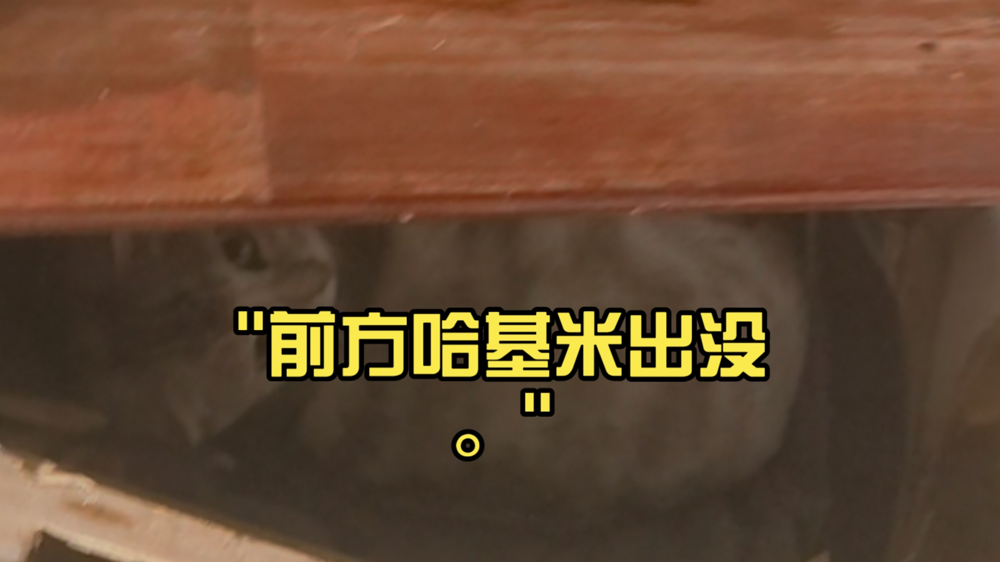 | 61 | 2026-04-18 |
| [哈基米怪圈](https://www.bilibili.com/video/BV1erdJBHEfd) | 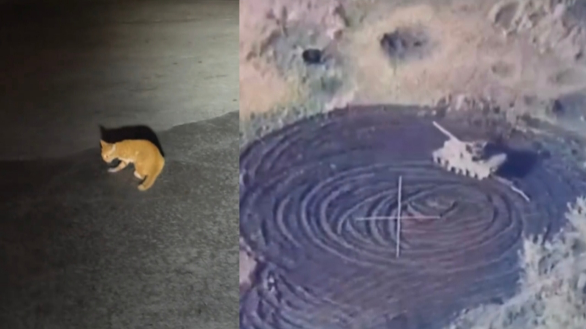 | 1.2万 | 2026-04-18 |
| [千咲哈基米](https://www.bilibili.com/video/BV1qed7BEE3r) |  | 2.1万 | 2026-04-18 |
| [用逗猫棒把嘬叫进来](https://www.bilibili.com/video/BV1sBdEBvE6E) | 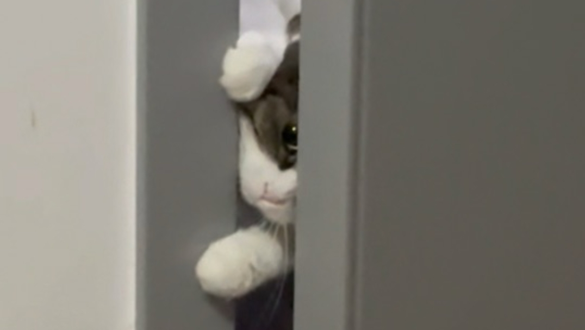 | 3.1万 | 2026-04-18 |
| [梅比乌斯也来哈基米南北绿豆~](https://www.bilibili.com/video/BV1h2d7BgE4U) |  | 4.3万 | 2026-04-17 |
| [这期养生了 #哈基米音乐 #莺莺拜月 #哈基米 #翻唱 #青年创作者成长计划](https://www.bilibili.com/video/BV1vqd7BjE1q) |  | 12 | 2026-04-17 |
| [伊冯也要哈基米~](https://www.bilibili.com/video/BV1LGdjByEtM) |  | 5866 | 2026-04-17 |
| [哈基咪南北绿豆~~](https://www.bilibili.com/video/BV17Td5B3E5Q) |  | 2.4万 | 2026-04-17 |
| [卫戍协议bgm超燃哈基米翻唱（附超燃当区教程）](https://www.bilibili.com/video/BV1Ecd5B5Evj) | 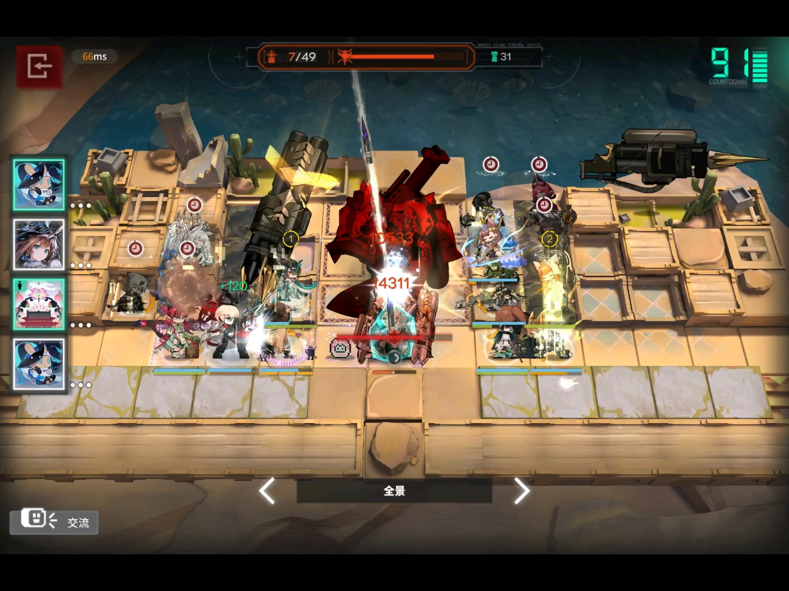 | 372 | 2026-04-17 |
| [哈基米南北绿豆](https://www.bilibili.com/video/BV13ZdqBeEdY) |  | 1.1万 | 2026-04-17 |
| [哈基米南北绿豆](https://www.bilibili.com/video/BV16RdaBcEjg) |  | 206 | 2026-04-16 |
| [我不知道没有睡大觉的夜晚](https://www.bilibili.com/video/BV1ZUdtBUE6m) |  | 2.4万 | 2026-04-16 |
| [依旧老吴](https://www.bilibili.com/video/BV1NxQJBZEZM) | 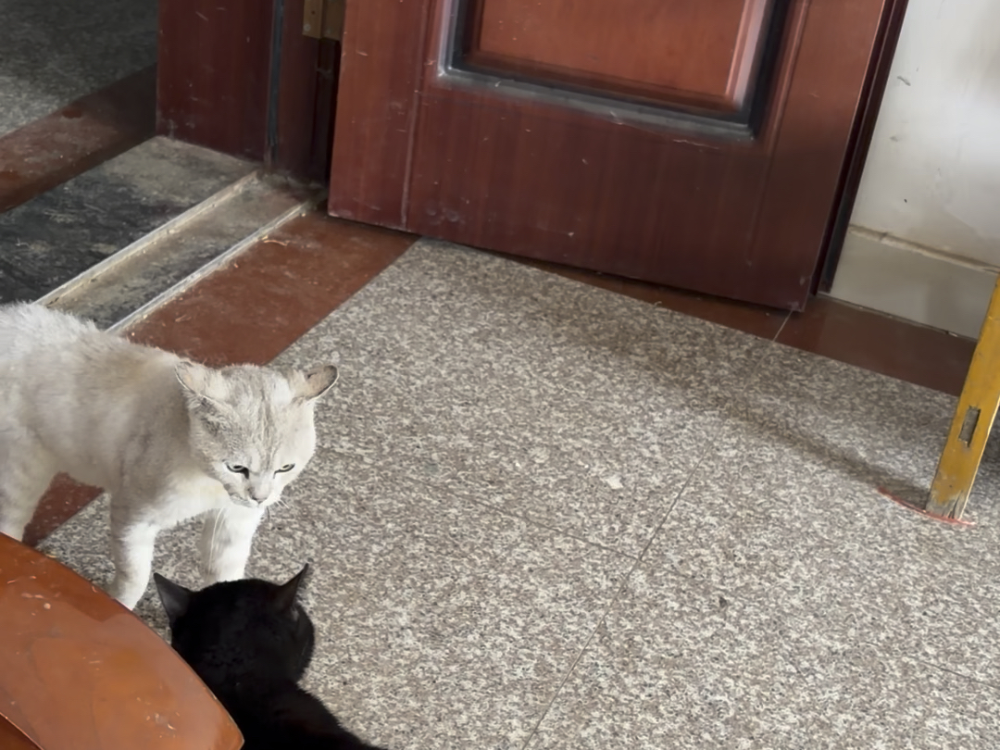 | 655 | 2026-04-15 |
| [基米在哪里哈](https://www.bilibili.com/video/BV1eND3BjEZA) |  | 3.1万 | 2026-04-05 |
| [【哈基米音乐】 一等哈气](https://www.bilibili.com/video/BV1YCNCz6EbB) |  | 8.4万 | 2025-06-21 |

---
*最后更新: 2026-04-20 03:20:14 (自动生成)*
*数据来源: [Bilibili](https://www.bilibili.com)*

## 使用说明

运行以下命令更新视频列表:
```bash
python3 fetch_hajimi_videos.py
```
