# awesome-hajimi
collections of hajimi (哈基米 in Chinese) on the Internet.

## 视频列表 (Video List)

| 视频标题 (Title) | 封面 | 播放量 (Views) | 发布日期 (Date) |
|---|---|---|---|
| [哈基米这个吵架](https://www.bilibili.com/video/BV1eCMT6vEaY) | 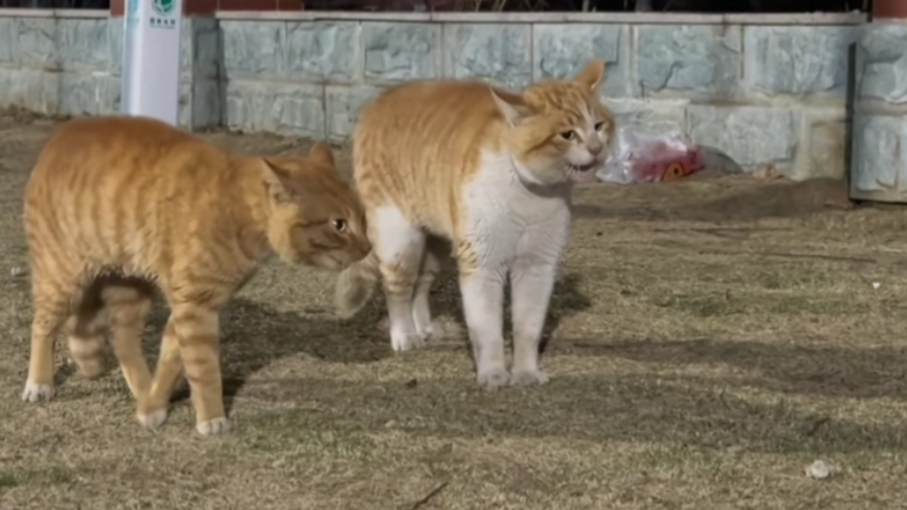 | 370 | 2026-07-04 |
| [哈基米呆萌的看着镜头](https://www.bilibili.com/video/BV1Y1MT6PEjs) | 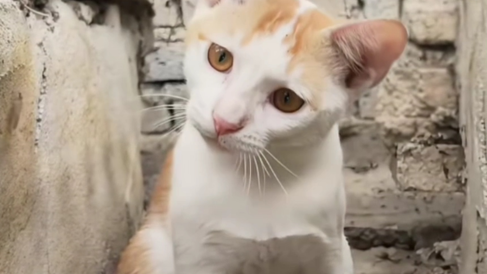 | 273 | 2026-07-04 |
| [哈基米的睡姿，有点像…](https://www.bilibili.com/video/BV1v6MT6qECY) | 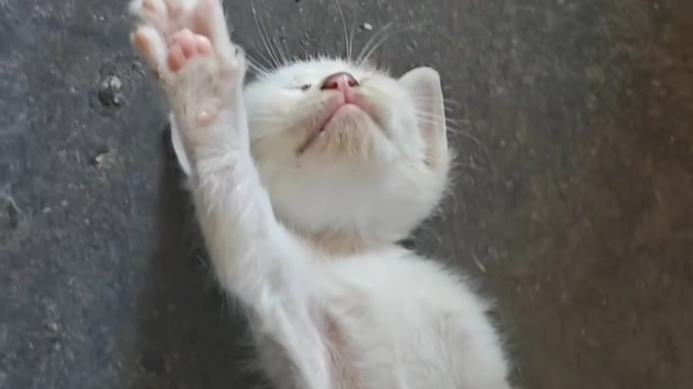 | 1436 | 2026-07-04 |
| [【七月新番】尼古喵喵OP致敬的50个电影画面出处解析](https://www.bilibili.com/video/BV1n3MM6jETe) |  | 2.7万 | 2026-07-04 |
| [生猛哈基米试图狩猎小鹿](https://www.bilibili.com/video/BV1vvMA6sEds) | 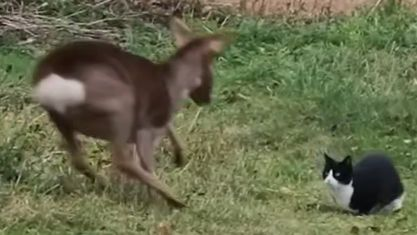 | 1406 | 2026-07-04 |
| [「25小时夜话」职业音乐人带你看哈基米歌王争霸赛](https://www.bilibili.com/video/BV181MA6mEen) |  | 1.1万 | 2026-07-04 |
| [【哈基米FM】🌸繁花私语🌸](https://www.bilibili.com/video/BV1u8MP6mEAk) |  | 175 | 2026-07-04 |
| [哈基米這個害怕](https://www.bilibili.com/video/BV1jTMw6REb9) | 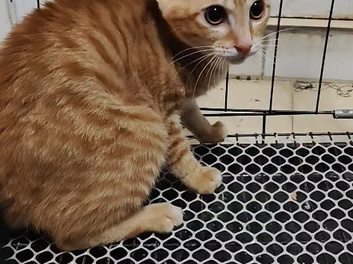 | 2358 | 2026-07-04 |
| [【基米TV】一门双至尊](https://www.bilibili.com/video/BV1KaMw6BEhe) | 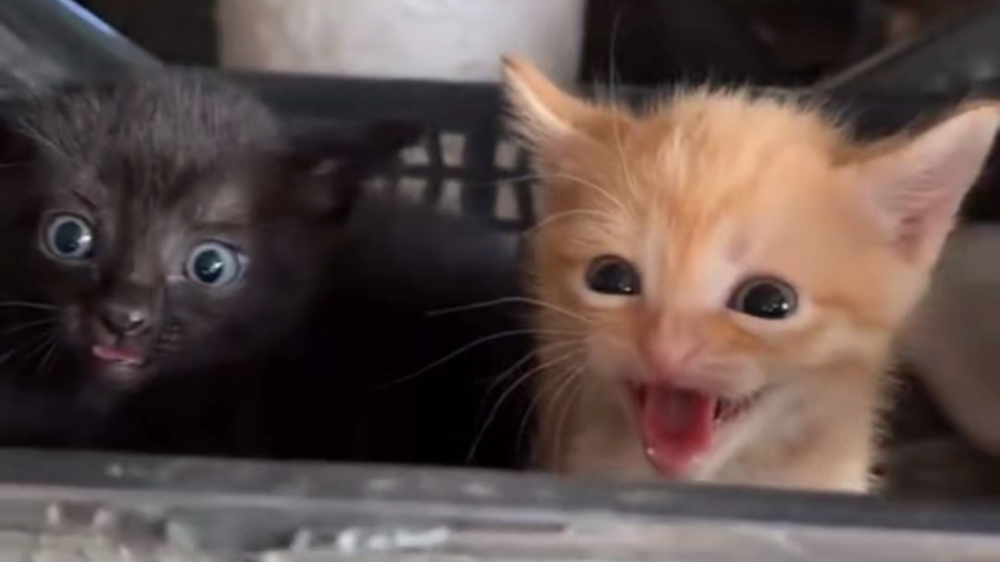 | 6224 | 2026-07-04 |
| [♿躲在超市后门溜冰的二人♿【电棍/哈基米】](https://www.bilibili.com/video/BV11aMw6BEi8) |  | 3481 | 2026-07-04 |
| [【717一起来摸哈基米】《摸猫猫》发售日即将到来！](https://www.bilibili.com/video/BV1buMA6VEga) |  | 914 | 2026-07-04 |
| [【100小时纯享版】欸？大狗!（无原声）](https://www.bilibili.com/video/BV1s4Tx6KER4) |  | 5601 | 2026-07-04 |
| [【哈基米TV】蠢基米](https://www.bilibili.com/video/BV1F6MF6sE4d) | 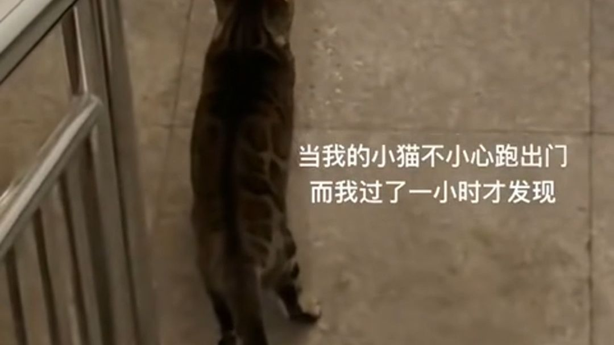 | 2476 | 2026-07-04 |
| [稀有的哈基米](https://www.bilibili.com/video/BV144MF6PELc) | 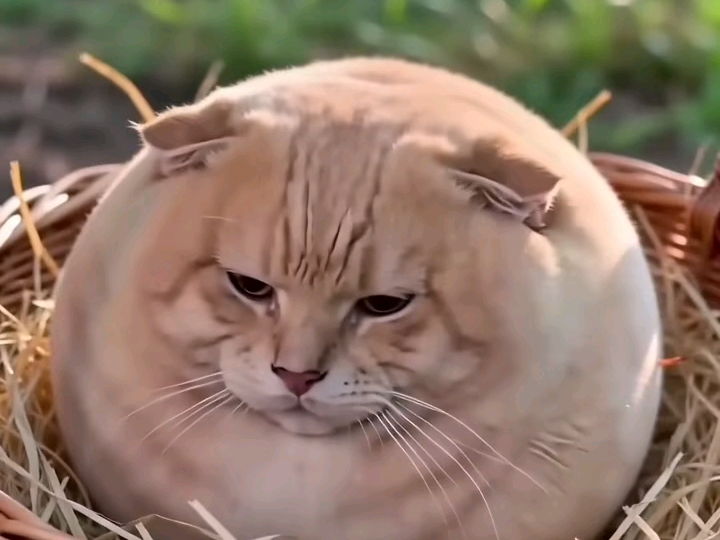 | 15 | 2026-07-04 |
| [陈茂盛的一天](https://www.bilibili.com/video/BV1NhTt63Ey3) | 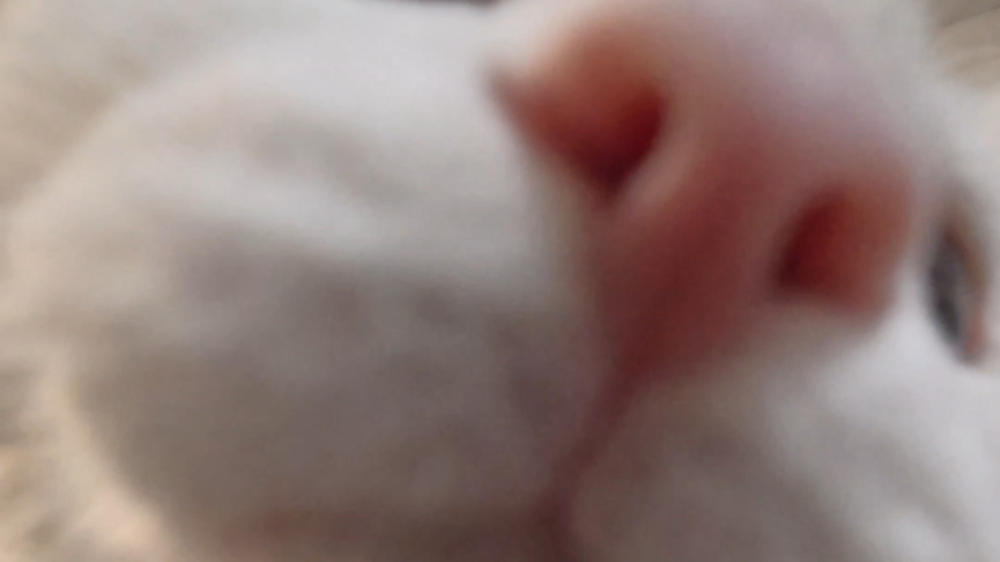 | 20.5万 | 2026-07-04 |
| [最劲爆的老吴](https://www.bilibili.com/video/BV1z7Tf6nEaN) | 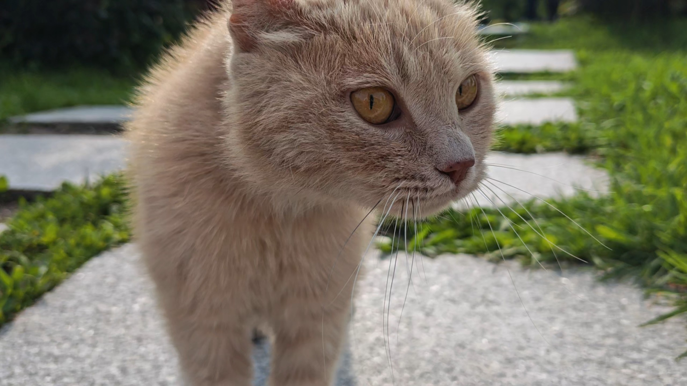 | 2.6万 | 2026-07-04 |
| [“二次元史上最爽的一口烟”](https://www.bilibili.com/video/BV1JiTZ6JEra) |  | 3.4万 | 2026-07-03 |
| [哈基米跳法尔孔战舞](https://www.bilibili.com/video/BV19STx6JEEW) | 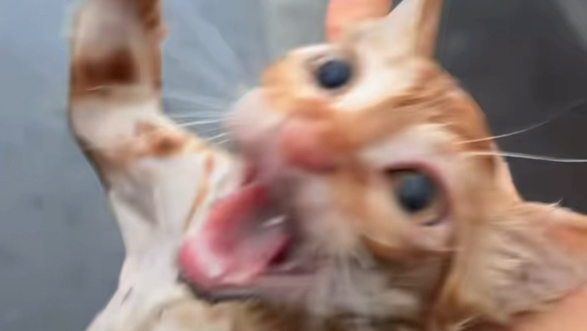 | 7.0万 | 2026-07-03 |
| [《白菜魔丸》1-46](https://www.bilibili.com/video/BV1w7T46wELh) |  | 5192 | 2026-07-03 |
| [我只是在南北路多](https://www.bilibili.com/video/BV18rT46yEYg) |  | 1.4万 | 2026-07-03 |
| [实战打出老吴你高你高硬控哈基米十秒](https://www.bilibili.com/video/BV1SCT46VENa) | 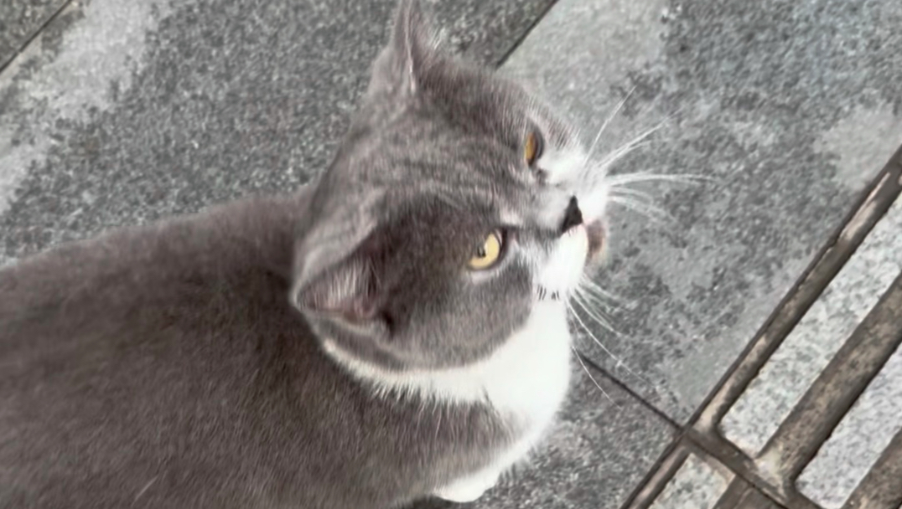 | 2327 | 2026-07-03 |
| [老吴不在，基米这个俊朗](https://www.bilibili.com/video/BV1AeTx6hEu8) | 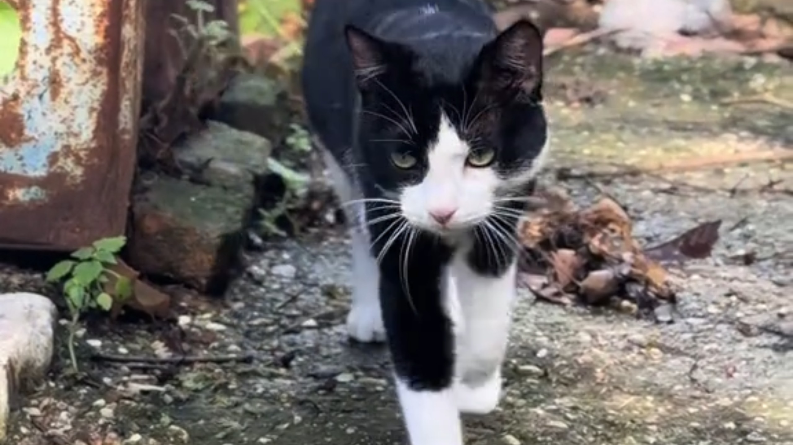 | 1.3万 | 2026-07-03 |
| [鉴定咬伤粉丝的毒蛇(36)粉丝被猪鼻蛇咬伤后肿成大猪蹄子？猪鼻蛇的毒性有多强？](https://www.bilibili.com/video/BV18VTW6TEH2) | 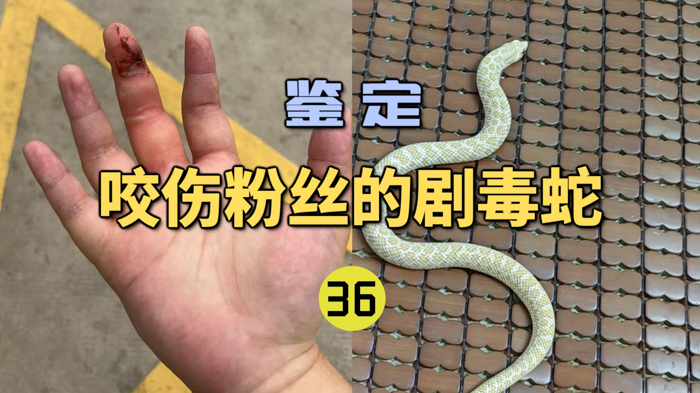 | 93.5万 | 2026-07-03 |
| [♿matrix (bl studio loop)♿](https://www.bilibili.com/video/BV1sCTe64ESf) |  | 3.7万 | 2026-07-03 |
| [小伙拉货挣到钱了，中午和流浪猫一起吃肯德基](https://www.bilibili.com/video/BV1HfT46AEkh) |  | 91.8万 | 2026-07-03 |
| [【哈基米音乐】哈基吞噬者（二阶段）](https://www.bilibili.com/video/BV1biKD6GEcj) |  | 1.1万 | 2026-07-03 |
| [依旧自动吸附这一块依旧街舞这一块](https://www.bilibili.com/video/BV1ceTx6hEy9) |  | 228 | 2026-07-03 |
| [“盛夏，蝉鸣，睦子米~”](https://www.bilibili.com/video/BV1skTp6tEdt) |  | 160.1万 | 2026-07-03 |
| [dadada！](https://www.bilibili.com/video/BV1YWTp66EsG) | 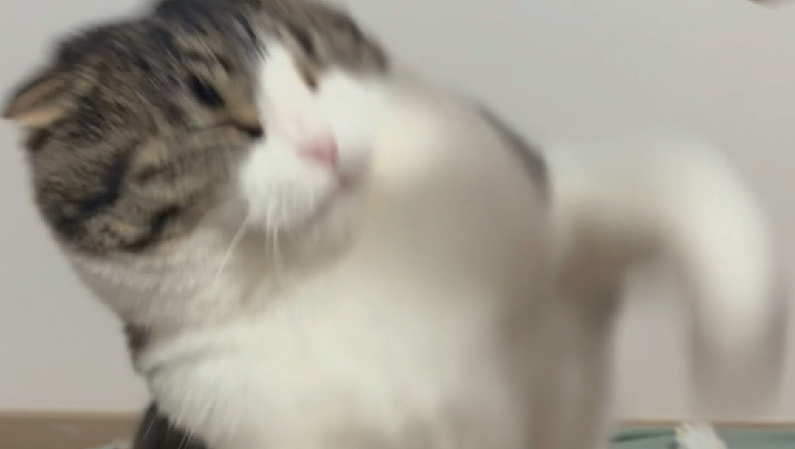 | 2.6万 | 2026-07-03 |
| [今天是温柔的老登](https://www.bilibili.com/video/BV1TgTJ6XEgN) | 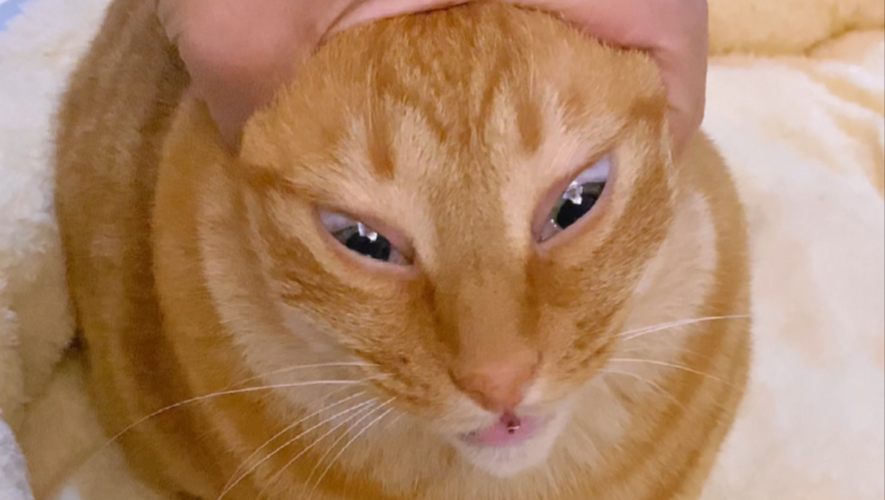 | 2.8万 | 2026-07-03 |
| [【24小时纯享版】欸？大狗!（无原声）](https://www.bilibili.com/video/BV1P9T761ELn) |  | 1.2万 | 2026-07-03 |
| [醇香](https://www.bilibili.com/video/BV1uWTr6WEZK) | 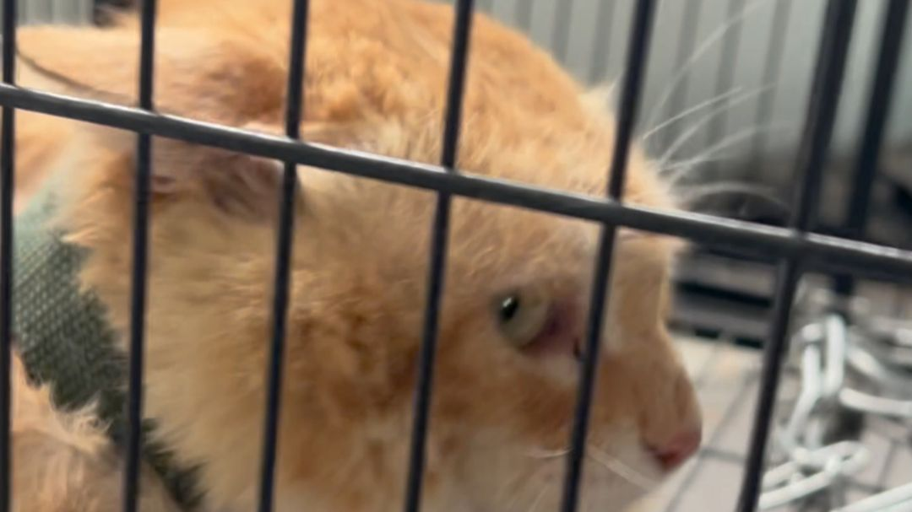 | 4315 | 2026-07-03 |
| [【尼古喵喵】全13话 超清中字（更新中）](https://www.bilibili.com/video/BV119T76yE8v) |  | 13.1万 | 2026-07-02 |
| [7月新番『尼古喵喵』 第1话【官方中字】](https://www.bilibili.com/video/BV1UaTn64EDD) |  | 104.8万 | 2026-07-02 |
| [猫:  我又喵首回春了？](https://www.bilibili.com/video/BV1RJTn6vEJo) | 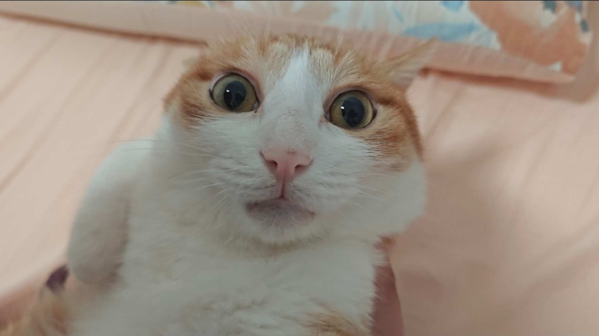 | 2.4万 | 2026-07-02 |
| [7月2日各路神人迷惑行为大赏，量大管撑](https://www.bilibili.com/video/BV1GBT76dEZf) |  | 26.0万 | 2026-07-02 |
| [哈基米这个吃猫饼，合并同类项这一块](https://www.bilibili.com/video/BV1koT76kEPg) | 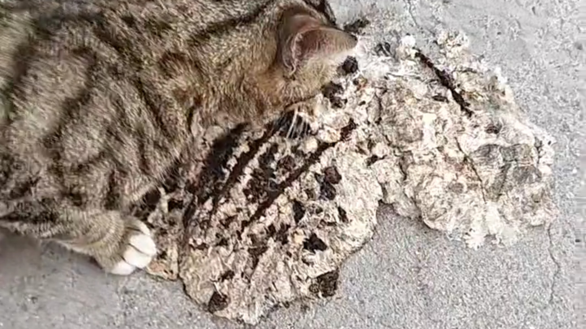 | 2420 | 2026-07-02 |
| [⚡Chu！⚡](https://www.bilibili.com/video/BV1VdTE6AEyp) |  | 22.4万 | 2026-07-02 |
| [鼠攻！](https://www.bilibili.com/video/BV1AqTj6BEwK) |  | 14.4万 | 2026-07-02 |
| [【哈基米版】冰霜自动铺桥机](https://www.bilibili.com/video/BV12bTz63EW5) |  | 4.8万 | 2026-07-02 |
| [人，咪在大理看到了日出](https://www.bilibili.com/video/BV1TKT76mESL) |  | 8092 | 2026-07-02 |
| [农村碳水猫](https://www.bilibili.com/video/BV1JkTj6PEbc) | 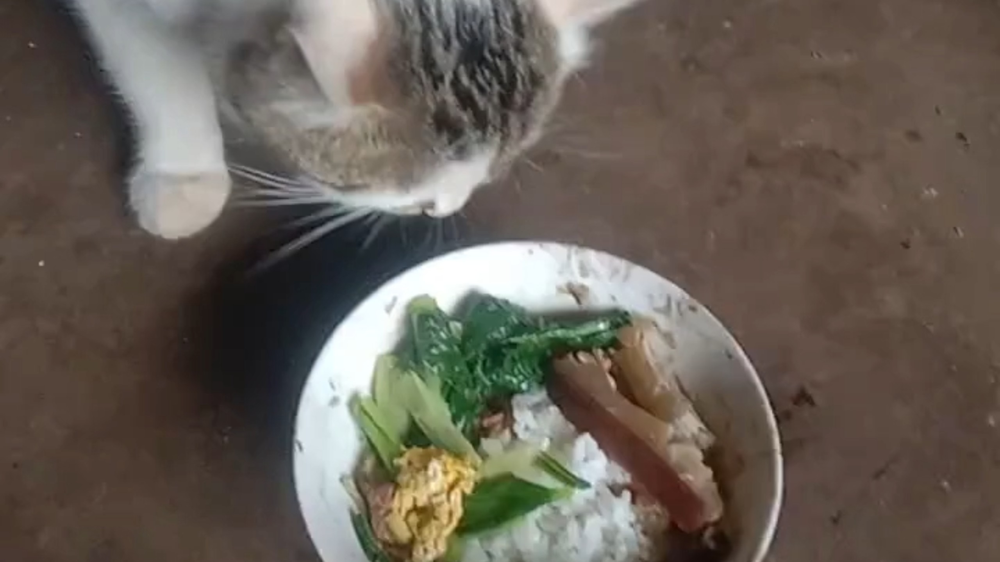 | 3.4万 | 2026-07-02 |
| [【十小时纯享版】欸？大狗!（无原声）](https://www.bilibili.com/video/BV1LPTq6DE2i) |  | 6.2万 | 2026-07-02 |
| [真的是沙币呀～](https://www.bilibili.com/video/BV1LqTk6YELs) | 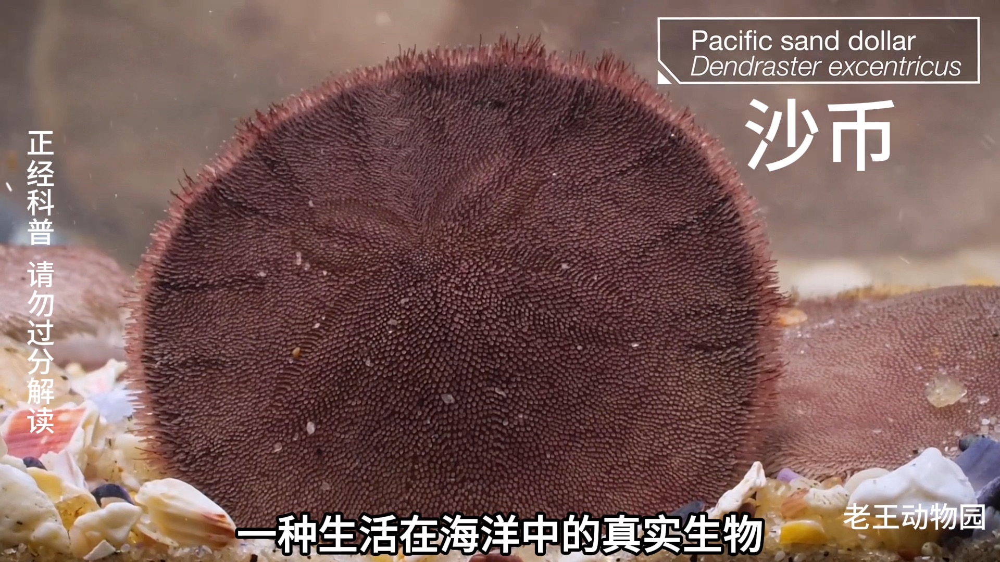 | 184.4万 | 2026-07-02 |
| [哈基米逃票坐高铁](https://www.bilibili.com/video/BV1z1Tz68EEw) | 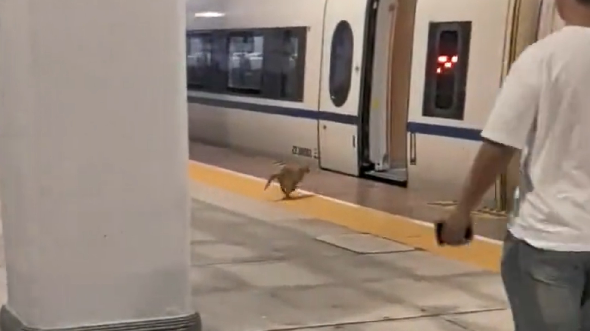 | 18.3万 | 2026-07-02 |
| [原来哈基米是gay](https://www.bilibili.com/video/BV1nnT66iEpK) | 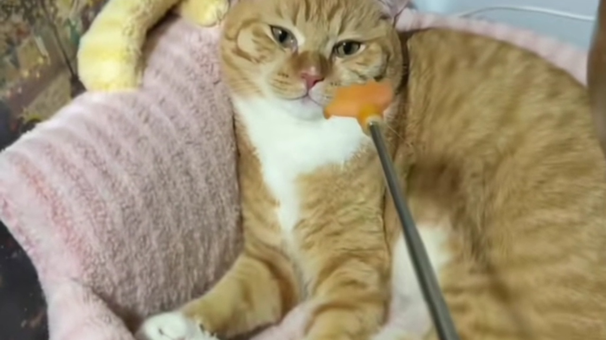 | 2.1万 | 2026-07-02 |
| [黑 水 啊，我 已 归 来](https://www.bilibili.com/video/BV12LTY6dEik) |  | 61.0万 | 2026-07-01 |
| [嘤嘤怪！一到医院就变缩头小猫！往人怀里钻！](https://www.bilibili.com/video/BV1bFTB6VE91) | 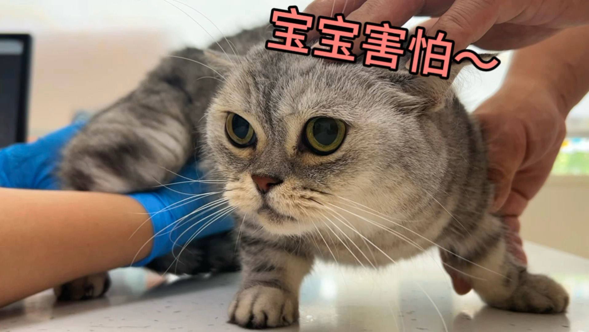 | 9.0万 | 2026-07-01 |
| [猫儿这个被控制](https://www.bilibili.com/video/BV18ZTq6CEFr) |  | 20.8万 | 2026-07-01 |
| [落泪 哈基米版](https://www.bilibili.com/video/BV1RNTv63EE4) |  | 614 | 2026-07-01 |
| [闰土：来只好猹摇一摇](https://www.bilibili.com/video/BV1xrTe6ZEiP) |  | 173.0万 | 2026-07-01 |
| [暴力天花板洗护](https://www.bilibili.com/video/BV1GbTw62E2d) |  | 5.4万 | 2026-07-01 |
| [猫越怪，人越爱！](https://www.bilibili.com/video/BV1G3Tv6MEBK) | 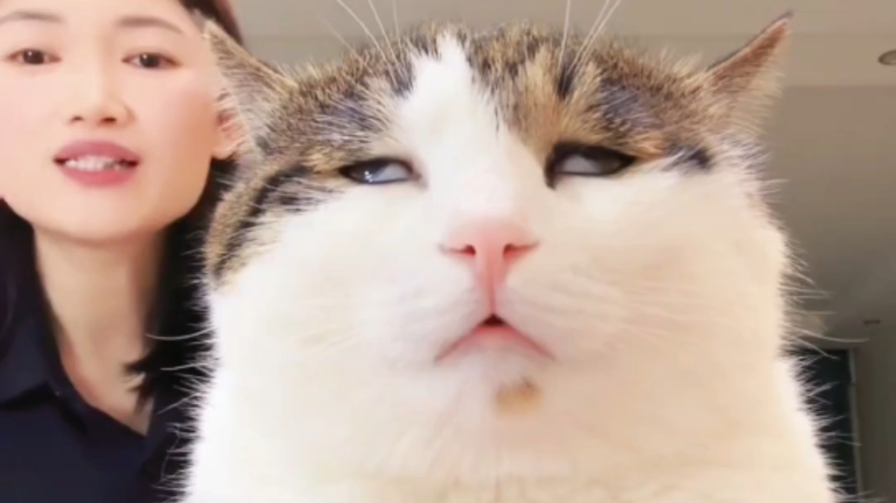 | 11.1万 | 2026-07-01 |
| [【老吴音乐】“西部老吴手”](https://www.bilibili.com/video/BV1ZETi6HE9t) |  | 1.5万 | 2026-07-01 |
| [阿咪的生活Vlog 第4集 (连抛18次圣杯许愿大家都好运)](https://www.bilibili.com/video/BV1uGTY6fEiS) |  | 9786 | 2026-07-01 |
| [《反正我是弱智 我想干啥干啥》](https://www.bilibili.com/video/BV1cyT86gEeb) |  | 48.1万 | 2026-07-01 |
| [《白菜魔丸》44](https://www.bilibili.com/video/BV1nGTw6tEoh) | 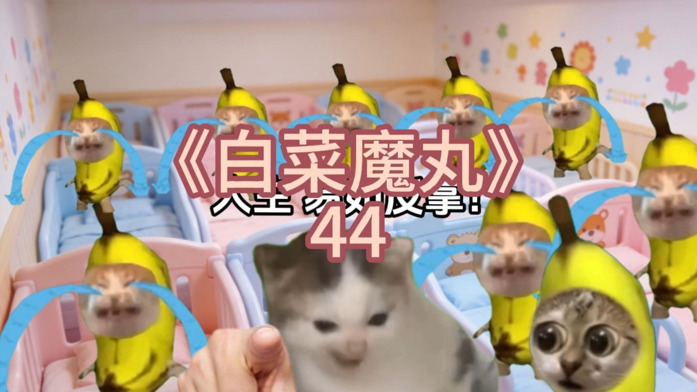 | 6.8万 | 2026-06-30 |
| [被拯救的咕咕嘎嘎的一生……](https://www.bilibili.com/video/BV1WFTF6ZEaz) |  | 70.3万 | 2026-06-30 |
| [永远怀念我们亲爱的妹爷！](https://www.bilibili.com/video/BV1ghTF6qEmD) | 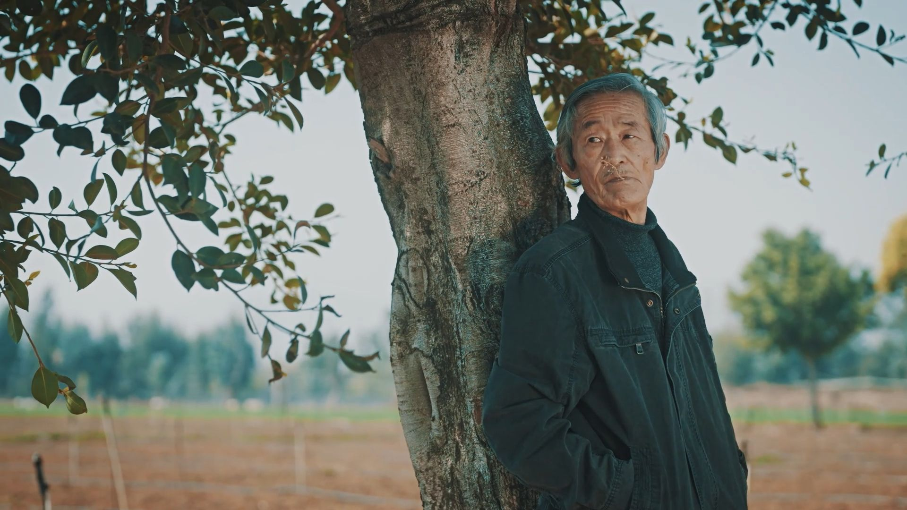 | 492.7万 | 2026-06-30 |
| [Q弹的猫咪](https://www.bilibili.com/video/BV11EKf6dEhq) | 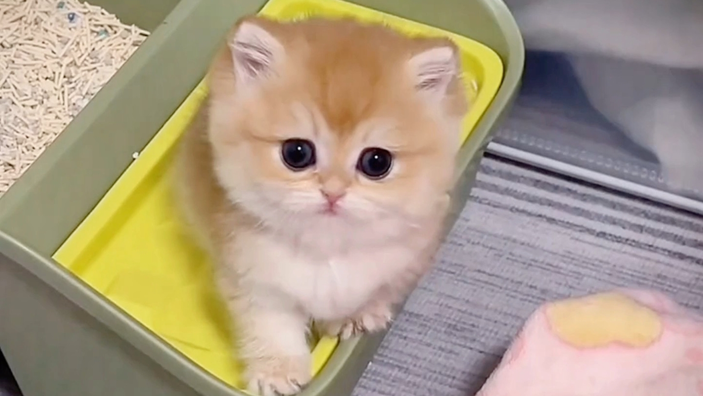 | 6046 | 2026-06-30 |
| [字母监狱](https://www.bilibili.com/video/BV16FK96eEzz) |  | 229.8万 | 2026-06-29 |
| [迟到发现公司破产 只抢到这个](https://www.bilibili.com/video/BV1RmKQ6XEnJ) | 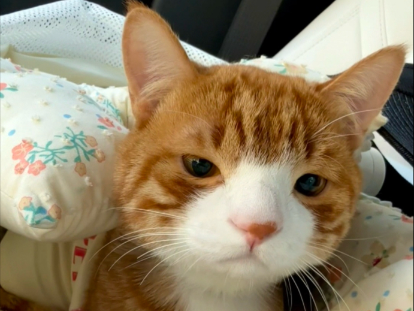 | 11.5万 | 2026-06-29 |
| [160斤宝妈创业belike](https://www.bilibili.com/video/BV1SdKS6zEHe) |  | 34.5万 | 2026-06-29 |
| [这才是《戒烟》原版MV！](https://www.bilibili.com/video/BV1t3TM6pEVQ) |  | 9.3万 | 2026-06-28 |
| [哈基汪TV](https://www.bilibili.com/video/BV1GkTM6wEto) | 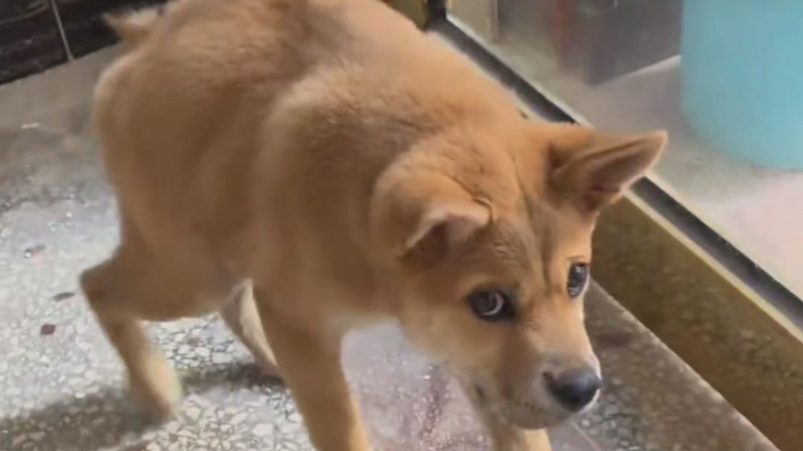 | 15.2万 | 2026-06-28 |
| [你就忍忍呗](https://www.bilibili.com/video/BV1umTM6ZE1G) |  | 130.1万 | 2026-06-28 |
| [《加 肥 猫》](https://www.bilibili.com/video/BV1E8TM6gE2X) | 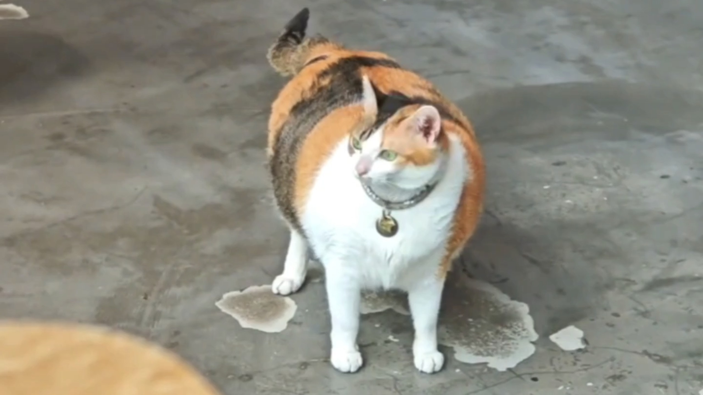 | 2.8万 | 2026-06-28 |
| [小猫手段了得](https://www.bilibili.com/video/BV1FKTu61Ezp) | 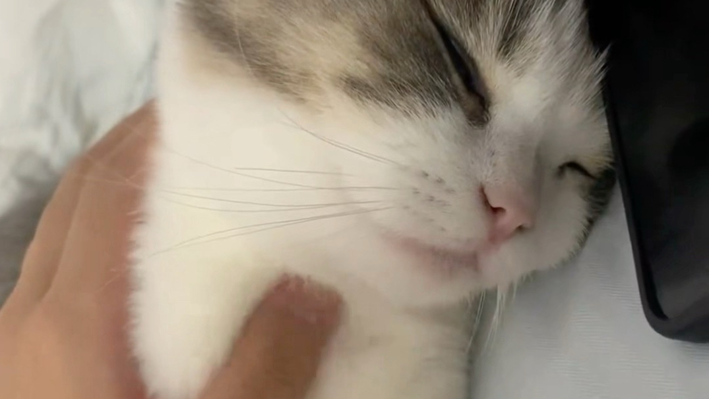 | 15.3万 | 2026-06-28 |
| [还敢不敢哈气了？耄耋](https://www.bilibili.com/video/BV1MDTM6dEyK) | 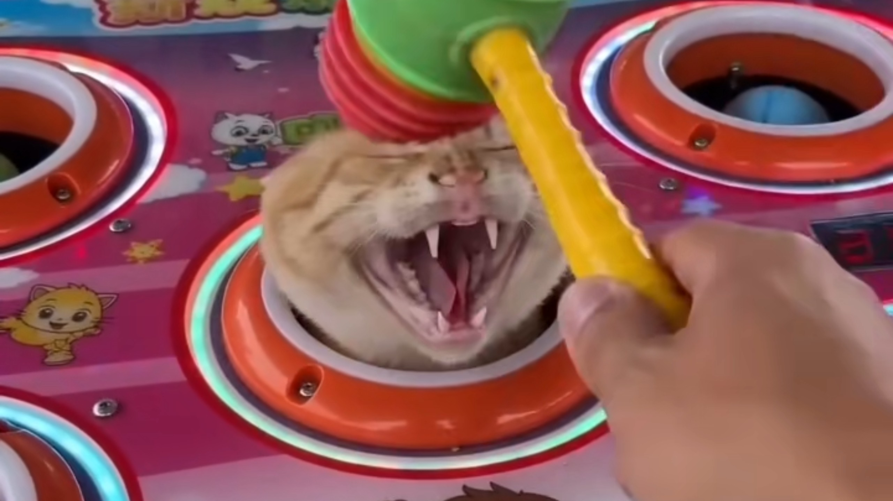 | 1.1万 | 2026-06-28 |
| [喵喵喵！叮叮叮咚咚叮哈基米~](https://www.bilibili.com/video/BV1wx7H62EX5) | 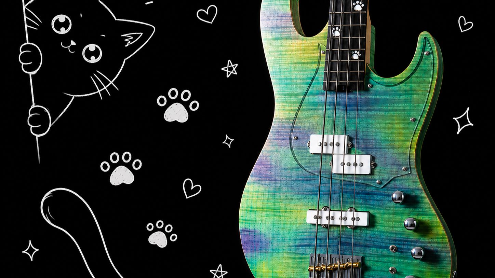 | 1838 | 2026-06-27 |
| [《心愿便利店》哈基米版](https://www.bilibili.com/video/BV1sm7p6nEPM) |  | 441 | 2026-06-27 |
| [這隻小狗只有巴掌大小，但脾氣卻異常火爆，甚至敢單挑獒犬！？簡直驚掉下巴。17個世界上最小的狗。](https://www.bilibili.com/video/BV1Wu7p67Ev4) |  | 3.0万 | 2026-06-27 |
| [快走布鲁斯！没时间吃烤肉啦！【地狱笑话】](https://www.bilibili.com/video/BV17S7q6jEiE) |  | 172.3万 | 2026-06-27 |
| [今日份快乐源泉](https://www.bilibili.com/video/BV1dB7h6bEiV) | 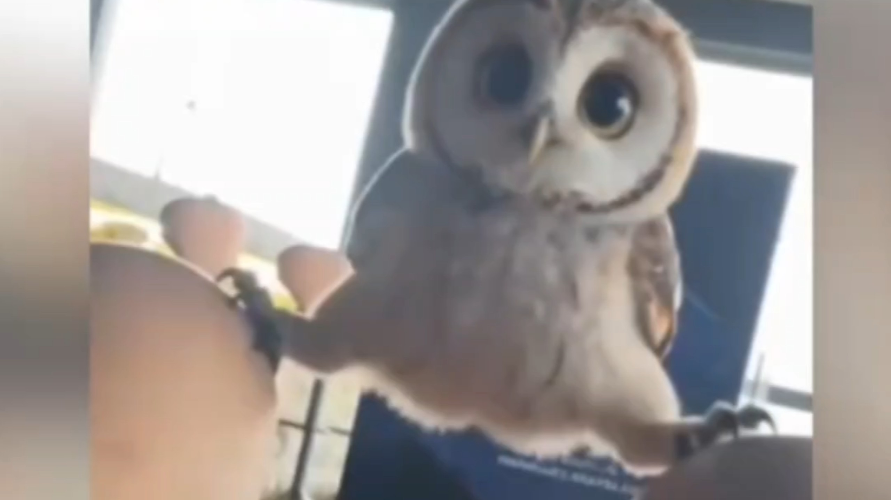 | 51.9万 | 2026-06-26 |
| [今天吃豆角焖面](https://www.bilibili.com/video/BV1ra7Y63EZx) | 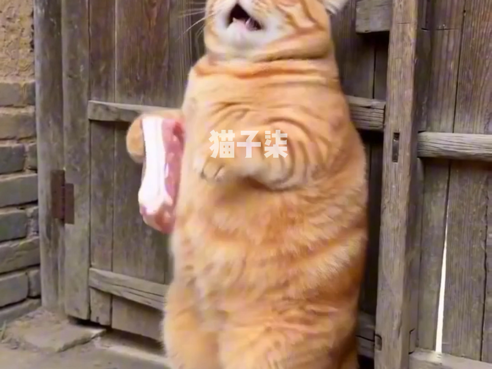 | 27.7万 | 2026-06-25 |
| [假如让一只哈基米穿越到侏罗纪，它能在史前大陆活下去吗？](https://www.bilibili.com/video/BV1DCjR6JE2V) | 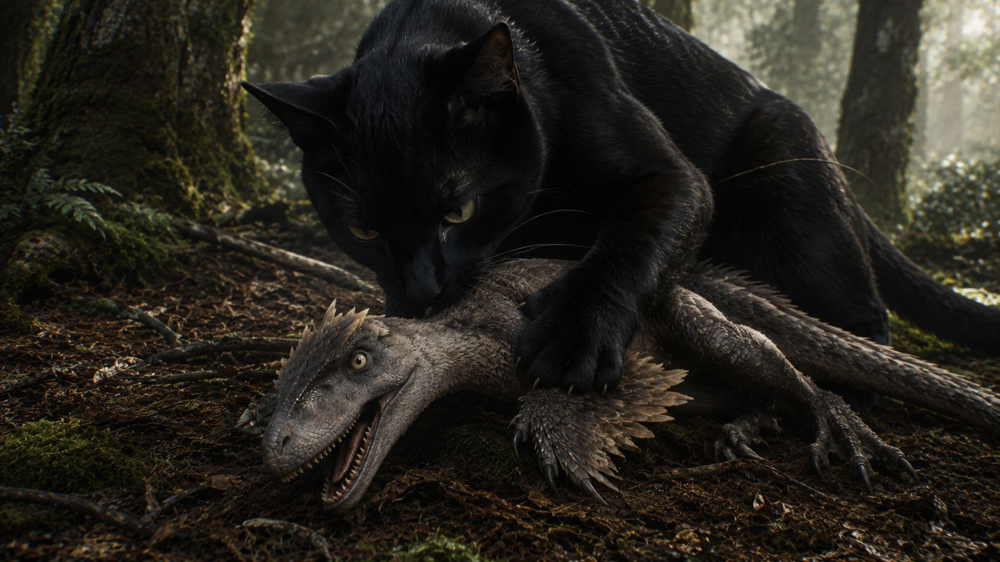 | 56.0万 | 2026-06-24 |
| [3分钟看完猫咪的一生！你家猫咪现在到哪个阶段了？](https://www.bilibili.com/video/BV1o97T6cEvq) | 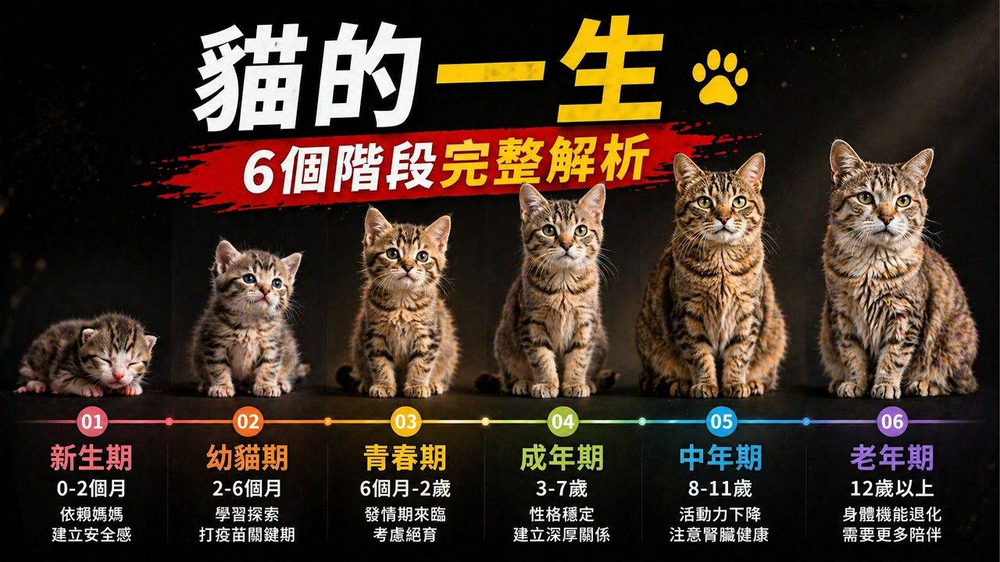 | 5.9万 | 2026-06-22 |
| [猫咪吃到人类食物后的反应](https://www.bilibili.com/video/BV154jt6jEsm) | 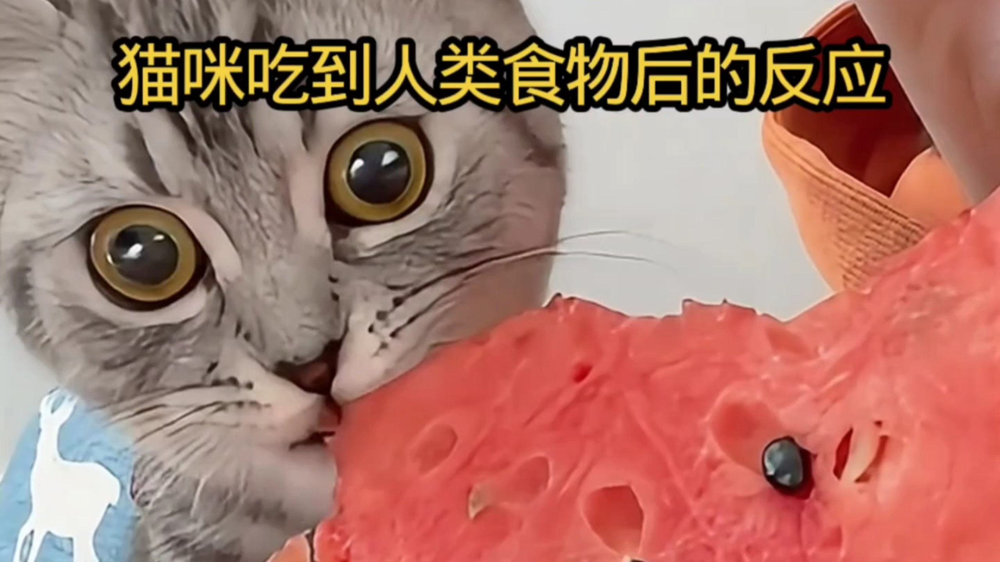 | 91.1万 | 2026-06-21 |
| [捡了个猫博士](https://www.bilibili.com/video/BV1fPjJ6FEg7) | 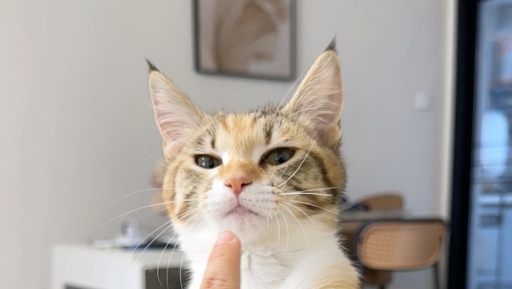 | 67.1万 | 2026-06-20 |
| [捣蛋鬼：就你叫朵拉是吧！](https://www.bilibili.com/video/BV1gcjr6rEWi) |  | 99.9万 | 2026-06-19 |
| [哈上亡灵](https://www.bilibili.com/video/BV18LjB6eEBi) | 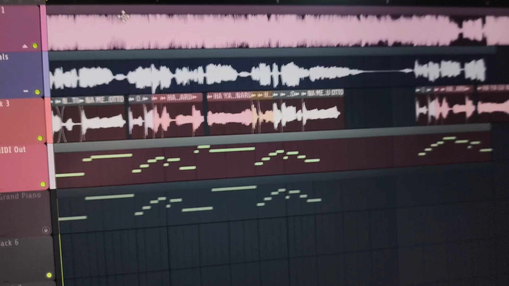 | 1.3万 | 2026-06-19 |
| [不同倍速的《see you again》](https://www.bilibili.com/video/BV1ozji6gEtv) |  | 18.3万 | 2026-06-19 |
| [动物小时候有多可爱](https://www.bilibili.com/video/BV1eNjP6VESr) | 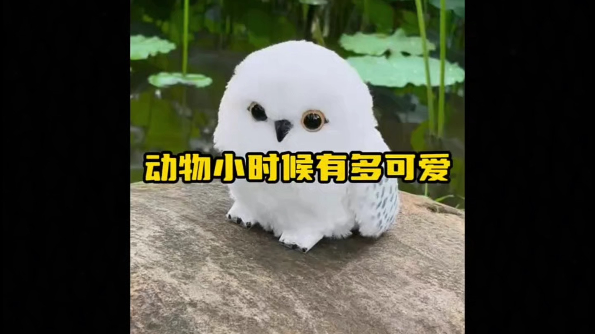 | 1.7万 | 2026-06-18 |
| [我误拿孟婆汤当水喝~《跨界果果》1-15合集](https://www.bilibili.com/video/BV1uhjc6fE7G) | 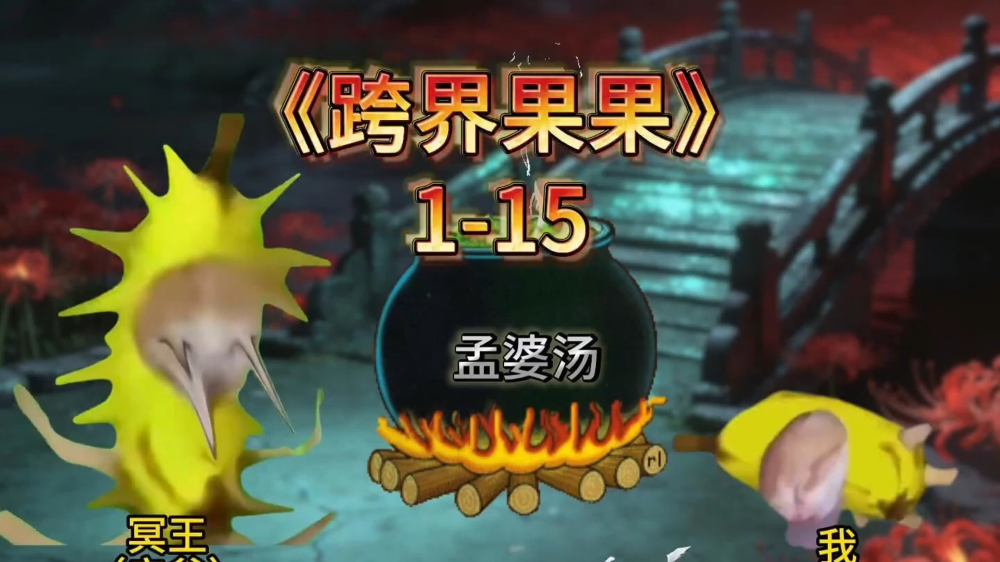 | 6.8万 | 2026-06-18 |
| [抽哈基米](https://www.bilibili.com/video/BV1G8L96jE27) |  | 73 | 2026-06-17 |
| [从1美元到1万美元，我们救下了最稀有的“六角恐龙”](https://www.bilibili.com/video/BV1oDJK6cEW6) | 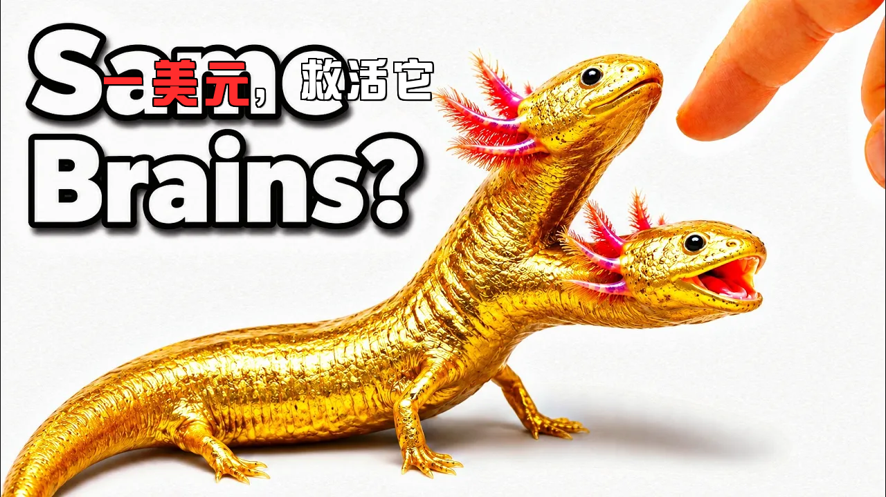 | 3.2万 | 2026-06-14 |
| [社恐小猫第一次回老家](https://www.bilibili.com/video/BV1MDJn6tEV3) | 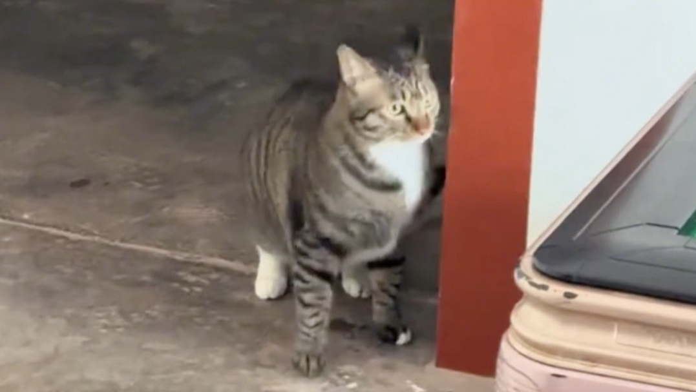 | 179.5万 | 2026-06-13 |
| [【雷霆夜市摆摊】把奶鱼做成黄桃罐头，刀盾香蕉猫都炒着吃](https://www.bilibili.com/video/BV19qEd6FEow) |  | 142.0万 | 2026-06-10 |
| [星球动画我要擦皮鞋叮咚鸡哈基米大东北库里库里](https://www.bilibili.com/video/BV1SXEx6qE7L) |  | 775 | 2026-06-07 |
| [【循环歌单】《航天现状の小曲》《英叔の小曲》《阴间の小曲》｜&quot;总裁里一个赶尸人&quot;](https://www.bilibili.com/video/BV1Q5Gi6QEeS) | 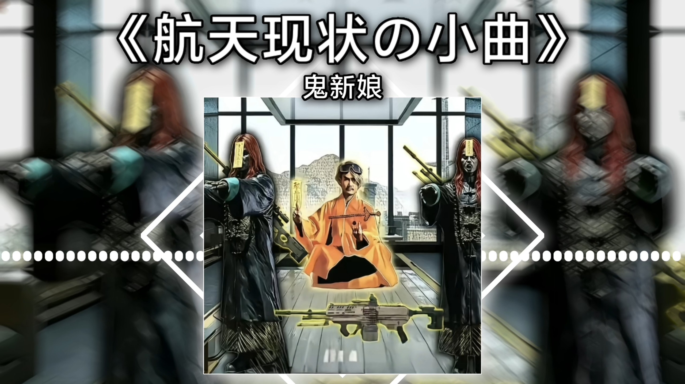 | 17.4万 | 2026-05-23 |
| [小明的空调能开1000℃。](https://www.bilibili.com/video/BV1VTRKB5E63) |  | 259.3万 | 2026-05-01 |
| [板面～](https://www.bilibili.com/video/BV14DQpBMECg) | 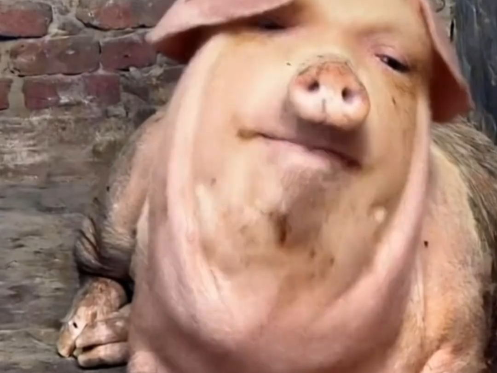 | 242.2万 | 2026-04-13 |
| [看来人类文明这次凶多吉少了原视频](https://www.bilibili.com/video/BV16BfgBVEMS) |  | 212.6万 | 2026-02-20 |
| [《恐怖直立猿の小曲》“我发现他们好像都对石头过敏”【The King】](https://www.bilibili.com/video/BV16VZxBQE6g) | 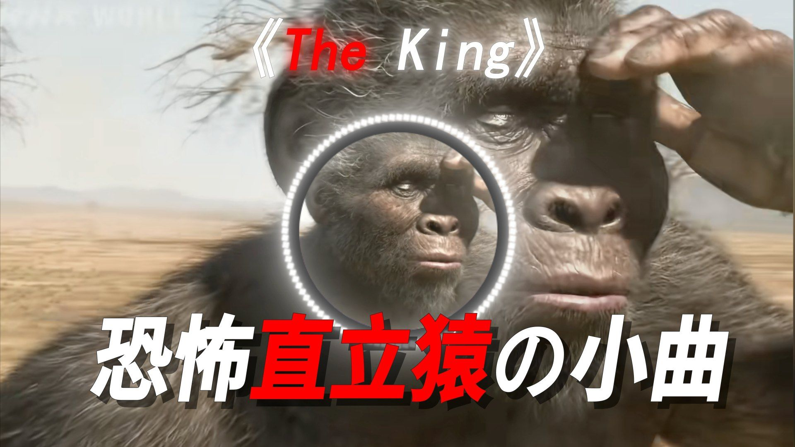 | 158.6万 | 2026-02-15 |
| [苦练中国功夫的猫咪](https://www.bilibili.com/video/BV1NZu1zCEYz) | 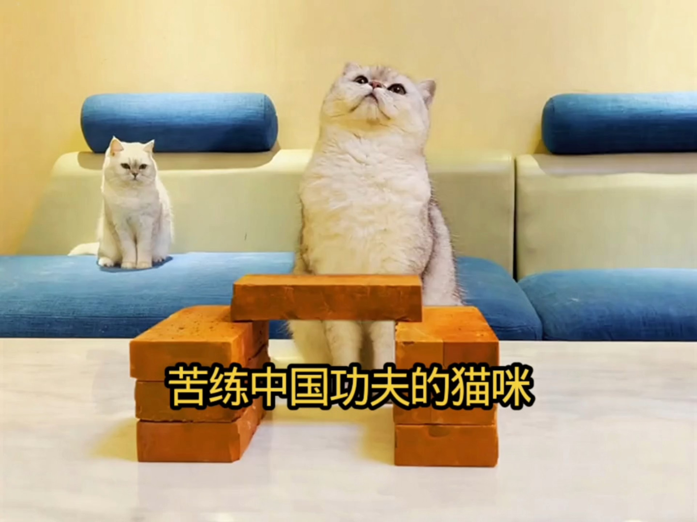 | 20.3万 | 2025-07-18 |
| [《有时曼波》《曼波の小曲》《得吃の小曲》](https://www.bilibili.com/video/BV1cMGAzZEiq) | 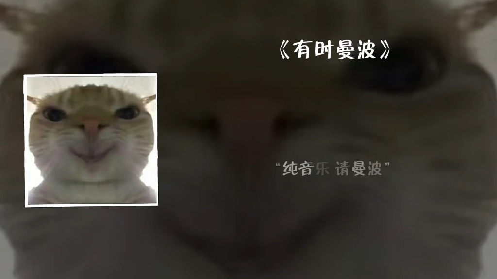 | 44.4万 | 2025-07-09 |
| [打了一个月，终于过了！.........第一章...](https://www.bilibili.com/video/BV1UPxieTEZT) | 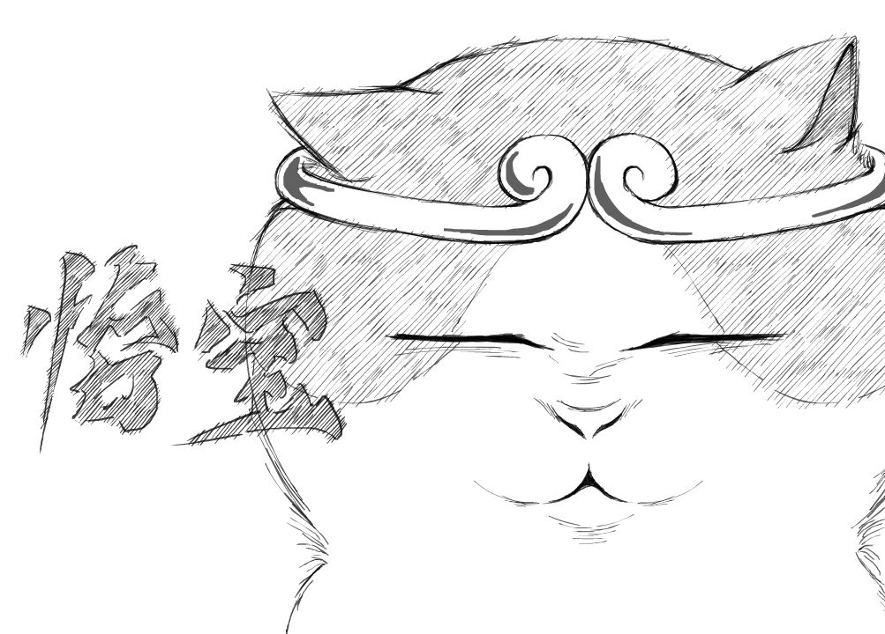 | 168.5万 | 2024-10-01 |
| [“满级猫咪的高能瞬间，都说猫是老虎的师傅，果然不假！”](https://www.bilibili.com/video/BV1di42127w4) |  | 41.6万 | 2024-04-23 |
| [猫你对速度一无所知](https://www.bilibili.com/video/BV1a84y1S7xd) | 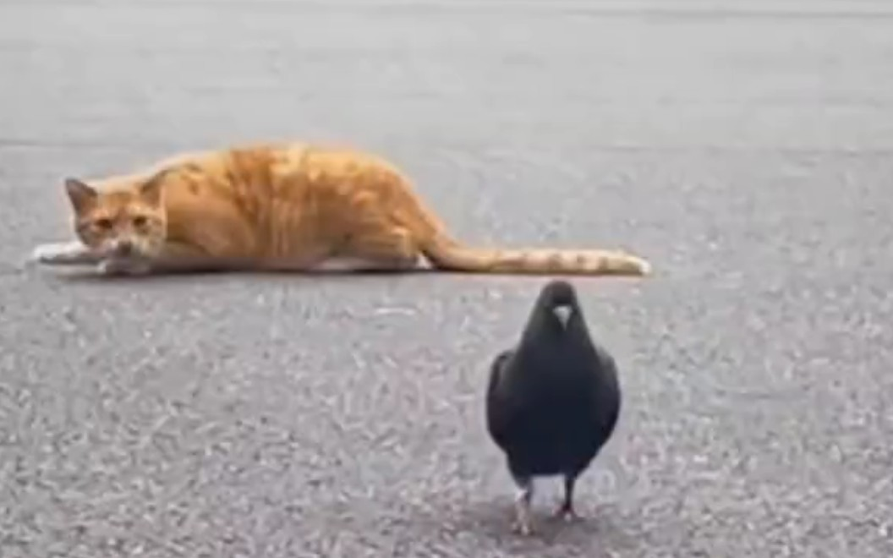 | 53.9万 | 2023-09-18 |
| [看完心情会变好哦](https://www.bilibili.com/video/BV1MF41147Gq) |  | 676.8万 | 2022-03-06 |

---
*最后更新: 2026-07-05 06:15:00 (自动生成)*
*数据来源: [Bilibili](https://www.bilibili.com)*

## 使用说明

运行以下命令更新视频列表:
```bash
python3 fetch_hajimi_videos.py
```
