# awesome-hajimi
collections of hajimi (哈基米 in Chinese) on the Internet.

## 视频列表 (Video List)

| 视频标题 (Title) | 封面 | 播放量 (Views) | 发布日期 (Date) |
|---|---|---|---|
| [哈基米の蘸豆爽小曲](https://www.bilibili.com/video/BV15U7y6FEHF) |  | 3.2万 | 2026-06-05 |
| [哈基米被麻醉但触发了坚毅不倒](https://www.bilibili.com/video/BV1i17y6wE7a) | 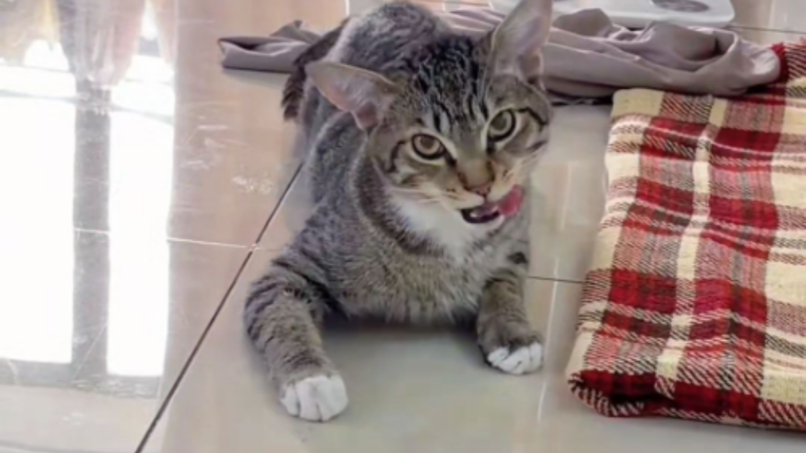 | 730 | 2026-06-05 |
| [哈基米这个扫😍](https://www.bilibili.com/video/BV1397y6dEn3) |  | 1260 | 2026-06-05 |
| [哈基米的奇幻漂流](https://www.bilibili.com/video/BV1nL716rEfo) | 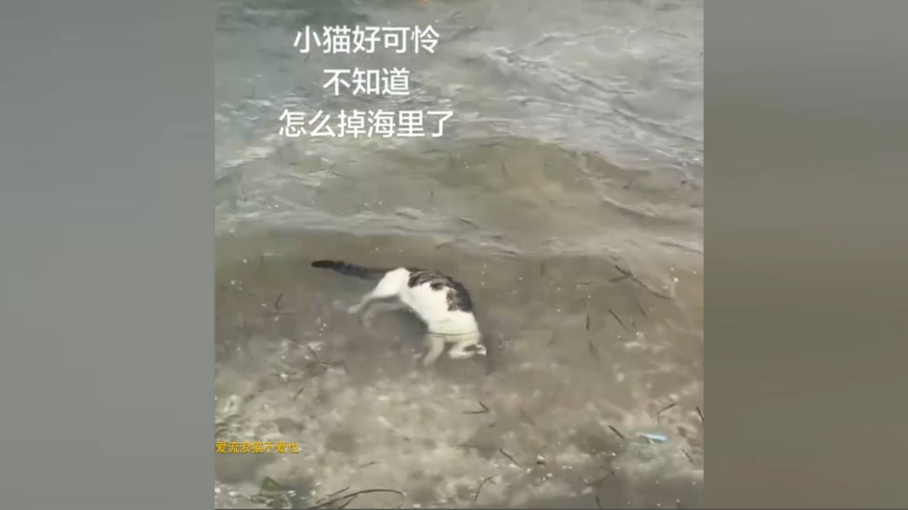 | 1202 | 2026-06-05 |
| [【哈基米音乐】🐱再哈气🐱相信曼波的人 本身和曼波一样了不起](https://www.bilibili.com/video/BV19P7k6HEPB) |  | 260 | 2026-06-05 |
| [哈基咪～](https://www.bilibili.com/video/BV1gS7k6DE3L) | 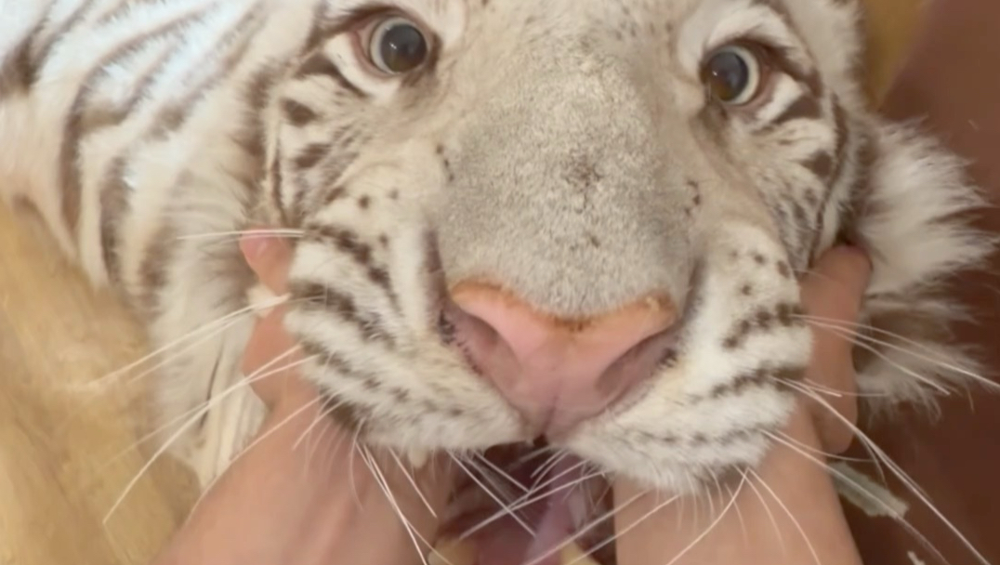 | 25.0万 | 2026-06-05 |
| [【哈基米音乐】轻快の小曲（卡比の小曲）](https://www.bilibili.com/video/BV16tEA6xEB3) |  | 1058 | 2026-06-05 |
| [朱元璋的逆袭：开局一个碗！（大结局）](https://www.bilibili.com/video/BV1UMEc6hEeC) |  | 10.1万 | 2026-06-05 |
| [哈基米要成为最强1星？？201 EP-EX-4突袭7星](https://www.bilibili.com/video/BV1Z57C6YEkj) |  | 1515 | 2026-06-05 |
| [听完这首歌的家里得请高人了](https://www.bilibili.com/video/BV11w7C6kE4a) |  | 43.4万 | 2026-06-05 |
| [[我的世界]26.1.2极限生存 第五期 谁说哈基米没用！](https://www.bilibili.com/video/BV1zvEN6bEy9) | 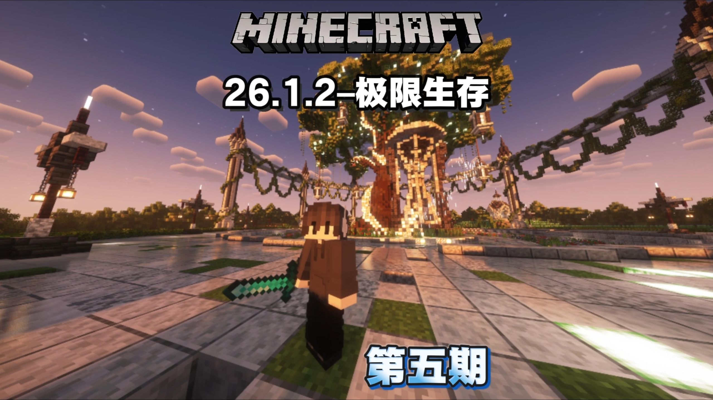 | 694 | 2026-06-05 |
| [【哈基米音乐？】角色T - eio](https://www.bilibili.com/video/BV1737r6ZEzN) |  | 1.8万 | 2026-06-05 |
| [【哈基米音乐】⚡基米基米御马前⚡-宫さん宫さんお马の前に](https://www.bilibili.com/video/BV1jH7C6fELU) |  | 734 | 2026-06-05 |
| [哈基米这次只能看你跳下去了](https://www.bilibili.com/video/BV1q77C68E7W) | 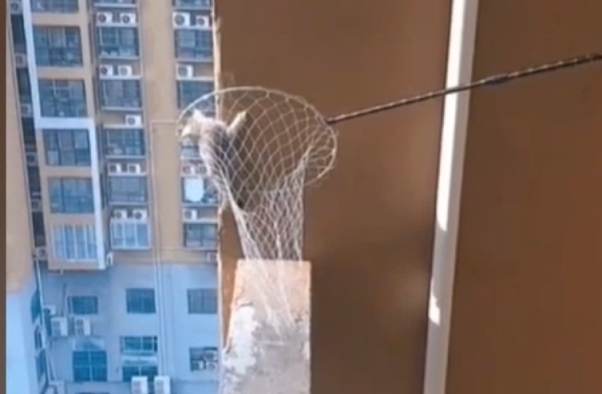 | 780 | 2026-06-05 |
| [🐱耄出没🐱（Remastered）](https://www.bilibili.com/video/BV1RW7C64ExF) |  | 5825 | 2026-06-05 |
| [基米这个大快朵颐](https://www.bilibili.com/video/BV1uD766GELo) | 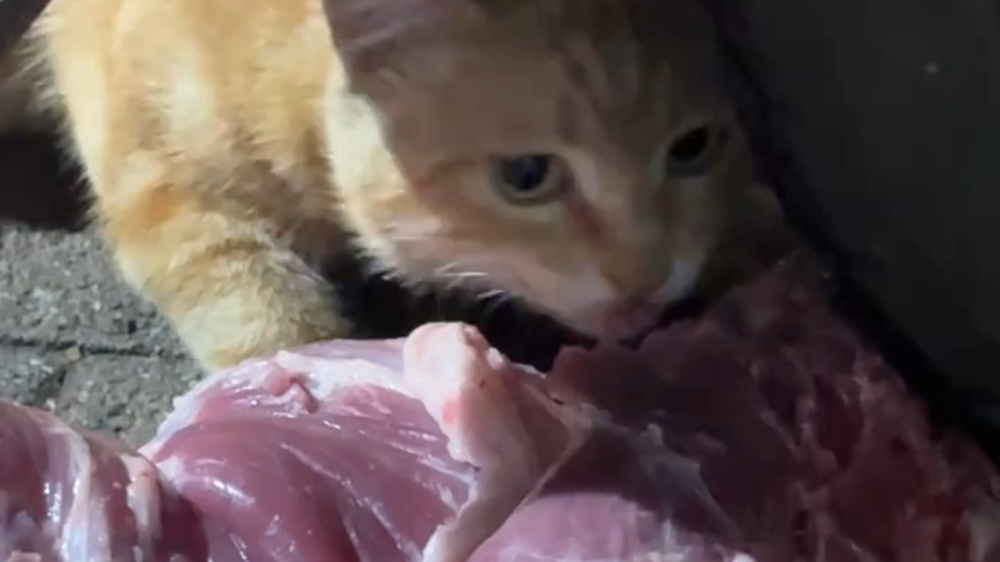 | 689 | 2026-06-05 |
| [聪明的哈基米走水渠撤离了](https://www.bilibili.com/video/BV1mY7r6kEAz) |  | 4574 | 2026-06-05 |
| [【哈基米】🐱此去半生（DJ不爽版）🐱](https://www.bilibili.com/video/BV1Mv7r6GEEV) |  | 1.1万 | 2026-06-05 |
| [老吴，不要走](https://www.bilibili.com/video/BV1Xx7r67EGE) | 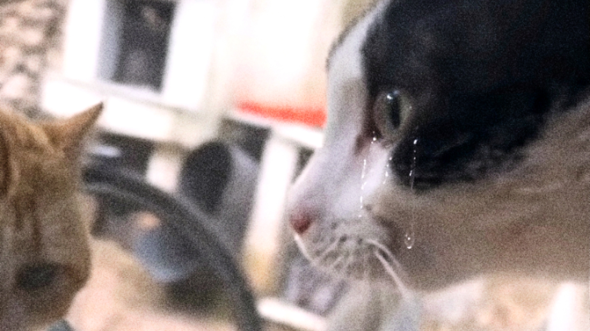 | 1.4万 | 2026-06-05 |
| [哈基米吃饭的时候被黑猫坚强](https://www.bilibili.com/video/BV19n7r6DEKE) | 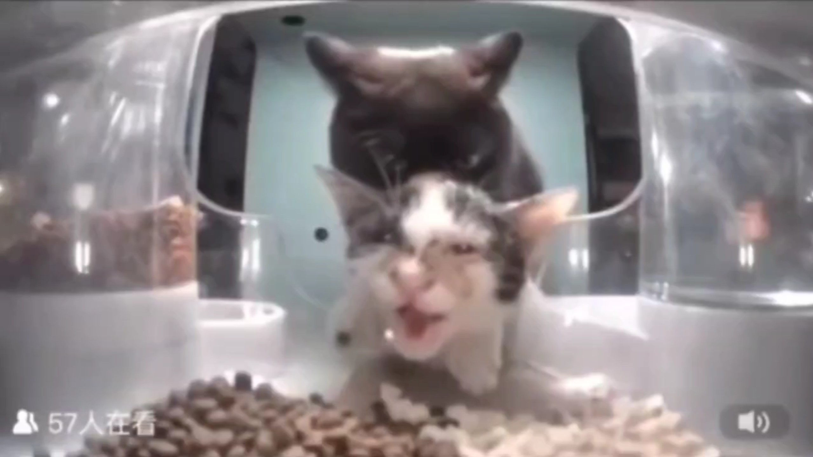 | 6.1万 | 2026-06-05 |
| [好听，实在是太好听～](https://www.bilibili.com/video/BV1RrEN6sE9g) | 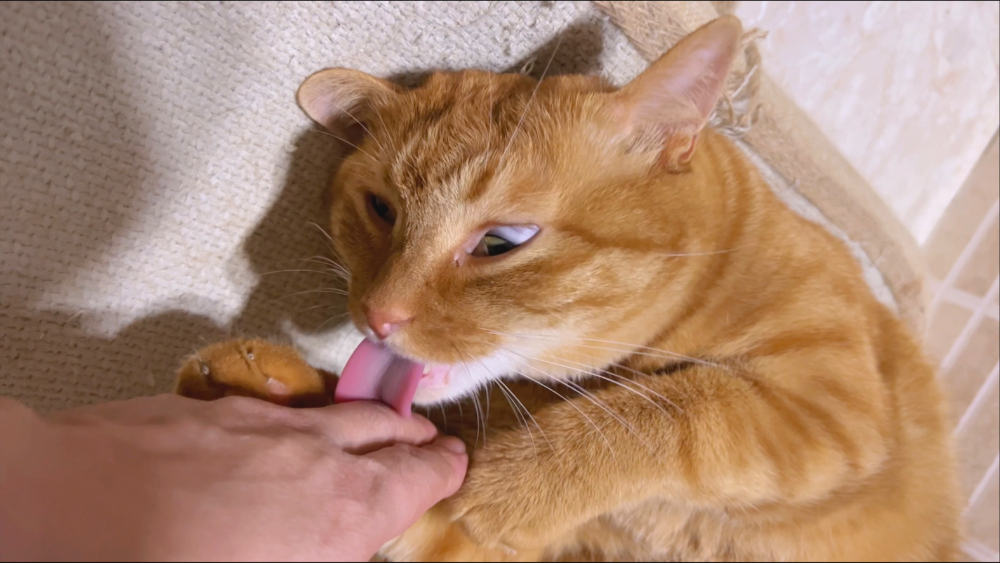 | 2.4万 | 2026-06-05 |
| [《哈基米音乐》🐱不懂你的黑色幽默~🐱](https://www.bilibili.com/video/BV1nQEP6fEgf) |  | 387 | 2026-06-05 |
| [【断网补全计划138】新疆的咪咪，姆巴佩公式，鞠萍退休，天涯复活，全民绷住，崩老头，挂壁仔，忍者狗等](https://www.bilibili.com/video/BV1rf7f6UECi) |  | 23.7万 | 2026-06-05 |
| [哈基米の随波逐流](https://www.bilibili.com/video/BV1vYEc65EDX) | 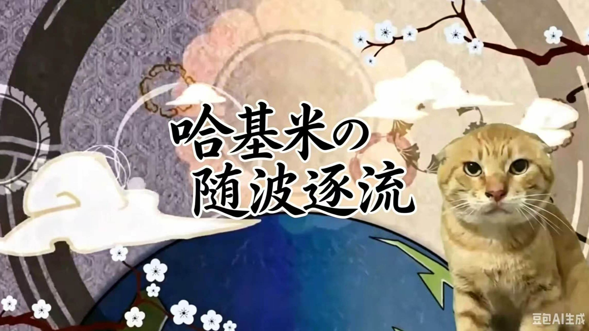 | 3064 | 2026-06-05 |
| [智取流浪猫](https://www.bilibili.com/video/BV1c17r6vExS) | 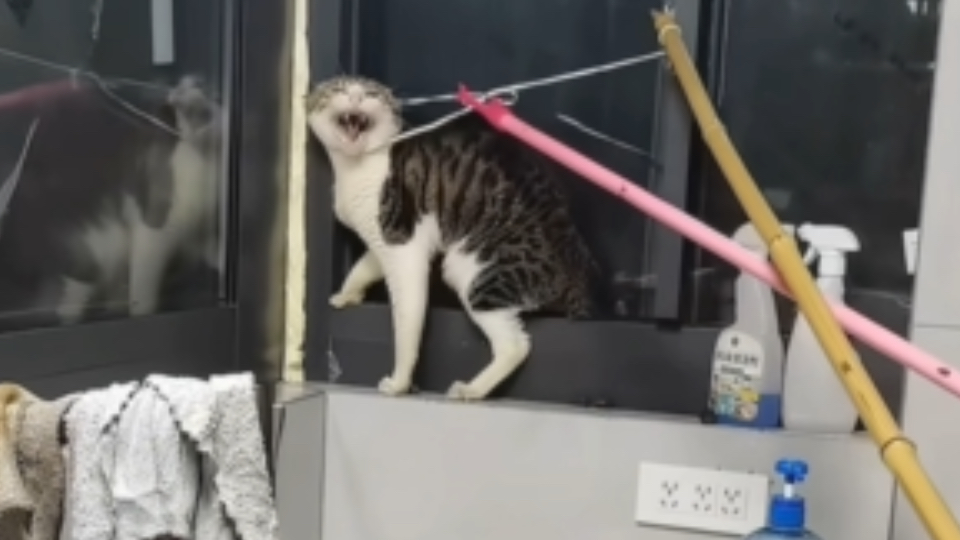 | 16.5万 | 2026-06-05 |
| [我的疯癫日常！](https://www.bilibili.com/video/BV1ND7B6eEUc) | 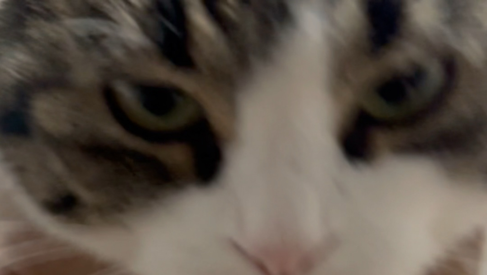 | 1.9万 | 2026-06-05 |
| [【哈基派】APEX是一款越玩越多bug的游戏😭👊](https://www.bilibili.com/video/BV16xEA6oEJC) | 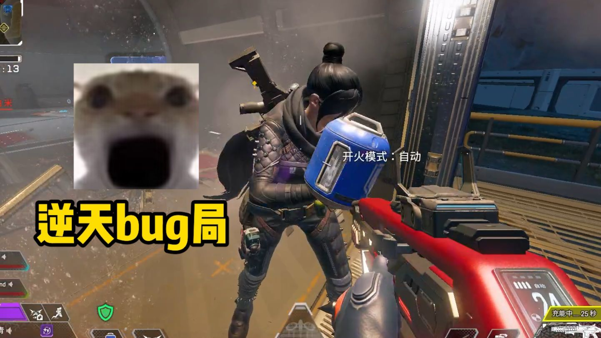 | 6.4万 | 2026-06-05 |
| [😺听力の小曲(猫的价格为九镑十五便士)😺](https://www.bilibili.com/video/BV1fLEP6WEAU) | 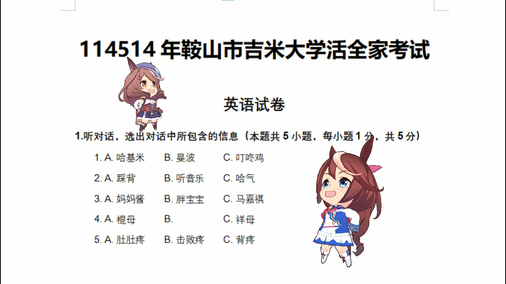 | 1051 | 2026-06-04 |
| [你天天摸我的头我会长不高的！](https://www.bilibili.com/video/BV1fuEw6SEhQ) | 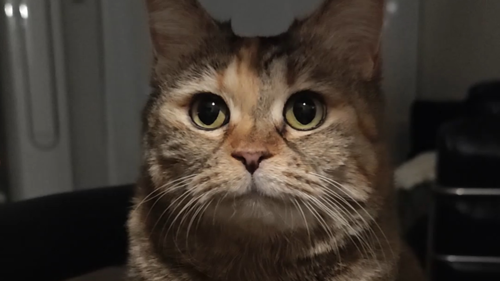 | 3.5万 | 2026-06-04 |
| [胡桃：你个你个你个你个你个你个你个你个你个你个你个你个你个~蹬](https://www.bilibili.com/video/BV1sREc6FE14) |  | 12.8万 | 2026-06-04 |
| [人类你又要干嘛](https://www.bilibili.com/video/BV15T7Z6vEkQ) | 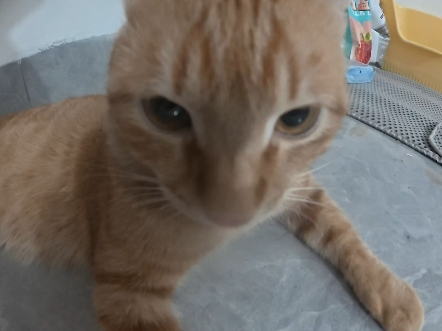 | 9.5万 | 2026-06-04 |
| [脑瓜子嗡嗡的](https://www.bilibili.com/video/BV1267R6LE5J) | 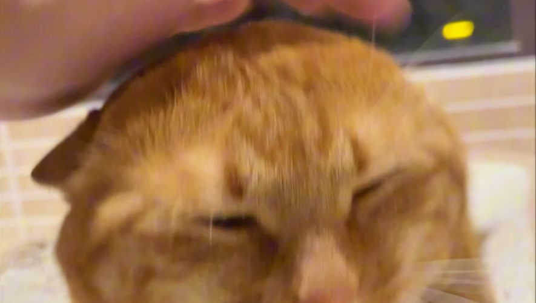 | 1.7万 | 2026-06-04 |
| [咪 的 精 彩 周 末 ！](https://www.bilibili.com/video/BV11f7Q6vE4b) | 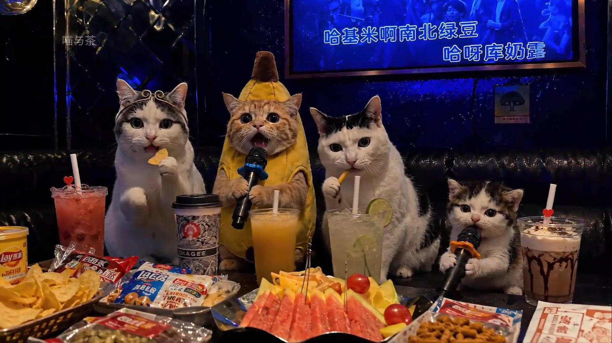 | 5.2万 | 2026-06-04 |
| [可观测宇宙最温柔最悲伤最爽最撕心裂肺的老吴十分钟纯享版](https://www.bilibili.com/video/BV1zL7R6aE4q) | 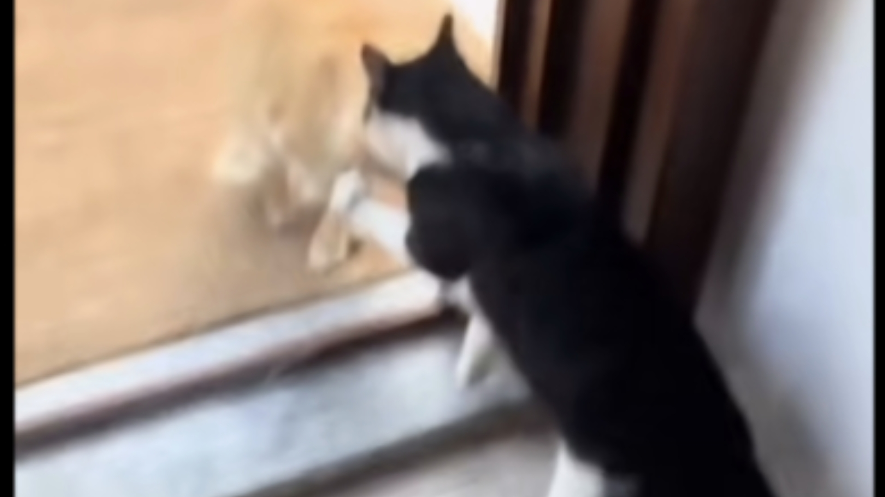 | 5.5万 | 2026-06-03 |
| [还击毙？真当我傻呀](https://www.bilibili.com/video/BV1efV26xEyG) | 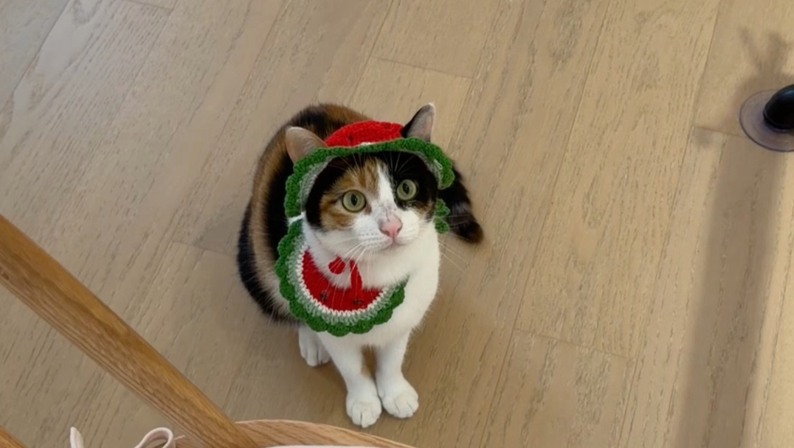 | 14.2万 | 2026-06-03 |
| [“拼 好 猫”](https://www.bilibili.com/video/BV1xiV26GExv) | 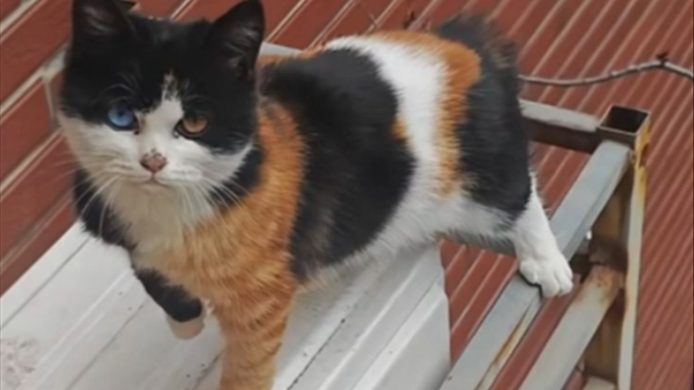 | 61.2万 | 2026-06-03 |
| [“诶？云朵？”哈基奈开播就整b动静，直播间涌入近两吨人，为什么不唱下去好难猜啊](https://www.bilibili.com/video/BV1tFVr6hEiQ) |  | 8.3万 | 2026-06-02 |
| [最温柔老吴与最爽老吴交替循环一分钟](https://www.bilibili.com/video/BV1UFVr6hE7V) | 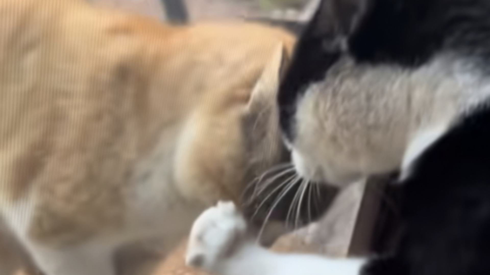 | 10.9万 | 2026-06-02 |
| [🐧当你忘了高考焚决，满脑子只剩下烂梗🐧](https://www.bilibili.com/video/BV1LxVr6CEkD) | 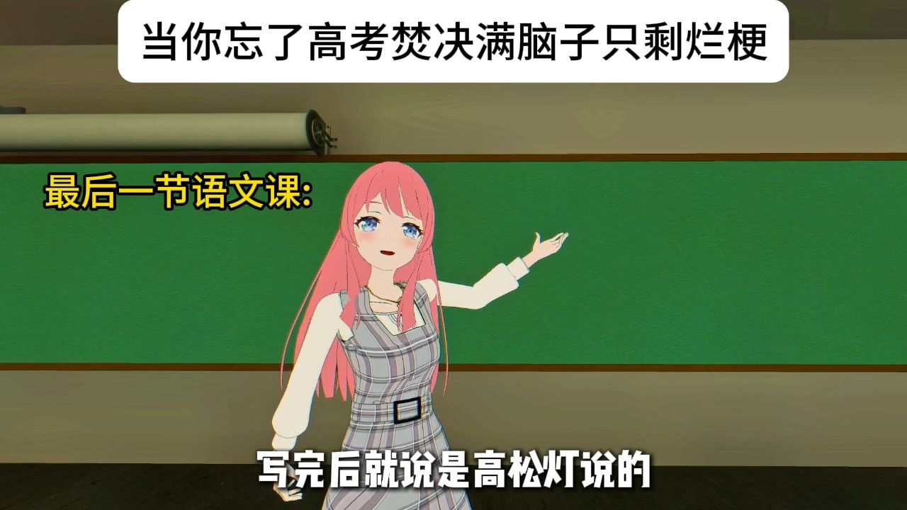 | 71.7万 | 2026-06-02 |
| [【梗百科】月薪喵是啥？这个“散味舞”怎么来的？](https://www.bilibili.com/video/BV1BiVB6uETY) |  | 89.4万 | 2026-06-02 |
| [😭 蒋中正老师！我还记得你！ 😭 牢蒋倾情歌唱](https://www.bilibili.com/video/BV1bkVn6GErH) |  | 34.2万 | 2026-06-02 |
| [哈基熊被击中魔丸](https://www.bilibili.com/video/BV1dRVv6bEU2) | 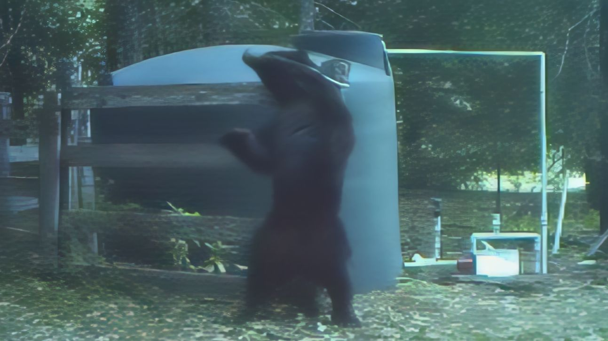 | 53.1万 | 2026-06-02 |
| [哈基米喊的老吴到底是谁](https://www.bilibili.com/video/BV1oeVf6cETJ) | 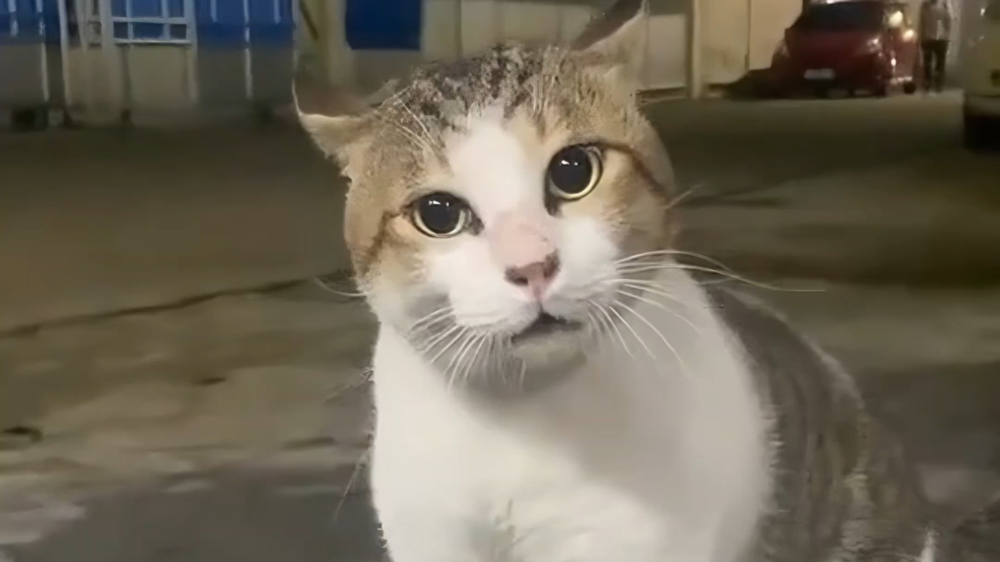 | 12.1万 | 2026-06-02 |
| [雷狼龙：你个你个你个你个你个你个你个…](https://www.bilibili.com/video/BV1uyVo62EPH) | 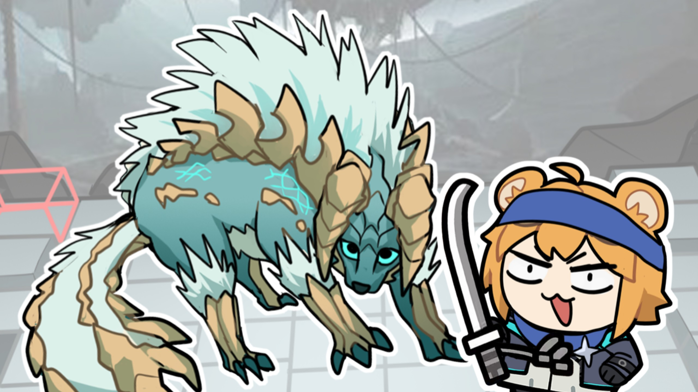 | 5.9万 | 2026-06-01 |
| [史上最震撼的一声老吴](https://www.bilibili.com/video/BV1ZgVZ6ZE5c) | 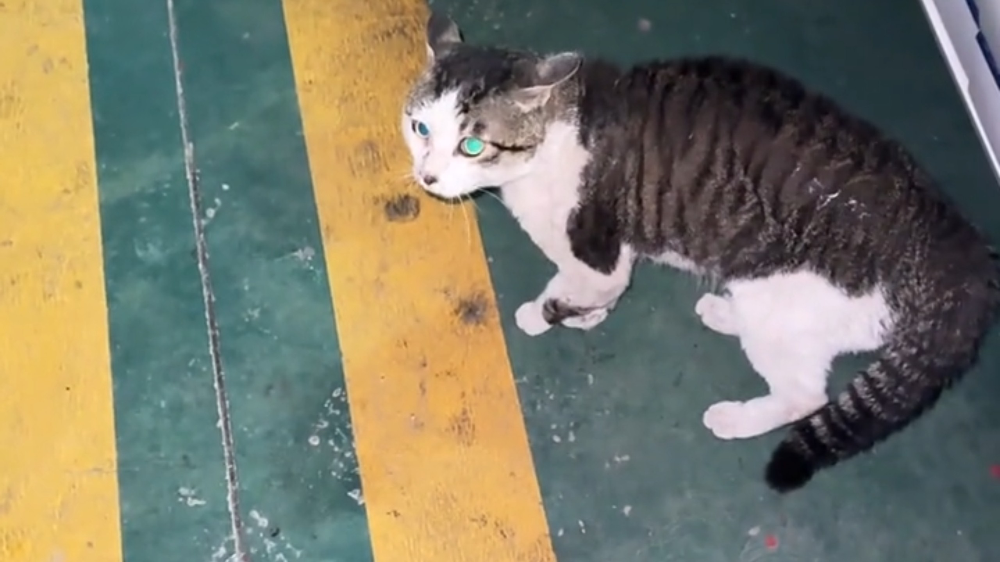 | 14.6万 | 2026-06-01 |
| [新买个耄耋键盘](https://www.bilibili.com/video/BV1eEVZ6pE5E) | 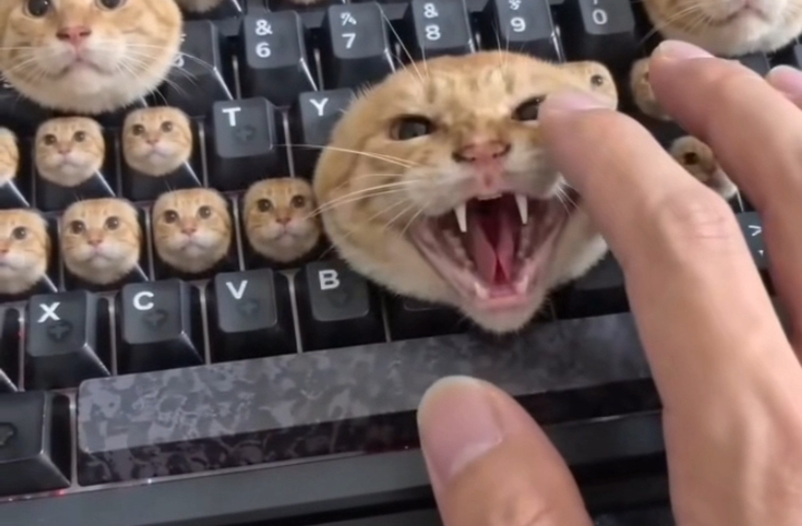 | 7.5万 | 2026-06-01 |
| [🐧我真得控制一下鬼了🐧](https://www.bilibili.com/video/BV1otVo64E2Y) |  | 106.2万 | 2026-06-01 |
| [你 跑 不 过 我 你 信 吗](https://www.bilibili.com/video/BV1nbVL61E3K) |  | 271.0万 | 2026-06-01 |
| [来杯好茶摇一摇是什么梗【梗指南】](https://www.bilibili.com/video/BV1QsVU64EGh) |  | 55.1万 | 2026-05-31 |
| [初中生斗胆跳一段jam](https://www.bilibili.com/video/BV1kCVU65ERM) |  | 575.5万 | 2026-05-31 |
| [[基米TV]被毛巾吓到应激误触关基程序](https://www.bilibili.com/video/BV1xjVL69E52) | 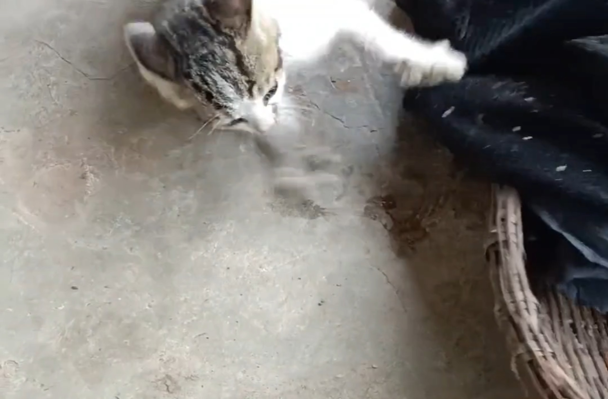 | 5.3万 | 2026-05-31 |
| [火花唐笑2000小时纯享版](https://www.bilibili.com/video/BV171G466EEo) |  | 11.9万 | 2026-05-31 |
| [最豪听的TOP5念张师](https://www.bilibili.com/video/BV1zbVL61Er4) |  | 152.6万 | 2026-05-30 |
| [はやくにげなきゃ / 初音ミク・雨衣](https://www.bilibili.com/video/BV1bNVV6WEU2) | 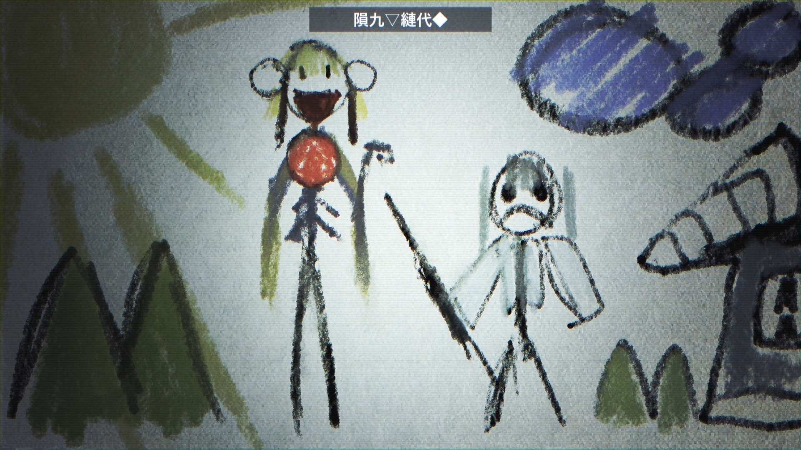 | 83.7万 | 2026-05-30 |
| [它超级喜欢这手法以至于变成了一片](https://www.bilibili.com/video/BV1cZVu6aESc) | 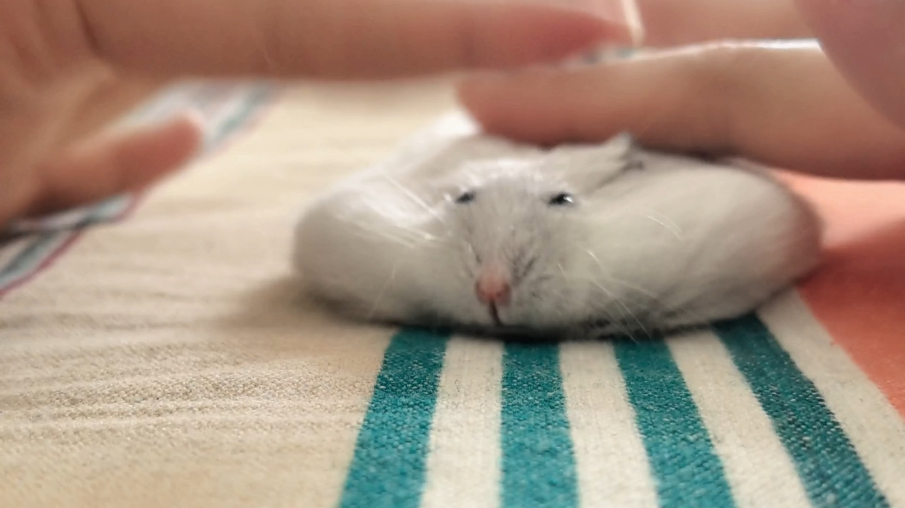 | 59.6万 | 2026-05-30 |
| [“张雪峰老师 我还记得你.”｜《念张师》2.0x 氦气版](https://www.bilibili.com/video/BV1PSV86bEcj) |  | 153.4万 | 2026-05-29 |
| [没刷到这几个bgm的说明你网速还不够快](https://www.bilibili.com/video/BV1CDV86oE77) |  | 38.6万 | 2026-05-29 |
| [入夏第一口gelato，三位咪师傅抢着让你先尝！](https://www.bilibili.com/video/BV1cQVt6JEqz) | 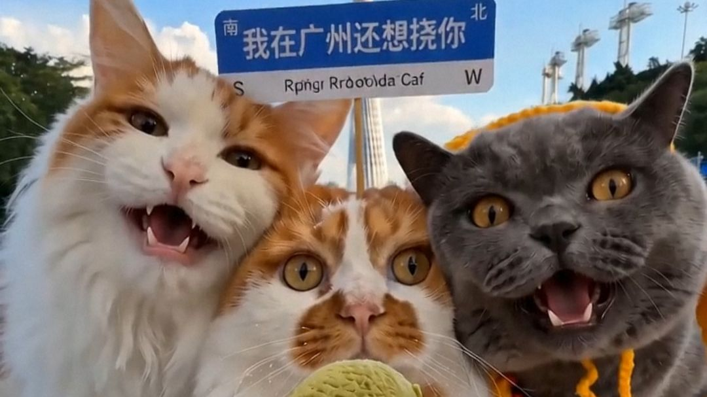 | 5.8万 | 2026-05-29 |
| [【哈基派】打完手都在抖的残局😭👊](https://www.bilibili.com/video/BV11RVs6UEgX) |  | 111.3万 | 2026-05-29 |
| [叮叮叮咚咚叮～曼波 咪：这也太上头啦](https://www.bilibili.com/video/BV1hEVH62EkV) | 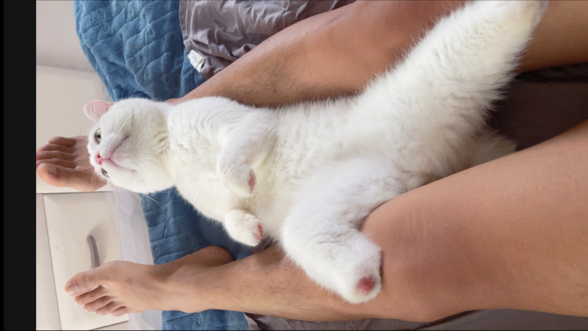 | 11.9万 | 2026-05-28 |
| [干嘛猫的vlog（神仙团建！和好朋咪快乐玩耍！）](https://www.bilibili.com/video/BV1ijG965E7L) | 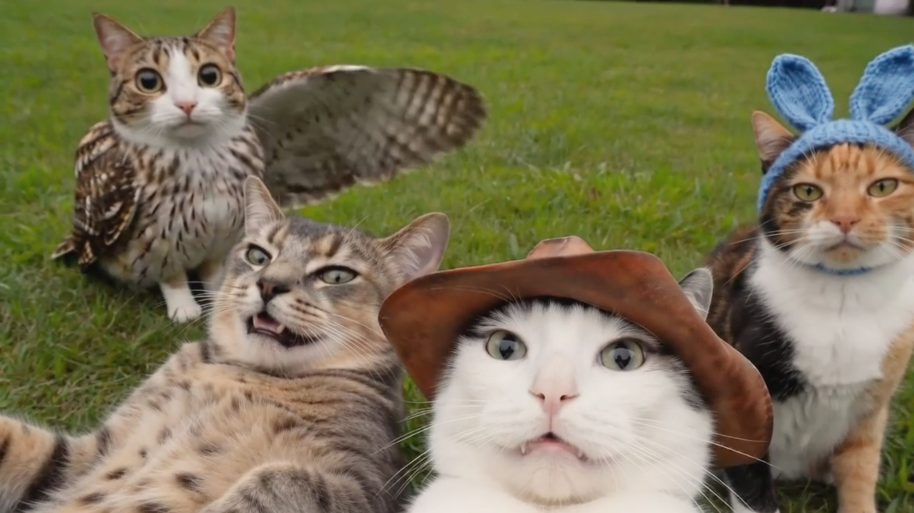 | 50.8万 | 2026-05-28 |
| [这才是真正的音乐](https://www.bilibili.com/video/BV1DrVp6SESs) |  | 487.7万 | 2026-05-28 |
| [兄弟，猫不错，给我玩玩](https://www.bilibili.com/video/BV1ZtVp6bEM5) |  | 47.4万 | 2026-05-28 |
| [循环歌曲 ·  蹦住の小曲 轻松蹦住の小曲《BADBOY》 ｜ “假如我说我绷住了呢”](https://www.bilibili.com/video/BV1uKGX6AEU2) | 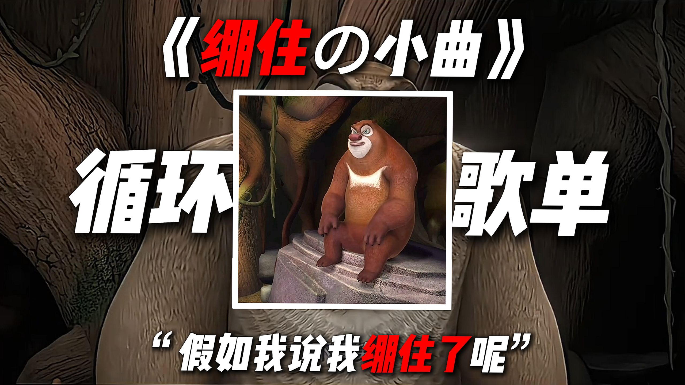 | 74.9万 | 2026-05-28 |
| [哈吉咪：别以为我不打小孩子，忍你很久了~](https://www.bilibili.com/video/BV1cZGq6GEBA) | 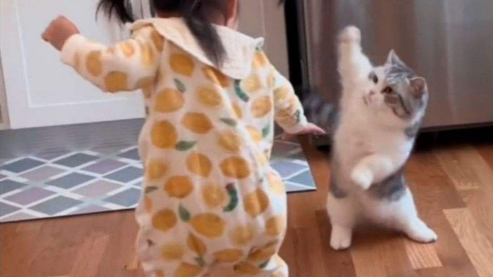 | 21.9万 | 2026-05-27 |
| [hi→hi↘hi↗hia↘hia↗hia↘](https://www.bilibili.com/video/BV1REGk6VEy1) |  | 233.1万 | 2026-05-27 |
| [这谁能绷得住原视频](https://www.bilibili.com/video/BV1dJGy6nEeU) | 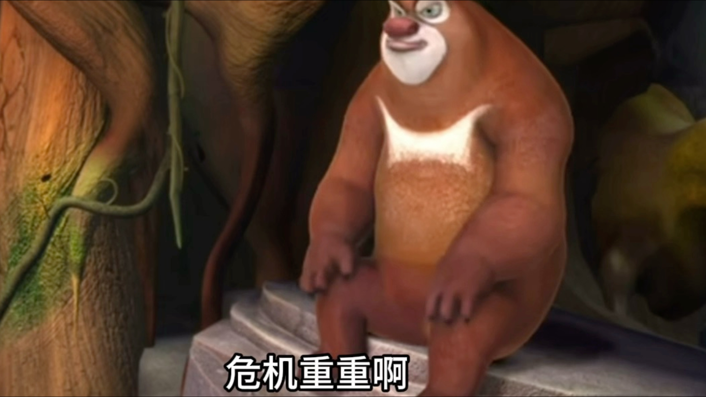 | 47.5万 | 2026-05-27 |
| [给哈基米按摩](https://www.bilibili.com/video/BV1vqVP66Et3) | 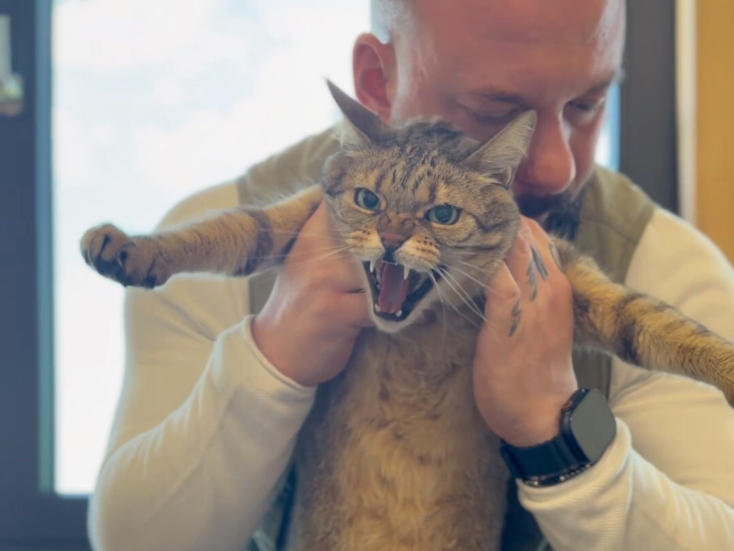 | 56.5万 | 2026-05-26 |
| [它在原地等了你25年，你却给它棒棒两拳](https://www.bilibili.com/video/BV1rLGZ6hEbT) | 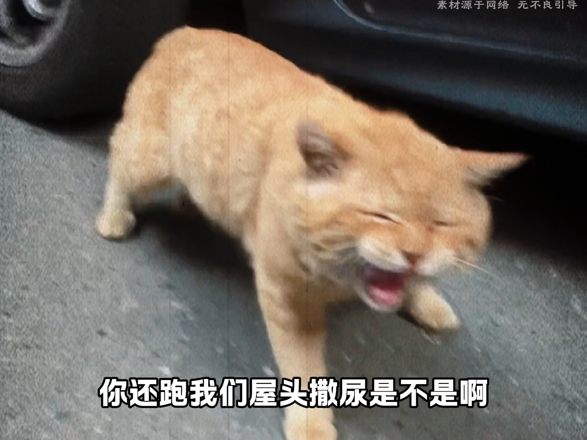 | 10.4万 | 2026-05-25 |
| [可怜的小猫发现时已经淹死了 希望大家多留心关注自己的爱宠](https://www.bilibili.com/video/BV1gMGR6zEXj) | 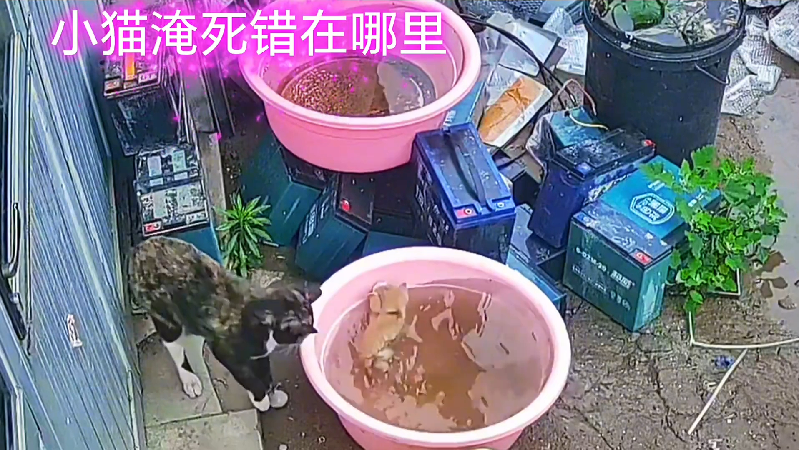 | 46.7万 | 2026-05-25 |
| [猫儿这个舞姿](https://www.bilibili.com/video/BV1f8Gn6xEv1) | 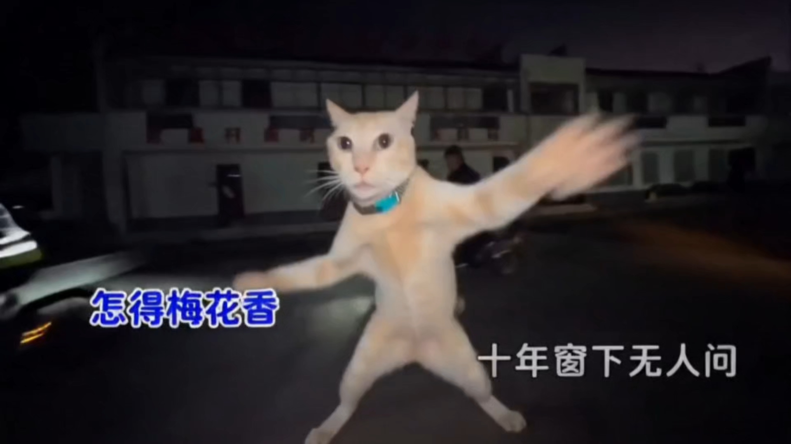 | 56.0万 | 2026-05-24 |
| [🦓：妈，我打架回来了🤕](https://www.bilibili.com/video/BV1hWGJ6rE1Y) | 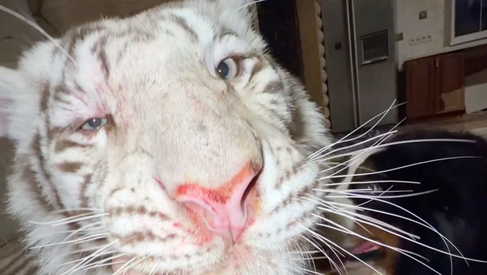 | 261.2万 | 2026-05-24 |
| [《猫科动物在睡着的时候通常很警觉》](https://www.bilibili.com/video/BV1eLG76uENB) | 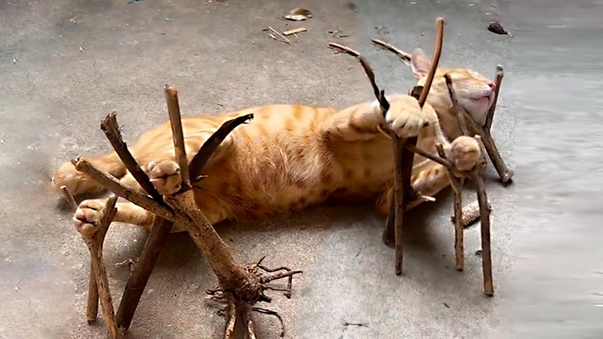 | 40.1万 | 2026-05-24 |
| [不要你嚼得，我要我嚼得](https://www.bilibili.com/video/BV16cG76UEyU) | 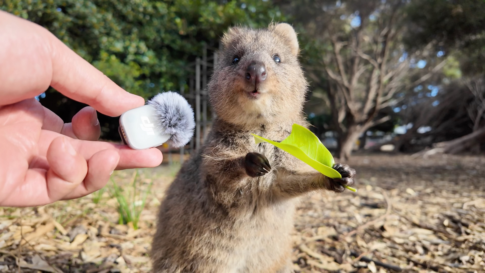 | 20.9万 | 2026-05-24 |
| [【思母TV】妈妈熬油合集](https://www.bilibili.com/video/BV1ErGL6CEXB) | 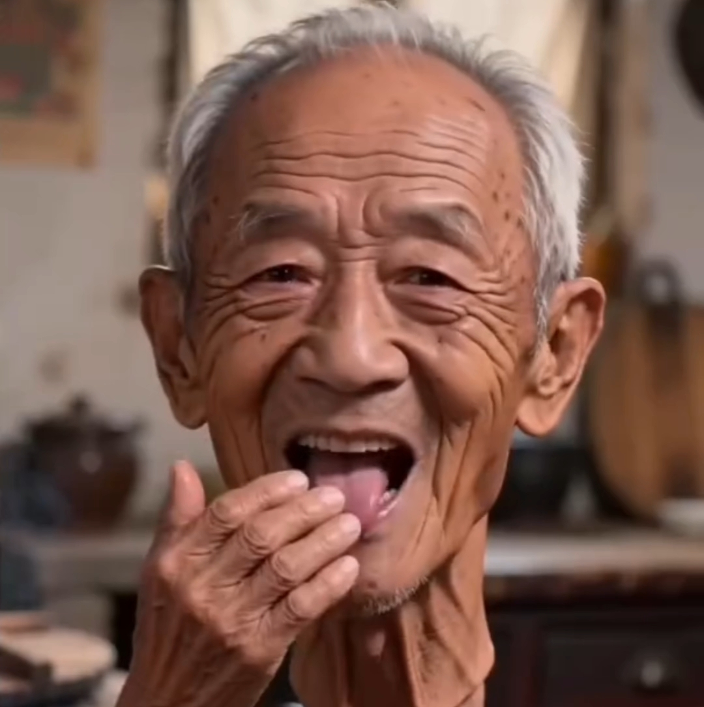 | 36.2万 | 2026-05-24 |
| [花式连招撸猫法 一镜到底](https://www.bilibili.com/video/BV1JWGz6VEna) | 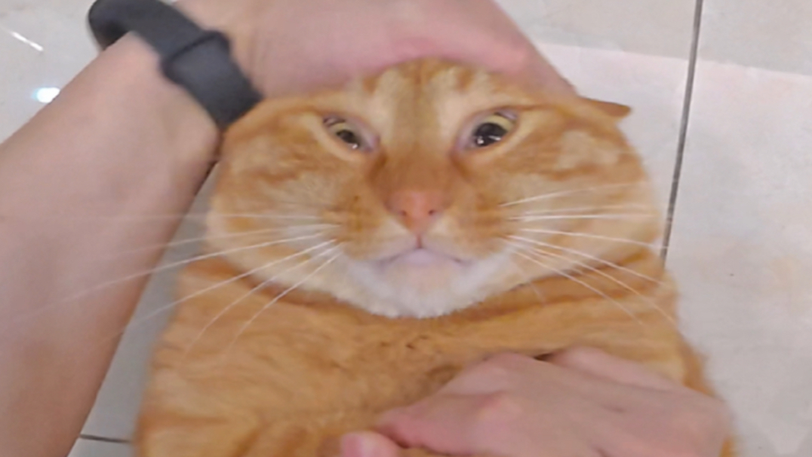 | 213.4万 | 2026-05-24 |
| [全世界笑点下降1000倍而我不变](https://www.bilibili.com/video/BV1K3Gz6pEoo) | 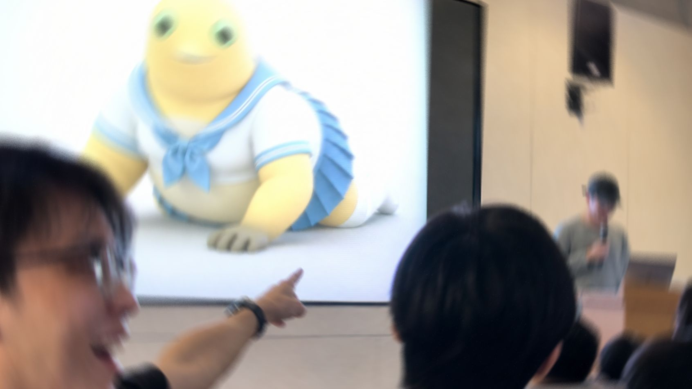 | 1351.4万 | 2026-05-23 |
| [【双狼动画】往事只能哈基](https://www.bilibili.com/video/BV1DFGz6fEpr) |  | 18.1万 | 2026-05-23 |
| [流浪咪的花语就是手慢无~](https://www.bilibili.com/video/BV1ZUGb6LEnU) | 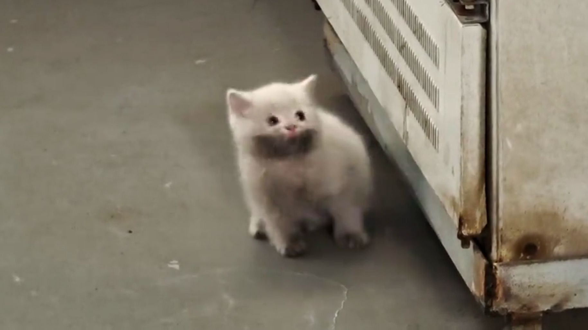 | 28.9万 | 2026-05-23 |
| [⚡鬼畜的实力必须强⚡](https://www.bilibili.com/video/BV1ecG86MEgB) |  | 43.6万 | 2026-05-22 |
| [老吴嚼口香糖回血](https://www.bilibili.com/video/BV17gLS6CE3F) | 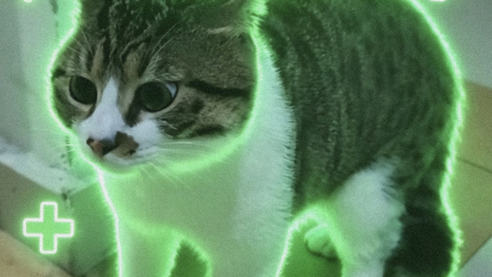 | 27.8万 | 2026-05-20 |
| [【本家投稿/中字】因为跳了奇怪的舞蹈.../重音Teto・俊达萌（奇怪な踊りをしたせいで…/重音テト＆ずんだもん）](https://www.bilibili.com/video/BV1QfL16WEG4) |  | 123.8万 | 2026-05-20 |
| [”第一次在动物的脸上看到了震惊！！“](https://www.bilibili.com/video/BV1ULLn62E4V) | 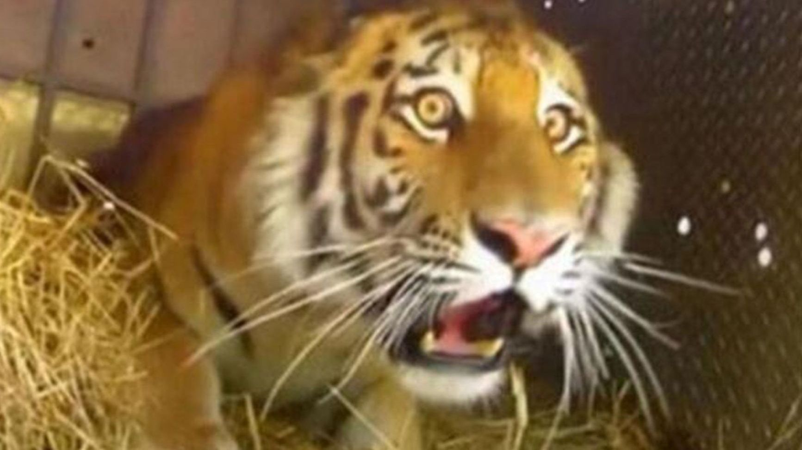 | 24.7万 | 2026-05-18 |
| [听猫~](https://www.bilibili.com/video/BV1H3LH6uEtV) |  | 38.3万 | 2026-05-17 |
| [你很臭喵🤢](https://www.bilibili.com/video/BV1m9Lj6NEUh) |  | 122.2万 | 2026-05-17 |
| [鸡佬做的成吉思鸡，这鸡有抛瓦！](https://www.bilibili.com/video/BV1YtLg6ZEYd) |  | 85.7万 | 2026-05-16 |
| [时代♂少年团](https://www.bilibili.com/video/BV19G5D6TEPh) |  | 175.3万 | 2026-05-15 |
| [小猫跳车摇~](https://www.bilibili.com/video/BV1j85Q6yE8q) |  | 15.8万 | 2026-05-14 |
| [会跳舞的丑橘还丑吗？](https://www.bilibili.com/video/BV1fU5C6bEd9) |  | 39.2万 | 2026-05-13 |
| [跳舞还是得看小猫](https://www.bilibili.com/video/BV1bF5L6bEJQ) |  | 76.0万 | 2026-05-13 |
| [𝑩𝒊𝒍𝒍𝒊𝒆 𝑱𝒆𝒂𝒏](https://www.bilibili.com/video/BV1Qd5N6gE5W) |  | 141.8万 | 2026-05-12 |
| [这才是《中奖概率倍儿高+燃烧我的卡路里+阿帕次》原版MV！](https://www.bilibili.com/video/BV1P9RXBbETu) |  | 337.4万 | 2026-05-09 |
| [【官方】ガチのマジで詰んだ（真的真的完蛋了） / ずんだもん - ぱじゃれっと【原创歌曲】](https://www.bilibili.com/video/BV1VrReBREeD) |  | 81.3万 | 2026-05-04 |
| [【Hi-Res无损】TIA《Ai đưa em về (Cukak Remix)》完整版“低皮质醇の小曲~”滚动歌词](https://www.bilibili.com/video/BV1a1R3BXEFP) |  | 26.6万 | 2026-05-03 |
| [咕咕嘎嘎 弥渡山歌舞蹈](https://www.bilibili.com/video/BV1pXRNBREK6) |  | 45.5万 | 2026-05-01 |
| [啊你高你高你高你高你高你高这儿，啊你高，老吴，吴~，老吴](https://www.bilibili.com/video/BV1Ee9DB6Ehg) |  | 24.6万 | 2026-04-29 |
| [如果喵是DJ你还会爱我吗？](https://www.bilibili.com/video/BV1YB92BHEwQ) |  | 4.0万 | 2026-04-29 |
| [这动画有力气！-「Jet Set!」](https://www.bilibili.com/video/BV1BwoaBhEBm) |  | 7.8万 | 2026-04-23 |
| [【洛天依原创】MONTAGEM PITTY](https://www.bilibili.com/video/BV1mBwNzUEAX) |  | 413.8万 | 2026-03-15 |
| [我不可能告诉你任何事情](https://www.bilibili.com/video/BV15EV8zfEdj) |  | 360.2万 | 2025-05-07 |

---
*最后更新: 2026-06-06 03:21:07 (自动生成)*
*数据来源: [Bilibili](https://www.bilibili.com)*

## 使用说明

运行以下命令更新视频列表:
```bash
python3 fetch_hajimi_videos.py
```
