# awesome-hajimi
collections of hajimi (哈基米 in Chinese) on the Internet.

## 视频列表 (Video List)

| 视频标题 (Title) | 封面 | 播放量 (Views) | 发布日期 (Date) |
|---|---|---|---|
| [团娜娜Mouse魔改整合包 代号：哈基米 发布](https://www.bilibili.com/video/BV1khozB9EPE) |  | 877 | 2026-04-30 |
| [基米小舞台](https://www.bilibili.com/video/BV14z9hBvEiz) | 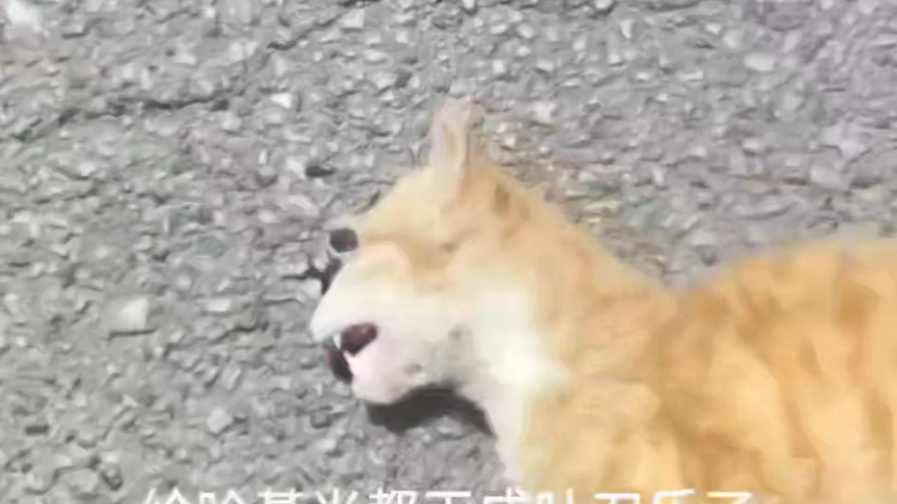 | 57 | 2026-04-30 |
| [谁在装修呀把我家哈基米吓死了](https://www.bilibili.com/video/BV1U99tBtE8Q) | 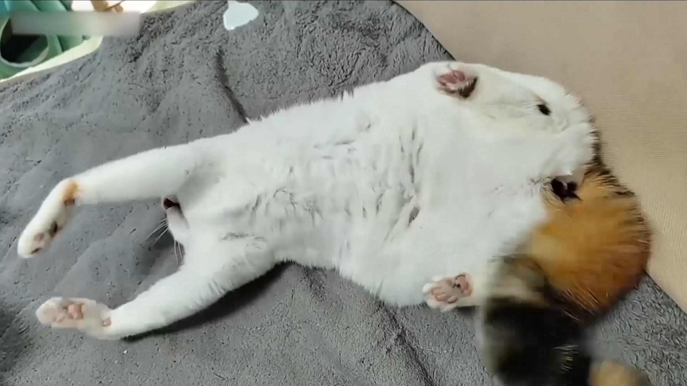 | 524 | 2026-04-30 |
| [【说谎的马卡龙】&amp; 哈基米填词](https://www.bilibili.com/video/BV1SD9tB8EMz) |  | 29 | 2026-04-30 |
| [哈基米～](https://www.bilibili.com/video/BV1CF9bBWE4E) | 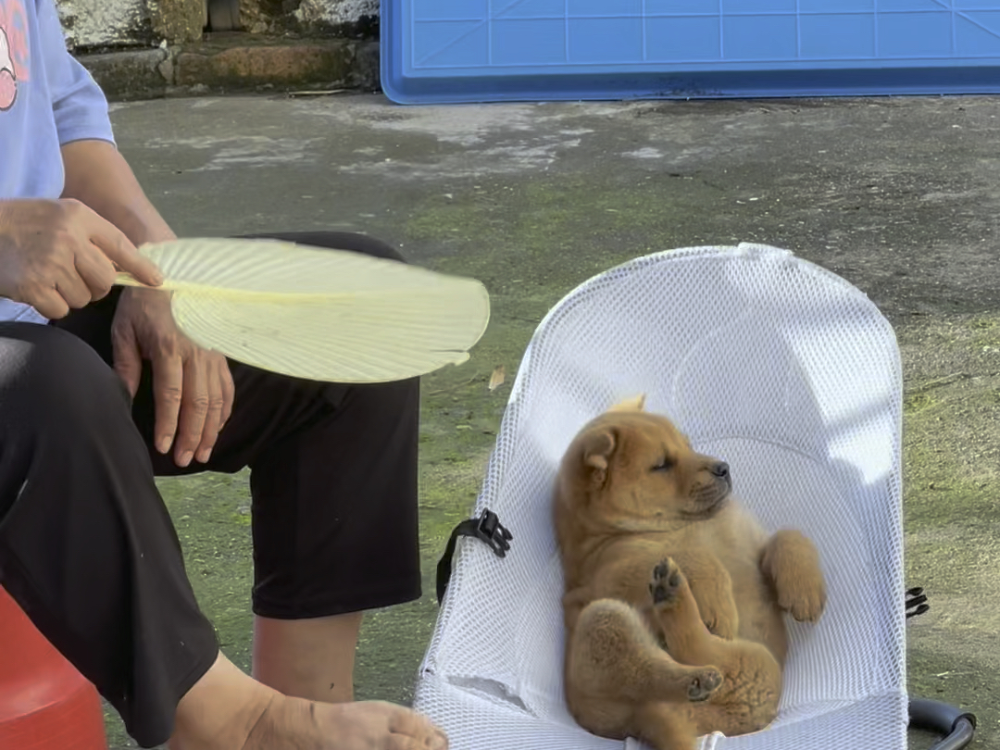 | 12 | 2026-04-30 |
| [【AI哈基米】当我给AI哈基米换上deepseek v4后，结果竟然...?](https://www.bilibili.com/video/BV15r9tBqEiK) |  | 61 | 2026-04-30 |
| [植物大战僵尸哈基米版宣传片](https://www.bilibili.com/video/BV18U9DBcEQ8) |  | 2253 | 2026-04-30 |
| [【ASMR｜基噪音】10对哈基米同时在你窗外吵架｜解压助眠舒缓](https://www.bilibili.com/video/BV13u98BTEu2) | 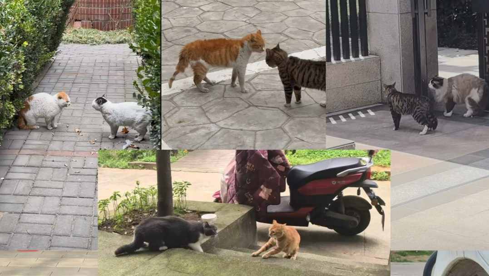 | 886 | 2026-04-29 |
| [一只好特别的哈基米](https://www.bilibili.com/video/BV1EQ9bBUE2B) |  | 88 | 2026-04-29 |
| [【哈基米鬼畜】哈基オーバーライト（40mP）-神人人格灯子](https://www.bilibili.com/video/BV1ebd1BxE1D) |  | 106 | 2026-04-29 |
| [补档 哈基米自行车](https://www.bilibili.com/video/BV1bs9sBDERw) | 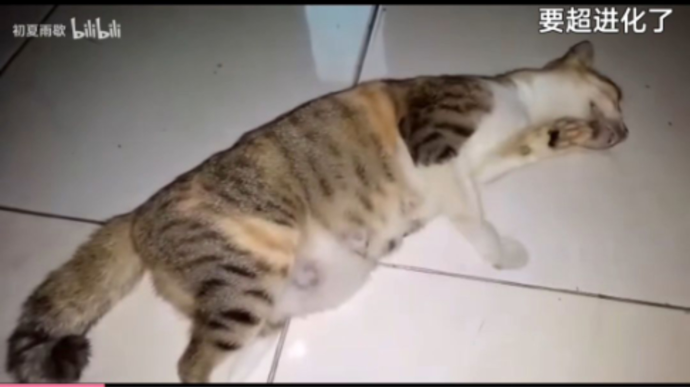 | 11 | 2026-04-29 |
| [哈基米，请不要哈气](https://www.bilibili.com/video/BV1hH9sBXEqt) |  | 209 | 2026-04-29 |
| [特雷森的哈基米](https://www.bilibili.com/video/BV1Vf9sBtELo) |  | 34 | 2026-04-29 |
| [哈基米南北绿豆⚡⚡⚡⚡](https://www.bilibili.com/video/BV13F9xBoEJV) |  | 149 | 2026-04-29 |
| [哈基米的底层代码:头上有东西→抬手扒下来→触发舔毛代码](https://www.bilibili.com/video/BV1T99DBoEbq) | 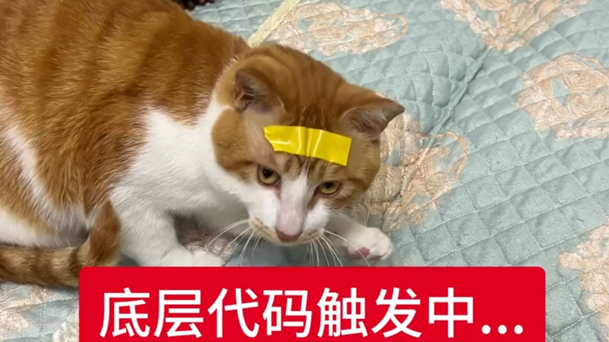 | 1.4万 | 2026-04-29 |
| [哈基米燃尽了](https://www.bilibili.com/video/BV1uK9xBXEFu) | 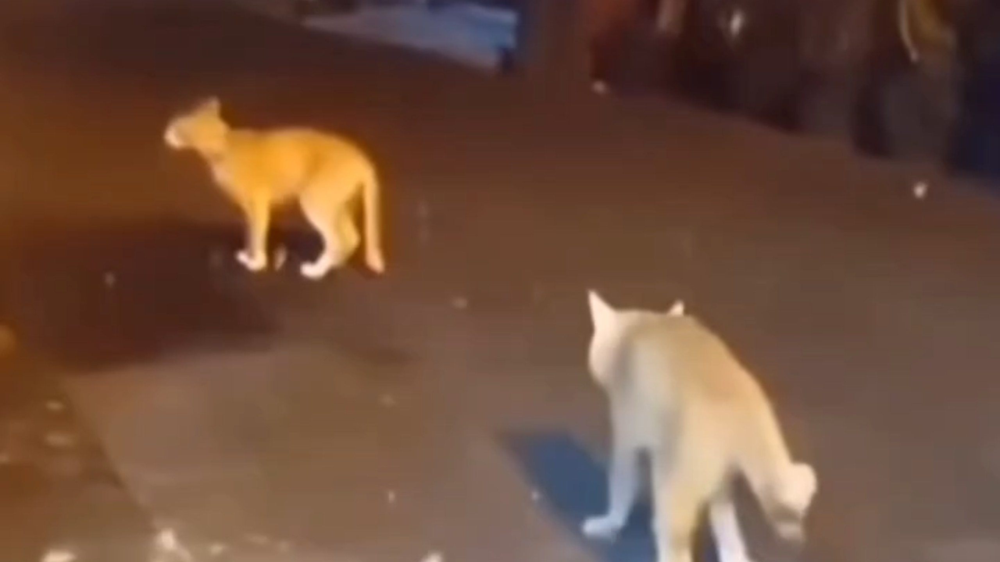 | 440 | 2026-04-29 |
| [所有人！哈基米](https://www.bilibili.com/video/BV1jQ9sBAEE6) |  | 26 | 2026-04-29 |
| [哈基米南北绿豆](https://www.bilibili.com/video/BV1ed9sB8ESe) | 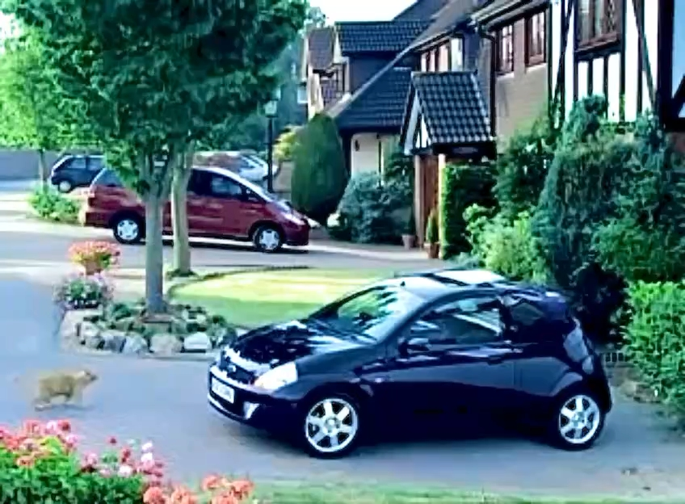 | 27 | 2026-04-29 |
| [【哈基米音乐】天才哈基米](https://www.bilibili.com/video/BV1Z49xBMEDe) |  | 168 | 2026-04-29 |
| [哈基米](https://www.bilibili.com/video/BV1oY9xBPEiQ) | 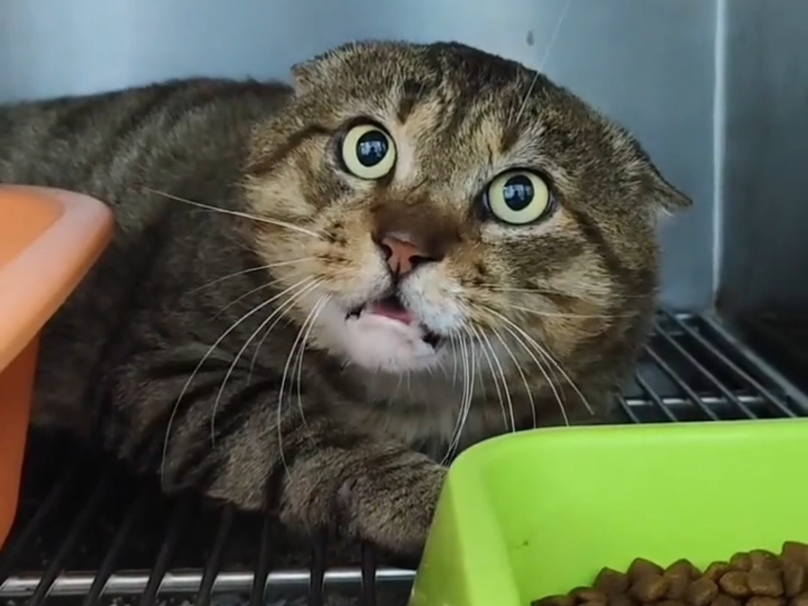 | 27 | 2026-04-29 |
| [哈基米](https://www.bilibili.com/video/BV1KX9xBHE9T) | 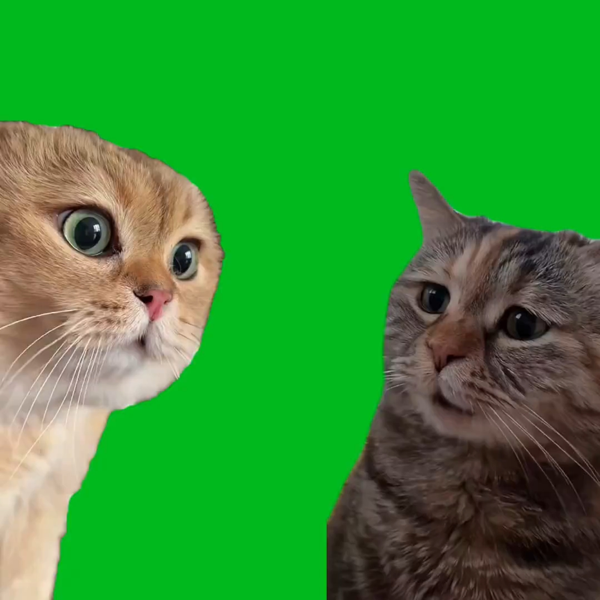 | 14 | 2026-04-29 |
| [哈基米看见滚木了](https://www.bilibili.com/video/BV1Gz9xBcEx5) | 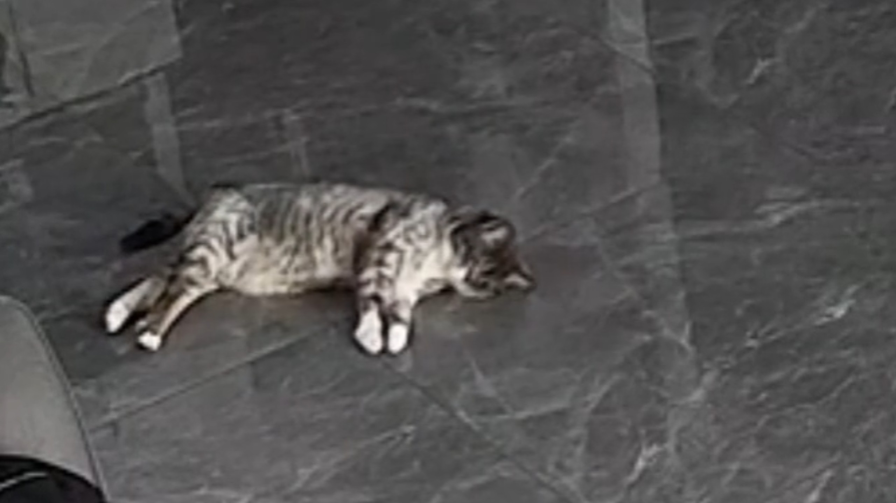 | 1275 | 2026-04-29 |
| [【卡机哈基米】最新视频已上线，快来围观！](https://www.bilibili.com/video/BV1hr9xBfEhU) |  | 57 | 2026-04-29 |
| [哈基米是液体，可以钻楼里](https://www.bilibili.com/video/BV1gC9xBtEC3) | 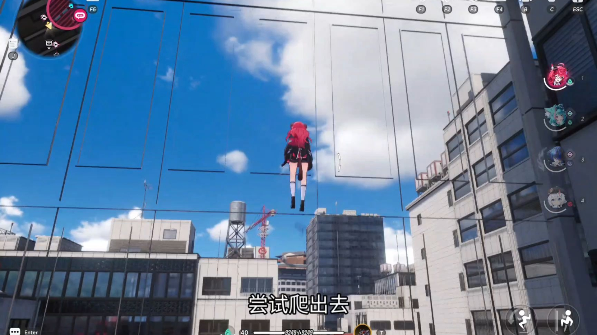 | 116 | 2026-04-29 |
| [哈基米曼波最新力作](https://www.bilibili.com/video/BV1xL9DBXEsY) |  | 7 | 2026-04-29 |
| [哈基米依旧PUMA形态飞升喵星](https://www.bilibili.com/video/BV1t59DBWESD) | 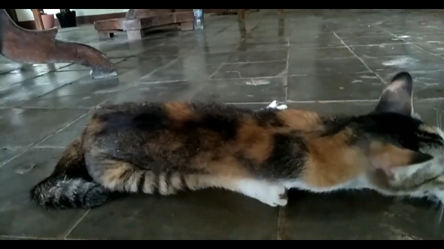 | 6962 | 2026-04-29 |
| [哈基米秒开团](https://www.bilibili.com/video/BV1m59DBWEbe) | 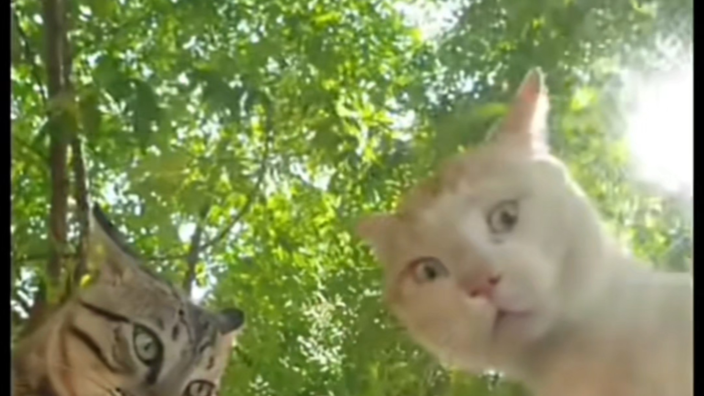 | 405 | 2026-04-29 |
| [哈基米：MONTAGEM ALQUIMIA](https://www.bilibili.com/video/BV1mY9SBHENa) |  | 1498 | 2026-04-29 |
| [【基米TV】太阳系最可爱生物21分钟剧场版，一次看个够！](https://www.bilibili.com/video/BV1w49DB5Eum) | 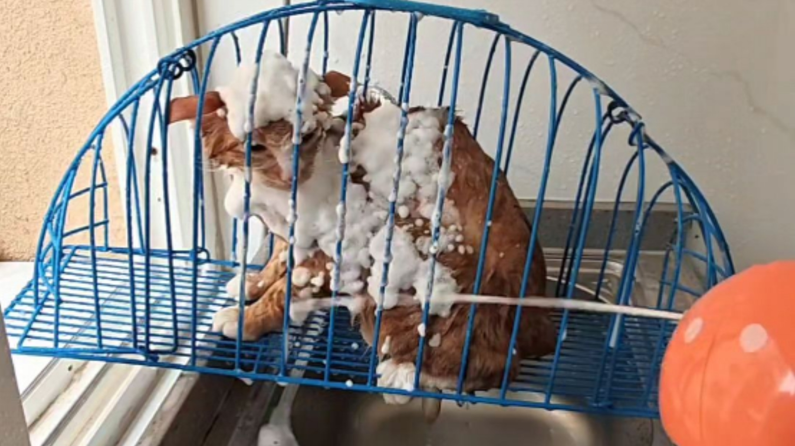 | 8057 | 2026-04-29 |
| [只是两只哈基米在打架](https://www.bilibili.com/video/BV1HN9QBJERF) | 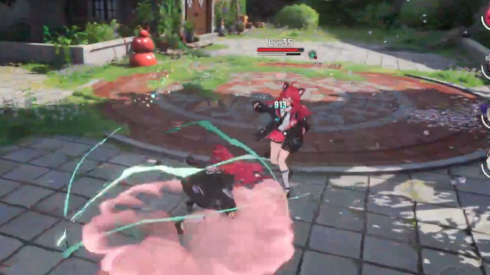 | 34 | 2026-04-29 |
| [哈基米：兔子小队の小曲 ｜ Usagi Flap🎵](https://www.bilibili.com/video/BV16M9QBLERd) |  | 9272 | 2026-04-29 |
| [哈基米是什么呀](https://www.bilibili.com/video/BV1G19DBAERC) |  | 705 | 2026-04-29 |
| [《我怎么是只哈~基~米~》](https://www.bilibili.com/video/BV19W9QBKEmy) | 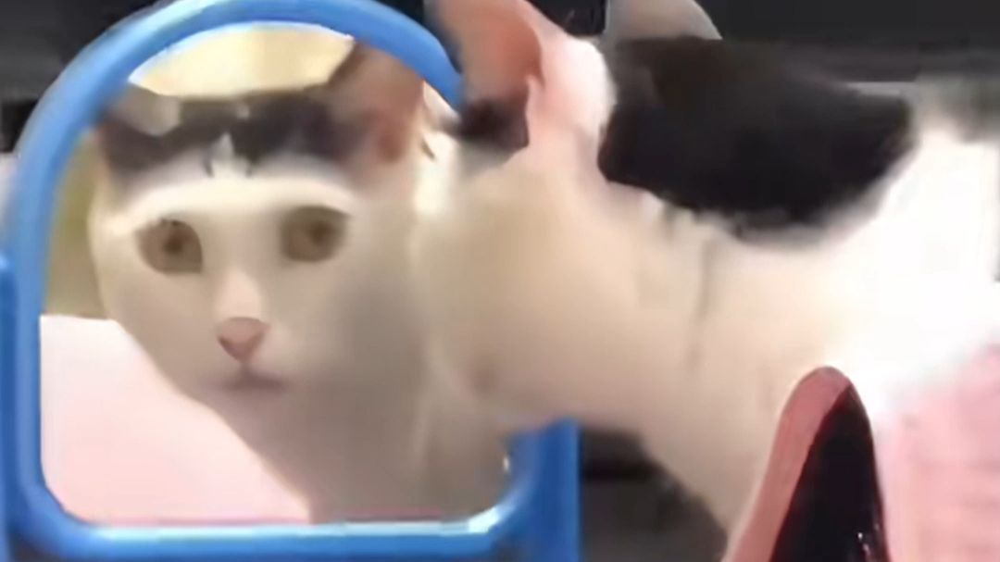 | 435 | 2026-04-29 |
| [哈基米这个喜欢电梯](https://www.bilibili.com/video/BV1Qt9QBYE6R) |  | 1.2万 | 2026-04-29 |
| [用千问get同款可爱哈基米视频（自定义）](https://www.bilibili.com/video/BV1uh9QBaEkd) |  | 102 | 2026-04-29 |
| [粉红哈基米](https://www.bilibili.com/video/BV1HM9QB7E53) |  | 159 | 2026-04-29 |
| [哈基米:Moog City](https://www.bilibili.com/video/BV17L9QBkEMG) |  | 128 | 2026-04-29 |
| [哈基米大战哈基蛇](https://www.bilibili.com/video/BV1mQ9UBnE3F) | 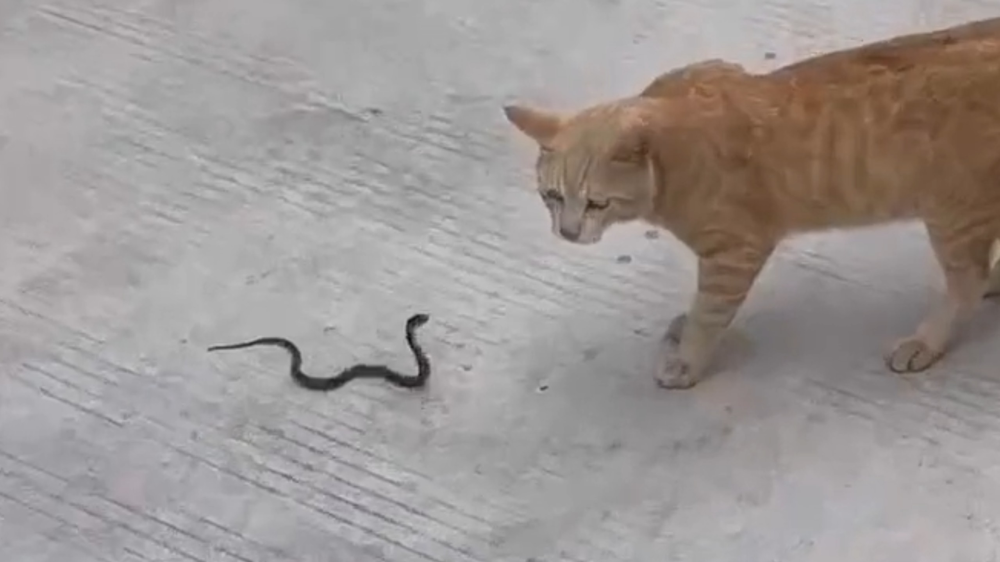 | 1110 | 2026-04-29 |
| [最萌的一集！（哈基米版）评论区有最萌时刻的时间节点！](https://www.bilibili.com/video/BV14X9UBSEV6) |  | 455 | 2026-04-29 |
| [大我千万倍？哈基米照样哈！](https://www.bilibili.com/video/BV1Wc9SB5Eq7) |  | 456 | 2026-04-29 |
| [【宝可梦大集结】这就是哈基米](https://www.bilibili.com/video/BV1g19UBsEqi) |  | 414 | 2026-04-29 |
| [流萤，哈基米南北豆摇一摇](https://www.bilibili.com/video/BV1MS9UBQE84) |  | 1824 | 2026-04-29 |
| [逻辑咪住进哈基米主题房？](https://www.bilibili.com/video/BV1AC9SB1E5w) | 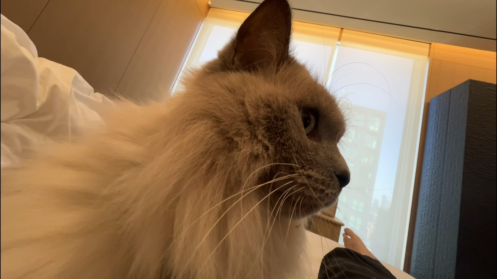 | 326 | 2026-04-29 |
| [哈基米书记为祖国大好河山高歌一曲](https://www.bilibili.com/video/BV14N9yBTEbE) |  | 4836 | 2026-04-29 |
| [沉浸式开箱一把civivi哈基米，很可爱手感不错。](https://www.bilibili.com/video/BV11e9SBDERw) | 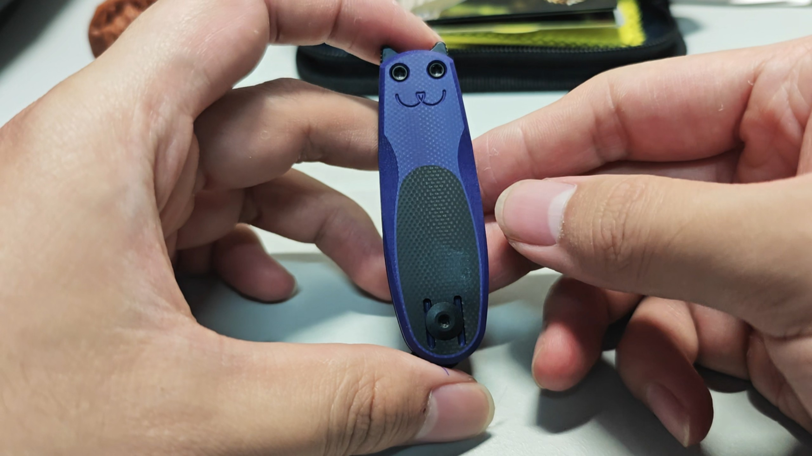 | 123 | 2026-04-29 |
| [哈基米螺旋](https://www.bilibili.com/video/BV1me9SBDEnE) | 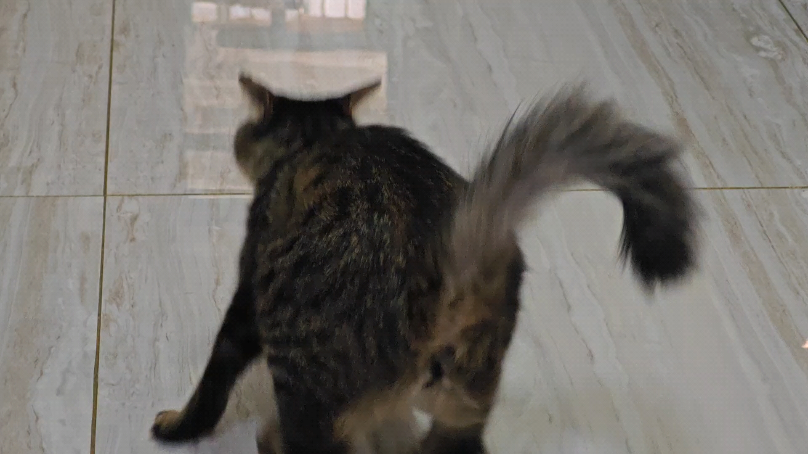 | 48 | 2026-04-29 |
| [哈基米南北绿豆饼 网红爆款 哈基米联名 点心零食](https://www.bilibili.com/video/BV1ka9CBZEnq) | 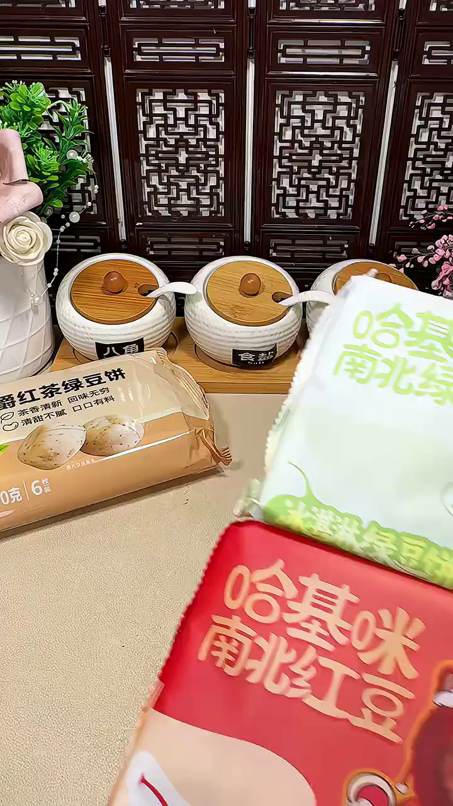 | 0 | 2026-04-28 |
| [哈基米南北绿豆饼 白芸豆冰皮 软韧回弹 自带清香](https://www.bilibili.com/video/BV1ka9CBZECy) |  | 0 | 2026-04-28 |
| [今日份哈基咪](https://www.bilibili.com/video/BV1NC9kBaEqo) |  | 1.3万 | 2026-04-28 |
| [显卡TV旧传之小猫喜欢木棍](https://www.bilibili.com/video/BV1wPoBBWE1i) | 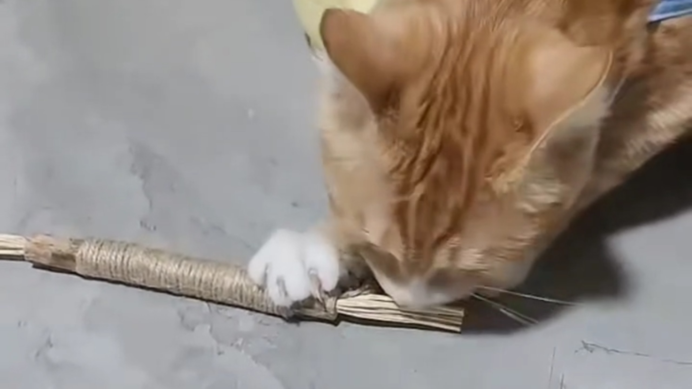 | 1945 | 2026-04-28 |
| [典中典之基米送别](https://www.bilibili.com/video/BV1U59rBaEbr) |  | 2320 | 2026-04-28 |
| [基米售货机1-5集合订版](https://www.bilibili.com/video/BV1Rf96BkEzp) | 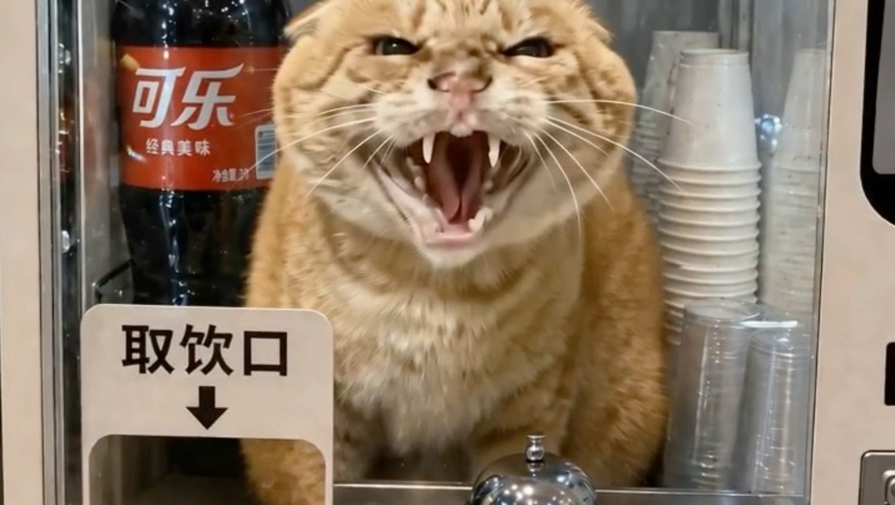 | 69.7万 | 2026-04-28 |
| [爷爷，不要抛下耄耋好不好？](https://www.bilibili.com/video/BV1Mg9zBtESF) | 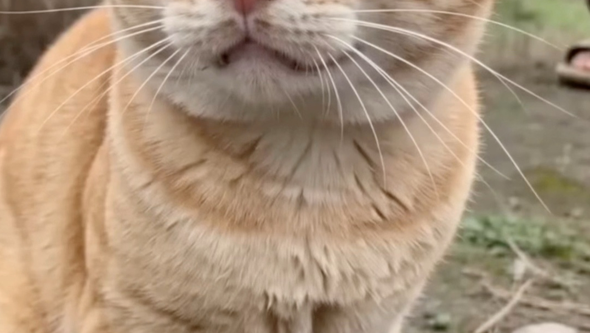 | 3.0万 | 2026-04-28 |
| [哈基米别追了，不就偷你点辣椒吗？](https://www.bilibili.com/video/BV1s4orBNEac) |  | 5147 | 2026-04-27 |
| [吉米米吉](https://www.bilibili.com/video/BV1u6okBLEUP) | 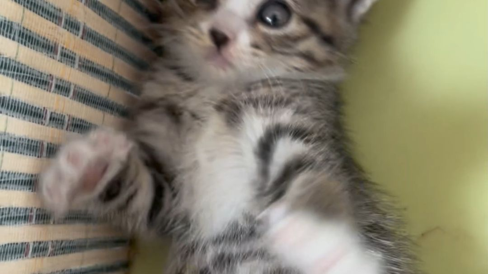 | 2889 | 2026-04-27 |
| [大运卡车 VS 1000只哈气耄耋谁会获胜 全新玩法来了一起来看看吧~#解压 #哈基米 #大运 #polo小球 #视觉震撼](https://www.bilibili.com/video/BV1y2o6BaEVm) |  | 2382 | 2026-04-27 |
| [【泛式】神人大叔联动完海龟汤后 在直播间六千泛团的？中突然开始哈基米金曲四连放 听完后直播间大伙儿表示：爽！这才是真正的音乐](https://www.bilibili.com/video/BV1YfoeBFE7m) |  | 1.5万 | 2026-04-26 |
| [三代哈基咪VS大喵丸](https://www.bilibili.com/video/BV1AqoeBLEoA) |  | 3.0万 | 2026-04-26 |
| [地库流浪猫946天，幸福来的太突然了，库库让我抱抱啦，不止一次！是真的让抱了！](https://www.bilibili.com/video/BV1EjZcBCEWd) | 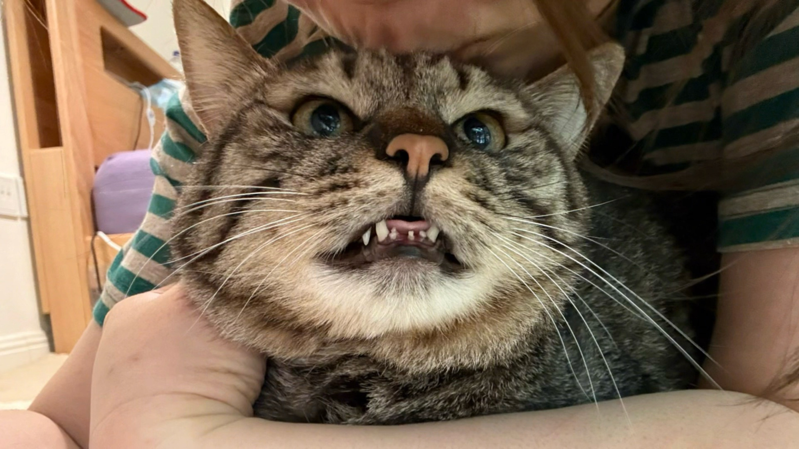 | 10.2万 | 2026-04-26 |
| [《健 忘 症》](https://www.bilibili.com/video/BV1uaofBREEW) | 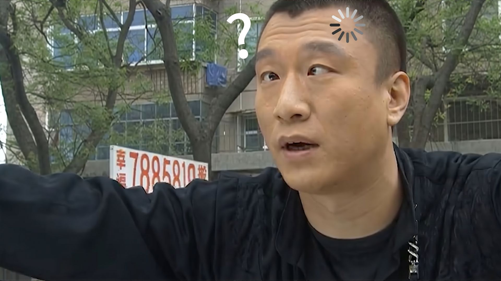 | 242.6万 | 2026-04-26 |
| [银狼哈气岂不是哈基狼？🤓👆](https://www.bilibili.com/video/BV1wZo9BhEcK) |  | 7.1万 | 2026-04-25 |
| [达妮娅 哈基米](https://www.bilibili.com/video/BV14roQBvE9J) |  | 1.4万 | 2026-04-25 |
| [“ 🥺e m o 🥺 哈 基 仙 ”](https://www.bilibili.com/video/BV1dCojBjEtg) | 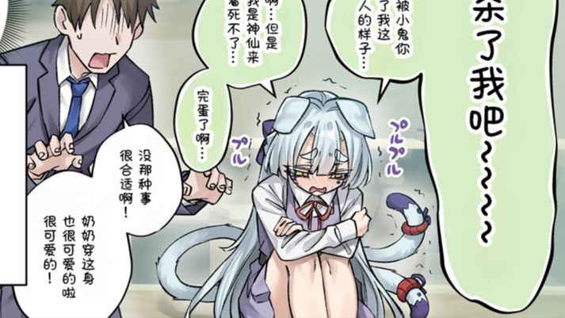 | 3.7万 | 2026-04-24 |
| [好多毛毛虫](https://www.bilibili.com/video/BV14hoVBZEZh) | 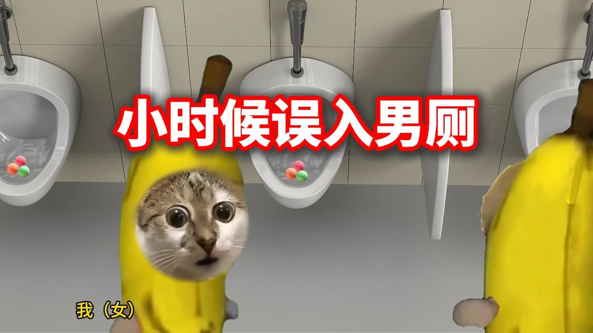 | 50.7万 | 2026-04-24 |
| [当你长大当了音乐老师后](https://www.bilibili.com/video/BV1MXo5BYEsV) | 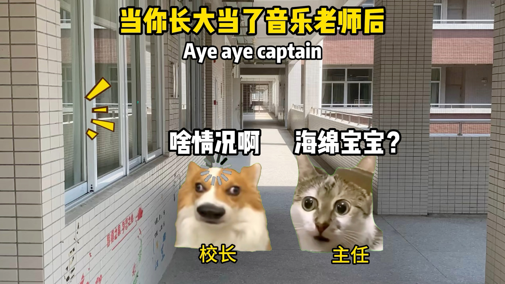 | 593.2万 | 2026-04-24 |
| [小猫怎么了？](https://www.bilibili.com/video/BV1W3oYBVE99) | 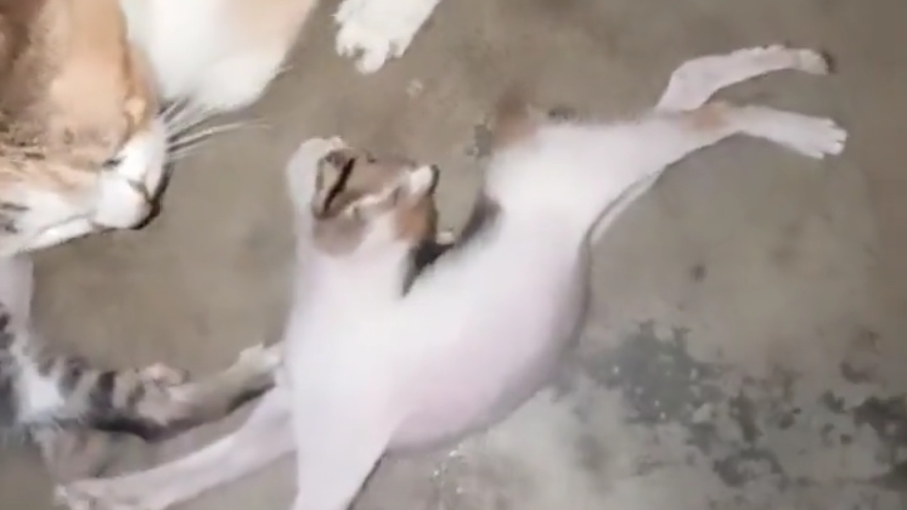 | 1.0万 | 2026-04-23 |
| [⚡对 对 子 战 神 4⚡](https://www.bilibili.com/video/BV1TtoaBCEyz) |  | 673.3万 | 2026-04-23 |
| [答不准的时候就会嗯哼哼](https://www.bilibili.com/video/BV1juoeBeEZY) | 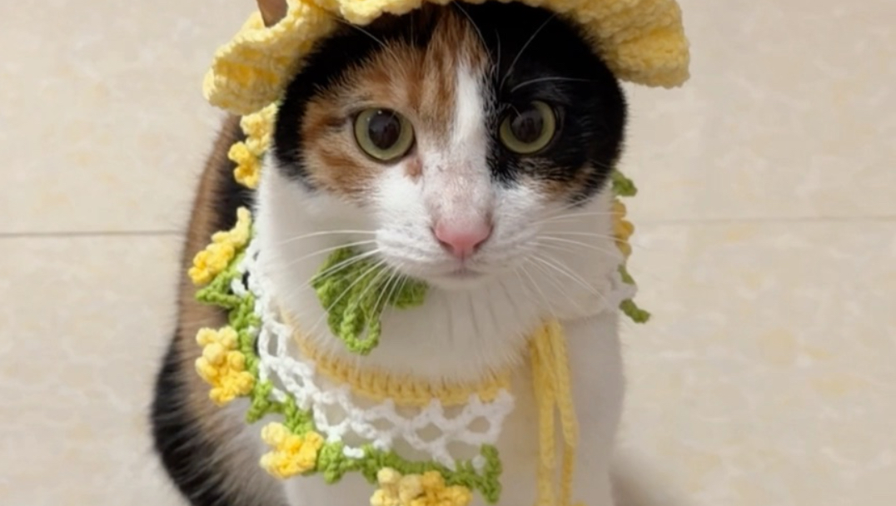 | 33.1万 | 2026-04-23 |
| [每 天 一 遍 🔥 防 止 抑 郁 ！](https://www.bilibili.com/video/BV1WTobB8EDj) | 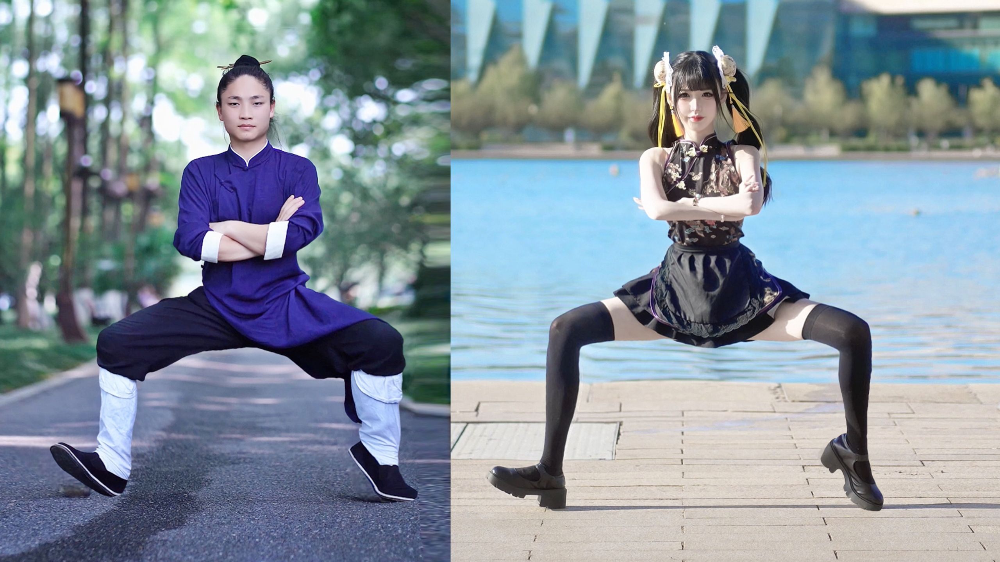 | 161.3万 | 2026-04-23 |
| [咪：百万撤离了嗷兄弟们](https://www.bilibili.com/video/BV1c9o4BHEja) |  | 11.5万 | 2026-04-22 |
| [【异环】这就是王牌一代耄的实力吗？红头基米娜娜莉太能哈了！](https://www.bilibili.com/video/BV1C4ddBqErq) |  | 6420 | 2026-04-19 |
| [雨停之前，我还不能倒下!](https://www.bilibili.com/video/BV1r7dLBHESR) |  | 237.7万 | 2026-04-17 |
| [【哈基米版】天龙八部乔峰少室山以一敌三，爆笑～](https://www.bilibili.com/video/BV1vYdLB3EF7) |  | 2.5万 | 2026-04-17 |
| [韩国网页游戏给猫梳毛，被发现了就咬你。（全程高能音量调小 末尾猫猫回头害怕极了）](https://www.bilibili.com/video/BV1NcdaBMEBf) | 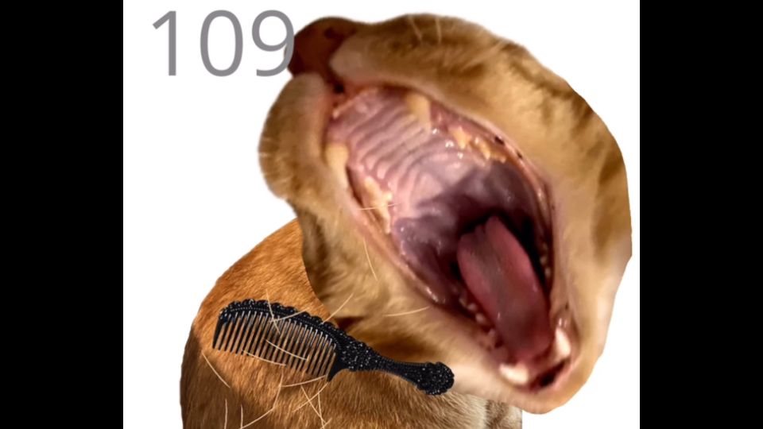 | 136.8万 | 2026-04-16 |
| [【哈基米出海】对象突然发给我ins上的哈基米reels…（碎碎念：居然才出海吗？）](https://www.bilibili.com/video/BV1JqQJBnExL) |  | 7201 | 2026-04-15 |
| [哈基米来电【接听】还是「挂断」2 你唱见砂糖又疯了](https://www.bilibili.com/video/BV1MTDTBbECo) | 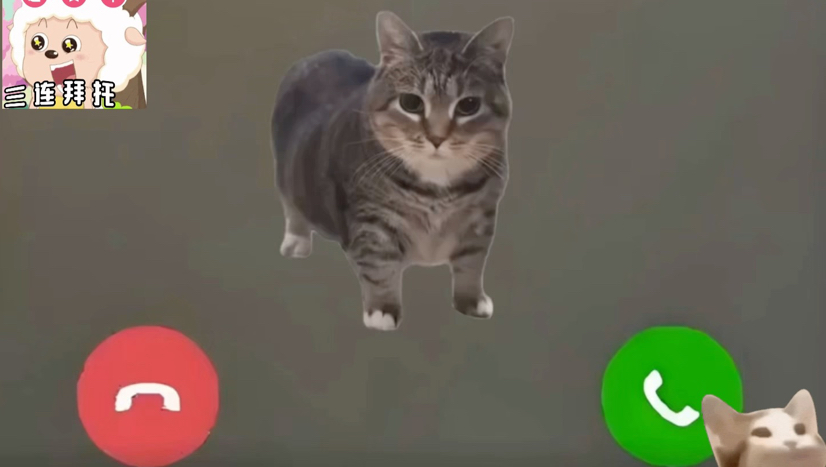 | 217 | 2026-04-04 |
| [愁几把剑茂一被我抱就叫](https://www.bilibili.com/video/BV1i5DMBkEgH) | 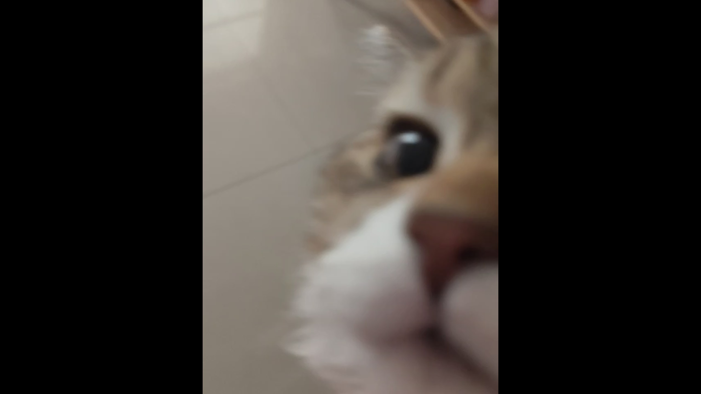 | 32.2万 | 2026-04-04 |
| [《meme岛》第二集：探索（meme岛）无人海域](https://www.bilibili.com/video/BV1Vs9MB2EAK) |  | 1.5万 | 2026-04-03 |
| [哈基米来电 【接听】还是「挂断」 ～#%&amp;内含铃声注意收听](https://www.bilibili.com/video/BV15k9TBjECP) | 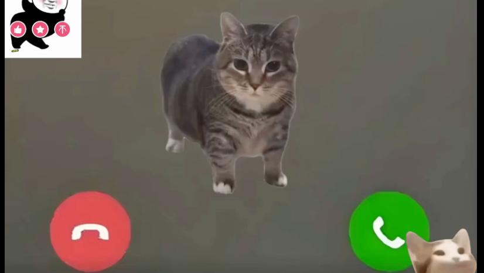 | 416 | 2026-04-03 |
| [春江水暖基先知](https://www.bilibili.com/video/BV1Nj9NBxE4K) | 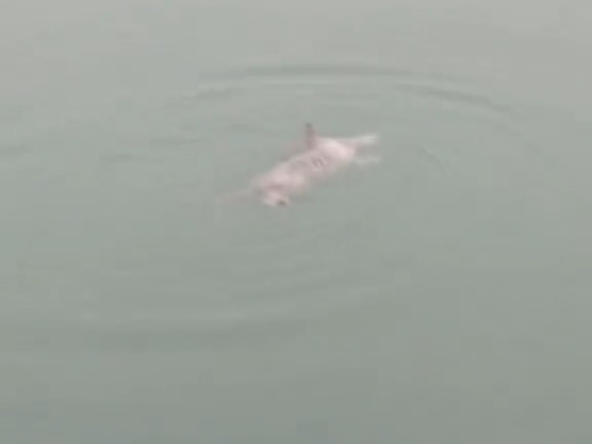 | 1.0万 | 2026-04-03 |
| [迪耄！你再哈！你再哈我就把你给收了！](https://www.bilibili.com/video/BV1vfXCBjEdF) | 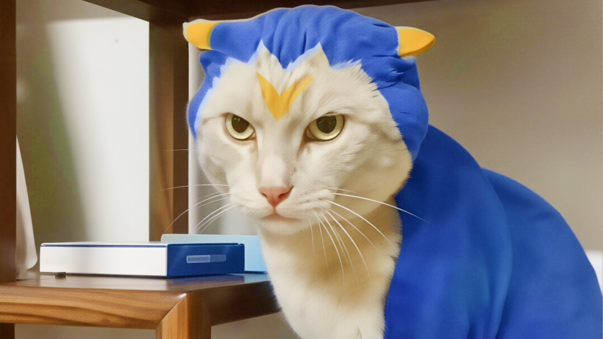 | 15.4万 | 2026-03-31 |
| [【哈基米阴乐】走天涯](https://www.bilibili.com/video/BV1BArGBPEMn) |  | 2.6万 | 2026-01-10 |
| [【哈基根和她的朋友们】第0话：哈基根母女乡下游](https://www.bilibili.com/video/BV1ZbSYBLEHE) |  | 7.5万 | 2025-12-03 |
| [哈基米京剧《卖水》｜好歹是传下来了！](https://www.bilibili.com/video/BV1XJW2zbERL) |  | 1746 | 2025-10-20 |
| [【哈基米音乐】⚡不 如 曼 波⚡（不如跳舞）](https://www.bilibili.com/video/BV1yrWzzcEyV) |  | 3995 | 2025-10-17 |
| [转瞬即逝 7.0（内测版）](https://www.bilibili.com/video/BV1HAHVz5Ed6) | 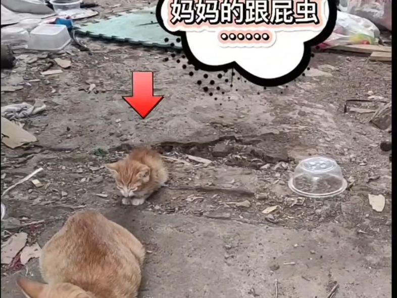 | 3807 | 2025-10-03 |
| [哈基米居然能衍生出这么多首歌，全听过的可以把手机扔了 #哈基米 曼波](https://www.bilibili.com/video/BV1HKnnzaEyR) | 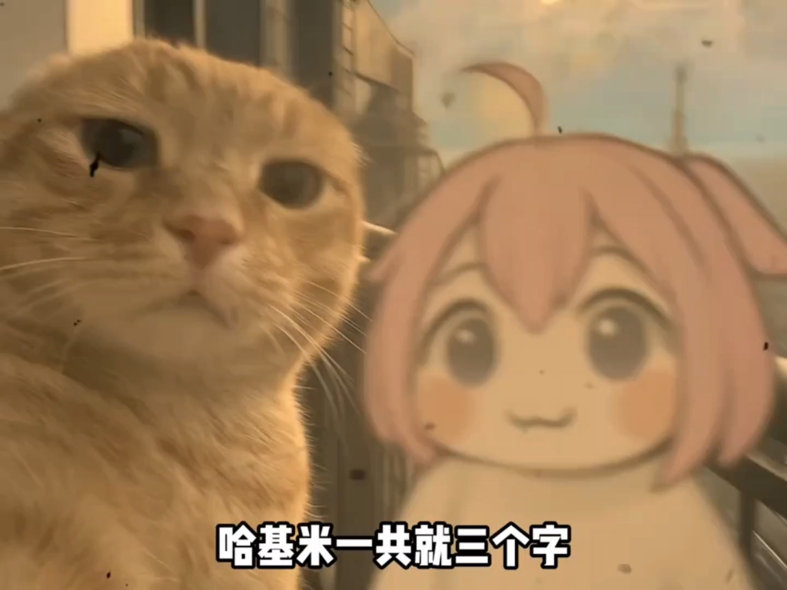 | 72.9万 | 2025-09-27 |
| [哈基米喝水代码出错，手忙脚乱](https://www.bilibili.com/video/BV1jFpVzgEQu) | 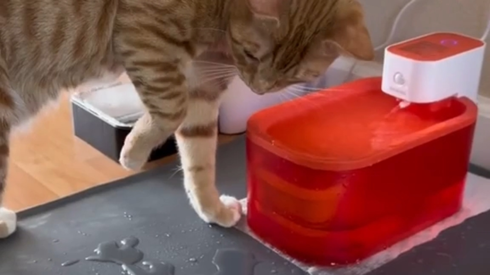 | 9.5万 | 2025-09-12 |
| [【哈基米音乐】海绵宝宝搞事の小曲 Grass Skirt Chase（草裙追逐）](https://www.bilibili.com/video/BV1cQuqz1EM1) |  | 3.2万 | 2025-07-14 |
| [哈基米+私人哈基音效](https://www.bilibili.com/video/BV1jrGwzjE5H) |  | 6.5万 | 2025-07-09 |
| [哈基米这个想不开](https://www.bilibili.com/video/BV1jZ3Bz7EXz) | 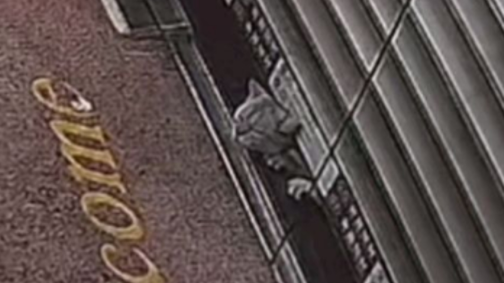 | 6.4万 | 2025-07-06 |
| [【哈基米儿歌】两只基米](https://www.bilibili.com/video/BV1YuN4zfE7z) |  | 1.5万 | 2025-06-19 |
| [好猫来了有猫条，键帽来了大力抽射](https://www.bilibili.com/video/BV1KPVRzjEmw) | 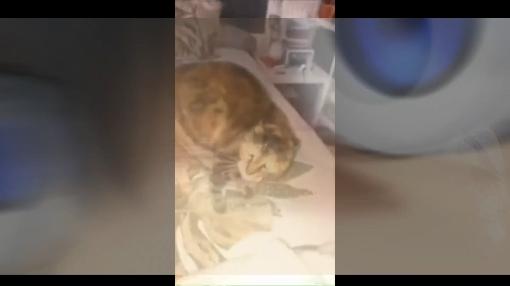 | 21.1万 | 2025-05-10 |
| [VAC电音节惊现oiiai](https://www.bilibili.com/video/BV1sFGZzQEk1) | 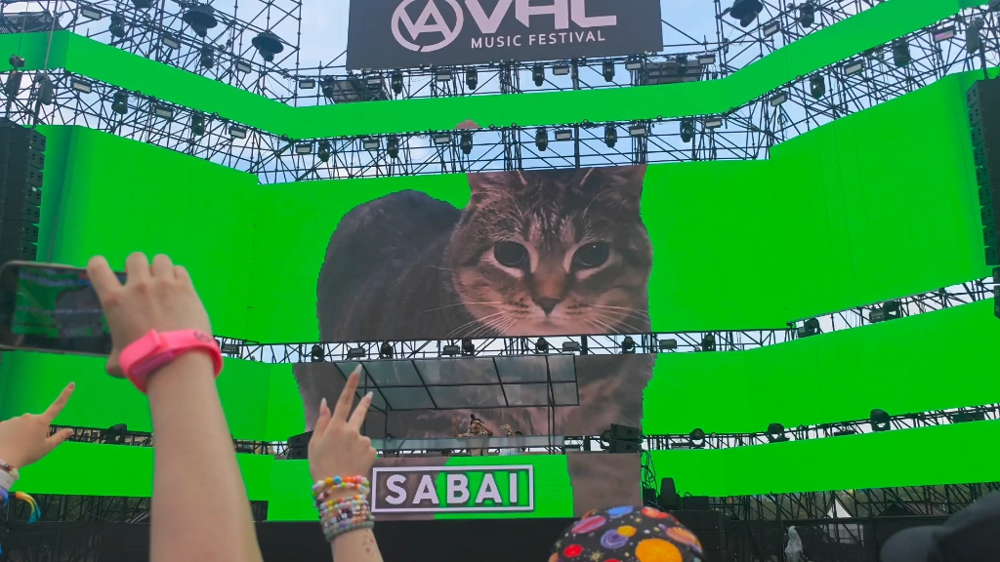 | 28.0万 | 2025-05-03 |
| [【补档】圆头哈基米](https://www.bilibili.com/video/BV1BpwgeREEM) | 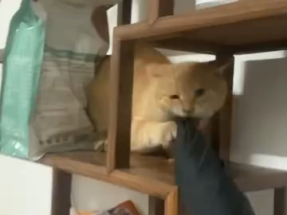 | 78.9万 | 2025-01-16 |
| [哈基米](https://www.bilibili.com/video/BV1ZXr7YRECo) | 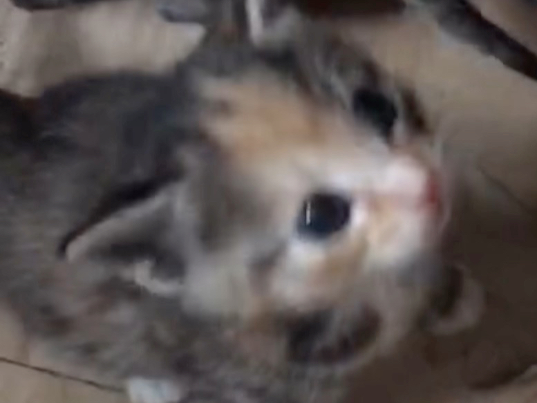 | 3037 | 2025-01-03 |
| [（十八禁~血腥慎入）爱猫TV之用比胳膊还粗的棍子爱哈基米](https://www.bilibili.com/video/BV1HzSHY8EAJ) | 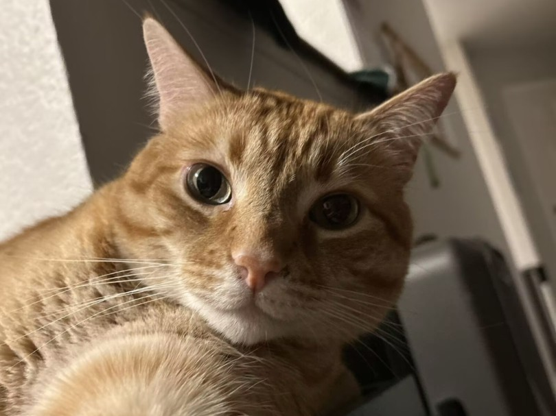 | 8.6万 | 2024-10-31 |
| [哈基米5](https://www.bilibili.com/video/BV154421U7UB) | 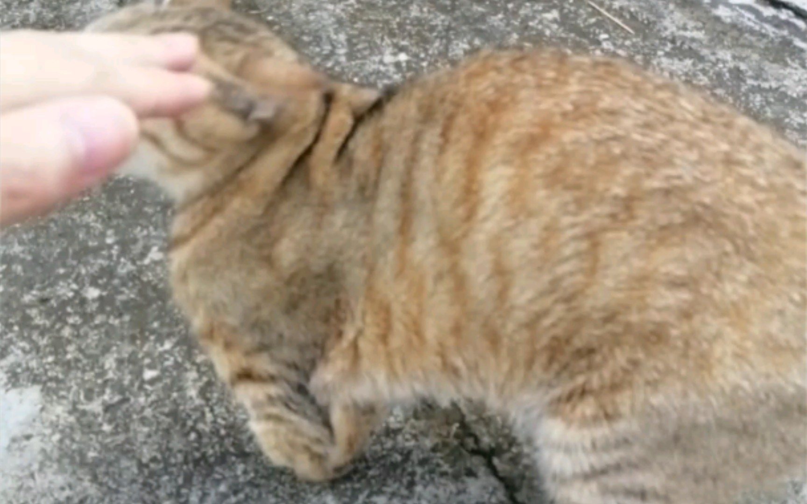 | 2027 | 2024-07-12 |
| [可可爱爱的哈基米](https://www.bilibili.com/video/BV1qw411W7EJ) | 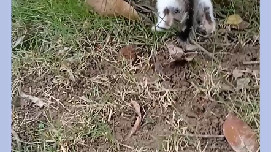 | 185 | 2023-11-15 |
| [硬核哈基米](https://www.bilibili.com/video/BV1hM4y1j7UQ) | 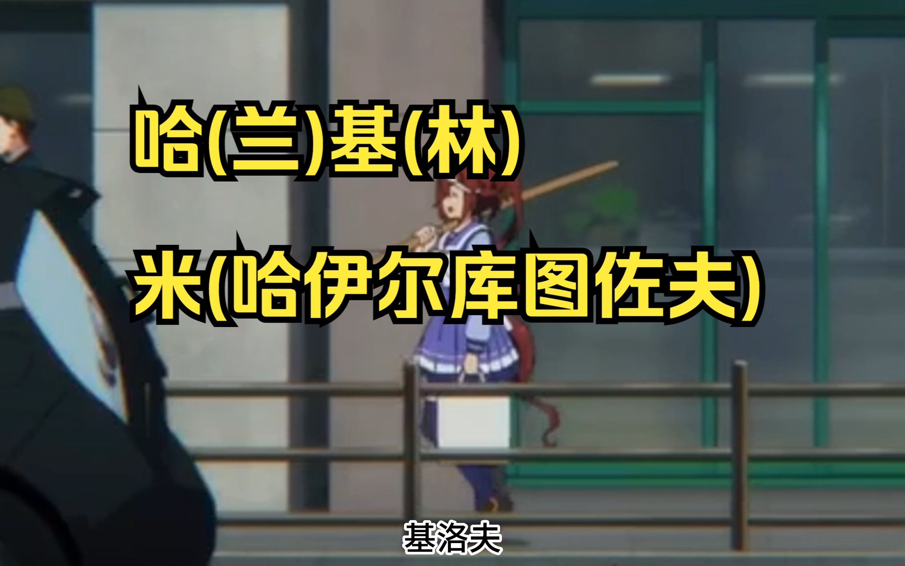 | 1.3万 | 2023-07-07 |

---
*最后更新: 2026-04-30 03:19:55 (自动生成)*
*数据来源: [Bilibili](https://www.bilibili.com)*

## 使用说明

运行以下命令更新视频列表:
```bash
python3 fetch_hajimi_videos.py
```
