# awesome-hajimi
collections of hajimi (哈基米 in Chinese) on the Internet.

## 视频列表 (Video List)

| 视频标题 (Title) | 封面 | 播放量 (Views) | 发布日期 (Date) |
|---|---|---|---|
| [哈基米](https://www.bilibili.com/video/BV1ib5K6mE6B) |  | 498 | 2026-05-12 |
| [【精致哈基米】坐高铁啦~](https://www.bilibili.com/video/BV12t5t6ZEBz) |  | 157 | 2026-05-12 |
| [哈基米与铃铛项圈](https://www.bilibili.com/video/BV1rG5P6DEJH) | 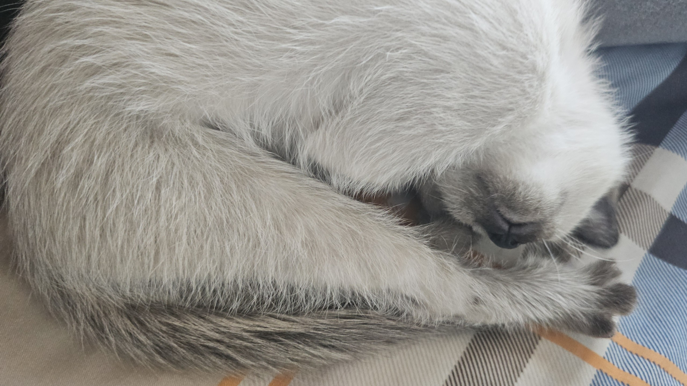 | 421 | 2026-05-12 |
| [🐱灭杀龙王的基米🐱](https://www.bilibili.com/video/BV13Z5t6MEyL) |  | 496 | 2026-05-11 |
| [【哈基米#5】哈基米战队成员高燃合集第五期，看完不笑说明你有玉玉症](https://www.bilibili.com/video/BV1Uf5A68Ew3) | 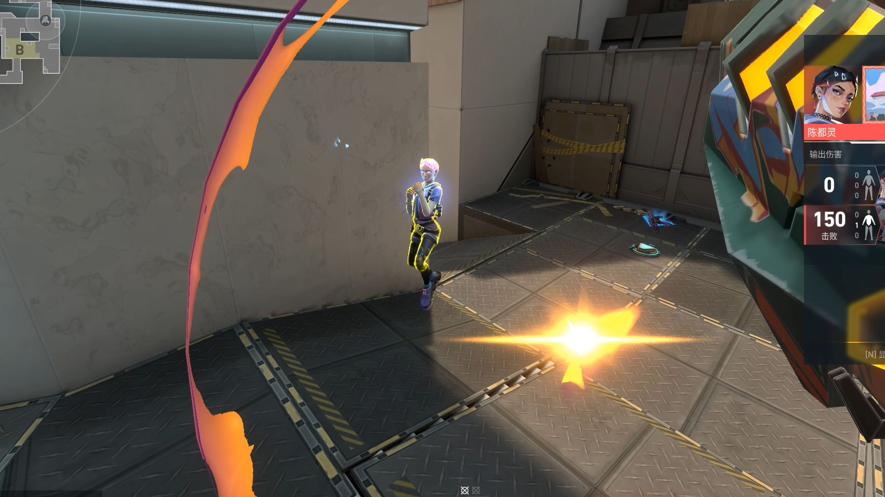 | 177 | 2026-05-11 |
| [我不笑 它不白成哈基十了吗？](https://www.bilibili.com/video/BV1Zw5t61EVg) | 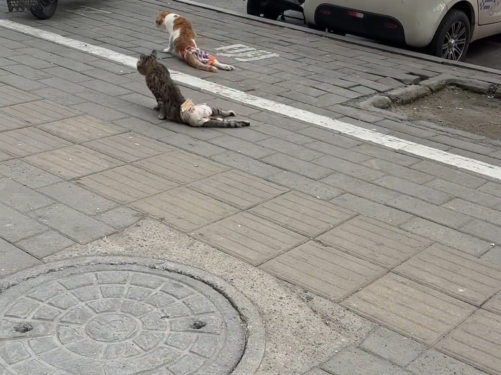 | 248 | 2026-05-11 |
| [哈基米牌魅力药水！](https://www.bilibili.com/video/BV1zw5t61EjL) |  | 3919 | 2026-05-11 |
| [难道比芭提/天眼，是一只很坏很坏的哈基米吗](https://www.bilibili.com/video/BV1qP5t65EEZ) | 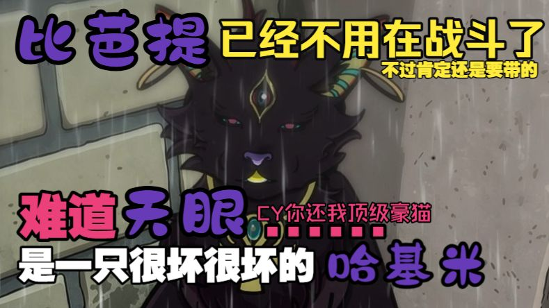 | 426 | 2026-05-11 |
| [最后一哈](https://www.bilibili.com/video/BV13Z5t6MEGm) |  | 208 | 2026-05-11 |
| [晚安，哈基米](https://www.bilibili.com/video/BV1kY5t6sEkE) | 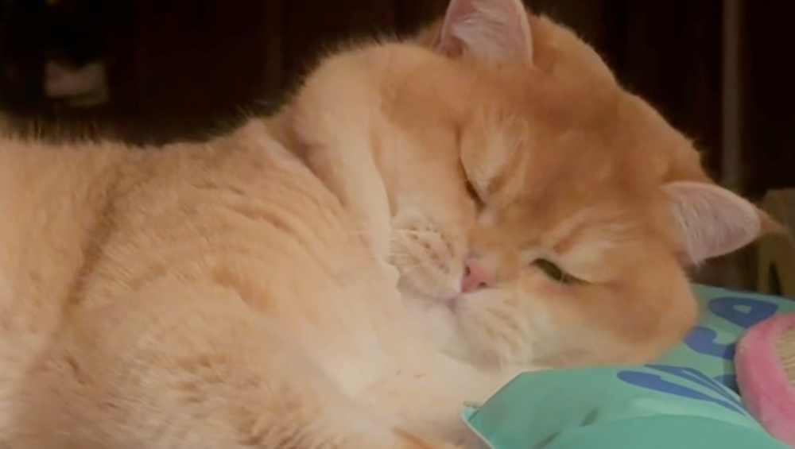 | 165 | 2026-05-11 |
| [哈基米😭好似喵😄保重喵😭好似喵😡———梦魇平衡性调整](https://www.bilibili.com/video/BV1zs5b6SEjC) | 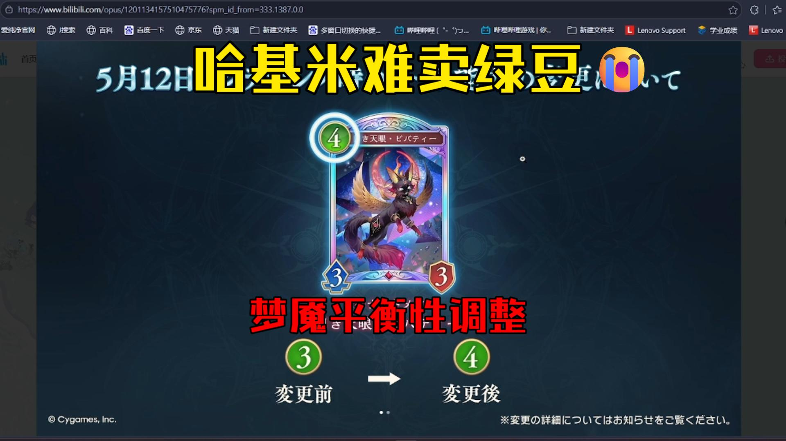 | 2004 | 2026-05-11 |
| [哈基米力工的复仇](https://www.bilibili.com/video/BV1fH5b6DE6r) | 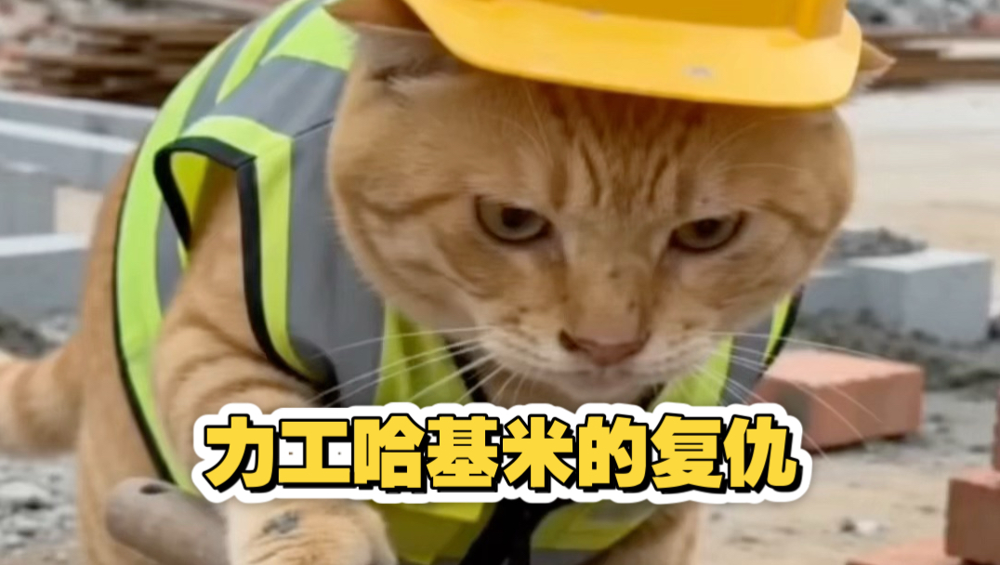 | 2318 | 2026-05-11 |
| [【艾尔莎】哈基莎也要曼波曼波～](https://www.bilibili.com/video/BV1v85b6jEiu) |  | 513 | 2026-05-11 |
| [星野也要哈基米南北绿豆~🥵](https://www.bilibili.com/video/BV1Pg5b6FEfB) |  | 3855 | 2026-05-11 |
| [助眠向沉浸搜刮实验室【哈基米音乐注意】](https://www.bilibili.com/video/BV12n5x6REUE) | 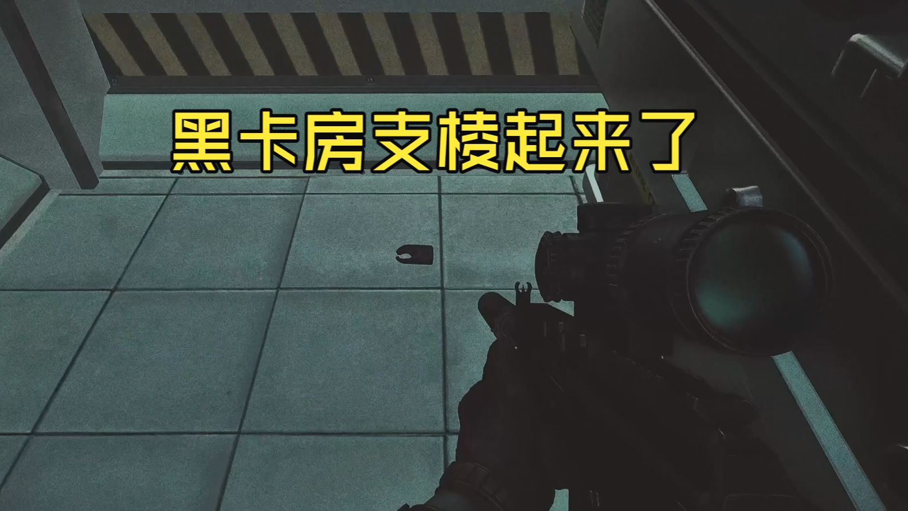 | 148 | 2026-05-11 |
| [我变成哈基米被普罗米娅撸了？](https://www.bilibili.com/video/BV1mp5x6WEMm) |  | 3223 | 2026-05-11 |
| [哈基米那没路躲，最积极的平衡调整](https://www.bilibili.com/video/BV14J5x6xEqA) |  | 4270 | 2026-05-11 |
| [人类大战哈基米](https://www.bilibili.com/video/BV1gR5x6aEEP) | 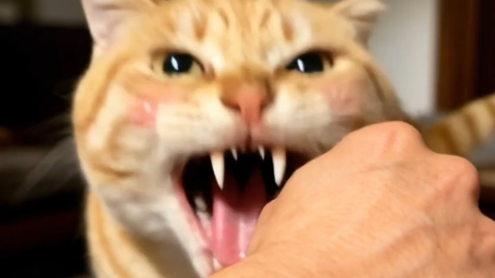 | 371 | 2026-05-11 |
| [当我用哈基米找到王权之心](https://www.bilibili.com/video/BV1uo5x6cErq) | 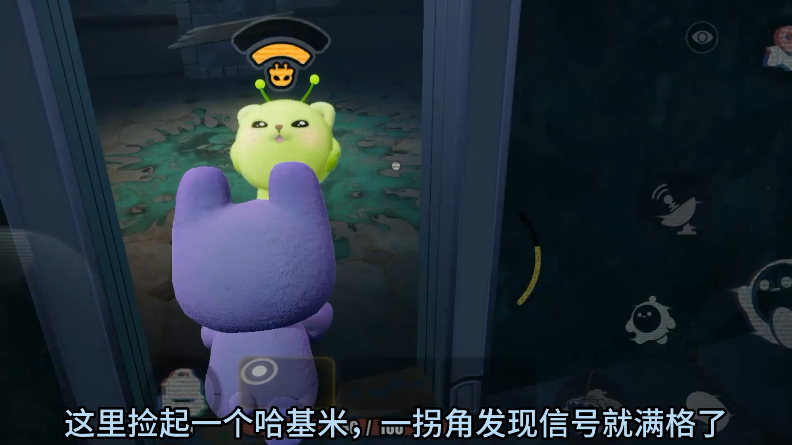 | 578 | 2026-05-11 |
| [哈基米是睡大觉的意思](https://www.bilibili.com/video/BV1tc546tEui) |  | 922 | 2026-05-11 |
| [年轻的哈基米渴望永垂不朽](https://www.bilibili.com/video/BV1Vm5x6TEmc) | 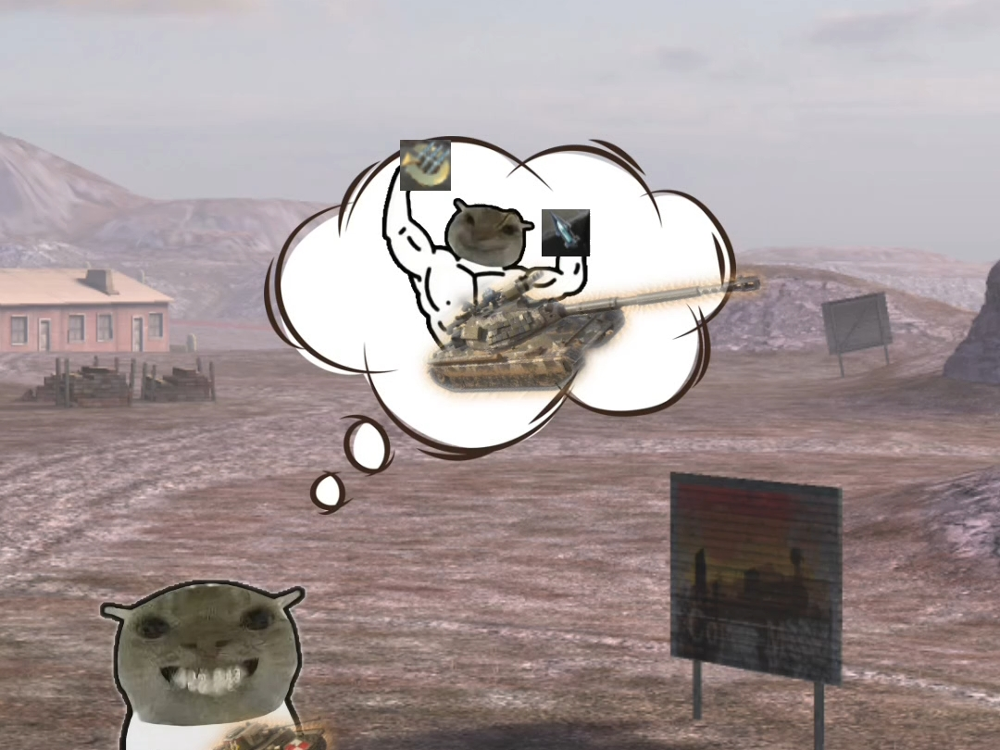 | 81 | 2026-05-11 |
| [猫儿这个打印基](https://www.bilibili.com/video/BV198546qEch) | 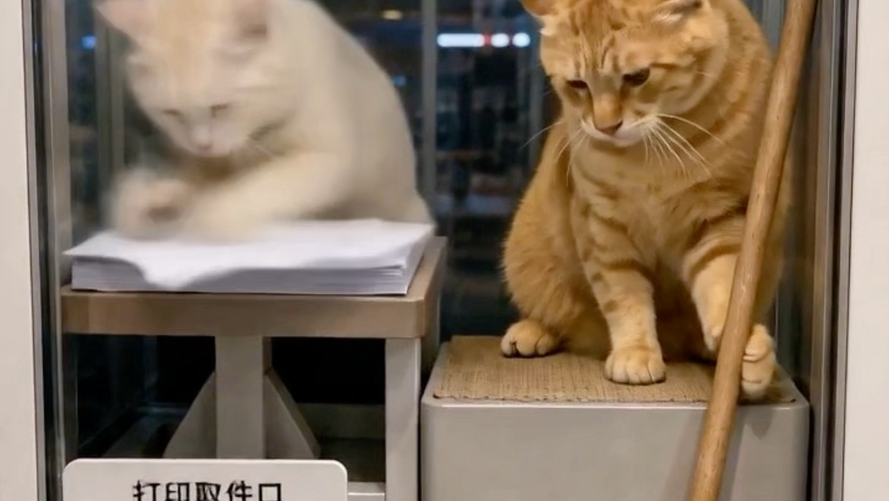 | 11.9万 | 2026-05-11 |
| [？！鼠鼠拯救计划！？](https://www.bilibili.com/video/BV15r5W6YEz1) |  | 91.5万 | 2026-05-11 |
| [原曲不使用哈基米音mad集   &quot;消逝&quot;](https://www.bilibili.com/video/BV1d4546zE7V) | 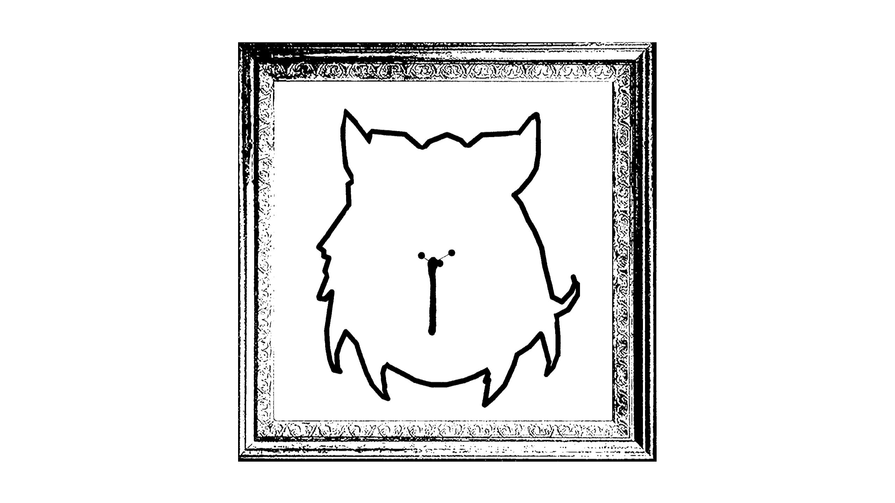 | 217 | 2026-05-11 |
| [谁偷走了公园里的流浪猫？](https://www.bilibili.com/video/BV1PT546WE9z) | 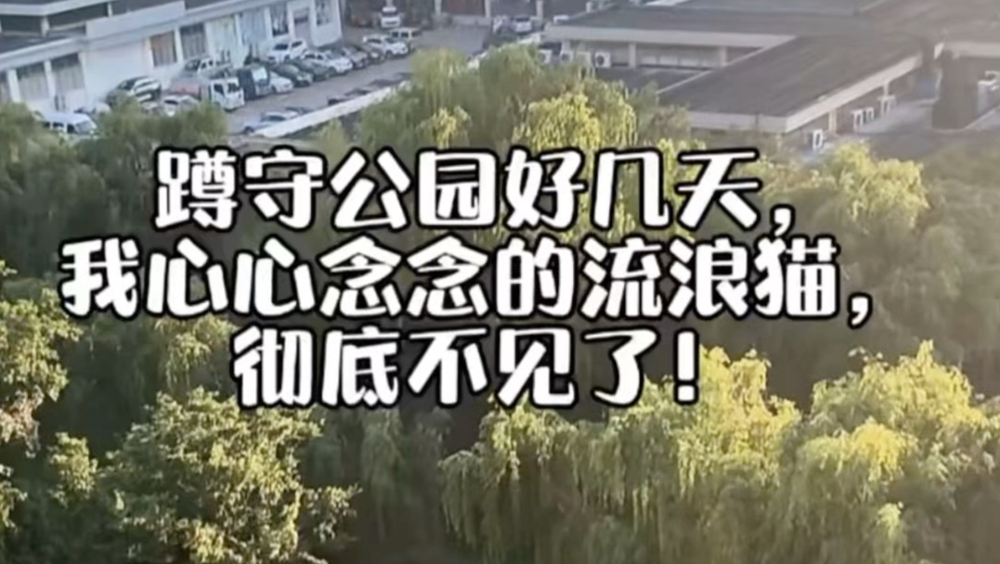 | 519 | 2026-05-11 |
| [这猫越来越神了，但是我已经掌握了哈基米代码。](https://www.bilibili.com/video/BV1n75462ExL) | 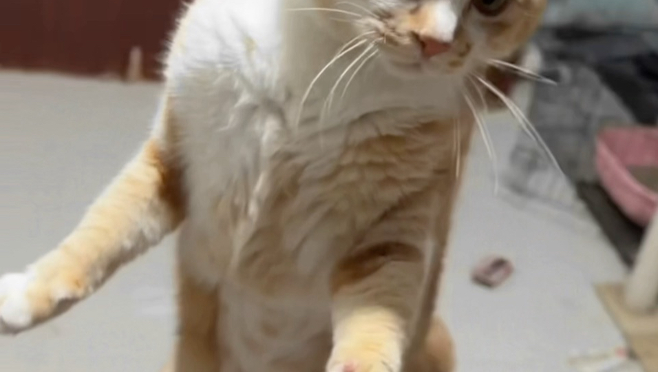 | 3.7万 | 2026-05-11 |
| [停车救哈基米，被逃跑了.](https://www.bilibili.com/video/BV1F5546UE2C) | 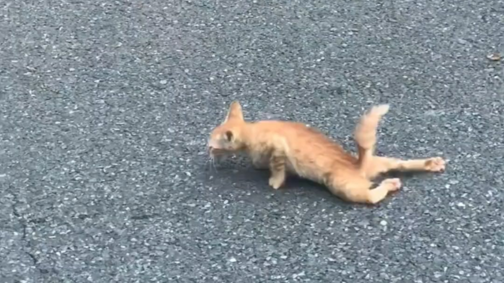 | 3278 | 2026-05-11 |
| [哈基米也要埃及摇！【赛飞儿】](https://www.bilibili.com/video/BV11U546sEk8) |  | 5035 | 2026-05-11 |
| [出动！护送可爱哈基米回家啦](https://www.bilibili.com/video/BV1uR5W69EM8) |  | 3622 | 2026-05-11 |
| [校园里惊现蛇，人群无人应战，派出一只橘猫](https://www.bilibili.com/video/BV1Uz546hECu) | 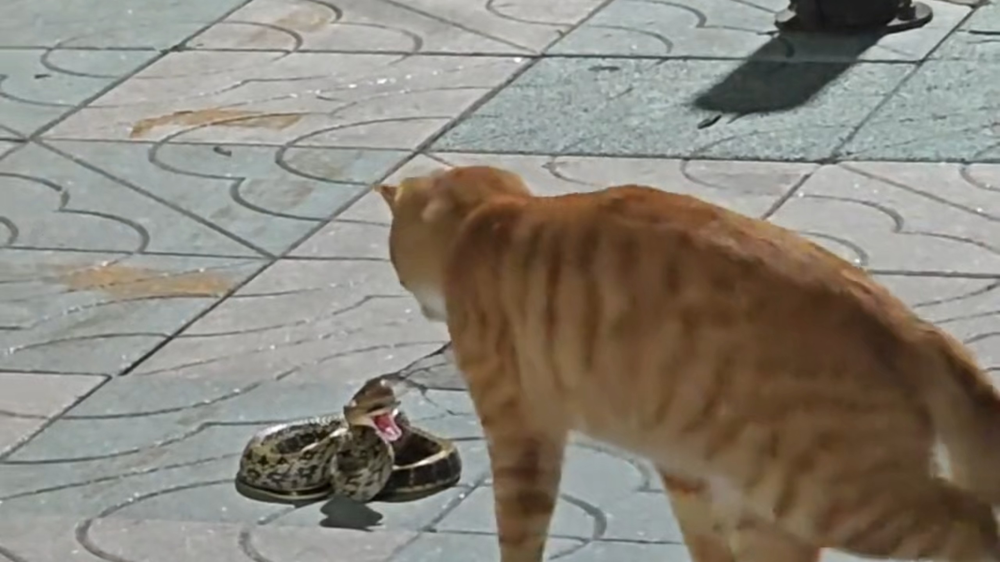 | 54.6万 | 2026-05-11 |
| [🐱🐱双箭头哈基米🐱🐱（所有收益用于购买正版）](https://www.bilibili.com/video/BV1bo5W6pEiq) |  | 3647 | 2026-05-11 |
| [[PVZ2返茂版]第20期返场回周挑战(禁叶) 野火哈基米之一秒六哈😼-Forbidden Knowledge(禁忌知识)](https://www.bilibili.com/video/BV1wJ92BvEVh) |  | 551 | 2026-05-11 |
| [猫羽雫也要哈基米](https://www.bilibili.com/video/BV1h95W6sEGK) |  | 244 | 2026-05-11 |
| [塔菲也要哈基米](https://www.bilibili.com/video/BV1TF5s6nEwC) |  | 386 | 2026-05-11 |
| [往事只能曼波](https://www.bilibili.com/video/BV15C5W6wEMw) |  | 921 | 2026-05-11 |
| [光合印记哈基米正在猛猛哈气](https://www.bilibili.com/video/BV1vr5W6YELn) |  | 154 | 2026-05-11 |
| [【小果CD】——《蓝莲哈 哈基米有南北绿豆》，果神，家乡的Sakura开了](https://www.bilibili.com/video/BV1Xx5s6aEom) |  | 3169 | 2026-05-11 |
| [哈基米](https://www.bilibili.com/video/BV16Q5s6yEBr) | 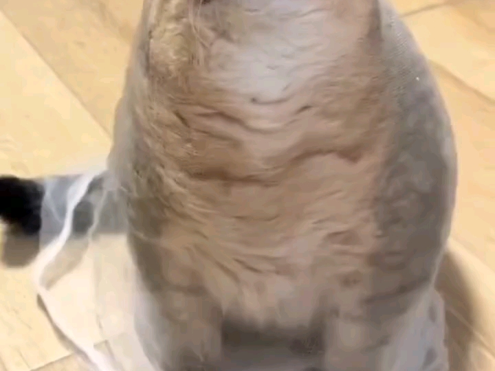 | 222 | 2026-05-11 |
| [MC抽恐图《恐怖哈基米》](https://www.bilibili.com/video/BV1ga5s6bEvi) |  | 66 | 2026-05-11 |
| [我和哈基米谁更重要](https://www.bilibili.com/video/BV1km5p6zELo) |  | 4811 | 2026-05-11 |
| [【神人杯day11】永远的基米（永远的奥特曼）](https://www.bilibili.com/video/BV1hA5H6DEiT) |  | 1482 | 2026-05-11 |
| [😺【哈基米神人杯Day11】😺 Waiting For Love](https://www.bilibili.com/video/BV1Gz5J6EEea) |  | 1612 | 2026-05-11 |
| [【神人杯Day11】耄骨悚然](https://www.bilibili.com/video/BV1mXRFBEEyC) |  | 5705 | 2026-05-11 |
| [哈基米R99](https://www.bilibili.com/video/BV1UB5s6WEwt) |  | 762 | 2026-05-11 |
| [基米tv之兵粮丸](https://www.bilibili.com/video/BV1pN5p6uEY9) | 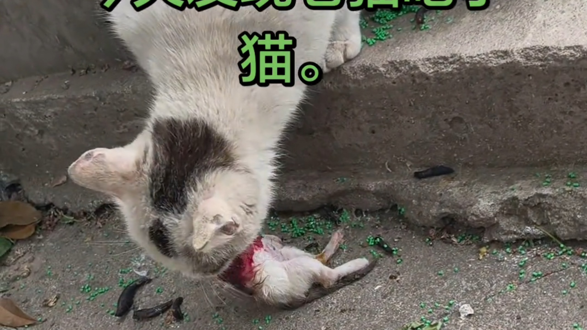 | 294 | 2026-05-11 |
| [哈基米被吓疯了](https://www.bilibili.com/video/BV1pK5p6BEat) |  | 41 | 2026-05-11 |
| [柚子批也要哈基米南北绿豆~](https://www.bilibili.com/video/BV1yq5n6BEGF) |  | 272 | 2026-05-10 |
| [兔兔的哈基米南北绿豆](https://www.bilibili.com/video/BV1rv5j6WE7z) |  | 4024 | 2026-05-10 |
| [哈基米被旧衣服缠住了幸好有好性能帮忙](https://www.bilibili.com/video/BV1cw5E6REPt) | 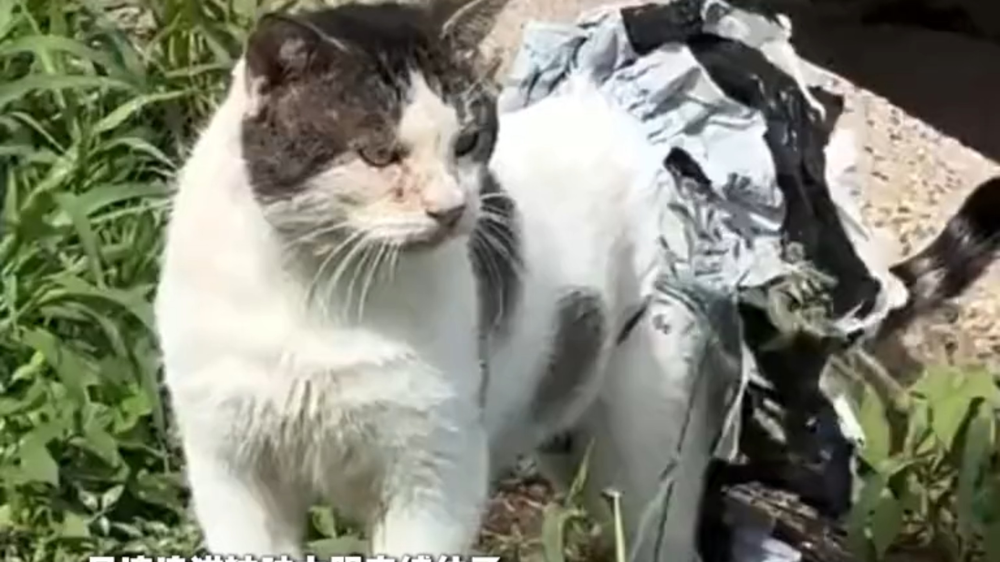 | 1237 | 2026-05-10 |
| [内个内个内个内个内个哈！内个内个内个内个内个内个内个内个内个内个内个内个内个内个内个内个内个内个内个内个内个内个内个内个](https://www.bilibili.com/video/BV1kY5j6RE4H) | 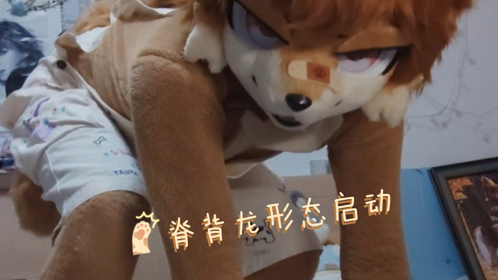 | 3463 | 2026-05-10 |
| [耀圣哈基米，耀圣黯蜜丝滑互转。三康一擦一削抽二](https://www.bilibili.com/video/BV1QsRZBXEd7) | 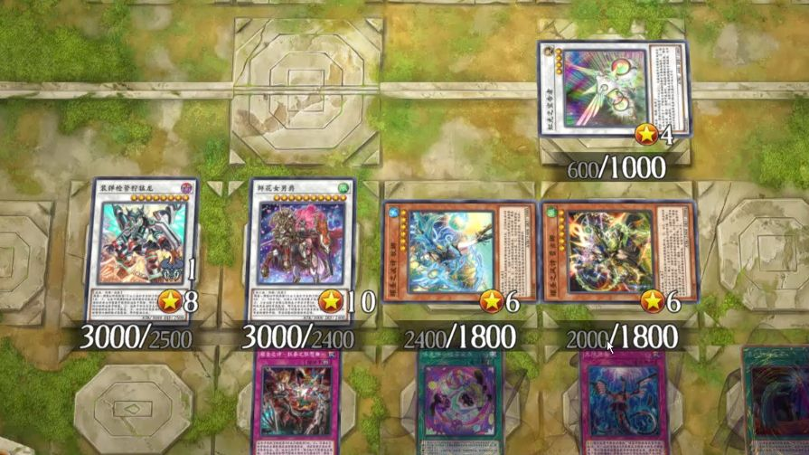 | 1900 | 2026-05-10 |
| [又抓到一只哈基米，怎么处置](https://www.bilibili.com/video/BV156RoB9EXU) |  | 963 | 2026-05-09 |
| [哈基米把笼子坐塌了，然后就应激了](https://www.bilibili.com/video/BV1HJRRB8Er6) | 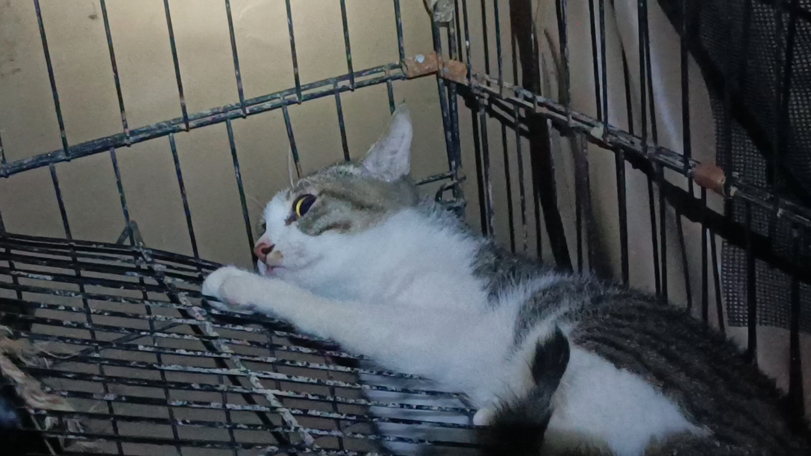 | 4950 | 2026-05-09 |
| [基米TV之尽情的享受吧](https://www.bilibili.com/video/BV197RdBSEYD) | 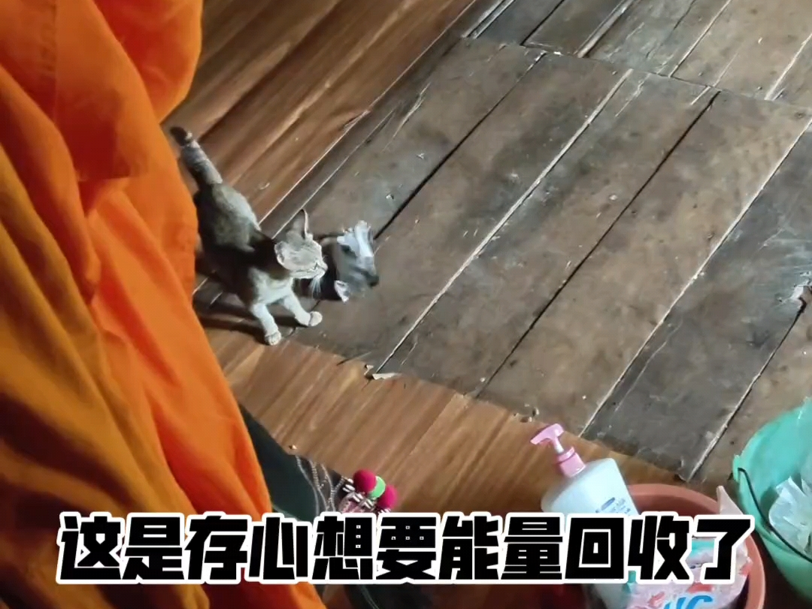 | 9401 | 2026-05-09 |
| [哈基米](https://www.bilibili.com/video/BV15eRXBGExG) |  | 1900 | 2026-05-09 |
| [哈基米射手](https://www.bilibili.com/video/BV1sRRXBZEJQ) | 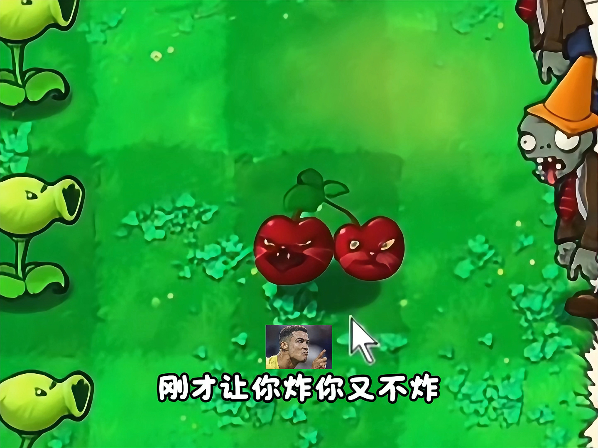 | 1450 | 2026-05-09 |
| [难绷！Wayward听哈基米音乐最后实在绷不住了“我受不了了！”](https://www.bilibili.com/video/BV1i9R9B7EeU) |  | 1.1万 | 2026-05-09 |
| [流浪猫被大狗嚼带去猫星](https://www.bilibili.com/video/BV1kxRmBGE62) | 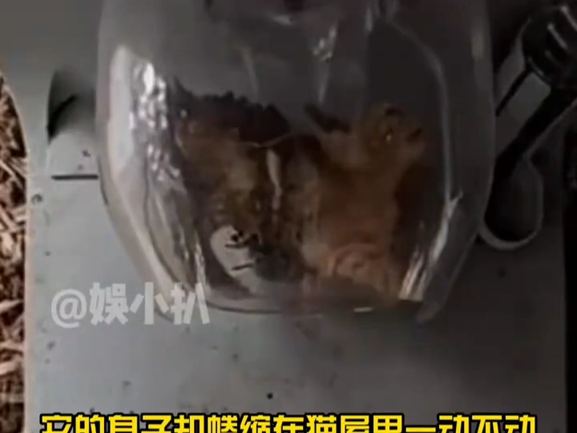 | 1.6万 | 2026-05-09 |
| [【音乐】两只基米](https://www.bilibili.com/video/BV1FFRQB2Ezc) | 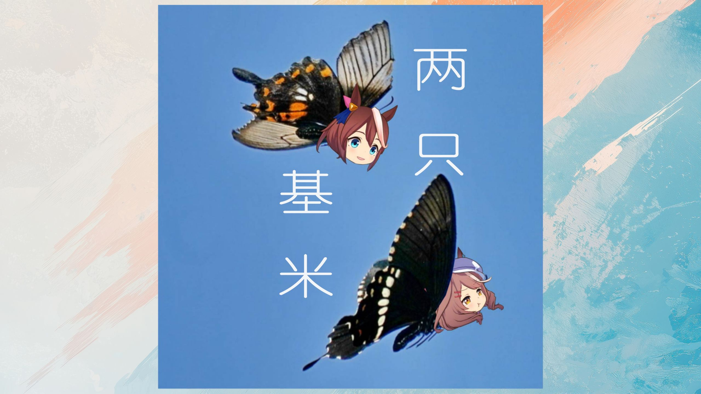 | 283 | 2026-05-09 |
| [哈基米牌充电基](https://www.bilibili.com/video/BV15GRQBBE47) | 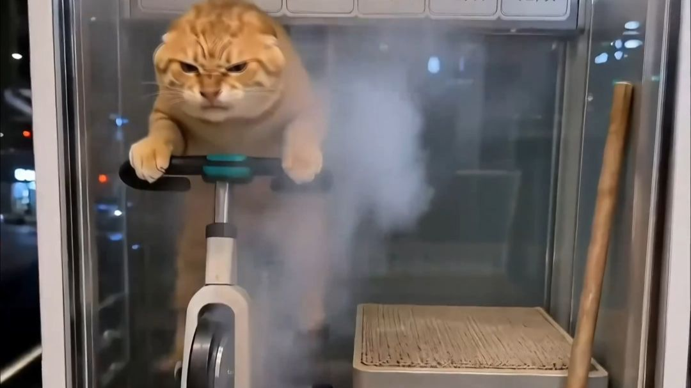 | 2.0万 | 2026-05-09 |
| [速度狂魔，攻防矛盾体-新ST哈基米！新传奇强度抢先看#实况足球手游 #易球成名计划  #实况足球online](https://www.bilibili.com/video/BV1noRDBUEoX) |  | 1789 | 2026-05-09 |
| [人，咪被困在了哈基米沙漠了，救救我](https://www.bilibili.com/video/BV1yaRQB9EvE) |  | 4.7万 | 2026-05-09 |
| [beauty and a 基米 🎵](https://www.bilibili.com/video/BV1JXduBPEdQ) |  | 6524 | 2026-05-09 |
| [【哈基米神人杯day9】那天小鱼了](https://www.bilibili.com/video/BV16XdFBGEdV) |  | 1489 | 2026-05-09 |
| [一秒不用剪](https://www.bilibili.com/video/BV1HeRSB1EN7) | 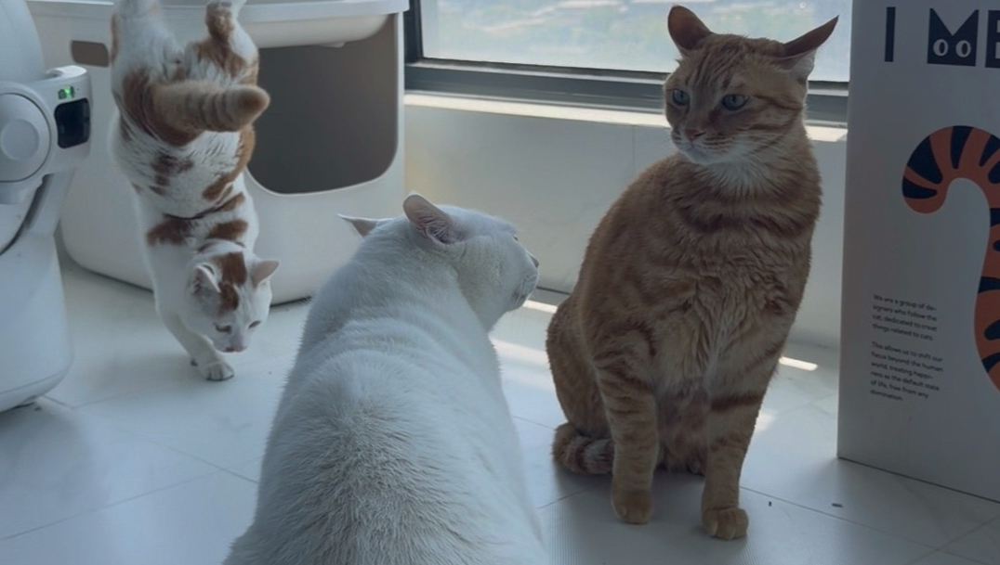 | 318.3万 | 2026-05-09 |
| [你是说前点站了一个BOSS？](https://www.bilibili.com/video/BV1AyR2B3EUH) | 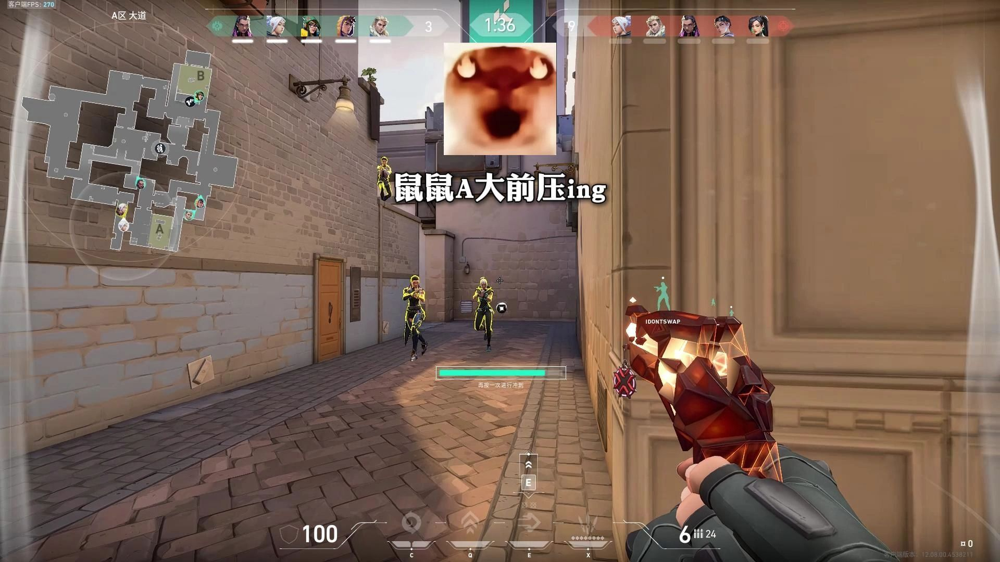 | 26.7万 | 2026-05-09 |
| [你是我的哆啦A梦-AI](https://www.bilibili.com/video/BV14rd3BJEDV) |  | 249.0万 | 2026-05-09 |
| [刚在网上刷到，村里面就用上了哈哈哈哈哈哈就](https://www.bilibili.com/video/BV1vrRmBwE4G) | 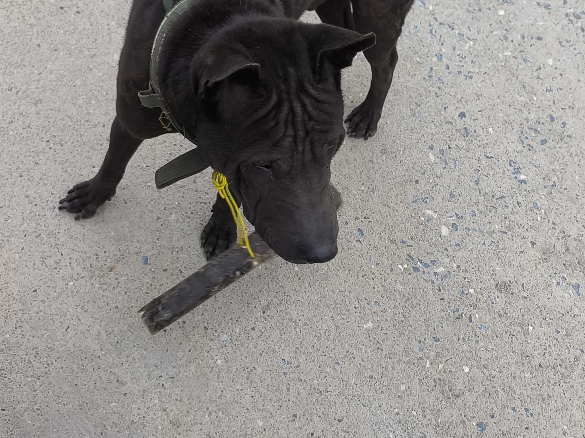 | 36.2万 | 2026-05-08 |
| [【基米TV】逃跑代码+干饭代码+哈气代码 共同执行的结果](https://www.bilibili.com/video/BV1wSduBTEsT) | 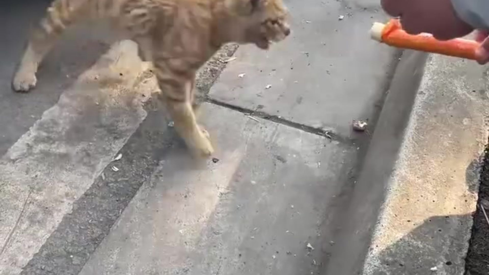 | 2828 | 2026-05-08 |
| [丑橘基米文件](https://www.bilibili.com/video/BV1JedgBKE8c) | 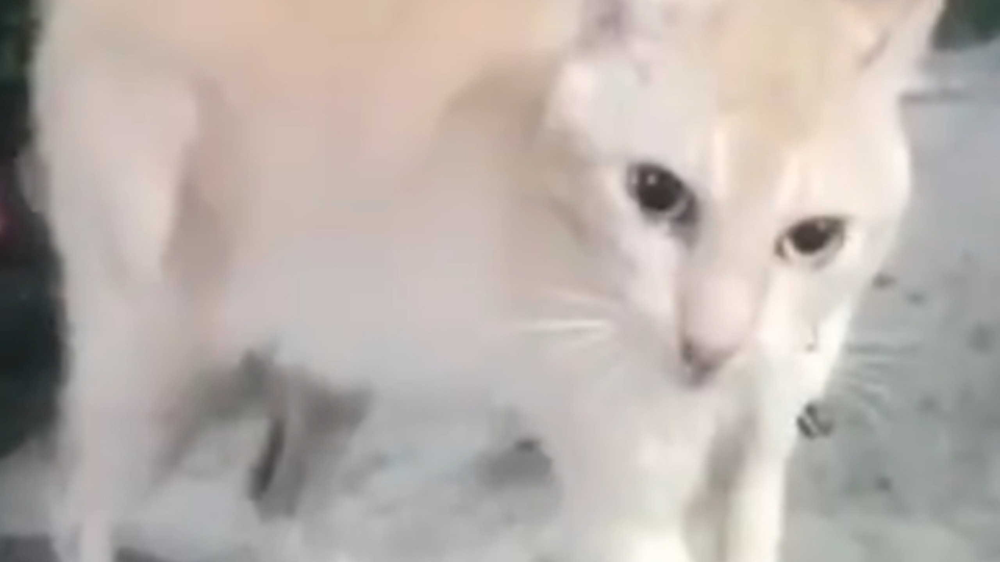 | 3498 | 2026-05-08 |
| [我笑的好崩溃，怎么突然开始舔毛了？](https://www.bilibili.com/video/BV1UZdgBUEBs) | 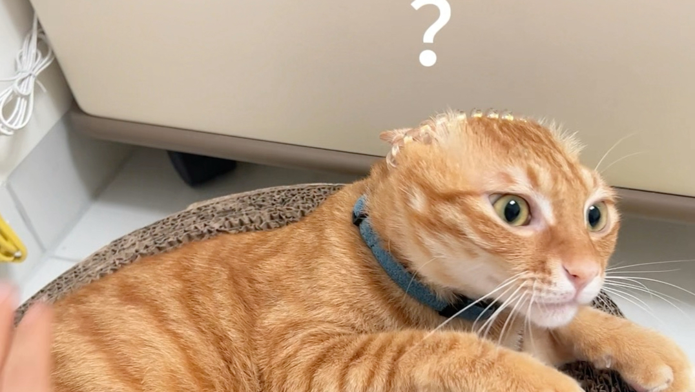 | 179.1万 | 2026-05-08 |
| [丑橘不屑](https://www.bilibili.com/video/BV17vdMBoE2q) | 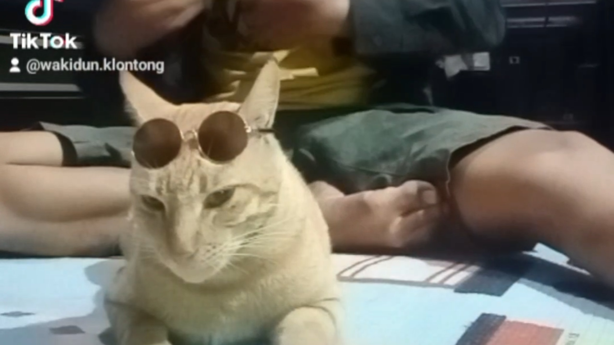 | 7442 | 2026-05-08 |
| [哈气=吃的](https://www.bilibili.com/video/BV1USdKBBEcE) | 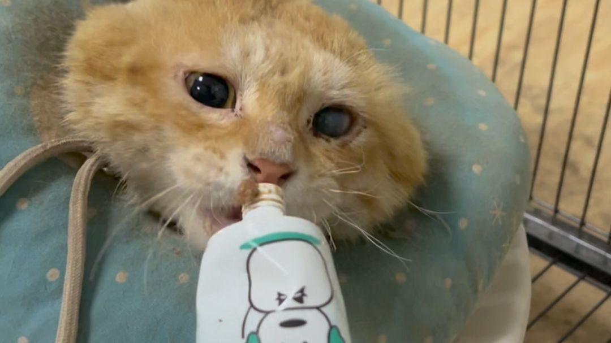 | 6863 | 2026-05-08 |
| [“  哈 基 人 爱 上 哈 基 仙 ! ? ”](https://www.bilibili.com/video/BV1TUdPBaEe2) |  | 4.1万 | 2026-05-07 |
| [耄耋忍气吞声【哈基动物园286期】](https://www.bilibili.com/video/BV1obdPB5E65) |  | 6656 | 2026-05-07 |
| [大型纪录片《哈基米喜欢成为猫饼》](https://www.bilibili.com/video/BV1AudwBnEQL) | 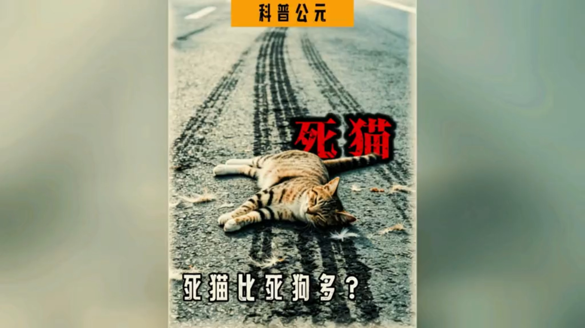 | 3.0万 | 2026-05-07 |
| [都是同行...便宜点呗！！](https://www.bilibili.com/video/BV1XGdABTE9W) |  | 15.7万 | 2026-05-07 |
| [哇~还有基饿游戏](https://www.bilibili.com/video/BV15XRhBSEbD) | 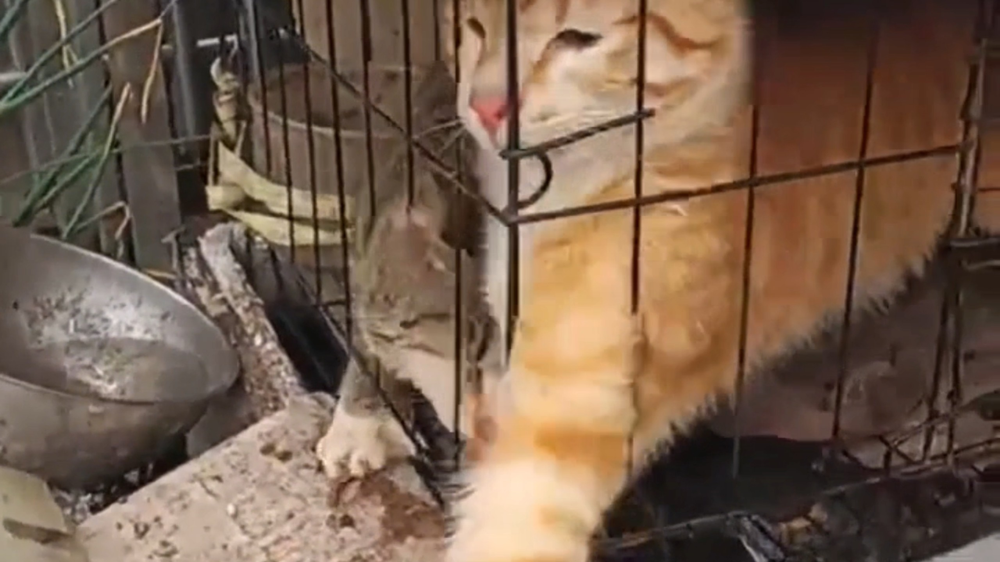 | 3.4万 | 2026-05-07 |
| [细长霸王咪](https://www.bilibili.com/video/BV1MdRsBWECn) | 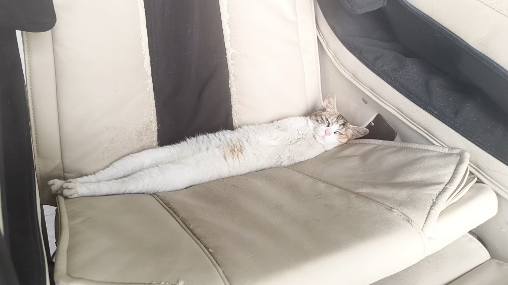 | 1471 | 2026-05-06 |
| [朱门基米臭，路有哈基骨](https://www.bilibili.com/video/BV1MLRiBnEZB) |  | 449 | 2026-05-04 |
| [小爱遇到了奇怪的自来熟猫猫](https://www.bilibili.com/video/BV1zLRqBuELa) |  | 20.4万 | 2026-05-04 |
| [反虐tv](https://www.bilibili.com/video/BV1MMReB7EYA) |  | 11.6万 | 2026-05-04 |
| [车库里发现的小基米](https://www.bilibili.com/video/BV1w79ZBvEVF) | 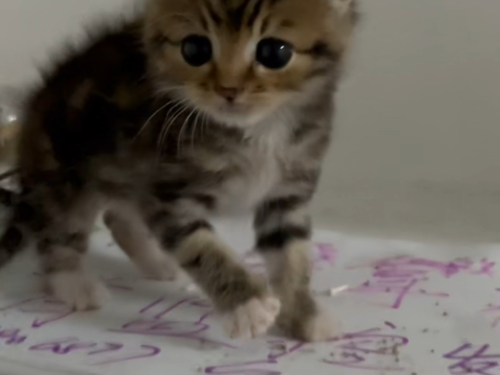 | 2.9万 | 2026-05-03 |
| [小火耄护食测试](https://www.bilibili.com/video/BV1hR9RBkEi9) | 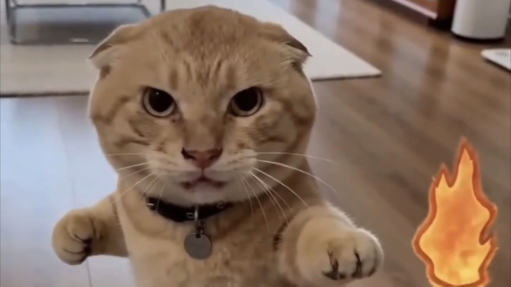 | 8474 | 2026-05-03 |
| [基米小学：meowl变成了咯咯哒，但是生气形态](https://www.bilibili.com/video/BV1qyQhB5ErL) | 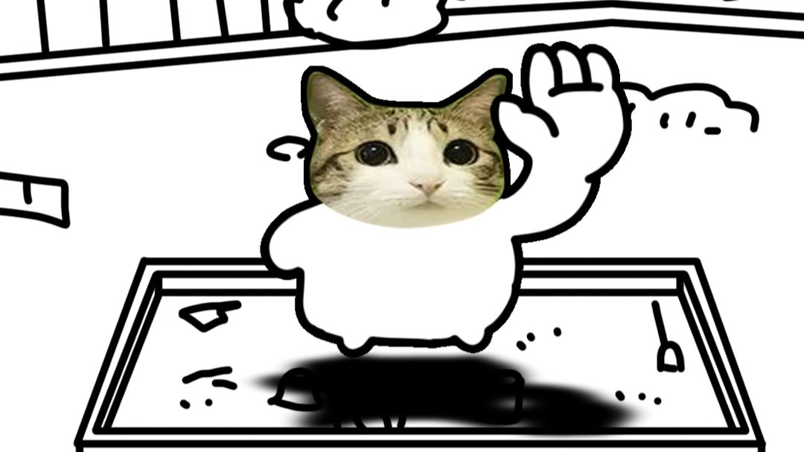 | 5.6万 | 2026-04-13 |
| [这是猫啊【哈基动物园260期】](https://www.bilibili.com/video/BV1nUDkB7EQZ) | 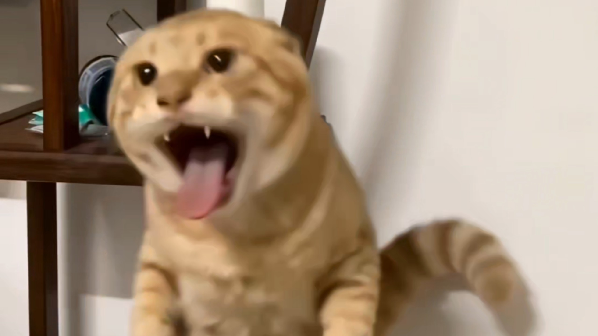 | 1.1万 | 2026-04-11 |
| [消失的宝物？不！原来是哈基咪的宝藏](https://www.bilibili.com/video/BV1qADPBeE1y) | 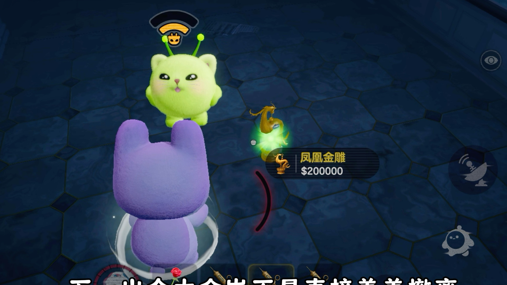 | 19.3万 | 2026-04-04 |
| [哈基咪带你找大金](https://www.bilibili.com/video/BV1H5DABME3t) |  | 6.7万 | 2026-04-04 |
| [哈基米巧施连环计，哈基妻误入断头台](https://www.bilibili.com/video/BV1NE6CBhEbj) |  | 17.9万 | 2026-02-01 |
| [可爱小猫咪](https://www.bilibili.com/video/BV1CpqmBYEJ9) |  | 52.9万 | 2025-12-21 |
| [蠢猫TV之我推的孩子](https://www.bilibili.com/video/BV1Qqq8BFEv9) | 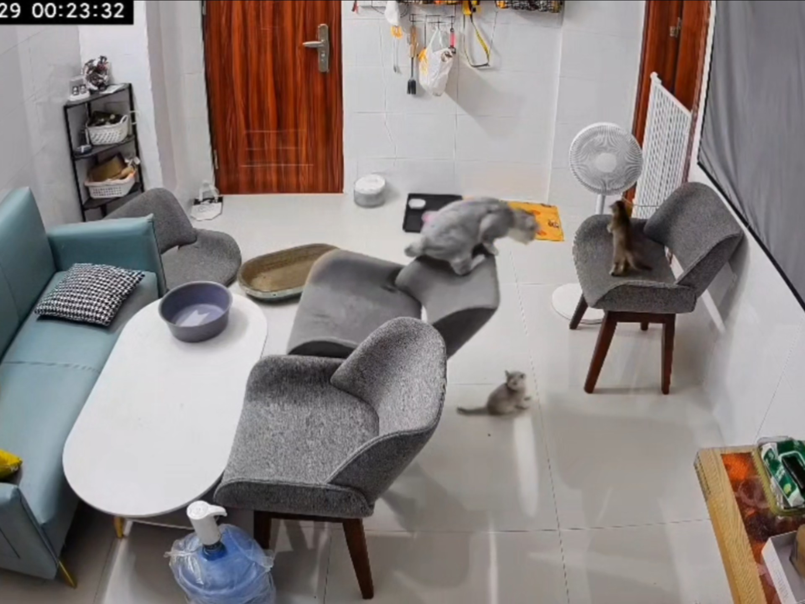 | 23.6万 | 2025-12-16 |
| [小猫耳机](https://www.bilibili.com/video/BV18hmWBKEkv) | 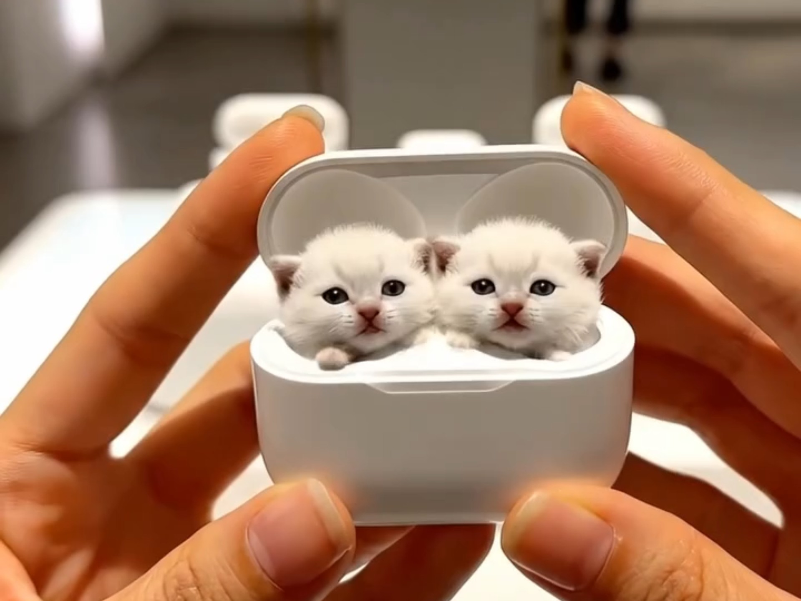 | 62.3万 | 2025-12-09 |
| [僵僵也要阿米嘎蒂朵喵喵~](https://www.bilibili.com/video/BV1oF2rB4EMG) |  | 61.3万 | 2025-12-08 |
| [傻基米](https://www.bilibili.com/video/BV1Zu1rB4Esu) | 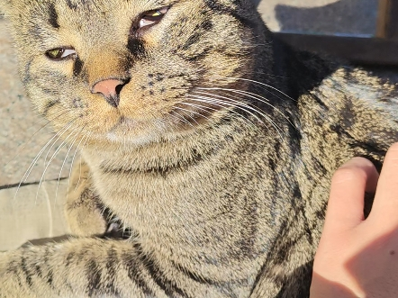 | 1.9万 | 2025-11-04 |
| [正打着架呢回头看见一个无视我静步吃东西的哈基米](https://www.bilibili.com/video/BV1aRxVzVEfa) | 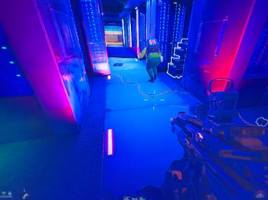 | 53.0万 | 2025-10-06 |
| [跳楼基](https://www.bilibili.com/video/BV1BxpEzoErj) | 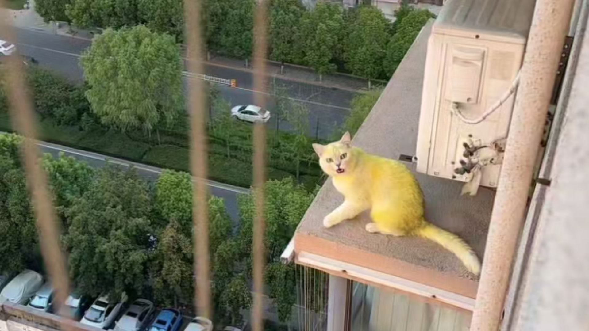 | 37.1万 | 2025-09-13 |
| [基咪受难记](https://www.bilibili.com/video/BV1LWHSziEjU) |  | 15.1万 | 2025-09-10 |
| [哈基米入侵地球⚡️](https://www.bilibili.com/video/BV1YqHyzHEE7) | 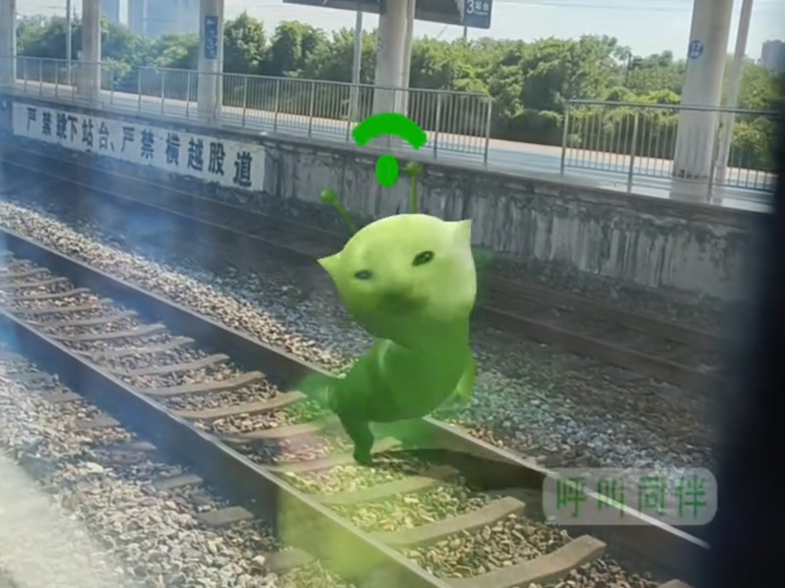 | 7.2万 | 2025-09-09 |
| [硬闯喵星失败之按表走的](https://www.bilibili.com/video/BV1ZraNzrEHJ) | 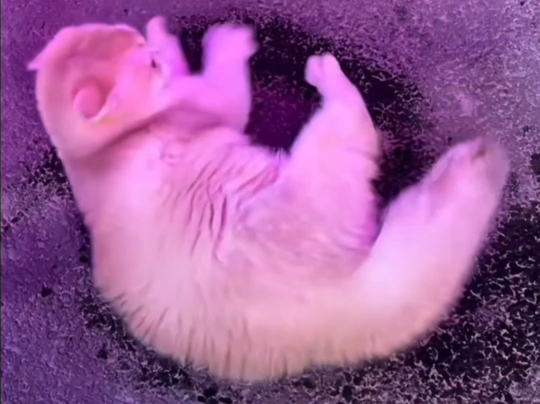 | 2.4万 | 2025-09-02 |
| [孤独的哈基米实战结算](https://www.bilibili.com/video/BV1t2wyeTEWF) | 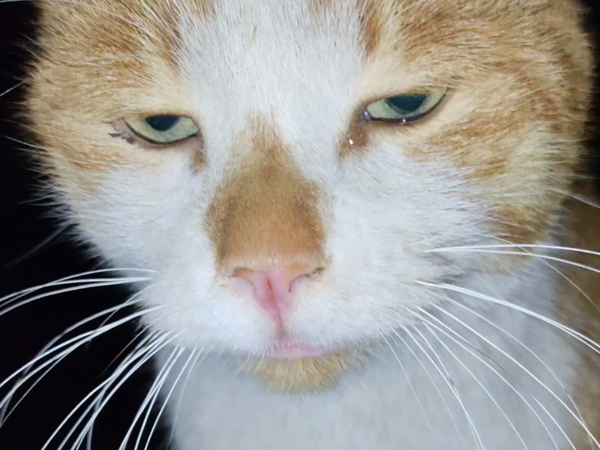 | 61.1万 | 2025-01-19 |

---
*最后更新: 2026-05-12 03:21:32 (自动生成)*
*数据来源: [Bilibili](https://www.bilibili.com)*

## 使用说明

运行以下命令更新视频列表:
```bash
python3 fetch_hajimi_videos.py
```
