# awesome-hajimi
collections of hajimi (哈基米 in Chinese) on the Internet.

## 视频列表 (Video List)

| 视频标题 (Title) | 封面 | 播放量 (Views) | 发布日期 (Date) |
|---|---|---|---|
| [哈基米面对天启四骑士](https://www.bilibili.com/video/BV1CBEp6nExo) | 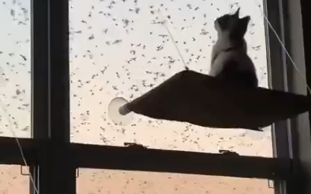 | 434 | 2026-06-07 |
| [哈基米这个嘴馋](https://www.bilibili.com/video/BV1gcEW6vEmi) | 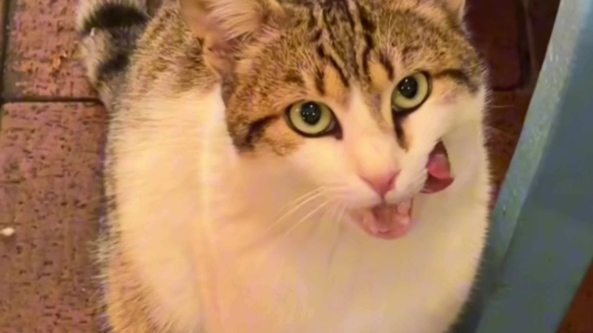 | 1474 | 2026-06-06 |
| [哈基米遛哈基米](https://www.bilibili.com/video/BV1gcEW6vEQe) | 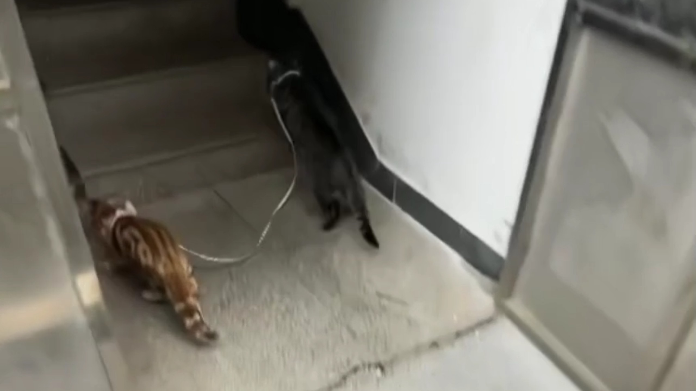 | 1038 | 2026-06-06 |
| [哈基米又开嚼了](https://www.bilibili.com/video/BV1FPEp6yEMQ) | 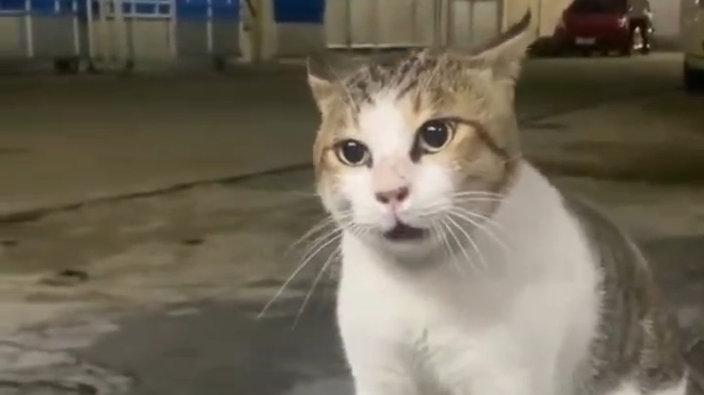 | 4933 | 2026-06-06 |
| [哈基米跑法！猫梦浮屋青耀1.05.52！](https://www.bilibili.com/video/BV1wLEJ6zE4S) |  | 1666 | 2026-06-06 |
| [明天高考了，今天抢夺大屏幕放哈基米（还有念张师）](https://www.bilibili.com/video/BV1c7EJ6ME2J) |  | 980 | 2026-06-06 |
| [哈基米：再次追逐夏天（Remaster）](https://www.bilibili.com/video/BV1wGEJ6rEws) |  | 556 | 2026-06-06 |
| [依旧零帧强普这一块](https://www.bilibili.com/video/BV1A5EJ6gEwh) | 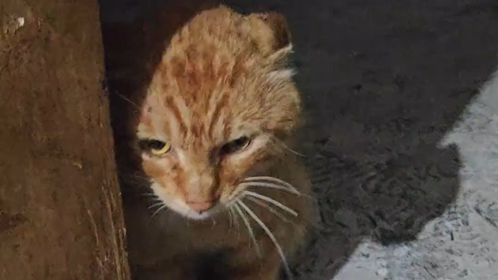 | 3626 | 2026-06-06 |
| [哈基米](https://www.bilibili.com/video/BV1kDEJ6yEdf) |  | 110 | 2026-06-06 |
| [往 事 只 能 哈 基（小唱一段~）](https://www.bilibili.com/video/BV1XhEJ6tExG) |  | 402 | 2026-06-06 |
| [全家猫都感染了嗜血支原体！但妈又比死神先到一步](https://www.bilibili.com/video/BV1SqEJ6WEsF) | 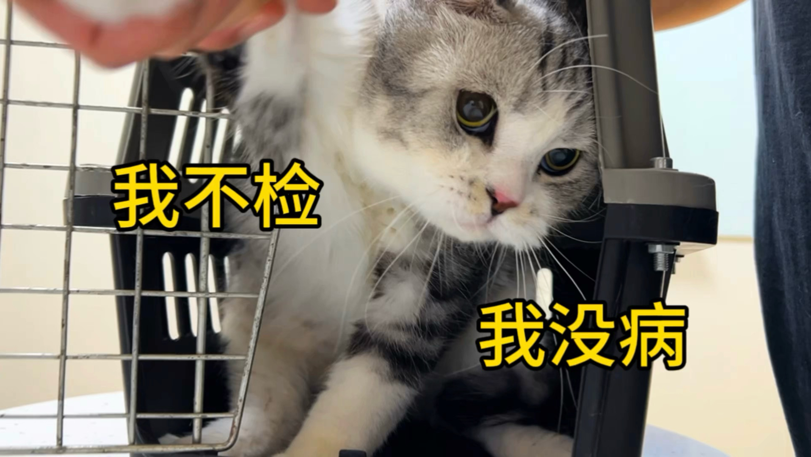 | 5.6万 | 2026-06-06 |
| [一定要相信哈基米的话](https://www.bilibili.com/video/BV158EJ6FErj) | 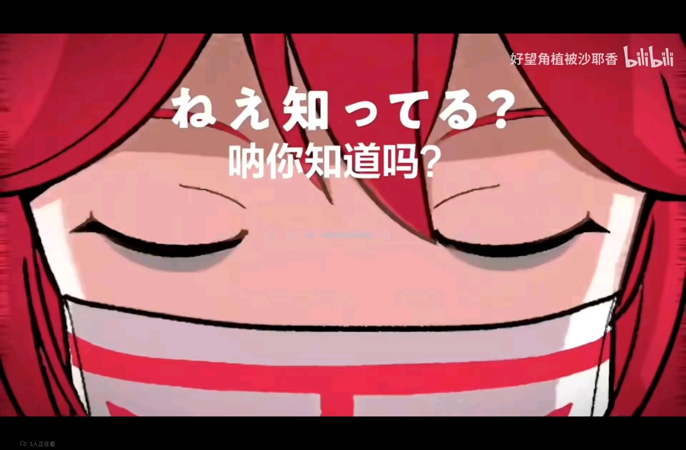 | 7 | 2026-06-06 |
| [圆头洋耄耋](https://www.bilibili.com/video/BV1juEn6YEuU) | 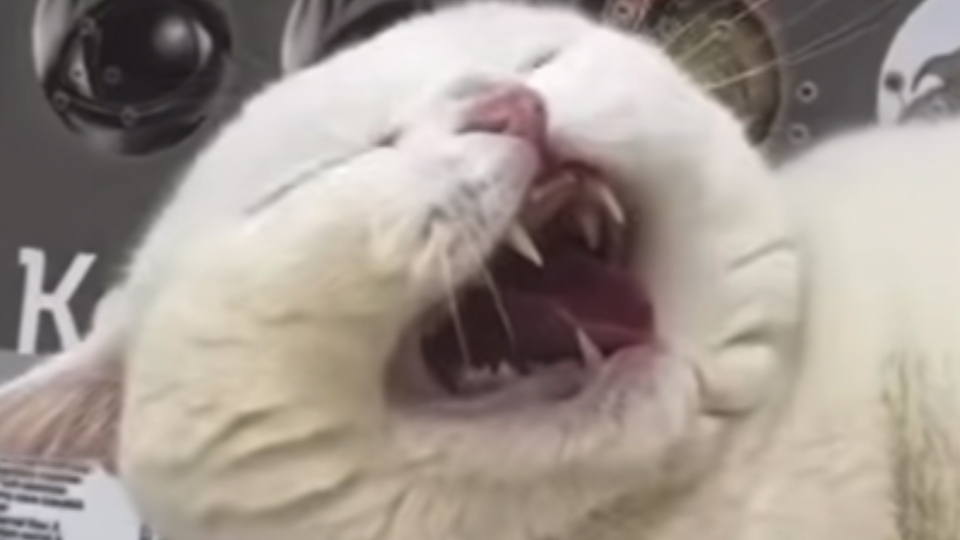 | 716 | 2026-06-06 |
| [小基米退无可退只能哈气了！](https://www.bilibili.com/video/BV1R3En6cEXv) | 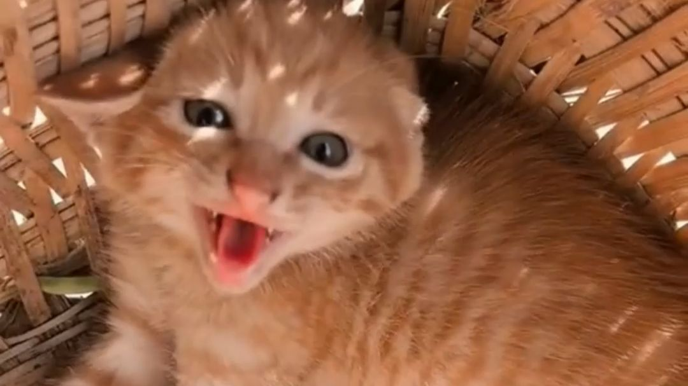 | 1694 | 2026-06-06 |
| [哈基米](https://www.bilibili.com/video/BV1kXEJ6VE7j) |  | 771 | 2026-06-06 |
| [有了猫之后就不是野人了](https://www.bilibili.com/video/BV1BwEn6TEtJ) | 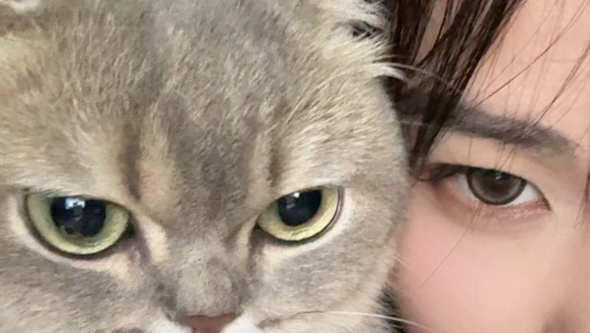 | 2.9万 | 2026-06-06 |
| [听我高歌一曲，往事只能哈基米](https://www.bilibili.com/video/BV1yaEn62E6w) |  | 334 | 2026-06-06 |
| [哈基米助眠丨我真有两把刷子](https://www.bilibili.com/video/BV16F7U6EEPK) | 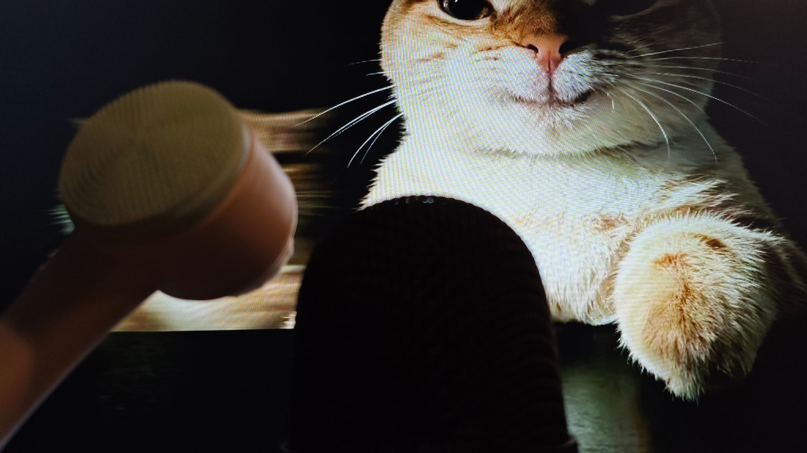 | 2043 | 2026-06-06 |
| [中国人：哈基米南北绿豆~ 日本人：整沉默了...](https://www.bilibili.com/video/BV1847D6BE8p) |  | 2538 | 2026-06-06 |
| [是的，我又被猫捡到了](https://www.bilibili.com/video/BV1n6En63E97) | 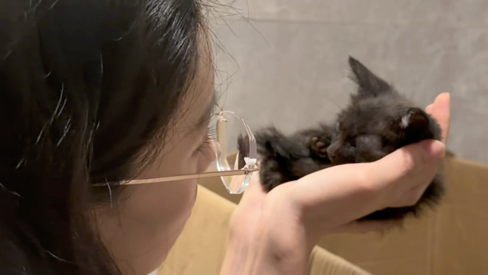 | 6283 | 2026-06-06 |
| [狸花猫：来来来，有种指我头啊！](https://www.bilibili.com/video/BV16qEn6VE93) | 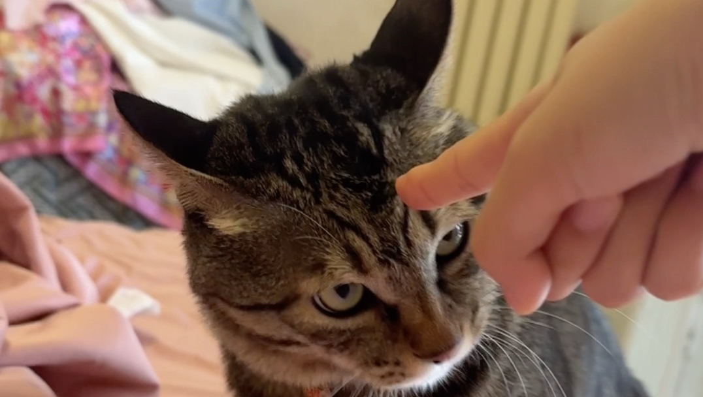 | 1.3万 | 2026-06-06 |
| [東 京 喵 喵](https://www.bilibili.com/video/BV1bJEn6REB6) |  | 555 | 2026-06-06 |
| [哈基米学布鲁斯打猎骨头](https://www.bilibili.com/video/BV14sEn6HET6) | 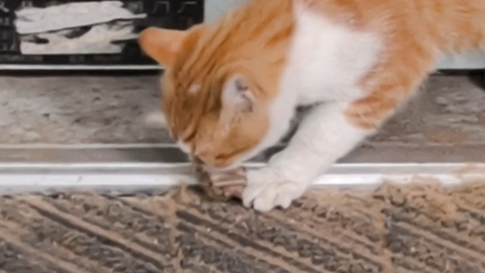 | 585 | 2026-06-06 |
| [【P5X】犹豫抽不抽哈基米？摩尔加纳·星舞战斗全方位展示 星夜服猫猫有没有萌到你呢？女神异闻录夜幕魅影](https://www.bilibili.com/video/BV1W87y6GENA) |  | 1564 | 2026-06-06 |
| [哈基米南北绿豆](https://www.bilibili.com/video/BV1jR7D6JEMA) |  | 2994 | 2026-06-06 |
| [☝🤓点进来的都是神人⚡⚡](https://www.bilibili.com/video/BV1Xn7D6kEWu) |  | 6.8万 | 2026-06-06 |
| [新疆的猫不叫咪咪！叫pixpix是什么梗？【网梗指南】](https://www.bilibili.com/video/BV1qX7D6DEm9) |  | 3477 | 2026-06-06 |
| [收留“落魄小少爷”的第49天](https://www.bilibili.com/video/BV1ed7D6UE6H) | 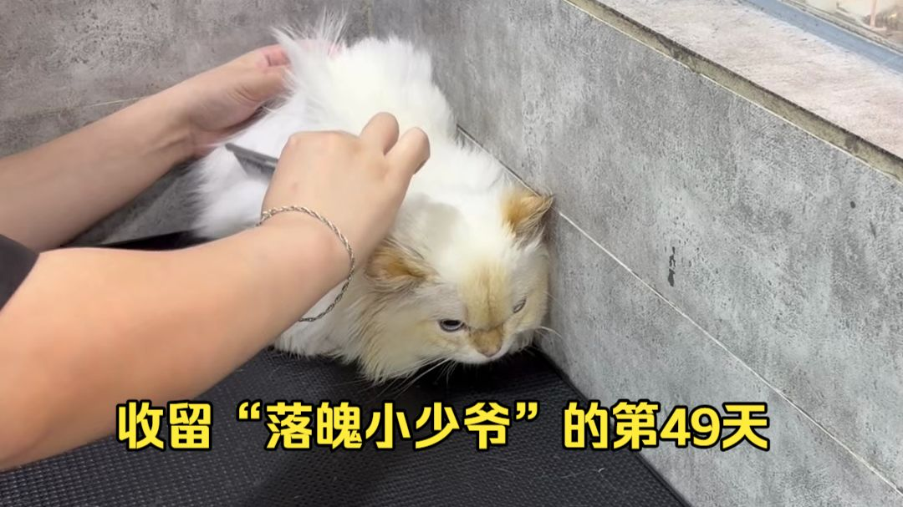 | 1.8万 | 2026-06-06 |
| [哈基米：🐱像素飞基大乱斗（战斗曲）🐱](https://www.bilibili.com/video/BV17Q7D6HEh3) |  | 1814 | 2026-06-06 |
| [【吉星派对】哈基米：问了吗？](https://www.bilibili.com/video/BV1Ld7D6UEQf) |  | 3457 | 2026-06-06 |
| [“哒哒！明天有大事发生你知道不！”](https://www.bilibili.com/video/BV1jd7D6UEKn) |  | 6820 | 2026-06-06 |
| [哈基米这个生死决斗](https://www.bilibili.com/video/BV1EQ7D6HEpd) | 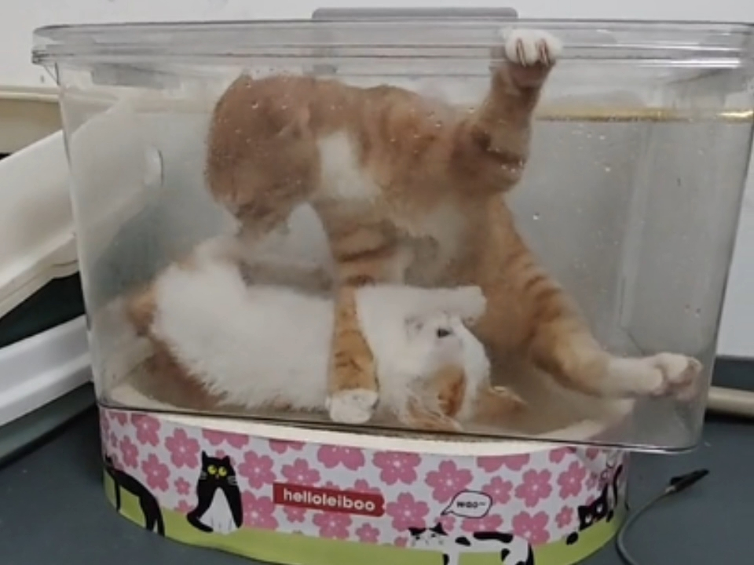 | 4462 | 2026-06-06 |
| [《爱，你》](https://www.bilibili.com/video/BV1Bm7U6jEDZ) | 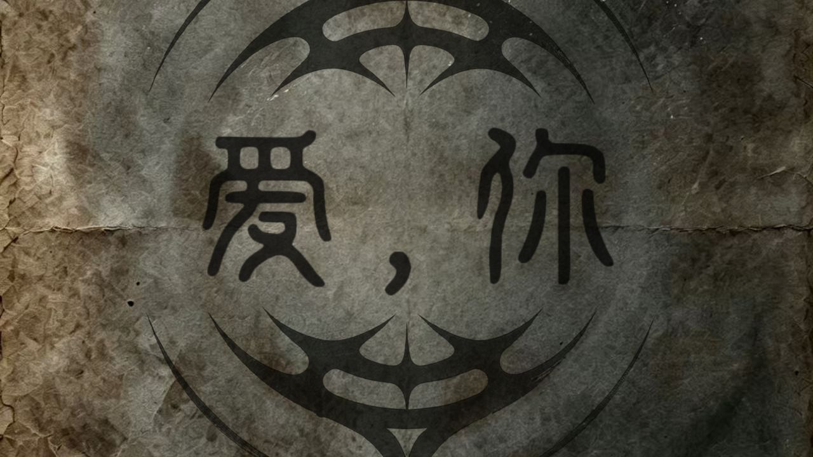 | 52.3万 | 2026-06-06 |
| [我好像找到了猫妈妈藏匿小猫的秘密基地了](https://www.bilibili.com/video/BV1YL7U6MEQw) | 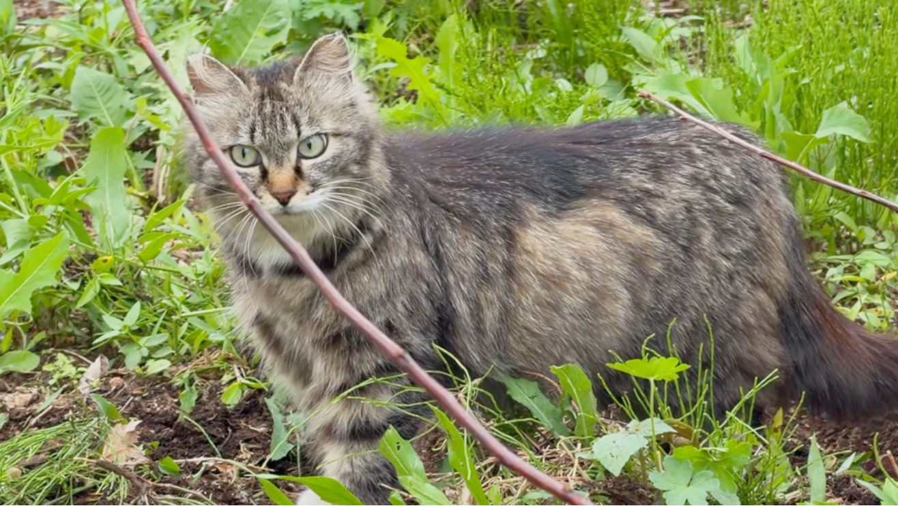 | 7482 | 2026-06-06 |
| [人，咪生是旷野](https://www.bilibili.com/video/BV14F716QEph) | 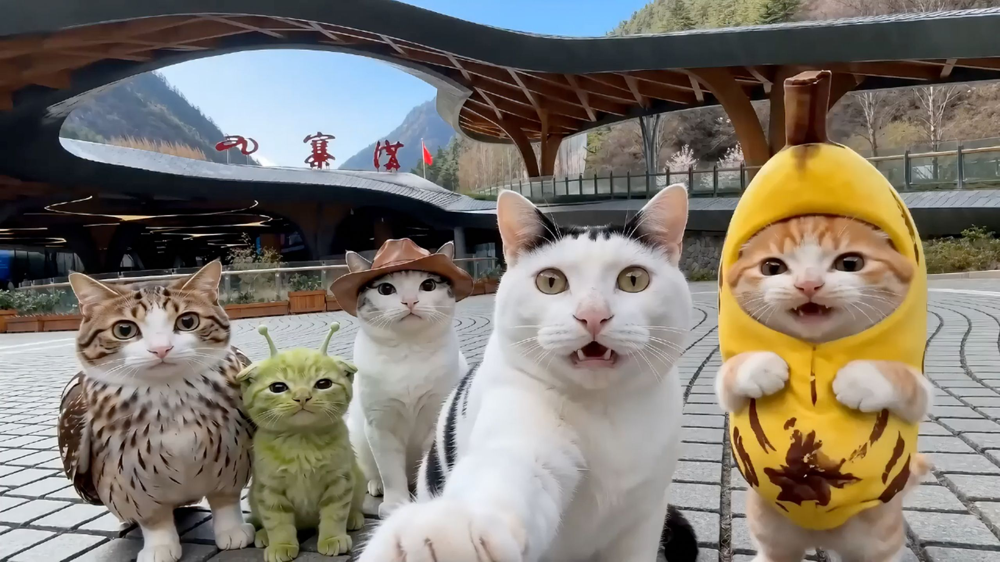 | 2119 | 2026-06-06 |
| [哈基米这个闪现（废稿分享）](https://www.bilibili.com/video/BV1c17D64Epf) |  | 1519 | 2026-06-06 |
| [【坎公小剧场】针对一只哈基米？](https://www.bilibili.com/video/BV1Dy7S6MEPj) |  | 1140 | 2026-06-06 |
| [【真栗】往事只能哈基，哈基米基米基 阿西嘎嘎阿西](https://www.bilibili.com/video/BV1N77Q6eESk) |  | 994 | 2026-06-06 |
| [叮咚鸡哈基米](https://www.bilibili.com/video/BV1Bh7Q6XEmZ) | 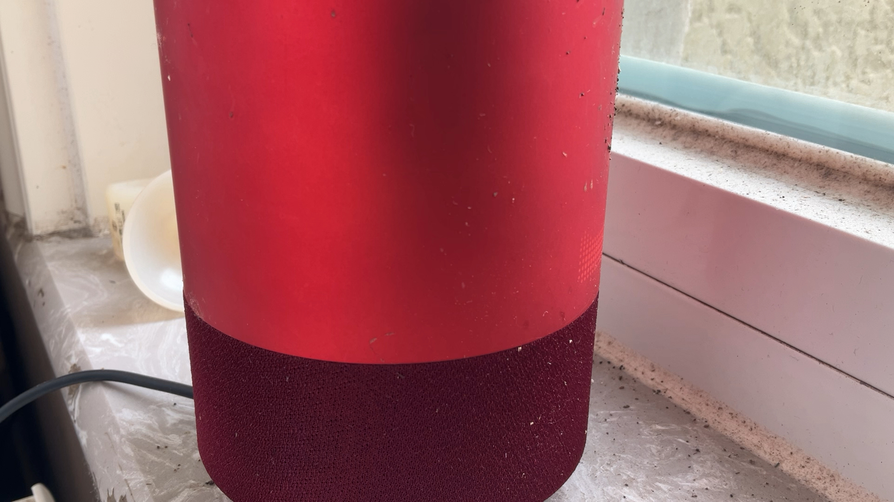 | 49 | 2026-06-06 |
| [别惹没睡好的香蕉猫](https://www.bilibili.com/video/BV1Ze7Q6QENK) |  | 3902 | 2026-06-06 |
| [怡方不圆哈基米往事只能哈基](https://www.bilibili.com/video/BV1gF7S6MEXK) |  | 2082 | 2026-06-06 |
| [哈基米守则喵](https://www.bilibili.com/video/BV1DF7S6ME9W) |  | 618 | 2026-06-06 |
| [少女也要哈基米](https://www.bilibili.com/video/BV1nk7U6SEw5) |  | 531 | 2026-06-06 |
| [很可爱的哈基米](https://www.bilibili.com/video/BV1fW7S6DEXU) | 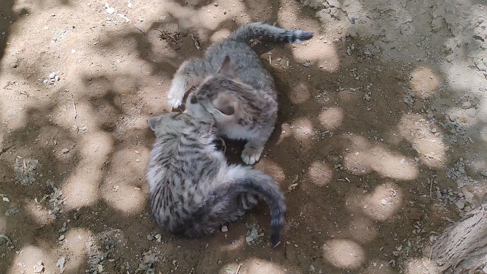 | 23 | 2026-06-06 |
| [哈基米就要大声唱哈基米之歌](https://www.bilibili.com/video/BV1uP7S6vE7U) | 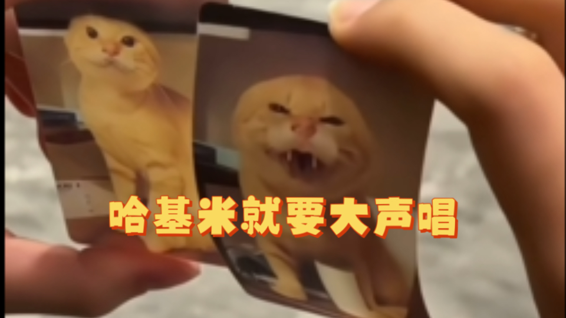 | 405 | 2026-06-06 |
| [野猫来打家猫 被三布鲁斯教训 逃跑又卡墙洞里了 要素过多](https://www.bilibili.com/video/BV1tK7S6PErc) | 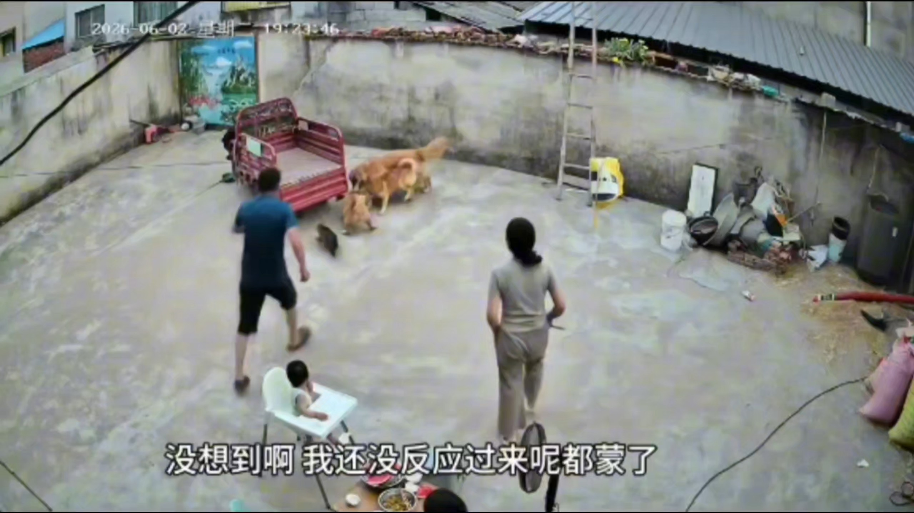 | 4.0万 | 2026-06-06 |
| [哈基米的慵懒生活～](https://www.bilibili.com/video/BV1mm7S6NEeA) | 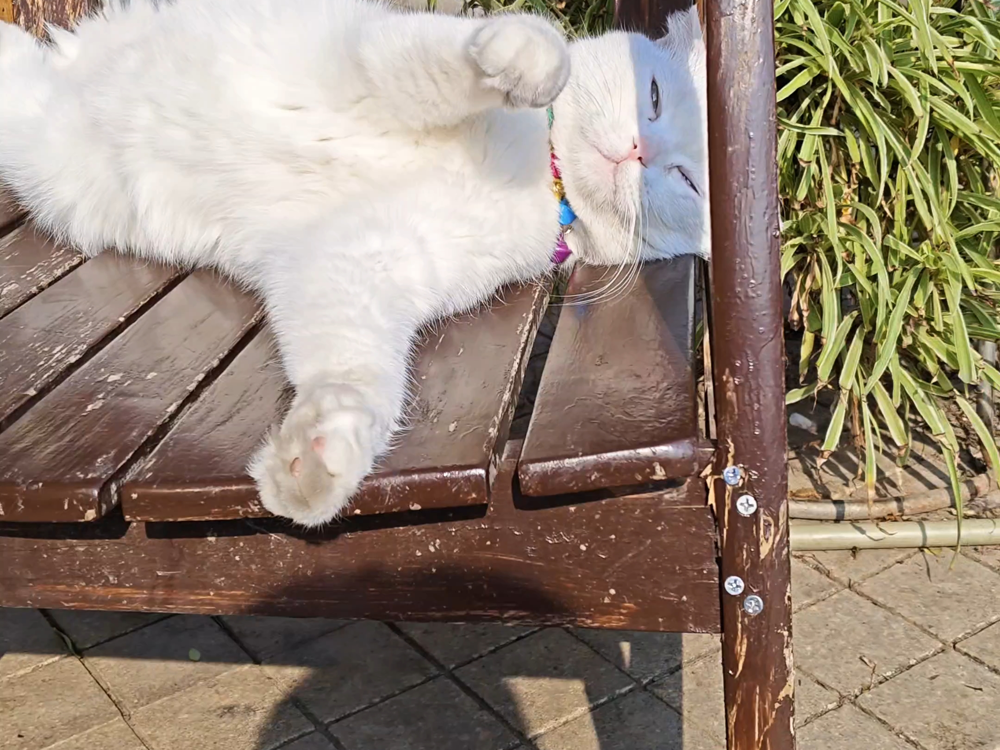 | 85 | 2026-06-06 |
| [【哈基米音乐】Comfort Chain](https://www.bilibili.com/video/BV1Cm716UEov) |  | 180 | 2026-06-06 |
| [【哈基米音乐】哈？（Who？）](https://www.bilibili.com/video/BV1zB726yELr) |  | 223 | 2026-06-06 |
| [哈基米日记之《没什么钱值得花》](https://www.bilibili.com/video/BV1UU7S6eEwo) |  | 500 | 2026-06-06 |
| [阿罗娜哈基米南北绿豆~](https://www.bilibili.com/video/BV1D17S6iEPu) |  | 2972 | 2026-06-06 |
| [这是哈基米自己买的肉](https://www.bilibili.com/video/BV1AL7m6JEjc) | 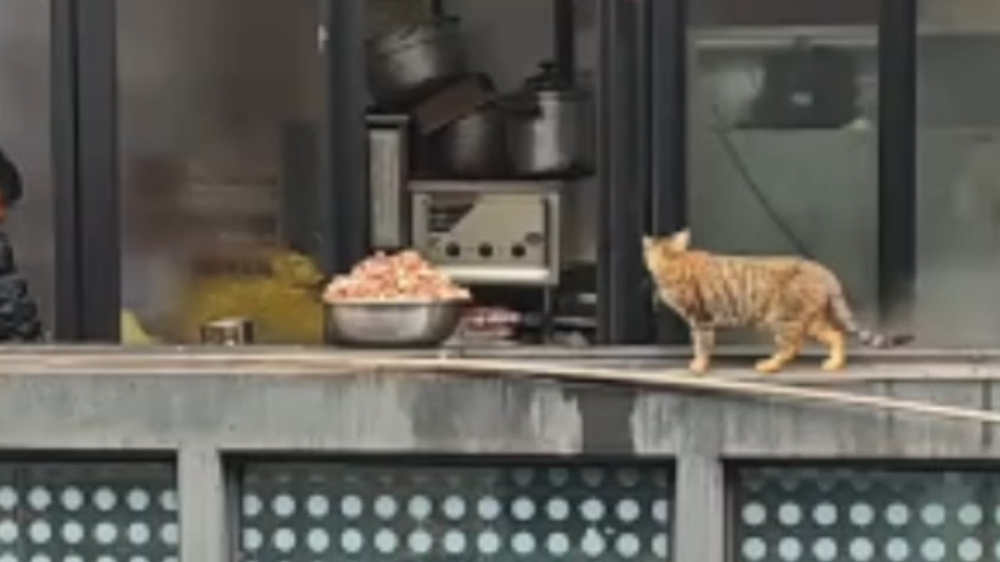 | 643 | 2026-06-06 |
| [哈基米这个玩水果忍者](https://www.bilibili.com/video/BV1os7m6GEBX) | 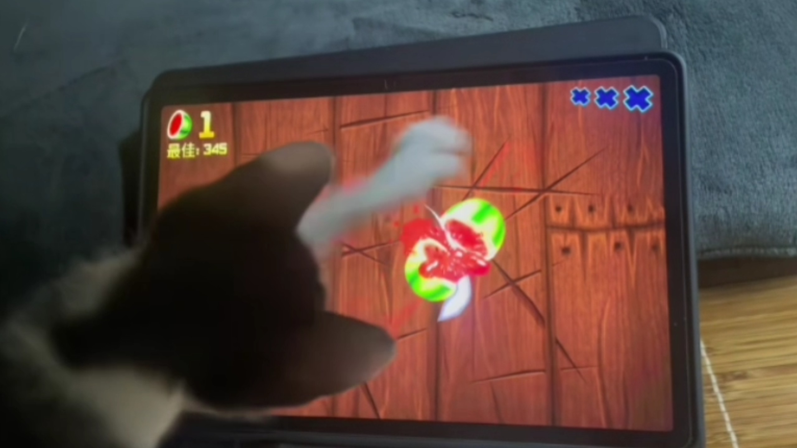 | 1262 | 2026-06-06 |
| [再次偶遇蒙面哈基米](https://www.bilibili.com/video/BV1os7m6GExX) | 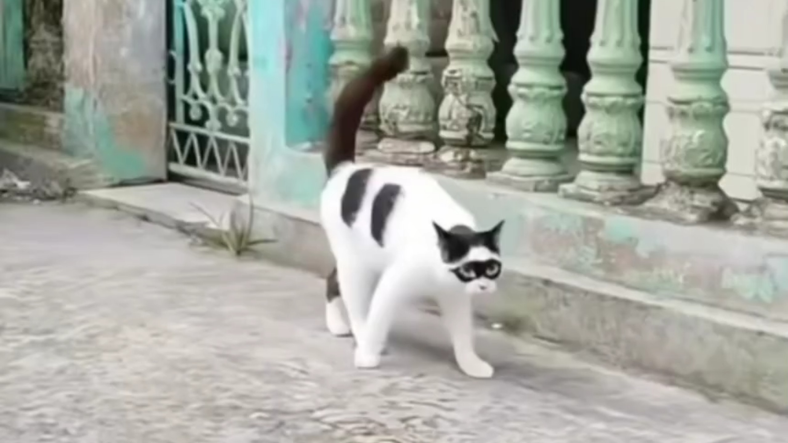 | 792 | 2026-06-06 |
| [哈基米这个交杯](https://www.bilibili.com/video/BV1Ye7m6TEFv) | 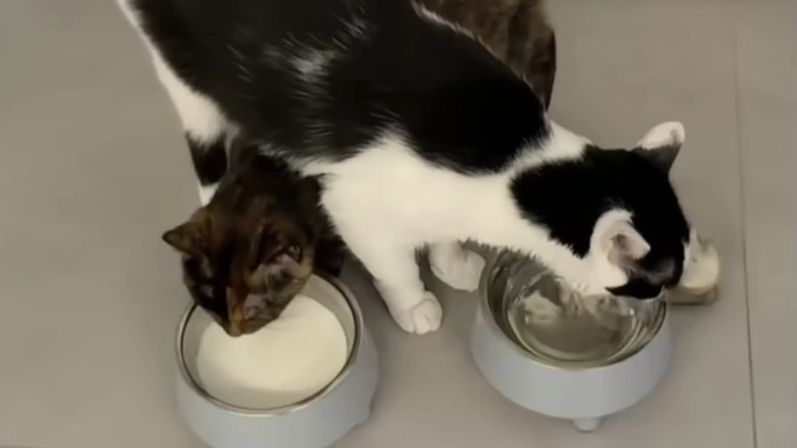 | 7468 | 2026-06-05 |
| [超绝の移速 哈基米](https://www.bilibili.com/video/BV1vu726eE4Z) |  | 919 | 2026-06-05 |
| [咪师傅秘制豆腐脑，吃完孩子学习好！](https://www.bilibili.com/video/BV1c5716GEvf) |  | 3.3万 | 2026-06-05 |
| [我不是来叫你起床的，我是来加入这个被窝的](https://www.bilibili.com/video/BV1H47k6iEoM) | 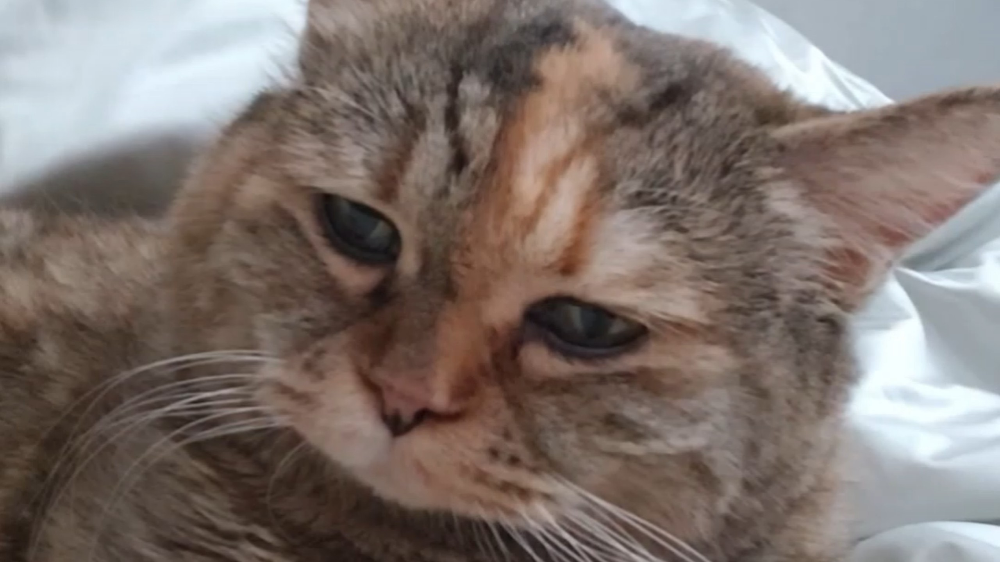 | 5.1万 | 2026-06-05 |
| [来自猫咪的威胁](https://www.bilibili.com/video/BV1hQEN6mEuM) | 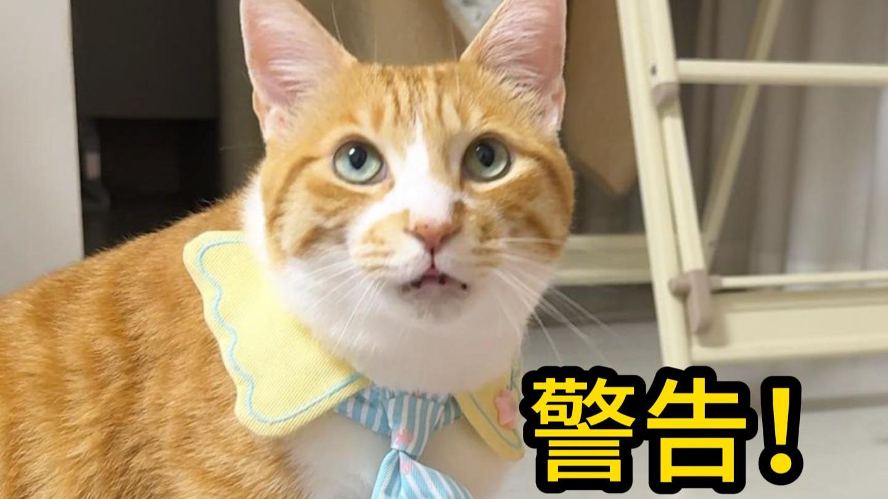 | 6.0万 | 2026-06-05 |
| [【智人TV】兄弟们，这次货少就一个卷](https://www.bilibili.com/video/BV1Td7k62EqU) |  | 22.5万 | 2026-06-05 |
| [小米的ai日记：我们才不是ai呢，我们是真人！](https://www.bilibili.com/video/BV1uQ7k6JE4b) | 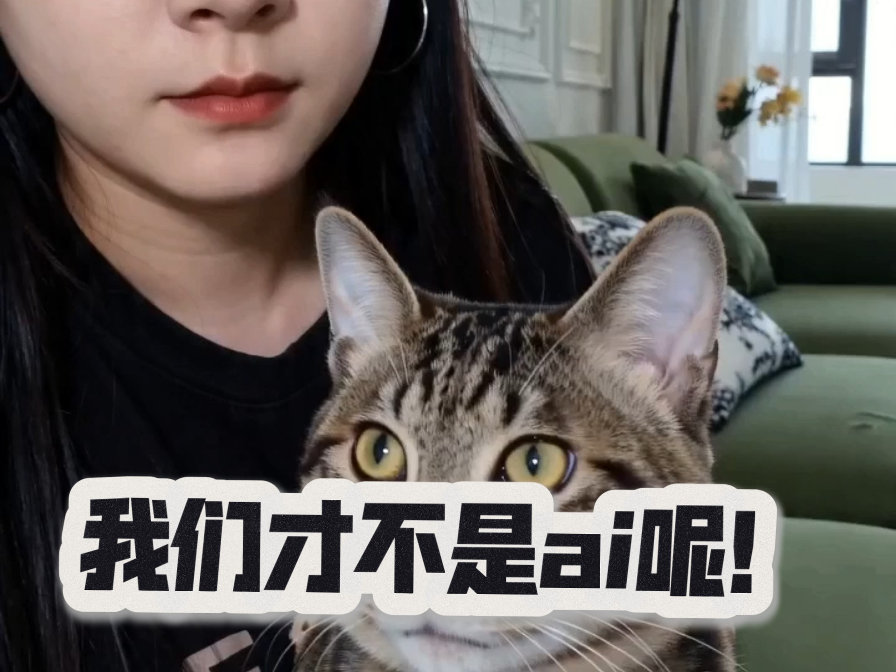 | 12.8万 | 2026-06-05 |
| [人！这天气还能再“热”一点吗？](https://www.bilibili.com/video/BV18uVB6ZEZu) | 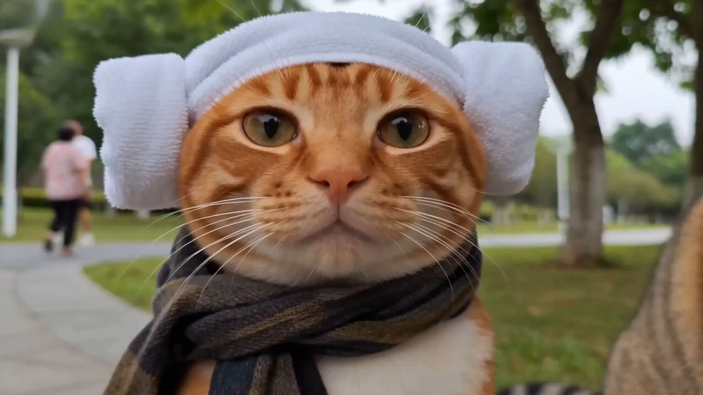 | 1.9万 | 2026-06-05 |
| [曾经火爆全网的猫meme们，现在的情况](https://www.bilibili.com/video/BV1dJ7C6FENv) | 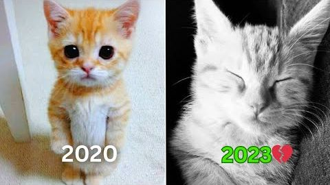 | 2.4万 | 2026-06-05 |
| [野生哈基米想闯入家里偷吃的](https://www.bilibili.com/video/BV1Kw7C6CEba) | 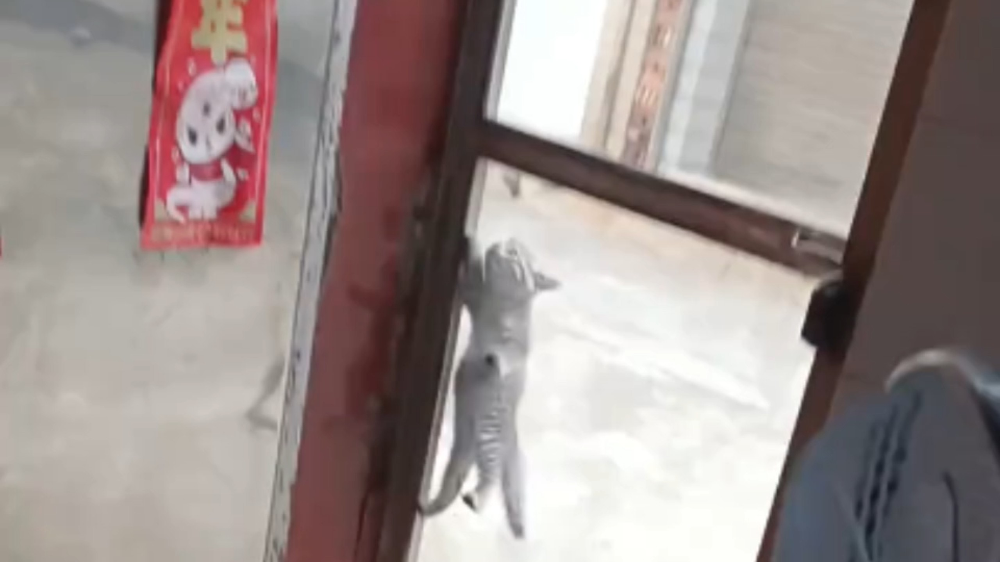 | 2318 | 2026-06-05 |
| [捏到鼠那你算是捏到软柿子了！](https://www.bilibili.com/video/BV1b8Ew6KEE8) | 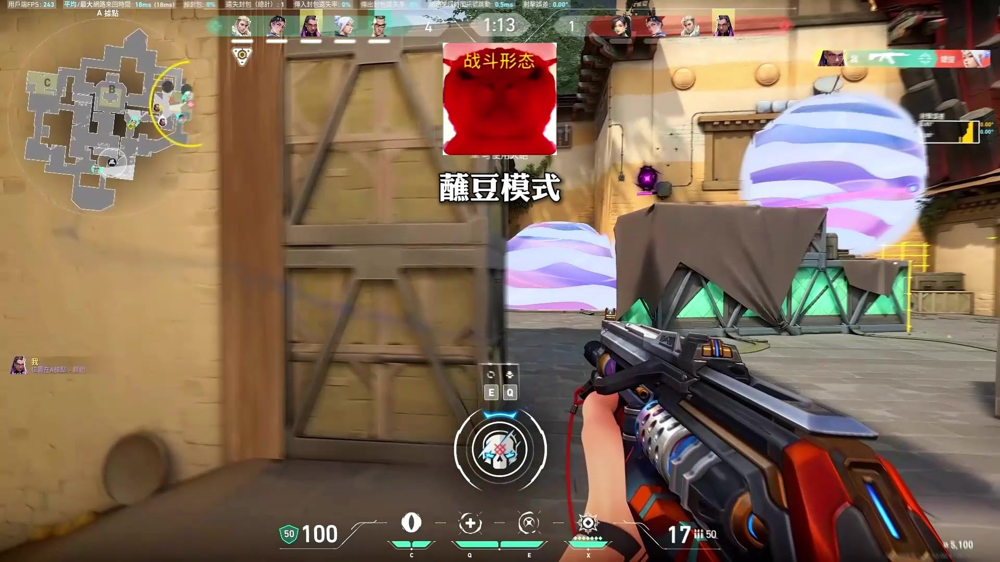 | 7.6万 | 2026-06-05 |
| [小咪真棒！](https://www.bilibili.com/video/BV18U766CEsB) | 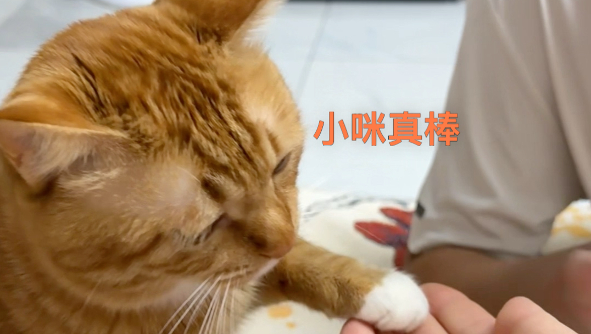 | 4.1万 | 2026-06-05 |
| [【基卡贝拉】禅境花园×抚平大脑褶皱√](https://www.bilibili.com/video/BV1aB7f6AERV) |  | 4888 | 2026-06-05 |
| [云咪Vlog——每天都想逛商场](https://www.bilibili.com/video/BV1rU7r6aEzv) | 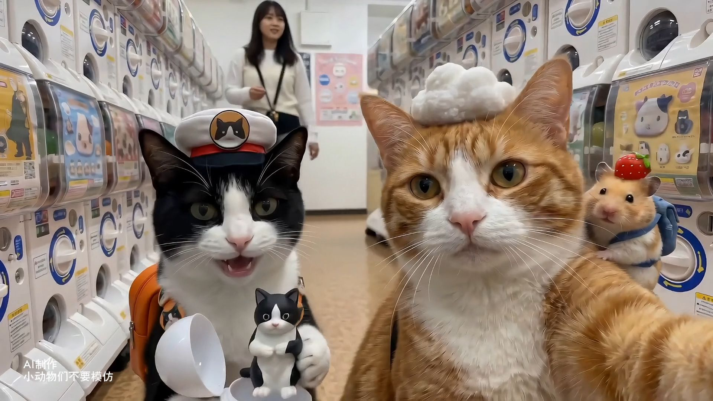 | 3834 | 2026-06-05 |
| [【舞萌DX】往事只能哈基](https://www.bilibili.com/video/BV1U9EA6BEx6) |  | 9253 | 2026-06-05 |
| [基米合集2](https://www.bilibili.com/video/BV1xL766KEvJ) | 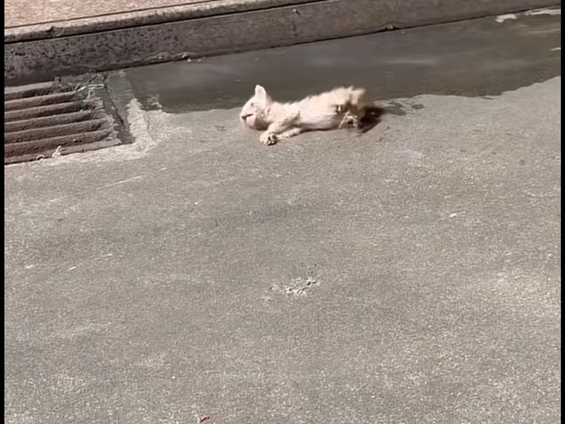 | 6355 | 2026-06-04 |
| [会叫曼波的猫原版](https://www.bilibili.com/video/BV1crEw6ZEoV) | 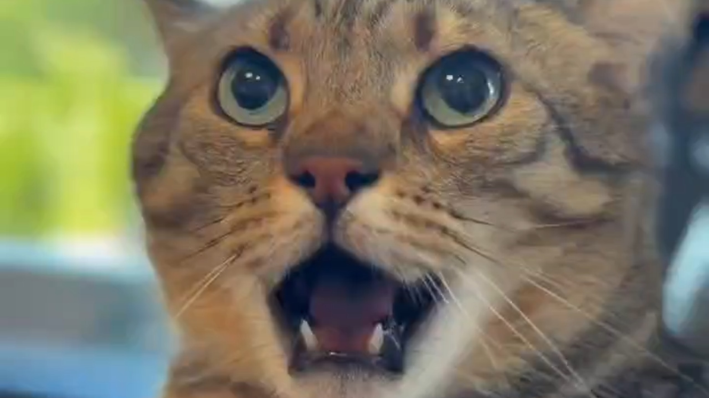 | 10.3万 | 2026-06-04 |
| [去喵星的猫 竟然回来了](https://www.bilibili.com/video/BV1nf7f6UELL) | 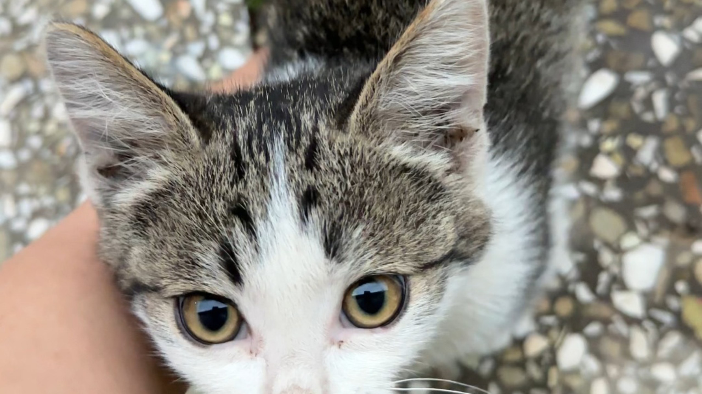 | 7.9万 | 2026-06-04 |
| [人，几日不见，me在江湖～](https://www.bilibili.com/video/BV1KQEc6AEpG) |  | 9477 | 2026-06-04 |
| [大橘哥158-第三季/基托邦2](https://www.bilibili.com/video/BV1427f6oEj6) | 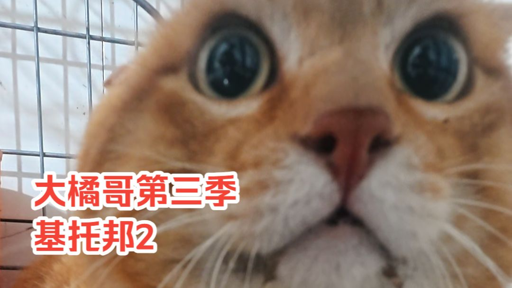 | 7.1万 | 2026-06-04 |
| [可观测宇宙内最标准的一声曼波 一分钟纯享版](https://www.bilibili.com/video/BV1qB796ZECH) | 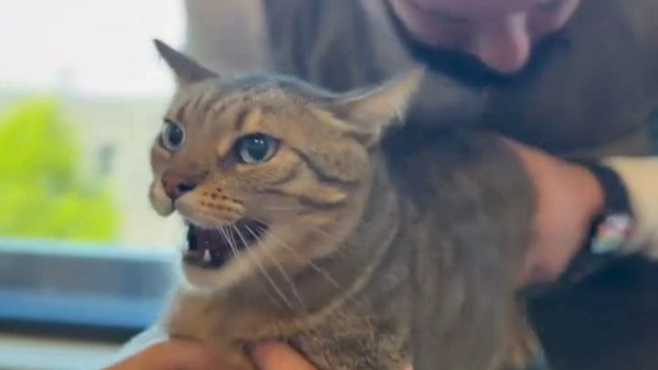 | 50.8万 | 2026-06-03 |
| [依旧秒开棘背龙形态](https://www.bilibili.com/video/BV1NdV16zEAu) | 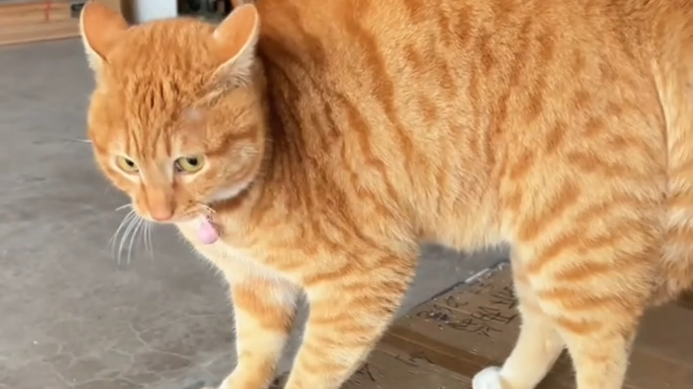 | 3.5万 | 2026-06-03 |
| [哈基咪叽咪叽阿西嘎阿西叮叮叮叮咚 叮叮叮叮叮咚咚叮](https://www.bilibili.com/video/BV1qBV661Eh5) | 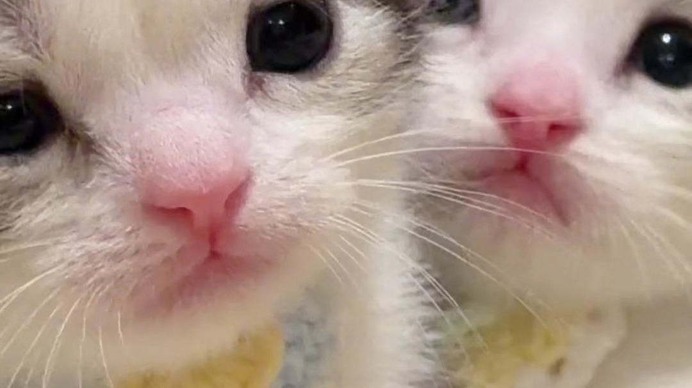 | 675 | 2026-06-02 |
| [[东方]夜雀之歌:往事只能哈基](https://www.bilibili.com/video/BV1S3VB6xEaA) |  | 3.0万 | 2026-06-02 |
| [🐱穷鬼气球](https://www.bilibili.com/video/BV11DVo6rEo7) |  | 127.1万 | 2026-06-01 |
| [《动物迷惑行为大赏309》](https://www.bilibili.com/video/BV1vFVS6YEQt) | 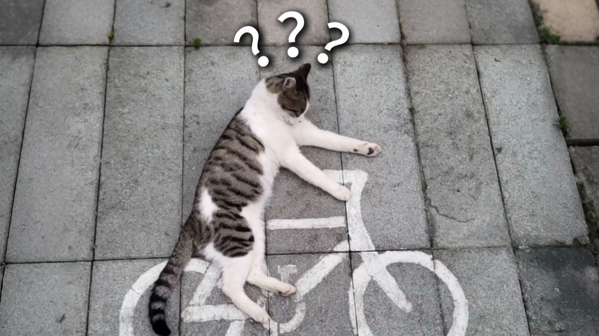 | 9.5万 | 2026-06-01 |
| [凯尔希：我也要哈吗？【往事只能哈基】](https://www.bilibili.com/video/BV1eyVS6YEzN) |  | 4.4万 | 2026-05-31 |
| [来⚡杯⚡好⚡茶⚡爻⚡一⚡爻⚡](https://www.bilibili.com/video/BV1TNVn6qEwT) |  | 17.2万 | 2026-05-31 |
| [《白菜魔丸》1-24](https://www.bilibili.com/video/BV1PFV562EHW) | 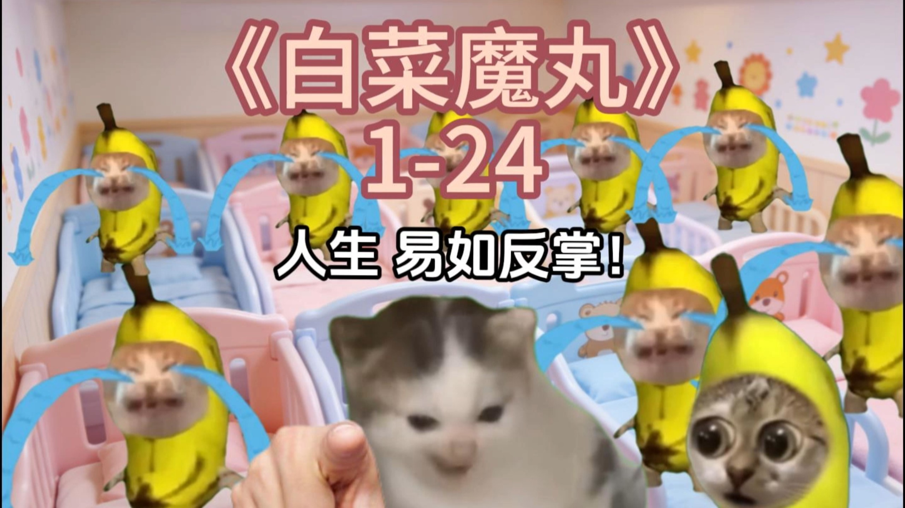 | 153.5万 | 2026-05-30 |
| [口香糖的特别嚼法](https://www.bilibili.com/video/BV1dLV56vEdH) | 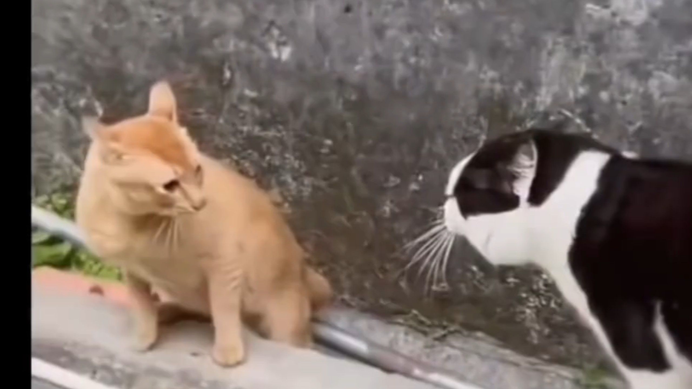 | 4.5万 | 2026-05-30 |
| [［4k合订本］张雪峰老师名场面合集](https://www.bilibili.com/video/BV1azV36pEzZ) |  | 17.0万 | 2026-05-30 |
| [⚡新疆的猫你叫咪咪它不来⚡](https://www.bilibili.com/video/BV1ebVa6SEpW) | 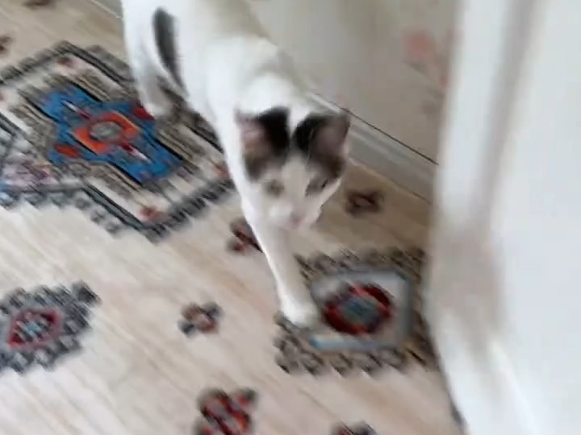 | 26.8万 | 2026-05-29 |
| [带我的刀盾和香蕉猫比比拉布去赶海，太多神奇海鲜了！](https://www.bilibili.com/video/BV1s1V86cEn3) |  | 905.5万 | 2026-05-29 |
| [替身使者会相互吸引](https://www.bilibili.com/video/BV13QG16EEv6) |  | 517.8万 | 2026-05-29 |
| [基米TV最之燃尽的一集](https://www.bilibili.com/video/BV18HVH6yEEB) | 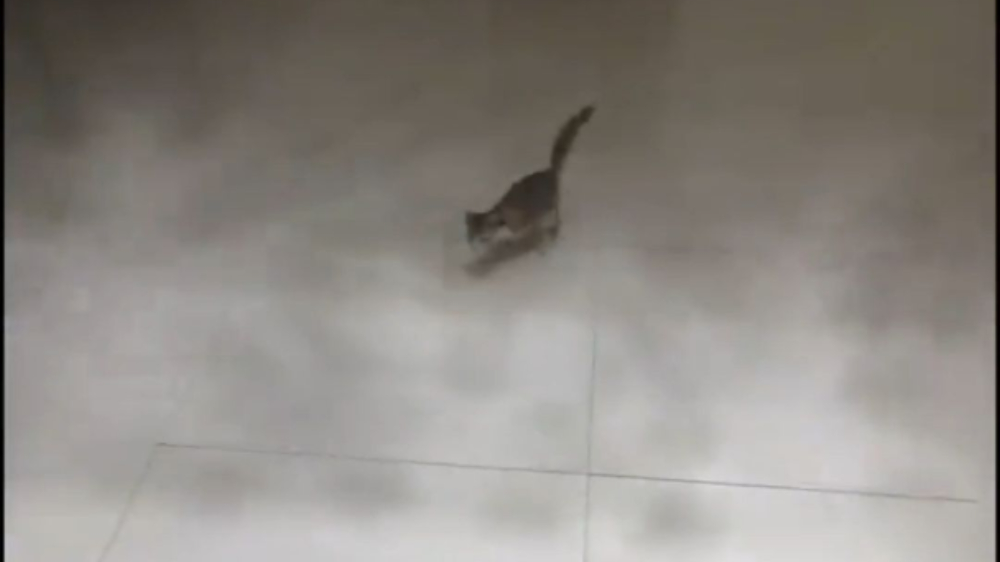 | 1.1万 | 2026-05-28 |
| [神子：你个你个你个你个你个你个你个你个你个你个你个你个你个~蹬](https://www.bilibili.com/video/BV1zkVH6cEA5) |  | 35.7万 | 2026-05-28 |
| [得劲儿魔法！](https://www.bilibili.com/video/BV1odVA6BEjG) | 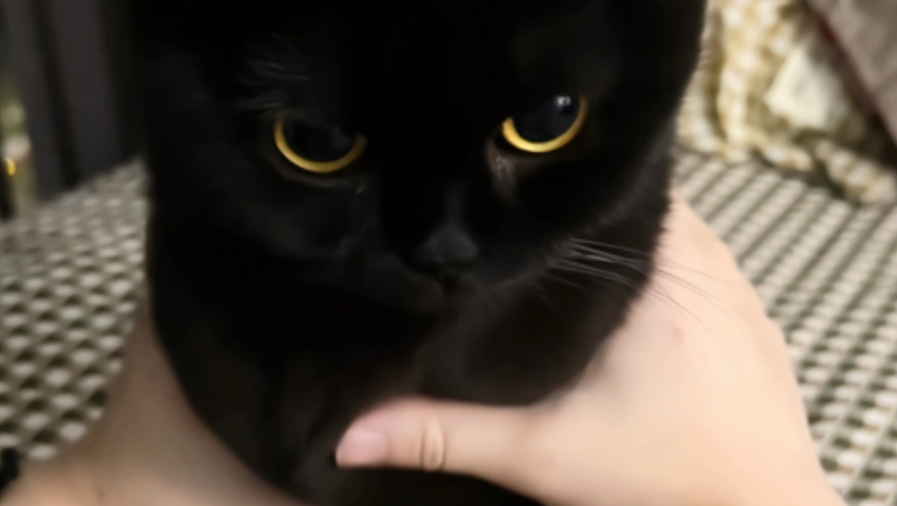 | 190.2万 | 2026-05-26 |
| [🍄关注塔菲喵🍄](https://www.bilibili.com/video/BV1SVGn6ME3u) |  | 7.1万 | 2026-05-24 |
| [得劲魔法](https://www.bilibili.com/video/BV1hdGi69EKm) | 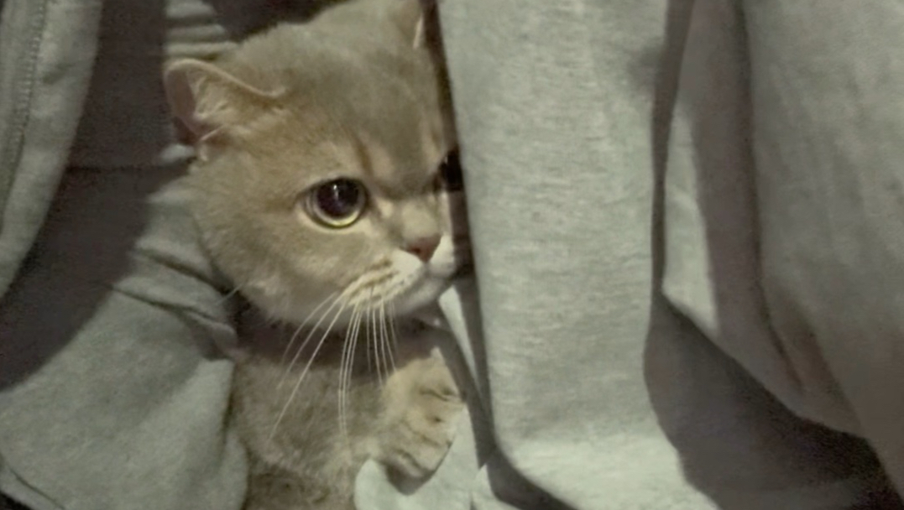 | 220.7万 | 2026-05-23 |
| [别一句AI辜负了小猫的努力](https://www.bilibili.com/video/BV1mRG86cEpv) |  | 14.7万 | 2026-05-22 |
| [哈吉米仙人（bushi）的那个那个教学来袭](https://www.bilibili.com/video/BV1BqL86WESe) | 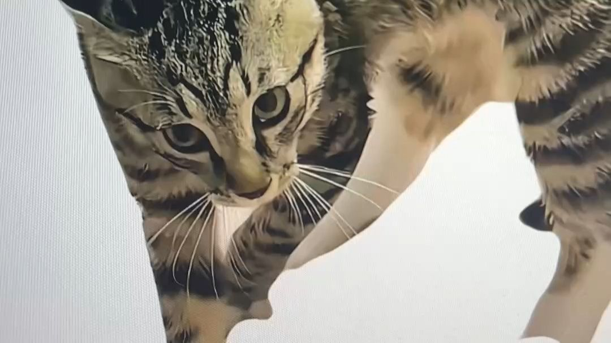 | 4.2万 | 2026-05-22 |
| [各国中枪后的哈基咪](https://www.bilibili.com/video/BV1WHLz6xEdS) | 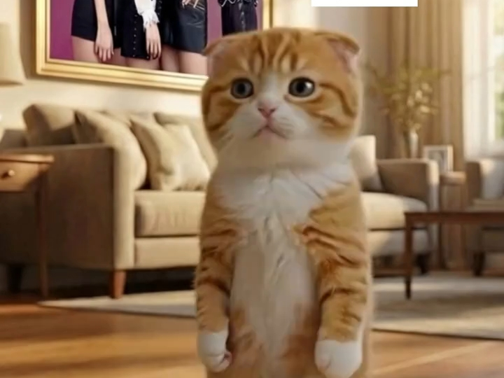 | 33.3万 | 2026-05-19 |
| [救命！妈真的求你们了！](https://www.bilibili.com/video/BV1Vw5v6fEmM) | 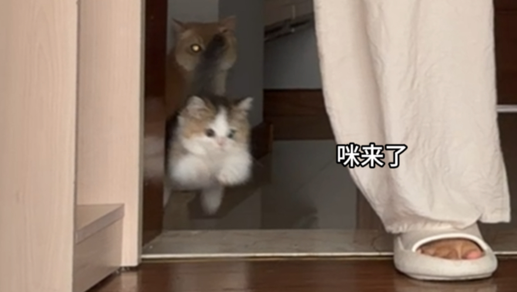 | 140.2万 | 2026-05-15 |
| [耄耋我本将心向明月](https://www.bilibili.com/video/BV1JT5n6FEW1) |  | 4215 | 2026-05-10 |
| [狗：看我装唐阴他一手！](https://www.bilibili.com/video/BV11ydFBmEgB) | 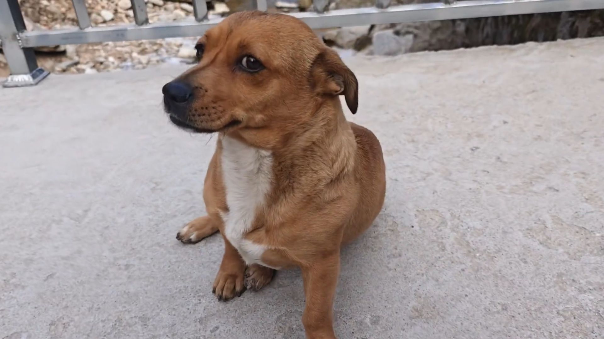 | 32.1万 | 2026-05-07 |
| [“把你的心给我”《别错过》](https://www.bilibili.com/video/BV1vVRyB9EDW) |  | 8.7万 | 2026-05-05 |

---
*最后更新: 2026-06-07 03:30:28 (自动生成)*
*数据来源: [Bilibili](https://www.bilibili.com)*

## 使用说明

运行以下命令更新视频列表:
```bash
python3 fetch_hajimi_videos.py
```
