# awesome-hajimi
collections of hajimi (哈基米 in Chinese) on the Internet.

## 视频列表 (Video List)

| 视频标题 (Title) | 封面 | 播放量 (Views) | 发布日期 (Date) |
|---|---|---|---|
| [基米的配方🎵](https://www.bilibili.com/video/BV1ggKP6yEkb) |  | 1361 | 2026-07-19 |
| [哈基米不知道被买走了，还在睡觉](https://www.bilibili.com/video/BV1NoKi6aEnB) |  | 5298 | 2026-07-18 |
| [哈基米音乐；what咪do（完整版）](https://www.bilibili.com/video/BV1pgKT63Ei6) |  | 692 | 2026-07-18 |
| [哈基米～哈基米～](https://www.bilibili.com/video/BV1abKN6nEE1) |  | 849 | 2026-07-18 |
| [银狼的哈基米南北绿豆](https://www.bilibili.com/video/BV1h3KK6DEsi) |  | 168 | 2026-07-18 |
| [哈基米#AI创作大会](https://www.bilibili.com/video/BV1JRKN6YEXB) |  | 120 | 2026-07-18 |
| [哈基米](https://www.bilibili.com/video/BV1StKA6GE8h) | 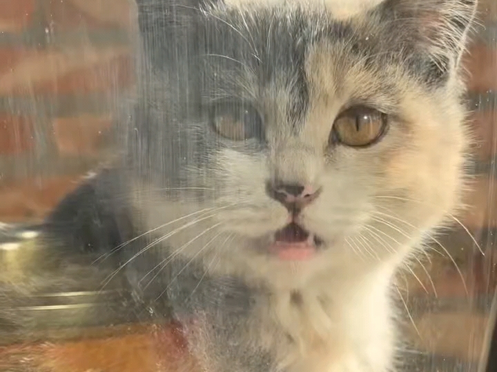 | 2 | 2026-07-18 |
| [哈基米](https://www.bilibili.com/video/BV1bVKP6rEjx) |  | 20 | 2026-07-18 |
| [哈基米](https://www.bilibili.com/video/BV1BaKP6bEQZ) | 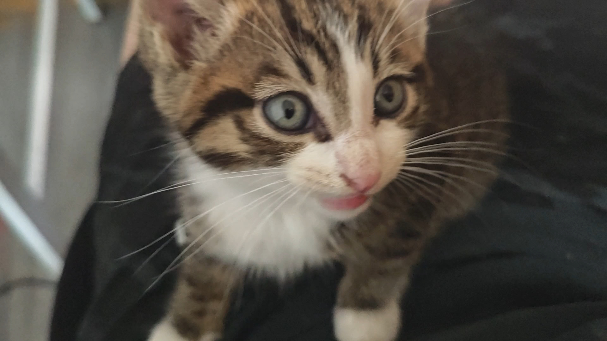 | 165 | 2026-07-18 |
| [咪师傅的绵绵冰大王，只能堂食不能打包！](https://www.bilibili.com/video/BV17vKP64EaA) |  | 6143 | 2026-07-18 |
| [哈基米:居然还有心肺复苏环节，太感动了](https://www.bilibili.com/video/BV11EKP6MERv) | 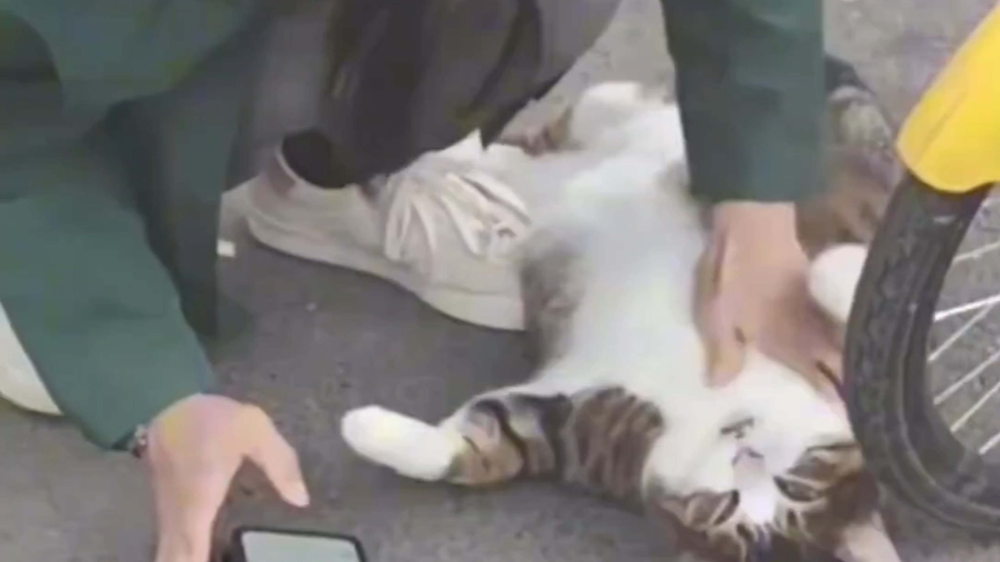 | 7159 | 2026-07-18 |
| [【基米TV】暹罗能养哈气也是神人了](https://www.bilibili.com/video/BV1kxKP6YEZx) | 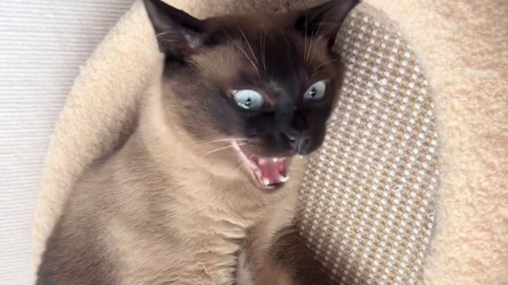 | 2.0万 | 2026-07-18 |
| [【哈基米X大狗叫】Dagou Romance[狗叫恋爱]](https://www.bilibili.com/video/BV1WHKP6KEu7) |  | 2492 | 2026-07-18 |
| [带我的刀盾，香蕉猫比比拉布去抓知了猴，遇神奇生物桃芙！](https://www.bilibili.com/video/BV1PcKN6zEzS) |  | 18.8万 | 2026-07-18 |
| [哈基米高兴得手舞足蹈](https://www.bilibili.com/video/BV18DKP6jEwY) |  | 1218 | 2026-07-18 |
| [哈基米这个拦路](https://www.bilibili.com/video/BV1t3Kw6NEPj) | 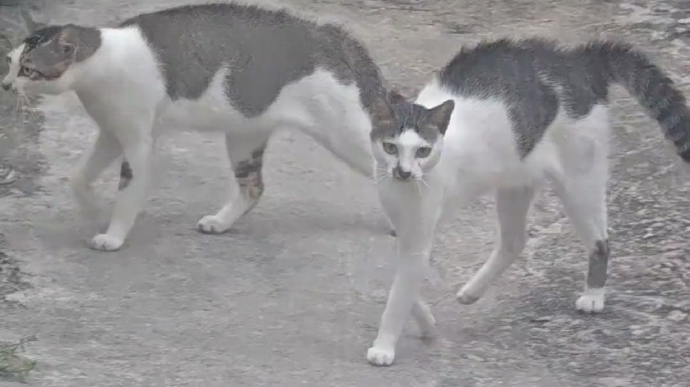 | 1206 | 2026-07-18 |
| [⚡！！！！哈基米诈尸！！！！⚡](https://www.bilibili.com/video/BV1eoKc61EXf) |  | 1301 | 2026-07-18 |
| [哈基米南北绿豆](https://www.bilibili.com/video/BV1vdKc6LEk7) | 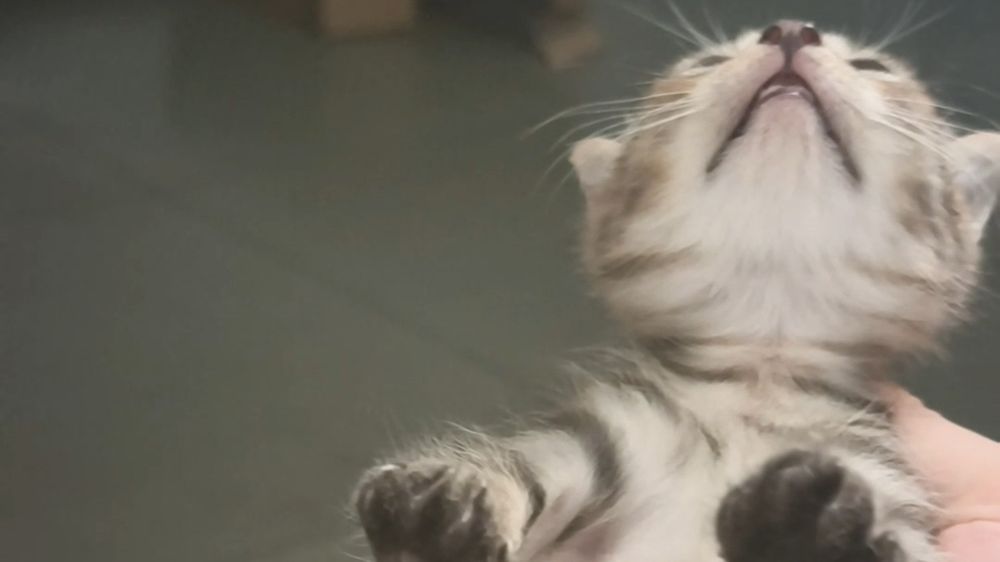 | 61 | 2026-07-18 |
| [哈基米下班了](https://www.bilibili.com/video/BV1JbKw6XEPf) |  | 460 | 2026-07-18 |
| [哈基米](https://www.bilibili.com/video/BV1KXKw6TED1) | 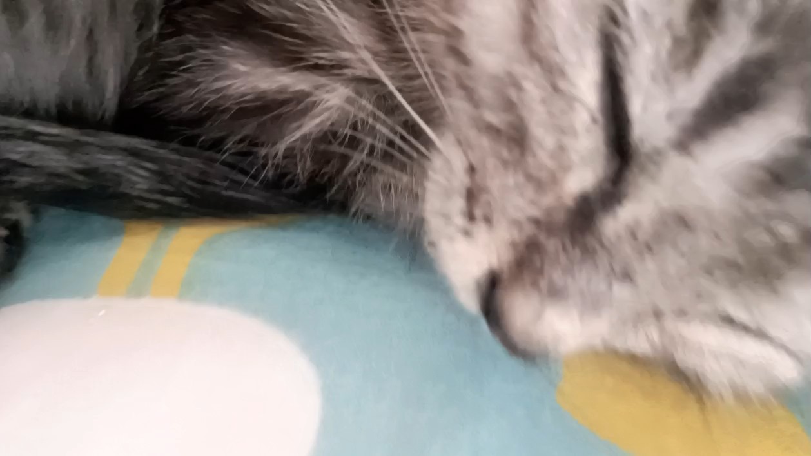 | 148 | 2026-07-18 |
| [哈基米也有苹果安卓之分😭](https://www.bilibili.com/video/BV1mXKw6TEB1) | 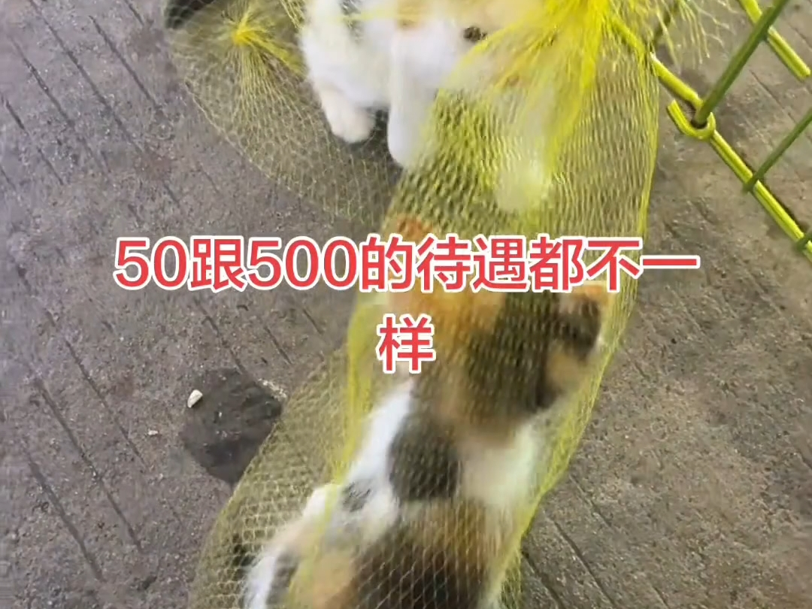 | 3841 | 2026-07-18 |
| [【哈基米很萌】更新啦，赶紧来围观吧！](https://www.bilibili.com/video/BV1GrKw6yEGP) |  | 121 | 2026-07-18 |
| [哈基米南北绿豆～](https://www.bilibili.com/video/BV15BKw62EVa) |  | 676 | 2026-07-18 |
| [哈基米锁定！哈基米跟踪！](https://www.bilibili.com/video/BV1ViKF6gEzr) | 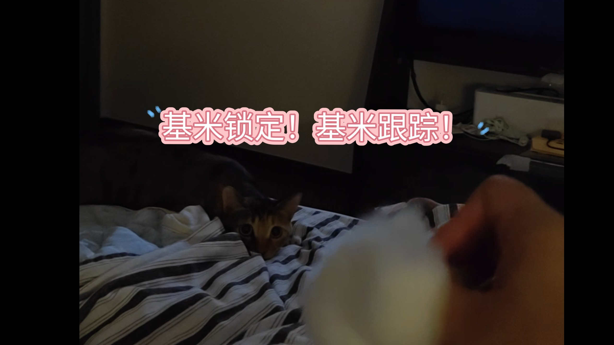 | 1.7万 | 2026-07-18 |
| [这时髦吗？哈基米](https://www.bilibili.com/video/BV1gkKF6KEC6) | 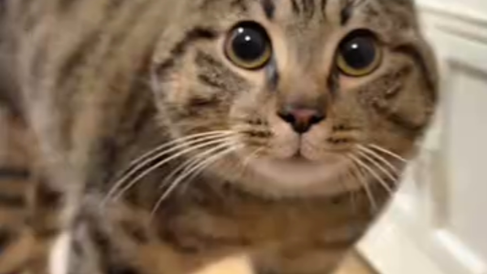 | 1157 | 2026-07-18 |
| [🐴🎙️我是你千百年前放生的小马🐴🎙️【Hi-Res/4K】](https://www.bilibili.com/video/BV1QHKc6BESQ) |  | 901 | 2026-07-18 |
| [顺滑的哈基米](https://www.bilibili.com/video/BV16rKc6RERL) |  | 957 | 2026-07-18 |
| [哈基米想偷吃小鸟，请哈基汪来制裁哈基米](https://www.bilibili.com/video/BV1U4Kc6NEjW) | 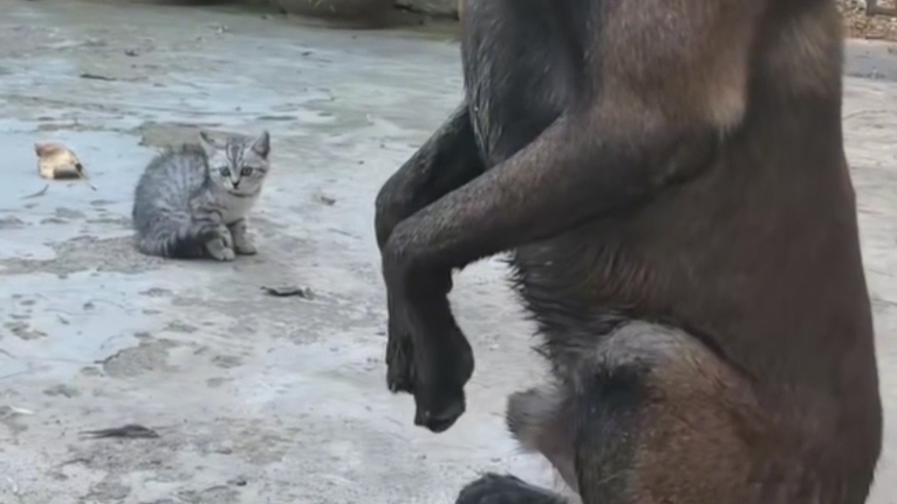 | 3491 | 2026-07-18 |
| [捕获哈基米](https://www.bilibili.com/video/BV16iNo6kEBS) | 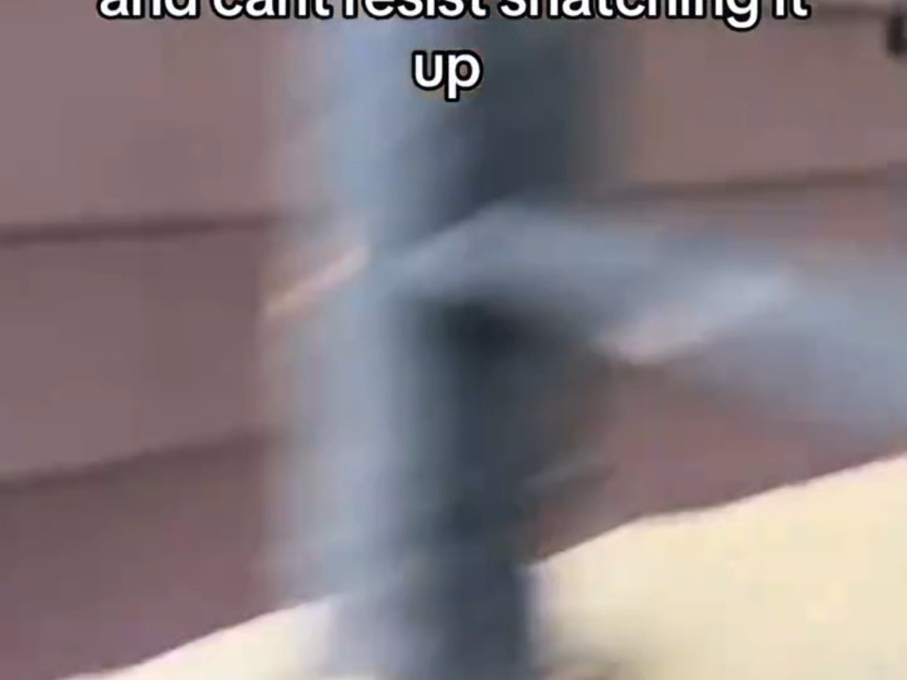 | 1350 | 2026-07-17 |
| [小小哈吉米](https://www.bilibili.com/video/BV1aRNo68Etm) | 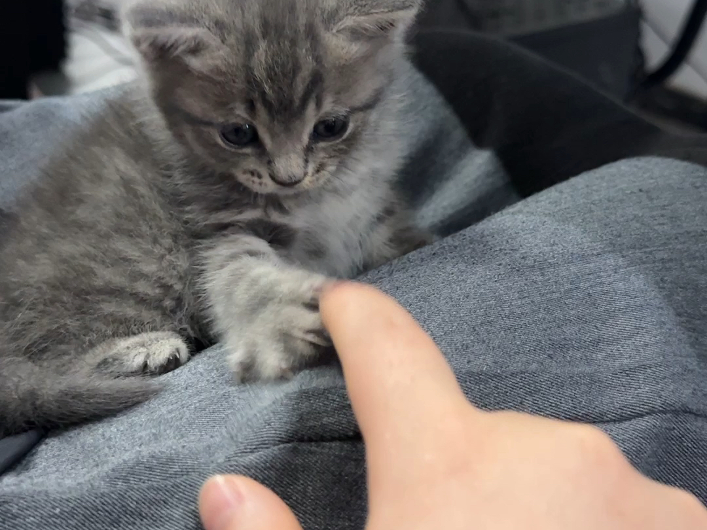 | 145 | 2026-07-17 |
| [哈基米将要远行](https://www.bilibili.com/video/BV1toNR6nEHY) |  | 1469 | 2026-07-17 |
| [《哈基猫奇遇记：火山石工坊》](https://www.bilibili.com/video/BV1N1Nd6UEPs) |  | 10.0万 | 2026-07-17 |
| [⚡ 视 奸 大 狗 ⚡](https://www.bilibili.com/video/BV1tBNd6pEtT) |  | 4.1万 | 2026-07-17 |
| [多少有点偏心了昂！](https://www.bilibili.com/video/BV1WVKn62EkV) |  | 8724 | 2026-07-17 |
| [哀 丽 秘 榭 高 尔 夫](https://www.bilibili.com/video/BV1jmKJ6eExU) |  | 9.7万 | 2026-07-17 |
| [你们要的曼波纯享版来咯~](https://www.bilibili.com/video/BV19XKJ6FEa2) |  | 1598 | 2026-07-17 |
| [在日本“哈基米南北绿豆”千万不要乱说！](https://www.bilibili.com/video/BV1DRKJ6ZEmW) |  | 1519 | 2026-07-17 |
| [哈基米南北路多 阿西嘎呀库那路 哈呀哈基米 叮咚叮咚鸡 曼波嘛吉利](https://www.bilibili.com/video/BV17PKH6rES6) |  | 490 | 2026-07-17 |
| [大狗大狗大狗大狗你到底叫不叫！](https://www.bilibili.com/video/BV1SmKV6gEYv) | 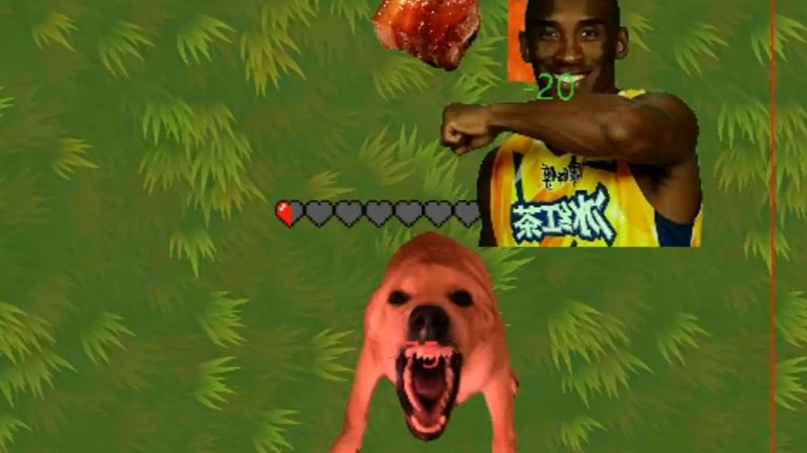 | 10.4万 | 2026-07-17 |
| [【Roblox】一首百年老歌，如何变成了火遍全球的 Meme？](https://www.bilibili.com/video/BV12CKE67ELz) |  | 44.6万 | 2026-07-17 |
| [曼波手办我真绷不住](https://www.bilibili.com/video/BV1BHKn6gEow) |  | 16.0万 | 2026-07-17 |
| [♿️电棍：Skystrike♿️](https://www.bilibili.com/video/BV1HEKn6VEqT) |  | 2.2万 | 2026-07-17 |
| [当代人类驯服远古猛兽的珍贵视频](https://www.bilibili.com/video/BV18rKn6tEAU) | 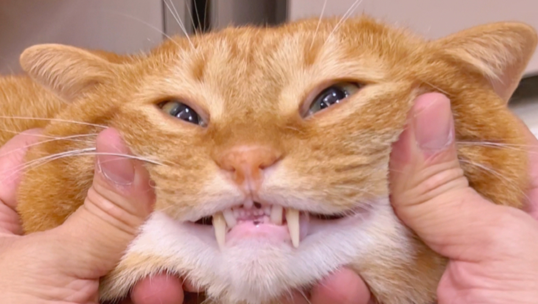 | 4.1万 | 2026-07-17 |
| [我的悲伤是狗叫的](https://www.bilibili.com/video/BV1isKE68ErK) | 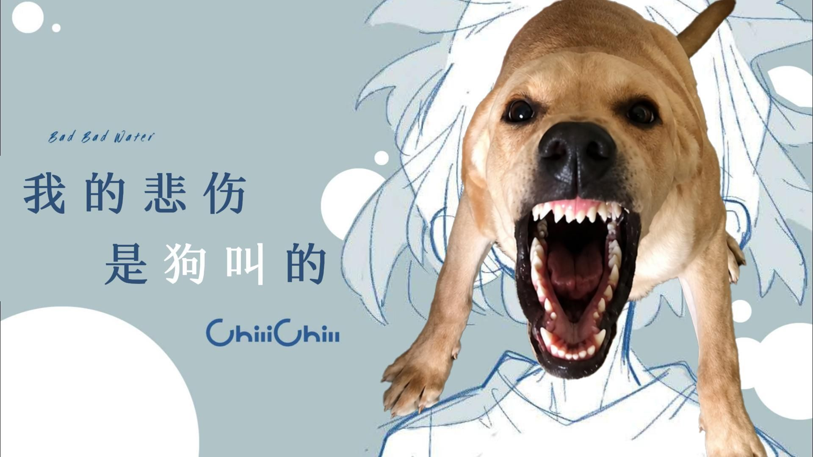 | 60.2万 | 2026-07-17 |
| [哈基米被动:哈两下触发强化哈气](https://www.bilibili.com/video/BV1isKE68E8j) | 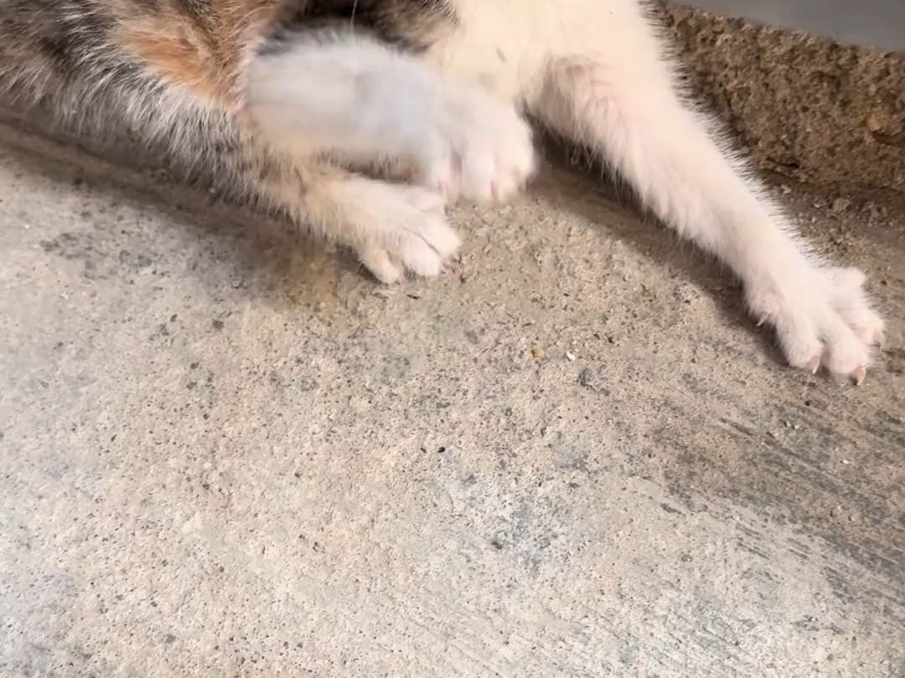 | 800 | 2026-07-17 |
| [这俩小玩意谁研究的呢？](https://www.bilibili.com/video/BV1ZEKE6eEHP) |  | 37.1万 | 2026-07-17 |
| [肖邦的妹妹肖茂咪 弹奏《哈基米起床》](https://www.bilibili.com/video/BV1HdKE6uEtd) | 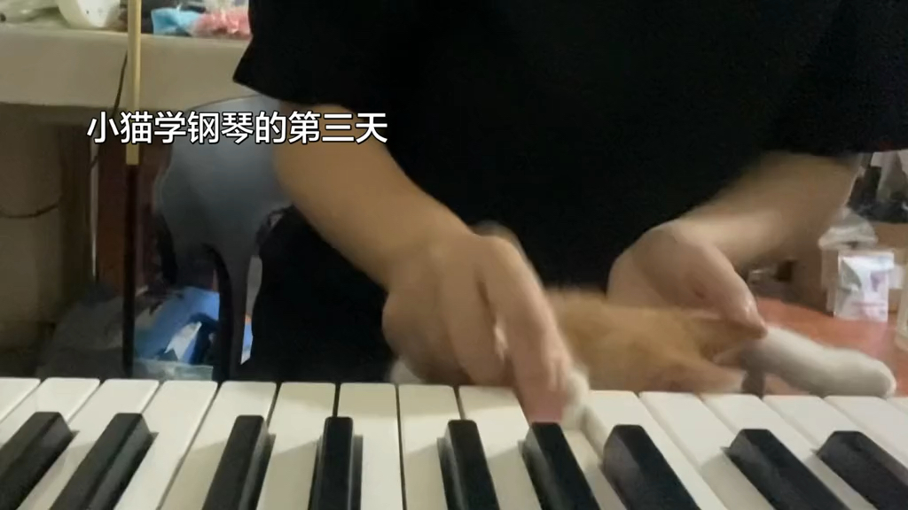 | 4.0万 | 2026-07-17 |
| [老吴：看着你，一直都在看着你](https://www.bilibili.com/video/BV1gjKJ6REXX) | 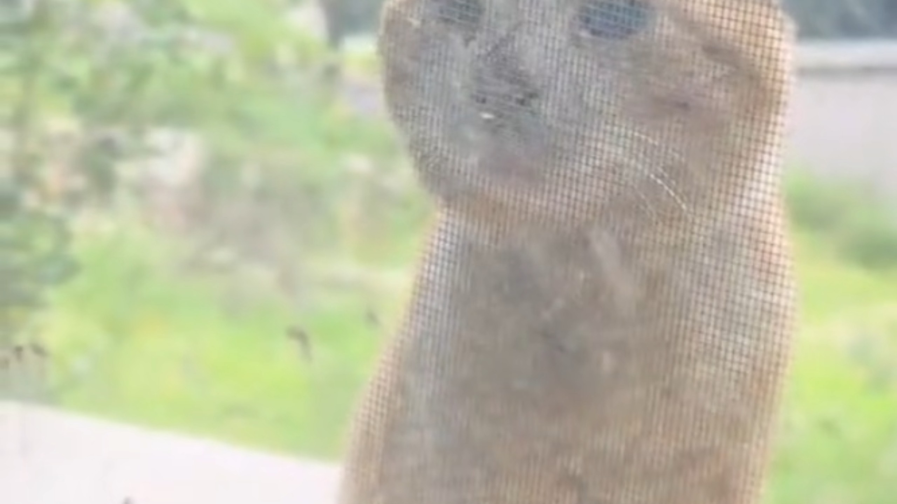 | 1.0万 | 2026-07-17 |
| [发错视频了，这是拍摄素材。](https://www.bilibili.com/video/BV1VcKL6JEf7) | 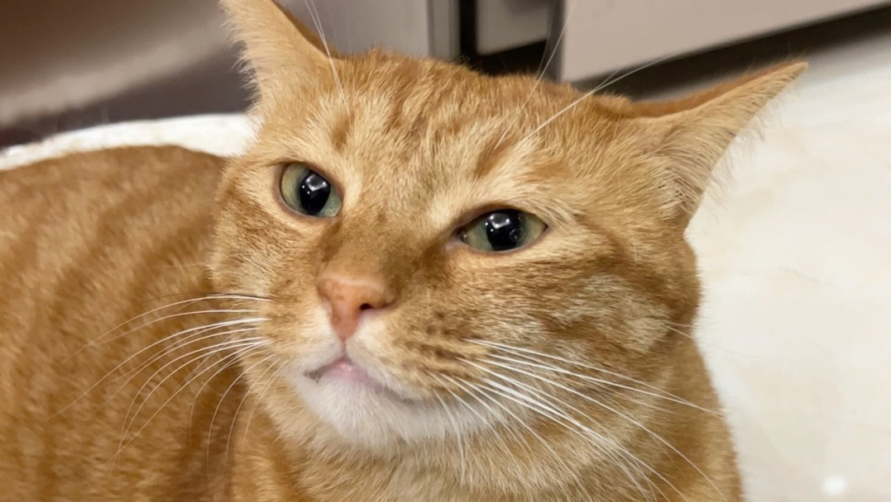 | 2.3万 | 2026-07-17 |
| [我妈说做这首会有人看🐴🎙️《当一天和尚撞一天钟》【Hi-Res/4K】](https://www.bilibili.com/video/BV172KJ6NEPZ) |  | 3128 | 2026-07-17 |
| [回家吃饭之第二十五集](https://www.bilibili.com/video/BV17CKJ6TEqr) |  | 47.3万 | 2026-07-17 |
| [循环歌曲 · 成吉思鸡の小曲 《出山dj》｜ “朋友，要来份成吉思鸡吗”](https://www.bilibili.com/video/BV1nSKj6vELE) |  | 10.6万 | 2026-07-17 |
| [哈气的哈基米](https://www.bilibili.com/video/BV1C1Kj6ME6X) | 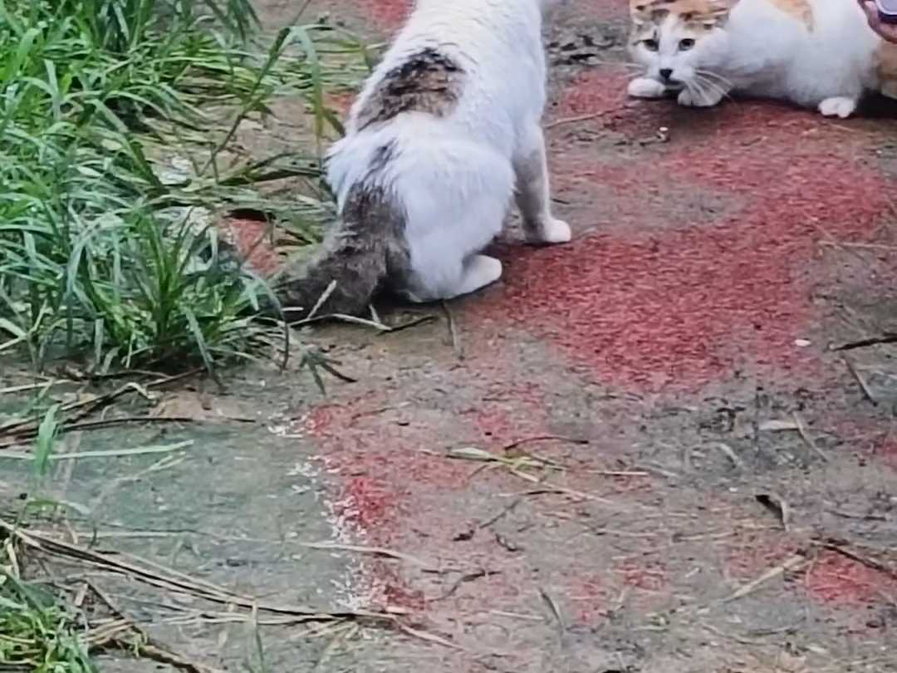 | 168 | 2026-07-17 |
| [好样的哈基米 捕鼠能力顶呱呱](https://www.bilibili.com/video/BV1AJKV6bE3t) | 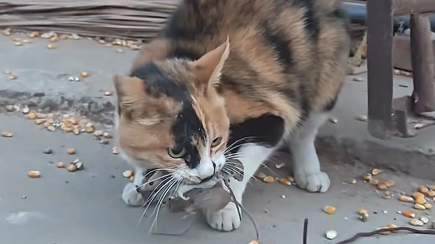 | 1626 | 2026-07-17 |
| [在野外遇到一只蓝紫色的哈基米](https://www.bilibili.com/video/BV11kKj6gEAw) | 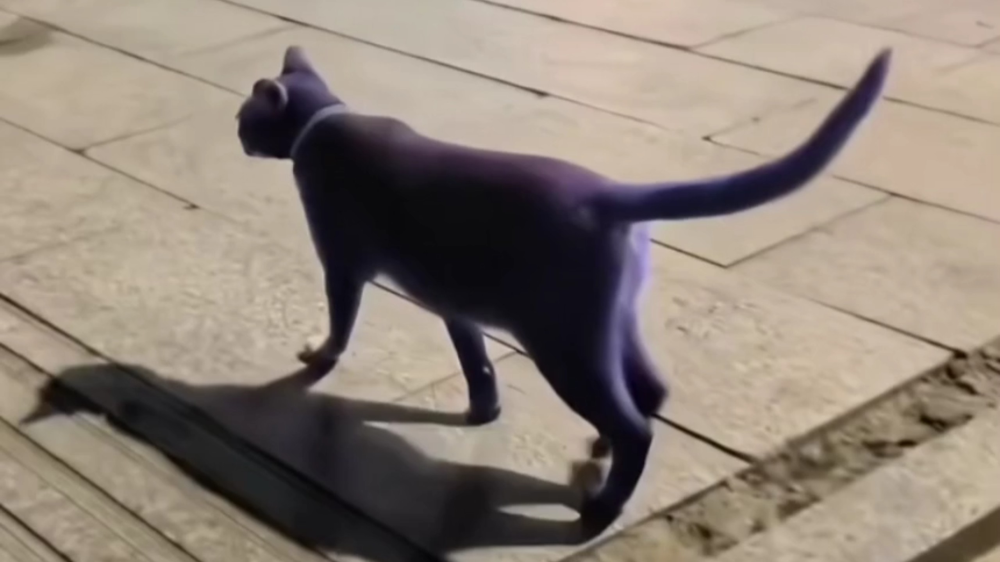 | 3247 | 2026-07-17 |
| [小峰布偶猫 三猫鼎力](https://www.bilibili.com/video/BV1DUKL6jEjt) | 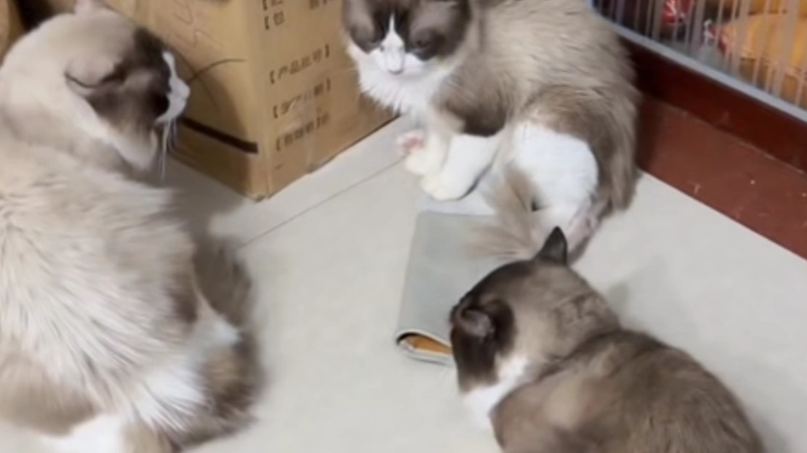 | 5297 | 2026-07-16 |
| [猫：混蛋，混蛋，混蛋，蛋！](https://www.bilibili.com/video/BV1PoKV6PE9S) | 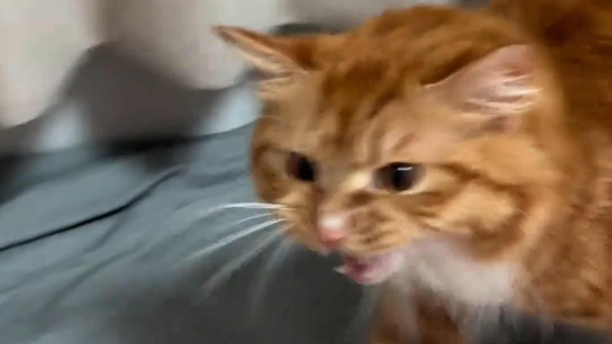 | 7.8万 | 2026-07-16 |
| [基米爱搞核酸](https://www.bilibili.com/video/BV1SUKV6BEyG) | 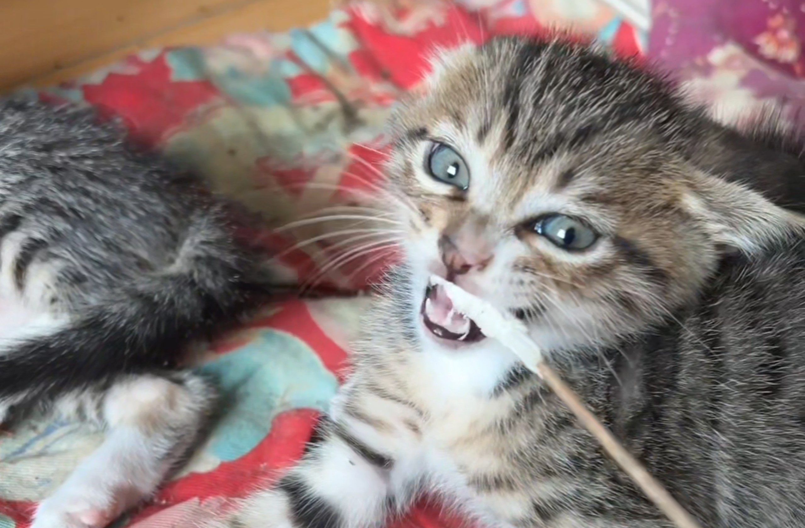 | 1673 | 2026-07-16 |
| [干嘛猫校园记录（人类是益虫）](https://www.bilibili.com/video/BV1aJKG6zETb) |  | 207.2万 | 2026-07-16 |
| [曼波翻唱【鸣潮】3.5秧秧·玄翎主题曲《玄翎谣》](https://www.bilibili.com/video/BV14aKG6hEnD) |  | 2241 | 2026-07-16 |
| [🐶究竟要多绝望的大狗，才能叫出这首《That Girl》🐶](https://www.bilibili.com/video/BV1WBKG64EyA) |  | 6.6万 | 2026-07-16 |
| [去环球影城体验哈基波特的一天](https://www.bilibili.com/video/BV1UvNy6RE9i) |  | 2935 | 2026-07-16 |
| [哈基米这个不惧大狗](https://www.bilibili.com/video/BV1qUKG6SEdm) | 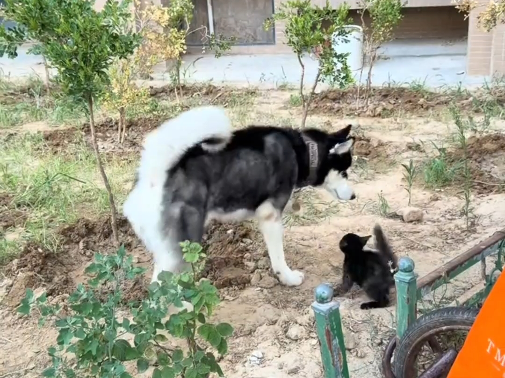 | 2321 | 2026-07-16 |
| [尼 古 喵 喵](https://www.bilibili.com/video/BV1mtKG6PEdE) | 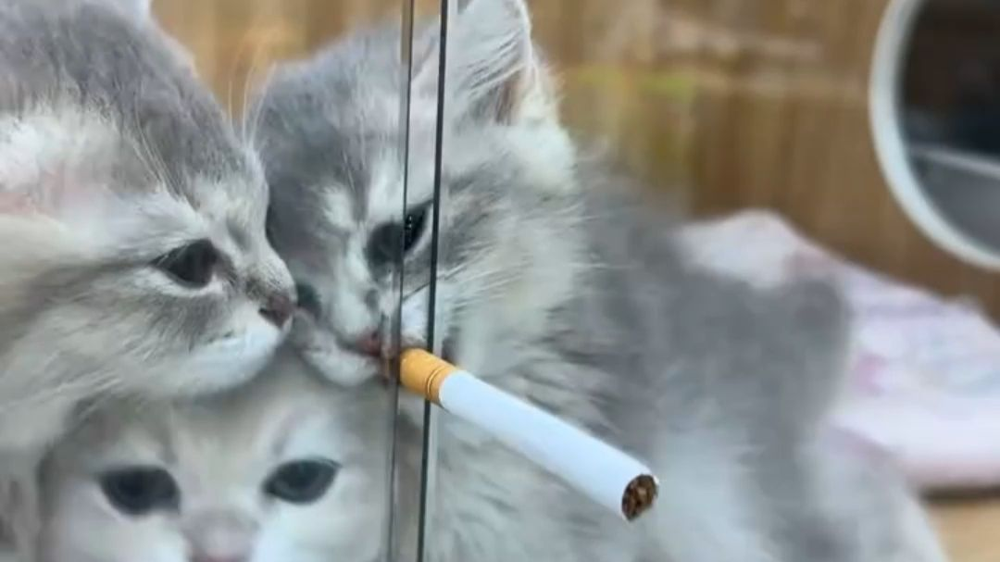 | 1.8万 | 2026-07-16 |
| [哈基米逗笑挑战](https://www.bilibili.com/video/BV1EkKM6uEM2) | 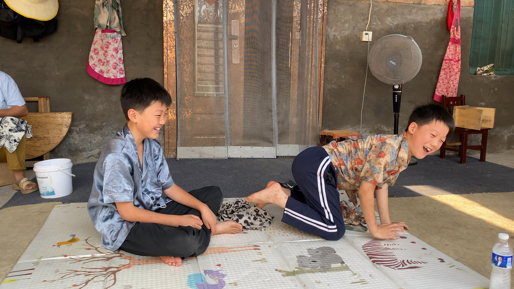 | 1532 | 2026-07-16 |
| [哈基米变脸不扣豆，提醒大家不要接触流浪猫狗](https://www.bilibili.com/video/BV15XNi63E6m) | 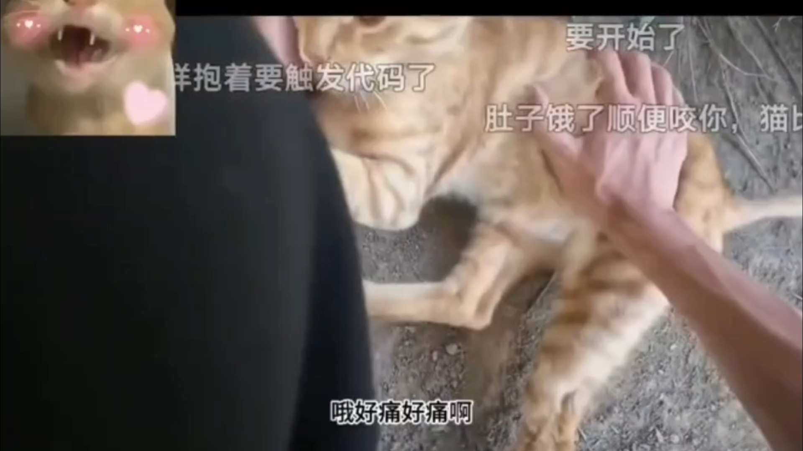 | 13.5万 | 2026-07-15 |
| [【诗岸/改编】概率雨](https://www.bilibili.com/video/BV1HNNQ6bEHs) |  | 34.8万 | 2026-07-14 |
| [基米仍要哈气， 这么多能玩一整天](https://www.bilibili.com/video/BV1V5NS6yEtp) |  | 5774 | 2026-07-13 |
| [僵毁5年老员工被裁员，声称制作组压榨员工，曝光内幕太离谱…](https://www.bilibili.com/video/BV1DZN16ZEcz) |  | 12.1万 | 2026-07-13 |
| [歌词大意：无](https://www.bilibili.com/video/BV1pYNm69Ex9) |  | 17.9万 | 2026-07-13 |
| [《哈基猫奇遇记：华丽水果店的诞生》](https://www.bilibili.com/video/BV126Ny6HEZi) |  | 33.6万 | 2026-07-13 |
| [体型没有树叶大，世界上最小的哈基米](https://www.bilibili.com/video/BV1YXN16AEUP) | 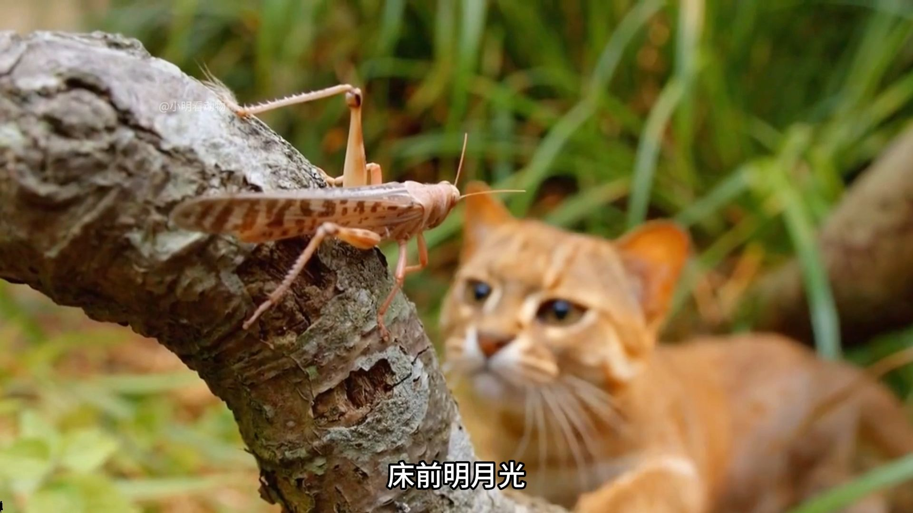 | 1.1万 | 2026-07-13 |
| [剥蒜的情谊222.0](https://www.bilibili.com/video/BV1HCNM6CECo) |  | 34.9万 | 2026-07-12 |
| [人，咪的世界一直在下雨，咪处理不好](https://www.bilibili.com/video/BV11RNN6BEix) | 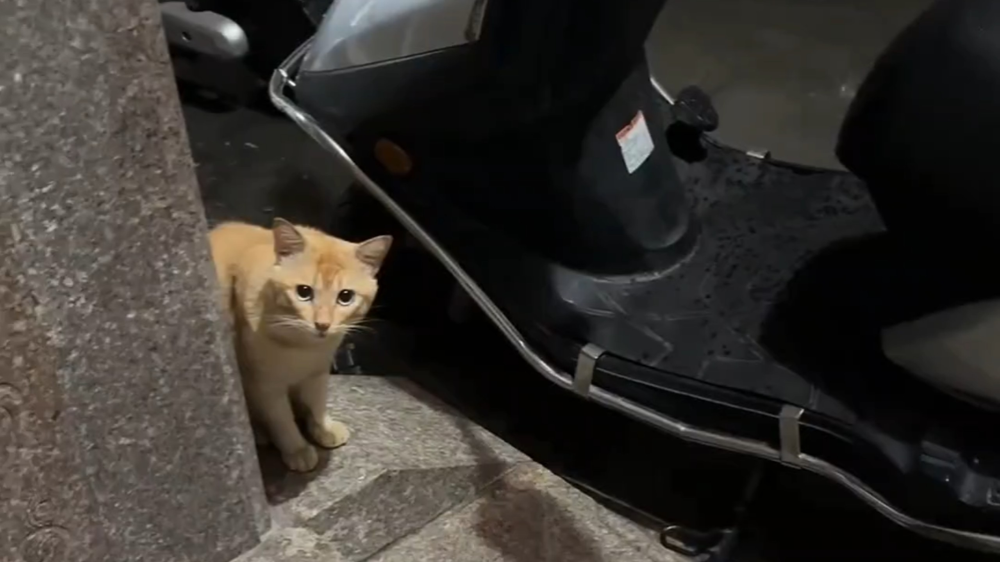 | 13.0万 | 2026-07-12 |
| [大狗：狗叫不止](https://www.bilibili.com/video/BV1K2NA6TEve) |  | 4.7万 | 2026-07-11 |
| [去寻找传说中的哈吉米南北绿豆](https://www.bilibili.com/video/BV18kNx6MEQC) | 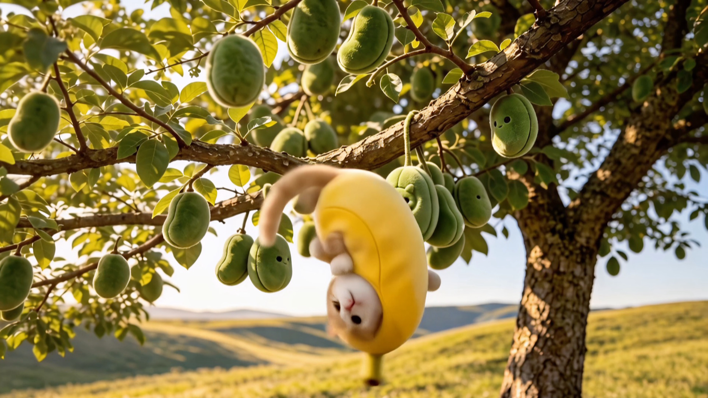 | 189 | 2026-07-11 |
| [当我教会鹦鹉学大狗叫](https://www.bilibili.com/video/BV1Q2Mj6sE9y) | 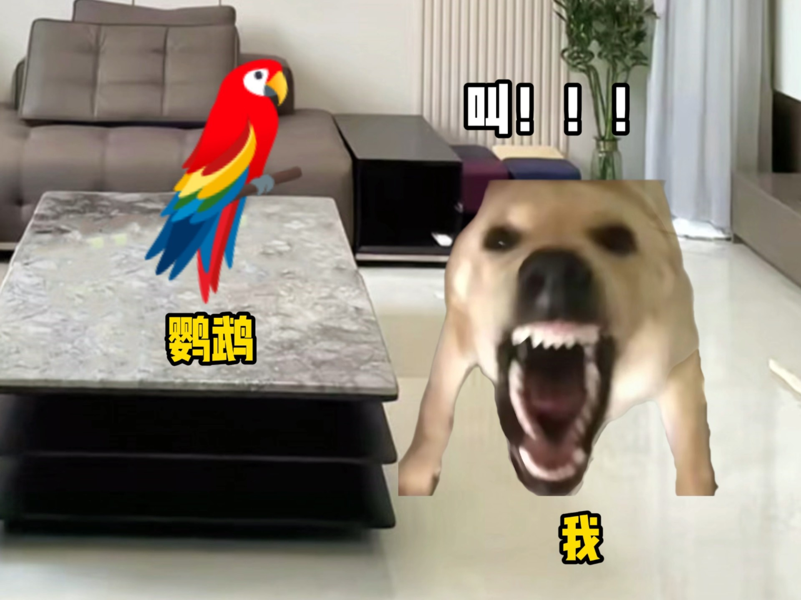 | 20.2万 | 2026-07-09 |
| [惩罚减肥中偷吃东西的肥区](https://www.bilibili.com/video/BV1ViMG61EFC) |  | 7.9万 | 2026-07-08 |
| [假如印度翻拍真人版《哪吒：魔童降世》](https://www.bilibili.com/video/BV17LT16LE1x) |  | 98.7万 | 2026-07-08 |
| [撸到一只彩虹咪～](https://www.bilibili.com/video/BV1a8Tp6iEPf) | 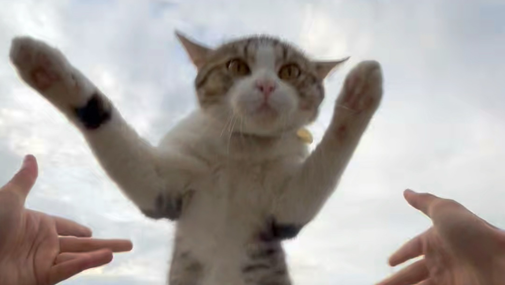 | 8.9万 | 2026-07-03 |
| [哈基米遇到心硬的人](https://www.bilibili.com/video/BV1J5Te6jEVL) |  | 6.1万 | 2026-07-01 |
| [揉曼波](https://www.bilibili.com/video/BV15aTK6cEvc) |  | 75.8万 | 2026-06-28 |
| [女生：多可爱的一首歌啊 男生Be like：](https://www.bilibili.com/video/BV1mdjw6hECF) | 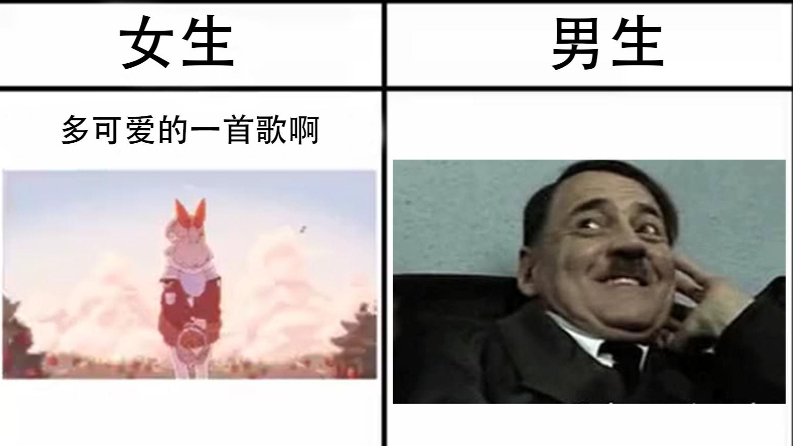 | 99.8万 | 2026-06-18 |
| [来自奶龙的极致美学](https://www.bilibili.com/video/BV17JEM6TECz) |  | 32.2万 | 2026-06-08 |
| [哈基米零帧起手 暴风星云裂](https://www.bilibili.com/video/BV1k8ET66Ebb) | 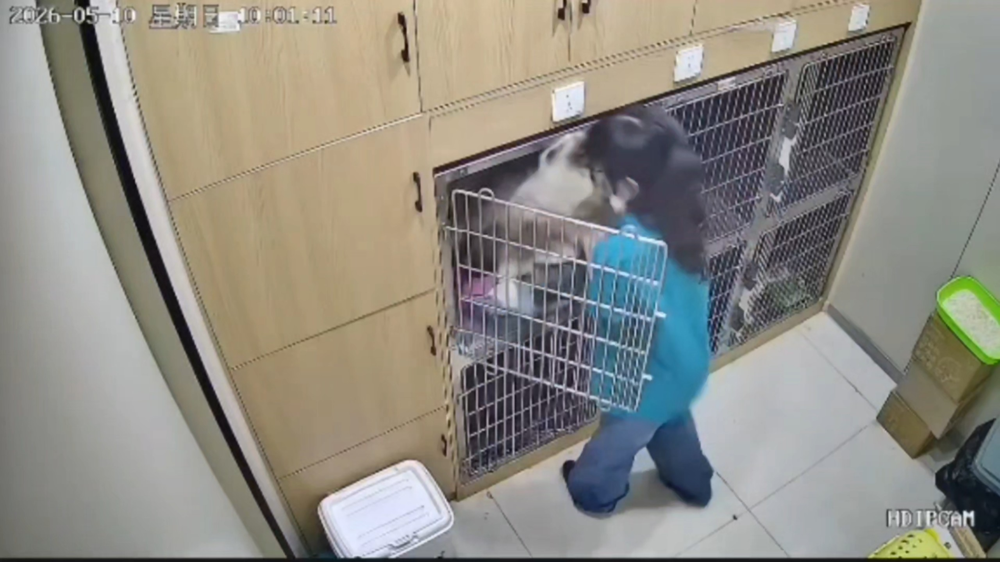 | 1.7万 | 2026-06-08 |
| [华强买瓜，但满口烂梗](https://www.bilibili.com/video/BV1WCVt69EVb) |  | 45.5万 | 2026-05-31 |
| [🇸🇾“中 东 宝 宝”🇸🇾](https://www.bilibili.com/video/BV1rsRsByEdT) |  | 93.5万 | 2026-05-06 |
| [《东南苦行山》⚡️⚡️⚡️摇滚版⚡️⚡️⚡️ 牢蒋の小曲](https://www.bilibili.com/video/BV1oed6B2EXP) |  | 112.4万 | 2026-04-20 |
| [【MeMe集装箱】#267 左脚香喷喷，右脚喷喷香](https://www.bilibili.com/video/BV1MEDpBTE6e) |  | 34.1万 | 2026-04-09 |
| [⚡精卫填海【汪】⚡](https://www.bilibili.com/video/BV1RzQmBQEKo) |  | 153.8万 | 2026-03-25 |
| [依旧回顾经典](https://www.bilibili.com/video/BV1uHP1z6E16) |  | 123.5万 | 2026-03-05 |
| [“鸡蛋里并没有放葱”](https://www.bilibili.com/video/BV1zG6GBPEuM) |  | 24.4万 | 2026-01-28 |
| [猫儿们不要再打了啊！](https://www.bilibili.com/video/BV1M5m1BtEUR) |  | 33.3万 | 2025-12-15 |
| [《基米路口见》“下个基米再见吧”](https://www.bilibili.com/video/BV1EtWwzLE5t) |  | 2019 | 2025-09-21 |
| [自己剪的时候都没绷住](https://www.bilibili.com/video/BV1y2pvz7E1L) |  | 46.5万 | 2025-09-18 |
| [【尖塔梗百科】基米精神](https://www.bilibili.com/video/BV1hkYUz9ERr) |  | 16.0万 | 2025-08-20 |
| [低 价 奥 特 曼](https://www.bilibili.com/video/BV1nPMKzWEeV) |  | 123.9万 | 2025-06-13 |
| [猫儿这个哈气](https://www.bilibili.com/video/BV1WjooYmE8i) | 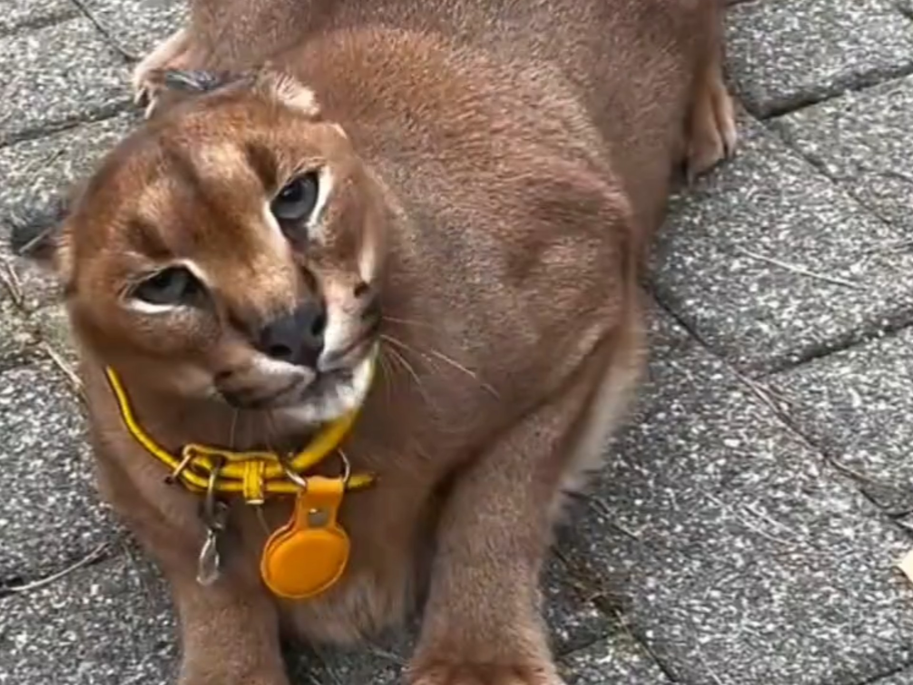 | 11.6万 | 2025-03-28 |
| [怒基米](https://www.bilibili.com/video/BV1GVXbYGEh7) |  | 5.4万 | 2025-03-23 |
| [三脚橘猫被打骨裂，逃进墙缝绝望等死...](https://www.bilibili.com/video/BV1x54y1S7En) | 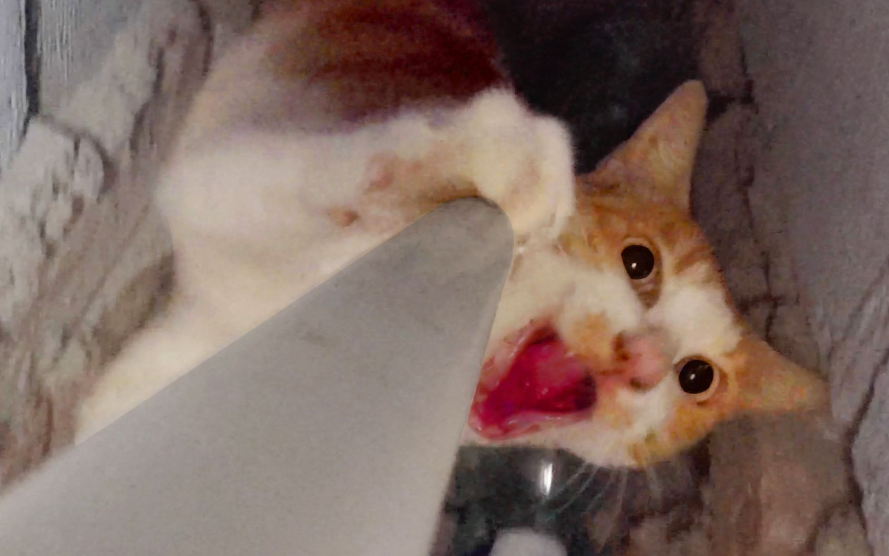 | 198.0万 | 2020-07-25 |

---
*最后更新: 2026-07-19 05:33:06 (自动生成)*
*数据来源: [Bilibili](https://www.bilibili.com)*

## 使用说明

运行以下命令更新视频列表:
```bash
python3 fetch_hajimi_videos.py
```
