# awesome-hajimi
collections of hajimi (哈基米 in Chinese) on the Internet.

## 视频列表 (Video List)

| 视频标题 (Title) | 封面 | 播放量 (Views) | 发布日期 (Date) |
|---|---|---|---|
| [哈基米音乐：哈阔天空（完整版）](https://www.bilibili.com/video/BV11mKu6XED9) |  | 628 | 2026-07-16 |
| [哈基米的最强亡语](https://www.bilibili.com/video/BV1gfKg6NE1F) |  | 1797 | 2026-07-16 |
| [哈基米这个早恋](https://www.bilibili.com/video/BV1HGKu6mE2y) | 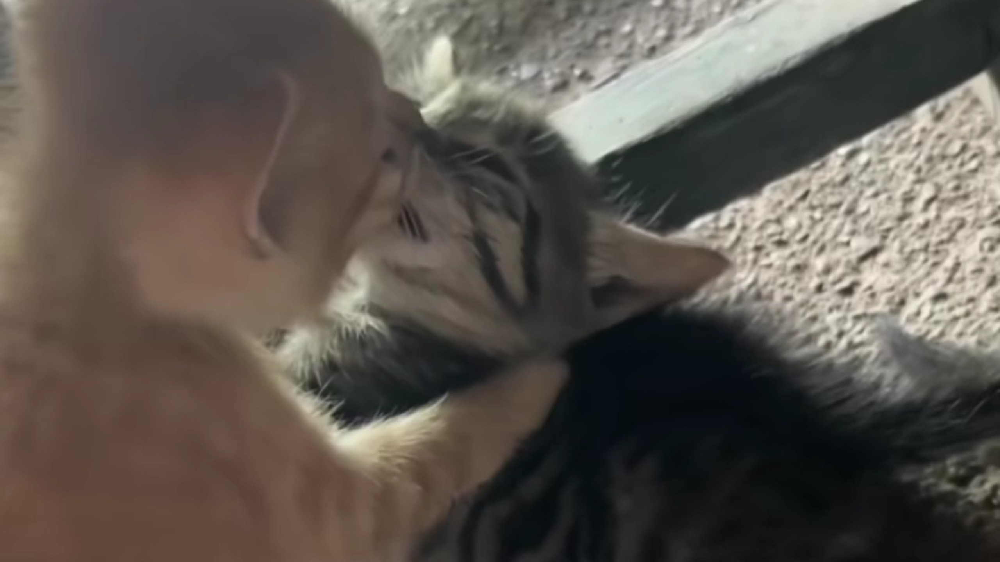 | 482 | 2026-07-15 |
| [哈基米担心哈基人掉下去了](https://www.bilibili.com/video/BV1k5Ku6jEAz) | 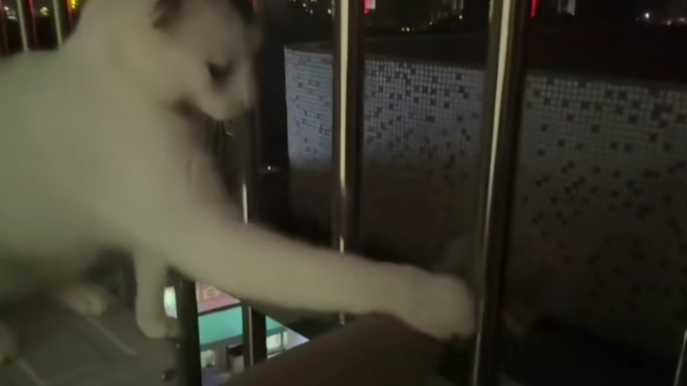 | 3276 | 2026-07-15 |
| [哈基米售货机特别栏目——哈基米的一天](https://www.bilibili.com/video/BV1i3N66REyh) | 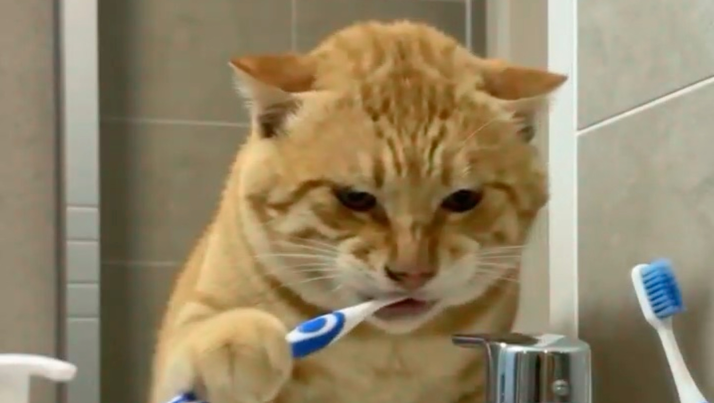 | 2.4万 | 2026-07-15 |
| [哈基米这个哼哈二将](https://www.bilibili.com/video/BV1WqNB6FEy3) | 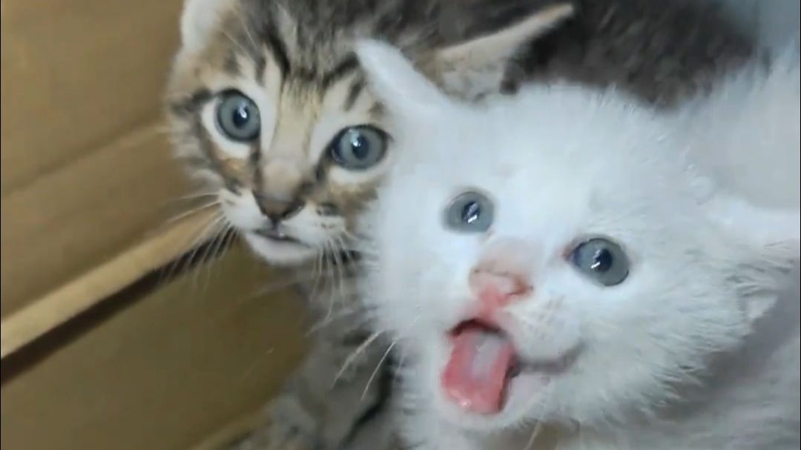 | 727 | 2026-07-15 |
| [一口气了解大狗叫兴盛史，大狗叫如何窃取哈基米果实？](https://www.bilibili.com/video/BV1hJNB6rEWG) |  | 1.0万 | 2026-07-15 |
| [哈基米跑刀4](https://www.bilibili.com/video/BV1nkNB6dE1s) | 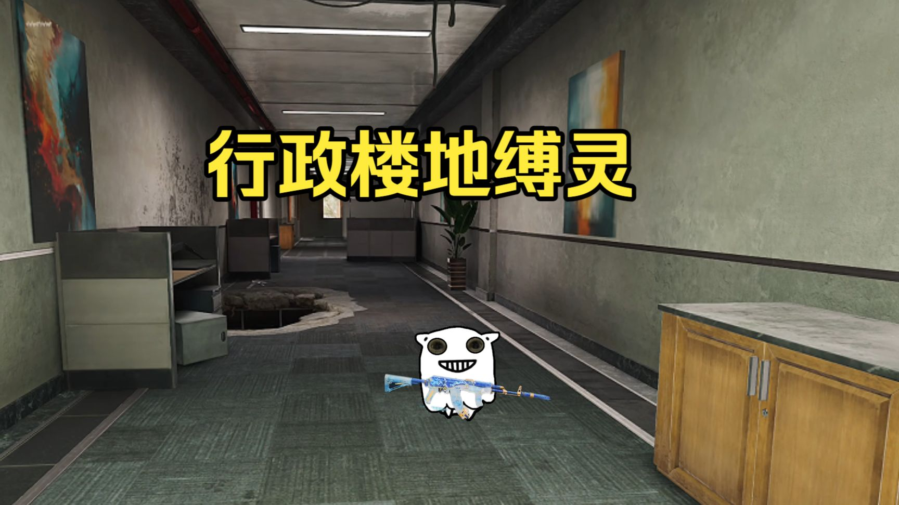 | 522 | 2026-07-15 |
| [哈基米这个都快亲上了](https://www.bilibili.com/video/BV1EbNz6sE4B) | 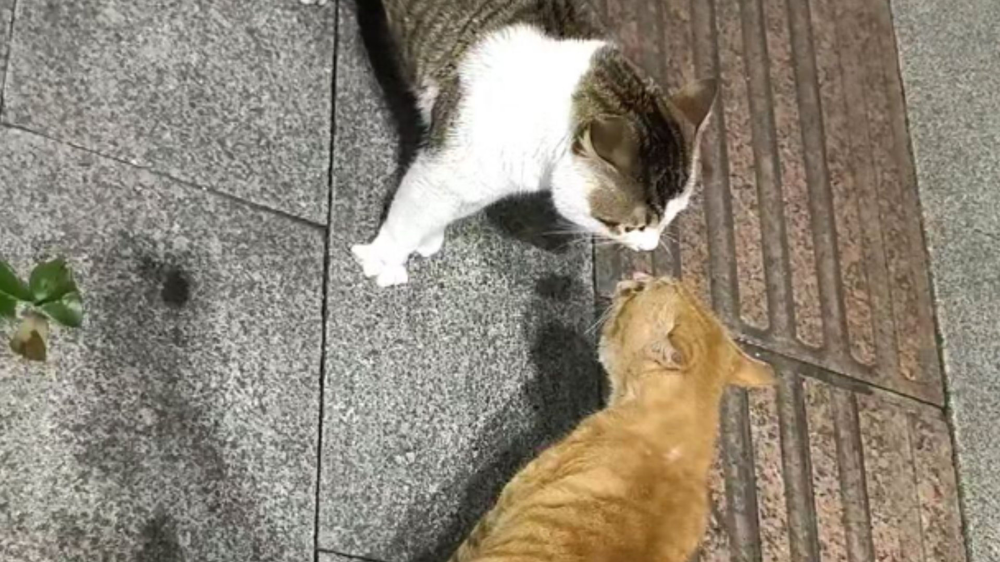 | 2035 | 2026-07-15 |
| [哈基米这个享受](https://www.bilibili.com/video/BV1FxNz64Ekm) | 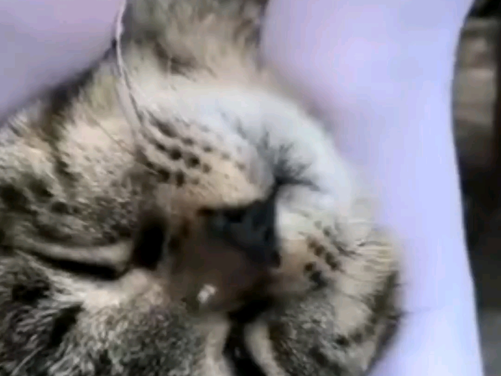 | 149 | 2026-07-15 |
| [哈基米的奖励摇💗](https://www.bilibili.com/video/BV1ecN86QEpR) |  | 2059 | 2026-07-15 |
| [上司：你的兄弟喝了哈基米南北绿豆毒死了啊](https://www.bilibili.com/video/BV13FNq6iE3M) |  | 2017 | 2026-07-15 |
| [想展示蜜桃，被哈基米捣乱，只能展示jiojio](https://www.bilibili.com/video/BV1KuNq68Em7) | 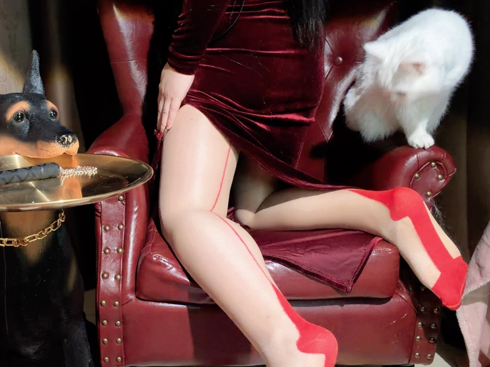 | 2010 | 2026-07-15 |
| [人类才是哈基米真正的大爹，如视频所示](https://www.bilibili.com/video/BV1hrNq6BEet) | 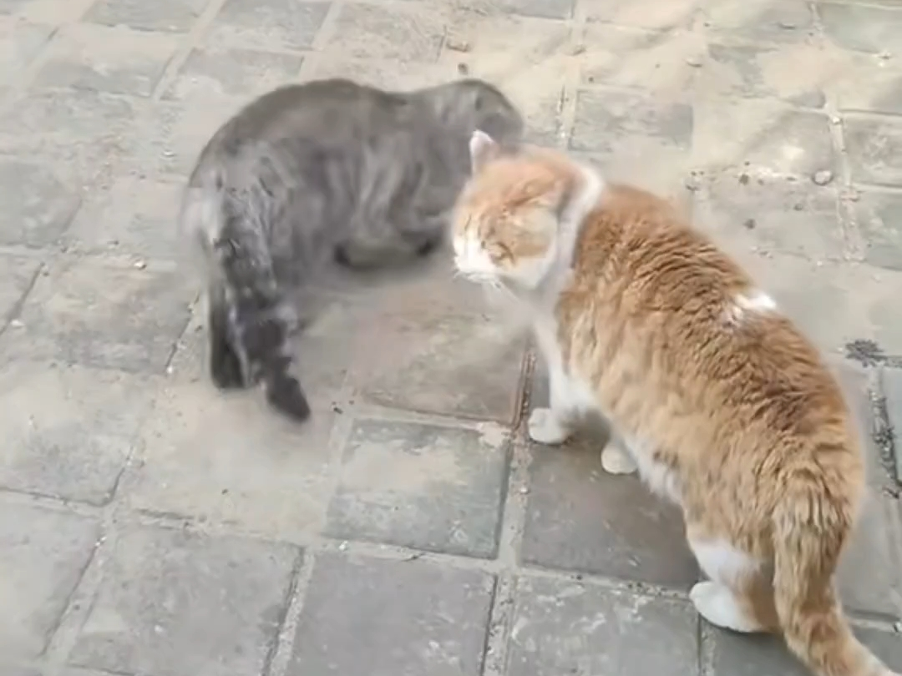 | 737 | 2026-07-15 |
| [「HiRes」【⚡哈基米电音⚡ x hypertrance】Hyper Hachimi （原曲：hyperReality-nuphory/crayvxn）](https://www.bilibili.com/video/BV1DCNq6TEn3) |  | 466 | 2026-07-15 |
| [dagourous](https://www.bilibili.com/video/BV1NNNv6sEPo) | 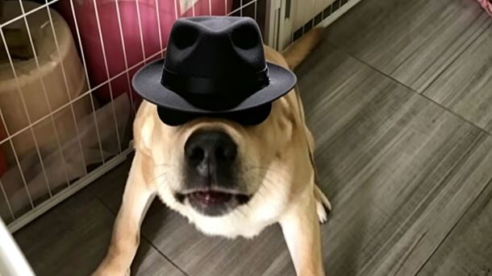 | 6.4万 | 2026-07-15 |
| [美女师姐大战哈基米！](https://www.bilibili.com/video/BV1cGNv6SEb1) |  | 26.9万 | 2026-07-15 |
| [哈基米百态合集](https://www.bilibili.com/video/BV1dNNi6VEmL) | 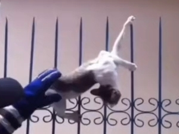 | 1257 | 2026-07-15 |
| [❤️谁  家  小  猫❤️](https://www.bilibili.com/video/BV16oNv6UECP) |  | 211 | 2026-07-15 |
| [哈基米正在练习单杠](https://www.bilibili.com/video/BV185Ne6bEMN) | 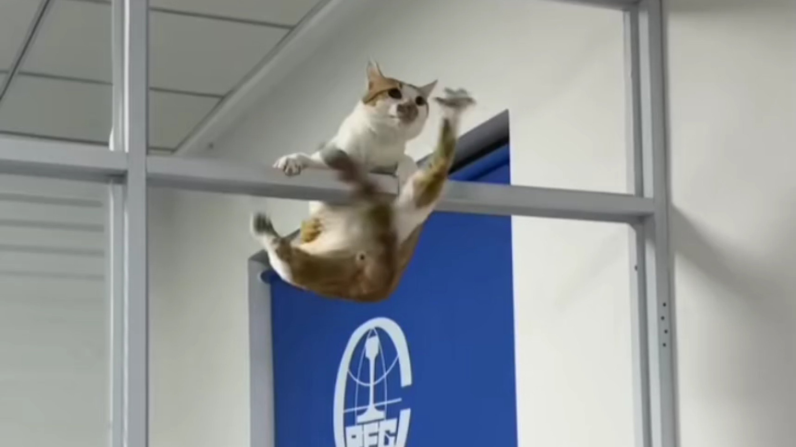 | 1613 | 2026-07-14 |
| [哈基米争抢地盘](https://www.bilibili.com/video/BV185Ne6bEVZ) | 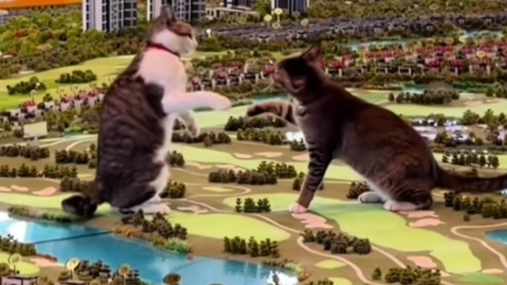 | 1.0万 | 2026-07-14 |
| [猫和老鼠 ｜ 你听我狡辩一下嘛](https://www.bilibili.com/video/BV13WNQ6jEGU) |  | 80.6万 | 2026-07-14 |
| [猫儿这个打包](https://www.bilibili.com/video/BV1LVNb6RExQ) | 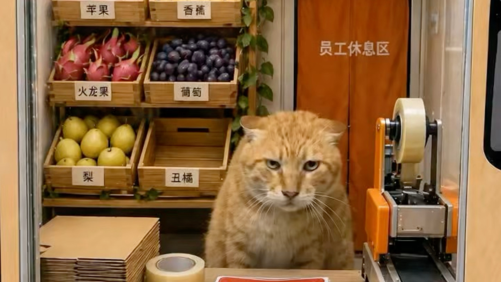 | 6.5万 | 2026-07-14 |
| [以后就没有哈基米听了](https://www.bilibili.com/video/BV1AFNb6eE4F) |  | 148 | 2026-07-14 |
| [哈基米](https://www.bilibili.com/video/BV1cwNb6AErA) | 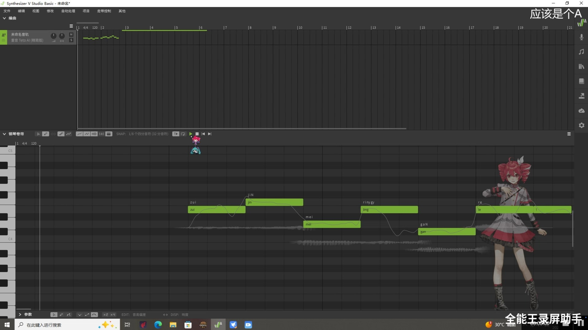 | 433 | 2026-07-14 |
| [恐怖版新音乐：扭曲的基米](https://www.bilibili.com/video/BV1GpNb6UEaL) |  | 4.2万 | 2026-07-14 |
| [哈基米](https://www.bilibili.com/video/BV1t9NX6yE8Z) | 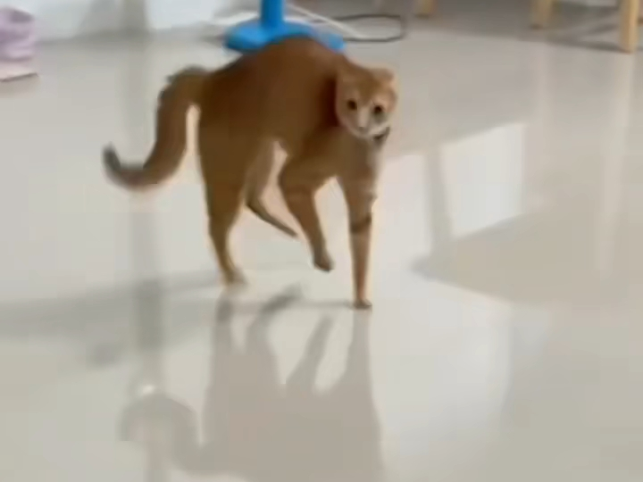 | 81 | 2026-07-14 |
| [大家有没有发现，哈基米什么时候从韩宝仪《往事只能回味》的伴奏跑到高胜美《往事只能回味》的伴奏上去了，而且网络上还出了不少的翻唱？](https://www.bilibili.com/video/BV1tdNX6VEiZ) | 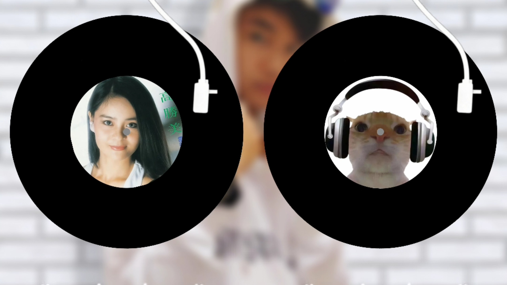 | 232 | 2026-07-14 |
| [老吴不在，基米快睡着了](https://www.bilibili.com/video/BV1HNNQ6bE3E) | 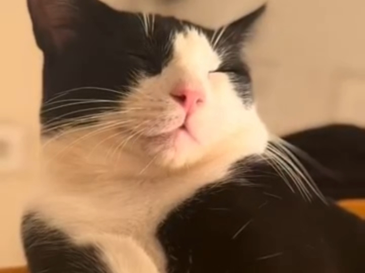 | 6109 | 2026-07-14 |
| [烧米库](https://www.bilibili.com/video/BV1NzNQ6KENp) |  | 6130 | 2026-07-14 |
| [🐴🎙️我来人间一趟🐴本想光芒万丈🐴🎙️【Hi-Res/4K】](https://www.bilibili.com/video/BV1fDNQ6oE9L) |  | 1025 | 2026-07-14 |
| [小女孩和哈基米](https://www.bilibili.com/video/BV1viND6EEGN) | 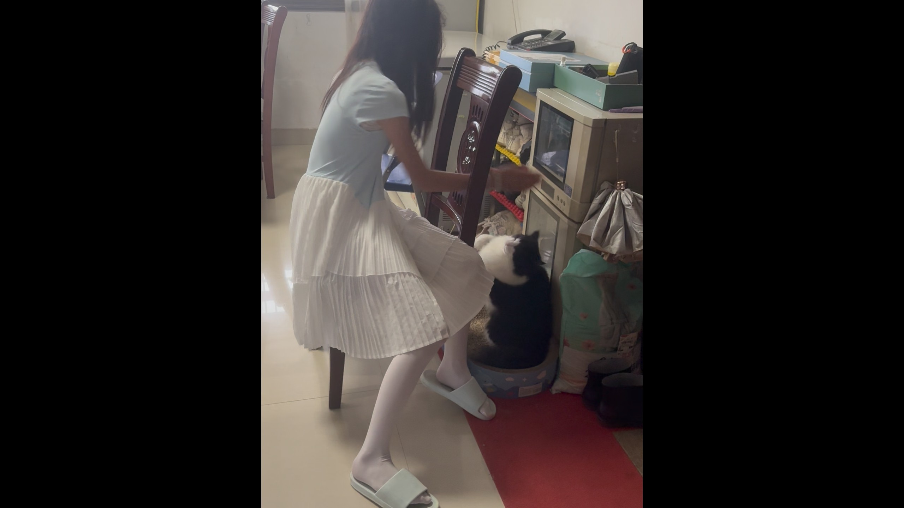 | 7437 | 2026-07-13 |
| [猫儿这个垃圾分类](https://www.bilibili.com/video/BV1BWNU6UE72) | 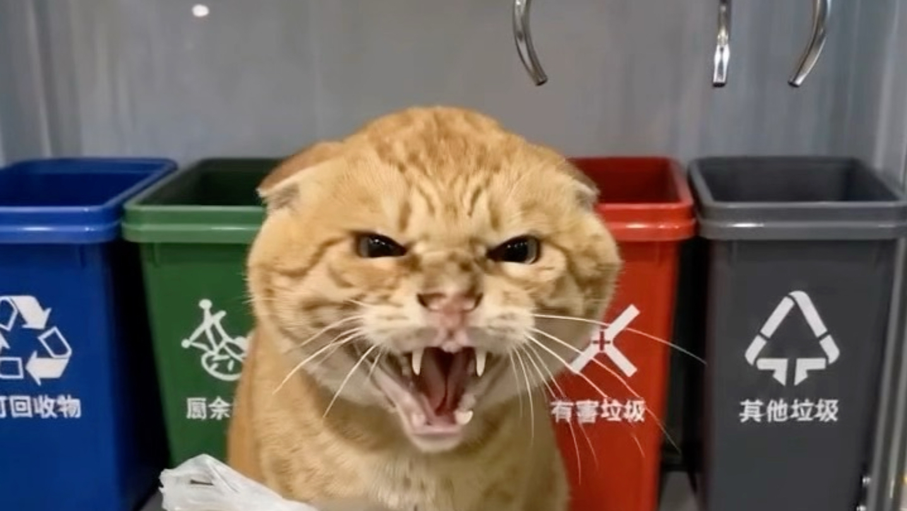 | 3.8万 | 2026-07-13 |
| [偶遇哈基米](https://www.bilibili.com/video/BV1k7NU6XEWQ) | 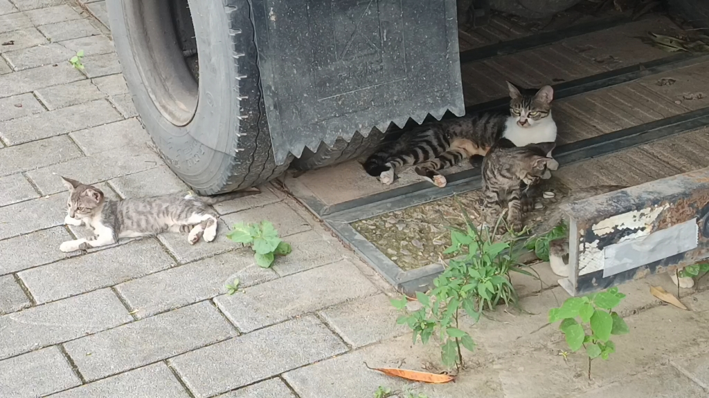 | 294 | 2026-07-13 |
| [无我楼上、大狗叫唤、基米灭裂-『无我大狗』战斗曲](https://www.bilibili.com/video/BV1VGNm6ME79) | 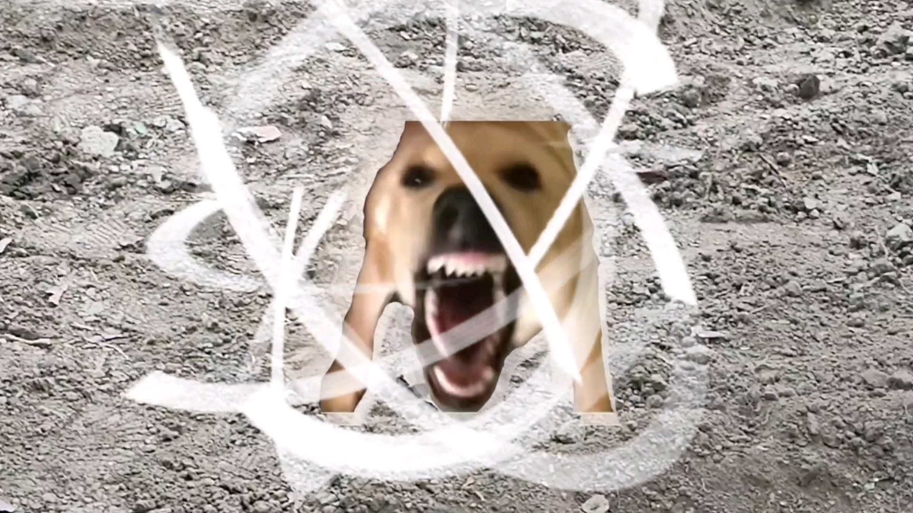 | 13.2万 | 2026-07-13 |
| [哈基米老板备货ing](https://www.bilibili.com/video/BV1yaNm6sEDG) | 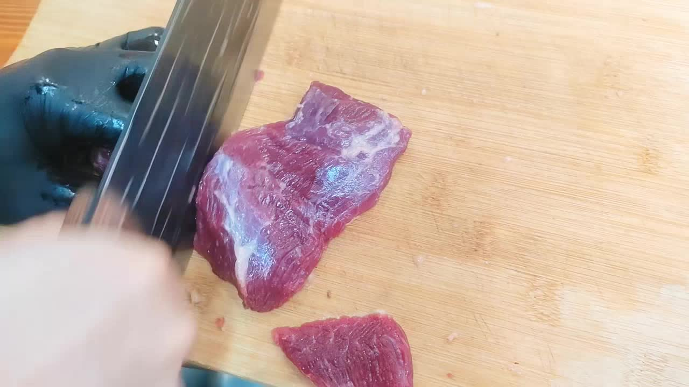 | 5649 | 2026-07-13 |
| [哈基米南北绿豆](https://www.bilibili.com/video/BV1qfNy6uEd4) |  | 85 | 2026-07-13 |
| [大狗：Rush 叫 之专注轻机枪（原曲不使用）](https://www.bilibili.com/video/BV1NtN16JEw2) |  | 7997 | 2026-07-13 |
| [⚡往事只能哈基⚡ 遇上我这只小猫咪你晚上几点回家呢~](https://www.bilibili.com/video/BV1JvN16yE6c) |  | 131 | 2026-07-13 |
| [哈基米牛肉饭店内环境改造成果](https://www.bilibili.com/video/BV1QdN16FEBV) | 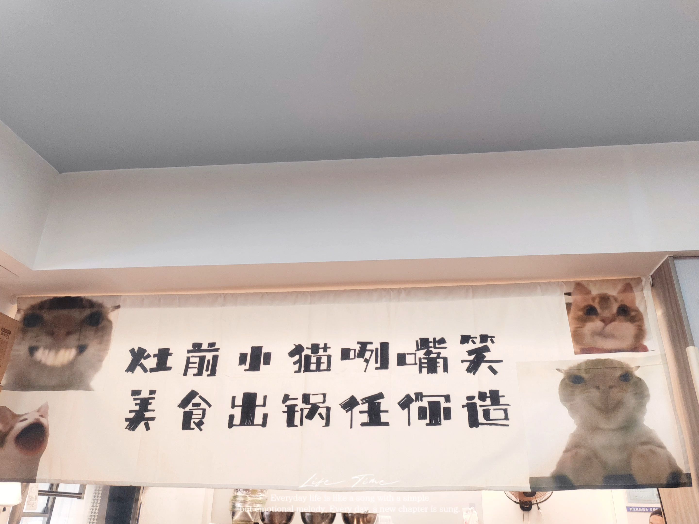 | 1.2万 | 2026-07-13 |
| [咪燃不尽  哈气不息](https://www.bilibili.com/video/BV1NsNC6yEx9) | 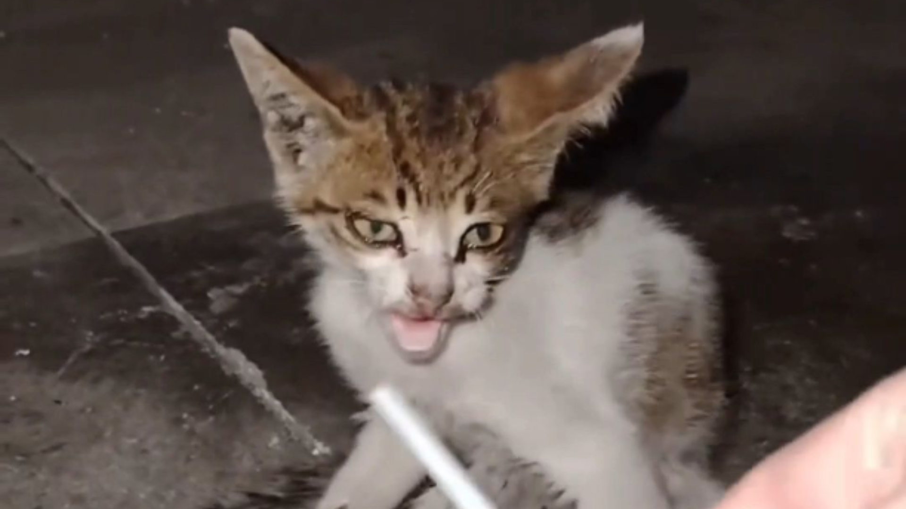 | 1036 | 2026-07-13 |
| [哈基米的挑战](https://www.bilibili.com/video/BV1KLNu6QE19) | 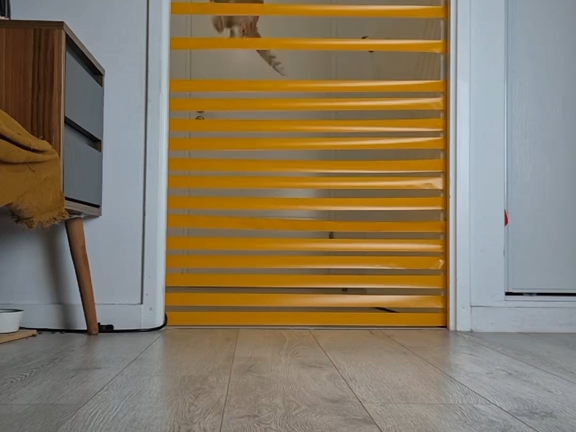 | 26 | 2026-07-13 |
| [【基米TV】斗魂竞基场回归](https://www.bilibili.com/video/BV1u5Nu6pEj8) | 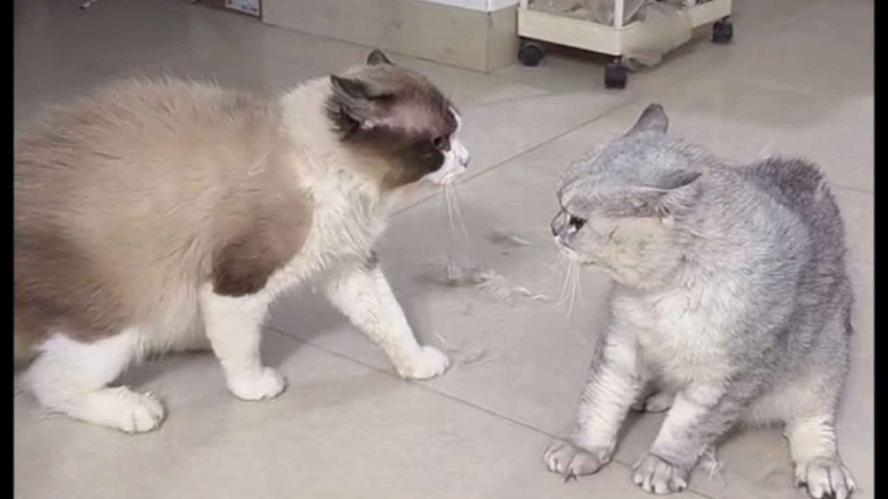 | 1.3万 | 2026-07-12 |
| [如果植物全是大哥，会发生什么？](https://www.bilibili.com/video/BV1jENg6zEzD) |  | 124.1万 | 2026-07-12 |
| [循环歌单｜【捡蜗牛の小曲】“小时候，农村，旱厕附近，经常，捡蜗牛，吃”【旱厕蜗牛の小曲】](https://www.bilibili.com/video/BV1EaNT6AEWR) |  | 4.8万 | 2026-07-12 |
| [来自印度的大狗叫](https://www.bilibili.com/video/BV1gFNN6jEYe) | 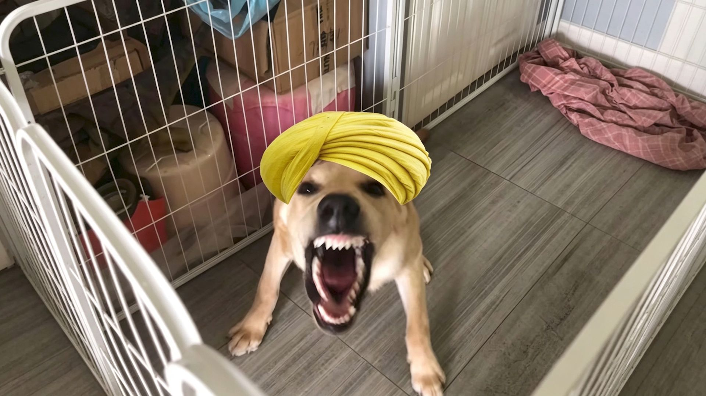 | 1.3万 | 2026-07-12 |
| [哈基米VS大狗嚼](https://www.bilibili.com/video/BV1jRNM6KEDE) | 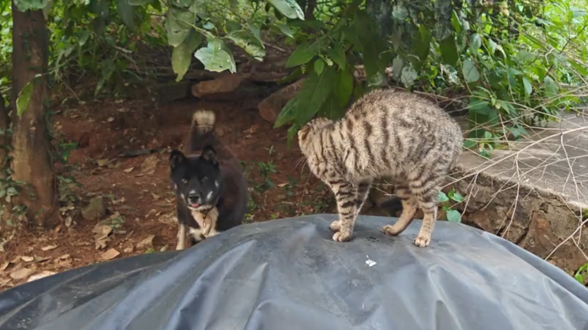 | 1423 | 2026-07-12 |
| [[Funk循环]丨雷霆动物集体蹦迪神人老头鬼火漂移【BL STUDIO HARDTEKK】【后室の小曲】【桃花源记の小曲】](https://www.bilibili.com/video/BV1XzNN6UEm8) |  | 7.2万 | 2026-07-12 |
| [我 还 以 为 减 速 带 呢](https://www.bilibili.com/video/BV1pVNA6fEMf) |  | 87.1万 | 2026-07-11 |
| [｛哈基米｝](https://www.bilibili.com/video/BV1umNN65EJB) | 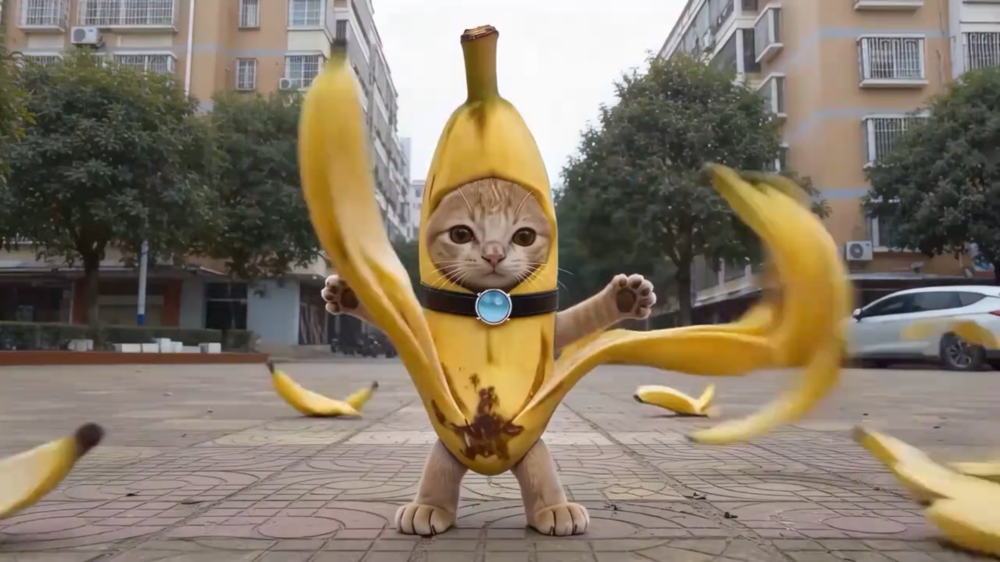 | 14 | 2026-07-11 |
| [吸引猫猫的叫声](https://www.bilibili.com/video/BV141Nc6FE6q) | 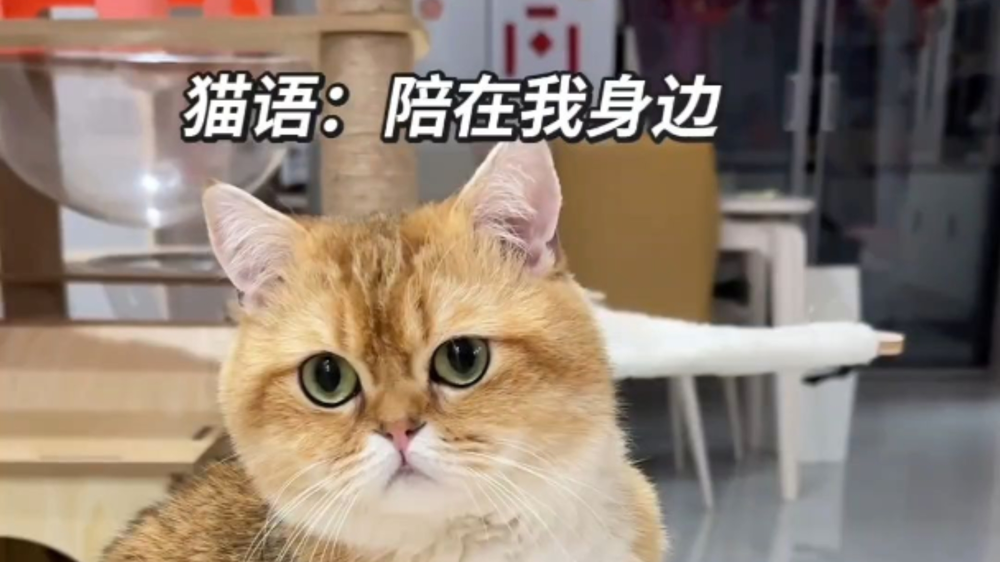 | 5516 | 2026-07-11 |
| [【小曲一响，主角登场】盘点2026年6月爆火の小曲合集，很多人听过却不知道歌名！](https://www.bilibili.com/video/BV1YGNw66ECb) |  | 92.8万 | 2026-07-11 |
| [哈基米那没路躲](https://www.bilibili.com/video/BV1CeN46aEio) |  | 409 | 2026-07-11 |
| [“雷霆动物集体蹦迪，汽车光头百万撤离”【天堂的彼端-变速】【顶级智斗の小曲】](https://www.bilibili.com/video/BV1DFNt6yE9G) |  | 457.8万 | 2026-07-11 |
| [笑了你就有巧乐兹吃的“Meme&#x27;s”#136](https://www.bilibili.com/video/BV1i7NJ6cEKE) |  | 6.4万 | 2026-07-11 |
| [🔥雪地里传来了大狗叫🔥](https://www.bilibili.com/video/BV1ARNW6HEFh) |  | 55.3万 | 2026-07-11 |
| [小猫想念猫爸爸    小猫和猫妈妈的海边寻爸爸之旅](https://www.bilibili.com/video/BV1aJTX6REsK) | 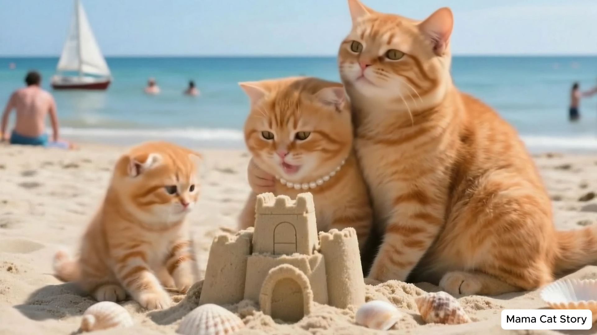 | 3052 | 2026-07-11 |
| [猫的反应速度是猫的7倍~](https://www.bilibili.com/video/BV1ViMG61Ett) | 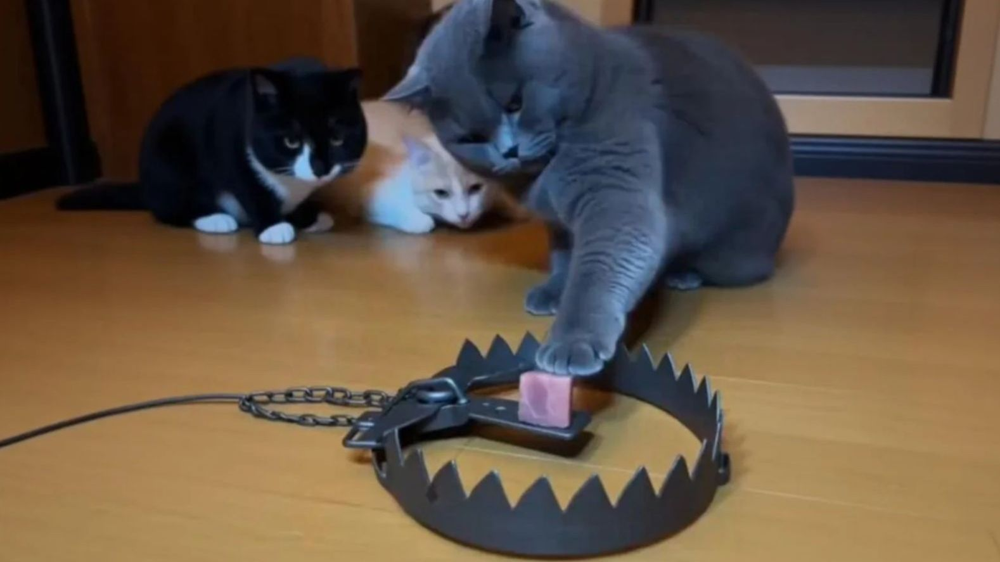 | 16.9万 | 2026-07-11 |
| [半夜遇到哈基米](https://www.bilibili.com/video/BV14wNW6oENz) |  | 158 | 2026-07-10 |
| [哈基米狩猎合集](https://www.bilibili.com/video/BV14kNH6QE7Y) | 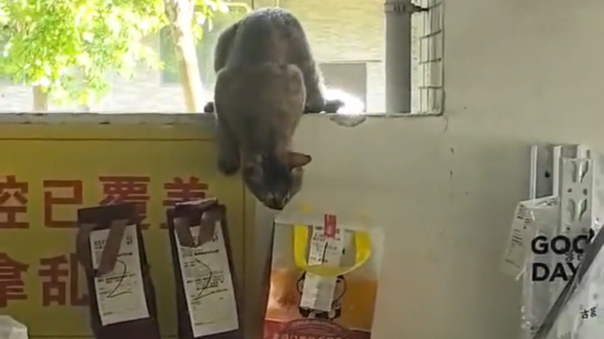 | 496 | 2026-07-10 |
| [《白菜魔丸》1-51](https://www.bilibili.com/video/BV1pNNJ6uEcA) |  | 1.7万 | 2026-07-10 |
| [欸？大狗？](https://www.bilibili.com/video/BV14qNJ67ERz) |  | 115.2万 | 2026-07-10 |
| [当广东人听说有台风时](https://www.bilibili.com/video/BV1LwNn6cEiC) | 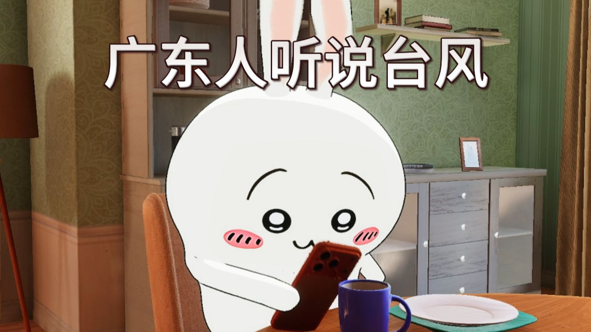 | 6.8万 | 2026-07-10 |
| [经过几天的反思，我意识到了自己的不足与错误，给大家道歉。](https://www.bilibili.com/video/BV1w2NJ63EVz) | 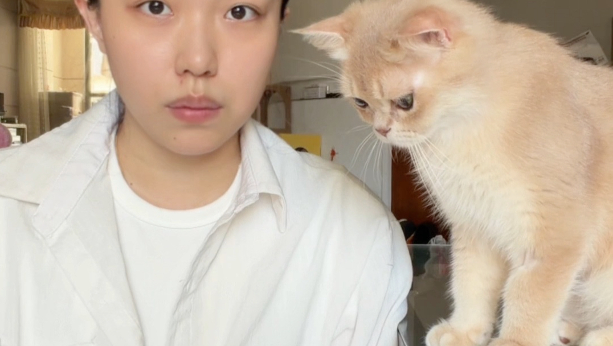 | 29.3万 | 2026-07-10 |
| [【重音テト原创曲】小鸡拱麻袋 - 能绷住说明你是超主人公](https://www.bilibili.com/video/BV1GiMG61E9i) | 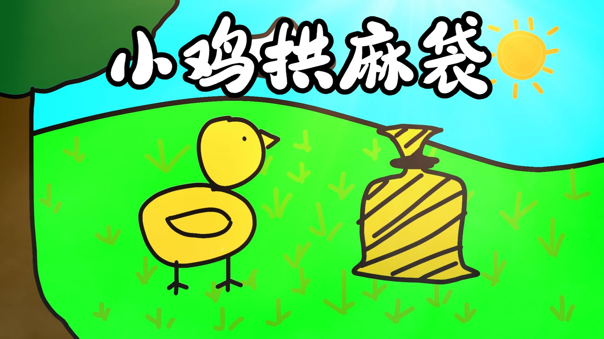 | 25.9万 | 2026-07-10 |
| [⚡️大闹天宫摇一摇⚡️](https://www.bilibili.com/video/BV1ktNn6VE8R) |  | 233.4万 | 2026-07-10 |
| [荒废多年的臭水塘变成猫猫们的饮水地](https://www.bilibili.com/video/BV1ULNn6nEy8) |  | 236.7万 | 2026-07-10 |
| [人，来被萌宠狠狠治愈吧！](https://www.bilibili.com/video/BV1QFNE6XEU3) |  | 27.9万 | 2026-07-10 |
| [原来猫咪的手也是掩体会触发哈气，还有教小奶猫哈气。](https://www.bilibili.com/video/BV1ksNE6qEJb) | 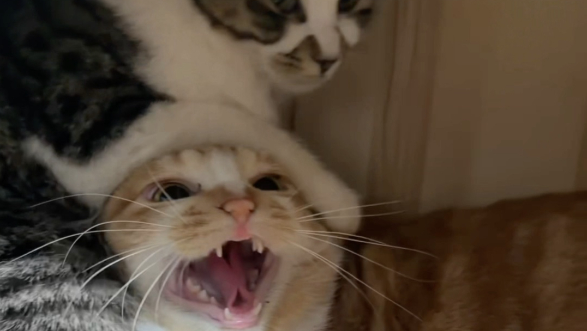 | 2.7万 | 2026-07-10 |
| [【B-FUNK】〖单曲循环〗NO BATIDÃO(Explicit)](https://www.bilibili.com/video/BV1iWMh6iEFY) | 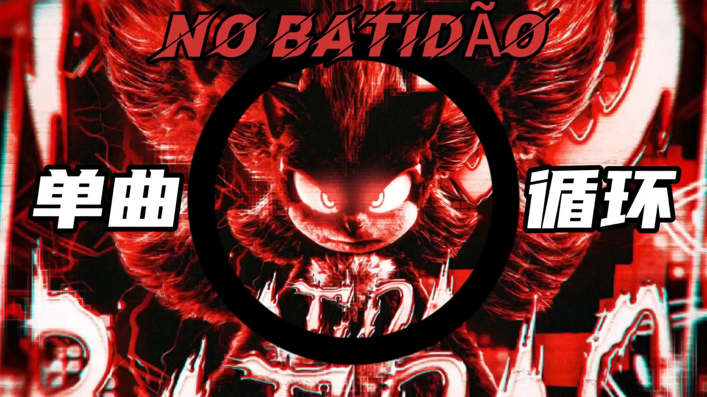 | 7.4万 | 2026-07-10 |
| [这才是《The Other Side Of Paradise》原版MV！](https://www.bilibili.com/video/BV1beM76pEBL) |  | 648.5万 | 2026-07-10 |
| [小奶猫第一次打疫苗怕痛，只能包起来了](https://www.bilibili.com/video/BV1LrME6iENu) | 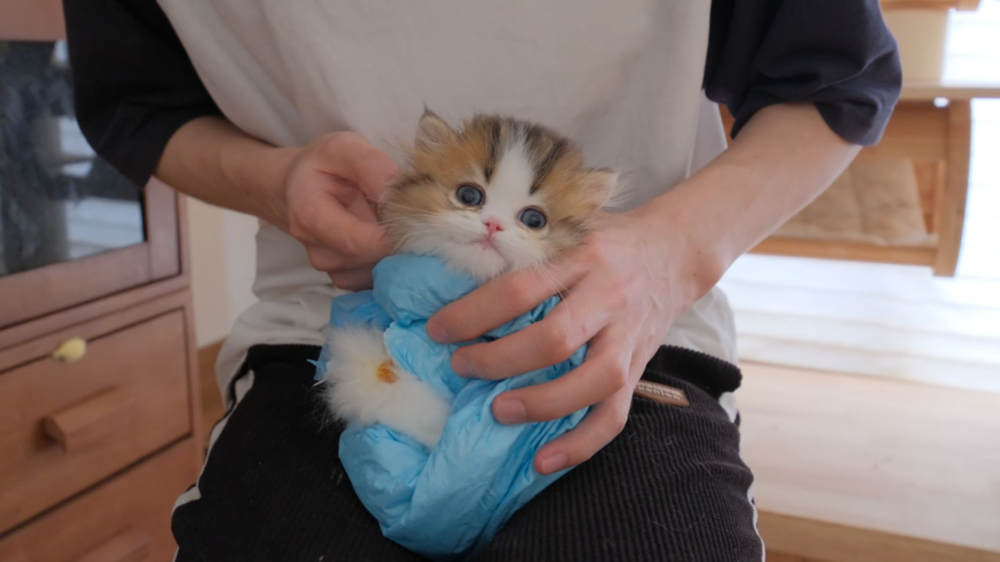 | 4.3万 | 2026-07-09 |
| [郝 哥 不 在 2.0](https://www.bilibili.com/video/BV1MEME6pEcc) |  | 409.6万 | 2026-07-09 |
| [对象的口味belike](https://www.bilibili.com/video/BV1LCME6NETy) |  | 3.6万 | 2026-07-09 |
| [医生帮猫妈接生曼波](https://www.bilibili.com/video/BV1eCME6NEpf) | 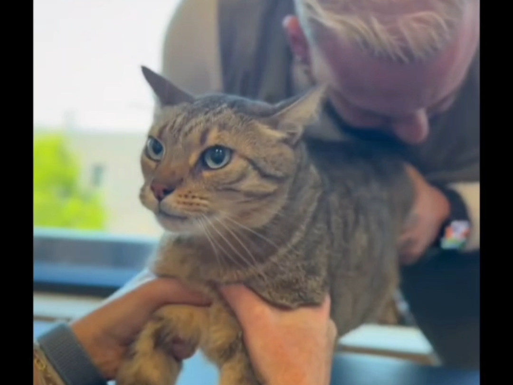 | 2500 | 2026-07-09 |
| [大狗 Can&#x27;t Wait 叫](https://www.bilibili.com/video/BV1XSME6cEoB) | 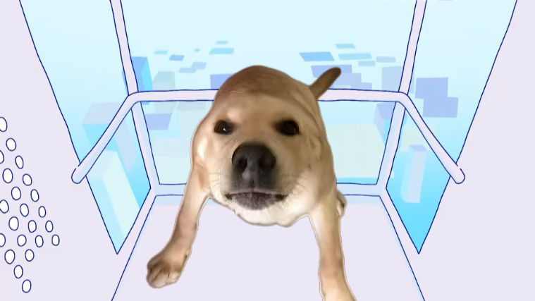 | 18.1万 | 2026-07-09 |
| [🎵大狗 𝑵𝒐 𝑴𝒐𝒓𝒆🎵不再狗叫](https://www.bilibili.com/video/BV15zM56HEMj) | 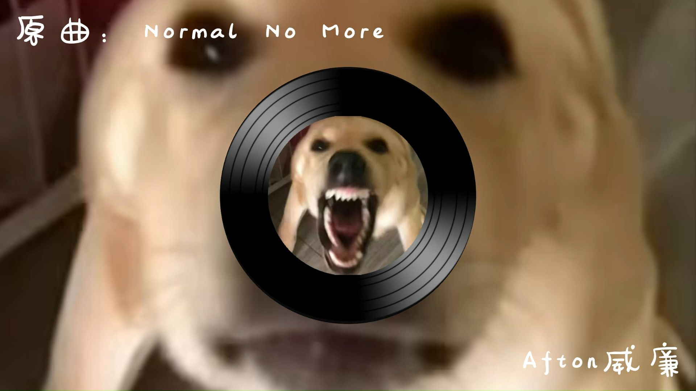 | 3143 | 2026-07-09 |
| [哈基鼠面对哈基米使用了咏春叶问](https://www.bilibili.com/video/BV1oGML6ZEpn) | 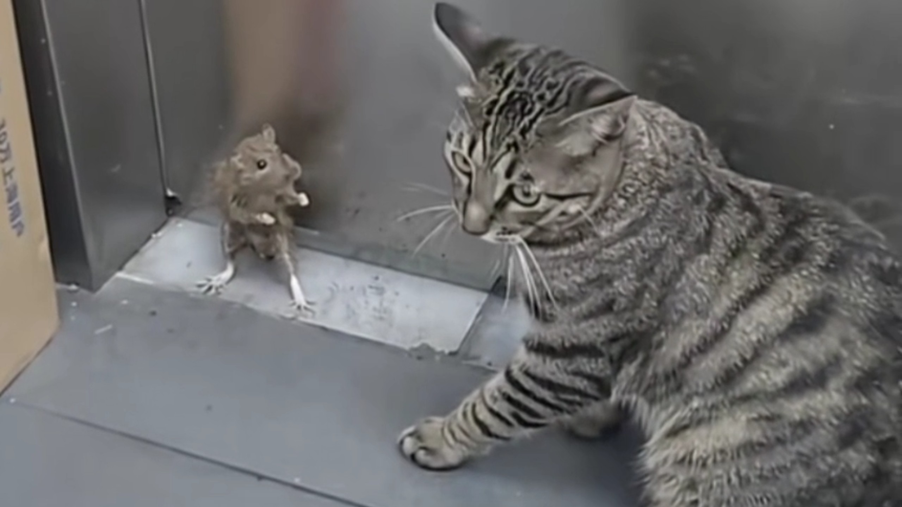 | 316 | 2026-07-09 |
| [哈吉米南北绿豆](https://www.bilibili.com/video/BV1iUM36mENP) | 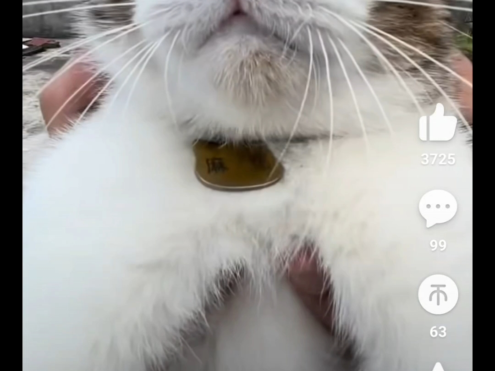 | 183 | 2026-07-08 |
| [《寂寞的人伤心的歌》《得吃の小曲》《鼠鼠の小曲》（dj版）](https://www.bilibili.com/video/BV1EpMG6sELe) |  | 1803 | 2026-07-08 |
| [活到现在就是为了这声](https://www.bilibili.com/video/BV1hkMG6rETf) |  | 232.9万 | 2026-07-08 |
| [乔治养了新宠物，打开盒子那一刻傻眼了，竟是一只小僵尸](https://www.bilibili.com/video/BV1XxMb64Eyq) | 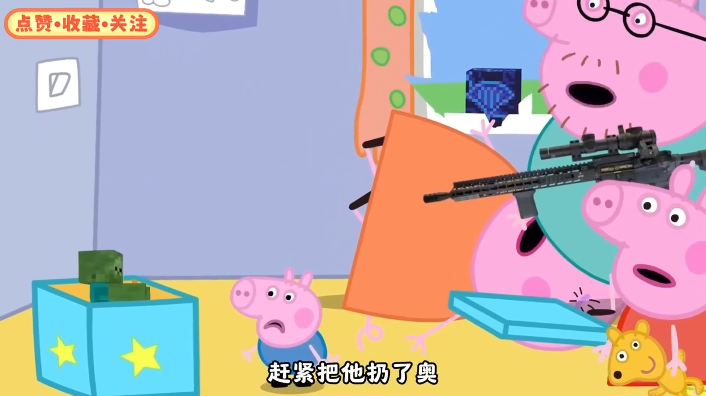 | 7.9万 | 2026-07-07 |
| [&quot;啊，这不对吧！！！&quot;](https://www.bilibili.com/video/BV1nvM86gEn8) | 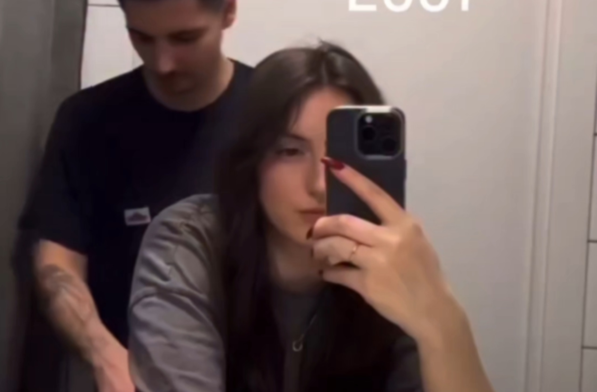 | 53.6万 | 2026-07-07 |
| [《三绷演义》](https://www.bilibili.com/video/BV1pxMt6BEhi) |  | 91.5万 | 2026-07-07 |
| [给我擦皮鞋](https://www.bilibili.com/video/BV1FoMM61EMU) |  | 4.9万 | 2026-07-05 |
| [哈基米誓死守卫叮咚鸡](https://www.bilibili.com/video/BV1oRMP68EkL) | 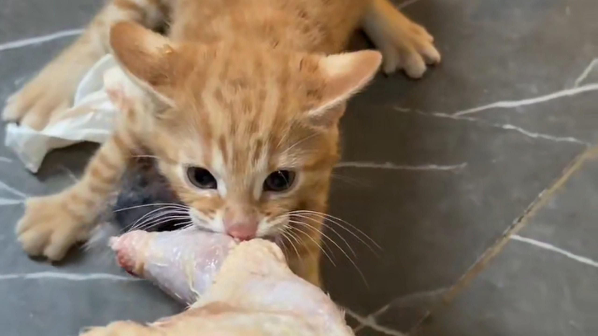 | 1.6万 | 2026-07-04 |
| [干嘛猫在家生活的一天](https://www.bilibili.com/video/BV16UTr6KEuC) | 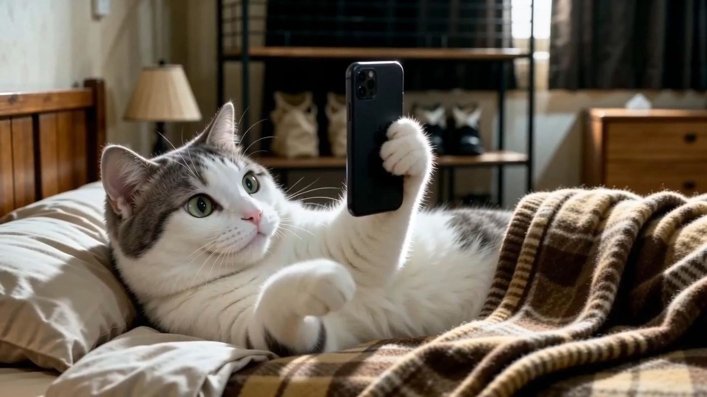 | 720 | 2026-07-02 |
| [哈吉米](https://www.bilibili.com/video/BV1t3Tk6nEkn) | 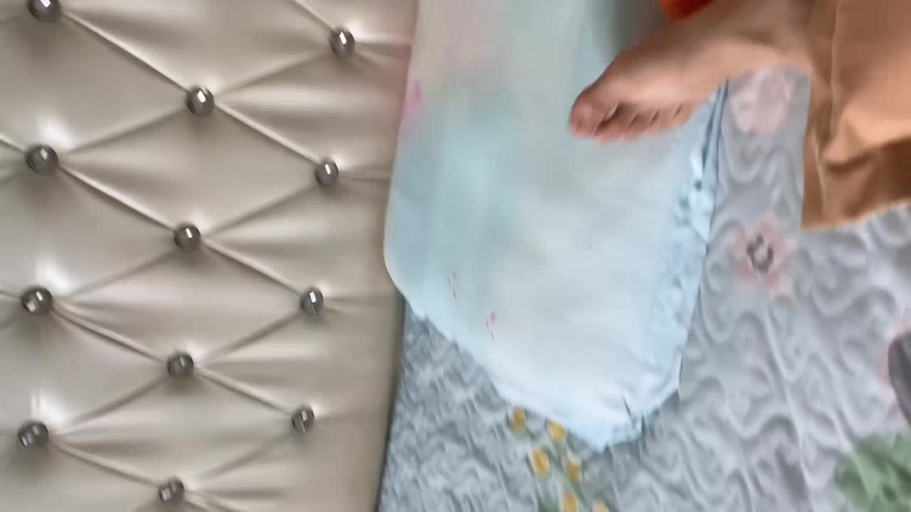 | 213 | 2026-07-02 |
| [误入盘丝洞？？！【食色鑫也】外网傻缺人与动物合集#100](https://www.bilibili.com/video/BV1ZdTa6zEKD) |  | 20.4万 | 2026-06-30 |
| [邪恶哈基米vs摄政王兽医](https://www.bilibili.com/video/BV1s4T56iETV) |  | 10.0万 | 2026-06-29 |
| [哈基米炸药管](https://www.bilibili.com/video/BV16v7Y6uEMt) | 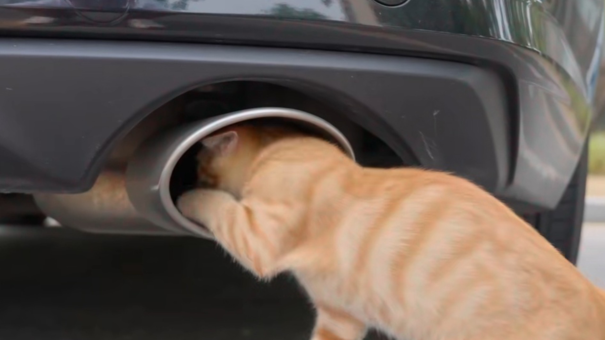 | 9.5万 | 2026-06-25 |
| [gentleman🙏🏻🙏🏻🙏🏻](https://www.bilibili.com/video/BV1M4j96GEvU) |  | 3.1万 | 2026-06-24 |
| [🙏🏻🙏🏻🙏🏻](https://www.bilibili.com/video/BV1TEji6REbB) |  | 10.9万 | 2026-06-19 |
| [&quot;这是个悲伤的故事&quot;](https://www.bilibili.com/video/BV1Ycjw6MEk2) | 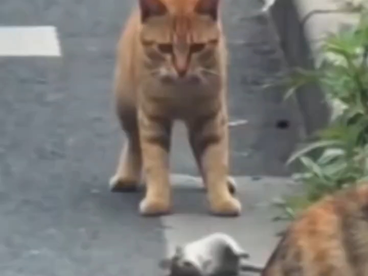 | 100.2万 | 2026-06-18 |
| [女孩一直在我店里玩我的猫，也不走怎么办，我还要做生意](https://www.bilibili.com/video/BV1yNJA6NEiQ) | 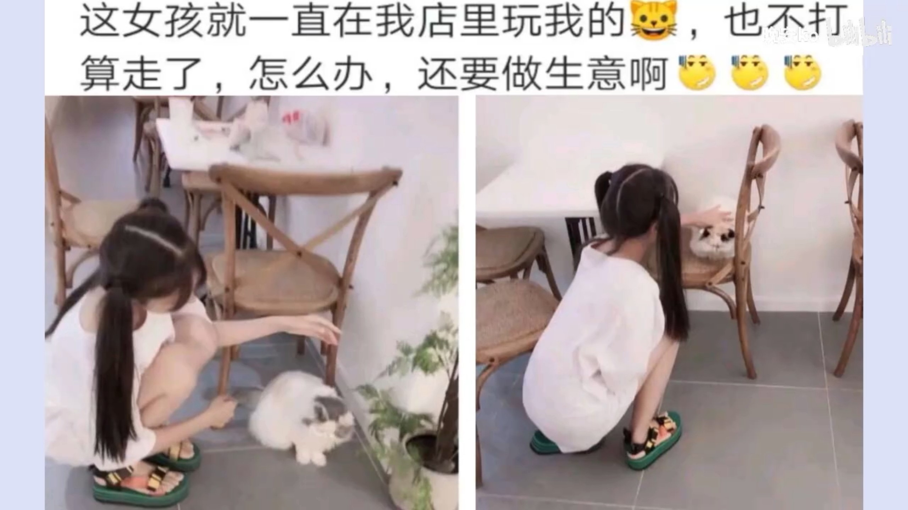 | 18.0万 | 2026-06-14 |
| [三猫魔性舞·科目三](https://www.bilibili.com/video/BV1XfQZBUE79) |  | 20.4万 | 2026-03-24 |
| [布鲁斯这个跨物种交配哈基米](https://www.bilibili.com/video/BV1KhZMB7EQK) | 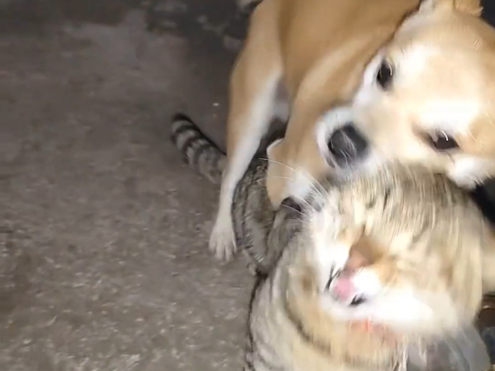 | 1.8万 | 2026-02-16 |
| [哈基米把哈基鼠当枕头靠了](https://www.bilibili.com/video/BV1eBJazLEQq) | 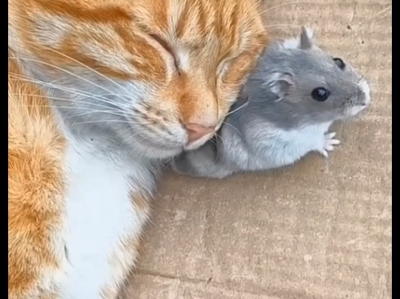 | 50.4万 | 2025-05-20 |
| [哄睡哈基米](https://www.bilibili.com/video/BV1H984e2Ebm) | 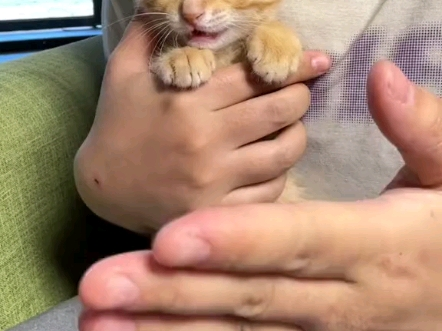 | 68.0万 | 2024-07-22 |
| [💣欢乐斗基米💣](https://www.bilibili.com/video/BV17H4y1w7Zb) |  | 11.1万 | 2024-06-25 |

---
*最后更新: 2026-07-16 05:20:49 (自动生成)*
*数据来源: [Bilibili](https://www.bilibili.com)*

## 使用说明

运行以下命令更新视频列表:
```bash
python3 fetch_hajimi_videos.py
```
