# awesome-hajimi
collections of hajimi (哈基米 in Chinese) on the Internet.

## 视频列表 (Video List)

| 视频标题 (Title) | 封面 | 播放量 (Views) | 发布日期 (Date) |
|---|---|---|---|
| [神人对决之要乐奈大战哈基米](https://www.bilibili.com/video/BV1TMMx6GEBR) |  | 129 | 2026-07-07 |
| [哈基米文斗](https://www.bilibili.com/video/BV1DxM46UEw7) | 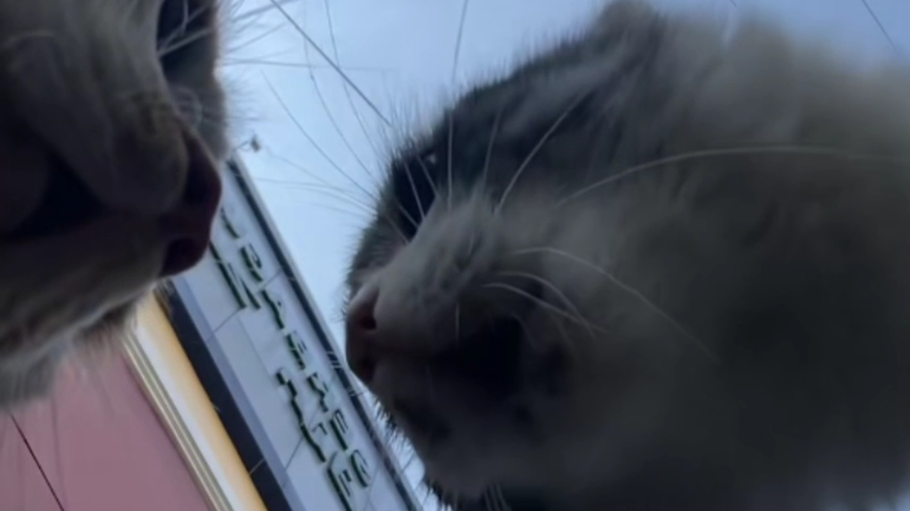 | 861 | 2026-07-07 |
| [【大狗叫】二泉映月](https://www.bilibili.com/video/BV1PWTd6SEdy) |  | 4586 | 2026-07-06 |
| [哈基米 爱猫 合集](https://www.bilibili.com/video/BV1RyTd6NE1j) | 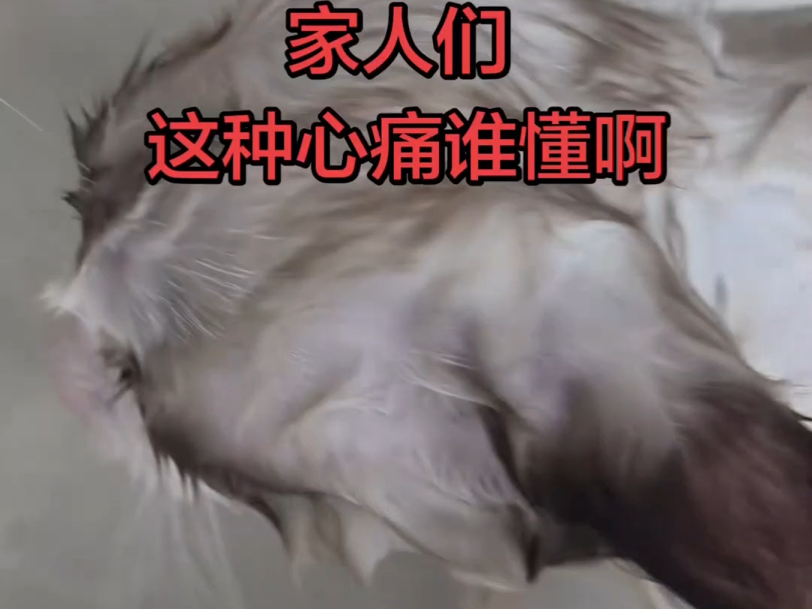 | 1196 | 2026-07-06 |
| [🐱爵银龙BGM 朱に染むる基米【哈基米音乐】🐱](https://www.bilibili.com/video/BV1GAT96xEjc) | 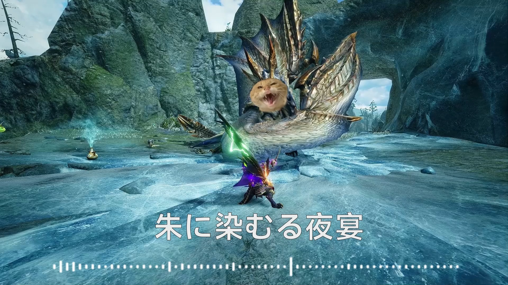 | 1352 | 2026-07-06 |
| [哈基米怕得吹泡泡](https://www.bilibili.com/video/BV1uTT96XEnw) | 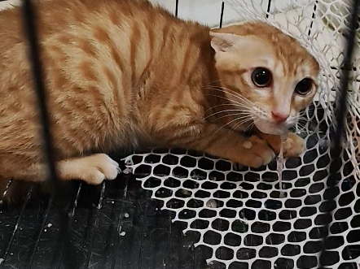 | 1666 | 2026-07-06 |
| [哈基米这个被困，cos路易十六这一块](https://www.bilibili.com/video/BV1eoTX68EBJ) | 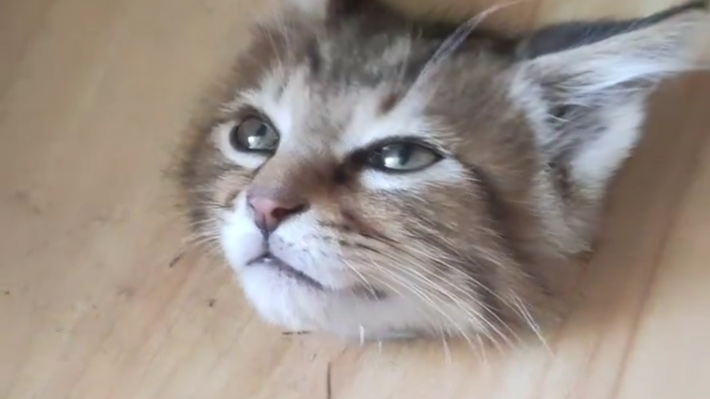 | 2.7万 | 2026-07-06 |
| [【哈基米音乐】璃月 Part1](https://www.bilibili.com/video/BV1oXTX6AEkU) |  | 346 | 2026-07-06 |
| [《sleep  2》](https://www.bilibili.com/video/BV17eT96NEsy) |  | 7432 | 2026-07-06 |
| [【哈基米】我的哈基米](https://www.bilibili.com/video/BV1oeT96PE3X) |  | 250 | 2026-07-06 |
| [《stay with 咪》昭和基米](https://www.bilibili.com/video/BV1RHTR6wEsC) |  | 615 | 2026-07-06 |
| [《唐·小鸟》说唱](https://www.bilibili.com/video/BV1cGT167Ebt) |  | 7.2万 | 2026-07-06 |
| [🐱盛夏，悠闲，与哈基米🐱](https://www.bilibili.com/video/BV1B8TQ6FE5h) |  | 209 | 2026-07-06 |
| [哈基米你这家伙以前还挺快乐的](https://www.bilibili.com/video/BV1K3TQ6GE6F) |  | 890 | 2026-07-06 |
| [《哈基米の音乐合基》“唱出了多少人的心声！”](https://www.bilibili.com/video/BV1x3TQ6GEge) | 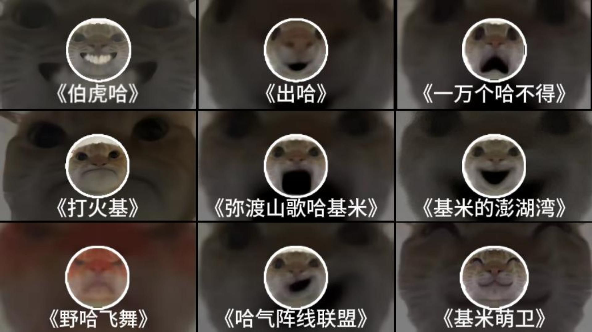 | 4210 | 2026-07-06 |
| [哈基米基米基，啊西嘎啊西-翻唱《往事只能哈基米》-VioletZero薇尔（虚拟歌手）](https://www.bilibili.com/video/BV1eETX6xEkb) |  | 1306 | 2026-07-06 |
| [有一只大狗在你的草坪上](https://www.bilibili.com/video/BV1HCTX6uEUs) |  | 7.7万 | 2026-07-06 |
| [哈基米专业鉴宝](https://www.bilibili.com/video/BV1XiTS6jEuy) | 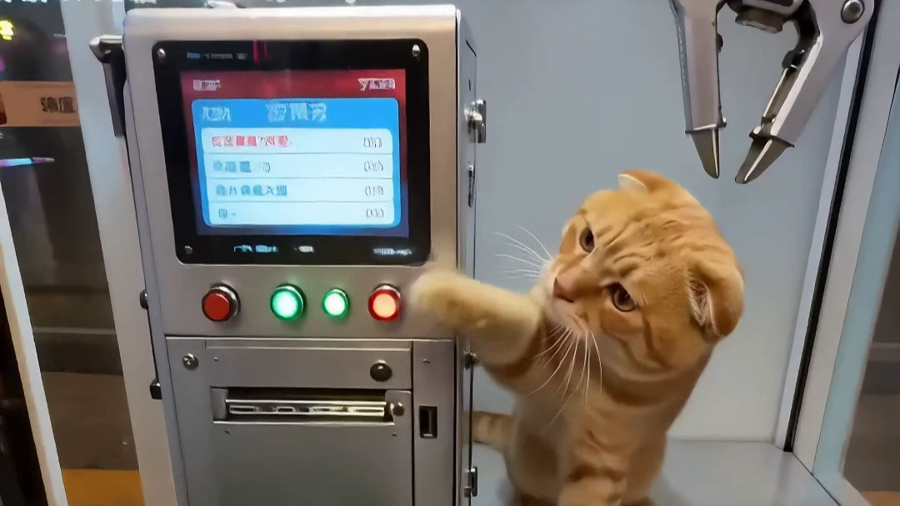 | 3288 | 2026-07-06 |
| [哈基米南北绿豆，纯享版，一网打尽](https://www.bilibili.com/video/BV1wcTD6cEAd) | 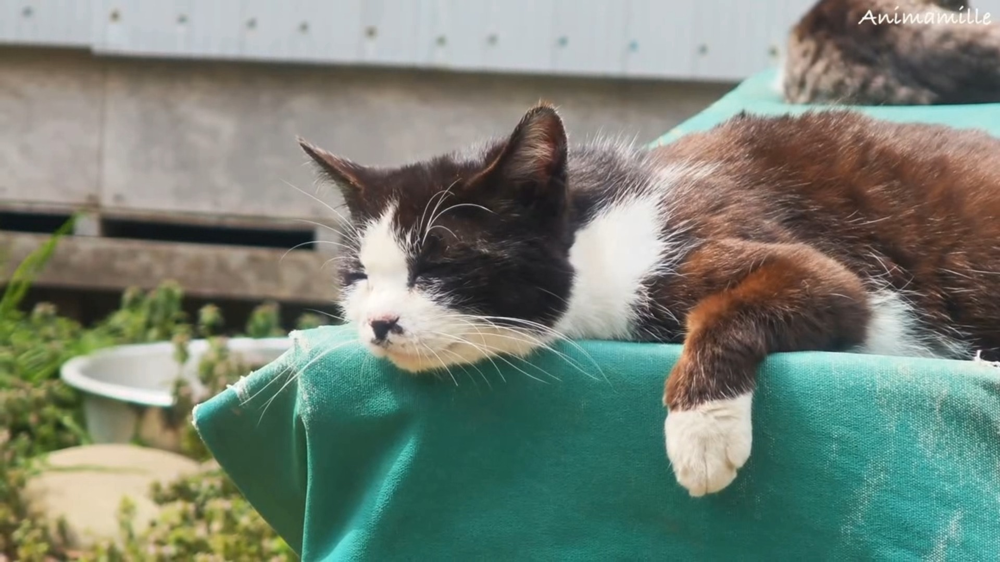 | 356 | 2026-07-06 |
| [我chovy，你开门给我开好了啊！](https://www.bilibili.com/video/BV1TeTC6sE65) |  | 18.6万 | 2026-07-06 |
| [哈基米这个招财猫](https://www.bilibili.com/video/BV1rXTm6oEy7) | 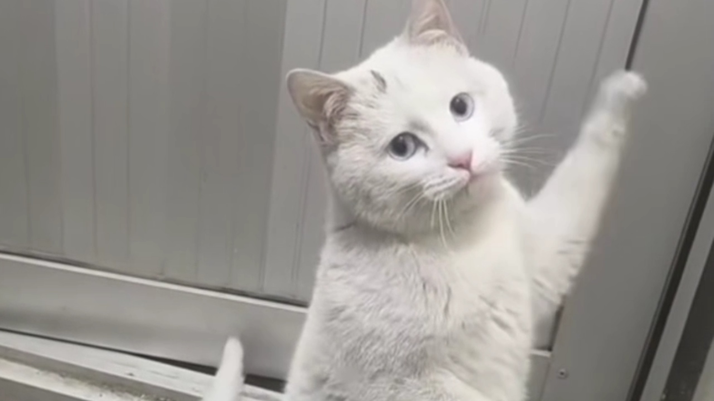 | 1683 | 2026-07-06 |
| [哈基米这个桌面清理大师](https://www.bilibili.com/video/BV1BcTU6HEVc) | 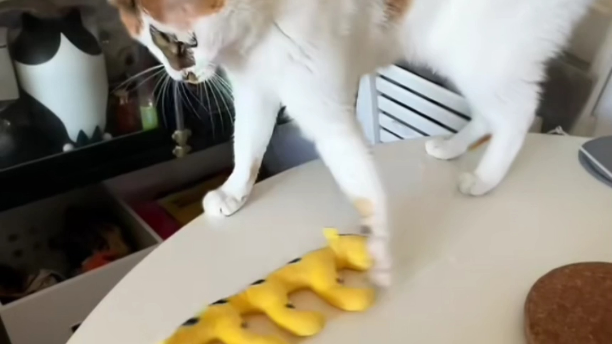 | 1.5万 | 2026-07-06 |
| [从管道中倒出三只哈基米](https://www.bilibili.com/video/BV1ZcTU6HEk6) | 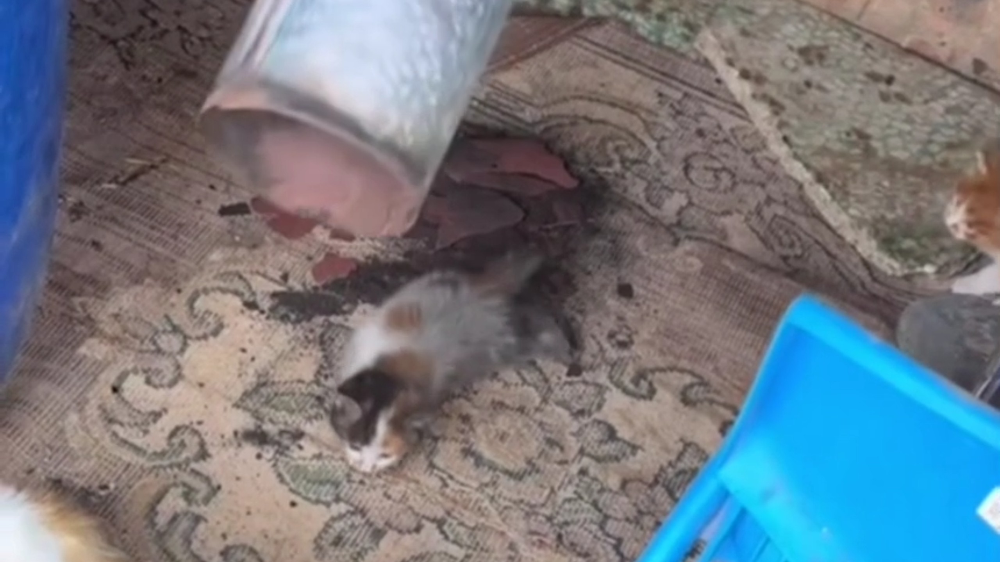 | 675 | 2026-07-06 |
| [饭桶哈基米](https://www.bilibili.com/video/BV1qcTU6HEmG) | 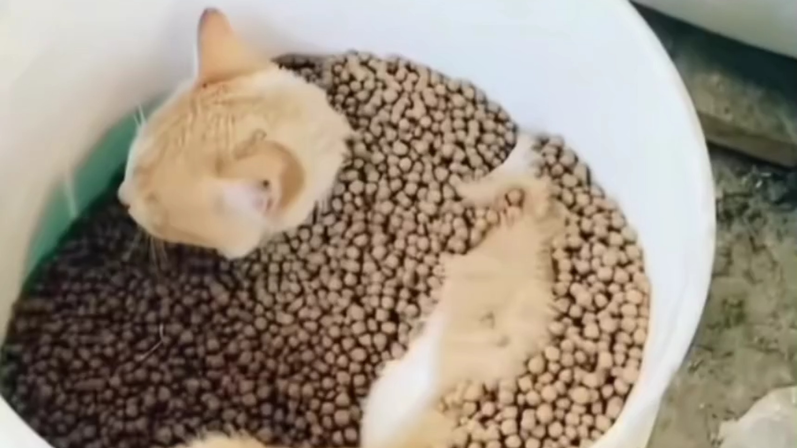 | 559 | 2026-07-06 |
| [哈基人想偷豪猫，被哈基米发现](https://www.bilibili.com/video/BV1qwTU6DEGD) | 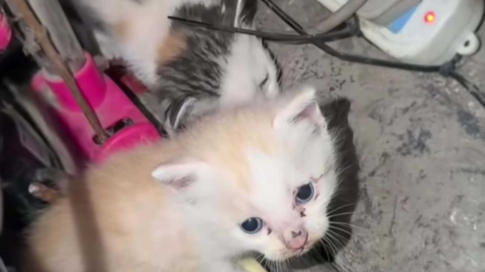 | 23.5万 | 2026-07-06 |
| [小辣哈基米](https://www.bilibili.com/video/BV1dRMP68Eof) | 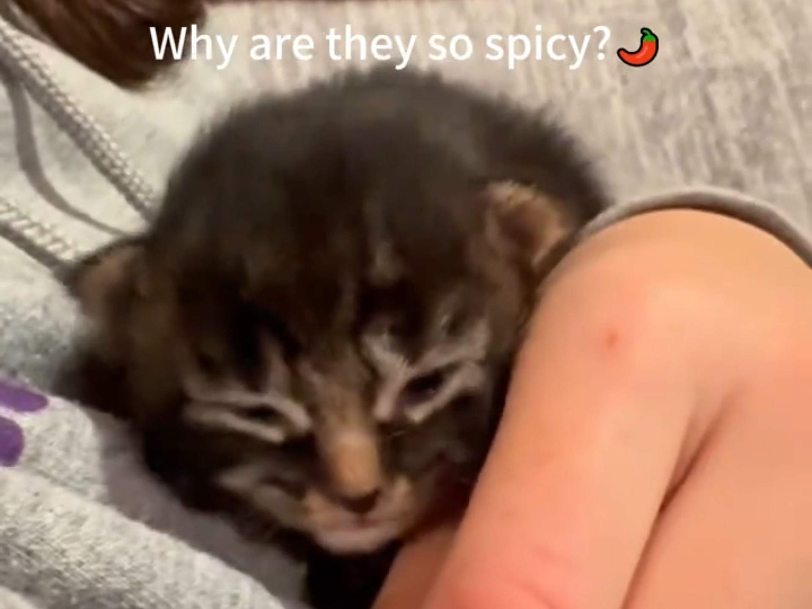 | 944 | 2026-07-06 |
| [【哈基米音乐】🐱美丽的哈基森林🐱](https://www.bilibili.com/video/BV13QT26zEXH) |  | 316 | 2026-07-06 |
| [林思琪欢迎哈基米神豪](https://www.bilibili.com/video/BV1JBT26EEWk) |  | 878 | 2026-07-05 |
| [哈基米商标这一块](https://www.bilibili.com/video/BV1L1T26CEmd) |  | 1.3万 | 2026-07-05 |
| [不好意思给大家介绍一下我的曼波](https://www.bilibili.com/video/BV17ET16VEn8) |  | 12.8万 | 2026-07-05 |
| [大果猫猫](https://www.bilibili.com/video/BV12BT16bEjE) |  | 49.8万 | 2026-07-05 |
| [哈基米日常飛機耳](https://www.bilibili.com/video/BV12BT16bE7z) | 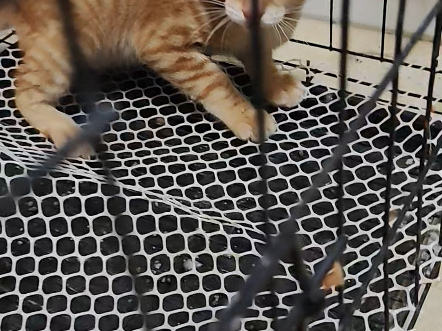 | 1171 | 2026-07-05 |
| [oh my god 你吓到我了](https://www.bilibili.com/video/BV1F9T16JE2h) | 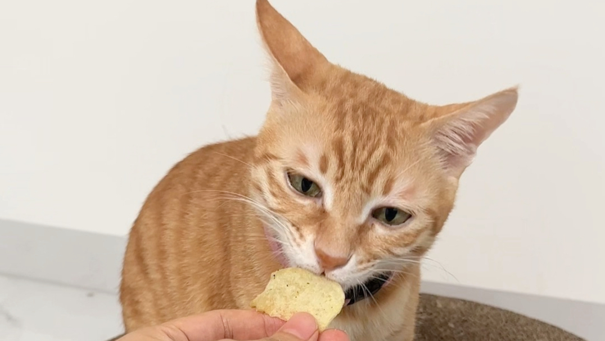 | 17.5万 | 2026-07-05 |
| [【GZBN】广州台：哈基米哈基米哈基米 ｜ 广州综合《广视新闻》节选（2026/07/05）](https://www.bilibili.com/video/BV1iFT265ErW) |  | 2.0万 | 2026-07-05 |
| [工地一定要有拖拉基！曼波～](https://www.bilibili.com/video/BV1JoT167EyE) | 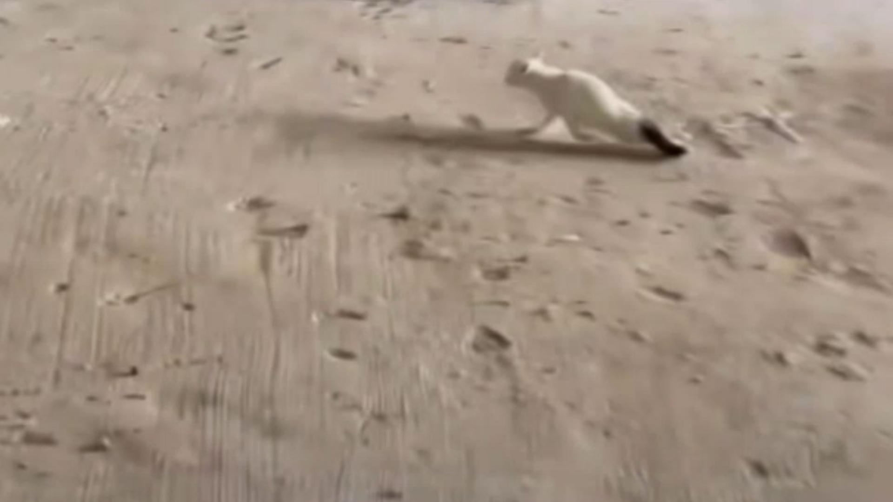 | 1396 | 2026-07-05 |
| [野基米](https://www.bilibili.com/video/BV1NfTk6EEXj) | 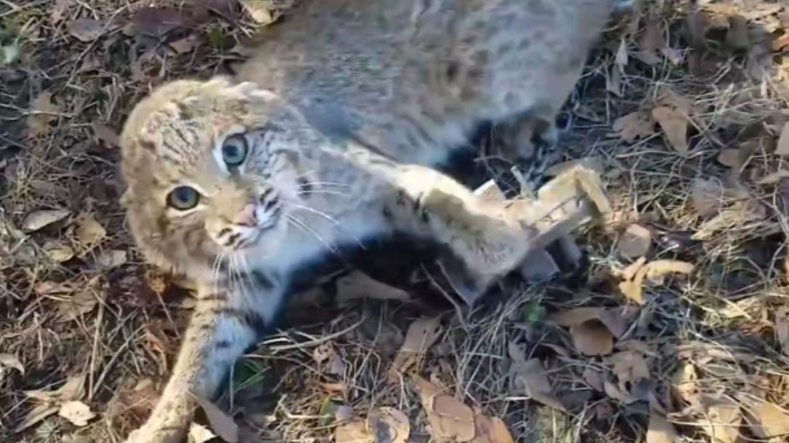 | 1.8万 | 2026-07-05 |
| [🎵菲比啾比之放松小曲🎵](https://www.bilibili.com/video/BV1GHTC6YER5) |  | 6.2万 | 2026-07-05 |
| [停猫位](https://www.bilibili.com/video/BV1rmTC6yEjb) | 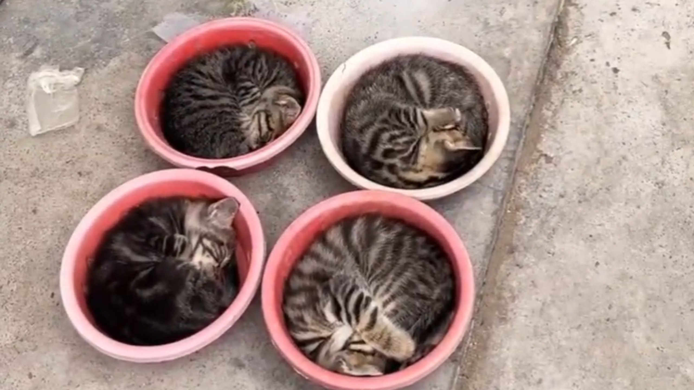 | 19.4万 | 2026-07-05 |
| [正在抽烟的哈基米](https://www.bilibili.com/video/BV16mTC6yE2X) |  | 10.5万 | 2026-07-05 |
| [循环歌单｜《三绷演义の小曲》Ngẫu Hứng](https://www.bilibili.com/video/BV1spTy6DEEi) |  | 141.0万 | 2026-07-05 |
| [未必船长的冒险故事 （大合集）](https://www.bilibili.com/video/BV1xHTy6HE7F) | 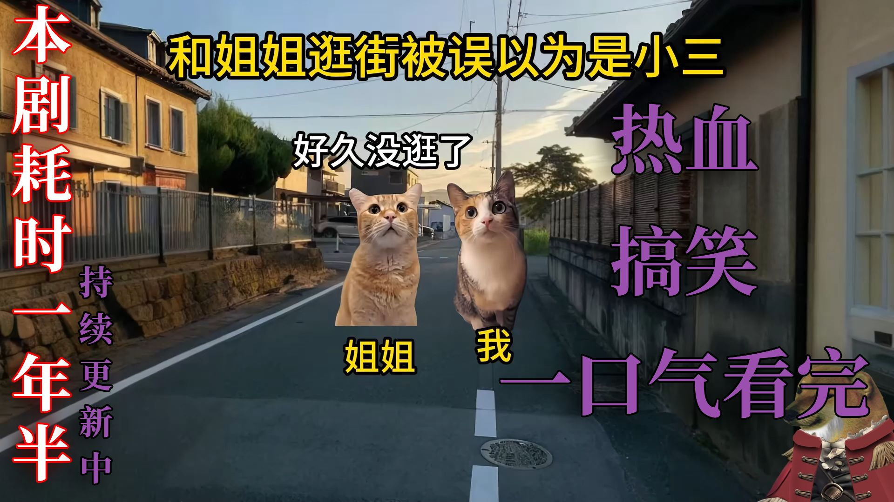 | 60.5万 | 2026-07-05 |
| [太空漫叫](https://www.bilibili.com/video/BV1TBMM6ZE4t) |  | 29.4万 | 2026-07-05 |
| [基米小剧场超长合集 看完你能忍住不收养吗？](https://www.bilibili.com/video/BV1EoMM61E82) | 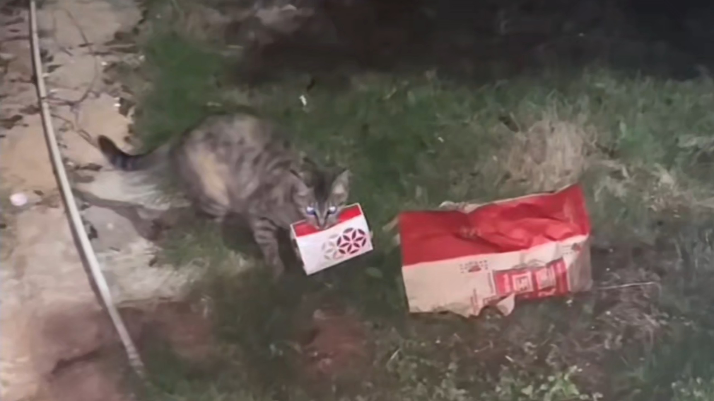 | 4961 | 2026-07-05 |
| [“不敢叫的大狗就是loser”](https://www.bilibili.com/video/BV1qvMN6AErq) |  | 71.0万 | 2026-07-05 |
| [全员压缩基2.0](https://www.bilibili.com/video/BV164MN6BEcP) | 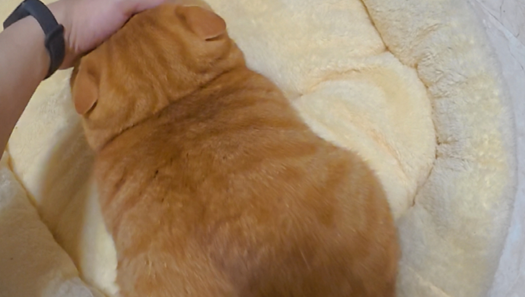 | 3.7万 | 2026-07-05 |
| [7月鸣潮神曲TOP20：库洛首个百万收藏曲目诞生！榜单新增4首新曲！](https://www.bilibili.com/video/BV1mgMA6rEY8) |  | 5.2万 | 2026-07-05 |
| [带瘫痪小猫针灸，小猫狂蹬后腿，趁机把针甩我身上了……](https://www.bilibili.com/video/BV1bmMA6jEuk) | 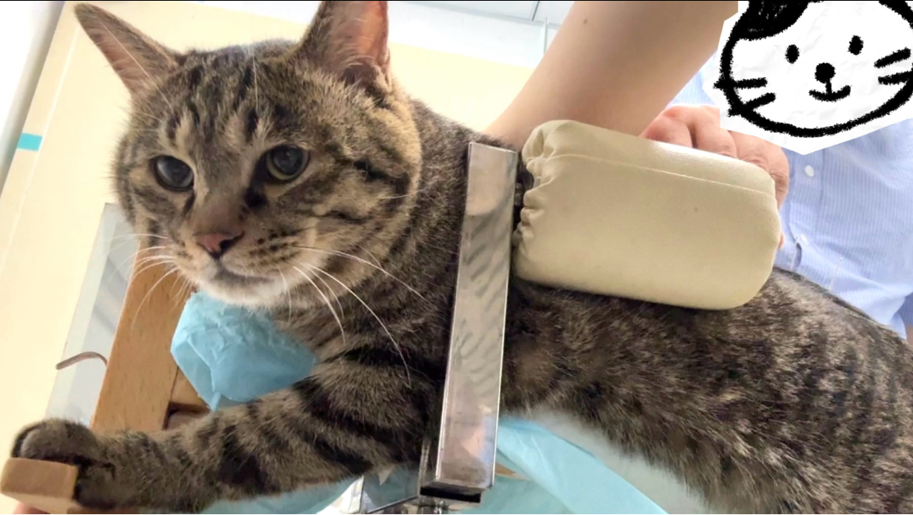 | 16.8万 | 2026-07-04 |
| [(一补）难绷幺幺被神人进屋偷了 幺爸怒火宣泄](https://www.bilibili.com/video/BV119MA6GEys) |  | 15.8万 | 2026-07-04 |
| [基米这个拖拉基 曼波～](https://www.bilibili.com/video/BV1VJMP6sEe1) | 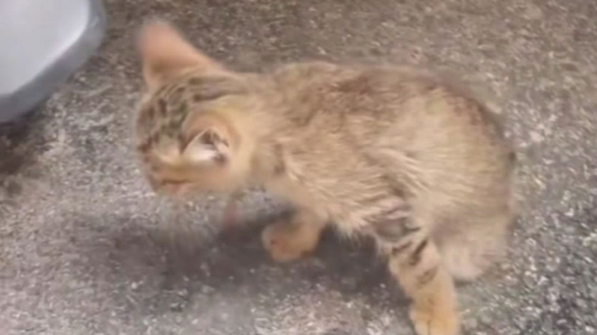 | 1713 | 2026-07-04 |
| [【三理】搞笑女本质，突然开始哼唱哈基米音乐，欣赏高雅音乐中](https://www.bilibili.com/video/BV1UgMN6JEFQ) |  | 1602 | 2026-07-04 |
| [人物志：它被誉为猫届丁俊晖 把孩子当台球打](https://www.bilibili.com/video/BV18CMc63EbH) | 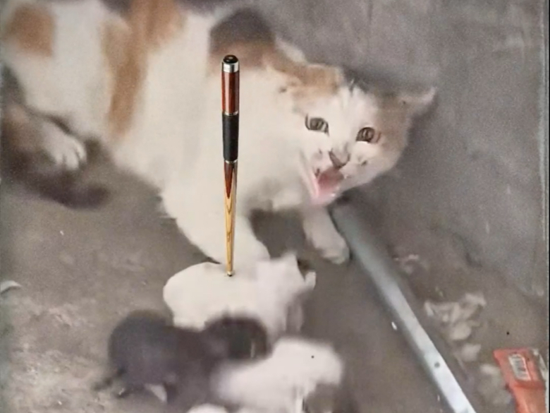 | 8.5万 | 2026-07-04 |
| [爱猫人士❤️花式撸猫      【送我推上bilibilionly大屏】](https://www.bilibili.com/video/BV1iDMw6xEsZ) |  | 15.6万 | 2026-07-04 |
| [【Gut Genug】全球爆火的背后，这首歌真正想表达什么？](https://www.bilibili.com/video/BV1uKMA6LEFD) |  | 76.6万 | 2026-07-04 |
| [《往 事 只 能 哈 基》](https://www.bilibili.com/video/BV1MnMF6MEBn) | 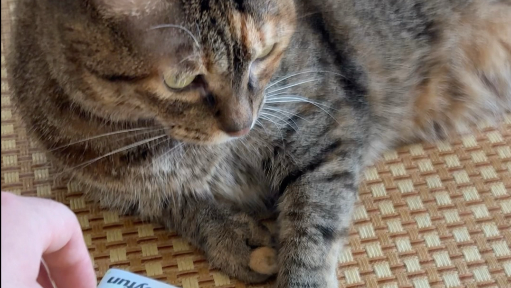 | 1577 | 2026-07-04 |
| [“哈基米基米基，阿西噶噶阿西...” 《哈基米》](https://www.bilibili.com/video/BV13fMF6GEU1) |  | 883 | 2026-07-04 |
| [狂战哈基米VS摄政王兽医](https://www.bilibili.com/video/BV1hrMc6kEgz) |  | 2.1万 | 2026-07-04 |
| [不允许哈气～](https://www.bilibili.com/video/BV1gdTZ6iEq3) | 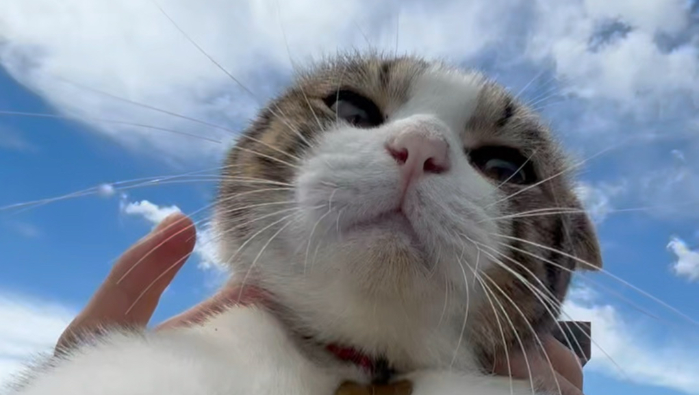 | 12.6万 | 2026-07-04 |
| [雷霆野人扭曲爬行！神人警长热舞欢迎！](https://www.bilibili.com/video/BV1TLTg6bEDs) |  | 46.4万 | 2026-07-04 |
| [『飙马野郎 JOJO的奇妙冒险』 第二弹PV 公开](https://www.bilibili.com/video/BV16GTs6dEPU) |  | 131.0万 | 2026-07-03 |
| [（超长）爆笑预警！这些猫咪能让你笑出腹肌，超欢乐猫狗合集第二弹 🤣](https://www.bilibili.com/video/BV17PTt6fEpb) | 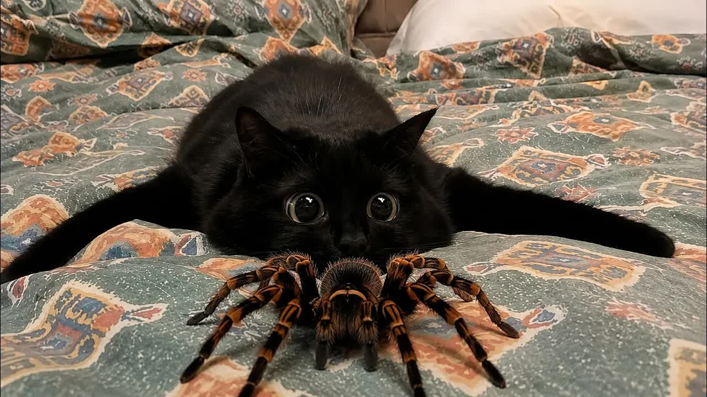 | 2.1万 | 2026-07-03 |
| [【循环歌单】“被生活磨平了喵脆角，变得更加圆润了”【New soul-Sped up】【喵脆角の小曲】](https://www.bilibili.com/video/BV1QvT46UE4U) |  | 47.1万 | 2026-07-03 |
| [咕咕嘎嘎，哈基米哦南北绿豆，阿西嘎哈压库那鲁](https://www.bilibili.com/video/BV1mZTW6KEZy) |  | 67 | 2026-07-03 |
| [除了学习什么都学的舅舅！！四十一集！！](https://www.bilibili.com/video/BV13GTx61ENp) |  | 27.4万 | 2026-07-03 |
| [耄耋威严巡逻](https://www.bilibili.com/video/BV1JDTn65EDN) | 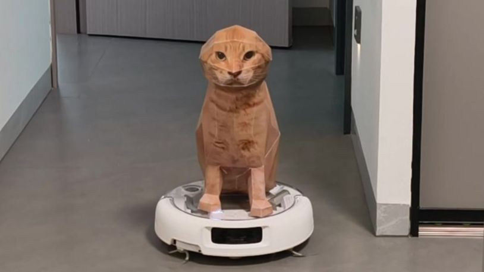 | 5.2万 | 2026-07-02 |
| [如果把一只哈基咪放大20倍投放到恐龙最繁荣的白垩纪。 #哈基咪 #白垩纪 #古生物 #神奇动物在抖音](https://www.bilibili.com/video/BV1G7TE6FEdS) |  | 73.5万 | 2026-07-02 |
| [《遇见灯神了怎么办》](https://www.bilibili.com/video/BV1cPTr6TE2o) |  | 67.3万 | 2026-07-02 |
| [循环歌曲｜《FUNK NA MIRA》【豆包秒跟团の小曲】“你豆姐依旧秒跟团”（无损音质）](https://www.bilibili.com/video/BV1iqTY6rEen) |  | 168.9万 | 2026-07-02 |
| [哈基米大学习第一期](https://www.bilibili.com/video/BV1C6Tr6rEjq) | 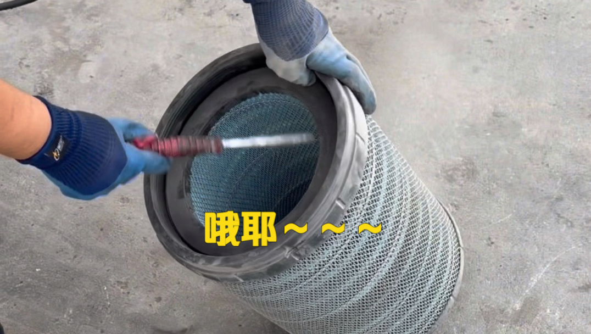 | 9362 | 2026-07-02 |
| [哈基弹头6  中式の小曲《康定基歌》](https://www.bilibili.com/video/BV1hATk6dEbK) |  | 4295 | 2026-07-02 |
| [【6月至7月】《哈基米衰亡?史》初小晓的逆袭与猫meme时代——哈基米&quot;关键词&quot;新视频每日动态榜](https://www.bilibili.com/video/BV1sETk61ELS) | 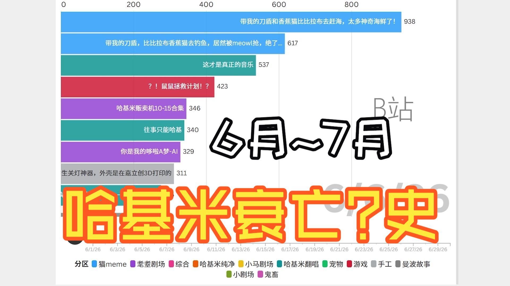 | 283 | 2026-07-02 |
| [6月热梗大盘点，你都刷到过吗？](https://www.bilibili.com/video/BV1QuTv6BEPq) |  | 56.5万 | 2026-07-02 |
| [【人和猫猫】05. 如何和生气的小猫咪道歉](https://www.bilibili.com/video/BV1dKTq6EEnx) | 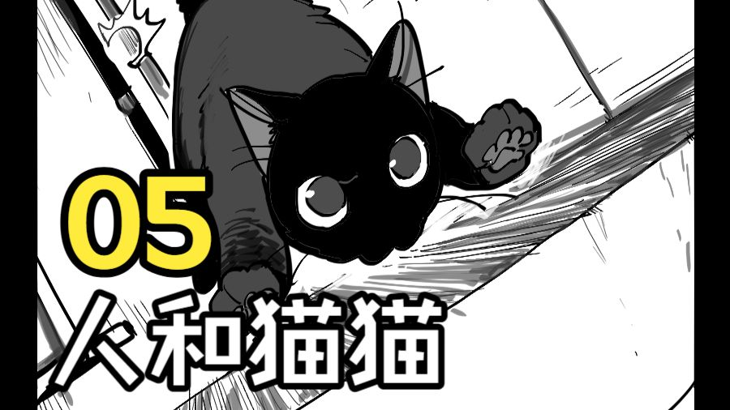 | 15.6万 | 2026-07-01 |
| [⚡娅够燥的⚡(完结篇)](https://www.bilibili.com/video/BV1QMTc63EAQ) |  | 56.4万 | 2026-07-01 |
| [难 道 它 真 是 个 天 才（3）](https://www.bilibili.com/video/BV1EGTF6SEeC) |  | 54.9万 | 2026-06-30 |
| [这TM唱一首歌要八百！？](https://www.bilibili.com/video/BV1T8Kd6QEja) |  | 16.3万 | 2026-06-30 |
| [哈呀哈基咪 叮咚叮咚鸡 曼波摸次地](https://www.bilibili.com/video/BV1XeKX6HEDg) |  | 182 | 2026-06-29 |
| [《魔丸爆装》30集合集](https://www.bilibili.com/video/BV1RmKQ6XEtU) |  | 105.5万 | 2026-06-29 |
| [除了学习什么都学的舅舅！！40集](https://www.bilibili.com/video/BV1ZkT56xEEC) |  | 327.3万 | 2026-06-29 |
| [哈基米难被掠夺](https://www.bilibili.com/video/BV1pxTg6DEn9) |  | 345 | 2026-06-28 |
| [哈基米 [Seve] [Tez Cadey]](https://www.bilibili.com/video/BV1mtTT6QE2A) | 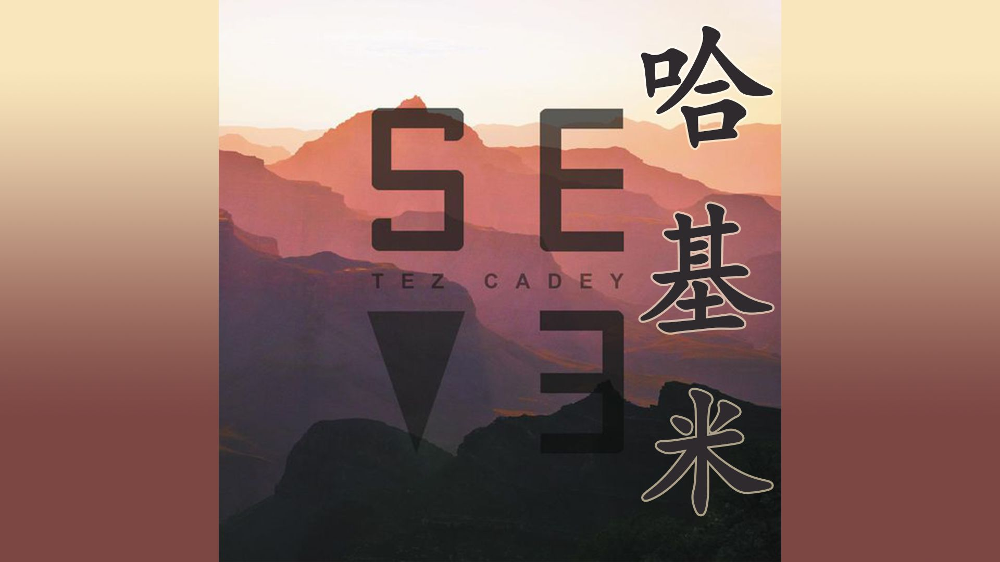 | 1007 | 2026-06-28 |
| [小狗父子冒险救下坠崖熊猫，熊猫妈妈端出甜蜜蛋糕致谢，全程暖心治愈🥰](https://www.bilibili.com/video/BV1it7V6VE9b) |  | 8.2万 | 2026-06-27 |
| [耄耋抢走了我的妙妙脆角](https://www.bilibili.com/video/BV1JD7n66E96) |  | 16.8万 | 2026-06-27 |
| [垃圾小豆包大战人类小电影 2（东山再起）](https://www.bilibili.com/video/BV1NE7J6CEgX) |  | 104.0万 | 2026-06-27 |
| [盘点当声优偶遇小猪佩奇系列，这还是你看过的动漫吗 #小猪佩奇  #搞笑配音  #动画](https://www.bilibili.com/video/BV1EG786tEVE) |  | 2.8万 | 2026-06-26 |
| [帝 企 鹅 宝 宝 的 生 命 轮 回 之 旅 ！](https://www.bilibili.com/video/BV1Fx7B6QEn6) |  | 90.6万 | 2026-06-26 |
| [除了学习什么都学的舅舅！！三十九集！！](https://www.bilibili.com/video/BV1XF7b62Enj) |  | 318.0万 | 2026-06-25 |
| [小时候以为亲嘴会怀孕](https://www.bilibili.com/video/BV15tjt61EeW) |  | 101.4万 | 2026-06-21 |
| [小时候以为的事情](https://www.bilibili.com/video/BV19sjA66ETU) |  | 290.6万 | 2026-06-18 |
| [【哈基米音乐】近月的隙间bgm——晚祷的曼波（高考后的祈祷）纯人声阿卡贝拉版](https://www.bilibili.com/video/BV1SWJ76EEQH) | 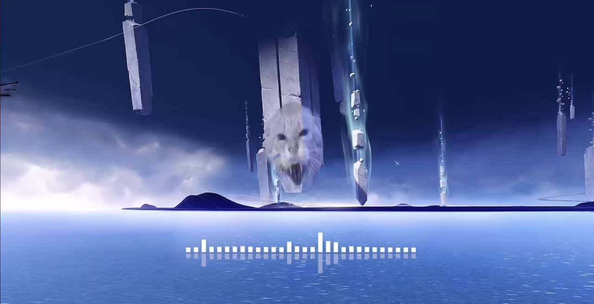 | 1.2万 | 2026-06-13 |
| [直击纯血马配种现场，年轻帅气的公马轻松收获小母马的芳心](https://www.bilibili.com/video/BV19qEv6zExD) | 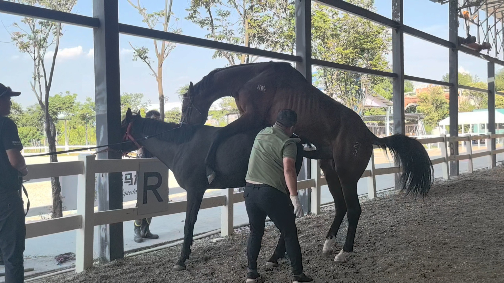 | 23.3万 | 2026-06-11 |
| [打野哈基米偷吃布鲁斯晚饭，惨遭赛博坦星人淘汰](https://www.bilibili.com/video/BV1ppEU64EyF) | 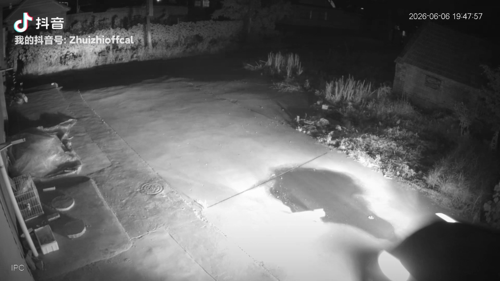 | 215 | 2026-06-09 |
| [耄耋猫的vlog：耄耋创业摆摊的一天](https://www.bilibili.com/video/BV13KV46cELP) | 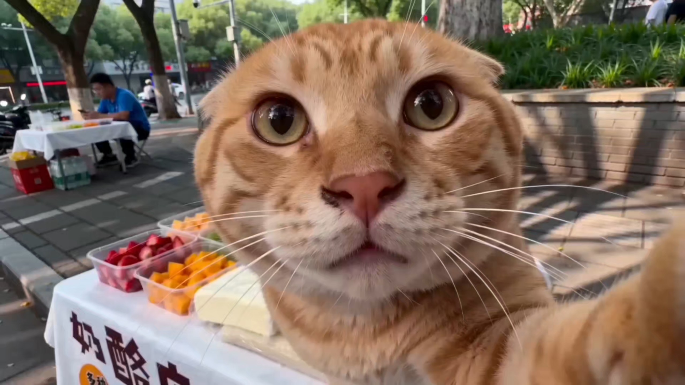 | 5.0万 | 2026-05-29 |
| [《团团绝地》1-4集](https://www.bilibili.com/video/BV1ZdR5BkEZ6) |  | 17.2万 | 2026-05-02 |
| [当狗狗闻你的隐私部位时，它的真实用意其实是这个](https://www.bilibili.com/video/BV1F9DHBWE94) | 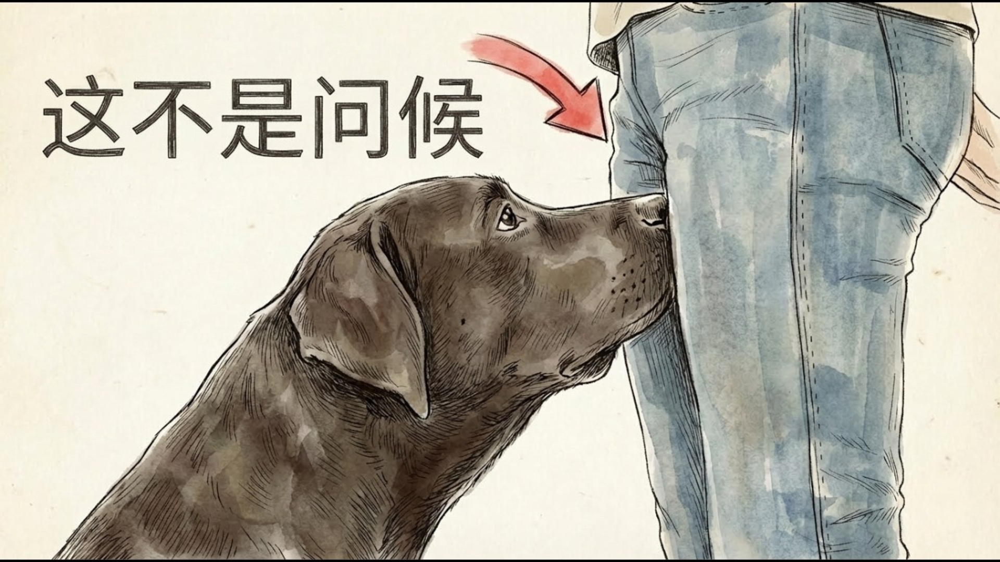 | 34.9万 | 2026-04-10 |
| [当我获得了修改剧情的能力（史魔王1-3合集）](https://www.bilibili.com/video/BV1j4FbztEvC) | 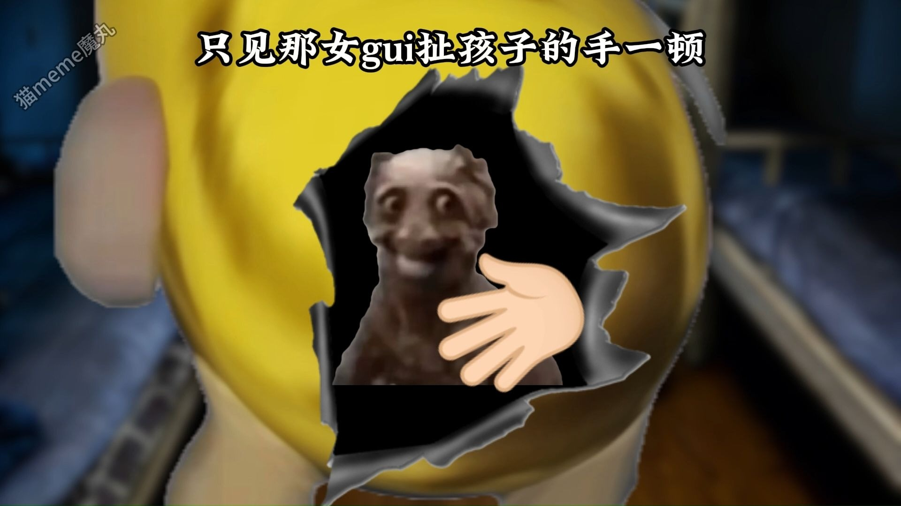 | 72.6万 | 2026-02-08 |
| [✨“悠悠的古城中，听美人奏琴声”《游京DJ》/AI東 雪蓮✨](https://www.bilibili.com/video/BV1TMJXz4E45) |  | 381.9万 | 2025-09-24 |
| [哈基米:左手指月](https://www.bilibili.com/video/BV1iJN2z9EN6) |  | 36.6万 | 2025-06-21 |
| [那些被视为缺陷的特质，往往是最珍贵的礼物……](https://www.bilibili.com/video/BV1PoTgz6EsK) | 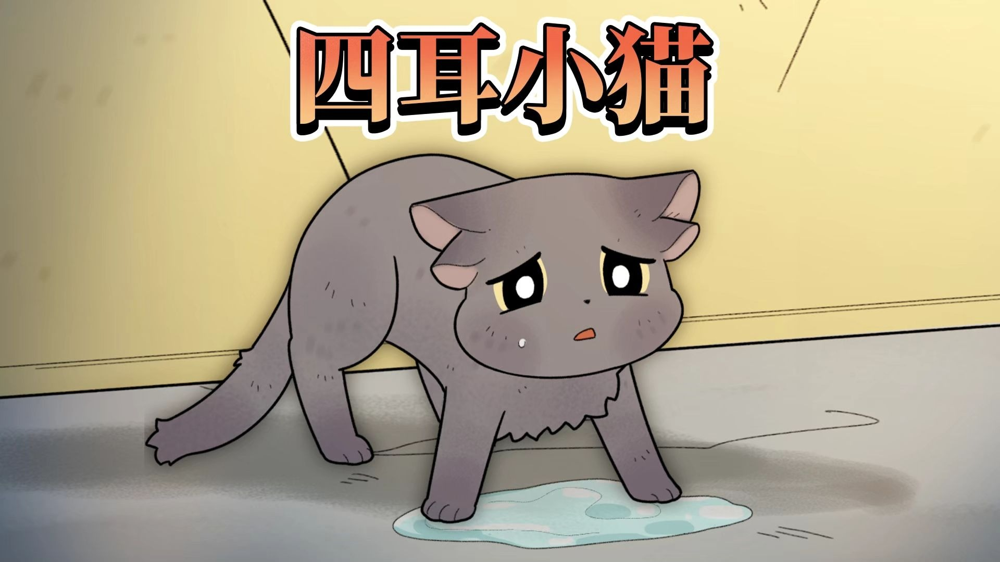 | 62.2万 | 2025-06-07 |
| [跟哈基米学到了！哈基米！](https://www.bilibili.com/video/BV1cu4y1z7Nt) |  | 1.5万 | 2023-08-12 |
| [小猫咪打架能有多上头，喵师傅“爆装备”全集，其实吵了很久！](https://www.bilibili.com/video/BV1zK411X7ov) | 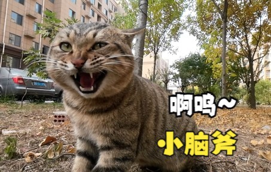 | 466.8万 | 2022-12-04 |

---
*最后更新: 2026-07-07 06:18:17 (自动生成)*
*数据来源: [Bilibili](https://www.bilibili.com)*

## 使用说明

运行以下命令更新视频列表:
```bash
python3 fetch_hajimi_videos.py
```
