# awesome-hajimi
collections of hajimi (哈基米 in Chinese) on the Internet.

## 视频列表 (Video List)

| 视频标题 (Title) | 封面 | 播放量 (Views) | 发布日期 (Date) |
|---|---|---|---|
| [小耄偷吃哈基米](https://www.bilibili.com/video/BV141D5B1ENC) | 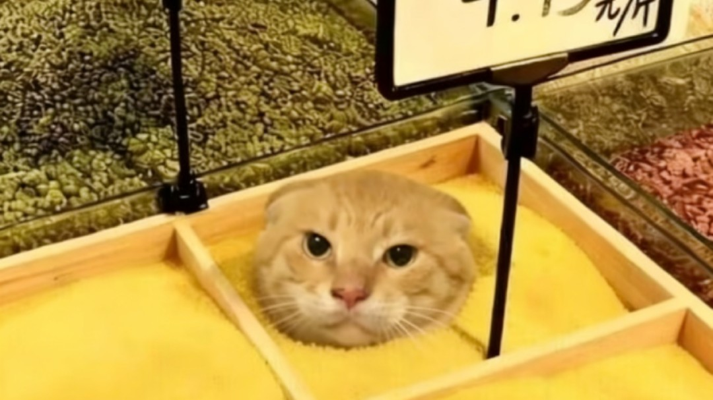 | 316 | 2026-04-05 |
| [哈基米VS刀盾狗谁更胜一筹呢](https://www.bilibili.com/video/BV18eDGBLE4q) |  | 1391 | 2026-04-05 |
| [哈基米~哈基米~](https://www.bilibili.com/video/BV1abDGBUEqi) |  | 86 | 2026-04-05 |
| [【哈基米音乐】铁拳紧握基枪🐱](https://www.bilibili.com/video/BV1V2D3BEE1t) |  | 183 | 2026-04-05 |
| [“哈基米爆火神曲实力排行”](https://www.bilibili.com/video/BV1syDGBBEhu) | 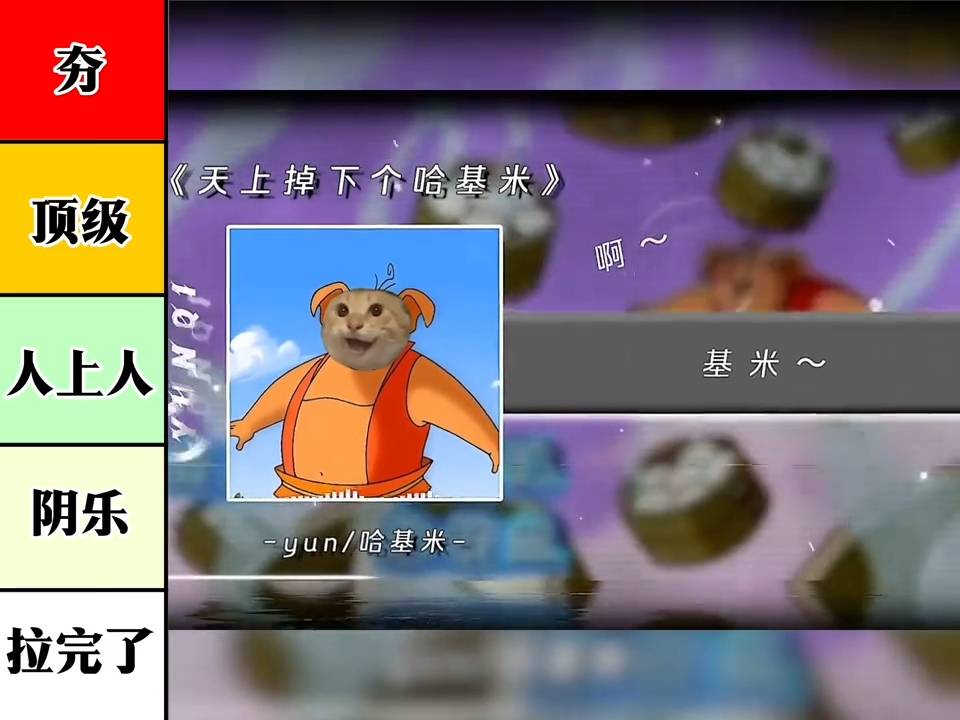 | 39 | 2026-04-04 |
| [“哈基米爆火神曲实力排行”](https://www.bilibili.com/video/BV1yyDGBBE4D) | 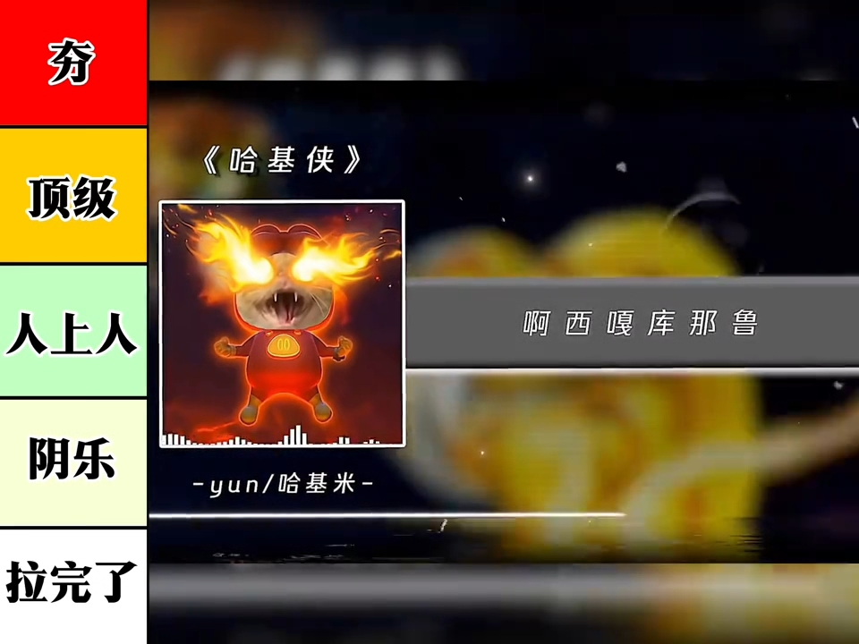 | 26 | 2026-04-04 |
| [【哈基米】死别](https://www.bilibili.com/video/BV1fMDMB2EhT) |  | 15 | 2026-04-04 |
| [哈基米爱猪排,猪排爱哈基米](https://www.bilibili.com/video/BV1y6DMBREDP) | 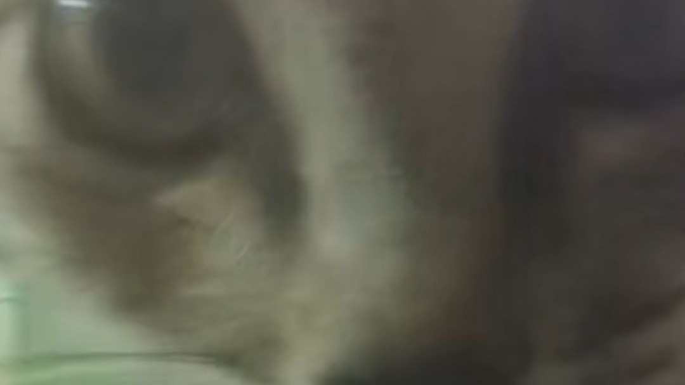 | 165 | 2026-04-04 |
| [哈基米：水浒传【清明节特辑】](https://www.bilibili.com/video/BV1QkDTBeE5B) |  | 1343 | 2026-04-04 |
| [基米 65-Blue (哈 基 米）](https://www.bilibili.com/video/BV1NEDuBfETN) |  | 184 | 2026-04-04 |
| [这个段掉手的哈基米还在等我](https://www.bilibili.com/video/BV1GPDuBuEg9) | 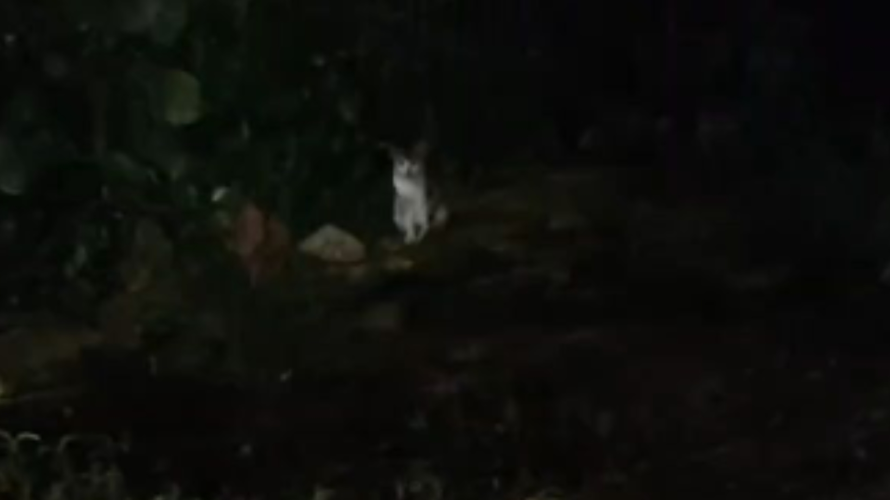 | 142 | 2026-04-04 |
| [评论区点歌系列之哈基米版《雨爱》](https://www.bilibili.com/video/BV1aPDuBuEH6) |  | 134 | 2026-04-04 |
| [淳平と哈基米](https://www.bilibili.com/video/BV13TDuBTEcX) |  | 250 | 2026-04-04 |
| [哈气小哈基米](https://www.bilibili.com/video/BV1d6DuBCEH2) | 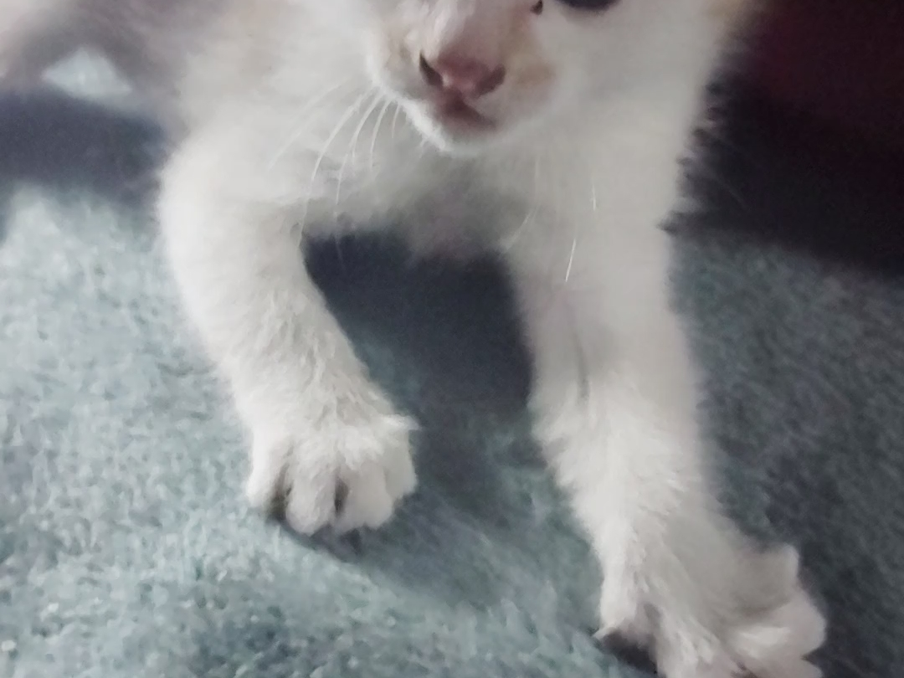 | 98 | 2026-04-04 |
| [哈基米这个馋](https://www.bilibili.com/video/BV15zDuBLEDT) | 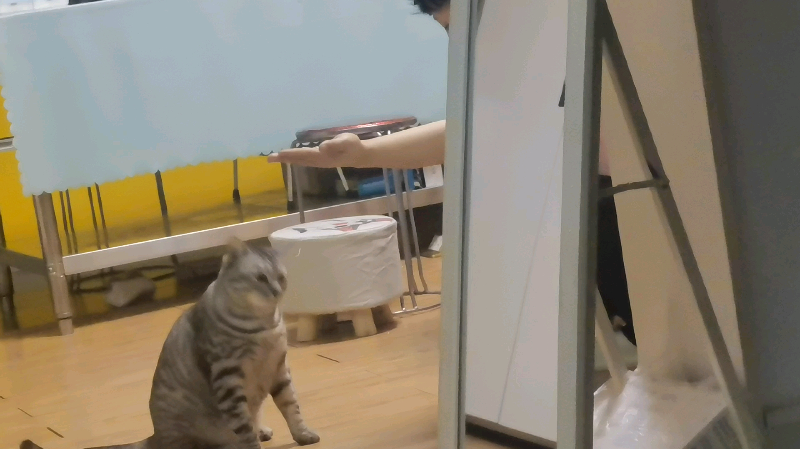 | 156 | 2026-04-04 |
| [我的刀盾配哈基米ai音乐《居夏而夏》](https://www.bilibili.com/video/BV1Q1DuBgE8X) |  | 418 | 2026-04-04 |
| [【哈基米音乐】要是能哈气 我要选基米🐱基白🐱](https://www.bilibili.com/video/BV1J8DuBHEdk) | 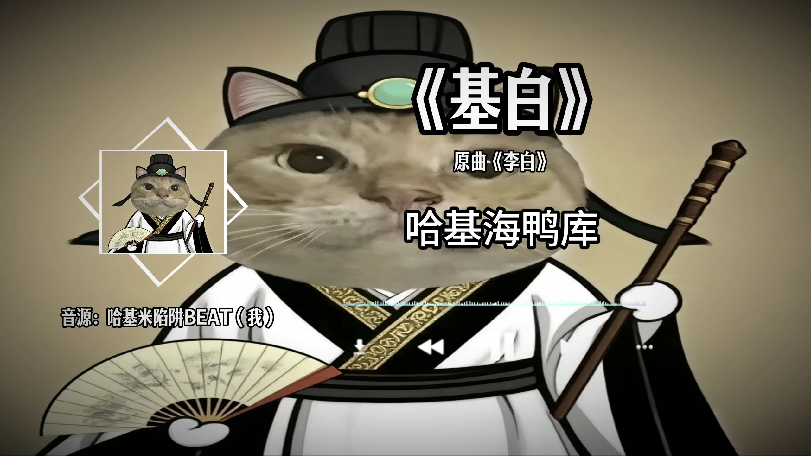 | 143 | 2026-04-04 |
| [稀有哈基米](https://www.bilibili.com/video/BV1kKDgBdEoC) | 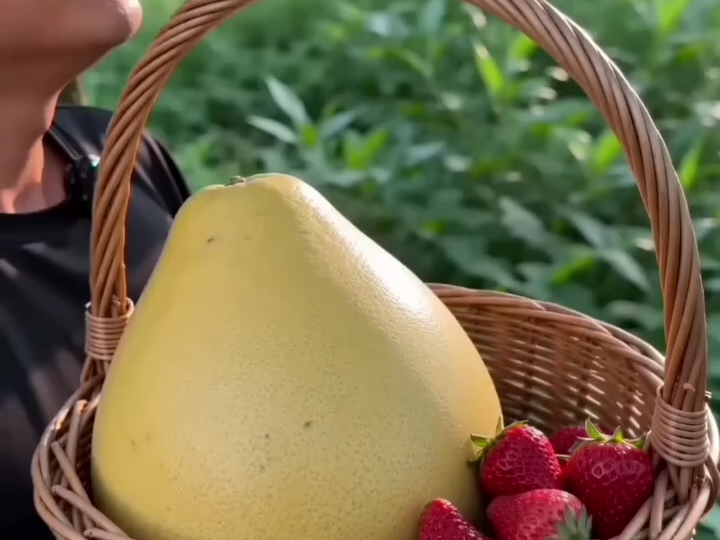 | 706 | 2026-04-04 |
| [哈基米这个好耄](https://www.bilibili.com/video/BV1cKDgBoEfL) | 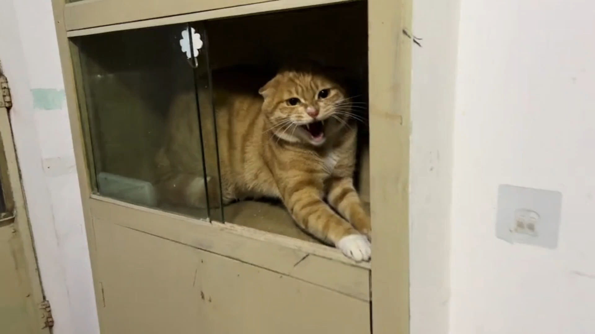 | 427 | 2026-04-04 |
| [哈基米界最高的山最长的河——耄耋](https://www.bilibili.com/video/BV163DgBpE87) | 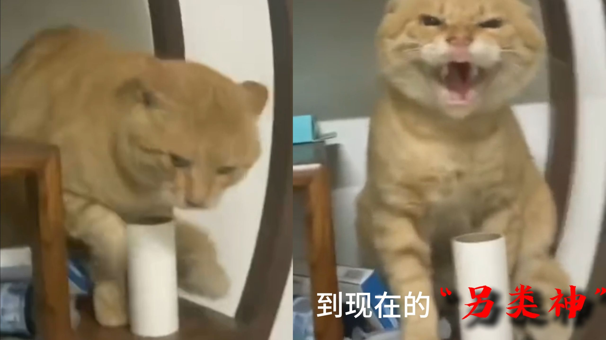 | 9 | 2026-04-04 |
| [诸位基米，且听这龙吟😼](https://www.bilibili.com/video/BV1kMDgBsEsL) |  | 310 | 2026-04-04 |
| [我变成了哈基米](https://www.bilibili.com/video/BV1FuDgBREyZ) |  | 10 | 2026-04-04 |
| [哈基米1.5](https://www.bilibili.com/video/BV1UQDuBKE6G) |  | 292 | 2026-04-04 |
| [哈基米](https://www.bilibili.com/video/BV1PcDgBcECE) |  | 20 | 2026-04-04 |
| [一只哈基米](https://www.bilibili.com/video/BV1TZDuBAEaX) | 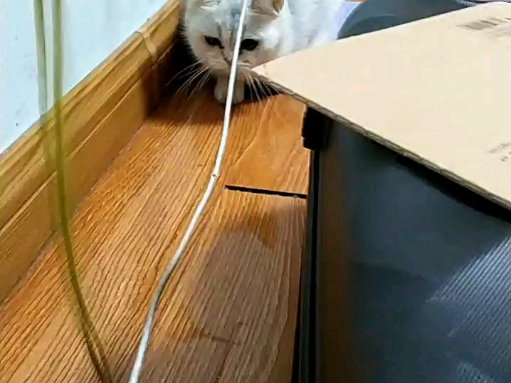 | 13 | 2026-04-04 |
| [哈基米助眠丨当助眠道具变成三角洲里的枪械后...](https://www.bilibili.com/video/BV1nrDKBjEuF) |  | 3314 | 2026-04-04 |
| [给基米吃猪舌头，再晚来几分钟就没得吃了](https://www.bilibili.com/video/BV1T3DTBdEYR) | 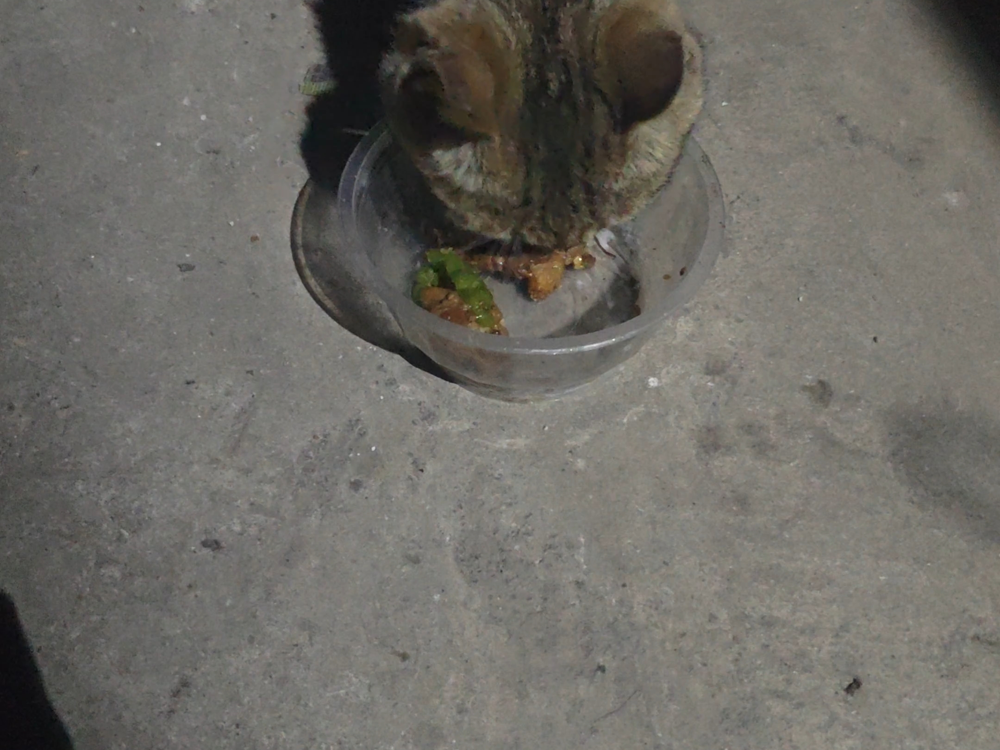 | 43 | 2026-04-04 |
| [哈基米？](https://www.bilibili.com/video/BV1PoDNB7EWs) | 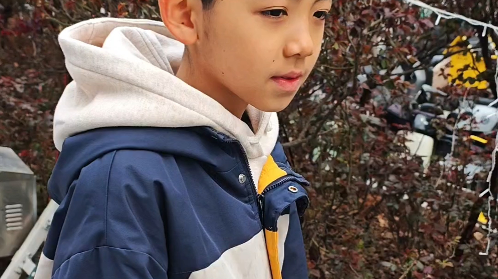 | 559 | 2026-04-04 |
| [把猫咪放脸盆里，就能测试它们的智商？](https://www.bilibili.com/video/BV15BDTBMEQo) | 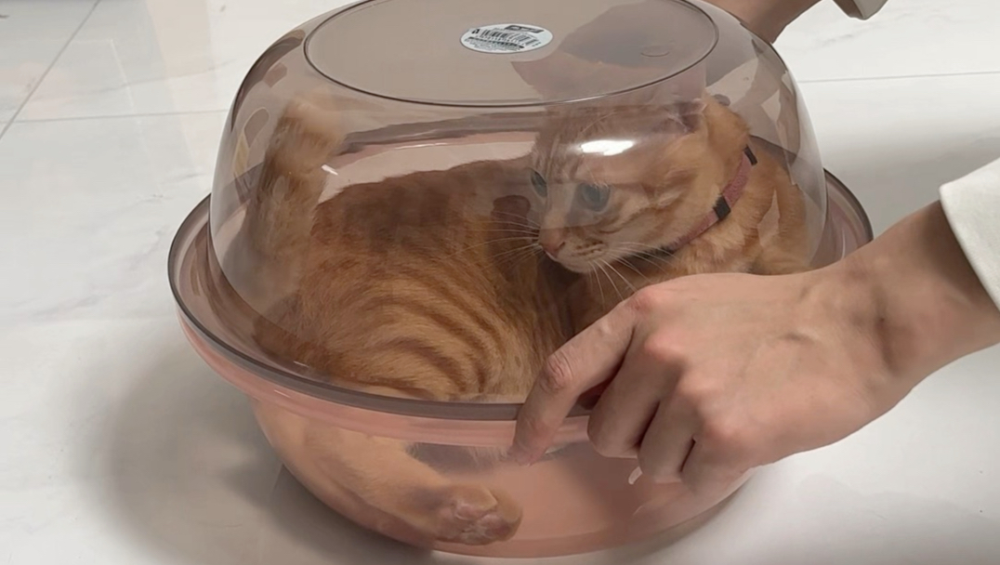 | 20.5万 | 2026-04-04 |
| [【3月】哈基米音乐排行榜Ver.2#18](https://www.bilibili.com/video/BV17aDTBGEt2) | 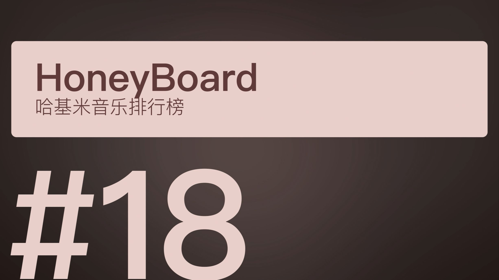 | 3.3万 | 2026-04-04 |
| [当代互联网最傻逼且抽象的拉踩纯净哈基米与哈基米创作者日益增长的流量需要和不平衡不充分的流量分配。](https://www.bilibili.com/video/BV1AfDTB9EA7) |  | 155 | 2026-04-04 |
| [【寻宝队】外星哈基米使用教程](https://www.bilibili.com/video/BV1CfDTBXEek) | 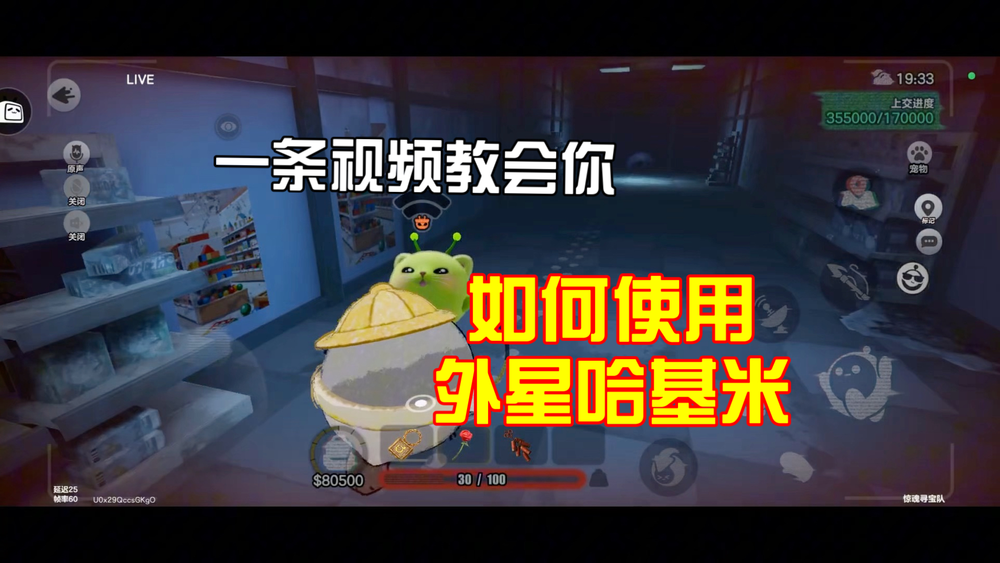 | 971 | 2026-04-04 |
| [哈基米：神金](https://www.bilibili.com/video/BV1WcDMBpEjb) | 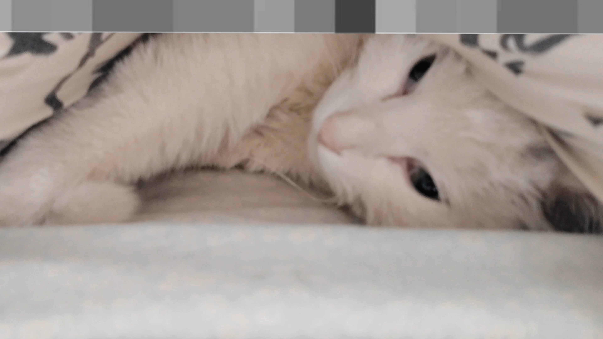 | 18 | 2026-04-04 |
| [哈基米情绪稳定](https://www.bilibili.com/video/BV1zMDMB2E2W) | 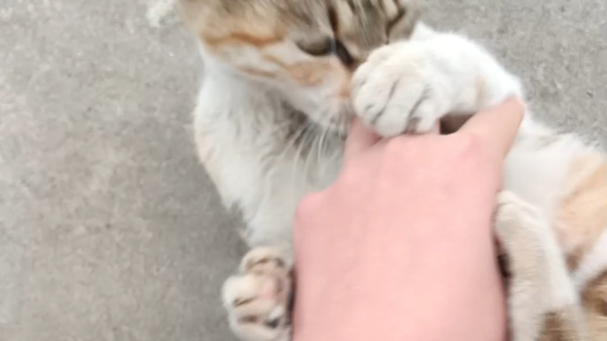 | 59 | 2026-04-04 |
| [😱他们说我后面有小偷是真的假的呀？！](https://www.bilibili.com/video/BV1tsDPBJEpp) |  | 2672 | 2026-04-04 |
| [哈基米蛋和香蕉猫的盲盒抽奖来喽](https://www.bilibili.com/video/BV1mSDTBfE4e) |  | 2164 | 2026-04-04 |
| [哈基米](https://www.bilibili.com/video/BV1SUDTB8EAU) | 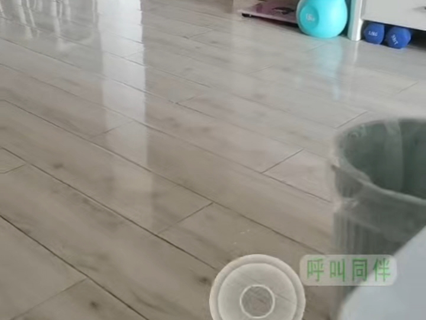 | 25 | 2026-04-04 |
| [丫 够 燥 的 （哈基米）](https://www.bilibili.com/video/BV1tYDMB8Ehj) |  | 181 | 2026-04-04 |
| [这些哈基米你最想撸哪个？](https://www.bilibili.com/video/BV12XDTBoEL4) | 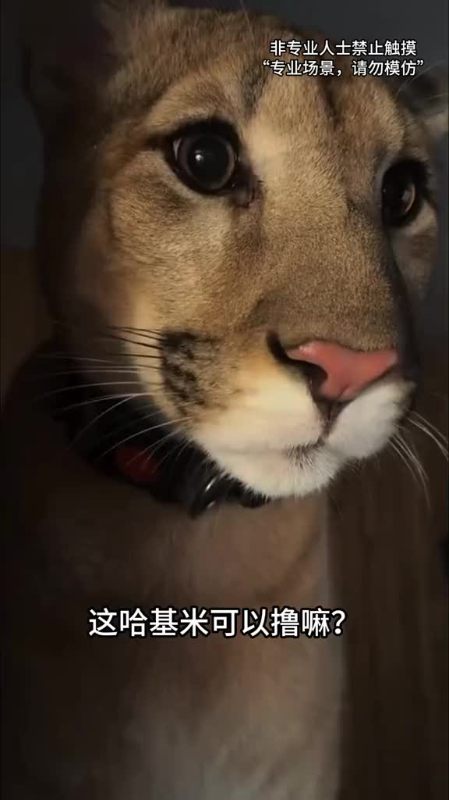 | 101 | 2026-04-04 |
| [🐱失哈🐱](https://www.bilibili.com/video/BV1d7DMB6ENv) |  | 880 | 2026-04-04 |
| [哈基米你这家伙，秒开脊背龙形态吗](https://www.bilibili.com/video/BV19qDNBFENr) | 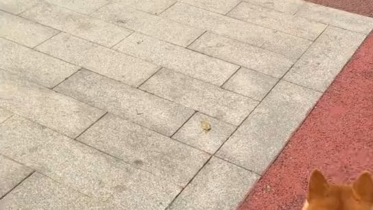 | 111 | 2026-04-04 |
| [遇到哈基米喵be like](https://www.bilibili.com/video/BV1LaDNBeEXY) |  | 14 | 2026-04-04 |
| [哈基米电竞营业第60天:与其大肆宣传不如真正的做一回自己喵](https://www.bilibili.com/video/BV13rDNBtEWS) |  | 1987 | 2026-04-04 |
| [【打篮球的哈基米】视频加载中，速速查收惊喜！](https://www.bilibili.com/video/BV1GBDNB8EvR) |  | 19 | 2026-04-04 |
| [哈基米：Distorted Fate](https://www.bilibili.com/video/BV1FsDNBuEE7) |  | 1329 | 2026-04-04 |
| [疯狂乱斗红心哈基米](https://www.bilibili.com/video/BV1fxDNBqE3Z) | 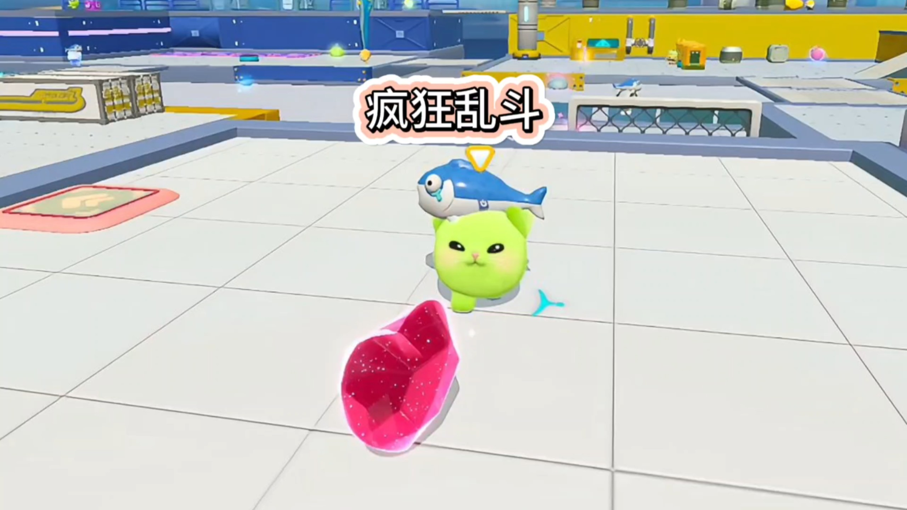 | 3900 | 2026-04-04 |
| [哈基米想潜水了](https://www.bilibili.com/video/BV1ZtDNBKEQ2) | 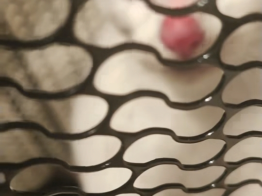 | 681 | 2026-04-04 |
| [哈基米](https://www.bilibili.com/video/BV1cADKBVEsM) | 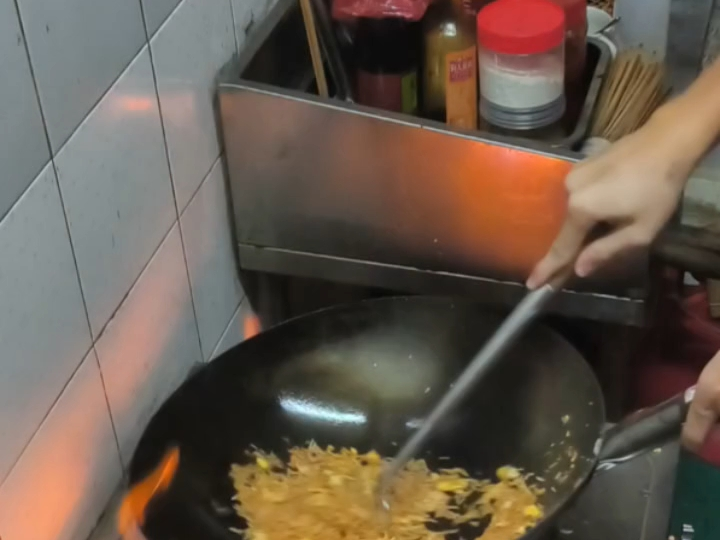 | 64 | 2026-04-04 |
| [哈基米哈基米](https://www.bilibili.com/video/BV1gyDNBxEFE) | 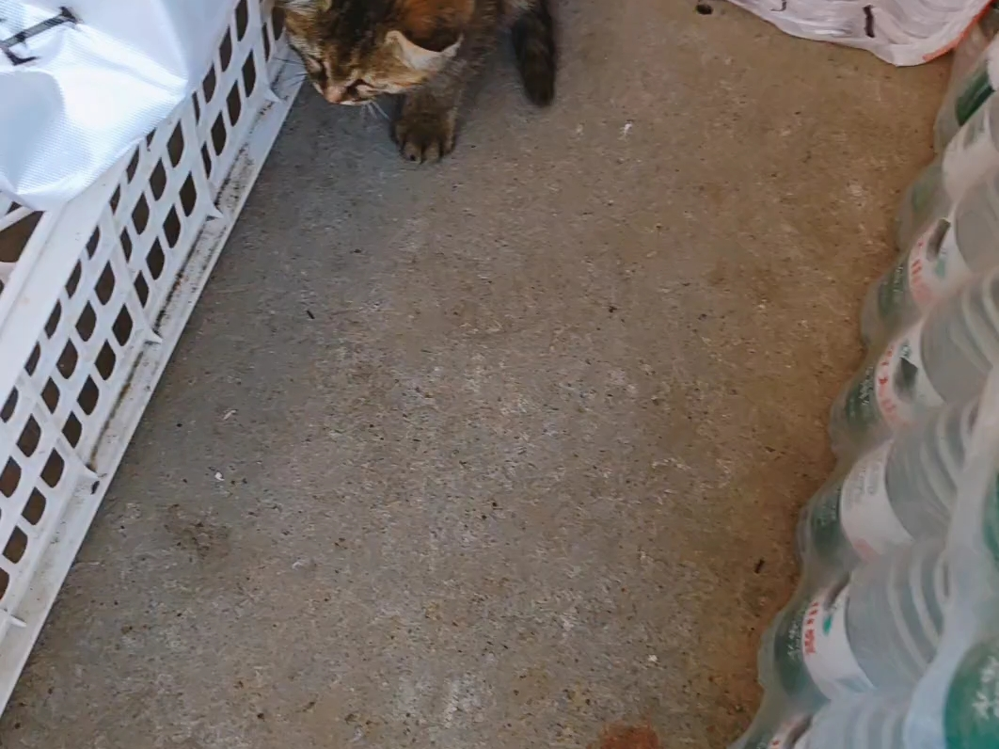 | 125 | 2026-04-04 |
| [左耳正常版右耳哈基米版《起风了+好汉歌》](https://www.bilibili.com/video/BV1KQDNBDEMj) |  | 114 | 2026-04-04 |
| [绝世好哈基米](https://www.bilibili.com/video/BV18WDKBZEih) | 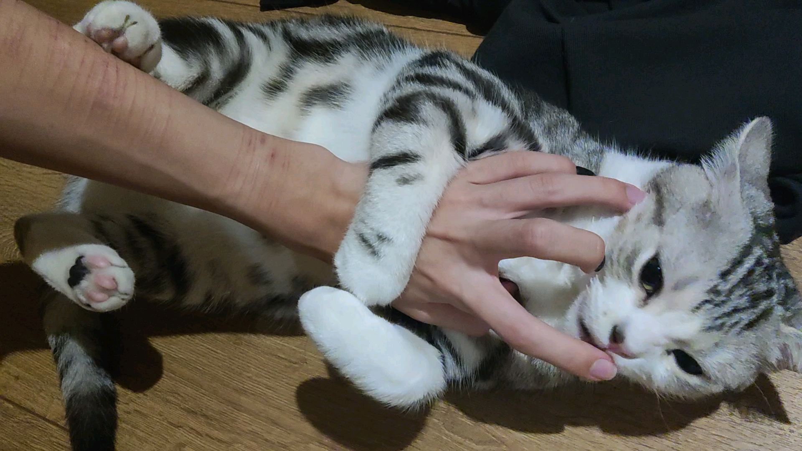 | 177 | 2026-04-04 |
| [偶遇哈基米](https://www.bilibili.com/video/BV1eVDKBvEfZ) | 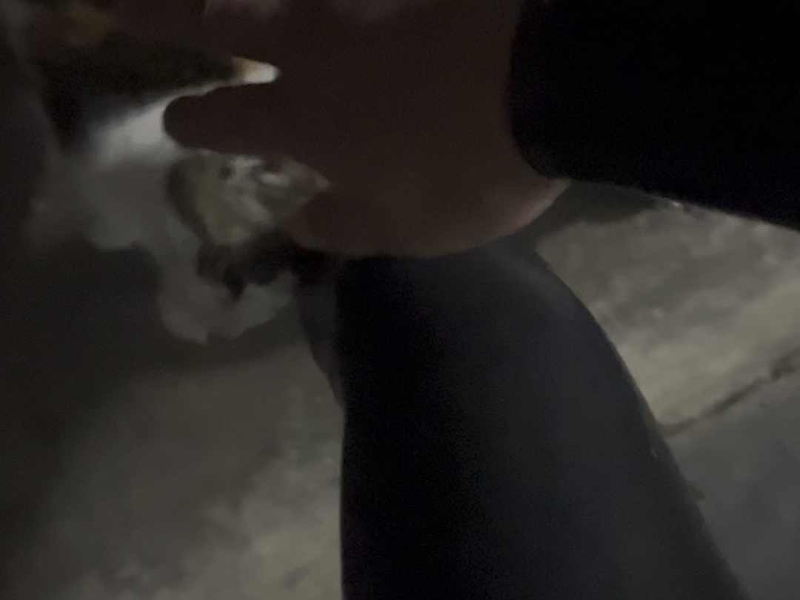 | 271 | 2026-04-04 |
| [打扰哈基米午睡ing](https://www.bilibili.com/video/BV1YLDKBPEZi) | 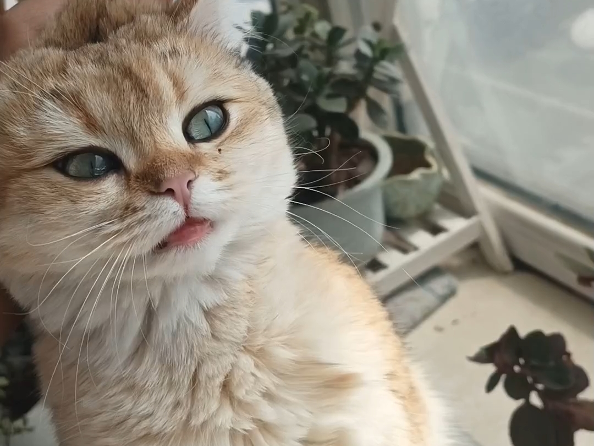 | 139 | 2026-04-04 |
| [哈基米在看什么](https://www.bilibili.com/video/BV1EUDKBrEpa) | 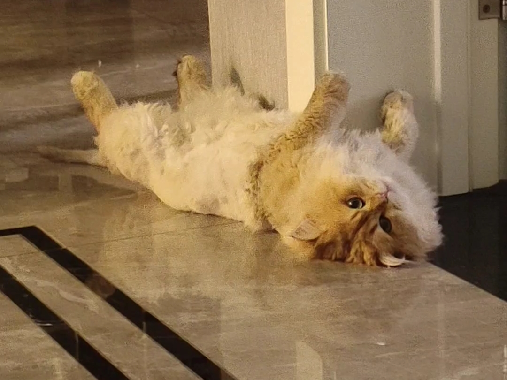 | 162 | 2026-04-04 |
| [哈基米哈基米](https://www.bilibili.com/video/BV17DDKBgEkL) | 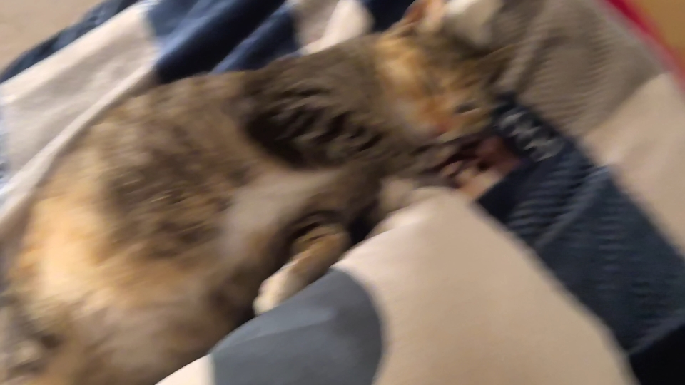 | 33 | 2026-04-04 |
| [魔力基乐队-Lovesick🎵](https://www.bilibili.com/video/BV1RN9uBEEZg) |  | 2352 | 2026-04-04 |
| [曼波！UK! GO!【哈基米跨界合作】](https://www.bilibili.com/video/BV1iLXnB7EW7) |  | 1843 | 2026-04-04 |
| [哈基米](https://www.bilibili.com/video/BV1siDKBSEwj) |  | 113 | 2026-04-04 |
| [哈基米鬼叫大合集](https://www.bilibili.com/video/BV1rkDKB1Ery) | 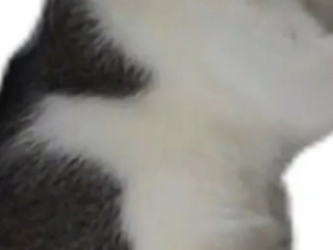 | 43 | 2026-04-04 |
| [【哈基米Dori】最新视频来袭，快来看看吧！](https://www.bilibili.com/video/BV1w9DABrExb) |  | 0 | 2026-04-04 |
| [[哈基米]哈之舞 flower dance](https://www.bilibili.com/video/BV1TCDABEECn) | 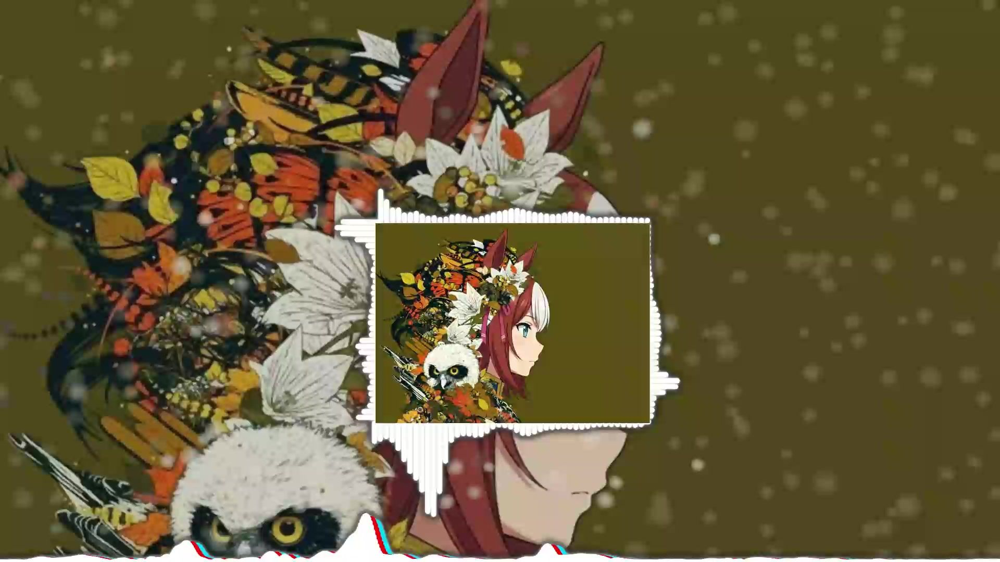 | 924 | 2026-04-04 |
| [奶哈基米](https://www.bilibili.com/video/BV1ySDABVEpr) | 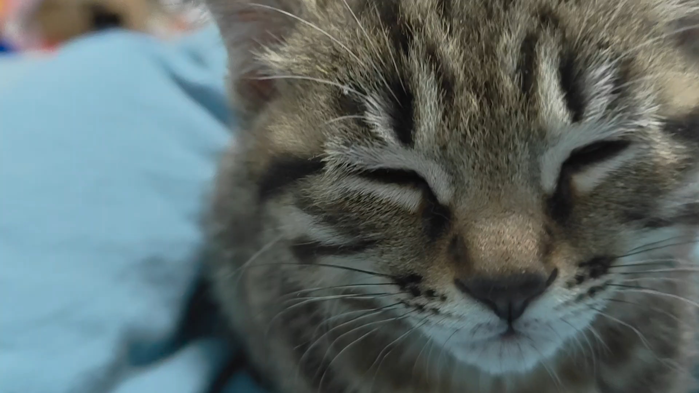 | 33 | 2026-04-04 |
| [《哈基米》之歌](https://www.bilibili.com/video/BV1hEDPBWEwr) |  | 44 | 2026-04-04 |
| [【颗积哈基米】我的最新作品，快来一睹为快！](https://www.bilibili.com/video/BV1xxDPBUEn1) |  | 0 | 2026-04-04 |
| [【颗积哈基米】更新了一条视频，快来围观！](https://www.bilibili.com/video/BV1xxDPBUEoD) |  | 0 | 2026-04-04 |
| [哈基米](https://www.bilibili.com/video/BV1iuDPB8Ejk) | 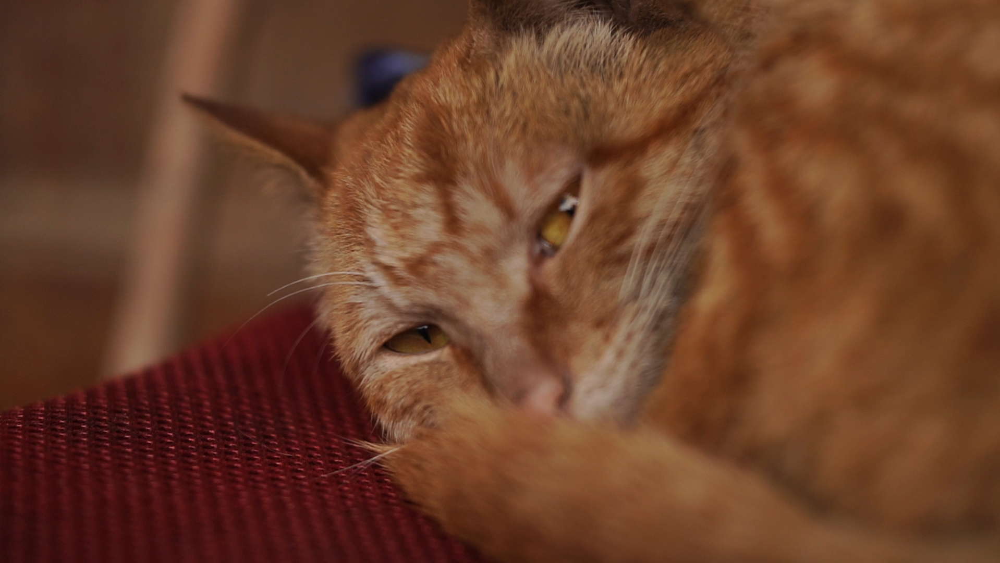 | 22 | 2026-04-04 |
| [一只可爱的哈基米](https://www.bilibili.com/video/BV1iuDPB8EPZ) | 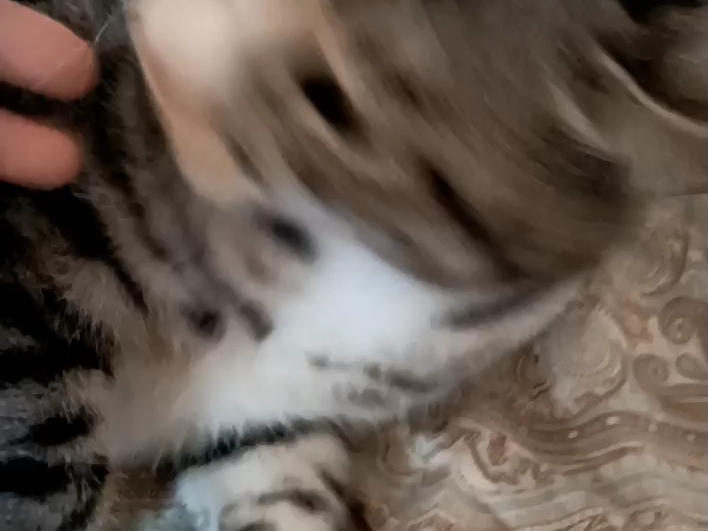 | 54 | 2026-04-04 |
| [怎么一伸手就过来呀~哈基米~](https://www.bilibili.com/video/BV1egDPBfEWB) | 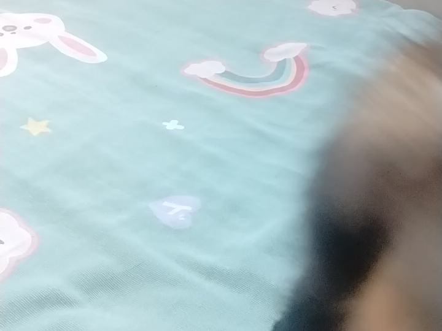 | 25 | 2026-04-04 |
| [【一只爱玩战雷的哈基米】最新视频来袭，快来看看吧！](https://www.bilibili.com/video/BV1xhDPBLEPf) |  | 0 | 2026-04-04 |
| [哈基米的跳舞](https://www.bilibili.com/video/BV1wEDNBVEbN) |  | 51 | 2026-04-03 |
| [【哈基米方舟】（完整版）危基合约新赛季「似光作战」（纯净哈基米音乐）td](https://www.bilibili.com/video/BV13oDPBtEah) | 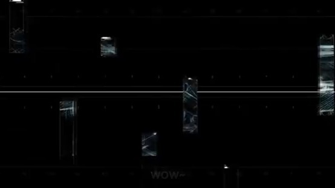 | 0 | 2026-04-03 |
| [不想保底？哈基米盲盒怎么抽？](https://www.bilibili.com/video/BV1KNDAB5Ejn) |  | 1420 | 2026-04-03 |
| [哈基米](https://www.bilibili.com/video/BV1gdDwBnEh4) | 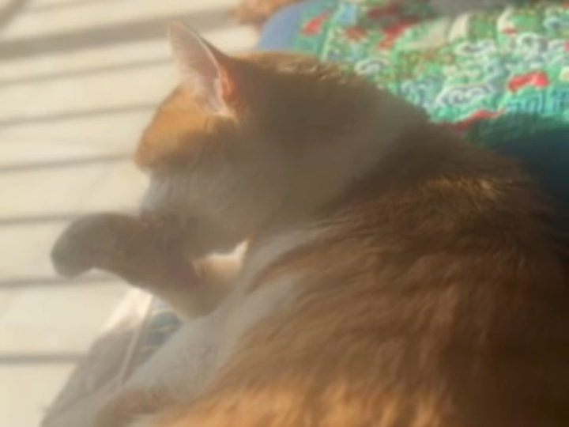 | 151 | 2026-04-03 |
| [【哈基米FM】泡沫so](https://www.bilibili.com/video/BV139DwBQEfK) | 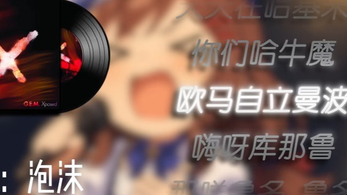 | 1 | 2026-04-03 |
| [外星哈基米](https://www.bilibili.com/video/BV1SBDABDE8E) | 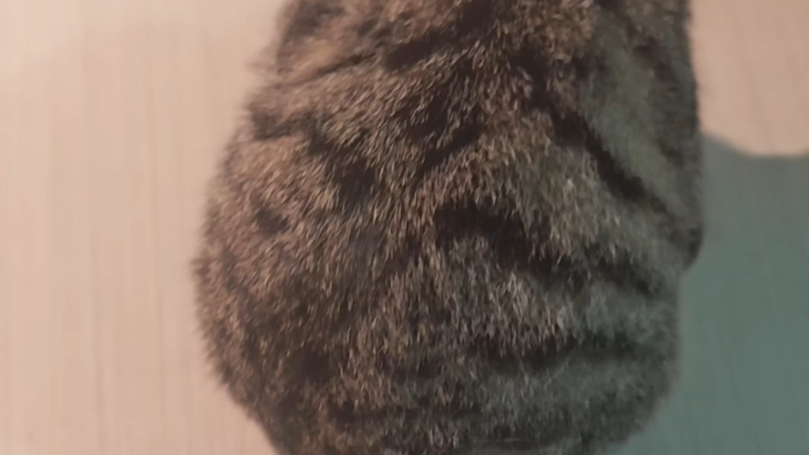 | 639 | 2026-04-03 |
| [哈 基 米](https://www.bilibili.com/video/BV1xA9gBzE4s) | 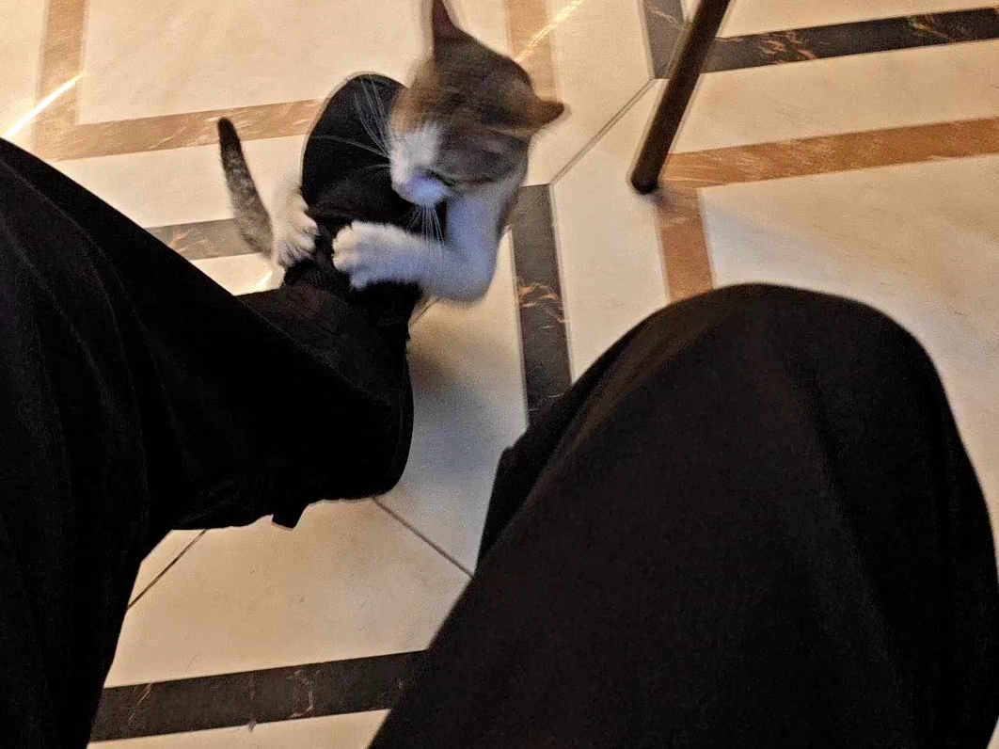 | 28 | 2026-04-03 |
| [不知道哪里来的哈基米](https://www.bilibili.com/video/BV1wG9gBeEgc) | 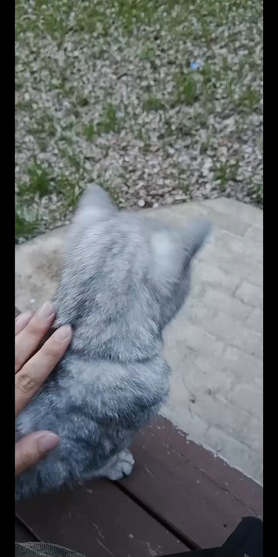 | 18 | 2026-04-03 |
| [哈基米](https://www.bilibili.com/video/BV1659gBwEKS) |  | 397 | 2026-04-03 |
| [哈基米](https://www.bilibili.com/video/BV1K29gBgEe6) | 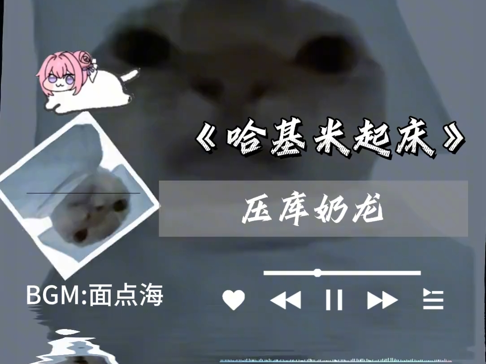 | 124 | 2026-04-03 |
| [我的可爱哈基米](https://www.bilibili.com/video/BV1bB9gB1ETw) | 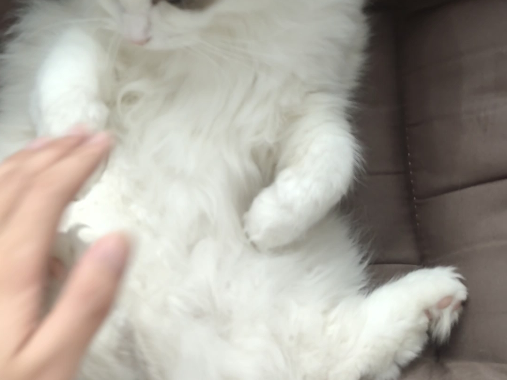 | 91 | 2026-04-03 |
| [黄泉大战哈基米](https://www.bilibili.com/video/BV1he9gBEEaR) | 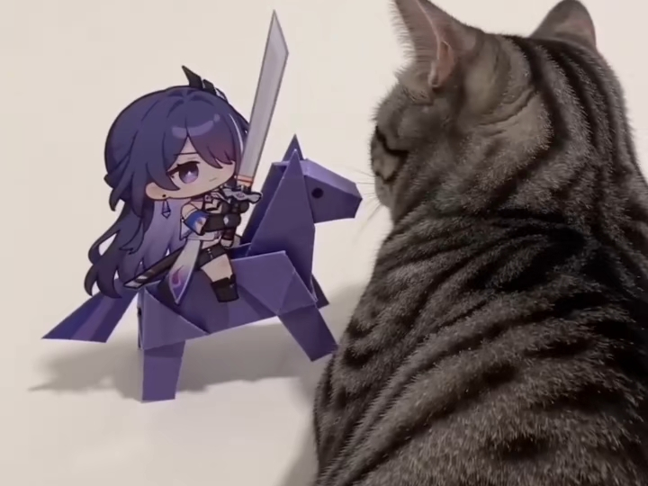 | 232 | 2026-04-03 |
| [【小鱼不菜哈基米】视频已打包，欢迎围观！](https://www.bilibili.com/video/BV1pX9gBKEzf) |  | 150 | 2026-04-03 |
| [请注意，这是只硬汉哈基米](https://www.bilibili.com/video/BV1P19MBAEAc) | 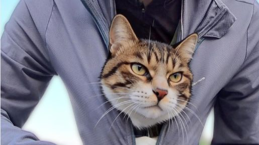 | 2119 | 2026-04-03 |
| [疑似被这个绿色外星哈基米霸凌了](https://www.bilibili.com/video/BV11w9MBaEMz) |  | 6174 | 2026-04-03 |
| [2026圆满系列｜哈基米来袭！！！](https://www.bilibili.com/video/BV1sC9MBeEcM) |  | 4072 | 2026-04-03 |
| [哈基米带我找到了黄金艾比球](https://www.bilibili.com/video/BV1a89MBVErh) |  | 6368 | 2026-04-03 |
| [“ 邻 家 辣 妹 美 基 米 ”](https://www.bilibili.com/video/BV1e49MBLEFT) |  | 3.0万 | 2026-04-03 |
| [哈基米自创歌曲](https://www.bilibili.com/video/BV1S59uBGEAF) |  | 8 | 2026-04-03 |
| [【蛋仔派对】抽哈基米蛋和蕉皮喵蛋](https://www.bilibili.com/video/BV1gH9wBsEij) |  | 1475 | 2026-04-02 |
| [这只哈基米又在假装小手办了](https://www.bilibili.com/video/BV1yu9cBCEt1) |  | 2098 | 2026-04-02 |
| [《崩坏：星穹铁道》动画短片：「Never Gonna Give You Up」](https://www.bilibili.com/video/BV1dyXqBaEE5) |  | 376.1万 | 2026-04-01 |
| [跳⃠跃⃠不⃠是⃠罪⃠过⃠跳⃠跃⃠不⃠是⃠罪⃠过⃠](https://www.bilibili.com/video/BV178QmBfEeN) |  | 17.9万 | 2026-03-25 |
| [极限卡视野挑战](https://www.bilibili.com/video/BV1GZcizVETF) |  | 57.9万 | 2026-02-12 |
| [一曲《肘我》，一剑天涯。孩子们，江湖梦纯享版来咯](https://www.bilibili.com/video/BV1feFAzdEn2) |  | 140.8万 | 2026-02-02 |
| [🐈哈基米rush](https://www.bilibili.com/video/BV1C2xQzAE5E) | 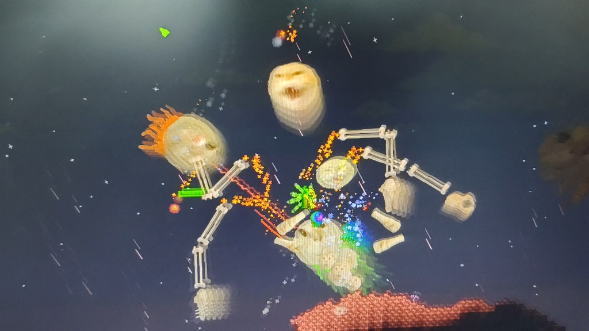 | 54 | 2025-10-07 |
| [世界上最可爱的哈基米](https://www.bilibili.com/video/BV1amHUzcEgP) |  | 7996 | 2025-09-10 |
| [哈基米笑传之Catch catch ball](https://www.bilibili.com/video/BV1LggNz7EZV) | 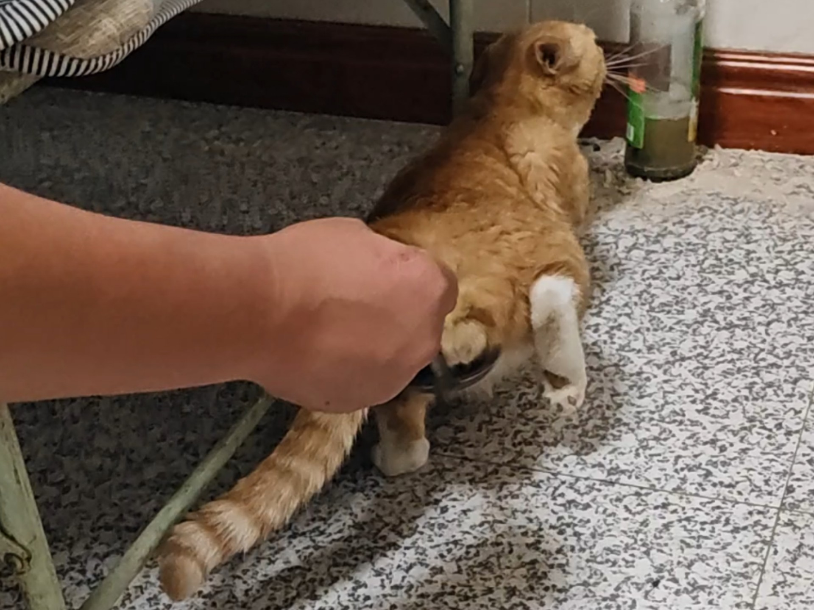 | 502 | 2025-07-17 |
| [阿什拉夫·哈基米｜24/25赛季最强右后卫的超强爆破与现象级的防守🔥](https://www.bilibili.com/video/BV1qEutzjEzf) |  | 8295 | 2025-07-16 |
| [哈哈哈哈基米，小猫咪成长日记](https://www.bilibili.com/video/BV1ri4y1H72W) | 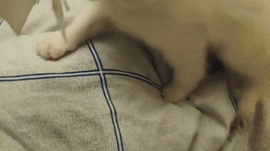 | 116 | 2024-01-25 |

---
*最后更新: 2026-04-05 03:17:22 (自动生成)*
*数据来源: [Bilibili](https://www.bilibili.com)*

## 使用说明

运行以下命令更新视频列表:
```bash
python3 fetch_hajimi_videos.py
```
