# awesome-hajimi
collections of hajimi (哈基米 in Chinese) on the Internet.

## 视频列表 (Video List)

| 视频标题 (Title) | 封面 | 播放量 (Views) | 发布日期 (Date) |
|---|---|---|---|
| [Here With You｜【哈基米】😻仿佛回到了那个夏天🧊](https://www.bilibili.com/video/BV1kJDDBuEEN) |  | 98 | 2026-04-12 |
| [哈～基～米～](https://www.bilibili.com/video/BV1nWDDBqEAJ) | 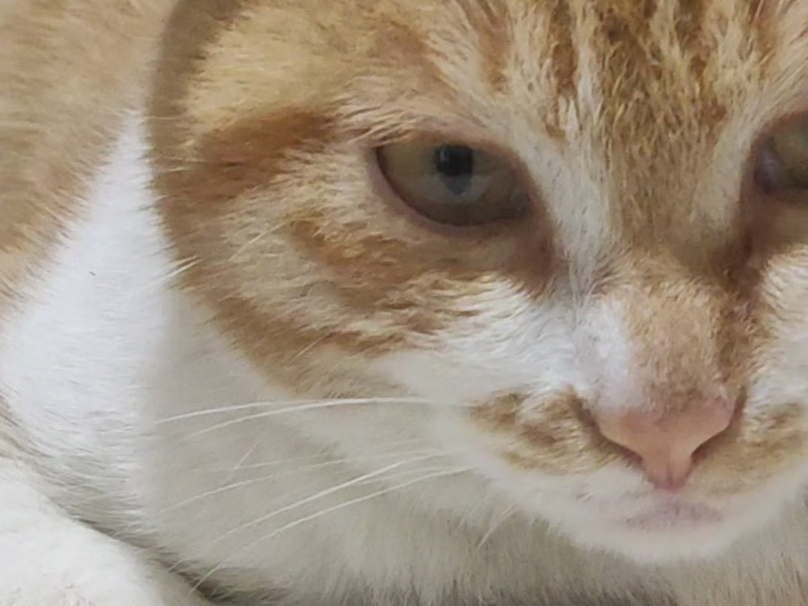 | 0 | 2026-04-12 |
| [哈基米](https://www.bilibili.com/video/BV1zxDDBNExx) |  | 2 | 2026-04-12 |
| [哈基米](https://www.bilibili.com/video/BV12MDDB2E1M) |  | 1 | 2026-04-12 |
| [可爱的小哈基米](https://www.bilibili.com/video/BV1TMDDBmEBJ) | 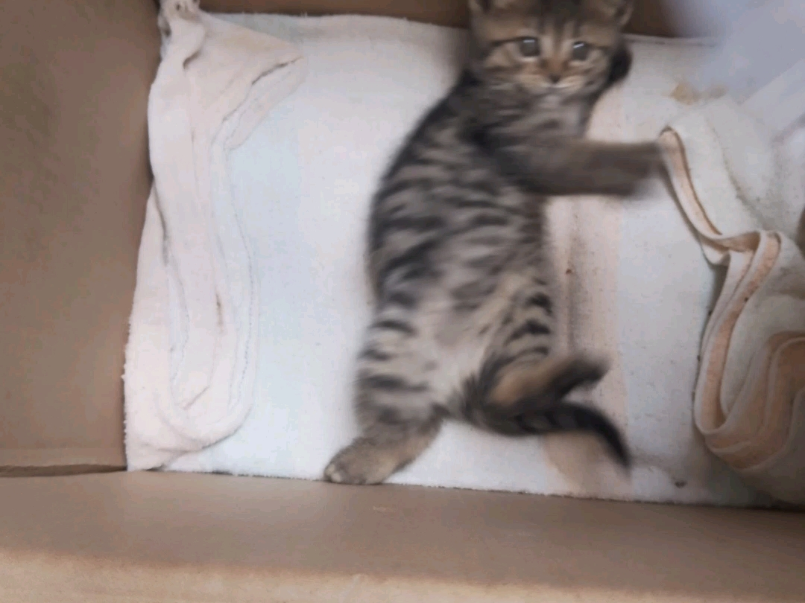 | 5 | 2026-04-12 |
| [哈基米](https://www.bilibili.com/video/BV1KVDDB5E76) |  | 436 | 2026-04-12 |
| [当我想抽哈基米，但没钱be like…](https://www.bilibili.com/video/BV1ybDmBiEov) |  | 19 | 2026-04-12 |
| [哈基米这个喜欢车底](https://www.bilibili.com/video/BV13jDmByEvm) |  | 38 | 2026-04-12 |
| [未知品种的哈基米](https://www.bilibili.com/video/BV1ScDUBCEKC) | 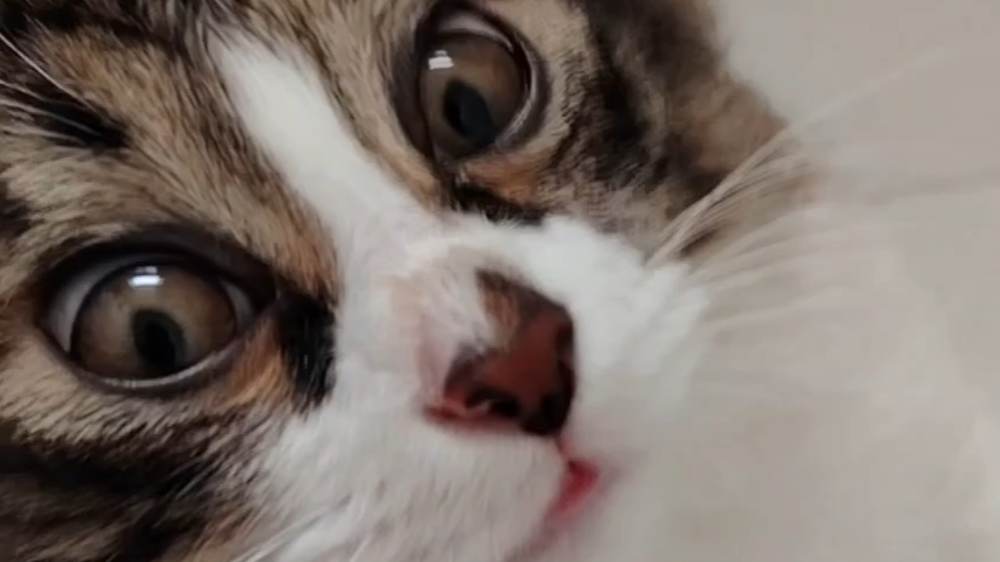 | 555 | 2026-04-12 |
| [炒鸡可爱的哈基米](https://www.bilibili.com/video/BV1FBDmB8EHG) | 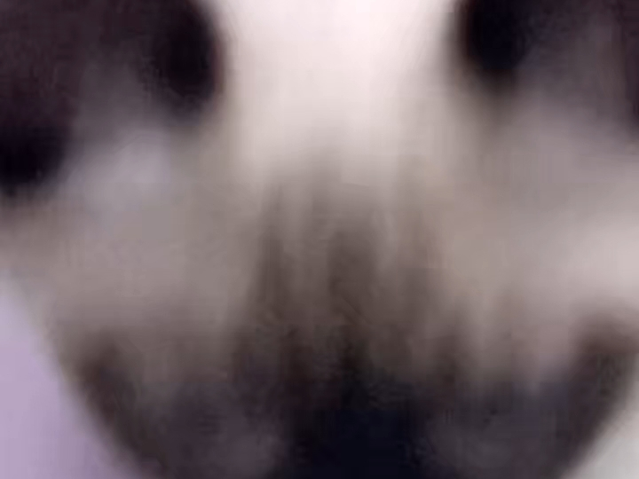 | 0 | 2026-04-12 |
| [少女，哈基米，乐队](https://www.bilibili.com/video/BV1fzDmBZEhJ) |  | 15 | 2026-04-12 |
| [【大桥哈基米】《大桥颂歌 - Ode to the Bridge Builder》“当夕阳的余晖洒过最后一座山丘时，一个粘粘球好像在说……”](https://www.bilibili.com/video/BV1RUDmBQEVQ) |  | 33 | 2026-04-12 |
| [熟睡中的哈基米](https://www.bilibili.com/video/BV1mKDUBgE1Q) | 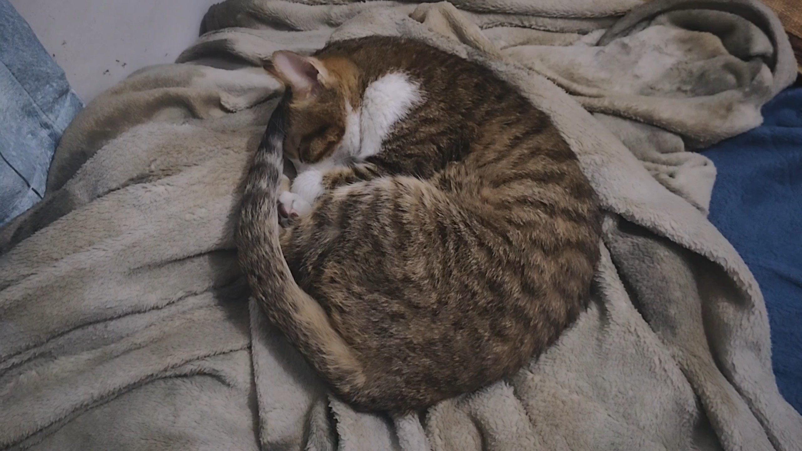 | 433 | 2026-04-11 |
| [难绷舔福哈基米](https://www.bilibili.com/video/BV1tmDUBGEAW) | 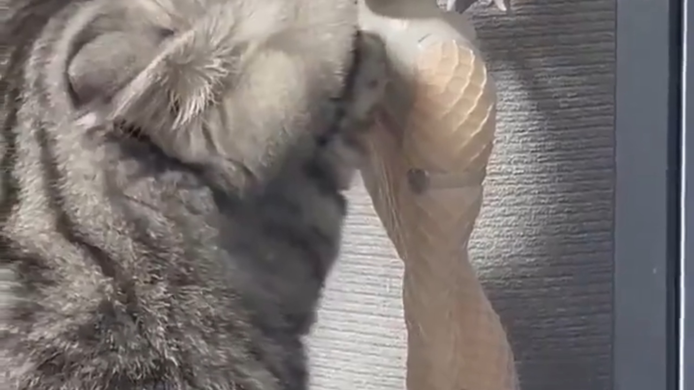 | 4 | 2026-04-11 |
| [古典哈基米音乐《四基 · 冬 》so](https://www.bilibili.com/video/BV1qHD2BHEs7) |  | 1 | 2026-04-11 |
| [史上最哈基米的视频出现了so](https://www.bilibili.com/video/BV1fJD2BXEP3) |  | 0 | 2026-04-11 |
| [哈基基基基基米!!!【哈基米重度依赖】so](https://www.bilibili.com/video/BV1CKD2BaEyw) |  | 1 | 2026-04-11 |
| [哈基米永远爱你](https://www.bilibili.com/video/BV17ADmBWEA5) |  | 8 | 2026-04-11 |
| [哈基米投了个三分球](https://www.bilibili.com/video/BV15gDmBUE7v) | 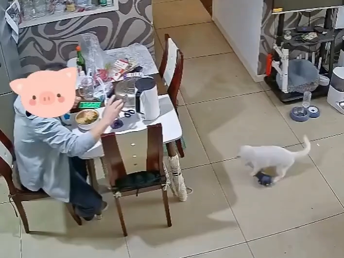 | 192 | 2026-04-11 |
| [冷知识，哈基米会舔皮炎](https://www.bilibili.com/video/BV1sSD2BAE2Y) | 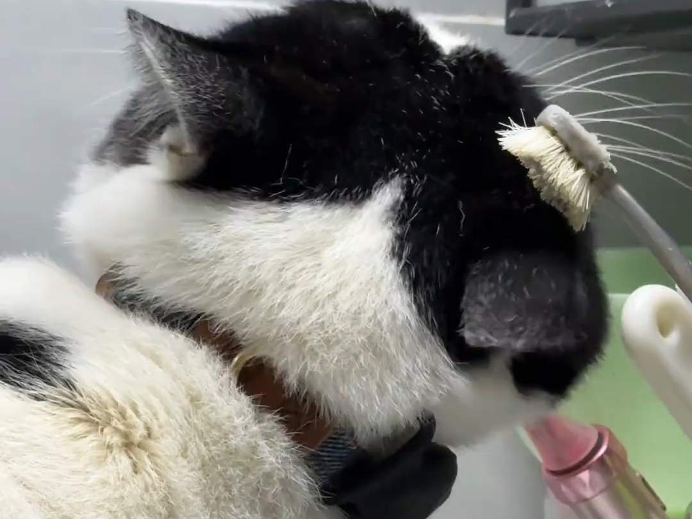 | 234 | 2026-04-11 |
| [有没有可能这是哈基米自己晒的，现在只是在收获](https://www.bilibili.com/video/BV1WDD2BaEkv) | 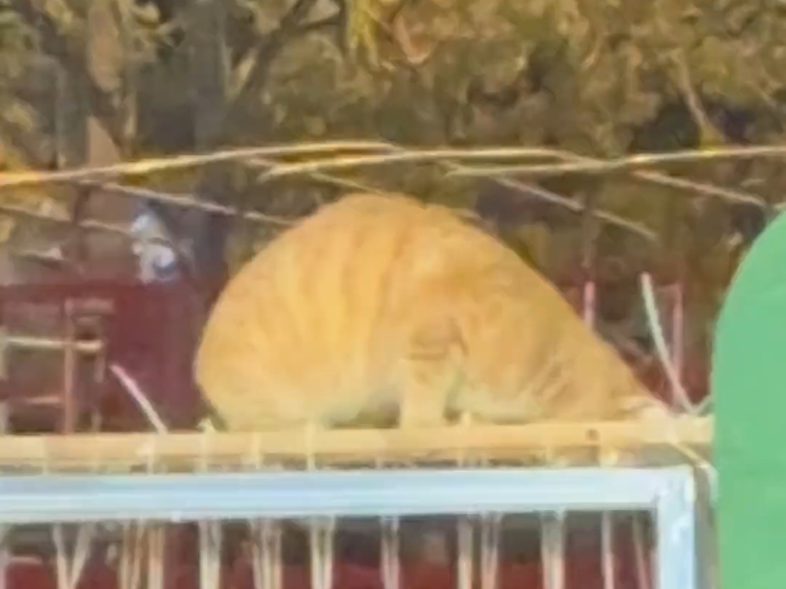 | 116 | 2026-04-11 |
| [哈基米一失足成千古恨](https://www.bilibili.com/video/BV1zFDmBxE1A) | 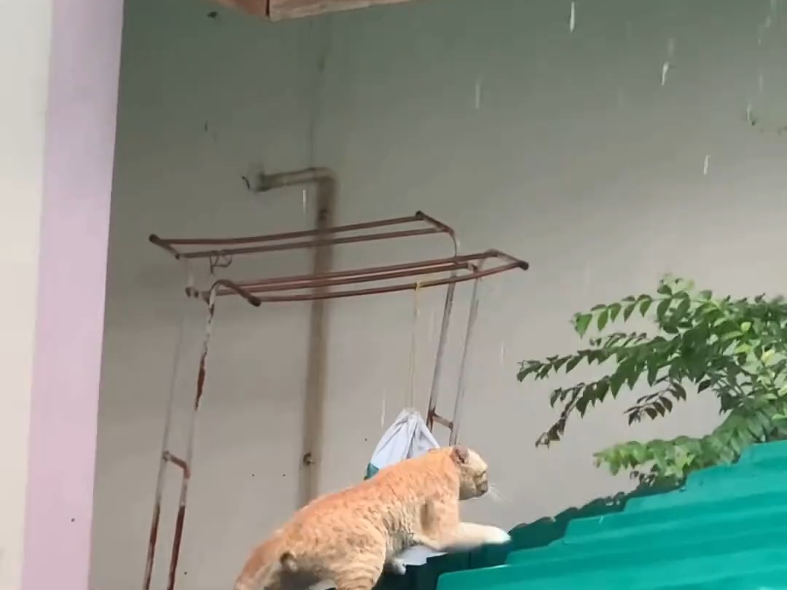 | 472 | 2026-04-11 |
| [两岸基米啼不住，哈气已过万重山](https://www.bilibili.com/video/BV1HRD2BfEqE) | 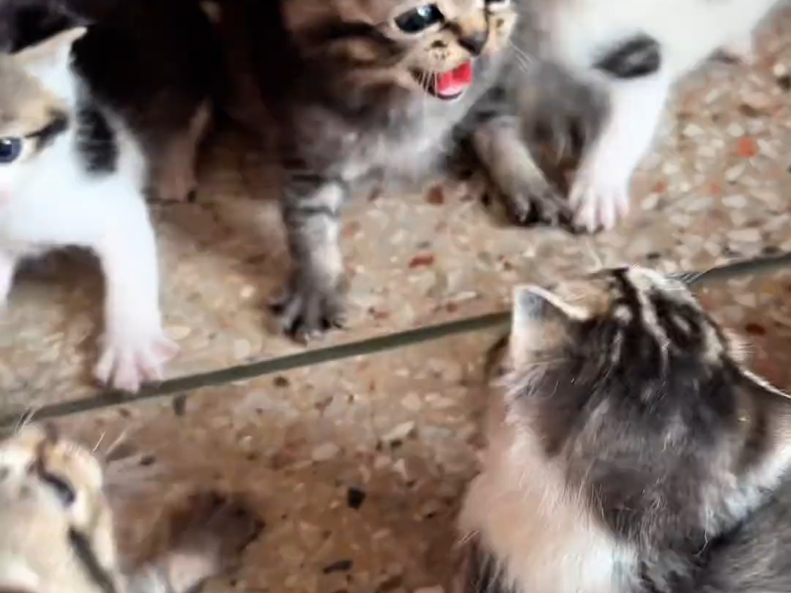 | 528 | 2026-04-11 |
| [绷不住了一窝都在哈气，哈出交响乐了](https://www.bilibili.com/video/BV1HRD2BfE63) | 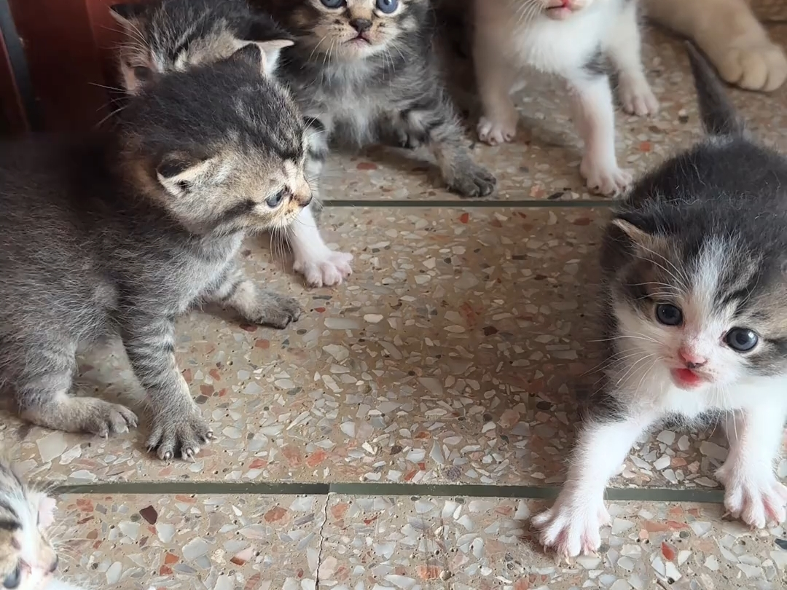 | 1163 | 2026-04-11 |
| [哈基米疯狂街舞发泄绝育之苦](https://www.bilibili.com/video/BV1noD2BtEzv) | 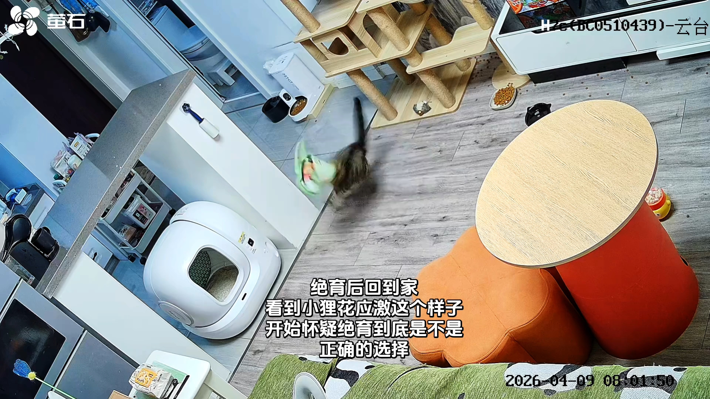 | 1948 | 2026-04-11 |
| [哈基米这个又蠢又坏，可以达斯了](https://www.bilibili.com/video/BV1z5DyBEExR) | 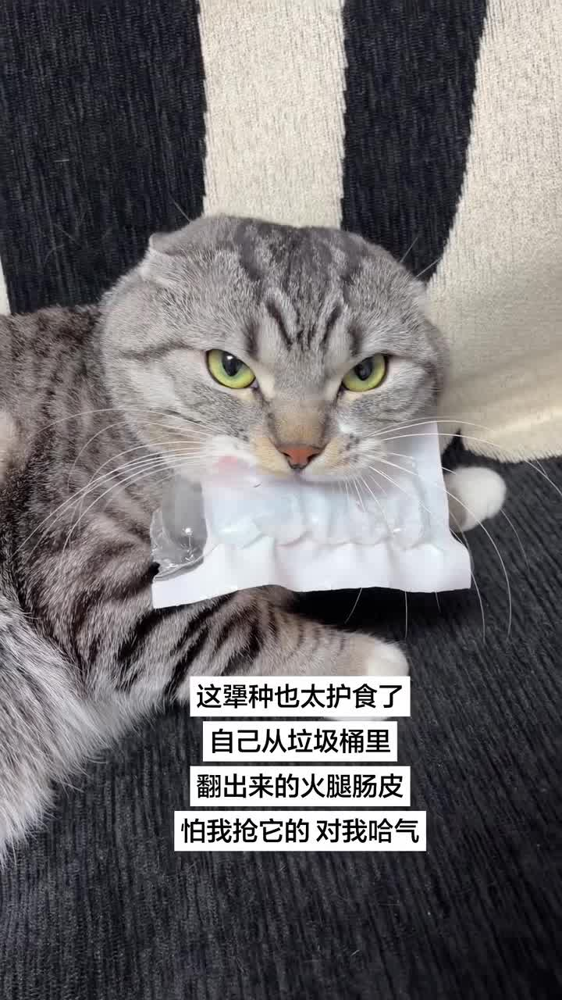 | 142 | 2026-04-11 |
| [杰尼耄](https://www.bilibili.com/video/BV12FDyBZE5X) | 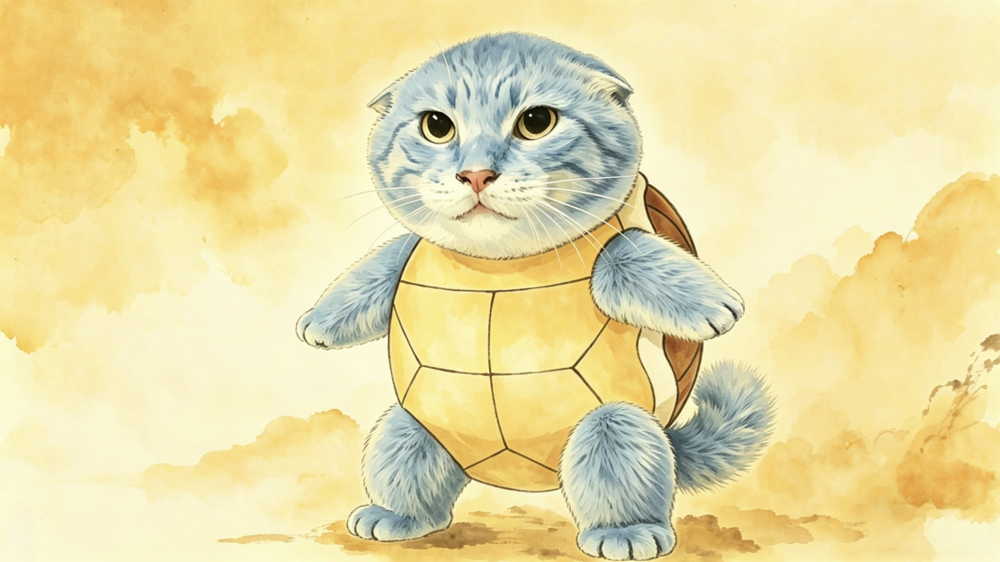 | 2347 | 2026-04-11 |
| [哈基米 曼波](https://www.bilibili.com/video/BV1PKDyBREMU) |  | 0 | 2026-04-11 |
| [哈基米 曼波](https://www.bilibili.com/video/BV1kMDyBpEzY) |  | 1 | 2026-04-11 |
| [#哈基米英语](https://www.bilibili.com/video/BV1xCDyBbEpZ) |  | 103 | 2026-04-11 |
| [哈基米南北绿豆~～](https://www.bilibili.com/video/BV1esDyBrE9a) | 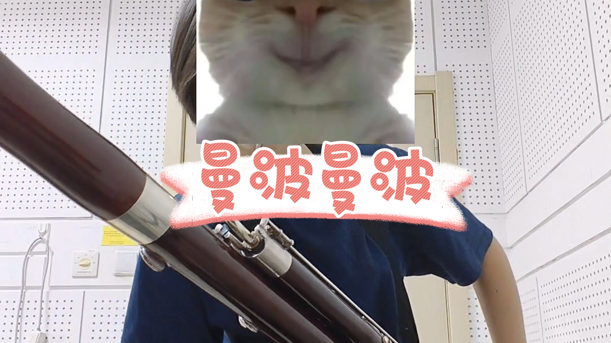 | 149 | 2026-04-11 |
| [当哈基米用人类对他的方式报复人类……](https://www.bilibili.com/video/BV18hDyBqEVU) |  | 2392 | 2026-04-11 |
| [哈基米能有什么坏心思](https://www.bilibili.com/video/BV1DYDyBKEdG) | 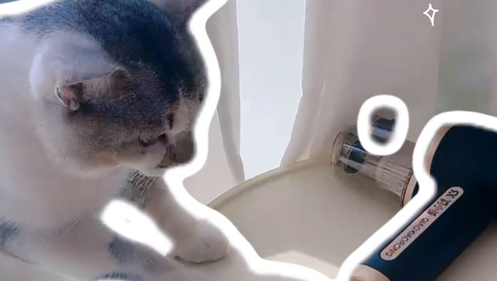 | 75 | 2026-04-11 |
| [哈基米：沉浸式观看8k高清](https://www.bilibili.com/video/BV1GtDyB6EgG) | 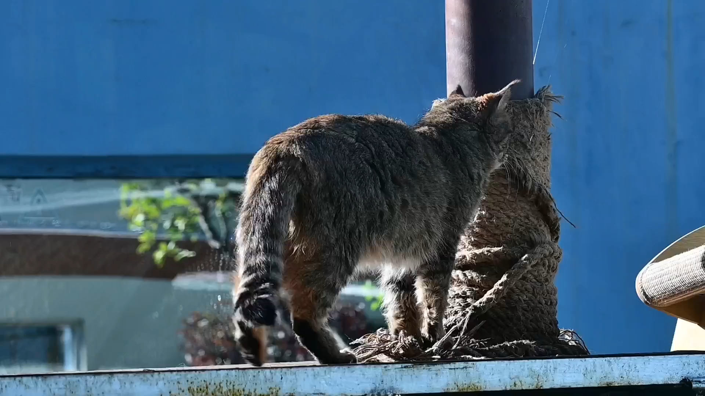 | 189 | 2026-04-11 |
| [哈基米真可爱](https://www.bilibili.com/video/BV1vAD1B1EPz) | 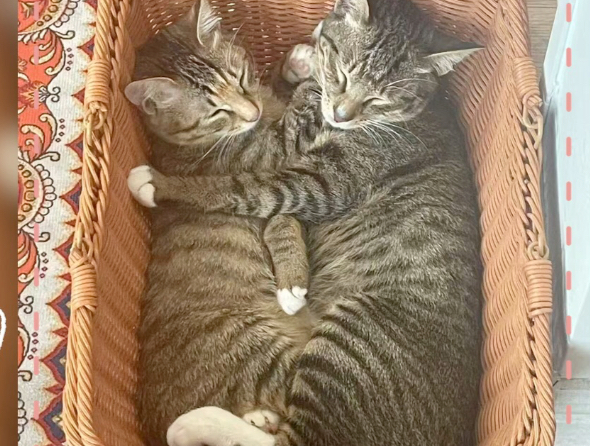 | 37 | 2026-04-11 |
| [《春节序曲》哈基米版，有点儿烫嘴 #春节序曲 #哈基米 #哈基米音乐 #曼波 #rnb](https://www.bilibili.com/video/BV1LAD1B1Ebw) |  | 0 | 2026-04-11 |
| [哈基米](https://www.bilibili.com/video/BV1GMD1BGEbF) |  | 1746 | 2026-04-11 |
| [【CTT】三重混沌时光一阶段，但是纯净哈基米](https://www.bilibili.com/video/BV1y2DyB4EkD) |  | 647 | 2026-04-11 |
| [点进来就送一只哈基米2.0](https://www.bilibili.com/video/BV1BdDyBnE23) |  | 118 | 2026-04-11 |
| [AI: IU x 哈基米音乐](https://www.bilibili.com/video/BV1N4D1BFEii) |  | 4 | 2026-04-11 |
| [【卡机哈基米】我的最新作品，快来一睹为快！](https://www.bilibili.com/video/BV1NWD1BwEyV) |  | 4 | 2026-04-11 |
| [这个哈基米可以撸吗？](https://www.bilibili.com/video/BV11WD1BwE5z) | 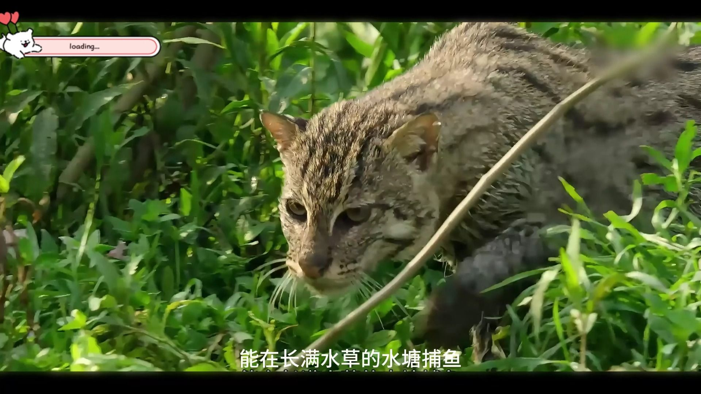 | 177 | 2026-04-11 |
| [哈基米掉毛](https://www.bilibili.com/video/BV1XpDkBNEQN) |  | 510 | 2026-04-11 |
| [哈基米助眠丨掏耳纯享 3d脑中穿梭](https://www.bilibili.com/video/BV1G1QKBqEZK) | 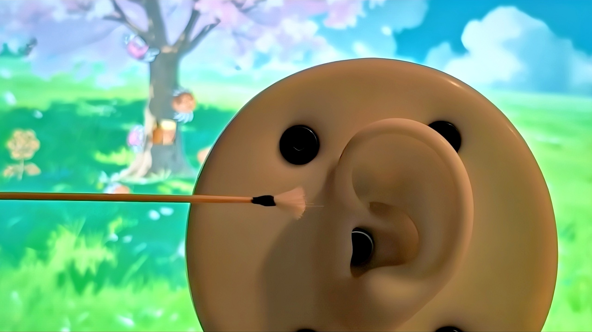 | 1803 | 2026-04-11 |
| [咱们今天来抽个哈基米嘻嘻好可爱](https://www.bilibili.com/video/BV1WCDkBDECK) |  | 757 | 2026-04-11 |
| [哈基米！](https://www.bilibili.com/video/BV1ERDkBVE38) | 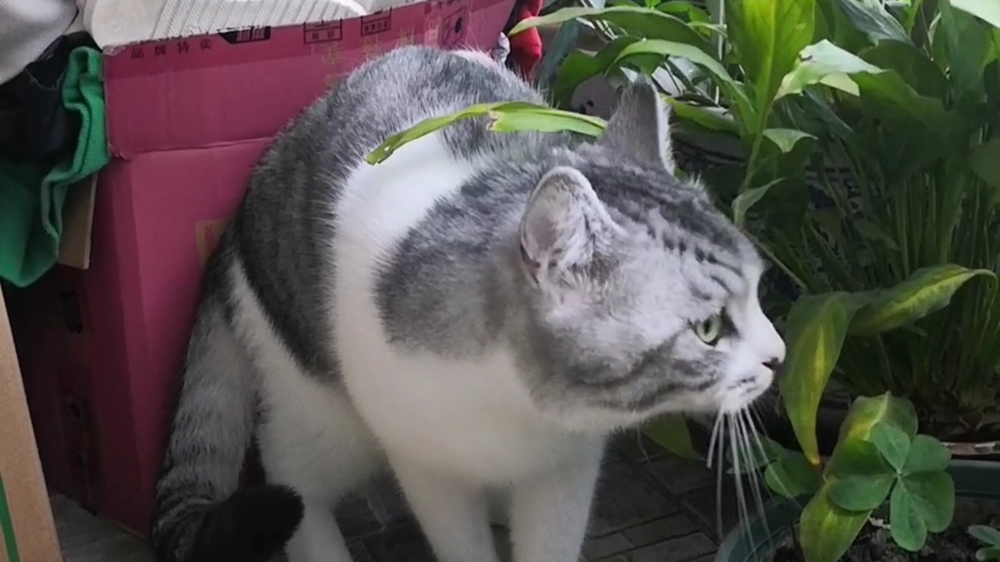 | 38 | 2026-04-11 |
| [笨笨哈基米](https://www.bilibili.com/video/BV1JQDkBLEcL) | 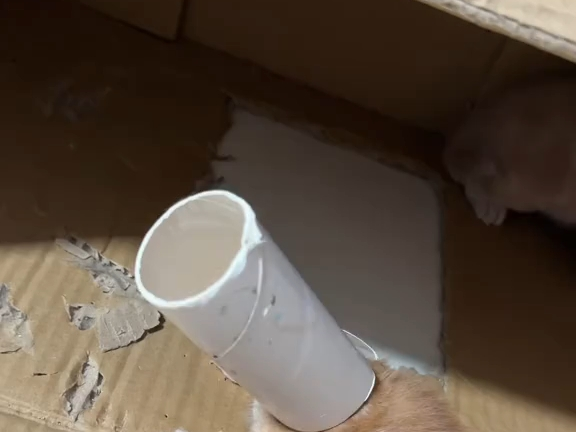 | 114 | 2026-04-11 |
| [哈基米这个cos孙悟空](https://www.bilibili.com/video/BV1xnDCBxEsG) | 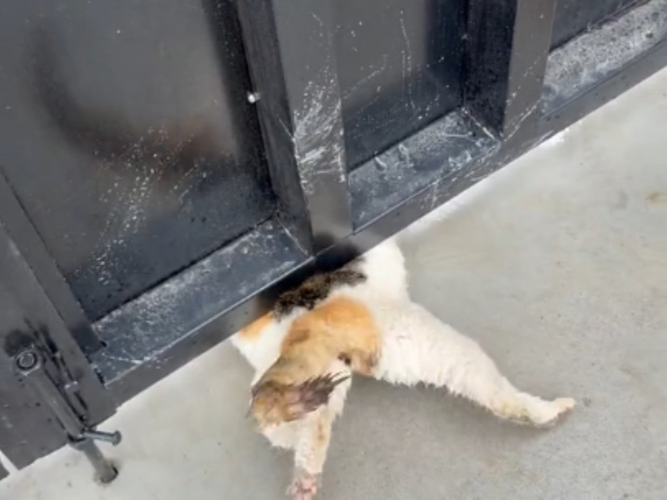 | 290 | 2026-04-11 |
| [【哈基米音乐】哈气来的太快就像龙卷风](https://www.bilibili.com/video/BV1HtDCBDEz2) | 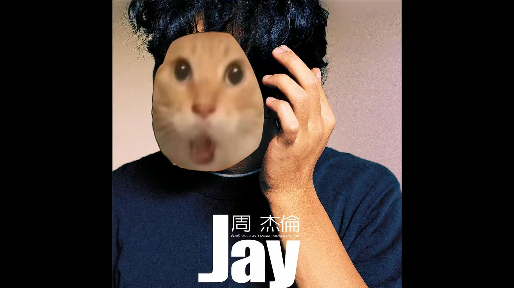 | 612 | 2026-04-11 |
| [哈基米祝指挥官新年快乐](https://www.bilibili.com/video/BV1hCDEBYEJ4) |  | 465 | 2026-04-11 |
| [跳大过年](https://www.bilibili.com/video/BV1K7DCBtE5b) | 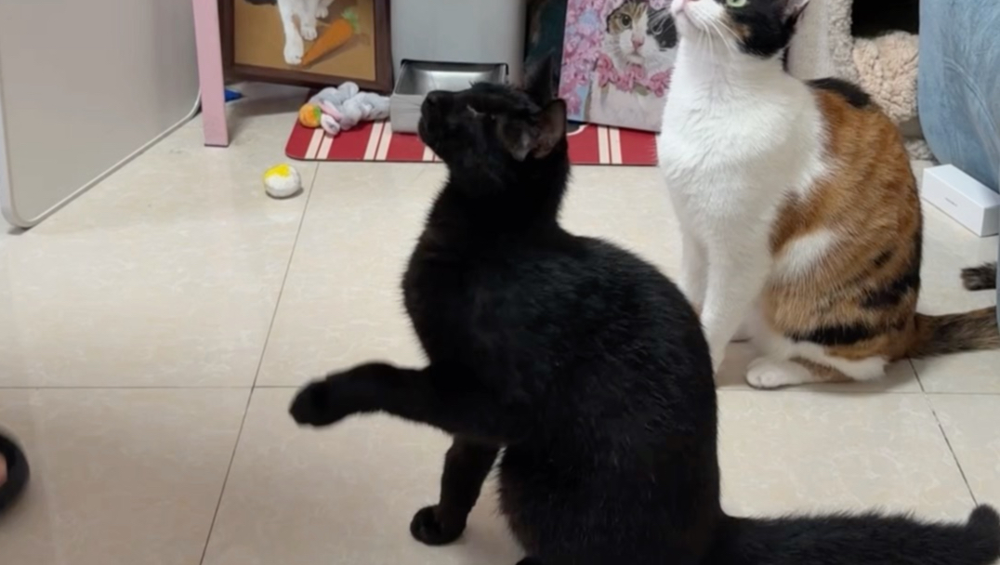 | 19.1万 | 2026-04-11 |
| [哈基米哟蓝北绿豆](https://www.bilibili.com/video/BV1QUDCBKETb) |  | 308 | 2026-04-11 |
| [【AI哈基米】赛博哈基米智斗巅峰之...](https://www.bilibili.com/video/BV1XUDCBKEAt) |  | 2048 | 2026-04-11 |
| [哈德森养了只哈基米？](https://www.bilibili.com/video/BV1BCQcBYERj) |  | 1.0万 | 2026-04-11 |
| [哈基米南北绿豆](https://www.bilibili.com/video/BV1nYDCB7Ewn) | 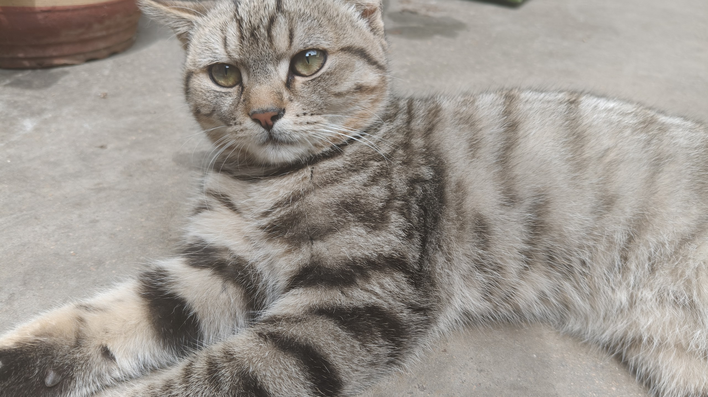 | 506 | 2026-04-11 |
| [哈基米：😺耄的随波逐流😺](https://www.bilibili.com/video/BV1vNQMBkE2V) | 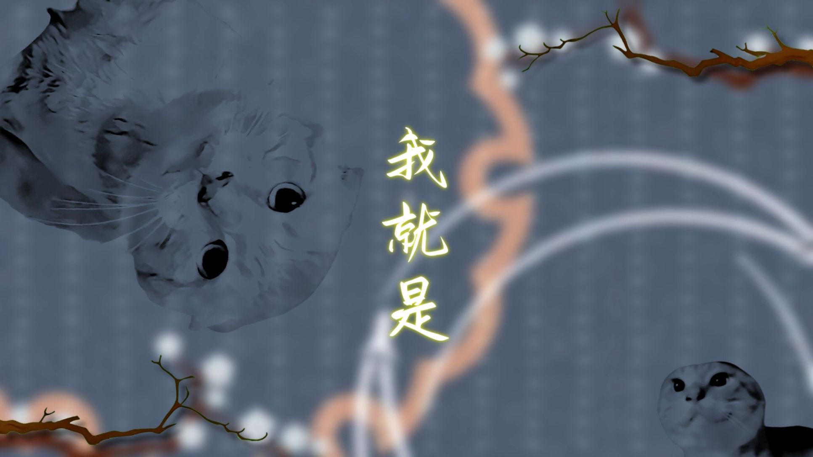 | 1823 | 2026-04-11 |
| [⚡哈基米⚡但绝地求生](https://www.bilibili.com/video/BV1hVQMBTE5S) | 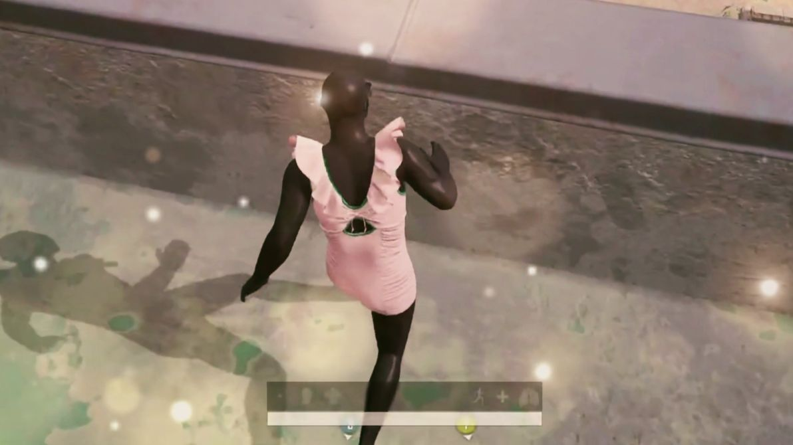 | 683 | 2026-04-11 |
| [哈基米程序错误](https://www.bilibili.com/video/BV1stQMBoEnG) | 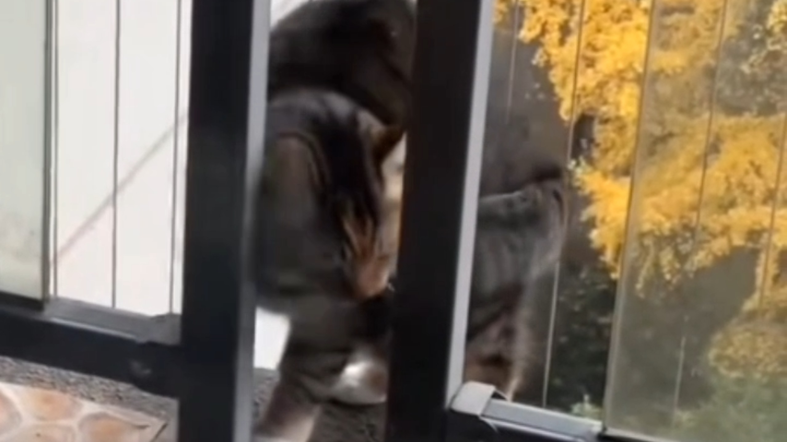 | 398 | 2026-04-11 |
| [【哈基米音乐】You are 曼波tiful 主唱太拼命了](https://www.bilibili.com/video/BV1W8QMBxE2M) |  | 203 | 2026-04-11 |
| [哈基米南北绿豆](https://www.bilibili.com/video/BV1TwQuBeEcq) |  | 3389 | 2026-04-11 |
| [【鸽の歌单·哈基米】3分钟纯享版“哈气了”](https://www.bilibili.com/video/BV1mPQuBAEzH) |  | 99 | 2026-04-11 |
| [哈基米](https://www.bilibili.com/video/BV14PQuBAEHP) | 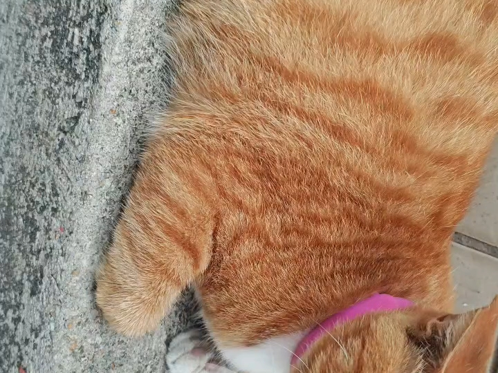 | 1 | 2026-04-11 |
| [基米不哈气](https://www.bilibili.com/video/BV1TcQuBNEQF) |  | 39 | 2026-04-11 |
| [谁家的哈基米出逃了](https://www.bilibili.com/video/BV1YQQMB3EKN) | 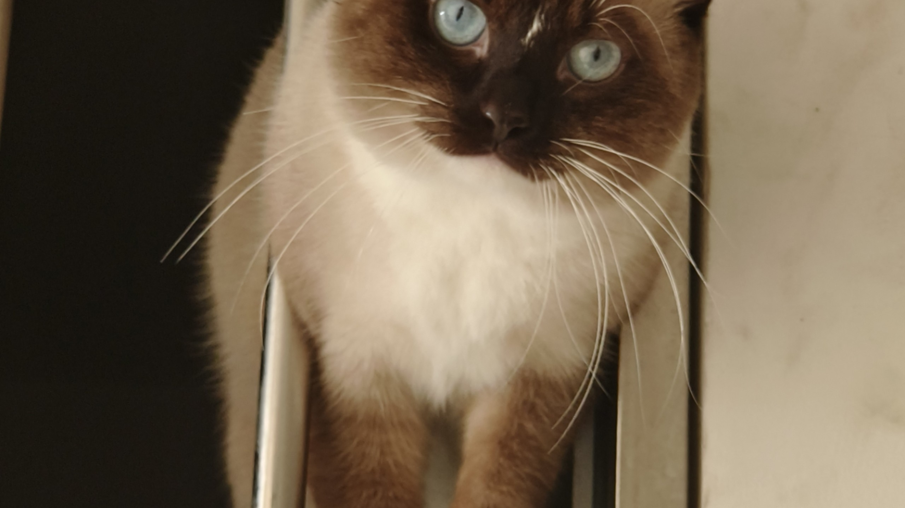 | 194 | 2026-04-11 |
| [哈基咪南北绿豆~](https://www.bilibili.com/video/BV1GUQMBVEZu) |  | 8.9万 | 2026-04-11 |
| [Persona 4《signs of 基米》](https://www.bilibili.com/video/BV1fnQuBnEx6) |  | 369 | 2026-04-11 |
| [看猫片吗？最懂得感恩的哈基米](https://www.bilibili.com/video/BV1n7QuBWEKu) | 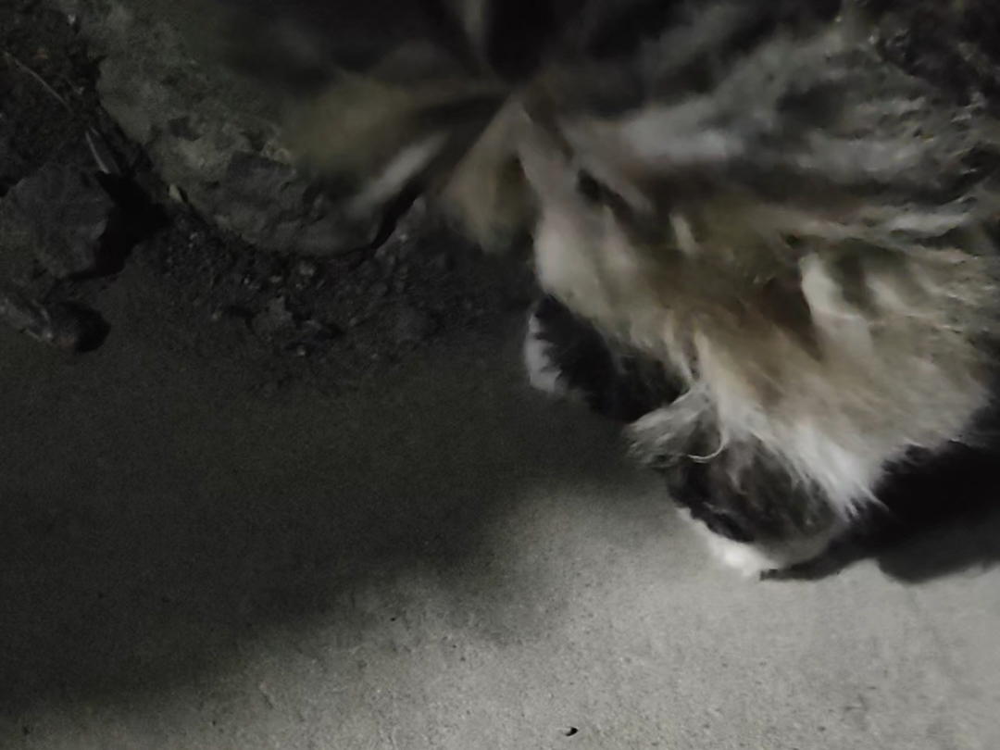 | 51 | 2026-04-11 |
| [哈基米](https://www.bilibili.com/video/BV1osQuBmEdH) | 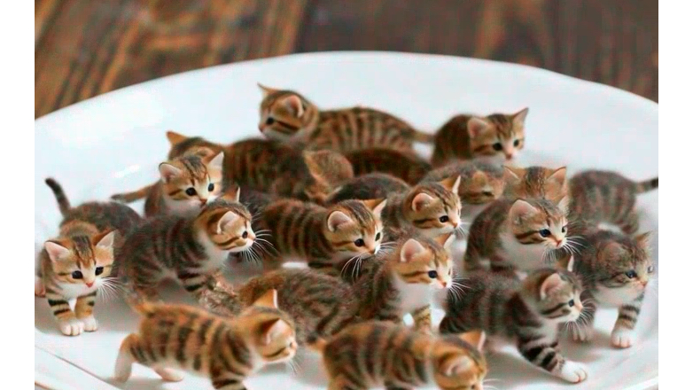 | 113 | 2026-04-11 |
| [传统京剧《赛马娘》东海帝皇爱吃哈基米](https://www.bilibili.com/video/BV1d5QABcEcj) |  | 2.4万 | 2026-04-11 |
| [变成平静的咪这一课要承受很多哈气](https://www.bilibili.com/video/BV1WJQPB2ExM) | 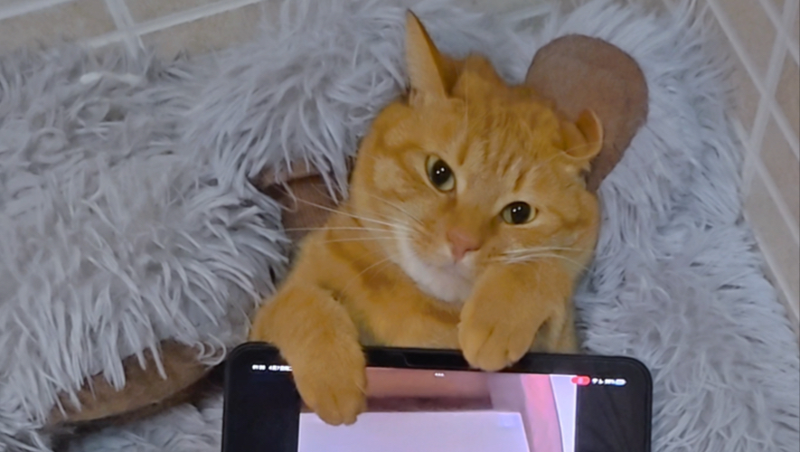 | 8263 | 2026-04-11 |
| [《舌尖上的哈基米》 高端的哈基米，往往需要最简单的抽象方式。#哈基米 #哈基米音乐 #抽象 #音乐分享](https://www.bilibili.com/video/BV1PuQuBfEvf) | 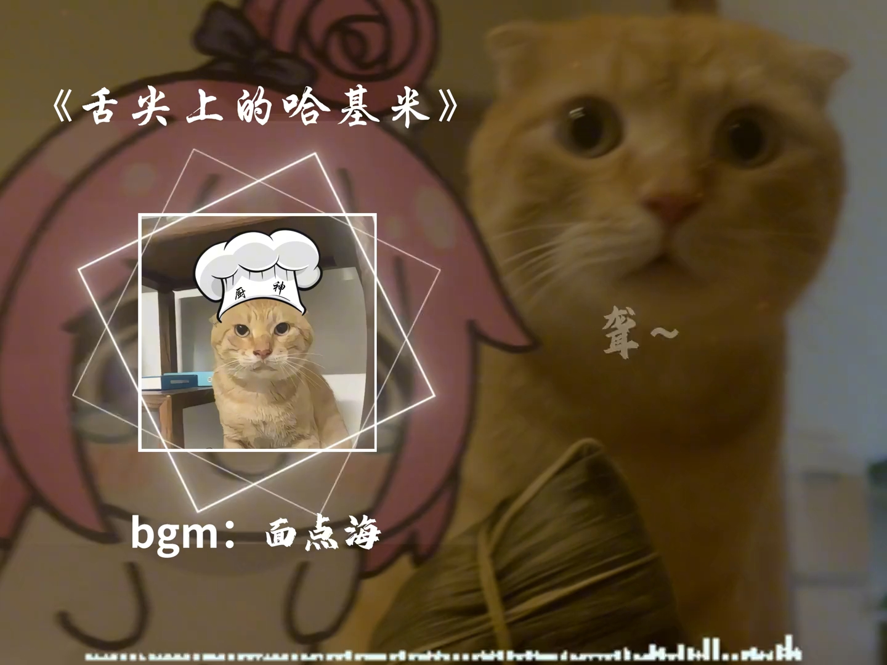 | 111 | 2026-04-11 |
| [哈基米](https://www.bilibili.com/video/BV1A3QuBtEX6) |  | 3 | 2026-04-11 |
| [锐克和耄耋（4）噩梦缠绕 下集](https://www.bilibili.com/video/BV1NeQcB6ECF) |  | 10.5万 | 2026-04-11 |
| [不知羞耻的哈基米。。。](https://www.bilibili.com/video/BV1k4QKBSEKo) | 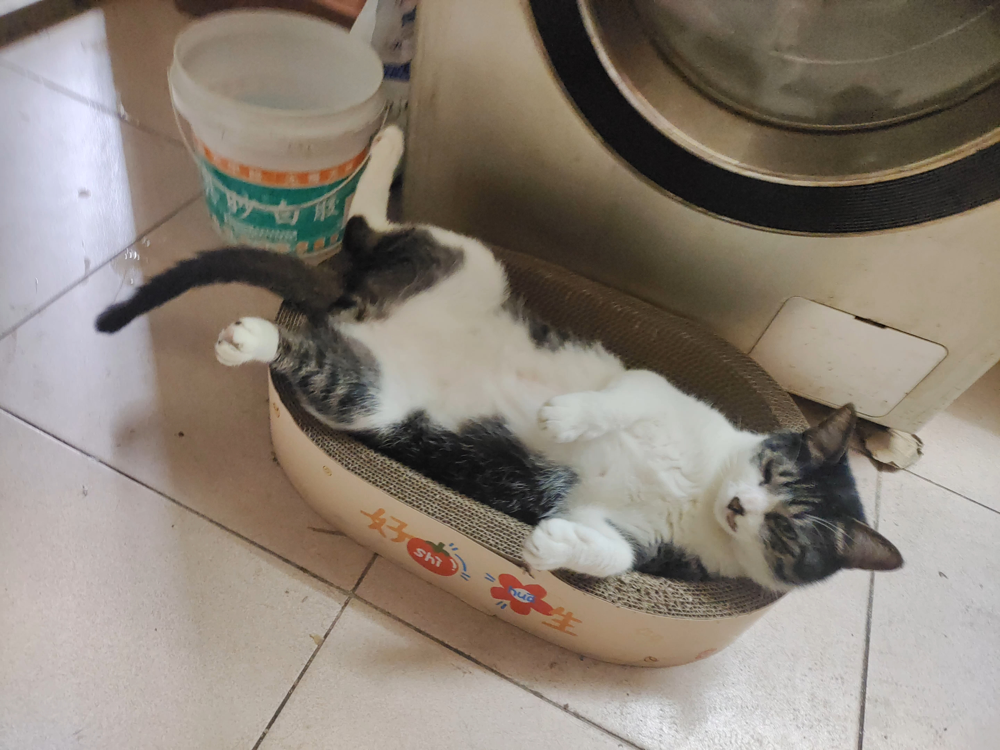 | 27 | 2026-04-11 |
| [快递站偶遇哈基米](https://www.bilibili.com/video/BV1NcQTB4EZk) | 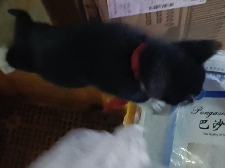 | 0 | 2026-04-11 |
| [爱情骗子我问你，哈基米明星](https://www.bilibili.com/video/BV1E5QTBmEXS) |  | 9 | 2026-04-11 |
| [【2026.03】哈基米音乐野榜#3](https://www.bilibili.com/video/BV1wKDhB7EAu) |  | 521 | 2026-04-11 |
| [請輸入標題，（曼波預警）（娘化預警）](https://www.bilibili.com/video/BV1EjQTBjEJh) |  | 8522 | 2026-04-11 |
| [卫龙 辣条 大小面筋 亲嘴烧 【哈基米】休闲零食大礼包478g年货节团购](https://www.bilibili.com/video/BV1o5QABcEtL) |  | 0 | 2026-04-10 |
| [【_-乔鲁诺哈基米-_】更新了一条视频，快来围观！](https://www.bilibili.com/video/BV1fMQABNEGV) |  | 3 | 2026-04-10 |
| [哈基米音乐盒](https://www.bilibili.com/video/BV1n2QABgEA8) | 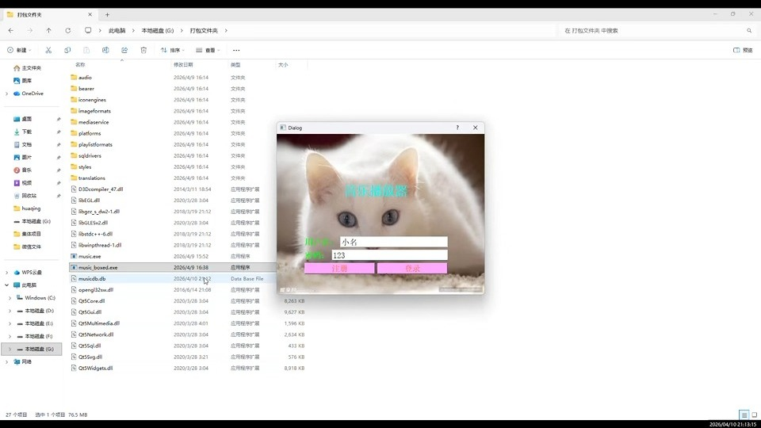 | 11 | 2026-04-10 |
| [火炕上“燃”起来啦](https://www.bilibili.com/video/BV1hZDfBLEWF) | 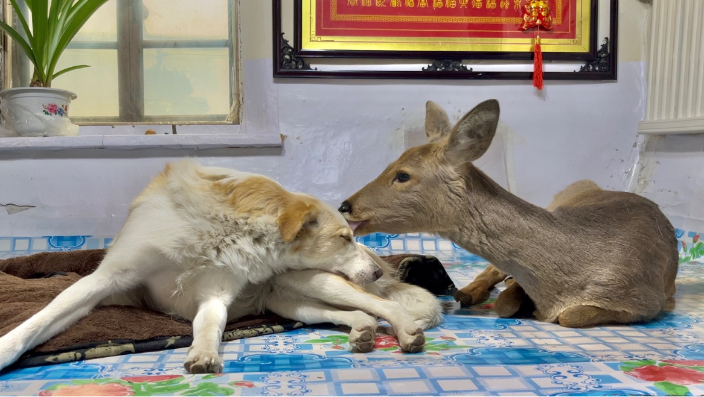 | 22.0万 | 2026-04-10 |
| [用嘬嘬嘬让猫原谅我一百次](https://www.bilibili.com/video/BV1sLQwBrEBY) |  | 17.9万 | 2026-04-10 |
| [显卡TV旧传之饥饿小猫想吃主人的外卖](https://www.bilibili.com/video/BV1s9QwB1EXT) | 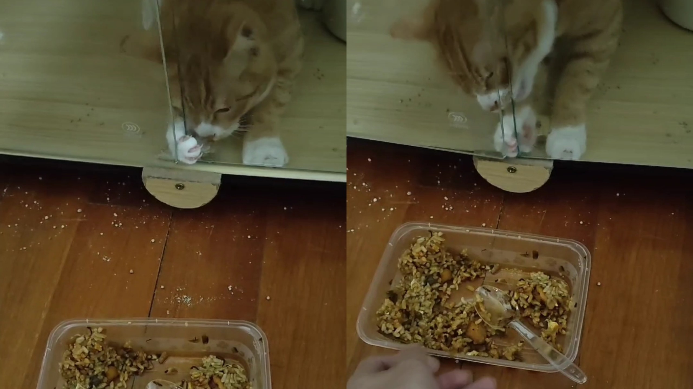 | 2050 | 2026-04-10 |
| [哈基米这个齐齐哈尔](https://www.bilibili.com/video/BV1adDfBmEd1) |  | 1485 | 2026-04-10 |
| [😿基米不想底层代码错乱…😿（DataErr0r）](https://www.bilibili.com/video/BV1jYXkBLEgF) |  | 228 | 2026-04-10 |
| [本次测试安全屋中安全屋和自动返回安全屋哈气。](https://www.bilibili.com/video/BV1ReQFBDEcs) | 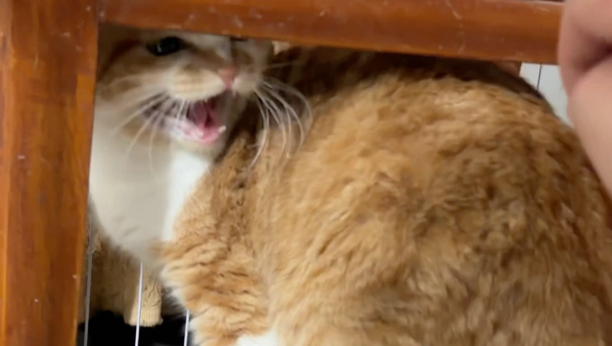 | 52.3万 | 2026-04-10 |
| [同样都是橘猫](https://www.bilibili.com/video/BV1Y9D4BZEBi) | 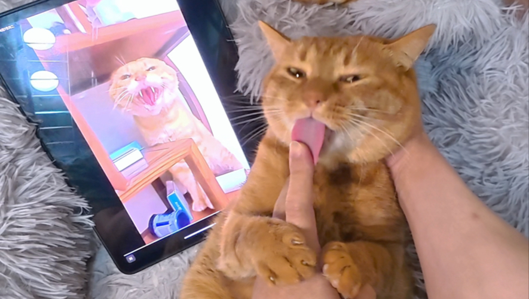 | 17.2万 | 2026-04-10 |
| [那个时候的猫小小的，狗小小的，笼子大大的。](https://www.bilibili.com/video/BV1A9DZBFEE2) | 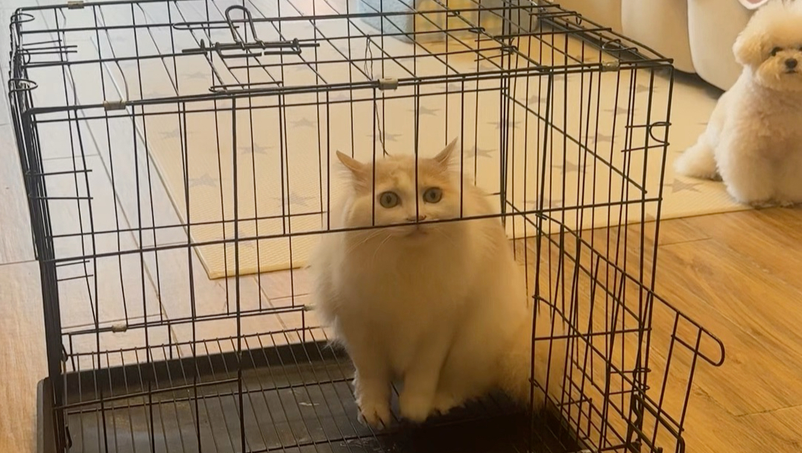 | 2.0万 | 2026-04-10 |
| [一不小心读到了战败CG🥵🥵【喵喵的结合】](https://www.bilibili.com/video/BV1EnDxBaEHM) |  | 2851 | 2026-04-10 |
| [“恶 龙 咆 哮！！”](https://www.bilibili.com/video/BV1NRX6BpEeL) |  | 6570 | 2026-04-10 |
| [基米这个翻大车](https://www.bilibili.com/video/BV1PUDxBVEd7) | 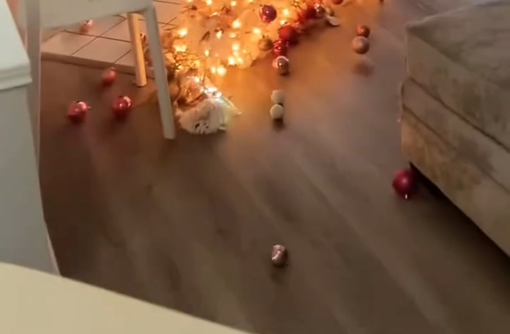 | 15.5万 | 2026-04-09 |
| [170斤不小心坐哈基米身上了 #伪人 #抽象 #奇葩 #猫咪](https://www.bilibili.com/video/BV1HiDsBYEpS) |  | 38.5万 | 2026-04-09 |
| [⚡真·哈基米！南北绿豆⚡](https://www.bilibili.com/video/BV1NrDHBaEXf) |  | 376 | 2026-04-09 |
| [哈基米南北绿豆](https://www.bilibili.com/video/BV1pgDWBhE4U) |  | 91 | 2026-04-09 |
| [老吴](https://www.bilibili.com/video/BV1ibDjBNEqJ) | 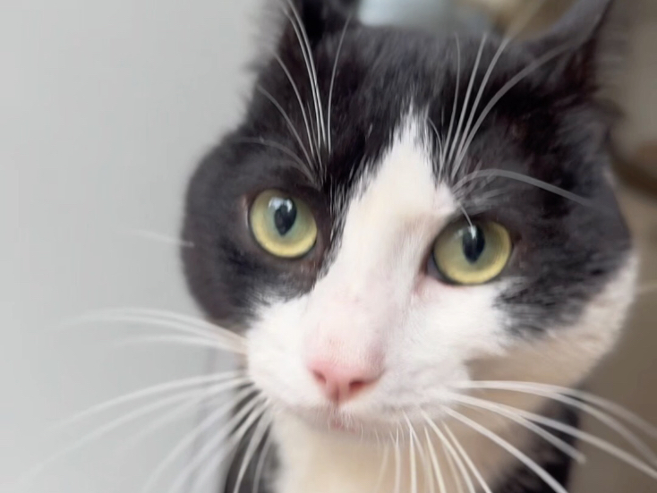 | 3424 | 2026-04-08 |
| [鼠鼠美味循环小曲《哈基米：花田》](https://www.bilibili.com/video/BV15CDeBUEEC) | 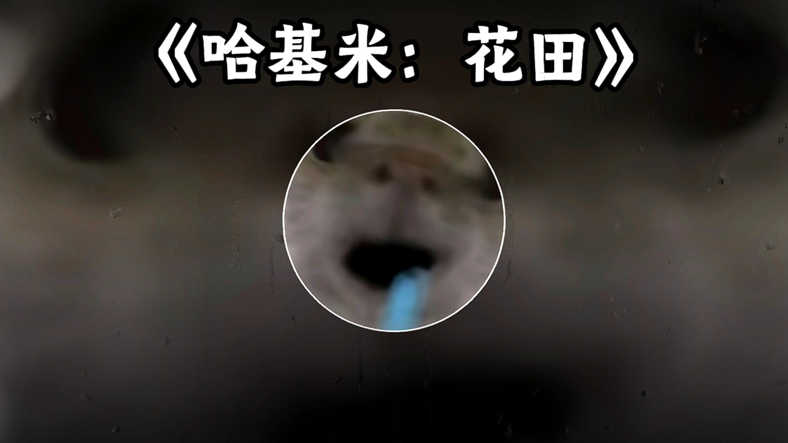 | 723 | 2026-04-07 |
| [非洲最致命的哈基米](https://www.bilibili.com/video/BV183DFBkEzd) |  | 10.4万 | 2026-04-06 |
| [哈基米机械臂](https://www.bilibili.com/video/BV16jyuBBEac) | 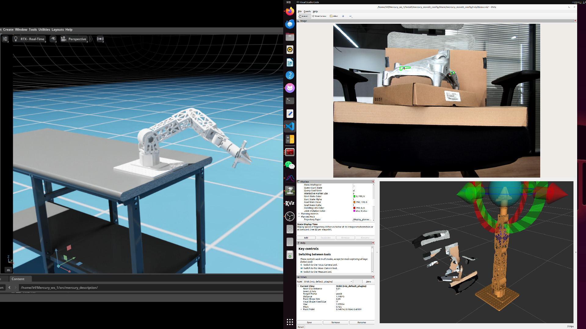 | 304 | 2025-11-21 |
| [【全斗焕の小曲】【光州跑男の小曲】【打成一片の小曲】【无限制格斗の小曲】【重拳の小曲】](https://www.bilibili.com/video/BV1c8pveSEHK) |  | 1310.1万 | 2024-09-09 |

---
*最后更新: 2026-04-12 03:18:49 (自动生成)*
*数据来源: [Bilibili](https://www.bilibili.com)*

## 使用说明

运行以下命令更新视频列表:
```bash
python3 fetch_hajimi_videos.py
```
