# awesome-hajimi
collections of hajimi (哈基米 in Chinese) on the Internet.

## 视频列表 (Video List)

| 视频标题 (Title) | 封面 | 播放量 (Views) | 发布日期 (Date) |
|---|---|---|---|
| [哈基米电椅——水视频](https://www.bilibili.com/video/BV1XoPwzdERx) |  | 24 | 2026-03-03 |
| [哈基米](https://www.bilibili.com/video/BV1crPFzFE4Q) | 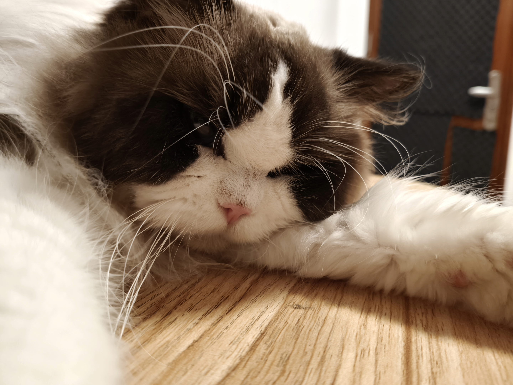 | 5 | 2026-03-03 |
| [哈基米曼波～曼波～](https://www.bilibili.com/video/BV1nPPwzAEyB) |  | 53 | 2026-03-03 |
| [豪饮哈基米](https://www.bilibili.com/video/BV1nwPwzeE8A) | 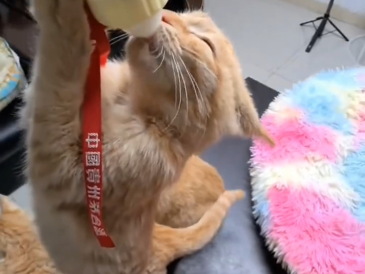 | 152 | 2026-03-03 |
| [哈基米](https://www.bilibili.com/video/BV1zTPwzcE4S) | 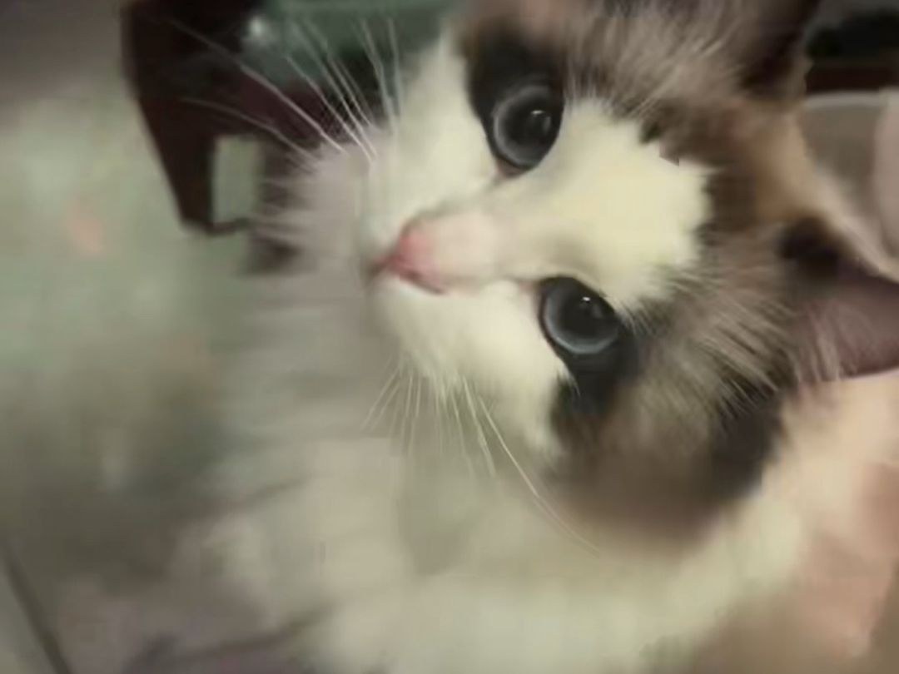 | 19 | 2026-03-03 |
| [哈基米：😺油菜哈😺](https://www.bilibili.com/video/BV1ygAfzhEiL) |  | 292 | 2026-03-03 |
| [哈基米～](https://www.bilibili.com/video/BV1MFAfzuEmP) | 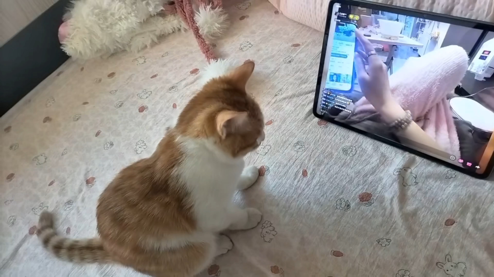 | 19 | 2026-03-03 |
| [神人小游戏，还有哈基米音乐](https://www.bilibili.com/video/BV1bkAfzzEHF) | 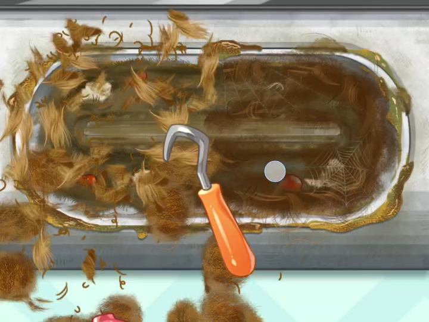 | 102 | 2026-03-03 |
| [哈基米：sweet boy](https://www.bilibili.com/video/BV1vaAfzjEw6) |  | 67 | 2026-03-03 |
| [哈基米怪叫纯享版](https://www.bilibili.com/video/BV1q4AfzSEH1) |  | 51 | 2026-03-03 |
| [哈基米](https://www.bilibili.com/video/BV1jTPFzpEwg) | 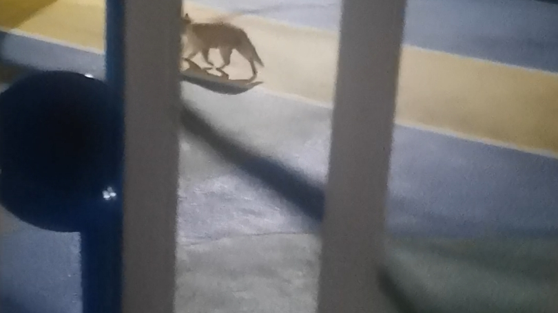 | 12 | 2026-03-03 |
| [护食的小狼白子  ᶘ ᵒᴥᵒᶅ](https://www.bilibili.com/video/BV1pRAfzhEF2) |  | 2397 | 2026-03-03 |
| [哈基米](https://www.bilibili.com/video/BV1W9AfzwEnw) | 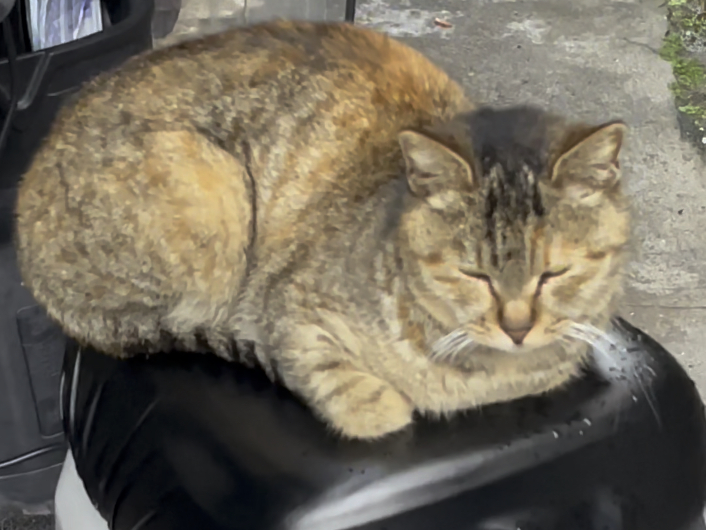 | 15 | 2026-03-03 |
| [哈基米cos路易十六](https://www.bilibili.com/video/BV1RgPFznEck) | 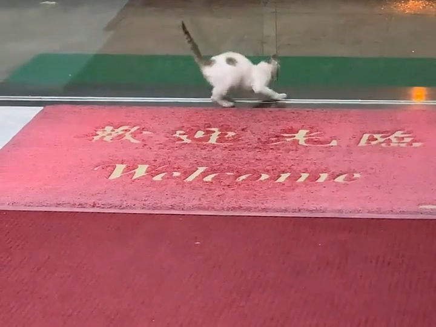 | 821 | 2026-03-03 |
| [半个月不见终于蹲到哈基米，一只耳朵打架受伤了！](https://www.bilibili.com/video/BV19hAozuELn) | 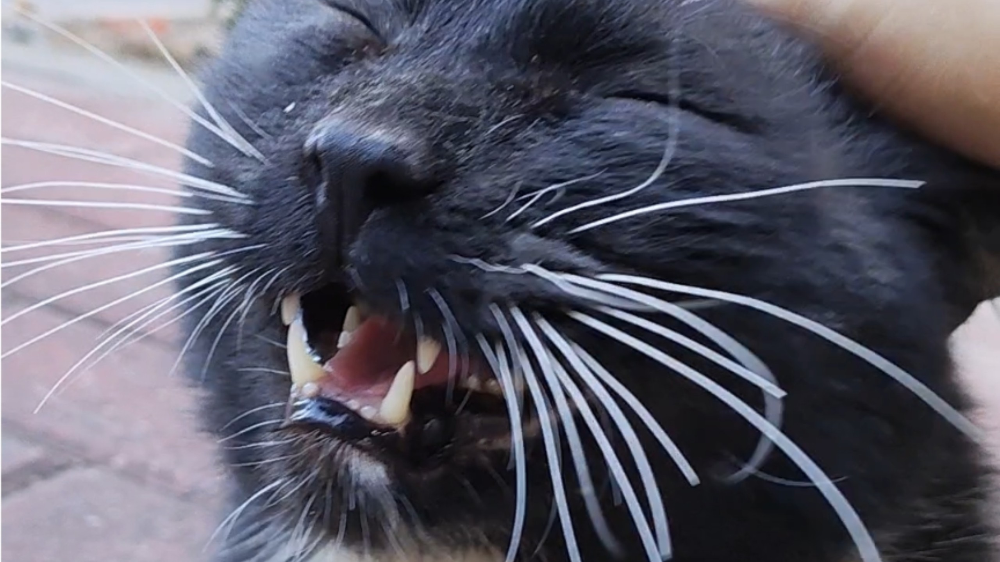 | 949 | 2026-03-03 |
| [美女哈基米](https://www.bilibili.com/video/BV1t6AozAEmK) | 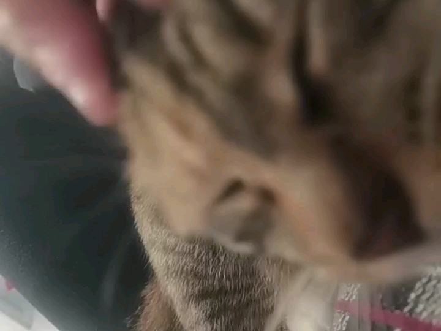 | 136 | 2026-03-03 |
| [点开前没想到这么逆天](https://www.bilibili.com/video/BV1KiAazfEQg) | 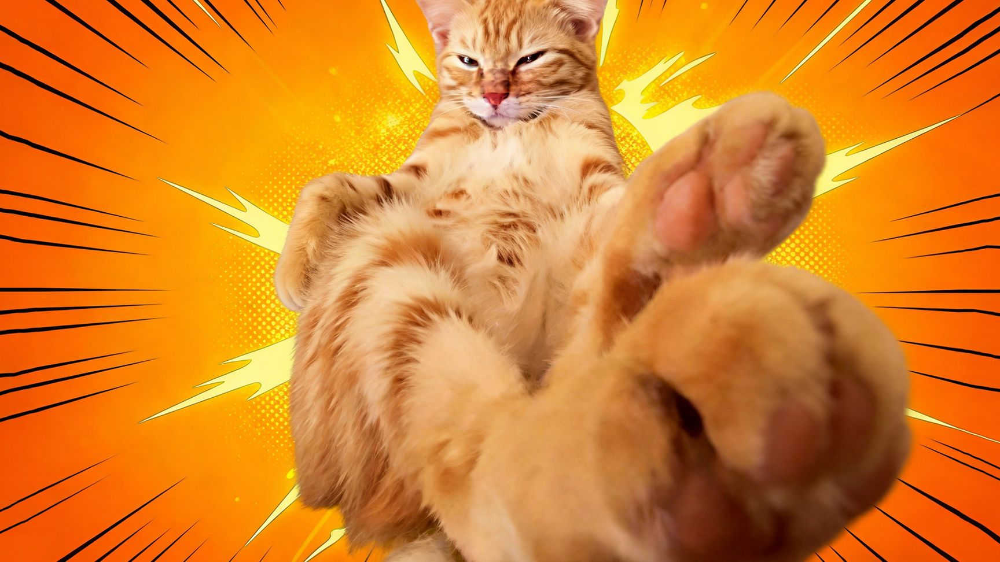 | 6569 | 2026-03-03 |
| [这是我弟弟妹妹 哈基米们](https://www.bilibili.com/video/BV1QMPjzdEWT) |  | 5.7万 | 2026-03-03 |
| [太抽象，于谦居然翻唱“哈基米”，网友：新超度神曲？](https://www.bilibili.com/video/BV12sAZzAEsY) |  | 3751 | 2026-03-03 |
| [马年的元宵节，来个赛马给大家助助兴#元宵节 #谁能拒绝可爱的哈基米 #萌宠来狂欢 #萌宠出道计划](https://www.bilibili.com/video/BV1VGAZz3Eep) |  | 643 | 2026-03-03 |
| [🐱耄耋失败的一生...🐱](https://www.bilibili.com/video/BV1AxAdz9ER9) | 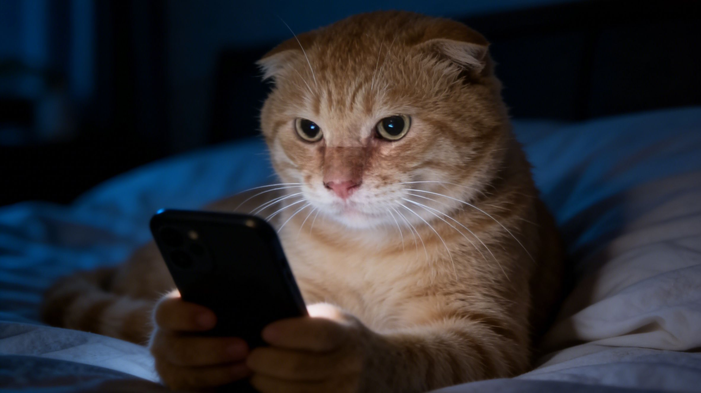 | 4.2万 | 2026-03-03 |
| [基米到](https://www.bilibili.com/video/BV13jAZzBELJ) |  | 12 | 2026-03-03 |
| [哈基米《最后一哈》哈基米南北绿豆](https://www.bilibili.com/video/BV17rAZzHE2Z) | 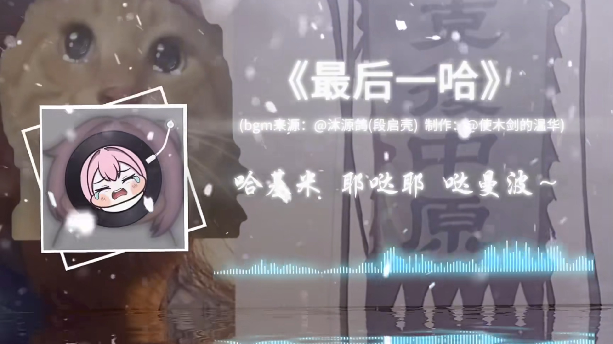 | 948 | 2026-03-03 |
| [哈基米大哥！](https://www.bilibili.com/video/BV1BkAZzDE9H) |  | 144 | 2026-03-03 |
| [哈基米 来电了！](https://www.bilibili.com/video/BV1yrARz9EGf) | 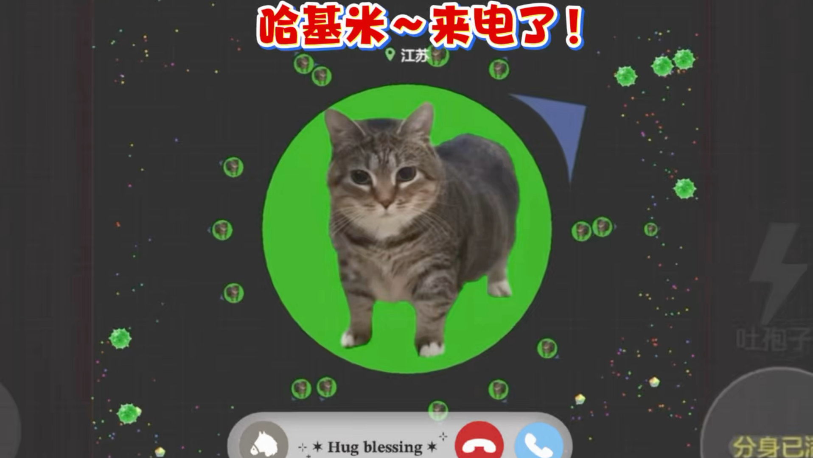 | 247 | 2026-03-03 |
| [哈基米~将将](https://www.bilibili.com/video/BV1g3AdzPErU) | 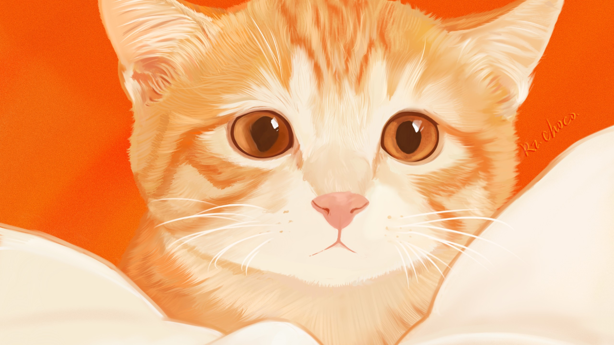 | 261 | 2026-03-03 |
| [【超清黎明杀机】曼巴铁肘不惧未知牢物！](https://www.bilibili.com/video/BV1JaAdzSE6y) |  | 3.8万 | 2026-03-03 |
| [哈基米](https://www.bilibili.com/video/BV1AgAoz9ETH) |  | 5 | 2026-03-03 |
| [哈基米](https://www.bilibili.com/video/BV1VwA9zaE4Q) | 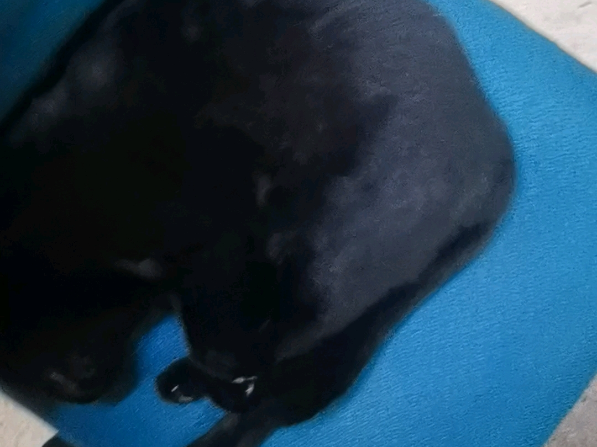 | 22 | 2026-03-03 |
| [每日赞哈基米联名南北绿豆乳面包早餐整箱夹心糕点充饥代餐网红零 哈吉米豆乳餐包（400g/9个）*1箱](https://www.bilibili.com/video/BV1X8PJzMEk8) | 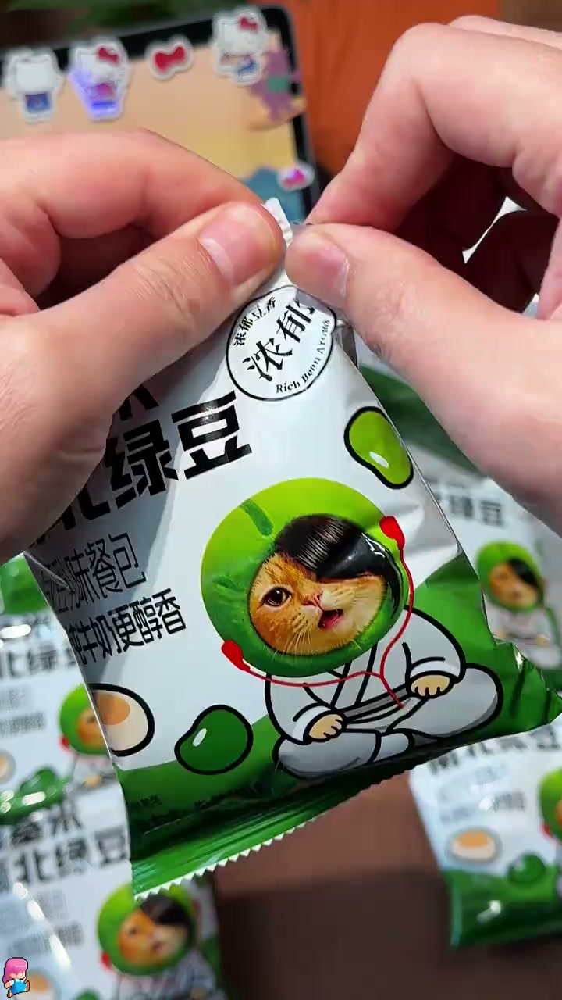 | 0 | 2026-03-02 |
| [🐱](https://www.bilibili.com/video/BV19WP7zeEtc) | 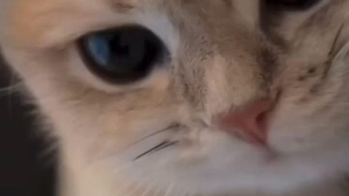 | 1265 | 2026-03-02 |
| [无孩爱猫](https://www.bilibili.com/video/BV1xHPEzREzg) | 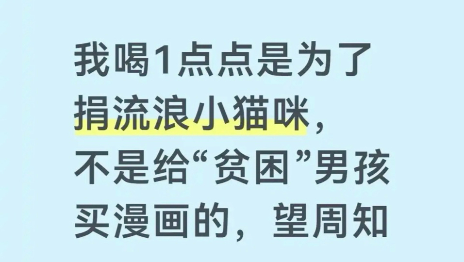 | 10.9万 | 2026-03-02 |
| [哈基米疑似有点太聪明了](https://www.bilibili.com/video/BV11iPLzmEat) | 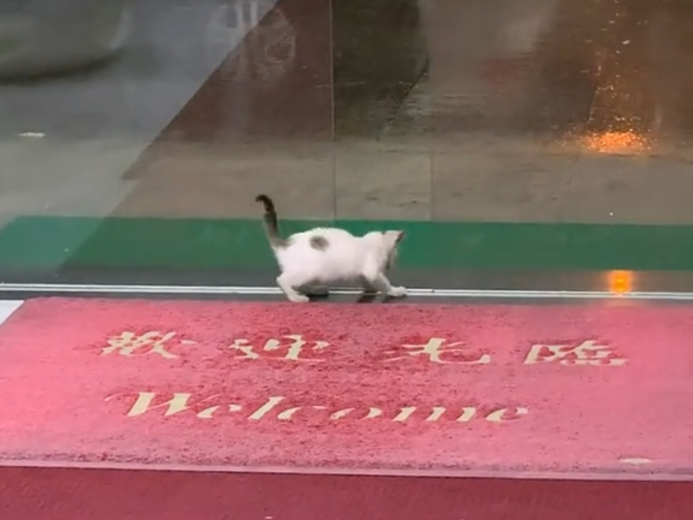 | 3477 | 2026-03-02 |
| [这猫天天龇牙咧嘴的](https://www.bilibili.com/video/BV1nMA8zgEg2) | 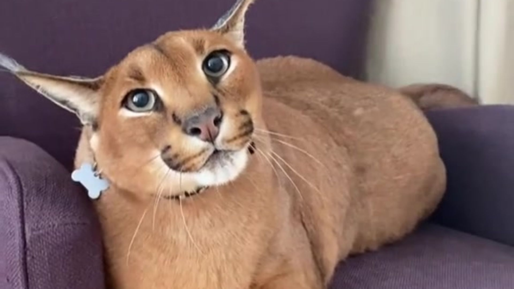 | 2707 | 2026-03-02 |
| [死对头小猫表情包合集](https://www.bilibili.com/video/BV1ecPjzhEGV) | 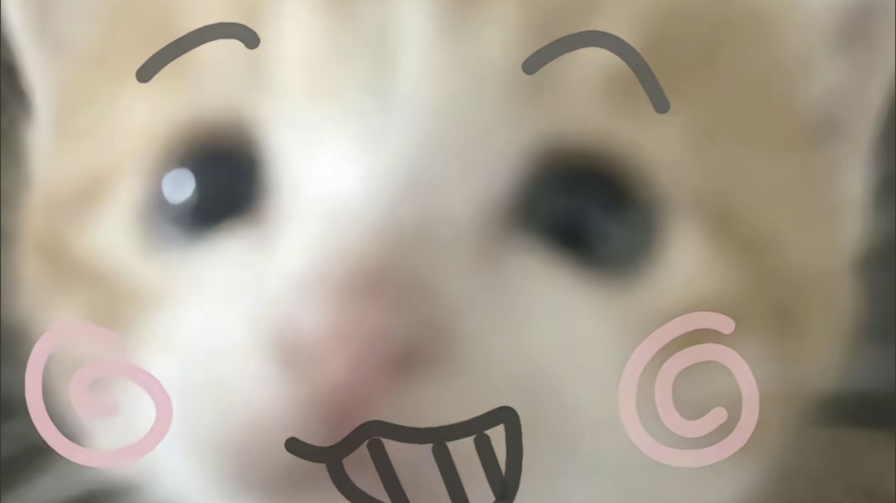 | 2.7万 | 2026-03-02 |
| [哈基米想和汽车人合体了](https://www.bilibili.com/video/BV1PnPjzUEoU) | 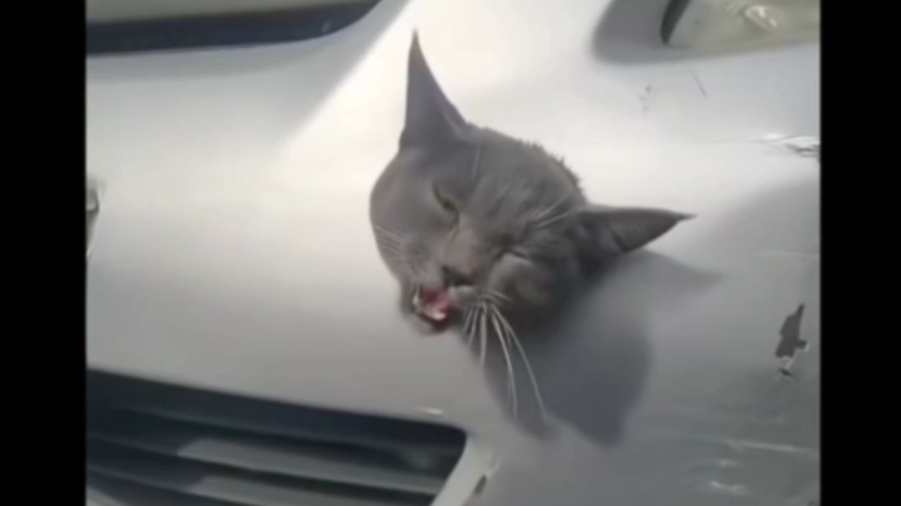 | 4744 | 2026-03-02 |
| [哇～袄～哇～袄～哇～袄～哇～袄～哇～袄～哇～袄～哇～袄～](https://www.bilibili.com/video/BV1tVPjzpE4Y) |  | 9979 | 2026-03-02 |
| [依旧对同伴依依不舍](https://www.bilibili.com/video/BV1UHP3zrEr2) |  | 11.2万 | 2026-03-01 |
| [我以为人气最火的猫](https://www.bilibili.com/video/BV1AXPMz9Ecc) | 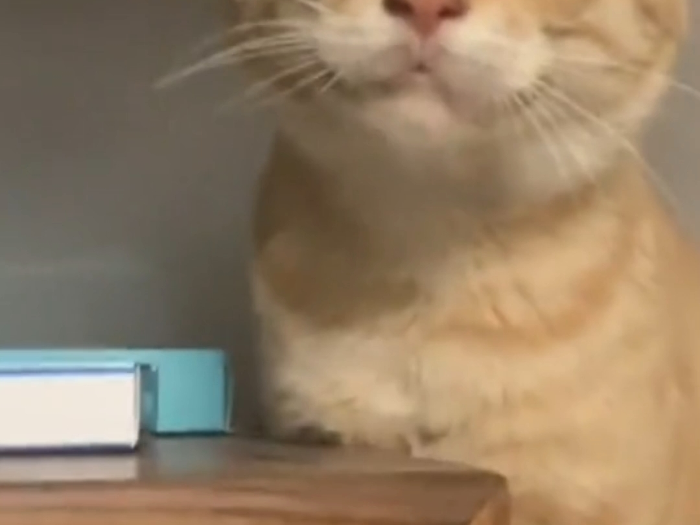 | 416 | 2026-03-01 |
| [哈基米南北绿豆原版](https://www.bilibili.com/video/BV1CGPgzfE2L) |  | 346 | 2026-03-01 |
| [【哈基米】我希望许过的愿望《一路生哈》](https://www.bilibili.com/video/BV19UPTzqEkU) | 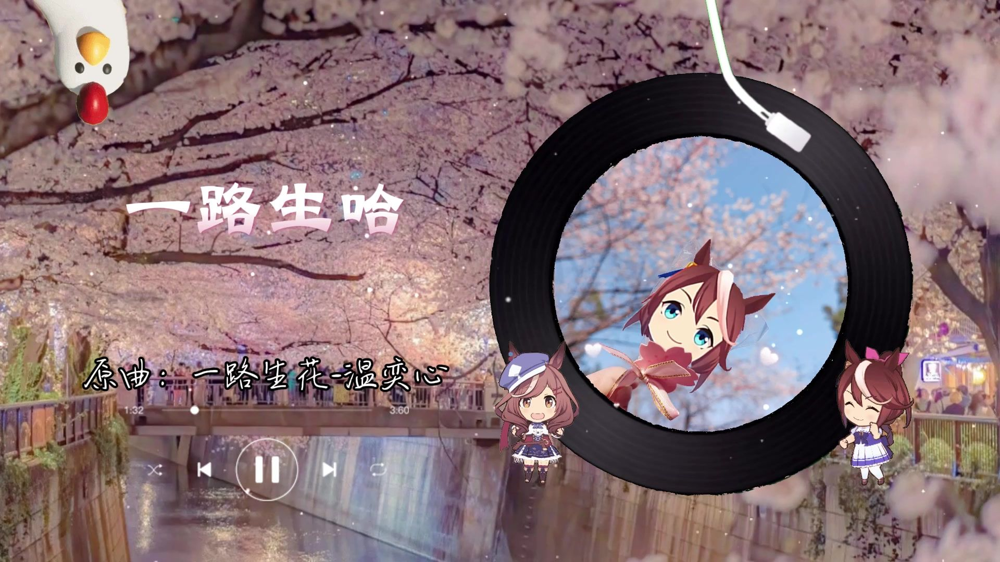 | 557 | 2026-03-01 |
| [bro是不是忘了谁](https://www.bilibili.com/video/BV1UZPTzhEj3) | 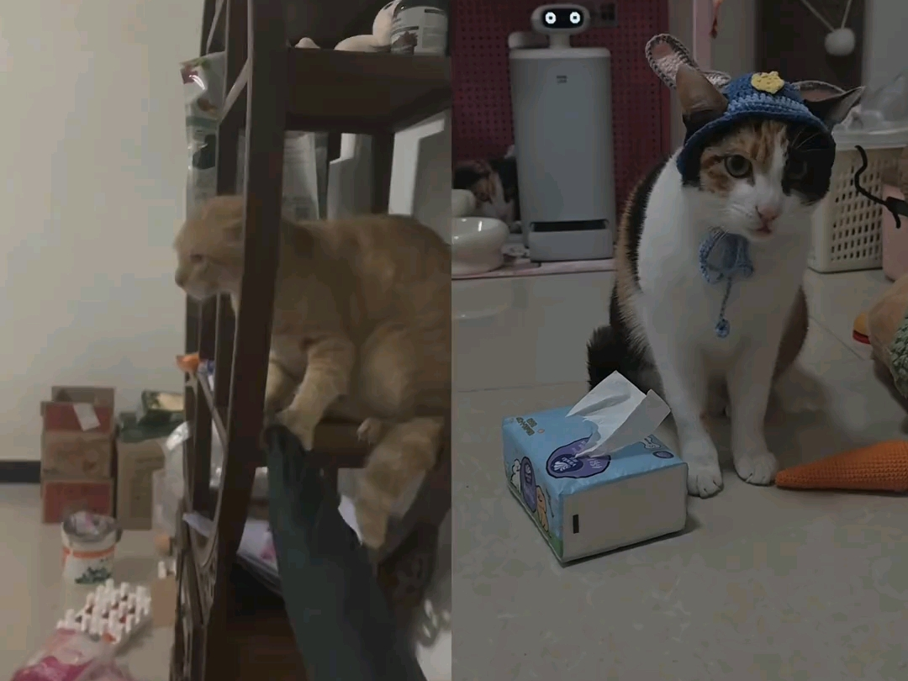 | 11.0万 | 2026-03-01 |
| [哈基米被井盖的卡住了](https://www.bilibili.com/video/BV1C6AzzgEiL) | 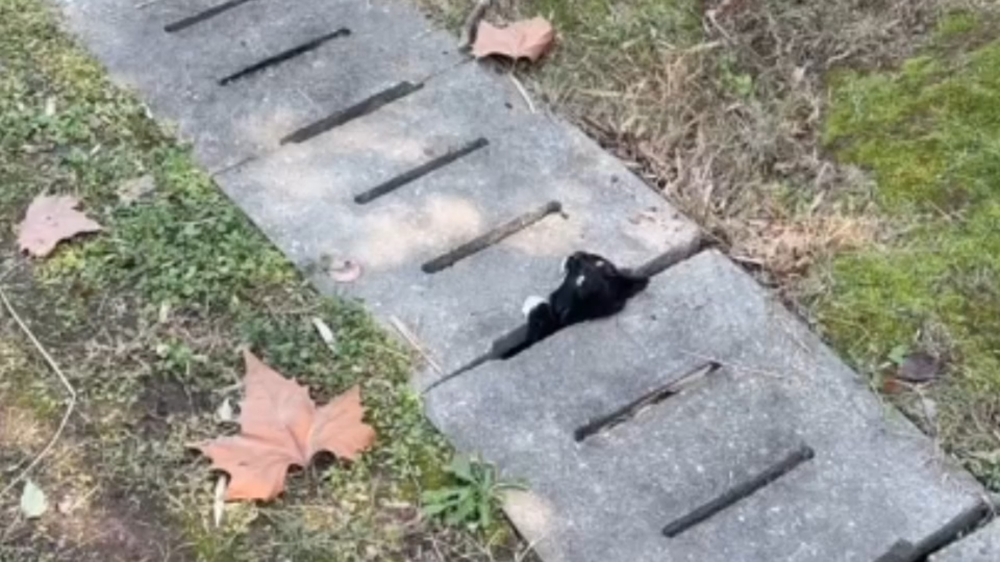 | 4023 | 2026-03-01 |
| [🐱我自陈桥把酒，千秋皆入喉🐱](https://www.bilibili.com/video/BV1asA8zbEqt) |  | 12.1万 | 2026-03-01 |
| [嘬的兴致很高（所以我配了bgm）](https://www.bilibili.com/video/BV1rHAbzrELA) | 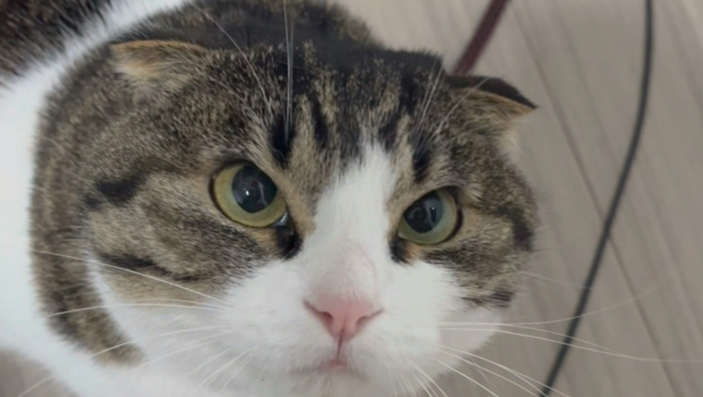 | 5.3万 | 2026-02-28 |
| [妮可少女：技术都是国外的人教我的](https://www.bilibili.com/video/BV1m3AQzmEZ4) | 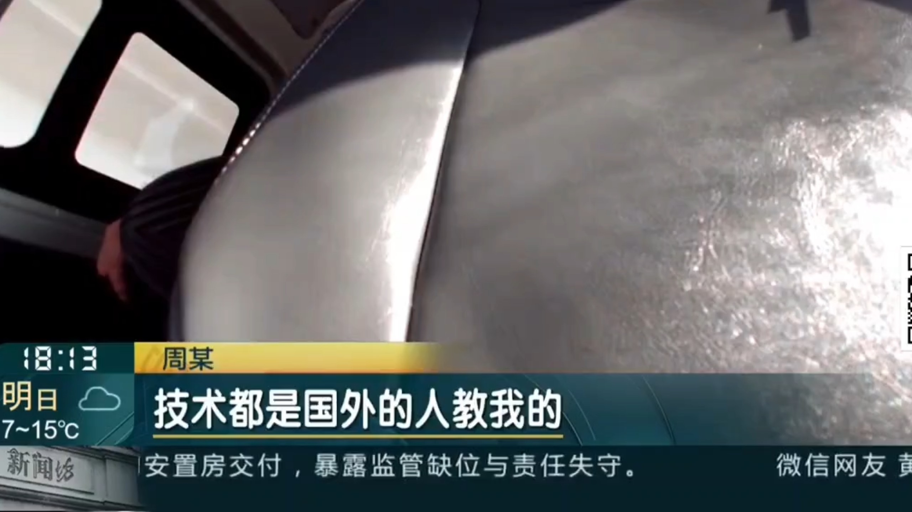 | 20.2万 | 2026-02-27 |
| [阿刃 这下我们扯平了](https://www.bilibili.com/video/BV1shAUzTEXB) |  | 4.3万 | 2026-02-27 |
| [比片难找系列11—啊哈的浏览记录](https://www.bilibili.com/video/BV19QAUzXE2c) |  | 133.1万 | 2026-02-27 |
| [⚡建议禁止Ai⚡](https://www.bilibili.com/video/BV1LDAUzWEPr) |  | 6.8万 | 2026-02-27 |
| [树海看崩铁和堡垒之夜刃和卡芙卡的联动，部分舞蹈展示绷不住了：哈哈哈！这舞蹈好抽象啊！哈哈！](https://www.bilibili.com/video/BV1pLAmzbEWm) |  | 1.5万 | 2026-02-27 |
| [我永远无法原谅星穹铁道](https://www.bilibili.com/video/BV1xxfYBDEoG) |  | 596.9万 | 2026-02-27 |
| [【鬼畜】小姐姐们击败轻敌日寇：“接下来我就不客气了。”有惊喜哦，某著名哈基米也会抗日。｜自制抗日神剧片段](https://www.bilibili.com/video/BV1ZJAmzRER5) |  | 4.0万 | 2026-02-27 |
| [卡芙卡已在堡垒之夜泛滥](https://www.bilibili.com/video/BV1CdAmzcEwH) |  | 62.5万 | 2026-02-27 |
| [全明星抖肩舞](https://www.bilibili.com/video/BV1H8AyzHEzv) |  | 163.6万 | 2026-02-27 |
| [星铁联动堡垒之夜模型公布，回旋镖正中米黑面门](https://www.bilibili.com/video/BV1EbA6ziEhr) |  | 17.6万 | 2026-02-26 |
| [别墅院里的一窝小猫](https://www.bilibili.com/video/BV1ZgArzqEq2) | 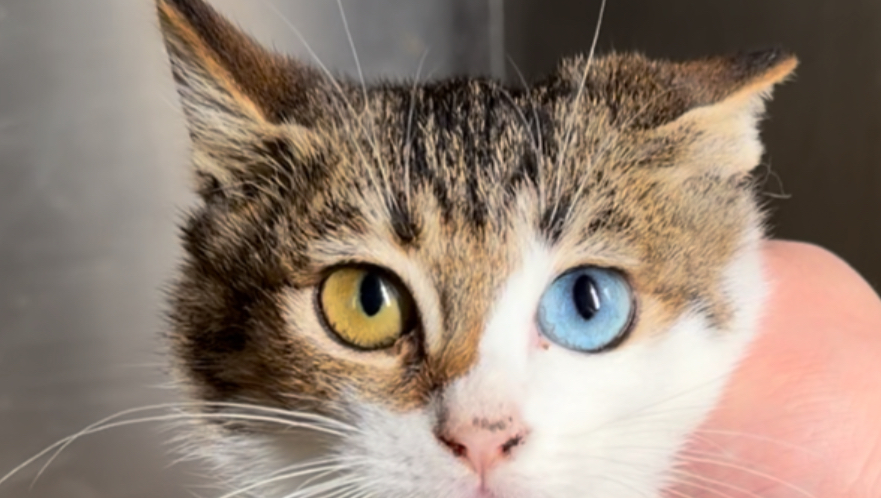 | 25.1万 | 2026-02-26 |
| [【哈基米的结合】喵斯拉的BGM我怎么听一次就会唱了？](https://www.bilibili.com/video/BV1yVfeBmE4K) | 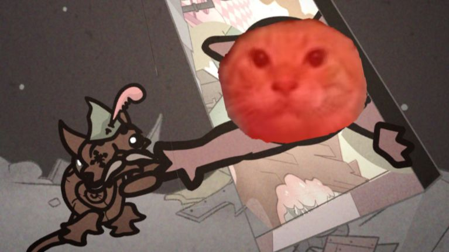 | 1.2万 | 2026-02-26 |
| [【哈基米音乐】【二二六】昭和维新时代青年们爱唱的一首歌，给家里请的高桥听死了](https://www.bilibili.com/video/BV1JYfbB8EkQ) |  | 7501 | 2026-02-25 |
| [这是我弟弟 我的刀盾](https://www.bilibili.com/video/BV1vnftBUErw) |  | 364.3万 | 2026-02-25 |
| [我养了一只我的刀盾](https://www.bilibili.com/video/BV1bTfmBFEs5) |  | 111.9万 | 2026-02-24 |
| [赞美阿哈！姬子重生？最后一课的遗憾将被改写？？【普通星铁考据·4.0主线】](https://www.bilibili.com/video/BV1LYfmBGEKC) |  | 44.4万 | 2026-02-24 |
| [【超清黎明杀机】你可曾听闻，大只肘的故事？](https://www.bilibili.com/video/BV16MfzB4Emo) |  | 20.8万 | 2026-02-24 |
| [火花，但是云璃](https://www.bilibili.com/video/BV11bfyB7E2y) |  | 24.3万 | 2026-02-24 |
| [“2026年寒假全网爆火的歌曲”](https://www.bilibili.com/video/BV1v7fqBkEU9) |  | 44.8万 | 2026-02-23 |
| [停云：新号别搞！](https://www.bilibili.com/video/BV1xMf3BXEXu) |  | 10.8万 | 2026-02-20 |
| [《 寂巴岭 》](https://www.bilibili.com/video/BV1hffgBfEGv) |  | 11.7万 | 2026-02-20 |
| [报复性叫叫叫](https://www.bilibili.com/video/BV1LsfuBPE8x) | 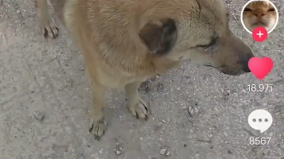 | 42.4万 | 2026-02-20 |
| [一口气听完18首近期热门小曲！](https://www.bilibili.com/video/BV1i1fgBBExc) |  | 36.4万 | 2026-02-20 |
| [星：“爻老板你都算略有姿色了呀”！？？](https://www.bilibili.com/video/BV1gvZvBbEdm) |  | 44.3万 | 2026-02-20 |
| [《雪地传来了唐笑声》](https://www.bilibili.com/video/BV1CmZYBkE7s) |  | 42.0万 | 2026-02-19 |
| [这天还是黑了吗？](https://www.bilibili.com/video/BV1A2ZYBVE76) |  | 16.5万 | 2026-02-19 |
| [【星穹铁道乐子大会】奇幻菌子梦游夜](https://www.bilibili.com/video/BV1GicvzzEfK) |  | 290.1万 | 2026-02-18 |
| [【星穹铁道乐子大会】哈哈哈哈哈](https://www.bilibili.com/video/BV18ccvzYEWM) |  | 55.1万 | 2026-02-18 |
| [【星穹铁道乐子大会】哈哈哈哈哈SP——就要笑挑战](https://www.bilibili.com/video/BV1mmc5z6EUu) |  | 58.3万 | 2026-02-18 |
| [【星穹铁道乐子大会】太欢愉了！爻光大战火花！](https://www.bilibili.com/video/BV1pcc7zzEpV) |  | 214.3万 | 2026-02-18 |
| [【星穹铁道乐子大会】星神一分钟](https://www.bilibili.com/video/BV1qPcizJEbT) | 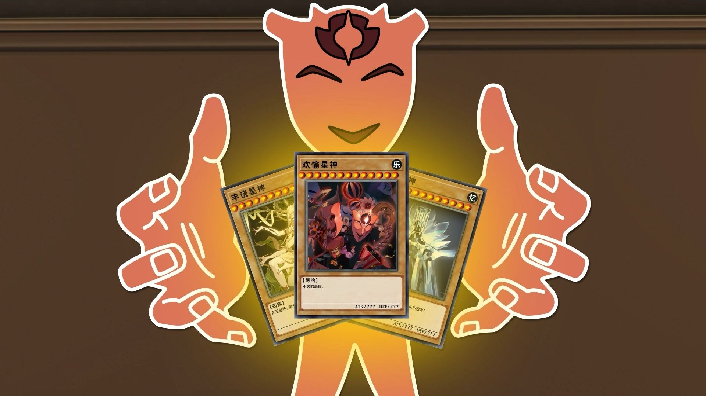 | 115.9万 | 2026-02-18 |
| [【星穹铁道乐子大会】斯科特同人单曲《孤狼》](https://www.bilibili.com/video/BV1ZLchziEDB) |  | 240.2万 | 2026-02-18 |
| [循环歌单｜【MALVADO DE VAPO】｜“【白菜对我笑の小曲】”](https://www.bilibili.com/video/BV1CCZkBKEYK) |  | 220.4万 | 2026-02-18 |
| [【星穹铁道】阿哈也能看懂的星铁4.0剧情解析！二相乐园有正反两个世界？](https://www.bilibili.com/video/BV18yZTBUEgE) |  | 12.6万 | 2026-02-16 |
| [《崩坏：星穹铁道》阿哈爱看 ｜ 好运来 × 爻光共启新春！](https://www.bilibili.com/video/BV1SPcjzmEPr) |  | 202.2万 | 2026-02-15 |
| [《说谎的辛巴巴》（完整版）](https://www.bilibili.com/video/BV1b3cEzQEHb) |  | 99.5万 | 2026-02-13 |
| [《崩坏：星穹铁道》爻光角色PV——「万事如意」](https://www.bilibili.com/video/BV1mKcxzMERi) |  | 557.8万 | 2026-02-12 |
| [循环歌单｜《大只般若の小曲》《大只切の小曲》我本将心向明月DJ](https://www.bilibili.com/video/BV1iAcazeE5u) |  | 122.1万 | 2026-02-12 |
| [【原神】Seedance 2.0芙宁娜跳火花舞，竟然毫无违和感，还有大师级运镜？](https://www.bilibili.com/video/BV1x2FSzNEdd) |  | 105.4万 | 2026-02-10 |
| [《崩坏：星穹铁道》走近星穹——「爻光：爻老板发大财呢~」](https://www.bilibili.com/video/BV1LqcTzNEvN) |  | 162.8万 | 2026-02-10 |
| [就冲爻光这腿，咱这崩铁就先暂时不退了哈！](https://www.bilibili.com/video/BV1fccwzWEDf) |  | 10.2万 | 2026-02-08 |
| [MiSide和平模式已更新内容](https://www.bilibili.com/video/BV1ircFzEEdy) |  | 18.0万 | 2026-02-08 |
| [这段我反复看了十遍，好大的雷](https://www.bilibili.com/video/BV1EAFEzPEMN) |  | 46.7万 | 2026-02-06 |
| [对不起以骸骸，我真的不是故意的](https://www.bilibili.com/video/BV1F1FCzrEDZ) |  | 239.8万 | 2026-02-06 |
| [在古代，穷人会跳法尔孔战舞到底有多爽](https://www.bilibili.com/video/BV1TVffBREFD) | 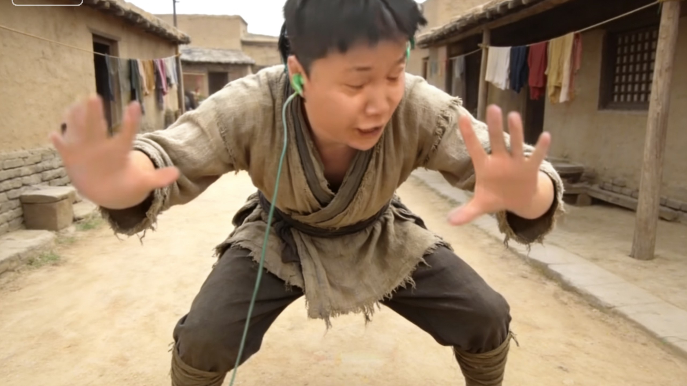 | 132.0万 | 2026-02-04 |
| [《崩坏：星穹铁道》阿哈爱看 ｜ 幻月游戏赢家集锦](https://www.bilibili.com/video/BV1amF5z2EYg) |  | 152.7万 | 2026-02-04 |
| [催粮天花板！](https://www.bilibili.com/video/BV14fFGzhEDV) |  | 59.5万 | 2026-02-03 |
| [孩儿们 我升天了](https://www.bilibili.com/video/BV1GsibBxEEk) |  | 36.1万 | 2026-01-05 |
| [【溜鬼の小曲】【壮志凌云の小曲】【王从天降の小曲】【音乐可视化】The Hills (Amice Remix)(1.1x)](https://www.bilibili.com/video/BV1wp1gB7Ez5) |  | 36.4万 | 2025-10-31 |
| [《火红的哈基米》](https://www.bilibili.com/video/BV1SExozoEcf) | 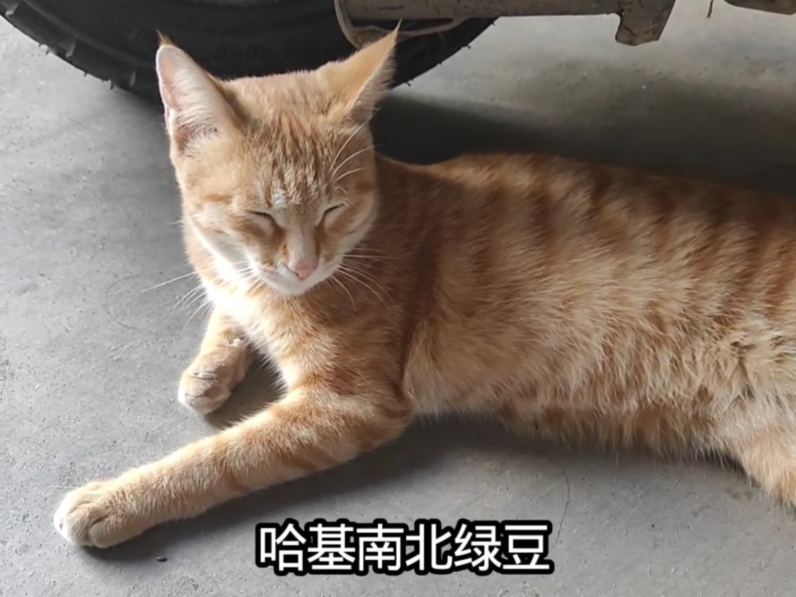 | 505 | 2025-10-08 |
| [DJ哈基米🐱：菌生蟹（1NF3S+@+!0N）](https://www.bilibili.com/video/BV1HDpyziESp) |  | 15.5万 | 2025-09-16 |
| [电工哈基米](https://www.bilibili.com/video/BV1GZ8Qz8ESz) | 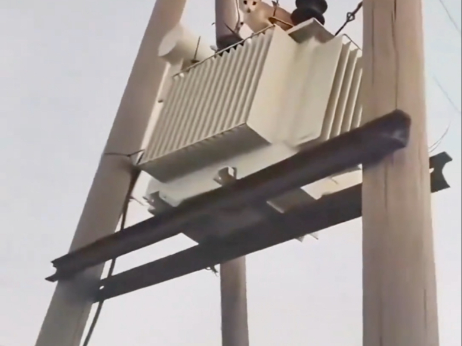 | 8.9万 | 2025-07-29 |
| [循环歌单｜【The Hills】｜“王从天降，愤怒狰狞”](https://www.bilibili.com/video/BV1TR3tzzEm9) |  | 149.2万 | 2025-07-02 |
| [各大主播米塔跳脸反应](https://www.bilibili.com/video/BV1kAwVeKEaP) | 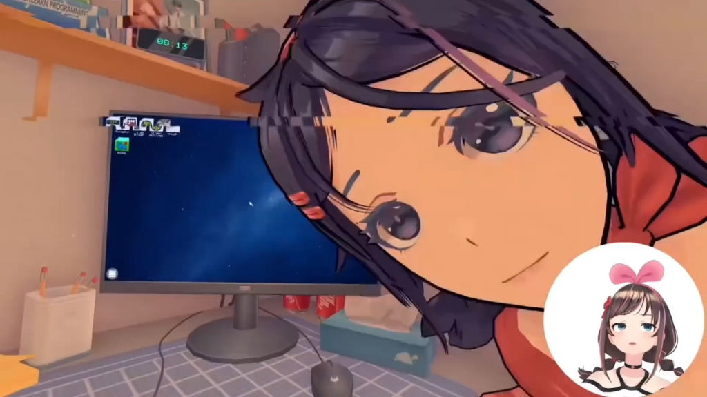 | 34.3万 | 2025-01-16 |
| [救世主哈基米vs体育生明](https://www.bilibili.com/video/BV1PdpJe2ERG) |  | 2524 | 2024-09-09 |

---
*最后更新: 2026-03-04 03:07:29 (自动生成)*
*数据来源: [Bilibili](https://www.bilibili.com)*

## 使用说明

运行以下命令更新视频列表:
```bash
python3 fetch_hajimi_videos.py
```
