# awesome-hajimi
collections of hajimi (哈基米 in Chinese) on the Internet.

## 视频列表 (Video List)

| 视频标题 (Title) | 封面 | 播放量 (Views) | 发布日期 (Date) |
|---|---|---|---|
| [【神崎宁宁ASMR】赛马娘·东海帝皇cos 💕 哈基米 我要变成像皇帝小姐一样又强又帅气的赛马娘](https://www.bilibili.com/video/BV1ucTS63E8Z) |  | 1202 | 2026-07-06 |
| [【500小时纯享版】欸？大狗!（无原声）](https://www.bilibili.com/video/BV1orTx6RERx) |  | 3074 | 2026-07-06 |
| [《植物大战奶僵》](https://www.bilibili.com/video/BV128TD6gEnc) |  | 2.1万 | 2026-07-06 |
| [屠夫如酒，越老越有味道](https://www.bilibili.com/video/BV1mzTm6iEY1) |  | 4.8万 | 2026-07-06 |
| [散落大街的哈基米](https://www.bilibili.com/video/BV1kQTm6tELc) | 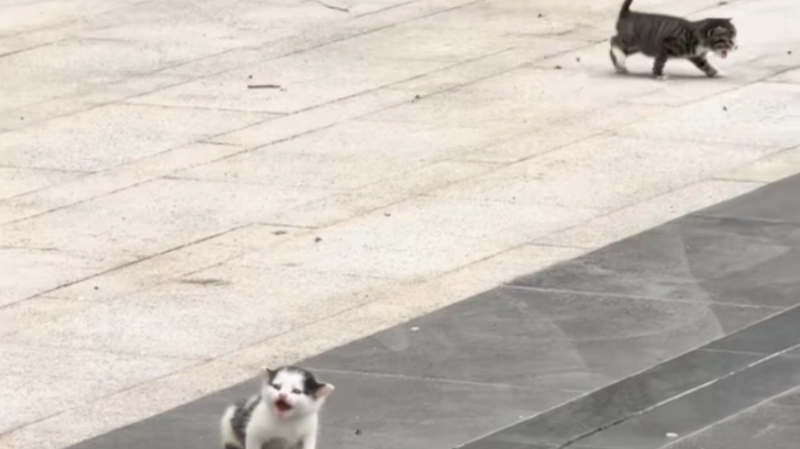 | 419 | 2026-07-06 |
| [救了一只非常好的哈基米](https://www.bilibili.com/video/BV1qwTU6DExK) |  | 1452 | 2026-07-06 |
| [哈基米跑刀](https://www.bilibili.com/video/BV139T26MEae) | 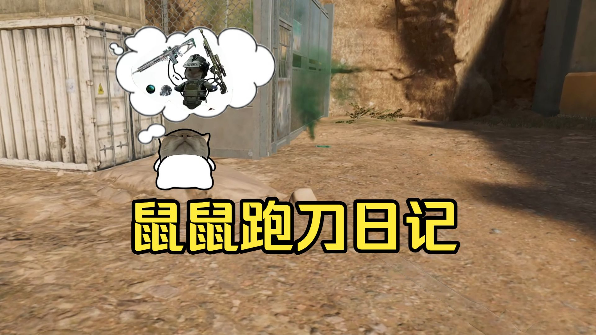 | 649 | 2026-07-05 |
| [【大鸣王潮1566】该回今州看看了](https://www.bilibili.com/video/BV1qBTy66EkA) |  | 37.7万 | 2026-07-05 |
| [超级暴雨来了：台风美莎克降下近1000毫米暴雨，广西及南北方多省仍需高度警惕](https://www.bilibili.com/video/BV1FVT162EGH) |  | 34.5万 | 2026-07-05 |
| [燕双鹰速通沙⚡漠⚡灰⚡](https://www.bilibili.com/video/BV11rT164EhA) |  | 27.5万 | 2026-07-05 |
| [擦烈士碑第三十七天记录（擦的晚，天比较黑）](https://www.bilibili.com/video/BV1pTT16DEZ9) |  | 2202 | 2026-07-05 |
| [【TES越战单曲】《千年陀螺》⚡旋转千年的陀螺 ~⚡G2越南打不过~⚡](https://www.bilibili.com/video/BV12zT16ZEVc) |  | 68.5万 | 2026-07-05 |
| [满足了朋友奇怪的喜好...](https://www.bilibili.com/video/BV1VtT16TERq) |  | 4.9万 | 2026-07-05 |
| [小妖怪买瓜](https://www.bilibili.com/video/BV1DhT16PEGs) |  | 3.4万 | 2026-07-05 |
| [🐱《哈浅》听完不哭的心比钢筋还硬🐱](https://www.bilibili.com/video/BV1FRT16UECi) |  | 1131 | 2026-07-05 |
| [🐧凑鹅企教你正宗哈基米口音，立马洋腔洋调了~](https://www.bilibili.com/video/BV1oLTC6iEWJ) |  | 5240 | 2026-07-05 |
| [【原神幼儿园】游园会   【AI全民制作人】](https://www.bilibili.com/video/BV1NfTk6EEpB) |  | 10.0万 | 2026-07-05 |
| [🐱Ha Goes On🐱](https://www.bilibili.com/video/BV1wNTC65EdF) |  | 3.8万 | 2026-07-05 |
| [随机动漫集数，用前三个出现的忍者上段！#16](https://www.bilibili.com/video/BV1SQMT6FEdq) |  | 20.6万 | 2026-07-05 |
| [全网爆火的风干芝士大油边，好吃吗？牛屎酒有屎？黄皮西瓜很甜吗？](https://www.bilibili.com/video/BV1z9TC66Ejh) | 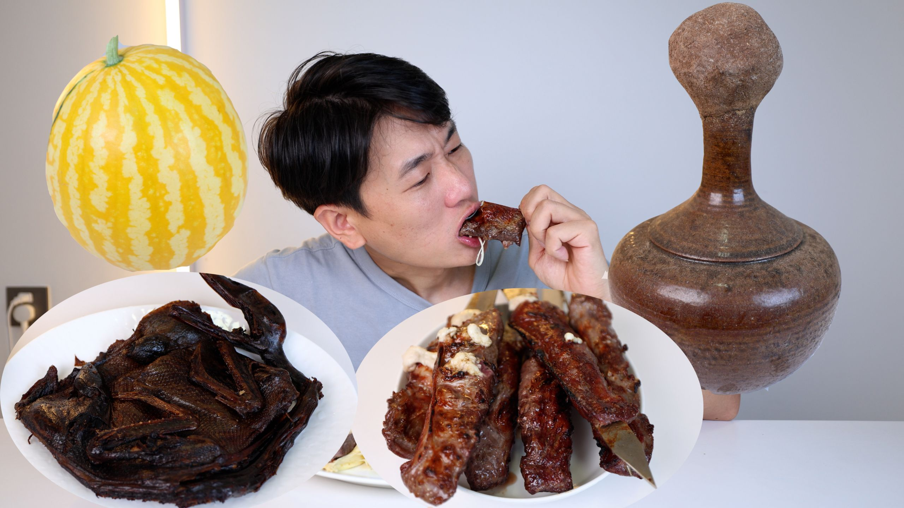 | 4.8万 | 2026-07-05 |
| [我体验了一下最近很火的拼豆…](https://www.bilibili.com/video/BV1ppTy6DEzy) |  | 39.8万 | 2026-07-05 |
| [莫迪老仙：早苗，你是我最美的小妹妹](https://www.bilibili.com/video/BV1StTC6tEev) |  | 48.5万 | 2026-07-05 |
| [【基米】世界上最幽默代码–基米](https://www.bilibili.com/video/BV19wTy6NEaW) | 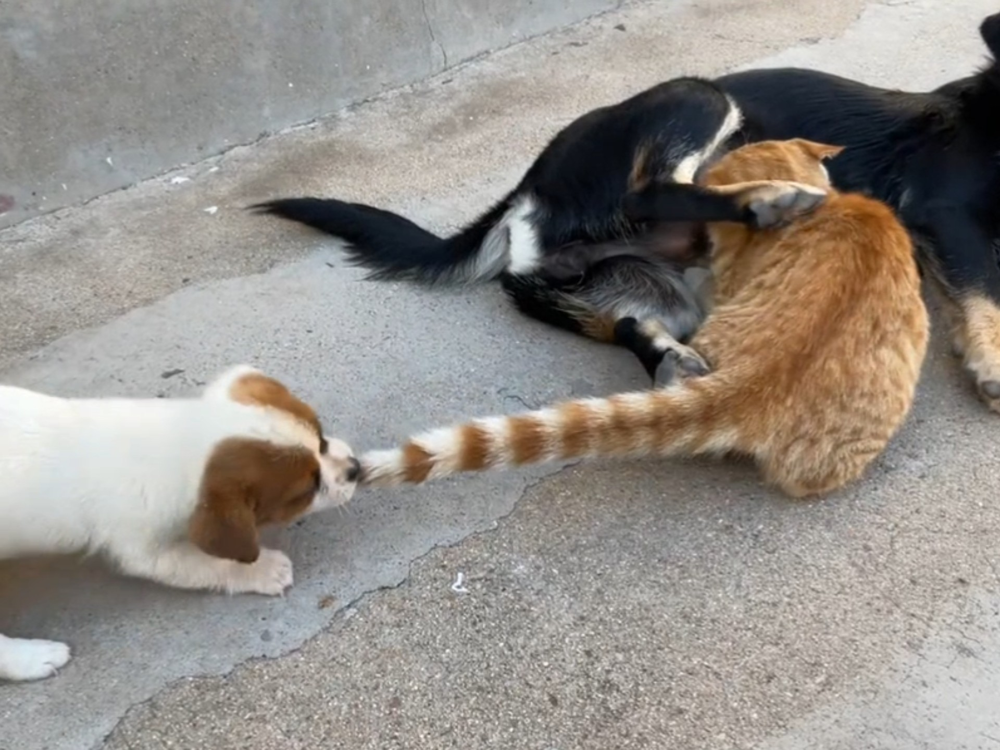 | 2.4万 | 2026-07-05 |
| [当你发现《弥渡山歌》和大狗叫的适配度是100%](https://www.bilibili.com/video/BV1aMTy6cEhB) |  | 25.0万 | 2026-07-05 |
| [【哈基米】双枪会给出答案！](https://www.bilibili.com/video/BV1khMu6HE2g) |  | 77.1万 | 2026-07-05 |
| [【一只喜欢哈气的哈基米】Up主探索中，欢迎收看求三连！](https://www.bilibili.com/video/BV1UVTy6oEEH) | 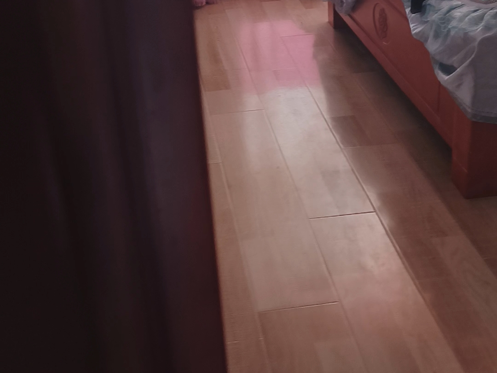 | 121 | 2026-07-05 |
| [哈基米！](https://www.bilibili.com/video/BV138MM6PEm7) |  | 986 | 2026-07-05 |
| [【GenkaiMacaron】哈基米基米基](https://www.bilibili.com/video/BV1MiMM6FE9P) |  | 1256 | 2026-07-05 |
| [【BlackSouls2 动画大电影】为这疯狂的舞台，呼唤爱的谢幕](https://www.bilibili.com/video/BV1QuMu6iEaN) |  | 16.7万 | 2026-07-05 |
| [别 去 天 津 后 室](https://www.bilibili.com/video/BV1foMM61EGD) |  | 44.4万 | 2026-07-05 |
| [🐱🐱【古典哈基米】耄扎特第41交响曲: 猪鼻特 (完整版) 🎵🎵](https://www.bilibili.com/video/BV181MA6mEJj) |  | 1048 | 2026-07-05 |
| [🐱🐱【古典哈基米】耄扎特第41交响曲: 猪鼻特, 第四章 (原曲不使用) 🎵🎵](https://www.bilibili.com/video/BV1WcMP6qEP6) |  | 779 | 2026-07-05 |
| [足球僵尸来了！](https://www.bilibili.com/video/BV1CjMA6qEg4) |  | 13.9万 | 2026-07-05 |
| [红警队友心态崩了直接逃跑！剩下我一人默默抗下所有！](https://www.bilibili.com/video/BV1v2Mu63EdH) |  | 17.1万 | 2026-07-05 |
| [不愧是美军，航母上也不忘了搞土特产](https://www.bilibili.com/video/BV1vtTf6CEPJ) |  | 14.0万 | 2026-07-05 |
| [【三角洲乐队】翻唱《基米说》哈基咪南北绿豆](https://www.bilibili.com/video/BV134MK6tETy) |  | 1.8万 | 2026-07-05 |
| [莫迪认高市早苗当妹妹啦！访问印度，日本想干嘛？](https://www.bilibili.com/video/BV1FmMP6KEee) |  | 38.6万 | 2026-07-05 |
| [阿什拉夫・哈基米：身价八千万名下无资产，他的孝心改写离婚结局！](https://www.bilibili.com/video/BV1m7MT6pEAB) |  | 4.1万 | 2026-07-05 |
| [五年没回娘家！今天圆大媳妇梦，第一次回娘家双眼泪目，受到了最热烈欢迎](https://www.bilibili.com/video/BV14RMN6JEhB) |  | 11.3万 | 2026-07-05 |
| [史蒂夫视察后室](https://www.bilibili.com/video/BV1rMMK66ENS) |  | 5.6万 | 2026-07-04 |
| [当人类骨折受伤后，猫真的会盯梢守护，寸步不离！](https://www.bilibili.com/video/BV19ZMP6tESm) |  | 33.3万 | 2026-07-04 |
| [小满不是区！小孩市区！](https://www.bilibili.com/video/BV15oMP6FEhR) |  | 83.3万 | 2026-07-04 |
| [✨我当狱长那些年：全员皆是哈基米✨双F级弃女接手零号监狱，用灵泉饭菜收服六大凶兽，战神元帅秒变争宠毛茸茸。](https://www.bilibili.com/video/BV15GMw6HEqH) |  | 3997 | 2026-07-04 |
| [哦哦哦！是大伯的来信！](https://www.bilibili.com/video/BV1qgMw6XEA9) | 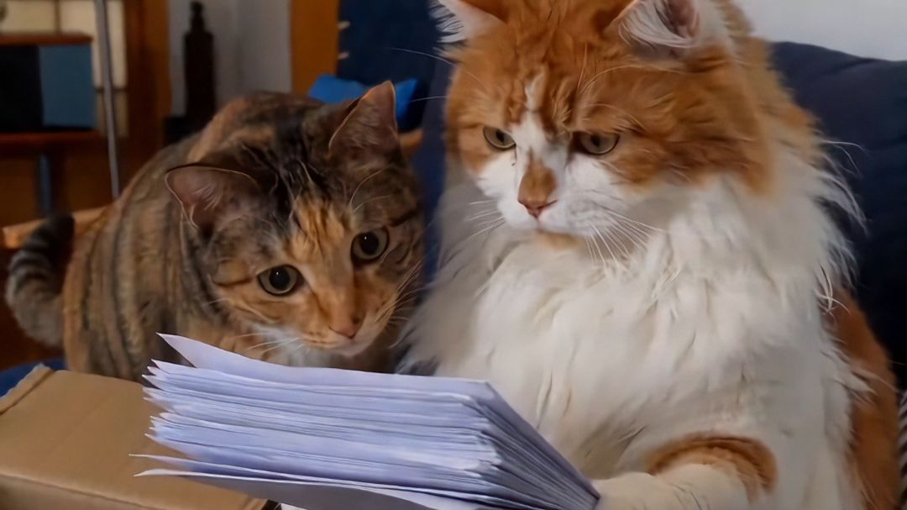 | 25.0万 | 2026-07-04 |
| [诺姆：还有高人？！](https://www.bilibili.com/video/BV1wBMw6eEnj) |  | 27.2万 | 2026-07-04 |
| [国外趣味视频集锦＆动物迷惑行为大赏#289](https://www.bilibili.com/video/BV13pMw61EMe) |  | 9.6万 | 2026-07-04 |
| [我将把天赋带到核电站](https://www.bilibili.com/video/BV1BDMw6xEPw) |  | 287.4万 | 2026-07-04 |
| [【假装讲电影】印度最敢拍的黑暗神片！司法烂透！地狱判官下凡整顿法院！](https://www.bilibili.com/video/BV1o8MA6ZEF4) |  | 23.2万 | 2026-07-04 |
| [哈基米～南北绿豆～～选出你心中的哈基米](https://www.bilibili.com/video/BV1dQMw69EEh) | 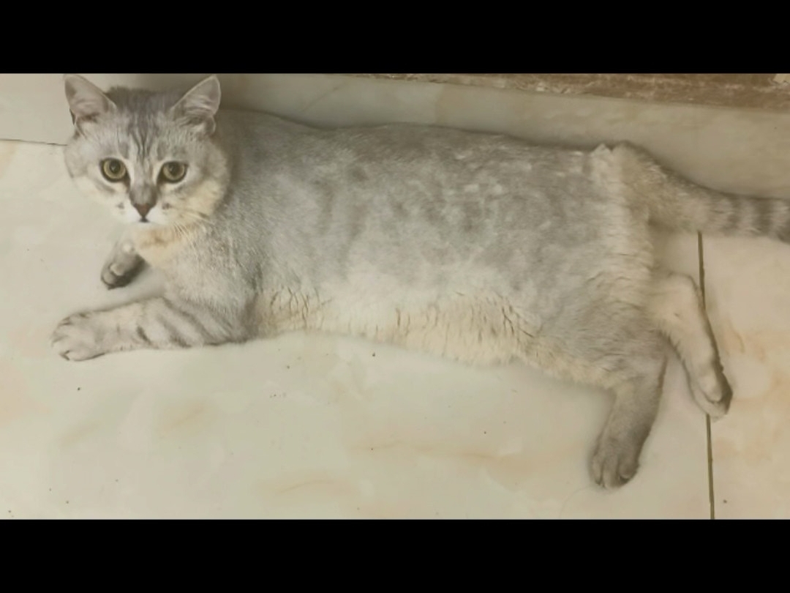 | 160 | 2026-07-04 |
| [不得不爱 哈基米版——不得不哈](https://www.bilibili.com/video/BV1NtMF6YEF7) |  | 169 | 2026-07-04 |
| [【原创首发】《哈基米》MV](https://www.bilibili.com/video/BV113Mc6AEmL) | 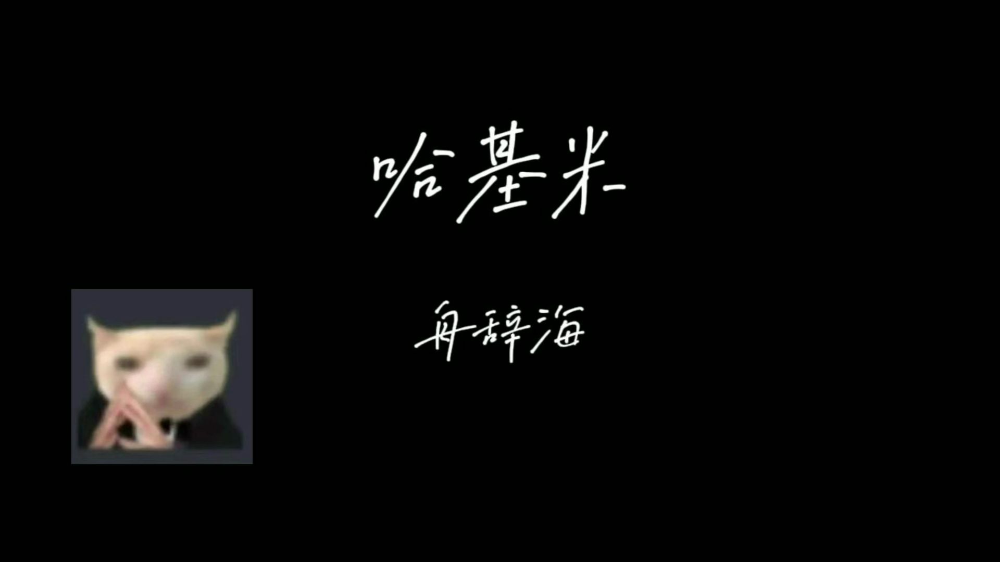 | 5733 | 2026-07-04 |
| [哈哈哈哈哈水弹挑战](https://www.bilibili.com/video/BV1pdMc6AEA9) | 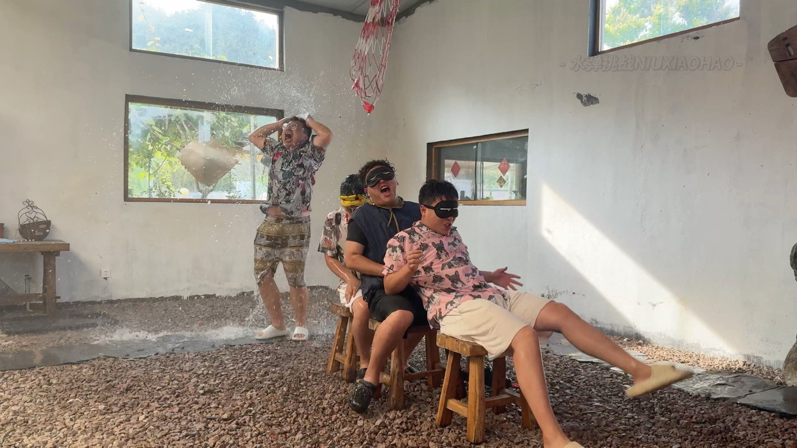 | 392.6万 | 2026-07-04 |
| [潜默化](https://www.bilibili.com/video/BV1FiTx6FEUo) | 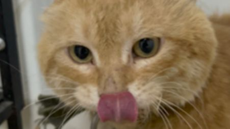 | 7879 | 2026-07-04 |
| [诶？！云朵☁️！！！](https://www.bilibili.com/video/BV1bJTZ6cEx7) |  | 113.1万 | 2026-07-04 |
| [超市后门抽卡歪了的二人](https://www.bilibili.com/video/BV1MsTt6LEiT) |  | 322.3万 | 2026-07-04 |
| [我钓到了……什么东西……？？](https://www.bilibili.com/video/BV1bmTb6EEs8) |  | 179.8万 | 2026-07-04 |
| [燃至尽头，傲骨屹立！！热血陀螺大赛【26赛季03】](https://www.bilibili.com/video/BV1PaTt66ENW) | 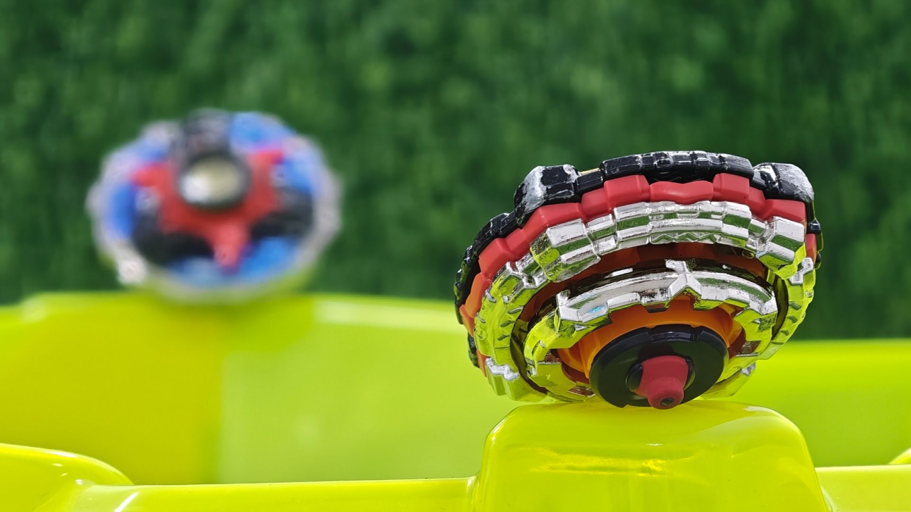 | 63.1万 | 2026-07-04 |
| [一家三口，整整齐齐](https://www.bilibili.com/video/BV15wTW6yEHy) |  | 33.1万 | 2026-07-04 |
| [大狗叫の人鱼湾](https://www.bilibili.com/video/BV1ssTZ6oEQe) |  | 1.5万 | 2026-07-03 |
| [【明日堇sumire】看龟龟《三只哈基米》发出尖锐爆鸣声并提出进阶方案](https://www.bilibili.com/video/BV1FBTx6ZE3c) |  | 1.0万 | 2026-07-03 |
| [撒哈拉沙漠事故，51人卡车被困沙漠49人殒命](https://www.bilibili.com/video/BV1iq7h6FEs3) |  | 123.1万 | 2026-07-03 |
| [尼古丁喵中的小细节](https://www.bilibili.com/video/BV1B7Ts6pEqq) |  | 45.1万 | 2026-07-03 |
| [♂哲学不是罪过~♂](https://www.bilibili.com/video/BV1DyTk6ZEqr) |  | 41.7万 | 2026-07-03 |
| [未必船长的冒险故事 第五季 15](https://www.bilibili.com/video/BV1sUTs6wECc) |  | 4.1万 | 2026-07-03 |
| [命定花种第8期通关攻略！不改血脉！不学技能！超低练度！全程保姆级教学！看完必过！！！](https://www.bilibili.com/video/BV1tnTW6aETD) |  | 3.2万 | 2026-07-03 |
| [“街道的车流转又转”——『反乌托邦&amp;拼接遗憾』](https://www.bilibili.com/video/BV1feTW6QEDd) |  | 3.1万 | 2026-07-03 |
| [（基米TV）全宇宙最幽默的生物](https://www.bilibili.com/video/BV1wJTJ62EiM) |  | 6601 | 2026-07-02 |
| [【尼古喵喵】第1集](https://www.bilibili.com/video/BV1taTn64E7z) |  | 24.2万 | 2026-07-02 |
| [【尼古喵喵】 全12话 4K超清 简中（周更）](https://www.bilibili.com/video/BV1b8Tn6ZEDR) |  | 18.3万 | 2026-07-02 |
| [佩奇把天线当玩具](https://www.bilibili.com/video/BV1v3TE6AESc) |  | 5.3万 | 2026-07-02 |
| [《猛兽派对》：手机版本，现已立项](https://www.bilibili.com/video/BV1mhTE6JEwm) |  | 1.8万 | 2026-07-02 |
| [“盘点第一次吃到人类美味食物的猫咪~”](https://www.bilibili.com/video/BV1LATc61E3U) |  | 1.4万 | 2026-07-02 |
| [这就是猫咪更喜欢男人的原因吧~~](https://www.bilibili.com/video/BV1jHTi6JEzj) |  | 9.6万 | 2026-07-02 |
| [小刀盾勇闯沙漠【up动画】](https://www.bilibili.com/video/BV1MuTk6XEsD) |  | 13.3万 | 2026-07-02 |
| [老鹰最厉害小猫最厉害是什么梗？](https://www.bilibili.com/video/BV1A2Te6sEPi) |  | 9.3万 | 2026-07-01 |
| [Cat TV 20分钟｜猫咪敏感色+绳结+玩具鼠，多元素同框观察频道（无突然惊吓，无尖锐音效）](https://www.bilibili.com/video/BV1ueTF6vExB) |  | 1690 | 2026-07-01 |
| [【野兽朋友们】后室Backroom](https://www.bilibili.com/video/BV14wTi6AEWr) |  | 130.0万 | 2026-07-01 |
| [😜&quot;鲁鲁逊漂流记 2&quot;😋](https://www.bilibili.com/video/BV1zqTv6JELF) |  | 233.4万 | 2026-07-01 |
| [🚬“虽然是个无所谓的夜晚”《NIGHT DANCER》（动画MV）/AI東 雪蓮](https://www.bilibili.com/video/BV1MqTe6hEco) |  | 32.1万 | 2026-07-01 |
| [佩奇进入神秘世界](https://www.bilibili.com/video/BV16sKf6QECY) |  | 2.6万 | 2026-06-30 |
| [猫狗植树记🌱：小爪爪种出大森林！🐾💚](https://www.bilibili.com/video/BV17GTF6SEd1) |  | 2175 | 2026-06-30 |
| [在夜坝开418万的东楼经理室！爆率究竟会怎样？](https://www.bilibili.com/video/BV1xYKZ6tEDQ) | 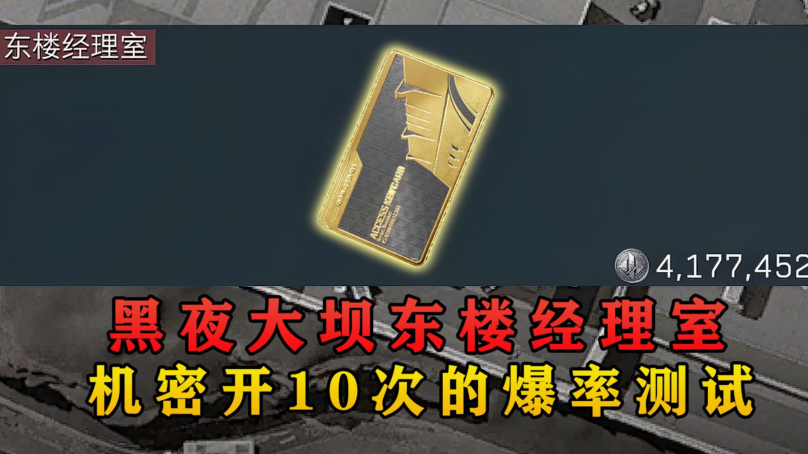 | 155.9万 | 2026-06-30 |
| [小猫：“做猫也不是那么容易的~”](https://www.bilibili.com/video/BV1QsTu6aERn) |  | 1.8万 | 2026-06-30 |
| [【ASMR】太深了…听完直接变成一滩烂泥](https://www.bilibili.com/video/BV1UpK96UEjZ) |  | 23.5万 | 2026-06-29 |
| [老东西还搁那乐，收你来了](https://www.bilibili.com/video/BV1iHKD6QEsT) |  | 31.5万 | 2026-06-29 |
| [侦探猫猫破奇案🕵️🐱：误会浣熊偷滑板？结局超暖心！](https://www.bilibili.com/video/BV1ssKQ6zEkH) |  | 2771 | 2026-06-29 |
| [【奶尸末日】丧尸奶蛙围攻房车，闺蜜来电，极限逃生！](https://www.bilibili.com/video/BV1GMKQ6nEk1) |  | 16.7万 | 2026-06-29 |
| [花200元买桌面宠物，做迷你动物园，孩子们太开心了](https://www.bilibili.com/video/BV1oCKQ6xEg4) |  | 119.5万 | 2026-06-29 |
| [Normal No More哈基米版——不再曼波](https://www.bilibili.com/video/BV17RKU6HEZq) |  | 408 | 2026-06-29 |
| [你们不觉得这个黑白熊很绝望吗(](https://www.bilibili.com/video/BV1FGKD6fEKd) |  | 9.7万 | 2026-06-29 |
| [“小桑多涅，电动玩具好玩吗”【bilibilionly】](https://www.bilibili.com/video/BV149TM69E41) |  | 13.0万 | 2026-06-28 |
| [【猫与龙】全12集 超清中字（未删减版）周更](https://www.bilibili.com/video/BV1Xi7s6iE3e) |  | 33.6万 | 2026-06-27 |
| [笑到喷饭！这只企鹅的魔性舞步太洗脑了🕺💃](https://www.bilibili.com/video/BV1xq7E6rE2K) |  | 4.0万 | 2026-06-27 |
| [【核电站跑刀必看】非洲之心/刷卡点/反应堆冷却核心/浓缩铀样本23个点位合集](https://www.bilibili.com/video/BV16B7q6XEdm) |  | 119.4万 | 2026-06-26 |
| [【JOJO】“躲在压路机旁抽🚬的二人”](https://www.bilibili.com/video/BV1vojH6aE6G) |  | 15.6万 | 2026-06-20 |
| [《新奇甜妻》总合集](https://www.bilibili.com/video/BV1vAjP6yEC7) |  | 8.9万 | 2026-06-18 |
| [万事难不住狗子，真正的强者不抱怨环境](https://www.bilibili.com/video/BV1G3Jw6GEpc) |  | 1.9万 | 2026-06-16 |
| [《拼   好  猫》](https://www.bilibili.com/video/BV1ZVEm6CE7c) | 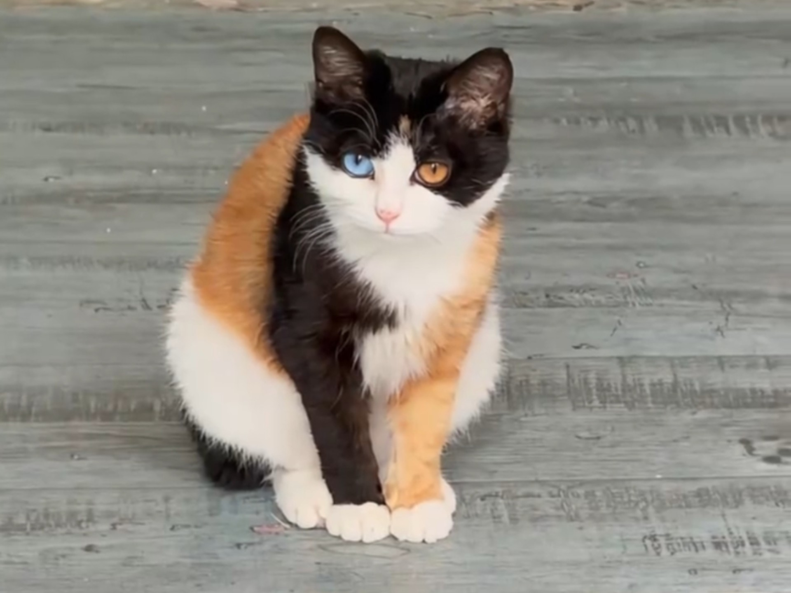 | 57.3万 | 2026-06-09 |
| [虎帽子小猫从献血暖到鼓乐拿奖杯的精彩合集](https://www.bilibili.com/video/BV144sDzPEge) |  | 16.4万 | 2025-10-28 |
| [《太 奶 的 澎 湖 湾》](https://www.bilibili.com/video/BV14ZxXzyEDB) |  | 981.6万 | 2025-10-07 |

---
*最后更新: 2026-07-06 06:46:16 (自动生成)*
*数据来源: [Bilibili](https://www.bilibili.com)*

## 使用说明

运行以下命令更新视频列表:
```bash
python3 fetch_hajimi_videos.py
```
