# awesome-hajimi
collections of hajimi (哈基米 in Chinese) on the Internet.

## 视频列表 (Video List)

| 视频标题 (Title) | 封面 | 播放量 (Views) | 发布日期 (Date) |
|---|---|---|---|
| [哈基米这个喝大了](https://www.bilibili.com/video/BV116Kj6rEy1) | 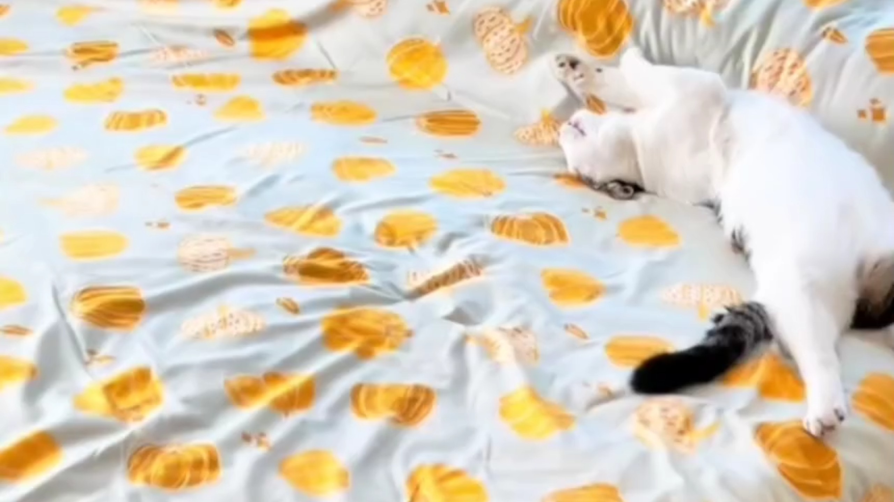 | 661 | 2026-07-17 |
| [哈基米](https://www.bilibili.com/video/BV1R2K76xEmr) | 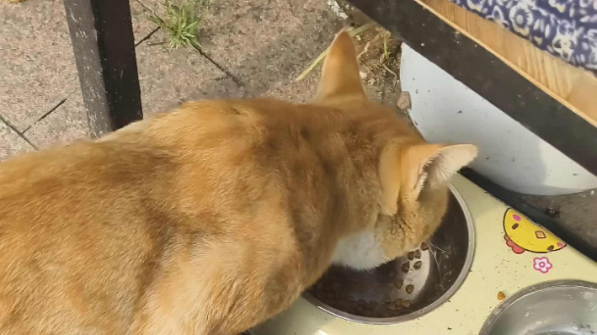 | 787 | 2026-07-16 |
| [哈基米：奶龙~【小杂鱼】](https://www.bilibili.com/video/BV1rgKj6wEdK) |  | 404 | 2026-07-16 |
| [罗小黑原创英雄——哈基米局内特效展示](https://www.bilibili.com/video/BV1Z8KV6DEJD) | 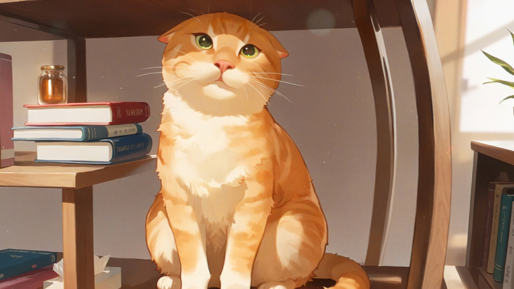 | 796 | 2026-07-16 |
| [哈基米“老吴老吴”纯享版](https://www.bilibili.com/video/BV1umKV6gEaa) | 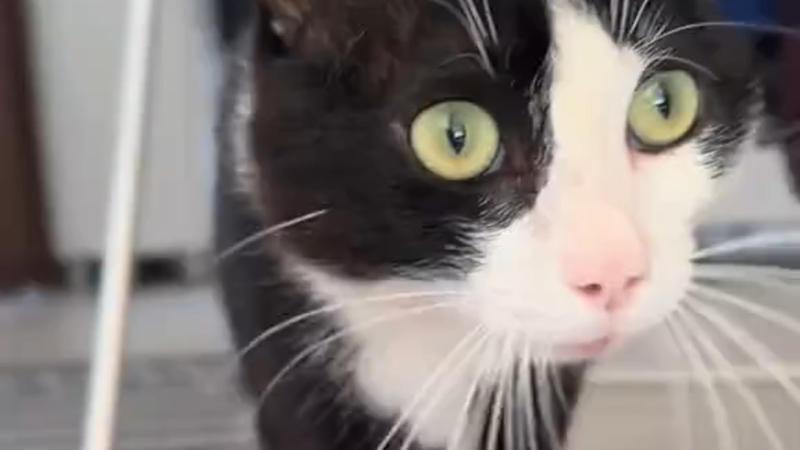 | 914 | 2026-07-16 |
| [张顺飞：园游会（完整版）](https://www.bilibili.com/video/BV1uUKV6zEhR) |  | 1.2万 | 2026-07-16 |
| [欢迎使用基米陪伴服务](https://www.bilibili.com/video/BV1QWK56yEaK) | 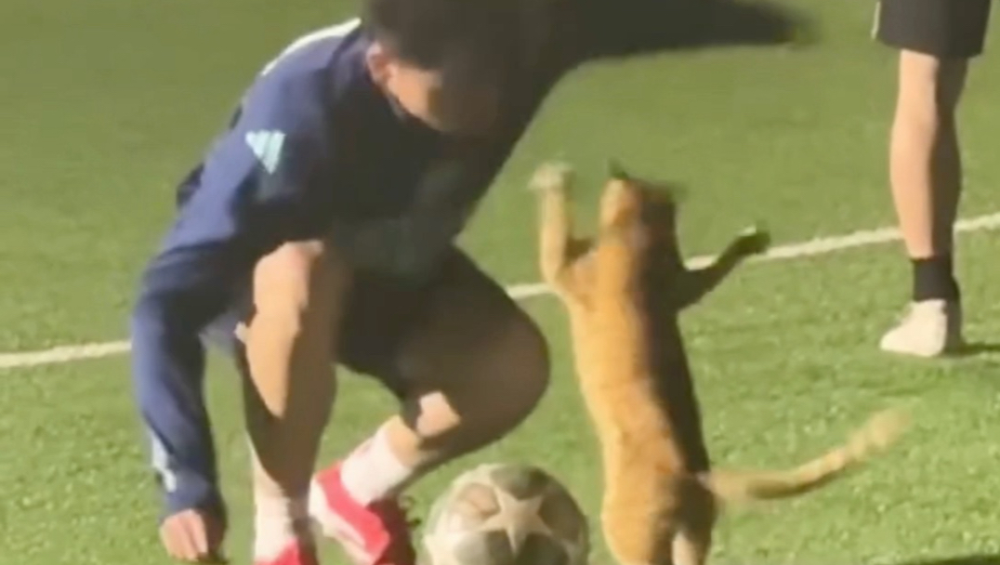 | 5250 | 2026-07-16 |
| [哈基米搞破坏](https://www.bilibili.com/video/BV1zMK56RE3j) |  | 2.1万 | 2026-07-16 |
| [哈基米呦](https://www.bilibili.com/video/BV1z3K56XEHS) |  | 452 | 2026-07-16 |
| [哈基米之曼波无敌3：哈气阴影：过天主题曲0](https://www.bilibili.com/video/BV1rkN66eEQ2) |  | 614 | 2026-07-16 |
| [哈基米这个表情丰富](https://www.bilibili.com/video/BV1UYK56BETx) | 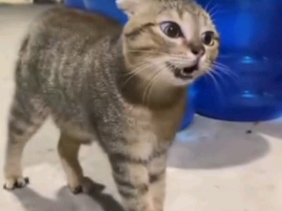 | 318 | 2026-07-16 |
| [哈基米开启棘背龙模式，老吴那个那个](https://www.bilibili.com/video/BV1hbK563ELg) | 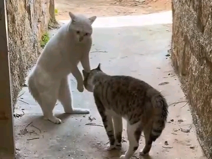 | 52 | 2026-07-16 |
| [【基米TV】哈气=吃的](https://www.bilibili.com/video/BV1u2K36AEst) | 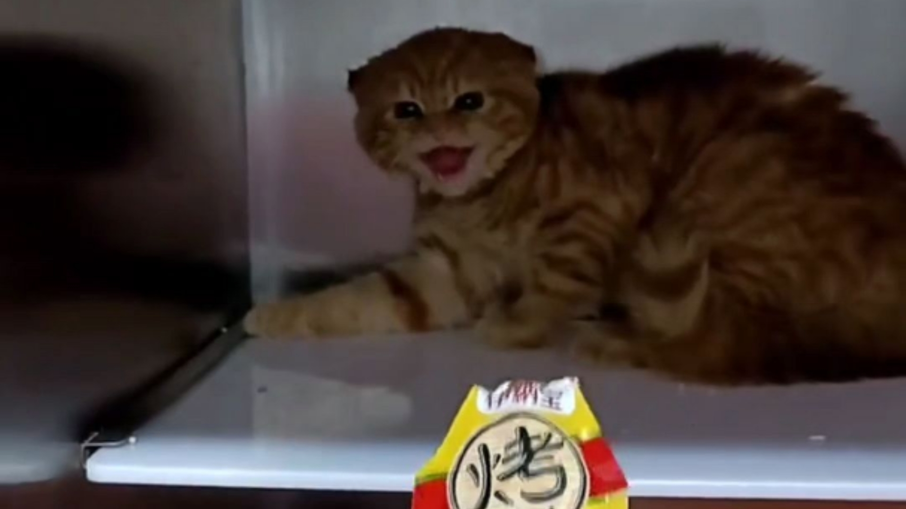 | 4133 | 2026-07-16 |
| [⚡ 大 狗 嘉 ⚡](https://www.bilibili.com/video/BV1XEKG6gE3o) |  | 4721 | 2026-07-16 |
| [基米吃美了](https://www.bilibili.com/video/BV16PKG6SEY4) | 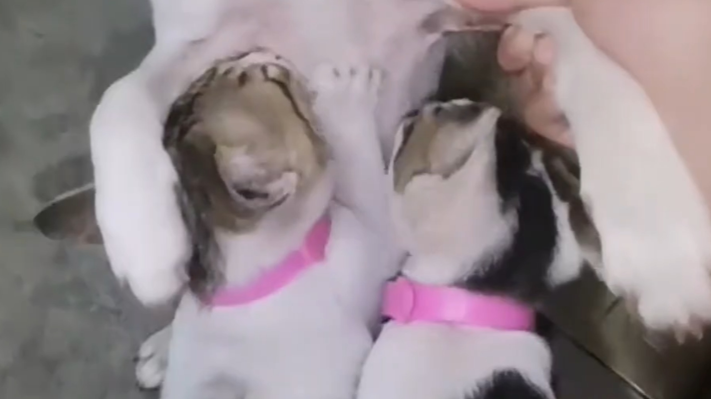 | 2736 | 2026-07-16 |
| [“再见了，所有的大狗叫”](https://www.bilibili.com/video/BV1djNh68EtM) | 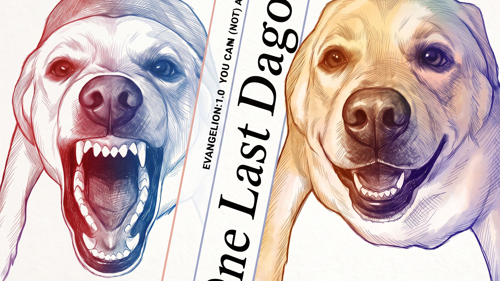 | 10.6万 | 2026-07-16 |
| [哈基米，哈基米，哈基米，哈基米](https://www.bilibili.com/video/BV12hKG6wE14) |  | 628 | 2026-07-16 |
| [R&amp;B哈基米：我们哈不哈](https://www.bilibili.com/video/BV1tHKg68Edi) |  | 4409 | 2026-07-16 |
| [【火炬之光无限】哈基米三的开荒到幽邃闪打攻略](https://www.bilibili.com/video/BV18KKV6MELa) |  | 7966 | 2026-07-16 |
| [“人，视频就是咪活着的地方”](https://www.bilibili.com/video/BV1fDNQ6oEqW) |  | 186.9万 | 2026-07-16 |
| [哈基米一败涂地](https://www.bilibili.com/video/BV1GFKV6GEp5) | 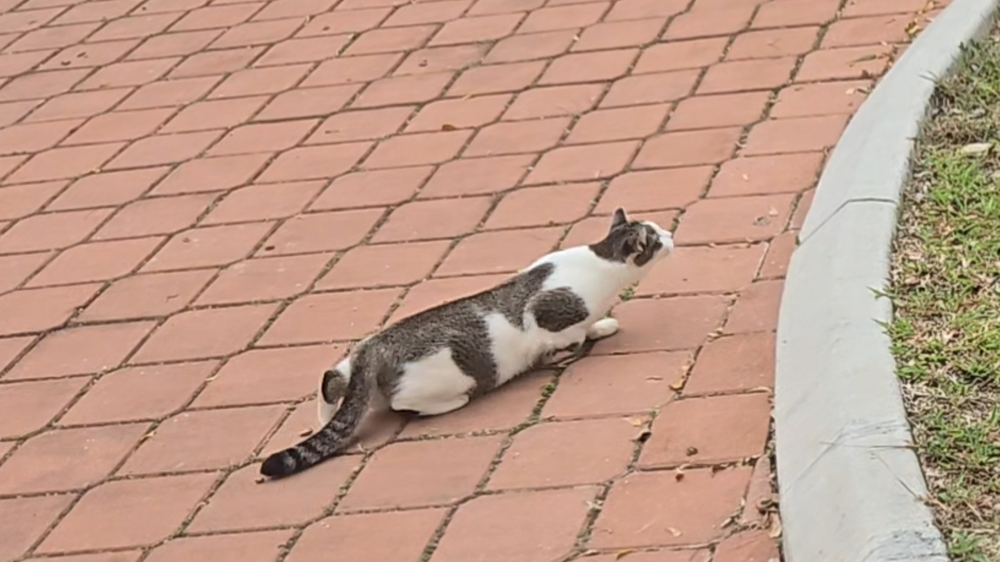 | 89 | 2026-07-16 |
| [感受😋（最快获得哈基米之人）](https://www.bilibili.com/video/BV1acKV6rEsv) | 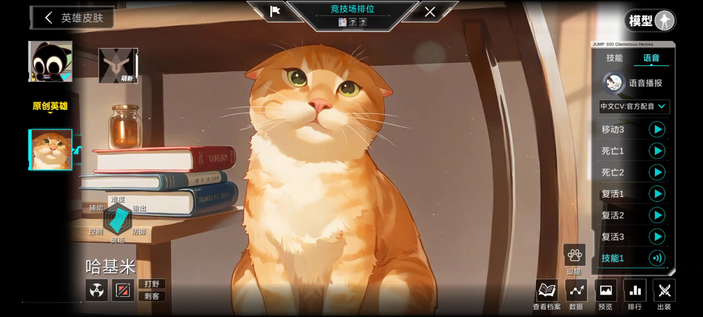 | 1415 | 2026-07-16 |
| [哈基米先礼后兵这一块](https://www.bilibili.com/video/BV1qMKg6uEAV) | 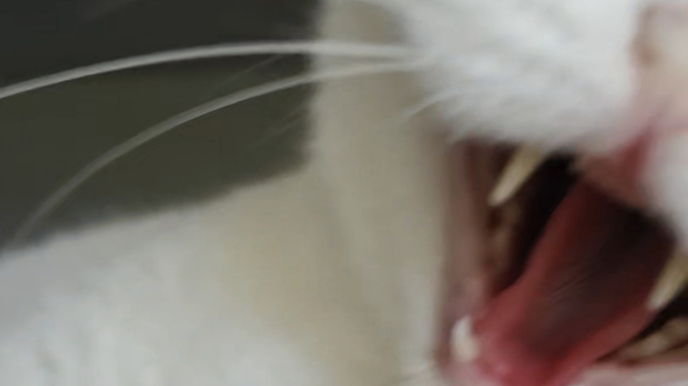 | 87 | 2026-07-16 |
| [哈基米：🐱下一站🐱](https://www.bilibili.com/video/BV1MxKg6ZE4V) |  | 7347 | 2026-07-16 |
| [哈基米南北绿豆](https://www.bilibili.com/video/BV1seKg6HEVF) | 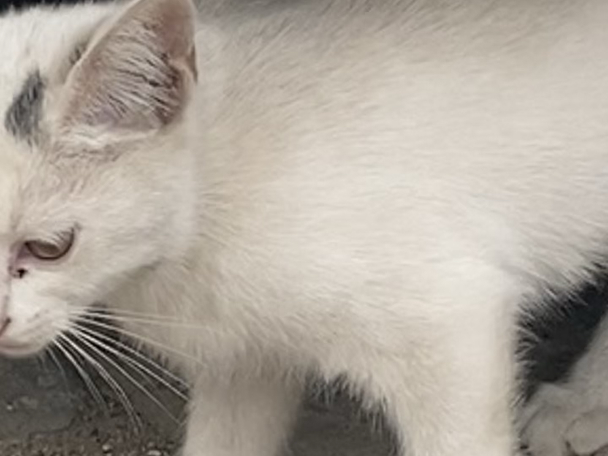 | 672 | 2026-07-16 |
| [21世纪最伟大的英雄 神人TY把圆头耄耋哈基米做进游戏里面了【300大作战】](https://www.bilibili.com/video/BV1xhKg6WEt6) | 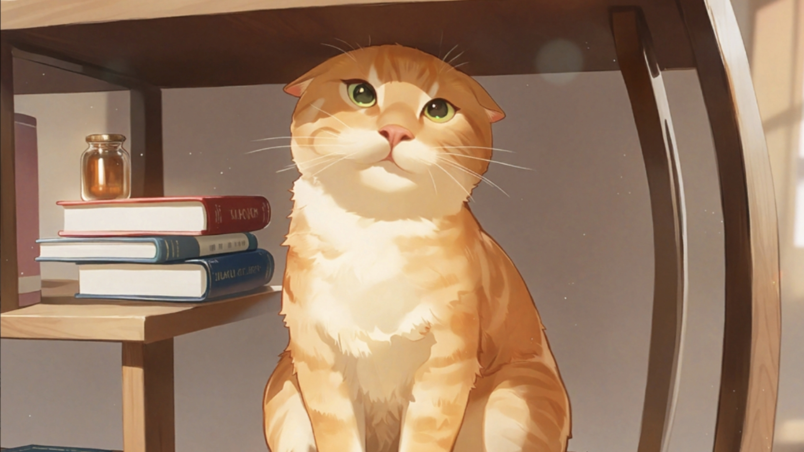 | 8508 | 2026-07-16 |
| [猫猫在，快乐就在！](https://www.bilibili.com/video/BV1uwK36AEYs) |  | 6409 | 2026-07-16 |
| [哈基米入侵小区](https://www.bilibili.com/video/BV1oSKg63E6Q) | 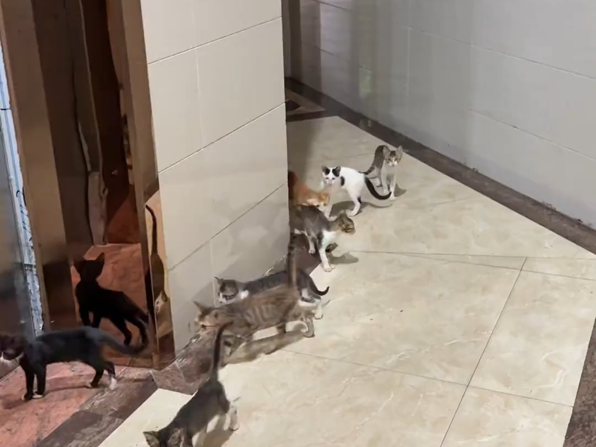 | 1186 | 2026-07-16 |
| [哈基米南北绿豆](https://www.bilibili.com/video/BV1GfKg6NE4h) | 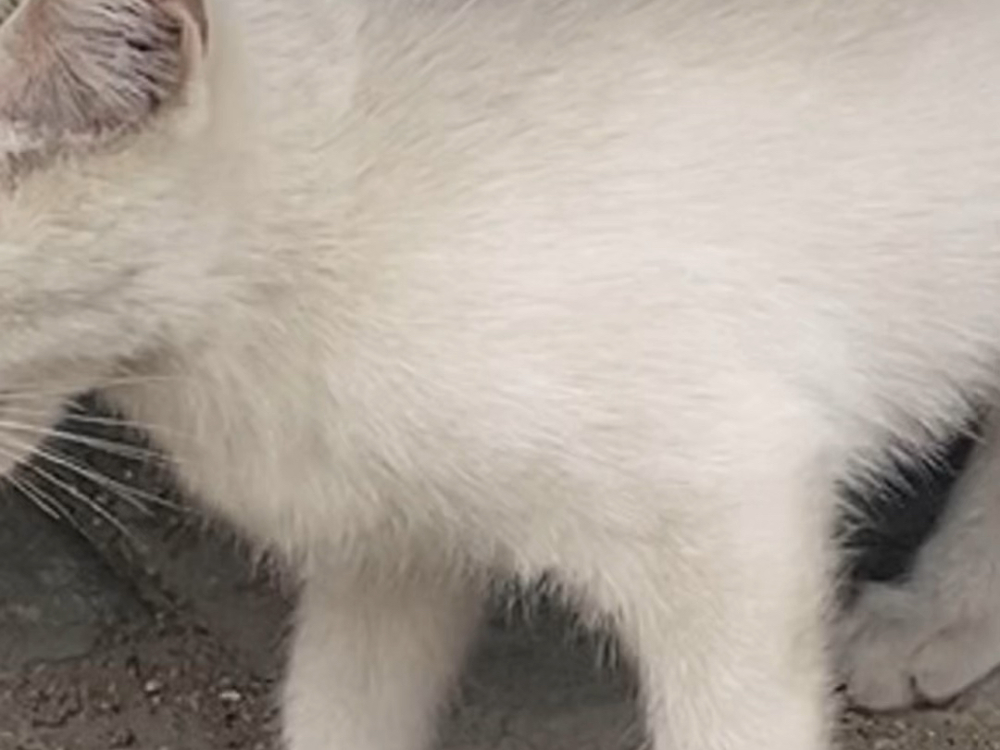 | 1285 | 2026-07-16 |
| [蓝色哈基米：你猜我能不能毒10个😅😅😅](https://www.bilibili.com/video/BV1wLKu61Edp) |  | 1218 | 2026-07-16 |
| [瘫痪小猫能听懂人话后，讨饭一碰壁，就在我面前装柔弱](https://www.bilibili.com/video/BV1FLNv6mECh) | 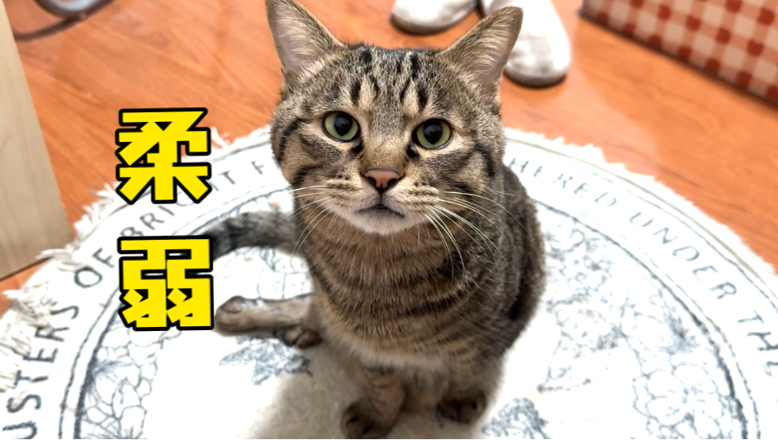 | 57.0万 | 2026-07-15 |
| [你肯定没看过这个版本](https://www.bilibili.com/video/BV1D7Ni6NETA) |  | 3.0万 | 2026-07-15 |
| [TikTok日本网友看中国小姐姐唱哈基米歌，发现居然是日语，评论区懵逼一片，日本人自己都听不懂。](https://www.bilibili.com/video/BV14sNi68ETo) |  | 2182 | 2026-07-15 |
| [哈基米！！！](https://www.bilibili.com/video/BV14sNi68E1K) | 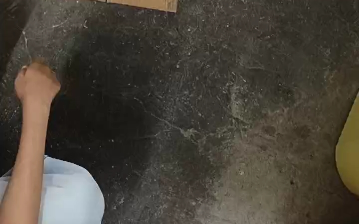 | 103 | 2026-07-15 |
| [⚡️来个耄耋叫一叫⚡️～](https://www.bilibili.com/video/BV1Y9Ni66EJA) | 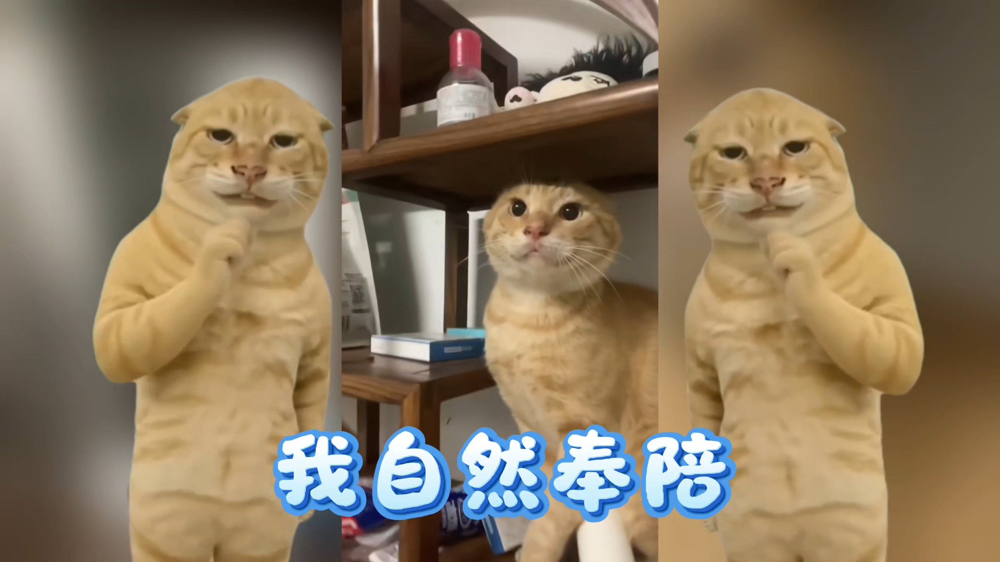 | 216.2万 | 2026-07-15 |
| [酒店奇遇：哈基米选中了我，也偷走了我的魂。](https://www.bilibili.com/video/BV1UANq6eEAM) | 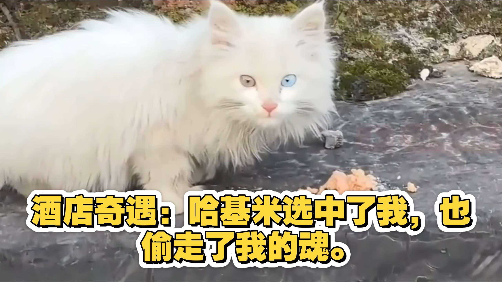 | 2277 | 2026-07-15 |
| [假如印度翻拍《鬼灭之刃》](https://www.bilibili.com/video/BV1eMNi63ERK) |  | 51.3万 | 2026-07-15 |
| [夏天配哈基咪才是最搭～](https://www.bilibili.com/video/BV1UNNq6AEBW) | 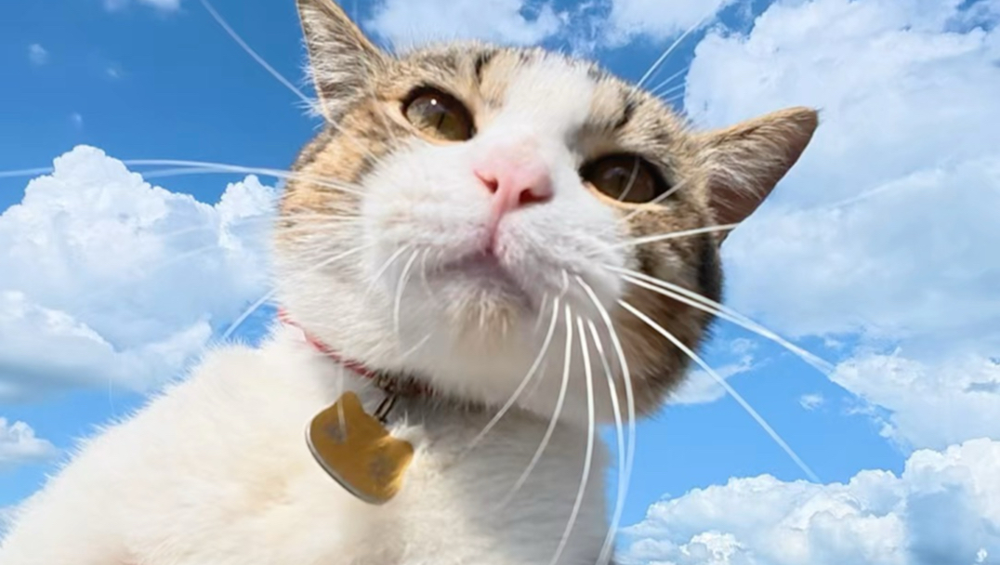 | 6.9万 | 2026-07-15 |
| [电棍：EEEAAAOOO♿](https://www.bilibili.com/video/BV1uZNe6FEwN) |  | 6185 | 2026-07-15 |
| [《全 员 坏 猫》](https://www.bilibili.com/video/BV1KNNv6sEZP) | 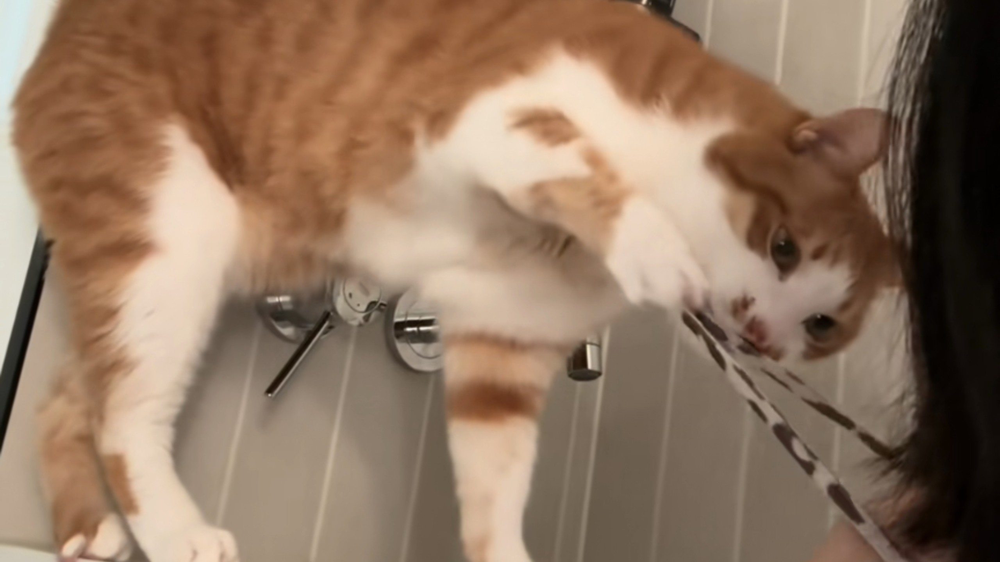 | 7.7万 | 2026-07-15 |
| [菲比：大狗，快叫吧！](https://www.bilibili.com/video/BV1bENe6dEbh) |  | 4.0万 | 2026-07-15 |
| [🐴🎙️《不要在我寂寞的时候说爱我》🐴🎙️【Hi-Res/4K】](https://www.bilibili.com/video/BV12cNY6JEfA) |  | 1278 | 2026-07-15 |
| [原来你也哈基米！](https://www.bilibili.com/video/BV1niNe65EQL) |  | 1290 | 2026-07-14 |
| [背对背狗叫🐶](https://www.bilibili.com/video/BV1zDNh6TEyK) | 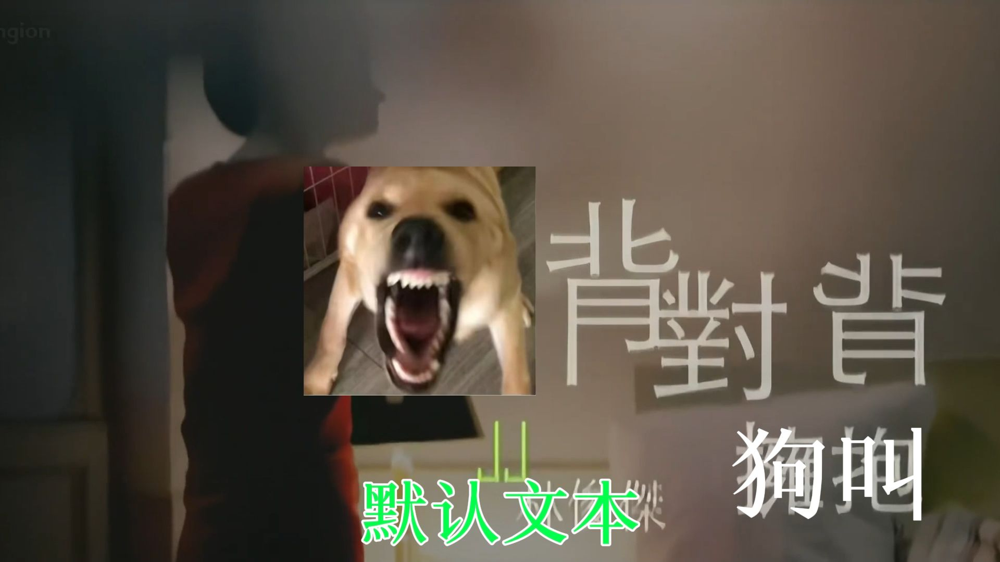 | 921 | 2026-07-14 |
| [哈基米男背绿灯](https://www.bilibili.com/video/BV1pbNa63EKH) |  | 3926 | 2026-07-14 |
| [肖邦的妹妹肖茂咪 弹奏《往事只能哈基》](https://www.bilibili.com/video/BV1GyN86pEfj) |  | 2.1万 | 2026-07-14 |
| [咪在农村避暑的天…和子柒玩水、做凉虾、赏晚霞，还骑了只鸡走，快哉快哉](https://www.bilibili.com/video/BV1HpNt6fEAa) | 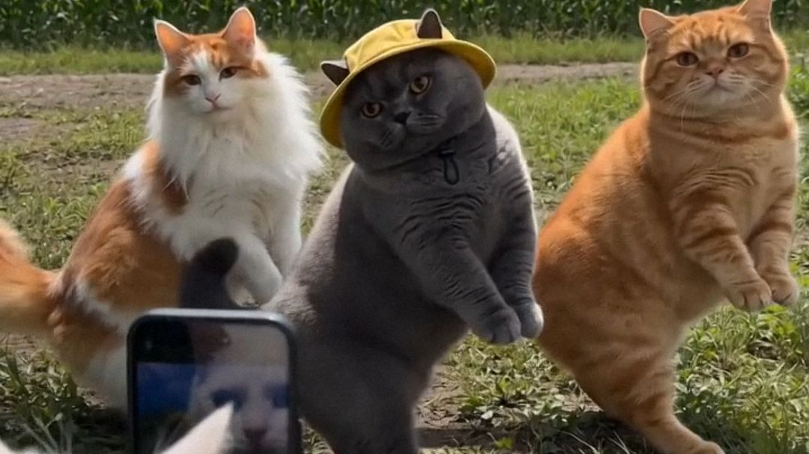 | 3.1万 | 2026-07-14 |
| [小帝宝嘟囔着要吃超大哈基米](https://www.bilibili.com/video/BV1WfNt6NEzL) |  | 331 | 2026-07-14 |
| [让哈基米虐待达耶的老姐依旧装傻充愣。](https://www.bilibili.com/video/BV1bhNb6VEEK) | 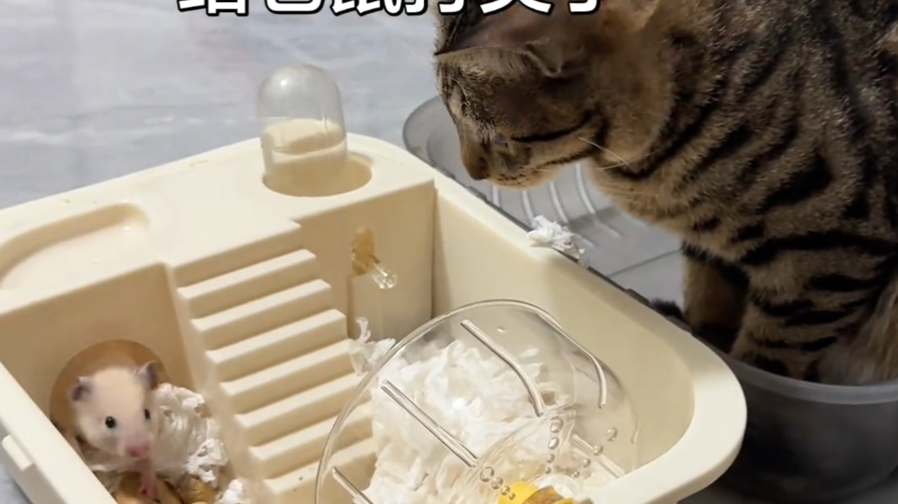 | 2697 | 2026-07-14 |
| [哈基米之洗澡TV](https://www.bilibili.com/video/BV1TaNb6kEKA) | 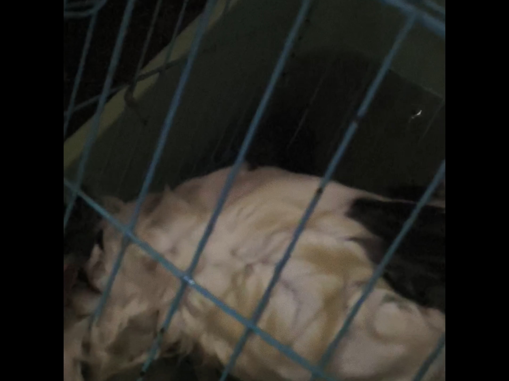 | 1326 | 2026-07-14 |
| [陆地猛兽哈基米挑战河道霸主不慎落败-战败CG泄密流出](https://www.bilibili.com/video/BV1yBNb6qEbx) |  | 8.2万 | 2026-07-14 |
| [咕嘎日记8](https://www.bilibili.com/video/BV18DNX62EJ1) |  | 1.9万 | 2026-07-14 |
| [最功利三个月医厨毕业你离财富自由只差一只哈基米](https://www.bilibili.com/video/BV15pN96REzD) |  | 1426 | 2026-07-14 |
| [（1-5集）一口气看到爽](https://www.bilibili.com/video/BV1woN26JE9V) |  | 2.1万 | 2026-07-14 |
| [【基米】来不及解释了最乱伦理基米](https://www.bilibili.com/video/BV1RfNQ6HEPK) | 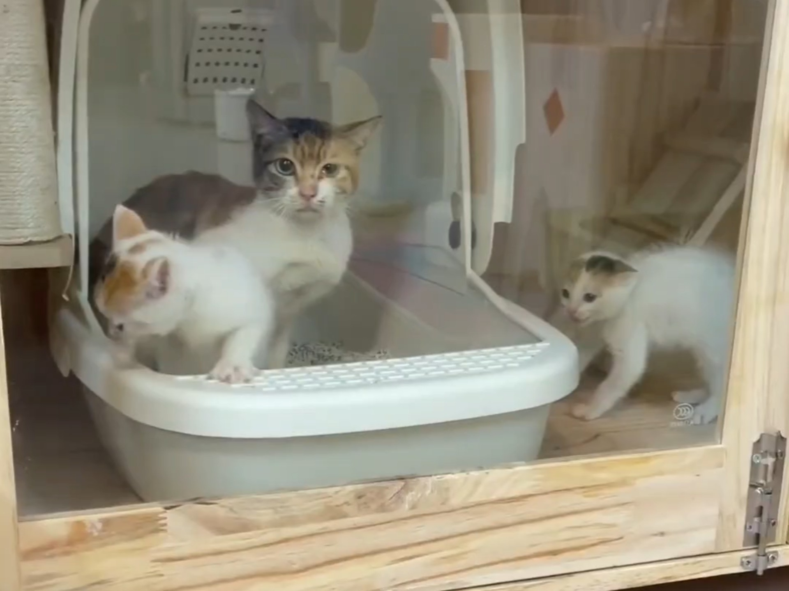 | 6169 | 2026-07-14 |
| [一对哈基米，两头叮咚鸡](https://www.bilibili.com/video/BV1M3Nr6yEBY) |  | 2734 | 2026-07-13 |
| [“众所周知，猫是一种液体!](https://www.bilibili.com/video/BV1VvMG6jEC9) |  | 3.9万 | 2026-07-12 |
| [天 津 鼠 鼠 的 秘 密 ④](https://www.bilibili.com/video/BV1zjNG6mEMo) | 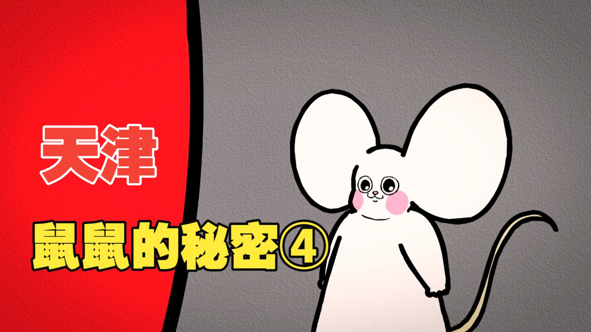 | 19.4万 | 2026-07-12 |
| [哈基米 搞怪の小曲 (Fooling Mode)](https://www.bilibili.com/video/BV1tBNG6YEBt) | 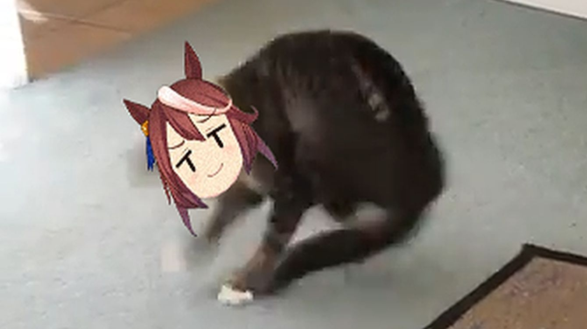 | 338 | 2026-07-12 |
| [凌晨五点半，咣当来要饭](https://www.bilibili.com/video/BV1WsNu61EyT) | 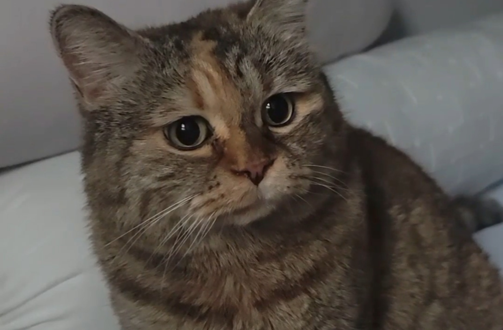 | 15.7万 | 2026-07-12 |
| [这是水族馆？AI鬼画符？水下霸王龙？奇幻的开封海洋馆之旅！](https://www.bilibili.com/video/BV1nSNM6zE83) |  | 113.5万 | 2026-07-12 |
| [二哈：两岁的小孩狗都嫌！](https://www.bilibili.com/video/BV1KFNg6QEjK) | 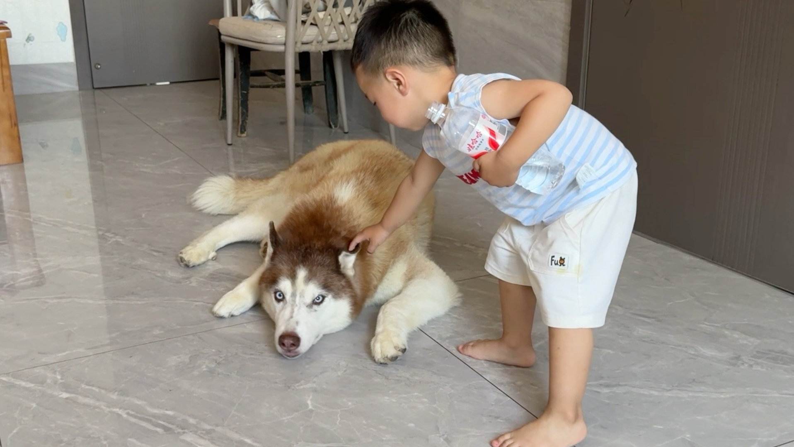 | 8.1万 | 2026-07-12 |
| [《下个，大狗，叫》](https://www.bilibili.com/video/BV11FNg6DEJS) | 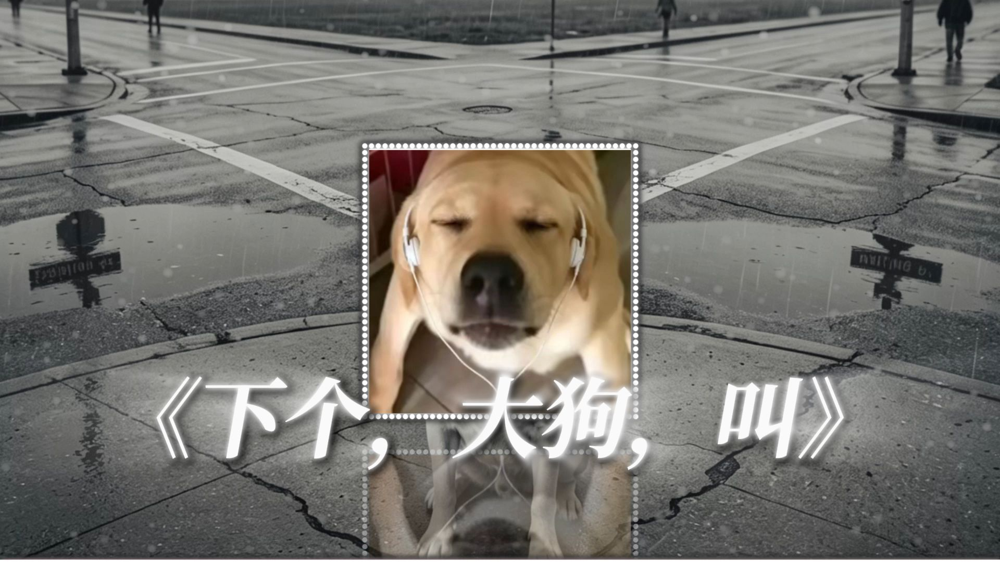 | 145.7万 | 2026-07-12 |
| [为池塘“怪物”亲手打造了一个巨型乐高家园，结果出乎意料](https://www.bilibili.com/video/BV1K6Ng6sEus) |  | 7.0万 | 2026-07-12 |
| [带萌宠打工没想到他们就会给我添麻烦](https://www.bilibili.com/video/BV1X8Ng6cEMT) | 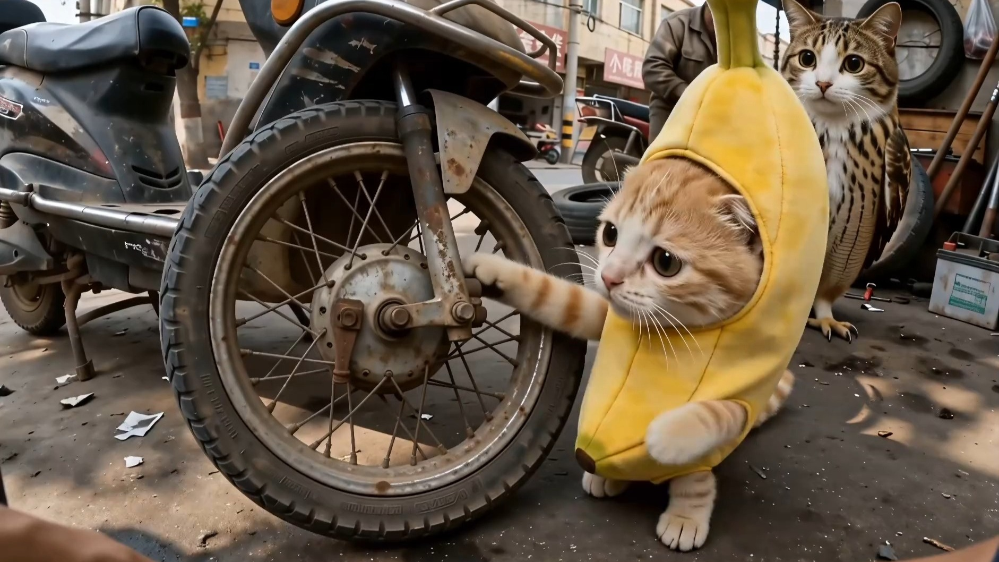 | 1.8万 | 2026-07-12 |
| [比比拉布和刀盾一口气看完1-5合集](https://www.bilibili.com/video/BV1SUNT6nEei) |  | 6.6万 | 2026-07-12 |
| [今天喝藕粉](https://www.bilibili.com/video/BV1enNM6bEZJ) | 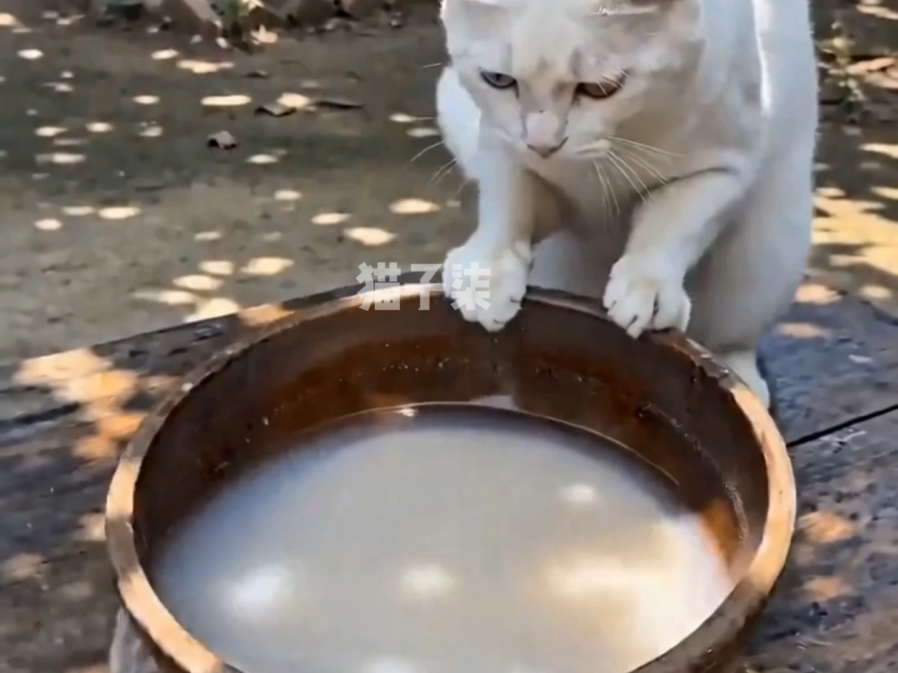 | 8.9万 | 2026-07-12 |
| [me和好朋喵的汤泉vlog](https://www.bilibili.com/video/BV1jZNM6PEzk) |  | 6910 | 2026-07-12 |
| [【咕嘎纪录片】野生咕嘎   完整版【AI全民制作人】](https://www.bilibili.com/video/BV1VwNu6hEV4) |  | 11.0万 | 2026-07-12 |
| [强大的毒蛇也有害怕的时候，尤其是遇到这些高智商动物](https://www.bilibili.com/video/BV1MCNA6uEnh) | 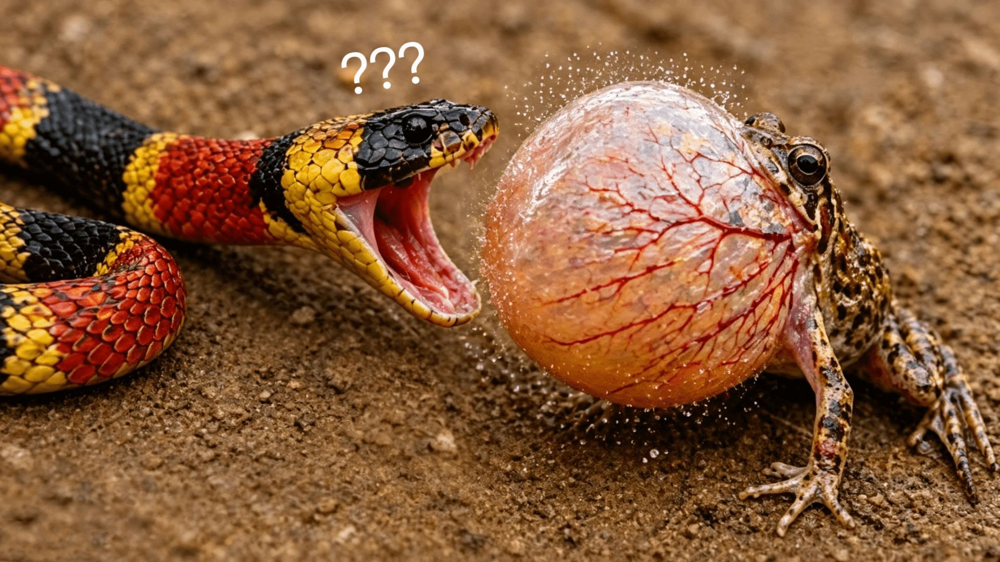 | 29.4万 | 2026-07-12 |
| [命运戏弄大馋狗](https://www.bilibili.com/video/BV1RaNA61ExW) | 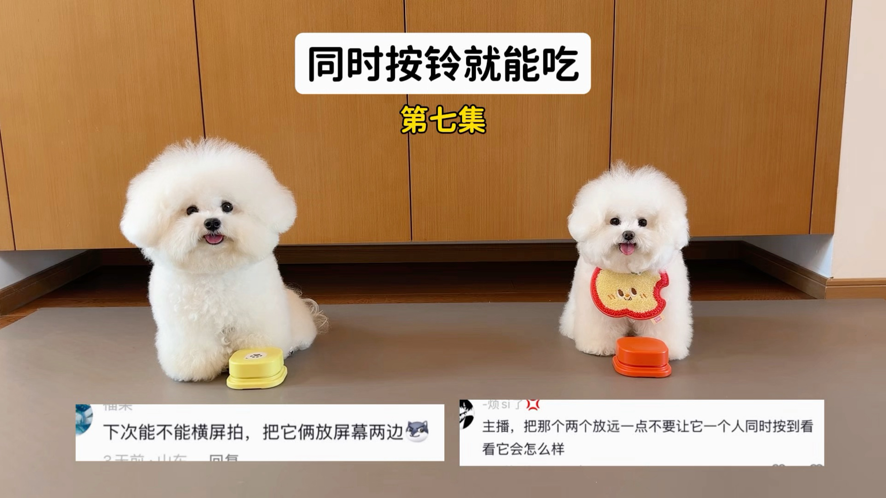 | 212.5万 | 2026-07-11 |
| [我真的特别爱你呀](https://www.bilibili.com/video/BV1SiNc6NEK5) | 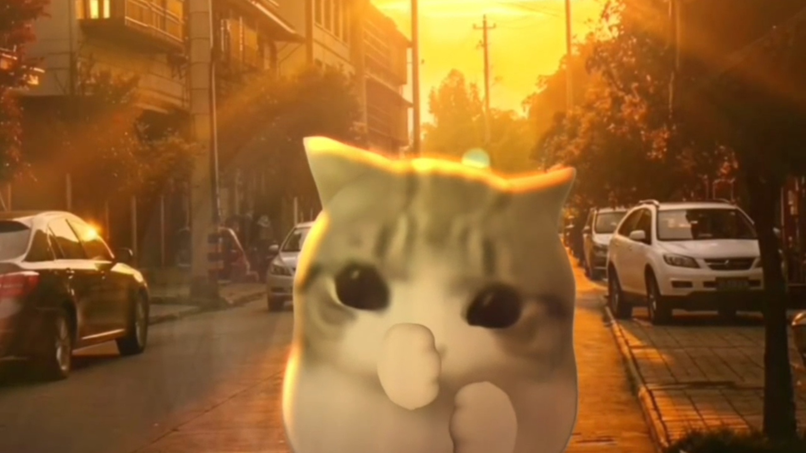 | 23.6万 | 2026-07-11 |
| [受尽嘲笑与质疑的受伤小狗，最后用冠军证明了自己🏆](https://www.bilibili.com/video/BV1L3MV6QE1H) |  | 6.6万 | 2026-07-11 |
| [耄耋原版视频](https://www.bilibili.com/video/BV1x2Nc6bEkC) | 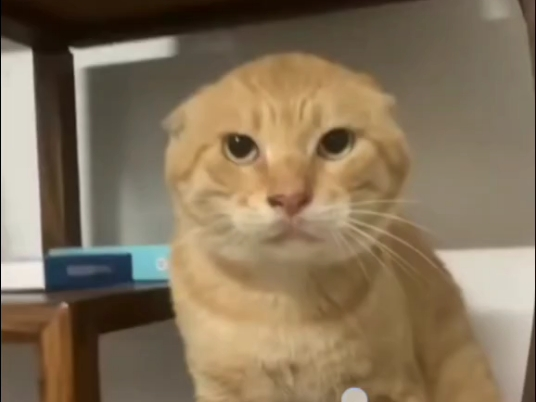 | 323 | 2026-07-11 |
| [帮失忆的同学找回记忆](https://www.bilibili.com/video/BV19fN46LENW) | 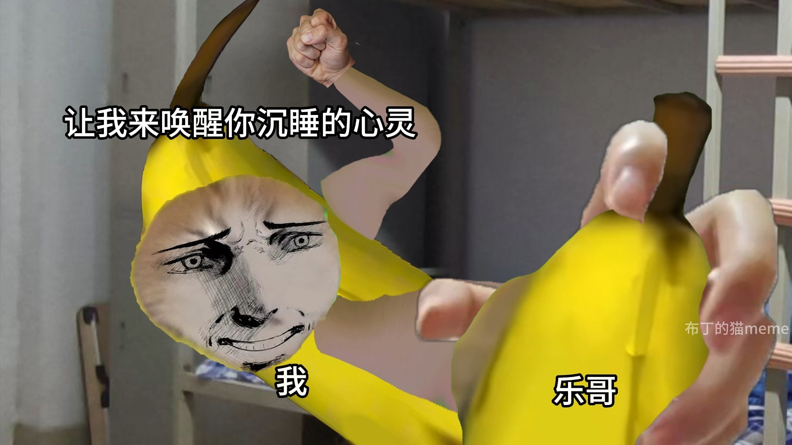 | 53.8万 | 2026-07-11 |
| [一家6狗夏天玩水有多快乐？](https://www.bilibili.com/video/BV1CQNW6WERg) | 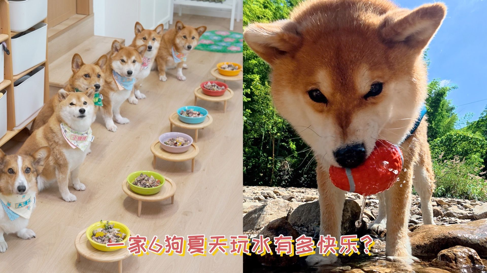 | 59.8万 | 2026-07-11 |
| [猫 鼠 大 战 2](https://www.bilibili.com/video/BV1hdNs6zEvC) | 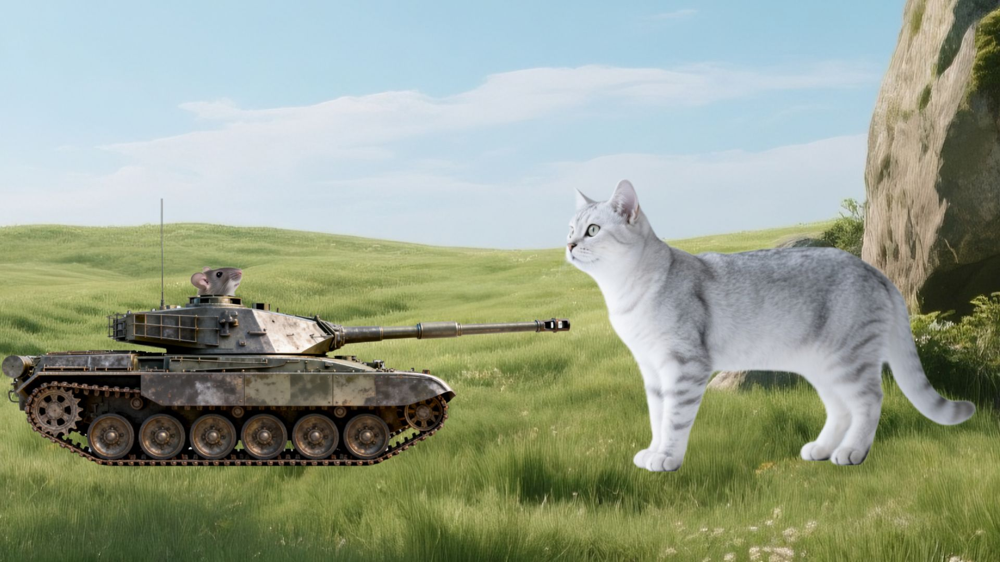 | 4.0万 | 2026-07-11 |
| [Hello，大狗！大狗叫 翻叫](https://www.bilibili.com/video/BV1sFNJ6kE9B) |  | 185 | 2026-07-10 |
| [忍住别笑 😅 搞笑猫咪狗狗合集 第102期 🐱🐶](https://www.bilibili.com/video/BV1JzMp6WErF) | 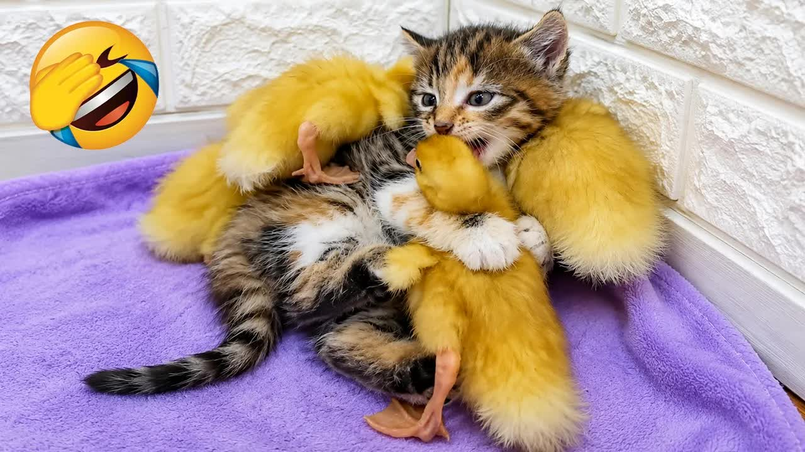 | 1334 | 2026-07-10 |
| [帮小朋友找回暑假作业，他一定很开心吧～](https://www.bilibili.com/video/BV1FCN76vE6B) | 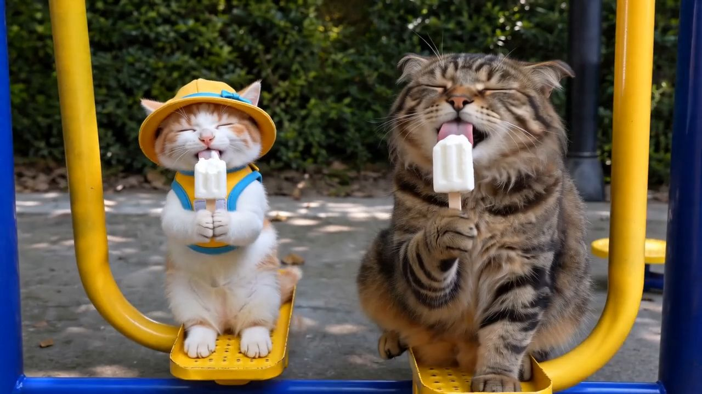 | 57.7万 | 2026-07-10 |
| [【小瑶】年收入300万 停更 在21岁大结局真的来了](https://www.bilibili.com/video/BV1NJNn6UEGb) |  | 25.8万 | 2026-07-10 |
| [【传奇耐熬王】传奇耐饿王...🔥燃烧生命拿阳寿来熬出50万刀😱最后比的就是胃和头！](https://www.bilibili.com/video/BV1NENn6JEzE) |  | 255.3万 | 2026-07-10 |
| [⚡猫 鼠 摇 一 摇⚡【bilibilionly】](https://www.bilibili.com/video/BV1aVMp63EUx) |  | 11.4万 | 2026-07-10 |
| [猫咪首次遇到野生动物爆笑反应 🤣](https://www.bilibili.com/video/BV1edNL6UE8f) | 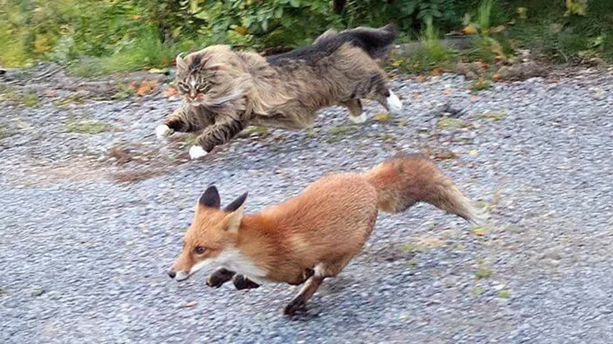 | 4.1万 | 2026-07-10 |
| [谁家疯猫秀？悬疑哈基米！](https://www.bilibili.com/video/BV1FkNL6tExZ) | 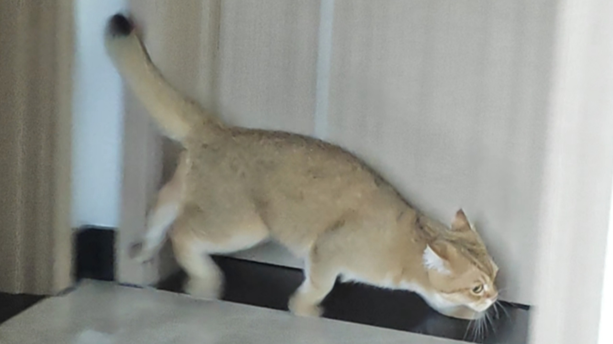 | 2536 | 2026-07-10 |
| [逃离大狗](https://www.bilibili.com/video/BV113Nj6qEsF) |  | 1.8万 | 2026-07-10 |
| [猫和老鼠：童年里那只追不上老鼠的猫](https://www.bilibili.com/video/BV1P6D9BpEC5) |  | 2.0万 | 2026-07-10 |
| [天上掉下个大狗叫](https://www.bilibili.com/video/BV1UkMH6aE67) |  | 5.7万 | 2026-07-09 |
| [第一集丨今天带着比比拉布和刀盾出门烧烤钓鱼了](https://www.bilibili.com/video/BV1XrMx6UEUL) |  | 2.5万 | 2026-07-07 |
| [全程高能💥动画MEME连环炸裂！这期真的顶不住啦！](https://www.bilibili.com/video/BV1asM46JErx) |  | 3.6万 | 2026-07-07 |
| [带你刷2分钟正常人的抖音](https://www.bilibili.com/video/BV1KTTS6TE6a) | 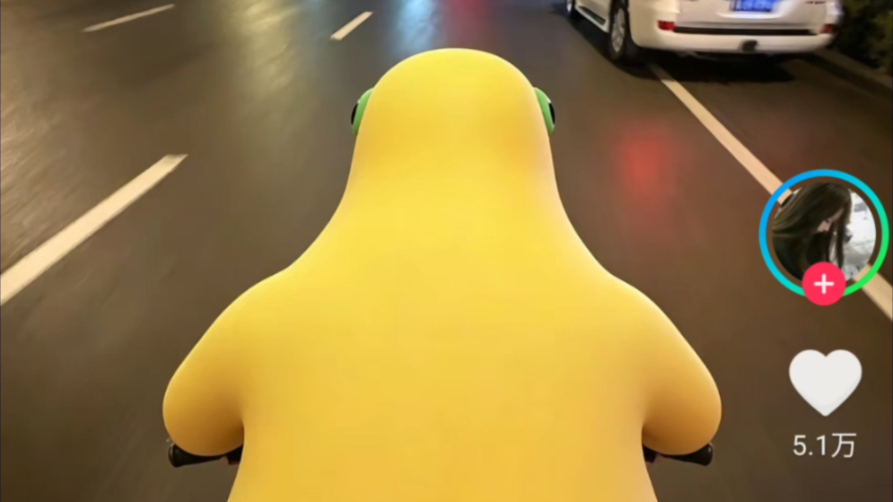 | 38.2万 | 2026-07-05 |
| [《千萌心声》第1~18集](https://www.bilibili.com/video/BV1GyTy6iE4N) | 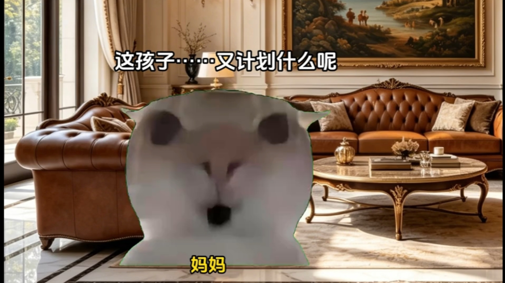 | 11.4万 | 2026-07-05 |
| [《三绷演义の小曲》Ngẫu Hứng“伦敦未必有蜀国忧郁”](https://www.bilibili.com/video/BV1CCTC67E1A) |  | 205.8万 | 2026-07-05 |
| [⚡byd，我迟早笑死在这互联网上！⚡](https://www.bilibili.com/video/BV1SQTY6wEsN) |  | 59.4万 | 2026-07-01 |
| [#萌宠解说 #萌宠来袭 #萌宠 #萌宠日常](https://www.bilibili.com/video/BV1927H6wENo) | 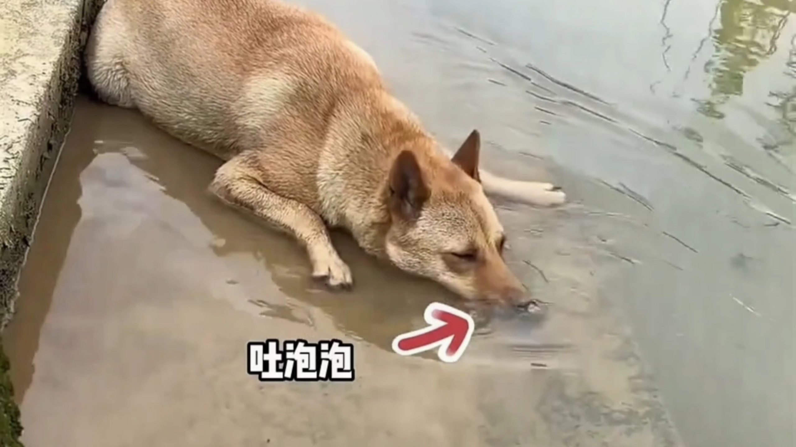 | 1.6万 | 2026-06-27 |
| [【补档】哈基米活全家PHONK 2.0《NEON BLADE》你家猫哈气了不.](https://www.bilibili.com/video/BV1KUjE63Em4) |  | 384 | 2026-06-20 |
| [世界公认最佳解压、432Hz疗愈雨声：身体秒放松、大自然顶级舒适白噪音，抑郁焦虑都被洗净、学习冥想时放空大脑，失眠夜秒入深睡的雨夜沉浸、一觉睡到自然醒](https://www.bilibili.com/video/BV11Ak4BWEsw) |  | 419.5万 | 2026-01-18 |
| [《Edge Of My Life》](https://www.bilibili.com/video/BV1dzacz4EPt) |  | 164.1万 | 2025-09-02 |
| [当生活让你疲惫时，请打开这个视频，让可爱的小动物们来治愈你](https://www.bilibili.com/video/BV1fcYoz9EEL) |  | 15.2万 | 2025-08-22 |
| [哈基帝の小曲丨独断万古哈基帝](https://www.bilibili.com/video/BV1HpMEzfEgQ) |  | 2.4万 | 2025-06-11 |

---
*最后更新: 2026-07-17 05:23:34 (自动生成)*
*数据来源: [Bilibili](https://www.bilibili.com)*

## 使用说明

运行以下命令更新视频列表:
```bash
python3 fetch_hajimi_videos.py
```
