# awesome-hajimi
collections of hajimi (哈基米 in Chinese) on the Internet.

## 视频列表 (Video List)

| 视频标题 (Title) | 封面 | 播放量 (Views) | 发布日期 (Date) |
|---|---|---|---|
| [哈基人想拐小哈基米被猫妈妈发现了](https://www.bilibili.com/video/BV1qbKo63Ezw) | 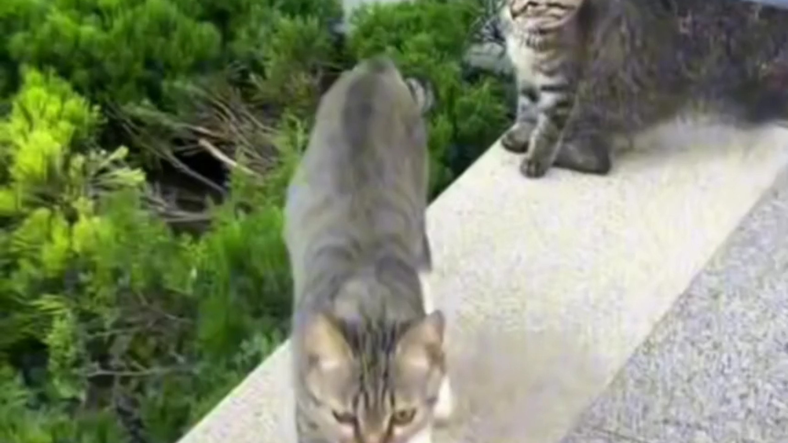 | 697 | 2026-06-29 |
| [哈基米 哈基米 哈基米~](https://www.bilibili.com/video/BV1xmKX6kEga) |  | 29 | 2026-06-29 |
| [哈基米这个舒服](https://www.bilibili.com/video/BV1Y4KD6EEuQ) |  | 11.7万 | 2026-06-29 |
| [2026MSI应援曲《如果季中成回忆》](https://www.bilibili.com/video/BV1BfKD64EF1) |  | 23.6万 | 2026-06-29 |
| [哈~基咪~](https://www.bilibili.com/video/BV1YKKQ6QEqZ) | 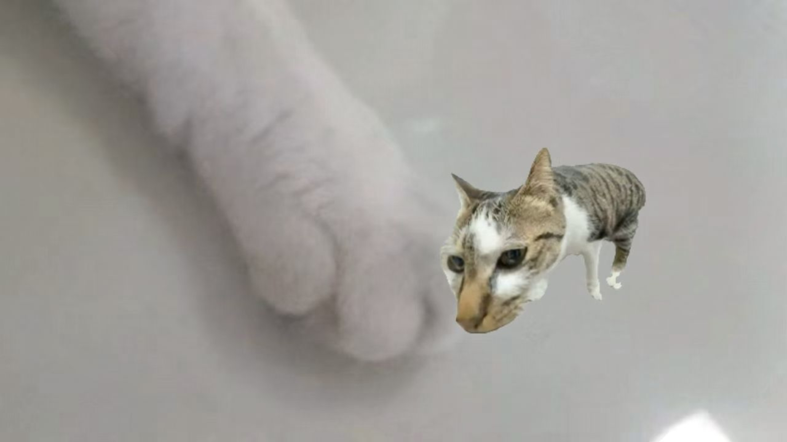 | 155 | 2026-06-29 |
| [“世界上最伟大的15秒大狗叫”《popular》【十分钟纯享版】](https://www.bilibili.com/video/BV1dyKQ6RERa) |  | 1.1万 | 2026-06-29 |
| [失恋的哈基米](https://www.bilibili.com/video/BV1rSKU6REen) | 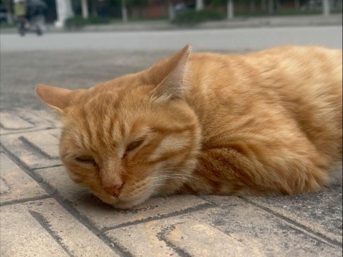 | 482 | 2026-06-29 |
| [72.哈基米喔南北绿豆](https://www.bilibili.com/video/BV1BRKU6HEuo) |  | 35 | 2026-06-29 |
| [【宝藏歌曲合集】“哈基米の九大名曲”](https://www.bilibili.com/video/BV1xBKU6AEnt) |  | 1619 | 2026-06-29 |
| [【APTV】哈基米是汉语里猫咪的意思](https://www.bilibili.com/video/BV1T7KS6iE2K) |  | 1873 | 2026-06-29 |
| [幽默哈基米对着耄耋视频哈气](https://www.bilibili.com/video/BV1gMKS6kERH) | 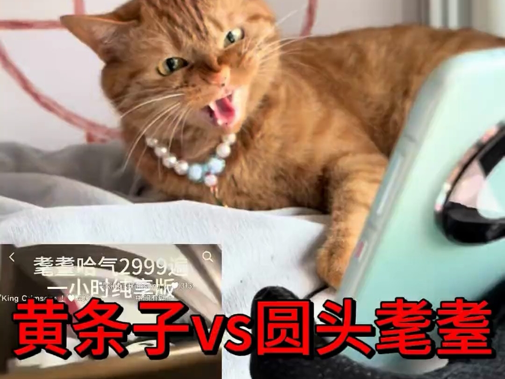 | 879 | 2026-06-29 |
| [おはなばたけ (哈基米の小曲) 管乐总谱](https://www.bilibili.com/video/BV1Y3T562EJN) | 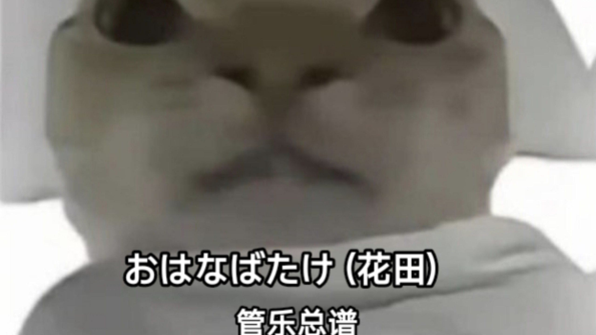 | 426 | 2026-06-29 |
| [嘬最喜欢的玩具之一箱子！](https://www.bilibili.com/video/BV1fnTL6bEHz) | 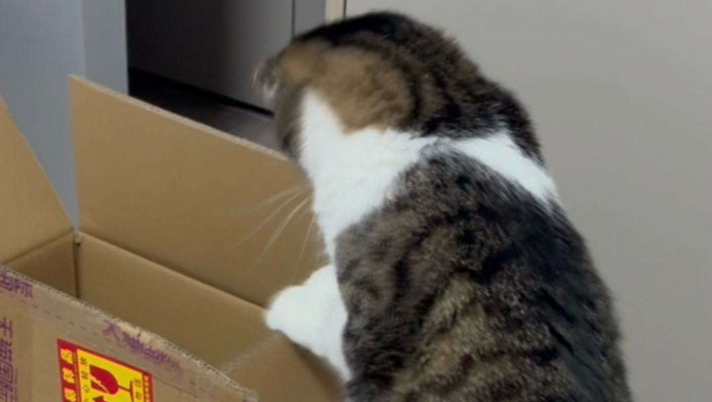 | 3.6万 | 2026-06-29 |
| [哈基楼梯口吟唱遭投诉 赶回来锁门](https://www.bilibili.com/video/BV1eyTG6jEWk) | 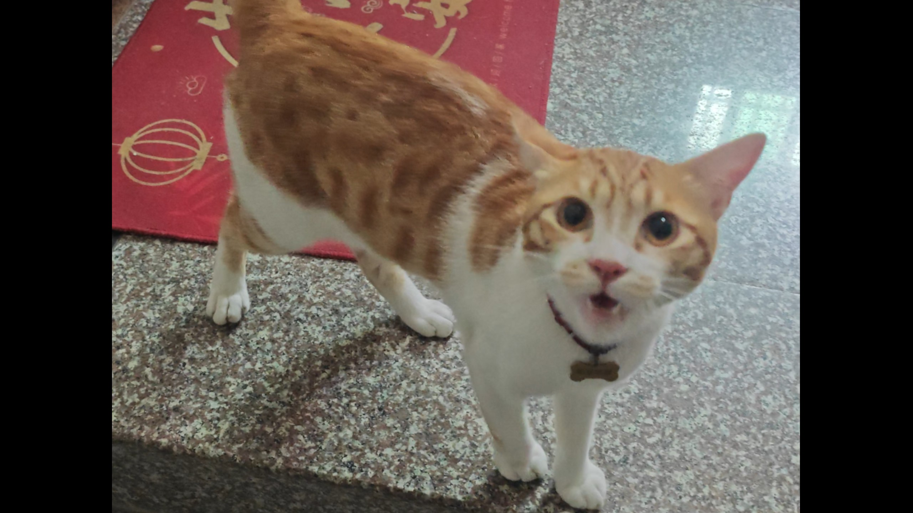 | 1.8万 | 2026-06-29 |
| [[转载]gutgenug大狗叫 [原作：查理比利含]](https://www.bilibili.com/video/BV1VpT36kEmW) |  | 1795 | 2026-06-28 |
| [林思琪欢迎哈基米欢迎歌神](https://www.bilibili.com/video/BV1RsT36gENq) |  | 2615 | 2026-06-28 |
| [哈基米怎么了。](https://www.bilibili.com/video/BV1BoT36EE8x) | 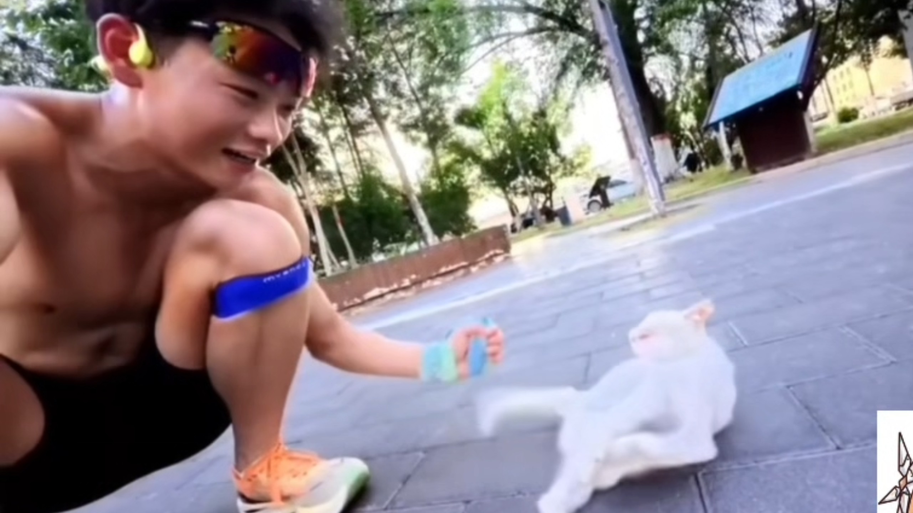 | 1070 | 2026-06-28 |
| [哈基米之蹦极](https://www.bilibili.com/video/BV1zRT36SEFE) |  | 971 | 2026-06-28 |
| [哈基米](https://www.bilibili.com/video/BV16DT36pEpS) | 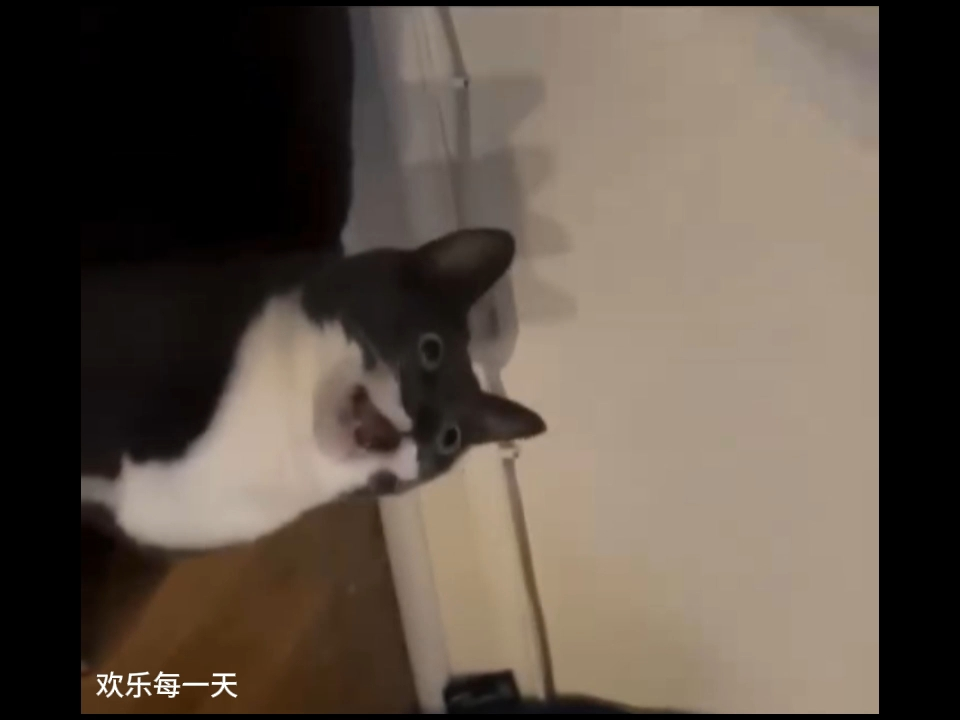 | 81 | 2026-06-28 |
| [哈基米TV 爱猫TV](https://www.bilibili.com/video/BV16QT36QEvy) | 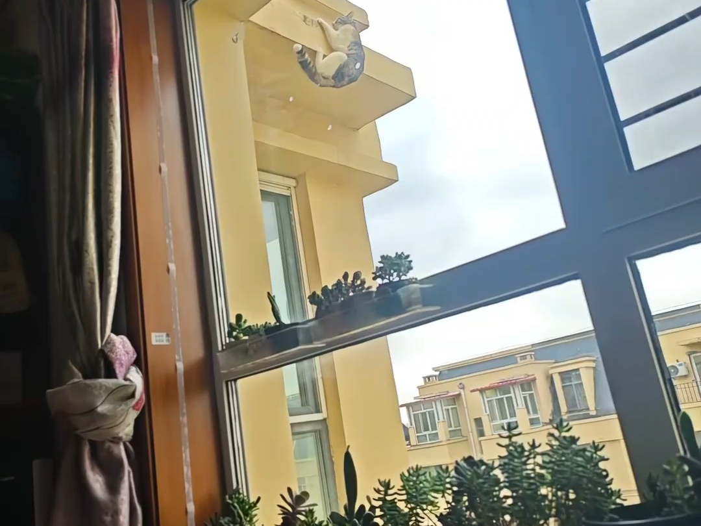 | 461 | 2026-06-28 |
| [小作坊下猛料228](https://www.bilibili.com/video/BV1ssTG6FERv) |  | 18.2万 | 2026-06-28 |
| [【哈基米音乐】哈基十字安眠曲 (原神 水仙十字安眠曲)](https://www.bilibili.com/video/BV1mLTG6KEyT) |  | 4.4万 | 2026-06-28 |
| [哈基米](https://www.bilibili.com/video/BV1XHTu6eEbc) | 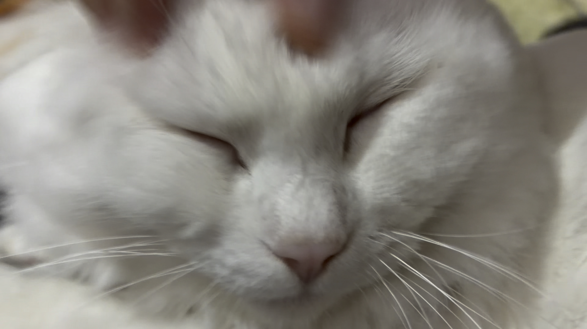 | 30 | 2026-06-28 |
| [小懒猫，哇哇叫，吃饱就爱睡大觉！](https://www.bilibili.com/video/BV1fXTu6VEPM) | 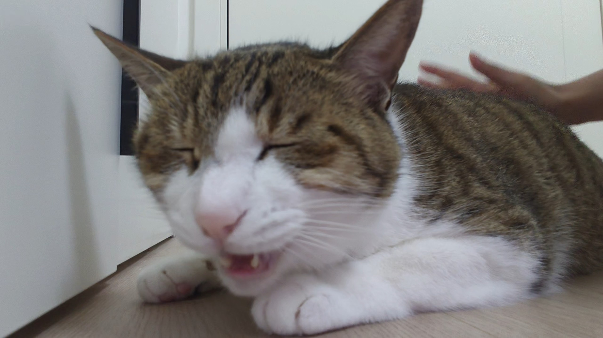 | 3.4万 | 2026-06-28 |
| [Low Cortisol 哈基米 in ADOFAI](https://www.bilibili.com/video/BV1CBTu6XEUH) |  | 548 | 2026-06-28 |
| [大橘哥166-刷鼻头](https://www.bilibili.com/video/BV1zmTu62E9V) | 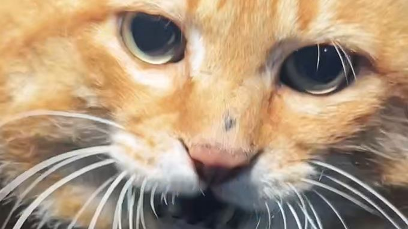 | 5.6万 | 2026-06-28 |
| [丑橘小耄拯救手柄计划](https://www.bilibili.com/video/BV1mLTg6tECz) |  | 6318 | 2026-06-28 |
| [首届《哈基米歌王争霸赛》总决赛](https://www.bilibili.com/video/BV1EeTg6LEaK) |  | 99.9万 | 2026-06-28 |
| [哈基咪](https://www.bilibili.com/video/BV1CqTT61EtG) | 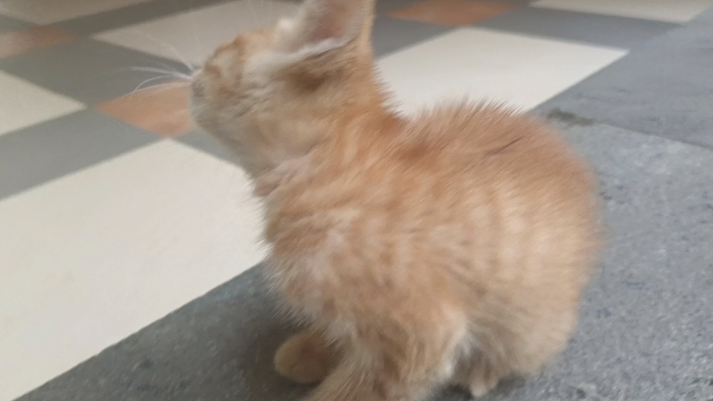 | 2571 | 2026-06-28 |
| [啊啊啊](https://www.bilibili.com/video/BV1nWTM65E5u) | 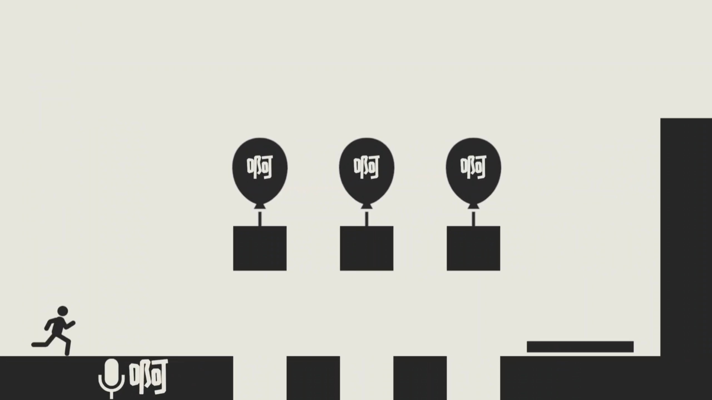 | 198.6万 | 2026-06-28 |
| [白子流浪记5](https://www.bilibili.com/video/BV1KdTM6pEu6) |  | 1.7万 | 2026-06-28 |
| [【哈基米音乐】Sinos De Natal（圣诞铃音）（speed up）鼠鼠累了，找张椅子休息一下](https://www.bilibili.com/video/BV1nJTK6uEan) |  | 300 | 2026-06-28 |
| [基米被基母强制抱走和老吴分开](https://www.bilibili.com/video/BV1GzTK6xEEC) | 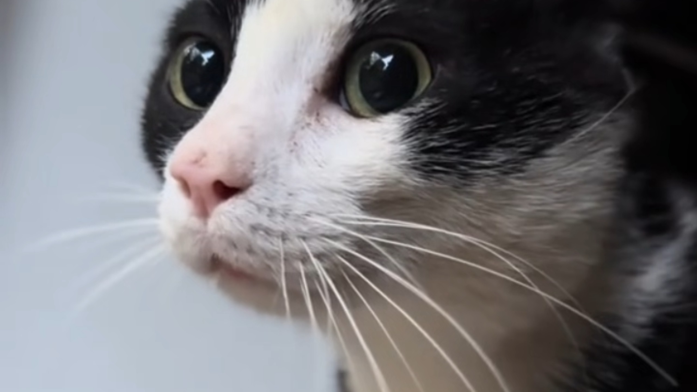 | 2.2万 | 2026-06-28 |
| [哈基米这个喜欢游泳](https://www.bilibili.com/video/BV15eTK6fEbT) |  | 1285 | 2026-06-28 |
| [给狗子穿弹簧鞋，狗子会有什么反应？](https://www.bilibili.com/video/BV1SLTA65EPH) | 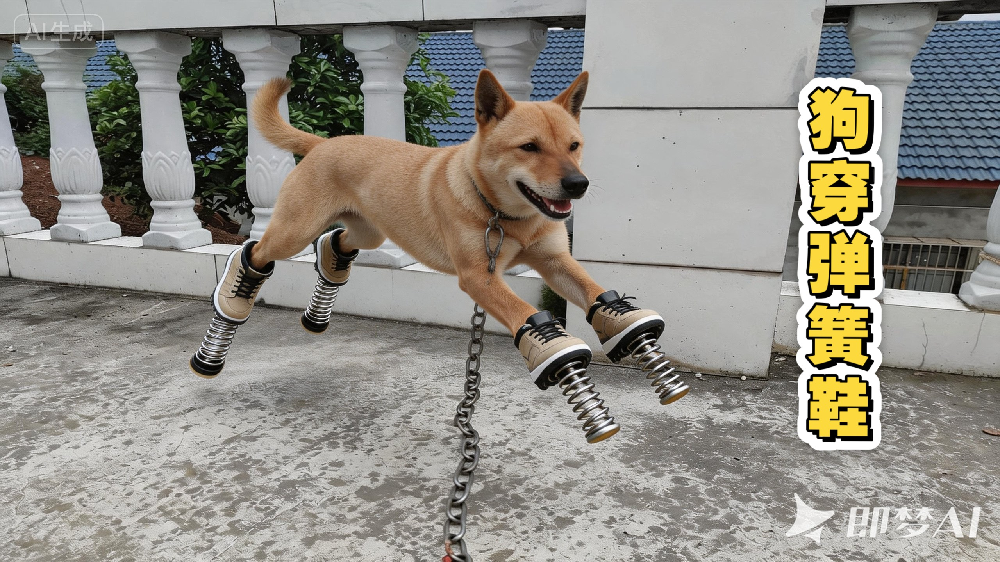 | 88.8万 | 2026-06-28 |
| [BRO睾酮打到少女乐队了🎸🎸🎸](https://www.bilibili.com/video/BV1BxTK6NEr3) |  | 28.0万 | 2026-06-28 |
| [哈基米之打地“鼠”游戏机](https://www.bilibili.com/video/BV1LYTK68EEx) | 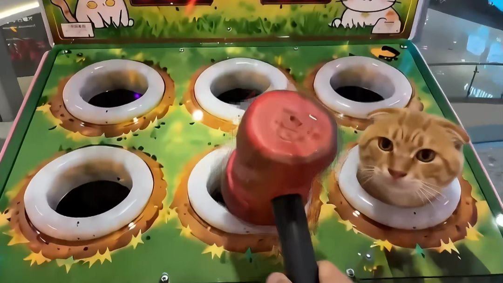 | 2459 | 2026-06-28 |
| [哈基米南北绿豆](https://www.bilibili.com/video/BV1FwTT66E8k) | 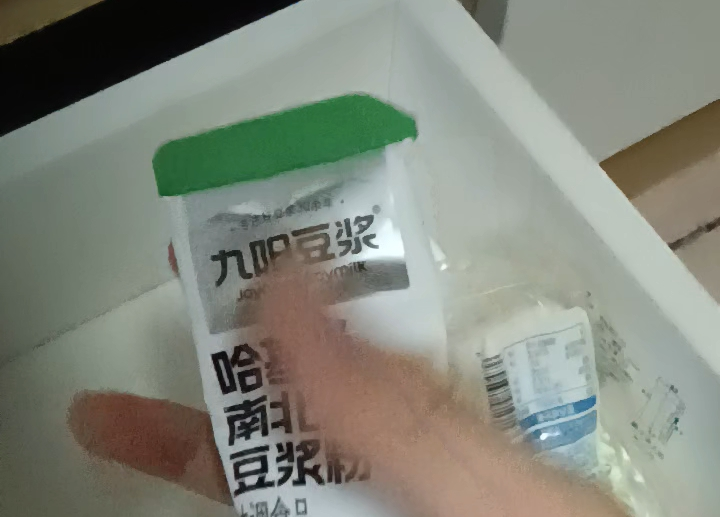 | 155 | 2026-06-28 |
| [哈基米](https://www.bilibili.com/video/BV1WdTK6yEmj) |  | 83 | 2026-06-28 |
| [哈基米这个偷吃外卖](https://www.bilibili.com/video/BV1wZTK6VE4X) | 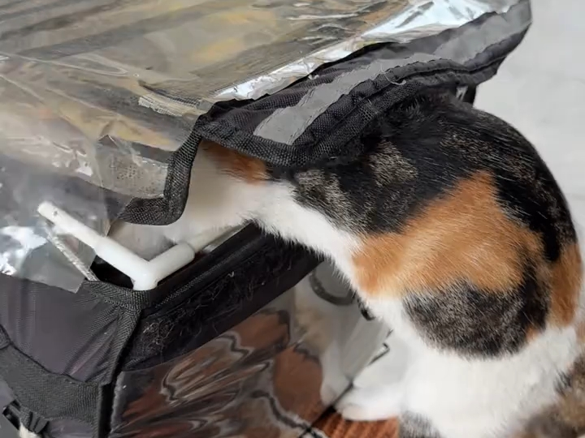 | 9905 | 2026-06-28 |
| [沉浸式听嘬哼哼唧唧！](https://www.bilibili.com/video/BV1UWTT6sEd2) | 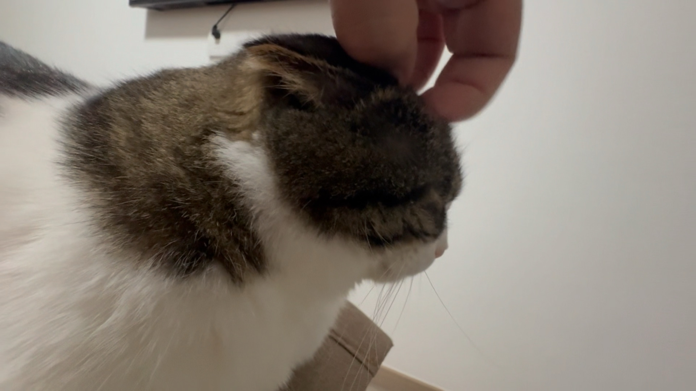 | 3.6万 | 2026-06-28 |
| [女子找潘宏鉴狗，当看清狗子长相那一刻，把网友的肚子都笑痛了！](https://www.bilibili.com/video/BV1DnTT64E9r) |  | 28.7万 | 2026-06-28 |
| [看完能绷住的可以确诊抑郁症了](https://www.bilibili.com/video/BV1TkTP61EYS) | 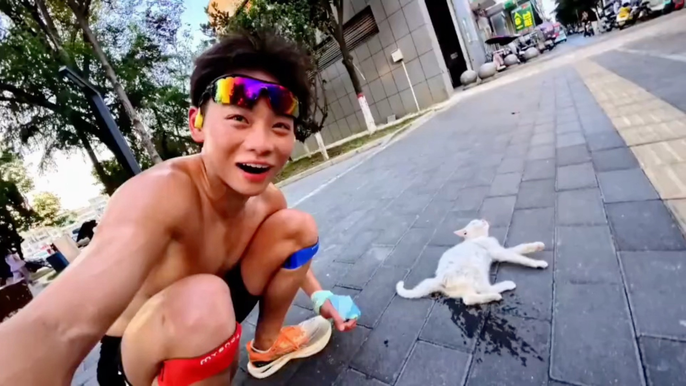 | 6.9万 | 2026-06-28 |
| [可爱哈基米](https://www.bilibili.com/video/BV1hBTP6EEYo) | 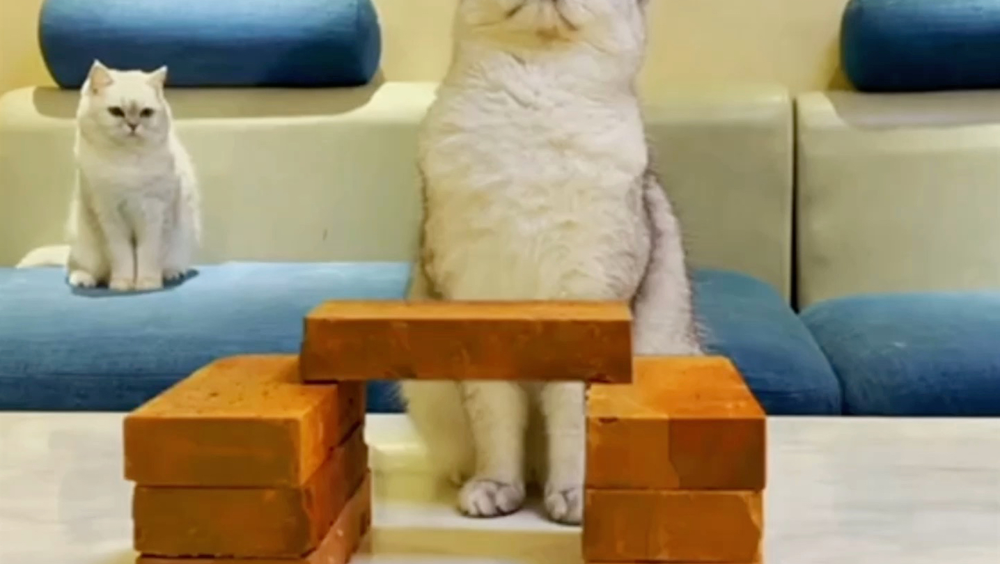 | 849 | 2026-06-28 |
| [【闪闪星】看自由魂看丝茉茉看龟教三只哈基米，闪闪星：所以三只哈基米在哪？](https://www.bilibili.com/video/BV1ZxTP64ENi) |  | 6226 | 2026-06-28 |
| [【🐱基米🐱】听基米的话](https://www.bilibili.com/video/BV1ikTA6dEDx) |  | 1.2万 | 2026-06-28 |
| [救上一只落水的哈基米，结尾有惊喜](https://www.bilibili.com/video/BV1unTN6SEku) | 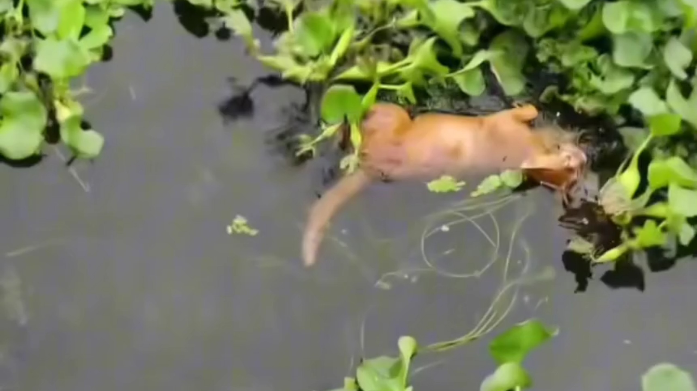 | 6230 | 2026-06-27 |
| [这位猫咪，请你自重！](https://www.bilibili.com/video/BV1sx7H62E71) |  | 162.1万 | 2026-06-27 |
| [爱猫TV 05](https://www.bilibili.com/video/BV11P7p6SEpu) | 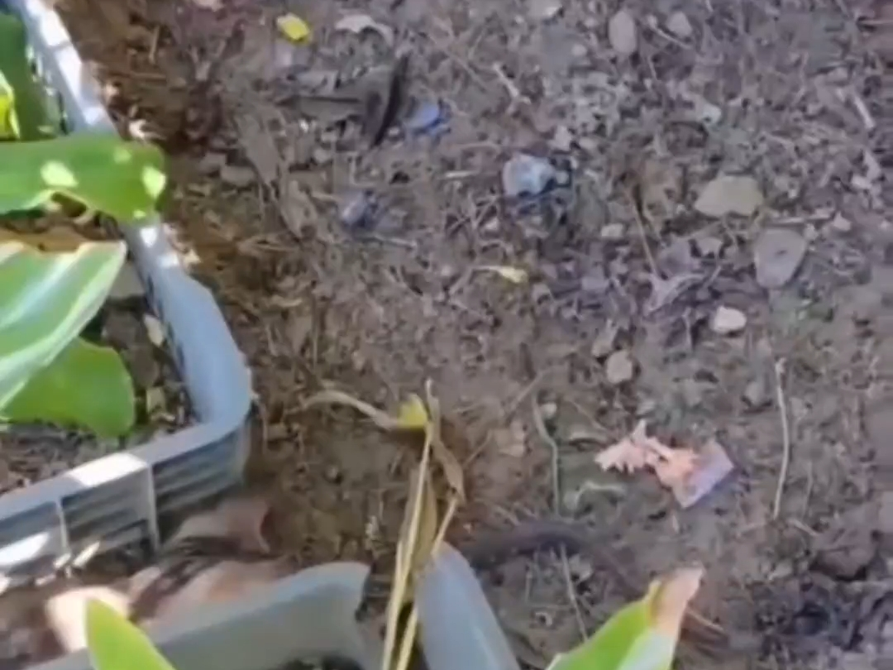 | 1610 | 2026-06-27 |
| [保证只对你坏](https://www.bilibili.com/video/BV1MZ7H6REFP) |  | 1.1万 | 2026-06-27 |
| [干嘛猫的vlog（喵星，天国特别篇）](https://www.bilibili.com/video/BV1cu7n6zEEH) | 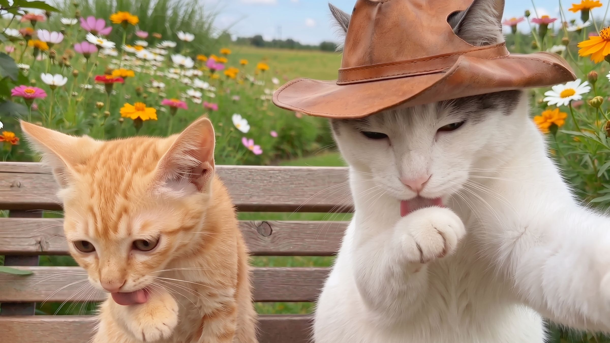 | 30.0万 | 2026-06-27 |
| [小猫爱吓人](https://www.bilibili.com/video/BV1is7p6KE4h) | 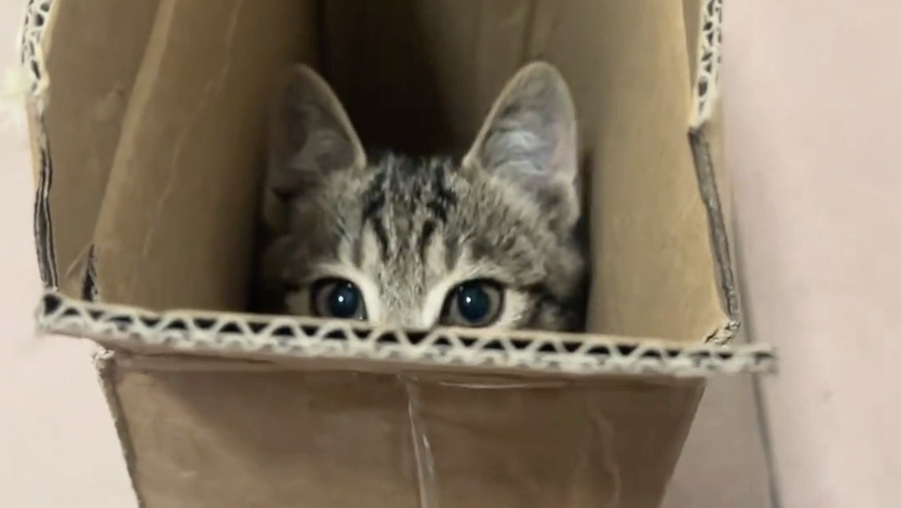 | 5.9万 | 2026-06-27 |
| [循环歌单｜《高清时代の小曲》《4K表情包の小曲》Cryon](https://www.bilibili.com/video/BV1s17p6QE2b) |  | 23.7万 | 2026-06-27 |
| [真是如听仙乐耳暂明啊！](https://www.bilibili.com/video/BV1467n67EvG) |  | 53.6万 | 2026-06-27 |
| [【哈气TV】洛杉矶里落汤鸡](https://www.bilibili.com/video/BV1Yu7H6tE3y) | 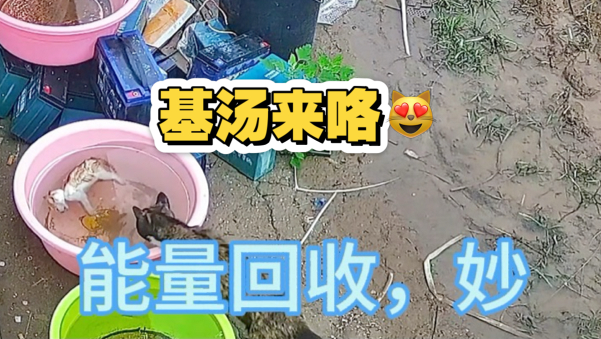 | 9069 | 2026-06-27 |
| [《我 真 的 很 臭 嘛》](https://www.bilibili.com/video/BV1Dq7V6KETD) | 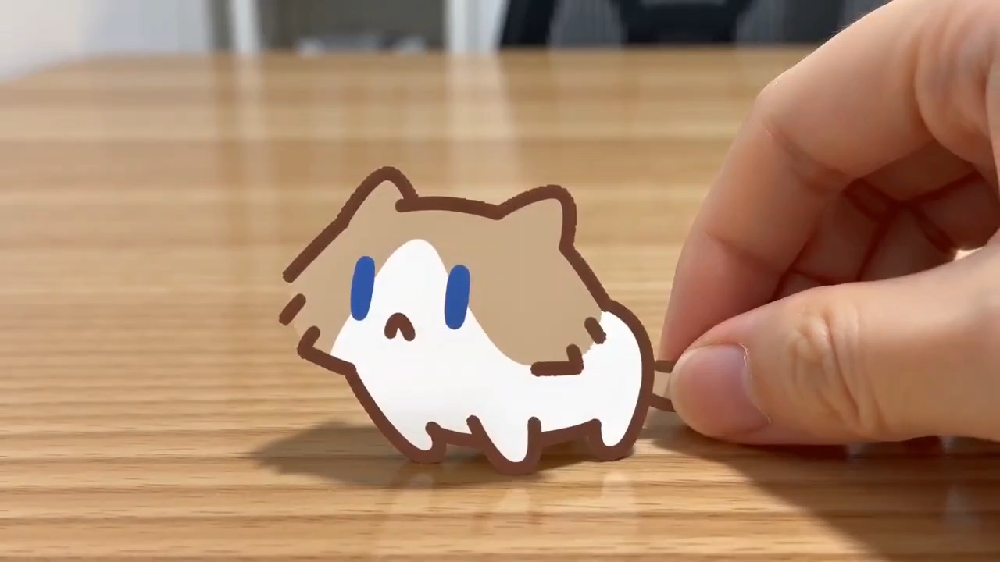 | 31.2万 | 2026-06-26 |
| [大 狗 ！](https://www.bilibili.com/video/BV1Zs7V65Ejv) |  | 3.7万 | 2026-06-26 |
| [巴巴强强](https://www.bilibili.com/video/BV1Ur7V6YEYy) |  | 141.2万 | 2026-06-26 |
| [捣蛋鬼别导弹](https://www.bilibili.com/video/BV15m7G66EpC) |  | 174.2万 | 2026-06-26 |
| [《白菜魔丸》1-41](https://www.bilibili.com/video/BV1Jk756QE6e) | 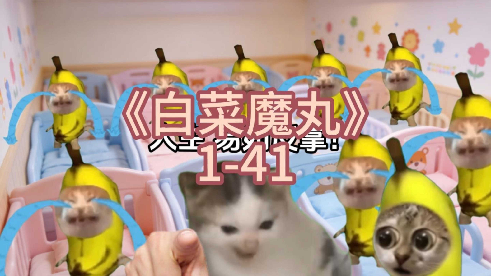 | 4.9万 | 2026-06-26 |
| [⚡高市早苗摇一摇⚡](https://www.bilibili.com/video/BV1rz7569Emo) |  | 294.7万 | 2026-06-26 |
| [【叮咚鸡】🐔大狗花蜜 🐶манго нектар](https://www.bilibili.com/video/BV1CD736UEF7) | 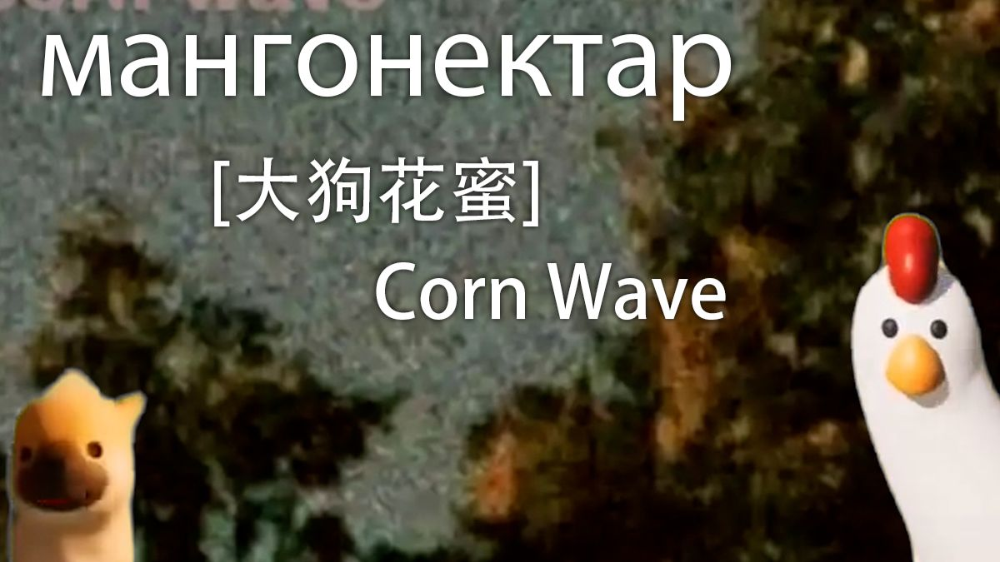 | 4.6万 | 2026-06-26 |
| [我有一个不太体面的躲法！](https://www.bilibili.com/video/BV1dM7q6VEQB) | 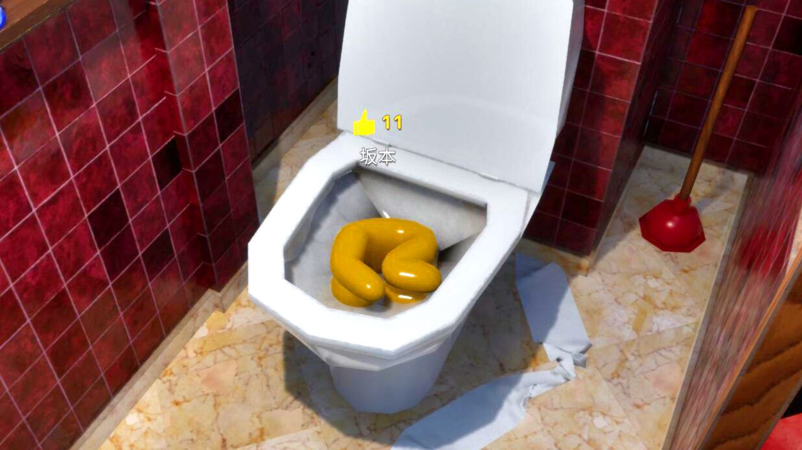 | 69.3万 | 2026-06-26 |
| [哈基米南北绿豆](https://www.bilibili.com/video/BV1q27q67EQq) |  | 201 | 2026-06-26 |
| [基真的特别爱你](https://www.bilibili.com/video/BV1T67e6REKF) | 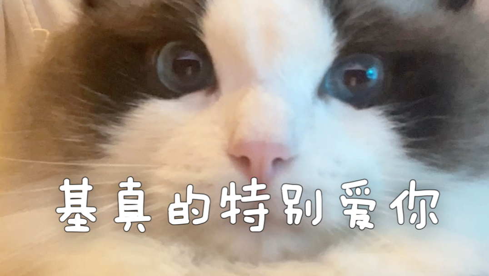 | 182 | 2026-06-25 |
| [哈基米小曲](https://www.bilibili.com/video/BV1zo7a6KE8G) | 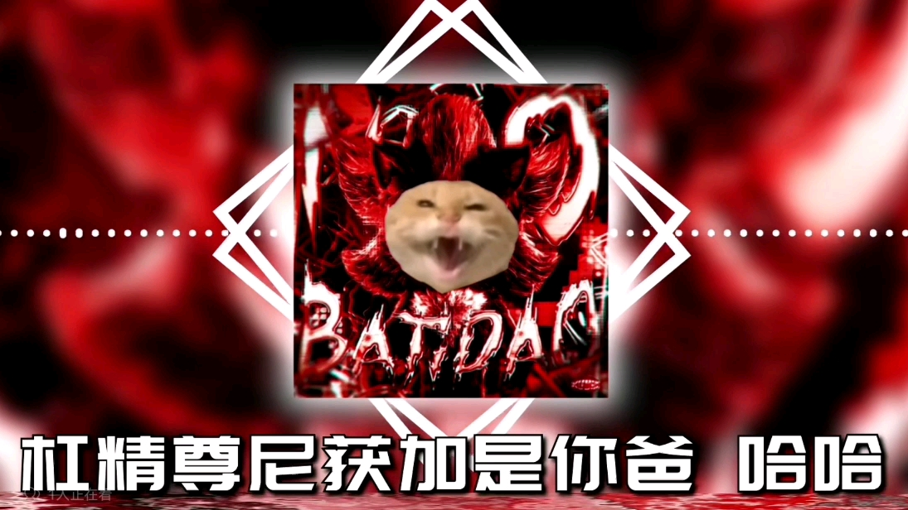 | 91 | 2026-06-25 |
| [今天体验的人生副本是：极度性压抑的女大学生](https://www.bilibili.com/video/BV1e17Y6aEc7) | 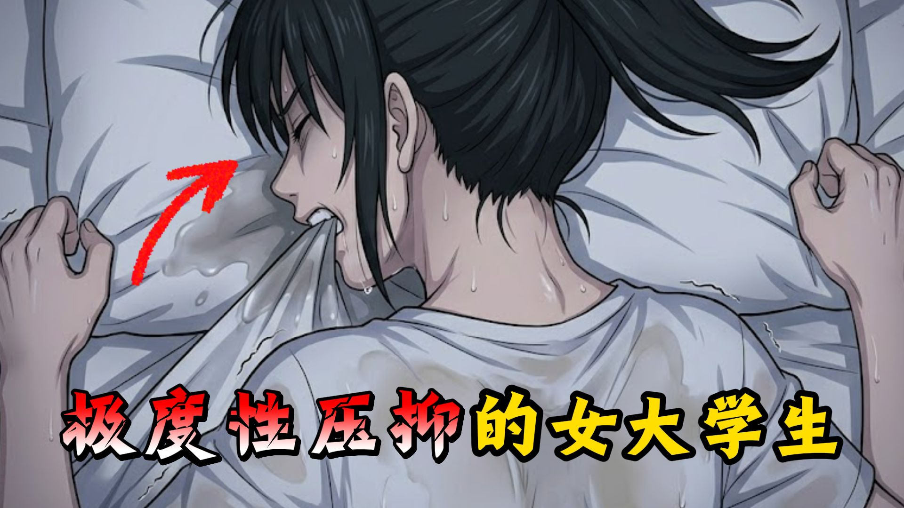 | 35.4万 | 2026-06-25 |
| [小猫能有什么坏心思呢。#柒柒游电竞](https://www.bilibili.com/video/BV1BR786fEFg) |  | 17.9万 | 2026-06-25 |
| [学唱~哈基米起床~](https://www.bilibili.com/video/BV1Ay786iEv1) |  | 248 | 2026-06-25 |
| [“猫咪：这辈子没这么无语过”](https://www.bilibili.com/video/BV11jjo61E8T) | 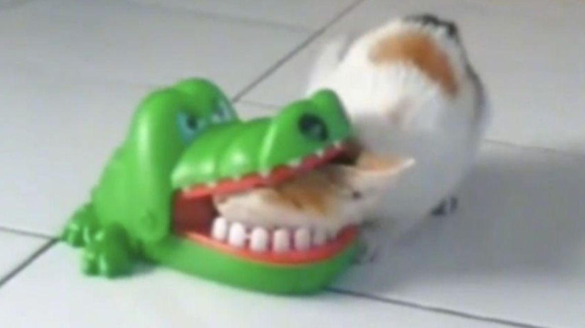 | 6.0万 | 2026-06-24 |
| [一首听不懂的德语神人音乐 GUT GENUG](https://www.bilibili.com/video/BV196jo6FEjn) |  | 22.0万 | 2026-06-24 |
| [我把幸运大转盘做成了游戏！bug概率倍儿高！](https://www.bilibili.com/video/BV1sFjd6zEAb) | 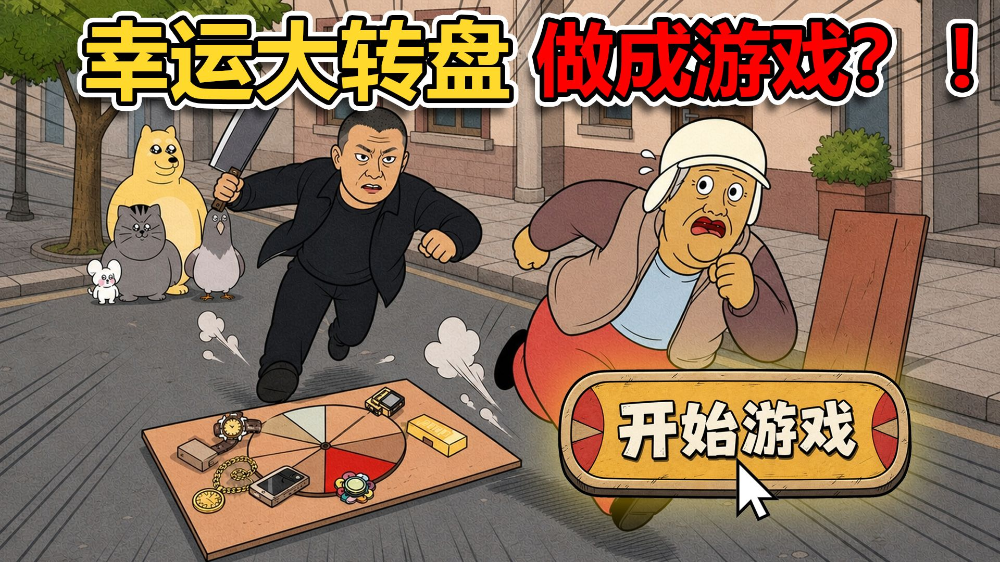 | 49.2万 | 2026-06-24 |
| [和好朋友们在水上乐园狂欢的一天](https://www.bilibili.com/video/BV1eEjd6xEMy) |  | 20.3万 | 2026-06-24 |
| [小时候究竟错过了多少！？盘点街机游戏那些福利名场面！](https://www.bilibili.com/video/BV1DBjD6TEWj) |  | 42.5万 | 2026-06-23 |
| [大型纪录片《杯好茶摇一摇抽象二创》持续为您播出！](https://www.bilibili.com/video/BV1B3j26uE7X) |  | 9.9万 | 2026-06-23 |
| [MV超级哈基咪](https://www.bilibili.com/video/BV1g67P6VEmE) | 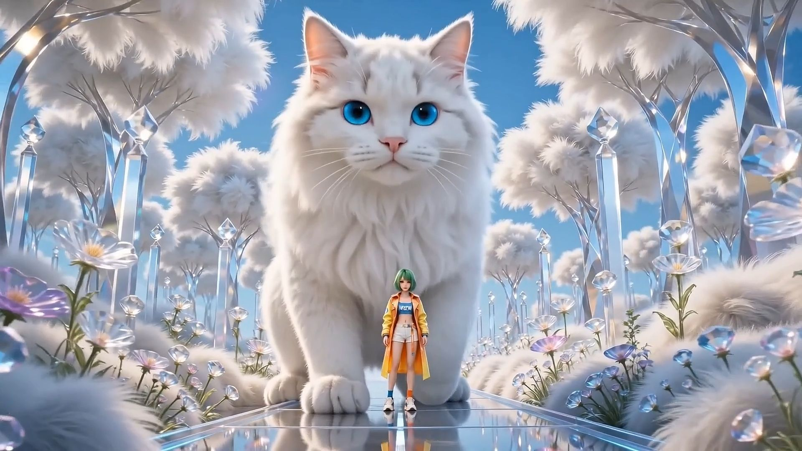 | 7 | 2026-06-22 |
| [中奖概率倍儿高（原版）](https://www.bilibili.com/video/BV1N1jx64E6N) |  | 3.5万 | 2026-06-21 |
| [【锐评】现在最火的歌都是什么鬼？测评2026第二季度热歌榜top10！](https://www.bilibili.com/video/BV17NjJ6bERo) |  | 33.9万 | 2026-06-21 |
| [《关注塔菲喵》原唱：永雏塔菲](https://www.bilibili.com/video/BV1SKjp6sEFH) |  | 86.1万 | 2026-06-20 |
| [“盘点近期全网爆火的梗小曲!..”](https://www.bilibili.com/video/BV1xGjn6CEg4) |  | 124.0万 | 2026-06-20 |
| [【永雏塔菲】看到有片直接用了塔菲唱的音源，有种无力感](https://www.bilibili.com/video/BV1XQj76EEFg) |  | 12.6万 | 2026-06-20 |
| [【完整版】躲在超市后门嚼大果的两人♿](https://www.bilibili.com/video/BV17BjB6UETP) | 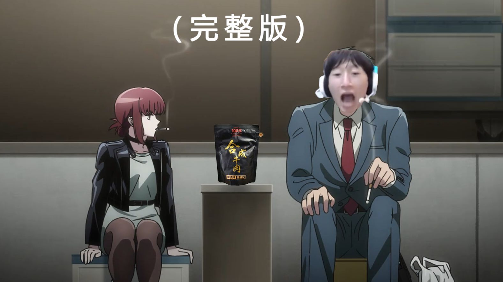 | 66.3万 | 2026-06-19 |
| [来杯好茶爻一爻2000小时纯享版](https://www.bilibili.com/video/BV1x7Jp6ZEy7) |  | 12.9万 | 2026-06-18 |
| [【循环歌单】｜【FUNK NA MIRA】｜【柳宗元の小曲】&quot;赏金猎人已就绪。&quot;【紧绷の小曲】](https://www.bilibili.com/video/BV1TjjL6vEiM) |  | 2.9万 | 2026-06-16 |
| [QQ 弹弹的大腿](https://www.bilibili.com/video/BV1xGj36QEZU) |  | 7.2万 | 2026-06-16 |
| [小猫咪想要一个鸡腿？](https://www.bilibili.com/video/BV1vMjM6oEvL) |  | 4.3万 | 2026-06-16 |
| [“张桂梅校长 我还记得你”｜谨在毕业季，向张桂梅老师致敬｜《念张师》](https://www.bilibili.com/video/BV1tEjP6eE44) |  | 18.4万 | 2026-06-15 |
| [哈基米生日快乐](https://www.bilibili.com/video/BV1dPJV61E8s) |  | 65 | 2026-06-15 |
| [小鸟欢乐的在树上叽叽喳喳.](https://www.bilibili.com/video/BV1GNJn6FECd) |  | 65.1万 | 2026-06-13 |
| [“手 搓 原 子 弹”](https://www.bilibili.com/video/BV1Uq7C6mEqz) | 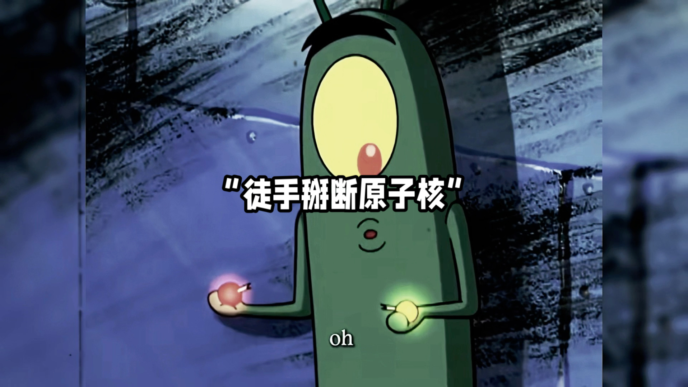 | 96.6万 | 2026-06-05 |
| [“第一个就没绷住”](https://www.bilibili.com/video/BV1ct796vEGk) |  | 54.3万 | 2026-06-03 |
| [“我已经和他做过了”](https://www.bilibili.com/video/BV19uVk6VEdS) |  | 69.6万 | 2026-06-02 |
| [拱火大师！](https://www.bilibili.com/video/BV1o5V56KEb7) | 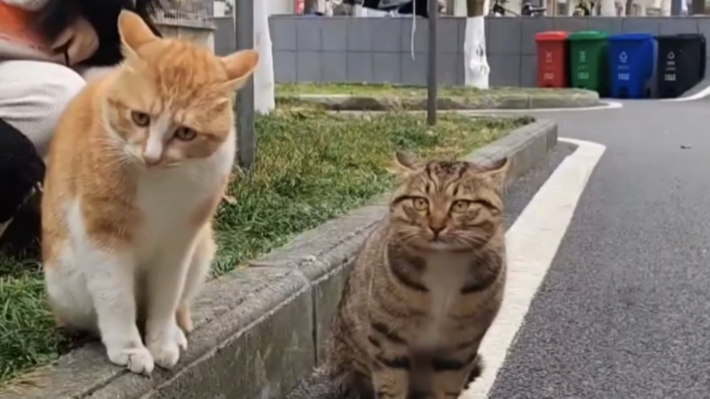 | 16.8万 | 2026-05-30 |
| [猫儿这个ai](https://www.bilibili.com/video/BV1EcVY6ZETs) |  | 13.3万 | 2026-05-29 |
| [被小猫咪迷倒的瓦瓦](https://www.bilibili.com/video/BV1rUGy6hEQV) |  | 15.2万 | 2026-05-27 |
| [带我的刀盾，比比拉布香蕉猫去钓鱼，居然被meowl抢，绝了...](https://www.bilibili.com/video/BV13ZG46aE9H) | 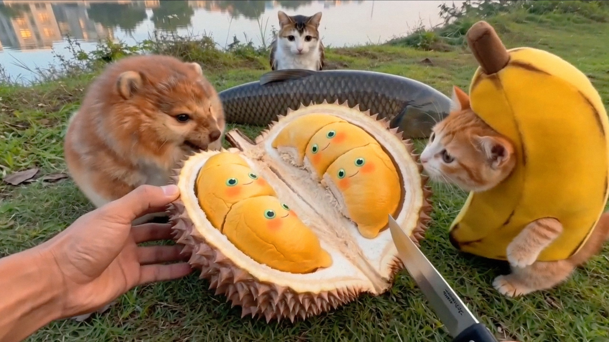 | 738.1万 | 2026-05-22 |
| [☝🤓当大课间の小曲遇上Funk…… 5.0](https://www.bilibili.com/video/BV1JeFWz7EsZ) | 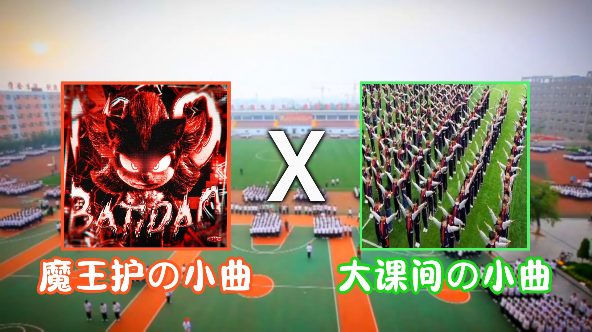 | 48.6万 | 2026-02-07 |
| [当我获得了修改剧情的能力](https://www.bilibili.com/video/BV1z2zsBvEu2) | 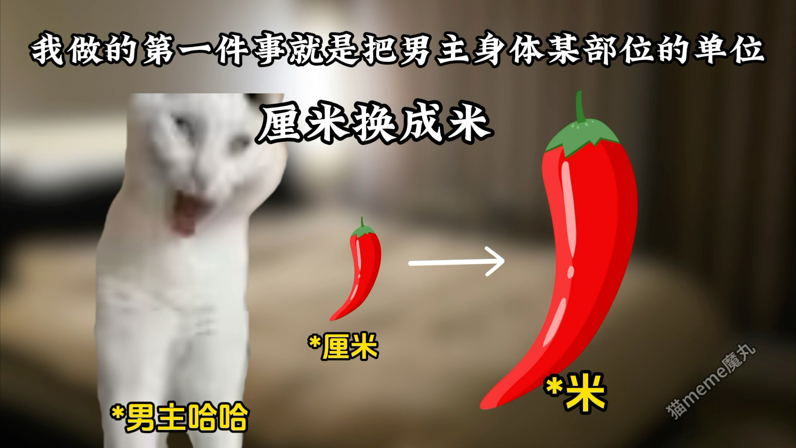 | 58.4万 | 2026-01-22 |
| [哈基米里程碑#哈基米#音乐#AI](https://www.bilibili.com/video/BV11SnszmEUC) | 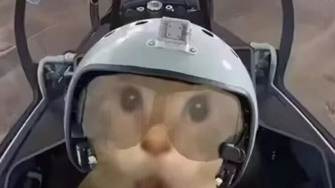 | 3.5万 | 2025-09-25 |
| [哈基米咏叹调：复仇的火焰在我心中燃烧｜夜•基米•后](https://www.bilibili.com/video/BV1dj7azkE5Y) |  | 22.0万 | 2025-06-03 |

---
*最后更新: 2026-06-30 03:21:59 (自动生成)*
*数据来源: [Bilibili](https://www.bilibili.com)*

## 使用说明

运行以下命令更新视频列表:
```bash
python3 fetch_hajimi_videos.py
```
