# awesome-hajimi
collections of hajimi (哈基米 in Chinese) on the Internet.

## 视频列表 (Video List)

| 视频标题 (Title) | 封面 | 播放量 (Views) | 发布日期 (Date) |
|---|---|---|---|
| [哈基米燃尽了](https://www.bilibili.com/video/BV1159NBdEP3) |  | 3 | 2026-04-03 |
| [哈基米南北绿豆大赛](https://www.bilibili.com/video/BV1hm9NBPEnX) | 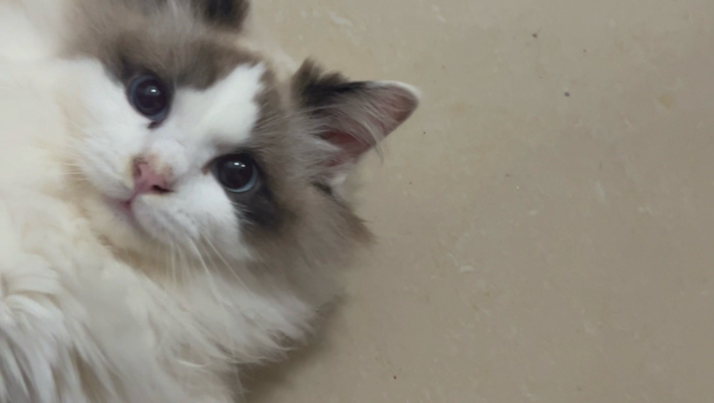 | 92 | 2026-04-03 |
| [古典哈基米：幻想基兴曲so](https://www.bilibili.com/video/BV11d9NBZEf9) |  | 2 | 2026-04-03 |
| [古典哈基米：拉赫玛尼诺夫-升c小调前奏曲Opso](https://www.bilibili.com/video/BV1xd9NBZE3U) |  | 0 | 2026-04-03 |
| [【新世界音乐】基米世界-植物大战僵尸2（Hi-Res）](https://www.bilibili.com/video/BV1Fq9FBiEto) |  | 950 | 2026-04-03 |
| [《根据真实故事改编》](https://www.bilibili.com/video/BV1VX9FBxES7) | 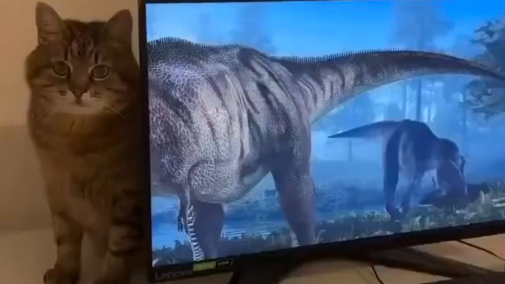 | 1.5万 | 2026-04-03 |
| [四只腿的哈基米很少见，两只腿的不多见](https://www.bilibili.com/video/BV1rJ9AByEFQ) | 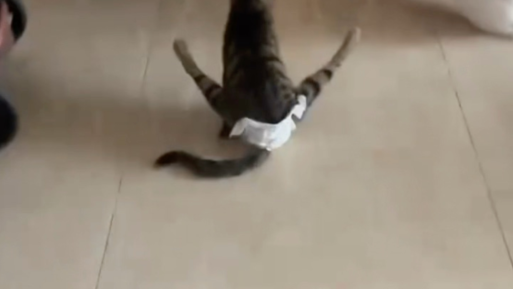 | 375 | 2026-04-02 |
| [三十度胶化的哈基米](https://www.bilibili.com/video/BV1pr9PBJE52) |  | 116 | 2026-04-02 |
| [【哈基米爱南北绿豆】更新啦，赶紧来围观吧！](https://www.bilibili.com/video/BV1bC9cBnEzv) | 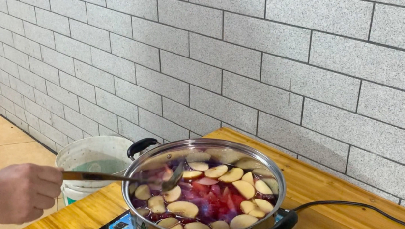 | 5 | 2026-04-02 |
| [哈基米入侵](https://www.bilibili.com/video/BV1dt9cBhELk) |  | 127 | 2026-04-02 |
| [哈基米入侵超燃！偷偷更新五张搞笑新卡](https://www.bilibili.com/video/BV1Nb9wBSEVw) |  | 7112 | 2026-04-02 |
| [崂山，一座全是哈基米和野猴哥的山](https://www.bilibili.com/video/BV13J9wBdEjZ) | 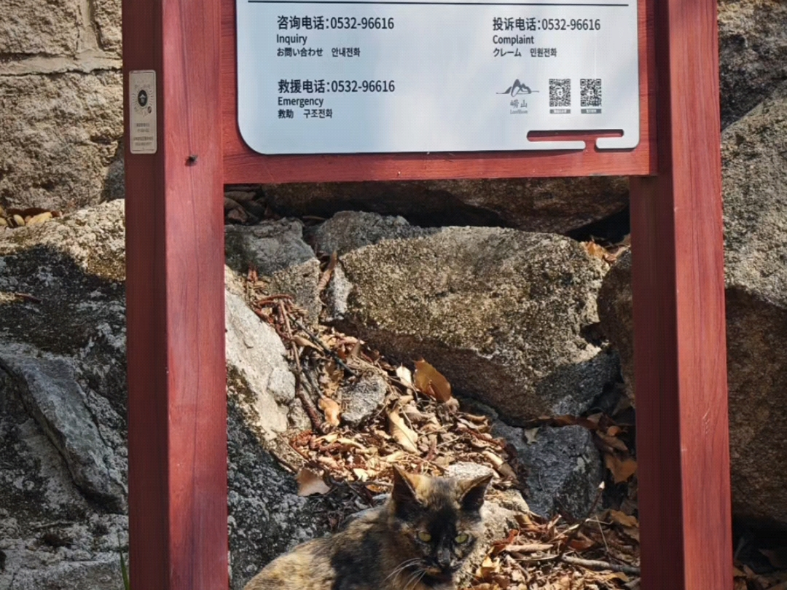 | 16 | 2026-04-02 |
| [哈基米搬家](https://www.bilibili.com/video/BV1Ms9wBpELf) |  | 75 | 2026-04-02 |
| [香港TVB明珠台半夜播哈基米蹦蹦跳跳4小时，不再是LED壁炉了（慢电视）](https://www.bilibili.com/video/BV1Xo9wB8EiC) | 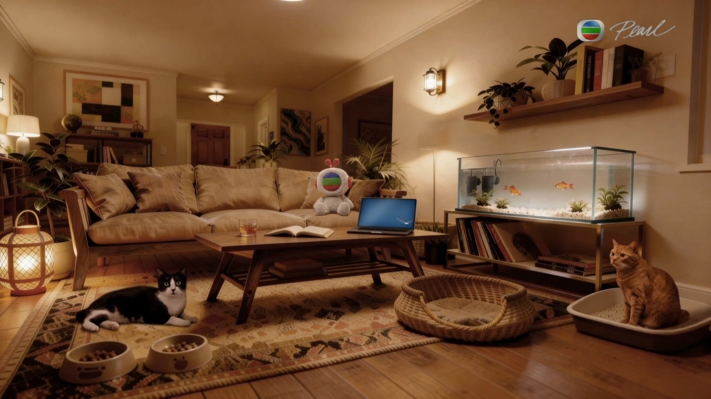 | 4882 | 2026-04-02 |
| [哈基米为我演奏安眠曲](https://www.bilibili.com/video/BV1Xd9wBcEUe) | 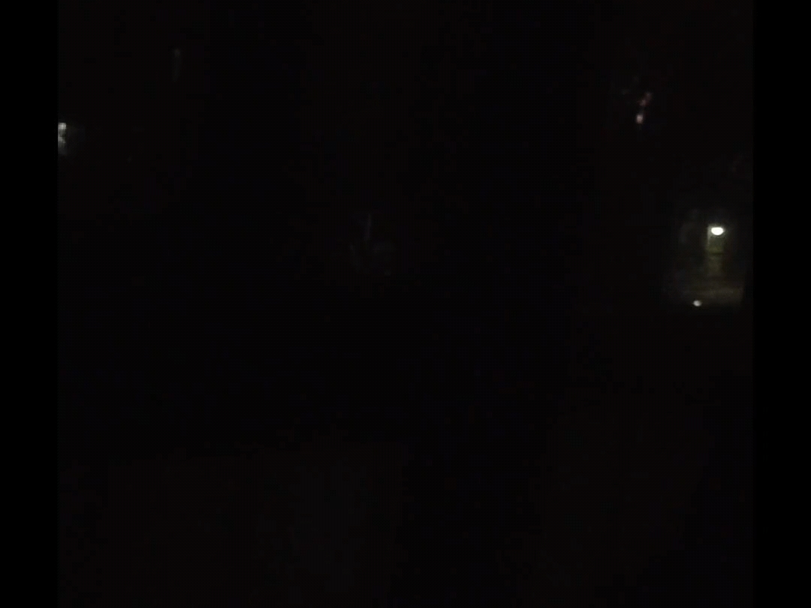 | 49 | 2026-04-02 |
| [大学生宿舍哈基米曼波小狗](https://www.bilibili.com/video/BV1Fr9wBrE2G) | 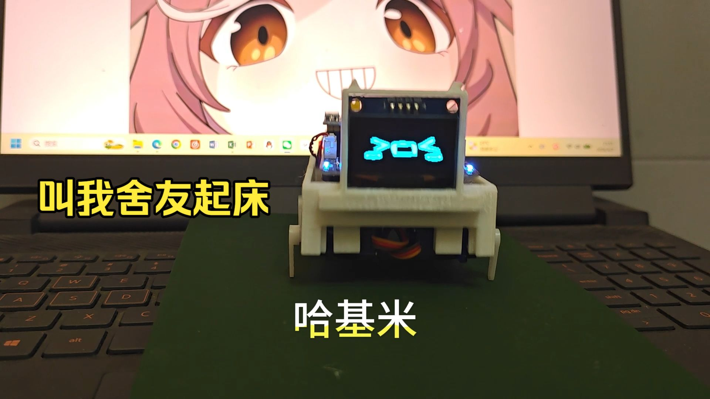 | 810 | 2026-04-02 |
| [《清明哈基图》哈基米纯享版](https://www.bilibili.com/video/BV1vK9FBoExu) | 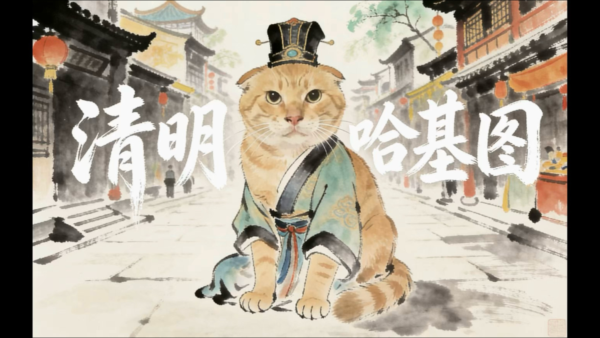 | 24 | 2026-04-02 |
| [哈基米享受帝王待遇](https://www.bilibili.com/video/BV1EC9wBgEZ7) | 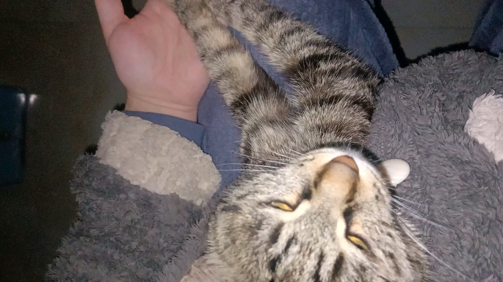 | 227 | 2026-04-02 |
| [可爱的小基米连续哈气终究还是被驯服](https://www.bilibili.com/video/BV1Zm9wBiE2n) | 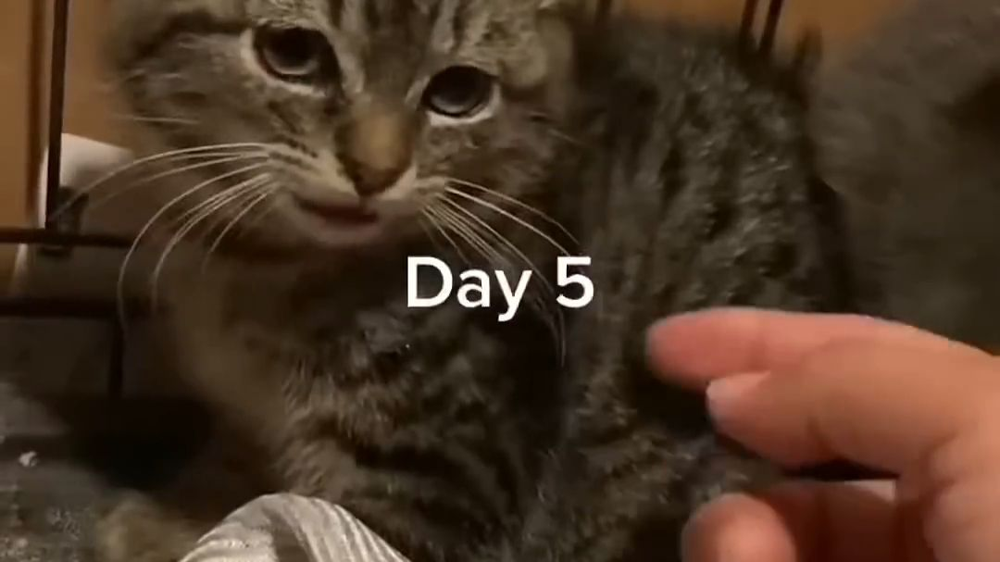 | 230 | 2026-04-02 |
| [距离离职还有6天，今天转白班下班遇到哈基米。喂下](https://www.bilibili.com/video/BV1vK9FBoEY5) | 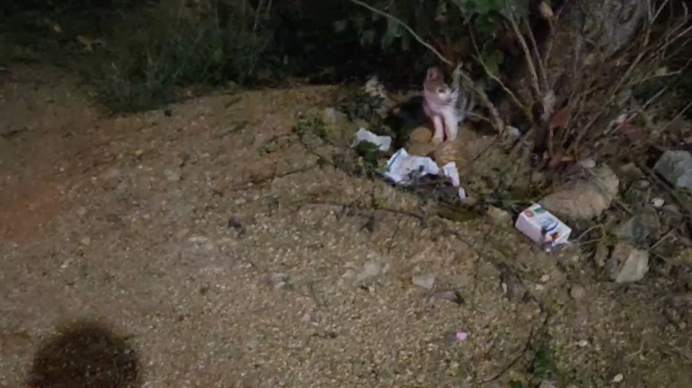 | 97 | 2026-04-02 |
| [🐱看不懂这基波题...🐱](https://www.bilibili.com/video/BV15K9FBoEqm) |  | 2504 | 2026-04-02 |
| [哈基米教室](https://www.bilibili.com/video/BV1kXXfBiE5o) | 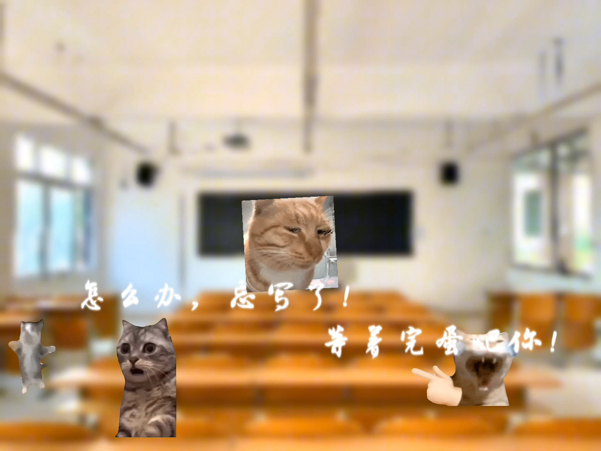 | 13 | 2026-04-02 |
| [哈基米这个做极限运动](https://www.bilibili.com/video/BV1pQXfBTEwK) | 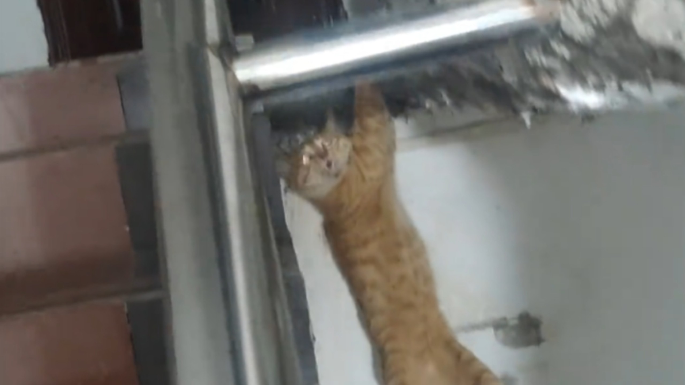 | 2.0万 | 2026-04-02 |
| [哈基米哦南北绿豆。一直在赌这个猫咪不会抓我](https://www.bilibili.com/video/BV1Jc9FBcEAv) | 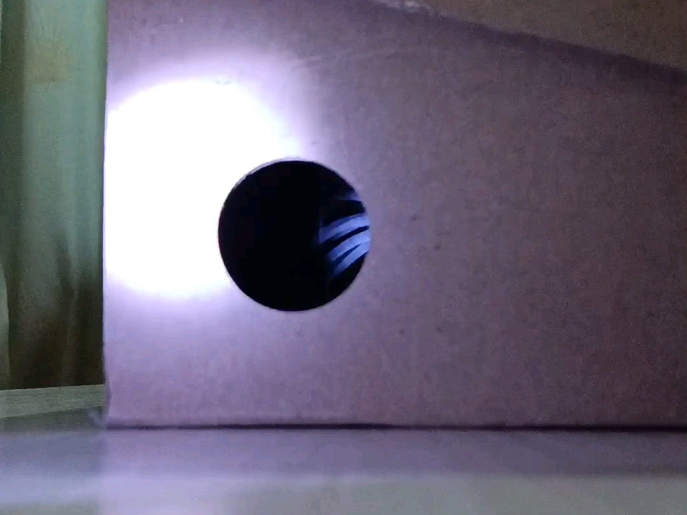 | 22 | 2026-04-02 |
| [潮汐-哈基米](https://www.bilibili.com/video/BV1zdXfBeEZN) | 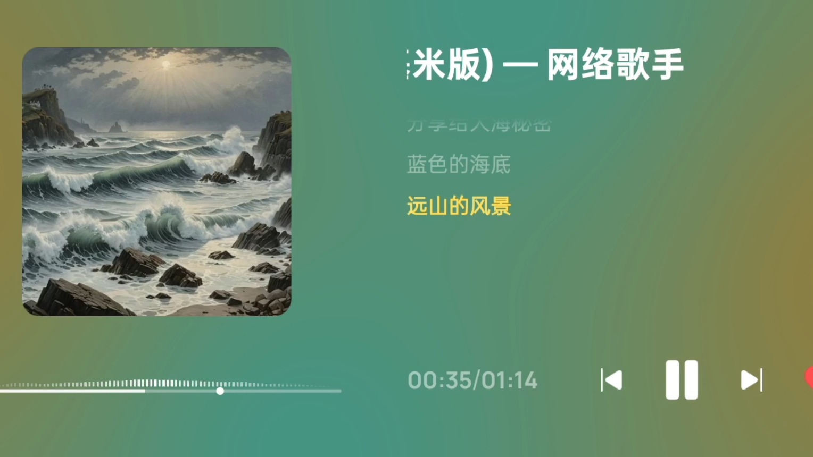 | 6 | 2026-04-02 |
| [豆包生成的哈基米](https://www.bilibili.com/video/BV1ph9FB6EXx) | 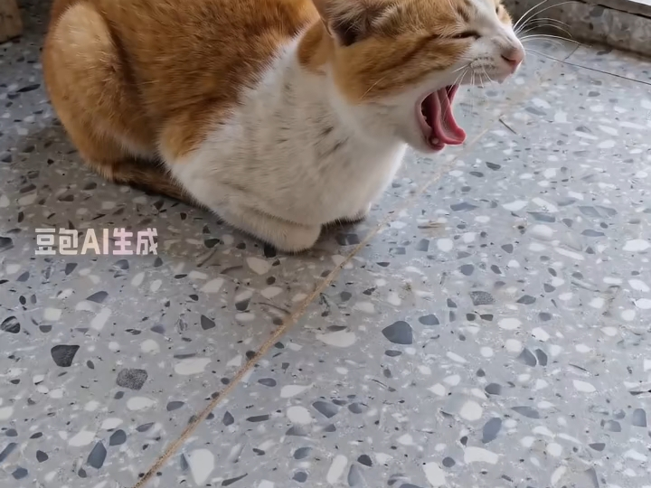 | 52 | 2026-04-02 |
| [【3月】中国在海外十大最火的相关内容（事件）&amp;ep.1](https://www.bilibili.com/video/BV1He9FBBEvt) |  | 14.1万 | 2026-04-02 |
| [今天早上请哈基米吃了一根玉米肠](https://www.bilibili.com/video/BV16q9FBiER7) | 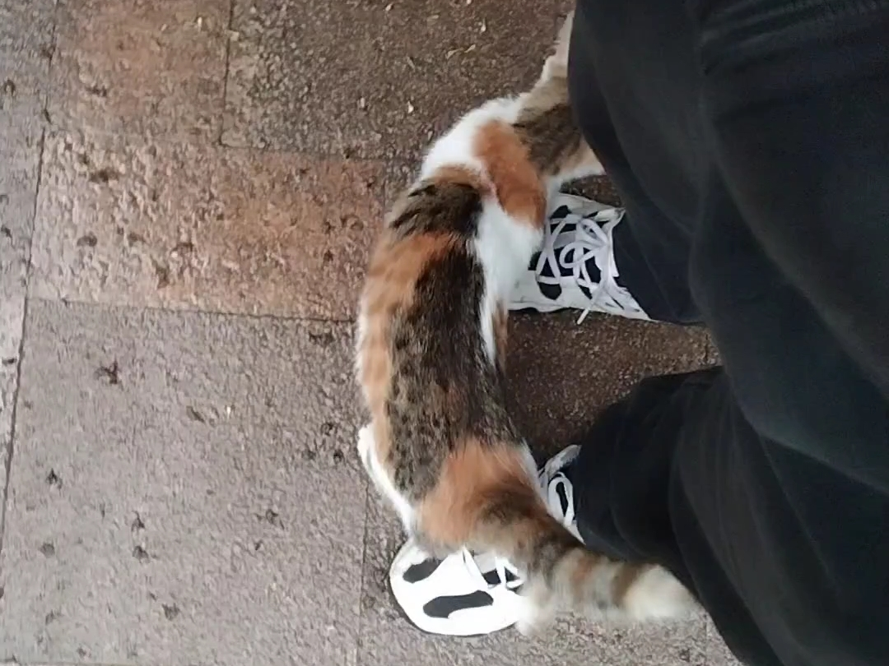 | 32 | 2026-04-02 |
| [耄耋表情复刻3【哈基动物园251期】](https://www.bilibili.com/video/BV1Ae9FBBEN6) |  | 3999 | 2026-04-02 |
| [哈基米](https://www.bilibili.com/video/BV1Y59FBHEKG) |  | 0 | 2026-04-02 |
| [冷门卡组哈基米](https://www.bilibili.com/video/BV13L9FBDEpu) |  | 102 | 2026-04-02 |
| [哈基米   Baby](https://www.bilibili.com/video/BV1XD9FBdE3u) | 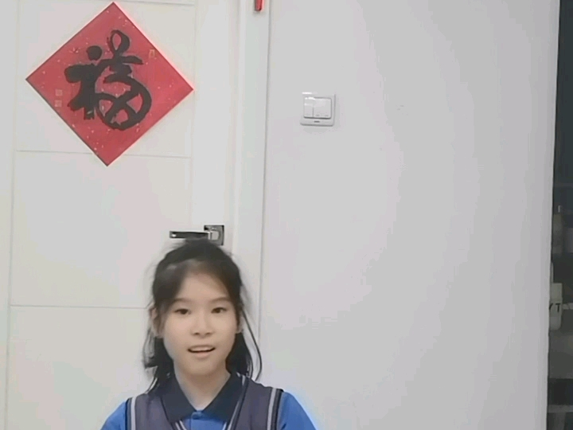 | 39 | 2026-04-02 |
| [&quot;谁能拒绝一只有礼貌的小猫呢&quot;](https://www.bilibili.com/video/BV19X9FBsEBf) |  | 2707 | 2026-04-02 |
| [🐱](https://www.bilibili.com/video/BV1uF9cBDEjP) | 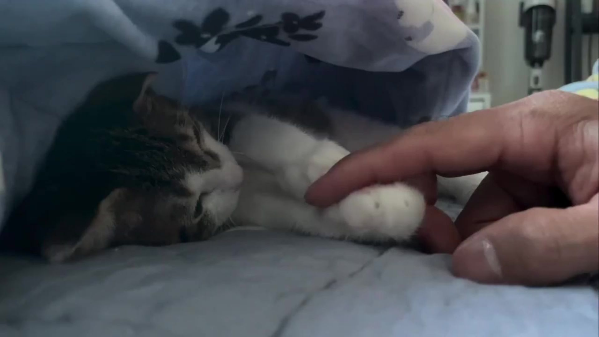 | 1489 | 2026-04-02 |
| [爱猫区绞尽脑汁不如爱猫区灵机一动，哈基米误入断尾台](https://www.bilibili.com/video/BV13o9FBXEvw) |  | 1.9万 | 2026-04-02 |
| [哈基米三分天下，三足对哈](https://www.bilibili.com/video/BV13o9FBXES6) | 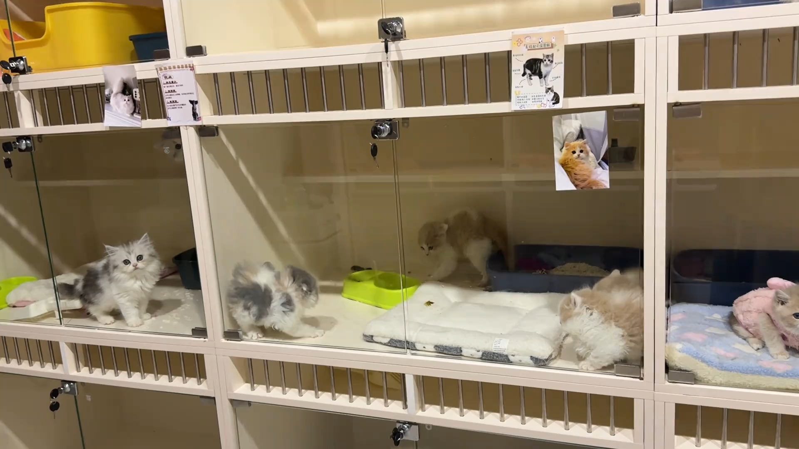 | 1522 | 2026-04-02 |
| [谁懂猫语，哈基米这是在道歉吗](https://www.bilibili.com/video/BV1Qo9FBQEHQ) | 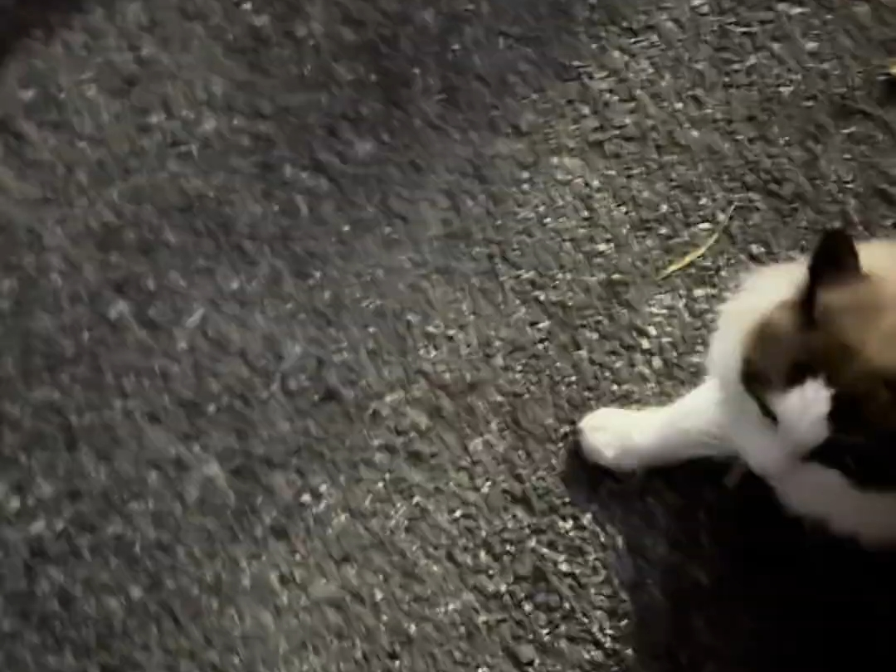 | 929 | 2026-04-02 |
| [🐱](https://www.bilibili.com/video/BV1Do9FBQEg7) |  | 2780 | 2026-04-02 |
| [谁懂猫语，哈基米说是要借宿一下吗](https://www.bilibili.com/video/BV1Sf9FBnEQ4) |  | 137 | 2026-04-02 |
| [这还有救吗？](https://www.bilibili.com/video/BV1fz9FBPEhH) | 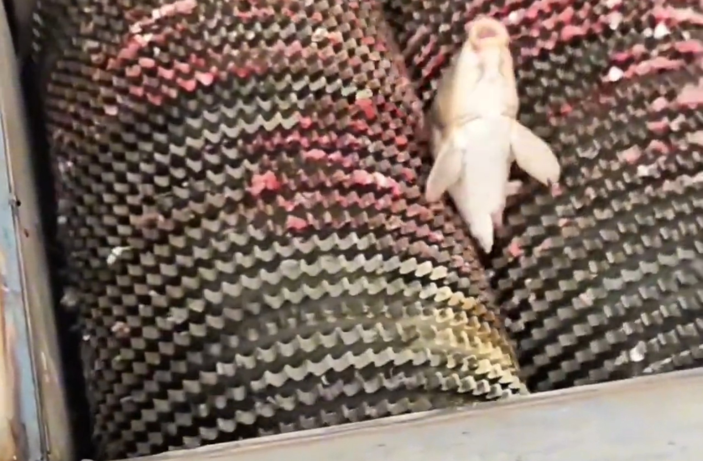 | 5.2万 | 2026-04-02 |
| [哈基米又发现一块野生猫抓板，可以玩个痛快了](https://www.bilibili.com/video/BV16z9FBNEeB) | 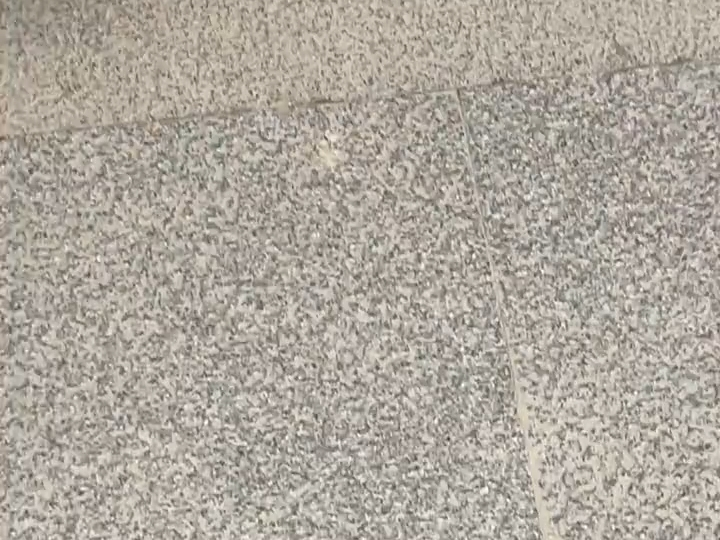 | 242 | 2026-04-02 |
| [超级无敌大关门猫！猫儿这个铲后抑郁！](https://www.bilibili.com/video/BV1f69FBYEK1) | 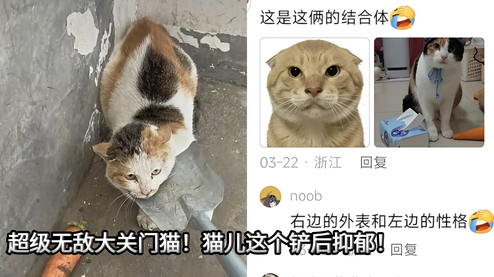 | 2.7万 | 2026-04-02 |
| [春天！me来啦！！！](https://www.bilibili.com/video/BV1E69FBeE7d) | 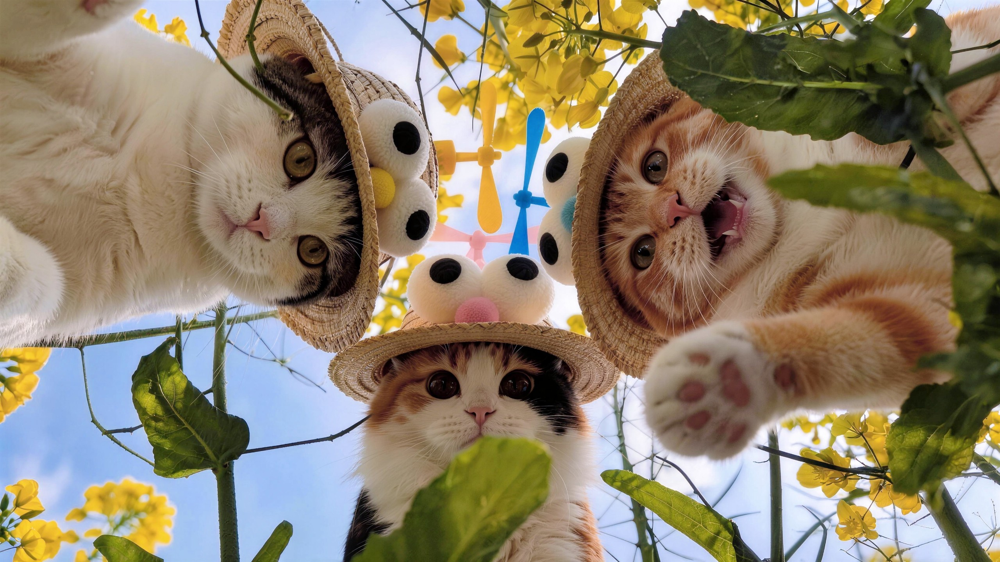 | 1169 | 2026-04-02 |
| [哈基米只是在玩野生猫抓板](https://www.bilibili.com/video/BV1rL9cBzEdy) | 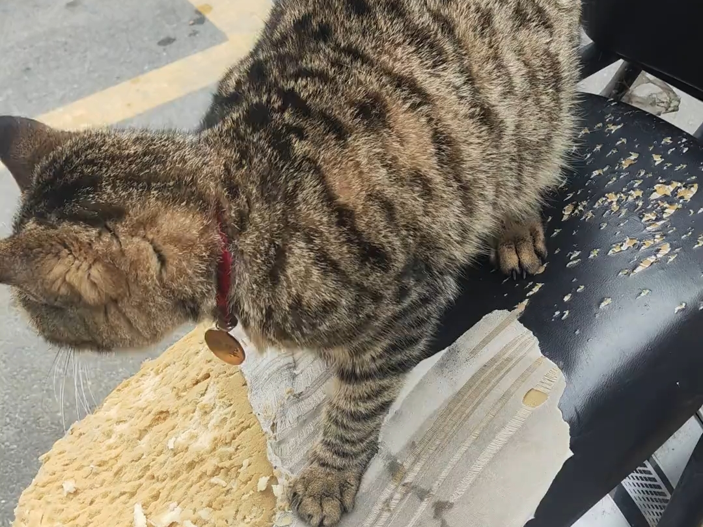 | 559 | 2026-04-02 |
| [《哈米·波特与阿西卡班的囚徒》](https://www.bilibili.com/video/BV1d89WBtE8h) |  | 454 | 2026-04-02 |
| [哈基米被鹦鹉吓坏了](https://www.bilibili.com/video/BV1BW9cBPETL) | 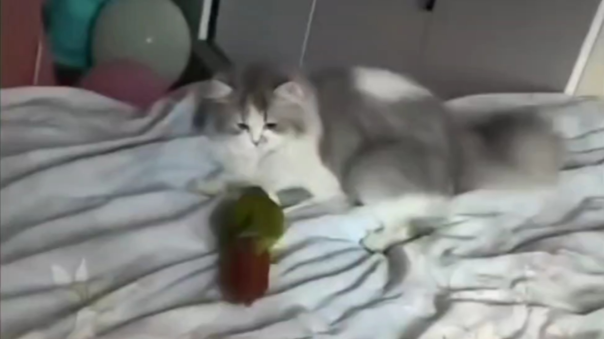 | 97 | 2026-04-02 |
| [哈基米这个大风车](https://www.bilibili.com/video/BV1TK9cB2E7t) | 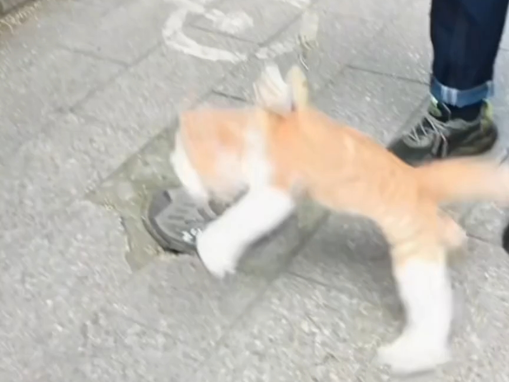 | 2926 | 2026-04-02 |
| [哈基米日记之《饮水，厕所，与叛逆》](https://www.bilibili.com/video/BV1TN9cB7EZy) |  | 536 | 2026-04-02 |
| [「智人TV」依旧猫咖不能撸猫这一块＆在路中间跳舞这一块](https://www.bilibili.com/video/BV1w59cB3EbR) |  | 10.9万 | 2026-04-02 |
| [【哈基米音乐】月が綺麗ねと言われたい！](https://www.bilibili.com/video/BV1QSXZBUEse) |  | 9058 | 2026-04-02 |
| [哈基米偷鱼反被鱼钩钩住嘴吧](https://www.bilibili.com/video/BV1PxXZBKEXZ) | 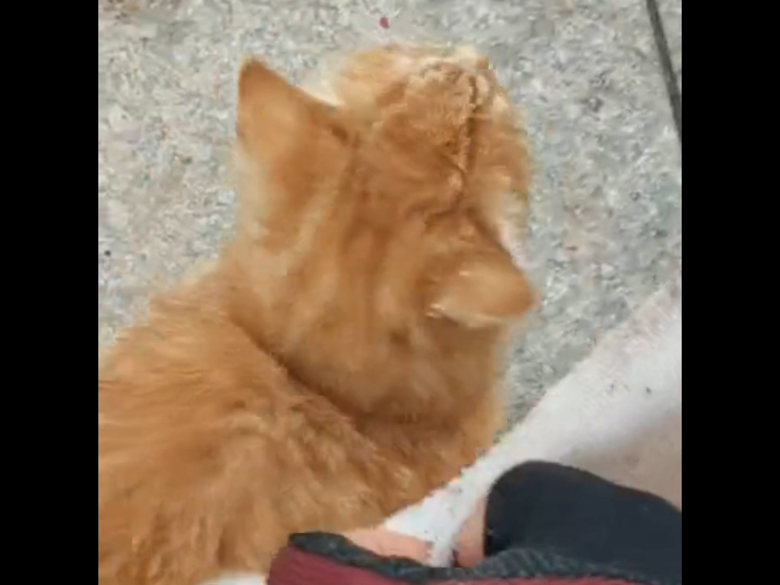 | 488 | 2026-04-02 |
| [哈基米跟的大货车跑了800多里](https://www.bilibili.com/video/BV1NxXZBKEMk) | 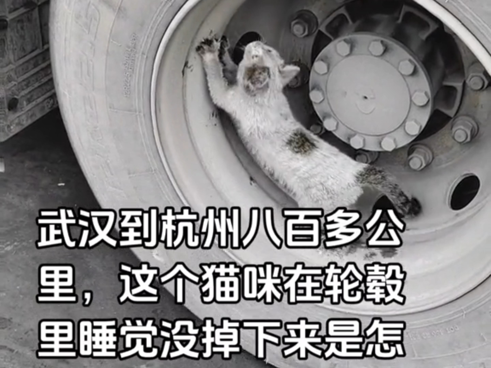 | 4.3万 | 2026-04-02 |
| [哈基汪TV](https://www.bilibili.com/video/BV1u5XZBCEr2) | 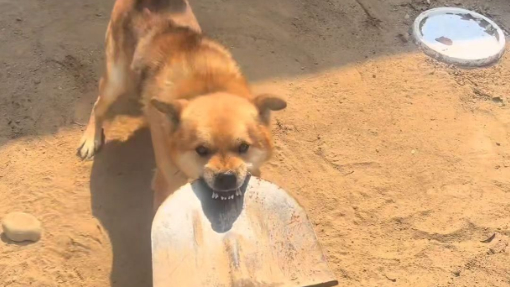 | 5.8万 | 2026-04-02 |
| [哈吉米还是哈基米？打三角洲](https://www.bilibili.com/video/BV1waXZBwE1F) | 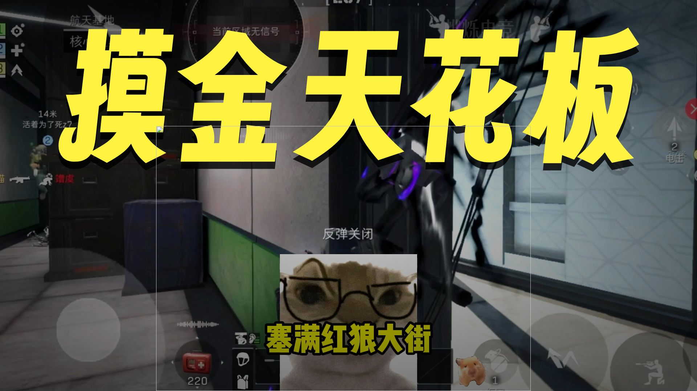 | 220 | 2026-04-02 |
| [欺软怕硬的小猫咪你们见过吗？我这有一只](https://www.bilibili.com/video/BV12pXZBMEfZ) | 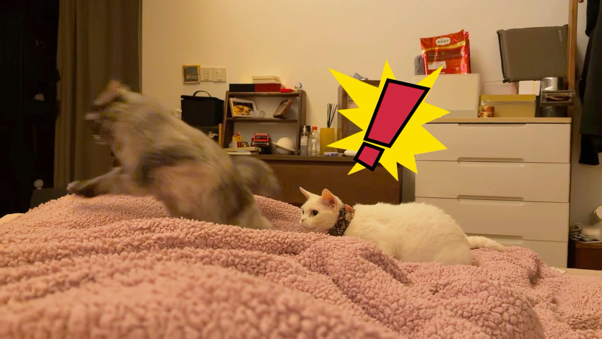 | 4112 | 2026-04-02 |
| [调皮#猫咪#小奶猫#哈基米](https://www.bilibili.com/video/BV1mfXZBkEuV) | 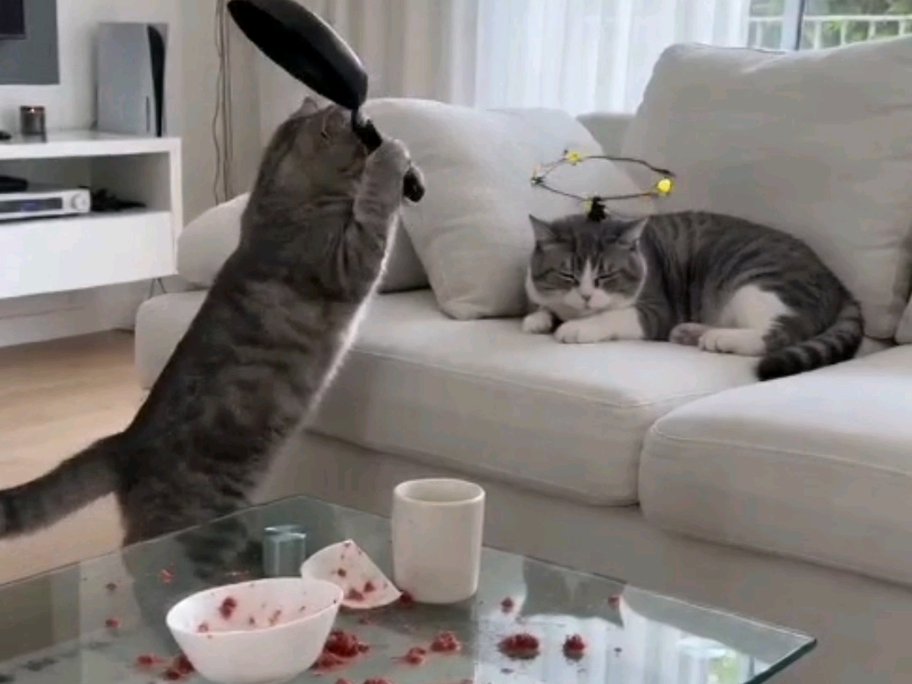 | 15 | 2026-04-02 |
| [剑人tv之请路人吃哈基米肉](https://www.bilibili.com/video/BV1SdXZByET6) |  | 3.9万 | 2026-04-02 |
| [哈基米南北绿豆和绿豆汤真的没啥区别](https://www.bilibili.com/video/BV1ozXZBxE4k) |  | 110 | 2026-04-02 |
| [哈基米南北绿豆ど⁰̷̴͈꒨⁰̷̴͈う♡](https://www.bilibili.com/video/BV1wgXfBKEch) |  | 25 | 2026-04-02 |
| [末日哈基米-4.2-胡圆圆(4)](https://www.bilibili.com/video/BV1A3XfBvE34) |  | 0 | 2026-04-02 |
| [我的哈基米没了](https://www.bilibili.com/video/BV1vsXfBRELf) | 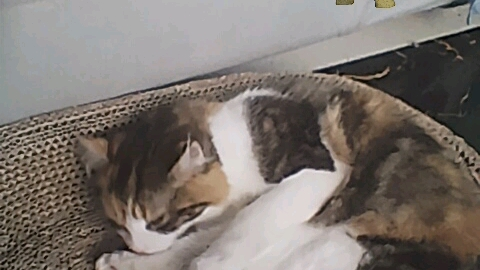 | 19 | 2026-04-02 |
| [:)悲伤哈基米听音乐:(](https://www.bilibili.com/video/BV1vsXfBRELe) | 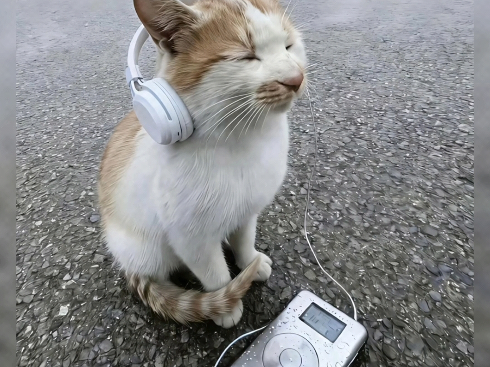 | 42 | 2026-04-02 |
| [《眼睛瞎在哈基米，手也黏在哈基米》](https://www.bilibili.com/video/BV1hYXfBJEzj) |  | 1583 | 2026-04-02 |
| [巅峰哈基米](https://www.bilibili.com/video/BV1xT9WB5E9n) | 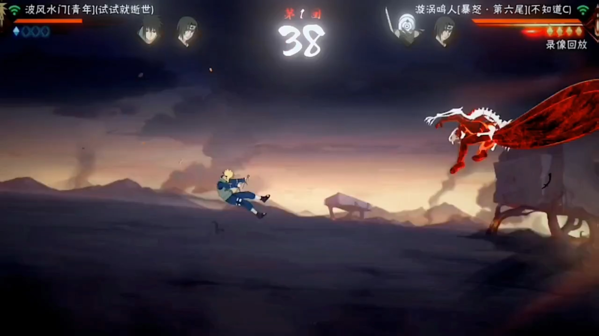 | 23 | 2026-04-02 |
| [哈基米炒菜记](https://www.bilibili.com/video/BV1VQ9pBsE1E) |  | 344 | 2026-04-02 |
| [【黄叶绿豆哈基米音乐】曼波与基米（天使与恶魔）](https://www.bilibili.com/video/BV1cu9JB4E9F) |  | 3153 | 2026-04-02 |
| [⚡ 说 谎 的 叮 咚 鸡 ⚡](https://www.bilibili.com/video/BV1LiXkBVE57) |  | 4656 | 2026-04-02 |
| [蛋仔派对寻宝队哈基米自带雷达](https://www.bilibili.com/video/BV1TS9WB1EAA) |  | 310 | 2026-04-02 |
| [哈基米怎么改的？](https://www.bilibili.com/video/BV1U19WB7E1J) | 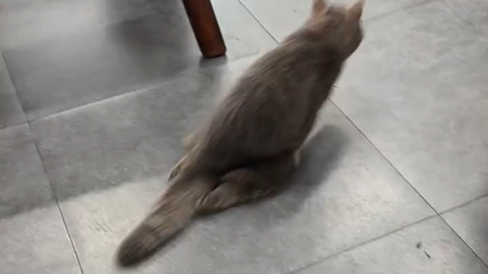 | 149 | 2026-04-02 |
| [触发哈基米的底层代码了](https://www.bilibili.com/video/BV1Vi9WBsEL4) |  | 385 | 2026-04-02 |
| [哈基米这个喜欢在车底躲雨](https://www.bilibili.com/video/BV1Yi9WBsEmo) | 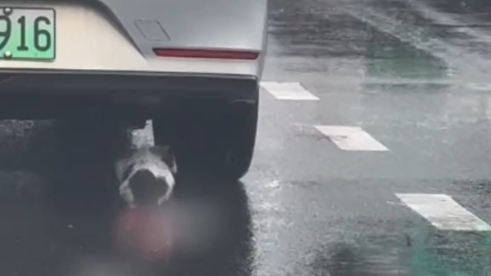 | 1.0万 | 2026-04-02 |
| [【B站哈基米呀】视频已打包，欢迎围观！](https://www.bilibili.com/video/BV1959sBtE25) | 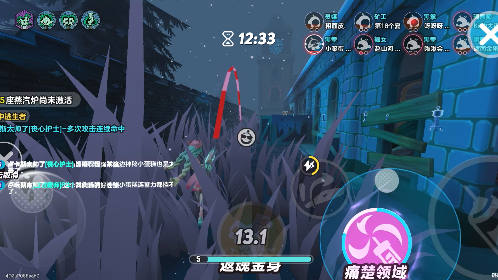 | 144 | 2026-04-02 |
| [纸巾，萝卜，哈基米真聪明](https://www.bilibili.com/video/BV1Pg9HBeEPh) | 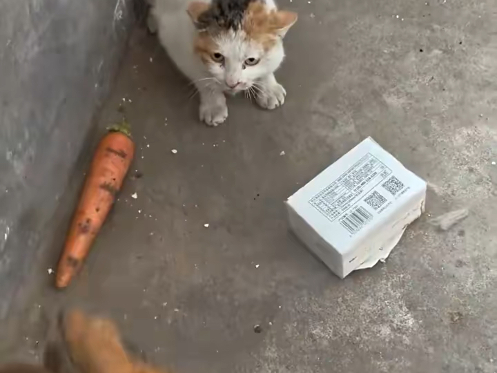 | 5 | 2026-04-02 |
| [哈基米曼波](https://www.bilibili.com/video/BV1219HBzEdP) | 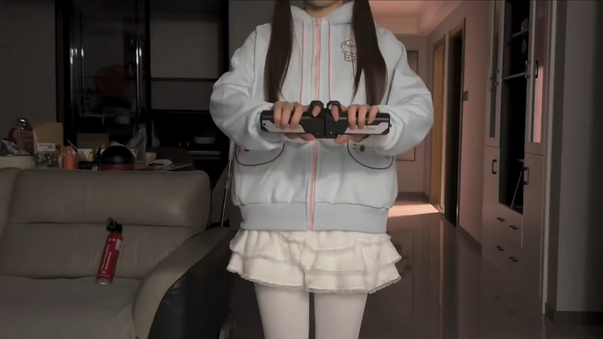 | 2698 | 2026-04-01 |
| [纯净哈基米之甜甜の小曲so](https://www.bilibili.com/video/BV1bp9pB5Ea2) |  | 0 | 2026-04-01 |
| [《哈基书》哈基米纯享版](https://www.bilibili.com/video/BV11r9JBeECZ) |  | 20 | 2026-04-01 |
| [邻小言【哈基咪南北绿豆饼】九度七冰淇淋绿豆饼糕点零食新品 哈基米南北绿豆饼20个+装伯爵红茶6个](https://www.bilibili.com/video/BV1mq9JBTEQj) |  | 0 | 2026-04-01 |
| [邻小言【哈基咪南北绿豆饼】九度七冰淇淋绿豆饼糕点零食新品 哈基米南北绿豆饼20个+装伯爵红茶6个](https://www.bilibili.com/video/BV1Ez9nBREb7) | 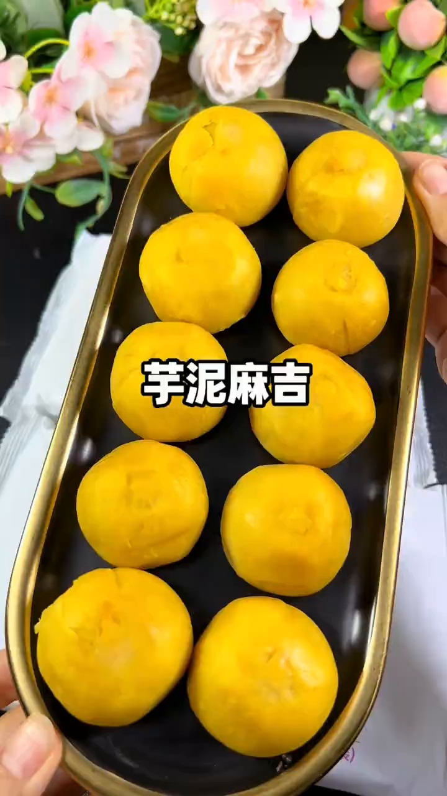 | 0 | 2026-04-01 |
| [哈气和玩耍代码冲突了，菜猫会怎么做](https://www.bilibili.com/video/BV1if97B5E7u) | 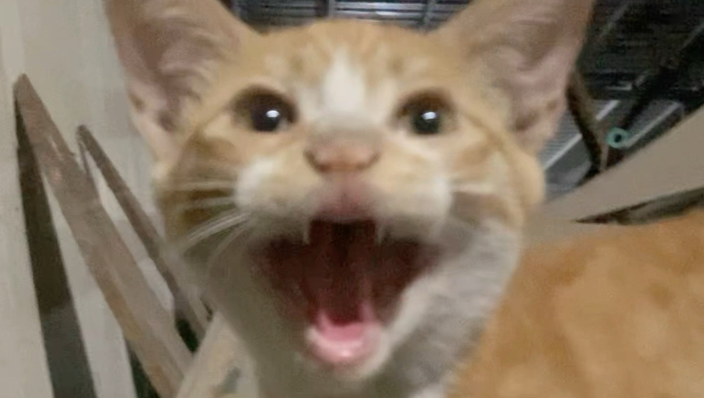 | 4.1万 | 2026-04-01 |
| [扶手上的洞洞是我麻麻抓的，和我没有关系](https://www.bilibili.com/video/BV1AK9JBbErv) | 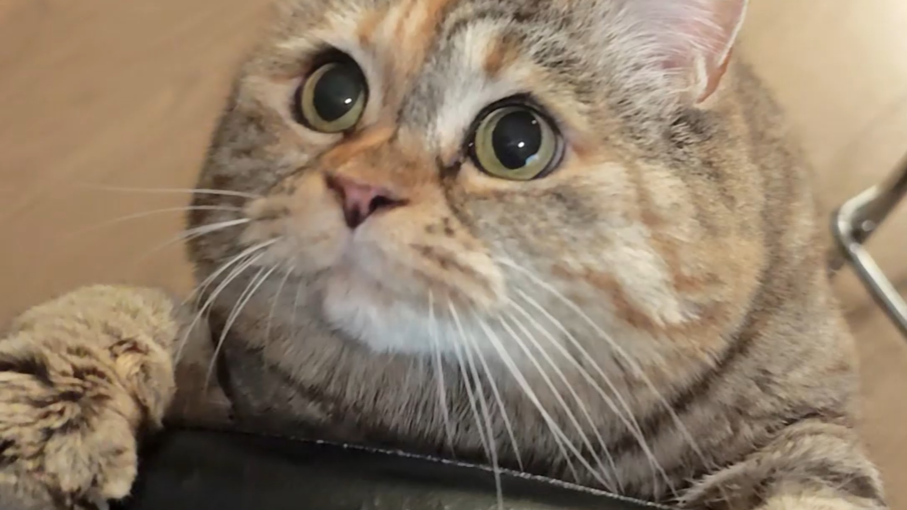 | 8.1万 | 2026-04-01 |
| [咪的天](https://www.bilibili.com/video/BV18k95BbEdk) | 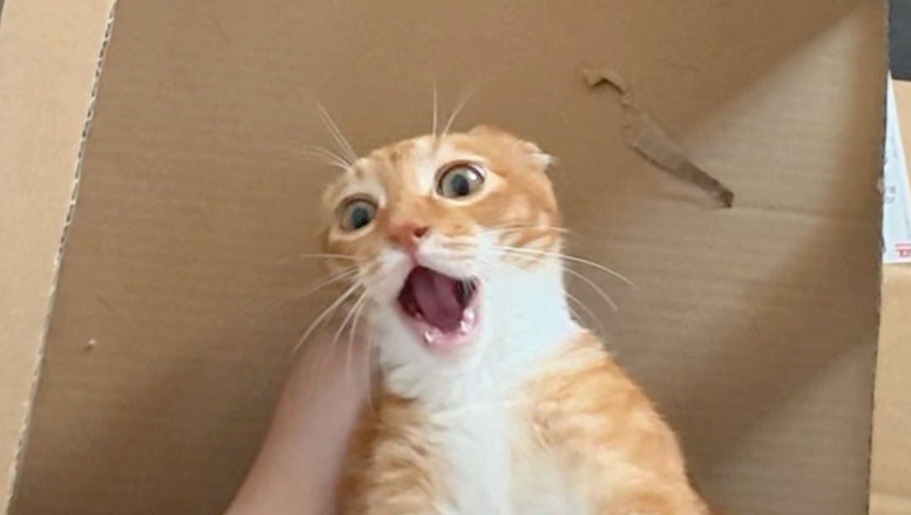 | 8798 | 2026-04-01 |
| [哈基米营业第56天:开业以来收到第一个严重客诉出现了](https://www.bilibili.com/video/BV1R79LBeEik) |  | 3474 | 2026-04-01 |
| [异常活跃的嘬！](https://www.bilibili.com/video/BV1Qp9LBcET9) |  | 1.8万 | 2026-04-01 |
| [当兄弟没钱请律师而请了你-永雏塔菲客串法官](https://www.bilibili.com/video/BV13sXCB6EbN) |  | 3.8万 | 2026-04-01 |
| [耄耋猫的上班vlog](https://www.bilibili.com/video/BV1njXBB6Eyk) | 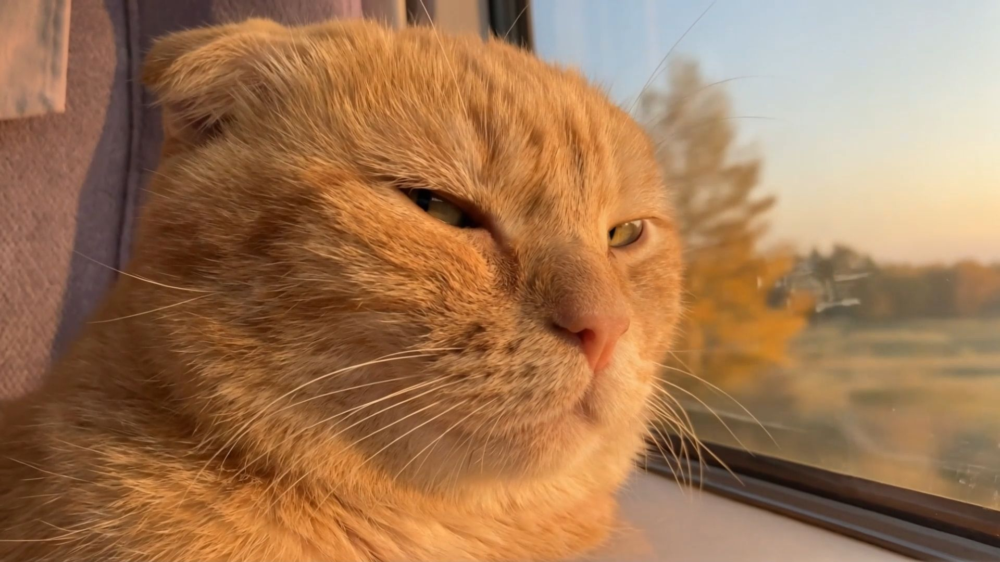 | 2.3万 | 2026-03-31 |
| [满海都是哈基鱼！](https://www.bilibili.com/video/BV1BNXXB5E2c) | 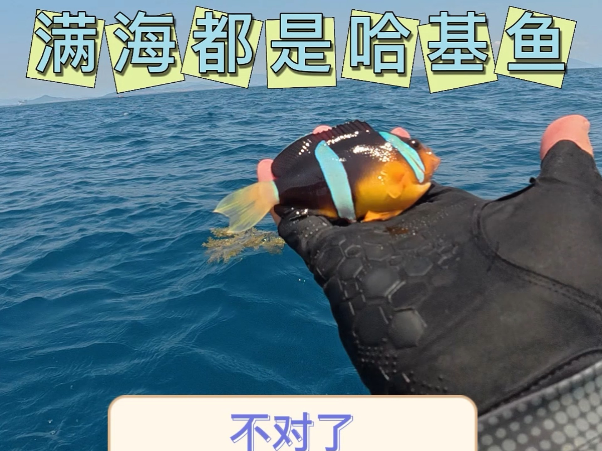 | 12.7万 | 2026-03-29 |
| [【万字】完全解读虐猫区！](https://www.bilibili.com/video/BV1AKXVB3EtL) |  | 10.0万 | 2026-03-28 |
| [“智力堪比一根成年香蕉”](https://www.bilibili.com/video/BV15rXgBSENC) |  | 7.2万 | 2026-03-28 |
| [捡个猫，它非要跟我回家！](https://www.bilibili.com/video/BV1AJXHBeE6L) | 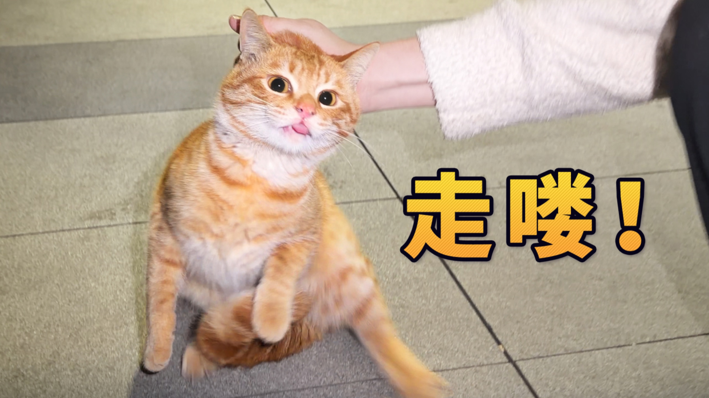 | 29.6万 | 2026-03-26 |
| [一只猫坠楼暴毙！主人在楼上毫无察觉浑然不知](https://www.bilibili.com/video/BV1E9XpBFEuB) | 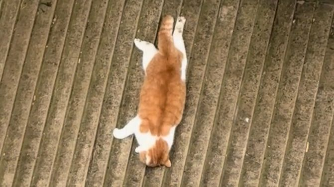 | 4192 | 2026-03-26 |
| [皮蛋节තටම哈基咪කට](https://www.bilibili.com/video/BV1GkQBBfERy) |  | 21.2万 | 2026-03-25 |
| [咕咕嘎嘎 30分钟纯享版大合集](https://www.bilibili.com/video/BV15jwyzMEVv) |  | 2.9万 | 2026-03-19 |
| [为什么会有哈基米](https://www.bilibili.com/video/BV1D8FpzcEHc) |  | 131 | 2026-02-07 |
| [动物们的无语瞬间～](https://www.bilibili.com/video/BV1EV27BhEge) |  | 55.9万 | 2025-12-06 |
| [刚出厂的感觉都不一样](https://www.bilibili.com/video/BV1uikBBhEZB) | 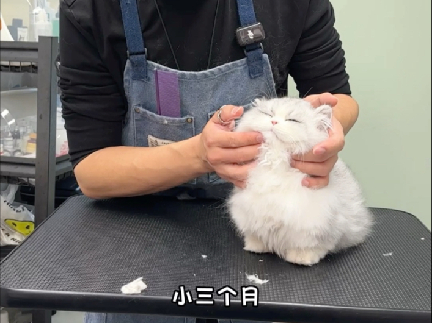 | 134.3万 | 2025-11-11 |
| [爱音唐笑2000小时纯享版](https://www.bilibili.com/video/BV1vvYDzTEnK) |  | 29.5万 | 2025-09-15 |
| [小猫咪不慎失足坠楼，喵星人妈妈瞬间变身超人！无畏飞跃救子心切！母爱如山，感动满满！宠物安全提醒：家中高处请设防护栏哦！小动物们也需要我们的呵护！ #哈基米](https://www.bilibili.com/video/BV1KALvzAEu9) |  | 21.2万 | 2025-04-24 |
| [老大窝躺好了喵](https://www.bilibili.com/video/BV1A794YRELx) | 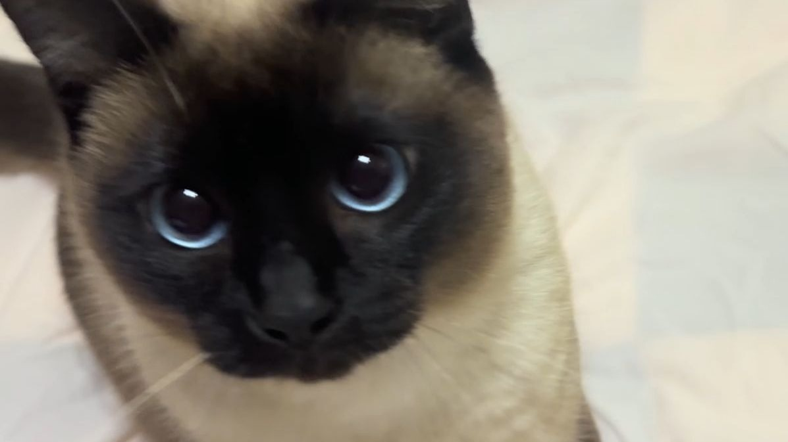 | 180.4万 | 2025-03-07 |
| [哈基米 哈基米......](https://www.bilibili.com/video/BV1twN6eaE8X) | 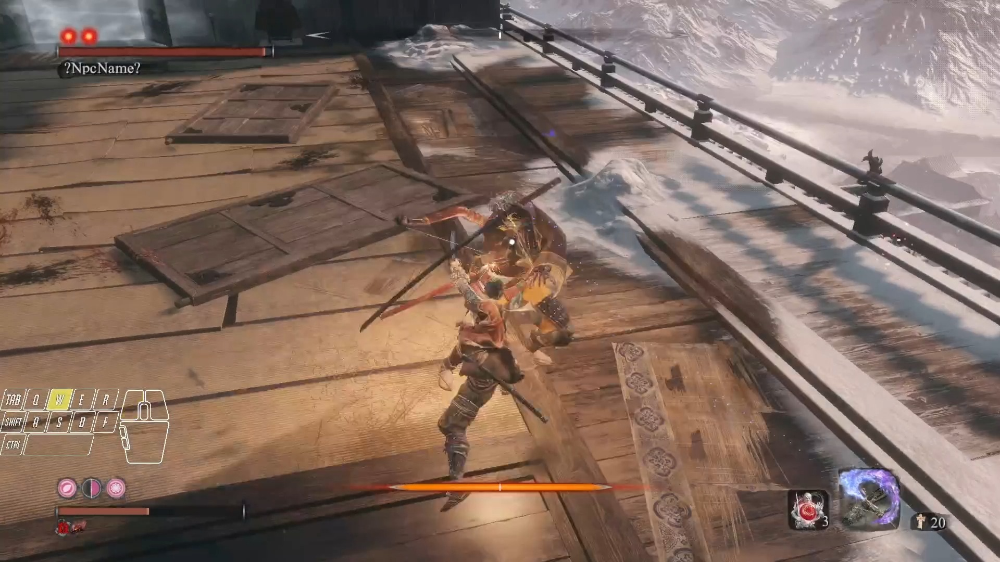 | 591 | 2025-02-11 |
| [活全家音乐：捣蛋猫](https://www.bilibili.com/video/BV1q6s4eoE7H) |  | 69.0万 | 2024-08-27 |

---
*最后更新: 2026-04-03 03:17:09 (自动生成)*
*数据来源: [Bilibili](https://www.bilibili.com)*

## 使用说明

运行以下命令更新视频列表:
```bash
python3 fetch_hajimi_videos.py
```
