# awesome-hajimi
collections of hajimi (哈基米 in Chinese) on the Internet.

## 视频列表 (Video List)

| 视频标题 (Title) | 封面 | 播放量 (Views) | 发布日期 (Date) |
|---|---|---|---|
| [哈基米的上限了吗](https://www.bilibili.com/video/BV1JTooBPELx) | 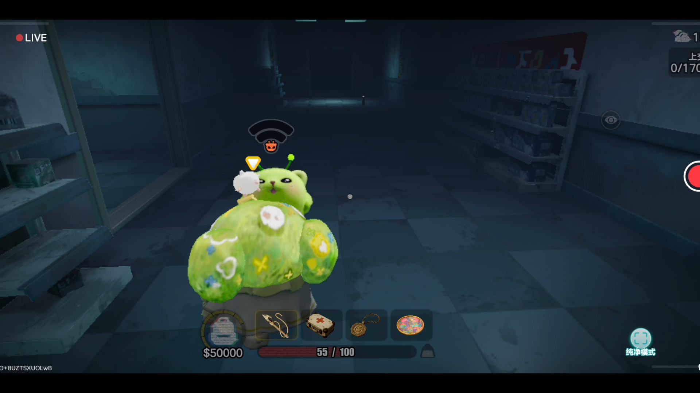 | 1 | 2026-04-26 |
| [不知道发什么发下哈基米吧](https://www.bilibili.com/video/BV1U4ooBnEUk) | 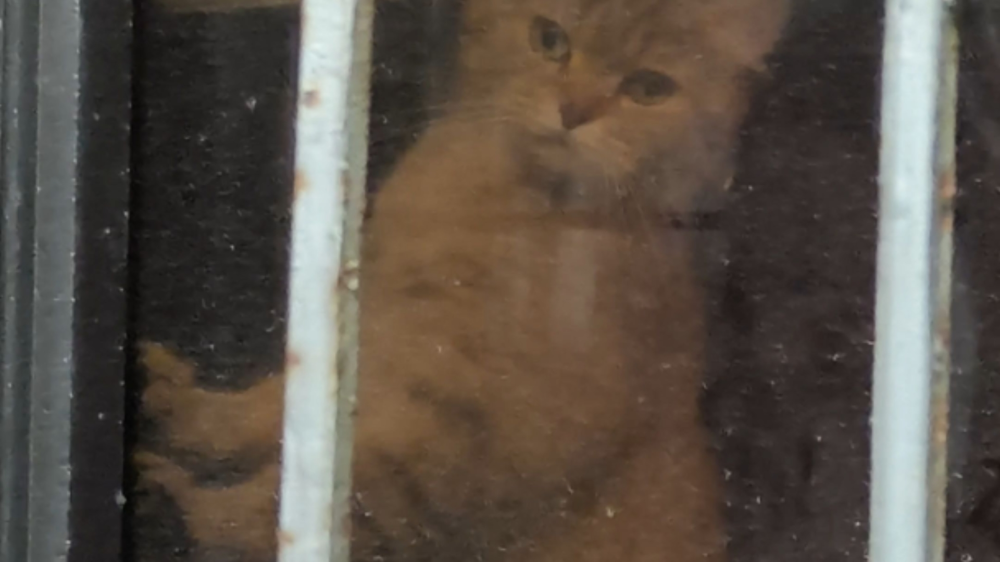 | 124 | 2026-04-26 |
| [有点偏心了，可怜的哈基米](https://www.bilibili.com/video/BV1G7oRBUEyp) | 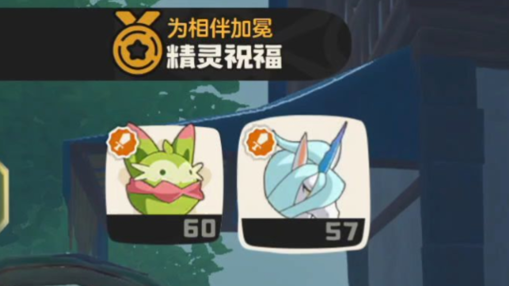 | 355 | 2026-04-25 |
| [4月24号 丝路杯正赛  华南三薯VS哈基米南北路多](https://www.bilibili.com/video/BV1t2odBmEvU) | 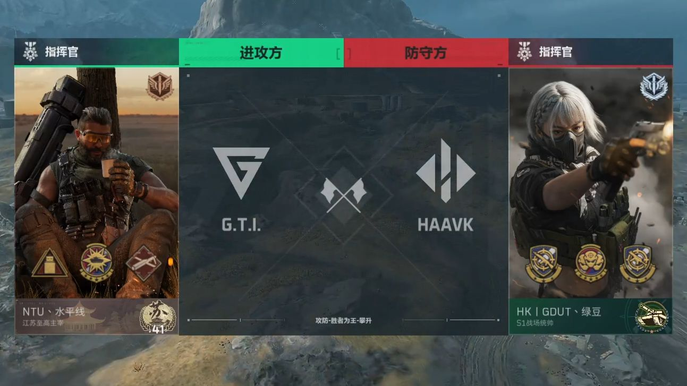 | 270 | 2026-04-25 |
| [哈基米6th秋上的温泉杯小曲 ゆこまロマン純情派](https://www.bilibili.com/video/BV1dmoXBJEBT) |  | 41 | 2026-04-25 |
| [哈基米](https://www.bilibili.com/video/BV1hRoXB1E9h) |  | 3 | 2026-04-25 |
| [哈基米vs888](https://www.bilibili.com/video/BV1bro9BVEhN) |  | 21 | 2026-04-25 |
| [依旧大号哈基米](https://www.bilibili.com/video/BV1Yvo9B7E4W) |  | 206 | 2026-04-25 |
| [【哈基米FM】骄傲的少年](https://www.bilibili.com/video/BV1vbo9BHEZp) |  | 310 | 2026-04-25 |
| [哈基米音乐——铁哈飞](https://www.bilibili.com/video/BV17Wo9BdEiG) |  | 73 | 2026-04-25 |
| [【哈基米音乐】space hajimi](https://www.bilibili.com/video/BV1aYo9BUEYG) |  | 188 | 2026-04-25 |
| [HNSSvs哈基米南北路多丝路杯正赛（哈基米攻）](https://www.bilibili.com/video/BV1kRo9BeEvz) | 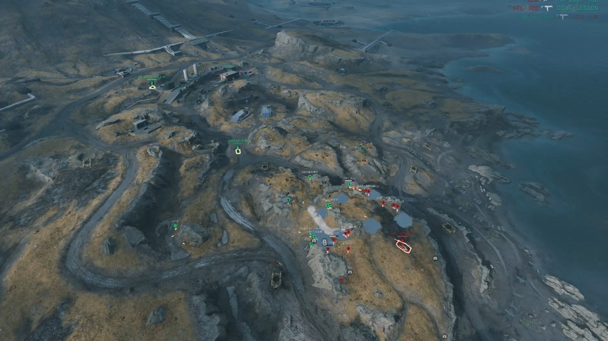 | 25 | 2026-04-25 |
| [哈基米~](https://www.bilibili.com/video/BV1qpoQBmE5z) | 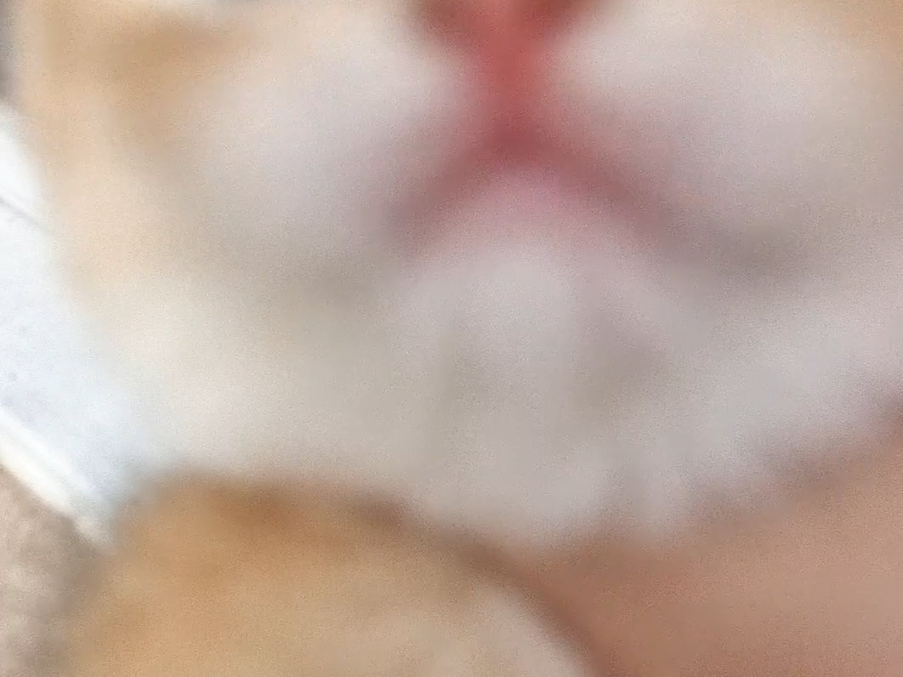 | 71 | 2026-04-25 |
| [哈基米大学习（1）](https://www.bilibili.com/video/BV1YhoQBGE67) | 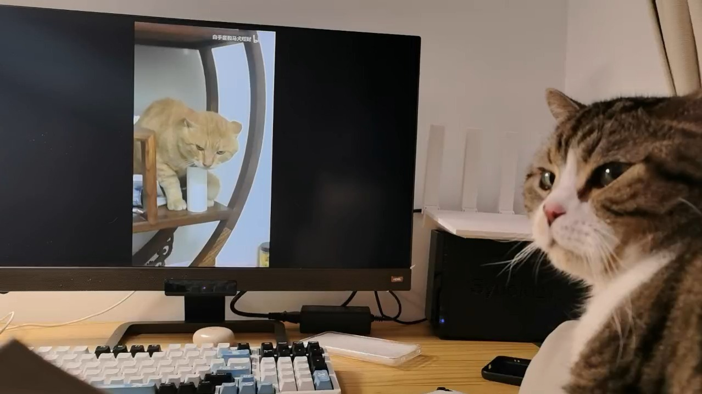 | 20 | 2026-04-25 |
| [老吴与基米27分钟口香糖全集，一次嚼个够！](https://www.bilibili.com/video/BV1qPoXBSEro) | 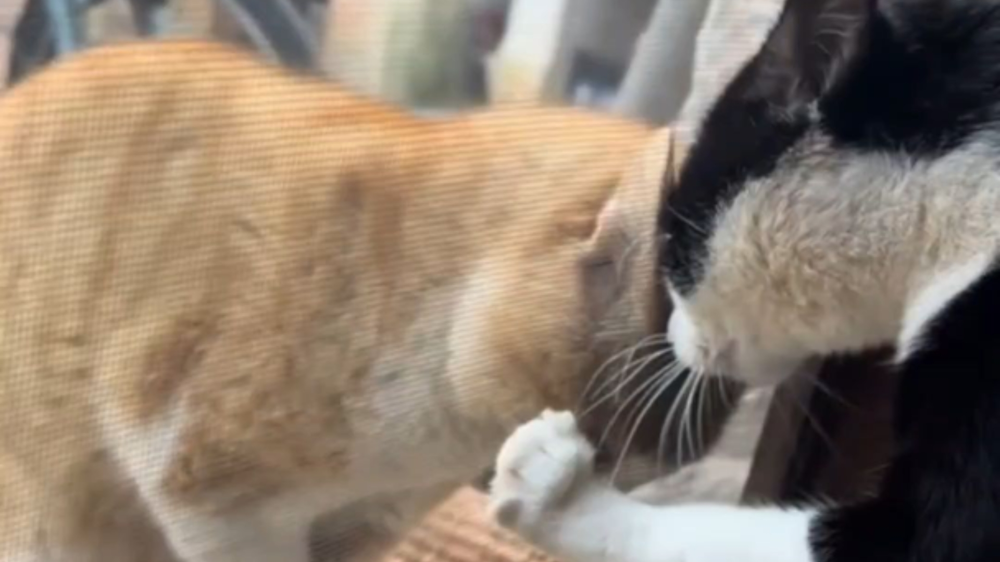 | 8869 | 2026-04-25 |
| [哈基米歌王争霸赛2](https://www.bilibili.com/video/BV1sDoQB8Egj) |  | 10.5万 | 2026-04-25 |
| [【哈基米音乐】哈基野战炮兵进行曲 U.S. Field Artillery March](https://www.bilibili.com/video/BV1sSoQBFEek) |  | 359 | 2026-04-25 |
| [哈基米](https://www.bilibili.com/video/BV1s2oQBwErx) | 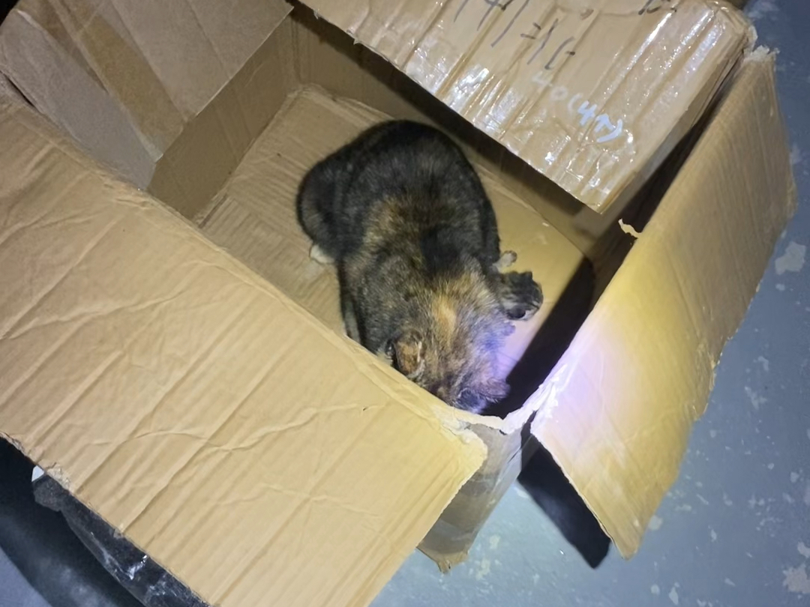 | 28 | 2026-04-25 |
| [我是绯英的哈基米！](https://www.bilibili.com/video/BV1nooQBsEvu) |  | 2.5万 | 2026-04-25 |
| [哈基米这个讨厌洗澡](https://www.bilibili.com/video/BV1MpoXBqE2i) | 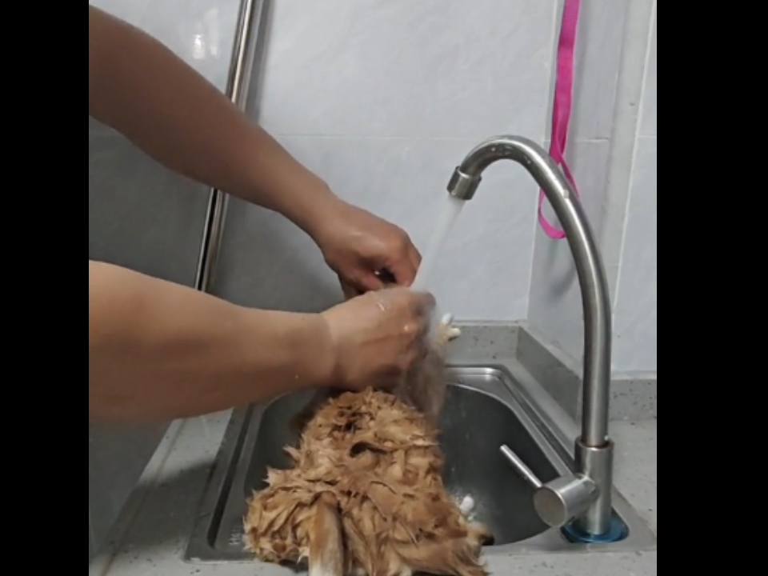 | 897 | 2026-04-25 |
| [薄荷是好哈基米吗🥵](https://www.bilibili.com/video/BV1PaoXBhE8A) |  | 38 | 2026-04-25 |
| [逃离哈基米的玩具房](https://www.bilibili.com/video/BV1aVoXBCEWj) | 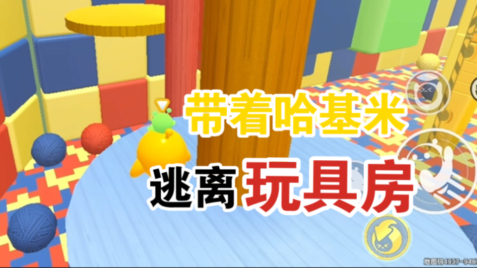 | 117 | 2026-04-25 |
| [神秘哈基米](https://www.bilibili.com/video/BV1SYoSBAEz6) | 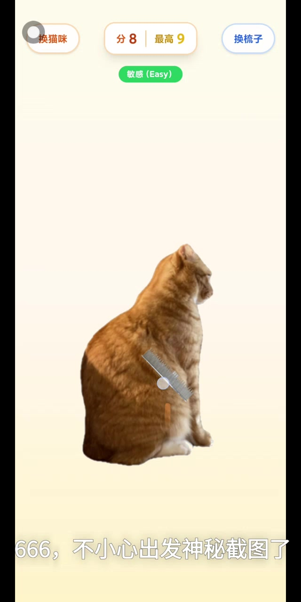 | 125 | 2026-04-25 |
| [基米不停ha](https://www.bilibili.com/video/BV1xBoSBfEQb) | 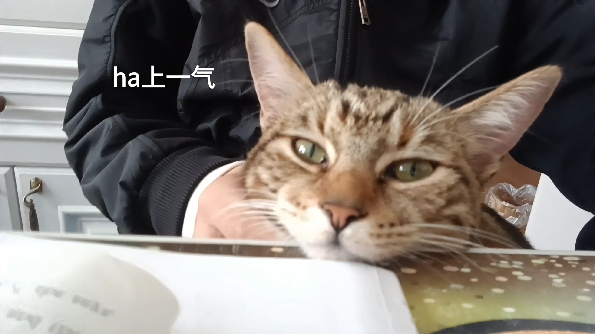 | 36 | 2026-04-25 |
| [【补档】《哈基米修仙传》叮·九门回忆&amp;莫问哈基](https://www.bilibili.com/video/BV1inoSBGEjP) |  | 91 | 2026-04-25 |
| [【哈基米音乐】⚡哈离子战斗曲「PLASMA」⚡](https://www.bilibili.com/video/BV1h8oSBNE2v) |  | 6.3万 | 2026-04-25 |
| [庄方宜也要哈基米！](https://www.bilibili.com/video/BV17FoDByEj8) |  | 45 | 2026-04-25 |
| [哈基米南北绿豆阿西嘎阿西哈呀库那路](https://www.bilibili.com/video/BV1EooSB2EEW) | 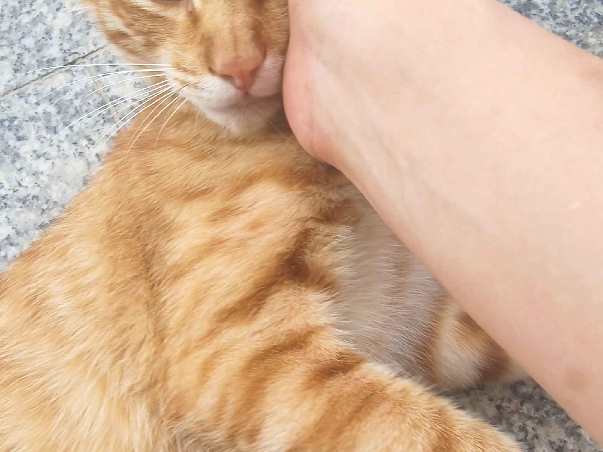 | 288 | 2026-04-25 |
| [点进来就送一只哈基米4.0](https://www.bilibili.com/video/BV1ZdoSB7EfD) |  | 136 | 2026-04-25 |
| [刚满两个月的小哈基米！](https://www.bilibili.com/video/BV1LwoDBVE3o) | 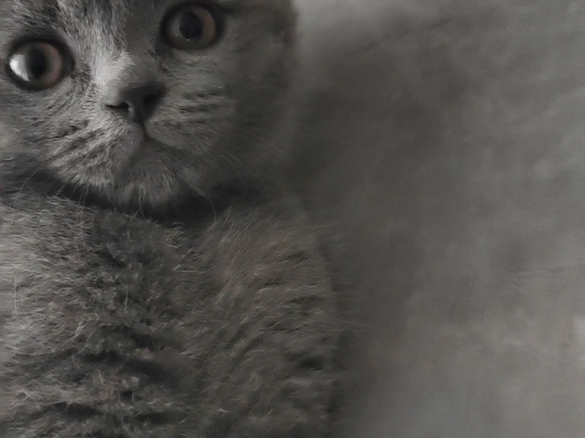 | 23 | 2026-04-25 |
| [【基米之家】你若三咚来——哈基米音乐](https://www.bilibili.com/video/BV1y2oSBWEMi) |  | 929 | 2026-04-25 |
| [哈基米：曼波曼波にしてあげる【崩坏：星穹铁道联动曲】](https://www.bilibili.com/video/BV1WmoSB9EWN) |  | 8.9万 | 2026-04-25 |
| [哈基米](https://www.bilibili.com/video/BV1sCoSBxERt) | 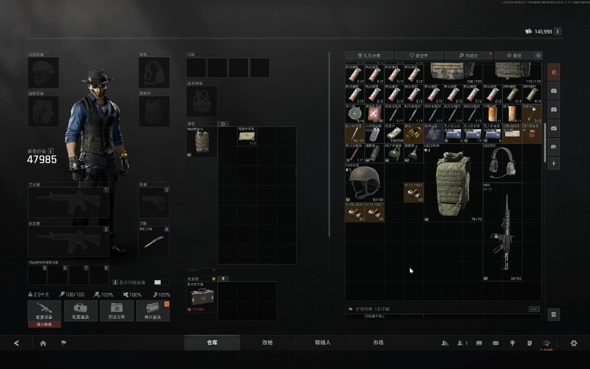 | 21 | 2026-04-25 |
| [当哈基米的钻洞代码被触发时](https://www.bilibili.com/video/BV1sCoSBxE3D) | 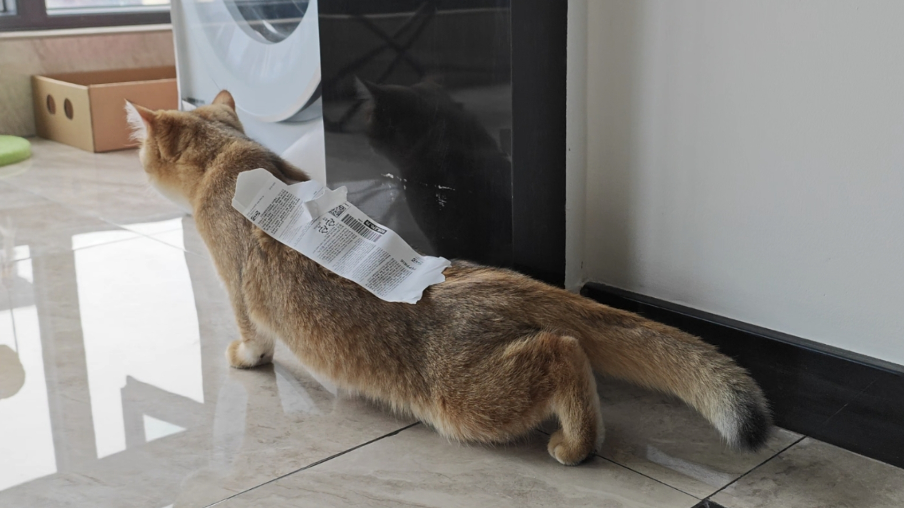 | 2.6万 | 2026-04-25 |
| [空中瑜伽说唱mv《五一飞天》，16秒瑜伽服嘴瓢吞字！结尾哈基米南北绿豆彩蛋，视频全部歌词人物、场景均由AI提示词生成，AI生成，五一快乐！](https://www.bilibili.com/video/BV1zXoSBJEQ1) |  | 1.4万 | 2026-04-25 |
| [哈基米偷吃被抓到了，准备放生大自然](https://www.bilibili.com/video/BV16SoSBHEXc) |  | 159 | 2026-04-25 |
| [哈基米给你打电话了](https://www.bilibili.com/video/BV1VuoDBBELd) | 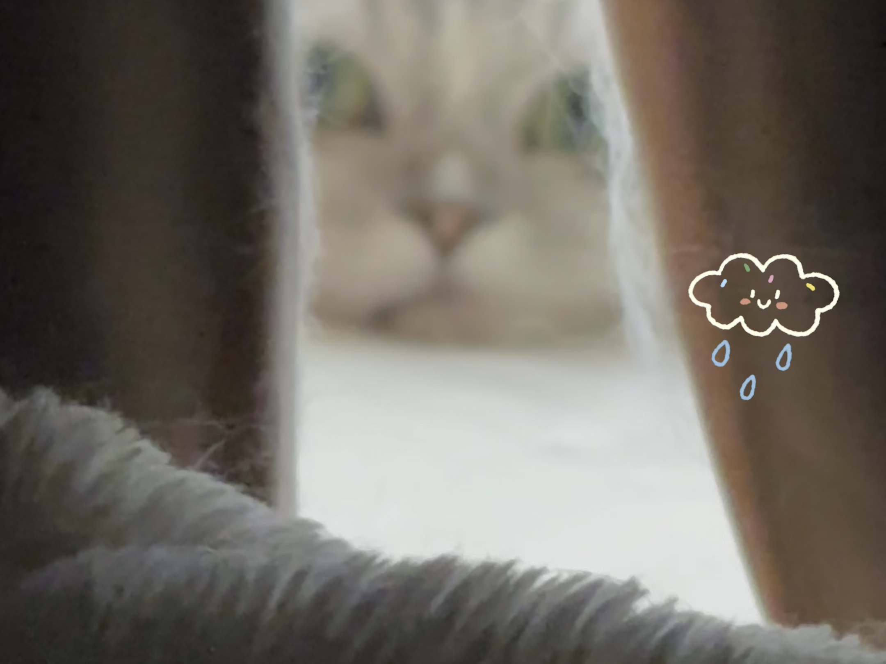 | 35 | 2026-04-25 |
| [开口就是哈基米](https://www.bilibili.com/video/BV14uoWB9EoD) |  | 2259 | 2026-04-25 |
| [哈基米不哈](https://www.bilibili.com/video/BV1tEoDBaE27) | 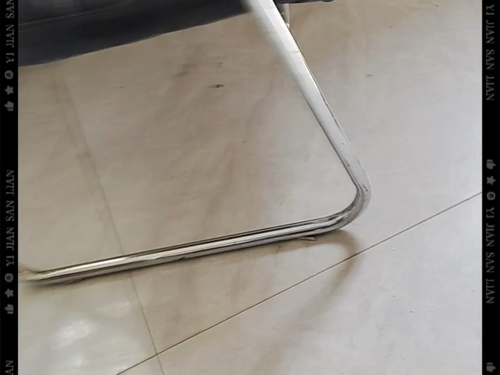 | 46 | 2026-04-25 |
| [【基卡贝拉】这么可爱真是抱歉🎵](https://www.bilibili.com/video/BV1vAojByE8H) |  | 4.8万 | 2026-04-25 |
| [哈基米南北绿豆广告（？）](https://www.bilibili.com/video/BV1zQomBGEwL) |  | 256 | 2026-04-25 |
| [野生的可爱哈基米](https://www.bilibili.com/video/BV1H8oUBjEuT) | 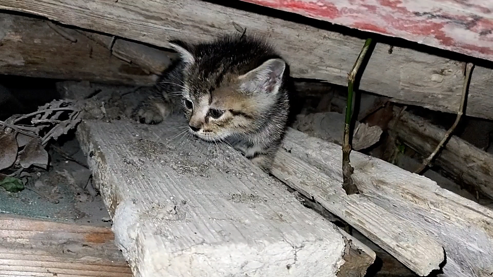 | 316 | 2026-04-25 |
| [【哈基米急哭了】第一次在B站发视频，求关注！](https://www.bilibili.com/video/BV1ozoUBuEER) | 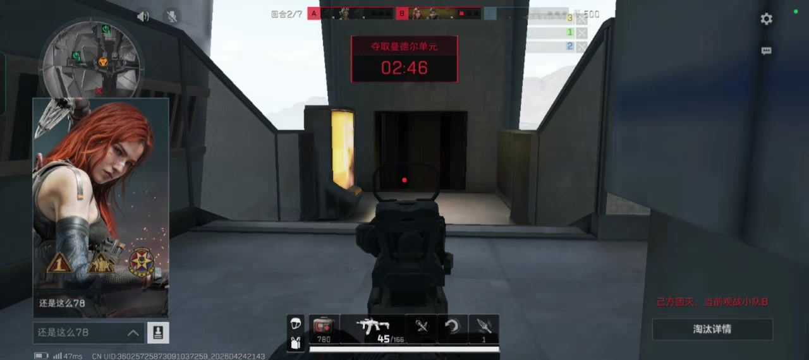 | 0 | 2026-04-25 |
| [哈基米](https://www.bilibili.com/video/BV1rGoJBNEmz) | 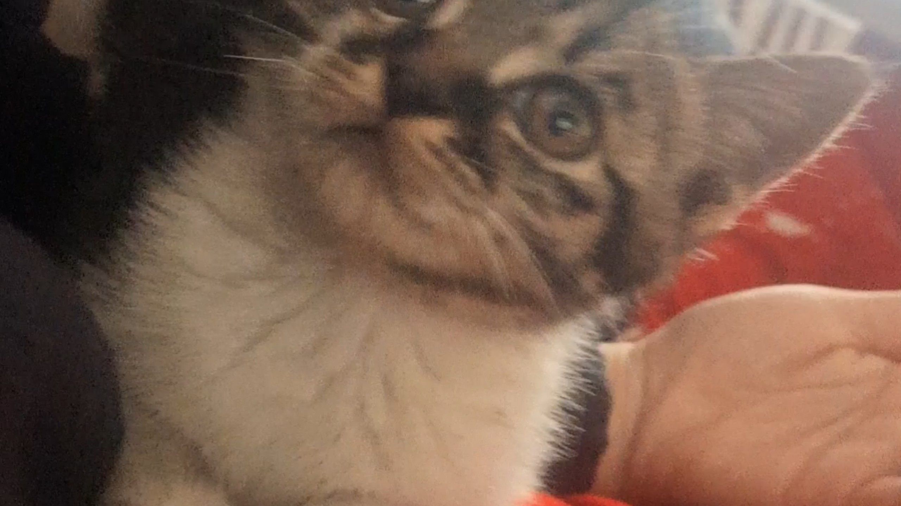 | 120 | 2026-04-24 |
| [和泉妃爱也要哈基米南北绿豆......](https://www.bilibili.com/video/BV1jCoTBxEnP) |  | 1220 | 2026-04-24 |
| [美津浓（MIZUNO）山系户外登山鞋轻便防滑透气跑步鞋轻野鞋RACER ADV  06/哈基米【秋冬版】 44.5 (290mm)](https://www.bilibili.com/video/BV1oJo7BQEJF) | 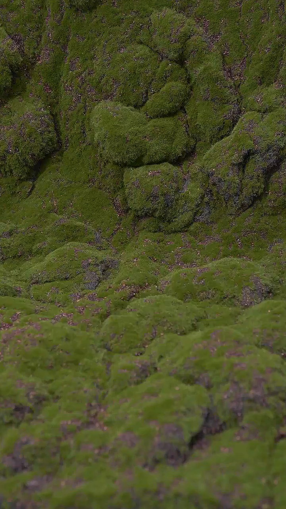 | 0 | 2026-04-24 |
| [《哈基米大战争》大运艹飞绝二阿龟，叽里咕噜说啥呢跟我的半挂说去吧](https://www.bilibili.com/video/BV1LcoEB9EU1) |  | 467 | 2026-04-24 |
| [哈基米偷猫粮](https://www.bilibili.com/video/BV1jcoEB9Eyn) | 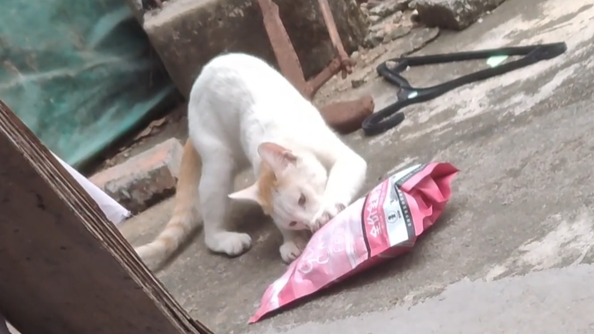 | 60 | 2026-04-24 |
| [哈基米的日常](https://www.bilibili.com/video/BV1ozoEBoESL) | 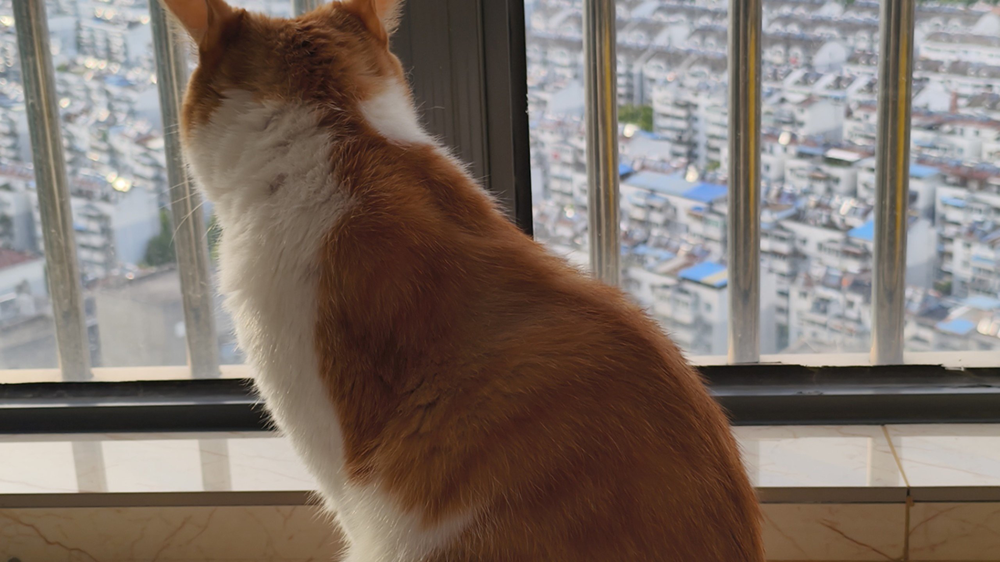 | 240 | 2026-04-24 |
| [后手突破七音符哈基米](https://www.bilibili.com/video/BV19DoEBnEoy) | 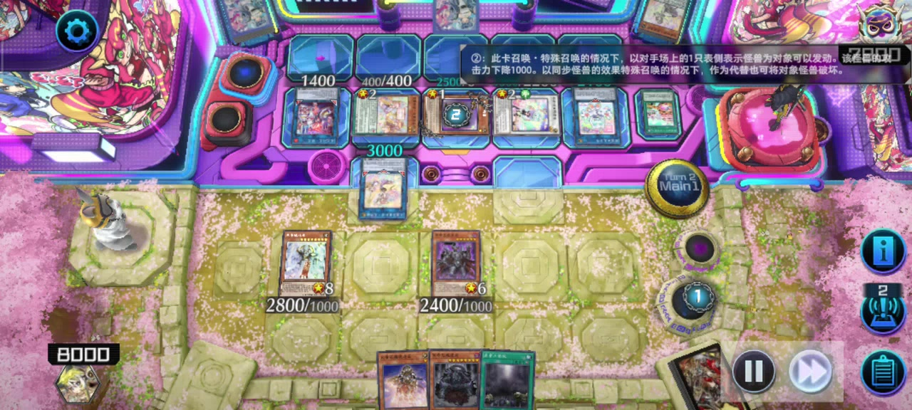 | 124 | 2026-04-24 |
| [世界上最力竭的抽卡异环 没有人类只有武器 全是哈姆全是哈基米全是金宝箱b](https://www.bilibili.com/video/BV1R1oEBXE14) | 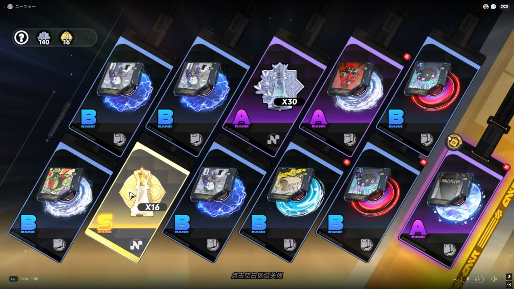 | 112 | 2026-04-24 |
| [ロクデナシ《ただ声一つ》 哈基米版本  重发](https://www.bilibili.com/video/BV1NtoEBKExu) |  | 29 | 2026-04-24 |
| [哈基米之小时候的趣事](https://www.bilibili.com/video/BV1nmoLBREEJ) | 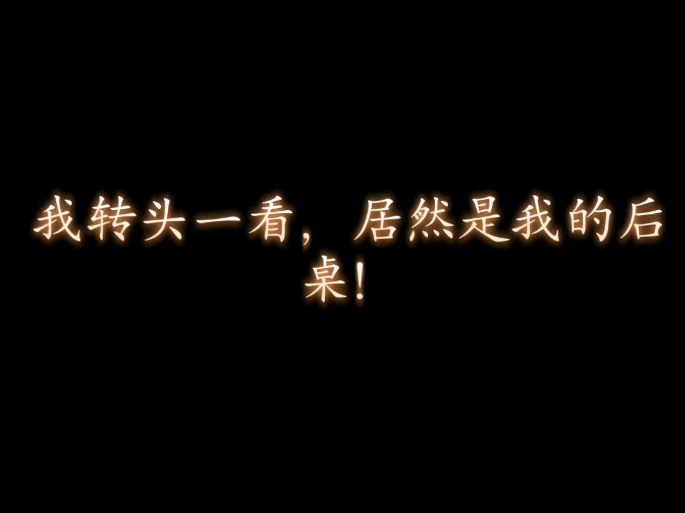 | 18 | 2026-04-24 |
| [不怎么是陨落的哈基米！](https://www.bilibili.com/video/BV1xzoLBwErE) | 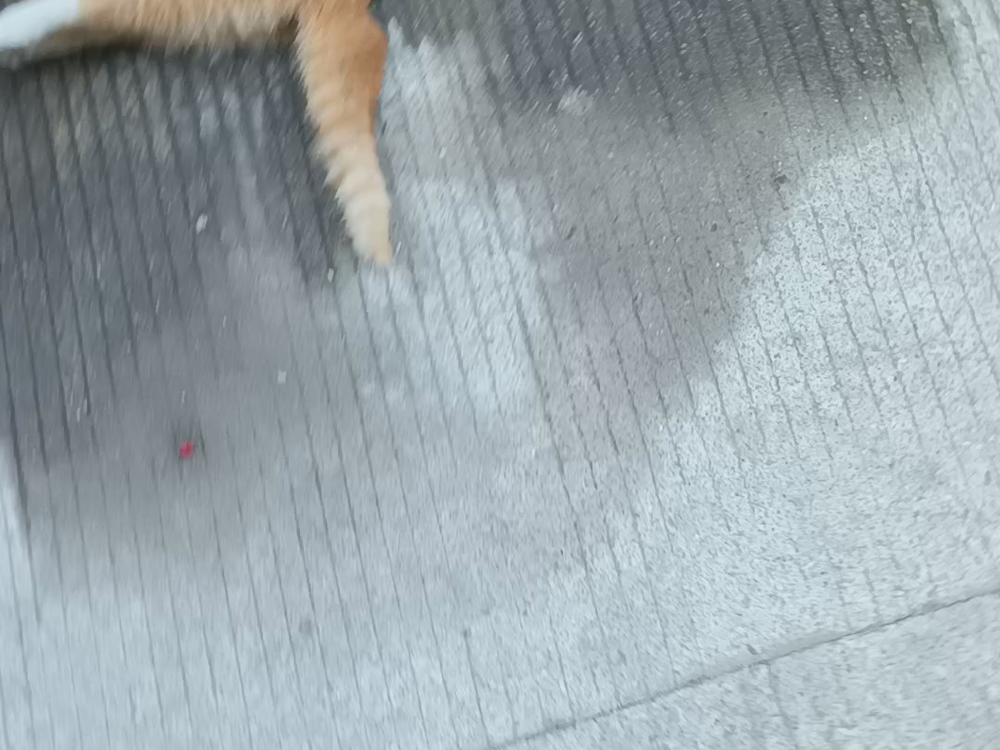 | 86 | 2026-04-24 |
| [哈基米这个爬树](https://www.bilibili.com/video/BV1H2oLBxE9N) | 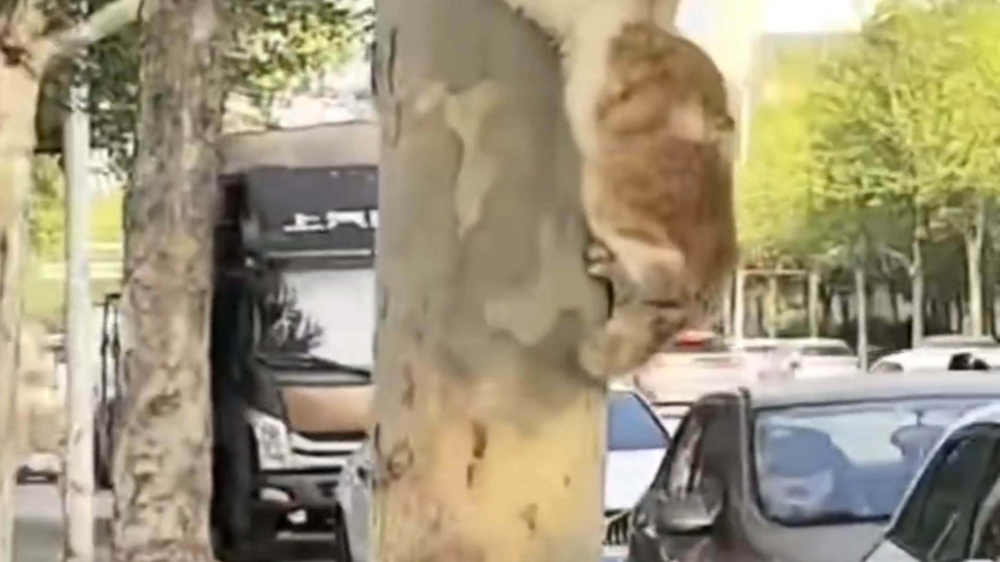 | 3314 | 2026-04-24 |
| [台风似乎带来了某些东西…【哈基米恐怖故事-台风天第十一集】](https://www.bilibili.com/video/BV1i6ojBJEyP) |  | 4.4万 | 2026-04-24 |
| [【海屿你】这只哈基米也有力气](https://www.bilibili.com/video/BV1sxojBfEcT) |  | 1679 | 2026-04-24 |
| [十二星座决定咪的专属牢房](https://www.bilibili.com/video/BV1JaojBREb7) | 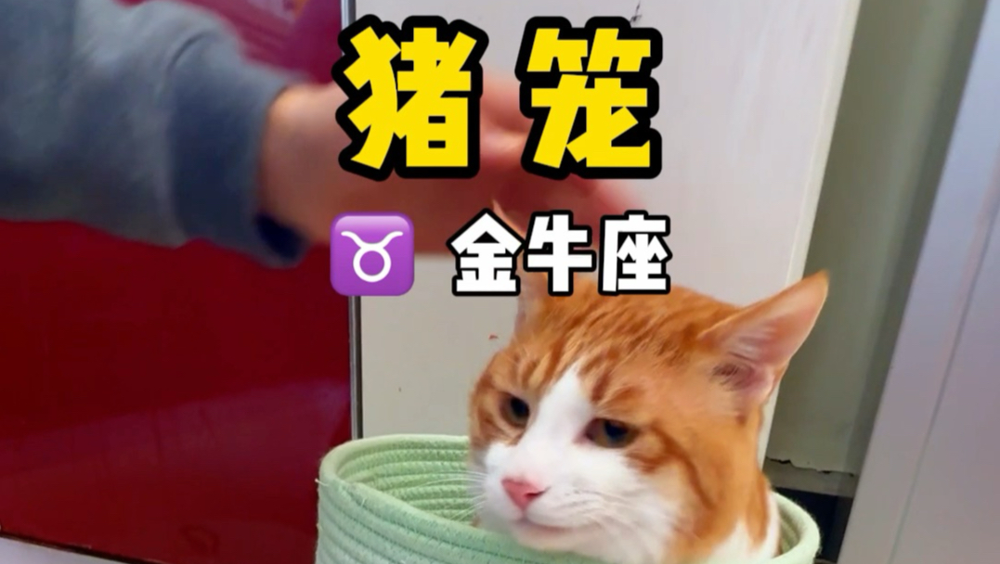 | 1.7万 | 2026-04-24 |
| [国人首通噩梦160！（应该）哈基米鸟人月光骑士鏖战双哈基米队长30分钟（留念一下）](https://www.bilibili.com/video/BV1PNo7BAEJH) |  | 1199 | 2026-04-24 |
| [4.24【月影杀】哈基米类魂-4K实机演示](https://www.bilibili.com/video/BV1PEo5BdEH2) |  | 850 | 2026-04-24 |
| [给哈基汪取个名字吧](https://www.bilibili.com/video/BV1eco5BME2s) |  | 1.4万 | 2026-04-24 |
| [鼠鼠刚回超市就遇到保险柜了](https://www.bilibili.com/video/BV1Gwo5BqEdP) | 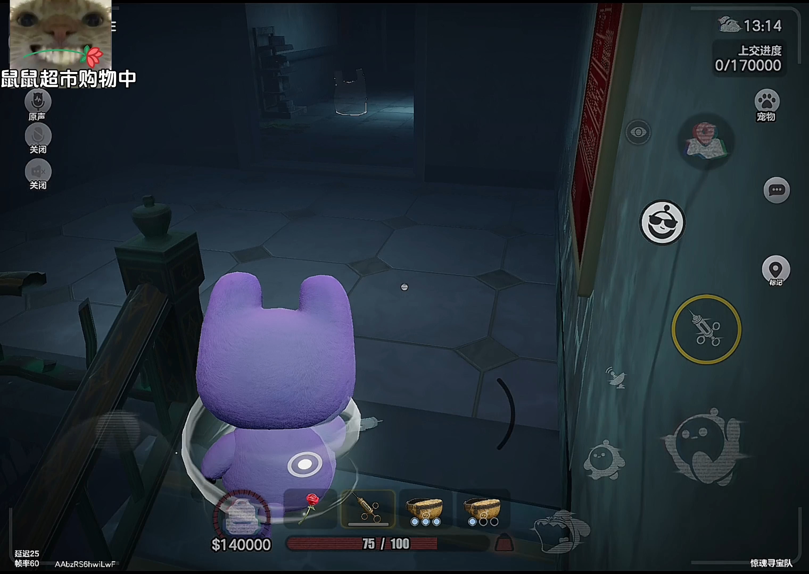 | 6.4万 | 2026-04-24 |
| [显卡TV旧传之主人教小猫跳舞](https://www.bilibili.com/video/BV15qo5BCES8) | 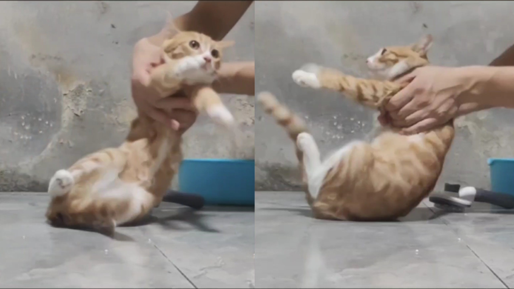 | 1732 | 2026-04-24 |
| [这是哪位乘客的猫咪呀](https://www.bilibili.com/video/BV13No5BvEEx) |  | 1.7万 | 2026-04-24 |
| [蛋仔岛保卫战：对抗哈基米](https://www.bilibili.com/video/BV1F4o5BnEnT) |  | 3829 | 2026-04-24 |
| [老八回归](https://www.bilibili.com/video/BV1enoLBVE1U) |  | 2.2万 | 2026-04-24 |
| [主人，我对你犯了错...](https://www.bilibili.com/video/BV1o8oGBzEtf) |  | 3.3万 | 2026-04-24 |
| [哈基米需要帮助](https://www.bilibili.com/video/BV1TNoMB3Esm) | 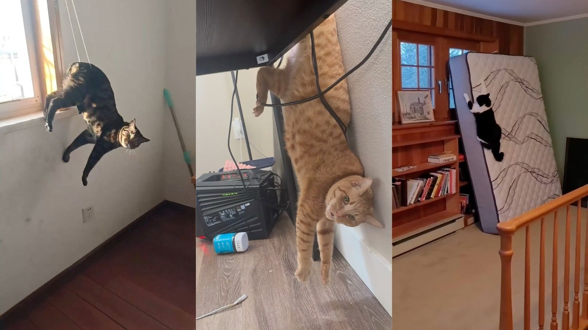 | 3019 | 2026-04-23 |
| [本猫咪有仇当场就报，绝不留过夜！](https://www.bilibili.com/video/BV16ooMBvEDU) | 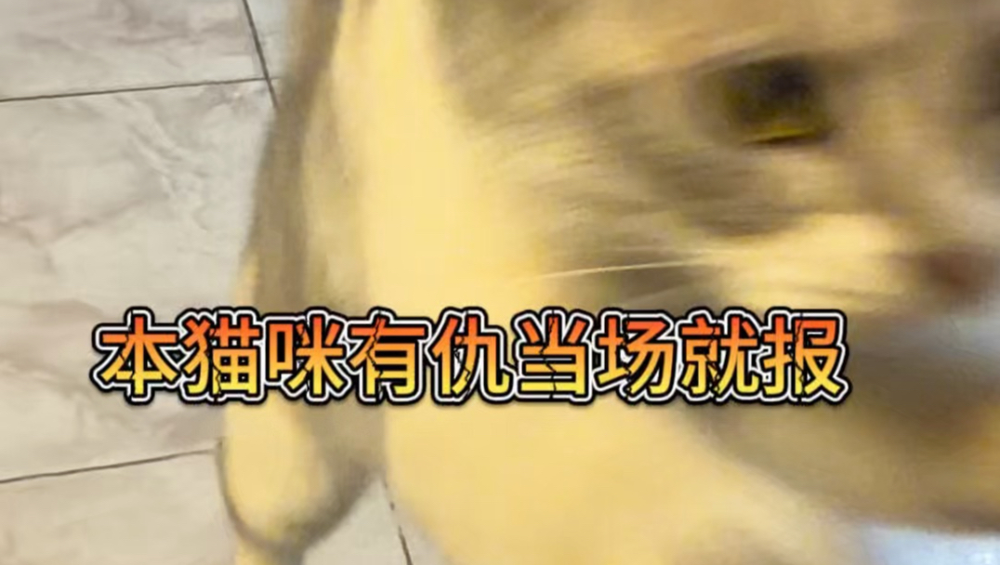 | 66.4万 | 2026-04-23 |
| [请问这还有救吗？](https://www.bilibili.com/video/BV1FooMBiE21) | 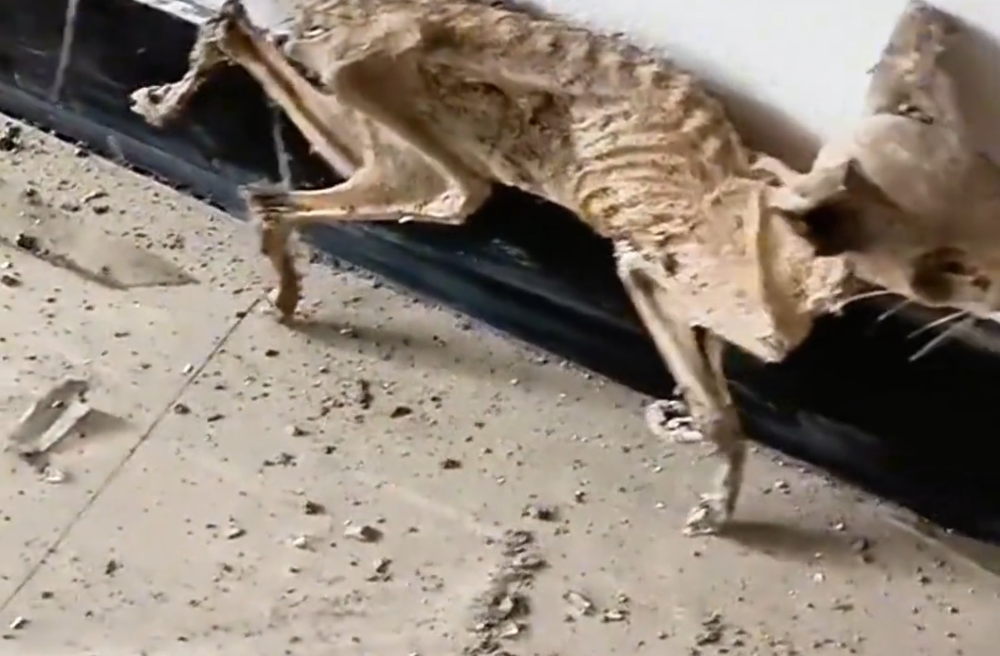 | 10.2万 | 2026-04-23 |
| [哈基米含量最高的一集，全局禁止脏话挑战…… ｜ 艾尔登法环黑夜君临](https://www.bilibili.com/video/BV1eqoWBeEK3) |  | 4398 | 2026-04-23 |
| [基米依旧老吴起手](https://www.bilibili.com/video/BV1jJo4BCEeJ) | 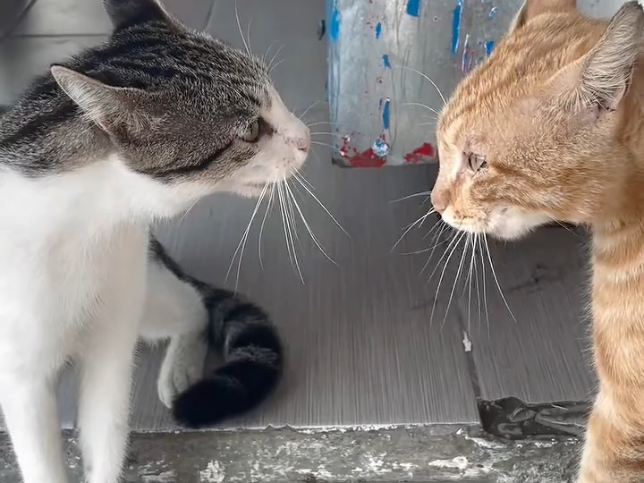 | 2965 | 2026-04-23 |
| [哈基米直接拿下](https://www.bilibili.com/video/BV1owo8BQEcZ) |  | 2.2万 | 2026-04-23 |
| [救助哈基米，阿维菌素](https://www.bilibili.com/video/BV1HfdmBCEX5) | 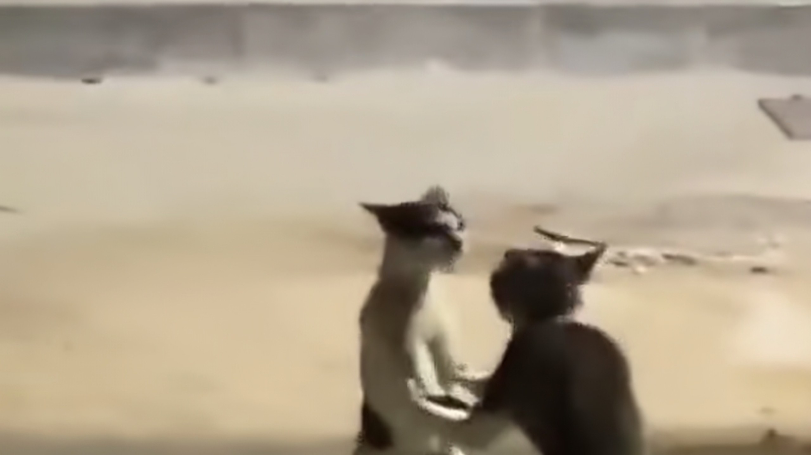 | 179 | 2026-04-21 |
| [【哈基派】玩APEX的5分钟是最开心的5小时👍](https://www.bilibili.com/video/BV1jddrBHEhp) | 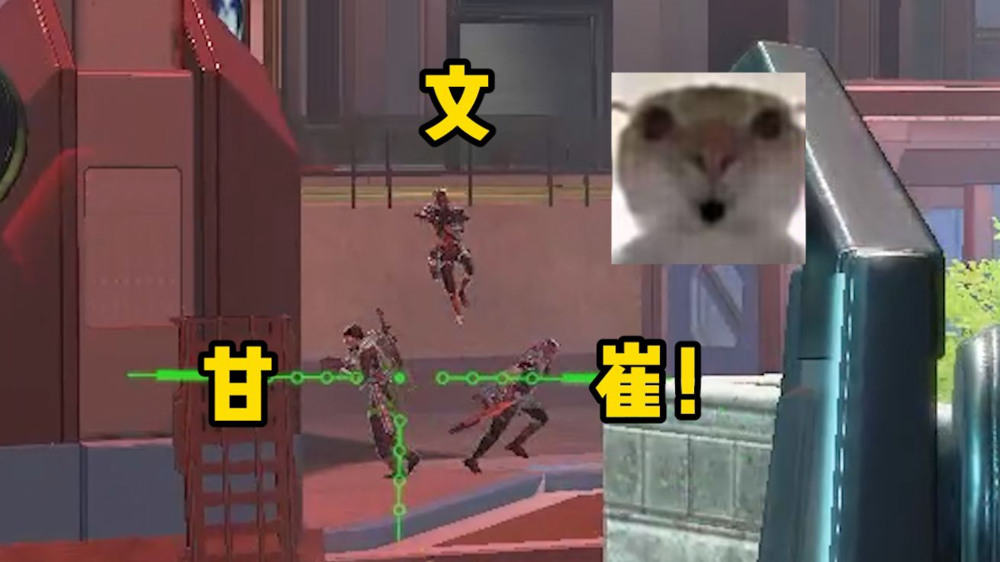 | 7.5万 | 2026-04-21 |
| [知更鸟也要哈基咪~](https://www.bilibili.com/video/BV1eEdrB2ErJ) |  | 7.8万 | 2026-04-20 |
| [哈基米代码冲突，一边哈气一边颤抖](https://www.bilibili.com/video/BV1DRddBEExG) | 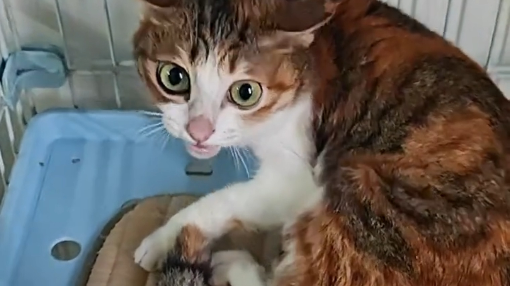 | 1.2万 | 2026-04-19 |
| [哈基米的战地视角](https://www.bilibili.com/video/BV1kgdoBME2t) | 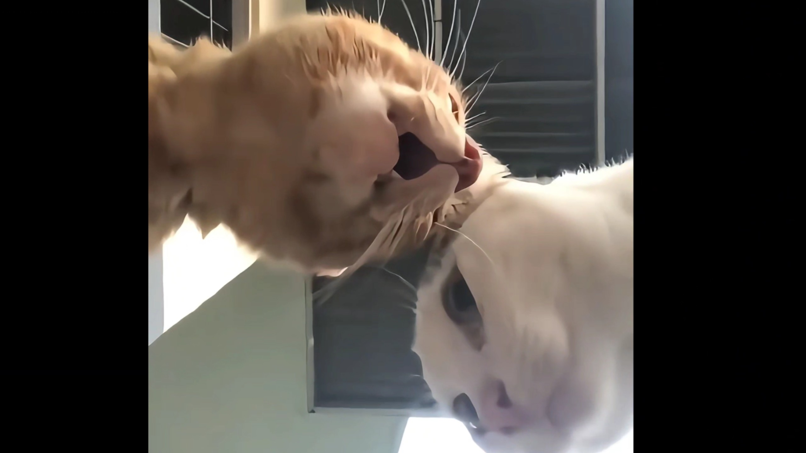 | 2847 | 2026-04-19 |
| [大运vs猫猫狗狗大军](https://www.bilibili.com/video/BV1YKdYBXECb) | 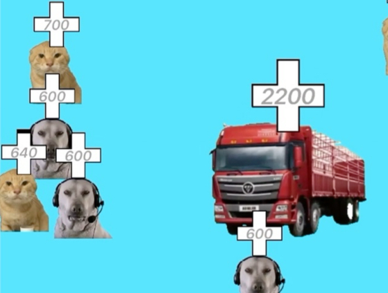 | 60.2万 | 2026-04-16 |
| [世界上又少了一个DDD玩家 ⚡最唐哈基米⚡【游戏王萌新路DLC5.0】](https://www.bilibili.com/video/BV1tTdbBiECy) |  | 1.2万 | 2026-04-16 |
| [哈基米：小不点，等人走了，你就知道了](https://www.bilibili.com/video/BV1K8QcBVE6C) | 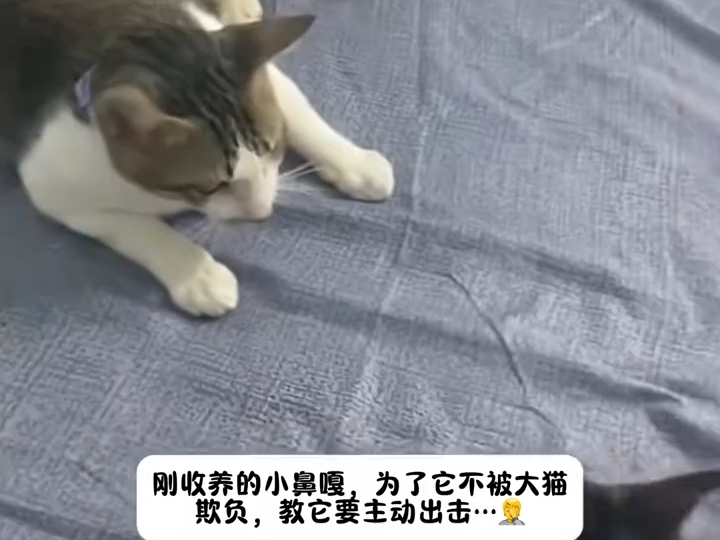 | 50.2万 | 2026-04-10 |
| [这诗猫啊？](https://www.bilibili.com/video/BV1KkDcB3EfW) | 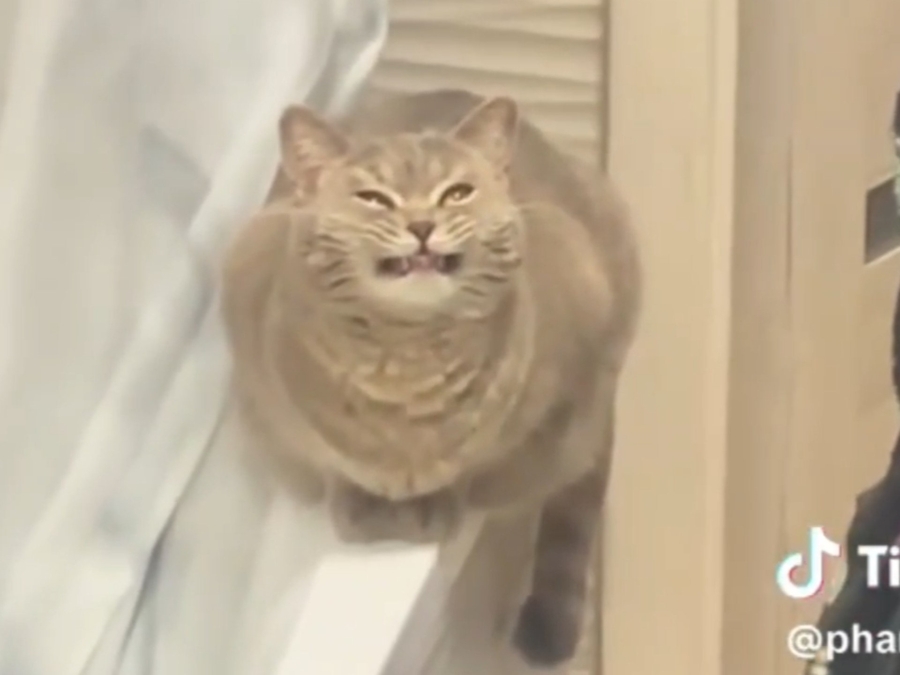 | 11.6万 | 2026-04-06 |
| [袋子可以把哈基米蛋装进去吗？](https://www.bilibili.com/video/BV1uPDTBhEWc) | 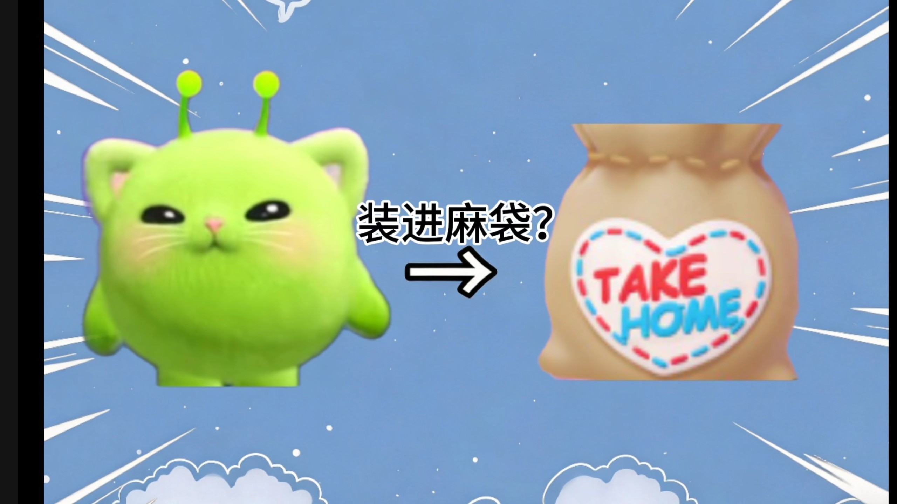 | 24.6万 | 2026-04-04 |
| [神秘哈基米？【古堡风波第二集】](https://www.bilibili.com/video/BV1vLDKBPEM6) |  | 2.1万 | 2026-04-04 |
| [喵喵不是废物！是绝世豪猫！现实中谁不喜欢可爱的哈基米](https://www.bilibili.com/video/BV1J5QrB1EvR) |  | 5.1万 | 2026-03-24 |
| [循环歌单｜【大狗对我叫FUNK】｜“当大狗叫做成FUNK”](https://www.bilibili.com/video/BV1kqNMzZEfH) |  | 39.8万 | 2026-03-08 |
| [tiktok上200多万播放的圆头耄耋视频，评论区全是表情包](https://www.bilibili.com/video/BV1GwpuzpEt4) |  | 34.5万 | 2025-09-15 |
| [哈基米邀请您一起跳舞](https://www.bilibili.com/video/BV18zbgzBE3s) | 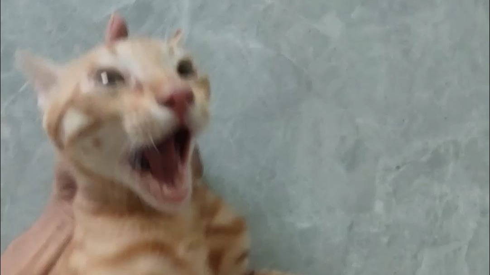 | 60.4万 | 2025-08-11 |
| [哈 基 米 莫 南 北 绿 豆](https://www.bilibili.com/video/BV1XybUzmEx8) |  | 112.6万 | 2025-07-25 |
| [哈基米：基米功夫](https://www.bilibili.com/video/BV14Ruiz9En3) |  | 1.4万 | 2025-07-14 |
| [哈基米对生物爹哈气被老基米揍了](https://www.bilibili.com/video/BV1BD3szyEGG) | 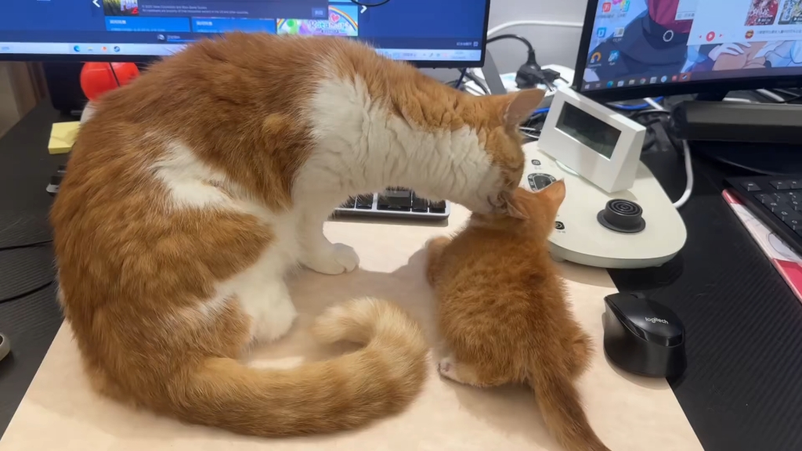 | 100.3万 | 2025-07-02 |
| [野生哈基米入侵撕咬宠物猫被当成足球了](https://www.bilibili.com/video/BV1YJKqzdE3c) | 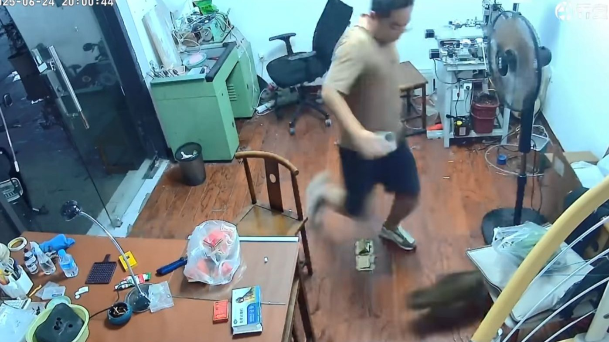 | 50.3万 | 2025-06-27 |
| [【神人杯Day13】曼波、基米、雪和孩子](https://www.bilibili.com/video/BV1ovEjzMETa) |  | 22.1万 | 2025-05-13 |
| [【哈基米阴悦】心做し](https://www.bilibili.com/video/BV1gUVMzfEzk) |  | 2.6万 | 2025-05-02 |
| [基米过马路](https://www.bilibili.com/video/BV1pzjczYEQG) | 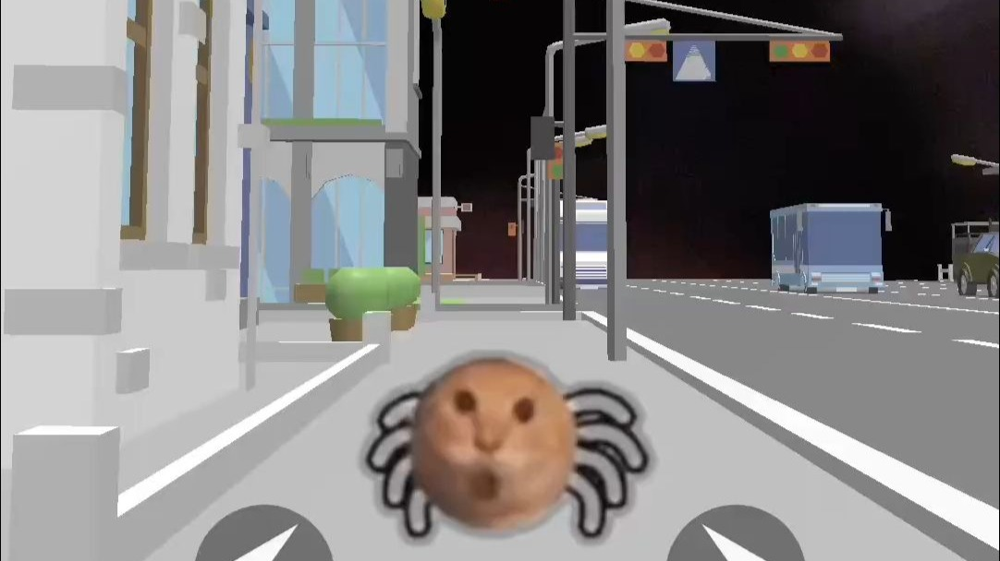 | 93.0万 | 2025-04-27 |
| [哈基米：古风歌曲《辞基米回忆》【神人杯预热作】](https://www.bilibili.com/video/BV1hMLXzQEF8) |  | 10.2万 | 2025-04-26 |
| [哈基米开心的跳起了街舞](https://www.bilibili.com/video/BV1v49RYHEVJ) | 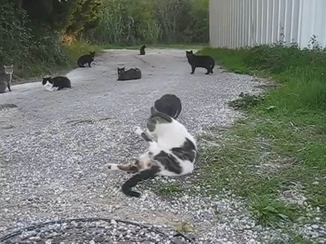 | 20.2万 | 2025-03-05 |
| [W&amp;W - OIIA OIIA (Spinning Cat)](https://www.bilibili.com/video/BV1iNcZeUEBa) |  | 30.8万 | 2025-01-17 |
| [不要整天哈基米了，这才是东海帝皇](https://www.bilibili.com/video/BV1WhnfeJE1G) |  | 4112 | 2024-08-31 |
| [天天哈基米哈基米，你们是小丑吗](https://www.bilibili.com/video/BV1i1bYepEyK) |  | 26.9万 | 2024-07-16 |

---
*最后更新: 2026-04-26 03:18:13 (自动生成)*
*数据来源: [Bilibili](https://www.bilibili.com)*

## 使用说明

运行以下命令更新视频列表:
```bash
python3 fetch_hajimi_videos.py
```
