# awesome-hajimi
collections of hajimi (哈基米 in Chinese) on the Internet.

## 视频列表 (Video List)

| 视频标题 (Title) | 封面 | 播放量 (Views) | 发布日期 (Date) |
|---|---|---|---|
| [NO BATIDAO哈基米版](https://www.bilibili.com/video/BV1PBdEBvEoB) | 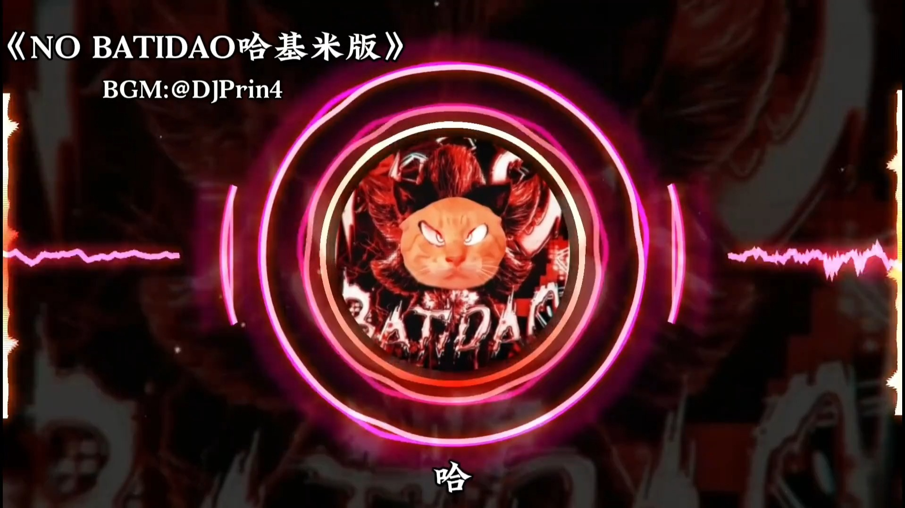 | 4 | 2026-04-18 |
| [哈基米这个喜欢游泳](https://www.bilibili.com/video/BV1NBdEBvEZr) |  | 39 | 2026-04-18 |
| [哈基米这个游泳强者](https://www.bilibili.com/video/BV1sBdEBvEdu) | 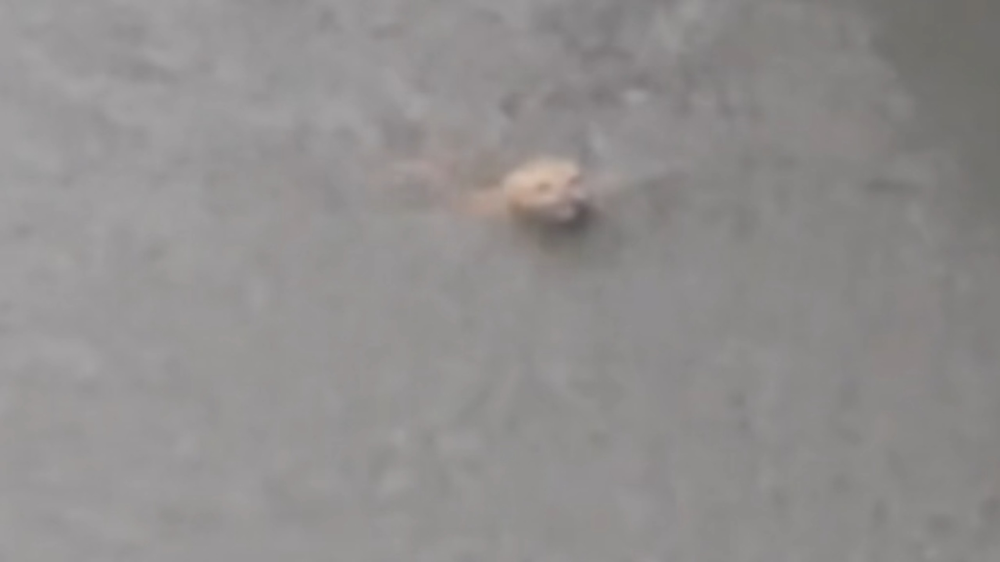 | 28 | 2026-04-18 |
| [野生哈基米](https://www.bilibili.com/video/BV1ACdEBwE24) | 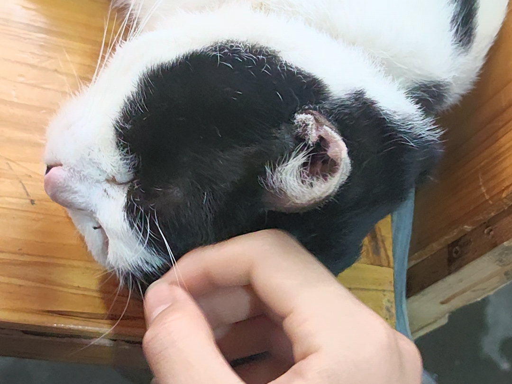 | 0 | 2026-04-18 |
| [哈基米：蛋蛋的忧桑，](https://www.bilibili.com/video/BV1GPdJBmE3D) | 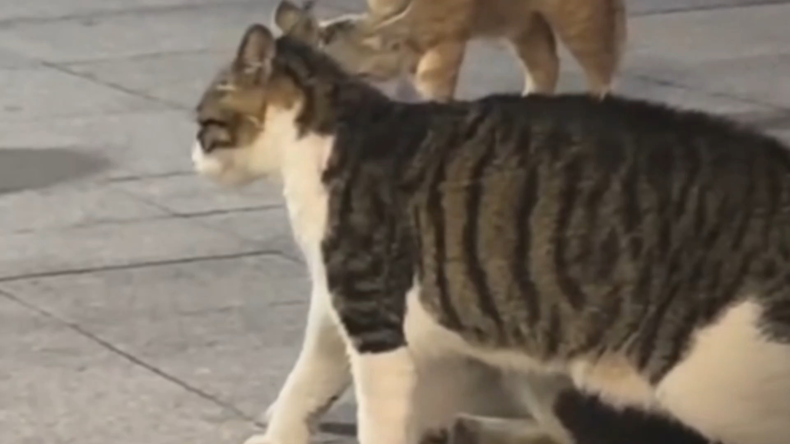 | 32 | 2026-04-18 |
| [咸鱼上的虐哈基米的人原来不是初犯了](https://www.bilibili.com/video/BV1RFdJBJEvV) | 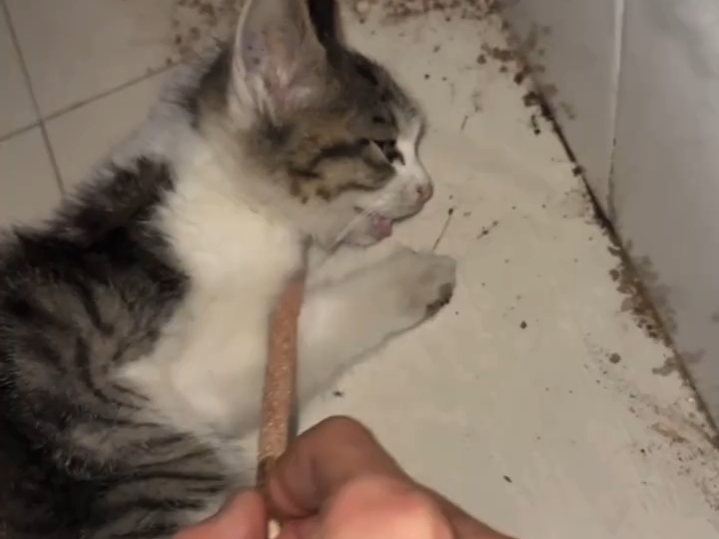 | 173 | 2026-04-18 |
| [草莓美人鱼猫来咯#美人鱼 #哈基米 #猫咪 #AI](https://www.bilibili.com/video/BV1RZdEBDE1K) |  | 111 | 2026-04-18 |
| [哥伦比娅也要哈基米](https://www.bilibili.com/video/BV18kdLBNEHy) |  | 44 | 2026-04-18 |
| [⚡哈基米TV第三期：请选择你的妈妈⚡](https://www.bilibili.com/video/BV1c8Q7B7E8o) |  | 132 | 2026-04-18 |
| [哈基米蛋](https://www.bilibili.com/video/BV1rxdJBaEbA) |  | 2 | 2026-04-18 |
| [哈基米喵喵一分钟](https://www.bilibili.com/video/BV1BYdJBoEiG) | 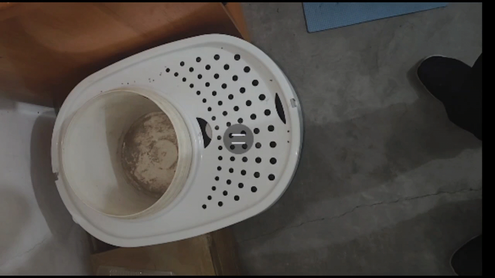 | 957 | 2026-04-18 |
| [开始净化！#哈基米 #曼波 #人鱼湾 #洛克王国 #我来开唱](https://www.bilibili.com/video/BV1tXd7BKEck) |  | 0 | 2026-04-17 |
| [手搓一首哈基米](https://www.bilibili.com/video/BV1t9d7BvEA3) |  | 0 | 2026-04-17 |
| [音域展示！#哈基米 #马年送礼就送哈基米 #哈基米南北绿豆浆 #赛马娘 #九阳豆浆](https://www.bilibili.com/video/BV1vqd7BjEye) |  | 0 | 2026-04-17 |
| [哈基狮搞搞核酸](https://www.bilibili.com/video/BV1q8dLBVErz) |  | 3154 | 2026-04-17 |
| [哈基米哈基米](https://www.bilibili.com/video/BV1yGdLBRE7R) | 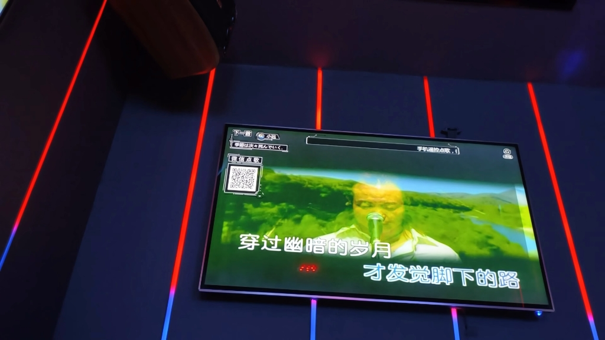 | 56 | 2026-04-17 |
| [贝蒂也要哈基米~](https://www.bilibili.com/video/BV1sXdLBtEik) |  | 509 | 2026-04-17 |
| [【哈基米跳起来平抽】视频加载中，速速查收惊喜！](https://www.bilibili.com/video/BV1aidLBuEBS) |  | 27 | 2026-04-17 |
| [【哈基米FM】灾变：咒翼灵哈](https://www.bilibili.com/video/BV1QzdLBTE7L) |  | 1003 | 2026-04-17 |
| [高三还能有哈基米摸的是很有生活的了~（结尾有图）](https://www.bilibili.com/video/BV1Y7djB3E1X) | 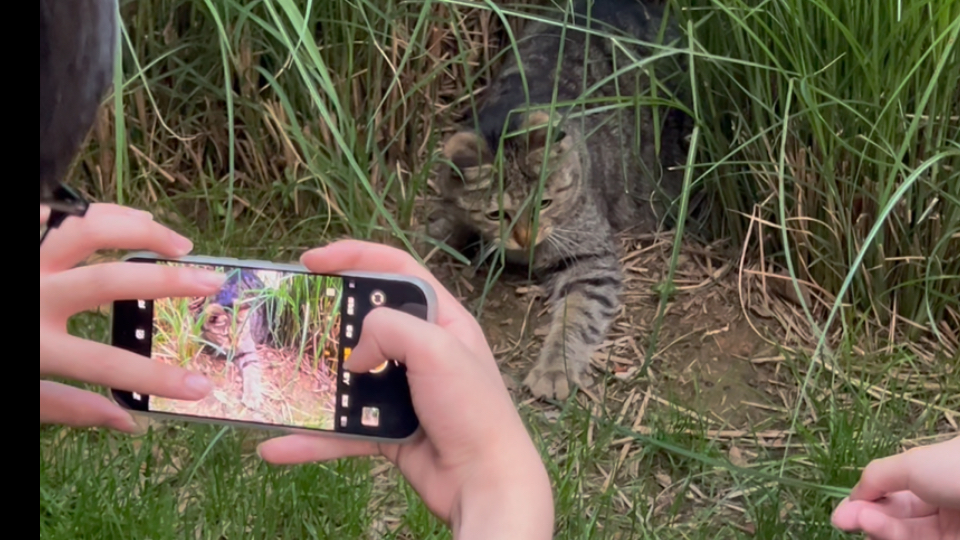 | 343 | 2026-04-17 |
| [【云游的哈基米】最新视频上线，求关注！](https://www.bilibili.com/video/BV1BudjB2EAE) | 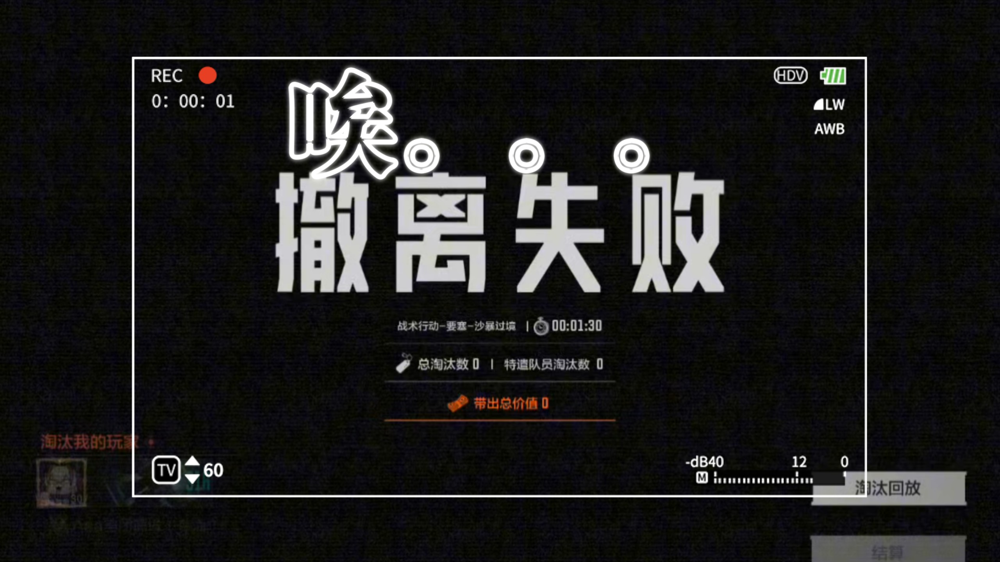 | 10 | 2026-04-17 |
| [什么叫我家当杂物堆的阳台成流浪哈基米的家了](https://www.bilibili.com/video/BV1vLdjBkEV3) | 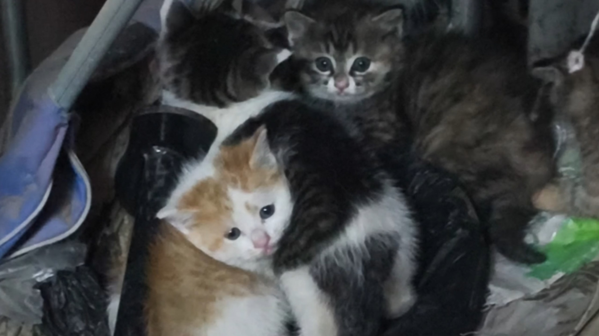 | 316 | 2026-04-17 |
| [哈基米遭工业X光机辐射,全身细胞受损没几天活头了](https://www.bilibili.com/video/BV1yddLBxEq7) |  | 3599 | 2026-04-17 |
| [花火也要哈基米~](https://www.bilibili.com/video/BV1nNdjBJEFJ) |  | 3248 | 2026-04-17 |
| [弗洛洛也要哈基米](https://www.bilibili.com/video/BV1yMdVBSESb) |  | 308 | 2026-04-17 |
| [【哈基米的无语】最新视频已上线，快来围观！](https://www.bilibili.com/video/BV1k3dVBmEMG) | 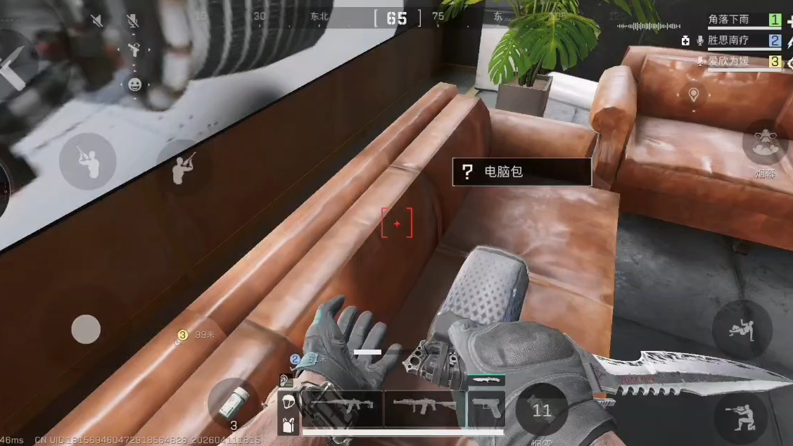 | 116 | 2026-04-17 |
| [今天来了三只帅帅的哈基米^_^](https://www.bilibili.com/video/BV1ySdVBQEum) | 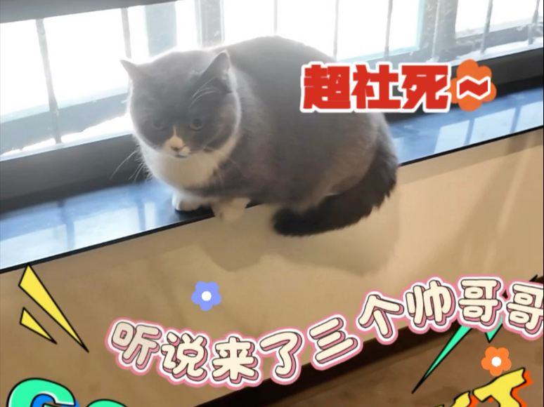 | 12 | 2026-04-17 |
| [补档《哈基米api》全程无声](https://www.bilibili.com/video/BV11SdVBQEhG) | 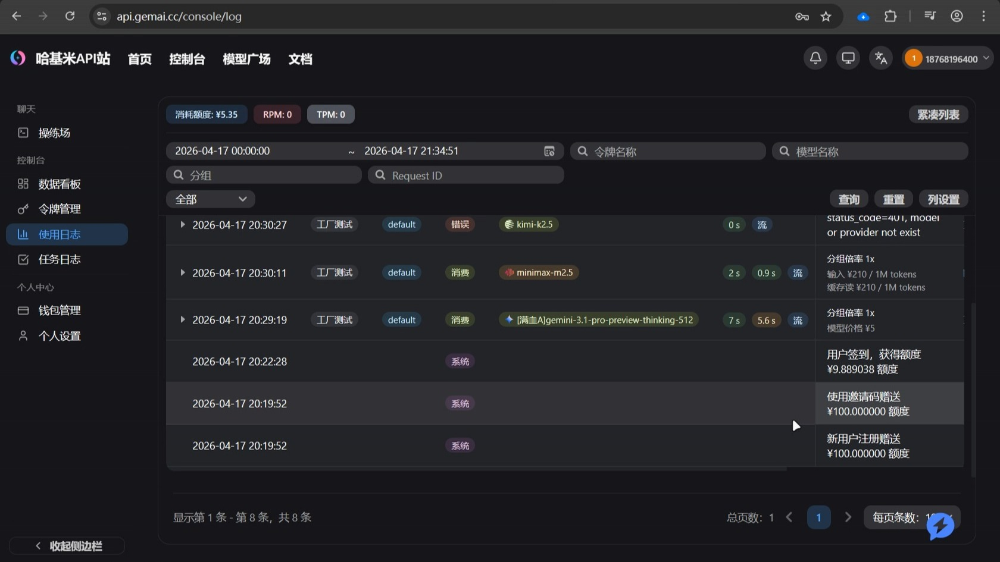 | 26 | 2026-04-17 |
| [咸鱼上面虐哈基米的](https://www.bilibili.com/video/BV1xUdVBpECF) | 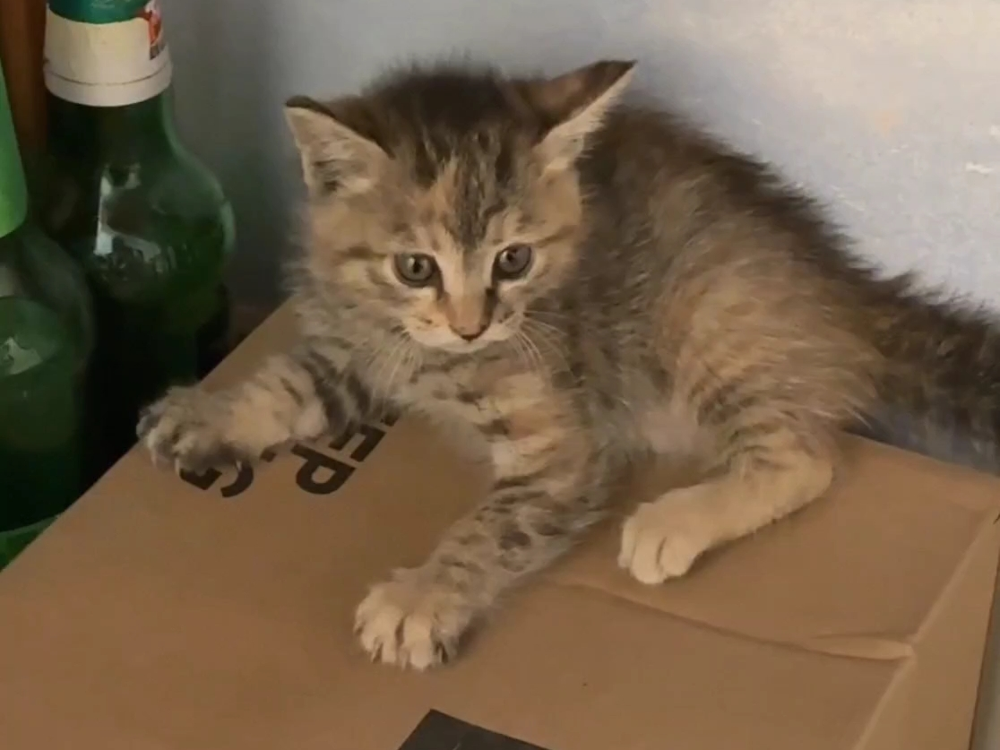 | 2920 | 2026-04-17 |
| [嘉豪哈基米](https://www.bilibili.com/video/BV1YYdVBYEDD) |  | 1948 | 2026-04-17 |
| [基米小学：耄耄做噩梦](https://www.bilibili.com/video/BV15bdVBTEVL) |  | 228 | 2026-04-17 |
| [台风似乎带来了某些东西…【哈基米恐怖故事-台风天第九集】](https://www.bilibili.com/video/BV1V3d5BqENK) |  | 3.2万 | 2026-04-17 |
| [哈基米~](https://www.bilibili.com/video/BV1v3d5BqEKz) |  | 4869 | 2026-04-17 |
| [麻麻，我再咪一会儿好不好？](https://www.bilibili.com/video/BV1HZdVBjEUe) | 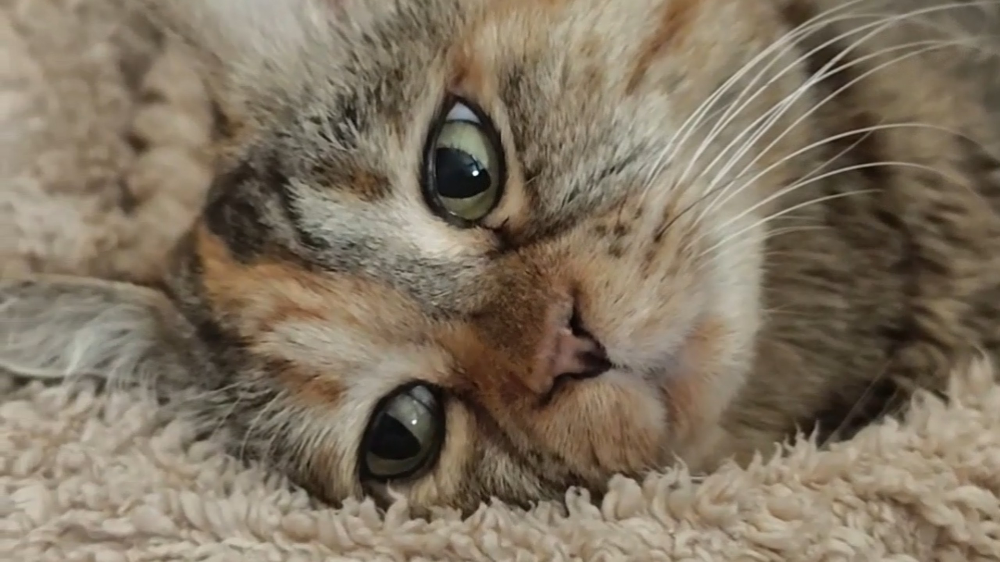 | 2.3万 | 2026-04-17 |
| [所有人都让我丢了它，可我做不到](https://www.bilibili.com/video/BV1VmdYBREvZ) | 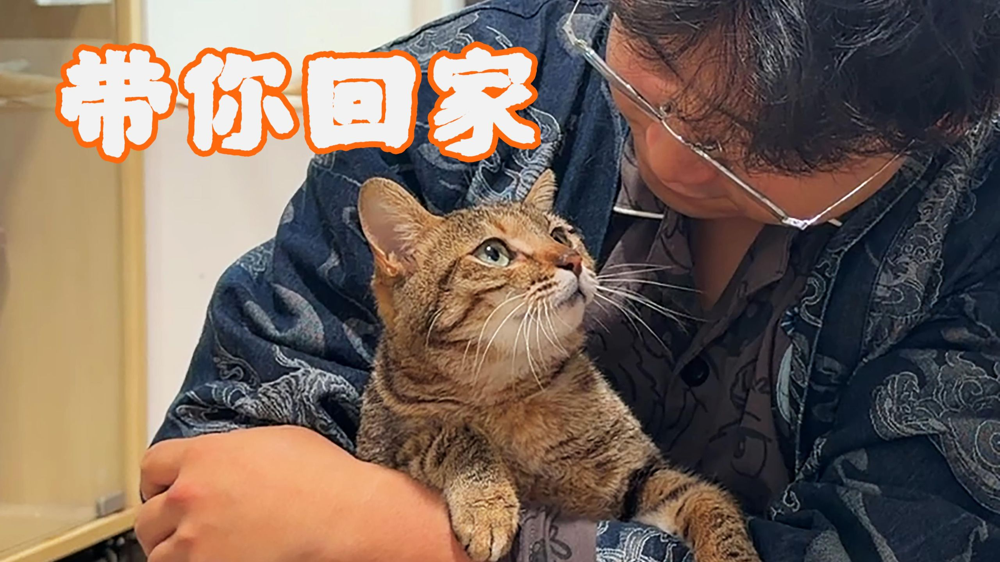 | 7256 | 2026-04-17 |
| [不发评论的给你变成哈基米](https://www.bilibili.com/video/BV19JdzBMEpi) |  | 54 | 2026-04-17 |
| [哈基米再也没有对手了](https://www.bilibili.com/video/BV1BPd5BGELc) |  | 951 | 2026-04-17 |
| [美人鱼猫就是最好看的表情包#美人鱼 #哈基米 #猫咪 #AI](https://www.bilibili.com/video/BV1zcd5B5E8o) |  | 4517 | 2026-04-17 |
| [30只哈基米入侵蛋仔岛](https://www.bilibili.com/video/BV1N8d5BsEwp) |  | 2280 | 2026-04-17 |
| [纳西妲也要哈基米~](https://www.bilibili.com/video/BV1Nhd5B9EBj) |  | 6015 | 2026-04-17 |
| [谁特么寄的鸟巢！](https://www.bilibili.com/video/BV1UpdqBtES5) | 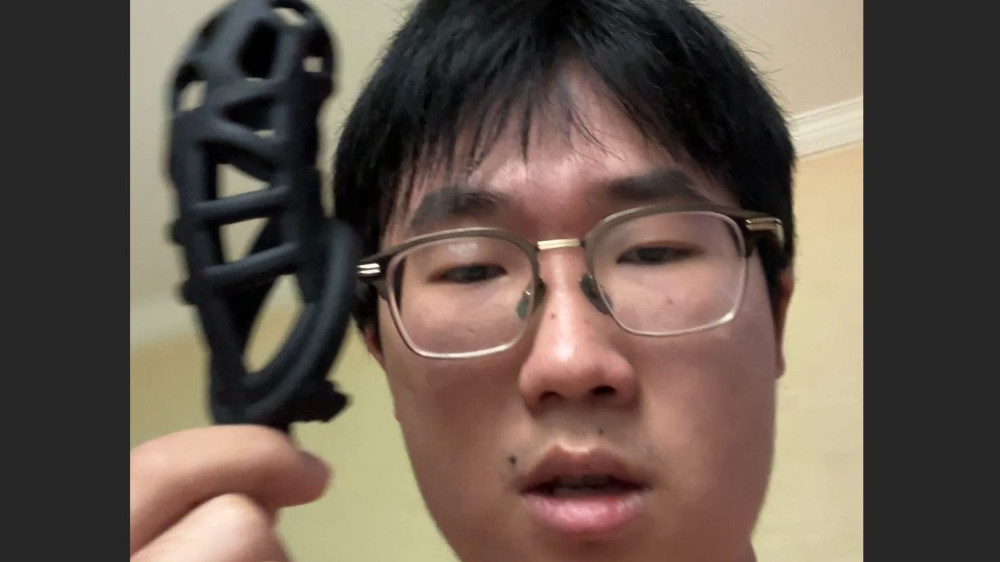 | 28.5万 | 2026-04-17 |
| [哈基米，南北绿豆，阿西噶哈，压库那龙…](https://www.bilibili.com/video/BV1Fzd5BEES6) | 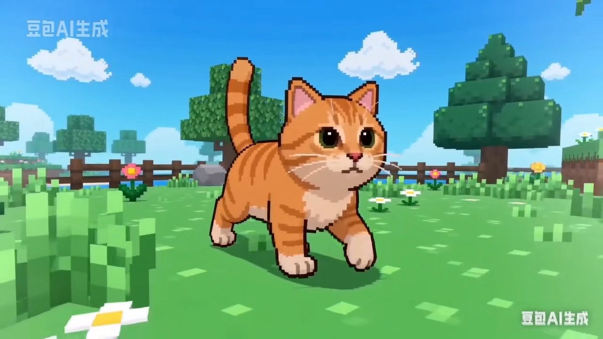 | 131 | 2026-04-17 |
| [【原曲不使用】🐱哈基米开心の小曲 - Smile🐱](https://www.bilibili.com/video/BV1wqd5BSEkF) |  | 2523 | 2026-04-17 |
| [有小猫真好](https://www.bilibili.com/video/BV18pd5BFEBr) | 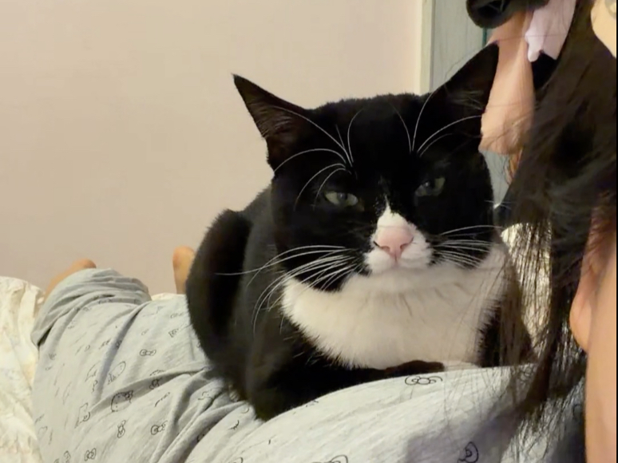 | 1.2万 | 2026-04-17 |
| [⚡哈基米TV第二期：妈妈别打了⚡](https://www.bilibili.com/video/BV1oqQ7BrEou) |  | 128 | 2026-04-17 |
| [【智人TV】对咯，这样带娃就对咯](https://www.bilibili.com/video/BV1Y4QEBMEdk) |  | 8.3万 | 2026-04-17 |
| [遇到这样超粘人的橘猫该怎么办？](https://www.bilibili.com/video/BV1SkdBBYEpo) | 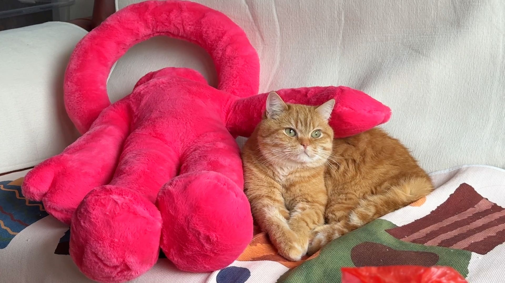 | 2.0万 | 2026-04-17 |
| [难道鼠鼠是幸运鼠吗又出了双大金](https://www.bilibili.com/video/BV1TWd5BbEDY) | 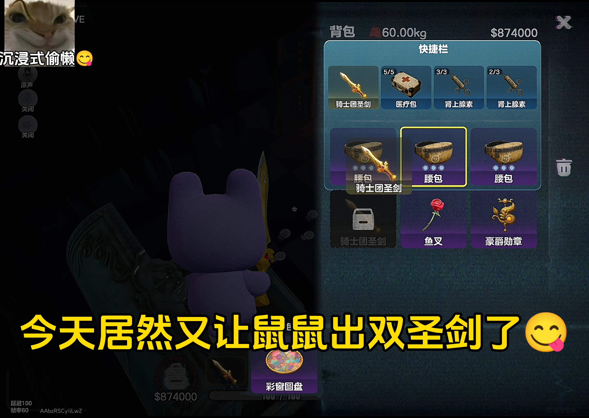 | 2704 | 2026-04-17 |
| [哈基米喔，南北绿豆](https://www.bilibili.com/video/BV1KQdBBtEnY) |  | 35 | 2026-04-17 |
| [☠️🥩巨恐怖餐饮🍳☠️](https://www.bilibili.com/video/BV1yzd8BYE5A) | 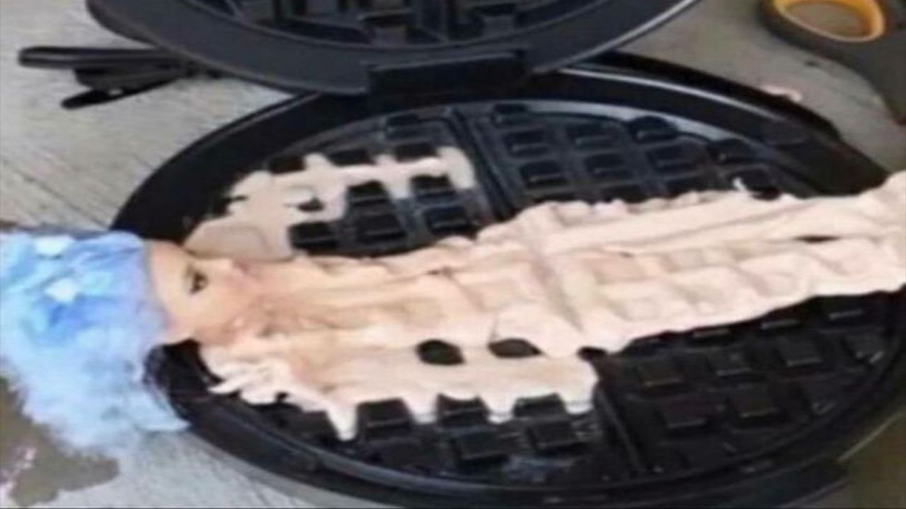 | 17.8万 | 2026-04-17 |
| [长风妈妈还要哈基米南北绿豆~🥵](https://www.bilibili.com/video/BV1CddBB9EzN) |  | 706 | 2026-04-17 |
| [【哈基米】快逃！风雷翅！](https://www.bilibili.com/video/BV1ATdaBPEss) | 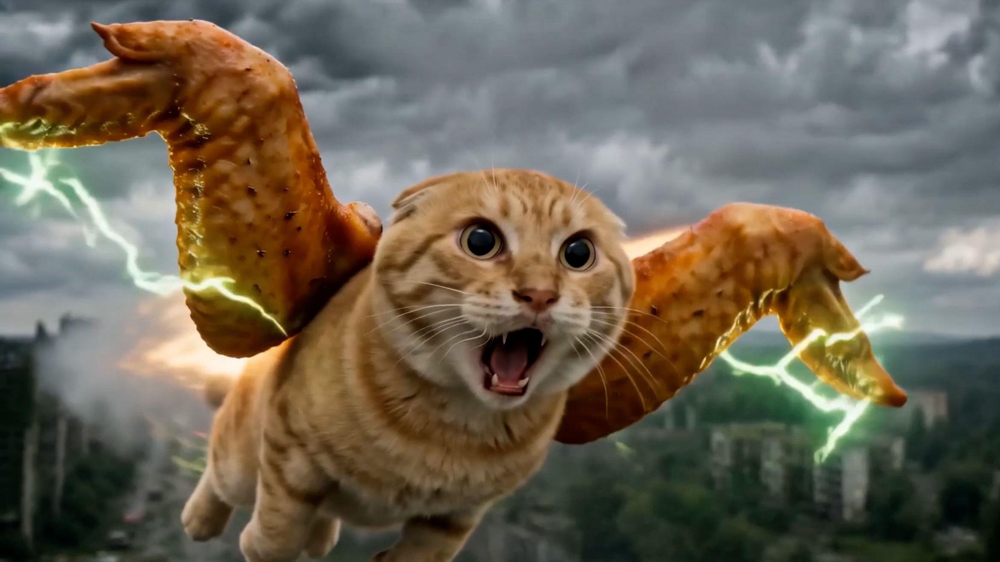 | 3.6万 | 2026-04-17 |
| [哈基米](https://www.bilibili.com/video/BV19idBBqEJF) | 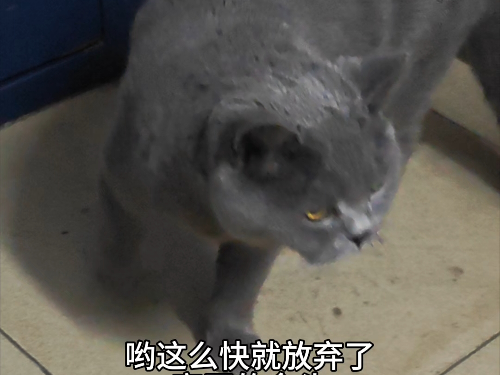 | 172 | 2026-04-17 |
| [投喂哈基米](https://www.bilibili.com/video/BV19idBBqEFt) |  | 150 | 2026-04-17 |
| [哈基米](https://www.bilibili.com/video/BV1VBdBBTECq) |  | 107 | 2026-04-17 |
| [【哈基米助眠】治愈の小曲 Late Night Melancholy](https://www.bilibili.com/video/BV1UmdBBFEuM) |  | 790 | 2026-04-17 |
| [哈基米南北绿豆](https://www.bilibili.com/video/BV1gkdBBeEyC) |  | 1.1万 | 2026-04-17 |
| [哈基米大战大狗叫](https://www.bilibili.com/video/BV1DkdBBYEXA) |  | 63 | 2026-04-17 |
| [玩玩韩国的哈基米小游戏](https://www.bilibili.com/video/BV1ejdzBgE35) | 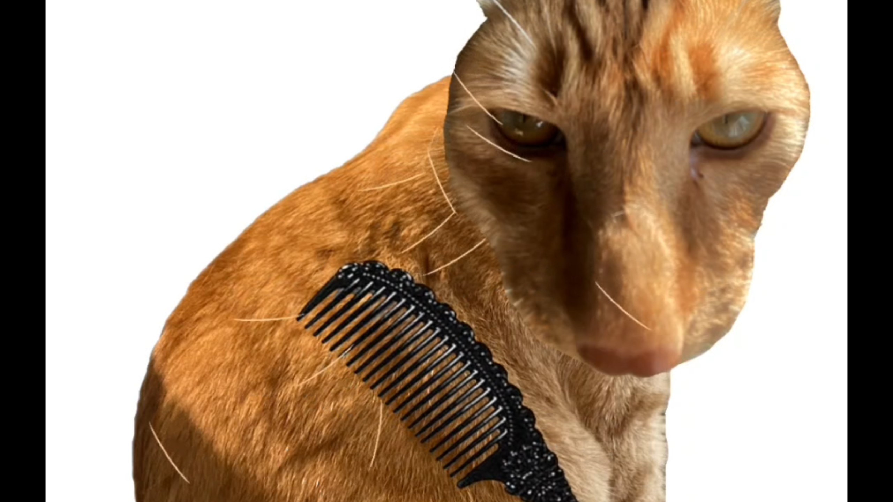 | 1601 | 2026-04-17 |
| [东北哈基米出现了，直接当场终结掉](https://www.bilibili.com/video/BV1iVdzBGEEa) |  | 35 | 2026-04-17 |
| [哈基米蛋最可爱的一次。](https://www.bilibili.com/video/BV1oVdzBGEr9) |  | 133 | 2026-04-17 |
| [给哈基米买了个猫抓板，刚放进去就玩上了😂](https://www.bilibili.com/video/BV1QWdzBvEh5) | 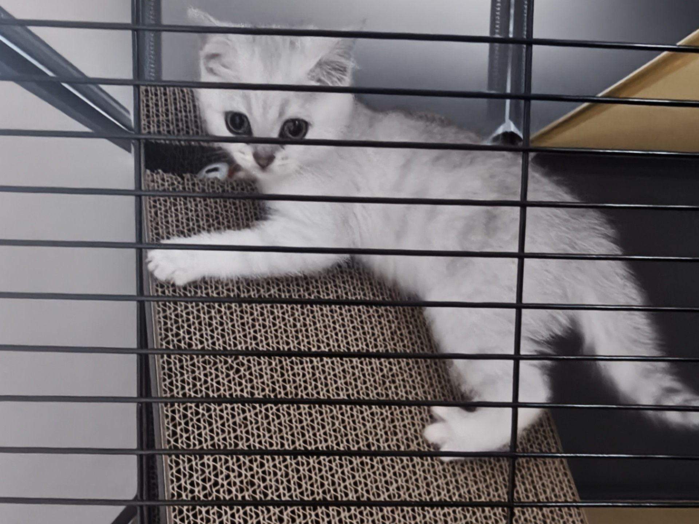 | 88 | 2026-04-17 |
| [这样的哈基米你们见过吗？](https://www.bilibili.com/video/BV1qudqBTELe) |  | 1.4万 | 2026-04-17 |
| [哈基米屎山代码（二）](https://www.bilibili.com/video/BV1ncdzBHECw) | 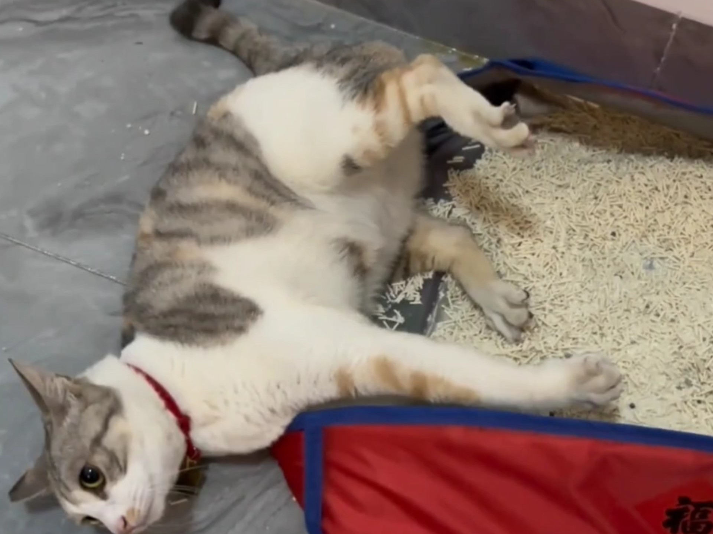 | 2.3万 | 2026-04-17 |
| [小刀盾的进化之路 S4-01](https://www.bilibili.com/video/BV1BTdzBjEZr) |  | 103.4万 | 2026-04-17 |
| [？！哈基米基哈！？](https://www.bilibili.com/video/BV1hEdqBcE1V) | 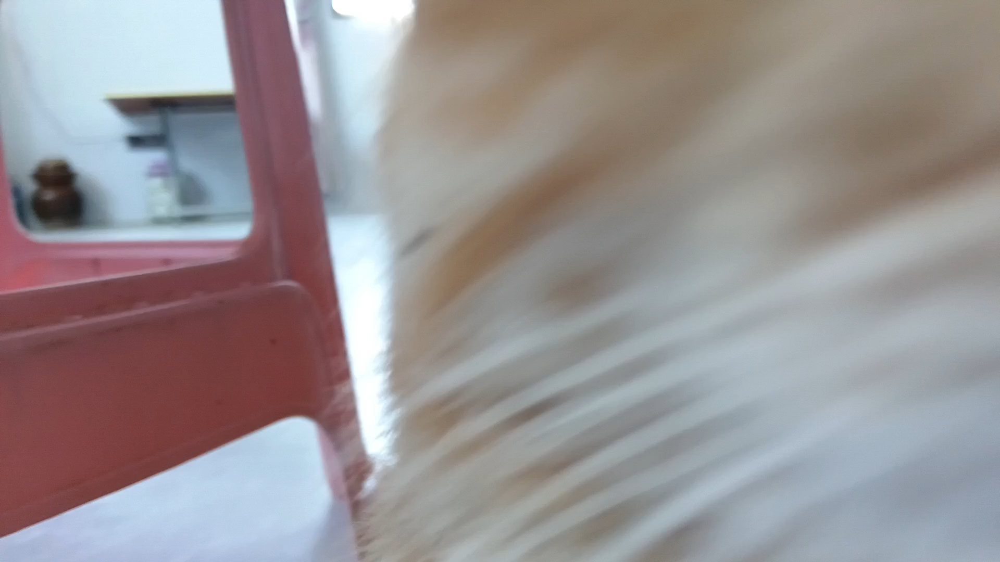 | 21 | 2026-04-17 |
| [&quot;接下来奔赴战场的是...&quot;](https://www.bilibili.com/video/BV1mddhBrEvv) |  | 52.1万 | 2026-04-17 |
| [昔涟也要哈基米~](https://www.bilibili.com/video/BV1zpQpB4Erd) |  | 5.5万 | 2026-04-17 |
| [´ᯅ`](https://www.bilibili.com/video/BV1SpdqBtEd8) |  | 5.0万 | 2026-04-17 |
| [来过两招？](https://www.bilibili.com/video/BV1MPdBB8E9G) | 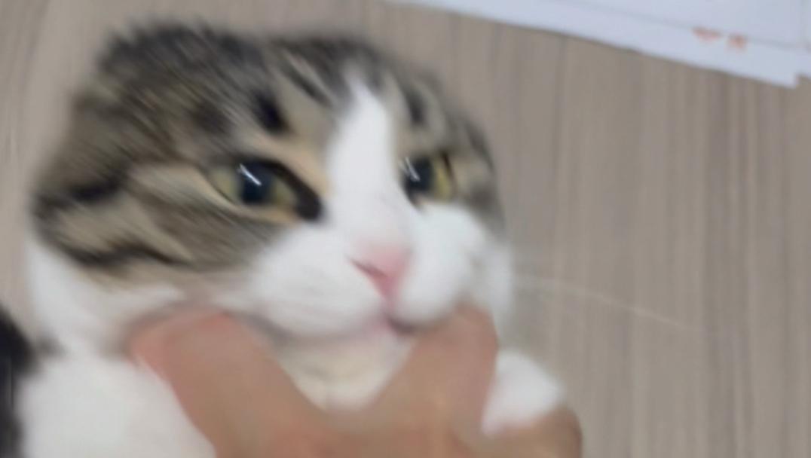 | 6.9万 | 2026-04-17 |
| [哈基米小孩姐vs原皮](https://www.bilibili.com/video/BV1uNdBBfEub) |  | 153 | 2026-04-17 |
| [大 狗 觉⚡⚡](https://www.bilibili.com/video/BV1g9dYBDEtC) |  | 2.0万 | 2026-04-17 |
| [2400球出了个永久闭着眼睛的雪影娃娃，全都完了](https://www.bilibili.com/video/BV1EQd8BWEqR) |  | 90.2万 | 2026-04-17 |
| [樱花树下的哈基米](https://www.bilibili.com/video/BV1uvdeBXEbt) | 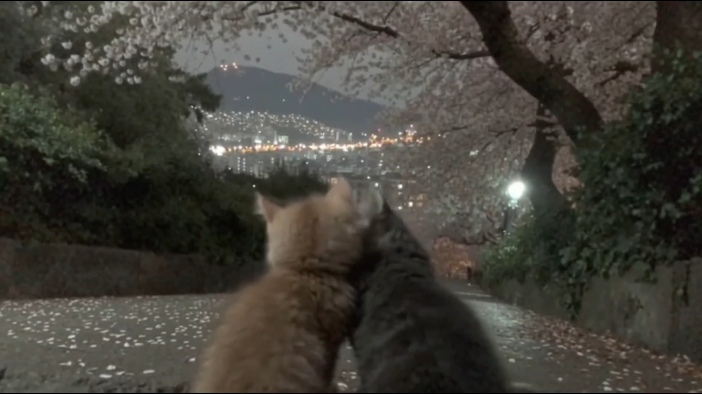 | 2 | 2026-04-16 |
| [试图点穴到哈基咪的麻筋失败](https://www.bilibili.com/video/BV1qwdvBPEnv) | 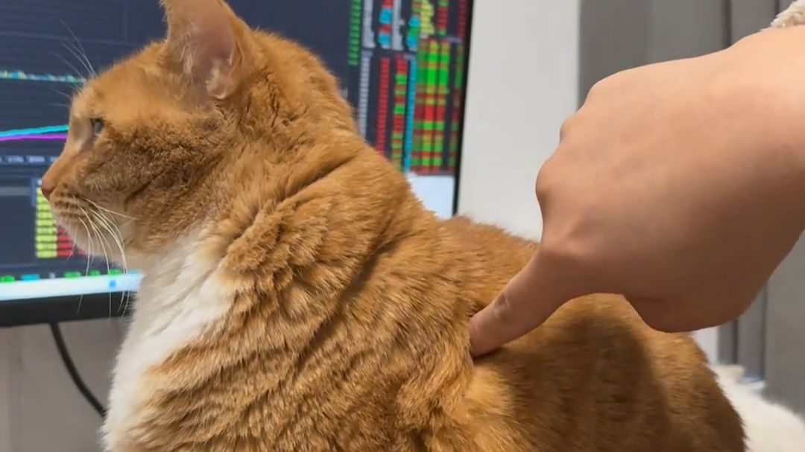 | 4.0万 | 2026-04-16 |
| [电视机坏了没有娱乐了 太无聊了！上山修行吧](https://www.bilibili.com/video/BV1uXdhBCEBQ) | 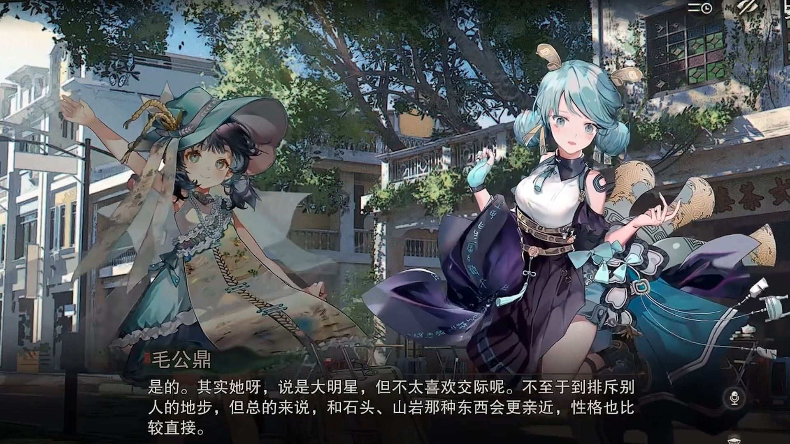 | 1.7万 | 2026-04-16 |
| [哈基米外交](https://www.bilibili.com/video/BV1BfdaBtEcr) |  | 1.8万 | 2026-04-16 |
| [一键生成哈基米？](https://www.bilibili.com/video/BV1Ckd8BhEfq) |  | 2638 | 2026-04-16 |
| [偶遇哈基米 依旧见车就钻](https://www.bilibili.com/video/BV1FUd8BtEkp) | 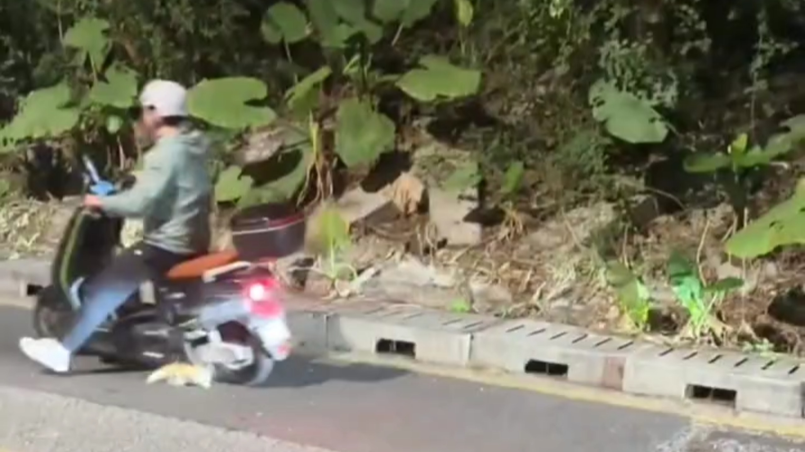 | 4.7万 | 2026-04-16 |
| [哈基比哈基比好胖好可爱](https://www.bilibili.com/video/BV1tid8BiELP) |  | 7.8万 | 2026-04-16 |
| [哈基米：dilemma](https://www.bilibili.com/video/BV12jdhBMEkn) |  | 1061 | 2026-04-16 |
| [又有小猫没有家了](https://www.bilibili.com/video/BV1qRd8BpE3m) | 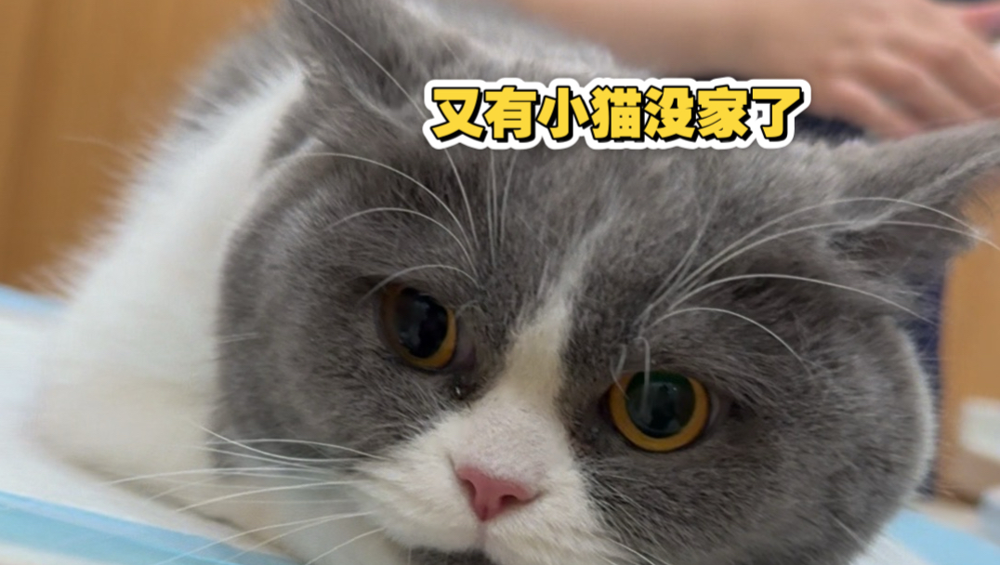 | 7.5万 | 2026-04-16 |
| [贾斯汀比伯《Baby》，但是印度风格](https://www.bilibili.com/video/BV1KddhBrErG) |  | 187.3万 | 2026-04-16 |
| [您有一封哈夫克来的信](https://www.bilibili.com/video/BV165QEBjErU) |  | 48.8万 | 2026-04-16 |
| [沉浸式撸嘬！](https://www.bilibili.com/video/BV1Qpd8B5E81) | 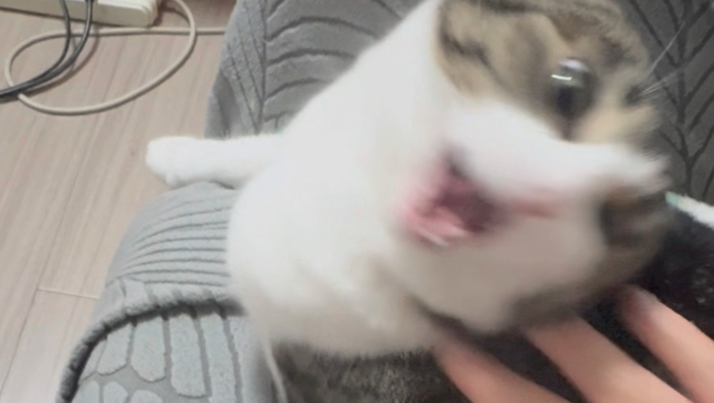 | 8.6万 | 2026-04-16 |
| [【星球大战】🐱𝑻𝒉𝒆 𝑴𝒂𝒏𝒅𝒂𝒍𝒐𝒓𝒊𝒂𝒏曼波洛人🐱](https://www.bilibili.com/video/BV1MCQnBKENH) |  | 2414 | 2026-04-15 |
| [每日减速带系列](https://www.bilibili.com/video/BV1ruQEBSE9k) | 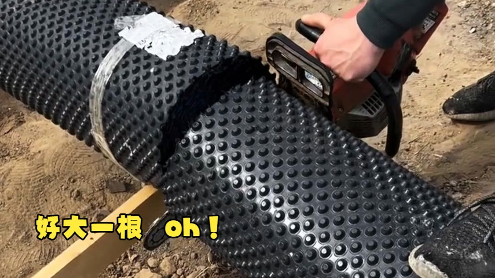 | 5.2万 | 2026-04-15 |
| [开门同学请答题](https://www.bilibili.com/video/BV1X8QEBKEJm) | 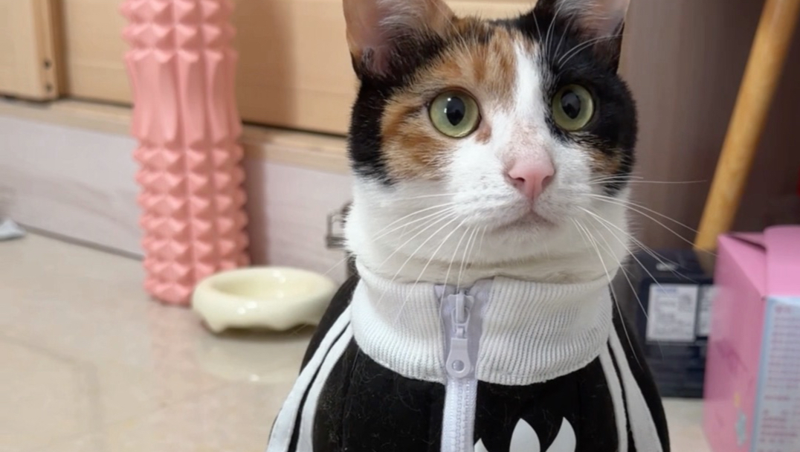 | 59.4万 | 2026-04-15 |
| [月入四千和一万居然能差出来七倍？！【基米大科普】](https://www.bilibili.com/video/BV1mxQGByE4d) |  | 9.3万 | 2026-04-15 |
| [哈基哈基米](https://www.bilibili.com/video/BV1wtQ7BUEMV) | 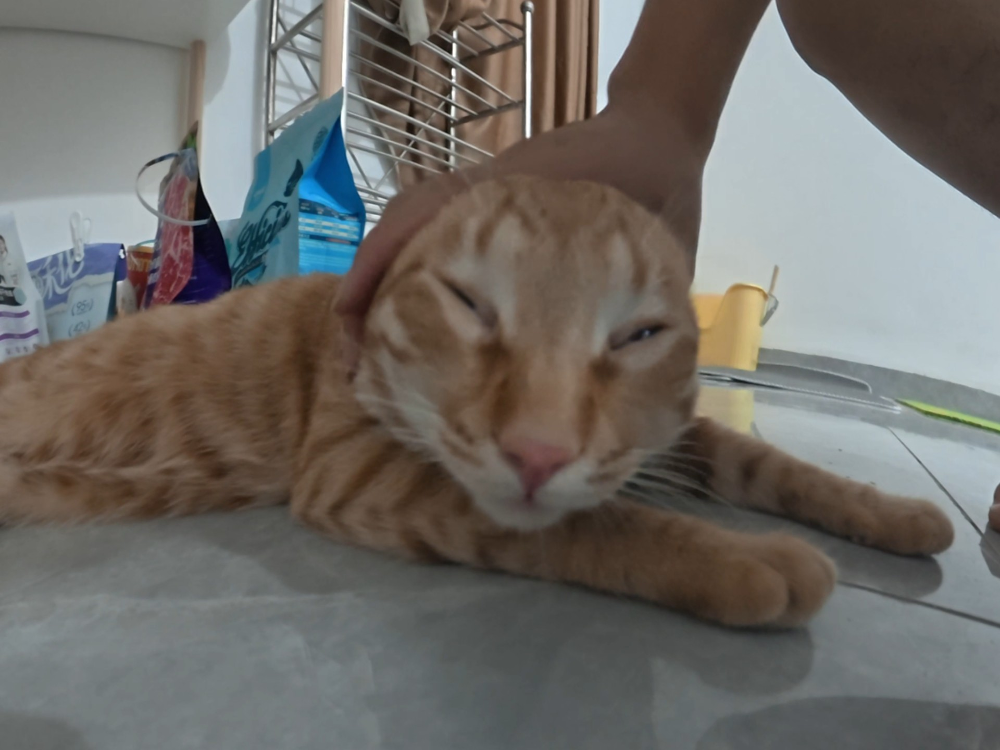 | 6.8万 | 2026-04-15 |
| [[精神TV]这辈子有了](https://www.bilibili.com/video/BV1zAQGB8Ers) |  | 32.6万 | 2026-04-14 |
| [海阔天空，但是哈基米版](https://www.bilibili.com/video/BV1AiQgBcEDs) |  | 96 | 2026-04-14 |
| [这次是真曼波](https://www.bilibili.com/video/BV15qQiBsEpx) |  | 15.0万 | 2026-04-14 |
| [热梗大乱斗第15集](https://www.bilibili.com/video/BV1RqDDBoEEy) |  | 108.7万 | 2026-04-12 |
| [【chunithm】还是小动物舒服啊谢谢你    每次打这个哈皮写的谱我都不敢想他里面能有多润 彩绿电锯人sss 200fo感谢](https://www.bilibili.com/video/BV1BgD6BvEGD) |  | 7664 | 2026-04-07 |
| [找到组织了✌☺](https://www.bilibili.com/video/BV1XbDGBUE3i) |  | 22.5万 | 2026-04-05 |
| [【循环歌曲】· 禅者行脚の小曲  清冷佛子の小曲《TRILLIUM HARDTEKK》 ｜ “跳跃不是罪过，跳⃠跃⃠不⃠是⃠罪⃠过⃠”](https://www.bilibili.com/video/BV1qEDGBxEM9) |  | 229.3万 | 2026-04-05 |
| [《哈基蜂与威虫》第一集](https://www.bilibili.com/video/BV1V29EBGEYG) | 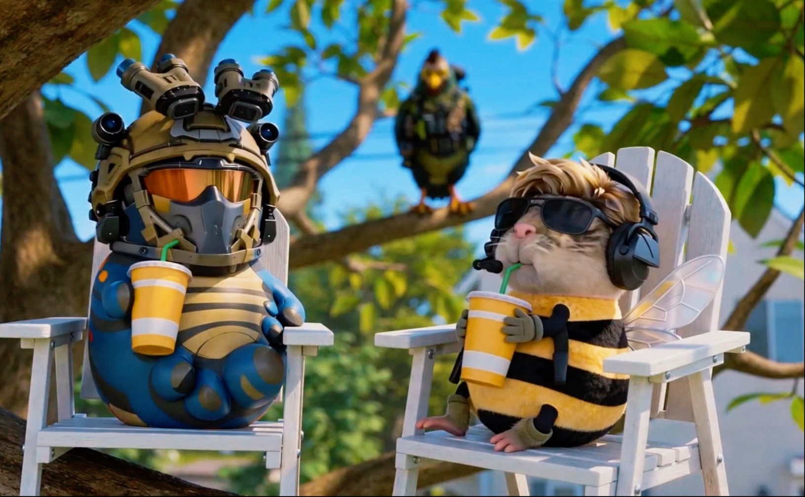 | 99.6万 | 2026-04-01 |
| [这个可以撸吗？](https://www.bilibili.com/video/BV1LeX9B5EBs) | 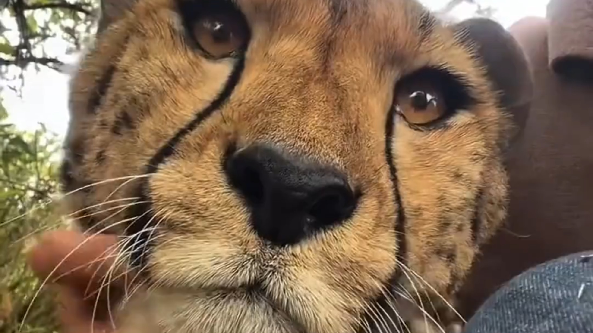 | 32.5万 | 2026-03-30 |
| [到底是谁在用哈基米音乐制作神人谱面？？？](https://www.bilibili.com/video/BV1dQPCz3EH8) |  | 857 | 2026-03-05 |

---
*最后更新: 2026-04-18 03:17:15 (自动生成)*
*数据来源: [Bilibili](https://www.bilibili.com)*

## 使用说明

运行以下命令更新视频列表:
```bash
python3 fetch_hajimi_videos.py
```
