# awesome-hajimi
collections of hajimi (哈基米 in Chinese) on the Internet.

## 视频列表 (Video List)

| 视频标题 (Title) | 封面 | 播放量 (Views) | 发布日期 (Date) |
|---|---|---|---|
| [豆包你把我的哈基米怎么了](https://www.bilibili.com/video/BV1ziQKBCExU) |  | 0 | 2026-04-11 |
| [流浪哈基米终于可以撸了，这个呼噜声是啥情况](https://www.bilibili.com/video/BV1mjQKB4ETs) | 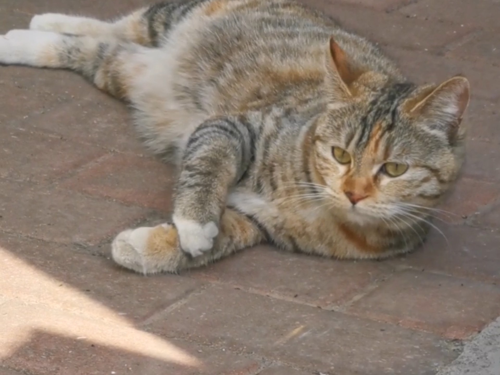 | 615 | 2026-04-11 |
| [哈基米～](https://www.bilibili.com/video/BV1tVQKBbEfF) | 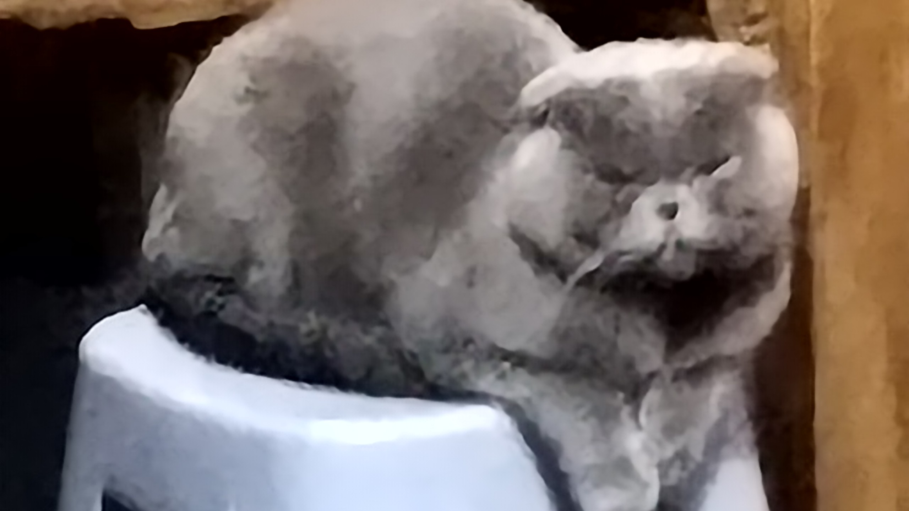 | 0 | 2026-04-11 |
| [哈基米之曼波无敌3：哈气阴影：塔楼（Tower）主题曲](https://www.bilibili.com/video/BV1RAQKBKEA9) |  | 52 | 2026-04-11 |
| [“哈基米”](https://www.bilibili.com/video/BV14oQKBFE95) |  | 26 | 2026-04-11 |
| [哈基米开独轮车中……](https://www.bilibili.com/video/BV1LkQKBzERW) | 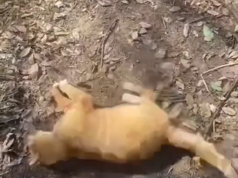 | 57 | 2026-04-11 |
| [哈基米~](https://www.bilibili.com/video/BV1ikQKBzEYb) | 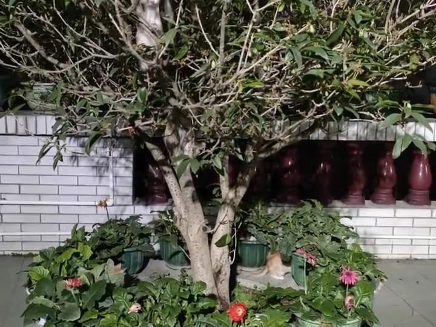 | 0 | 2026-04-11 |
| [【哈基米音乐之】卡勒特之咪](https://www.bilibili.com/video/BV17BQKBGEXf) | 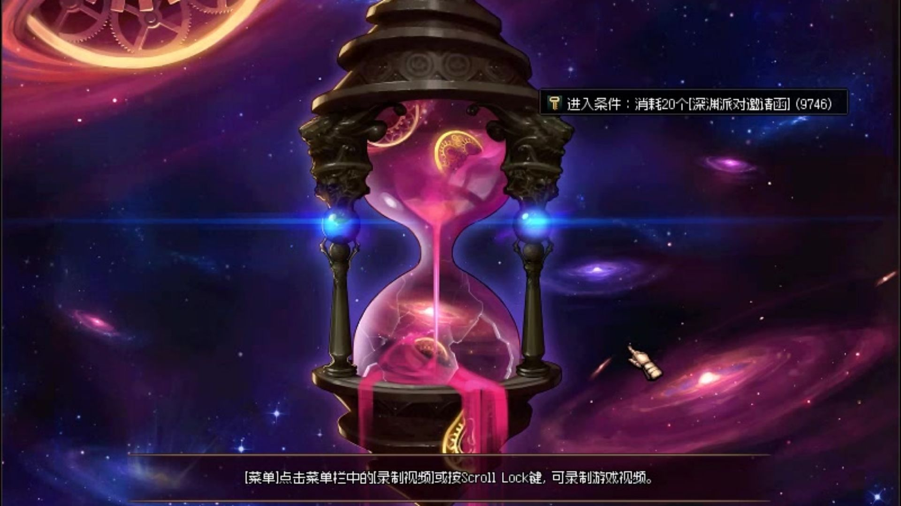 | 23 | 2026-04-11 |
| [基米：我又炸了](https://www.bilibili.com/video/BV1jzQKBrEne) | 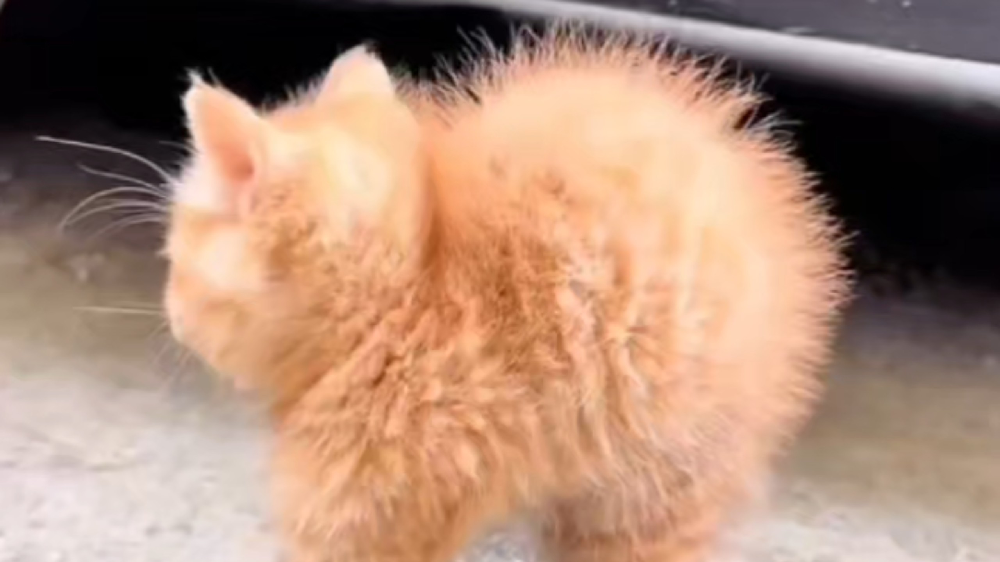 | 136 | 2026-04-11 |
| [哈基米哈基米过来看猫猫。](https://www.bilibili.com/video/BV1EjQTBjEcM) | 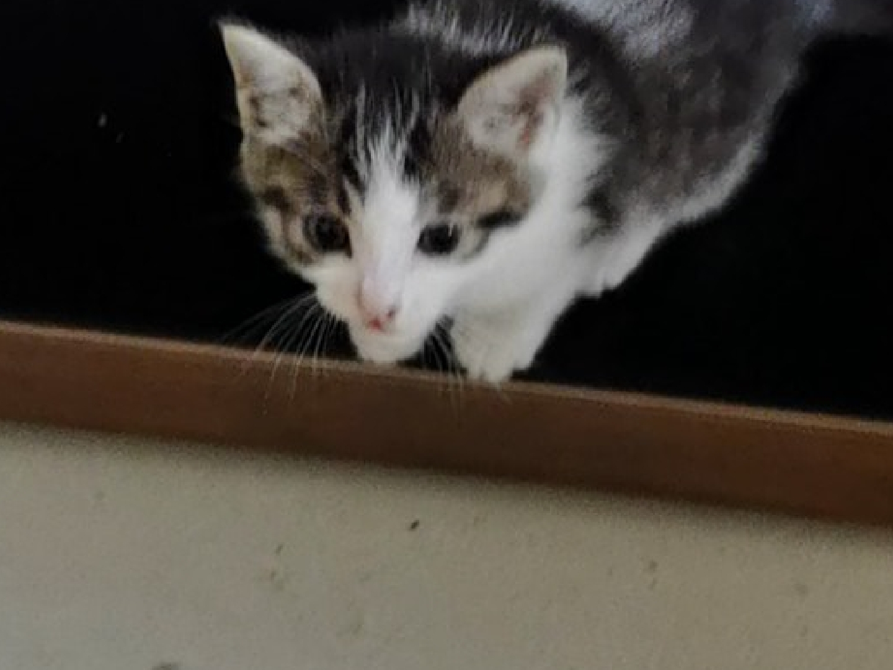 | 11 | 2026-04-11 |
| [奶奶养的哈基米](https://www.bilibili.com/video/BV1EjQTBjEPf) | 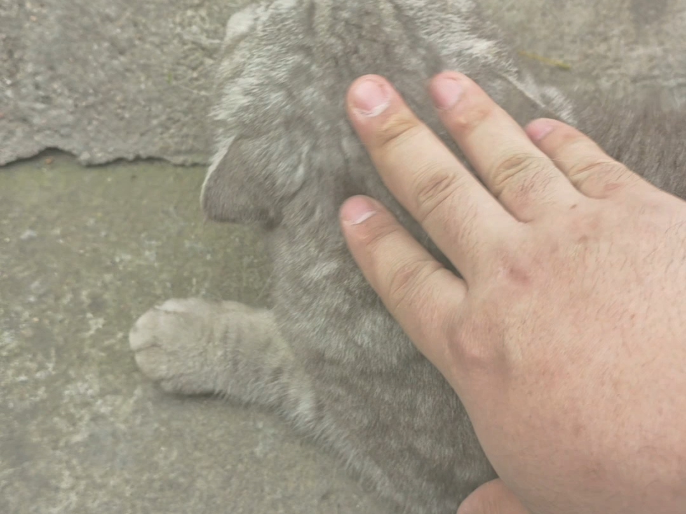 | 7 | 2026-04-11 |
| [流浪哈基米又来了，热情的哈基米开始秦王绕柱](https://www.bilibili.com/video/BV19xQTBuEzP) | 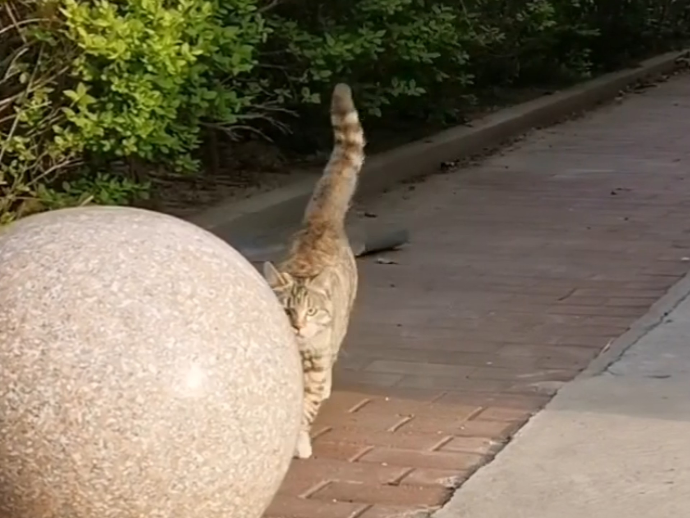 | 23 | 2026-04-11 |
| [收留“落魄小少爷”的第12天](https://www.bilibili.com/video/BV19FQPB8EWq) | 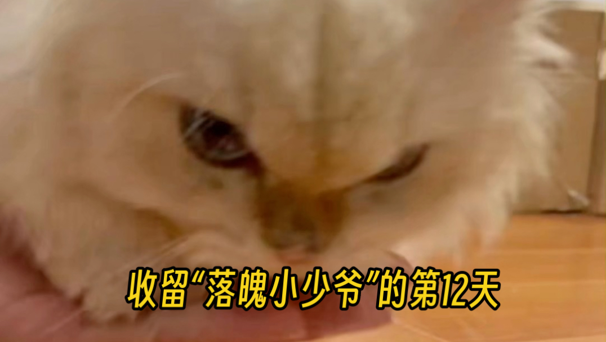 | 1.9万 | 2026-04-11 |
| [捉住，哈基米](https://www.bilibili.com/video/BV1cgQTBnEW2) |  | 30 | 2026-04-11 |
| [Persona4《signs of 基米》](https://www.bilibili.com/video/BV18GQKBFEyn) |  | 195 | 2026-04-11 |
| [超熊哈基米](https://www.bilibili.com/video/BV1C2QTBRELh) |  | 0 | 2026-04-10 |
| [哈基米东西路少](https://www.bilibili.com/video/BV131QPBfEpf) | 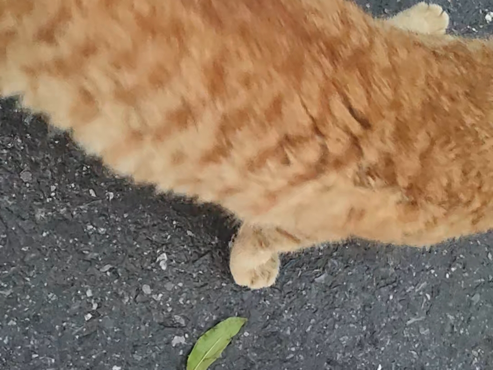 | 29 | 2026-04-10 |
| [哈基米の荣光](https://www.bilibili.com/video/BV1wyQABrEH4) |  | 105 | 2026-04-10 |
| [卡基咪～](https://www.bilibili.com/video/BV1C6QABVEZQ) | 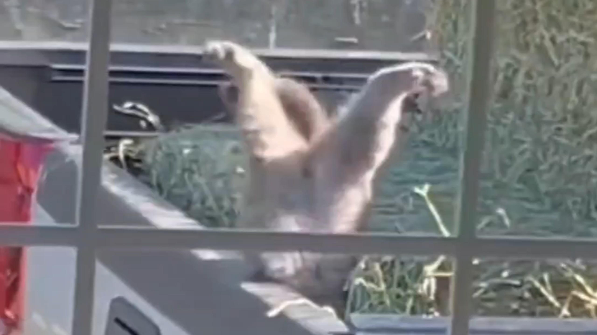 | 2017 | 2026-04-10 |
| [你是说你亲了粘了史和脲的哈基米是吗？？？？](https://www.bilibili.com/video/BV1TaQABSEnW) | 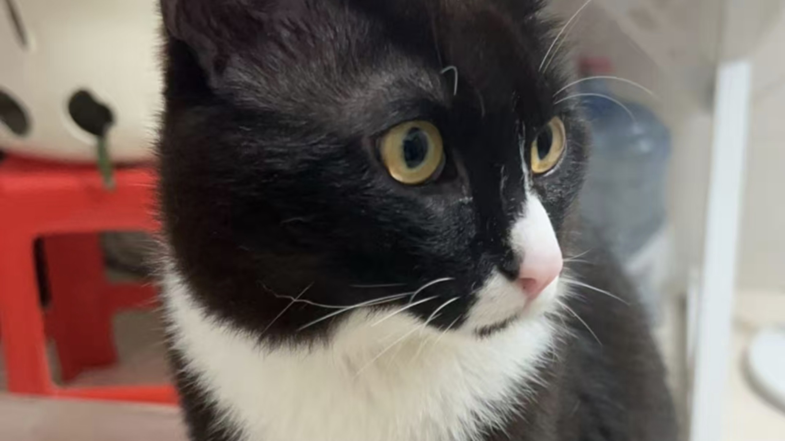 | 17 | 2026-04-10 |
| [当我把openclaw接入哈基米曼波机器狗](https://www.bilibili.com/video/BV1YAQPBtE1X) | 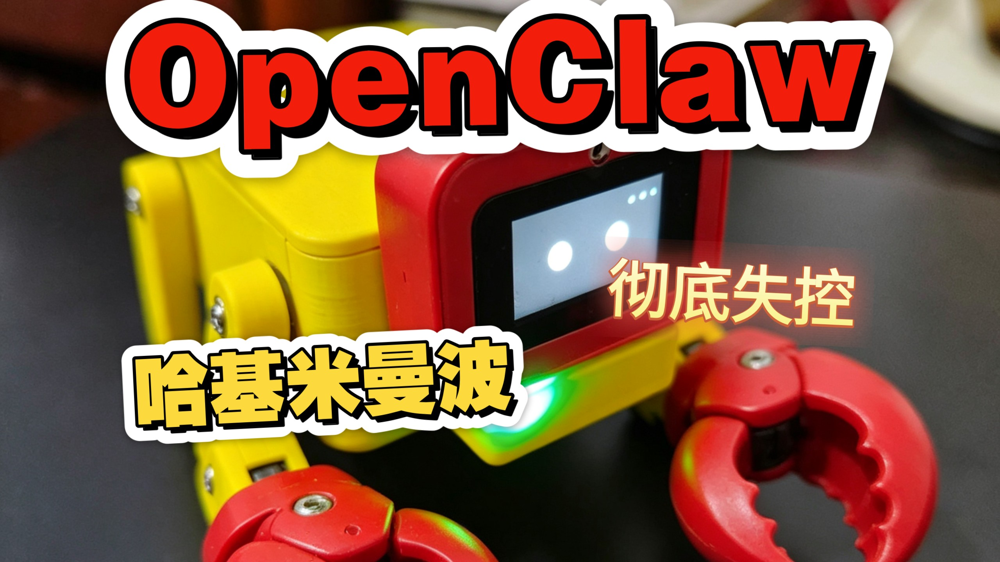 | 86 | 2026-04-10 |
| [【哈基米】植物大战僵尸，妙趣横生の小曲](https://www.bilibili.com/video/BV1hKQPB4Ena) |  | 502 | 2026-04-10 |
| [哈基米最后一舞](https://www.bilibili.com/video/BV1BSQABTEUa) |  | 691 | 2026-04-10 |
| [哈基米的快乐好简单](https://www.bilibili.com/video/BV1HsQPBVELq) | 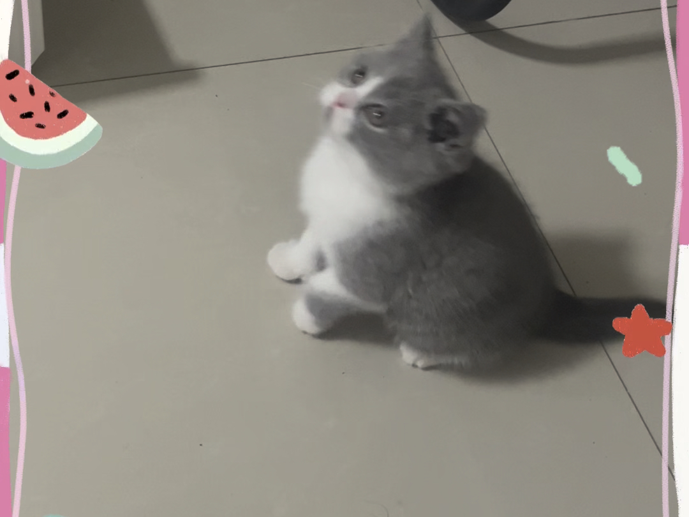 | 24 | 2026-04-10 |
| [哈基米入侵蛋仔岛？这张图简直是梗库！](https://www.bilibili.com/video/BV1tGQPBHEuU) |  | 150 | 2026-04-10 |
| [邪恶哈基米](https://www.bilibili.com/video/BV1sJQPB2EpM) | 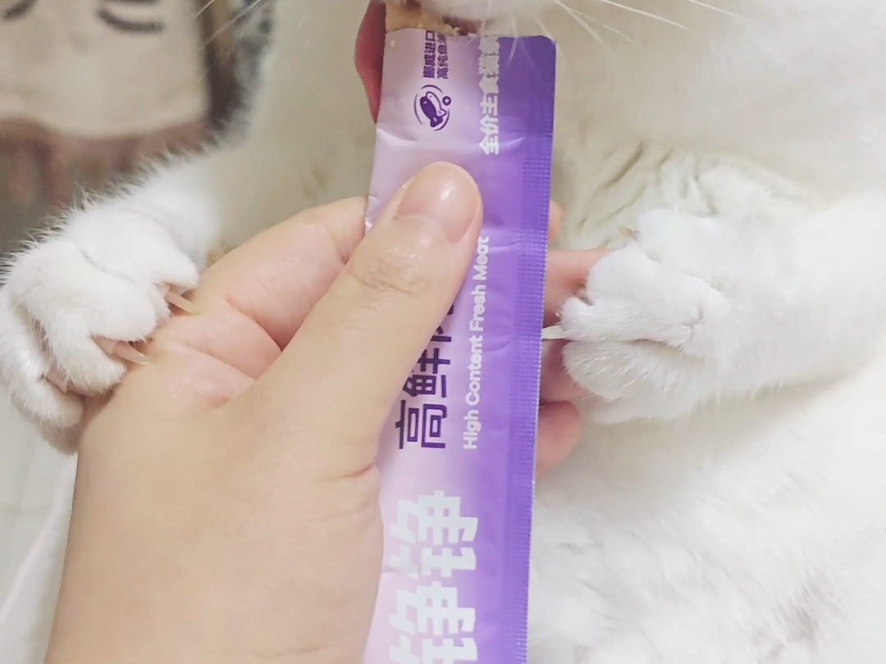 | 17 | 2026-04-10 |
| [【哈基米FM】🐱天生鬼才 - 崩铁三周年主题曲🐱](https://www.bilibili.com/video/BV1WHQPBLEUc) |  | 2466 | 2026-04-10 |
| [【纯净哈基米】🐱虫儿飞🐱](https://www.bilibili.com/video/BV1CeQcBzErm) |  | 802 | 2026-04-10 |
| [第158集，哈基米最高能给什么呀？](https://www.bilibili.com/video/BV1kqQcBqEpZ) |  | 15 | 2026-04-10 |
| [哈基米确实危险](https://www.bilibili.com/video/BV1kqQcBqEhs) | 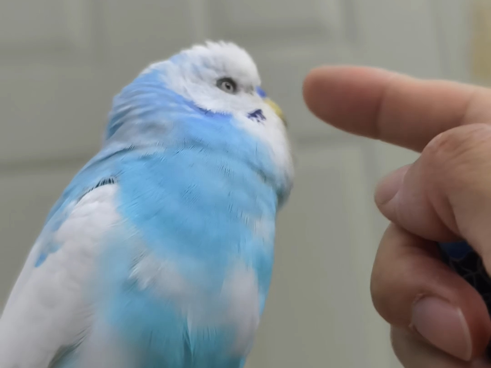 | 1527 | 2026-04-10 |
| [哈基米慢动作](https://www.bilibili.com/video/BV1kzQcBKEyZ) | 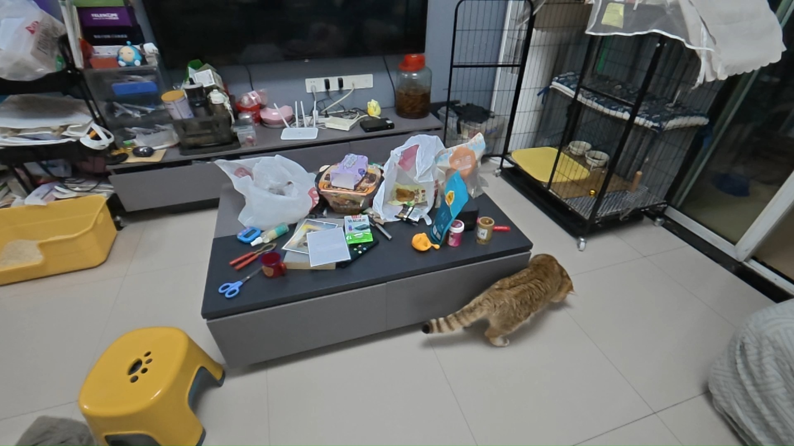 | 51 | 2026-04-10 |
| [这首魔性音乐终于用上了，配上哈基米的魔性舞蹈，绝了～](https://www.bilibili.com/video/BV1hWQcB7E4L) | 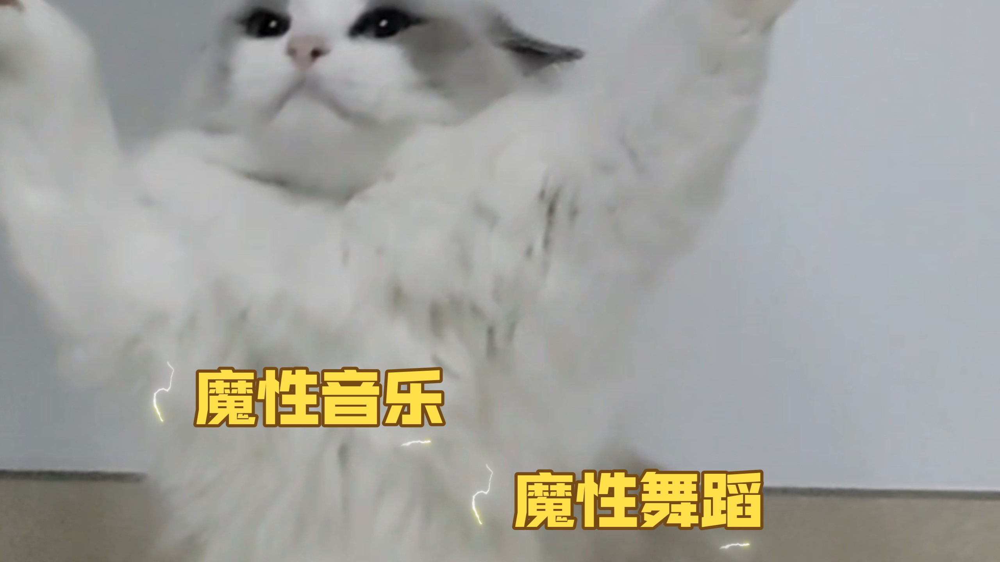 | 12 | 2026-04-10 |
| [哈基米对“西海”爱不释手？](https://www.bilibili.com/video/BV12tQcBCERf) |  | 52 | 2026-04-10 |
| [哈基米:别整，刺挠！](https://www.bilibili.com/video/BV1YFQwBQE3a) | 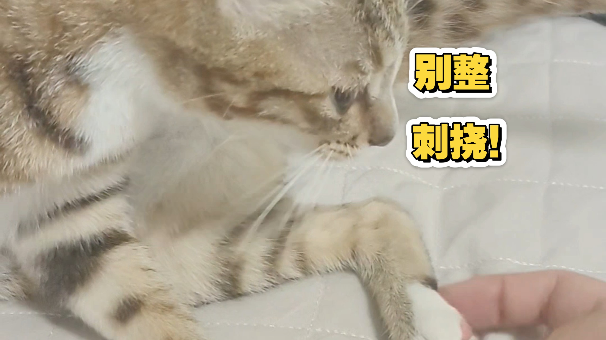 | 1225 | 2026-04-10 |
| [第一届猫咪驾照考试，现在开始](https://www.bilibili.com/video/BV1edQcBsEZZ) |  | 6.0万 | 2026-04-10 |
| [哈基米与艾比球的正确用法](https://www.bilibili.com/video/BV1YoQcB9EJ1) | 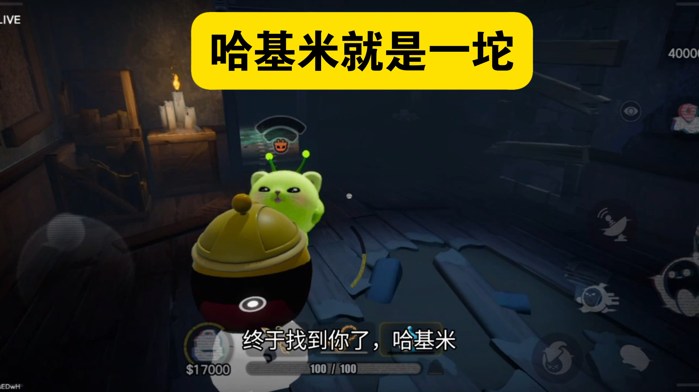 | 1513 | 2026-04-10 |
| [哈基米玩起泡胶](https://www.bilibili.com/video/BV18KQwBmEEh) | 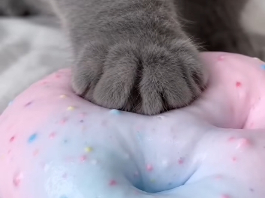 | 530 | 2026-04-10 |
| [台风似乎带来了某些东西…【哈基米恐怖故事-台风天第八集】](https://www.bilibili.com/video/BV13wQwBHETP) |  | 4.2万 | 2026-04-10 |
| [没有手怎么了？站起来的背影足够让隔壁小花猫心动一整天](https://www.bilibili.com/video/BV1B2QcBhEZX) | 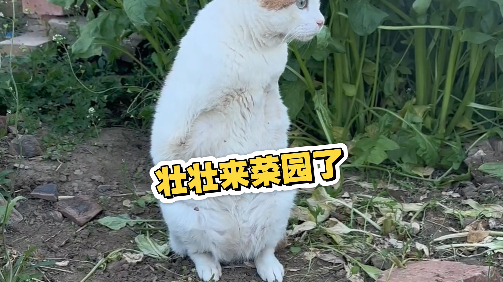 | 2213 | 2026-04-10 |
| [把你的表情包发出来和我们决斗吧#哈基米 #美人鱼 #猫咪 #AI](https://www.bilibili.com/video/BV1rnQwBMEuG) |  | 1936 | 2026-04-10 |
| [女团哈基米](https://www.bilibili.com/video/BV1rHQwBqEEi) |  | 0 | 2026-04-10 |
| [品鉴一下哈基米音乐界的细糠](https://www.bilibili.com/video/BV1azQFB7EjA) |  | 3235 | 2026-04-10 |
| [有粉丝宝宝要加入哈基米家族吗](https://www.bilibili.com/video/BV1bMQwBjE4R) | 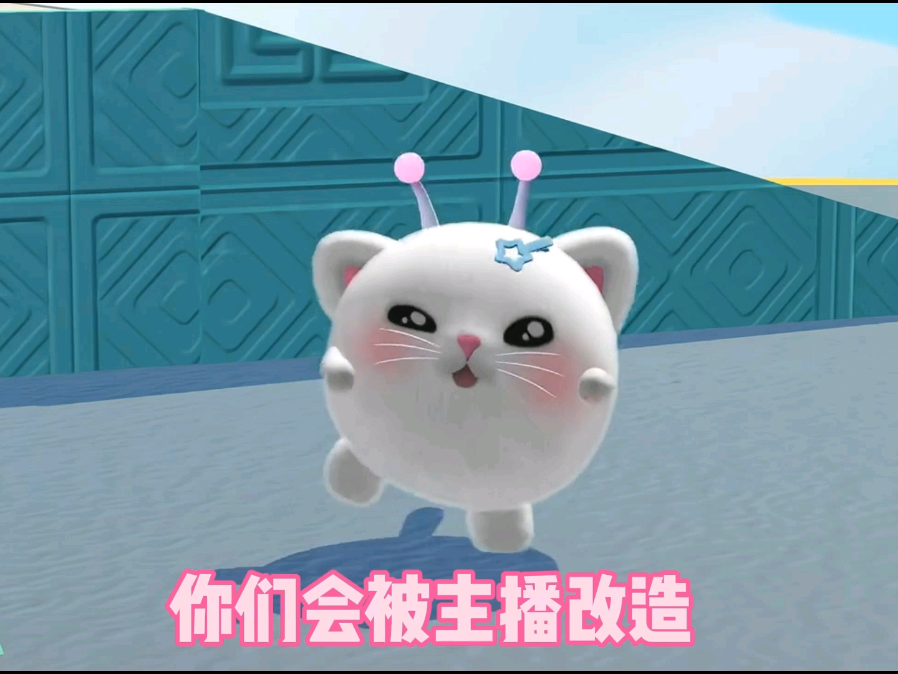 | 62 | 2026-04-10 |
| [分享好吃的站子，哈基米0.01一次！](https://www.bilibili.com/video/BV1AEQwB6EFj) |  | 12 | 2026-04-10 |
| [哈基米真有这么稀有吗？](https://www.bilibili.com/video/BV1bmQwBSEcB) |  | 74 | 2026-04-10 |
| [蛋仔哈基米蛋x蕉皮喵蛋Ai翻唱《基真的特别爱你》](https://www.bilibili.com/video/BV1TSQwBEE2r) |  | 667 | 2026-04-10 |
| [到处跑的哈基米](https://www.bilibili.com/video/BV1hyQwBQEhj) | 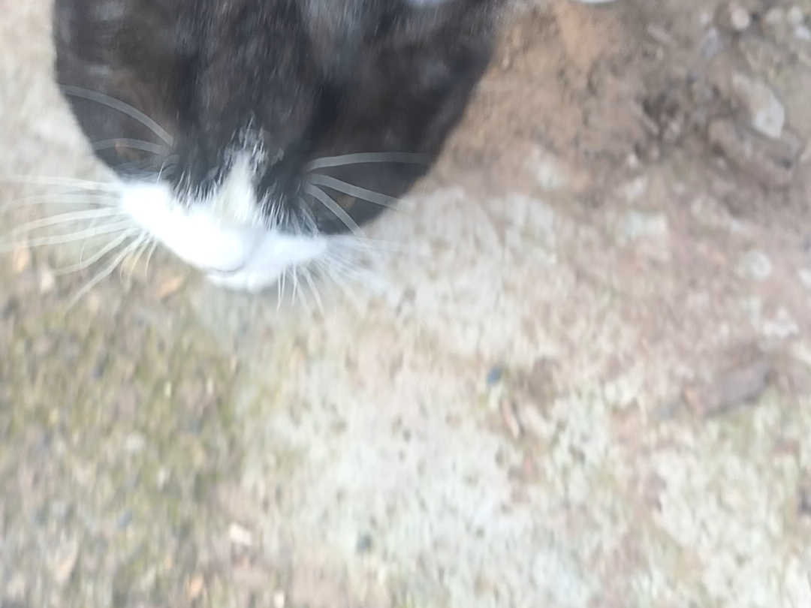 | 39 | 2026-04-10 |
| [爱咬人哈基米](https://www.bilibili.com/video/BV11dQwB5EdD) | 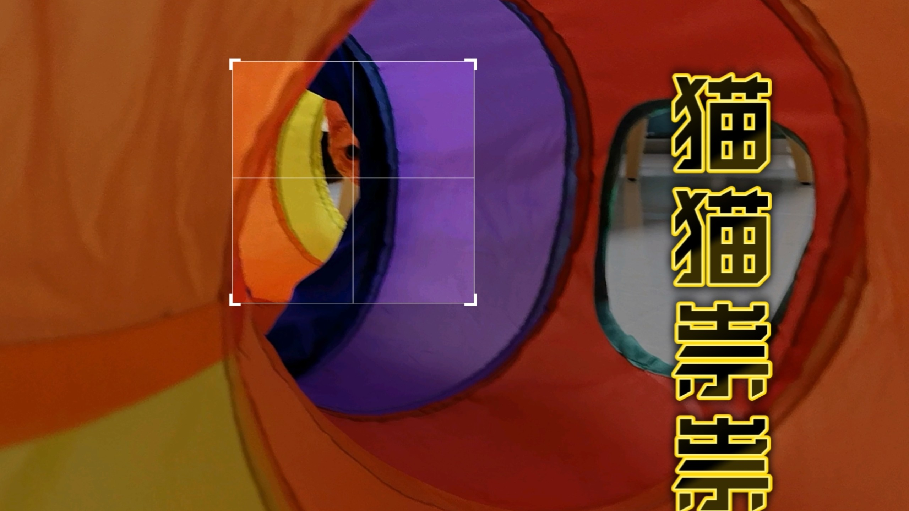 | 14 | 2026-04-10 |
| [上班不开心，来咪这里吧](https://www.bilibili.com/video/BV1adDfB2E9a) | 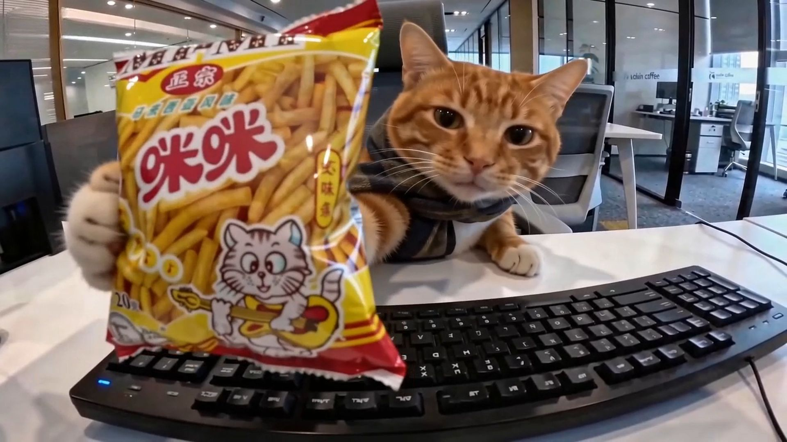 | 1.0万 | 2026-04-10 |
| [想要“阿拉德坏猫“的偏爱吗？](https://www.bilibili.com/video/BV15GQcBREHj) |  | 19.2万 | 2026-04-10 |
| [带惊魂寻宝队破产的哈基艘发家致富](https://www.bilibili.com/video/BV1KXQwBjEub) | 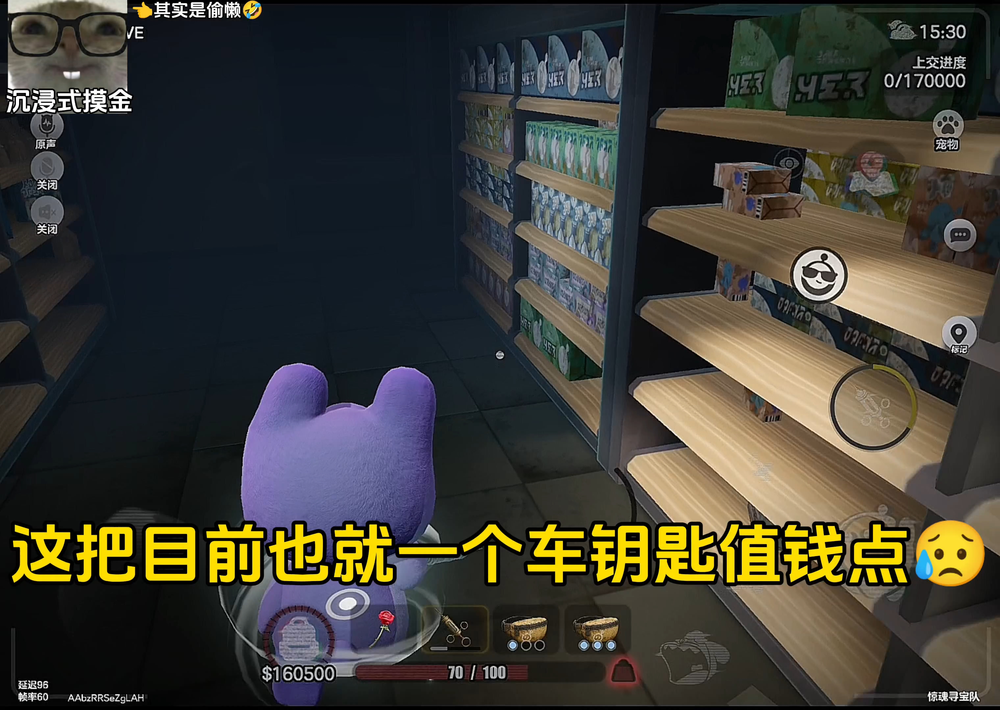 | 2171 | 2026-04-10 |
| [哈基米海滩赶海记](https://www.bilibili.com/video/BV1vqQwB4Egx) | 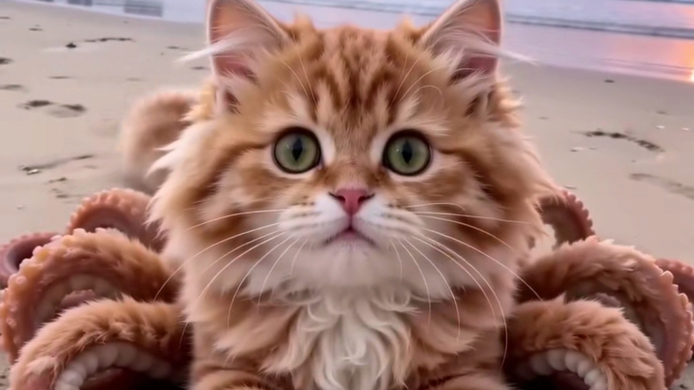 | 169 | 2026-04-10 |
| [基 米 勇 士](https://www.bilibili.com/video/BV1jeQwBbEx7) | 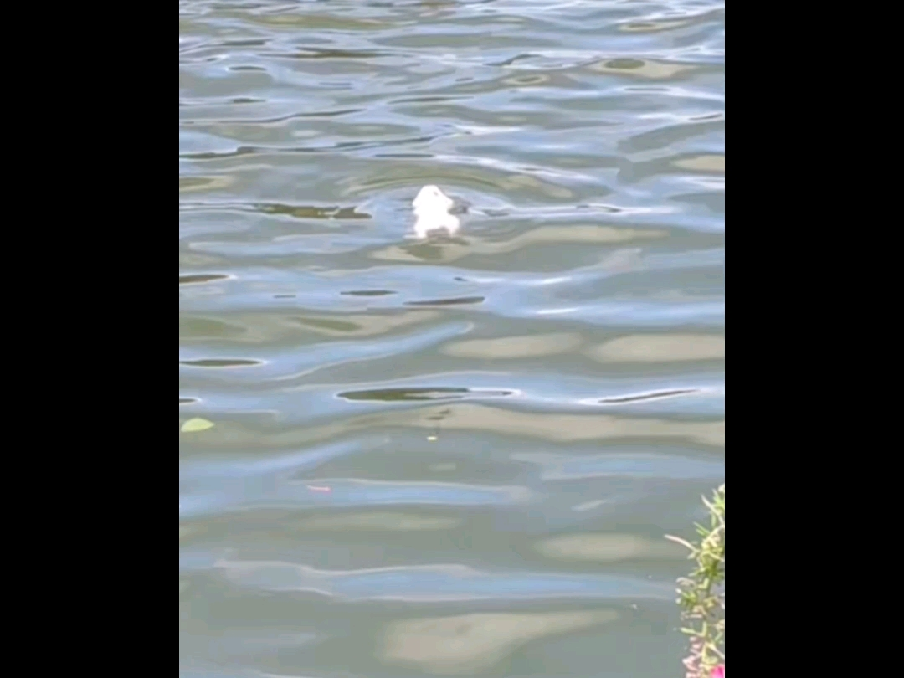 | 113 | 2026-04-10 |
| [哈基米演义之耄式春秋篇](https://www.bilibili.com/video/BV13rQwB9EMK) | 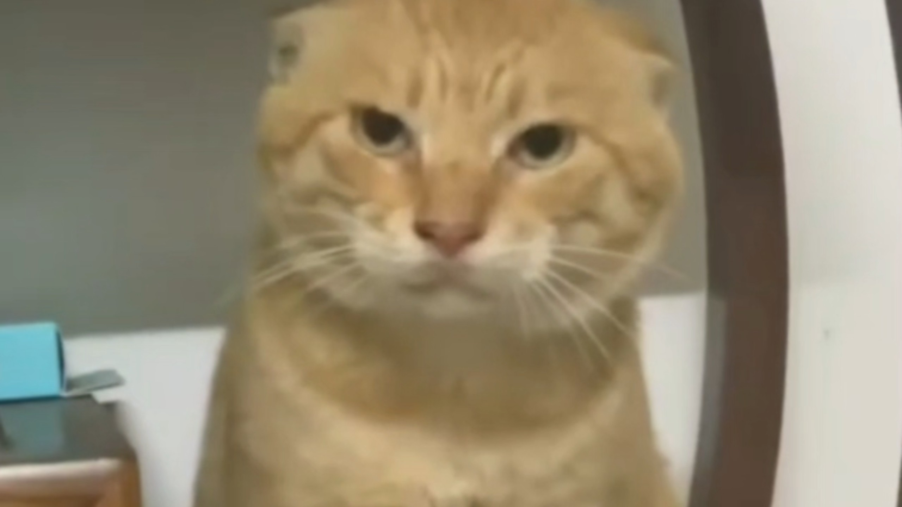 | 646 | 2026-04-10 |
| [“抱歉，我暂时不能更新哈基米音乐了”](https://www.bilibili.com/video/BV1GBQwBdEzS) |  | 1117 | 2026-04-10 |
| [看看你生的哈基米](https://www.bilibili.com/video/BV1VBQwBdEpn) | 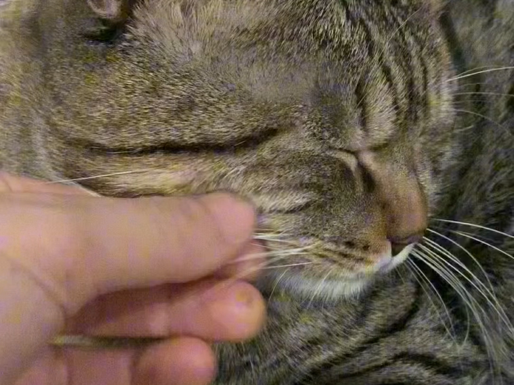 | 3360 | 2026-04-10 |
| [🐱哈 基 米🐱](https://www.bilibili.com/video/BV1adDfB2EF7) |  | 975 | 2026-04-10 |
| [哈基米这个喜欢椰子](https://www.bilibili.com/video/BV1uwQFBCEUf) | 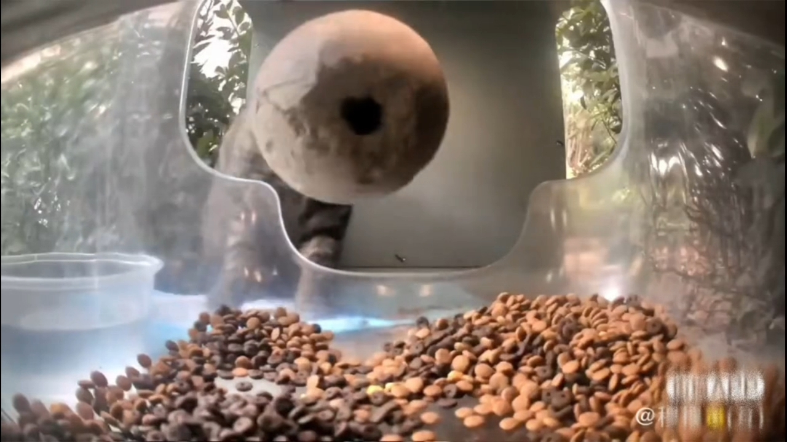 | 5134 | 2026-04-10 |
| [哈基米曼波旋转一分钟](https://www.bilibili.com/video/BV1tPQFB3EKf) | 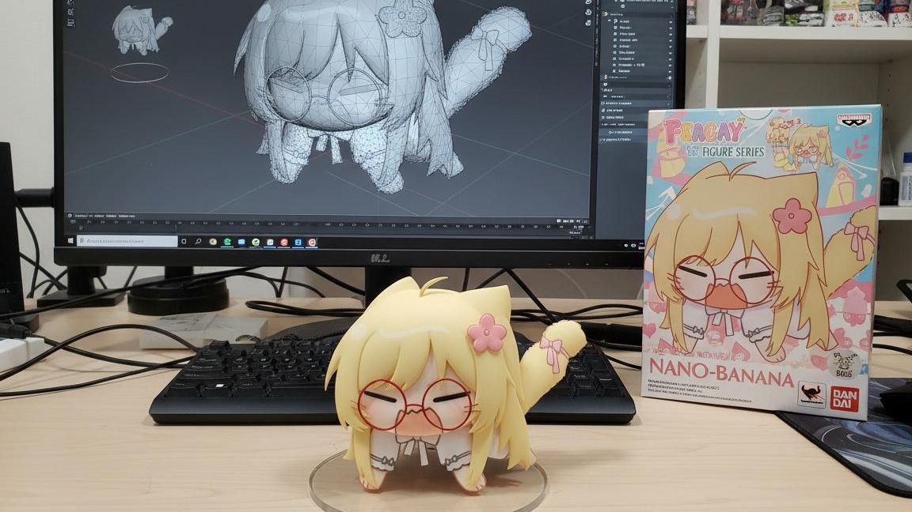 | 518 | 2026-04-10 |
| [哈基米这个喜欢铁头功](https://www.bilibili.com/video/BV1bPQFB3EJV) | 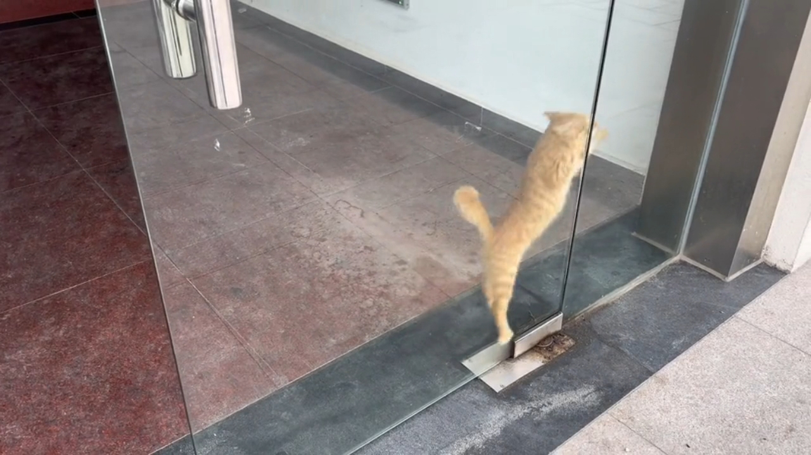 | 2415 | 2026-04-10 |
| [哈基米，启动！](https://www.bilibili.com/video/BV1hfDfByEcT) |  | 1.0万 | 2026-04-10 |
| [基米Circus 🎵 你一定听过的可爱小曲](https://www.bilibili.com/video/BV1zkDfBxEH7) |  | 5201 | 2026-04-10 |
| [艾茂tv之哈基米那没路躲](https://www.bilibili.com/video/BV1H7QFBaEzi) | 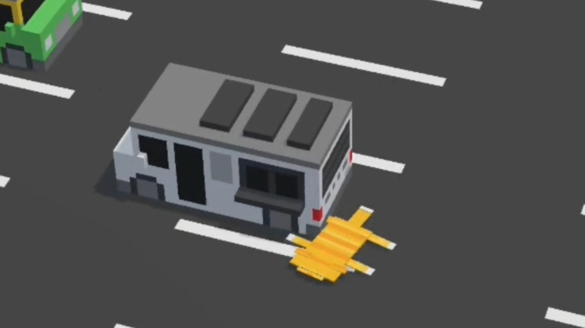 | 24 | 2026-04-10 |
| [哈基米的冰淇淋掉地上了，你能帮帮他吗？](https://www.bilibili.com/video/BV1EWQFBtENq) | 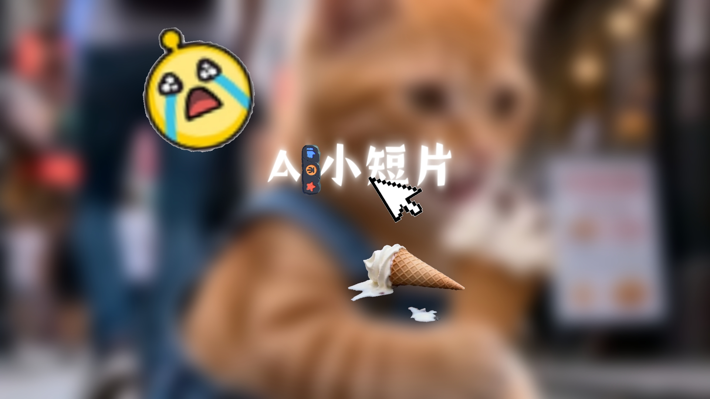 | 128 | 2026-04-10 |
| [【循环歌单】🐱哈基米：曼波不是罪过🐱](https://www.bilibili.com/video/BV1K3QFBqE3K) |  | 1176 | 2026-04-10 |
| [哈基米这个伤心](https://www.bilibili.com/video/BV1FwQcBaE3d) |  | 3317 | 2026-04-10 |
| [一口接一口，根本停不下来 #AIGC #哈基米 #薯片 #ai创作浪潮计划](https://www.bilibili.com/video/BV1uCQFByEDz) |  | 121 | 2026-04-10 |
| [哈基米](https://www.bilibili.com/video/BV1TUQFB3EoY) | 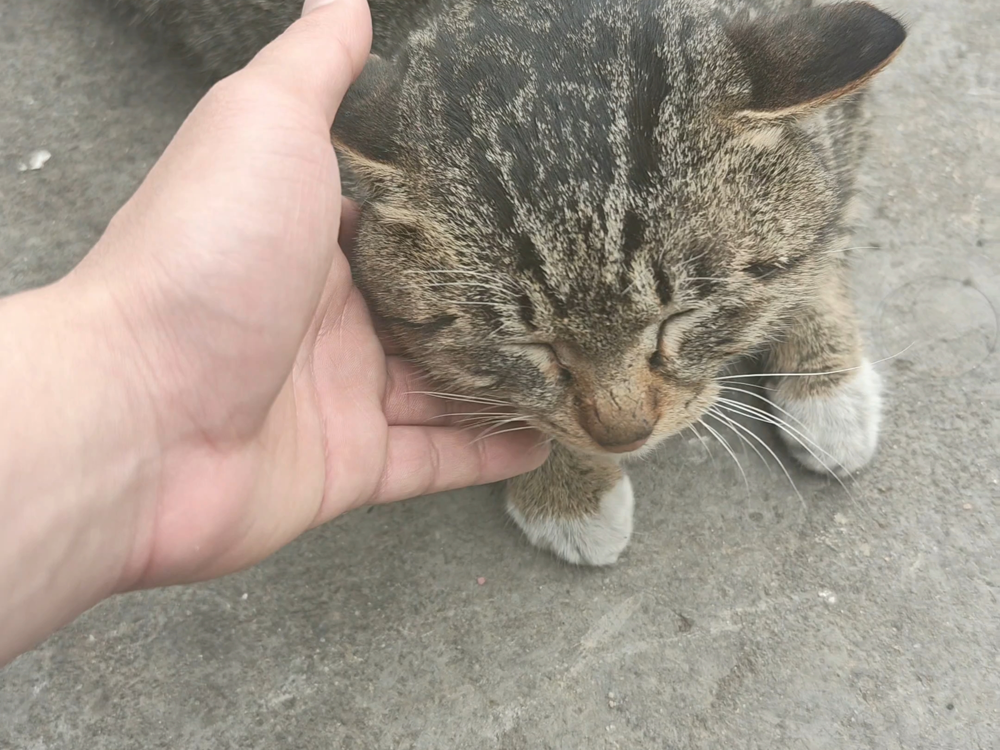 | 4 | 2026-04-10 |
| [哈基米摔碎自己](https://www.bilibili.com/video/BV19LQcBQEMJ) |  | 4688 | 2026-04-10 |
| [哈基米德公式: 哈基米血量%+领养进度%=100% -一博学耄章](https://www.bilibili.com/video/BV15LQcBXEsG) | 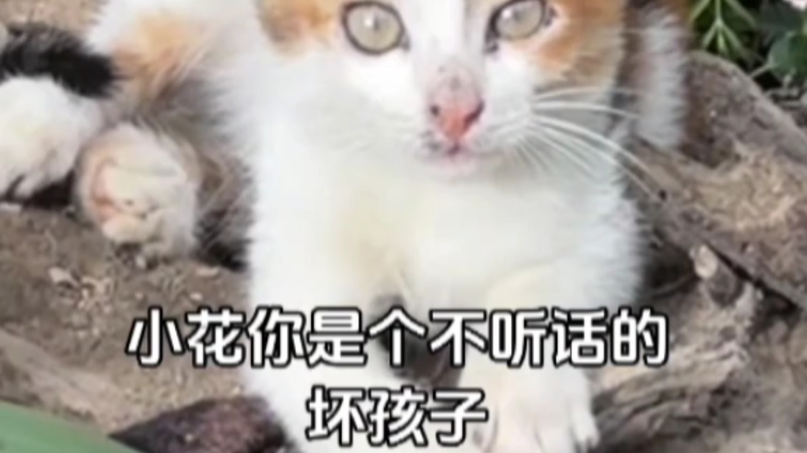 | 1241 | 2026-04-10 |
| [4只哈基米的周末聚会vlog（约小伙伴出来玩！今天主题是快乐！）](https://www.bilibili.com/video/BV1AdQFBiEPv) |  | 90 | 2026-04-10 |
| [哈基米～](https://www.bilibili.com/video/BV1EJDZBpE3S) | 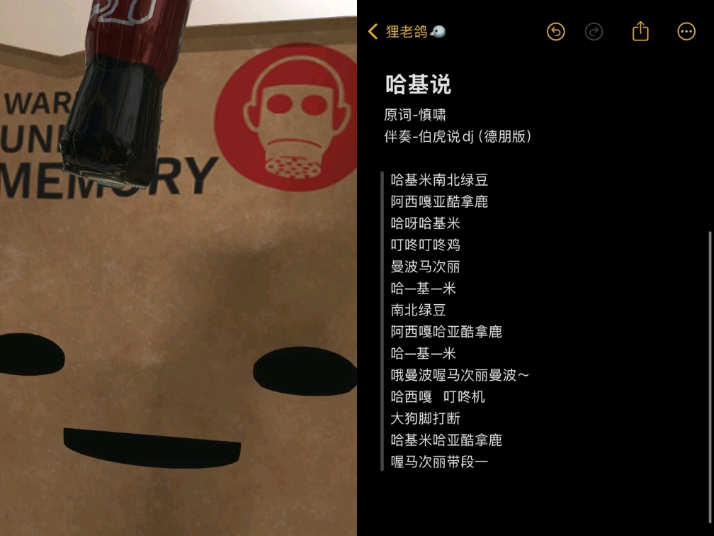 | 115 | 2026-04-10 |
| [nullscape‖哈基米操控了我的双手](https://www.bilibili.com/video/BV1qWDZBSE7j) |  | 548 | 2026-04-10 |
| [超级厉害，超级美丽的美人鱼猫来咯#哈基米 #美人鱼 #猫咪 #AI](https://www.bilibili.com/video/BV1jpDZBnEiR) |  | 336 | 2026-04-10 |
| [【哈基米音乐之】蠕动的哈基米](https://www.bilibili.com/video/BV14PDZBYEsV) | 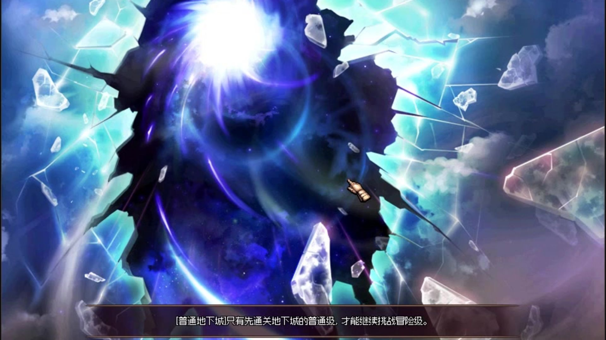 | 426 | 2026-04-10 |
| [哈基米打架成为了落汤鸡](https://www.bilibili.com/video/BV1dTDfBJE4U) |  | 280 | 2026-04-10 |
| [给咱印度裔学姐看印度哈基米...](https://www.bilibili.com/video/BV17PDfBpEWg) | 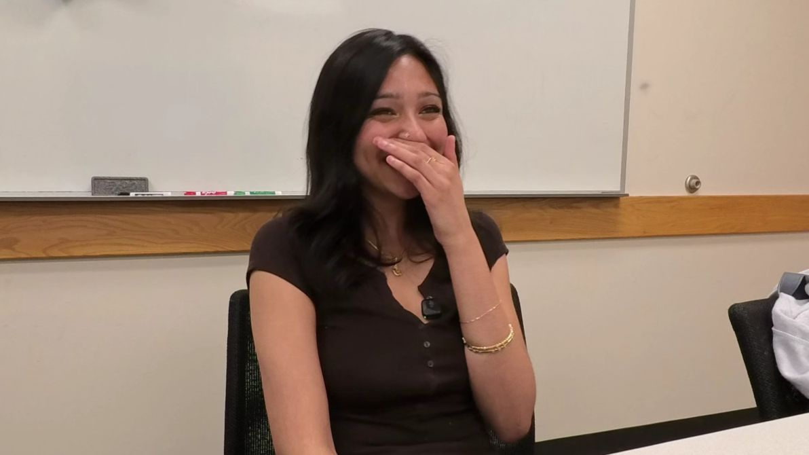 | 2784 | 2026-04-10 |
| [哈基米-搓个马来口音英配](https://www.bilibili.com/video/BV1oNDfBDEof) | 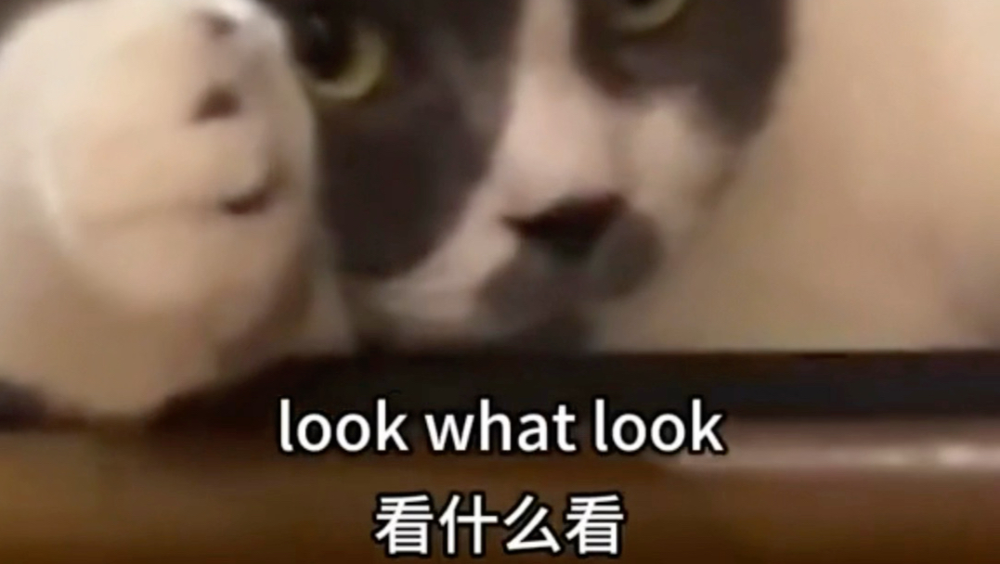 | 107 | 2026-04-10 |
| [美人鱼猫这么可爱，不要骂它们啦！#哈基米 #美人鱼 #猫咪 #AI](https://www.bilibili.com/video/BV1ffDZBRESF) |  | 314 | 2026-04-10 |
| [哈基米！曼波！！！](https://www.bilibili.com/video/BV174DtBKECe) |  | 117 | 2026-04-10 |
| [抖音热门｜整理了10首2025年最火的歌曲合集，全网播放量破亿的热门歌曲榜单！](https://www.bilibili.com/video/BV128D4B5E46) | 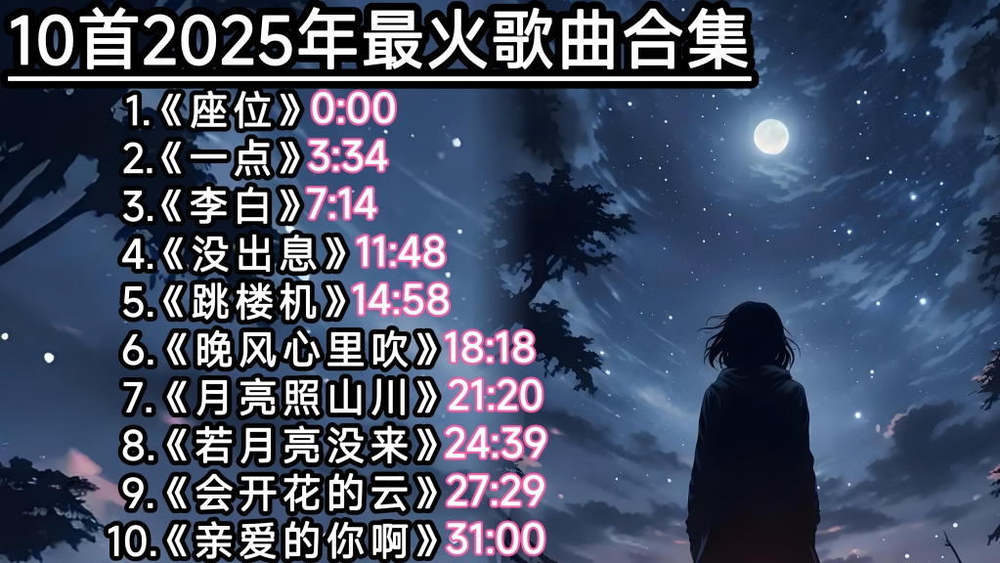 | 2806 | 2026-04-09 |
| [这嘬有力气！](https://www.bilibili.com/video/BV1oBDpBpEtB) | 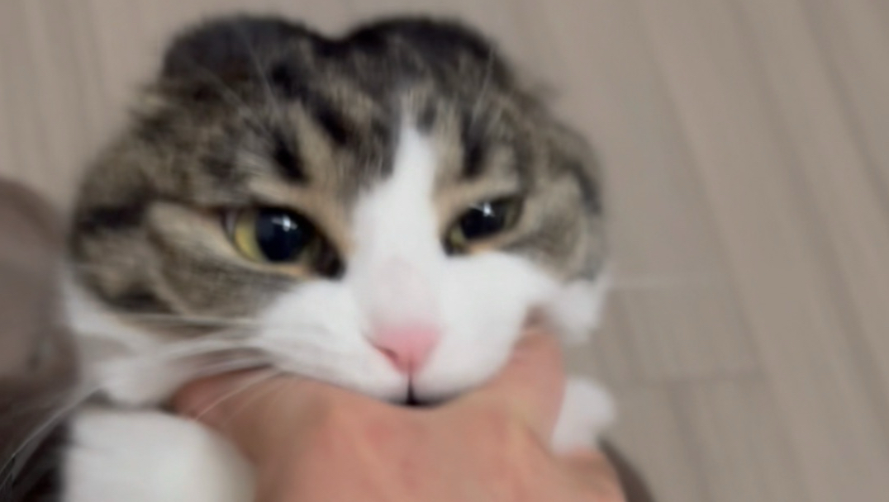 | 21.1万 | 2026-04-09 |
| [哈基米版精卫](https://www.bilibili.com/video/BV1r4DrBCEiU) |  | 99 | 2026-04-08 |
| [【时代少年团】《浅炸一下吧！》73：就是这个爽](https://www.bilibili.com/video/BV121DvBKENA) |  | 55.3万 | 2026-04-07 |
| [帝国毁在手机上！！！](https://www.bilibili.com/video/BV1yrSoBsEwV) |  | 21.8万 | 2026-04-06 |
| [哈基米北南北绿](https://www.bilibili.com/video/BV1YaD5BsExF) |  | 146 | 2026-04-05 |
| [『热门音乐合集』那些最近很火的Phonk/Funk小曲推荐~“捍卫国家！捍卫祖国！为人民服务！”第二弹~~~](https://www.bilibili.com/video/BV1gUDuBuEbb) |  | 41.5万 | 2026-04-05 |
| [60个机密火箭鼠鼠爆率测试，限定红补齐了！附带18分钟超详细实战速摸教学！](https://www.bilibili.com/video/BV1uJDVByEVh) |  | 10.2万 | 2026-04-04 |
| [🐶🥛🐱 喝奶时间到啦！可爱小狗与小猫一起温馨吃早餐 🏡✨](https://www.bilibili.com/video/BV1dCXZBXE4v) |  | 4.2万 | 2026-04-04 |
| [从夯到拉盘点近期爆火的网络热梗](https://www.bilibili.com/video/BV1Q29jBeE25) |  | 6.0万 | 2026-04-02 |
| [机动战士高达 闪光的哈萨维2 reaction](https://www.bilibili.com/video/BV1XN9EBgEH5) |  | 5.9万 | 2026-04-01 |
| [三首恐怖歌曲，千万不能给孩子听](https://www.bilibili.com/video/BV1TvXaBPEVm) |  | 4.0万 | 2026-03-30 |
| [小雨天里，小狗救下被困的小伙伴 —— 超暖心的动物故事 🌧️🐶🐱](https://www.bilibili.com/video/BV1eaAszEE7f) |  | 10.0万 | 2026-03-28 |
| [大型纪录片《吸精女护士，月收入高达25万元》持续为你播出！](https://www.bilibili.com/video/BV1EsAPzYELq) |  | 74.7万 | 2026-03-21 |
| [哥们，你想吃我奶，你往哪摸呢？监控下的离谱瞬间，要不是监控拍到，我根本不信！ (10)](https://www.bilibili.com/video/BV1nEwrzuE4V) |  | 40.7万 | 2026-03-19 |
| [【万恶之源合集】“群星闪耀时，一个没看过的也是神人了”](https://www.bilibili.com/video/BV1f1AtzKEEc) | 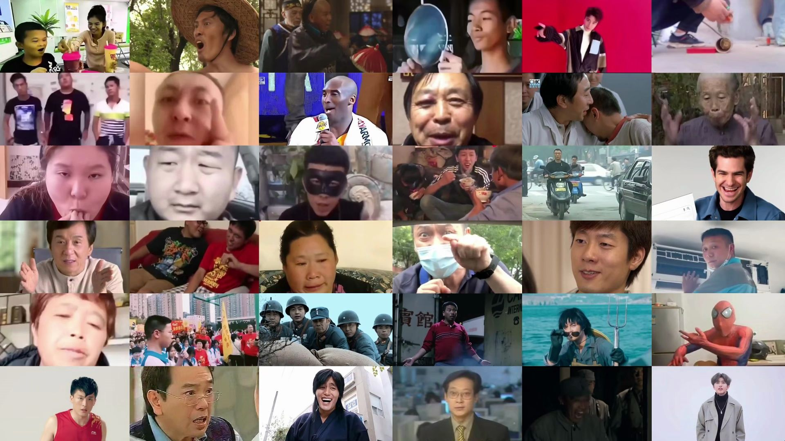 | 103.3万 | 2026-02-28 |
| [喵喵跳舞集合](https://www.bilibili.com/video/BV1ArfxBtEwi) |  | 2.2万 | 2026-02-25 |
| [【循环歌单】《白菜の小曲》《白菜对我笑》](https://www.bilibili.com/video/BV1X9ZfBYESf) |  | 186.7万 | 2026-02-22 |
| [哈基米素材](https://www.bilibili.com/video/BV1W2VRz2E23) |  | 8866 | 2025-05-10 |
| [一小时猫叫声音](https://www.bilibili.com/video/BV1m44y1H7v9) | 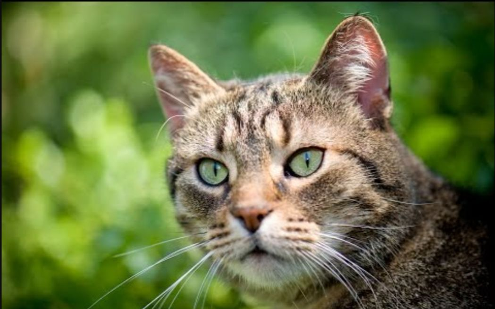 | 51.9万 | 2022-02-10 |

---
*最后更新: 2026-04-11 03:15:44 (自动生成)*
*数据来源: [Bilibili](https://www.bilibili.com)*

## 使用说明

运行以下命令更新视频列表:
```bash
python3 fetch_hajimi_videos.py
```
