# awesome-hajimi
collections of hajimi (哈基米 in Chinese) on the Internet.

## 视频列表 (Video List)

| 视频标题 (Title) | 封面 | 播放量 (Views) | 发布日期 (Date) |
|---|---|---|---|
| [哈基米](https://www.bilibili.com/video/BV1KWR6BhEf3) |  | 155 | 2026-05-04 |
| [哈基米：😺哈TA5主题曲（Welcome To Los Santos）😺](https://www.bilibili.com/video/BV1FiRBByEJR) |  | 501 | 2026-05-04 |
| [[哈基米TV]666蹦极不叫我](https://www.bilibili.com/video/BV16jRzBjEzo) | 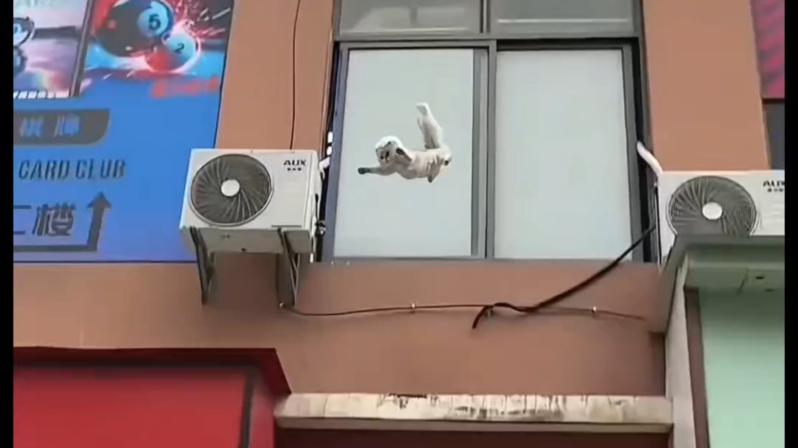 | 2084 | 2026-05-04 |
| [哈基米雨中带娃](https://www.bilibili.com/video/BV12wRzBdETb) | 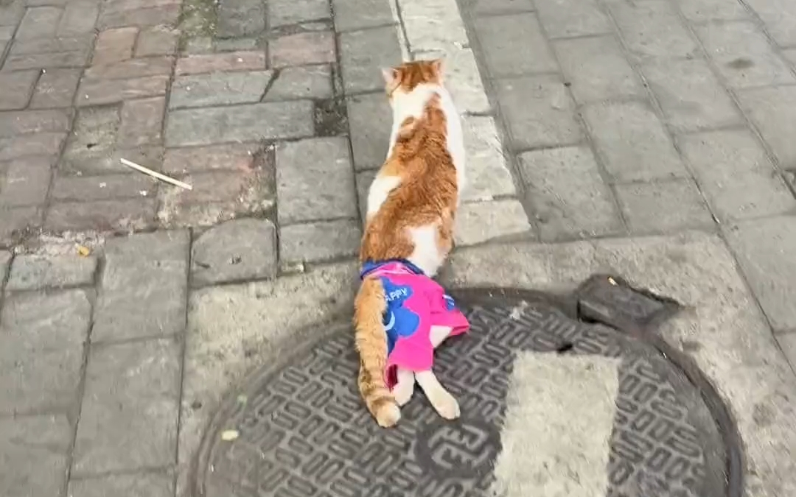 | 338 | 2026-05-04 |
| [【基米·拯救2】「圣哈基米的颂歌」感受神圣的基米圣咏](https://www.bilibili.com/video/BV1ktRiBGExk) |  | 2773 | 2026-05-04 |
| [朱门基米臭，路有哈基骨](https://www.bilibili.com/video/BV1SQRiBRE1x) |  | 648 | 2026-05-04 |
| [只要我不停叫，麻麻就会喂我](https://www.bilibili.com/video/BV1XURiBoEcZ) | 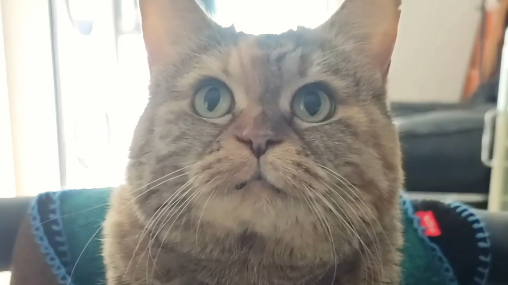 | 2.2万 | 2026-05-04 |
| [［哈基米TV］基米拉闸撤不叫我](https://www.bilibili.com/video/BV1naRiBzEWu) | 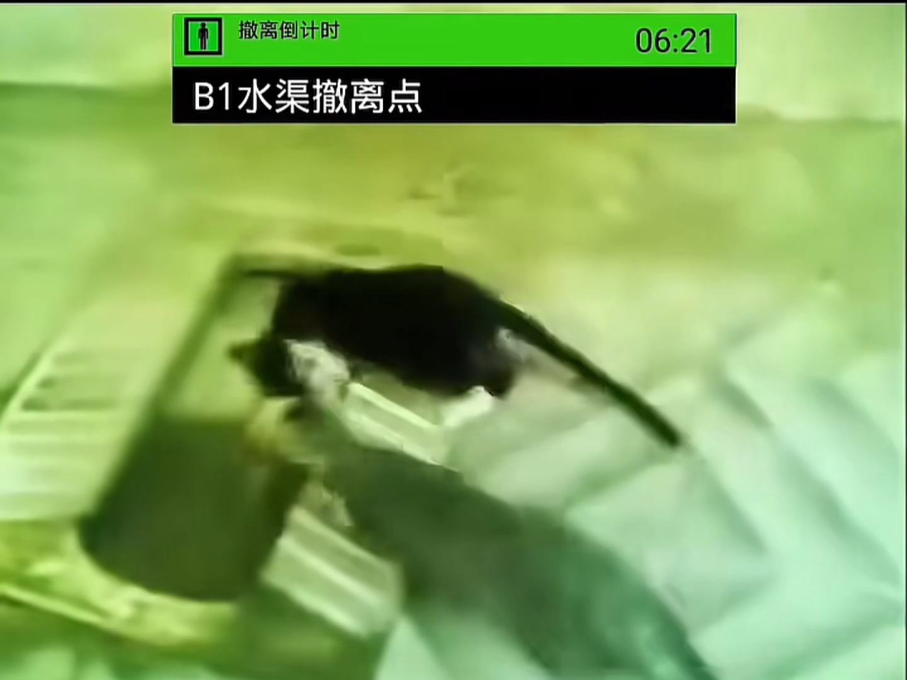 | 1091 | 2026-05-04 |
| [好久不见的哈基米音乐](https://www.bilibili.com/video/BV1rTRqByEdA) | 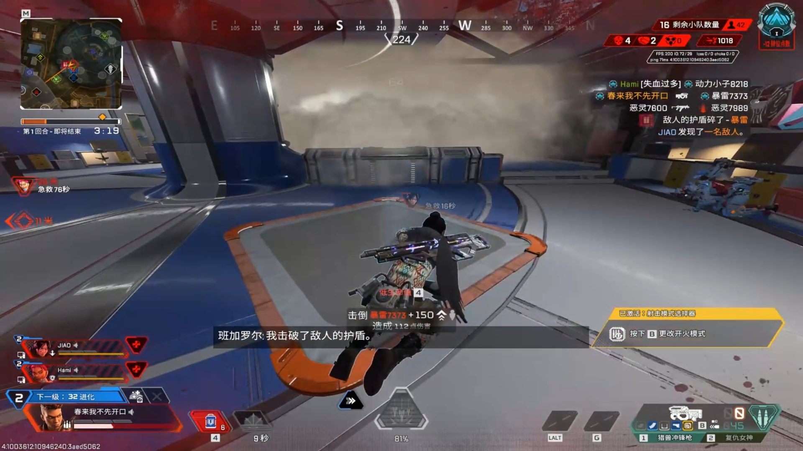 | 481 | 2026-05-04 |
| [【哈基米】All Eyes On 咪](https://www.bilibili.com/video/BV1b9RiBsEa6) |  | 1050 | 2026-05-04 |
| [猫：嗯？哪里怪怪的？](https://www.bilibili.com/video/BV1efRYBWEfY) |  | 3.3万 | 2026-05-04 |
| [五一在外的人是否会想起家中想你的哈基米](https://www.bilibili.com/video/BV19rReB9Evm) | 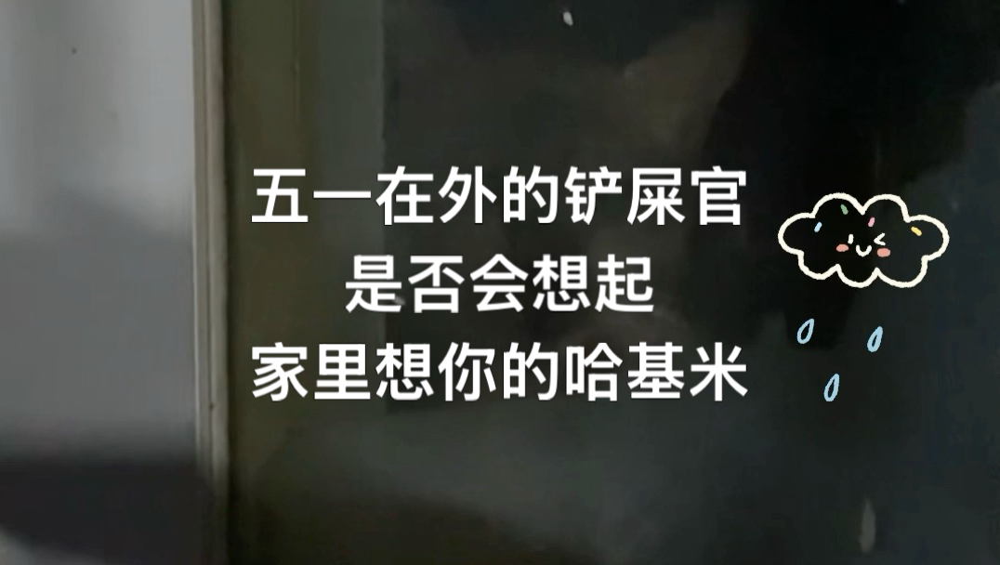 | 1604 | 2026-05-04 |
| [五一假期干嘛猫和好朋咪在家开心聚会的一天vlog~（咪咪们假期很快乐，也祝人节日快乐！）](https://www.bilibili.com/video/BV1V6ReBxE2q) |  | 9317 | 2026-05-04 |
| [【智人TV】开头能绷住的可以飞起来了](https://www.bilibili.com/video/BV1aERYBDEfW) |  | 46.4万 | 2026-05-04 |
| [都2026年了对面巴哈也耍大牌了，采撷哈基米无情灭队](https://www.bilibili.com/video/BV1E8ReBAEhJ) |  | 400 | 2026-05-04 |
| [帮哈基米梳毛游戏 Brush Jjaemu](https://www.bilibili.com/video/BV1dYReBFEfv) | 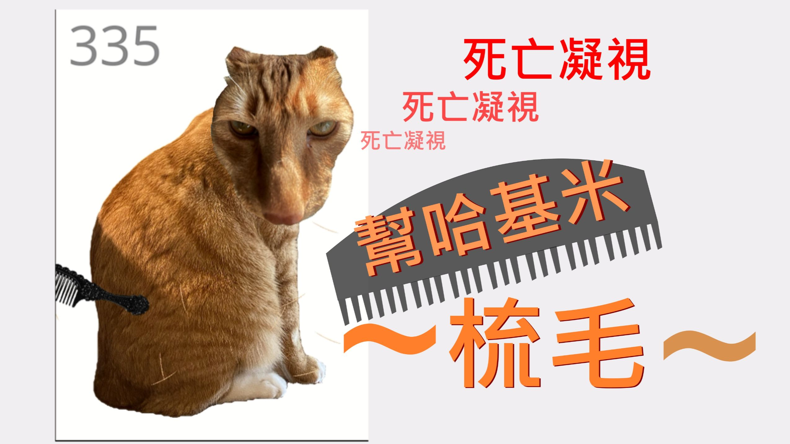 | 1118 | 2026-05-04 |
| [[古典哈基米] 幽 默 曲](https://www.bilibili.com/video/BV1LqReBtECU) |  | 387 | 2026-05-04 |
| [【毛茸茸VLOG】糖喵五一出行篇](https://www.bilibili.com/video/BV1RqReB4ECK) |  | 1945 | 2026-05-04 |
| [这设计把我给看瞎了…【地狱梗番外篇】](https://www.bilibili.com/video/BV17c9aBnEc9) |  | 11.6万 | 2026-05-04 |
| [大花臂栽跟头我太高兴啦！你问我为什么？请参考《乐子猫被猫乐》系列～](https://www.bilibili.com/video/BV1z9RvBvEq7) | 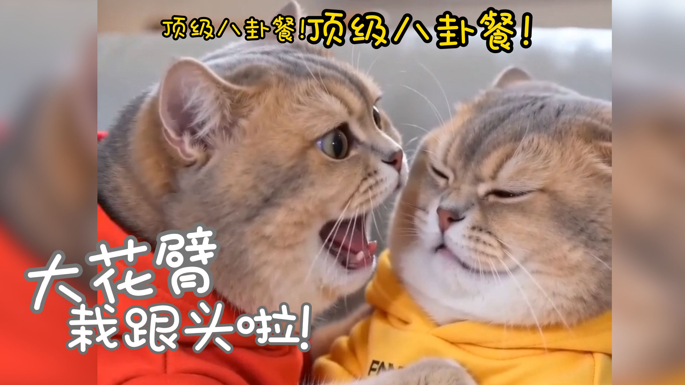 | 1.1万 | 2026-05-04 |
| [[哈基米]Pixel Rebelz](https://www.bilibili.com/video/BV1BGRvBYE3b) |  | 907 | 2026-05-04 |
| [你说得对 但是猫的速度是狗的7倍](https://www.bilibili.com/video/BV12dReB5EKr) | 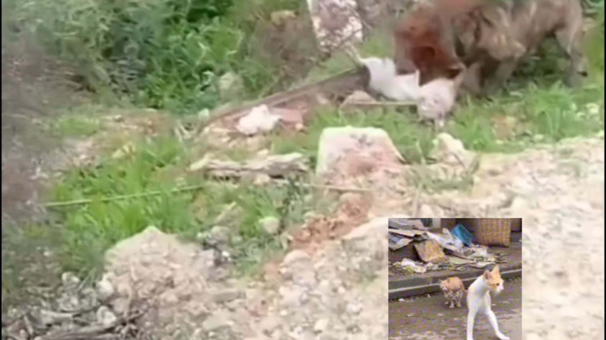 | 3729 | 2026-05-04 |
| [哈基米探望被大狗嚼看守的老吴](https://www.bilibili.com/video/BV11fReBGETv) | 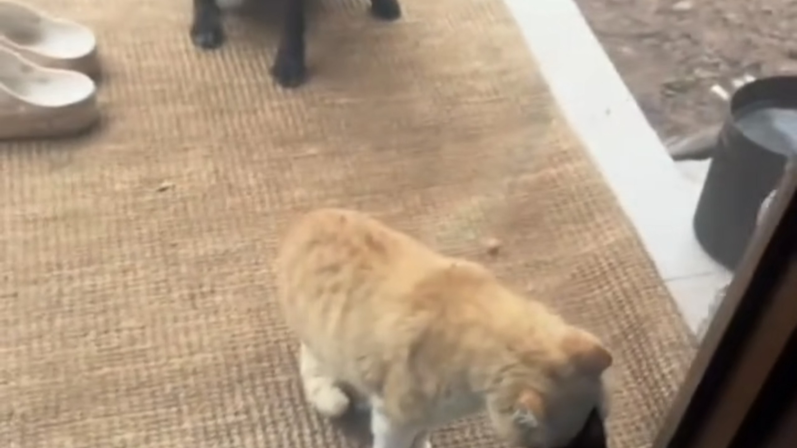 | 2835 | 2026-05-04 |
| [终于找到哈基米了](https://www.bilibili.com/video/BV1B9RvBvE22) | 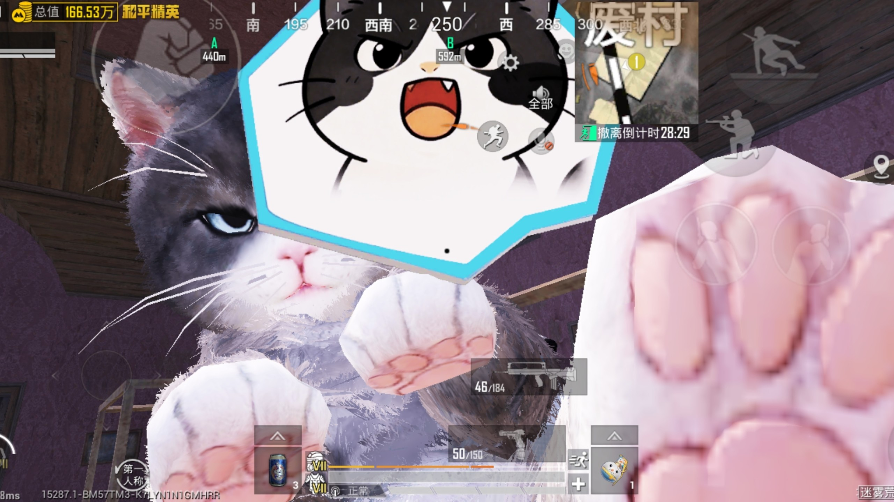 | 399 | 2026-05-04 |
| [两只哈基米正以棘背龙炸毛姿态向你走来](https://www.bilibili.com/video/BV1KM9ZBrE1c) | 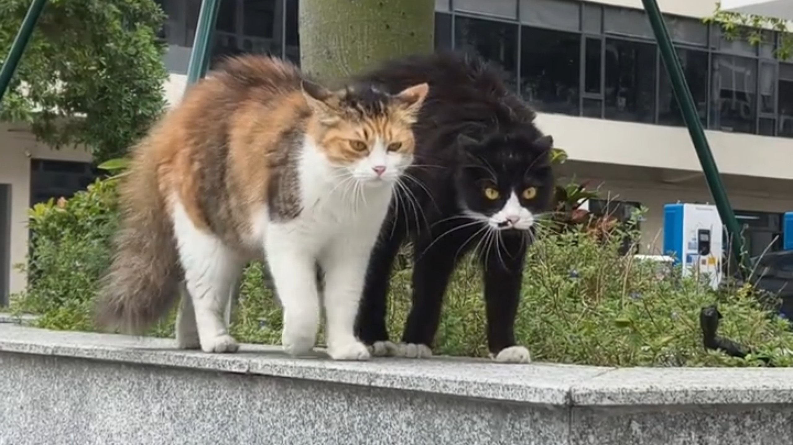 | 1191 | 2026-05-04 |
| [【哈基米音乐】🐱 Beauty And A Beat哈基米🐱](https://www.bilibili.com/video/BV17oRvBYEVc) |  | 149 | 2026-05-04 |
| [大橘哥146-全程高能可爱捏](https://www.bilibili.com/video/BV1CCRvBGEAH) | 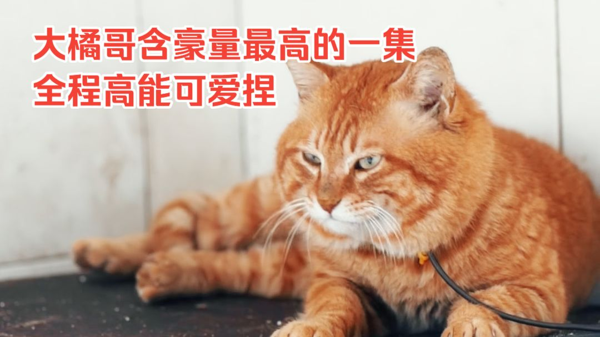 | 5.3万 | 2026-05-04 |
| [top 5最吓人哈基米](https://www.bilibili.com/video/BV1WrRvBCEJw) | 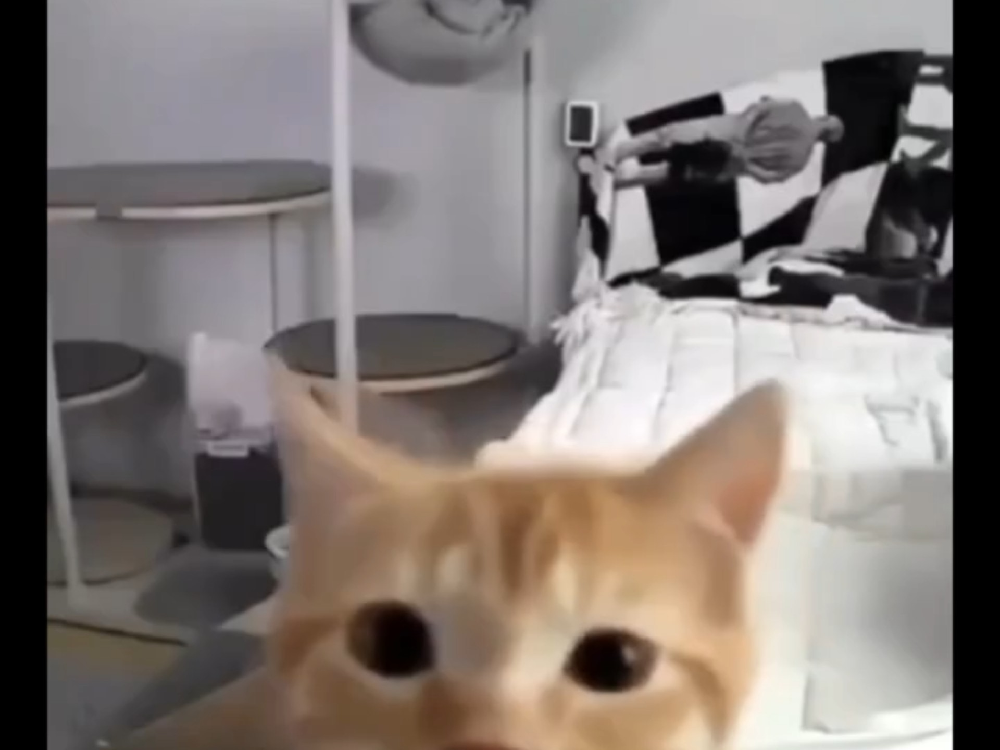 | 1139 | 2026-05-04 |
| [以防你不知道方块基米也会哈气。](https://www.bilibili.com/video/BV1rPRYBcEwt) | 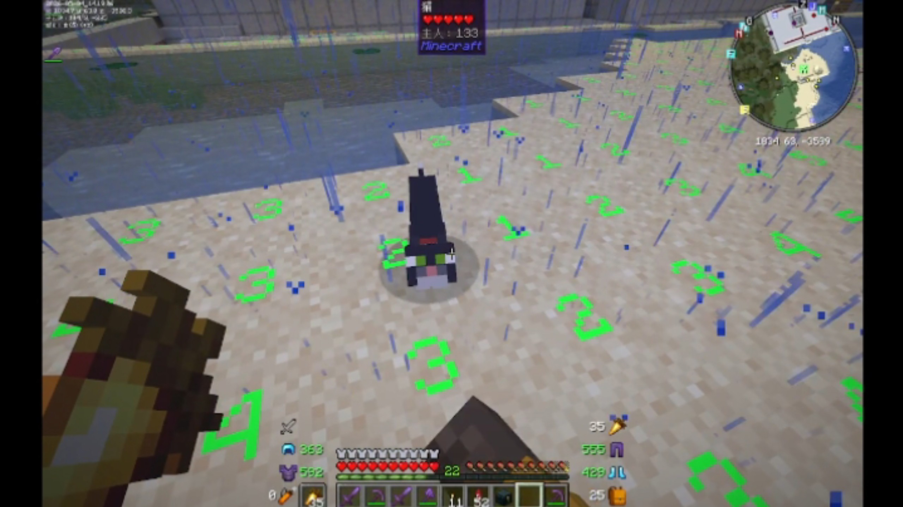 | 594 | 2026-05-04 |
| [米基](https://www.bilibili.com/video/BV1NRRaBMEAA) | 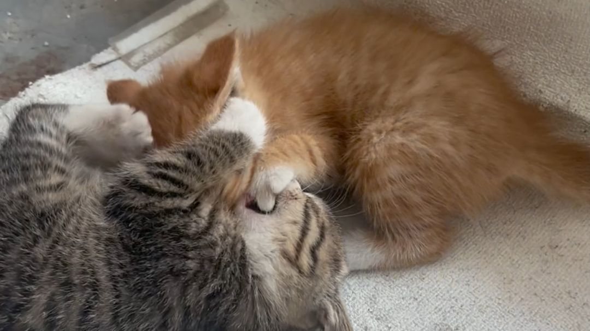 | 1686 | 2026-05-04 |
| [哈基米苦苦挣扎最后还是掉下去去了喵喵星](https://www.bilibili.com/video/BV1sdRaBqEyA) | 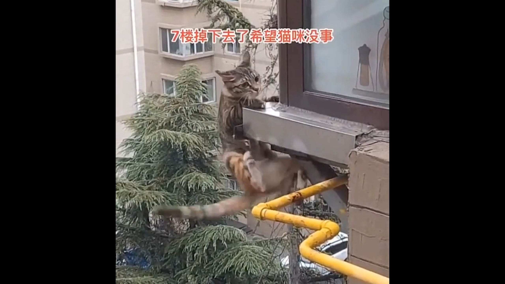 | 4816 | 2026-05-04 |
| [想过弃养哈基米 真的](https://www.bilibili.com/video/BV1RLRYBXEcH) | 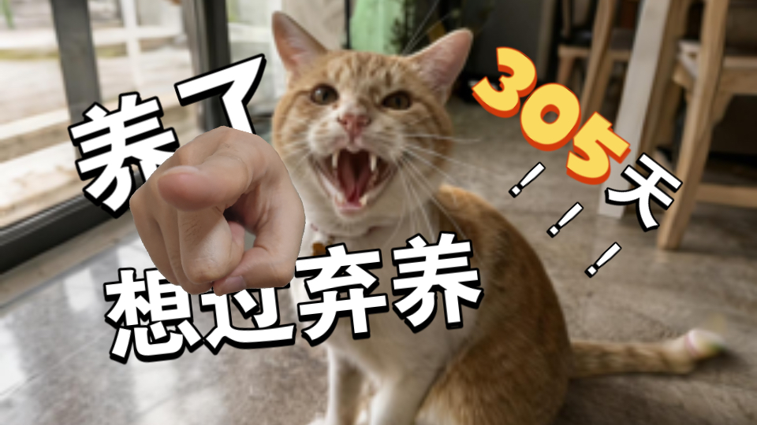 | 2.6万 | 2026-05-04 |
| [【人力/手书】帝宝的Chimipop（哈基米神人杯day4)](https://www.bilibili.com/video/BV1SyRFB9EZv) |  | 4279 | 2026-05-04 |
| [【哈基米音乐】浙江大学校歌](https://www.bilibili.com/video/BV1zMRcBMEbS) |  | 2796 | 2026-05-04 |
| [【哈基米】❤️勇敢爱🐱](https://www.bilibili.com/video/BV1SKR3BJEK3) |  | 5822 | 2026-05-04 |
| [哈基米这个骂骂咧咧～](https://www.bilibili.com/video/BV1wHReBBEeJ) | 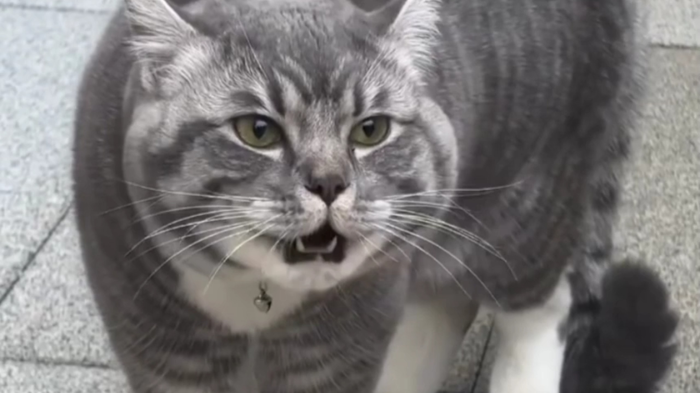 | 1625 | 2026-05-04 |
| [五一已经结束了](https://www.bilibili.com/video/BV15fRcBPEQW) |  | 3586 | 2026-05-04 |
| [大橘哥145-日常](https://www.bilibili.com/video/BV1xzRABREVp) | 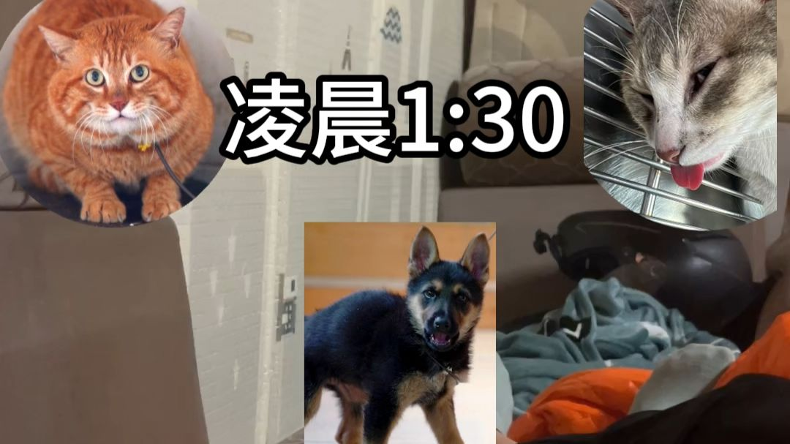 | 2.6万 | 2026-05-03 |
| [哈基米天使吃瘪/受伤合集](https://www.bilibili.com/video/BV1CFRcBCEBP) |  | 1531 | 2026-05-03 |
| [猫儿这个充电基](https://www.bilibili.com/video/BV1sqRcBEEbJ) | 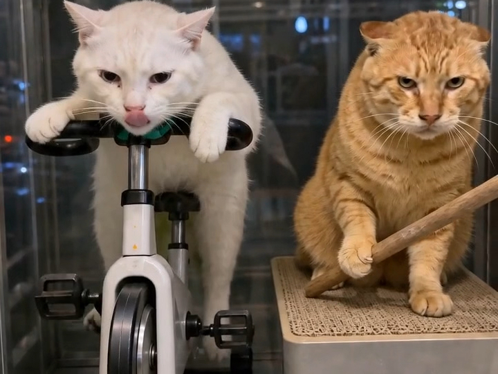 | 191.6万 | 2026-05-03 |
| [⚡有哥真好！！⚡](https://www.bilibili.com/video/BV1VFRFBREgr) |  | 8461 | 2026-05-03 |
| [你个你个纯享](https://www.bilibili.com/video/BV1MN9ZBCEc1) | 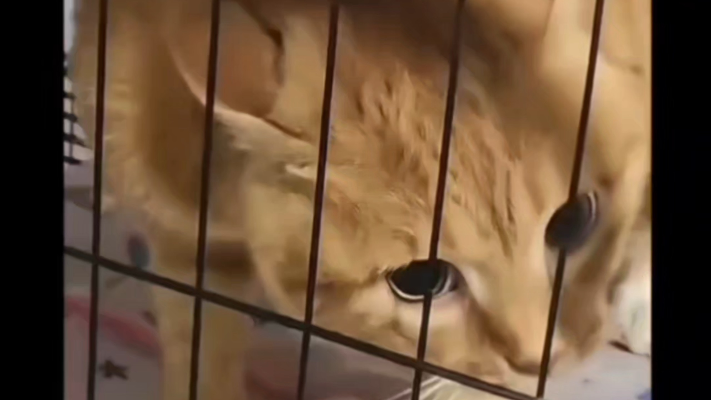 | 2818 | 2026-05-03 |
| [这只猫怎么回事？晕头转向的也听不懂别人说话](https://www.bilibili.com/video/BV1Dz9ZBJEZL) | 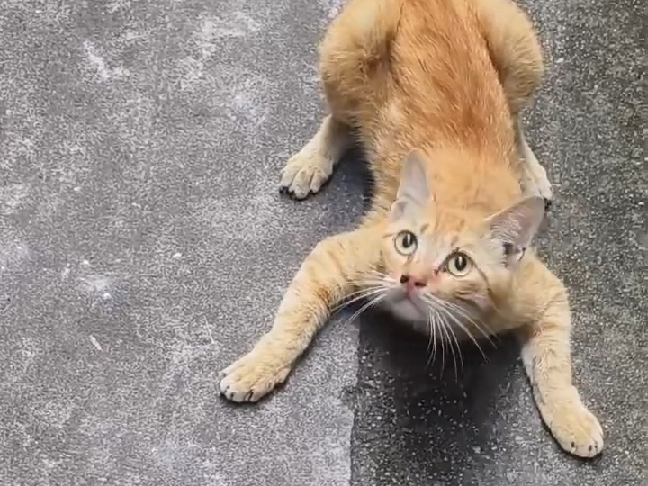 | 4.9万 | 2026-05-03 |
| [【67/20+20+20+7=？meme曲】Six Seven](https://www.bilibili.com/video/BV1Gz9ZBnE28) |  | 5976 | 2026-05-03 |
| [【二补】【哈基米阴乐】耄中毒](https://www.bilibili.com/video/BV1rZ9ZBTE2u) |  | 686 | 2026-05-03 |
| [咪的松弛感](https://www.bilibili.com/video/BV1vF9XBrEaY) | 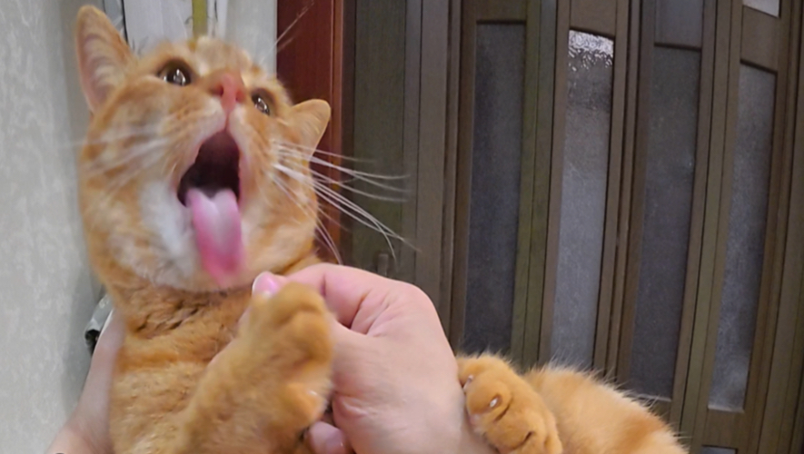 | 6.5万 | 2026-05-03 |
| [何惧浪涛翻，勇气自扬帆。勇敢的去⚡爆⚡回⚡吧！](https://www.bilibili.com/video/BV11199BfE4x) |  | 6.3万 | 2026-05-03 |
| [内个内个内个内个内个内个内个内个内个内个内个](https://www.bilibili.com/video/BV1rR9dBhESE) | 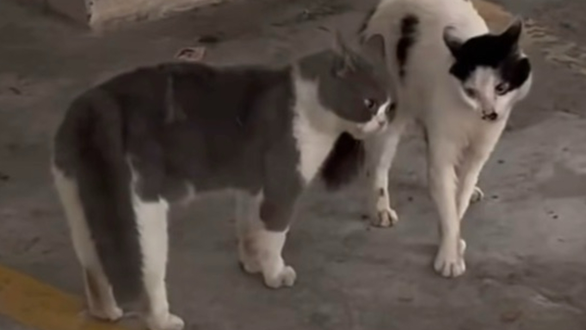 | 7322 | 2026-05-03 |
| [燃烧……我的卡路里……](https://www.bilibili.com/video/BV1WQ9dBeE3h) | 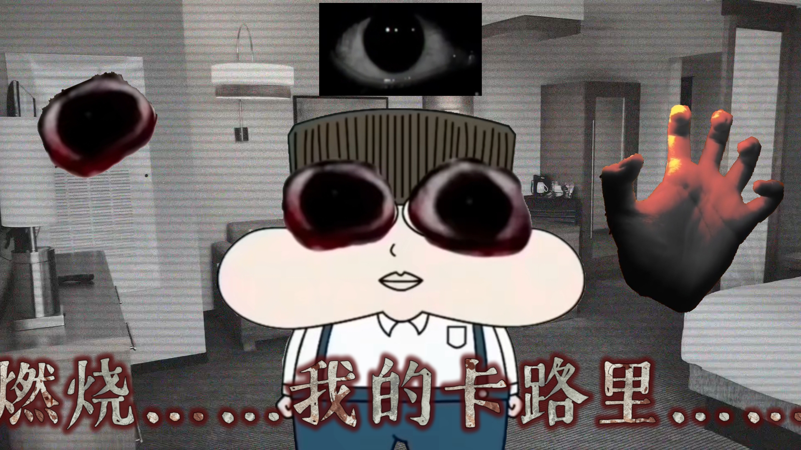 | 17.7万 | 2026-05-03 |
| [哈基米的事不叫偷，叫捕猎](https://www.bilibili.com/video/BV1PD9dBNEpb) | 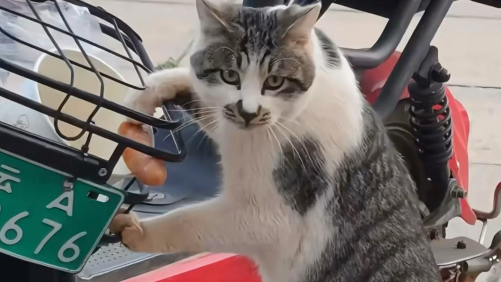 | 1.3万 | 2026-05-03 |
| [哈!基!米!关!灯!神!器!](https://www.bilibili.com/video/BV1Rw9XBgE9B) | 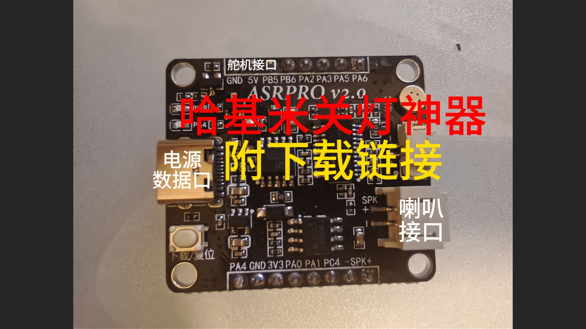 | 2523 | 2026-05-02 |
| [以前我以为猫这种声音是ai](https://www.bilibili.com/video/BV1nh9XBnEEf) | 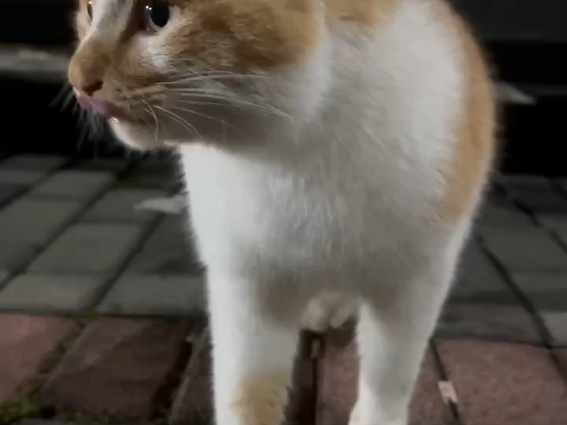 | 2.2万 | 2026-05-02 |
| [原来这才是团子真实的大小 小爱 占领地球！](https://www.bilibili.com/video/BV1NA99BbEgi) |  | 9.8万 | 2026-05-02 |
| [小猫想潜水了](https://www.bilibili.com/video/BV1qCR7BEE4m) | 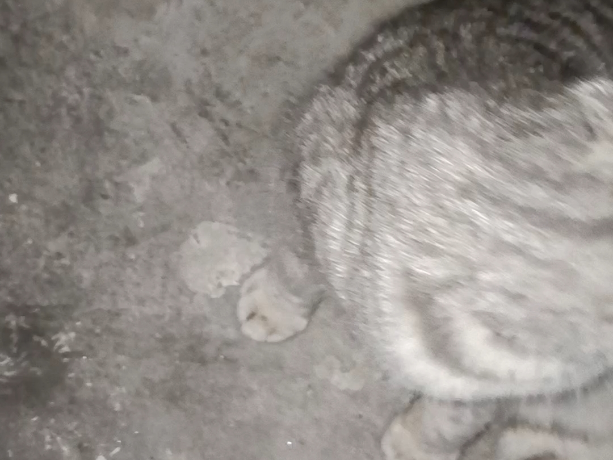 | 1052 | 2026-05-02 |
| [哈基米助眠丨五一睡不着？来听听这20分钟的触发](https://www.bilibili.com/video/BV1h29DBaEFG) | 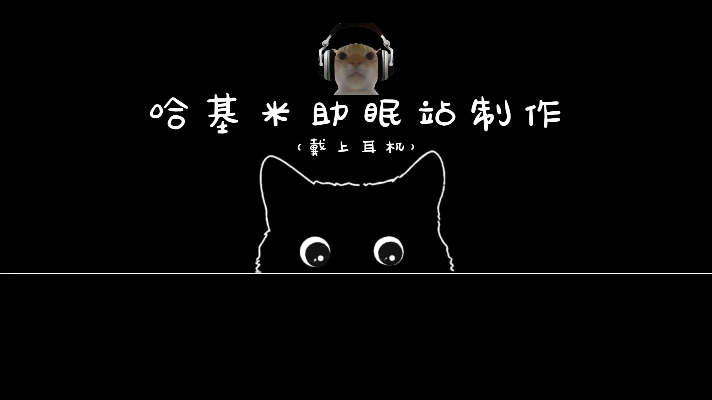 | 2986 | 2026-05-02 |
| [以防你不知道首领哈基米很温柔](https://www.bilibili.com/video/BV1zpREBQEwM) |  | 9.6万 | 2026-05-02 |
| [当哈基米不小心钻入排气管](https://www.bilibili.com/video/BV1ZnRjBLEsc) | 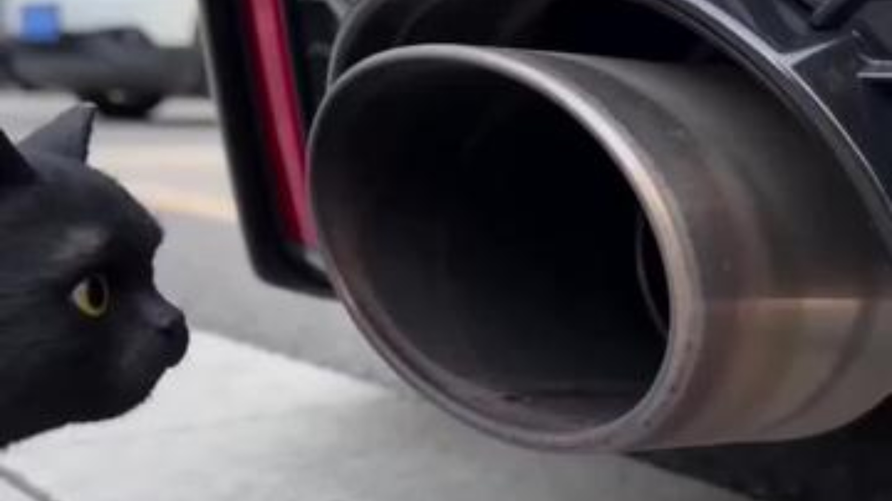 | 18.1万 | 2026-05-02 |
| [你可曾在鸣潮救过一只莫宁猫？](https://www.bilibili.com/video/BV1rsR3BTE7T) |  | 13.6万 | 2026-05-02 |
| [也许你已经忘了我的故事，但仍会哼起那首歌](https://www.bilibili.com/video/BV1uXRVBoEqh) |  | 18.9万 | 2026-05-02 |
| [【哈基米神人杯day2】哈气障碍星人【手书】](https://www.bilibili.com/video/BV1BbR3BeEkq) |  | 4507 | 2026-05-02 |
| [单方面烦一下嘬！](https://www.bilibili.com/video/BV1d1RKB7EJ5) | 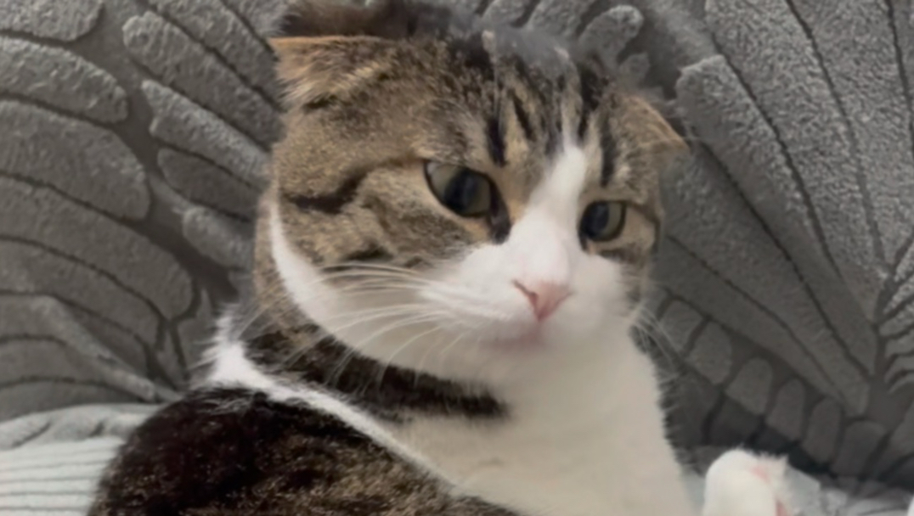 | 7.5万 | 2026-05-01 |
| [你不结婚老了该怎么办，请看我的猫](https://www.bilibili.com/video/BV17A9eBoE97) |  | 14.5万 | 2026-04-30 |
| [其实咪知道](https://www.bilibili.com/video/BV16i9aB4E6Y) | 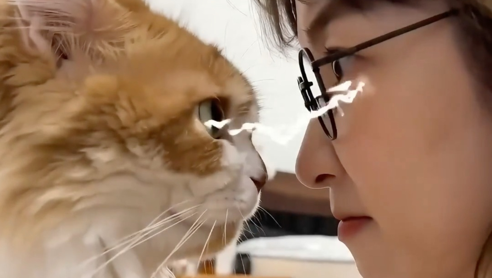 | 35.1万 | 2026-04-30 |
| [【史诗版】《赐我》赤潮版——Epic Symphony Cover](https://www.bilibili.com/video/BV1Fe9aBZEDm) |  | 39.6万 | 2026-04-30 |
| [再也不来爷爷家了](https://www.bilibili.com/video/BV1dC9aBDEW5) | 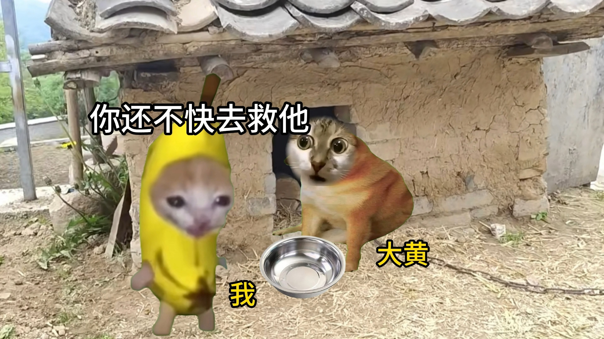 | 237.8万 | 2026-04-30 |
| [圆哈F4试听网络热门找猫音频](https://www.bilibili.com/video/BV1TA9yBBE2M) | 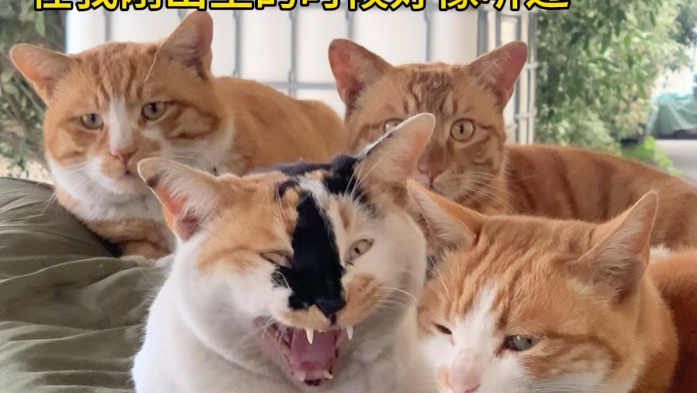 | 1.3万 | 2026-04-28 |
| [哈基米出大金了！哈哈哈哈哈 #蛋仔派对 #蛋仔奇思妙想计划 #蛋仔惊魂寻宝队 #蛋仔揪出哈基咪](https://www.bilibili.com/video/BV1mHorBBEVn) | 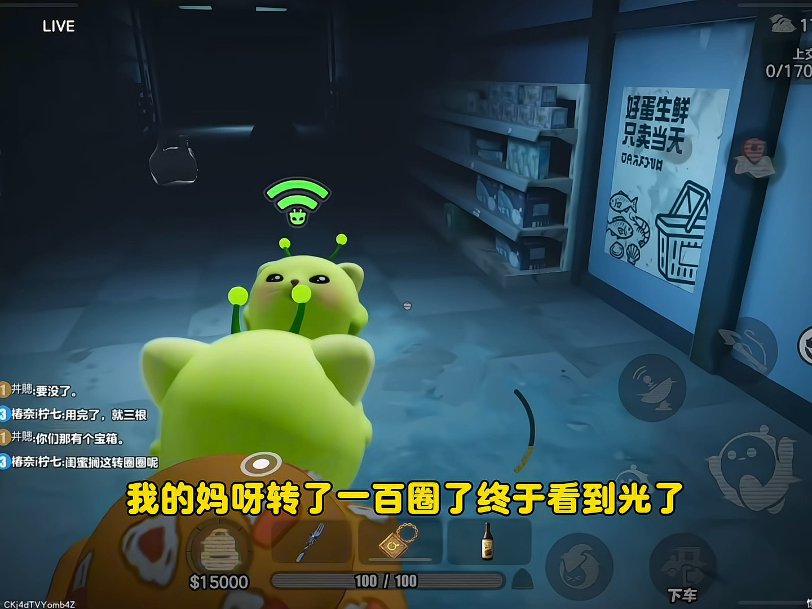 | 1.2万 | 2026-04-27 |
| [让曼波再飞一会！](https://www.bilibili.com/video/BV1zsoYBeELj) |  | 110.8万 | 2026-04-26 |
| [【WhisperSoft】ASMR：近距离视觉触发清洁你的眼睛👁️｜细腻手法+贴脸操作带来真实护理沉浸感｜轻柔触感与舒缓节奏层层放松神经助你快速入眠解压放松](https://www.bilibili.com/video/BV1gro9B5Eoa) | 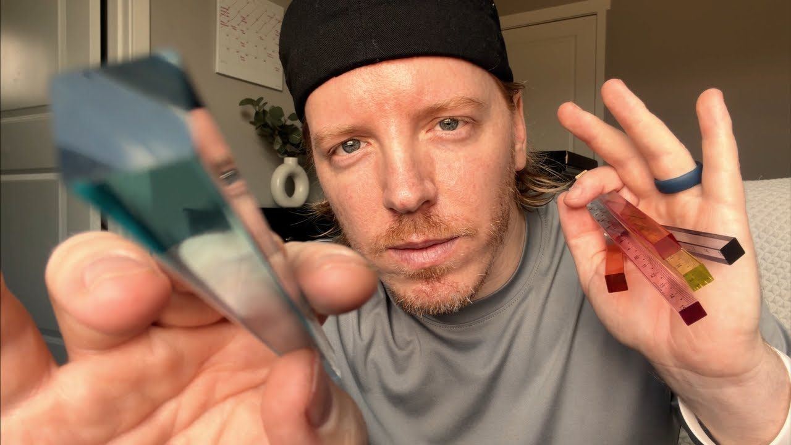 | 5.7万 | 2026-04-25 |
| [哈基宗日常 代码冲突](https://www.bilibili.com/video/BV1CaoXBhE9P) | 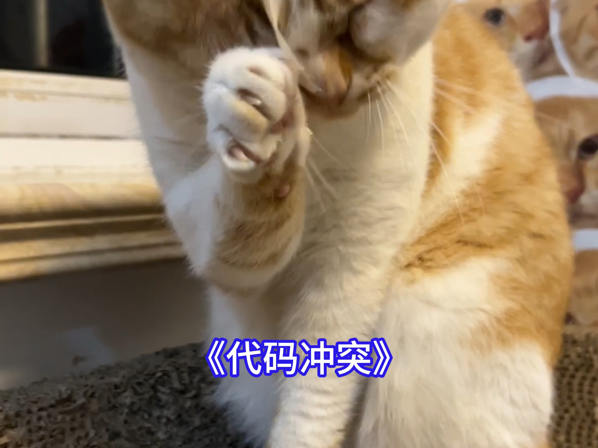 | 263.6万 | 2026-04-25 |
| [小猫咪的复仇大作战！🐱🚓拯救猫妈超有爱💥](https://www.bilibili.com/video/BV1AhoXBwEk5) |  | 8722 | 2026-04-25 |
| [猫妈巧手做虎帽，崽崽秒变小脑斧🐱🎩🐯](https://www.bilibili.com/video/BV13uojB6EPn) |  | 1.8万 | 2026-04-24 |
| [🐧：你身边那些爱玩烂梗的朋友🐧](https://www.bilibili.com/video/BV1fnoMBFELZ) |  | 210.0万 | 2026-04-23 |
| [老吴一分钟纯享版2.0](https://www.bilibili.com/video/BV1X6oWBaEno) | 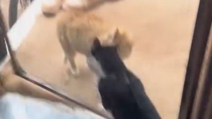 | 7142 | 2026-04-22 |
| [小猫咪需要多打点鱼](https://www.bilibili.com/video/BV1EJd1BYEsi) |  | 28.7万 | 2026-04-21 |
| [[AI扩写]嫌一分半的Unhappy太短？AI扩写到三分半的听个爽！](https://www.bilibili.com/video/BV193dZBxE93) |  | 96.1万 | 2026-04-19 |
| [“叫~是曾母暗沙王来了！”](https://www.bilibili.com/video/BV1kfdBBQEEo) | 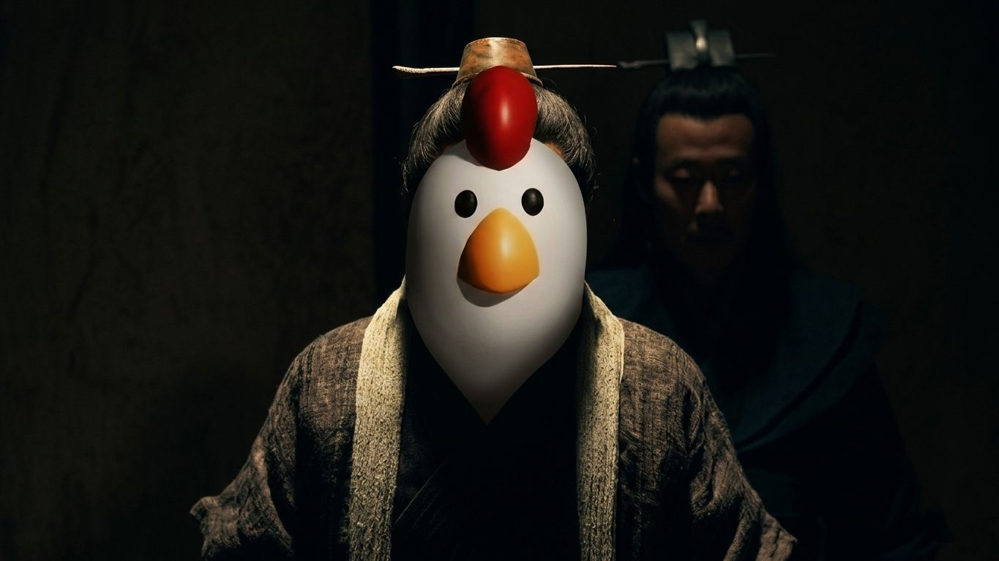 | 6.6万 | 2026-04-17 |
| [循环歌单｜“我发现这首歌也特别适合千夏熟女摇”｜【低皮质醇】｜《Ai đưa em về》 (Cukak Remix) - TIA、Lê Thiện Hiếu](https://www.bilibili.com/video/BV1WEQiBqECh) |  | 15.1万 | 2026-04-14 |
| [【哈基米版】8090看得最多的一版天龙八部，假如哈基米的世界也有武侠~](https://www.bilibili.com/video/BV1taDkBFE6R) |  | 8524 | 2026-04-11 |
| [如听仙乐耳暂明](https://www.bilibili.com/video/BV14kDvBuEv4) |  | 13.9万 | 2026-04-07 |
| [私人音效大合集⚡️⚡️](https://www.bilibili.com/video/BV18Ei3BiEFL) |  | 118.2万 | 2025-12-31 |
| [母猫带崽买气球，小猫手作绝了！](https://www.bilibili.com/video/BV16hySBnEud) |  | 28.7万 | 2025-10-29 |
| [全球超萌猫咪，点亮你的每一天！😻](https://www.bilibili.com/video/BV1g7xezFEXo) | 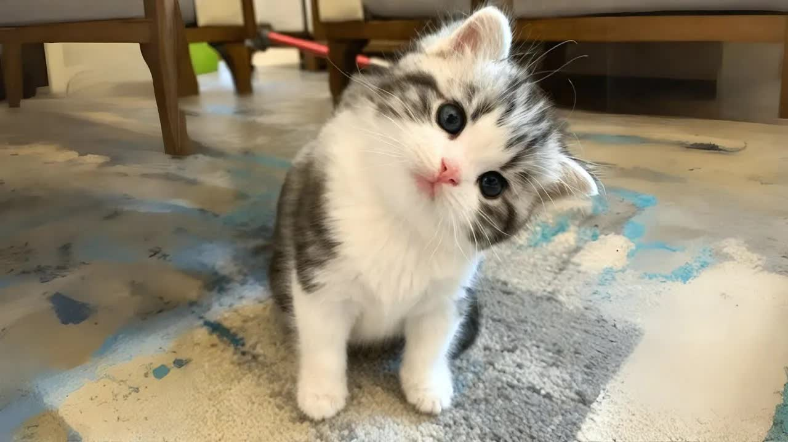 | 4.3万 | 2025-10-08 |
| [棍棒底下出豪猫](https://www.bilibili.com/video/BV1VnHizwEdy) | 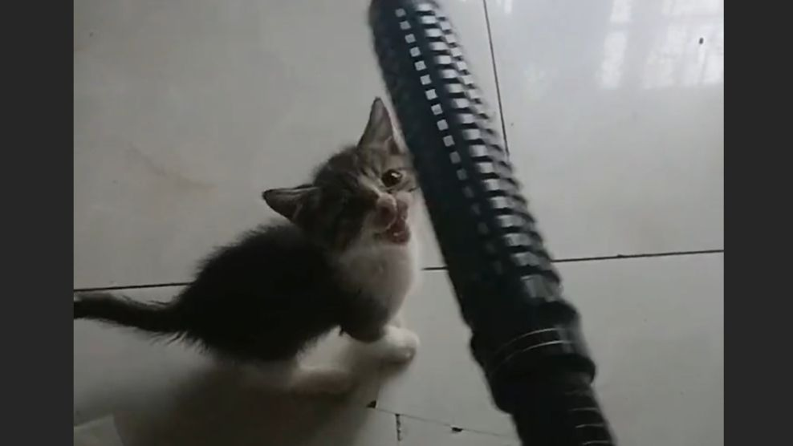 | 52.0万 | 2025-09-11 |
| [【本家】バカみたいに - 初音ミク【カササギ】](https://www.bilibili.com/video/BV1z7gPzXEzJ) |  | 176.5万 | 2025-07-17 |
| [猫儿这个哈基米德](https://www.bilibili.com/video/BV1QyEUzHEYb) | 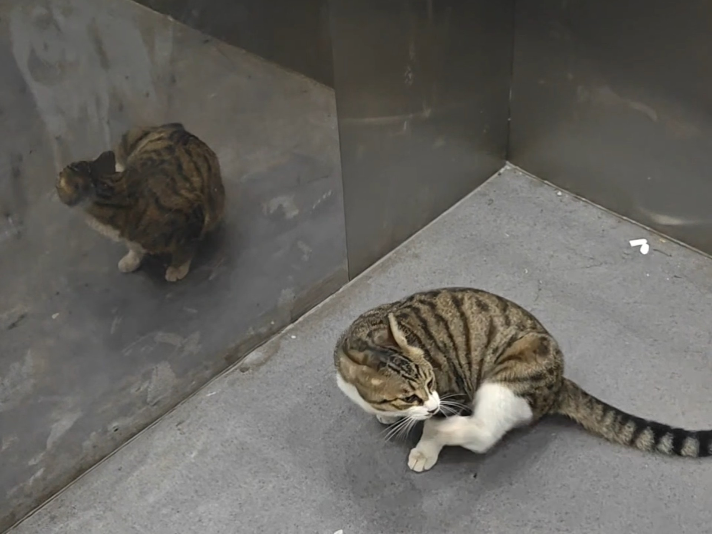 | 8.3万 | 2025-05-19 |
| [小猫爱看的动画片](https://www.bilibili.com/video/BV1Q6LUz5EUY) | 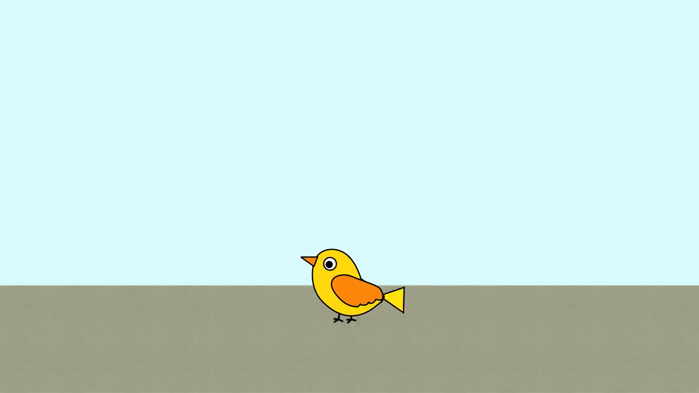 | 18.0万 | 2025-04-28 |
| [超级小猫战队:喵喵成长记](https://www.bilibili.com/video/BV1gfLozPEKA) | 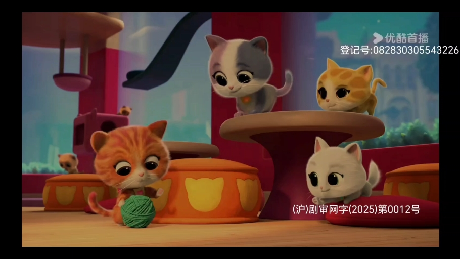 | 7.7万 | 2025-04-26 |
| [真实猫呼噜声+自然下雨鸟叫白噪音｜3分钟入睡·白噪音循环](https://www.bilibili.com/video/BV12LXpY1E7f) | 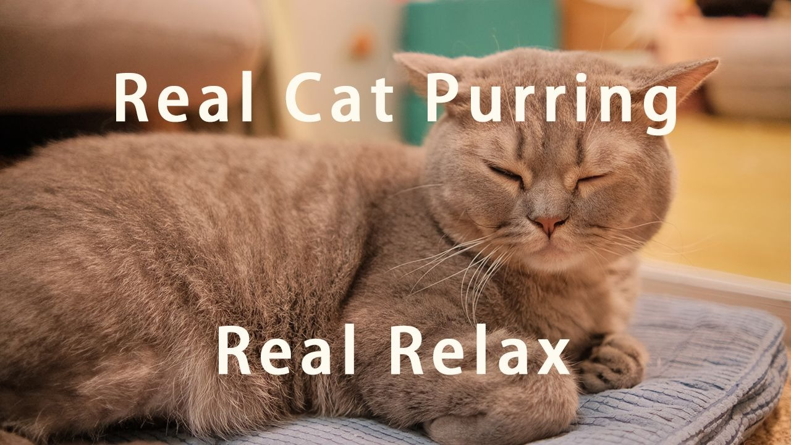 | 14.2万 | 2025-03-30 |
| [【补档】🎵𝑪𝒐𝒍𝒐𝒓-𝑿🎵哈基米音乐](https://www.bilibili.com/video/BV1ShFGegEJb) | 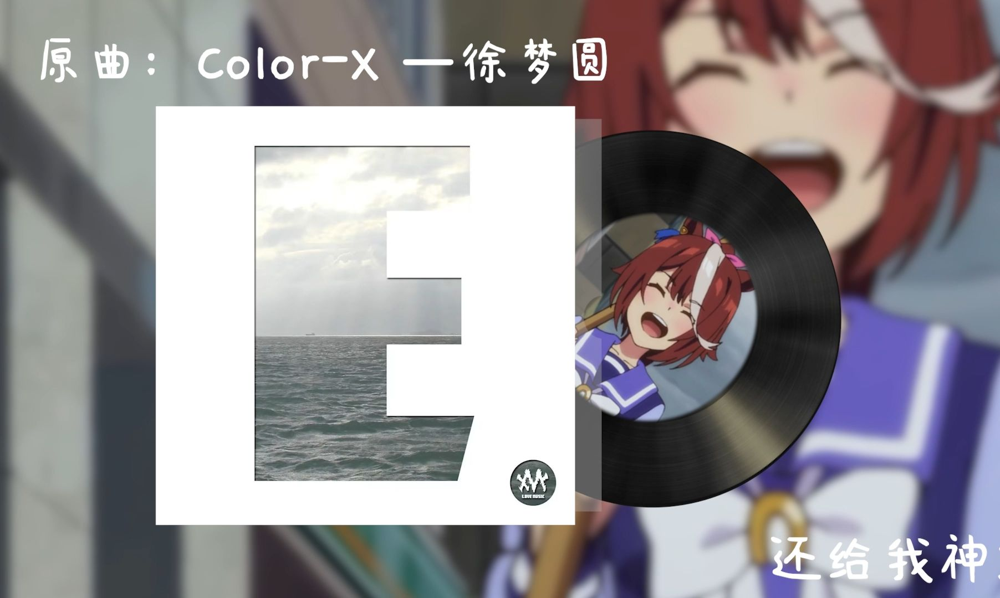 | 43.0万 | 2025-01-30 |
| [“叮咚鸡”又火了？搞笑海南话魔性洗脑全网，网友：撞车神曲！](https://www.bilibili.com/video/BV1n163YVEqV) |  | 99.0万 | 2024-12-30 |
| [吓老鼠专用猫叫](https://www.bilibili.com/video/BV1aw4m1i7Sd) | 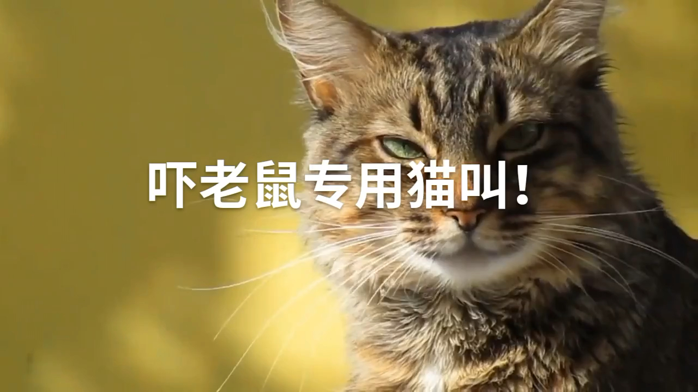 | 39.0万 | 2024-06-05 |
| [chipi chipi chapa chapa](https://www.bilibili.com/video/BV1bC4y1Q7sn) | 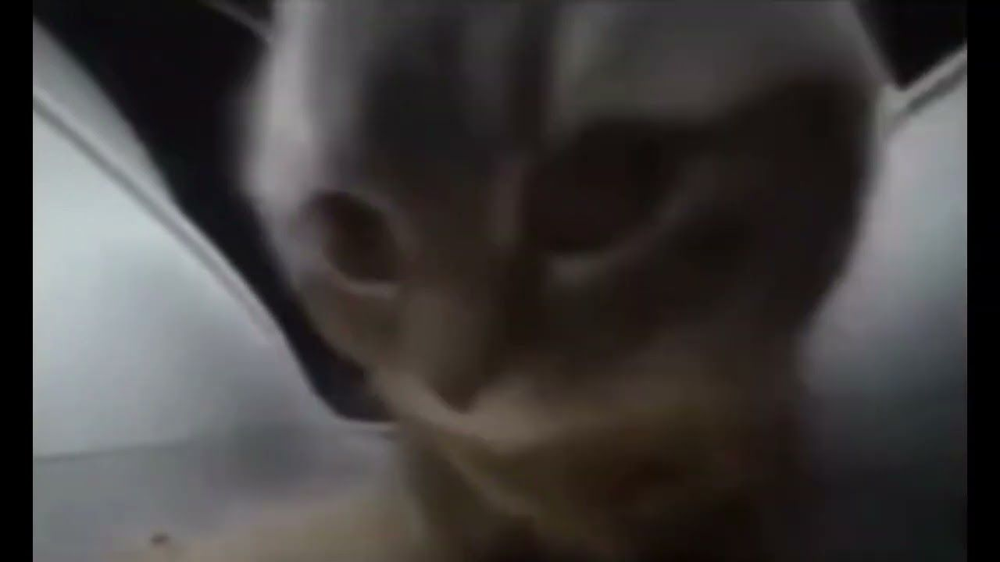 | 797.1万 | 2023-12-17 |
| [动物安抚系列｜频率共振 安抚猫咪情绪](https://www.bilibili.com/video/BV1Ju4y1979o) |  | 49.7万 | 2023-08-16 |
| [【4K 120帧 Hi-Res】一首《スパークル(火花）》，能否让你回想起她的名字](https://www.bilibili.com/video/BV14X4y1m7CQ) |  | 511.0万 | 2023-04-30 |
| [能吸引猫咪的声音，百试百灵](https://www.bilibili.com/video/BV1YG4y1G74K) | 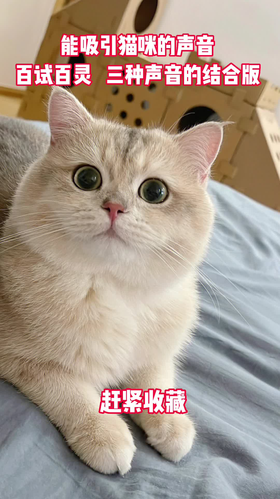 | 536.6万 | 2022-11-29 |
| [前方高能！！！电音女声《Normal No More》开口就惊艳](https://www.bilibili.com/video/BV1Pt4y1L7XV) |  | 1012.8万 | 2022-07-25 |
| [猫猫召唤术(合成5分钟版)](https://www.bilibili.com/video/BV17b4y1t7BZ) | 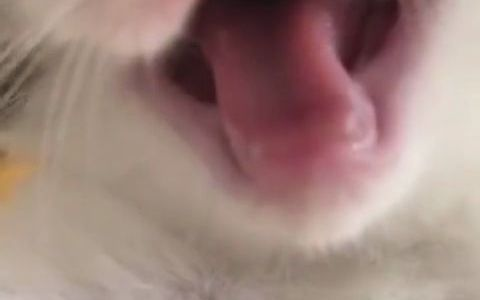 | 375.0万 | 2021-11-14 |
| [猫猫看的视频，亲身实验，猫很喜欢！](https://www.bilibili.com/video/BV1ta4y177AZ) |  | 227.4万 | 2020-08-25 |
| [【1080】【小猫汤米第一季】](https://www.bilibili.com/video/BV1FE411h7HT) |  | 13.2万 | 2019-10-30 |

---
*最后更新: 2026-05-05 03:19:13 (自动生成)*
*数据来源: [Bilibili](https://www.bilibili.com)*

## 使用说明

运行以下命令更新视频列表:
```bash
python3 fetch_hajimi_videos.py
```
