# awesome-hajimi
collections of hajimi (哈基米 in Chinese) on the Internet.

## 视频列表 (Video List)

| 视频标题 (Title) | 封面 | 播放量 (Views) | 发布日期 (Date) |
|---|---|---|---|
| [【三国杀百科981】哈基米神力再临！喵喵杯第二弹](https://www.bilibili.com/video/BV1mnPuzeE4V) | 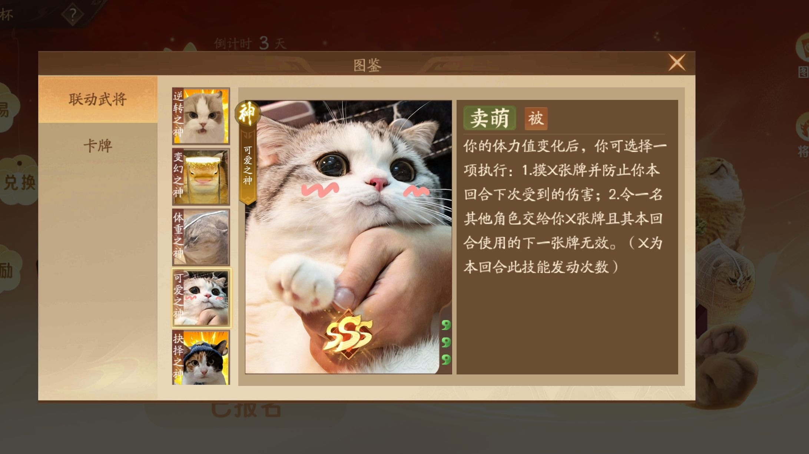 | 1.4万 | 2026-03-02 |
| [【一只小猫哈基米】新作上线，快来看看！](https://www.bilibili.com/video/BV1jhPGzsENQ) | 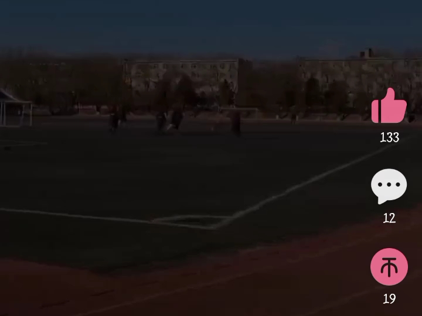 | 0 | 2026-03-02 |
| [哈基米之歌第八首](https://www.bilibili.com/video/BV1ZPPuzLEGQ) |  | 203 | 2026-03-01 |
| [【2月】哈基米音乐排行榜#17](https://www.bilibili.com/video/BV1q2Puz2EVa) |  | 3.2万 | 2026-03-01 |
| [😿对你来说我到底是谁….😿](https://www.bilibili.com/video/BV166PuzDEcu) |  | 270 | 2026-03-01 |
| [【循环歌单】【哈上旅程の小曲】哈基米踏上了旅程（哈基米は旅に出る）](https://www.bilibili.com/video/BV1tPPgzNEMT) |  | 786 | 2026-03-01 |
| [已修改呜呜呜审核不让发声-睡前记得擦擦哦-足腿擦擦（宠粉版）](https://www.bilibili.com/video/BV1MmABz1Equ) |  | 8.9万 | 2026-03-01 |
| [基米小学：摆烂耄和好哥们](https://www.bilibili.com/video/BV16vPTzjE9H) | 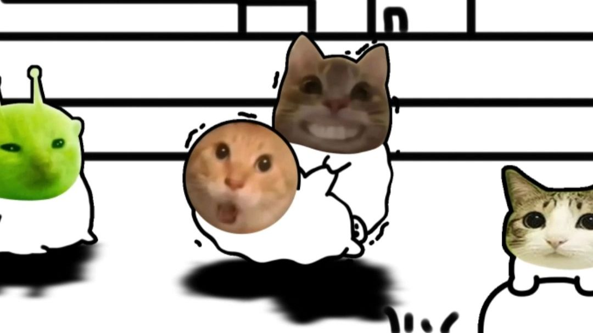 | 2.4万 | 2026-03-01 |
| [梦到哪句说哪句！《海绵宝宝》央配机翻重灾区的一集！不可饶恕！自毁招牌！边说边忘，不知所云！](https://www.bilibili.com/video/BV1GvABz9Ehy) |  | 8.8万 | 2026-03-01 |
| [进](https://www.bilibili.com/video/BV1xDABzCE4i) |  | 2.2万 | 2026-03-01 |
| [[哈基米]тамада《核爆の小曲》（重混音版）](https://www.bilibili.com/video/BV1rrAzzBEu3) |  | 7905 | 2026-03-01 |
| [哈基米呀南北绿豆哈亚酷奈路](https://www.bilibili.com/video/BV1GEAzzsEtb) |  | 829 | 2026-03-01 |
| [哈基米音乐 万能基米旅店 : 狗尿馆 (原曲不使用)](https://www.bilibili.com/video/BV1qDAzzaEQw) |  | 269 | 2026-03-01 |
| [啊？51.0](https://www.bilibili.com/video/BV1rbAYzpEwh) |  | 73.4万 | 2026-03-01 |
| [我想到一个不哈基米不曼波就能出圈的方法😎](https://www.bilibili.com/video/BV1gHAqzyEsK) |  | 2 | 2026-03-01 |
| [【鼠魂觉醒第二季】合集](https://www.bilibili.com/video/BV1shZLB8Ekp) |  | 31.7万 | 2026-03-01 |
| [还有退步空间](https://www.bilibili.com/video/BV11tAqzzEN2) | 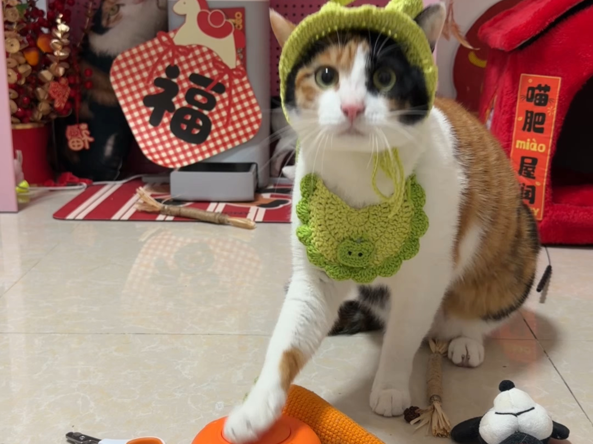 | 16.2万 | 2026-03-01 |
| [全kards最诡异的图片，哈基米看完吃物资短缺（2）](https://www.bilibili.com/video/BV1r6AqzhEgw) | 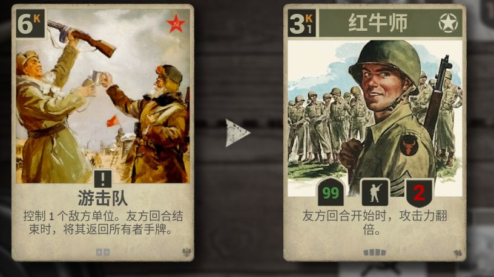 | 2028 | 2026-03-01 |
| [【特朗普x哈梅内伊】牵丝戏](https://www.bilibili.com/video/BV1bZAYzYEbC) |  | 48.5万 | 2026-02-28 |
| [后室探险vlog-12，超现实太空滑梯…恐高慎入！【B站AI创作大赛-开放赛道】](https://www.bilibili.com/video/BV1VxAez5E5G) |  | 27.6万 | 2026-02-28 |
| [哈基米这个恶人自有恶猫磨](https://www.bilibili.com/video/BV1epAazBEeM) | 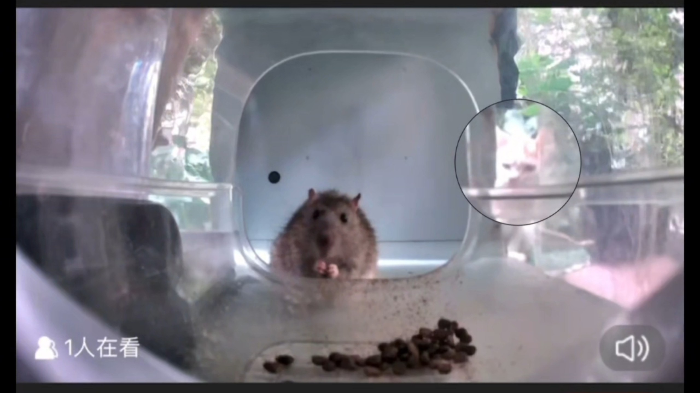 | 2083 | 2026-02-28 |
| [手足无措了嘛？⚡点⚡辰⚡将会是答案](https://www.bilibili.com/video/BV1oEAaz3EnD) |  | 7.8万 | 2026-02-28 |
| [哈基米音乐：别当哈基米了！（艾猫tv的小曲）](https://www.bilibili.com/video/BV1nmAazHEoZ) |  | 1776 | 2026-02-28 |
| [哈基米难绷](https://www.bilibili.com/video/BV11nAYzZEFo) | 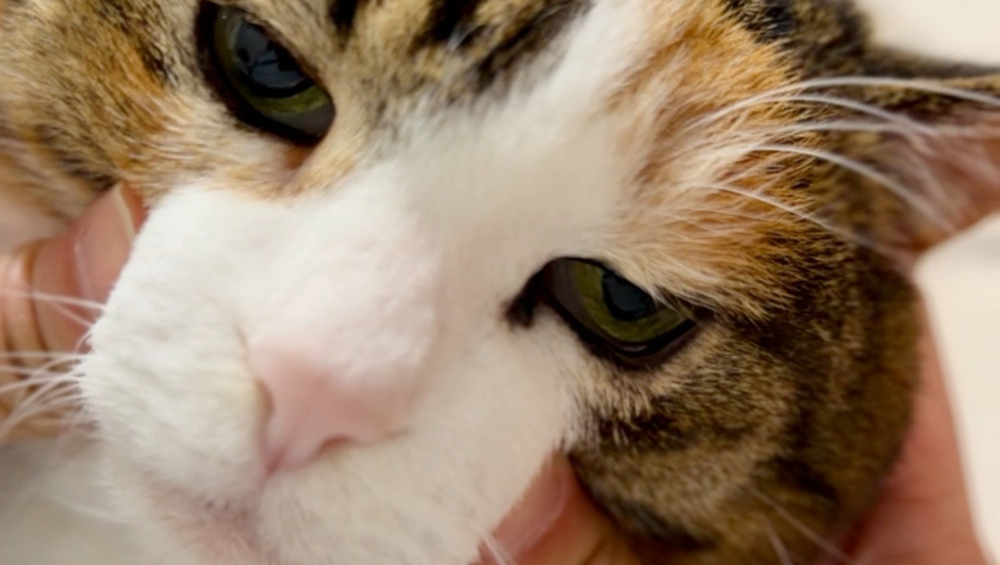 | 1026 | 2026-02-28 |
| [无障碍交流](https://www.bilibili.com/video/BV1NvA8zQEmU) |  | 7.4万 | 2026-02-28 |
| [哈基米的黄金代码](https://www.bilibili.com/video/BV15rAhzqEtH) | 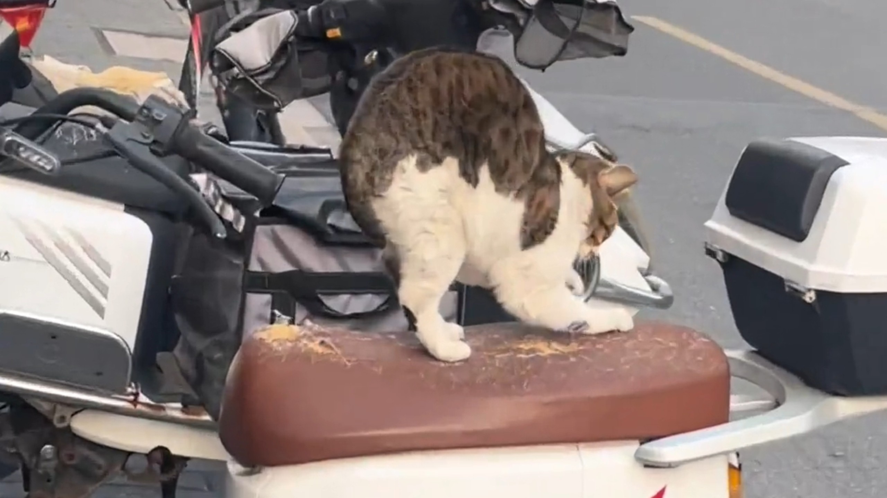 | 5648 | 2026-02-28 |
| [这一次，我不会再弄丢你了](https://www.bilibili.com/video/BV1ZUAtzPEGX) |  | 72.7万 | 2026-02-28 |
| [哈基米VS奶龙（黑龙vs恐龙）](https://www.bilibili.com/video/BV1piAtzVE8y) |  | 6959 | 2026-02-28 |
| [【2026哈基米拜年基单品】哈基米：lost umbrella](https://www.bilibili.com/video/BV1UHAUzVEiH) |  | 2216 | 2026-02-28 |
| [☝🤓 挥手不是抱歉，而是老弟你还得练⚡⚡⚡](https://www.bilibili.com/video/BV1arAbzZEcw) |  | 17.1万 | 2026-02-28 |
| [假如忧郁是一种天赋，看来还是耄耋略胜一筹。](https://www.bilibili.com/video/BV1kFA8z1Eo9) | 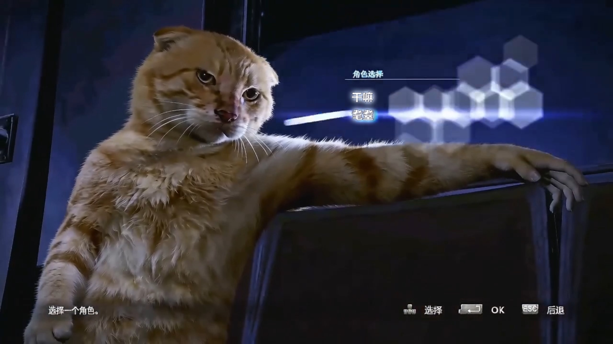 | 18.0万 | 2026-02-28 |
| [哈基米依旧cos捷豹](https://www.bilibili.com/video/BV1x9AbzSE1o) | 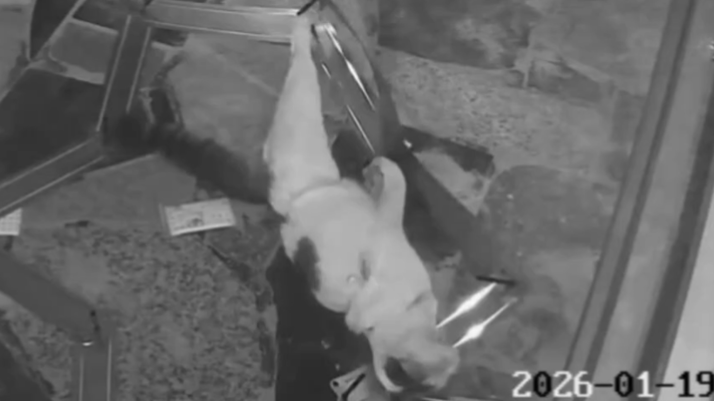 | 2894 | 2026-02-28 |
| [【哈基米】哈尔坦星人的笑声](https://www.bilibili.com/video/BV1N7AQzCE35) |  | 4067 | 2026-02-27 |
| [用毒蛇的毒毒毒蛇，毒蛇会不会毒死？](https://www.bilibili.com/video/BV1vgAUzDEmr) |  | 173.1万 | 2026-02-27 |
| [小企鹅忘记写寒假作业了...【终末地幼儿园】](https://www.bilibili.com/video/BV1kvAUzeE3T) |  | 114.5万 | 2026-02-27 |
| [雪地传来了Boy♂Next♂Door](https://www.bilibili.com/video/BV1NgASz6EdX) |  | 2.9万 | 2026-02-27 |
| [电棍：不如哇袄](https://www.bilibili.com/video/BV1wGA1zXEgX) |  | 4.3万 | 2026-02-27 |
| [🐧3月1号开学的我🐧](https://www.bilibili.com/video/BV1AGAmzhEkv) | 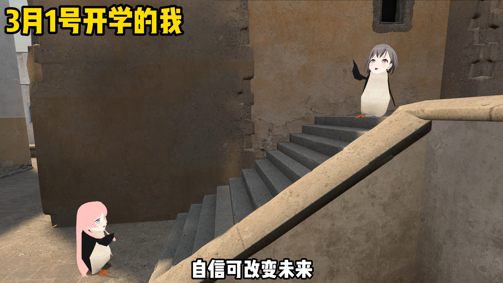 | 107.2万 | 2026-02-27 |
| [【哈基米】哈气不熄](https://www.bilibili.com/video/BV1pjA6zyEmc) |  | 3264 | 2026-02-27 |
| [《堡垒之夜》X《崩坏：星穹铁道》刃 舞蹈展示](https://www.bilibili.com/video/BV1BAAUzxEVG) |  | 59.6万 | 2026-02-27 |
| [🍬古文今译🐧](https://www.bilibili.com/video/BV1YMAyziEJY) |  | 598.5万 | 2026-02-27 |
| [撤 所 月 色](https://www.bilibili.com/video/BV1z5A1zHEtW) |  | 18.1万 | 2026-02-27 |
| [《堡垒之夜》X《崩坏：星穹铁道》卡芙卡 舞蹈展示](https://www.bilibili.com/video/BV1QhA1zzExK) | 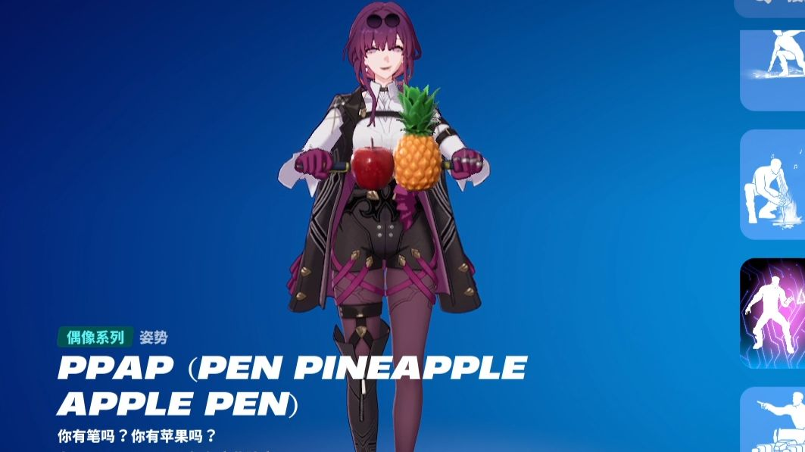 | 110.4万 | 2026-02-27 |
| [♿电棍：Axel F♿](https://www.bilibili.com/video/BV147AkzQEjB) | 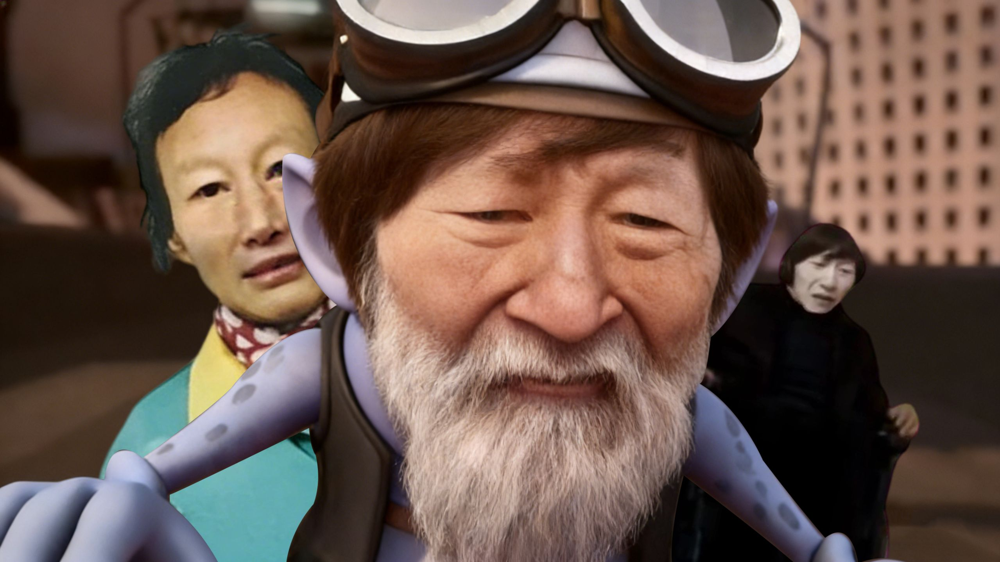 | 25.6万 | 2026-02-26 |
| [神曼波·神咚鸡·神哇袄 三位一体 超神哈基米电音：Orbit](https://www.bilibili.com/video/BV1wNACzSEAE) |  | 5403 | 2026-02-26 |
| [哈基米](https://www.bilibili.com/video/BV1KfAkz9ErA) | 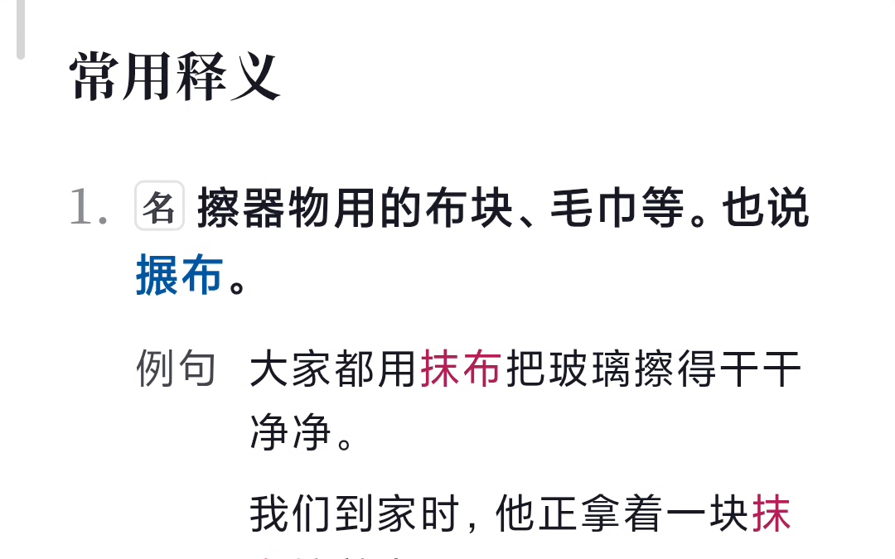 | 0 | 2026-02-26 |
| [长 太 高 了](https://www.bilibili.com/video/BV18KA6zHENG) |  | 271.1万 | 2026-02-26 |
| [“我们就是！鬼畜分类队”](https://www.bilibili.com/video/BV13yA6zxE97) |  | 6.2万 | 2026-02-26 |
| [🐧迷茫的时候，不妨听听凑企鹅的话🐧](https://www.bilibili.com/video/BV17ufvBgE8D) |  | 16.9万 | 2026-02-26 |
| [26年最难听的洗脑神曲，这些歌到底是谁在听！](https://www.bilibili.com/video/BV15MfYBAEGn) |  | 344.8万 | 2026-02-26 |
| [这是给，没有人知道碰它的后果是什么](https://www.bilibili.com/video/BV1rJfiBHECT) |  | 8.8万 | 2026-02-26 |
| [辛巴巴哈基米哈（烂作。）](https://www.bilibili.com/video/BV1Z8f4BXEG9) |  | 4.7万 | 2026-02-25 |
| [雪地传来了哦yes♂sir](https://www.bilibili.com/video/BV1cpfsBDEg1) |  | 4.1万 | 2026-02-25 |
| [“雪地里传来了歪比巴卜”](https://www.bilibili.com/video/BV1D6fpB8E36) |  | 6.4万 | 2026-02-24 |
| [哈基米](https://www.bilibili.com/video/BV1dQf2BgEDM) | 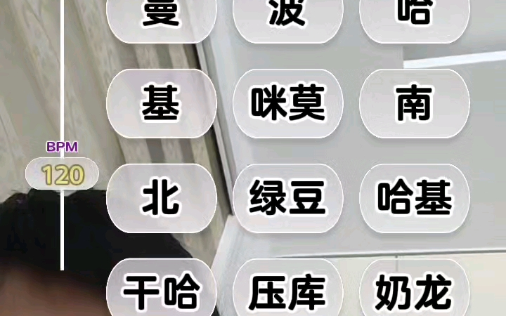 | 127 | 2026-02-24 |
| [“哈基米有巨物恐惧症”](https://www.bilibili.com/video/BV1JMfqBUExC) |  | 4.9万 | 2026-02-24 |
| [关于哈气以来基米的若干历史事件的盘点【哈基往事】](https://www.bilibili.com/video/BV1zrfyBuEZa) |  | 2972 | 2026-02-24 |
| [啊，是关中VAN♂来了](https://www.bilibili.com/video/BV1Dzf1B8Ety) |  | 13.7万 | 2026-02-24 |
| [全网最爽大狗大狗叫叫叫](https://www.bilibili.com/video/BV18ofkBnEJb) |  | 14.9万 | 2026-02-24 |
| [火花❤️金鱼在袜子里嬉戏【崩铁AI模拟】](https://www.bilibili.com/video/BV1rWfiBUEM2) |  | 28.1万 | 2026-02-24 |
| [狗：适才相戏耳，别较真嘛！](https://www.bilibili.com/video/BV1VWfzBjEYG) | 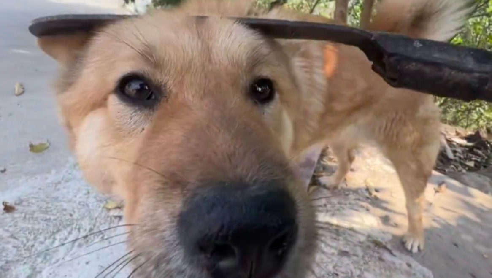 | 103.0万 | 2026-02-23 |
| [《破壁者行动》](https://www.bilibili.com/video/BV1q7fzBnEmW) |  | 58.9万 | 2026-02-23 |
| [100%标准超低音水牛老吴](https://www.bilibili.com/video/BV1pvfcBsEkL) | 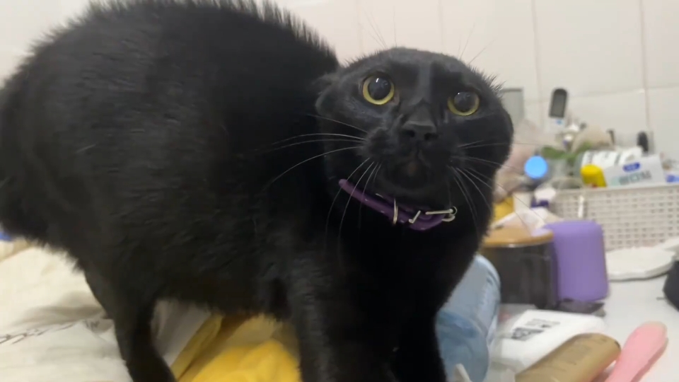 | 9.1万 | 2026-02-22 |
| [梦 中 的 撤 所](https://www.bilibili.com/video/BV192ZoB8E4Y) |  | 6.6万 | 2026-02-22 |
| [⚠️ 你 已 经 激 怒 了 一 头 雄 狮 ⚠️](https://www.bilibili.com/video/BV1wMZdBBE3n) |  | 57.2万 | 2026-02-21 |
| [循环歌单｜《我的刀盾の小曲》比比拉布 我的刀盾-相片纸](https://www.bilibili.com/video/BV1GUf7BSEj1) |  | 216.1万 | 2026-02-21 |
| [我的刀盾和比比拉布入侵，虎哥前来救场](https://www.bilibili.com/video/BV1oMfGBrEVM) |  | 50.6万 | 2026-02-20 |
| [《急急那如律令 辛巴巴巴巴》](https://www.bilibili.com/video/BV1Enf3ByEJs) |  | 43.1万 | 2026-02-20 |
| [【循环歌单】⚡雪地里传来了跑操声⚡](https://www.bilibili.com/video/BV1HcfGB7EML) |  | 944.8万 | 2026-02-20 |
| [循环歌单｜《迷路の小曲》《这是大坝吗の小曲》](https://www.bilibili.com/video/BV1vXZBBCE77) |  | 189.9万 | 2026-02-20 |
| [（咸鱼蛋）哈基哈基哈基哈基米。。🐠](https://www.bilibili.com/video/BV1zsZzBQEqW) |  | 5.4万 | 2026-02-20 |
| [不同倍速下的“拼好梗”(100~0.5）](https://www.bilibili.com/video/BV14oZeBsE1d) | 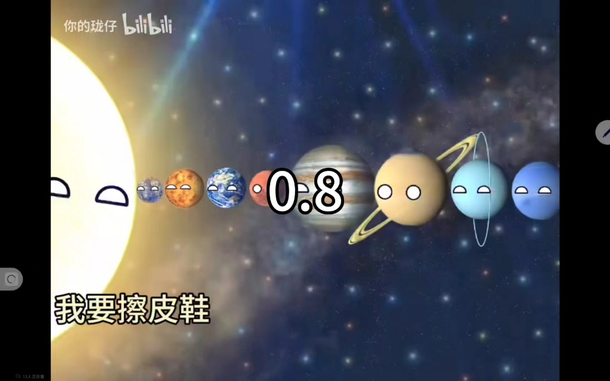 | 2.3万 | 2026-02-19 |
| [【春节基米】谁敢外放听！！！](https://www.bilibili.com/video/BV15mZ1BcE3A) |  | 4.2万 | 2026-02-18 |
| [你听说过coke吗？](https://www.bilibili.com/video/BV1rQZyBBEgc) |  | 92.1万 | 2026-02-17 |
| [喔？飞上火星！【2026春节特辑】](https://www.bilibili.com/video/BV19vZEBWECA) |  | 98.4万 | 2026-02-16 |
| [三角洲玩家认证的专属小曲，每一首都是神一般的存在！](https://www.bilibili.com/video/BV1sfcEzUExd) |  | 73.2万 | 2026-02-16 |
| [和曼波一起回家过年啦](https://www.bilibili.com/video/BV15XFtzDEcK) |  | 238.1万 | 2026-02-15 |
| [⚡️史上最猎奇视频⚡️](https://www.bilibili.com/video/BV1xhZ7BMEQe) |  | 47.0万 | 2026-02-14 |
| [外星人挑战各地“美食”](https://www.bilibili.com/video/BV1U2cqzzELn) |  | 41.3万 | 2026-02-12 |
| [AI制作续集《coke大只切2》](https://www.bilibili.com/video/BV1TBchzQE6K) |  | 443.2万 | 2026-02-12 |
| [⚡️这照片是你吗⚡️](https://www.bilibili.com/video/BV1MgcTzXE9w) |  | 133.1万 | 2026-02-11 |
| [飞舞哈基人被哈基米单杀](https://www.bilibili.com/video/BV1MXFdzsE9i) |  | 9.5万 | 2026-02-11 |
| [《辛 际 穿 越》](https://www.bilibili.com/video/BV1YeFSzVEpu) |  | 96.2万 | 2026-02-10 |
| [小猫生日泪汪汪😭 Papa猫悄悄备惊喜🎉](https://www.bilibili.com/video/BV1oqF2zCEGM) |  | 3.1万 | 2026-02-09 |
| [我早就想这么干了](https://www.bilibili.com/video/BV1aGFxzgE4x) |  | 69.8万 | 2026-02-07 |
| [⚡️120首巴西Funk共3小时精选合集⚡️](https://www.bilibili.com/video/BV1noFBzZEe1) |  | 99.5万 | 2026-02-06 |
| [【Kards】一百年内没有人能理解这个视频💀](https://www.bilibili.com/video/BV1xBFezsE2f) |  | 22.4万 | 2026-02-06 |
| [擦皮鞋](https://www.bilibili.com/video/BV1s9F6zBE74) |  | 54.8万 | 2026-02-06 |
| [张力](https://www.bilibili.com/video/BV1CXF6zuE2B) |  | 161.9万 | 2026-02-06 |
| [手慢无，抓紧了哦！](https://www.bilibili.com/video/BV1W6FazLE5U) |  | 10.5万 | 2026-02-05 |
| [压抑tv#71](https://www.bilibili.com/video/BV1htiQBQEdK) |  | 59.8万 | 2026-01-08 |
| [《费城大道东》“每一次呐喊，都让大道为之震颤”](https://www.bilibili.com/video/BV1N4BcBMEcL) |  | 313.4万 | 2025-12-19 |
| [没想到可以过审](https://www.bilibili.com/video/BV1J9aPzyEvw) |  | 56.6万 | 2025-09-02 |
| [你们敢说我都有点不敢听了！经典高能相声《帽子工厂》｜高清重制版](https://www.bilibili.com/video/BV1uC8TzwE2x) |  | 916.6万 | 2025-07-24 |
| [😻赛飞儿输的苦茶都不剩了😻](https://www.bilibili.com/video/BV1rBKdzxEG3) |  | 16.4万 | 2025-06-26 |
| [【单曲循环】“剥蒜的情谊の小曲”《难得真兄弟》](https://www.bilibili.com/video/BV1USTyzGEe1) |  | 453.8万 | 2025-06-07 |
| [看图猜猫meme声音](https://www.bilibili.com/video/BV1Lz7Yz2EUd) |  | 230.4万 | 2025-06-03 |
| [肥基米](https://www.bilibili.com/video/BV1SXV9zXEot) | 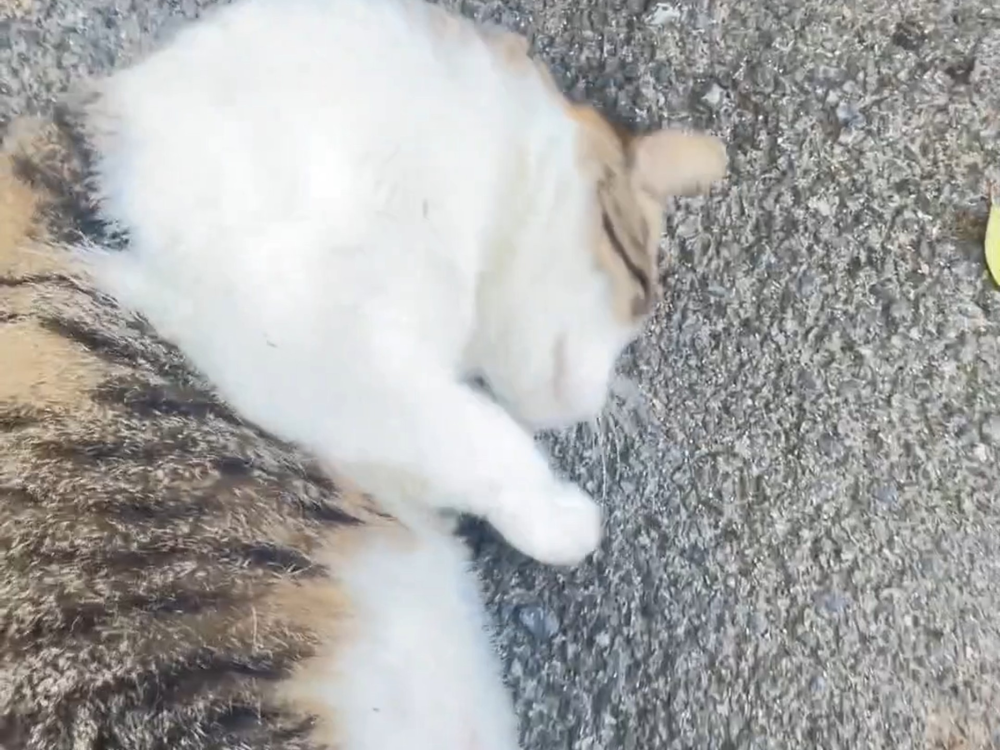 | 94.5万 | 2025-05-10 |
| [猫咪爱听的音乐｜缓解应激/安抚放松/助眠](https://www.bilibili.com/video/BV14EdpYsEjs) | 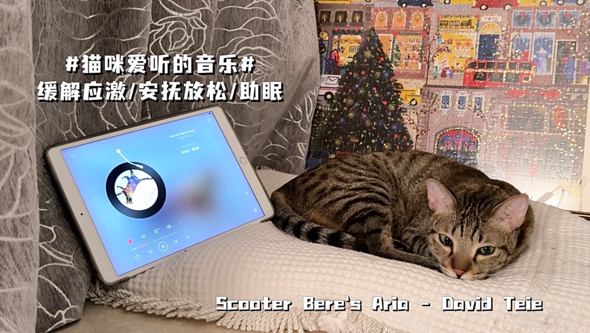 | 18.0万 | 2025-04-08 |
| [99%的猫听了这个音乐都会站立 快看看你家猫什么反应](https://www.bilibili.com/video/BV1n841157Rg) |  | 21.9万 | 2022-12-04 |

---
*最后更新: 2026-03-02 03:09:55 (自动生成)*
*数据来源: [Bilibili](https://www.bilibili.com)*

## 使用说明

运行以下命令更新视频列表:
```bash
python3 fetch_hajimi_videos.py
```
